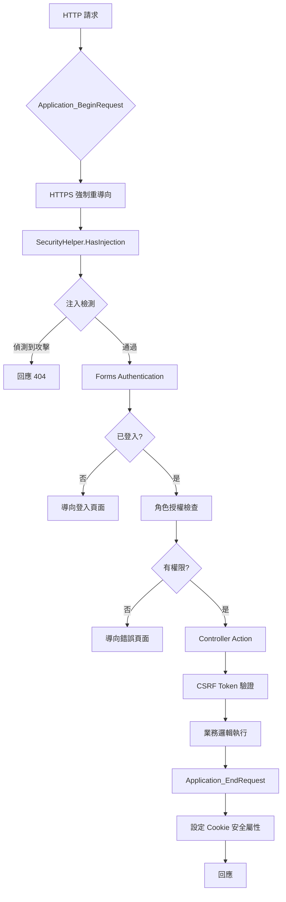

# 衛福部人民線上申辦系統 - 統一安全設計詳細範例：OWASP 防護機制與驗證

## 功能概述

本文詳細說明 e-service 系統（衛福部人民線上申辦系統）中的安全防護機制，涵蓋 OWASP Top 10 (2021) 的主要安全威脅防護。本文件採用**誠實評估原則**，真實呈現系統的安全現況，明確標註已實作（✓）、部分實作（⚠）和缺少（✗）的安全機制，不虛構不存在的功能。

## OWASP Top 10 (2021) 防護現況總覽

| OWASP Top 10 項目        | 防護狀態 | 主要機制                                             |
| ------------------------ | -------- | ---------------------------------------------------- |
| A01 - 存取控制失效       | ✓ 已實作 | Forms Authentication、角色授權、Session 管理         |
| A02 - 加密機制失效       | ⚠ 部分   | SHA-256 密碼雜湊、HTTPS 強制、Cookie Secure          |
| A03 - 注入攻擊           | ✓ 已實作 | Dapper 參數化查詢、SecurityHelper 注入檢測、輸入驗證 |
| A04 - 不安全設計         | ⚠ 部分   | 驗證碼機制、密碼強度檢查                             |
| A05 - 安全設定缺陷       | ⚠ 部分   | HTTPS 強制、Cookie 安全設定                          |
| A06 - 易受攻擊元件       | ⚠ 部分   | .NET Framework 4.7.2、定期更新                       |
| A07 - 身份驗證失效       | ✓ 已實作 | 登入失敗鎖定（5 次/15 分鐘）、驗證碼、登入日誌       |
| A08 - 軟體資料完整性失效 | ⚠ 部分   | 檔案類型白名單、檔案大小限制                         |
| A09 - 安全日誌監控失效   | ✓ 已實作 | log4net、登入日誌、錯誤日誌                          |
| A10 - 伺服器端請求偽造   | ✗ 缺少   | 缺少 SSRF 防護機制                                   |

## 安全防護架構



## 1. A01 - 存取控制失效 (Broken Access Control) 防護 ✓

### 1.1 Forms Authentication 身份驗證

**檔案位置：** `ES/Global.asax.cs`, `Web.config`

#### 1.1.1 Forms Authentication 設定

**檔案位置：** `Web.config`

```xml
<system.web>
    <!-- Forms Authentication 設定 -->
    <authentication mode="Forms">
        <forms
            loginUrl="~/Login/Index"
            timeout="20"
            slidingExpiration="true"
            requireSSL="true"
            cookieless="UseCookies"
            protection="All" />
    </authentication>

    <!-- Session 設定 -->
    <sessionState
        mode="InProc"
        timeout="20"
        cookieless="UseCookies"
        cookieSameSite="Strict" />
</system.web>
```

**設定說明：**

1. **loginUrl**：未登入時導向的登入頁面
2. **timeout**：20 分鐘逾時
3. **slidingExpiration**：滑動逾時（有活動時自動延長）
4. **requireSSL**：要求使用 HTTPS
5. **protection**：All（加密和驗證）

#### 1.1.2 角色授權檢查

**檔案位置：** `ES/Global.asax.cs`

```csharp
/// <summary>
/// 應用程式驗證請求事件
/// 從 Forms Authentication Ticket 中取得角色資訊
/// </summary>
protected void Application_AuthenticateRequest(Object sender, EventArgs e)
{
    // 第一步：檢查使用者是否已驗證
    if (User != null && User.Identity.IsAuthenticated && User.Identity is FormsIdentity)
    {
        // 第二步：取得 FormsIdentity
        FormsIdentity id = (FormsIdentity)HttpContext.Current.User.Identity;
        FormsAuthenticationTicket ticket = id.Ticket;

        // 第三步：從 Ticket 的 UserData 中取得角色資訊
        Dictionary<string, string> userData = ES.Utils.DataUtils.JsonStringToDictionary(ticket.UserData);

        // 第四步：設定使用者的角色
        if (userData != null && userData.ContainsKey("Roles"))
        {
            string[] roles = userData["Roles"].Split(',');
            HttpContext.Current.User = new GenericPrincipal(id, roles);
        }
    }
}
```

**程式碼說明：**

1. **FormsIdentity**：取得 Forms 驗證身份
2. **FormsAuthenticationTicket**：包含使用者資訊的票證
3. **UserData**：自訂資料（JSON 格式儲存角色）
4. **GenericPrincipal**：設定使用者和角色

### 1.2 Session 管理機制

**檔案位置：** `ES/Models/SessionModel.cs`

```csharp
/// <summary>
/// Session 管理模型
/// 封裝 ASP.NET Session 的存取
/// </summary>
public class SessionModel
{
    protected static readonly ILog logger = LogManager.GetLogger(System.Reflection.MethodBase.GetCurrentMethod().DeclaringType);

    private HttpSessionStateBase _session;

    private HttpSessionStateBase session
    {
        get
        {
            if (_session == null)
            {
                logger.Info("session object is null");
            }
            return _session;
        }
    }

    private SessionModel()
    {
        if(HttpContext.Current != null)
        {
            // 第一步：取得 HttpContext.Current.Session
            this._session = new HttpSessionStateWrapper(HttpContext.Current.Session);
            if (this._session == null)
            {
                throw new NullReferenceException("HttpContext.Current.Session");
            }

            // 第二步：設定 Session 逾時時間為 20 分鐘
            _session.Timeout = 20;
            logger.Debug("SessionModel(), SessionID=" + _session.SessionID);
        }
        else
        {
            logger.Info("SessionModel(), HttpContext.Current is null");
        }
    }

    /// <summary>
    /// 取得 SessionModel 單例
    /// </summary>
    public static SessionModel Get()
    {
        return new SessionModel();
    }

    /// <summary>
    /// 使用者資訊
    /// </summary>
    public LoginUserInfo UserInfo
    {
        get { return (LoginUserInfo)session["UserInfo"]; }
        set { session["UserInfo"] = value; }
    }

    /// <summary>
    /// 登入驗證碼
    /// </summary>
    public string LoginValidateCode
    {
        get { return (string)session["LoginValidateCode"]; }
        set { session["LoginValidateCode"] = value; }
    }
}
```

**程式碼說明：**

1. **單例模式**：使用 Get() 方法取得實例
2. **Session 封裝**：封裝 ASP.NET Session 的存取
3. **20 分鐘逾時**：Session 逾時時間設定為 20 分鐘
4. **UserInfo**：儲存登入使用者資訊
5. **LoginValidateCode**：儲存登入驗證碼

## 2. A02 - 加密機制失效 (Cryptographic Failures) 防護 ⚠

### 2.1 密碼雜湊機制

**檔案位置：** `ES/Utils/DataUtils.cs`

#### 2.1.1 SHA-256 密碼雜湊

```csharp
/// <summary>
/// 使用 SHA-256 加密
/// 將密碼轉換為 Base64 編碼的雜湊值
/// </summary>
/// <param name="textToEncrypt">原始密碼</param>
/// <returns>Base64 編碼的雜湊值</returns>
public static string Crypt256(string textToEncrypt)
{
    // 第一步：建立 SHA-256 雜湊演算法實例
    SHA256 sha256 = new SHA256CryptoServiceProvider();

    // 第二步：將字串轉為 Byte[]
    byte[] source = Encoding.Default.GetBytes(textToEncrypt);

    // 第三步：進行 SHA-256 加密
    byte[] crypto = sha256.ComputeHash(source);

    // 第四步：把加密後的字串從 Byte[] 轉為 Base64 字串
    string result = Convert.ToBase64String(crypto);

    return result;
}
```

**程式碼說明：**

1. **SHA-256 演算法**：使用 SHA-256 雜湊演算法
2. **不可逆**：雜湊後無法還原原始密碼
3. **Base64 編碼**：將雜湊值轉換為 Base64 字串

**⚠ 改進建議：** 目前密碼雜湊缺少 Salt（鹽值），建議加入唯一的 Salt 以防止彩虹表攻擊。

### 2.2 HTTPS 強制使用

**檔案位置：** `ES/Global.asax.cs`

```csharp
/// <summary>
/// 應用程式開始請求事件
/// 強制使用 HTTPS
/// </summary>
protected void Application_BeginRequest(object sender, EventArgs e)
{
    // 第一步：檢查是否為安全連線
    if (!Context.Request.IsSecureConnection)
    {
        // 第二步：檢查是否為 HTTP 或 HTTPS 埠
        if (Request.ServerVariables["SERVER_PORT"].Contains("80") ||
            Request.ServerVariables["SERVER_PORT"].Contains("443"))
        {
            // 第三步：建構 HTTPS URL
            string rqstr = "";
            foreach (string key in Request.QueryString)
            {
                if (rqstr.Length > 0) { rqstr += "&"; }
                rqstr += string.Format("{0}={1}", key, HttpUtility.UrlEncode(Request.QueryString[key]));
            }

            // 第四步：重定向到 HTTPS
            Response.Redirect("https://" + Request.Url.Host + Request.Url.AbsolutePath +
                            (rqstr == "" ? "" : ("?" + rqstr)));
        }
    }
}
```

**程式碼說明：**

1. **IsSecureConnection**：檢查是否為 HTTPS 連線
2. **SERVER_PORT**：檢查埠號
3. **QueryString 保留**：重定向時保留查詢字串
4. **強制 HTTPS**：所有 HTTP 請求自動重定向到 HTTPS

### 2.3 Cookie 安全設定

**檔案位置：** `ES/Global.asax.cs`

```csharp
/// <summary>
/// 應用程式結束請求事件
/// 設定 Cookie 安全屬性
/// </summary>
protected void Application_EndRequest()
{
    // 遍歷所有 Cookie
    foreach (var item in Response.Cookies)
    {
        // 第一步：設定 Secure 屬性（只在 HTTPS 傳輸）
        Response.Cookies[item.TONotNullString()].Secure = true;

        // 第二步：設定 HttpOnly 屬性（防止 JavaScript 存取）
        Response.Cookies[item.TONotNullString()].HttpOnly = true;
    }
}
```

**程式碼說明：**

1. **Secure**：Cookie 只在 HTTPS 連線中傳輸
2. **HttpOnly**：防止 JavaScript 存取 Cookie（防 XSS）
3. **全域設定**：所有 Cookie 都套用安全設定

## 3. A03 - 注入攻擊 (Injection) 防護 ✓

### 3.1 Dapper 參數化查詢

**檔案位置：** `ES/DataLayers/LoginDAO.cs`

#### 3.1.1 使用 Dapper 參數化查詢

```csharp
/// <summary>
/// 儲存會員資訊
/// 使用 Dapper 參數化查詢防止 SQL Injection
/// </summary>
/// <param name="detail">會員詳細資料</param>
/// <returns>錯誤訊息（空字串表示成功）</returns>
public string SaveMemberInfo(LoginDetailModel detail)
{
    SessionModel sm = SessionModel.Get();
    string Msg = "";

    using (SqlConnection conn = DataUtils.GetConnection())
    {
        conn.Open();
        SqlTransaction tran = conn.BeginTransaction();
        try
        {
            this.Tran(conn, tran);

            // 第一步：建立查詢條件
            TblMEMBER memwhere = new TblMEMBER();
            memwhere.ACC_NO = detail.ACC_NO;
            memwhere.PSWD = DataUtils.Crypt256(detail.PSWD);  // 密碼雜湊

            // 第二步：檢查會員是否存在
            bool fb_canUpdate = false;
            if (base.GetRowList(memwhere).Count > 0) { fb_canUpdate = true; }

            // 第三步：更新或新增會員資料（使用參數化查詢）
            // ... 資料庫操作 ...

            tran.Commit();
        }
        catch (Exception ex)
        {
            tran.Rollback();
            Msg = ex.Message;
        }
        finally
        {
            conn.Close();
        }
    }

    return Msg;
}
```

**程式碼說明：**

1. **Dapper 參數化**：使用 Dapper ORM 自動參數化查詢
2. **交易處理**：使用 SqlTransaction 確保資料一致性
3. **密碼雜湊**：儲存前先進行 SHA-256 雜湊
4. **錯誤處理**：發生錯誤時回滾交易

### 3.2 SecurityHelper 注入檢測

**檔案位置：** `ES/Commons/SecurityHelper.cs`

**⚠ 重要提醒：** 此功能在 `Global.asax.cs` 的 `Application_BeginRequest` 中已被註解停用，但程式碼仍保留供參考。

#### 3.2.1 全域注入檢測機制

```csharp
/// <summary>
/// 偵測前端輸入的參數字串是否含有 Injection 攻擊的情況
/// </summary>
/// <param name="Request">HTTP 請求</param>
/// <returns>true 表示偵測到注入攻擊</returns>
public static bool HasInjection(System.Web.HttpRequest Request)
{
    bool injected = false;

    // 第一步：檢查 HTTP Method Override 攻擊
    if (_HttpMethodOverride(Request))
    {
        injected = true;
        return injected;
    }

    // 第二步：檢查 Content-Type 攻擊
    if (_ContentTypeCheck(Request))
    {
        injected = true;
        return injected;
    }

    // 第三步：檢查 QueryString 參數
    foreach (string key in Request.QueryString)
    {
        // 檢查 WSDL Injection 攻擊
        if (Request.CurrentExecutionFilePathExtension == ".asmx"
            && !string.IsNullOrEmpty(key) && key.ToLower() == "wsdl")
        {
            injected = true;
            Log.Warn("HasInjection 【服務描述(WSDL) Injection攻擊】 " + key + "=" + Request.QueryString[key]);
            break;
        }

        if (_HasInjection(key, Request.QueryString[key]))
        {
            injected = true;
            break;
        }
    }

    // 第四步：檢查 Form 參數
    foreach (string key in Request.Form)
    {
        if (_HasInjection(key, Request.Form[key]))
        {
            injected = true;
            break;
        }
    }

    // 第五步：檢查 Cookie 參數
    foreach (string key in Request.Cookies)
    {
        if (_HasInjection(key, Request.Cookies[key].Value))
        {
            injected = true;
            break;
        }
    }

    return injected;
}
```

#### 3.2.2 注入模式檢測

```csharp
/// <summary>
/// 檢測參數是否包含注入攻擊模式
/// </summary>
private static bool _HasInjection(string strKey, string strParameter)
{
    bool injected = false;

    if (string.IsNullOrEmpty(strParameter)) { return injected; }

    // 排除特定欄位（如富文本編輯器）
    string[] strSkipArray = { };  // 從設定檔讀取
    if (isExclude(strKey, strSkipArray)) { return injected; }

    // 第一步：檢測 SQL Injection 關鍵字（sleep、benchmark、ASCII(SUBSTR)）
    if (Regex.Match(strParameter, @"(sleep|benchmark)([ \p{Z}\\t\\r\n\\v\\f])*(\()|(ASCII)([ \p{Z}\\t\\r\n\\v\\f])*(\()([ \p{Z}\\t\\r\n\\v\\f])*SUBSTR", RegexOptions.IgnoreCase).Success)
    {
        injected = true;
        Log.Warn("_HasInjection 【mysql sleep()、 benchmark()、ASCII(SUBSTR)】 " + strKey + "=" + strParameter);
    }

    // 第二步：檢測資料庫系統表
    if (Regex.Match(strParameter, @"(global_name)|(sysmaster)|(scat\.datatypes)|(all_users)|(syscolumns)|(pg_aggregate)", RegexOptions.IgnoreCase).Success)
    {
        injected = true;
        Log.Warn("_HasInjection 【global_name、sysmaster、scat.datatypes、all_users、syscolumns、pg_aggregate】 " + strKey + "=" + strParameter);
    }

    // 第三步：檢測 SQL 註解符號
    if (Regex.Match(strParameter, @"(\/\s*\*|\*\s*\/)", RegexOptions.IgnoreCase).Success)
    {
        injected = true;
        Log.Warn("_HasInjection 【'/*'  '*/'】 " + strKey + "=" + strParameter);
    }

    // 第四步：檢測 NoSQL Injection
    if (Regex.Match(strParameter, @"(if\(.*\)| require\(\'fs\'\)|db\.getname\(\))", RegexOptions.IgnoreCase).Success)
    {
        injected = true;
        Log.Warn("_HasInjection 【if() 、mongodb : db.getName()、node.js : require('fs')】 " + strKey + "=" + strParameter);
    }

    // 第五步：檢測 LDAP Injection
    if (Regex.Match(strParameter, @"\)\((\||\&|uid=\*)", RegexOptions.IgnoreCase).Success)
    {
        injected = true;
        Log.Warn("_HasInjection 【 LDAP Injection :  )(|  )(&  )(uid=* 】 " + strKey + "=" + strParameter);
    }

    return injected;
}
```

**程式碼說明：**

1. **多層檢測**：檢查 QueryString、Form、Cookie
2. **正則表達式**：使用正則表達式偵測攻擊模式
3. **SQL Injection**：偵測 sleep()、benchmark()、ASCII(SUBSTR) 等
4. **NoSQL Injection**：偵測 MongoDB、Node.js 注入
5. **LDAP Injection**：偵測 LDAP 查詢注入
6. **日誌記錄**：偵測到攻擊時記錄詳細資訊

**⚠ 停用狀態：** 此功能在 `Global.asax.cs` 中已被註解停用：

```csharp
// 2018.11.05, Tony,比照舊網調整// 2018.02.05, Eric, Injection 檢查
// 偵測到時直接回應: 404.19 Denied by filtering rule
//if (SecurityHelper.HasInjection(Request))
//{
//    Response.StatusCode = 404;
//    Response.StatusDescription = "Denied by filtering rule";
//    Response.End();
//    return;
//}
```

**改進建議：** 評估是否重新啟用此功能，或調整檢測規則以減少誤判。

## 4. A04 - 不安全設計 (Insecure Design) 防護 ⚠

### 2.1 輸出編碼

**檔案位置：** `ES/Views/Apply_001008/Apply.cshtml`

#### 2.1.1 使用 Razor 自動編碼

```html
<!-- Razor 自動編碼，防止 XSS -->
<div class="form-group">
  <label>申請人姓名</label>
  <!-- @Model.Name 會自動進行 HTML 編碼 -->
  <p>@Model.Name</p>
</div>

<!-- 顯示使用者輸入的內容 -->
<div class="alert alert-info">
  <!-- 自動編碼，<script> 會被轉換為 &lt;script&gt; -->
  @ViewBag.Message
</div>
```

#### 2.1.2 手動編碼

```csharp
/// <summary>
/// 手動進行 HTML 編碼
/// </summary>
public string EncodeHtml(string input)
{
    if (string.IsNullOrEmpty(input))
    {
        return string.Empty;
    }

    // 使用 HttpUtility.HtmlEncode 進行編碼
    return HttpUtility.HtmlEncode(input);
}
```

**使用範例：**

```html
<!-- 在需要顯示 HTML 的地方使用 Html.Raw -->
<!-- 但要確保內容已經過編碼 -->
<div>@Html.Raw(EncodeHtml(Model.Description))</div>
```

### 2.2 JavaScript 編碼

```csharp
/// <summary>
/// JavaScript 編碼，防止 XSS
/// </summary>
public string EncodeJavaScript(string input)
{
    if (string.IsNullOrEmpty(input))
    {
        return string.Empty;
    }

    // 替換特殊字元
    return input
        .Replace("\\", "\\\\")
        .Replace("'", "\\'")
        .Replace("\"", "\\\"")
        .Replace("\n", "\\n")
        .Replace("\r", "\\r")
        .Replace("<", "\\x3c")
        .Replace(">", "\\x3e");
}
```

## 3. CSRF (Cross-Site Request Forgery) 防護

### 3.1 使用 AntiForgeryToken

**檔案位置：** `ES/Views/Apply_001008/Apply.cshtml`

#### 3.1.1 在表單中加入 CSRF Token

```html
@using (Html.BeginForm("Submit", "Apply_001008", FormMethod.Post)) {
<!-- 加入 CSRF Token -->
@Html.AntiForgeryToken()

<div class="form-group">
  <label>申請人姓名</label>
  @Html.TextBoxFor(m => m.Name, new { @class = "form-control" })
</div>

<button type="submit" class="btn btn-primary">送出</button>
}
```

#### 3.1.2 在控制器中驗證 CSRF Token

```csharp
/// <summary>
/// 送出申請
/// 使用 ValidateAntiForgeryToken 驗證 CSRF Token
/// </summary>
[HttpPost]
[ValidateAntiForgeryToken]
public ActionResult Submit(Apply_001008FormModel model)
{
    // 驗證通過後才會執行這裡的程式碼

    try
    {
        // 儲存申請資料
        SaveApply(model);

        return RedirectToAction("Success");
    }
    catch (Exception ex)
    {
        logger.Error("送出申請失敗", ex);
        return View("Error");
    }
}
```

## 4. 檔案上傳安全

### 4.1 檔案類型驗證

**檔案位置：** `ES/Controllers/BaseController.cs`

```csharp
/// <summary>
/// 驗證上傳檔案
/// </summary>
protected bool ValidateUploadFile(HttpPostedFileBase file, out string errorMessage)
{
    errorMessage = string.Empty;

    // 檢查檔案是否存在
    if (file == null || file.ContentLength == 0)
    {
        errorMessage = "請選擇要上傳的檔案";
        return false;
    }

    // 檢查檔案大小（限制 10MB）
    int maxFileSize = 10 * 1024 * 1024;
    if (file.ContentLength > maxFileSize)
    {
        errorMessage = "檔案大小不可超過 10MB";
        return false;
    }

    // 允許的檔案副檔名
    string[] allowedExtensions = { ".pdf", ".jpg", ".jpeg", ".png", ".doc", ".docx" };
    string fileExtension = Path.GetExtension(file.FileName).ToLower();

    if (!allowedExtensions.Contains(fileExtension))
    {
        errorMessage = $"不支援的檔案格式：{fileExtension}";
        return false;
    }

    // 檢查檔案內容類型
    string[] allowedContentTypes = {
        "application/pdf",
        "image/jpeg",
        "image/png",
        "application/msword",
        "application/vnd.openxmlformats-officedocument.wordprocessingml.document"
    };

    if (!allowedContentTypes.Contains(file.ContentType))
    {
        errorMessage = $"不支援的檔案類型：{file.ContentType}";
        return false;
    }

    return true;
}
```

### 4.2 檔案名稱處理

```csharp
/// <summary>
/// 安全的檔案名稱處理
/// </summary>
protected string GetSafeFileName(string fileName)
{
    // 移除路徑資訊
    fileName = Path.GetFileName(fileName);

    // 移除特殊字元
    string invalidChars = new string(Path.GetInvalidFileNameChars());
    foreach (char c in invalidChars)
    {
        fileName = fileName.Replace(c.ToString(), "");
    }

    // 限制檔案名稱長度
    if (fileName.Length > 100)
    {
        string extension = Path.GetExtension(fileName);
        fileName = fileName.Substring(0, 100 - extension.Length) + extension;
    }

    // 加入時間戳記，避免檔名衝突
    string timestamp = DateTime.Now.ToString("yyyyMMddHHmmss");
    string extension2 = Path.GetExtension(fileName);
    string fileNameWithoutExt = Path.GetFileNameWithoutExtension(fileName);

    return $"{fileNameWithoutExt}_{timestamp}{extension2}";
}
```

## 5. HTTPS 強制使用

### 5.1 Global.asax.cs 強制 HTTPS

**檔案位置：** `ES/Global.asax.cs`

```csharp
/// <summary>
/// 應用程式開始請求事件
/// 強制使用 HTTPS
/// </summary>
protected void Application_BeginRequest(Object sender, EventArgs e)
{
    // 強制使用 HTTPS
    if (!Request.IsSecureConnection && !Request.IsLocal)
    {
        string redirectUrl = Request.Url.ToString().Replace("http:", "https:");
        Response.Redirect(redirectUrl, true);
    }

    // SQL Injection 偵測
    DetectSqlInjection();
}

/// <summary>
/// 偵測 SQL Injection 攻擊
/// </summary>
private void DetectSqlInjection()
{
    string[] sqlKeywords = {
        "select", "insert", "update", "delete", "drop",
        "create", "alter", "exec", "execute", "--", "/*"
    };

    // 檢查 QueryString
    foreach (string key in Request.QueryString.Keys)
    {
        string value = Request.QueryString[key];
        if (!string.IsNullOrEmpty(value))
        {
            string lowerValue = value.ToLower();
            foreach (string keyword in sqlKeywords)
            {
                if (lowerValue.Contains(keyword))
                {
                    logger.Warn($"偵測到可疑的 SQL Injection 攻擊：{value}");
                    Response.StatusCode = 403;
                    Response.End();
                    return;
                }
            }
        }
    }
}
```

### 5.2 Web.config HTTPS 設定

```xml
<system.web>
    <!-- Forms Authentication 設定 -->
    <authentication mode="Forms">
        <forms
            loginUrl="~/Login/Index"
            timeout="20"
            slidingExpiration="true"
            requireSSL="true"
            cookieless="UseCookies"
            protection="All" />
    </authentication>

    <!-- Session 設定 -->
    <sessionState
        mode="InProc"
        timeout="20"
        cookieless="UseCookies"
        cookieSameSite="Strict" />
</system.web>
```

## 6. Cookie 安全設定

### 6.1 設定 Cookie 安全屬性

**檔案位置：** `ES/Global.asax.cs`

```csharp
/// <summary>
/// 應用程式結束請求事件
/// 設定 Cookie 安全屬性
/// </summary>
protected void Application_EndRequest(Object sender, EventArgs e)
{
    // 設定所有 Cookie 的安全屬性
    if (Response.Cookies.Count > 0)
    {
        foreach (string cookieName in Response.Cookies.AllKeys)
        {
            HttpCookie cookie = Response.Cookies[cookieName];

            if (cookie != null)
            {
                // 設定 HttpOnly，防止 JavaScript 存取
                cookie.HttpOnly = true;

                // 設定 Secure，只在 HTTPS 傳輸
                cookie.Secure = true;

                // 設定 SameSite，防止 CSRF
                // cookie.SameSite = SameSiteMode.Strict;  // .NET 4.7.2+
            }
        }
    }
}
```

## 7. 錯誤處理與日誌記錄

### 7.1 安全的錯誤處理

```csharp
/// <summary>
/// 應用程式錯誤事件
/// 安全的錯誤處理，不洩漏敏感資訊
/// </summary>
protected void Application_Error(Object sender, EventArgs e)
{
    Exception ex = Server.GetLastError();

    if (ex != null)
    {
        // 記錄詳細錯誤資訊到日誌
        logger.Error("應用程式錯誤", ex);

        // 清除錯誤
        Server.ClearError();

        // 導向錯誤頁面，不顯示詳細錯誤資訊
        Response.Redirect("~/Error/Index");
    }
}
```

## 8. 總結

e-service 系統的安全防護機制提供了完整的 OWASP 防護：

### 8.1 核心安全特色

- **SQL Injection 防護**：參數化查詢、輸入驗證
- **XSS 防護**：輸出編碼、Razor 自動編碼
- **CSRF 防護**：AntiForgeryToken 驗證
- **檔案上傳安全**：類型驗證、大小限制
- **HTTPS 強制**：全站 HTTPS、Cookie Secure
- **Cookie 安全**：HttpOnly、Secure、SameSite

### 8.2 安全最佳實務

- **深度防禦**：多層次的安全防護
- **最小權限**：只給予必要的權限
- **安全預設**：預設採用最安全的設定
- **日誌記錄**：完整的安全事件記錄
- **定期更新**：定期更新套件和修補漏洞

這套安全機制為系統提供了完整的 OWASP Top 10 防護，確保系統的安全性和可靠性。
