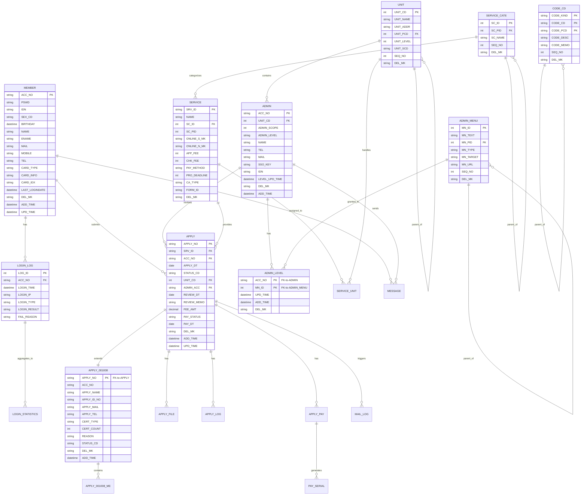
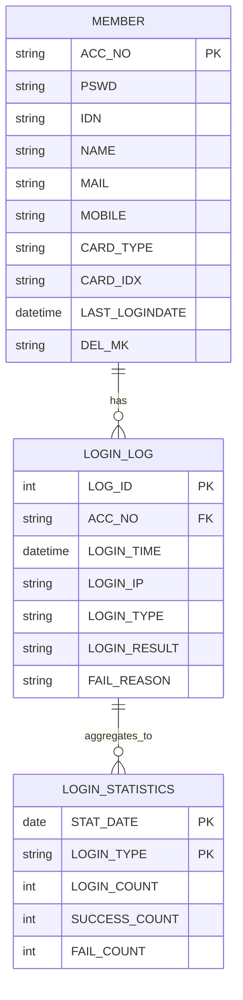
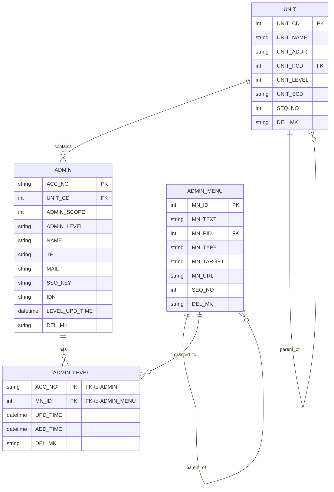
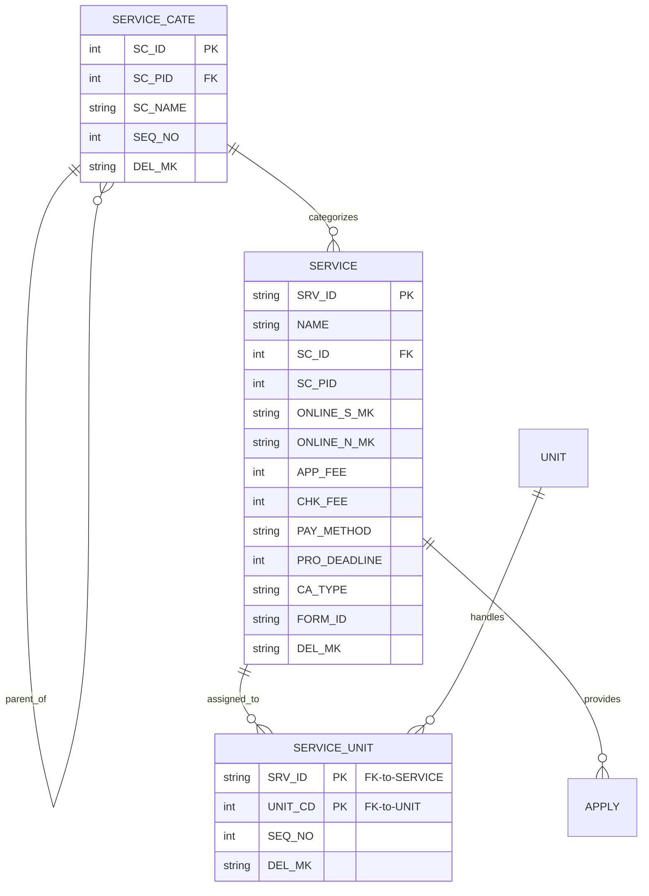
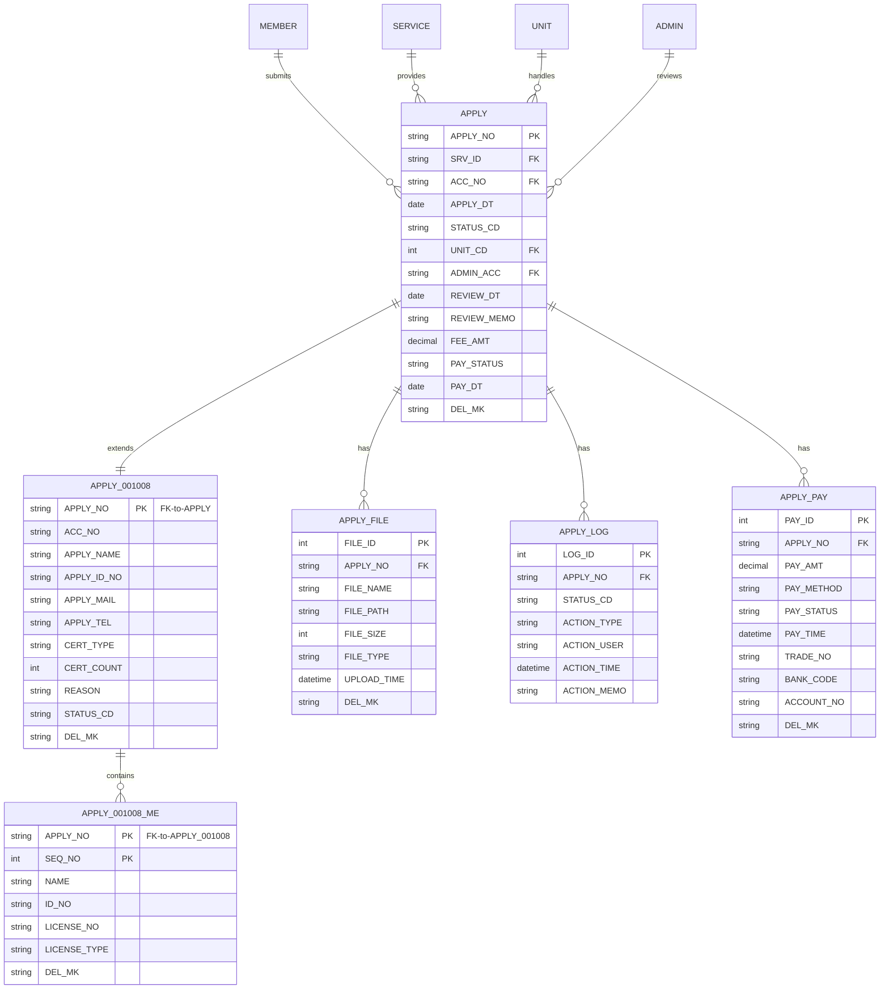
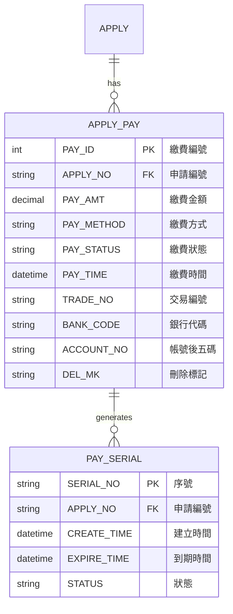
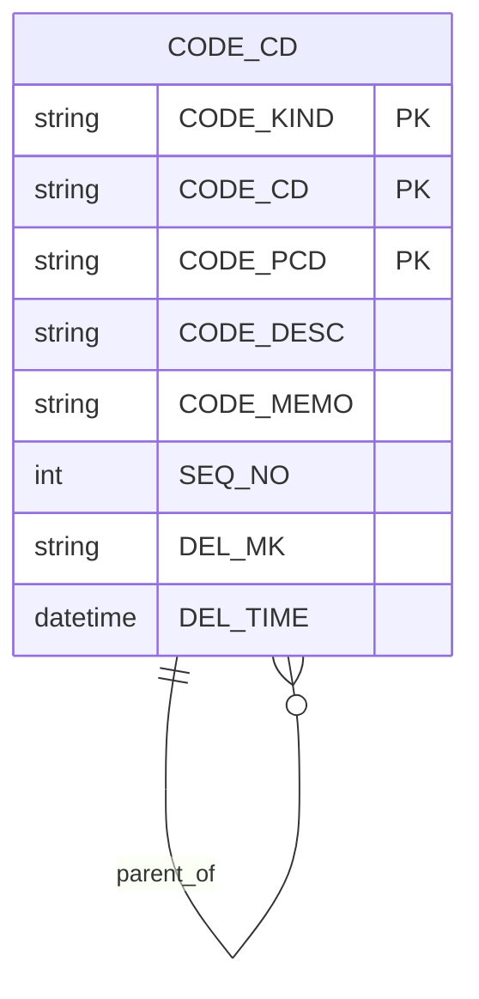
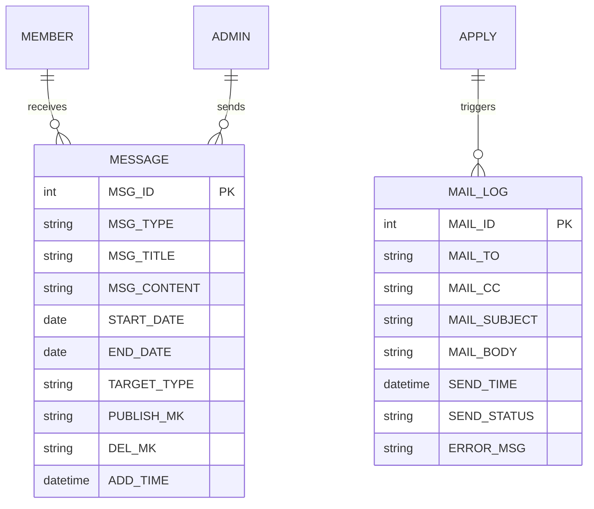

# 衛福部人民線上申辦系統 - 資料庫架構與 CRUD 操作詳細範例

## 功能概述

本文詳細說明 e-service 系統的資料庫架構設計，包含主要資料表結構、關聯關係、索引設計，以及使用 Dapper 和 Direct SQL 進行 CRUD 操作的完整範例。

## 資料庫架構概覽

```
資料庫架構：

會員系統
├─ MEMBER (會員主檔)
└─ LOGIN_LOG (登入記錄)

申請系統
├─ APPLY (申請主檔)
├─ APPLY_001008 (醫事人員英文證明書)
├─ APPLY_001008_ME (醫事人員明細)
├─ APPLY_FILE (附件檔案)
└─ APPLY_LOG (申請歷程)

服務系統
├─ SERVICE (服務項目)
├─ SERVICE_CATE (服務分類)
└─ SERVICE_UNIT (服務單位)

管理系統
├─ ADMIN (管理者)
├─ ADMIN_MENU (選單)
├─ ADMIN_LEVEL (權限)
└─ UNIT (單位)

代碼系統
└─ CODE_CD (統一代碼)

系統設定
└─ SETUP (系統參數)
```

## 1. 主要資料表結構

### 1.1 會員系統資料表

#### 1.1.1 MEMBER 會員主檔

**用途：** 儲存會員基本資料、帳號資訊、憑證資訊

**檔案位置：** `ES/Models/Entities/MEMBER.cs`

| 欄位名稱       | 資料型別      | 說明           | 備註             |
| -------------- | ------------- | -------------- | ---------------- |
| ACC_NO         | NVARCHAR(50)  | 帳號（主鍵）   | 唯一識別碼       |
| PSWD           | NVARCHAR(100) | 密碼           | 加密儲存         |
| IDN            | NVARCHAR(20)  | 身分證字號     |                  |
| SEX_CD         | NVARCHAR(1)   | 性別代碼       | M:男 F:女        |
| BIRTHDAY       | DATETIME      | 生日           |                  |
| NAME           | NVARCHAR(100) | 中文姓名       |                  |
| ENAME          | NVARCHAR(100) | 英文姓名       |                  |
| CNT_NAME       | NVARCHAR(100) | 聯絡人中文姓名 |                  |
| CNT_ENAME      | NVARCHAR(100) | 聯絡人英文姓名 |                  |
| CHR_NAME       | NVARCHAR(100) | 負責人中文姓名 |                  |
| CHR_ENAME      | NVARCHAR(100) | 負責人英文姓名 |                  |
| TEL            | NVARCHAR(20)  | 電話           |                  |
| FAX            | NVARCHAR(20)  | 傳真           |                  |
| CNT_TEL        | NVARCHAR(20)  | 聯絡電話       |                  |
| MOBILE         | NVARCHAR(20)  | 手機           |                  |
| MAIL           | NVARCHAR(100) | 電子郵件       |                  |
| CITY_CD        | NVARCHAR(10)  | 縣市代碼       |                  |
| TOWN_CD        | NVARCHAR(10)  | 鄉鎮市區代碼   |                  |
| ADDR           | NVARCHAR(200) | 地址           |                  |
| EADDR          | NVARCHAR(200) | 英文地址       |                  |
| MEDICO         | NVARCHAR(50)  | 醫事機構代碼   |                  |
| MAIL_MK        | NVARCHAR(1)   | 郵件訂閱標記   | Y:訂閱 N:不訂閱  |
| CARD_TYPE      | NVARCHAR(10)  | 憑證類型       | MOICA/MOEACA/HCA |
| CARD_INFO      | NVARCHAR(500) | 憑證資訊       | JSON 格式        |
| CARD_IDX       | NVARCHAR(100) | 憑證索引       |                  |
| SERIALNO       | NVARCHAR(50)  | 序號           |                  |
| LAST_LOGINDATE | DATETIME      | 最後登入時間   |                  |
| ONAME          | NVARCHAR(100) | 機構名稱       |                  |
| DEL_MK         | NVARCHAR(1)   | 刪除標記       | N:正常 Y:已刪除  |
| DEL_TIME       | DATETIME      | 刪除時間       |                  |
| DEL_FUN_CD     | NVARCHAR(20)  | 刪除功能代碼   |                  |
| DEL_ACC        | NVARCHAR(50)  | 刪除帳號       |                  |
| UPD_TIME       | DATETIME      | 更新時間       |                  |
| UPD_FUN_CD     | NVARCHAR(20)  | 更新功能代碼   |                  |
| UPD_ACC        | NVARCHAR(50)  | 更新帳號       |                  |
| ADD_TIME       | DATETIME      | 新增時間       |                  |
| ADD_FUN_CD     | NVARCHAR(20)  | 新增功能代碼   |                  |
| ADD_ACC        | NVARCHAR(50)  | 新增帳號       |                  |

**索引設計：**

- PRIMARY KEY: ACC_NO
- INDEX: IDN (身分證字號查詢)
- INDEX: MAIL (電子郵件查詢)
- INDEX: CARD_IDX (憑證索引查詢)

#### 1.1.2 LOGIN_LOG 登入記錄表

**用途：** 記錄會員登入歷程

| 欄位名稱     | 資料型別      | 說明             | 備註                    |
| ------------ | ------------- | ---------------- | ----------------------- |
| LOG_ID       | INT           | 記錄編號（主鍵） | 自動編號                |
| ACC_NO       | NVARCHAR(50)  | 帳號             | FK to MEMBER            |
| LOGIN_TIME   | DATETIME      | 登入時間         |                         |
| LOGIN_IP     | NVARCHAR(50)  | 登入 IP          |                         |
| LOGIN_TYPE   | NVARCHAR(20)  | 登入類型         | MEMBER/MOICA/MOEACA/HCA |
| LOGIN_RESULT | NVARCHAR(1)   | 登入結果         | S:成功 F:失敗           |
| FAIL_REASON  | NVARCHAR(200) | 失敗原因         |                         |

#### 1.1.3 LOGIN_STATISTICS 登入統計表

**用途：** 統計各種登入方式的使用次數

| 欄位名稱      | 資料型別     | 說明             | 備註 |
| ------------- | ------------ | ---------------- | ---- |
| STAT_DATE     | DATE         | 統計日期（主鍵） |      |
| LOGIN_TYPE    | NVARCHAR(20) | 登入類型（主鍵） |      |
| LOGIN_COUNT   | INT          | 登入次數         |      |
| SUCCESS_COUNT | INT          | 成功次數         |      |
| FAIL_COUNT    | INT          | 失敗次數         |      |

### 1.2 管理系統資料表

#### 1.2.1 ADMIN 管理者主檔

**用途：** 儲存管理者帳號資訊

**檔案位置：** `ES/Models/Entities/ADMIN.cs`

| 欄位名稱       | 資料型別      | 說明         | 備註            |
| -------------- | ------------- | ------------ | --------------- |
| ACC_NO         | NVARCHAR(50)  | 帳號（主鍵） |                 |
| UNIT_CD        | INT           | 單位代碼     | FK to UNIT      |
| ADMIN_SCOPE    | INT           | 管理範圍     | 1:本單位 2:全部 |
| ADMIN_LEVEL    | NVARCHAR(50)  | 管理層級     |                 |
| NAME           | NVARCHAR(100) | 姓名         |                 |
| TEL            | NVARCHAR(20)  | 電話         |                 |
| MAIL           | NVARCHAR(100) | 電子郵件     |                 |
| AD_OU          | NVARCHAR(200) | AD OU 路徑   |                 |
| SSO_KEY        | NVARCHAR(100) | SSO 金鑰     |                 |
| IDN            | NVARCHAR(20)  | 身分證字號   |                 |
| LEVEL_UPD_TIME | DATETIME      | 權限更新時間 |                 |
| DEL_MK         | NVARCHAR(1)   | 刪除標記     |                 |
| DEL_TIME       | DATETIME      | 刪除時間     |                 |
| UPD_TIME       | DATETIME      | 更新時間     |                 |
| ADD_TIME       | DATETIME      | 新增時間     |                 |

#### 1.2.2 ADMIN_MENU 選單主檔

**用途：** 儲存系統選單項目

| 欄位名稱  | 資料型別      | 說明             | 備註           |
| --------- | ------------- | ---------------- | -------------- |
| MN_ID     | INT           | 選單編號（主鍵） |                |
| MN_TEXT   | NVARCHAR(100) | 選單文字         |                |
| MN_PID    | INT           | 父選單編號       | 0:第一層       |
| MN_TYPE   | NVARCHAR(1)   | 選單類型         | F:功能 G:群組  |
| MN_TARGET | NVARCHAR(20)  | 開啟目標         | \_self/\_blank |
| MN_URL    | NVARCHAR(200) | 選單連結         |                |
| SEQ_NO    | INT           | 排序序號         |                |
| DEL_MK    | NVARCHAR(1)   | 刪除標記         |                |

#### 1.2.3 ADMIN_LEVEL 權限主檔

**用途：** 儲存管理者權限設定

| 欄位名稱 | 資料型別     | 說明             | 備註             |
| -------- | ------------ | ---------------- | ---------------- |
| ACC_NO   | NVARCHAR(50) | 帳號（主鍵）     | FK to ADMIN      |
| MN_ID    | INT          | 選單編號（主鍵） | FK to ADMIN_MENU |
| UPD_TIME | DATETIME     | 更新時間         |                  |
| ADD_TIME | DATETIME     | 新增時間         |                  |
| DEL_MK   | NVARCHAR(1)  | 刪除標記         |                  |

#### 1.2.4 UNIT 單位主檔

**用途：** 儲存組織單位資料

**檔案位置：** `ES/Models/Entities/UNIT.cs`

| 欄位名稱   | 資料型別      | 說明             | 備註     |
| ---------- | ------------- | ---------------- | -------- |
| UNIT_CD    | INT           | 單位代碼（主鍵） |          |
| UNIT_NAME  | NVARCHAR(100) | 單位名稱         |          |
| UNIT_ADDR  | NVARCHAR(200) | 單位地址         |          |
| UNIT_PCD   | INT           | 父單位代碼       | 階層結構 |
| UNIT_LEVEL | INT           | 單位層級         |          |
| UNIT_SCD   | NVARCHAR(50)  | 單位簡碼         |          |
| SEQ_NO     | INT           | 排序序號         |          |
| DEL_MK     | NVARCHAR(1)   | 刪除標記         |          |

### 1.3 服務系統資料表

#### 1.3.1 SERVICE 服務項目主檔

**用途：** 儲存線上申辦服務項目

**檔案位置：** `ES/Models/Entities/SERVICE.cs`

| 欄位名稱       | 資料型別      | 說明             | 備註               |
| -------------- | ------------- | ---------------- | ------------------ |
| SRV_ID         | NVARCHAR(10)  | 服務代碼（主鍵） | 例如：001008       |
| NAME           | NVARCHAR(200) | 服務名稱         |                    |
| SC_ID          | INT           | 服務分類代碼     | FK to SERVICE_CATE |
| SC_PID         | INT           | 父分類代碼       |                    |
| ONLINE_S_MK    | NVARCHAR(1)   | 線上申辦標記     | Y/N                |
| ONLINE_N_MK    | NVARCHAR(1)   | 線上查詢標記     | Y/N                |
| DESIGN_FORM_MK | NVARCHAR(1)   | 表單設計標記     | Y/N                |
| DESIGN_FILE_MK | NVARCHAR(1)   | 附件設計標記     | Y/N                |
| PAGE_MAKER_ID  | NVARCHAR(50)  | 頁面製作者       |                    |
| FORM_MAKER_ID  | NVARCHAR(50)  | 表單製作者       |                    |
| FILE_MAKER_ID  | NVARCHAR(50)  | 附件製作者       |                    |
| APP_FEE        | INT           | 申請規費         |                    |
| CHK_FEE        | INT           | 審查規費         |                    |
| SRV_DESC       | NVARCHAR(MAX) | 服務說明         |                    |
| FIX_UNIT_CD    | INT           | 固定承辦單位     |                    |
| PAY_POINT      | NVARCHAR(50)  | 繳費時點         |                    |
| PAY_UNIT       | NVARCHAR(50)  | 繳費單位         |                    |
| PAY_DEADLINE   | INT           | 繳費期限（天）   |                    |
| BASE_NUM       | INT           | 基本數量         |                    |
| FEE_EXTRA      | INT           | 額外規費         |                    |
| PAY_METHOD     | NVARCHAR(50)  | 繳費方式         |                    |
| PRO_DEADLINE   | INT           | 處理期限（天）   |                    |
| CA_TYPE        | NVARCHAR(50)  | 憑證類型         |                    |
| ACCOUNT_NAME   | NVARCHAR(100) | 帳戶名稱         |                    |
| ACCOUNT_CD     | NVARCHAR(50)  | 帳戶代碼         |                    |
| CLS_SUB_CD     | NVARCHAR(50)  | 主題分類代碼     |                    |
| CLS_ADM_CD     | NVARCHAR(50)  | 機關分類代碼     |                    |
| CLS_SRV_CD     | NVARCHAR(50)  | 服務分類代碼     |                    |
| KEYWORD        | NVARCHAR(200) | 關鍵字           |                    |
| SEQ_NO         | INT           | 排序序號         |                    |
| SHARED_MK      | NVARCHAR(1)   | 共用標記         |                    |
| FORM_ID        | NVARCHAR(50)  | 表單編號         |                    |
| REUPD_MK       | NVARCHAR(1)   | 可重新編輯標記   |                    |
| LSTNAME        | NVARCHAR(200) | 清單名稱         |                    |
| DEL_MK         | NVARCHAR(1)   | 刪除標記         |                    |

#### 1.3.2 SERVICE_CATE 服務分類表

**用途：** 儲存服務分類資料

| 欄位名稱 | 資料型別      | 說明             | 備註     |
| -------- | ------------- | ---------------- | -------- |
| SC_ID    | INT           | 分類編號（主鍵） |          |
| SC_PID   | INT           | 父分類編號       | 階層結構 |
| SC_NAME  | NVARCHAR(100) | 分類名稱         |          |
| SEQ_NO   | INT           | 排序序號         |          |
| DEL_MK   | NVARCHAR(1)   | 刪除標記         |          |

#### 1.3.3 SERVICE_UNIT 服務單位對應表

**用途：** 儲存服務項目與承辦單位的對應關係

| 欄位名稱 | 資料型別     | 說明             | 備註          |
| -------- | ------------ | ---------------- | ------------- |
| SRV_ID   | NVARCHAR(10) | 服務代碼（主鍵） | FK to SERVICE |
| UNIT_CD  | INT          | 單位代碼（主鍵） | FK to UNIT    |
| SEQ_NO   | INT          | 排序序號         |               |
| DEL_MK   | NVARCHAR(1)  | 刪除標記         |               |

### 1.4 代碼系統資料表

#### 1.4.1 CODE_CD 統一代碼表

**用途：** 儲存系統所有代碼資料（下拉選單、狀態代碼等）

**檔案位置：** `ES/Models/Entities/CODE_CD.cs`

| 欄位名稱  | 資料型別      | 說明             | 備註                       |
| --------- | ------------- | ---------------- | -------------------------- |
| CODE_KIND | NVARCHAR(20)  | 代碼種類（主鍵） | 例如：APP_STATUS           |
| CODE_CD   | NVARCHAR(20)  | 代碼值（主鍵）   | 例如：D、P、A              |
| CODE_PCD  | NVARCHAR(20)  | 父代碼值（主鍵） | 階層結構，空字串表示第一層 |
| CODE_DESC | NVARCHAR(100) | 代碼說明         | 顯示給使用者的文字         |
| CODE_MEMO | NVARCHAR(500) | 代碼備註         | 額外說明                   |
| SEQ_NO    | INT           | 排序序號         | 控制顯示順序               |
| DEL_MK    | NVARCHAR(1)   | 刪除標記         | N:正常 Y:已刪除            |
| DEL_TIME  | DATETIME      | 刪除時間         |                            |

**索引設計：**

- PRIMARY KEY: (CODE_KIND, CODE_CD, CODE_PCD)
- INDEX: (CODE_KIND, CODE_PCD, SEQ_NO)

**常用代碼種類：**

- APP_STATUS：申請狀態（D:草稿 P:送審 A:核准 R:退件 S:補件 C:撤銷）
- LOGIN_TYPE：登入類型（MEMBER/MOICA/MOEACA/HCA/NEWEID）
- SEX_CD：性別代碼（M:男 F:女）
- CITY_CD：縣市代碼
- TOWN_CD：鄉鎮市區代碼

### 1.5 系統設定資料表

#### 1.5.1 SETUP 系統參數表

**用途：** 儲存系統設定參數

**檔案位置：** `ES/Models/Entities/SETUP.cs`

| 欄位名稱   | 資料型別      | 說明             | 備註 |
| ---------- | ------------- | ---------------- | ---- |
| SETUP_CD   | NVARCHAR(50)  | 參數代碼（主鍵） |      |
| SETUP_DESC | NVARCHAR(200) | 參數說明         |      |
| SETUP_VAL  | NVARCHAR(500) | 參數值           |      |
| DEL_MK     | NVARCHAR(1)   | 刪除標記         |      |
| DEL_TIME   | DATETIME      | 刪除時間         |      |
| UPD_TIME   | DATETIME      | 更新時間         |      |
| ADD_TIME   | DATETIME      | 新增時間         |      |

**常用參數：**

- LOGIN_TIMEOUT：登入逾時時間（分鐘）
- MAIL_SERVER：郵件伺服器位址
- MAIL_PORT：郵件伺服器埠號
- SFTP_HOST：SFTP 主機位址
- SFTP_PORT：SFTP 埠號
- SFTP_USER：SFTP 使用者名稱
- SERVICETEL：客服電話

#### 1.5.2 HOLIDAY 假日表

**用途：** 儲存國定假日資料

| 欄位名稱     | 資料型別      | 說明             | 備註              |
| ------------ | ------------- | ---------------- | ----------------- |
| HOLIDAY_DATE | DATE          | 假日日期（主鍵） |                   |
| HOLIDAY_NAME | NVARCHAR(100) | 假日名稱         |                   |
| HOLIDAY_TYPE | NVARCHAR(1)   | 假日類型         | N:國定假日 W:週末 |
| DEL_MK       | NVARCHAR(1)   | 刪除標記         |                   |

### 1.6 申請系統資料表

#### 1.6.1 APPLY 申請主檔（通用）

**用途：** 儲存所有申請案件的共用欄位

| 欄位名稱    | 資料型別      | 說明             | 備註                  |
| ----------- | ------------- | ---------------- | --------------------- |
| APPLY_NO    | NVARCHAR(20)  | 申請編號（主鍵） | 格式：SRV_ID + 流水號 |
| SRV_ID      | NVARCHAR(10)  | 服務代碼         | FK to SERVICE         |
| ACC_NO      | NVARCHAR(50)  | 申請人帳號       | FK to MEMBER          |
| APPLY_DT    | DATE          | 申請日期         |                       |
| STATUS_CD   | NVARCHAR(1)   | 申請狀態         | D/P/A/R/S/C           |
| UNIT_CD     | INT           | 承辦單位         | FK to UNIT            |
| ADMIN_ACC   | NVARCHAR(50)  | 承辦人員         | FK to ADMIN           |
| REVIEW_DT   | DATE          | 審核日期         |                       |
| REVIEW_MEMO | NVARCHAR(500) | 審核意見         |                       |
| FEE_AMT     | DECIMAL(10,2) | 規費金額         |                       |
| PAY_STATUS  | NVARCHAR(1)   | 繳費狀態         | N:未繳 Y:已繳         |
| PAY_DT      | DATE          | 繳費日期         |                       |
| DEL_MK      | NVARCHAR(1)   | 刪除標記         |                       |
| UPD_TIME    | DATETIME      | 更新時間         |                       |
| ADD_TIME    | DATETIME      | 新增時間         |                       |

**索引設計：**

- PRIMARY KEY: APPLY_NO
- INDEX: (ACC_NO, DEL_MK)
- INDEX: (STATUS_CD, DEL_MK)
- INDEX: (UNIT_CD, STATUS_CD, DEL_MK)
- INDEX: APPLY_DT DESC

#### 1.6.2 APPLY_001008 醫事人員英文證明書申請表

**用途：** 儲存醫事人員英文證明書申請的特定欄位

**檔案位置：** `ES/Models/Entities/Apply_001008Model.cs`

| 欄位名稱    | 資料型別      | 說明             | 備註        |
| ----------- | ------------- | ---------------- | ----------- |
| APPLY_NO    | NVARCHAR(20)  | 申請編號（主鍵） | FK to APPLY |
| ACC_NO      | NVARCHAR(50)  | 申請人帳號       |             |
| APPLY_NAME  | NVARCHAR(100) | 申請人姓名       |             |
| APPLY_ID_NO | NVARCHAR(20)  | 申請人身分證字號 |             |
| APPLY_MAIL  | NVARCHAR(100) | 申請人電子郵件   |             |
| APPLY_TEL   | NVARCHAR(20)  | 申請人電話       |             |
| CERT_TYPE   | NVARCHAR(10)  | 證書類型         |             |
| CERT_COUNT  | INT           | 證書份數         |             |
| REASON      | NVARCHAR(500) | 申請原因         |             |
| STATUS_CD   | NVARCHAR(1)   | 狀態             | D/P/A/R     |
| DEL_MK      | NVARCHAR(1)   | 刪除標記         |             |
| UPD_TIME    | DATETIME      | 更新時間         |             |
| ADD_TIME    | DATETIME      | 新增時間         |             |

#### 1.6.3 APPLY_001008_ME 醫事人員明細表

**用途：** 儲存申請案件中的醫事人員清單

| 欄位名稱     | 資料型別      | 說明             | 備註               |
| ------------ | ------------- | ---------------- | ------------------ |
| APPLY_NO     | NVARCHAR(20)  | 申請編號（主鍵） | FK to APPLY_001008 |
| SEQ_NO       | INT           | 序號（主鍵）     |                    |
| NAME         | NVARCHAR(100) | 姓名             |                    |
| ID_NO        | NVARCHAR(20)  | 身分證字號       |                    |
| LICENSE_NO   | NVARCHAR(50)  | 執照字號         |                    |
| LICENSE_TYPE | NVARCHAR(10)  | 執照類別         |                    |
| DEL_MK       | NVARCHAR(1)   | 刪除標記         |                    |

#### 1.6.4 APPLY_FILE 附件檔案表

**用途：** 儲存申請案件的附件檔案資訊

| 欄位名稱    | 資料型別      | 說明              | 備註        |
| ----------- | ------------- | ----------------- | ----------- |
| FILE_ID     | INT           | 檔案編號（主鍵）  | 自動編號    |
| APPLY_NO    | NVARCHAR(20)  | 申請編號          | FK to APPLY |
| FILE_NAME   | NVARCHAR(200) | 檔案名稱          |             |
| FILE_PATH   | NVARCHAR(500) | 檔案路徑          |             |
| FILE_SIZE   | INT           | 檔案大小（bytes） |             |
| FILE_TYPE   | NVARCHAR(50)  | 檔案類型          | MIME Type   |
| UPLOAD_TIME | DATETIME      | 上傳時間          |             |
| DEL_MK      | NVARCHAR(1)   | 刪除標記          |             |

#### 1.6.5 APPLY_LOG 申請歷程表

**用途：** 記錄申請案件的狀態變更歷程

| 欄位名稱    | 資料型別      | 說明             | 備註                         |
| ----------- | ------------- | ---------------- | ---------------------------- |
| LOG_ID      | INT           | 記錄編號（主鍵） | 自動編號                     |
| APPLY_NO    | NVARCHAR(20)  | 申請編號         | FK to APPLY                  |
| STATUS_CD   | NVARCHAR(1)   | 狀態代碼         |                              |
| ACTION_TYPE | NVARCHAR(20)  | 動作類型         | SUBMIT/REVIEW/APPROVE/REJECT |
| ACTION_USER | NVARCHAR(50)  | 操作人員         |                              |
| ACTION_TIME | DATETIME      | 操作時間         |                              |
| ACTION_MEMO | NVARCHAR(500) | 操作備註         |                              |

### 1.7 繳費系統資料表

#### 1.7.1 APPLY_PAY 繳費記錄表

**用途：** 儲存申請案件的繳費記錄

| 欄位名稱   | 資料型別      | 說明             | 備註                   |
| ---------- | ------------- | ---------------- | ---------------------- |
| PAY_ID     | INT           | 繳費編號（主鍵） | 自動編號               |
| APPLY_NO   | NVARCHAR(20)  | 申請編號         | FK to APPLY            |
| PAY_AMT    | DECIMAL(10,2) | 繳費金額         |                        |
| PAY_METHOD | NVARCHAR(20)  | 繳費方式         | CREDIT/ATM             |
| PAY_STATUS | NVARCHAR(1)   | 繳費狀態         | P:處理中 S:成功 F:失敗 |
| PAY_TIME   | DATETIME      | 繳費時間         |                        |
| TRADE_NO   | NVARCHAR(50)  | 交易編號         |                        |
| BANK_CODE  | NVARCHAR(10)  | 銀行代碼         |                        |
| ACCOUNT_NO | NVARCHAR(20)  | 帳號後五碼       |                        |
| DEL_MK     | NVARCHAR(1)   | 刪除標記         |                        |

#### 1.7.2 PAY_SERIAL 繳費序號表

**用途：** 產生繳費序號

| 欄位名稱    | 資料型別     | 說明         | 備註                   |
| ----------- | ------------ | ------------ | ---------------------- |
| SERIAL_NO   | NVARCHAR(20) | 序號（主鍵） |                        |
| APPLY_NO    | NVARCHAR(20) | 申請編號     | FK to APPLY            |
| CREATE_TIME | DATETIME     | 建立時間     |                        |
| EXPIRE_TIME | DATETIME     | 到期時間     |                        |
| STATUS      | NVARCHAR(1)  | 狀態         | A:有效 E:過期 U:已使用 |

### 1.8 訊息系統資料表

#### 1.8.1 MESSAGE 訊息表

**用途：** 儲存系統訊息（公告、通知）

| 欄位名稱    | 資料型別      | 說明             | 備註             |
| ----------- | ------------- | ---------------- | ---------------- |
| MSG_ID      | INT           | 訊息編號（主鍵） | 自動編號         |
| MSG_TYPE    | NVARCHAR(10)  | 訊息類型         | NOTICE/ALERT     |
| MSG_TITLE   | NVARCHAR(200) | 訊息標題         |                  |
| MSG_CONTENT | NVARCHAR(MAX) | 訊息內容         |                  |
| START_DATE  | DATE          | 開始日期         |                  |
| END_DATE    | DATE          | 結束日期         |                  |
| TARGET_TYPE | NVARCHAR(10)  | 對象類型         | ALL/MEMBER/ADMIN |
| PUBLISH_MK  | NVARCHAR(1)   | 發布標記         | Y/N              |
| DEL_MK      | NVARCHAR(1)   | 刪除標記         |                  |
| ADD_TIME    | DATETIME      | 新增時間         |                  |

#### 1.8.2 MAIL_LOG 郵件記錄表

**用途：** 記錄系統發送的郵件

| 欄位名稱     | 資料型別      | 說明             | 備註          |
| ------------ | ------------- | ---------------- | ------------- |
| MAIL_ID      | INT           | 郵件編號（主鍵） | 自動編號      |
| MAIL_TO      | NVARCHAR(200) | 收件者           |               |
| MAIL_CC      | NVARCHAR(500) | 副本             |               |
| MAIL_SUBJECT | NVARCHAR(200) | 主旨             |               |
| MAIL_BODY    | NVARCHAR(MAX) | 內容             |               |
| SEND_TIME    | DATETIME      | 發送時間         |               |
| SEND_STATUS  | NVARCHAR(1)   | 發送狀態         | S:成功 F:失敗 |
| ERROR_MSG    | NVARCHAR(500) | 錯誤訊息         |               |

## 2. CRUD 操作範例

### 2.1 Create (新增)

#### 2.1.1 使用 Dapper 新增資料

```csharp
/// <summary>
/// 新增申請資料（使用 Dapper）
/// </summary>
public string CreateApply(Apply_001008Model model)
{
    // 產生申請編號
    string applyNo = GenerateApplyNo();

    string sql = @"
        INSERT INTO APPLY (
            APPLY_NO, SRV_ID, ACC_NO, APPLY_DT, STATUS_CD,
            APPLY_NAME, APPLY_ID_NO, APPLY_MAIL, APPLY_TEL,
            FEE_AMT, CRE_TIME, CRE_USER, DEL_MK
        ) VALUES (
            @APPLY_NO, @SRV_ID, @ACC_NO, @APPLY_DT, @STATUS_CD,
            @APPLY_NAME, @APPLY_ID_NO, @APPLY_MAIL, @APPLY_TEL,
            @FEE_AMT, GETDATE(), @CRE_USER, 'N'
        )";

    var parameters = new DynamicParameters();
    parameters.Add("@APPLY_NO", applyNo);
    parameters.Add("@SRV_ID", model.SRV_ID);
    parameters.Add("@ACC_NO", model.ACC_NO);
    parameters.Add("@APPLY_DT", DateTime.Now);
    parameters.Add("@STATUS_CD", model.STATUS_CD);
    parameters.Add("@APPLY_NAME", model.APPLY_NAME);
    parameters.Add("@APPLY_ID_NO", model.APPLY_ID_NO);
    parameters.Add("@APPLY_MAIL", model.APPLY_MAIL);
    parameters.Add("@APPLY_TEL", model.APPLY_TEL);
    parameters.Add("@FEE_AMT", model.FEE_AMT);
    parameters.Add("@CRE_USER", model.ACC_NO);

    using (SqlConnection conn = DataUtils.GetConnection())
    {
        conn.Open();
        conn.Execute(sql, parameters);
        conn.Close();
    }

    return applyNo;
}
```

#### 2.1.2 使用交易新增多筆資料

```csharp
/// <summary>
/// 使用交易新增申請及明細資料
/// </summary>
public void CreateApplyWithDetails(Apply_001008FormModel model)
{
    using (SqlConnection conn = DataUtils.GetConnection())
    {
        conn.Open();
        SqlTransaction tran = conn.BeginTransaction();

        try
        {
            // 新增主檔
            string applyNo = CreateApplyMain(conn, tran, model);

            // 新增明細檔
            CreateApplyDetails(conn, tran, applyNo, model.MeList);

            // 新增附件檔
            CreateApplyFiles(conn, tran, applyNo, model.Files);

            // 提交交易
            tran.Commit();
        }
        catch (Exception ex)
        {
            // 回滾交易
            tran.Rollback();
            logger.Error("新增申請資料失敗", ex);
            throw;
        }
        finally
        {
            conn.Close();
        }
    }
}

private string CreateApplyMain(SqlConnection conn, SqlTransaction tran, Apply_001008FormModel model)
{
    string applyNo = GenerateApplyNo();

    string sql = @"
        INSERT INTO APPLY_001008 (
            APPLY_NO, ACC_NO, APPLY_NAME, APPLY_DT, STATUS_CD,
            CRE_TIME, CRE_USER, DEL_MK
        ) VALUES (
            @APPLY_NO, @ACC_NO, @APPLY_NAME, GETDATE(), @STATUS_CD,
            GETDATE(), @CRE_USER, 'N'
        )";

    SqlCommand cmd = new SqlCommand(sql, conn, tran);
    cmd.Parameters.AddWithValue("@APPLY_NO", applyNo);
    cmd.Parameters.AddWithValue("@ACC_NO", model.ACC_NO);
    cmd.Parameters.AddWithValue("@APPLY_NAME", model.APPLY_NAME);
    cmd.Parameters.AddWithValue("@STATUS_CD", model.STATUS_CD);
    cmd.Parameters.AddWithValue("@CRE_USER", model.ACC_NO);
    cmd.ExecuteNonQuery();

    return applyNo;
}

private void CreateApplyDetails(SqlConnection conn, SqlTransaction tran, string applyNo, List<Apply_001008_MeModel> details)
{
    string sql = @"
        INSERT INTO APPLY_001008_ME (
            APPLY_NO, SEQ_NO, NAME, ID_NO, LICENSE_NO,
            CRE_TIME, CRE_USER, DEL_MK
        ) VALUES (
            @APPLY_NO, @SEQ_NO, @NAME, @ID_NO, @LICENSE_NO,
            GETDATE(), @CRE_USER, 'N'
        )";

    int seqNo = 1;
    foreach (var detail in details)
    {
        SqlCommand cmd = new SqlCommand(sql, conn, tran);
        cmd.Parameters.AddWithValue("@APPLY_NO", applyNo);
        cmd.Parameters.AddWithValue("@SEQ_NO", seqNo++);
        cmd.Parameters.AddWithValue("@NAME", detail.NAME);
        cmd.Parameters.AddWithValue("@ID_NO", detail.ID_NO);
        cmd.Parameters.AddWithValue("@LICENSE_NO", detail.LICENSE_NO);
        cmd.Parameters.AddWithValue("@CRE_USER", detail.CRE_USER);
        cmd.ExecuteNonQuery();
    }
}
```

### 2.2 Read (查詢)

#### 2.2.1 使用 Dapper 查詢單筆資料

```csharp
/// <summary>
/// 查詢單筆申請資料
/// </summary>
public Apply_001008Model GetApply(string applyNo)
{
    string sql = @"
        SELECT *
        FROM APPLY_001008
        WHERE APPLY_NO = @APPLY_NO
          AND DEL_MK = 'N'";

    var parameters = new DynamicParameters();
    parameters.Add("@APPLY_NO", applyNo);

    using (SqlConnection conn = DataUtils.GetConnection())
    {
        conn.Open();
        var result = conn.QueryFirstOrDefault<Apply_001008Model>(sql, parameters);
        conn.Close();
        return result;
    }
}
```

#### 2.2.2 使用 Dapper 查詢多筆資料

```csharp
/// <summary>
/// 查詢申請清單
/// </summary>
public List<Apply_001008Model> GetApplyList(string accNo, string statusCd)
{
    StringBuilder sql = new StringBuilder(@"
        SELECT *
        FROM APPLY_001008
        WHERE DEL_MK = 'N'");

    var parameters = new DynamicParameters();

    if (!string.IsNullOrEmpty(accNo))
    {
        sql.Append(" AND ACC_NO = @ACC_NO");
        parameters.Add("@ACC_NO", accNo);
    }

    if (!string.IsNullOrEmpty(statusCd))
    {
        sql.Append(" AND STATUS_CD = @STATUS_CD");
        parameters.Add("@STATUS_CD", statusCd);
    }

    sql.Append(" ORDER BY APPLY_DT DESC");

    using (SqlConnection conn = DataUtils.GetConnection())
    {
        conn.Open();
        var result = conn.Query<Apply_001008Model>(sql.ToString(), parameters).ToList();
        conn.Close();
        return result;
    }
}
```

#### 2.2.3 查詢主檔及明細檔

```csharp
/// <summary>
/// 查詢申請主檔及明細檔
/// </summary>
public Apply_001008FormModel GetApplyWithDetails(string applyNo)
{
    Apply_001008FormModel result = new Apply_001008FormModel();

    using (SqlConnection conn = DataUtils.GetConnection())
    {
        conn.Open();

        // 查詢主檔
        string mainSql = @"
            SELECT *
            FROM APPLY_001008
            WHERE APPLY_NO = @APPLY_NO
              AND DEL_MK = 'N'";

        var parameters = new DynamicParameters();
        parameters.Add("@APPLY_NO", applyNo);

        result = conn.QueryFirstOrDefault<Apply_001008FormModel>(mainSql, parameters);

        if (result != null)
        {
            // 查詢明細檔
            string detailSql = @"
                SELECT *
                FROM APPLY_001008_ME
                WHERE APPLY_NO = @APPLY_NO
                  AND DEL_MK = 'N'
                ORDER BY SEQ_NO";

            result.MeList = conn.Query<Apply_001008_MeModel>(detailSql, parameters).ToList();
        }

        conn.Close();
    }

    return result;
}
```

### 2.3 Update (更新)

#### 2.3.1 使用 Dapper 更新資料

```csharp
/// <summary>
/// 更新申請狀態
/// </summary>
public void UpdateApplyStatus(string applyNo, string statusCd, string updUser)
{
    string sql = @"
        UPDATE APPLY_001008
        SET STATUS_CD = @STATUS_CD,
            UPD_TIME = GETDATE(),
            UPD_USER = @UPD_USER
        WHERE APPLY_NO = @APPLY_NO
          AND DEL_MK = 'N'";

    var parameters = new DynamicParameters();
    parameters.Add("@APPLY_NO", applyNo);
    parameters.Add("@STATUS_CD", statusCd);
    parameters.Add("@UPD_USER", updUser);

    using (SqlConnection conn = DataUtils.GetConnection())
    {
        conn.Open();
        conn.Execute(sql, parameters);
        conn.Close();
    }
}
```

#### 2.3.2 使用交易更新主檔及明細檔

```csharp
/// <summary>
/// 更新申請主檔及明細檔
/// </summary>
public void UpdateApplyWithDetails(Apply_001008FormModel model)
{
    using (SqlConnection conn = DataUtils.GetConnection())
    {
        conn.Open();
        SqlTransaction tran = conn.BeginTransaction();

        try
        {
            // 更新主檔
            UpdateApplyMain(conn, tran, model);

            // 刪除舊明細
            DeleteApplyDetails(conn, tran, model.APPLY_NO);

            // 新增新明細
            CreateApplyDetails(conn, tran, model.APPLY_NO, model.MeList);

            // 提交交易
            tran.Commit();
        }
        catch (Exception ex)
        {
            // 回滾交易
            tran.Rollback();
            logger.Error("更新申請資料失敗", ex);
            throw;
        }
        finally
        {
            conn.Close();
        }
    }
}
```

### 2.4 Delete (刪除)

#### 2.4.1 軟刪除

```csharp
/// <summary>
/// 軟刪除申請資料
/// </summary>
public void DeleteApply(string applyNo, string delUser)
{
    string sql = @"
        UPDATE APPLY_001008
        SET DEL_MK = 'Y',
            DEL_TIME = GETDATE(),
            UPD_USER = @DEL_USER
        WHERE APPLY_NO = @APPLY_NO";

    var parameters = new DynamicParameters();
    parameters.Add("@APPLY_NO", applyNo);
    parameters.Add("@DEL_USER", delUser);

    using (SqlConnection conn = DataUtils.GetConnection())
    {
        conn.Open();
        conn.Execute(sql, parameters);
        conn.Close();
    }
}
```

#### 1.8.2 MAIL_LOG 郵件記錄表（續）

| 欄位名稱     | 資料型別      | 說明             | 備註          |
| ------------ | ------------- | ---------------- | ------------- |
| MAIL_ID      | INT           | 郵件編號（主鍵） | 自動編號      |
| MAIL_TO      | NVARCHAR(200) | 收件者           |               |
| MAIL_CC      | NVARCHAR(500) | 副本             |               |
| MAIL_SUBJECT | NVARCHAR(200) | 主旨             |               |
| MAIL_BODY    | NVARCHAR(MAX) | 內容             |               |
| SEND_TIME    | DATETIME      | 發送時間         |               |
| SEND_STATUS  | NVARCHAR(1)   | 發送狀態         | S:成功 F:失敗 |
| ERROR_MSG    | NVARCHAR(500) | 錯誤訊息         |               |

## 2. 資料表關聯圖

### 2.1 完整系統資料表關聯圖

以下是 e-service 系統的完整資料表關聯圖，展示所有資料表之間的關聯關係：



### 2.2 會員與登入系統關聯



### 2.3 管理系統與權限關聯



### 2.4 服務系統關聯



### 2.5 申請系統完整關聯



### 2.6 繳費系統關聯



### 2.7 代碼系統關聯



### 2.8 訊息與郵件系統關聯



### 2.9 審計欄位標準

所有主要資料表都包含以下審計欄位：

| 欄位名稱   | 用途         | 說明             |
| ---------- | ------------ | ---------------- |
| ADD_TIME   | 新增時間     | 記錄建立時間     |
| ADD_FUN_CD | 新增功能代碼 | 記錄建立功能     |
| ADD_ACC    | 新增帳號     | 記錄建立者       |
| UPD_TIME   | 更新時間     | 記錄最後更新時間 |
| UPD_FUN_CD | 更新功能代碼 | 記錄更新功能     |
| UPD_ACC    | 更新帳號     | 記錄更新者       |
| DEL_MK     | 刪除標記     | N:正常 Y:已刪除  |
| DEL_TIME   | 刪除時間     | 記錄刪除時間     |
| DEL_FUN_CD | 刪除功能代碼 | 記錄刪除功能     |
| DEL_ACC    | 刪除帳號     | 記錄刪除者       |

## 3. 總結

e-service 系統的資料庫架構設計提供了完整的資料管理機制：

### 3.1 資料庫設計特色

- **正規化設計**：符合第三正規化，避免資料重複
- **審計欄位**：完整的 ADD/UPD/DEL 審計欄位，追蹤所有變更
- **軟刪除**：使用 DEL_MK 標記刪除，保留歷史資料
- **索引優化**：適當的索引設計提升查詢效能
- **階層結構**：支援多層級的階層資料（單位、選單、代碼）
- **外鍵約束**：確保資料完整性和一致性

### 3.2 資料表分類

系統共包含以下主要資料表分類：

1. **會員系統**：MEMBER、LOGIN_LOG、LOGIN_STATISTICS
2. **管理系統**：ADMIN、ADMIN_MENU、ADMIN_LEVEL、UNIT
3. **服務系統**：SERVICE、SERVICE_CATE、SERVICE_UNIT
4. **代碼系統**：CODE_CD
5. **系統設定**：SETUP、HOLIDAY
6. **申請系統**：APPLY、APPLY_001008、APPLY_001008_ME、APPLY_FILE、APPLY_LOG
7. **繳費系統**：APPLY_PAY、PAY_SERIAL
8. **訊息系統**：MESSAGE、MAIL_LOG

### 3.3 CRUD 操作特色

- **參數化查詢**：防止 SQL Injection 攻擊
- **交易管理**：確保資料一致性
- **Dapper ORM**：簡化資料存取，提升開發效率
- **錯誤處理**：完整的例外處理機制
- **批次處理**：支援批次新增、更新、刪除

### 3.4 資料庫維護建議

1. **定期備份**：每日備份資料庫
2. **索引維護**：定期重建索引，提升查詢效能
3. **資料清理**：定期清理過期的軟刪除資料
4. **效能監控**：監控慢查詢，優化 SQL 語句
5. **容量規劃**：監控資料庫成長，提前規劃擴容

這套資料庫架構和 CRUD 操作機制為系統提供了穩定、安全、高效的資料管理解決方案，支援系統的長期運作和維護。
