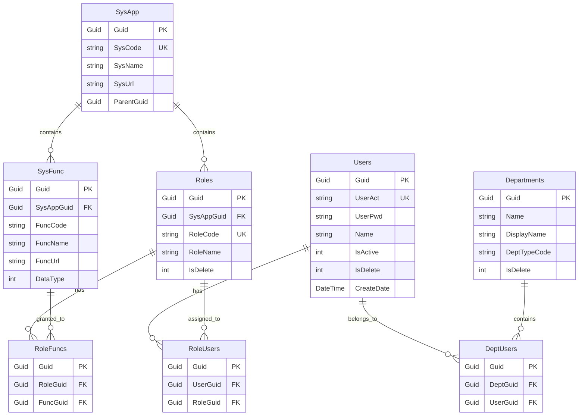
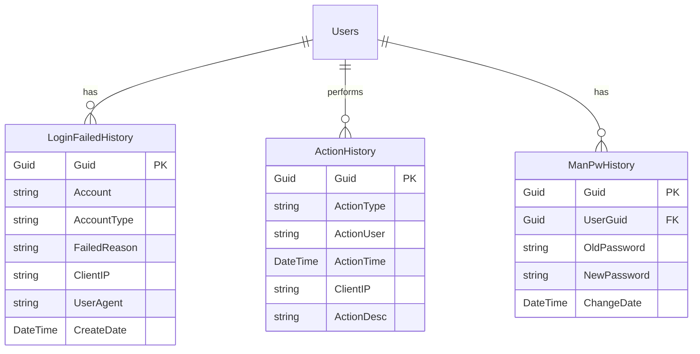
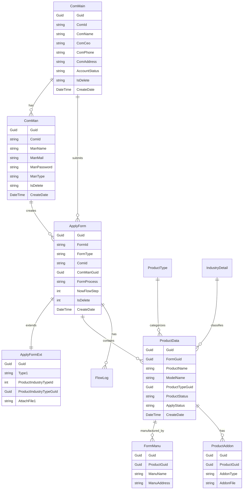
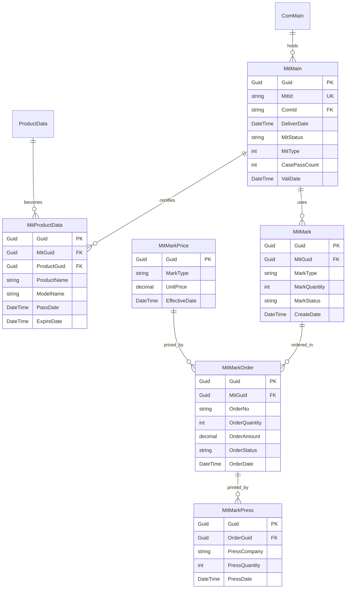
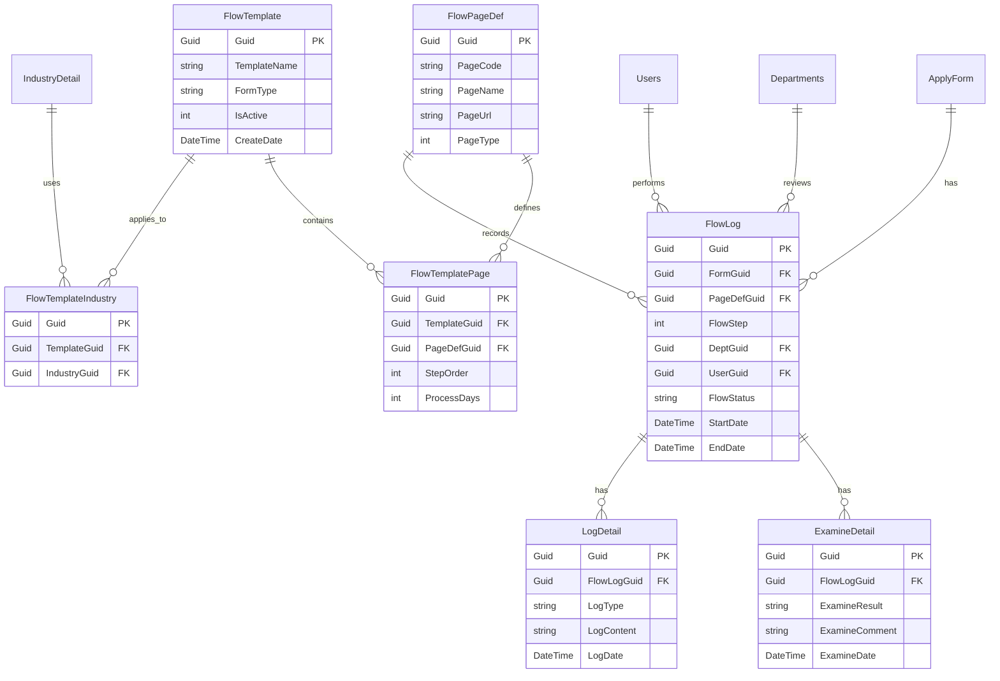
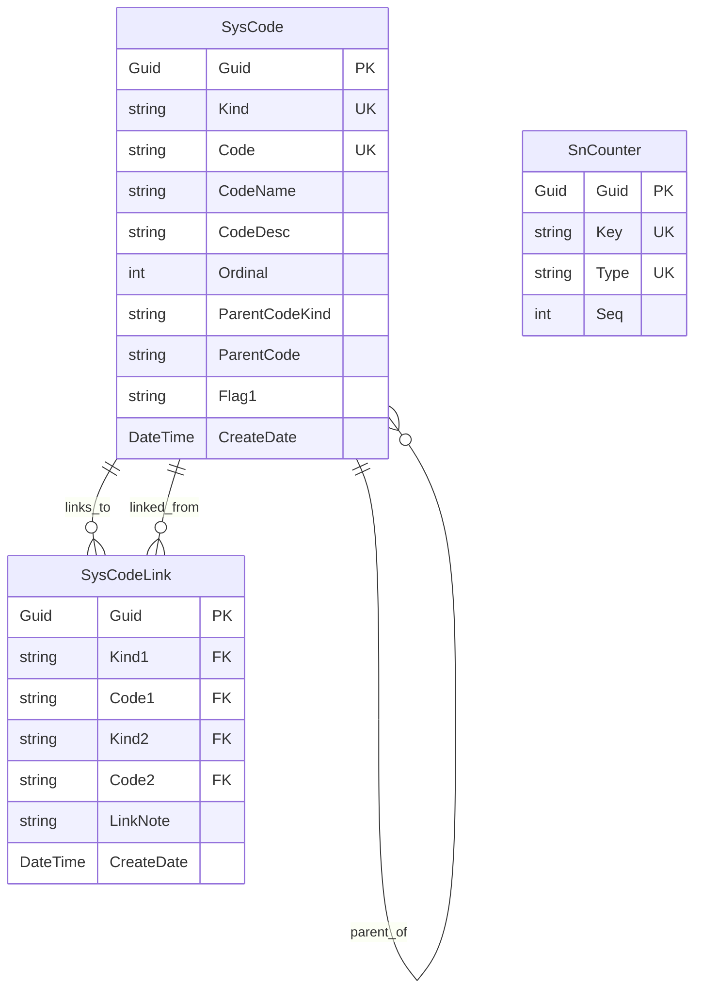

# MIT 微笑標章管理系統 - 資料庫架構與 CRUD 操作詳細範例

## 功能概述

本文詳細說明 MITAP2024 系統的完整資料庫架構、資料表關聯關係、資料模型對應，以及實際的 CRUD (Create, Read, Update, Delete) 操作範例。系統使用 SQL Server 資料庫，透過 Entity Framework Core 9.0 進行資料存取，並在需要時使用直接 SQL 查詢來處理複雜的業務邏輯。

## 1. 資料庫架構概覽

### 1.1 全專案資料表 ER 關聯圖

以下是 MITAP2024 系統的完整資料表關聯圖，展示所有資料表之間的關聯關係：

```mermaid
erDiagram
    %% 系統管理模組 (Sys)
    SysApp ||--o{ SysFunc : contains
    SysApp ||--o{ Roles : contains
    SysFunc ||--o{ RoleFuncs : granted_to
    Roles ||--o{ RoleFuncs : has
    Roles ||--o{ RoleUsers : assigned_to
    Users ||--o{ RoleUsers : has
    Users ||--o{ DeptUsers : belongs_to
    Departments ||--o{ DeptUsers : contains
    Users ||--o{ ActionHistory : performs
    Users ||--o{ LoginFailedHistory : has
    Users ||--o{ ManPwHistory : has
    Users ||--o{ MailLog : sends

    %% MIT 業務模組 - 廠商與申請
    ComMain ||--o{ ComMan : has
    ComMain ||--o{ ComManu : has
    ComMain ||--o{ ApplyForm : submits
    ComMan ||--o{ ApplyForm : creates
    ComMan ||--o{ RoleUsers : has_role
    ApplyForm ||--|| ApplyFormExt : extends
    ApplyForm ||--o{ ProductData : contains
    ApplyForm ||--o{ FormNote : has
    ApplyForm ||--o{ FlowLog : has
    ProductData ||--o{ FormManu : manufactured_by
    ProductData ||--o{ ProductAddon : has
    ProductType ||--o{ ProductData : categorizes
    ProductType ||--o{ ProductTypeTestDept : tested_by
    Departments ||--o{ ProductTypeTestDept : tests
    IndustryDetail ||--o{ ProductIndustry : contains
    IndustryDetail ||--o{ ProductType : classifies
    ProductIndustry ||--o{ ProductType : contains
    IndustryDetail ||--o{ FlowTemplateIndustry : uses
    Departments ||--o{ IndustryDetail : manages
    Users ||--o{ IndustryDetail : responsible_for

    %% MIT 業務模組 - 證書與標章
    ComMain ||--o{ MitMain : holds
    MitMain ||--o{ MitProductData : certifies
    ProductData ||--o{ MitProductData : becomes
    MitMain ||--o{ MitMark : uses
    MitMark ||--o{ MitMarkOrder : ordered_in
    MitMarkOrder ||--o{ MitMarkPress : printed_by
    MitMarkPrice ||--o{ MitMarkOrder : priced_by
    MitMain ||--o{ MitMarkMerge : merged_in

    %% MIT 業務模組 - 審查流程
    FlowTemplate ||--o{ FlowTemplatePage : contains
    FlowTemplate ||--o{ FlowTemplateIndustry : applies_to
    FlowPageDef ||--o{ FlowTemplatePage : defines
    FlowPageDef ||--o{ FlowLog : records
    ApplyForm ||--o{ FlowLog : has
    FlowLog ||--o{ ExamineDetail : has
    FlowLog ||--o{ LogDetail : has
    Departments ||--o{ FlowLog : reviews
    Users ||--o{ FlowLog : performs
    FlowMain ||--o{ FlowLog : follows

    %% 系統設定模組
    SysCode ||--o{ SysCode : parent_of
    SysCode ||--o{ SysCodeLink : links_to
    SysCode ||--o{ SysCodeLink : linked_from
```



**ER 圖說明：**

- **||--o{**：一對多關係（一個父記錄對應多個子記錄）
- **||--||**：一對一關係（一個記錄對應一個記錄）
- **PK**：主鍵 (Primary Key)
- **FK**：外鍵 (Foreign Key)
- **UK**：唯一鍵 (Unique Key)

### 1.2 資料庫分類

MITAP2024 系統的資料庫架構分為三大類別：

```
MITAP2024 資料庫架構：

┌─────────────────────────────────────────────────────────────┐
│                    系統管理 (Sys)                            │
│  - Users (使用者)                                            │
│  - Departments (部門)                                        │
│  - Roles (角色)                                              │
│  - SysFunc (功能選單)                                        │
│  - ActionHistory (操作歷史)                                  │
│  - LoginFailedHistory (登入失敗記錄)                         │
└─────────────────────────────────────────────────────────────┘

┌─────────────────────────────────────────────────────────────┐
│                    系統設定 (SysSet)                         │
│  - SysCode (系統代碼)                                        │
│  - SysCodeLink (代碼關聯)                                    │
│  - SnCounter (序號計數器)                                    │
└─────────────────────────────────────────────────────────────┘

┌─────────────────────────────────────────────────────────────┐
│                    MIT 業務 (Mit)                            │
│  - ComMain (廠商主檔)                                        │
│  - ComMan (廠商聯絡人)                                       │
│  - ApplyForm (申請案件)                                      │
│  - ProductData (產品資料)                                    │
│  - MitMain (MIT證書)                                         │
│  - FlowMain (審查流程)                                       │
│  - IndustryDetail (產業分類)                                 │
└─────────────────────────────────────────────────────────────┘
```

### 1.2 DbContext 定義

**檔案位置：** `MITAP2024/MITAP2024.Server/Models/MainDbContext.cs`

```csharp
/// <summary>
/// 主要資料庫上下文
/// 定義所有資料表的 DbSet 和關聯關係
/// </summary>
public partial class MainDbContext : DbContext
{
    /// <summary>
    /// 設定資料庫連線
    /// </summary>
    protected override void OnConfiguring(DbContextOptionsBuilder optionsBuilder)
    {
        optionsBuilder.UseSqlServer(AppSettingReader.GetMitDbConnStr());
    }

    /// <summary>
    /// 取得資料庫連線物件
    /// 用於直接 SQL 查詢
    /// </summary>
    public DbConnection GetDbConnection()
    {
        DbConnection conn = this.Database.GetDbConnection();
        return conn;
    }

    //== 系統管理相關資料表 ==
    public DbSet<Departments> Departments { get; set; }
    public DbSet<Users> Users { get; set; }
    public DbSet<DeptUsers> DeptUsers { get; set; }
    public DbSet<LoginFailedHistory> LoginFailedHistory { get; set; }
    public DbSet<ActionHistory> ActionHistory { get; set; }
    public DbSet<SysApp> SysApp { get; set; }
    public DbSet<SysFunc> SysFunc { get; set; }
    public DbSet<Roles> Roles { get; set; }
    public DbSet<RoleFuncs> RoleFuncs { get; set; }
    public DbSet<RoleUsers> RoleUsers { get; set; }
    public DbSet<ManPwHistory> ManPwHistory { get; set; }
    public DbSet<MailLog> MailLog { get; set; }

    //== 系統設定相關資料表 ==
    public DbSet<SysCode> SysCode { get; set; }
    public DbSet<SysCodeLink> SysCodeLink { get; set; }
    public DbSet<SnCounter> SnCounter { get; set; }

    //== MIT 業務相關資料表 ==
    public DbSet<ComMain> ComMain { get; set; }
    public DbSet<ComMan> ComMan { get; set; }
    public DbSet<ComManu> ComManu { get; set; }
    public DbSet<ApplyForm> ApplyForm { get; set; }
    public DbSet<ApplyFormExt> ApplyFormExt { get; set; }
    public DbSet<FormManu> FormManu { get; set; }
    public DbSet<ProductData> ProductData { get; set; }
    public DbSet<ProductAddon> ProductAddon { get; set; }
    public DbSet<FormNote> FormNote { get; set; }
    public DbSet<MitMain> MitMain { get; set; }
    public DbSet<MitProductData> MitProduct { get; set; }
    public DbSet<IndustryDetail> IndustryDetail { get; set; }
    public DbSet<ProductIndustry> ProductIndustry { get; set; }
    public DbSet<ProductType> ProductType { get; set; }
    public DbSet<ProductTypeTestDept> ProducTypeTestDept { get; set; }
    public DbSet<MitMark> MitMark { get; set; }
    public DbSet<MitMarkMerge> MitMarkMerge { get; set; }
    public DbSet<MitMarkOrder> MitMarkOrder { get; set; }
    public DbSet<MitMarkPrice> MitMarkPrice { get; set; }
    public DbSet<MitMarkPress> MitMarkPress { get; set; }
    public DbSet<FlowTemplate> FlowTemplate { get; set; }
    public DbSet<FlowPageDef> FlowPageDef { get; set; }
    public DbSet<FlowTemplatePage> FlowTemplatePage { get; set; }
    public DbSet<FlowTemplateIndustry> FlowTemplateIndustry { get; set; }
    public DbSet<FlowMain> FlowMain { get; set; }
    public DbSet<FlowLog> FlowLog { get; set; }
    public DbSet<ExamineDetail> ExamineDetail { get; set; }
    public DbSet<LogDetail> LogDetail { get; set; }

    /// <summary>
    /// 設定資料模型和關聯關係
    /// </summary>
    protected override void OnModelCreating(ModelBuilder modelBuilder)
    {
        // 設定唯一索引
        modelBuilder.Entity<Departments>().HasIndex(p => new { p.DisplayName, p.Name, p.DeptTypeCode }).IsUnique();
        modelBuilder.Entity<Users>().HasIndex(p => new { p.UserAct }).IsUnique();
        modelBuilder.Entity<DeptUsers>().HasIndex(p => new { p.DeptGuid, p.UserGuid }).IsUnique();
        modelBuilder.Entity<RoleUsers>().HasIndex(p => new { p.UserGuid, p.RoleGuid }).IsUnique();
        modelBuilder.Entity<SysApp>().HasIndex(p => new { p.SysCode }).IsUnique();
        modelBuilder.Entity<Roles>().HasIndex(p => new { p.RoleCode }).IsUnique();
        modelBuilder.Entity<SysCode>().HasIndex(p => new { p.Kind, p.Code }).IsUnique();
        modelBuilder.Entity<ApplyForm>().HasIndex(p => new { p.FormSysId }).IsUnique();
        modelBuilder.Entity<ProductData>().HasIndex(p => new { p.ProductSysid }).IsUnique();

        // 初始化預設資料
        InitDataModals.go(modelBuilder);

        base.OnModelCreating(modelBuilder);
    }
}
```

**程式碼說明：**

1. **DbSet 定義**：每個 DbSet 對應一個資料表
2. **連線管理**：統一的資料庫連線設定
3. **索引設定**：定義唯一索引確保資料完整性
4. **初始化資料**：透過 InitDataModals 初始化系統預設資料
5. **關聯設定**：在 OnModelCreating 中設定資料表關聯

## 2. 核心資料表結構與關聯關係

### 2.1 系統管理模組 (Sys)

#### 2.1.1 使用者與角色關聯



**關聯說明：**

1. **Users ↔ Roles**：多對多關係，透過 RoleUsers 關聯表
2. **Users ↔ Departments**：多對多關係，透過 DeptUsers 關聯表
3. **Roles ↔ SysFunc**：多對多關係，透過 RoleFuncs 關聯表
4. **SysApp → SysFunc**：一對多關係，系統包含多個功能
5. **SysApp → Roles**：一對多關係，系統包含多個角色

### 2.1.2 安全性相關資料表



**關聯說明：**

1. **LoginFailedHistory**：記錄登入失敗，用於防暴力破解
2. **ActionHistory**：記錄所有使用者操作，用於審計追蹤
3. **ManPwHistory**：記錄密碼變更歷史，確保密碼安全

### 2.2 MIT 業務模組 (Mit)

#### 2.2.1 廠商與申請案件關聯



**關聯說明：**

1. **ComMain → ComMan**：一對多，一家公司有多個聯絡人
2. **ComMain → ApplyForm**：一對多，一家公司可提交多個申請案
3. **ComMan → ApplyForm**：一對多，一個聯絡人可建立多個申請案
4. **ApplyForm ↔ ApplyFormExt**：一對一，擴展申請案資料
5. **ApplyForm → ProductData**：一對多，一個申請案包含多個產品
6. **ProductData → FormManu**：一對多，一個產品可有多個製造商
7. **ProductData → ProductAddon**：一對多，一個產品可有多個附件

#### 2.2.2 MIT 證書與產品關聯



**關聯說明：**

1. **ComMain → MitMain**：一對多，一家公司可持有多張證書
2. **MitMain → MitProductData**：一對多，一張證書包含多個產品
3. **ProductData → MitProductData**：一對一，產品通過審查後成為證書產品
4. **MitMain → MitMark**：一對多，一張證書可使用多種標章
5. **MitMark → MitMarkOrder**：一對多，標章可有多筆訂單
6. **MitMarkOrder → MitMarkPress**：一對多，訂單可有多次印製
7. **MitMarkPrice → MitMarkOrder**：一對多，價格表用於計算訂單金額

#### 2.2.3 審查流程關聯



**關聯說明：**

1. **FlowTemplate → FlowTemplatePage**：一對多，流程範本包含多個步驟
2. **FlowPageDef → FlowTemplatePage**：一對多，頁面定義用於多個流程
3. **FlowTemplate → FlowTemplateIndustry**：一對多，流程範本適用於多個產業
4. **IndustryDetail → FlowTemplateIndustry**：一對多，產業分類使用特定流程
5. **ApplyForm → FlowLog**：一對多，申請案有多筆流程記錄
6. **FlowLog → ExamineDetail**：一對多，流程記錄包含審查細節
7. **FlowLog → LogDetail**：一對多，流程記錄包含操作日誌

### 2.3 系統設定模組 (SysSet)

#### 2.3.1 系統代碼關聯



**關聯說明：**

1. **SysCode → SysCode**：自我關聯，支援階層式代碼結構
2. **SysCode ↔ SysCodeLink**：多對多，代碼之間的關聯關係
3. **SnCounter**：獨立表，用於產生各類型的序號

## 3. 資料模型對應表

### 3.1 系統管理模組資料模型對應

| 資料表名稱         | C# 模型類別        | 檔案位置                         | 主要欄位                                 | 用途說明           |
| ------------------ | ------------------ | -------------------------------- | ---------------------------------------- | ------------------ |
| Users              | Users              | Models/Sys/Users.cs              | Guid, UserAct, UserPwd, Name, IsActive   | 後台使用者帳號管理 |
| Departments        | Departments        | Models/Sys/Departments.cs        | Guid, Name, DisplayName, DeptTypeCode    | 審查單位/部門管理  |
| Roles              | Roles              | Models/Sys/Roles.cs              | Guid, RoleCode, RoleName, SysAppGuid     | 角色權限管理       |
| SysFunc            | SysFunc            | Models/Sys/SysFunc.cs            | Guid, FuncCode, FuncName, FuncUrl        | 功能選單定義       |
| SysApp             | SysApp             | Models/Sys/SysApp.cs             | Guid, SysCode, SysName, SysUrl           | 系統別定義         |
| RoleUsers          | RoleUsers          | Models/Sys/RoleUsers.cs          | Guid, UserGuid, RoleGuid                 | 使用者角色關聯     |
| DeptUsers          | DeptUsers          | Models/Sys/DeptUsers.cs          | Guid, DeptGuid, UserGuid                 | 使用者部門關聯     |
| RoleFuncs          | RoleFuncs          | Models/Sys/RoleFuncs.cs          | Guid, RoleGuid, FuncGuid                 | 角色功能關聯       |
| ActionHistory      | ActionHistory      | Models/Sys/ActionHistory.cs      | Guid, ActionType, ActionUser, ClientIP   | 操作歷史記錄       |
| LoginFailedHistory | LoginFailedHistory | Models/Sys/LoginFailedHistory.cs | Guid, Account, FailedReason, ClientIP    | 登入失敗記錄       |
| ManPwHistory       | ManPwHistory       | Models/Sys/ManPwHistory.cs       | Guid, UserGuid, OldPassword, NewPassword | 密碼變更歷史       |
| MailLog            | MailLog            | Models/Sys/MailLog.cs            | Guid, MailTo, MailSubject, MailBody      | 郵件發送記錄       |

### 3.2 MIT 業務模組資料模型對應

| 資料表名稱           | C# 模型類別          | 檔案位置                           | 主要欄位                                | 用途說明            |
| -------------------- | -------------------- | ---------------------------------- | --------------------------------------- | ------------------- |
| ComMain              | ComMain              | Models/Mit/ComMain.cs              | Guid, ComId, ComName, ComCeo            | 廠商基本資料        |
| ComMan               | ComMan               | Models/Mit/ComMan.cs               | Guid, ComId, ManMail, ManPassword       | 廠商聯絡人/前台帳號 |
| ComManu              | ComManu              | Models/Mit/ComManu.cs              | Guid, ComId, ManuName, ManuAddress      | 廠商製造工廠資料    |
| ApplyForm            | ApplyForm            | Models/Mit/ApplyForm.cs            | Guid, FormId, FormType, ComId           | 申請案件主檔        |
| ApplyFormExt         | ApplyFormExt         | Models/Mit/ApplyFormExt.cs         | Guid, ExtData1, ExtData2, ExtData3      | 申請案件擴展資料    |
| ProductData          | ProductData          | Models/Mit/ProductData.cs          | Guid, FormGuid, ProductName, ModelName  | 申請產品項目        |
| FormManu             | FormManu             | Models/Mit/FormManu.cs             | Guid, ProductGuid, ManuName             | 產品製造商資料      |
| ProductAddon         | ProductAddon         | Models/Mit/ProductAddon.cs         | Guid, ProductGuid, AddonType, AddonFile | 產品附件資料        |
| FormNote             | FormNote             | Models/Mit/FormNote.cs             | Guid, FormGuid, NoteType, NoteContent   | 案件備註記錄        |
| MitMain              | MitMain              | Models/Mit/MitMain.cs              | Guid, MitId, ComId, MitStatus           | MIT 證書主檔        |
| MitProductData       | MitProductData       | Models/Mit/MitProductData.cs       | Guid, MitGuid, ProductGuid              | MIT 證書產品        |
| MitMark              | MitMark              | Models/Mit/MitMark.cs              | Guid, MitGuid, MarkType, MarkQuantity   | MIT 標章資料        |
| MitMarkOrder         | MitMarkOrder         | Models/Mit/MitMarkOrder.cs         | Guid, MitGuid, OrderNo, OrderAmount     | 標章訂單資料        |
| MitMarkPress         | MitMarkPress         | Models/Mit/MitMarkPress.cs         | Guid, OrderGuid, PressCompany           | 標章印製資料        |
| MitMarkPrice         | MitMarkPrice         | Models/Mit/MitMarkPrice.cs         | Guid, MarkType, UnitPrice               | 標章價格表          |
| MitMarkMerge         | MitMarkMerge         | Models/Mit/MitMarkMerge.cs         | Guid, MitGuid, MergeType                | 標章合併資料        |
| IndustryDetail       | IndustryDetail       | Models/Mit/IndustryDetail.cs       | Guid, IndustryName, DeptGuid            | 產業主分類          |
| ProductIndustry      | ProductIndustry      | Models/Mit/ProductIndustry.cs      | Guid, IndustryGuid, IndustryName        | 產業次分類          |
| ProductType          | ProductType          | Models/Mit/ProductType.cs          | Guid, TypeName, IndustryGuid            | 產品類別            |
| ProductTypeTestDept  | ProductTypeTestDept  | Models/Mit/ProductTypeTestDept.cs  | Guid, ProductTypeGuid, DeptGuid         | 產品類別檢驗單位    |
| FlowTemplate         | FlowTemplate         | Models/Mit/FlowTemplate.cs         | Guid, TemplateName, FormType            | 審查流程範本        |
| FlowPageDef          | FlowPageDef          | Models/Mit/FlowPageDef.cs          | Guid, PageCode, PageName, PageUrl       | 流程頁面定義        |
| FlowTemplatePage     | FlowTemplatePage     | Models/Mit/FlowTemplatePage.cs     | Guid, TemplateGuid, PageDefGuid         | 流程範本頁面關聯    |
| FlowTemplateIndustry | FlowTemplateIndustry | Models/Mit/FlowTemplateIndustry.cs | Guid, TemplateGuid, IndustryGuid        | 流程範本產業關聯    |
| FlowMain             | FlowMain             | Models/Mit/FlowMain.cs             | Guid, FormType, FlowStep, SignDepGuId   | 商品流程步驟        |
| FlowLog              | FlowLog              | Models/Mit/FlowLog.cs              | Guid, FormGuid, FlowStep, FlowStatus    | 流程執行記錄        |
| ExamineDetail        | ExamineDetail        | Models/Mit/ExamineDetail.cs        | Guid, FlowLogGuid, ExamineResult        | 審查細節記錄        |
| LogDetail            | LogDetail            | Models/Mit/LogDetail.cs            | Guid, FlowLogGuid, LogType, LogContent  | 流程操作日誌        |

### 3.3 系統設定模組資料模型對應

| 資料表名稱  | C# 模型類別 | 檔案位置                     | 主要欄位                         | 用途說明     |
| ----------- | ----------- | ---------------------------- | -------------------------------- | ------------ |
| SysCode     | SysCode     | Models/SysSet/SysCode.cs     | Guid, Kind, Code, CodeName       | 系統代碼主檔 |
| SysCodeLink | SysCodeLink | Models/SysSet/SysCodeLink.cs | Guid, Kind1, Code1, Kind2, Code2 | 系統代碼關聯 |
| SnCounter   | SnCounter   | Models/SysSet/SnCounter.cs   | Guid, Key, Type, Seq             | 序號計數器   |

### 3.4 資料模型共通欄位說明

所有資料表都包含以下共通欄位：

| 欄位名稱   | 資料型別   | 說明                       | 必填 |
| ---------- | ---------- | -------------------------- | ---- |
| Guid       | Guid       | 主鍵，使用 GUID 確保唯一性 | ✓    |
| CreateDate | DateTime   | 建立時間                   | ✓    |
| CreateUser | string(50) | 建立者                     | ✓    |
| ModifyDate | DateTime?  | 最後修改時間               | -    |
| ModifyUser | string(50) | 最後修改者                 | -    |
| IsDelete   | int/string | 刪除標記（軟刪除）         | ✓    |

**共通欄位設計說明：**

1. **Guid 主鍵**：使用 GUID 作為主鍵，避免分散式環境下的主鍵衝突
2. **審計欄位**：CreateDate、CreateUser、ModifyDate、ModifyUser 用於追蹤資料變更
3. **軟刪除**：IsDelete 欄位實作軟刪除，保留歷史資料
4. **一致性**：所有資料表採用相同的欄位命名和型別，便於維護

### 3.5 所有資料表完整欄位詳細說明

#### 3.5.1 系統管理模組 (Sys) 資料表詳細欄位

##### Users（後台使用者帳號）

| 欄位名稱      | 資料型別 | 長度 | 必填 | 說明                          | 索引/約束 |
| ------------- | -------- | ---- | ---- | ----------------------------- | --------- |
| Guid          | Guid     | -    | ✓    | 主鍵                          | PK        |
| UserId        | int      | -    | -    | 原系統使用者 ID               | -         |
| UserAct       | string   | 50   | ✓    | 使用者帳號                    | UK        |
| UserPwd       | string   | 255  | ✓    | 使用者密碼（加密）            | -         |
| Name          | string   | 50   | ✓    | 使用者姓名                    | -         |
| NameEn        | string   | 50   | -    | 使用者英文姓名                | -         |
| Email         | string   | 100  | -    | 電子郵件                      | -         |
| Phone         | string   | 50   | -    | 電話                          | -         |
| Mobile        | string   | 50   | -    | 行動電話                      | -         |
| IsActive      | int      | -    | ✓    | 啟用狀態（0:啟用/1:停用）     | -         |
| IsDelete      | int      | -    | ✓    | 刪除標記（0:未刪除/1:已刪除） | -         |
| LastLoginDate | DateTime | -    | -    | 最後登入時間                  | -         |
| LastLoginIP   | string   | 50   | -    | 最後登入 IP                   | -         |
| PwdExpireDate | DateTime | -    | -    | 密碼到期日                    | -         |
| CreateDate    | DateTime | -    | ✓    | 建立時間                      | -         |
| CreateUser    | string   | 50   | ✓    | 建立者                        | -         |
| ModifyDate    | DateTime | -    | -    | 最後修改時間                  | -         |
| ModifyUser    | string   | 50   | -    | 最後修改者                    | -         |

**業務說明：**

- 後台管理人員帳號，包含審查人員、系統管理員等
- UserAct 為唯一帳號，不可重複
- UserPwd 使用 SHA256 加密儲存
- IsActive 控制帳號啟用狀態
- 記錄最後登入時間和 IP 便於安全追蹤

##### Departments（審查單位/部門）

| 欄位名稱     | 資料型別 | 長度 | 必填 | 說明                                 | 索引/約束 |
| ------------ | -------- | ---- | ---- | ------------------------------------ | --------- |
| Guid         | Guid     | -    | ✓    | 主鍵                                 | PK        |
| DeptId       | int      | -    | -    | 原系統單位 ID                        | -         |
| DisplayName  | string   | 50   | ✓    | 單位顯示名稱                         | -         |
| Name         | string   | 50   | ✓    | 單位正式名稱                         | -         |
| NameEn       | string   | 150  | -    | 單位英文名稱                         | -         |
| DeptUniNo    | string   | 10   | -    | 統一編號                             | -         |
| CeoName      | string   | 50   | -    | 代表人名稱                           | -         |
| DeptPhone    | string   | 50   | -    | 電話                                 | -         |
| DeptTypeCode | string   | 10   | -    | 單位類別代碼（Ref:SysCode.DEPTTYPE） | -         |
| DeptAddress  | string   | 50   | -    | 地址                                 | -         |
| IsDelete     | int      | -    | ✓    | 刪除標記（0:未刪除/1:已刪除）        | -         |
| CreateDate   | DateTime | -    | ✓    | 建立時間                             | -         |
| CreateUser   | string   | 50   | ✓    | 建立者                               | -         |
| ModifyDate   | DateTime | -    | -    | 最後修改時間                         | -         |
| ModifyUser   | string   | 50   | -    | 最後修改者                           | -         |

**業務說明：**

- 審查單位主檔，包含檢驗機構、審查部門等
- DeptTypeCode 區分單位類型（檢驗機構、審查單位等）
- DisplayName 用於前端顯示，Name 為正式名稱

##### Roles（角色權限）

| 欄位名稱   | 資料型別 | 長度 | 必填 | 說明                           | 索引/約束 |
| ---------- | -------- | ---- | ---- | ------------------------------ | --------- |
| Guid       | Guid     | -    | ✓    | 主鍵                           | PK        |
| RoleId     | int      | -    | -    | 原系統角色 ID                  | -         |
| RoleCode   | string   | 50   | ✓    | 角色代碼                       | UK        |
| RoleName   | string   | 50   | ✓    | 角色名稱                       | -         |
| SysAppGuid | Guid     | -    | ✓    | 系統別 GUID（Ref:SysApp.Guid） | FK        |
| IsDelete   | int      | -    | ✓    | 刪除標記（0:未刪除/1:已刪除）  | -         |
| CreateDate | DateTime | -    | ✓    | 建立時間                       | -         |
| CreateUser | string   | 50   | ✓    | 建立者                         | -         |
| ModifyDate | DateTime | -    | -    | 最後修改時間                   | -         |
| ModifyUser | string   | 50   | -    | 最後修改者                     | -         |

**業務說明：**

- 角色定義，用於權限控制
- RoleCode 為唯一角色代碼
- 透過 RoleUsers 關聯使用者，透過 RoleFuncs 關聯功能選單

##### SysFunc（功能選單）

| 欄位名稱   | 資料型別 | 長度 | 必填 | 說明                            | 索引/約束 |
| ---------- | -------- | ---- | ---- | ------------------------------- | --------- |
| Guid       | Guid     | -    | ✓    | 主鍵                            | PK        |
| FuncId     | int      | -    | -    | 原系統功能 ID                   | -         |
| FuncCode   | string   | 50   | ✓    | 功能代碼                        | UK        |
| FuncName   | string   | 50   | ✓    | 功能名稱                        | -         |
| FuncUrl    | string   | 255  | -    | 功能 URL                        | -         |
| ParentGuid | Guid     | -    | -    | 父功能 GUID（Ref:SysFunc.Guid） | FK        |
| SysAppGuid | Guid     | -    | ✓    | 系統別 GUID（Ref:SysApp.Guid）  | FK        |
| SortOrder  | int      | -    | -    | 排序順序                        | -         |
| IsDelete   | int      | -    | ✓    | 刪除標記（0:未刪除/1:已刪除）   | -         |
| CreateDate | DateTime | -    | ✓    | 建立時間                        | -         |
| CreateUser | string   | 50   | ✓    | 建立者                          | -         |
| ModifyDate | DateTime | -    | -    | 最後修改時間                    | -         |
| ModifyUser | string   | 50   | -    | 最後修改者                      | -         |

**業務說明：**

- 系統功能選單定義
- 支援階層式選單結構（透過 ParentGuid）
- FuncCode 為唯一功能代碼
- 透過 RoleFuncs 授權給角色

##### SysApp（系統別）

| 欄位名稱   | 資料型別 | 長度 | 必填 | 說明                          | 索引/約束 |
| ---------- | -------- | ---- | ---- | ----------------------------- | --------- |
| Guid       | Guid     | -    | ✓    | 主鍵                          | PK        |
| SysCode    | string   | 50   | ✓    | 系統代碼                      | UK        |
| SysName    | string   | 50   | ✓    | 系統名稱                      | -         |
| SysUrl     | string   | 255  | -    | 系統 URL                      | -         |
| IsDelete   | int      | -    | ✓    | 刪除標記（0:未刪除/1:已刪除） | -         |
| CreateDate | DateTime | -    | ✓    | 建立時間                      | -         |
| CreateUser | string   | 50   | ✓    | 建立者                        | -         |
| ModifyDate | DateTime | -    | -    | 最後修改時間                  | -         |
| ModifyUser | string   | 50   | -    | 最後修改者                    | -         |

**業務說明：**

- 系統別定義，支援多系統架構
- 目前主要為 MIT 微笑標章系統

##### RoleUsers（使用者角色關聯）

| 欄位名稱   | 資料型別 | 長度 | 必填 | 說明                                         | 索引/約束 |
| ---------- | -------- | ---- | ---- | -------------------------------------------- | --------- |
| Guid       | Guid     | -    | ✓    | 主鍵                                         | PK        |
| SysAppGuid | Guid     | -    | ✓    | 系統別 GUID（Ref:SysApp.Guid）               | FK        |
| RoleGuid   | Guid     | -    | ✓    | 角色 GUID（Ref:Roles.Guid）                  | FK        |
| UserGuid   | Guid     | -    | ✓    | 使用者 GUID（Ref:Users.Guid 或 ComMan.Guid） | FK        |
| IsDelete   | int      | -    | ✓    | 刪除標記（0:未刪除/1:已刪除）                | -         |
| CreateDate | DateTime | -    | ✓    | 建立時間                                     | -         |
| CreateUser | string   | 50   | ✓    | 建立者                                       | -         |
| ModifyDate | DateTime | -    | -    | 最後修改時間                                 | -         |
| ModifyUser | string   | 50   | -    | 最後修改者                                   | -         |

**業務說明：**

- 使用者與角色的多對多關聯表
- 一個使用者可以有多個角色
- UserGuid 可以是後台使用者（Users）或前台廠商帳號（ComMan）

##### DeptUsers（使用者部門關聯）

| 欄位名稱      | 資料型別 | 長度 | 必填 | 說明                              | 索引/約束 |
| ------------- | -------- | ---- | ---- | --------------------------------- | --------- |
| Guid          | Guid     | -    | ✓    | 主鍵                              | PK        |
| DeptGuid      | Guid     | -    | ✓    | 部門 GUID（Ref:Departments.Guid） | FK        |
| UserGuid      | Guid     | -    | ✓    | 使用者 GUID（Ref:Users.Guid）     | FK        |
| IsSignManager | int      | -    | -    | 是否為審核主管（0:否/1:是）       | -         |
| IsContact     | int      | -    | -    | 是否為預設聯絡人（0:否/1:是）     | -         |
| CreateDate    | DateTime | -    | ✓    | 建立時間                          | -         |
| CreateUser    | string   | 50   | ✓    | 建立者                            | -         |
| ModifyDate    | DateTime | -    | -    | 最後修改時間                      | -         |
| ModifyUser    | string   | 50   | -    | 最後修改者                        | -         |

**業務說明：**

- 使用者與部門的多對多關聯表
- 一個使用者可以屬於多個部門
- IsSignManager 標記審核主管，用於審查流程
- IsContact 標記預設聯絡人，用於通知

##### RoleFuncs（角色功能關聯）

| 欄位名稱   | 資料型別 | 長度 | 必填 | 說明                            | 索引/約束 |
| ---------- | -------- | ---- | ---- | ------------------------------- | --------- |
| Guid       | Guid     | -    | ✓    | 主鍵                            | PK        |
| SysAppGuid | Guid     | -    | ✓    | 系統別 GUID（Ref:SysApp.Guid）  | FK        |
| RoleGuid   | Guid     | -    | ✓    | 角色 GUID（Ref:Roles.Guid）     | FK        |
| FuncGuid   | Guid     | -    | ✓    | 功能 GUID（Ref:SysFunc.Guid）   | FK        |
| IsDelete   | int      | -    | ✓    | 刪除標記（0:未刪除/1:已刪除）   | -         |
| Flag1      | int      | -    | -    | 是否允許跨單位查詢（0:否/1:是） | -         |
| CreateDate | DateTime | -    | ✓    | 建立時間                        | -         |
| CreateUser | string   | 50   | ✓    | 建立者                          | -         |
| ModifyDate | DateTime | -    | -    | 最後修改時間                    | -         |
| ModifyUser | string   | 50   | -    | 最後修改者                      | -         |

**業務說明：**

- 角色與功能的多對多關聯表
- 定義角色可以存取的功能選單
- Flag1 控制是否允許跨單位查詢資料

#### 3.5.2 MIT 業務模組 (Mit) 核心資料表詳細欄位

##### ComMain（廠商基本資料）

| 欄位名稱     | 資料型別 | 長度 | 必填 | 說明                                | 索引/約束 |
| ------------ | -------- | ---- | ---- | ----------------------------------- | --------- |
| Guid         | Guid     | -    | ✓    | 主鍵                                | PK        |
| ComId        | string   | 8    | ✓    | 廠商編號                            | UK        |
| ComName      | string   | 255  | ✓    | 廠商名稱（中文）                    | -         |
| ComNameEn    | string   | 255  | -    | 廠商名稱（英文）                    | -         |
| ComUniNo     | string   | 10   | ✓    | 統一編號                            | UK        |
| ComCeo       | string   | 50   | -    | 負責人姓名                          | -         |
| ComCeoEn     | string   | 50   | -    | 負責人英文姓名                      | -         |
| ComPhone     | string   | 20   | -    | 公司電話                            | -         |
| ComFax       | string   | 20   | -    | 公司傳真                            | -         |
| ComAddress   | string   | 255  | -    | 公司地址                            | -         |
| ComAddressEn | string   | 255  | -    | 公司英文地址                        | -         |
| ComPostId    | string   | 10   | -    | 郵遞區號                            | -         |
| ComCapital   | long     | -    | -    | 資本額                              | -         |
| ComEmployees | int      | -    | -    | 員工人數                            | -         |
| ComWebsite   | string   | 255  | -    | 公司網站                            | -         |
| ComTypeCode  | string   | 10   | -    | 廠商類型代碼（Ref:SysCode.COMTYPE） | -         |
| IsDelete     | string   | 1    | ✓    | 刪除標記（N:未刪除/Y:已刪除）       | -         |
| CreateDate   | DateTime | -    | ✓    | 建立時間                            | -         |
| CreateUser   | string   | 50   | ✓    | 建立者                              | -         |
| ModifyDate   | DateTime | -    | -    | 最後修改時間                        | -         |
| ModifyUser   | string   | 50   | -    | 最後修改者                          | -         |

**業務說明：**

- 廠商基本資料主檔
- ComId 為系統自動產生的廠商編號（8 碼）
- ComUniNo 統一編號為唯一值，不可重複
- ComTypeCode 區分廠商類型（製造商、貿易商等）

##### ComMan（廠商聯絡人/前台帳號）

| 欄位名稱      | 資料型別 | 長度 | 必填 | 說明                          | 索引/約束 |
| ------------- | -------- | ---- | ---- | ----------------------------- | --------- |
| Guid          | Guid     | -    | ✓    | 主鍵                          | PK        |
| ComId         | string   | 8    | ✓    | 廠商編號（Ref:ComMain.ComId） | FK        |
| ManMail       | string   | 100  | ✓    | 聯絡人 Email（登入帳號）      | UK        |
| ManPassword   | string   | 255  | ✓    | 密碼（加密）                  | -         |
| ManName       | string   | 50   | ✓    | 聯絡人姓名                    | -         |
| ManPhone      | string   | 20   | -    | 聯絡電話                      | -         |
| ManMobile     | string   | 20   | -    | 行動電話                      | -         |
| IsActive      | int      | -    | ✓    | 啟用狀態（0:啟用/1:停用）     | -         |
| IsDelete      | string   | 1    | ✓    | 刪除標記（N:未刪除/Y:已刪除） | -         |
| LastLoginDate | DateTime | -    | -    | 最後登入時間                  | -         |
| LastLoginIP   | string   | 50   | -    | 最後登入 IP                   | -         |
| CreateDate    | DateTime | -    | ✓    | 建立時間                      | -         |
| CreateUser    | string   | 50   | ✓    | 建立者                        | -         |
| ModifyDate    | DateTime | -    | -    | 最後修改時間                  | -         |
| ModifyUser    | string   | 50   | -    | 最後修改者                    | -         |

**業務說明：**

- 廠商聯絡人資料，同時也是前台登入帳號
- ManMail 為唯一登入帳號
- 一個廠商可以有多個聯絡人帳號
- 透過 RoleUsers 關聯角色權限

##### ApplyForm（申請案件主檔）

| 欄位名稱     | 資料型別 | 長度 | 必填 | 說明                                    | 索引/約束 |
| ------------ | -------- | ---- | ---- | --------------------------------------- | --------- |
| Guid         | Guid     | -    | ✓    | 主鍵                                    | PK        |
| FormId       | string   | 20   | ✓    | 申請案編號                              | UK        |
| FormType     | string   | 10   | ✓    | 申請類型代碼（Ref:SysCode.FORMTYPE）    | -         |
| ComId        | string   | 8    | ✓    | 廠商編號（Ref:ComMain.ComId）           | FK        |
| ComManGuid   | Guid     | -    | -    | 申請人 GUID（Ref:ComMan.Guid）          | FK        |
| FormProcess  | string   | 10   | -    | 流程狀態代碼（Ref:SysCode.FORMPROCESS） | -         |
| FormStatus   | string   | 10   | -    | 案件狀態代碼（Ref:SysCode.FORMSTATUS）  | -         |
| ApplyDate    | DateTime | -    | -    | 申請日期                                | -         |
| SubmitDate   | DateTime | -    | -    | 送件日期                                | -         |
| PassDate     | DateTime | -    | -    | 通過日期                                | -         |
| RejectDate   | DateTime | -    | -    | 駁回日期                                | -         |
| RejectReason | string   | 500  | -    | 駁回原因                                | -         |
| IsDelete     | int      | -    | ✓    | 刪除標記（0:未刪除/1:已刪除）           | -         |
| CreateDate   | DateTime | -    | ✓    | 建立時間                                | -         |
| CreateUser   | string   | 50   | ✓    | 建立者                                  | -         |
| ModifyDate   | DateTime | -    | -    | 最後修改時間                            | -         |
| ModifyUser   | string   | 50   | -    | 最後修改者                              | -         |

**業務說明：**

- 申請案件主檔，記錄所有申請案的基本資訊
- FormId 為系統自動產生的申請案編號
- FormType 區分申請類型（新申請、補換發、自行印製等）
- FormProcess 記錄流程進度，FormStatus 記錄案件狀態
- 與 ApplyFormExt 一對一關聯，儲存擴展資料

##### ProductData（申請產品項目）

| 欄位名稱        | 資料型別 | 長度 | 必填 | 說明                                  | 索引/約束 |
| --------------- | -------- | ---- | ---- | ------------------------------------- | --------- |
| Guid            | Guid     | -    | ✓    | 主鍵                                  | PK        |
| FormGuid        | Guid     | -    | ✓    | 申請案 GUID（Ref:ApplyForm.Guid）     | FK        |
| ProductName     | string   | 255  | ✓    | 產品名稱                              | -         |
| ProductNameEn   | string   | 255  | -    | 產品英文名稱                          | -         |
| ModelName       | string   | 255  | -    | 型號名稱                              | -         |
| ProductTypeGuid | Guid     | -    | -    | 產品類別 GUID（Ref:ProductType.Guid） | FK        |
| BrandName       | string   | 100  | -    | 品牌名稱                              | -         |
| ProductDesc     | string   | 500  | -    | 產品說明                              | -         |
| ProductPrice    | decimal  | -    | -    | 產品價格                              | -         |
| ProductUnit     | string   | 20   | -    | 產品單位                              | -         |
| IsDelete        | string   | 1    | ✓    | 刪除標記（N:未刪除/Y:已刪除）         | -         |
| CreateDate      | DateTime | -    | ✓    | 建立時間                              | -         |
| CreateUser      | string   | 50   | ✓    | 建立者                                | -         |
| ModifyDate      | DateTime | -    | -    | 最後修改時間                          | -         |
| ModifyUser      | string   | 50   | -    | 最後修改者                            | -         |

**業務說明：**

- 申請案件的產品項目明細
- 一個申請案可以包含多個產品
- 記錄產品的基本資訊、型號、品牌等
- 透過 ProductTypeGuid 關聯產品類別

##### MitMain（MIT 證書主檔）

| 欄位名稱     | 資料型別 | 長度 | 必填 | 說明                                  | 索引/約束 |
| ------------ | -------- | ---- | ---- | ------------------------------------- | --------- |
| Guid         | Guid     | -    | ✓    | 主鍵                                  | PK        |
| MitId        | string   | 8    | ✓    | MIT 證書編號                          | UK        |
| ComId        | string   | 8    | ✓    | 廠商編號（Ref:ComMain.ComId）         | FK        |
| MitStatus    | string   | 10   | -    | 證書狀態代碼（Ref:SysCode.MITSTATUS） | -         |
| IssueDate    | DateTime | -    | -    | 發證日期                              | -         |
| ExpireDate   | DateTime | -    | -    | 到期日期                              | -         |
| CancelDate   | DateTime | -    | -    | 註銷日期                              | -         |
| CancelReason | string   | 500  | -    | 註銷原因                              | -         |
| IsDelete     | string   | 1    | ✓    | 刪除標記（N:未刪除/Y:已刪除）         | -         |
| CreateDate   | DateTime | -    | ✓    | 建立時間                              | -         |
| CreateUser   | string   | 50   | ✓    | 建立者                                | -         |
| ModifyDate   | DateTime | -    | -    | 最後修改時間                          | -         |
| ModifyUser   | string   | 50   | -    | 最後修改者                            | -         |

**業務說明：**

- MIT 證書主檔，記錄核發的證書資訊
- MitId 為系統自動產生的證書編號（8 碼）
- 記錄證書的發證、到期、註銷等狀態
- 透過 MitProductData 關聯證書包含的產品

## 4. CRUD 操作詳細範例

### 4.1 Create (新增) 操作

#### 4.1.1 使用 Entity Framework 新增資料

**檔案位置：** `MITAP2024/MITAP2024.Server/Main/MIT10/Service/MIT1001Service.cs`

```csharp
/// <summary>
/// 新增產業主分類
/// 展示完整的 Entity Framework 新增操作
/// </summary>
/// <param name="model">前端傳入的資料模型</param>
/// <param name="sessiondata">Session 資料</param>
/// <returns>新增結果</returns>
public async Task<ActionResult<PagedQueryResult>> Create(MIT1001Model model, SessionDataModel? sessiondata)
{
    return await Task.Run(() =>
    {
        PagedQueryResult result = new PagedQueryResult()
        {
            jwtkey = model.jwtkey,
            IsSuccess = false
        };

        try
        {
            // 第一步：資料驗證
            if (CheckModelDataHasError(model, ref result, true))
            {
                return result;
            }

            // 第二步：檢查資料是否重複
            var existingData = _context.IndustryDetail
                .Where(x => x.IndustryName == model.IndustryName && x.IsDelete != "Y")
                .FirstOrDefault();

            if (existingData != null)
            {
                result.message = "產業主分類名稱已存在";
                return result;
            }

            // 第三步：建立 Entity 物件
            var entity = new IndustryDetail()
            {
                Guid = Guid.NewGuid(),                          // 產生新的 GUID
                IndustryName = model.IndustryName,              // 產業名稱
                IndustryDesc = model.IndustryDesc,              // 產業說明
                DeptGuId = Guid.Parse(model.DeptGuId),          // 審查部門 GUID
                UserGuId = Guid.Parse(model.UserGuId),          // 負責人 GUID
                IsDelete = "N",                                 // 未刪除
                CreateDate = DateTime.Now,                      // 建立時間
                CreateUser = sessiondata.Name,                  // 建立者
                ModifyDate = null,                              // 修改時間（新增時為 null）
                ModifyUser = null                               // 修改者（新增時為 null）
            };

            // 第四步：使用 Entity Framework 新增資料
            _context.IndustryDetail.Add(entity);
            _context.SaveChanges();

            // 第五步：查詢關聯資料並回傳
            Departments? dept = _context.Departments.Find(entity.DeptGuId);
            Users? user = _context.Users.Find(entity.UserGuId);

            result.Data = ToViewModel(entity, dept, user);
            result.IsSuccess = true;
            result.message = "新增成功";

            // 第六步：記錄操作歷史
            LogAction("CREATE", "IndustryDetail", entity.Guid.ToString(), sessiondata);
        }
        catch (Exception e)
        {
            result.message = TextUtils.GenErrmsgWithNum(logger, "新增產業主分類失敗", e);
            result.IsSuccess = false;
        }

        return result;
    });
}

/// <summary>
/// 將 Entity 轉換為 ViewModel
/// </summary>
private MIT1001Model ToViewModel(IndustryDetail entity, Departments? dept, Users? user)
{
    return new MIT1001Model()
    {
        guid = TextUtils.GuidToString(entity.Guid),
        IndustryName = entity.IndustryName,
        IndustryDesc = entity.IndustryDesc,
        DeptGuId = TextUtils.GuidToString(entity.DeptGuId),
        DeptName = dept?.DisplayName ?? "",
        UserGuId = TextUtils.GuidToString(entity.UserGuId),
        UserName = user?.Name ?? "",
        CreateDate = entity.CreateDate.ToString("yyyy-MM-dd HH:mm:ss"),
        CreateUser = entity.CreateUser
    };
}
```

**程式碼說明：**

1. **資料驗證**：使用 CheckModelDataHasError 進行統一驗證
2. **重複檢查**：查詢資料庫確認資料不重複
3. **Entity 建立**：建立完整的 Entity 物件，包含所有必要欄位
4. **EF 新增**：使用 Add 方法和 SaveChanges 完成新增
5. **關聯查詢**：使用 Find 方法查詢關聯資料
6. **ViewModel 轉換**：將 Entity 轉換為前端需要的 ViewModel
7. **操作記錄**：記錄操作歷史便於追蹤

### 4.2 Read (查詢) 操作

#### 4.2.1 使用 Entity Framework 查詢單筆資料

```csharp
/// <summary>
/// 查詢單筆產業主分類
/// 展示 Entity Framework 的單筆查詢和關聯資料載入
/// </summary>
public async Task<ActionResult<PagedQueryResult>> QueryOne(MIT1001QueryModel model, SessionDataModel? sessiondata)
{
    return await Task.Run(() =>
    {
        PagedQueryResult result = new PagedQueryResult()
        {
            jwtkey = model.jwtkey,
            IsSuccess = false
        };

        try
        {
            // 第一步：使用 Where 和 FirstOrDefault 查詢主要資料
            IndustryDetail? entity = _context.IndustryDetail
                .Where(x => x.Guid == Guid.Parse(model.guid) && x.IsDelete != "Y")
                .FirstOrDefault();

            if (entity != null)
            {
                // 第二步：使用 Find 方法查詢關聯資料
                Departments? dept = _context.Departments.Find(entity.DeptGuId);
                Users? user = _context.Users.Find(entity.UserGuId);

                // 第三步：轉換為 ViewModel 並回傳
                MIT1001Model data = ToViewModel(entity, dept, user);
                data.jwtkey = model.jwtkey;

                result.Data = data;
                result.IsSuccess = true;
            }
            else
            {
                result.IsSuccess = false;
                result.message = "未查詢到產業主分類";
            }
        }
        catch (Exception e)
        {
            result.message = TextUtils.GenErrmsgWithNum(logger, "查詢單筆產業主分類失敗", e);
            result.IsSuccess = false;
        }

        return result;
    });
}
```

#### 4.2.2 使用 Entity Framework 查詢多筆資料（分頁）

```csharp
/// <summary>
/// 查詢產業主分類列表（分頁）
/// 展示 Entity Framework 的分頁查詢和排序
/// </summary>
public async Task<ActionResult<PagedQueryResult>> QueryDatas(MIT1001QueryModel model, SessionDataModel? sessiondata)
{
    return await Task.Run(() =>
    {
        PagedQueryResult result = new PagedQueryResult()
        {
            jwtkey = model.jwtkey,
            TotalCount = 0,
            DataList = new List<MIT1001Model>(),
            IsSuccess = false
        };

        try
        {
            // 第一步：建立基礎查詢
            var query = _context.IndustryDetail
                .Where(x => x.IsDelete != "Y");

            // 第二步：動態添加查詢條件
            if (!string.IsNullOrEmpty(model.q_industryName))
            {
                query = query.Where(x => x.IndustryName.Contains(model.q_industryName));
            }

            if (!string.IsNullOrEmpty(model.q_deptGuid))
            {
                Guid deptGuid = Guid.Parse(model.q_deptGuid);
                query = query.Where(x => x.DeptGuId == deptGuid);
            }

            // 第三步：計算總筆數
            result.TotalCount = query.Count();

            // 第四步：排序和分頁
            var pagedData = query
                .OrderByDescending(x => x.CreateDate)  // 依建立時間降冪排序
                .Skip((model.PageIndex - 1) * model.PageSize)  // 跳過前面的資料
                .Take(model.PageSize)  // 取得指定筆數
                .ToList();

            // 第五步：載入關聯資料並轉換為 ViewModel
            var dataList = new List<MIT1001Model>();
            foreach (var entity in pagedData)
            {
                Departments? dept = _context.Departments.Find(entity.DeptGuId);
                Users? user = _context.Users.Find(entity.UserGuId);
                dataList.Add(ToViewModel(entity, dept, user));
            }

            result.DataList = dataList;
            result.IsSuccess = true;
        }
        catch (Exception e)
        {
            result.message = TextUtils.GenErrmsgWithNum(logger, "查詢產業主分類列表失敗", e);
            result.IsSuccess = false;
        }

        return result;
    });
}
```

#### 4.2.3 使用直接 SQL 查詢複雜統計資料

```csharp
/// <summary>
/// 查詢申請案件統計資料
/// 展示使用直接 SQL 進行複雜統計查詢
/// </summary>
public async Task<ActionResult<PagedQueryResult>> QueryStatistics(StatisticsQueryModel model, SessionDataModel? sessiondata)
{
    return await Task.Run(() =>
    {
        PagedQueryResult result = new PagedQueryResult();

        try
        {
            // 第一步：建構 SQL 查詢語句
            string summaryQuery = @"
                SELECT
                    af.FormType,
                    sc.CodeName AS FormTypeName,
                    COUNT(DISTINCT af.Guid) AS TotalCount,
                    COUNT(DISTINCT CASE WHEN af.FormProcess = 'P9' THEN af.Guid END) AS PassCount,
                    COUNT(DISTINCT CASE WHEN af.FormProcess = 'P8' THEN af.Guid END) AS RejectCount,
                    COUNT(DISTINCT CASE WHEN af.FormProcess NOT IN ('P8', 'P9') THEN af.Guid END) AS ProcessingCount
                FROM ApplyForm af
                    LEFT JOIN SysCode sc ON sc.Kind = 'FORMTYPE' AND sc.Code = af.FormType
                WHERE af.ComId = @comid
                    AND af.CreateDate >= @startdate
                    AND af.CreateDate <= @enddate
                    AND af.IsDelete = 0
                    AND (@formtype IS NULL OR af.FormType = @formtype)
                GROUP BY af.FormType, sc.CodeName
                ORDER BY af.FormType";

            // 第二步：執行 SQL 查詢
            using (var conn = new SqlConnection(AppSettingReader.GetMitDbConnStr()))
            {
                conn.Open();
                using (var cmd = new SqlCommand(summaryQuery, conn))
                {
                    // 第三步：設定查詢參數
                    cmd.Parameters.AddWithValue("@comid", sessiondata.ComId);
                    cmd.Parameters.AddWithValue("@startdate", DateTime.Parse(model.StartDate));
                    cmd.Parameters.AddWithValue("@enddate", DateTime.Parse(model.EndDate));
                    cmd.Parameters.AddWithValue("@formtype",
                        string.IsNullOrEmpty(model.FormType) ? DBNull.Value : model.FormType);

                    // 第四步：讀取查詢結果
                    var dataList = new List<StatisticsModel>();
                    using (var reader = cmd.ExecuteReader())
                    {
                        while (reader.Read())
                        {
                            dataList.Add(new StatisticsModel()
                            {
                                FormType = reader["FormType"].ToString(),
                                FormTypeName = reader["FormTypeName"].ToString(),
                                TotalCount = Convert.ToInt32(reader["TotalCount"]),
                                PassCount = Convert.ToInt32(reader["PassCount"]),
                                RejectCount = Convert.ToInt32(reader["RejectCount"]),
                                ProcessingCount = Convert.ToInt32(reader["ProcessingCount"])
                            });
                        }
                    }

                    result.DataList = dataList;
                    result.IsSuccess = true;
                }
            }
        }
        catch (Exception e)
        {
            result.message = TextUtils.GenErrmsgWithNum(logger, "查詢統計資料失敗", e);
            result.IsSuccess = false;
        }

        return result;
    });
}
```

**程式碼說明：**

1. **單筆查詢**：使用 Where + FirstOrDefault 查詢單筆資料
2. **分頁查詢**：使用 Skip 和 Take 實作分頁功能
3. **動態條件**：根據前端傳入的條件動態建構查詢
4. **關聯載入**：使用 Find 方法載入關聯資料
5. **直接 SQL**：複雜統計使用直接 SQL 提升效能
6. **參數化查詢**：防止 SQL 注入攻擊

### 4.3 Update (更新) 操作

#### 4.3.1 使用 Entity Framework 更新資料

```csharp
/// <summary>
/// 更新產業主分類
/// 展示完整的 Entity Framework 更新操作
/// </summary>
public async Task<ActionResult<PagedQueryResult>> Update(MIT1001Model model, SessionDataModel? sessiondata)
{
    return await Task.Run(() =>
    {
        PagedQueryResult result = new PagedQueryResult()
        {
            jwtkey = model.jwtkey,
            IsSuccess = false
        };

        try
        {
            // 第一步：資料驗證
            if (CheckModelDataHasError(model, ref result, false))
            {
                return result;
            }

            // 第二步：查詢要更新的資料
            IndustryDetail? entity = _context.IndustryDetail
                .Where(x => x.Guid == Guid.Parse(model.guid))
                .FirstOrDefault();

            if (entity == null)
            {
                result.message = "產業主分類不存在";
                return result;
            }

            // 第三步：檢查名稱是否重複（排除自己）
            var existingData = _context.IndustryDetail
                .Where(x => x.IndustryName == model.IndustryName &&
                           x.Guid != entity.Guid &&
                           x.IsDelete != "Y")
                .FirstOrDefault();

            if (existingData != null)
            {
                result.message = "產業主分類名稱已存在";
                return result;
            }

            // 第四步：更新 Entity 屬性
            entity.IndustryName = model.IndustryName;
            entity.IndustryDesc = model.IndustryDesc;
            entity.DeptGuId = Guid.Parse(model.DeptGuId);
            entity.UserGuId = Guid.Parse(model.UserGuId);
            entity.ModifyDate = DateTime.Now;
            entity.ModifyUser = sessiondata.Name;

            // 第五步：使用 Entity Framework 儲存變更
            // EF 會自動追蹤 entity 的變更，只需呼叫 SaveChanges
            _context.SaveChanges();

            // 第六步：查詢關聯資料並回傳
            Departments? dept = _context.Departments.Find(entity.DeptGuId);
            Users? user = _context.Users.Find(entity.UserGuId);

            result.Data = ToViewModel(entity, dept, user);
            result.IsSuccess = true;
            result.message = "更新成功";

            // 第七步：記錄操作歷史
            LogAction("UPDATE", "IndustryDetail", entity.Guid.ToString(), sessiondata);
        }
        catch (Exception e)
        {
            result.message = TextUtils.GenErrmsgWithNum(logger, "更新產業主分類失敗", e);
            result.IsSuccess = false;
        }

        return result;
    });
}
```

**程式碼說明：**

1. **資料驗證**：驗證必要欄位和資料格式
2. **存在檢查**：確認要更新的資料存在
3. **重複檢查**：檢查名稱是否重複（排除自己）
4. **屬性更新**：更新 Entity 的屬性值
5. **自動追蹤**：EF 自動追蹤變更，只需呼叫 SaveChanges
6. **審計欄位**：更新 ModifyDate 和 ModifyUser
7. **操作記錄**：記錄更新操作
8. **ViewModel 轉換**：將 Entity 轉換為前端需要的 ViewModel
9. **操作記錄**：記錄操作歷史便於追蹤

### 4.4 Delete (刪除) 操作

#### 4.4.1 使用 Entity Framework 軟刪除

```csharp
/// <summary>
/// 刪除產業主分類（軟刪除）
/// 展示 Entity Framework 的軟刪除操作
/// </summary>
public async Task<ActionResult<PagedQueryResult>> Delete(MIT1001QueryModel model, SessionDataModel? sessiondata)
{
    return await Task.Run(() =>
    {
        PagedQueryResult result = new PagedQueryResult()
        {
            jwtkey = model.jwtkey,
            IsSuccess = false
        };

        try
        {
            // 第一步：驗證 GUID
            if (string.IsNullOrEmpty(model.guid) || Guid.Parse(model.guid) == Guid.Empty)
            {
                result.message = "未傳入產業主分類代碼";
                return result;
            }

            // 第二步：查詢要刪除的資料
            IndustryDetail? entity = _context.IndustryDetail
                .Where(x => x.Guid == Guid.Parse(model.guid))
                .FirstOrDefault();

            if (entity == null)
            {
                result.message = "產業主分類不存在";
                return result;
            }

            // 第三步：檢查是否有關聯資料
            var hasRelatedData = _context.ProductIndustry
                .Where(x => x.IndustryGuid == entity.Guid && x.IsDelete != "Y")
                .Any();

            if (hasRelatedData)
            {
                result.message = "此產業主分類下有產業次分類，無法刪除";
                return result;
            }

            // 第四步：執行軟刪除（設定 IsDelete 標記）
            entity.IsDelete = "Y";
            entity.ModifyDate = DateTime.Now;
            entity.ModifyUser = sessiondata.Name;

            // 第五步：儲存變更
            _context.SaveChanges();

            result.IsSuccess = true;
            result.message = "刪除成功";

            // 第六步：記錄操作歷史
            LogAction("DELETE", "IndustryDetail", entity.Guid.ToString(), sessiondata);
        }
        catch (Exception e)
        {
            result.message = TextUtils.GenErrmsgWithNum(logger, "刪除產業主分類失敗", e);
            result.IsSuccess = false;
        }

        return result;
    });
}
```

#### 4.4.2 使用 Entity Framework 硬刪除（實際刪除）

```csharp
/// <summary>
/// 永久刪除資料（硬刪除）
/// 僅用於特殊情況，一般建議使用軟刪除
/// </summary>
public async Task<ActionResult<PagedQueryResult>> HardDelete(MIT1001QueryModel model, SessionDataModel? sessiondata)
{
    return await Task.Run(() =>
    {
        PagedQueryResult result = new PagedQueryResult()
        {
            jwtkey = model.jwtkey,
            IsSuccess = false
        };

        try
        {
            // 第一步：查詢要刪除的資料
            IndustryDetail? entity = _context.IndustryDetail
                .Where(x => x.Guid == Guid.Parse(model.guid))
                .FirstOrDefault();

            if (entity == null)
            {
                result.message = "產業主分類不存在";
                return result;
            }

            // 第二步：檢查是否有關聯資料
            var hasRelatedData = _context.ProductIndustry
                .Where(x => x.IndustryGuid == entity.Guid)
                .Any();

            if (hasRelatedData)
            {
                result.message = "此產業主分類下有產業次分類，無法刪除";
                return result;
            }

            // 第三步：使用 Remove 方法永久刪除
            _context.IndustryDetail.Remove(entity);
            _context.SaveChanges();

            result.IsSuccess = true;
            result.message = "永久刪除成功";

            // 第四步：記錄操作歷史
            LogAction("HARD_DELETE", "IndustryDetail", entity.Guid.ToString(), sessiondata);
        }
        catch (Exception e)
        {
            result.message = TextUtils.GenErrmsgWithNum(logger, "永久刪除產業主分類失敗", e);
            result.IsSuccess = false;
        }

        return result;
    });
}
```

**程式碼說明：**

1. **軟刪除**：設定 IsDelete 標記，保留歷史資料
2. **硬刪除**：使用 Remove 方法永久刪除資料
3. **關聯檢查**：刪除前檢查是否有關聯資料
4. **審計欄位**：軟刪除時更新 ModifyDate 和 ModifyUser
5. **操作記錄**：記錄刪除操作
6. **錯誤處理**：捕獲異常並回傳友善的錯誤訊息

## 5. 總結

### 5.1 資料庫架構特色

MITAP2024 系統的資料庫架構具有以下特色：

1. **模組化設計**：分為系統管理、系統設定、MIT 業務三大模組
2. **GUID 主鍵**：使用 GUID 作為主鍵，支援分散式環境
3. **軟刪除機制**：保留歷史資料，支援資料恢復
4. **審計追蹤**：完整的建立和修改記錄
5. **關聯完整性**：透過外鍵和索引確保資料完整性

### 5.2 CRUD 操作最佳實務

#### 5.2.1 Entity Framework 適用場景

- ✅ 單一資料表的 CRUD 操作
- ✅ 簡單的關聯查詢
- ✅ 需要變更追蹤的操作
- ✅ 強型別安全的查詢

#### 5.2.2 直接 SQL 適用場景

- ✅ 複雜的統計查詢
- ✅ 批次更新操作
- ✅ 大量資料處理
- ✅ 效能要求高的查詢

### 5.3 資料存取層設計原則

1. **統一的錯誤處理**：使用 try-catch 捕獲異常並記錄
2. **參數化查詢**：防止 SQL 注入攻擊
3. **資料驗證**：在服務層進行完整的資料驗證
4. **關聯資料載入**：使用 Find 或 Include 載入關聯資料
5. **ViewModel 轉換**：將 Entity 轉換為前端需要的格式
6. **操作記錄**：記錄所有重要操作便於追蹤
7. **軟刪除優先**：優先使用軟刪除保留歷史資料

### 5.4 效能優化建議

1. **索引優化**：在常用查詢欄位建立索引
2. **分頁查詢**：大量資料使用分頁避免記憶體溢出
3. **延遲載入**：避免一次載入過多關聯資料
4. **快取機制**：對不常變動的資料使用快取
5. **批次操作**：批次更新使用直接 SQL 提升效能
6. **連線管理**：使用 using 語句確保連線正確釋放

### 5.5 技術價值

透過這套完整的資料庫架構和 CRUD 操作設計，MITAP2024 系統能夠：

- **資料完整性**：透過關聯和約束確保資料正確性
- **可追蹤性**：完整的審計記錄支援問題追蹤
- **可維護性**：統一的設計模式便於維護和擴展
- **效能優化**：混合使用 EF 和直接 SQL 達到最佳效能
- **安全性**：參數化查詢和輸入驗證防止安全漏洞

這套資料庫架構不僅滿足當前的業務需求，也為未來的系統擴展提供了良好的基礎。
