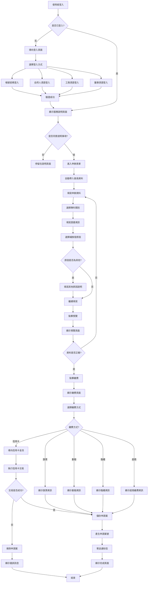
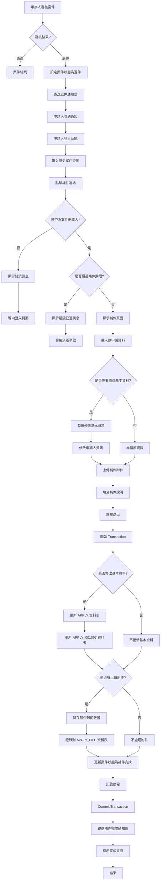
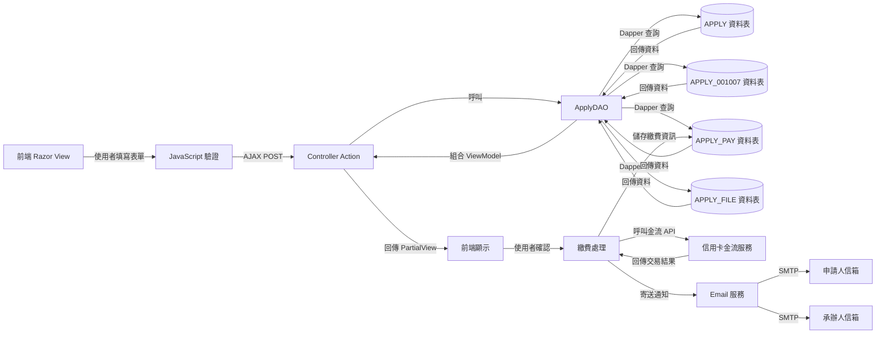
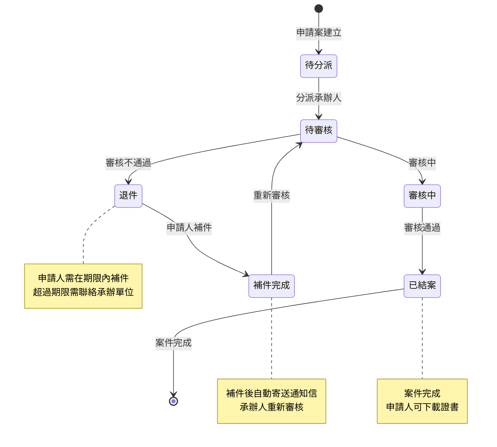

# 001007 - 專科醫師證書補(換)發 - 全端功能詳細說明

## 功能概述

本文以「專科醫師證書補(換)發（001007）」為例，詳細說明從前端到後端的完整全端開發流程。此功能涵蓋了專科醫師證書補換發申請的建立、預覽、繳費、補件等完整業務流程。

### 服務基本資訊

| 項目         | 內容                                                     |
| ------------ | -------------------------------------------------------- |
| 服務代碼     | 001007                                                   |
| 服務名稱     | 專科醫師證書補(換)發                                     |
| 業務單位     | 醫事司                                                   |
| 是否需繳費   | 是                                                       |
| 申請對象     | 已取得專科醫師證書者                                     |
| Controller   | `ES/Controllers/Apply_001007Controller.cs` (369 行)      |
| ViewModel    | `ES/Models/ViewModels/Apply_001007ViewModel.cs` (218 行) |
| Entity Model | `ES/Models/Entities/Apply_001007Model.cs` (117 行)       |
| DAO 方法     | `ApplyDAO.QueryApply_001007()`, `SaveAppDoc001007()`     |
| 主要資料表   | `APPLY`, `APPLY_001007`, `APPLY_FILE`, `APPLY_PAY`       |

## 系統架構層次

```
前端 Razor Views + jQuery
    ↓ HTTP POST/GET 請求
後端 ASP.NET MVC Controller
    ↓ 業務邏輯處理
資料存取層 (DAO - Dapper)
    ↓ SQL 查詢/異動
SQL Server 資料庫
```

## 1. 前端實作詳解

### 1.1 Razor View 結構

**檔案位置：** `ES/Views/Apply_001007/Apply.cshtml`

```cshtml
@using ES.Models.Entities
@using ES.Models
@using ES.Commons;
@model ES.Models.ViewModels.Apply_001007ViewModel
@{
    // 設定主版面配置：使用共用的主版面
    Layout = "~/Views/Shared/_MainLayout.cshtml";

    // 設定頁面標題：顯示在瀏覽器標籤頁
    ViewBag.Title = "專科醫師證書補(換)發";

    // 建立共用代碼清單模型：用於下拉選單資料來源
    ShareCodeListModel srcList = new ShareCodeListModel();
}

<!-- 引入 JavaScript 工具函式庫 -->
<script type="text/javascript" src="~/Scripts/utility.js"></script>

<!-- 使用 Html.BeginForm 建立表單 -->
<!-- FormMethod.Post：使用 POST 方法送出 -->
<!-- enctype="multipart/form-data"：支援檔案上傳 -->
@using (Html.BeginForm("PreView001007", "Apply_001007", FormMethod.Post,
    new { id = "main_form", @class = "form-horizontal", enctype = "multipart/form-data" }))
{
    <div class="container">
        <div class="col-sm-12">
            <!-- 麵包屑導航：顯示當前頁面在網站結構中的位置 -->
            <div class="breadlink">
                <i class="fas fa-home"></i>
                <a href="@(Url.Action("Index", "Login"))">首頁</a> ／
                <a href="@(Url.Action("Index", "Service"))">申辦服務</a> ／
                <a href="#">專科醫師證書補(換)發</a>
            </div>

            <!-- 申辦步驟指示器：顯示當前在哪個步驟 -->
            <div class="step_map">
                <ul>
                    <li id="Apply_Tab" class="active">填寫申報表件並上傳檔案</li>
                    <li id="PreView_Tab">預覽申辦表件</li>
                    <li id="Pay_Tab">繳費</li>
                    <li>完成申報</li>
                </ul>
            </div>

            <!-- 表單內容區域 -->
            <div class="tab-content" id="myTabContent">
                <div id="ApplyForm" class="tab-pane fade active in">
                    <h1 class="form-title title-bg-y">申辦表件填寫</h1>
                    <div class="form-set">
                        <!-- 申辦項目：唯讀顯示 -->
                        <div class="form-group">
                            <label class="step-label col-sm-2" for="">申辦項目</label>
                            <div class="col-sm-10">
                                <p class="form-control-static">專科醫師證書補(換)發</p>
                            </div>
                        </div>

                        <!-- 申辦日期：從 Model 取得，唯讀顯示 -->
                        <div class="form-group">
                            <label class="step-label col-sm-2" for="">申辦日期</label>
                            <div class="col-sm-4">
                                <p class="form-control-static">@Model.APPLY_DATE</p>
                                <!-- 使用 HiddenFor 保存資料，供後續送出使用 -->
                                @Html.HiddenFor(x => x.APPLY_DATE, new { @Value = @Model.APPLY_DATE })
                            </div>
                        </div>

                        <!-- 申請人資訊：從會員資料自動帶入，唯讀 -->
                        <div class="form-group">
                            <label class="step-label col-sm-2" for="">
                                <span style="color:red;">*</span>申請人
                            </label>
                            <div class="col-sm-4">
                                <!-- TextBoxFor：產生文字輸入框，綁定到 Model.APPLY_NAME -->
                                <!-- readonly：設為唯讀，使用者無法修改 -->
                                @Html.TextBoxFor(x => x.APPLY_NAME,
                                    new { @class = "form-control",
                                          @placeholder = "請輸入申請人姓名",
                                          @readonly = "readonly" })
                                @Html.HiddenFor(x => x.APPLY_NAME)
                            </div>

                            <label class="step-label col-sm-2" for="">
                                <span style="color:red;">*</span>身分證編號/居留證號
                            </label>
                            <div class="col-sm-4">
                                @Html.TextBoxFor(x => x.APPLY_PID,
                                    new { @class = "form-control",
                                          @placeholder = "請輸入身分證編號/居留證號",
                                          @readonly = "readonly" })
                                @Html.HiddenFor(x => x.APPLY_PID)
                            </div>
                        </div>

                        <!-- 出生年月日：使用自訂的 DatePickerTWFor Helper -->
                        <!-- DatePickerTWFor：產生民國年日期選擇器 -->
                        <div class="form-group">
                            <label class="step-label col-sm-2" for="">
                                <span style="color:red;">*</span>出生年月日
                            </label>
                            <div class="col-sm-4">
                                @Html.DatePickerTWFor(x => x.BIRTHDAY_AC,
                                    new { size = "10", @disabled = "disabled", @readonly = true })
                                @Html.HiddenFor(x => x.BIRTHDAY_AC)
                            </div>
                        </div>

                        <!-- 補(換)發選項：使用 Radio Button -->
                        <div class="form-group">
                            <label class="step-label col-sm-2" for="">
                                <span style="color:red;">*</span>補(換)發
                            </label>
                            <div class="col-sm-4" style="margin-top:10px">
                                <!-- Radio Button：補發/換發二選一 -->
                                <input type='radio' id="ActionTyp1" name='ActionTyp1' value='1' checked> 補發
                                <input type='radio' id="ActionTyp2" name='ActionTyp2' value='2'> 換發
                                <!-- 隱藏欄位：儲存選擇的值 -->
                                @Html.HiddenFor(x => x.ACTION_TYPE)
                                @Html.HiddenFor(x => x.ACTION_TYPE_TEXT)
                            </div>

                            <!-- 核發日期 -->
                            <label class="step-label col-sm-2" for="">核發日期</label>
                            <div class="col-sm-4">
                                @Html.DatePickerTWFor(x => x.ISSUE_DATE_AC, new { size = "10" })
                            </div>
                        </div>

                        <!-- 專科類別與證書字號 -->
                        <div class="form-group">
                            <label class="step-label col-sm-2" for="">
                                <span style="color:red;">*</span>專科類別
                            </label>
                            <div class="col-sm-4">
                                <!-- 專科類別下拉選單 -->
                                @Html.DropDownListFor(x => x.LIC_TYPE,
                                    srcList.GetSpecialtyTypeList,
                                    new { @class = "form-control" })
                                @Html.HiddenFor(x => x.LIC_TYPE_TEXT)
                            </div>

                            <label class="step-label col-sm-2" for="">證書字號</label>
                            <div class="col-sm-4 form-inline">
                                <!-- 證書字號前綴：與專科類別連動 -->
                                @Html.DropDownListFor(x => x.LIC_CD,
                                    new List<SelectListItem>(),
                                    new { @class = "form-control" })
                                字第
                                <!-- 證書號碼：限制最多 6 位數字 -->
                                @Html.TextBoxFor(x => x.LIC_NUM,
                                    new { @class = "form-normal",
                                          @placeholder = "",
                                          maxlength = "6" })
                                號
                                @Html.HiddenFor(x => x.LIC_CD_TEXT)
                            </div>
                        </div>

                        <!-- 補換發原因 -->
                        <div class="form-group">
                            <label class="step-label col-sm-2" for="">
                                <span style="color:red;">*</span>補(換)發原因
                            </label>
                            <div class="col-sm-10">
                                <!-- 補換發原因下拉選單 -->
                                @Html.DropDownListFor(x => x.ACTION_RES,
                                    srcList.GetActionReasonList,
                                    new { @class = "form-control" })
                                @Html.HiddenFor(x => x.ACTION_RES_TEXT)
                            </div>
                        </div>

                        <!-- 其他原因說明：當選擇「其他」時顯示 -->
                        <div class="form-group" id="otherReasonDiv" style="display:none;">
                            <label class="step-label col-sm-2" for="">其他原因說明</label>
                            <div class="col-sm-10">
                                @Html.TextAreaFor(x => x.OTHER_RES,
                                    new { @class = "form-control",
                                          @rows = "3",
                                          @placeholder = "請說明其他原因" })
                            </div>
                        </div>
```

**程式碼說明：**

1. **Razor 語法**：使用 `@` 符號嵌入 C# 程式碼到 HTML 中
2. **Model 綁定**：透過 `@model` 指令指定頁面使用的 ViewModel 類型
3. **HTML Helper**：使用 `Html.TextBoxFor`、`Html.DropDownListFor` 等 Helper 方法產生表單元素
4. **自訂 Helper**：`Html.DatePickerTWFor` 是自訂的民國年日期選擇器
5. **資料綁定**：使用 Lambda 表達式 `x => x.APPLY_NAME` 綁定 Model 屬性
6. **唯讀欄位**：會員資料欄位設為 `readonly`，防止使用者修改
7. **隱藏欄位**：使用 `HiddenFor` 保存資料，供表單送出時使用
8. **專科類別**：與 001005 的證書類別不同，這裡是專科醫師的專科類別

### 1.2 JavaScript 互動邏輯

**檔案位置：** `ES/Views/Apply_001007/Apply.cshtml` (JavaScript 區段)

```javascript
<script type="text/javascript">
    $(document).ready(function () {
        // 頁面載入完成後執行的初始化邏輯

        // 1. 專科類別變更事件：當使用者選擇專科類別時，動態載入對應的證書字號選項
        $("#LIC_TYPE").change(function () {
            // 取得選擇的專科類別代碼
            var licType = $(this).val();

            // 清空證書字號下拉選單
            $("#LIC_CD").empty();

            // 根據專科類別，透過 AJAX 取得對應的證書字號選項
            $.ajax({
                url: '@Url.Action("GetSpecialtyLicCdList", "AJAX")',  // API 端點
                type: 'POST',                                          // HTTP 方法
                data: { licType: licType },                            // 送出的資料
                dataType: 'json',                                      // 預期回應格式
                success: function (data) {
                    // 成功取得資料後，填入下拉選單
                    $.each(data, function (index, item) {
                        $("#LIC_CD").append(
                            $('<option></option>').val(item.Value).html(item.Text)
                        );
                    });
                },
                error: function (xhr, status, error) {
                    // 錯誤處理
                    alert('載入證書字號選項失敗：' + error);
                }
            });
        });

        // 2. 補(換)發選項變更事件
        $("input[name='ActionTyp1'], input[name='ActionTyp2']").change(function () {
            // 取得選擇的值：1=補發, 2=換發
            var actionType = $(this).val();

            // 更新隱藏欄位的值
            $("#ACTION_TYPE").val(actionType);

            // 更新文字說明
            if (actionType == '1') {
                $("#ACTION_TYPE_TEXT").val('補發');
            } else {
                $("#ACTION_TYPE_TEXT").val('換發');
            }
        });

        // 3. 補換發原因變更事件：當選擇「其他」時顯示說明欄位
        $("#ACTION_RES").change(function () {
            var reason = $(this).val();

            // 如果選擇「其他」（代碼通常為 99 或 00）
            if (reason == '99' || reason == '00') {
                $("#otherReasonDiv").show();  // 顯示其他原因說明欄位
            } else {
                $("#otherReasonDiv").hide();  // 隱藏其他原因說明欄位
                $("#OTHER_RES").val('');      // 清空內容
            }
        });

        // 4. 表單驗證：送出前檢查必填欄位
        $("#btnSubmit").click(function (e) {
            e.preventDefault();  // 阻止預設的表單送出行為

            // 檢查必填欄位
            var isValid = true;
            var errorMsg = '';

            // 檢查專科類別
            if ($("#LIC_TYPE").val() == '' || $("#LIC_TYPE").val() == null) {
                isValid = false;
                errorMsg += '請選擇專科類別\n';
            }

            // 檢查證書字號
            if ($("#LIC_NUM").val() == '' || $("#LIC_NUM").val() == null) {
                isValid = false;
                errorMsg += '請輸入證書號碼\n';
            }

            // 檢查補換發原因
            if ($("#ACTION_RES").val() == '' || $("#ACTION_RES").val() == null) {
                isValid = false;
                errorMsg += '請選擇補(換)發原因\n';
            }

            // 如果選擇「其他」原因，檢查是否填寫說明
            if (($("#ACTION_RES").val() == '99' || $("#ACTION_RES").val() == '00') &&
                $("#OTHER_RES").val().trim() == '') {
                isValid = false;
                errorMsg += '請填寫其他原因說明\n';
            }

            // 如果驗證失敗，顯示錯誤訊息
            if (!isValid) {
                alert(errorMsg);
                return false;
            }

            // 驗證通過，送出表單到預覽頁面
            $("#main_form").attr('action', '@Url.Action("PreView", "Apply_001007")');
            $("#main_form").submit();
        });
    });
</script>
```

**程式碼說明：**

1. **jQuery 選擇器**：使用 `$()` 選取 DOM 元素
2. **事件綁定**：使用 `.change()` 和 `.click()` 綁定事件處理函式
3. **AJAX 呼叫**：使用 `$.ajax()` 向後端 API 請求資料，不重新載入頁面
4. **動態更新**：根據使用者選擇，動態更新下拉選單選項
5. **條件顯示**：根據補換發原因，動態顯示/隱藏「其他原因說明」欄位
6. **表單驗證**：在送出前檢查必填欄位，提供即時回饋
7. **事件阻止**：使用 `e.preventDefault()` 阻止預設行為，自訂送出邏輯

## 2. 後端 Controller 實作

### 2.1 Controller 結構

**檔案位置：** `ES/Controllers/Apply_001007Controller.cs` (369 行)

```csharp
using System;
using System.Collections.Generic;
using System.Linq;
using System.Web;
using System.Web.Mvc;
using ES.Models;
using ES.Models.Entities;
using ES.Models.ViewModels;
using ES.Commons;
using ES.Services;
using System.ComponentModel;
using ES.DataLayers;
using Omu.ValueInjecter;
using System.Net.Mail;
using ES.Action;
using ES.Extensions;
using System.Data.SqlClient;
using ES.Action.Form;
using ES.Utils;

namespace ES.Controllers
{
    /// <summary>
    /// 專科醫師證書補(換)發控制器
    /// 繼承 BaseController：提供登入驗證、Session 管理等基礎功能
    /// </summary>
    public class Apply_001007Controller : BaseController
    {
        // 服務代碼：用於識別此服務
        public static string s_SRV_ID = "001007";

        // 服務名稱：顯示在頁面標題和通知信件中
        public static string s_SRV_NAME = "專科醫師證書補(換)發";

        /// <summary>
        /// 顯示服務說明頁面
        /// 使用者必須先閱讀並同意說明事項，才能進入申辦頁面
        /// </summary>
        /// <returns>說明頁面 View</returns>
        public ActionResult Prompt()
        {
            // 從 Session 取得 SessionModel
            SessionModel sm = SessionModel.Get();

            // 設定提示訊息
            string s_msg_1A = "請先閱讀 「{0}說明事項」點選同意後，再進入申辦頁面 !";
            sm.LastErrorMessage = string.Format(s_msg_1A, s_SRV_NAME);

            // 回傳說明頁面 View
            return View("Prompt001007");
        }

        /// <summary>
        /// 首頁：顯示申辦表單
        /// </summary>
        /// <param name="model">ViewModel</param>
        /// <returns>申辦表單 View</returns>
        public ActionResult Index(Apply_001007ViewModel model)
        {
            return View();
        }

        /// <summary>
        /// 申請頁面：初始化申辦表單
        /// 從會員資料自動帶入申請人資訊
        /// </summary>
        /// <param name="agree">是否同意說明事項：1=同意, 其他=未同意</param>
        /// <returns>申辦表單 View 或登入頁面</returns>
        [DisplayName("Apply_001007_申請")]
        public ActionResult Apply(string agree)
        {
            // 建立 DAO 物件：用於資料存取
            ApplyDAO dao = new ApplyDAO();

            // 取得 Session 資料
            SessionModel sm = SessionModel.Get();

            // 建立 ViewModel
            Apply_001007ViewModel form = new Apply_001007ViewModel();

            // 預設回傳申辦表單頁面
            ActionResult rtn = View("Index", form);

            // 檢查使用者是否已登入
            if (sm == null || sm.UserInfo == null)
            {
                // 未登入：導向登入頁面
                rtn = RedirectToAction("Index", "Login");
                return rtn;
            }

            // 取得會員資料
            ClamMember mem = sm.UserInfo.Member;
            if (mem == null)
            {
                // 會員資料不存在：導向登入頁面
                rtn = RedirectToAction("Index", "Login");
                return rtn;
            }

            // 檢查是否同意說明事項
            // agree: 1=同意新增 / other=請先閱讀規章
            if (string.IsNullOrEmpty(agree)) { agree = "0"; }
            if (agree != null && !agree.Equals("1"))
            {
                // 未同意：顯示說明頁面
                return Prompt();
            }

            #region 從會員資料自動帶入申請人資訊

            if (sm.UserInfo != null)
            {
                // 申請人姓名：從會員資料取得
                form.APPLY_NAME = sm.UserInfo.Member.NAME;

                // 身分證字號：從會員資料取得
                form.APPLY_PID = sm.UserInfo.Member.IDN;

                // 出生年月日：轉換為民國年格式
                form.BIRTHDAY_AC = HelperUtil.DateTimeToString(sm.UserInfo.Member.BIRTHDAY);

                // 行動電話：從會員資料取得
                form.MOBILE = sm.UserInfo.Member.MOBILE;

                // 地址處理：查詢郵遞區號對應的縣市鄉鎮
                TblZIPCODE zip = new TblZIPCODE();
                zip.ZIP_CO = sm.UserInfo.Member.TOWN_CD;
                var address = dao.GetRow(zip);
                form.CITY_CODE = sm.UserInfo.Member.TOWN_CD;

                if (address != null && !string.IsNullOrEmpty(address.TOWNNM))
                {
                    // 縣市鄉鎮名稱
                    form.CITY_TEXT = address.TOWNNM;

                    // 詳細地址：移除縣市鄉鎮名稱，只保留街道門牌
                    form.CITY_DETAIL = sm.UserInfo.Member.ADDR
                        .TONotNullString()
                        .Replace(address.CITYNM + address.TOWNNM, "");
                }
                else
                {
                    form.CITY_TEXT = string.Empty;
                    form.CITY_DETAIL = sm.UserInfo.Member.ADDR;
                }

                // 電話處理：分割區碼、號碼、分機
                if (sm.UserInfo.Member.TEL.TONotNullString().Trim() != "")
                {
                    // 分割電話號碼：格式為 "區碼-號碼#分機"
                    string[] tel = sm.UserInfo.Member.TEL.TONotNullString().Split('-');
                    form.TEL_SEC = tel[0];  // 區碼
                    form.TEL_NO = tel[1].ToSplit('#')[0];  // 號碼

                    // 如果有分機號碼
                    if (sm.UserInfo.Member.TEL.IndexOf('#') > 0)
                    {
                        form.TEL_EXT = sm.UserInfo.Member.TEL.Split('#')[1];  // 分機
                    }
                }

                // Email 處理：分割帳號和網域
                if (sm.UserInfo.Member.MAIL.TONotNullString().Trim() != "")
                {
                    form.MAIL_ACCOUNT = sm.UserInfo.Member.MAIL.Split('@')[0];  // 帳號
                    form.MAIL_DOMAIN = sm.UserInfo.Member.MAIL.Split('@')[1];   // 網域

                    // 根據常用 Email 網域設定下拉選單預設值
                    switch (sm.UserInfo.Member.MAIL.Split('@')[1])
                    {
                        case "gmail.com":
                            form.DOMAINList = "1";
                            break;
                        case "yahoo.com.tw":
                            form.DOMAINList = "2";
                            break;
                        case "outlook.com":
                            form.DOMAINList = "3";
                            break;
                        default:
                            form.DOMAINList = "0";  // 其他
                            break;
                    }
                }
            }
            else
            {
                // Session 中沒有使用者資訊：導向登入頁面
                return RedirectToAction("Index", "Login");
            }

            #endregion

            // 設定申辦日期：當前日期，轉換為民國年格式
            form.APPLY_DATE = HelperUtil.DateTimeToTwString(DateTime.Now);

            // 回傳申辦表單頁面
            return View(form);
        }
```

**程式碼說明：**

1. **繼承 BaseController**：自動提供登入驗證、Session 管理等功能
2. **DisplayName 屬性**：用於日誌記錄和權限管理
3. **Session 管理**：使用 `SessionModel.Get()` 取得使用者 Session 資料
4. **資料自動帶入**：從會員資料自動填入申請人資訊，減少使用者輸入
5. **資料轉換**：將資料庫格式轉換為前端顯示格式（如：DateTime → 民國年字串）
6. **錯誤處理**：檢查登入狀態、會員資料，確保資料完整性
7. **業務邏輯**：檢查是否同意說明事項，未同意則導向說明頁面
8. **與 001005 的差異**：專科醫師證書的處理邏輯與一般醫事人員證書相同，主要差異在證書類別

### 2.2 預覽功能實作

```csharp
/// <summary>
/// 預覽申辦表件
/// 使用者填寫完表單後，顯示預覽頁面供確認
/// </summary>
/// <param name="model">使用者填寫的表單資料</param>
/// <returns>預覽頁面 PartialView</returns>
[DisplayName("Apply_001007_預覽")]
[HttpPost]  // 只接受 POST 請求
public ActionResult PreView(Apply_001007ViewModel model)
{
    // 建立 ShareDAO 物件：用於共用資料存取
    ShareDAO dao = new ShareDAO();

    // 建立預覽用的 ViewModel
    // 使用 ValueInjecter 套件將 model 的屬性值複製到 PreView 物件
    model.PreView = new Apply_001007ViewModel();
    model.PreView.InjectFrom(model);  // 自動複製所有同名屬性

    // 回傳預覽頁面的 PartialView
    // PartialView：不包含完整頁面結構，只有內容區塊
    return PartialView("PreView001007", model);
}
```

**程式碼說明：**

1. **HttpPost 屬性**：限制只能透過 POST 方法呼叫，防止 GET 請求
2. **ValueInjecter**：使用第三方套件自動複製物件屬性，避免手動逐一賦值
3. **PartialView**：回傳部分視圖，用於 AJAX 更新頁面區塊
4. **資料驗證**：在預覽階段再次確認資料完整性

### 2.3 繳費功能實作

```csharp
/// <summary>
/// 繳費頁面
/// 顯示繳費金額和繳費方式選項
/// </summary>
/// <param name="model">申辦表單資料</param>
/// <returns>繳費頁面 PartialView</returns>
[DisplayName("Apply_001007_繳費")]
[HttpPost]
public ActionResult Pay(Apply_001007ViewModel model)
{
    // 建立 ApplyDAO 物件
    ApplyDAO dao = new ApplyDAO();

    // 建立預覽用的 ViewModel
    model.PreView = new Apply_001007ViewModel();
    model.PreView.InjectFrom(model);

    // 從資料庫取得此服務的繳費金額
    // GetApplyFee()：查詢 SERVICE 資料表的 APP_FEE 欄位
    model.PAY_A_FEE = dao.GetApplyFee("001007");

    // 初始化繳費方式為空，由使用者選擇
    model.PAY_METHOD = "";

    // 回傳繳費頁面
    return PartialView("Pay", model);
}
```

**程式碼說明：**

1. **繳費金額查詢**：從資料庫動態取得，便於調整費用
2. **繳費方式**：支援多種繳費方式（信用卡、匯票、劃撥、臨櫃、超商）
3. **資料保留**：使用 PreView 保留使用者填寫的資料

### 2.4 儲存與繳費處理

```csharp
/// <summary>
/// 完成申報：儲存資料並處理繳費
/// 根據使用者選擇的繳費方式，執行對應的繳費流程
/// </summary>
/// <param name="model">完整的申辦表單資料</param>
/// <returns>完成頁面 View</returns>
[DisplayName("Apply_001007_完成申報")]
[HttpPost]
public ActionResult Save(Apply_001007ViewModel model)
{
    // 取得 Session 和 DAO
    SessionModel sm = SessionModel.Get();
    ApplyDAO dao = new ApplyDAO();

    // 取得申請人姓名和 Email（優先使用表單填寫的，否則使用會員資料）
    var memberName = string.IsNullOrWhiteSpace(model.APPLY_NAME)
        ? sm.UserInfo.Member.NAME
        : model.APPLY_NAME;
    var memberEmail = string.IsNullOrWhiteSpace(model.MAIL)
        ? sm.UserInfo.Member.MAIL
        : model.MAIL;

    // 根據繳費方式執行不同的處理邏輯
    switch (model.PAY_METHOD)
    {
        // C = 信用卡線上刷卡（電子化政府網路付費服務）
        case "C":
            // 產生申請案號
            model.APP_ID = dao.GetApp_ID("001007");

            // 取得使用者 IP 位址：用於交易記錄
            model.CLIENT_IP = GetClientIP();

            // 檢查是否啟用聯合信用卡中心
            model.ISEC = DataUtils.GetConfig("PAY_EC_OPEN"); // Y=啟用

            // 執行信用卡交易
            // RunCreditCardTranx()：呼叫信用卡金流 API，建立交易
            if (!dao.RunCreditCardTranx(model))
            {
                // 交易失敗：刪除已建立的空白申請案
                dao.DeleteApplyEmptyRow(model.APP_ID);
                break;
            }
            else
            {
                // 交易成功：寄送通知信
                dao.SendMail_Proc(memberName, memberEmail, model.APP_ID,
                    "專科醫師證書補(換)發", "001007");
            }
            break;

        // D = 匯票（抬頭：衛生福利部）
        case "D":
            // 執行匯票繳費交易
            // RunPayTranx()：建立申請案、儲存繳費資訊
            if (!dao.RunPayTranx(model))
            {
                model.ErrorCode = "-1";
                model.ErrorMessage = "匯票繳費執行失敗!!";
                break;
            }
            else
            {
                // 成功：寄送通知信
                dao.SendMail_Proc(memberName, memberEmail, model.APP_ID,
                    "專科醫師證書補(換)發", "001007");
            }
            model.ErrorCode = "0000";  // 成功代碼
            break;

        // T = 劃撥
        case "T":
            if (!dao.RunPayTranx(model))
            {
                model.ErrorCode = "-1";
                model.ErrorMessage = "劃撥繳費執行失敗!!";
                break;
            }
            else
            {
                dao.SendMail_Proc(memberName, memberEmail, model.APP_ID,
                    "專科醫師證書補(換)發", "001007");
            }
            model.ErrorCode = "0000";
            break;

        // B = 臨櫃（現金）
        case "B":
            if (!dao.RunPayTranx(model))
            {
                model.ErrorCode = "-1";
                model.ErrorMessage = "臨櫃繳費執行失敗!!";
                break;
            }
            else
            {
                dao.SendMail_Proc(memberName, memberEmail, model.APP_ID,
                    "專科醫師證書補(換)發", "001007");
            }
            model.ErrorCode = "0000";
            break;

        // S = 超商繳費
        case "S":
            if (!dao.RunPayTranx(model))
            {
                model.ErrorCode = "-1";
                model.ErrorMessage = "超商繳費執行失敗!!";
                break;
            }
            else
            {
                dao.SendMail_Proc(memberName, memberEmail, model.APP_ID,
                    "專科醫師證書補(換)發", "001007");
            }
            model.ErrorCode = "0000";
            break;
    }

    // 回傳完成頁面
    return View("Save", model);
}
```

**程式碼說明：**

1. **繳費方式分流**：使用 switch 語句根據不同繳費方式執行對應邏輯
2. **案號產生**：`GetApp_ID()` 產生唯一的申請案號（格式：001007YYYYMMDD0001）
3. **交易處理**：
   - 信用卡：呼叫金流 API，即時扣款
   - 其他方式：建立繳費資訊，等待使用者繳費
4. **錯誤處理**：交易失敗時刪除已建立的空白申請案，避免資料不一致
5. **通知機制**：成功後自動寄送通知信給申請人
6. **IP 記錄**：記錄使用者 IP 位址，用於安全稽核

### 2.5 補件查詢功能

```csharp
/// <summary>
/// 補件查詢
/// 當案件被退件時，申請人可以查詢並上傳補件資料
/// </summary>
/// <param name="APP_ID">申請案號</param>
/// <returns>補件頁面 View 或錯誤頁面</returns>
[DisplayName("Apply_001007_補件查詢")]
public ActionResult AppDoc(string APP_ID)
{
    // 建立 DAO 和取得 Session
    ApplyDAO dao = new ApplyDAO();
    SessionModel sm = SessionModel.Get();
    Apply_001007ViewModel model = new Apply_001007ViewModel();

    // 設定申請案號
    model.APP_ID = APP_ID;

    // 從資料庫查詢申請案資料
    model = dao.QueryApply_001007(model);

    // 查詢案件基本資訊
    ApplyModel apply = new ApplyModel();
    apply.APP_ID = APP_ID;
    var applyData = dao.GetRow(apply);

    try
    {
        // 取得當前登入的使用者資訊
        var userInfo = sm.UserInfo.Member;

        // 權限檢查：判斷是否為該案件的申請人
        // ACC_NO：會員帳號，用於識別申請人身份
        if (applyData.ACC_NO == userInfo.ACC_NO)
        {
            ShareDAO shareDAO = new ShareDAO();
            model.IsNotice = "Y";  // 預設允許補件

            // 檢查補件期限
            // FLOW_CD == "2"：案件狀態為「退件」
            // CalculationDocDate()：計算是否超過補件期限
            if (applyData.FLOW_CD == "2" &&
                shareDAO.CalculationDocDate("001007", model.APP_ID))
            {
                // 超過補件期限：顯示錯誤訊息
                sm.LastErrorMessage = "已過可補件時間，請聯絡承辦單位!!";
                model.IsNotice = "N";  // 不允許補件
            }

            // 回傳補件頁面
            return View("AppDoc", model);
        }
        else
        {
            // 非案件申請人：拋出例外
            throw new Exception("非案件申請人無法瀏覽次案件 !");
        }
    }
    catch (Exception ex)
    {
        // 錯誤處理
        if (model == null)
        {
            // 案件不存在或尚未分派承辦人
            sm.LastErrorMessage = "案件編號﹕" + APP_ID + "，尚未分派承辦人員，暫無法查詢!!";
            return RedirectToAction("Index", "History");
        }
        else
        {
            // 其他錯誤：導向登入頁面
            sm.LastErrorMessage = ex.Message;
            return RedirectToAction("Index", "Login");
        }
    }
}
```

**程式碼說明：**

1. **權限控管**：檢查是否為案件申請人，防止他人查看
2. **補件期限檢查**：計算是否超過補件期限，超過則不允許補件
3. **案件狀態檢查**：只有「退件」狀態的案件才能補件
4. **錯誤處理**：區分不同錯誤情況，提供適當的錯誤訊息
5. **安全性**：使用 ACC_NO（會員帳號）驗證身份，確保資料安全

### 2.6 補件儲存功能

```csharp
/// <summary>
/// 補件存檔
/// 儲存使用者上傳的補件資料
/// </summary>
/// <param name="model">補件表單資料</param>
/// <returns>完成頁面 View</returns>
[DisplayName("Apply_001007_補件存檔")]
[HttpPost]
public ActionResult AppDocSave(Apply_001007ViewModel model)
{
    // 建立 DAO 和取得 Session
    ApplyDAO dao = new ApplyDAO();
    SessionModel sm = SessionModel.Get();

    // 取得申請人資訊
    var memberName = string.IsNullOrWhiteSpace(model.APPLY_NAME)
        ? sm.UserInfo.Member.NAME
        : model.APPLY_NAME;
    var memberEmail = string.IsNullOrWhiteSpace(model.MAIL)
        ? sm.UserInfo.Member.MAIL
        : model.MAIL;

    try
    {
        // 呼叫 DAO 儲存補件資料
        // SaveAppDoc001007()：更新 APPLY 和 APPLY_001007 資料表
        if (dao.SaveAppDoc001007(model))
        {
            // 儲存成功：寄送補件完成通知信
            // "-1" 表示補件通知
            dao.SendMail_Update(memberName, memberEmail, model.APP_ID,
                "專科醫師證書補（換）發", "001007", "-1");

            // 設定成功訊息
            sm.LastResultMessage = "存檔成功!!";

            // 更新案件狀態為「補件完成」
            model.Apply.FLOW_CD = "3";
        }
        else
        {
            // 儲存失敗：設定錯誤訊息
            sm.LastErrorMessage = "存檔失敗!!";
        }
    }
    catch (Exception ex)
    {
        // 例外處理：記錄錯誤日誌
        logger.Error("001007_AppDocSave failed:" + ex.TONotNullString());
        sm.LastErrorMessage = "存檔失敗!!";
    }

    // 回傳完成頁面
    return View("Done", model);
}
```

**程式碼說明：**

1. **Transaction 處理**：DAO 層使用 SqlTransaction 確保資料一致性
2. **狀態更新**：補件完成後，將案件狀態從「退件(2)」更新為「補件完成(3)」
3. **通知機制**：補件完成後自動寄送通知信給申請人和承辦人
4. **錯誤日誌**：使用 logger 記錄錯誤，便於問題追蹤
5. **使用者回饋**：透過 Session 傳遞成功/失敗訊息給前端顯示

## 3. 資料存取層 (DAO) 實作

### 3.1 查詢申請案資料

**檔案位置：** `ES/DataLayers/ApplyDAO.cs`

```csharp
/// <summary>
/// 取得專科醫師證書補(換)發申請案資料
/// 查詢 APPLY_001007、APPLY、APPLY_PAY 三個資料表的資料
/// </summary>
/// <param name="parm">查詢參數，包含 APP_ID</param>
/// <returns>完整的申請案資料</returns>
public Apply_001007ViewModel QueryApply_001007(Apply_001007ViewModel parm)
{
    // 建立回傳物件
    Apply_001007ViewModel result = new Apply_001007ViewModel();
    result.Apply = new ApplyModel();

    // 準備查詢參數：使用 Dictionary 建立參數集合
    var dictionary = new Dictionary<string, object>
    {
        { "@APP_ID", parm.APP_ID }  // 申請案號
    };

    // 使用 Dapper 的 DynamicParameters 包裝參數
    var parameters = new DynamicParameters(dictionary);

    // 建立資料庫連線
    using (SqlConnection conn = DataUtils.GetConnection())
    {
        try
        {
            // 第一步：查詢 APPLY_001007 資料表（服務明細資料）
            string _sql = @"
                SELECT APP_ID, ACTION_TYPE, ISSUE_DATE, LIC_TYPE,
                       LIC_CD, LIC_NUM, ACTION_RES, OTHER_RES, DEL_MK, DEL_TIME,
                       DEL_FUN_CD, DEL_ACC, UPD_TIME, UPD_FUN_CD, UPD_ACC,
                       ADD_TIME, ADD_FUN_CD, ADD_ACC, EMAIL
                FROM APPLY_001007
                WHERE 1 = 1";
            _sql += " AND APP_ID = @APP_ID";

            // 使用 Dapper 的 QueryFirst 方法：查詢單筆資料
            // 如果查無資料會拋出例外
            result = conn.QueryFirst<Apply_001007ViewModel>(_sql, parameters);

            // 第二步：查詢 APPLY 資料表（申請案主表）
            _sql = @"
                SELECT APP_ID, SRV_ID, SRC_SRV_ID, UNIT_CD, ACC_NO, IDN, SEX_CD,
                       BIRTHDAY, NAME, ENAME, CNT_NAME, CNT_ENAME, CHR_NAME, CHR_ENAME,
                       TEL, FAX, CNT_TEL, ADDR_CODE, ADDR, EADDR, CARD_IDN, APP_TIME,
                       PAY_POINT, PAY_METHOD, PAY_BACK_MK, PAY_BACK_DATE, PAY_A_FEE,
                       PAY_A_FEEBK, PAY_A_PAID, PAY_C_FEE, PAY_C_FEEBK, PAY_C_PAID,
                       CHK_MK, ATM_VNO, API_MK, PRINT_MK, TRANS_ID, MOHW_CASE_NO,
                       FLOW_CD, TO_MIS_MK, TO_ARCHIVE_MK, APP_STR_DATE, APP_EXT_DATE,
                       APP_ACT_DATE, APP_DEFER_MK, APP_DEFER_TIME_S, APP_DEFER_TIME_E,
                       APP_DEFER_DAYS, APP_DEFER_TIMES, APP_DISP_ACC, APP_DISP_MK,
                       PRO_ACC, PRO_UNIT_CD, CLOSE_MK, APP_GRADE, APP_GRADE_TIME,
                       APP_GRADE_LOG, NOTIFY_COUNT, NOTIFY_TYPE, CASE_BACK_MK,
                       CASE_BACK_TIME, DIGITAL, LOGIN_TYPE, DEL_MK, DEL_TIME,
                       DEL_FUN_CD, DEL_ACC, UPD_TIME, UPD_FUN_CD, UPD_ACC, ADD_TIME,
                       ADD_FUN_CD, ADD_ACC, MARITAL_CD, CERT_SN, MOBILE, ISMODIFY,
                       NOTICE_NOTE, MAILBODY
                FROM APPLY
                WHERE 1 = 1";
            _sql += " AND APP_ID = @APP_ID";

            // 查詢並填入 Apply 屬性
            result.Apply = conn.QueryFirst<ApplyModel>(_sql, parameters);

            // 第三步：查詢 APPLY_PAY 資料表（繳費資訊）
            _sql = @"
                SELECT APP_ID, PAY_ID, PAY_MONEY, PAY_PROFEE, PAY_ACT_TIME,
                       PAY_EXT_TIME, PAY_INC_TIME, PAY_METHOD, PAY_STATUS_MK,
                       PAY_RET_CD, PAY_RET_MSG, BATCH_NO, APPROVAL_CD, PAY_RET_NO,
                       INVOICE_NO, PAY_DESC, CARD_NO, HOST_TIME, TRANS_RET,
                       SESSION_KEY, AUTH_DATE, AUTH_NO, SETTLE_DATE, OTHER, ROC_ID,
                       CLIENT_IP, OID, SID, DEL_MK, DEL_TIME, DEL_FUN_CD, DEL_ACC,
                       UPD_TIME, UPD_FUN_CD, UPD_ACC, ADD_TIME, ADD_FUN_CD, ADD_ACC
                FROM APPLY_PAY
                WHERE 1 = 1";
            _sql += " AND APP_ID = @APP_ID";

            // 查詢並填入 ApplyPay 屬性
            result.ApplyPay = conn.QueryFirst<APPLY_PAY>(_sql, parameters);
        }
        catch (Exception ex)
        {
            // 錯誤處理：記錄日誌
            logger.Error("QueryApply_001007 failed: " + ex.Message, ex);
            throw;
        }
    }

    return result;
}
```

**程式碼說明：**

1. **Dapper ORM**：使用 Dapper 進行資料查詢，比 Entity Framework 更輕量、效能更好
2. **參數化查詢**：使用 `@APP_ID` 參數，防止 SQL Injection 攻擊
3. **QueryFirst 方法**：查詢單筆資料，如果查無資料會拋出例外
4. **多表查詢**：分別查詢三個資料表，組合成完整的 ViewModel
5. **Using 語句**：自動釋放資料庫連線資源
6. **錯誤處理**：捕捉例外並記錄日誌，便於問題追蹤

### 3.2 儲存補件資料

**檔案位置：** `ES/DataLayers/ApplyDAO.cs`

```csharp
/// <summary>
/// 儲存補件資料
/// 更新 APPLY 和 APPLY_001007 資料表，並記錄歷程
/// </summary>
/// <param name="model">補件表單資料</param>
/// <returns>true=成功, false=失敗</returns>
public bool SaveAppDoc001007(Apply_001007ViewModel model)
{
    bool result = false;

    // 建立 ShareDAO 和取得 Session
    ShareDAO shareDao = new ShareDAO();
    SessionModel sm = SessionModel.Get();
    ClamMember UserInfo = sm.UserInfo.Member;

    // 建立資料庫連線
    using (SqlConnection conn = DataUtils.GetConnection())
    {
        conn.Open();

        // 開始 Transaction：確保資料一致性
        // 如果任何一個步驟失敗，所有變更都會回復
        SqlTransaction tran = conn.BeginTransaction();

        try
        {
            // 設定 DAO 使用此 Transaction
            this.Tran(conn, tran);

            model.APP_ID = model.Apply.APP_ID;

            // 準備歷程記錄參數
            Dictionary<string, object> dict2 = new Dictionary<string, object>();
            dict2.Add("APP_ID", model.APP_ID);
            dict2.Add("SRV_ID", "001007");
            dict2.Add("LastMODTIME", DateTime.Now.ToString("yyyyMMddHHmmss"));

            // 檢查是否需要修改基本資料
            if (model.Apply.ISMODIFY == "Y")
            {
                // 更新 APPLY 資料表（申請案主表）
                ApplyModel applyWhere = new ApplyModel();
                applyWhere.APP_ID = model.APP_ID;
                ApplyModel apply = new ApplyModel();

                // 設定要更新的欄位
                apply.APP_ID = model.APP_ID;
                apply.NAME = model.APPLY_NAME;  // 申請人姓名
                apply.IDN = model.APPLY_PID;    // 身分證字號
                apply.BIRTHDAY = HelperUtil.TransToDateTime(model.BIRTHDAY_AC);  // 出生年月日
                apply.ADDR_CODE = model.CITY_CODE;  // 地址代碼
                apply.ADDR = model.CITY_TEXT + model.CITY_DETAIL;  // 完整地址

                // 組合電話號碼：區碼-號碼#分機
                apply.TEL = model.TEL_SEC.TONotNullString() != "" &&
                           model.TEL_NO.TONotNullString() != "" ?
                    (model.TEL_EXT.TONotNullString() != "" ?
                        model.TEL_SEC.TONotNullString() + "-" +
                        model.TEL_NO.TONotNullString() + "#" +
                        model.TEL_EXT.TONotNullString() :
                        model.TEL_SEC.TONotNullString() + "-" +
                        model.TEL_NO.TONotNullString()) : "";

                apply.FLOW_CD = "3";  // 案件狀態：3=補件完成
                apply.ISMODIFY = "A";  // 修改標記：A=已修改
                apply.UPD_TIME = DateTime.Now;  // 更新時間
                apply.UPD_FUN_CD = "WEB-APPLY";  // 更新功能代碼

                // 執行更新並記錄歷程
                // Update2()：更新資料並自動記錄歷程
                this.Update2(apply, applyWhere, dict2);

                // 更新 APPLY_001007 資料表（服務明細表）
                Apply_001007Model apply001007Where = new Apply_001007Model();
                apply001007Where.APP_ID = model.APP_ID;
                Apply_001007Model apply001007 = new Apply_001007Model();

                // 設定要更新的欄位
                apply001007.APP_ID = model.APP_ID;
                apply001007.LIC_TYPE = model.LIC_TYPE;  // 專科類別

                // 組合 Email：帳號@網域
                apply001007.EMAIL = model.MAIL_ACCOUNT + "@" +
                    model.MAIL_DOMAIN.TONotNullString().Replace("@", "");

                apply001007.ACTION_RES = model.ACTION_RES;  // 補換發原因
                apply001007.OTHER_RES = model.OTHER_RES;    // 其他原因說明
                apply001007.UPD_TIME = DateTime.Now;
                apply001007.UPD_FUN_CD = "WEB-APPLY";

                // 執行更新
                this.Update(apply001007, apply001007Where);
            }

            // 處理附件上傳
            if (model.ATTACH_FILE != null && model.ATTACH_FILE.ContentLength > 0)
            {
                // 儲存附件檔案
                // UploadFile()：將檔案儲存到伺服器，並記錄到 APPLY_FILE 資料表
                string filePath = shareDao.UploadFile(
                    model.ATTACH_FILE,
                    model.APP_ID,
                    "001007",
                    "補件附件"
                );
            }

            // 提交 Transaction：所有變更生效
            tran.Commit();
            result = true;
        }
        catch (Exception ex)
        {
            // 發生錯誤：回復所有變更
            logger.Warn(ex.Message, ex);
            tran.Rollback();
            result = false;
            throw new Exception("SaveAppDoc001007 failed:" + ex.Message, ex);
        }
        finally
        {
            // 關閉連線
            conn.Close();
            conn.Dispose();
        }
    }

    return result;
}
```

**程式碼說明：**

1. **Transaction 處理**：使用 `SqlTransaction` 確保資料一致性，全部成功或全部失敗
2. **歷程記錄**：使用 `Update2()` 方法自動記錄資料變更歷程
3. **條件更新**：只有當 `ISMODIFY == "Y"` 時才更新基本資料
4. **資料組合**：將前端分開的欄位（如電話區碼、號碼、分機）組合成單一欄位儲存
5. **附件處理**：檢查是否有上傳附件，有則儲存到伺服器並記錄到資料庫
6. **錯誤回復**：發生錯誤時自動回復所有變更，確保資料完整性
7. **資源釋放**：使用 `finally` 確保連線一定會被關閉

## 4. 資料庫結構

### 4.1 APPLY 資料表（申請案主表）

**說明：** 所有線上申辦服務共用的主表，儲存申請案的基本資訊、繳費資訊、案件狀態等。

**主要欄位：**

| 欄位名稱    | 資料型別 | 長度 | 說明                 | 範例值                                           |
| ----------- | -------- | ---- | -------------------- | ------------------------------------------------ |
| APP_ID      | varchar  | 20   | 申請案號（PK）       | 001007202501130001                               |
| SRV_ID      | varchar  | 6    | 服務代碼             | 001007                                           |
| ACC_NO      | varchar  | 20   | 會員帳號             | M0001234                                         |
| IDN         | varchar  | 10   | 身分證字號           | A123456789                                       |
| NAME        | nvarchar | 50   | 申請人姓名           | 王小明                                           |
| BIRTHDAY    | datetime | -    | 出生年月日           | 1980-01-01                                       |
| TEL         | varchar  | 20   | 電話                 | 02-12345678#123                                  |
| MOBILE      | varchar  | 10   | 行動電話             | 0912345678                                       |
| ADDR_CODE   | varchar  | 5    | 地址代碼（郵遞區號） | 10058                                            |
| ADDR        | nvarchar | 200  | 地址                 | 台北市中正區忠孝東路 1 段                        |
| APP_TIME    | datetime | -    | 申請時間             | 2025-01-13 10:30:00                              |
| PAY_METHOD  | varchar  | 1    | 繳費方式             | C=信用卡, D=匯票, T=劃撥, B=臨櫃, S=超商         |
| PAY_A_FEE   | int      | -    | 應繳金額             | 200                                              |
| FLOW_CD     | varchar  | 2    | 案件狀態             | 1=待審, 2=退件, 3=補件完成, 4=結案               |
| PRO_ACC     | varchar  | 20   | 承辦人帳號           | A001                                             |
| PRO_UNIT_CD | varchar  | 10   | 承辦單位代碼         | 001                                              |
| CLOSE_MK    | varchar  | 1    | 結案標記             | Y=已結案, N=未結案                               |
| LOGIN_TYPE  | varchar  | 2    | 登入方式             | 01=帳密, 02=自然人憑證, 03=工商憑證, 04=醫事憑證 |
| DEL_MK      | varchar  | 1    | 刪除標記             | Y=已刪除, N=未刪除                               |
| ADD_TIME    | datetime | -    | 新增時間             | 2025-01-13 10:30:00                              |
| UPD_TIME    | datetime | -    | 更新時間             | 2025-01-13 11:00:00                              |

**完整欄位說明請參考：** `001005_醫事人員證書補換發_詳細.md` 第 4.1 節

### 4.2 APPLY_001007 資料表（專科醫師證書補換發明細表）

**說明：** 專科醫師證書補(換)發服務專屬的明細資料表，儲存專科類別、證書資訊、補換發原因等。

**完整欄位結構：**

| 欄位名稱    | 資料型別 | 長度 | NULL     | 說明                        | 範例值                                                                                                                                                                                                                                                                                    |
| ----------- | -------- | ---- | -------- | --------------------------- | ----------------------------------------------------------------------------------------------------------------------------------------------------------------------------------------------------------------------------------------------------------------------------------------- |
| APP_ID      | varchar  | 20   | NOT NULL | 申請案號（PK, FK to APPLY） | 001007202501130001                                                                                                                                                                                                                                                                        |
| ACTION_TYPE | varchar  | 1    | NULL     | 補換發類別                  | 1=補發, 2=換發                                                                                                                                                                                                                                                                            |
| ISSUE_DATE  | datetime | -    | NULL     | 證書發證日期                | 2020-05-15                                                                                                                                                                                                                                                                                |
| LIC_TYPE    | varchar  | 10   | NULL     | 專科類別代碼                | 01=內科, 02=外科, 03=小兒科, 04=婦產科, 05=骨科, 06=神經外科, 07=泌尿科, 08=耳鼻喉科, 09=眼科, 10=皮膚科, 11=神經科, 12=精神科, 13=復健科, 14=麻醉科, 15=放射診斷科, 16=放射腫瘤科, 17=解剖病理科, 18=臨床病理科, 19=核子醫學科, 20=急診醫學科, 21=家庭醫學科, 22=職業醫學科, 23=整形外科 |
| LIC_CD      | varchar  | 10   | NULL     | 證書字號（字）              | 專醫                                                                                                                                                                                                                                                                                      |
| LIC_NUM     | varchar  | 20   | NULL     | 證書字號（號）              | 12345                                                                                                                                                                                                                                                                                     |
| ACTION_RES  | varchar  | 2    | NULL     | 補換發原因                  | 01=遺失, 02=毀損, 03=污損, 04=變更姓名, 05=其他                                                                                                                                                                                                                                           |
| OTHER_RES   | nvarchar | 200  | NULL     | 其他原因說明                | 證書因搬家遺失                                                                                                                                                                                                                                                                            |
| EMAIL       | varchar  | 100  | NULL     | Email                       | test@example.com                                                                                                                                                                                                                                                                          |
| DEL_MK      | varchar  | 1    | NULL     | 刪除標記                    | Y=已刪除, N=未刪除                                                                                                                                                                                                                                                                        |
| DEL_TIME    | datetime | -    | NULL     | 刪除時間                    | -                                                                                                                                                                                                                                                                                         |
| DEL_FUN_CD  | varchar  | 20   | NULL     | 刪除功能代碼                | -                                                                                                                                                                                                                                                                                         |
| DEL_ACC     | varchar  | 20   | NULL     | 刪除人員帳號                | -                                                                                                                                                                                                                                                                                         |
| UPD_TIME    | datetime | -    | NULL     | 更新時間                    | 2025-01-13 11:00:00                                                                                                                                                                                                                                                                       |
| UPD_FUN_CD  | varchar  | 20   | NULL     | 更新功能代碼                | WEB-APPLY                                                                                                                                                                                                                                                                                 |
| UPD_ACC     | varchar  | 20   | NULL     | 更新人員帳號                | M0001234                                                                                                                                                                                                                                                                                  |
| ADD_TIME    | datetime | -    | NULL     | 新增時間                    | 2025-01-13 10:30:00                                                                                                                                                                                                                                                                       |
| ADD_FUN_CD  | varchar  | 20   | NULL     | 新增功能代碼                | WEB-APPLY                                                                                                                                                                                                                                                                                 |
| ADD_ACC     | varchar  | 20   | NULL     | 新增人員帳號                | M0001234                                                                                                                                                                                                                                                                                  |

**欄位詳細說明：**

1. **APP_ID**：申請案號，與 APPLY 資料表關聯的外鍵
2. **ACTION_TYPE**：補換發類別，1=補發（證書遺失、毀損等），2=換發（變更姓名等）
3. **ISSUE_DATE**：原證書的發證日期，用於查核證書有效性
4. **LIC_TYPE**：專科類別代碼，對應專科醫師的專科別（與 001005 的 DIVISION 欄位功能類似但代碼不同）
5. **LIC_CD**：證書字號的「字」部分，通常為「專醫」
6. **LIC_NUM**：證書字號的「號」部分，為數字編號
7. **ACTION_RES**：補換發原因代碼，01=遺失, 02=毀損, 03=污損, 04=變更姓名, 05=其他
8. **OTHER_RES**：當 ACTION_RES=05 時，需填寫的其他原因詳細說明
9. **EMAIL**：申請人 Email，用於寄送通知信

**與 001005 的差異：**

- **001005** 使用 `DIVISION` 欄位儲存證書類別（醫師、護理師、藥師等）
- **001007** 使用 `LIC_TYPE` 欄位儲存專科類別（內科、外科、小兒科等）
- 兩者的資料表結構相似，但欄位名稱和代碼值不同

### 4.3 APPLY_PAY 資料表（繳費資訊表）

**說明：** 儲存申請案的繳費資訊，包含繳費方式、金額、交易狀態等。

**主要欄位：**

| 欄位名稱      | 資料型別 | 長度 | 說明               | 範例值                                   |
| ------------- | -------- | ---- | ------------------ | ---------------------------------------- |
| APP_ID        | varchar  | 20   | 申請案號（PK, FK） | 001007202501130001                       |
| PAY_ID        | varchar  | 20   | 繳費單號（PK）     | PAY202501130001                          |
| PAY_MONEY     | int      | -    | 繳費金額           | 200                                      |
| PAY_METHOD    | varchar  | 1    | 繳費方式           | C=信用卡, D=匯票, T=劃撥, B=臨櫃, S=超商 |
| PAY_STATUS_MK | varchar  | 1    | 繳費狀態           | Y=已繳費, N=未繳費                       |
| PAY_RET_CD    | varchar  | 10   | 繳費回應代碼       | 0000=成功                                |
| PAY_RET_MSG   | nvarchar | 200  | 繳費回應訊息       | 交易成功                                 |
| CARD_NO       | varchar  | 20   | 信用卡號（遮罩）   | 1234-\***\*-\*\***-5678                  |
| AUTH_NO       | varchar  | 20   | 授權碼             | 123456                                   |
| CLIENT_IP     | varchar  | 20   | 使用者 IP          | 192.168.1.100                            |

**完整欄位說明請參考：** `001005_醫事人員證書補換發_詳細.md` 第 4.3 節

### 4.4 APPLY_FILE 資料表（附件檔案表）

**說明：** 儲存申請案的附件檔案資訊，包含檔案名稱、路徑、上傳時間等。

**主要欄位：**

| 欄位名稱  | 資料型別 | 長度 | 說明              | 範例值                         |
| --------- | -------- | ---- | ----------------- | ------------------------------ |
| FILE_ID   | varchar  | 20   | 檔案編號（PK）    | FILE202501130001               |
| APP_ID    | varchar  | 20   | 申請案號（FK）    | 001007202501130001             |
| FILE_NAME | nvarchar | 200  | 檔案名稱          | 證書影本.pdf                   |
| FILE_PATH | varchar  | 500  | 檔案路徑          | /uploads/001007/2025/01/13/... |
| FILE_SIZE | int      | -    | 檔案大小（bytes） | 1024000                        |
| FILE_TYPE | varchar  | 50   | 檔案類型          | application/pdf                |
| FILE_DESC | nvarchar | 200  | 檔案說明          | 補件附件                       |
| ADD_TIME  | datetime | -    | 上傳時間          | 2025-01-13 10:30:00            |

**完整欄位說明請參考：** `001005_醫事人員證書補換發_詳細.md` 第 4.4 節

## 5. 完整流程圖

### 5.1 申請流程圖



### 5.2 補件流程圖



### 5.3 資料流程圖



### 5.4 案件狀態轉換圖



**流程圖說明：**

1. **申請流程圖**：完整呈現從登入、填寫表單、預覽、繳費到完成的整個申請流程
2. **補件流程圖**：說明退件後的補件流程，包含權限檢查、期限檢查、資料更新等步驟
3. **資料流程圖**：展示資料在前端、Controller、DAO、資料庫之間的流動
4. **案件狀態轉換圖**：說明案件在不同狀態之間的轉換關係

## 6. ViewModel 與 Entity 詳解

### 6.1 Apply_001007ViewModel

**檔案位置：** `ES/Models/ViewModels/Apply_001007ViewModel.cs` (218 行)

**說明：** ViewModel 用於前端與後端之間的資料傳遞，繼承自 Entity Model 並擴充前端顯示所需的屬性。

```csharp
using System;
using System.Collections.Generic;
using System.ComponentModel.DataAnnotations;
using System.Web;
using ES.Models.Entities;

namespace ES.Models.ViewModels
{
    /// <summary>
    /// 專科醫師證書補(換)發 ViewModel
    /// 繼承自 Apply_001007Model (Entity)，並擴充前端顯示所需的屬性
    /// </summary>
    public class Apply_001007ViewModel : Apply_001007Model
    {
        #region 基本資料（從會員資料帶入）

        /// <summary>
        /// 申請人姓名
        /// </summary>
        [Display(Name = "申請人姓名")]
        [Required(ErrorMessage = "申請人姓名為必填")]
        public string APPLY_NAME { get; set; }

        /// <summary>
        /// 申請人身分證字號
        /// </summary>
        [Display(Name = "身分證字號")]
        [Required(ErrorMessage = "身分證字號為必填")]
        [StringLength(10, ErrorMessage = "身分證字號長度不正確")]
        public string APPLY_PID { get; set; }

        /// <summary>
        /// 出生年月日（民國年格式字串）
        /// </summary>
        [Display(Name = "出生年月日")]
        public string BIRTHDAY_AC { get; set; }

        /// <summary>
        /// 申請日期（民國年格式字串）
        /// </summary>
        [Display(Name = "申請日期")]
        public string APPLY_DATE { get; set; }

        #endregion

        #region 聯絡資訊

        /// <summary>
        /// 行動電話
        /// </summary>
        [Display(Name = "行動電話")]
        [StringLength(10, ErrorMessage = "行動電話長度不正確")]
        public string MOBILE { get; set; }

        /// <summary>
        /// 電話區碼
        /// </summary>
        [Display(Name = "電話區碼")]
        public string TEL_SEC { get; set; }

        /// <summary>
        /// 電話號碼
        /// </summary>
        [Display(Name = "電話號碼")]
        public string TEL_NO { get; set; }

        /// <summary>
        /// 電話分機
        /// </summary>
        [Display(Name = "分機")]
        public string TEL_EXT { get; set; }

        /// <summary>
        /// Email 帳號（@之前的部分）
        /// </summary>
        [Display(Name = "Email 帳號")]
        public string MAIL_ACCOUNT { get; set; }

        /// <summary>
        /// Email 網域（@之後的部分）
        /// </summary>
        [Display(Name = "Email 網域")]
        public string MAIL_DOMAIN { get; set; }

        /// <summary>
        /// Email 網域下拉選單值
        /// 1=gmail.com, 2=yahoo.com.tw, 3=outlook.com, 0=其他
        /// </summary>
        public string DOMAINList { get; set; }

        /// <summary>
        /// 完整 Email（組合後的值）
        /// </summary>
        public string MAIL { get; set; }

        #endregion

        #region 地址資訊

        /// <summary>
        /// 地址代碼（郵遞區號）
        /// </summary>
        [Display(Name = "郵遞區號")]
        public string CITY_CODE { get; set; }

        /// <summary>
        /// 縣市鄉鎮名稱
        /// </summary>
        [Display(Name = "縣市鄉鎮")]
        public string CITY_TEXT { get; set; }

        /// <summary>
        /// 詳細地址（街道門牌）
        /// </summary>
        [Display(Name = "詳細地址")]
        public string CITY_DETAIL { get; set; }

        #endregion

        #region 專科醫師證書資訊

        /// <summary>
        /// 專科類別代碼
        /// 01=內科, 02=外科, 03=小兒科, 04=婦產科, 05=骨科, 06=神經外科,
        /// 07=泌尿科, 08=耳鼻喉科, 09=眼科, 10=皮膚科, 11=神經科, 12=精神科,
        /// 13=復健科, 14=麻醉科, 15=放射診斷科, 16=放射腫瘤科, 17=解剖病理科,
        /// 18=臨床病理科, 19=核子醫學科, 20=急診醫學科, 21=家庭醫學科,
        /// 22=職業醫學科, 23=整形外科
        /// </summary>
        [Display(Name = "專科類別")]
        [Required(ErrorMessage = "專科類別為必填")]
        public new string LIC_TYPE { get; set; }

        /// <summary>
        /// 專科類別名稱（顯示用）
        /// </summary>
        public string LIC_TYPE_TEXT { get; set; }

        #endregion

        #region 補換發資訊

        /// <summary>
        /// 補換發類別
        /// 1=補發, 2=換發
        /// </summary>
        [Display(Name = "補換發類別")]
        [Required(ErrorMessage = "補換發類別為必填")]
        public new string ACTION_TYPE { get; set; }

        /// <summary>
        /// 補換發原因
        /// 01=遺失, 02=毀損, 03=污損, 04=變更姓名, 05=其他
        /// </summary>
        [Display(Name = "補換發原因")]
        [Required(ErrorMessage = "補換發原因為必填")]
        public new string ACTION_RES { get; set; }

        /// <summary>
        /// 其他原因說明（當 ACTION_RES=05 時必填）
        /// </summary>
        [Display(Name = "其他原因說明")]
        public new string OTHER_RES { get; set; }

        #endregion

        #region 繳費資訊

        /// <summary>
        /// 繳費方式
        /// C=信用卡, D=匯票, T=劃撥, B=臨櫃, S=超商
        /// </summary>
        [Display(Name = "繳費方式")]
        public string PAY_METHOD { get; set; }

        /// <summary>
        /// 應繳金額
        /// </summary>
        [Display(Name = "應繳金額")]
        public int PAY_A_FEE { get; set; }

        #endregion

        #region 系統使用屬性

        /// <summary>
        /// 預覽用的 ViewModel（儲存預覽資料）
        /// </summary>
        public Apply_001007ViewModel PreView { get; set; }

        /// <summary>
        /// 申請案主表資料
        /// </summary>
        public ApplyModel Apply { get; set; }

        /// <summary>
        /// 繳費資訊
        /// </summary>
        public APPLY_PAY ApplyPay { get; set; }

        /// <summary>
        /// 錯誤代碼
        /// </summary>
        public string ErrorCode { get; set; }

        /// <summary>
        /// 錯誤訊息
        /// </summary>
        public string ErrorMessage { get; set; }

        /// <summary>
        /// 使用者 IP 位址
        /// </summary>
        public string CLIENT_IP { get; set; }

        /// <summary>
        /// 是否啟用聯合信用卡中心
        /// Y=啟用, N=未啟用
        /// </summary>
        public string ISEC { get; set; }

        /// <summary>
        /// 是否允許補件
        /// Y=允許, N=不允許（超過期限）
        /// </summary>
        public string IsNotice { get; set; }

        /// <summary>
        /// 上傳的附件檔案
        /// </summary>
        public HttpPostedFileBase ATTACH_FILE { get; set; }

        #endregion
    }
}
```

**ViewModel 設計說明：**

1. **繼承 Entity Model**：避免重複定義欄位，直接繼承資料庫對應的 Entity
2. **擴充顯示屬性**：新增前端顯示所需的屬性（如：分割的電話號碼、Email）
3. **Data Annotations**：使用 `[Display]`、`[Required]`、`[StringLength]` 等屬性進行驗證
4. **組合屬性**：將資料庫的單一欄位拆分為多個前端欄位（如：TEL → TEL_SEC + TEL_NO + TEL_EXT）
5. **關聯物件**：包含 Apply、ApplyPay 等關聯物件，方便資料存取

### 6.2 Apply_001007Model (Entity)

**檔案位置：** `ES/Models/Entities/Apply_001007Model.cs` (117 行)

**說明：** Entity Model 對應資料庫 APPLY_001007 資料表，使用 Dapper 進行 ORM 映射。

```csharp
using System;
using System.ComponentModel.DataAnnotations;
using System.ComponentModel.DataAnnotations.Schema;

namespace ES.Models.Entities
{
    /// <summary>
    /// 專科醫師證書補(換)發 Entity Model
    /// 對應資料庫 APPLY_001007 資料表
    /// </summary>
    [Table("APPLY_001007")]
    public class Apply_001007Model
    {
        #region 主鍵

        /// <summary>
        /// 申請案號（主鍵）
        /// 格式：001007 + YYYYMMDD + 4位流水號
        /// 範例：001007202501130001
        /// </summary>
        [Key]
        [Column("APP_ID")]
        [StringLength(20)]
        public string APP_ID { get; set; }

        #endregion

        #region 補換發資訊

        /// <summary>
        /// 補換發類別
        /// 1=補發（證書遺失、毀損等）
        /// 2=換發（變更姓名等）
        /// </summary>
        [Column("ACTION_TYPE")]
        [StringLength(1)]
        public string ACTION_TYPE { get; set; }

        /// <summary>
        /// 原證書發證日期
        /// 用於查核證書有效性
        /// </summary>
        [Column("ISSUE_DATE")]
        public DateTime? ISSUE_DATE { get; set; }

        #endregion

        #region 專科醫師證書資訊

        /// <summary>
        /// 專科類別代碼
        /// 01=內科, 02=外科, 03=小兒科, 04=婦產科, 05=骨科, 06=神經外科,
        /// 07=泌尿科, 08=耳鼻喉科, 09=眼科, 10=皮膚科, 11=神經科, 12=精神科,
        /// 13=復健科, 14=麻醉科, 15=放射診斷科, 16=放射腫瘤科, 17=解剖病理科,
        /// 18=臨床病理科, 19=核子醫學科, 20=急診醫學科, 21=家庭醫學科,
        /// 22=職業醫學科, 23=整形外科
        /// </summary>
        [Column("LIC_TYPE")]
        [StringLength(10)]
        public string LIC_TYPE { get; set; }

        /// <summary>
        /// 證書字號（字）
        /// 通常為「專醫」
        /// </summary>
        [Column("LIC_CD")]
        [StringLength(10)]
        public string LIC_CD { get; set; }

        /// <summary>
        /// 證書字號（號）
        /// 數字編號
        /// </summary>
        [Column("LIC_NUM")]
        [StringLength(20)]
        public string LIC_NUM { get; set; }

        #endregion

        #region 補換發原因

        /// <summary>
        /// 補換發原因代碼
        /// 01=遺失, 02=毀損, 03=污損, 04=變更姓名, 05=其他
        /// </summary>
        [Column("ACTION_RES")]
        [StringLength(2)]
        public string ACTION_RES { get; set; }

        /// <summary>
        /// 其他原因說明
        /// 當 ACTION_RES=05 時必填
        /// </summary>
        [Column("OTHER_RES")]
        [StringLength(200)]
        public string OTHER_RES { get; set; }

        #endregion

        #region 聯絡資訊

        /// <summary>
        /// Email
        /// 用於寄送通知信
        /// </summary>
        [Column("EMAIL")]
        [StringLength(100)]
        public string EMAIL { get; set; }

        #endregion

        #region 系統欄位

        /// <summary>
        /// 刪除標記
        /// Y=已刪除, N=未刪除
        /// </summary>
        [Column("DEL_MK")]
        [StringLength(1)]
        public string DEL_MK { get; set; }

        /// <summary>
        /// 刪除時間
        /// </summary>
        [Column("DEL_TIME")]
        public DateTime? DEL_TIME { get; set; }

        /// <summary>
        /// 刪除功能代碼
        /// </summary>
        [Column("DEL_FUN_CD")]
        [StringLength(20)]
        public string DEL_FUN_CD { get; set; }

        /// <summary>
        /// 刪除人員帳號
        /// </summary>
        [Column("DEL_ACC")]
        [StringLength(20)]
        public string DEL_ACC { get; set; }

        /// <summary>
        /// 更新時間
        /// </summary>
        [Column("UPD_TIME")]
        public DateTime? UPD_TIME { get; set; }

        /// <summary>
        /// 更新功能代碼
        /// </summary>
        [Column("UPD_FUN_CD")]
        [StringLength(20)]
        public string UPD_FUN_CD { get; set; }

        /// <summary>
        /// 更新人員帳號
        /// </summary>
        [Column("UPD_ACC")]
        [StringLength(20)]
        public string UPD_ACC { get; set; }

        /// <summary>
        /// 新增時間
        /// </summary>
        [Column("ADD_TIME")]
        public DateTime? ADD_TIME { get; set; }

        /// <summary>
        /// 新增功能代碼
        /// </summary>
        [Column("ADD_FUN_CD")]
        [StringLength(20)]
        public string ADD_FUN_CD { get; set; }

        /// <summary>
        /// 新增人員帳號
        /// </summary>
        [Column("ADD_ACC")]
        [StringLength(20)]
        public string ADD_ACC { get; set; }

        #endregion
    }
}
```

**Entity Model 設計說明：**

1. **Table 屬性**：使用 `[Table("APPLY_001007")]` 指定對應的資料表名稱
2. **Column 屬性**：使用 `[Column("欄位名")]` 指定對應的資料庫欄位名稱
3. **Key 屬性**：使用 `[Key]` 標記主鍵欄位
4. **StringLength 屬性**：限制字串長度，與資料庫欄位長度一致
5. **Nullable 型別**：使用 `DateTime?`、`int?` 等 Nullable 型別對應資料庫的 NULL 欄位
6. **系統欄位**：包含新增、更新、刪除的時間、功能代碼、人員帳號等稽核欄位

## 7. 技術重點總結

### 7.1 安全性機制

1. **登入驗證**

   - 繼承 `BaseController`，自動檢查使用者登入狀態
   - 支援多種登入方式：帳號密碼、自然人憑證、工商憑證、醫事憑證
   - Session 管理：使用 `SessionModel` 儲存使用者資訊

2. **權限控管**

   - 補件功能檢查申請人身份：比對 `ACC_NO`（會員帳號）
   - 防止他人查看或修改非本人的申請案

3. **資料驗證**

   - 前端驗證：JavaScript 檢查必填欄位、格式正確性
   - 後端驗證：使用 Data Annotations 進行二次驗證
   - SQL Injection 防護：使用參數化查詢

4. **交易安全**
   - 記錄使用者 IP 位址：用於安全稽核
   - 信用卡資訊加密：敏感資訊不儲存明碼
   - HTTPS 加密傳輸：保護資料傳輸安全

### 7.2 資料一致性

1. **Transaction 處理**

   - 使用 `SqlTransaction` 確保資料一致性
   - 多表更新時，全部成功或全部失敗
   - 錯誤時自動 Rollback，避免資料不一致

2. **歷程記錄**

   - 使用 `Update2()` 方法自動記錄資料變更歷程
   - 記錄變更時間、功能代碼、人員帳號
   - 便於追蹤資料變更軌跡

3. **資料完整性**
   - 外鍵關聯：APPLY_001007.APP_ID → APPLY.APP_ID
   - 必填欄位檢查：確保重要資料不為空
   - 資料格式驗證：確保資料符合規範

### 7.3 使用者體驗

1. **自動帶入資料**

   - 從會員資料自動填入申請人資訊
   - 減少使用者輸入，提升便利性
   - 降低輸入錯誤的機率

2. **即時回饋**

   - AJAX 技術：不重新載入頁面即可更新內容
   - 即時驗證：填寫時即時檢查欄位正確性
   - 錯誤提示：明確的錯誤訊息，協助使用者修正

3. **流程引導**

   - 分步驟進行：填寫 → 預覽 → 繳費 → 完成
   - 預覽功能：送出前確認資料正確性
   - 進度提示：清楚顯示目前進度

4. **通知機制**
   - Email 通知：申請完成、補件完成自動寄送通知信
   - 案件狀態查詢：隨時查詢案件處理進度

### 7.4 效能優化

1. **資料庫存取**

   - 使用 Dapper ORM：比 Entity Framework 更輕量、效能更好
   - 參數化查詢：提升查詢效能，防止 SQL Injection
   - 適當的索引：在主鍵、外鍵欄位建立索引

2. **前端優化**

   - PartialView：只更新部分頁面，減少資料傳輸
   - AJAX 非同步請求：不阻塞使用者操作
   - 快取機制：常用資料（如下拉選單）使用快取

3. **程式碼優化**
   - ValueInjecter：自動複製物件屬性，減少程式碼
   - Extension Methods：擴充方法提升程式碼可讀性
   - 適當的錯誤處理：避免程式崩潰

### 7.5 維護性

1. **程式碼結構**

   - 分層架構：Presentation → Controller → DAO → Database
   - 職責分離：每層負責特定功能，易於維護
   - 命名規範：統一的命名規則，易於理解

2. **註解文件**

   - XML 註解：詳細說明類別、方法、屬性的用途
   - 程式碼註解：關鍵邏輯加上註解說明
   - 技術文件：完整的系統文件，便於交接

3. **錯誤處理**

   - 統一的錯誤處理機制
   - 詳細的錯誤日誌：使用 logger 記錄錯誤
   - 友善的錯誤訊息：提供使用者明確的錯誤說明

4. **可擴充性**
   - 模組化設計：新增服務時可重用現有程式碼
   - 設定檔管理：重要參數使用設定檔，易於調整
   - 版本控管：使用 Git 進行版本控管

---

**版本：** 1.0
**日期：** 2025-10-20
**作者：** 柏通股份有限公司
