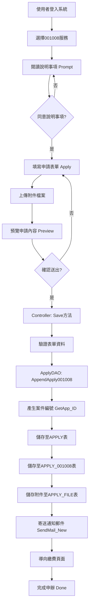
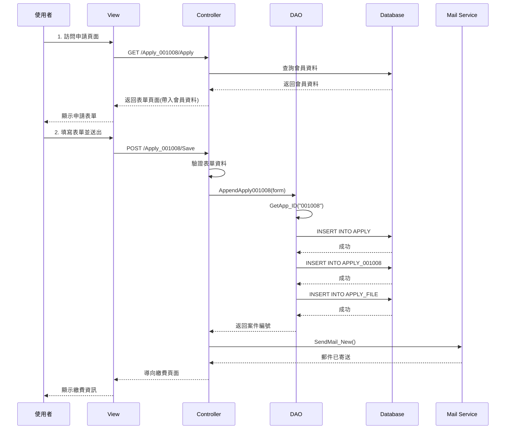

# 001008 - 醫事人員或公共衛生師請領英文證明書

## 服務概述

### 服務基本資訊

| 項目 | 內容 |
|------|------|
| 服務代碼 | 001008 |
| 服務名稱 | 醫事人員或公共衛生師請領英文證明書 |
| 業務單位 | 醫事司 |
| 是否需繳費 | 是 |
| 處理期限 | 依規定辦理 |
| 申請對象 | 已取得醫事人員或公共衛生師證書者 |

### 服務說明

提供已取得醫事人員或公共衛生師證書者，申請英文版證明書的線上申辦服務。申請人可透過本系統填寫申請資料、上傳相關文件，並完成線上繳費後，由系統自動產生英文證明書。

## 全端處理流程架構圖



## 前端實作

### 1. 路由設定

**URL 路徑**: `/Apply_001008/{action}`

**主要路由**:
- `GET /Apply_001008/Prompt` - 說明事項頁面
- `GET /Apply_001008/Apply` - 申請表單頁面
- `POST /Apply_001008/Save` - 儲存申請資料
- `GET /Apply_001008/Preview` - 預覽頁面
- `GET /Apply_001008/Done` - 完成頁面

### 2. Controller 實作

**檔案位置**: `ES/Controllers/Apply_001008Controller.cs`

```csharp
public class Apply_001008Controller : BaseController
{
    public static string s_SRV_ID = "001008";
    public static string s_SRV_NAME = "醫事人員或公共衛生師請領英文證明書";

    /// <summary>
    /// 說明事項頁面
    /// </summary>
    [HttpGet]
    public ActionResult Prompt()
    {
        SessionModel sm = SessionModel.Get();
        string s_msg_1A = "請先閱讀 「{0}說明事項」點選同意後，再進入申辦頁面 !";
        sm.LastErrorMessage = string.Format(s_msg_1A, s_SRV_NAME);
        return View("Prompt001008");
    }

    /// <summary>
    /// 申請表單頁面
    /// </summary>
    [HttpGet]
    [DisplayName("Apply_001008_申請")]
    public ActionResult Apply(string agree)
    {
        ApplyDAO dao = new ApplyDAO();
        SessionModel sm = SessionModel.Get();
        Apply_001008ViewModel form = new Apply_001008ViewModel();

        // 檢查登入狀態
        if (sm == null || sm.UserInfo == null)
        {
            return RedirectToAction("Index", "Login");
        }

        // 帶入會員資料
        ClamMember mem = sm.UserInfo.Member;
        form.Form.NAME = mem.NAME;
        form.Form.IDN = mem.IDN;
        form.Form.EMAIL = mem.MAIL;
        form.Form.TEL = mem.TEL;
        form.Form.ADDR = mem.ADDR;

        return View("Index", form);
    }

    /// <summary>
    /// 儲存申請資料
    /// </summary>
    [HttpPost]
    [DisplayName("001008_申請案件完成")]
    public ActionResult Save(Apply_001008FormModel Form)
    {
        ApplyDAO dao = new ApplyDAO();
        SessionModel sm = SessionModel.Get();
        
        // 驗證表單
        if (!ModelState.IsValid)
        {
            return View("Index", new Apply_001008ViewModel { Form = Form });
        }

        // 產生案件編號並儲存
        Form.APP_ID = dao.AppendApply001008(Form);

        // 寄送通知郵件
        dao.SendMail_New(Form.NAME, Form.EMAIL, Form.APP_ID, s_SRV_NAME, s_SRV_ID);

        // 導向繳費頁面
        return RedirectToAction("Pay", "Pay", new { appId = Form.APP_ID });
    }
}
```

### 3. ViewModel 定義

**檔案位置**: `ES/Models/ViewModels/Apply_001008ViewModel.cs`

```csharp
public class Apply_001008FormModel
{
    /// <summary>
    /// 案件編號 (系統自動產生)
    /// </summary>
    public string APP_ID { get; set; }

    /// <summary>
    /// 申請人姓名
    /// </summary>
    [Required(ErrorMessage = "請輸入姓名")]
    [Display(Name = "姓名")]
    public string NAME { get; set; }

    /// <summary>
    /// 身分證字號
    /// </summary>
    [Required(ErrorMessage = "請輸入身分證字號")]
    [Display(Name = "身分證字號")]
    public string IDN { get; set; }

    /// <summary>
    /// 證書字號
    /// </summary>
    [Required(ErrorMessage = "請輸入證書字號")]
    [Display(Name = "證書字號")]
    public string CERT_NO { get; set; }

    /// <summary>
    /// 證書類別
    /// </summary>
    [Required(ErrorMessage = "請選擇證書類別")]
    [Display(Name = "證書類別")]
    public string CERT_TYPE { get; set; }

    /// <summary>
    /// 申請用途
    /// </summary>
    [Required(ErrorMessage = "請選擇申請用途")]
    [Display(Name = "申請用途")]
    public string APP_USE { get; set; }

    /// <summary>
    /// 核發方式
    /// </summary>
    [Required(ErrorMessage = "請選擇核發方式")]
    [Display(Name = "核發方式")]
    public string CONF_TYPE { get; set; }

    /// <summary>
    /// 聯絡電話
    /// </summary>
    [Required(ErrorMessage = "請輸入聯絡電話")]
    [Display(Name = "聯絡電話")]
    public string TEL { get; set; }

    /// <summary>
    /// 電子郵件
    /// </summary>
    [Required(ErrorMessage = "請輸入電子郵件")]
    [EmailAddress(ErrorMessage = "電子郵件格式不正確")]
    [Display(Name = "電子郵件")]
    public string EMAIL { get; set; }

    /// <summary>
    /// 通訊地址
    /// </summary>
    [Required(ErrorMessage = "請輸入通訊地址")]
    [Display(Name = "通訊地址")]
    public string ADDR { get; set; }

    /// <summary>
    /// 申請份數
    /// </summary>
    [Required(ErrorMessage = "請輸入申請份數")]
    [Range(1, 99, ErrorMessage = "申請份數須介於1-99之間")]
    [Display(Name = "申請份數")]
    public int COPY_NUM { get; set; }
}
```

### 4. View 實作

**檔案位置**: `ES/Views/Apply_001008/Index.cshtml`

主要包含：
- 表單欄位輸入
- 客戶端驗證
- 附件上傳功能
- 預覽與送出按鈕

## 後端實作

### 1. 業務邏輯層 (DAO)

**檔案位置**: `ES/DataLayers/ApplyDAO.cs`

```csharp
/// <summary>
/// 新增001008申請資料
/// </summary>
public string AppendApply001008(Apply_001008FormModel form)
{
    using (SqlConnection conn = DataUtils.GetConnection())
    {
        conn.Open();
        SqlTransaction tran = conn.BeginTransaction();
        
        try
        {
            // 1. 產生案件編號
            string appId = GetApp_ID("001008");
            form.APP_ID = appId;

            // 2. 新增至 APPLY 主表
            string sqlApply = @"
                INSERT INTO APPLY (
                    APP_ID, SRV_ID, ACC_NO, IDN, NAME, 
                    APP_TIME, APP_STATUS, FLOW_CD
                ) VALUES (
                    @APP_ID, @SRV_ID, @ACC_NO, @IDN, @NAME,
                    GETDATE(), '01', '01'
                )";
            
            SqlCommand cmdApply = new SqlCommand(sqlApply, conn, tran);
            cmdApply.Parameters.AddWithValue("@APP_ID", appId);
            cmdApply.Parameters.AddWithValue("@SRV_ID", "001008");
            cmdApply.Parameters.AddWithValue("@ACC_NO", form.ACC_NO);
            cmdApply.Parameters.AddWithValue("@IDN", form.IDN);
            cmdApply.Parameters.AddWithValue("@NAME", form.NAME);
            cmdApply.ExecuteNonQuery();

            // 3. 新增至 APPLY_001008 明細表
            string sqlDetail = @"
                INSERT INTO APPLY_001008 (
                    APP_ID, CERT_NO, CERT_TYPE, APP_USE, CONF_TYPE,
                    TEL, EMAIL, ADDR, COPY_NUM
                ) VALUES (
                    @APP_ID, @CERT_NO, @CERT_TYPE, @APP_USE, @CONF_TYPE,
                    @TEL, @EMAIL, @ADDR, @COPY_NUM
                )";
            
            SqlCommand cmdDetail = new SqlCommand(sqlDetail, conn, tran);
            cmdDetail.Parameters.AddWithValue("@APP_ID", appId);
            cmdDetail.Parameters.AddWithValue("@CERT_NO", form.CERT_NO);
            cmdDetail.Parameters.AddWithValue("@CERT_TYPE", form.CERT_TYPE);
            cmdDetail.Parameters.AddWithValue("@APP_USE", form.APP_USE);
            cmdDetail.Parameters.AddWithValue("@CONF_TYPE", form.CONF_TYPE);
            cmdDetail.Parameters.AddWithValue("@TEL", form.TEL);
            cmdDetail.Parameters.AddWithValue("@EMAIL", form.EMAIL);
            cmdDetail.Parameters.AddWithValue("@ADDR", form.ADDR);
            cmdDetail.Parameters.AddWithValue("@COPY_NUM", form.COPY_NUM);
            cmdDetail.ExecuteNonQuery();

            // 4. 儲存附件檔案
            if (form.Files != null && form.Files.Count > 0)
            {
                SaveApplyFiles(appId, form.Files, conn, tran);
            }

            tran.Commit();
            return appId;
        }
        catch (Exception ex)
        {
            tran.Rollback();
            logger.Error("AppendApply001008 failed", ex);
            throw;
        }
    }
}
```

### 2. 案件編號產生

```csharp
/// <summary>
/// 產生案件編號
/// 格式: SRV_ID + YYYYMMDD + 流水號(4碼)
/// 例如: 001008202510130001
/// </summary>
public string GetApp_ID(string serviceId)
{
    using (SqlConnection conn = DataUtils.GetConnection())
    {
        conn.Open();
        string today = DateTime.Now.ToString("yyyyMMdd");
        string prefix = serviceId + today;
        
        string sql = @"
            SELECT ISNULL(MAX(CAST(RIGHT(APP_ID, 4) AS INT)), 0) + 1 AS SEQ
            FROM APPLY
            WHERE APP_ID LIKE @PREFIX + '%'";
        
        SqlCommand cmd = new SqlCommand(sql, conn);
        cmd.Parameters.AddWithValue("@PREFIX", prefix);
        
        int seq = (int)cmd.ExecuteScalar();
        string appId = prefix + seq.ToString("0000");
        
        return appId;
    }
}
```

## 資料庫結構

### 1. SERVICE 表 (服務定義)

```sql
CREATE TABLE SERVICE (
    SRV_ID VARCHAR(10) PRIMARY KEY,      -- 服務代碼
    NAME NVARCHAR(200),                  -- 服務名稱
    SC_ID INT,                           -- 服務分類ID
    ONLINE_S_MK CHAR(1),                 -- 是否上線
    ONLINE_N_MK CHAR(1),                 -- 是否開放申辦
    APP_FEE INT,                         -- 申請費用
    PAY_UNIT NVARCHAR(50),               -- 繳費單位
    PRO_DEADLINE INT,                    -- 處理期限(天)
    CA_TYPE VARCHAR(10),                 -- 憑證類型
    -- ... 其他欄位
)
```

### 2. APPLY 表 (申請主表)

```sql
CREATE TABLE APPLY (
    APP_ID VARCHAR(20) PRIMARY KEY,      -- 案件編號
    SRV_ID VARCHAR(10),                  -- 服務代碼
    ACC_NO VARCHAR(50),                  -- 帳號
    IDN VARCHAR(20),                     -- 身分證字號
    NAME NVARCHAR(100),                  -- 姓名
    APP_TIME DATETIME,                   -- 申請時間
    APP_STATUS VARCHAR(2),               -- 申請狀態
    FLOW_CD VARCHAR(2),                  -- 流程代碼
    PAY_STATUS VARCHAR(2),               -- 繳費狀態
    -- ... 其他欄位
)
```

### 3. APPLY_001008 表 (服務明細表)

```sql
CREATE TABLE APPLY_001008 (
    APP_ID VARCHAR(20) PRIMARY KEY,      -- 案件編號 (FK)
    CERT_NO VARCHAR(50),                 -- 證書字號
    CERT_TYPE VARCHAR(10),               -- 證書類別
    APP_USE VARCHAR(10),                 -- 申請用途
    CONF_TYPE VARCHAR(10),               -- 核發方式
    TEL VARCHAR(20),                     -- 聯絡電話
    EMAIL VARCHAR(100),                  -- 電子郵件
    ADDR NVARCHAR(200),                  -- 通訊地址
    COPY_NUM INT,                        -- 申請份數
    -- ... 其他欄位
)
```

### 4. APPLY_FILE 表 (附件檔案)

```sql
CREATE TABLE APPLY_FILE (
    FILE_ID INT IDENTITY PRIMARY KEY,    -- 檔案ID
    APP_ID VARCHAR(20),                  -- 案件編號 (FK)
    FILE_NAME NVARCHAR(200),             -- 檔案名稱
    FILE_PATH NVARCHAR(500),             -- 檔案路徑
    FILE_SIZE BIGINT,                    -- 檔案大小
    UPLOAD_TIME DATETIME,                -- 上傳時間
    -- ... 其他欄位
)
```

## 完整處理流程時序圖



## 相關檔案清單

### 前端檔案
- `ES/Controllers/Apply_001008Controller.cs` - 控制器
- `ES/Models/ViewModels/Apply_001008ViewModel.cs` - 視圖模型
- `ES/Views/Apply_001008/Prompt001008.cshtml` - 說明頁面
- `ES/Views/Apply_001008/Index.cshtml` - 申請表單
- `ES/Views/Apply_001008/Preview.cshtml` - 預覽頁面
- `ES/Views/Apply_001008/Done.cshtml` - 完成頁面

### 後端檔案
- `ES/DataLayers/ApplyDAO.cs` - 資料存取層
- `ES/Action/FormAction.cs` - 表單業務邏輯
- `ES/Models/Entities/APPLY.cs` - APPLY 實體
- `ES/Models/Entities/APPLY_001008.cs` - APPLY_001008 實體

### 資料庫檔案
- `SERVICE` 表 - 服務定義
- `APPLY` 表 - 申請主表
- `APPLY_001008` 表 - 服務明細表
- `APPLY_FILE` 表 - 附件檔案表
- `MAIL_LOG` 表 - 郵件記錄表

## 注意事項

1. **繳費處理**: 本服務需要繳費，申請完成後會導向繳費頁面
2. **憑證驗證**: 支援多種憑證登入方式
3. **附件上傳**: 支援多個附件上傳，需檢查檔案大小與格式
4. **郵件通知**: 申請完成後會自動寄送通知郵件給申請人
5. **案件編號**: 案件編號格式為 服務代碼+日期+流水號

## 維護記錄

| 日期 | 版本 | 說明 | 維護人員 |
|------|------|------|---------|
| 2025-10-13 | 1.0 | 初版建立 | 系統開發團隊 |

---

**版本：** 1.0
**日期：** 2025-10-20
**作者：** 柏通股份有限公司
