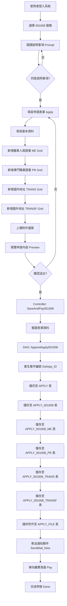
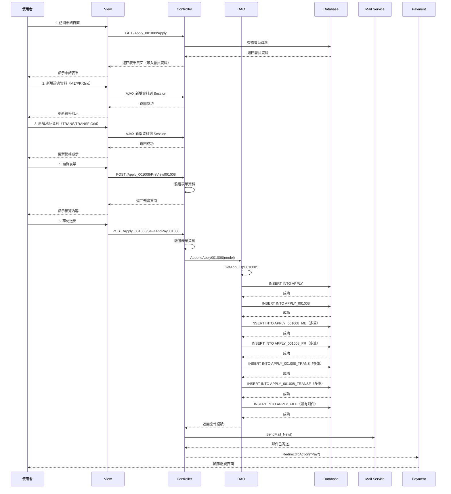

# 001008 - 醫事人員或公共衛生師請領英文證明書 - 完整技術文件

## 文件說明

本文件為 **001008 醫事人員或公共衛生師請領英文證明書** 服務的完整技術文件。

此服務與證書補換發服務（001005、001007）有顯著差異，採用獨立的架構設計。

---

## 服務基本資訊

| 項目         | 內容                                                                                                                     |
| ------------ | ------------------------------------------------------------------------------------------------------------------------ |
| 服務代碼     | 001008                                                                                                                   |
| 服務名稱     | 醫事人員或公共衛生師請領英文證明書                                                                                       |
| 業務單位     | 醫事司                                                                                                                   |
| 是否需繳費   | 是                                                                                                                       |
| 申請對象     | 已取得醫事人員或公共衛生師證書者                                                                                         |
| 服務性質     | 申請英文版證明書（非補換發）                                                                                             |
| Controller   | `ES/Controllers/Apply_001008Controller.cs` (1,542 行)                                                                    |
| ViewModel    | `ES/Models/ViewModels/Apply_001008ViewModel.cs` (892 行)                                                                 |
| Entity Model | `ES/Models/Entities/Apply_001008Model.cs`                                                                                |
| View         | `ES/Views/Apply_001008/Index.cshtml`                                                                                     |
| DAO 方法     | `ApplyDAO.AppendApply001008()`, `SaveAppDoc001008()`                                                                     |
| 主要資料表   | `APPLY`, `APPLY_001008`, `APPLY_001008_ME`, `APPLY_001008_PR`, `APPLY_001008_TRANS`, `APPLY_001008_TRANSF`, `APPLY_FILE` |

---

## 服務特色

### 與證書補換發服務的差異

| 項目       | 證書補換發服務（001005/001007） | 001008 英文證明書服務       |
| ---------- | ------------------------------- | --------------------------- |
| 服務目的   | 補發或換發遺失/毀損的證書       | 申請新的英文版證明書        |
| 資料結構   | 單一明細表                      | 主表 + 4 個子表（動態網格） |
| 證書類型   | 單一證書                        | 可申請多張不同類型證書      |
| 地址處理   | 單一通訊地址                    | 國內/國外地址分開處理       |
| 補換發原因 | 有（遺失、毀損、變更姓名等）    | 無（直接申請英文證明）      |
| 複雜度     | 較簡單                          | 較複雜（多個動態網格）      |

### 核心功能

1. **多證書申請**：可同時申請多張不同類型的醫事人員證書英文版
2. **動態網格管理**：使用動態網格（GoodsDynamicGrid）管理多筆證書資料
3. **地址分類**：區分國內和國外寄送地址
4. **專業證書支援**：支援醫事人員證書和專門職業證書

---

## 系統架構

### 架構圖

```
前端 Razor Views + jQuery + 動態網格
    ↓ HTTP POST/GET 請求
後端 ASP.NET MVC Controller
    ↓ 業務邏輯處理
資料存取層 (DAO - Dapper)
    ↓ SQL 查詢/異動（主表 + 多個子表）
SQL Server 資料庫
    ├── APPLY（主表）
    ├── APPLY_001008（服務主表）
    ├── APPLY_001008_ME（醫事人員證書明細）
    ├── APPLY_001008_PR（專門職業證書明細）
    ├── APPLY_001008_TRANS（國內地址明細）
    ├── APPLY_001008_TRANSF（國外地址明細）
    └── APPLY_FILE（附件檔案）
```

### 資料流程

```
使用者填寫表單
    ↓
新增醫事人員證書（ME Grid）
新增專門職業證書（PR Grid）
新增國內地址（TRANS Grid）
新增國外地址（TRANSF Grid）
    ↓
預覽並確認
    ↓
Controller 驗證資料
    ↓
DAO 儲存資料
    ├── INSERT INTO APPLY
    ├── INSERT INTO APPLY_001008
    ├── INSERT INTO APPLY_001008_ME (多筆)
    ├── INSERT INTO APPLY_001008_PR (多筆)
    ├── INSERT INTO APPLY_001008_TRANS (多筆)
    ├── INSERT INTO APPLY_001008_TRANSF (多筆)
    └── INSERT INTO APPLY_FILE (附件)
    ↓
寄送通知信
    ↓
導向繳費頁面
```

---

## 資料庫結構

### APPLY 資料表（申請案主表）

與其他服務共用，參考共用架構文件。

### APPLY_001008 資料表（服務主表）

| 欄位名稱        | 資料型別 | 長度 | NULL | 說明               | 範例值              |
| --------------- | -------- | ---- | ---- | ------------------ | ------------------- |
| APP_ID          | varchar  | 20   | NO   | 申請案號（PK, FK） | 001008202501130001  |
| SRV_ID          | varchar  | 6    | YES  | 服務代碼           | 001008              |
| SRC_SRV_ID      | varchar  | 6    | YES  | 來源服務代碼       | 001008              |
| ACC_NO          | varchar  | 20   | YES  | 會員帳號           | M000001234          |
| NAME            | nvarchar | 50   | YES  | 申請人姓名         | 王小明              |
| ENAME           | varchar  | 100  | YES  | 申請人英文姓名     | WANG, XIAO-MING     |
| IDN             | varchar  | 10   | YES  | 身分證字號         | A123456789          |
| TEL             | varchar  | 20   | YES  | 聯絡電話           | 02-12345678         |
| MOBILE          | varchar  | 10   | YES  | 行動電話           | 0912345678          |
| EMAIL           | varchar  | 100  | YES  | Email              | test@gmail.com      |
| ADDR_ZIP        | varchar  | 5    | YES  | 郵遞區號           | 100                 |
| ADDR_ZIP_ADDR   | nvarchar | 100  | YES  | 縣市鄉鎮           | 台北市中正區        |
| ADDR_ZIP_DETAIL | nvarchar | 200  | YES  | 詳細地址           | 中山路 1 號         |
| APPLY_DATE      | varchar  | 10   | YES  | 申請日期（民國年） | 114/01/13           |
| UNIT_CD         | varchar  | 10   | YES  | 業務單位代碼       | 001                 |
| FlowMode        | varchar  | 1    | YES  | 流程模式           | 1                   |
| IsNew           | bit      | -    | YES  | 是否為新案         | 1                   |
| DEL_MK          | varchar  | 1    | YES  | 刪除標記           | N                   |
| ADD_TIME        | datetime | -    | YES  | 新增時間           | 2025-01-13 10:30:00 |
| ADD_FUN_CD      | varchar  | 20   | YES  | 新增功能代碼       | WEB-APPLY           |
| ADD_ACC         | varchar  | 20   | YES  | 新增帳號           | M000001234          |

### APPLY_001008_ME 資料表（醫事人員證書明細）

| 欄位名稱       | 資料型別 | 長度 | NULL | 說明               | 範例值              |
| -------------- | -------- | ---- | ---- | ------------------ | ------------------- |
| APP_ID         | varchar  | 20   | NO   | 申請案號（PK, FK） | 001008202501130001  |
| SEQ            | int      | -    | NO   | 序號（PK）         | 1                   |
| CERT_TYPE      | varchar  | 10   | YES  | 證書類別代碼       | 01                  |
| CERT_TYPE_NAME | nvarchar | 50   | YES  | 證書類別名稱       | 醫師                |
| CERT_NO        | varchar  | 50   | YES  | 證書字號           | 醫師字第 12345 號   |
| ISSUE_DATE     | datetime | -    | YES  | 發證日期           | 2020-01-15          |
| COPY_NUM       | int      | -    | YES  | 申請份數           | 2                   |
| USE_PURPOSE    | nvarchar | 200  | YES  | 使用目的           | 出國進修            |
| ADD_TIME       | datetime | -    | YES  | 新增時間           | 2025-01-13 10:30:00 |

**證書類別代碼對照表：**

| 代碼 | 證書類別名稱 |
| ---- | ------------ |
| 01   | 醫師         |
| 02   | 護理師       |
| 03   | 藥師         |
| 04   | 醫事檢驗師   |
| 05   | 醫事放射師   |
| 06   | 物理治療師   |
| 07   | 職能治療師   |
| 08   | 呼吸治療師   |
| 09   | 營養師       |
| 10   | 臨床心理師   |
| 11   | 諮商心理師   |
| 12   | 語言治療師   |
| 13   | 聽力師       |
| 14   | 牙體技術師   |
| 15   | 驗光師       |
| 16   | 公共衛生師   |

### APPLY_001008_PR 資料表（專門職業證書明細）

| 欄位名稱       | 資料型別 | 長度 | NULL | 說明               | 範例值              |
| -------------- | -------- | ---- | ---- | ------------------ | ------------------- |
| APP_ID         | varchar  | 20   | NO   | 申請案號（PK, FK） | 001008202501130001  |
| SEQ            | int      | -    | NO   | 序號（PK）         | 1                   |
| PROF_TYPE      | varchar  | 10   | YES  | 專業類別代碼       | 01                  |
| PROF_TYPE_NAME | nvarchar | 50   | YES  | 專業類別名稱       | 專科醫師            |
| CERT_NO        | varchar  | 50   | YES  | 證書字號           | 專醫字第 12345 號   |
| ISSUE_DATE     | datetime | -    | YES  | 發證日期           | 2021-03-20          |
| COPY_NUM       | int      | -    | YES  | 申請份數           | 1                   |
| USE_PURPOSE    | nvarchar | 200  | YES  | 使用目的           | 申請國外執業        |
| ADD_TIME       | datetime | -    | YES  | 新增時間           | 2025-01-13 10:30:00 |

### APPLY_001008_TRANS 資料表（國內寄送地址明細）

| 欄位名稱    | 資料型別 | 長度 | NULL | 說明               | 範例值                  |
| ----------- | -------- | ---- | ---- | ------------------ | ----------------------- |
| APP_ID      | varchar  | 20   | NO   | 申請案號（PK, FK） | 001008202501130001      |
| SEQ         | int      | -    | NO   | 序號（PK）         | 1                       |
| RECV_NAME   | nvarchar | 50   | YES  | 收件人姓名         | 王小明                  |
| RECV_TEL    | varchar  | 20   | YES  | 收件人電話         | 02-12345678             |
| RECV_MOBILE | varchar  | 10   | YES  | 收件人手機         | 0912345678              |
| ADDR_ZIP    | varchar  | 5    | YES  | 郵遞區號           | 100                     |
| ADDR_CITY   | nvarchar | 50   | YES  | 縣市               | 台北市                  |
| ADDR_TOWN   | nvarchar | 50   | YES  | 鄉鎮區             | 中正區                  |
| ADDR_DETAIL | nvarchar | 200  | YES  | 詳細地址           | 中山路 1 號             |
| ADDR_FULL   | nvarchar | 300  | YES  | 完整地址           | 台北市中正區中山路 1 號 |
| ADD_TIME    | datetime | -    | YES  | 新增時間           | 2025-01-13 10:30:00     |

### APPLY_001008_TRANSF 資料表（國外寄送地址明細）

| 欄位名稱   | 資料型別 | 長度 | NULL | 說明                 | 範例值                                               |
| ---------- | -------- | ---- | ---- | -------------------- | ---------------------------------------------------- |
| APP_ID     | varchar  | 20   | NO   | 申請案號（PK, FK）   | 001008202501130001                                   |
| SEQ        | int      | -    | NO   | 序號（PK）           | 1                                                    |
| RECV_NAME  | varchar  | 100  | YES  | 收件人英文姓名       | WANG, XIAO-MING                                      |
| RECV_TEL   | varchar  | 30   | YES  | 收件人電話（含國碼） | +1-123-456-7890                                      |
| COUNTRY    | varchar  | 50   | YES  | 國家                 | United States                                        |
| STATE      | varchar  | 50   | YES  | 州/省                | California                                           |
| CITY       | varchar  | 50   | YES  | 城市                 | Los Angeles                                          |
| ADDR_LINE1 | varchar  | 200  | YES  | 地址第一行           | 123 Main Street                                      |
| ADDR_LINE2 | varchar  | 200  | YES  | 地址第二行           | Apt 456                                              |
| ZIP_CODE   | varchar  | 20   | YES  | 郵遞區號             | 90001                                                |
| ADDR_FULL  | varchar  | 500  | YES  | 完整英文地址         | 123 Main Street, Apt 456, Los Angeles, CA 90001, USA |
| ADD_TIME   | datetime | -    | YES  | 新增時間             | 2025-01-13 10:30:00                                  |

---

## ViewModel 結構

### Apply_001008FormModel 主要屬性

```csharp
public class Apply_001008FormModel : Apply_001008Model
{
    // === 基本資料 ===
    public string APP_ID { get; set; }              // 申請案號
    public string SRV_ID { get; set; }              // 服務代碼
    public string SRC_SRV_ID { get; set; }          // 來源服務代碼
    public string ACC_NO { get; set; }              // 會員帳號
    public string NAME { get; set; }                // 申請人姓名
    public string ENAME { get; set; }               // 申請人英文姓名
    public string IDN { get; set; }                 // 身分證字號

    // === 聯絡資訊 ===
    public string TEL { get; set; }                 // 聯絡電話
    public string MOBILE { get; set; }              // 行動電話
    public string EMAIL { get; set; }               // Email

    // === 地址資訊 ===
    public string ADDR_ZIP { get; set; }            // 郵遞區號
    public string ADDR_ZIP_ADDR { get; set; }       // 縣市鄉鎮
    public string ADDR_ZIP_DETAIL { get; set; }     // 詳細地址

    // === 申請資訊 ===
    public string APPLY_DATE { get; set; }          // 申請日期
    public string UNIT_CD { get; set; }             // 業務單位代碼
    public string FlowMode { get; set; }            // 流程模式
    public bool IsNew { get; set; }                 // 是否為新案

    // === 動態網格 ===
    /// <summary>醫事人員證書動態網格</summary>
    public GoodsDynamicGrid<Apply_001008_MeViewModel> ME { get; set; }

    /// <summary>專門職業證書動態網格</summary>
    public GoodsDynamicGrid<Apply_001008_PrViewModel> PR { get; set; }

    /// <summary>國內寄送地址動態網格</summary>
    public GoodsDynamicGrid<Apply_001008_TransViewModel> TRANS { get; set; }

    /// <summary>國外寄送地址動態網格</summary>
    public GoodsDynamicGrid<Apply_001008_TransFViewModel> TRANSF { get; set; }
}
```

### 動態網格 ViewModel

#### Apply_001008_MeViewModel（醫事人員證書）

```csharp
public class Apply_001008_MeViewModel
{
    public string APP_ID { get; set; }              // 申請案號
    public int SEQ { get; set; }                    // 序號

    [Display(Name = "證書類別")]
    [Required(ErrorMessage = "請選擇證書類別")]
    public string CERT_TYPE { get; set; }           // 證書類別代碼

    public string CERT_TYPE_NAME { get; set; }      // 證書類別名稱

    [Display(Name = "證書字號")]
    [Required(ErrorMessage = "請輸入證書字號")]
    public string CERT_NO { get; set; }             // 證書字號

    [Display(Name = "發證日期")]
    public DateTime? ISSUE_DATE { get; set; }       // 發證日期

    [Display(Name = "申請份數")]
    [Required(ErrorMessage = "請輸入申請份數")]
    [Range(1, 99, ErrorMessage = "申請份數須介於1-99之間")]
    public int COPY_NUM { get; set; }               // 申請份數

    [Display(Name = "使用目的")]
    [MaxLength(200, ErrorMessage = "使用目的最多200字")]
    public string USE_PURPOSE { get; set; }         // 使用目的
}
```

#### Apply_001008_TransViewModel（國內寄送地址）

```csharp
public class Apply_001008_TransViewModel
{
    public string APP_ID { get; set; }              // 申請案號
    public int SEQ { get; set; }                    // 序號

    [Display(Name = "收件人姓名")]
    [Required(ErrorMessage = "請輸入收件人姓名")]
    public string RECV_NAME { get; set; }           // 收件人姓名

    [Display(Name = "收件人電話")]
    [Required(ErrorMessage = "請輸入收件人電話")]
    public string RECV_TEL { get; set; }            // 收件人電話

    [Display(Name = "收件人手機")]
    public string RECV_MOBILE { get; set; }         // 收件人手機

    [Display(Name = "郵遞區號")]
    [Required(ErrorMessage = "請選擇郵遞區號")]
    public string ADDR_ZIP { get; set; }            // 郵遞區號

    [Display(Name = "縣市")]
    public string ADDR_CITY { get; set; }           // 縣市

    [Display(Name = "鄉鎮區")]
    public string ADDR_TOWN { get; set; }           // 鄉鎮區

    [Display(Name = "詳細地址")]
    [Required(ErrorMessage = "請輸入詳細地址")]
    public string ADDR_DETAIL { get; set; }         // 詳細地址

    public string ADDR_FULL { get; set; }           // 完整地址（自動組合）
}
```

#### Apply_001008_TransFViewModel（國外寄送地址）

```csharp
public class Apply_001008_TransFViewModel
{
    public string APP_ID { get; set; }              // 申請案號
    public int SEQ { get; set; }                    // 序號

    [Display(Name = "收件人英文姓名")]
    [Required(ErrorMessage = "請輸入收件人英文姓名")]
    public string RECV_NAME { get; set; }           // 收件人英文姓名

    [Display(Name = "收件人電話（含國碼）")]
    [Required(ErrorMessage = "請輸入收件人電話")]
    public string RECV_TEL { get; set; }            // 收件人電話（含國碼）

    [Display(Name = "國家")]
    [Required(ErrorMessage = "請輸入國家")]
    public string COUNTRY { get; set; }             // 國家

    [Display(Name = "州/省")]
    public string STATE { get; set; }               // 州/省

    [Display(Name = "城市")]
    [Required(ErrorMessage = "請輸入城市")]
    public string CITY { get; set; }                // 城市

    [Display(Name = "地址第一行")]
    [Required(ErrorMessage = "請輸入地址")]
    public string ADDR_LINE1 { get; set; }          // 地址第一行

    [Display(Name = "地址第二行")]
    public string ADDR_LINE2 { get; set; }          // 地址第二行

    [Display(Name = "郵遞區號")]
    [Required(ErrorMessage = "請輸入郵遞區號")]
    public string ZIP_CODE { get; set; }            // 郵遞區號

    public string ADDR_FULL { get; set; }           // 完整英文地址（自動組合）
}
```

---

## Controller 實作

### 檔案位置

`ES/Controllers/Apply_001008Controller.cs` (1,542 行)

### 主要 Action Methods

#### 1. Prompt() - 說明事項頁面

```csharp
[HttpGet]
public ActionResult Prompt()
{
    SessionModel sm = SessionModel.Get();
    Apply_001008FormModel model = new Apply_001008FormModel();
    string s_msg_1A = "請先閱讀 「{0}說明事項」點選同意後，再進入申辦頁面 !";
    sm.LastErrorMessage = string.Format(s_msg_1A, s_SRV_NAME);
    return View("Prompt001008", model);
}
```

**功能說明：**

- 顯示服務說明事項頁面
- 要求使用者閱讀並同意後才能進入申請頁面
- 設定提示訊息到 Session

#### 2. Apply() - 申請表單頁面

```csharp
[DisplayName("Apply_001008_申請")]
[HttpGet]
public ActionResult Apply(string agree)
{
    SessionModel sm = SessionModel.Get();
    Apply_001008FormModel model = new Apply_001008FormModel();

    // 檢查登入狀態
    if (sm == null || sm.UserInfo == null)
    {
        return RedirectToAction("Index", "Login");
    }

    // 檢查是否同意說明事項
    if (string.IsNullOrEmpty(agree)) { agree = "0"; }
    if (agree != null && !agree.Equals("1"))
    {
        return Prompt();
    }

    // 帶入會員資料
    ShareDAO dao = new ShareDAO();
    var UsIn = sm.UserInfo.Member;

    model.ACC_NO = UsIn.ACC_NO;
    model.SRV_ID = "001008";
    model.SRC_SRV_ID = "001008";
    model.UNIT_CD = dao.GetServiceUnitCD(model.SRV_ID);
    model.NAME = UsIn.NAME;
    model.IDN = UsIn.IDN;
    model.ENAME = UsIn.ENAME;
    model.TEL = UsIn.TEL;
    model.MOBILE = UsIn.MOBILE;
    model.EMAIL = UsIn.MAIL;

    // 處理地址資訊
    TblZIPCODE zip = new TblZIPCODE();
    zip.ZIP_CO = sm.UserInfo.Member.TOWN_CD;
    var address = dao.GetRow(zip);

    model.ADDR_ZIP = sm.UserInfo.Member.TOWN_CD;
    if (address != null && !string.IsNullOrEmpty(address.TOWNNM))
    {
        model.ADDR_ZIP_ADDR = address.TOWNNM;
        model.ADDR_ZIP_DETAIL = sm.UserInfo.Member.ADDR
            .TONotNullString()
            .Replace(address.CITYNM + address.TOWNNM, "");
    }
    else
    {
        model.ADDR_ZIP_ADDR = string.Empty;
        model.ADDR_ZIP_DETAIL = sm.UserInfo.Member.ADDR;
    }

    model.APPLY_DATE = Commons.HelperUtil.DateTimeToString(DateTime.Now);
    model.FlowMode = "1";

    return View("Index", model);
}
```

**功能說明：**

- 檢查使用者登入狀態
- 驗證是否同意說明事項
- 從會員資料自動帶入基本資料
- 處理地址資訊（郵遞區號、縣市鄉鎮、詳細地址）
- 初始化動態網格（ME, PR, TRANS, TRANSF）

#### 3. PreView001008() - 預覽頁面

```csharp
[HttpPost]
public ActionResult PreView001008(Apply_001008FormModel model)
{
    SessionModel sm = SessionModel.Get();

    // 驗證表單資料
    if (!ModelState.IsValid)
    {
        return View("Index", model);
    }

    // 重新載入動態網格資料
    model.ME.GetGoodsList();
    model.PR.GetGoodsList();
    model.TRANS.GetGoodsList();
    model.TRANSF.GetGoodsList();

    return View("Preview001008", model);
}
```

**功能說明：**

- 驗證表單資料完整性
- 載入所有動態網格的資料
- 顯示預覽頁面供使用者確認

#### 4. SaveAndPay001008() - 儲存並繳費

```csharp
[HttpPost]
[DisplayName("001008_申請案件完成")]
public ActionResult SaveAndPay001008(Apply_001008FormModel model)
{
    SessionModel sm = SessionModel.Get();
    ApplyDAO dao = new ApplyDAO();

    try
    {
        // 驗證表單
        if (!ModelState.IsValid)
        {
            return View("Index", model);
        }

        // 驗證至少要有一筆證書資料
        if ((model.ME.GoodsList == null || model.ME.GoodsList.Count == 0) &&
            (model.PR.GoodsList == null || model.PR.GoodsList.Count == 0))
        {
            ModelState.AddModelError("", "請至少新增一筆證書資料");
            return View("Index", model);
        }

        // 驗證至少要有一筆寄送地址
        if ((model.TRANS.GoodsList == null || model.TRANS.GoodsList.Count == 0) &&
            (model.TRANSF.GoodsList == null || model.TRANSF.GoodsList.Count == 0))
        {
            ModelState.AddModelError("", "請至少新增一筆寄送地址");
            return View("Index", model);
        }

        // 儲存申請資料
        string appId = dao.AppendApply001008(model);
        model.APP_ID = appId;

        // 寄送通知郵件
        dao.SendMail_New(model.NAME, model.EMAIL, appId, s_SRV_NAME, "001008");

        // 導向繳費頁面
        return RedirectToAction("Pay", "Pay", new { appId = appId });
    }
    catch (Exception ex)
    {
        ModelState.AddModelError("", "儲存失敗：" + ex.Message);
        return View("Index", model);
    }
}
```

**功能說明：**

- 驗證表單資料
- 驗證至少要有一筆證書資料（ME 或 PR）
- 驗證至少要有一筆寄送地址（TRANS 或 TRANSF）
- 呼叫 DAO 儲存資料到資料庫
- 寄送通知郵件
- 導向繳費頁面

---

## DAO 實作

### 檔案位置

`ES/DataLayers/ApplyDAO.cs`

### AppendApply001008() 方法

```csharp
/// <summary>
/// 新增 001008 申請資料
/// </summary>
public string AppendApply001008(Apply_001008FormModel model)
{
    using (SqlConnection conn = DataUtils.GetConnection())
    {
        conn.Open();
        SqlTransaction tran = conn.BeginTransaction();

        try
        {
            // 1. 產生案件編號
            string appId = GetApp_ID("001008");
            model.APP_ID = appId;

            // 2. 新增至 APPLY 主表
            string sqlApply = @"
                INSERT INTO APPLY (
                    APP_ID, SRV_ID, ACC_NO, IDN, NAME,
                    APP_TIME, APP_STATUS, FLOW_CD, DEL_MK
                ) VALUES (
                    @APP_ID, @SRV_ID, @ACC_NO, @IDN, @NAME,
                    GETDATE(), '01', '01', 'N'
                )";

            conn.Execute(sqlApply, new
            {
                APP_ID = appId,
                SRV_ID = "001008",
                ACC_NO = model.ACC_NO,
                IDN = model.IDN,
                NAME = model.NAME
            }, tran);

            // 3. 新增至 APPLY_001008 服務主表
            string sqlDetail = @"
                INSERT INTO APPLY_001008 (
                    APP_ID, SRV_ID, SRC_SRV_ID, ACC_NO, NAME, ENAME, IDN,
                    TEL, MOBILE, EMAIL, ADDR_ZIP, ADDR_ZIP_ADDR, ADDR_ZIP_DETAIL,
                    APPLY_DATE, UNIT_CD, FlowMode, IsNew, DEL_MK,
                    ADD_TIME, ADD_FUN_CD, ADD_ACC
                ) VALUES (
                    @APP_ID, @SRV_ID, @SRC_SRV_ID, @ACC_NO, @NAME, @ENAME, @IDN,
                    @TEL, @MOBILE, @EMAIL, @ADDR_ZIP, @ADDR_ZIP_ADDR, @ADDR_ZIP_DETAIL,
                    @APPLY_DATE, @UNIT_CD, @FlowMode, @IsNew, 'N',
                    GETDATE(), 'WEB-APPLY', @ACC_NO
                )";

            conn.Execute(sqlDetail, model, tran);

            // 4. 新增醫事人員證書明細（APPLY_001008_ME）
            if (model.ME != null && model.ME.GoodsList != null && model.ME.GoodsList.Count > 0)
            {
                string sqlME = @"
                    INSERT INTO APPLY_001008_ME (
                        APP_ID, SEQ, CERT_TYPE, CERT_TYPE_NAME, CERT_NO,
                        ISSUE_DATE, COPY_NUM, USE_PURPOSE, ADD_TIME
                    ) VALUES (
                        @APP_ID, @SEQ, @CERT_TYPE, @CERT_TYPE_NAME, @CERT_NO,
                        @ISSUE_DATE, @COPY_NUM, @USE_PURPOSE, GETDATE()
                    )";

                int seq = 1;
                foreach (var item in model.ME.GoodsList)
                {
                    item.APP_ID = appId;
                    item.SEQ = seq++;
                    conn.Execute(sqlME, item, tran);
                }
            }

            // 5. 新增專門職業證書明細（APPLY_001008_PR）
            if (model.PR != null && model.PR.GoodsList != null && model.PR.GoodsList.Count > 0)
            {
                string sqlPR = @"
                    INSERT INTO APPLY_001008_PR (
                        APP_ID, SEQ, PROF_TYPE, PROF_TYPE_NAME, CERT_NO,
                        ISSUE_DATE, COPY_NUM, USE_PURPOSE, ADD_TIME
                    ) VALUES (
                        @APP_ID, @SEQ, @PROF_TYPE, @PROF_TYPE_NAME, @CERT_NO,
                        @ISSUE_DATE, @COPY_NUM, @USE_PURPOSE, GETDATE()
                    )";

                int seq = 1;
                foreach (var item in model.PR.GoodsList)
                {
                    item.APP_ID = appId;
                    item.SEQ = seq++;
                    conn.Execute(sqlPR, item, tran);
                }
            }

            // 6. 新增國內寄送地址明細（APPLY_001008_TRANS）
            if (model.TRANS != null && model.TRANS.GoodsList != null && model.TRANS.GoodsList.Count > 0)
            {
                string sqlTRANS = @"
                    INSERT INTO APPLY_001008_TRANS (
                        APP_ID, SEQ, RECV_NAME, RECV_TEL, RECV_MOBILE,
                        ADDR_ZIP, ADDR_CITY, ADDR_TOWN, ADDR_DETAIL, ADDR_FULL,
                        ADD_TIME
                    ) VALUES (
                        @APP_ID, @SEQ, @RECV_NAME, @RECV_TEL, @RECV_MOBILE,
                        @ADDR_ZIP, @ADDR_CITY, @ADDR_TOWN, @ADDR_DETAIL, @ADDR_FULL,
                        GETDATE()
                    )";

                int seq = 1;
                foreach (var item in model.TRANS.GoodsList)
                {
                    item.APP_ID = appId;
                    item.SEQ = seq++;
                    // 組合完整地址
                    item.ADDR_FULL = $"{item.ADDR_CITY}{item.ADDR_TOWN}{item.ADDR_DETAIL}";
                    conn.Execute(sqlTRANS, item, tran);
                }
            }

            // 7. 新增國外寄送地址明細（APPLY_001008_TRANSF）
            if (model.TRANSF != null && model.TRANSF.GoodsList != null && model.TRANSF.GoodsList.Count > 0)
            {
                string sqlTRANSF = @"
                    INSERT INTO APPLY_001008_TRANSF (
                        APP_ID, SEQ, RECV_NAME, RECV_TEL, COUNTRY, STATE, CITY,
                        ADDR_LINE1, ADDR_LINE2, ZIP_CODE, ADDR_FULL, ADD_TIME
                    ) VALUES (
                        @APP_ID, @SEQ, @RECV_NAME, @RECV_TEL, @COUNTRY, @STATE, @CITY,
                        @ADDR_LINE1, @ADDR_LINE2, @ZIP_CODE, @ADDR_FULL, GETDATE()
                    )";

                int seq = 1;
                foreach (var item in model.TRANSF.GoodsList)
                {
                    item.APP_ID = appId;
                    item.SEQ = seq++;
                    // 組合完整英文地址
                    item.ADDR_FULL = $"{item.ADDR_LINE1}";
                    if (!string.IsNullOrEmpty(item.ADDR_LINE2))
                        item.ADDR_FULL += $", {item.ADDR_LINE2}";
                    item.ADDR_FULL += $", {item.CITY}";
                    if (!string.IsNullOrEmpty(item.STATE))
                        item.ADDR_FULL += $", {item.STATE}";
                    item.ADDR_FULL += $" {item.ZIP_CODE}, {item.COUNTRY}";

                    conn.Execute(sqlTRANSF, item, tran);
                }
            }

            // 8. 儲存附件檔案（如有）
            if (model.Files != null && model.Files.Count > 0)
            {
                SaveApplyFiles(appId, model.Files, conn, tran);
            }

            tran.Commit();
            return appId;
        }
        catch (Exception ex)
        {
            tran.Rollback();
            logger.Error("AppendApply001008 failed", ex);
            throw;
        }
    }
}
```

**方法說明：**

1. **產生案件編號**：呼叫 `GetApp_ID("001008")` 產生唯一案件編號
2. **新增 APPLY 主表**：儲存基本申請資訊
3. **新增 APPLY_001008 服務主表**：儲存服務專屬的基本資料
4. **新增 APPLY_001008_ME**：儲存醫事人員證書明細（可多筆）
5. **新增 APPLY_001008_PR**：儲存專門職業證書明細（可多筆）
6. **新增 APPLY_001008_TRANS**：儲存國內寄送地址明細（可多筆）
7. **新增 APPLY_001008_TRANSF**：儲存國外寄送地址明細（可多筆）
8. **儲存附件檔案**：儲存上傳的附件到 APPLY_FILE 表
9. **交易管理**：使用 SqlTransaction 確保資料一致性

**重要特性：**

- **交易處理**：所有資料庫操作在同一個交易中，確保資料完整性
- **序號管理**：每個子表的資料都有獨立的序號（SEQ）
- **地址組合**：自動組合完整地址（國內/國外格式不同）
- **錯誤處理**：發生錯誤時回滾交易並記錄日誌

---

## 前端實作

### View 檔案結構

#### 1. Prompt001008.cshtml - 說明事項頁面

**檔案位置**：`ES/Views/Apply_001008/Prompt001008.cshtml`

**主要內容：**

- 服務說明事項
- 申請須知
- 同意按鈕（導向 Apply 頁面）

#### 2. Index.cshtml - 申請表單頁面

**檔案位置**：`ES/Views/Apply_001008/Index.cshtml`

**主要區塊：**

```html
@model ES.Models.ViewModels.Apply_001008FormModel

<!-- 基本資料區塊 -->
<div class="form-section">
  <h3>基本資料</h3>
  @Html.TextBoxFor(m => m.NAME, new { @class = "form-control", @readonly =
  "readonly" }) @Html.TextBoxFor(m => m.ENAME, new { @class = "form-control" })
  @Html.TextBoxFor(m => m.IDN, new { @class = "form-control", @readonly =
  "readonly" }) @Html.TextBoxFor(m => m.TEL, new { @class = "form-control" })
  @Html.TextBoxFor(m => m.MOBILE, new { @class = "form-control" })
  @Html.TextBoxFor(m => m.EMAIL, new { @class = "form-control" })
</div>

<!-- 地址資料區塊 -->
<div class="form-section">
  <h3>通訊地址</h3>
  @Html.TextBoxFor(m => m.ADDR_ZIP, new { @class = "form-control
  zipcode-selector" }) @Html.TextBoxFor(m => m.ADDR_ZIP_ADDR, new { @class =
  "form-control", @readonly = "readonly" }) @Html.TextBoxFor(m =>
  m.ADDR_ZIP_DETAIL, new { @class = "form-control" })
</div>

<!-- 醫事人員證書動態網格 -->
<div class="form-section">
  <h3>醫事人員證書</h3>
  @Html.Partial("_GoodsDynamicGrid", Model.ME)
</div>

<!-- 專門職業證書動態網格 -->
<div class="form-section">
  <h3>專門職業證書</h3>
  @Html.Partial("_GoodsDynamicGrid", Model.PR)
</div>

<!-- 國內寄送地址動態網格 -->
<div class="form-section">
  <h3>國內寄送地址</h3>
  @Html.Partial("_GoodsDynamicGrid", Model.TRANS)
</div>

<!-- 國外寄送地址動態網格 -->
<div class="form-section">
  <h3>國外寄送地址</h3>
  @Html.Partial("_GoodsDynamicGrid", Model.TRANSF)
</div>

<!-- 附件上傳區塊 -->
<div class="form-section">
  <h3>附件上傳</h3>
  <input type="file" name="files" multiple class="form-control" />
</div>

<!-- 按鈕區塊 -->
<div class="form-actions">
  <button type="button" class="btn btn-primary" onclick="previewForm()">
    預覽
  </button>
  <button type="button" class="btn btn-default" onclick="history.back()">
    返回
  </button>
</div>
```

#### 3. Preview001008.cshtml - 預覽頁面

**檔案位置**：`ES/Views/Apply_001008/Preview001008.cshtml`

**主要內容：**

- 顯示所有填寫的資料（唯讀）
- 顯示所有動態網格的資料列表
- 確認送出按鈕
- 返回修改按鈕

#### 4. Done.cshtml - 完成頁面

**檔案位置**：`ES/Views/Apply_001008/Done.cshtml`

**主要內容：**

- 顯示申請成功訊息
- 顯示案件編號
- 提供繳費連結
- 提供查詢案件連結

### JavaScript 實作

#### 表單驗證

```javascript
function validateForm() {
  // 驗證基本資料
  if (!$("#NAME").val()) {
    alert("請輸入姓名");
    return false;
  }

  if (!$("#ENAME").val()) {
    alert("請輸入英文姓名");
    return false;
  }

  if (!$("#EMAIL").val()) {
    alert("請輸入Email");
    return false;
  }

  // 驗證至少要有一筆證書資料
  var meCount = $("#ME_Grid tbody tr").length;
  var prCount = $("#PR_Grid tbody tr").length;
  if (meCount == 0 && prCount == 0) {
    alert("請至少新增一筆證書資料");
    return false;
  }

  // 驗證至少要有一筆寄送地址
  var transCount = $("#TRANS_Grid tbody tr").length;
  var transfCount = $("#TRANSF_Grid tbody tr").length;
  if (transCount == 0 && transfCount == 0) {
    alert("請至少新增一筆寄送地址");
    return false;
  }

  return true;
}
```

#### 預覽表單

```javascript
function previewForm() {
  if (validateForm()) {
    $("#mainForm").attr("action", "/Apply_001008/PreView001008");
    $("#mainForm").submit();
  }
}
```

#### 送出表單

```javascript
function submitForm() {
  if (confirm("確定要送出申請嗎？")) {
    $("#mainForm").attr("action", "/Apply_001008/SaveAndPay001008");
    $("#mainForm").submit();
  }
}
```

---

## 動態網格（GoodsDynamicGrid）

### 功能說明

動態網格是一個可重用的元件，用於管理多筆明細資料。

**主要功能：**

- 新增資料列
- 編輯資料列
- 刪除資料列
- 資料驗證
- 資料暫存（Session）

### 使用方式

#### 1. 初始化動態網格

```csharp
// 在 ViewModel 建構子中初始化
ME = new GoodsDynamicGrid<Apply_001008_MeViewModel>();
ME.APP_ID = this.APP_ID;
ME.model = new Apply_001008_MeViewModel();
ME.GetGoodsList();
ME.SourceModelName = "ME";
ME.IsReadOnly = false;
ME.IsNewOpen = true;
ME.IsDeleteOpen = true;
```

#### 2. 在 View 中顯示

```html
@Html.Partial("_GoodsDynamicGrid", Model.ME)
```

#### 3. 新增資料

使用者點擊「新增」按鈕 → 彈出對話框 → 填寫資料 → 儲存到 Session → 重新載入網格

#### 4. 編輯資料

使用者點擊「編輯」按鈕 → 彈出對話框（帶入現有資料）→ 修改資料 → 更新 Session → 重新載入網格

#### 5. 刪除資料

使用者點擊「刪除」按鈕 → 確認對話框 → 從 Session 移除 → 重新載入網格

### 資料流程

```
使用者操作
    ↓
JavaScript 處理
    ↓
AJAX 呼叫 Controller Action
    ↓
Controller 操作 Session
    ↓
返回 JSON 結果
    ↓
JavaScript 更新網格顯示
```

---

## 完整處理流程

### 流程圖



### 時序圖



---

## 技術重點

### 1. 動態網格管理

**優點：**

- 可重用元件
- 支援多筆資料管理
- 資料暫存於 Session
- 提供新增/編輯/刪除功能

**注意事項：**

- Session 資料需要定期清理
- 大量資料時考慮效能問題
- 需要處理並行存取問題

### 2. 交易管理

**重要性：**

- 確保資料一致性
- 多表插入時必須使用交易
- 發生錯誤時自動回滾

**實作方式：**

```csharp
using (SqlConnection conn = DataUtils.GetConnection())
{
    conn.Open();
    SqlTransaction tran = conn.BeginTransaction();
    try
    {
        // 多個資料庫操作
        tran.Commit();
    }
    catch
    {
        tran.Rollback();
        throw;
    }
}
```

### 3. 地址處理

**國內地址：**

- 使用郵遞區號選擇器
- 自動帶入縣市鄉鎮
- 組合完整地址

**國外地址：**

- 英文格式輸入
- 包含國家、州/省、城市
- 組合完整英文地址

### 4. 資料驗證

**前端驗證：**

- jQuery Validation
- 即時驗證回饋
- 提升使用者體驗

**後端驗證：**

- Data Annotations
- ModelState 驗證
- 業務邏輯驗證

### 5. 檔案上傳

**支援功能：**

- 多檔案上傳
- 檔案大小限制
- 檔案格式檢查
- 儲存到資料庫

---

## 相關檔案清單

### 前端檔案

- `ES/Controllers/Apply_001008Controller.cs` (1,542 行) - 控制器
- `ES/Models/ViewModels/Apply_001008ViewModel.cs` (892 行) - 視圖模型
- `ES/Views/Apply_001008/Prompt001008.cshtml` - 說明頁面
- `ES/Views/Apply_001008/Index.cshtml` - 申請表單
- `ES/Views/Apply_001008/Preview001008.cshtml` - 預覽頁面
- `ES/Views/Apply_001008/Done.cshtml` - 完成頁面
- `ES/Views/Shared/_GoodsDynamicGrid.cshtml` - 動態網格共用元件

### 後端檔案

- `ES/DataLayers/ApplyDAO.cs` - 資料存取層
- `ES/DataLayers/ShareDAO.cs` - 共用資料存取層
- `ES/Models/Entities/Apply_001008Model.cs` - 實體模型
- `ES/Models/Entities/APPLY.cs` - APPLY 實體
- `ES/Services/GoodsDynamicGrid.cs` - 動態網格服務

### 資料庫資料表

- `SERVICE` - 服務定義表
- `APPLY` - 申請主表
- `APPLY_001008` - 服務主表
- `APPLY_001008_ME` - 醫事人員證書明細表
- `APPLY_001008_PR` - 專門職業證書明細表
- `APPLY_001008_TRANS` - 國內寄送地址明細表
- `APPLY_001008_TRANSF` - 國外寄送地址明細表
- `APPLY_FILE` - 附件檔案表
- `MAIL_LOG` - 郵件記錄表

---

## 注意事項

### 1. 資料完整性

- 至少要有一筆證書資料（ME 或 PR）
- 至少要有一筆寄送地址（TRANS 或 TRANSF）
- 所有必填欄位都要填寫

### 2. 繳費處理

- 本服務需要繳費
- 申請完成後會導向繳費頁面
- 繳費完成後才會進入後續處理流程

### 3. 郵件通知

- 申請完成後自動寄送通知郵件
- 郵件包含案件編號和申請資訊
- 需要確保 Email 正確

### 4. 附件上傳

- 支援多個附件上傳
- 需檢查檔案大小與格式
- 檔案儲存到指定目錄並記錄到資料庫

### 5. 案件編號

- 格式：服務代碼 + 日期 + 流水號
- 例如：001008202501130001
- 每日流水號從 0001 開始

### 6. Session 管理

- 動態網格資料暫存於 Session
- 需要注意 Session 逾時問題
- 送出表單後清除 Session 資料

### 7. 效能考量

- 大量資料時考慮分頁處理
- 動態網格資料不宜過多
- 資料庫查詢需要優化

---

**版本：** 1.0
**日期：** 2025-10-20
**作者：** 柏通股份有限公司
