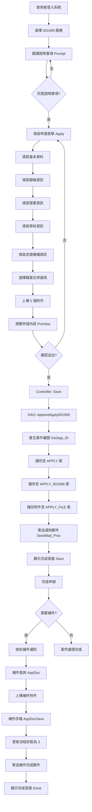
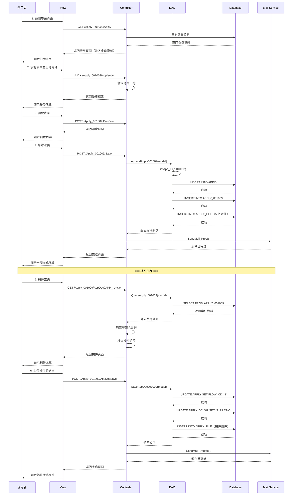

# 001009 - 醫事人員或公共衛生師資格英文求證 - 完整技術文件

## 文件說明

本文件為 **001009 醫事人員或公共衛生師資格英文求證** 服務的完整技術文件。

此服務提供醫事人員或公共衛生師申請英文資格證明，用於國外求職、進修等用途。

---

## 服務基本資訊

| 項目         | 內容                                                     |
| ------------ | -------------------------------------------------------- |
| 服務代碼     | 001009                                                   |
| 服務名稱     | 醫事人員或公共衛生師資格英文求證                         |
| 業務單位     | 醫事司                                                   |
| 是否需繳費   | 是                                                       |
| 申請對象     | 已取得醫事人員或公共衛生師證書者                         |
| 服務性質     | 申請英文資格證明（用於國外機構求證）                     |
| Controller   | `ES/Controllers/Apply_001009Controller.cs` (319 行)      |
| ViewModel    | `ES/Models/ViewModels/Apply_001009ViewModel.cs` (194 行) |
| Entity Model | `ES/Models/Entities/Apply_001009Model.cs` (191 行)       |
| View         | `ES/Views/Apply_001009/Index.cshtml`                     |
| DAO 方法     | `ApplyDAO.AppendApply001009()`, `SaveAppDoc001009()`     |
| 主要資料表   | `APPLY`, `APPLY_001009`, `APPLY_FILE`                    |

---

## 服務特色

### 與其他英文證明服務的差異

| 項目     | 001008 英文證明書服務       | 001009 英文資格求證服務 |
| -------- | --------------------------- | ----------------------- |
| 服務目的 | 申請新的英文版證明書        | 向國外機構提供資格證明  |
| 資料結構 | 主表 + 4 個子表（動態網格） | 單一明細表              |
| 證書類型 | 可申請多張不同類型證書      | 單一證書資格證明        |
| 附件處理 | 彈性附件上傳                | 5 個固定附件欄位        |
| 寄送地址 | 國內/國外地址分開處理       | 單一國外機構地址        |
| 特殊功能 | 動態網格管理                | 檔案合併選項            |
| 複雜度   | 較複雜                      | 較簡單                  |

### 核心功能

1. **英文資格證明**：提供醫事人員或公共衛生師的英文資格證明
2. **固定附件上傳**：5 個必要附件（護照、證書、畢業證書、考試及格證書、求證表格）
3. **檔案合併選項**：可選擇是否將所有附件合併為單一檔案
4. **國外機構資訊**：記錄求證機構名稱和地址
5. **補件功能**：支援補件查詢和補件上傳

---

## 系統架構

### 架構圖

```
前端 Razor Views + jQuery
    ↓ HTTP POST/GET 請求
後端 ASP.NET MVC Controller
    ↓ 業務邏輯處理
資料存取層 (DAO - Dapper)
    ↓ SQL 查詢/異動
SQL Server 資料庫
    ├── APPLY（主表）
    ├── APPLY_001009（服務明細表）
    └── APPLY_FILE（附件檔案）
```

### 資料流程

```
使用者填寫表單
    ↓
填寫基本資料
填寫證書資訊
填寫學校資訊
填寫求證機構資訊
上傳 5 個必要附件
    ↓
預覽並確認
    ↓
Controller 驗證資料
    ↓
DAO 儲存資料
    ├── INSERT INTO APPLY
    ├── INSERT INTO APPLY_001009
    └── INSERT INTO APPLY_FILE (5 個附件)
    ↓
寄送通知信
    ↓
完成申辦
```

---

## 資料庫結構

### APPLY 資料表（申請案主表）

與其他服務共用，參考共用架構文件。

### APPLY_001009 資料表（服務明細表）

| 欄位名稱           | 資料型別 | 長度 | NULL | 說明                                     | 範例值                     |
| ------------------ | -------- | ---- | ---- | ---------------------------------------- | -------------------------- |
| APP_ID             | varchar  | 20   | NO   | 申請案號（PK, FK）                       | 001009202501130001         |
| APPLY_CAUSE        | varchar  | 10   | YES  | 申請事由代碼                             | 01                         |
| APPLY_CAUSE_TEXT   | nvarchar | 200  | YES  | 申請事由說明                             | 國外求職                   |
| APPLY_CERT_CATE    | varchar  | 10   | YES  | 申請證書類別                             | 01                         |
| LIC_TYPE           | varchar  | 10   | YES  | 醫事人員證書代碼                         | 01                         |
| LIC_CD             | nvarchar | 50   | YES  | 醫事人員證書名稱                         | 醫師                       |
| LIC_NUM            | varchar  | 50   | YES  | 醫事人員證書字號                         | 醫師字第 12345 號          |
| CERT_APPROVED_DATE | datetime | -    | YES  | 醫事人員證書核發日期                     | 2020-01-15                 |
| C_SCHOOL_NAME      | nvarchar | 200  | YES  | 畢業學校名稱（中文）                     | 台灣大學醫學院             |
| E_SCHOOL_NAME      | varchar  | 200  | YES  | 畢業學校名稱（英文）                     | National Taiwan University |
| STUDY_START_YM     | varchar  | 7    | YES  | 就讀年月起（民國年）                     | 100/09                     |
| STUDY_END_YM       | varchar  | 7    | YES  | 就讀年月迄（民國年）                     | 104/06                     |
| VERIFY_ADDRESS     | nvarchar | 500  | YES  | 求證表格寄送機構地址（含國家及郵遞區號） | 123 Main St, New York, USA |
| VERIFY_NAME        | nvarchar | 200  | YES  | 求證機構名稱                             | ABC Hospital               |
| IS_MERGE_FILE      | varchar  | 1    | YES  | 是否合併檔案（Y/N）                      | Y                          |
| EMAIL              | varchar  | 100  | YES  | 申請人電子郵件                           | test@gmail.com             |
| MAIL_DATE          | datetime | -    | YES  | 寄件日期                                 | 2025-01-15                 |
| MAIL_BARCODE       | varchar  | 50   | YES  | 掛號條碼                                 | 1234567890                 |
| MAIL_COUNTRY       | nvarchar | 50   | YES  | 國家                                     | United States              |
| RECEIVER           | nvarchar | 100  | YES  | 收件人                                   | John Doe                   |
| IS_FILE1           | varchar  | 1    | YES  | 是否上傳檔案 1（護照影本）               | Y                          |
| IS_FILE2           | varchar  | 1    | YES  | 是否上傳檔案 2（證書影本）               | Y                          |
| IS_FILE3           | varchar  | 1    | YES  | 是否上傳檔案 3（畢業證書影本）           | Y                          |
| IS_FILE4           | varchar  | 1    | YES  | 是否上傳檔案 4（考試及格證書影本）       | Y                          |
| IS_FILE5           | varchar  | 1    | YES  | 是否上傳檔案 5（對方機構求證表格）       | Y                          |
| DEL_MK             | varchar  | 1    | YES  | 刪除標記                                 | N                          |
| ADD_TIME           | datetime | -    | YES  | 新增時間                                 | 2025-01-13 10:30:00        |
| ADD_FUN_CD         | varchar  | 20   | YES  | 新增功能代碼                             | WEB-APPLY                  |
| ADD_ACC            | varchar  | 20   | YES  | 新增帳號                                 | M000001234                 |
| UPD_TIME           | datetime | -    | YES  | 更新時間                                 | 2025-01-13 11:00:00        |
| UPD_FUN_CD         | varchar  | 20   | YES  | 更新功能代碼                             | WEB-APPDOC                 |
| UPD_ACC            | varchar  | 20   | YES  | 更新帳號                                 | M000001234                 |
| DEL_TIME           | datetime | -    | YES  | 刪除時間                                 | NULL                       |
| DEL_FUN_CD         | varchar  | 20   | YES  | 刪除功能代碼                             | NULL                       |
| DEL_ACC            | varchar  | 20   | YES  | 刪除帳號                                 | NULL                       |

**申請事由代碼對照表：**

| 代碼 | 申請事由說明 |
| ---- | ------------ |
| 01   | 國外求職     |
| 02   | 國外進修     |
| 03   | 國外執業     |
| 04   | 其他         |

**證書類別代碼對照表：**

| 代碼 | 證書類別名稱 |
| ---- | ------------ |
| 01   | 醫師         |
| 02   | 護理師       |
| 03   | 藥師         |
| 04   | 醫事檢驗師   |
| 05   | 醫事放射師   |
| 06   | 物理治療師   |
| 07   | 職能治療師   |
| 08   | 呼吸治療師   |
| 09   | 營養師       |
| 10   | 臨床心理師   |
| 11   | 諮商心理師   |
| 12   | 語言治療師   |
| 13   | 聽力師       |
| 14   | 牙體技術師   |
| 15   | 驗光師       |
| 16   | 公共衛生師   |

### APPLY_FILE 資料表（附件檔案）

與其他服務共用，參考共用架構文件。

**001009 服務的 5 個固定附件：**

| 檔案編號 | 檔案名稱                         | 是否必填 | 欄位標記 |
| -------- | -------------------------------- | -------- | -------- |
| FILE1    | 護照影本                         | 是       | IS_FILE1 |
| FILE2    | 醫事人員或公共衛生師中文證書影本 | 是       | IS_FILE2 |
| FILE3    | 考照時之畢業證書影本             | 是       | IS_FILE3 |
| FILE4    | 考試及格證書影本                 | 是       | IS_FILE4 |
| FILE5    | 對方機構求證表格                 | 是       | IS_FILE5 |

**檔案合併選項：**

- 當 `IS_MERGE_FILE = 'Y'` 時，至少上傳一個檔案即可
- 當 `IS_MERGE_FILE = 'N'` 時，所有 5 個檔案都必須上傳

---

## ViewModel 結構

### Apply_001009ViewModel 主要屬性

```csharp
public class Apply_001009ViewModel : Apply_001009Model
{
    // === 基本資料 ===
    /// <summary>申請人姓名</summary>
    public string APPLY_NAME { get; set; }

    /// <summary>申請人身分證字號</summary>
    public string APPLY_PID { get; set; }

    /// <summary>申請日期</summary>
    public string APPLY_DATE { get; set; }

    /// <summary>出生年月日</summary>
    public string BIRTHDAY_AC { get; set; }

    // === 聯絡資訊 ===
    /// <summary>行動電話</summary>
    public string MOBILE { get; set; }

    /// <summary>聯絡電話（完整）</summary>
    public string TEL { get; set; }

    /// <summary>聯絡區碼</summary>
    public string TEL_SEC { get; set; }

    /// <summary>聯絡號碼</summary>
    public string TEL_NO { get; set; }

    /// <summary>聯絡分機</summary>
    public string TEL_EXT { get; set; }

    /// <summary>傳真號碼（完整）</summary>
    public string FAX { get; set; }

    /// <summary>傳真區碼</summary>
    public string FAX_SEC { get; set; }

    /// <summary>傳真號碼</summary>
    public string FAX_NO { get; set; }

    /// <summary>傳真分機</summary>
    public string FAX_EXT { get; set; }

    /// <summary>Email</summary>
    public string MAIL { get; set; }

    /// <summary>Email 帳號</summary>
    public string MAIL_ACCOUNT { get; set; }

    /// <summary>Email Domain</summary>
    public string MAIL_DOMAIN { get; set; }

    /// <summary>Email Domain 選項</summary>
    public string DOMAINList { get; set; }

    // === 地址資訊 ===
    /// <summary>完整地址</summary>
    public string FULL_ADDRESS { get; set; }

    /// <summary>郵遞區號</summary>
    public string CITY_CODE { get; set; }

    /// <summary>縣市鄉鎮</summary>
    public string CITY_TEXT { get; set; }

    /// <summary>詳細地址</summary>
    public string CITY_DETAIL { get; set; }

    // === 證書資訊 ===
    /// <summary>證書字號文字</summary>
    public string LIC_CD_TEXT { get; set; }

    /// <summary>醫事人員證書核發日期（民國年）</summary>
    public string CERT_APPROVED_DATE_AC { get; set; }

    // === 附件檔案 ===
    /// <summary>護照影本</summary>
    public HttpPostedFileBase FILE1 { get; set; }
    public string FILE1_NAME { get; set; }
    public string FILE1_CHECK { get; set; }

    /// <summary>醫事人員或公共衛生師中文證書影本</summary>
    public HttpPostedFileBase FILE2 { get; set; }
    public string FILE2_NAME { get; set; }
    public string FILE2_CHECK { get; set; }

    /// <summary>考照時之畢業證書影本</summary>
    public HttpPostedFileBase FILE3 { get; set; }
    public string FILE3_NAME { get; set; }
    public string FILE3_CHECK { get; set; }

    /// <summary>考試及格證書影本</summary>
    public HttpPostedFileBase FILE4 { get; set; }
    public string FILE4_NAME { get; set; }
    public string FILE4_CHECK { get; set; }

    /// <summary>對方機構求證表格</summary>
    public HttpPostedFileBase FILE5 { get; set; }
    public string FILE5_NAME { get; set; }
    public string FILE5_CHECK { get; set; }

    // === 其他資訊 ===
    /// <summary>申請狀態</summary>
    public string APP_STATUS { get; set; }

    /// <summary>狀態</summary>
    public string STATUS { get; set; }

    /// <summary>是否顯示補件通知</summary>
    public string IsNotice { get; set; }

    /// <summary>郵件內容</summary>
    public string MAILBODY { get; set; }

    /// <summary>申請案主表</summary>
    public ApplyModel Apply { get; set; }

    /// <summary>就讀年份起</summary>
    public string YEAR1 { get; set; }

    /// <summary>就讀月份起</summary>
    public string MONTH1 { get; set; }

    /// <summary>就讀年份迄</summary>
    public string YEAR2 { get; set; }

    /// <summary>就讀月份迄</summary>
    public string MONTH2 { get; set; }

    /// <summary>管理員資訊</summary>
    public AdminModel Admin { get; set; }

    /// <summary>補件通知清單</summary>
    public List<TblAPPLY_NOTICE> ApplyNoticeList { get; set; }

    /// <summary>通知清單</summary>
    public string NoticeList { get; set; }

    /// <summary>補件次數</summary>
    public int? FREQUENCY { get; set; }

    /// <summary>附件檔案清單</summary>
    public List<Apply_FileModel> FileList { get; set; }

    /// <summary>申請證書類別文字</summary>
    public string APPLY_CERT_CATE_TEXT { get; set; }

    /// <summary>國家文字</summary>
    public string COUNTRY_TEXT { get; set; }
}
```

---

## Controller 實作

### 檔案位置

`ES/Controllers/Apply_001009Controller.cs` (319 行)

### 主要 Action Methods

#### 1. Prompt() - 說明事項頁面

```csharp
public ActionResult Prompt()
{
    SessionModel sm = SessionModel.Get();
    string s_msg_1A = "請先閱讀 「{0}說明事項」點選同意後，再進入申辦頁面 !";
    sm.LastErrorMessage = string.Format(s_msg_1A, s_SRV_NAME);
    return View("Prompt001009");
}
```

**功能說明：**

- 顯示服務說明事項頁面
- 要求使用者閱讀並同意後才能進入申請頁面
- 設定提示訊息到 Session

#### 2. Apply() - 申請表單頁面

```csharp
[DisplayName("Apply_001009_申請")]
public ActionResult Apply(string agree)
{
    ApplyDAO dao = new ApplyDAO();
    SessionModel sm = SessionModel.Get();
    Apply_001009ViewModel form = new Apply_001009ViewModel();

    // 檢查登入狀態
    if (sm == null || sm.UserInfo == null)
    {
        return RedirectToAction("Index", "Login");
    }

    ClamMember mem = sm.UserInfo.Member;
    if (mem == null)
    {
        return RedirectToAction("Index", "Login");
    }

    // 檢查是否同意說明事項
    if (string.IsNullOrEmpty(agree)) { agree = "0"; }
    if (agree != null && !agree.Equals("1"))
    {
        return Prompt();
    }

    // 帶入會員資料
    if (sm.UserInfo != null)
    {
        form.APPLY_NAME = sm.UserInfo.Member.NAME;
        form.APPLY_PID = sm.UserInfo.Member.IDN;
        form.BIRTHDAY_AC = HelperUtil.DateTimeToString(sm.UserInfo.Member.BIRTHDAY);
        form.Apply = new ApplyModel();
        form.Apply.ENAME = sm.UserInfo.Member.ENAME;

        // 處理地址資訊
        TblZIPCODE zip = new TblZIPCODE();
        zip.ZIP_CO = sm.UserInfo.Member.TOWN_CD;
        var address = dao.GetRow(zip);
        form.CITY_CODE = sm.UserInfo.Member.TOWN_CD;

        if (address != null && !string.IsNullOrEmpty(address.TOWNNM))
        {
            form.CITY_TEXT = address.TOWNNM;
            form.CITY_DETAIL = sm.UserInfo.Member.ADDR
                .TONotNullString()
                .Replace(address.CITYNM + address.TOWNNM, "");
        }
        else
        {
            form.CITY_TEXT = string.Empty;
            form.CITY_DETAIL = sm.UserInfo.Member.ADDR;
        }
    }
    else
    {
        return RedirectToAction("Index", "Login");
    }

    form.APPLY_DATE = HelperUtil.DateTimeToTwString(DateTime.Now);
    return View(form);
}
```

**功能說明：**

- 檢查使用者登入狀態
- 驗證是否同意說明事項
- 從會員資料自動帶入基本資料（姓名、身分證字號、出生日期、英文姓名）
- 處理地址資訊（郵遞區號、縣市鄉鎮、詳細地址）
- 設定申請日期為當前日期（民國年格式）

#### 3. ApplyAjax() - AJAX 驗證

```csharp
[HttpPost]
public ActionResult ApplyAjax(Apply_001009ViewModel view)
{
    var result = new AjaxResultStruct();
    result.message = "";
    result.status = true;

    if (view.IS_MERGE_FILE == "Y")
    {
        // 合併時至少上傳一筆資料
        if (string.IsNullOrEmpty(view.FILE1_NAME) &&
            string.IsNullOrEmpty(view.FILE2_NAME) &&
            string.IsNullOrEmpty(view.FILE3_NAME) &&
            string.IsNullOrEmpty(view.FILE4_NAME) &&
            string.IsNullOrEmpty(view.FILE5_NAME))
        {
            result.message = "請至少上傳一筆資料 ! \r\n";
            result.status = false;
        }
    }
    else
    {
        // 不合併時，所有檔案都必須上傳
        if (string.IsNullOrEmpty(view.FILE1_NAME))
        {
            result.message += "請上傳護照影本 ! \r\n";
            result.status = false;
        }
        if (string.IsNullOrEmpty(view.FILE2_NAME))
        {
            result.message += "請上傳醫事人員或公共衛生師中文證書影本 ! \r\n";
            result.status = false;
        }
        if (string.IsNullOrEmpty(view.FILE3_NAME))
        {
            result.message += "請上傳考照時之畢業證書影本 ! \r\n";
            result.status = false;
        }
        if (string.IsNullOrEmpty(view.FILE4_NAME))
        {
            result.message += "請上傳考試及格證書影本 ! \r\n";
            result.status = false;
        }
        if (string.IsNullOrEmpty(view.FILE5_NAME))
        {
            result.message += "請上傳對方機構求證表格 ! \r\n";
            result.status = false;
        }
    }

    return Content(result.Serialize(), "application/json");
}
```

**功能說明：**

- AJAX 方式驗證附件上傳
- 根據 `IS_MERGE_FILE` 選項決定驗證規則：
  - 合併檔案（Y）：至少上傳一個檔案
  - 不合併（N）：所有 5 個檔案都必須上傳
- 返回 JSON 格式的驗證結果

#### 4. PreView() - 預覽頁面

```csharp
[DisplayName("Apply_001009_預覽")]
[HttpPost]
public ActionResult PreView(Apply_001009ViewModel model)
{
    return PartialView("PreView001009", model);
}
```

**功能說明：**

- 顯示預覽頁面供使用者確認
- 使用 PartialView 顯示

#### 5. Save() - 儲存並完成申報

```csharp
[DisplayName("Apply_001009_完成申報")]
[HttpPost]
public ActionResult Save(Apply_001009ViewModel model)
{
    SessionModel sm = SessionModel.Get();
    ApplyDAO dao = new ApplyDAO();

    var memberName = string.IsNullOrWhiteSpace(model.APPLY_NAME)
        ? sm.UserInfo.Member.NAME
        : model.APPLY_NAME;
    var memberEmail = string.IsNullOrWhiteSpace(model.MAIL)
        ? sm.UserInfo.Member.MAIL
        : model.MAIL;

    // 儲存申請資料
    dao.AppendApply001009(model);

    // 寄送通知郵件
    dao.SendMail_Proc(memberName, memberEmail, model.APP_ID,
        "醫事人員或公共衛生師資格英文求證", "001009");

    return View("Save", model);
}
```

**功能說明：**

- 呼叫 DAO 儲存申請資料到資料庫
- 寄送通知郵件給申請人
- 導向完成頁面

#### 6. AppDoc() - 補件查詢

```csharp
[DisplayName("Apply_001009_補件查詢")]
public ActionResult AppDoc(string APP_ID)
{
    ApplyDAO dao = new ApplyDAO();
    SessionModel sm = SessionModel.Get();
    Apply_001009ViewModel model = new Apply_001009ViewModel();
    model.APP_ID = APP_ID;
    model = dao.QueryApply_001009(model);

    // 案件基本資訊
    ApplyModel apply = new ApplyModel();
    apply.APP_ID = APP_ID;
    var applyData = dao.GetRow(apply);

    try
    {
        var userInfo = sm.UserInfo.Member;

        // 判斷是否為該案件申請人
        if (applyData.ACC_NO == userInfo.ACC_NO)
        {
            ShareDAO shareDAO = new ShareDAO();
            model.IsNotice = "Y";

            // 檢查是否過補件期限
            if (applyData.FLOW_CD == "2" &&
                shareDAO.CalculationDocDate("001009", model.APP_ID))
            {
                sm.LastErrorMessage = "已過可補件時間，請聯絡承辦單位!!";
                model.IsNotice = "N";
            }

            return View("AppDoc", model);
        }
        else
        {
            throw new Exception("非案件申請人無法瀏覽次案件 !");
        }
    }
    catch (Exception ex)
    {
        if (model == null)
        {
            sm.LastErrorMessage = "案件編號﹕" + APP_ID + "，尚未分派承辦人員，暫無法查詢!!";
            return RedirectToAction("Index", "History");
        }
        else
        {
            sm.LastErrorMessage = ex.Message;
            return RedirectToAction("Index", "Login");
        }
    }
}
```

**功能說明：**

- 查詢補件資訊
- 驗證是否為案件申請人
- 檢查是否過補件期限
- 顯示補件頁面

#### 7. AppDocSave() - 補件存檔

```csharp
[DisplayName("Apply_001009_補件存檔")]
[HttpPost]
public ActionResult AppDocSave(Apply_001009ViewModel model)
{
    ApplyDAO dao = new ApplyDAO();
    SessionModel sm = SessionModel.Get();

    var memberName = string.IsNullOrWhiteSpace(model.APPLY_NAME)
        ? sm.UserInfo.Member.NAME
        : model.APPLY_NAME;
    var memberEmail = string.IsNullOrWhiteSpace(model.MAIL)
        ? sm.UserInfo.Member.MAIL
        : model.MAIL;

    try
    {
        if (dao.SaveAppDoc001009(model))
        {
            // 寄送補件通知郵件
            dao.SendMail_Update(memberName, memberEmail, model.APP_ID,
                "醫事人員或公共衛生師資格英文求證", "001009", "-1");
            sm.LastResultMessage = "存檔成功!!";
            model.Apply.FLOW_CD = "3";
        }
        else
        {
            sm.LastErrorMessage = "存檔失敗!!";
        }
    }
    catch (Exception ex)
    {
        logger.Error("001009AppDocSave failed:" + ex.TONotNullString());
        sm.LastErrorMessage = "存檔失敗!!";
    }

    return View("Done", model);
}
```

**功能說明：**

- 儲存補件資料
- 更新案件流程狀態為「3」（補件完成）
- 寄送補件完成通知郵件
- 顯示完成頁面

---

## DAO 實作

### 檔案位置

`ES/DataLayers/ApplyDAO.cs`

### AppendApply001009() 方法

```csharp
/// <summary>
/// 新增 001009 申請資料
/// </summary>
public string AppendApply001009(Apply_001009ViewModel model)
{
    using (SqlConnection conn = DataUtils.GetConnection())
    {
        conn.Open();
        SqlTransaction tran = conn.BeginTransaction();

        try
        {
            // 1. 產生案件編號
            string appId = GetApp_ID("001009");
            model.APP_ID = appId;

            // 2. 取得會員資訊
            SessionModel sm = SessionModel.Get();
            var member = sm.UserInfo.Member;

            // 3. 新增至 APPLY 主表
            string sqlApply = @"
                INSERT INTO APPLY (
                    APP_ID, SRV_ID, ACC_NO, IDN, NAME,
                    APP_TIME, APP_STATUS, FLOW_CD, DEL_MK
                ) VALUES (
                    @APP_ID, @SRV_ID, @ACC_NO, @IDN, @NAME,
                    GETDATE(), '01', '01', 'N'
                )";

            conn.Execute(sqlApply, new
            {
                APP_ID = appId,
                SRV_ID = "001009",
                ACC_NO = member.ACC_NO,
                IDN = model.APPLY_PID,
                NAME = model.APPLY_NAME
            }, tran);

            // 4. 組合就讀年月
            model.STUDY_START_YM = $"{model.YEAR1}/{model.MONTH1}";
            model.STUDY_END_YM = $"{model.YEAR2}/{model.MONTH2}";

            // 5. 新增至 APPLY_001009 服務明細表
            string sqlDetail = @"
                INSERT INTO APPLY_001009 (
                    APP_ID, APPLY_CAUSE, APPLY_CAUSE_TEXT, APPLY_CERT_CATE,
                    LIC_TYPE, LIC_CD, LIC_NUM, CERT_APPROVED_DATE,
                    C_SCHOOL_NAME, E_SCHOOL_NAME, STUDY_START_YM, STUDY_END_YM,
                    VERIFY_ADDRESS, VERIFY_NAME, IS_MERGE_FILE, EMAIL,
                    MAIL_COUNTRY, RECEIVER,
                    IS_FILE1, IS_FILE2, IS_FILE3, IS_FILE4, IS_FILE5,
                    DEL_MK, ADD_TIME, ADD_FUN_CD, ADD_ACC
                ) VALUES (
                    @APP_ID, @APPLY_CAUSE, @APPLY_CAUSE_TEXT, @APPLY_CERT_CATE,
                    @LIC_TYPE, @LIC_CD, @LIC_NUM, @CERT_APPROVED_DATE,
                    @C_SCHOOL_NAME, @E_SCHOOL_NAME, @STUDY_START_YM, @STUDY_END_YM,
                    @VERIFY_ADDRESS, @VERIFY_NAME, @IS_MERGE_FILE, @EMAIL,
                    @MAIL_COUNTRY, @RECEIVER,
                    @IS_FILE1, @IS_FILE2, @IS_FILE3, @IS_FILE4, @IS_FILE5,
                    'N', GETDATE(), 'WEB-APPLY', @ACC_NO
                )";

            // 設定檔案上傳標記
            model.IS_FILE1 = string.IsNullOrEmpty(model.FILE1_NAME) ? "N" : "Y";
            model.IS_FILE2 = string.IsNullOrEmpty(model.FILE2_NAME) ? "N" : "Y";
            model.IS_FILE3 = string.IsNullOrEmpty(model.FILE3_NAME) ? "N" : "Y";
            model.IS_FILE4 = string.IsNullOrEmpty(model.FILE4_NAME) ? "N" : "Y";
            model.IS_FILE5 = string.IsNullOrEmpty(model.FILE5_NAME) ? "N" : "Y";

            conn.Execute(sqlDetail, new
            {
                APP_ID = appId,
                model.APPLY_CAUSE,
                model.APPLY_CAUSE_TEXT,
                model.APPLY_CERT_CATE,
                model.LIC_TYPE,
                model.LIC_CD,
                model.LIC_NUM,
                model.CERT_APPROVED_DATE,
                model.C_SCHOOL_NAME,
                model.E_SCHOOL_NAME,
                model.STUDY_START_YM,
                model.STUDY_END_YM,
                model.VERIFY_ADDRESS,
                model.VERIFY_NAME,
                model.IS_MERGE_FILE,
                model.EMAIL,
                model.MAIL_COUNTRY,
                model.RECEIVER,
                model.IS_FILE1,
                model.IS_FILE2,
                model.IS_FILE3,
                model.IS_FILE4,
                model.IS_FILE5,
                ACC_NO = member.ACC_NO
            }, tran);

            // 6. 儲存附件檔案
            List<HttpPostedFileBase> files = new List<HttpPostedFileBase>();
            if (model.FILE1 != null) files.Add(model.FILE1);
            if (model.FILE2 != null) files.Add(model.FILE2);
            if (model.FILE3 != null) files.Add(model.FILE3);
            if (model.FILE4 != null) files.Add(model.FILE4);
            if (model.FILE5 != null) files.Add(model.FILE5);

            if (files.Count > 0)
            {
                SaveApplyFiles(appId, files, conn, tran);
            }

            tran.Commit();
            return appId;
        }
        catch (Exception ex)
        {
            tran.Rollback();
            logger.Error("AppendApply001009 failed", ex);
            throw;
        }
    }
}
```

**方法說明：**

1. **產生案件編號**：呼叫 `GetApp_ID("001009")` 產生唯一案件編號
2. **取得會員資訊**：從 Session 取得會員資料
3. **新增 APPLY 主表**：儲存基本申請資訊
4. **組合就讀年月**：將年份和月份組合成 "YYY/MM" 格式
5. **新增 APPLY_001009 服務明細表**：儲存服務專屬資料
6. **設定檔案上傳標記**：根據檔案是否上傳設定 IS_FILE1~5 標記
7. **儲存附件檔案**：儲存上傳的附件到 APPLY_FILE 表
8. **交易管理**：使用 SqlTransaction 確保資料一致性

**重要特性：**

- **交易處理**：所有資料庫操作在同一個交易中，確保資料完整性
- **檔案標記**：記錄每個附件是否已上傳（Y/N）
- **日期格式**：就讀年月使用民國年格式（YYY/MM）
- **錯誤處理**：發生錯誤時回滾交易並記錄日誌

### SaveAppDoc001009() 方法

```csharp
/// <summary>
/// 儲存 001009 補件資料
/// </summary>
public bool SaveAppDoc001009(Apply_001009ViewModel model)
{
    using (SqlConnection conn = DataUtils.GetConnection())
    {
        conn.Open();
        SqlTransaction tran = conn.BeginTransaction();

        try
        {
            // 1. 更新 APPLY 主表流程狀態
            string sqlApply = @"
                UPDATE APPLY
                SET FLOW_CD = '3',
                    UPD_TIME = GETDATE(),
                    UPD_FUN_CD = 'WEB-APPDOC',
                    UPD_ACC = @ACC_NO
                WHERE APP_ID = @APP_ID";

            SessionModel sm = SessionModel.Get();
            var member = sm.UserInfo.Member;

            conn.Execute(sqlApply, new
            {
                APP_ID = model.APP_ID,
                ACC_NO = member.ACC_NO
            }, tran);

            // 2. 更新 APPLY_001009 補件資料
            string sqlDetail = @"
                UPDATE APPLY_001009
                SET IS_FILE1 = @IS_FILE1,
                    IS_FILE2 = @IS_FILE2,
                    IS_FILE3 = @IS_FILE3,
                    IS_FILE4 = @IS_FILE4,
                    IS_FILE5 = @IS_FILE5,
                    UPD_TIME = GETDATE(),
                    UPD_FUN_CD = 'WEB-APPDOC',
                    UPD_ACC = @ACC_NO
                WHERE APP_ID = @APP_ID";

            // 設定檔案上傳標記
            model.IS_FILE1 = string.IsNullOrEmpty(model.FILE1_NAME) ? "N" : "Y";
            model.IS_FILE2 = string.IsNullOrEmpty(model.FILE2_NAME) ? "N" : "Y";
            model.IS_FILE3 = string.IsNullOrEmpty(model.FILE3_NAME) ? "N" : "Y";
            model.IS_FILE4 = string.IsNullOrEmpty(model.FILE4_NAME) ? "N" : "Y";
            model.IS_FILE5 = string.IsNullOrEmpty(model.FILE5_NAME) ? "N" : "Y";

            conn.Execute(sqlDetail, new
            {
                APP_ID = model.APP_ID,
                model.IS_FILE1,
                model.IS_FILE2,
                model.IS_FILE3,
                model.IS_FILE4,
                model.IS_FILE5,
                ACC_NO = member.ACC_NO
            }, tran);

            // 3. 儲存補件附件檔案
            List<HttpPostedFileBase> files = new List<HttpPostedFileBase>();
            if (model.FILE1 != null) files.Add(model.FILE1);
            if (model.FILE2 != null) files.Add(model.FILE2);
            if (model.FILE3 != null) files.Add(model.FILE3);
            if (model.FILE4 != null) files.Add(model.FILE4);
            if (model.FILE5 != null) files.Add(model.FILE5);

            if (files.Count > 0)
            {
                SaveApplyFiles(model.APP_ID, files, conn, tran);
            }

            tran.Commit();
            return true;
        }
        catch (Exception ex)
        {
            tran.Rollback();
            logger.Error("SaveAppDoc001009 failed", ex);
            return false;
        }
    }
}
```

**方法說明：**

1. **更新 APPLY 主表**：將流程狀態更新為「3」（補件完成）
2. **更新 APPLY_001009**：更新檔案上傳標記
3. **儲存補件附件**：儲存新上傳的附件檔案
4. **交易管理**：使用 SqlTransaction 確保資料一致性

**重要特性：**

- **流程狀態管理**：補件完成後流程狀態變更為「3」
- **檔案標記更新**：更新每個附件的上傳狀態
- **錯誤處理**：發生錯誤時回滾交易並返回 false

---

## 前端實作

### View 檔案結構

#### 1. Prompt001009.cshtml - 說明事項頁面

**檔案位置**：`ES/Views/Apply_001009/Prompt001009.cshtml`

**主要內容：**

- 服務說明事項
- 申請須知
- 應備文件說明
- 同意按鈕（導向 Apply 頁面）

#### 2. Index.cshtml - 申請表單頁面

**檔案位置**：`ES/Views/Apply_001009/Index.cshtml`

**主要區塊：**

```html
@model ES.Models.ViewModels.Apply_001009ViewModel

<!-- 基本資料區塊 -->
<div class="form-section">
  <h3>基本資料</h3>
  @Html.TextBoxFor(m => m.APPLY_NAME, new { @class = "form-control", @readonly =
  "readonly" }) @Html.TextBoxFor(m => m.APPLY_PID, new { @class =
  "form-control", @readonly = "readonly" }) @Html.TextBoxFor(m => m.BIRTHDAY_AC,
  new { @class = "form-control", @readonly = "readonly" }) @Html.TextBoxFor(m =>
  m.Apply.ENAME, new { @class = "form-control" })
</div>

<!-- 聯絡資訊區塊 -->
<div class="form-section">
  <h3>聯絡資訊</h3>
  @Html.TextBoxFor(m => m.MOBILE, new { @class = "form-control" })
  @Html.TextBoxFor(m => m.TEL_SEC, new { @class = "form-control", @placeholder =
  "區碼" }) @Html.TextBoxFor(m => m.TEL_NO, new { @class = "form-control",
  @placeholder = "號碼" }) @Html.TextBoxFor(m => m.TEL_EXT, new { @class =
  "form-control", @placeholder = "分機" }) @Html.TextBoxFor(m => m.MAIL_ACCOUNT,
  new { @class = "form-control", @placeholder = "Email 帳號" })
  @Html.DropDownListFor(m => m.MAIL_DOMAIN, new SelectList(Model.DOMAINList),
  new { @class = "form-control" })
</div>

<!-- 地址資訊區塊 -->
<div class="form-section">
  <h3>通訊地址</h3>
  @Html.TextBoxFor(m => m.CITY_CODE, new { @class = "form-control
  zipcode-selector" }) @Html.TextBoxFor(m => m.CITY_TEXT, new { @class =
  "form-control", @readonly = "readonly" }) @Html.TextBoxFor(m => m.CITY_DETAIL,
  new { @class = "form-control" })
</div>

<!-- 證書資訊區塊 -->
<div class="form-section">
  <h3>證書資訊</h3>
  @Html.DropDownListFor(m => m.APPLY_CAUSE, new
  SelectList(ViewBag.ApplyCauseList, "Value", "Text"), new { @class =
  "form-control" }) @Html.TextBoxFor(m => m.APPLY_CAUSE_TEXT, new { @class =
  "form-control", @placeholder = "申請事由說明" }) @Html.DropDownListFor(m =>
  m.LIC_TYPE, new SelectList(ViewBag.LicTypeList, "Value", "Text"), new { @class
  = "form-control" }) @Html.TextBoxFor(m => m.LIC_NUM, new { @class =
  "form-control", @placeholder = "證書字號" }) @Html.TextBoxFor(m =>
  m.CERT_APPROVED_DATE_AC, new { @class = "form-control date-picker",
  @placeholder = "核發日期" })
</div>

<!-- 學校資訊區塊 -->
<div class="form-section">
  <h3>畢業學校資訊</h3>
  @Html.TextBoxFor(m => m.C_SCHOOL_NAME, new { @class = "form-control",
  @placeholder = "學校名稱（中文）" }) @Html.TextBoxFor(m => m.E_SCHOOL_NAME,
  new { @class = "form-control", @placeholder = "學校名稱（英文）" })
  @Html.TextBoxFor(m => m.YEAR1, new { @class = "form-control", @placeholder =
  "就讀年份起" }) @Html.TextBoxFor(m => m.MONTH1, new { @class = "form-control",
  @placeholder = "就讀月份起" }) @Html.TextBoxFor(m => m.YEAR2, new { @class =
  "form-control", @placeholder = "就讀年份迄" }) @Html.TextBoxFor(m => m.MONTH2,
  new { @class = "form-control", @placeholder = "就讀月份迄" })
</div>

<!-- 求證機構資訊區塊 -->
<div class="form-section">
  <h3>求證機構資訊</h3>
  @Html.TextBoxFor(m => m.VERIFY_NAME, new { @class = "form-control",
  @placeholder = "機構名稱" }) @Html.TextBoxFor(m => m.RECEIVER, new { @class =
  "form-control", @placeholder = "收件人" }) @Html.DropDownListFor(m =>
  m.MAIL_COUNTRY, new SelectList(ViewBag.CountryList, "Value", "Text"), new {
  @class = "form-control" }) @Html.TextAreaFor(m => m.VERIFY_ADDRESS, new {
  @class = "form-control", @rows = 3, @placeholder = "機構地址" })
</div>

<!-- 檔案合併選項 -->
<div class="form-section">
  <h3>檔案合併選項</h3>
  @Html.RadioButtonFor(m => m.IS_MERGE_FILE, "Y", new { @id = "merge_yes" })
  <label for="merge_yes">是（將所有附件合併為單一檔案）</label>
  @Html.RadioButtonFor(m => m.IS_MERGE_FILE, "N", new { @id = "merge_no",
  @checked = "checked" })
  <label for="merge_no">否（分別上傳各個附件）</label>
</div>

<!-- 附件上傳區塊 -->
<div class="form-section">
  <h3>附件上傳</h3>

  <div class="file-upload-item">
    <label>1. 護照影本 <span class="required">*</span></label>
    <input type="file" name="FILE1" id="FILE1" class="form-control" />
    @Html.HiddenFor(m => m.FILE1_NAME)
  </div>

  <div class="file-upload-item">
    <label
      >2. 醫事人員或公共衛生師中文證書影本
      <span class="required">*</span></label
    >
    <input type="file" name="FILE2" id="FILE2" class="form-control" />
    @Html.HiddenFor(m => m.FILE2_NAME)
  </div>

  <div class="file-upload-item">
    <label>3. 考照時之畢業證書影本 <span class="required">*</span></label>
    <input type="file" name="FILE3" id="FILE3" class="form-control" />
    @Html.HiddenFor(m => m.FILE3_NAME)
  </div>

  <div class="file-upload-item">
    <label>4. 考試及格證書影本 <span class="required">*</span></label>
    <input type="file" name="FILE4" id="FILE4" class="form-control" />
    @Html.HiddenFor(m => m.FILE4_NAME)
  </div>

  <div class="file-upload-item">
    <label>5. 對方機構求證表格 <span class="required">*</span></label>
    <input type="file" name="FILE5" id="FILE5" class="form-control" />
    @Html.HiddenFor(m => m.FILE5_NAME)
  </div>
</div>

<!-- 按鈕區塊 -->
<div class="form-actions">
  <button type="button" class="btn btn-primary" onclick="previewForm()">
    預覽
  </button>
  <button type="button" class="btn btn-default" onclick="history.back()">
    返回
  </button>
</div>
```

#### 3. PreView001009.cshtml - 預覽頁面

**檔案位置**：`ES/Views/Apply_001009/PreView001009.cshtml`

**主要內容：**

- 顯示所有填寫的資料（唯讀）
- 顯示已上傳的附件清單
- 確認送出按鈕
- 返回修改按鈕

#### 4. Save.cshtml - 完成頁面

**檔案位置**：`ES/Views/Apply_001009/Save.cshtml`

**主要內容：**

- 顯示申請成功訊息
- 顯示案件編號
- 提供查詢案件連結
- 提供返回首頁連結

#### 5. AppDoc.cshtml - 補件頁面

**檔案位置**：`ES/Views/Apply_001009/AppDoc.cshtml`

**主要內容：**

- 顯示原申請資料（唯讀）
- 顯示補件通知內容
- 提供補件附件上傳功能
- 補件送出按鈕

### JavaScript 實作

#### 表單驗證

```javascript
function validateForm() {
  // 驗證基本資料
  if (!$("#APPLY_NAME").val()) {
    alert("請輸入姓名");
    return false;
  }

  if (!$("#APPLY_PID").val()) {
    alert("請輸入身分證字號");
    return false;
  }

  // 驗證聯絡資訊
  if (!$("#MOBILE").val()) {
    alert("請輸入行動電話");
    return false;
  }

  if (!$("#MAIL_ACCOUNT").val() || !$("#MAIL_DOMAIN").val()) {
    alert("請輸入完整Email");
    return false;
  }

  // 驗證證書資訊
  if (!$("#LIC_TYPE").val()) {
    alert("請選擇證書類別");
    return false;
  }

  if (!$("#LIC_NUM").val()) {
    alert("請輸入證書字號");
    return false;
  }

  // 驗證學校資訊
  if (!$("#C_SCHOOL_NAME").val()) {
    alert("請輸入畢業學校名稱（中文）");
    return false;
  }

  if (!$("#E_SCHOOL_NAME").val()) {
    alert("請輸入畢業學校名稱（英文）");
    return false;
  }

  // 驗證求證機構資訊
  if (!$("#VERIFY_NAME").val()) {
    alert("請輸入求證機構名稱");
    return false;
  }

  if (!$("#VERIFY_ADDRESS").val()) {
    alert("請輸入求證機構地址");
    return false;
  }

  // 驗證附件上傳（透過 AJAX）
  return validateFiles();
}
```

#### 附件驗證（AJAX）

```javascript
function validateFiles() {
  var isMerge = $("input[name='IS_MERGE_FILE']:checked").val();
  var file1 = $("#FILE1_NAME").val();
  var file2 = $("#FILE2_NAME").val();
  var file3 = $("#FILE3_NAME").val();
  var file4 = $("#FILE4_NAME").val();
  var file5 = $("#FILE5_NAME").val();

  var formData = {
    IS_MERGE_FILE: isMerge,
    FILE1_NAME: file1,
    FILE2_NAME: file2,
    FILE3_NAME: file3,
    FILE4_NAME: file4,
    FILE5_NAME: file5
  };

  var isValid = false;

  $.ajax({
    url: "/Apply_001009/ApplyAjax",
    type: "POST",
    data: formData,
    async: false,
    success: function (result) {
      if (!result.status) {
        alert(result.message);
        isValid = false;
      } else {
        isValid = true;
      }
    },
    error: function () {
      alert("驗證失敗，請稍後再試");
      isValid = false;
    }
  });

  return isValid;
}
```

#### 檔案上傳處理

```javascript
$(document).ready(function () {
  // 檔案上傳事件
  $("input[type='file']").change(function () {
    var fileInput = $(this);
    var fileName = fileInput.val().split("\\").pop();
    var hiddenField = $("#" + fileInput.attr("id") + "_NAME");

    if (fileName) {
      hiddenField.val(fileName);
      // 顯示檔案名稱
      fileInput.next(".file-name-display").remove();
      fileInput.after(
        '<span class="file-name-display">' + fileName + "</span>"
      );
    } else {
      hiddenField.val("");
      fileInput.next(".file-name-display").remove();
    }
  });

  // 檔案合併選項變更事件
  $("input[name='IS_MERGE_FILE']").change(function () {
    var isMerge = $(this).val();
    if (isMerge == "Y") {
      $(".file-upload-item label .required").hide();
      $(".file-upload-item").first().find("label .required").show();
    } else {
      $(".file-upload-item label .required").show();
    }
  });
});
```

#### 預覽表單

```javascript
function previewForm() {
  if (validateForm()) {
    // 組合 Email
    var mailAccount = $("#MAIL_ACCOUNT").val();
    var mailDomain = $("#MAIL_DOMAIN").val();
    $("#MAIL").val(mailAccount + "@" + mailDomain);

    // 組合電話
    var telSec = $("#TEL_SEC").val();
    var telNo = $("#TEL_NO").val();
    var telExt = $("#TEL_EXT").val();
    $("#TEL").val(telSec + "-" + telNo + (telExt ? "#" + telExt : ""));

    // 送出表單到預覽頁面
    $("#mainForm").attr("action", "/Apply_001009/PreView");
    $("#mainForm").submit();
  }
}
```

#### 送出表單

```javascript
function submitForm() {
  if (confirm("確定要送出申請嗎？")) {
    $("#mainForm").attr("action", "/Apply_001009/Save");
    $("#mainForm").submit();
  }
}
```

---

## 完整處理流程

### 流程圖



### 時序圖



---

## 技術重點

### 1. 固定附件管理

**特點：**

- 5 個固定附件欄位（FILE1~FILE5）
- 每個附件都有對應的標記欄位（IS_FILE1~IS_FILE5）
- 支援檔案合併選項

**實作方式：**

```csharp
// 設定檔案上傳標記
model.IS_FILE1 = string.IsNullOrEmpty(model.FILE1_NAME) ? "N" : "Y";
model.IS_FILE2 = string.IsNullOrEmpty(model.FILE2_NAME) ? "N" : "Y";
model.IS_FILE3 = string.IsNullOrEmpty(model.FILE3_NAME) ? "N" : "Y";
model.IS_FILE4 = string.IsNullOrEmpty(model.FILE4_NAME) ? "N" : "Y";
model.IS_FILE5 = string.IsNullOrEmpty(model.FILE5_NAME) ? "N" : "Y";
```

### 2. 檔案合併選項

**驗證邏輯：**

- **合併（IS_MERGE_FILE = 'Y'）**：至少上傳一個檔案即可
- **不合併（IS_MERGE_FILE = 'N'）**：所有 5 個檔案都必須上傳

**實作方式：**

```csharp
if (view.IS_MERGE_FILE == "Y")
{
    // 至少上傳一筆資料
    if (所有檔案都是空的)
    {
        result.message = "請至少上傳一筆資料 !";
        result.status = false;
    }
}
else
{
    // 所有檔案都必須上傳
    if (任何一個檔案是空的)
    {
        result.message += "請上傳XXX !";
        result.status = false;
    }
}
```

### 3. 補件功能

**流程：**

1. 使用者收到補件通知
2. 透過案件編號查詢補件頁面
3. 驗證是否為案件申請人
4. 檢查是否過補件期限
5. 上傳補件附件
6. 更新流程狀態為「3」（補件完成）
7. 寄送補件完成通知

**重要檢查：**

```csharp
// 驗證申請人身份
if (applyData.ACC_NO == userInfo.ACC_NO)
{
    // 檢查補件期限
    if (applyData.FLOW_CD == "2" &&
        shareDAO.CalculationDocDate("001009", model.APP_ID))
    {
        sm.LastErrorMessage = "已過可補件時間，請聯絡承辦單位!!";
        model.IsNotice = "N";
    }
}
```

### 4. 日期格式處理

**民國年格式：**

- 申請日期：`HelperUtil.DateTimeToTwString(DateTime.Now)`
- 就讀年月：`YEAR1/MONTH1` 到 `YEAR2/MONTH2`
- 證書核發日期：`CERT_APPROVED_DATE_AC`

**組合就讀年月：**

```csharp
model.STUDY_START_YM = $"{model.YEAR1}/{model.MONTH1}";
model.STUDY_END_YM = $"{model.YEAR2}/{model.MONTH2}";
```

### 5. Email 組合

**前端組合：**

```javascript
var mailAccount = $("#MAIL_ACCOUNT").val();
var mailDomain = $("#MAIL_DOMAIN").val();
$("#MAIL").val(mailAccount + "@" + mailDomain);
```

**Domain 選項：**

- gmail.com
- yahoo.com.tw
- hotmail.com
- 其他（自行輸入）

### 6. 電話號碼組合

**格式：**

- 聯絡電話：`區碼-號碼#分機`
- 傳真號碼：`區碼-號碼#分機`

**組合方式：**

```javascript
var telSec = $("#TEL_SEC").val();
var telNo = $("#TEL_NO").val();
var telExt = $("#TEL_EXT").val();
$("#TEL").val(telSec + "-" + telNo + (telExt ? "#" + telExt : ""));
```

### 7. 交易管理

**重要性：**

- 確保資料一致性
- 多表插入時必須使用交易
- 發生錯誤時自動回滾

**實作方式：**

```csharp
using (SqlConnection conn = DataUtils.GetConnection())
{
    conn.Open();
    SqlTransaction tran = conn.BeginTransaction();
    try
    {
        // 多個資料庫操作
        tran.Commit();
    }
    catch
    {
        tran.Rollback();
        throw;
    }
}
```

---

## 相關檔案清單

### 前端檔案

- `ES/Controllers/Apply_001009Controller.cs` (319 行) - 控制器
- `ES/Models/ViewModels/Apply_001009ViewModel.cs` (194 行) - 視圖模型
- `ES/Views/Apply_001009/Prompt001009.cshtml` - 說明頁面
- `ES/Views/Apply_001009/Index.cshtml` - 申請表單
- `ES/Views/Apply_001009/PreView001009.cshtml` - 預覽頁面
- `ES/Views/Apply_001009/Save.cshtml` - 完成頁面
- `ES/Views/Apply_001009/AppDoc.cshtml` - 補件頁面
- `ES/Views/Apply_001009/Done.cshtml` - 補件完成頁面

### 後端檔案

- `ES/DataLayers/ApplyDAO.cs` - 資料存取層
- `ES/DataLayers/ShareDAO.cs` - 共用資料存取層
- `ES/Models/Entities/Apply_001009Model.cs` (191 行) - 實體模型
- `ES/Models/Entities/APPLY.cs` - APPLY 實體

### 資料庫資料表

- `SERVICE` - 服務定義表
- `APPLY` - 申請主表
- `APPLY_001009` - 服務明細表
- `APPLY_FILE` - 附件檔案表
- `APPLY_NOTICE` - 補件通知表
- `MAIL_LOG` - 郵件記錄表

---

## 注意事項

### 1. 附件上傳

- 支援 5 個固定附件
- 檔案大小限制（通常為 10MB）
- 檔案格式檢查（PDF, JPG, PNG 等）
- 檔案儲存到指定目錄並記錄到資料庫

### 2. 檔案合併選項

- 合併時：至少上傳一個檔案
- 不合併時：所有 5 個檔案都必須上傳
- 影響附件驗證邏輯

### 3. 補件功能

- 只有案件申請人可以補件
- 需檢查補件期限
- 補件完成後流程狀態變更為「3」
- 自動寄送補件完成通知

### 4. 郵件通知

- 申請完成後自動寄送通知郵件
- 補件完成後自動寄送通知郵件
- 郵件包含案件編號和申請資訊
- 需要確保 Email 正確

### 5. 案件編號

- 格式：服務代碼 + 日期 + 流水號
- 例如：001009202501130001
- 每日流水號從 0001 開始

### 6. 流程狀態

- 01：申請中
- 02：補件中
- 03：補件完成
- 04：審核中
- 05：審核完成

### 7. 資料驗證

**前端驗證：**

- jQuery Validation
- AJAX 附件驗證
- 即時驗證回饋

**後端驗證：**

- Data Annotations
- ModelState 驗證
- 業務邏輯驗證

---

**版本：** 1.0
**日期：** 2025-10-20
**作者：** 柏通股份有限公司
