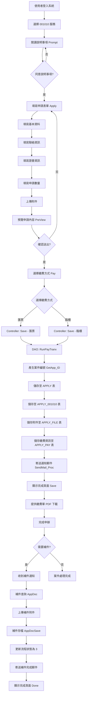
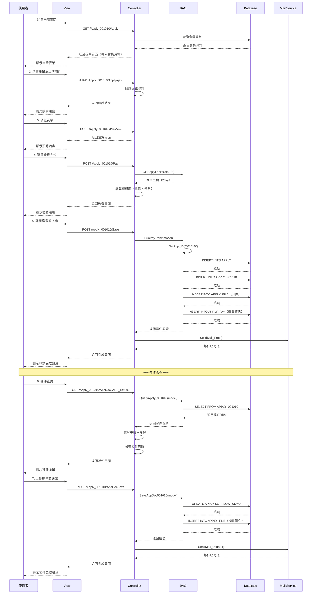

# 001010 - 醫事人員或公共衛生師證書影本申請書 - 完整技術文件

## 文件說明

本文件為 **001010 醫事人員或公共衛生師證書影本申請書** 服務的完整技術文件。

此服務提供醫事人員或公共衛生師申請證書影本，用於各種證明用途，需要繳費（每份 20 元）。

---

## 服務基本資訊

| 項目         | 內容                                                     |
| ------------ | -------------------------------------------------------- |
| 服務代碼     | 001010                                                   |
| 服務名稱     | 醫事人員或公共衛生師證書影本申請書                       |
| 業務單位     | 醫事司                                                   |
| 是否需繳費   | 是（每份 20 元）                                         |
| 繳費方式     | 匯票、臨櫃                                               |
| 申請對象     | 已取得醫事人員或公共衛生師證書者                         |
| 服務性質     | 申請證書影本（需繳費）                                   |
| Controller   | `ES/Controllers/Apply_001010Controller.cs` (369 行)      |
| ViewModel    | `ES/Models/ViewModels/Apply_001010ViewModel.cs` (198 行) |
| Entity Model | `ES/Models/Entities/Apply_001010Model.cs` (116 行)       |
| View         | `ES/Views/Apply_001010/Index.cshtml`                     |
| DAO 方法     | `ApplyDAO.AppendApply001010()`, `SaveAppDoc001010()`     |
| 主要資料表   | `APPLY`, `APPLY_001010`, `APPLY_FILE`, `APPLY_PAY`       |

---

## 服務特色

### 與其他證書服務的差異

| 項目       | 001005/001007 證書補換發 | 001010 證書影本申請     |
| ---------- | ------------------------ | ----------------------- |
| 服務目的   | 補發或換發證書正本       | 申請證書影本            |
| 是否需繳費 | 是                       | 是（每份 20 元）        |
| 繳費方式   | 多種                     | 匯票、臨櫃              |
| 申請數量   | 固定（1 張）             | 可選擇數量（COPIES）    |
| 費用計算   | 固定費用                 | 數量 × 20 元            |
| 附件上傳   | 多個附件                 | 單一附件（ATTACH_FILE） |
| 資料結構   | 單一明細表               | 單一明細表              |
| 補件功能   | 有                       | 有                      |

### 核心功能

1. **證書影本申請**：提供醫事人員或公共衛生師的證書影本
2. **數量選擇**：可選擇申請份數（每份 20 元）
3. **費用計算**：自動計算總費用（份數 × 20 元）
4. **繳費方式選擇**：
   - 匯票（抬頭：衛生福利部）
   - 臨櫃（現金）
5. **單一附件上傳**：上傳相關證明文件（PDF 格式）
6. **補件功能**：支援補件查詢和補件上傳

---

## 系統架構

### 架構圖

```
前端 Razor Views + jQuery
    ↓ HTTP POST/GET 請求
後端 ASP.NET MVC Controller
    ↓ 業務邏輯處理
資料存取層 (DAO - Dapper)
    ↓ SQL 查詢/異動
SQL Server 資料庫
    ├── APPLY（主表）
    ├── APPLY_001010（服務明細表）
    ├── APPLY_FILE（附件檔案）
    └── APPLY_PAY（繳費資訊）
```

### 資料流程

```
使用者填寫表單
    ↓
填寫基本資料
填寫證書資訊
填寫申請數量
上傳附件
    ↓
預覽並確認
    ↓
選擇繳費方式
    ↓
Controller 驗證資料
    ↓
DAO 儲存資料
    ├── INSERT INTO APPLY
    ├── INSERT INTO APPLY_001010
    ├── INSERT INTO APPLY_FILE
    └── INSERT INTO APPLY_PAY
    ↓
寄送通知信
    ↓
完成申辦
```

---

## 資料庫結構

### APPLY 資料表（申請案主表）

與其他服務共用，參考共用架構文件。

### APPLY_001010 資料表（服務明細表）

| 欄位名稱     | 資料型別 | 長度 | NULL | 說明               | 範例值              |
| ------------ | -------- | ---- | ---- | ------------------ | ------------------- |
| APP_ID       | varchar  | 20   | NO   | 申請案號（PK, FK） | 001010202501130001  |
| COPIES       | varchar  | 10   | YES  | 申請份數           | 2                   |
| TOTAL_MEM    | varchar  | 10   | YES  | 總金額（新台幣）   | 40                  |
| ISSUE_DEPT   | varchar  | 100  | YES  | 核發單位           | 衛生福利部          |
| ISSUE_DATE   | datetime | -    | YES  | 核發日期           | 2020-01-15          |
| LIC_TYPE     | varchar  | 10   | YES  | 證書類別代碼       | 01                  |
| LIC_CD       | nvarchar | 50   | YES  | 證書類別名稱       | 醫師                |
| LIC_NUM      | varchar  | 50   | YES  | 證書字號           | 醫師字第 12345 號   |
| DIVISION     | varchar  | 10   | YES  | 類別               | 01                  |
| EMAIL        | varchar  | 100  | YES  | 申請人電子郵件     | test@gmail.com      |
| MAIL_DATE    | datetime | -    | YES  | 寄件日期           | 2025-01-15          |
| MAIL_BARCODE | varchar  | 50   | YES  | 掛號條碼           | 1234567890          |
| DEL_MK       | varchar  | 1    | YES  | 刪除標記           | N                   |
| ADD_TIME     | datetime | -    | YES  | 新增時間           | 2025-01-13 10:30:00 |
| ADD_FUN_CD   | varchar  | 20   | YES  | 新增功能代碼       | WEB-APPLY           |
| ADD_ACC      | varchar  | 20   | YES  | 新增帳號           | M000001234          |
| UPD_TIME     | datetime | -    | YES  | 更新時間           | 2025-01-13 11:00:00 |
| UPD_FUN_CD   | varchar  | 20   | YES  | 更新功能代碼       | WEB-APPDOC          |
| UPD_ACC      | varchar  | 20   | YES  | 更新帳號           | M000001234          |
| DEL_TIME     | datetime | -    | YES  | 刪除時間           | NULL                |
| DEL_FUN_CD   | varchar  | 20   | YES  | 刪除功能代碼       | NULL                |
| DEL_ACC      | varchar  | 20   | YES  | 刪除帳號           | NULL                |

**證書類別代碼對照表：**

| 代碼 | 證書類別名稱 |
| ---- | ------------ |
| 01   | 醫師         |
| 02   | 護理師       |
| 03   | 藥師         |
| 04   | 醫事檢驗師   |
| 05   | 醫事放射師   |
| 06   | 物理治療師   |
| 07   | 職能治療師   |
| 08   | 呼吸治療師   |
| 09   | 營養師       |
| 10   | 臨床心理師   |
| 11   | 諮商心理師   |
| 12   | 語言治療師   |
| 13   | 聽力師       |
| 14   | 牙體技術師   |
| 15   | 驗光師       |
| 16   | 公共衛生師   |

**費用計算規則：**

- 每份證書影本費用：20 元
- 總金額 = 申請份數 × 20 元
- 驗證規則：`TOTAL_MEM / 20 = COPIES`

### APPLY_FILE 資料表（附件檔案）

與其他服務共用，參考共用架構文件。

**001010 服務的附件：**

| 檔案編號    | 檔案名稱         | 是否必填 | 欄位標記         |
| ----------- | ---------------- | -------- | ---------------- |
| ATTACH_FILE | 相關證明文件 PDF | 否       | ATTACH_FILE_NAME |

### APPLY_PAY 資料表（繳費資訊）

| 欄位名稱   | 資料型別 | 長度 | NULL | 說明               | 範例值              |
| ---------- | -------- | ---- | ---- | ------------------ | ------------------- |
| APP_ID     | varchar  | 20   | NO   | 申請案號（PK, FK） | 001010202501130001  |
| PAY_METHOD | varchar  | 10   | YES  | 繳費方式（D/B）    | D                   |
| PAY_A_FEE  | int      | -    | YES  | 繳費金額           | 40                  |
| PAY_POINT  | varchar  | 10   | YES  | 繳費地點           | B                   |
| PAY_STATUS | varchar  | 10   | YES  | 繳費狀態           | 01                  |
| PAY_DATE   | datetime | -    | YES  | 繳費日期           | 2025-01-13          |
| ADD_TIME   | datetime | -    | YES  | 新增時間           | 2025-01-13 10:30:00 |
| ADD_FUN_CD | varchar  | 20   | YES  | 新增功能代碼       | WEB-APPLY           |
| ADD_ACC    | varchar  | 20   | YES  | 新增帳號           | M000001234          |

**繳費方式代碼：**

| 代碼 | 繳費方式                 |
| ---- | ------------------------ |
| D    | 匯票（抬頭：衛生福利部） |
| B    | 臨櫃（現金）             |

---

## ViewModel 結構

### Apply_001010ViewModel 主要屬性

```csharp
public class Apply_001010ViewModel : Apply_001010Model
{
    // === 基本資料 ===
    /// <summary>申請人姓名</summary>
    public string APPLY_NAME { get; set; }

    /// <summary>申請人身分證字號</summary>
    public string APPLY_PID { get; set; }

    /// <summary>申請日期</summary>
    public string APPLY_DATE { get; set; }

    /// <summary>出生年月日</summary>
    public string BIRTHDAY_AC { get; set; }

    /// <summary>預計完成日期</summary>
    public string APP_EXT_DATE { get; set; }

    // === 聯絡資訊 ===
    /// <summary>行動電話</summary>
    public string MOBILE { get; set; }

    /// <summary>聯絡電話（完整）</summary>
    public string TEL { get; set; }

    /// <summary>聯絡區碼</summary>
    public string TEL_SEC { get; set; }

    /// <summary>聯絡號碼</summary>
    public string TEL_NO { get; set; }

    /// <summary>聯絡分機</summary>
    public string TEL_EXT { get; set; }

    /// <summary>Email</summary>
    public string MAIL { get; set; }

    /// <summary>Email 帳號</summary>
    public string MAIL_ACCOUNT { get; set; }

    /// <summary>Email Domain</summary>
    public string MAIL_DOMAIN { get; set; }

    /// <summary>Email Domain 選項</summary>
    public string DOMAINList { get; set; }

    // === 地址資訊 ===
    /// <summary>完整地址</summary>
    public string FULL_ADDRESS { get; set; }

    /// <summary>郵遞區號</summary>
    public string CITY_CODE { get; set; }

    /// <summary>縣市鄉鎮</summary>
    public string CITY_TEXT { get; set; }

    /// <summary>詳細地址</summary>
    public string CITY_DETAIL { get; set; }

    // === 證書資訊 ===
    /// <summary>核發日期（民國年）</summary>
    public string ISSUE_DATE_AC { get; set; }

    /// <summary>類別文字</summary>
    public string DIVISION_TEXT { get; set; }

    /// <summary>核發單位文字</summary>
    public string ISSUE_DEPT_TEXT { get; set; }

    /// <summary>證書字號文字</summary>
    public string LIC_CD_TEXT { get; set; }

    // === 附件檔案 ===
    /// <summary>附件檔案（PDF）</summary>
    public HttpPostedFileBase ATTACH_FILE { get; set; }

    /// <summary>附件檔案名稱</summary>
    public string ATTACH_FILE_NAME { get; set; }

    // === 繳費資訊 ===
    /// <summary>繳費地點</summary>
    public string PAY_POINT { get; set; }

    /// <summary>繳費方式</summary>
    public string PAY_METHOD { get; set; }

    /// <summary>申請案應繳費用</summary>
    public int? PAY_A_FEE { get; set; }

    // === 其他資訊 ===
    /// <summary>申請狀態</summary>
    public string APP_STATUS { get; set; }

    /// <summary>狀態</summary>
    public string STATUS { get; set; }

    /// <summary>補件次數</summary>
    public int AppDocCount { get; set; }

    /// <summary>是否顯示補件通知</summary>
    public string IsNotice { get; set; }

    /// <summary>欄位清單</summary>
    public string FieldList { get; set; }

    /// <summary>預覽 ViewModel</summary>
    public Apply_001010ViewModel PreView { get; set; }

    /// <summary>輔助 ViewModel</summary>
    public Apply_001010ViewModel AuxView { get; set; }

    /// <summary>申請案主表</summary>
    public ApplyModel Apply { get; set; }

    /// <summary>管理員資訊</summary>
    public AdminModel Admin { get; set; }

    /// <summary>附件檔案</summary>
    public Apply_FileModel File { get; set; }

    /// <summary>繳費資訊</summary>
    public APPLY_PAY ApplyPay { get; set; }

    /// <summary>客戶端 IP</summary>
    public string CLIENT_IP { get; set; }

    /// <summary>錯誤代碼</summary>
    public string ErrorCode { get; set; }

    /// <summary>錯誤訊息</summary>
    public string ErrorMessage { get; set; }

    /// <summary>Session 交易金鑰</summary>
    public string SessionTransactionKey { get; set; }

    /// <summary>暫存訊息</summary>
    public string TempMessage { get; set; }
}
```

---

## Controller 實作

### 檔案位置

`ES/Controllers/Apply_001010Controller.cs` (369 行)

### 主要 Action Methods

#### 1. Prompt() - 說明事項頁面

```csharp
public ActionResult Prompt()
{
    SessionModel sm = SessionModel.Get();
    string s_msg_1A = "請先閱讀 「{0}說明事項」點選同意後，再進入申辦頁面 !";
    sm.LastErrorMessage = string.Format(s_msg_1A, s_SRV_NAME);
    return View("Prompt001010");
}
```

**功能說明：**

- 顯示服務說明事項頁面
- 要求使用者閱讀並同意後才能進入申請頁面
- 設定提示訊息到 Session

#### 2. Apply() - 申請表單頁面

```csharp
[DisplayName("Apply_001010_申請")]
public ActionResult Apply(string agree)
{
    ApplyDAO dao = new ApplyDAO();
    SessionModel sm = SessionModel.Get();
    Apply_001010ViewModel form = new Apply_001010ViewModel();

    // 檢查登入狀態
    if (sm == null || sm.UserInfo == null)
    {
        return RedirectToAction("Index", "Login");
    }

    ClamMember mem = sm.UserInfo.Member;
    if (mem == null)
    {
        return RedirectToAction("Index", "Login");
    }

    // 檢查是否同意說明事項
    if (string.IsNullOrEmpty(agree)) { agree = "0"; }
    if (agree != null && !agree.Equals("1"))
    {
        return Prompt();
    }

    // 帶入會員資料
    if (sm.UserInfo != null)
    {
        form.APPLY_NAME = sm.UserInfo.Member.NAME;
        form.APPLY_PID = sm.UserInfo.Member.IDN;
        form.BIRTHDAY_AC = HelperUtil.DateTimeToString(sm.UserInfo.Member.BIRTHDAY);
        form.MOBILE = sm.UserInfo.Member.MOBILE;

        // 處理地址資訊
        TblZIPCODE zip = new TblZIPCODE();
        zip.ZIP_CO = sm.UserInfo.Member.TOWN_CD;
        var address = dao.GetRow(zip);
        form.CITY_CODE = sm.UserInfo.Member.TOWN_CD;

        if (address != null && !string.IsNullOrEmpty(address.TOWNNM))
        {
            form.CITY_TEXT = address.TOWNNM;
            form.CITY_DETAIL = sm.UserInfo.Member.ADDR
                .TONotNullString()
                .Replace(address.CITYNM + address.TOWNNM, "");
        }
        else
        {
            form.CITY_TEXT = string.Empty;
            form.CITY_DETAIL = sm.UserInfo.Member.ADDR;
        }

        // 處理電話
        if (sm.UserInfo.Member.TEL.TONotNullString().Trim() != "")
        {
            string[] tel = sm.UserInfo.Member.TEL.TONotNullString().Split('-');
            form.TEL_SEC = tel[0];
            form.TEL_NO = tel[1].ToSplit('#')[0];

            if (sm.UserInfo.Member.TEL.IndexOf('#') > 0)
            {
                form.TEL_EXT = sm.UserInfo.Member.TEL.Split('#')[1];
            }
        }

        // 處理 Email
        if (sm.UserInfo.Member.MAIL.TONotNullString().Trim() != "")
        {
            form.MAIL_ACCOUNT = sm.UserInfo.Member.MAIL.Split('@')[0];
            form.MAIL_DOMAIN = sm.UserInfo.Member.MAIL.Split('@')[1];

            switch (sm.UserInfo.Member.MAIL.Split('@')[1])
            {
                case "gmail.com":
                    form.DOMAINList = "1";
                    break;
                case "yahoo.com.tw":
                    form.DOMAINList = "2";
                    break;
                case "outlook.com":
                    form.DOMAINList = "3";
                    break;
                default:
                    form.DOMAINList = "0";
                    break;
            }
        }
    }
    else
    {
        return RedirectToAction("Index", "Login");
    }

    form.APPLY_DATE = HelperUtil.DateTimeToTwString(DateTime.Now);
    return View(form);
}
```

**功能說明：**

- 檢查使用者登入狀態
- 驗證是否同意說明事項
- 從會員資料自動帶入基本資料（姓名、身分證字號、出生日期、行動電話）
- 處理地址資訊（郵遞區號、縣市鄉鎮、詳細地址）
- 處理電話資訊（區碼、號碼、分機）
- 處理 Email 資訊（帳號、Domain）
- 設定申請日期為當前日期（民國年格式）

#### 3. ApplyAjax() - AJAX 驗證

```csharp
[HttpPost]
public ActionResult ApplyAjax(Apply_001010ViewModel view)
{
    var result = new AjaxResultStruct();
    var errmsg = string.Empty;

    // 驗證申請數量
    if (view.COPIES.TOInt32() <= 0)
    {
        errmsg += "請輸入申請數量<br>";
    }

    // 驗證總金額
    if (view.TOTAL_MEM.TOInt32() <= 0)
    {
        errmsg += "請輸入申請數量<br>";
    }
    else if (view.TOTAL_MEM.TOInt32() / 20 != view.COPIES.TOInt32())
    {
        errmsg += "請重新輸入申請數量，一份為20元計<br>";
    }

    // 驗證證書類別
    if (string.IsNullOrEmpty(view.DIVISION))
    {
        errmsg += "請輸入證書類別<br>";
    }

    // 驗證核發單位
    if (string.IsNullOrEmpty(view.ISSUE_DEPT))
    {
        errmsg += "請輸入核發單位<br>";
    }

    // 驗證證書字號
    if (string.IsNullOrEmpty(view.LIC_CD) ||
        string.IsNullOrEmpty(view.LIC_NUM) ||
        string.IsNullOrEmpty(view.LIC_TYPE))
    {
        errmsg += "請輸入證書字號<br>";
    }

    // 驗證核發日期
    if (string.IsNullOrEmpty(view.ISSUE_DATE_AC))
    {
        errmsg += "請輸入核發日期<br>";
    }

    // 驗證通訊地址
    if (string.IsNullOrEmpty(view.CITY_CODE) ||
        string.IsNullOrEmpty(view.CITY_DETAIL))
    {
        errmsg += "請輸入通訊地址<br>";
    }

    // 驗證聯絡電話
    if (string.IsNullOrEmpty(view.MOBILE) ||
        string.IsNullOrEmpty(view.TEL))
    {
        errmsg += "請輸入行動電話/連絡電話<br>";
    }

    // 驗證 Email
    if (string.IsNullOrEmpty(view.MAIL))
    {
        errmsg += "請輸入EMAIL<br>";
    }

    if (string.IsNullOrEmpty(errmsg))
    {
        result.message = "";
        result.status = true;
    }
    else
    {
        result.message = errmsg;
        result.status = false;
    }

    return Content(result.Serialize(), "application/json");
}
```

**功能說明：**

- AJAX 方式驗證表單資料
- 驗證申請數量（必須大於 0）
- 驗證總金額（必須等於 申請數量 × 20）
- 驗證證書資訊（類別、核發單位、證書字號、核發日期）
- 驗證聯絡資訊（地址、電話、Email）
- 返回 JSON 格式的驗證結果

#### 4. PreView() - 預覽頁面

```csharp
[DisplayName("Apply_001010_預覽")]
[HttpPost]
public ActionResult PreView(Apply_001010ViewModel model)
{
    ShareDAO dao = new ShareDAO();
    model.PreView = new Apply_001010ViewModel();
    model.PreView.InjectFrom(model);

    return PartialView("PreView001010", model);
}
```

**功能說明：**

- 顯示預覽頁面供使用者確認
- 使用 ValueInjecter 複製資料到 PreView 屬性
- 使用 PartialView 顯示

#### 5. Pay() - 繳費頁面

```csharp
[DisplayName("Apply_001010_繳費")]
[HttpPost]
public ActionResult Pay(Apply_001010ViewModel model)
{
    ApplyDAO dao = new ApplyDAO();
    model.PreView = new Apply_001010ViewModel();
    model.PreView.InjectFrom(model);
    model.PAY_A_FEE = dao.GetApplyFee("001010").TOInt32() * model.COPIES.TOInt32();
    model.PAY_METHOD = "";
    return PartialView("Pay", model);
}
```

**功能說明：**

- 顯示繳費頁面
- 計算應繳費用：`GetApplyFee("001010") × COPIES`
- 提供繳費方式選擇（匯票、臨櫃）
- 使用 PartialView 顯示

#### 6. Save() - 儲存並完成申報

```csharp
[DisplayName("Apply_001010_完成申報")]
[HttpPost]
public ActionResult Save(Apply_001010ViewModel model)
{
    SessionModel sm = SessionModel.Get();
    ApplyDAO dao = new ApplyDAO();
    var memberName = string.IsNullOrWhiteSpace(model.APPLY_NAME)
        ? sm.UserInfo.Member.NAME
        : model.APPLY_NAME;
    var memberEmail = string.IsNullOrWhiteSpace(model.MAIL)
        ? sm.UserInfo.Member.MAIL
        : model.MAIL;

    switch (model.PAY_METHOD)
    {
        // 匯票（抬頭：衛生福利部）
        case "D":
            if (!dao.RunPayTranx(model))
            {
                model.ErrorCode = "-1";
                model.ErrorMessage = "匯票繳費執行失敗!!";
                break;
            }
            else
            {
                dao.SendMail_Proc(memberName, memberEmail, model.APP_ID,
                    "醫事人員或公共衛生師證書影本申請書", "001010");
            }
            model.ErrorCode = "0000";
            break;

        // 臨櫃（現金）
        case "B":
            if (!dao.RunPayTranx(model))
            {
                model.ErrorCode = "-1";
                model.ErrorMessage = "臨櫃繳費執行失敗!!";
                break;
            }
            else
            {
                dao.SendMail_Proc(memberName, memberEmail, model.APP_ID,
                    "醫事人員或公共衛生師證書影本申請書", "001010");
            }
            model.ErrorCode = "0000";
            break;
    }

    return View("Save", model);
}
```

**功能說明：**

- 根據繳費方式執行不同的處理流程
- 呼叫 `RunPayTranx()` 執行繳費交易
- 繳費成功後寄送通知郵件
- 設定錯誤代碼和訊息
- 導向完成頁面

#### 7. PayPDF() - 匯出繳費 PDF

```csharp
public ActionResult PayPDF(string id)
{
    ApplyDAO dao = new ApplyDAO();
    return File(dao.ExportPayPDF(id), "application/pdf", "Pay" + id + ".pdf");
}
```

**功能說明：**

- 匯出繳費單 PDF
- 提供下載功能

#### 8. AppDoc() - 補件查詢

```csharp
[DisplayName("Apply_001010_補件查詢")]
public ActionResult AppDoc(string APP_ID)
{
    ApplyDAO dao = new ApplyDAO();
    SessionModel sm = SessionModel.Get();
    Apply_001010ViewModel model = new Apply_001010ViewModel();
    model.APP_ID = APP_ID;
    model = dao.QueryApply_001010(model);

    // 案件基本資訊
    ApplyModel apply = new ApplyModel();
    apply.APP_ID = APP_ID;
    var applyData = dao.GetRow(apply);

    try
    {
        var userInfo = sm.UserInfo.Member;

        // 判斷是否為該案件申請人
        if (applyData.ACC_NO == userInfo.ACC_NO)
        {
            ShareDAO shareDAO = new ShareDAO();
            model.IsNotice = "Y";

            // 檢查是否過補件期限
            if (applyData.FLOW_CD == "2" &&
                shareDAO.CalculationDocDate("001010", model.APP_ID))
            {
                sm.LastErrorMessage = "已過可補件時間，請聯絡承辦單位!!";
                model.IsNotice = "N";
            }

            return View("AppDoc", model);
        }
        else
        {
            throw new Exception("非案件申請人無法瀏覽次案件 !");
        }
    }
    catch (Exception ex)
    {
        if (model == null)
        {
            sm.LastErrorMessage = "案件編號﹕" + APP_ID + "，尚未分派承辦人員，暫無法查詢!!";
            return RedirectToAction("Index", "History");
        }
        else
        {
            sm.LastErrorMessage = ex.Message;
            return RedirectToAction("Index", "Login");
        }
    }
}
```

**功能說明：**

- 查詢補件資訊
- 驗證是否為案件申請人
- 檢查是否過補件期限
- 顯示補件頁面

#### 9. AppDocSave() - 補件存檔

```csharp
[DisplayName("Apply_001010_補件存檔")]
[HttpPost]
public ActionResult AppDocSave(Apply_001010ViewModel model)
{
    ApplyDAO dao = new ApplyDAO();
    SessionModel sm = SessionModel.Get();
    var memberName = string.IsNullOrWhiteSpace(model.APPLY_NAME)
        ? sm.UserInfo.Member.NAME
        : model.APPLY_NAME;
    var memberEmail = string.IsNullOrWhiteSpace(model.MAIL)
        ? sm.UserInfo.Member.MAIL
        : model.MAIL;

    try
    {
        if (dao.SaveAppDoc001010(model))
        {
            dao.SendMail_Update(memberName, memberEmail, model.APP_ID,
                "醫事人員或公共衛生師證書影本申請書", "001010", "-1");
            sm.LastResultMessage = "存檔成功!!";
            model.Apply.FLOW_CD = "3";
        }
        else
        {
            sm.LastErrorMessage = "存檔失敗!!";
        }
    }
    catch (Exception ex)
    {
        logger.Error("001010_AppDocSave failed:" + ex.TONotNullString());
        sm.LastErrorMessage = "存檔失敗!!";
    }

    return View("Done", model);
}
```

**功能說明：**

- 儲存補件資料
- 更新案件流程狀態為「3」（補件完成）
- 寄送補件完成通知郵件
- 顯示完成頁面

---

## DAO 實作

### 檔案位置

`ES/DataLayers/ApplyDAO.cs`

### RunPayTranx() 方法

```csharp
/// <summary>
/// 執行繳費交易
/// </summary>
public bool RunPayTranx(Apply_001010ViewModel model)
{
    using (SqlConnection conn = DataUtils.GetConnection())
    {
        conn.Open();
        SqlTransaction tran = conn.BeginTransaction();

        try
        {
            // 1. 產生案件編號
            string appId = GetApp_ID("001010");
            model.APP_ID = appId;

            // 2. 取得會員資訊
            SessionModel sm = SessionModel.Get();
            var member = sm.UserInfo.Member;

            // 3. 新增至 APPLY 主表
            string sqlApply = @"
                INSERT INTO APPLY (
                    APP_ID, SRV_ID, ACC_NO, IDN, NAME,
                    APP_TIME, APP_STATUS, FLOW_CD, DEL_MK
                ) VALUES (
                    @APP_ID, @SRV_ID, @ACC_NO, @IDN, @NAME,
                    GETDATE(), '01', '01', 'N'
                )";

            conn.Execute(sqlApply, new
            {
                APP_ID = appId,
                SRV_ID = "001010",
                ACC_NO = member.ACC_NO,
                IDN = model.APPLY_PID,
                NAME = model.APPLY_NAME
            }, tran);

            // 4. 新增至 APPLY_001010 服務明細表
            string sqlDetail = @"
                INSERT INTO APPLY_001010 (
                    APP_ID, COPIES, TOTAL_MEM, ISSUE_DEPT, ISSUE_DATE,
                    LIC_TYPE, LIC_CD, LIC_NUM, DIVISION, EMAIL,
                    DEL_MK, ADD_TIME, ADD_FUN_CD, ADD_ACC
                ) VALUES (
                    @APP_ID, @COPIES, @TOTAL_MEM, @ISSUE_DEPT, @ISSUE_DATE,
                    @LIC_TYPE, @LIC_CD, @LIC_NUM, @DIVISION, @EMAIL,
                    'N', GETDATE(), 'WEB-APPLY', @ACC_NO
                )";

            conn.Execute(sqlDetail, new
            {
                APP_ID = appId,
                model.COPIES,
                model.TOTAL_MEM,
                model.ISSUE_DEPT,
                model.ISSUE_DATE,
                model.LIC_TYPE,
                model.LIC_CD,
                model.LIC_NUM,
                model.DIVISION,
                model.EMAIL,
                ACC_NO = member.ACC_NO
            }, tran);

            // 5. 儲存附件檔案（如果有）
            if (model.ATTACH_FILE != null)
            {
                List<HttpPostedFileBase> files = new List<HttpPostedFileBase>();
                files.Add(model.ATTACH_FILE);
                SaveApplyFiles(appId, files, conn, tran);
            }

            // 6. 新增繳費資訊
            string sqlPay = @"
                INSERT INTO APPLY_PAY (
                    APP_ID, PAY_METHOD, PAY_A_FEE, PAY_POINT, PAY_STATUS,
                    ADD_TIME, ADD_FUN_CD, ADD_ACC
                ) VALUES (
                    @APP_ID, @PAY_METHOD, @PAY_A_FEE, @PAY_POINT, '01',
                    GETDATE(), 'WEB-APPLY', @ACC_NO
                )";

            conn.Execute(sqlPay, new
            {
                APP_ID = appId,
                PAY_METHOD = model.PAY_METHOD,
                PAY_A_FEE = model.PAY_A_FEE,
                PAY_POINT = model.PAY_POINT,
                ACC_NO = member.ACC_NO
            }, tran);

            tran.Commit();
            return true;
        }
        catch (Exception ex)
        {
            tran.Rollback();
            logger.Error("RunPayTranx failed", ex);
            return false;
        }
    }
}
```

**方法說明：**

1. **產生案件編號**：呼叫 `GetApp_ID("001010")` 產生唯一案件編號
2. **取得會員資訊**：從 Session 取得會員資料
3. **新增 APPLY 主表**：儲存基本申請資訊
4. **新增 APPLY_001010 服務明細表**：儲存服務專屬資料
5. **儲存附件檔案**：儲存上傳的附件到 APPLY_FILE 表（如果有）
6. **新增繳費資訊**：儲存繳費方式和金額到 APPLY_PAY 表
7. **交易管理**：使用 SqlTransaction 確保資料一致性

**重要特性：**

- **交易處理**：所有資料庫操作在同一個交易中，確保資料完整性
- **繳費資訊記錄**：記錄繳費方式（D/B）和金額
- **錯誤處理**：發生錯誤時回滾交易並記錄日誌

### SaveAppDoc001010() 方法

```csharp
/// <summary>
/// 儲存 001010 補件資料
/// </summary>
public bool SaveAppDoc001010(Apply_001010ViewModel model)
{
    using (SqlConnection conn = DataUtils.GetConnection())
    {
        conn.Open();
        SqlTransaction tran = conn.BeginTransaction();

        try
        {
            // 1. 更新 APPLY 主表流程狀態
            string sqlApply = @"
                UPDATE APPLY
                SET FLOW_CD = '3',
                    UPD_TIME = GETDATE(),
                    UPD_FUN_CD = 'WEB-APPDOC',
                    UPD_ACC = @ACC_NO
                WHERE APP_ID = @APP_ID";

            SessionModel sm = SessionModel.Get();
            var member = sm.UserInfo.Member;

            conn.Execute(sqlApply, new
            {
                APP_ID = model.APP_ID,
                ACC_NO = member.ACC_NO
            }, tran);

            // 2. 儲存補件附件檔案（如果有）
            if (model.ATTACH_FILE != null)
            {
                List<HttpPostedFileBase> files = new List<HttpPostedFileBase>();
                files.Add(model.ATTACH_FILE);
                SaveApplyFiles(model.APP_ID, files, conn, tran);
            }

            tran.Commit();
            return true;
        }
        catch (Exception ex)
        {
            tran.Rollback();
            logger.Error("SaveAppDoc001010 failed", ex);
            return false;
        }
    }
}
```

**方法說明：**

1. **更新 APPLY 主表**：將流程狀態更新為「3」（補件完成）
2. **儲存補件附件**：儲存新上傳的附件檔案（如果有）
3. **交易管理**：使用 SqlTransaction 確保資料一致性

**重要特性：**

- **流程狀態管理**：補件完成後流程狀態變更為「3」
- **錯誤處理**：發生錯誤時回滾交易並返回 false

### QueryApply_001010() 方法

```csharp
/// <summary>
/// 查詢 001010 申請資料
/// </summary>
public Apply_001010ViewModel QueryApply_001010(Apply_001010ViewModel model)
{
    using (SqlConnection conn = DataUtils.GetConnection())
    {
        string sql = @"
            SELECT a.*, b.*
            FROM APPLY a
            INNER JOIN APPLY_001010 b ON a.APP_ID = b.APP_ID
            WHERE a.APP_ID = @APP_ID
            AND a.DEL_MK = 'N'
            AND b.DEL_MK = 'N'";

        var result = conn.Query<Apply_001010ViewModel>(sql, new
        {
            APP_ID = model.APP_ID
        }).FirstOrDefault();

        return result;
    }
}
```

**方法說明：**

- 查詢申請案資料（包含主表和明細表）
- 用於補件查詢和案件查詢

---

## 前端實作

### View 檔案結構

#### 1. Prompt001010.cshtml - 說明事項頁面

**檔案位置**：`ES/Views/Apply_001010/Prompt001010.cshtml`

**主要內容：**

- 服務說明事項
- 申請須知
- 應備文件說明
- 繳費方式說明
- 同意按鈕（導向 Apply 頁面）

#### 2. Index.cshtml - 申請表單頁面

**檔案位置**：`ES/Views/Apply_001010/Index.cshtml`

**主要區塊：**

```html
@model ES.Models.ViewModels.Apply_001010ViewModel

<!-- 基本資料區塊 -->
<div class="form-section">
  <h3>基本資料</h3>
  @Html.TextBoxFor(m => m.APPLY_NAME, new { @class = "form-control", @readonly =
  "readonly" }) @Html.TextBoxFor(m => m.APPLY_PID, new { @class =
  "form-control", @readonly = "readonly" }) @Html.TextBoxFor(m => m.BIRTHDAY_AC,
  new { @class = "form-control", @readonly = "readonly" })
</div>

<!-- 聯絡資訊區塊 -->
<div class="form-section">
  <h3>聯絡資訊</h3>
  @Html.TextBoxFor(m => m.MOBILE, new { @class = "form-control" })
  @Html.TextBoxFor(m => m.TEL_SEC, new { @class = "form-control", @placeholder =
  "區碼" }) @Html.TextBoxFor(m => m.TEL_NO, new { @class = "form-control",
  @placeholder = "號碼" }) @Html.TextBoxFor(m => m.TEL_EXT, new { @class =
  "form-control", @placeholder = "分機" }) @Html.TextBoxFor(m => m.MAIL_ACCOUNT,
  new { @class = "form-control", @placeholder = "Email 帳號" })
  @Html.DropDownListFor(m => m.MAIL_DOMAIN, new SelectList(Model.DOMAINList),
  new { @class = "form-control" })
</div>

<!-- 地址資訊區塊 -->
<div class="form-section">
  <h3>通訊地址</h3>
  @Html.TextBoxFor(m => m.CITY_CODE, new { @class = "form-control
  zipcode-selector" }) @Html.TextBoxFor(m => m.CITY_TEXT, new { @class =
  "form-control", @readonly = "readonly" }) @Html.TextBoxFor(m => m.CITY_DETAIL,
  new { @class = "form-control" })
</div>

<!-- 證書資訊區塊 -->
<div class="form-section">
  <h3>證書資訊</h3>
  @Html.DropDownListFor(m => m.DIVISION, new SelectList(ViewBag.DivisionList,
  "Value", "Text"), new { @class = "form-control" }) @Html.TextBoxFor(m =>
  m.ISSUE_DEPT, new { @class = "form-control", @placeholder = "核發單位" })
  @Html.DropDownListFor(m => m.LIC_TYPE, new SelectList(ViewBag.LicTypeList,
  "Value", "Text"), new { @class = "form-control" }) @Html.TextBoxFor(m =>
  m.LIC_NUM, new { @class = "form-control", @placeholder = "證書字號" })
  @Html.TextBoxFor(m => m.ISSUE_DATE_AC, new { @class = "form-control
  date-picker", @placeholder = "核發日期" })
</div>

<!-- 申請數量區塊 -->
<div class="form-section">
  <h3>申請數量</h3>
  <label>申請份數 <span class="required">*</span></label>
  @Html.TextBoxFor(m => m.COPIES, new { @class = "form-control", @type =
  "number", @min = "1", @onchange = "calculateFee()" })

  <label>總金額（新台幣） <span class="required">*</span></label>
  @Html.TextBoxFor(m => m.TOTAL_MEM, new { @class = "form-control", @readonly =
  "readonly" })

  <p class="help-text">每份證書影本費用為 20 元</p>
</div>

<!-- 附件上傳區塊 -->
<div class="form-section">
  <h3>附件上傳</h3>
  <label>相關證明文件（PDF 格式）</label>
  <input
    type="file"
    name="ATTACH_FILE"
    id="ATTACH_FILE"
    class="form-control"
    accept=".pdf" />
  @Html.HiddenFor(m => m.ATTACH_FILE_NAME)
</div>

<!-- 按鈕區塊 -->
<div class="form-actions">
  <button type="button" class="btn btn-primary" onclick="previewForm()">
    預覽
  </button>
  <button type="button" class="btn btn-default" onclick="history.back()">
    返回
  </button>
</div>
```

#### 3. PreView001010.cshtml - 預覽頁面

**檔案位置**：`ES/Views/Apply_001010/PreView001010.cshtml`

**主要內容：**

- 顯示所有填寫的資料（唯讀）
- 顯示申請數量和總金額
- 顯示已上傳的附件
- 確認送出按鈕（導向繳費頁面）
- 返回修改按鈕

#### 4. Pay.cshtml - 繳費頁面

**檔案位置**：`ES/Views/Apply_001010/Pay.cshtml`

**主要內容：**

- 顯示應繳費用
- 繳費方式選擇：
  - 匯票（抬頭：衛生福利部）
  - 臨櫃（現金）
- 確認繳費按鈕
- 返回修改按鈕

#### 5. Save.cshtml - 完成頁面

**檔案位置**：`ES/Views/Apply_001010/Save.cshtml`

**主要內容：**

- 顯示申請成功訊息
- 顯示案件編號
- 顯示繳費資訊
- 提供繳費單 PDF 下載
- 提供查詢案件連結
- 提供返回首頁連結

#### 6. AppDoc.cshtml - 補件頁面

**檔案位置**：`ES/Views/Apply_001010/AppDoc.cshtml`

**主要內容：**

- 顯示原申請資料（唯讀）
- 顯示補件通知內容
- 提供補件附件上傳功能
- 補件送出按鈕

### JavaScript 實作

#### 費用計算

```javascript
function calculateFee() {
  var copies = $("#COPIES").val();
  if (copies && copies > 0) {
    var totalFee = copies * 20;
    $("#TOTAL_MEM").val(totalFee);
  } else {
    $("#TOTAL_MEM").val("");
  }
}
```

#### 表單驗證

```javascript
function validateForm() {
  // 驗證基本資料
  if (!$("#APPLY_NAME").val()) {
    alert("請輸入姓名");
    return false;
  }

  if (!$("#APPLY_PID").val()) {
    alert("請輸入身分證字號");
    return false;
  }

  // 驗證聯絡資訊
  if (!$("#MOBILE").val()) {
    alert("請輸入行動電話");
    return false;
  }

  if (!$("#MAIL_ACCOUNT").val() || !$("#MAIL_DOMAIN").val()) {
    alert("請輸入完整Email");
    return false;
  }

  // 驗證證書資訊
  if (!$("#DIVISION").val()) {
    alert("請選擇證書類別");
    return false;
  }

  if (!$("#ISSUE_DEPT").val()) {
    alert("請輸入核發單位");
    return false;
  }

  if (!$("#LIC_TYPE").val() || !$("#LIC_NUM").val()) {
    alert("請輸入證書字號");
    return false;
  }

  if (!$("#ISSUE_DATE_AC").val()) {
    alert("請輸入核發日期");
    return false;
  }

  // 驗證申請數量
  if (!$("#COPIES").val() || $("#COPIES").val() <= 0) {
    alert("請輸入申請份數");
    return false;
  }

  if (!$("#TOTAL_MEM").val() || $("#TOTAL_MEM").val() <= 0) {
    alert("請輸入總金額");
    return false;
  }

  // 驗證費用計算
  var copies = parseInt($("#COPIES").val());
  var totalMem = parseInt($("#TOTAL_MEM").val());
  if (totalMem / 20 != copies) {
    alert("請重新輸入申請數量，一份為20元計");
    return false;
  }

  // 驗證地址
  if (!$("#CITY_CODE").val() || !$("#CITY_DETAIL").val()) {
    alert("請輸入通訊地址");
    return false;
  }

  // 驗證電話
  if (!$("#TEL_SEC").val() || !$("#TEL_NO").val()) {
    alert("請輸入聯絡電話");
    return false;
  }

  return true;
}
```

#### 附件上傳處理

```javascript
$(document).ready(function () {
  // 附件上傳事件
  $("#ATTACH_FILE").change(function () {
    var fileInput = $(this);
    var fileName = fileInput.val().split("\\").pop();

    if (fileName) {
      // 檢查檔案格式
      if (!fileName.toLowerCase().endsWith(".pdf")) {
        alert("請上傳 PDF 格式的檔案");
        fileInput.val("");
        $("#ATTACH_FILE_NAME").val("");
        return;
      }

      $("#ATTACH_FILE_NAME").val(fileName);
      // 顯示檔案名稱
      fileInput.next(".file-name-display").remove();
      fileInput.after(
        '<span class="file-name-display">' + fileName + "</span>"
      );
    } else {
      $("#ATTACH_FILE_NAME").val("");
      fileInput.next(".file-name-display").remove();
    }
  });
});
```

#### 預覽表單

```javascript
function previewForm() {
  if (validateForm()) {
    // 組合 Email
    var mailAccount = $("#MAIL_ACCOUNT").val();
    var mailDomain = $("#MAIL_DOMAIN").val();
    $("#MAIL").val(mailAccount + "@" + mailDomain);

    // 組合電話
    var telSec = $("#TEL_SEC").val();
    var telNo = $("#TEL_NO").val();
    var telExt = $("#TEL_EXT").val();
    $("#TEL").val(telSec + "-" + telNo + (telExt ? "#" + telExt : ""));

    // 送出表單到預覽頁面
    $("#mainForm").attr("action", "/Apply_001010/PreView");
    $("#mainForm").submit();
  }
}
```

#### 繳費頁面

```javascript
function goToPay() {
  $("#mainForm").attr("action", "/Apply_001010/Pay");
  $("#mainForm").submit();
}
```

#### 送出表單

```javascript
function submitForm() {
  var payMethod = $("input[name='PAY_METHOD']:checked").val();

  if (!payMethod) {
    alert("請選擇繳費方式");
    return false;
  }

  if (confirm("確定要送出申請嗎？")) {
    $("#mainForm").attr("action", "/Apply_001010/Save");
    $("#mainForm").submit();
  }
}
```

---

## 完整處理流程

### 流程圖



### 時序圖



---

## 技術重點

### 1. 費用計算

**計算規則：**

- 每份證書影本費用：20 元
- 總金額 = 申請份數 × 20 元
- 驗證規則：`TOTAL_MEM / 20 = COPIES`

**實作方式：**

```javascript
function calculateFee() {
  var copies = $("#COPIES").val();
  if (copies && copies > 0) {
    var totalFee = copies * 20;
    $("#TOTAL_MEM").val(totalFee);
  }
}
```

**後端驗證：**

```csharp
if (view.TOTAL_MEM.TOInt32() / 20 != view.COPIES.TOInt32())
{
    errmsg += "請重新輸入申請數量，一份為20元計<br>";
}
```

### 2. 繳費方式處理

**繳費方式：**

- **D**：匯票（抬頭：衛生福利部）
- **B**：臨櫃（現金）

**流程：**

1. 使用者選擇繳費方式
2. Controller 根據繳費方式執行不同處理
3. 呼叫 `RunPayTranx()` 儲存資料
4. 儲存繳費資訊到 APPLY_PAY 表
5. 寄送通知郵件
6. 提供繳費單 PDF 下載

**實作方式：**

```csharp
switch (model.PAY_METHOD)
{
    case "D":  // 匯票
        if (!dao.RunPayTranx(model))
        {
            model.ErrorCode = "-1";
            model.ErrorMessage = "匯票繳費執行失敗!!";
        }
        else
        {
            dao.SendMail_Proc(...);
            model.ErrorCode = "0000";
        }
        break;

    case "B":  // 臨櫃
        if (!dao.RunPayTranx(model))
        {
            model.ErrorCode = "-1";
            model.ErrorMessage = "臨櫃繳費執行失敗!!";
        }
        else
        {
            dao.SendMail_Proc(...);
            model.ErrorCode = "0000";
        }
        break;
}
```

### 3. 繳費單 PDF 匯出

**功能：**

- 提供繳費單 PDF 下載
- 包含案件資訊和繳費資訊

**實作方式：**

```csharp
public ActionResult PayPDF(string id)
{
    ApplyDAO dao = new ApplyDAO();
    return File(dao.ExportPayPDF(id), "application/pdf", "Pay" + id + ".pdf");
}
```

### 4. 附件上傳

**特點：**

- 單一附件欄位（ATTACH_FILE）
- 僅接受 PDF 格式
- 非必填

**實作方式：**

```javascript
$("#ATTACH_FILE").change(function () {
  var fileName = $(this).val().split("\\").pop();
  if (fileName && !fileName.toLowerCase().endsWith(".pdf")) {
    alert("請上傳 PDF 格式的檔案");
    $(this).val("");
    return;
  }
});
```

### 5. 補件功能

**流程：**

1. 使用者收到補件通知
2. 透過案件編號查詢補件頁面
3. 驗證是否為案件申請人
4. 檢查是否過補件期限
5. 上傳補件附件
6. 更新流程狀態為「3」（補件完成）
7. 寄送補件完成通知

**重要檢查：**

```csharp
// 驗證申請人身份
if (applyData.ACC_NO == userInfo.ACC_NO)
{
    // 檢查補件期限
    if (applyData.FLOW_CD == "2" &&
        shareDAO.CalculationDocDate("001010", model.APP_ID))
    {
        sm.LastErrorMessage = "已過可補件時間，請聯絡承辦單位!!";
        model.IsNotice = "N";
    }
}
```

### 6. 交易管理

**重要性：**

- 確保資料一致性
- 多表插入時必須使用交易
- 發生錯誤時自動回滾

**實作方式：**

```csharp
using (SqlConnection conn = DataUtils.GetConnection())
{
    conn.Open();
    SqlTransaction tran = conn.BeginTransaction();
    try
    {
        // 1. INSERT INTO APPLY
        // 2. INSERT INTO APPLY_001010
        // 3. INSERT INTO APPLY_FILE
        // 4. INSERT INTO APPLY_PAY
        tran.Commit();
    }
    catch
    {
        tran.Rollback();
        throw;
    }
}
```

---

## 相關檔案清單

### 前端檔案

- `ES/Controllers/Apply_001010Controller.cs` (369 行) - 控制器
- `ES/Models/ViewModels/Apply_001010ViewModel.cs` (198 行) - 視圖模型
- `ES/Views/Apply_001010/Prompt001010.cshtml` - 說明頁面
- `ES/Views/Apply_001010/Index.cshtml` - 申請表單
- `ES/Views/Apply_001010/PreView001010.cshtml` - 預覽頁面
- `ES/Views/Apply_001010/Pay.cshtml` - 繳費頁面
- `ES/Views/Apply_001010/Save.cshtml` - 完成頁面
- `ES/Views/Apply_001010/AppDoc.cshtml` - 補件頁面
- `ES/Views/Apply_001010/Done.cshtml` - 補件完成頁面

### 後端檔案

- `ES/DataLayers/ApplyDAO.cs` - 資料存取層
- `ES/DataLayers/ShareDAO.cs` - 共用資料存取層
- `ES/Models/Entities/Apply_001010Model.cs` (116 行) - 實體模型
- `ES/Models/Entities/APPLY.cs` - APPLY 實體
- `ES/Models/Entities/APPLY_PAY.cs` - APPLY_PAY 實體

### 資料庫資料表

- `SERVICE` - 服務定義表
- `APPLY` - 申請主表
- `APPLY_001010` - 服務明細表
- `APPLY_FILE` - 附件檔案表
- `APPLY_PAY` - 繳費資訊表
- `APPLY_NOTICE` - 補件通知表
- `MAIL_LOG` - 郵件記錄表

---

## 注意事項

### 1. 費用計算

- 每份證書影本費用固定為 20 元
- 總金額必須等於 申請份數 × 20
- 前端和後端都需要驗證費用計算

### 2. 繳費方式

- 匯票：抬頭必須為「衛生福利部」
- 臨櫃：需至指定地點繳費
- 繳費資訊記錄到 APPLY_PAY 表

### 3. 附件上傳

- 僅接受 PDF 格式
- 附件為非必填
- 檔案大小限制（通常為 10MB）

### 4. 補件功能

- 只有案件申請人可以補件
- 需檢查補件期限
- 補件完成後流程狀態變更為「3」
- 自動寄送補件完成通知

### 5. 郵件通知

- 申請完成後自動寄送通知郵件
- 補件完成後自動寄送通知郵件
- 郵件包含案件編號和申請資訊
- 需要確保 Email 正確

### 6. 案件編號

- 格式：服務代碼 + 日期 + 流水號
- 例如：001010202501130001
- 每日流水號從 0001 開始

### 7. 流程狀態

- 01：申請中
- 02：補件中
- 03：補件完成
- 04：審核中
- 05：審核完成

### 8. 資料驗證

**前端驗證：**

- jQuery Validation
- AJAX 表單驗證
- 即時驗證回饋

**後端驗證：**

- Data Annotations
- ModelState 驗證
- 業務邏輯驗證

---

**版本：** 1.0
**日期：** 2025-10-20
**作者：** 柏通股份有限公司
