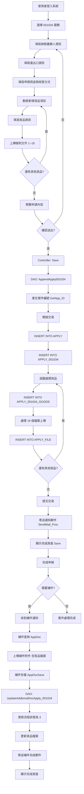

# 001034 - 危險性醫療儀器進口申請作業 - 完整技術文件

## 服務基本資訊

| 項目             | 內容                                                                       |
| ---------------- | -------------------------------------------------------------------------- |
| **服務代碼**     | 001034                                                                     |
| **服務名稱**     | 危險性醫療儀器進口申請作業                                                 |
| **業務單位**     | 醫事司 (UNIT_CD: 4)                                                        |
| **是否需繳費**   | 否                                                                         |
| **申請對象**     | 醫療器材廠商、進口商                                                       |
| **Controller**   | `ES/Controllers/Apply_001034Controller.cs` (377 行)                        |
| **ViewModel**    | `ES/Models/ViewModels/Apply_001034ViewModel.cs` (621 行)                   |
| **Entity Model** | `ES/Models/Entities/Apply_001034Model.cs` (222 行)                         |
| **Goods Model**  | `ES/Models/Entities/Apply_001034_GoodsModel.cs` (412 行)                   |
| **主要資料表**   | APPLY, APPLY_001034, APPLY_001034_GOODS, APPLY_FILE                        |
| **DAO 方法**     | AppendApply001034(), QueryApply_001034(), UpdateAddtionalDocApply_001034() |

---

## 服務特色

### 與其他服務的差異

| 特色項目       | 001034 危險性醫療儀器進口 | 001008 英文證明書 | 001010 證書影本  |
| -------------- | ------------------------- | ----------------- | ---------------- |
| **核心功能**   | 危險性醫療儀器進口申請    | 英文證明書申請    | 證書影本申請     |
| **資料結構**   | 動態貨品清單              | 動態網格          | 單一表單         |
| **貨品數量**   | 不限（動態新增）          | N/A               | N/A              |
| **檔案上傳**   | 每個貨品 19 個檔案欄位    | 5 個固定附件      | 1 個附件         |
| **進出口資訊** | 需填寫進出口港、國家      | 不需要            | 不需要           |
| **用途分類**   | 申請用途、核發方式        | 不需要            | 不需要           |
| **繳費**       | 不需要                    | 不需要            | 需要（20 元/份） |
| **補件功能**   | 支援（含貨品檔案補件）    | 支援              | 支援             |
| **複雜度**     | ⭐⭐⭐⭐⭐ 極高           | ⭐⭐⭐⭐ 高       | ⭐⭐ 中          |

### 核心功能說明

1. **動態貨品清單管理**

   - 可動態新增/刪除貨品項目
   - 每個貨品有完整的資訊欄位
   - 每個貨品可上傳 19 種不同類型的檔案

2. **進出口資訊管理**

   - 目的國家、賣方國家
   - 轉運港、起運港
   - 賣方名稱、地址

3. **申請用途與核發方式**

   - 申請用途選擇
   - 核發方式選擇
   - 申請份數

4. **檢附文件類型**
   - 19 種不同的文件類型
   - 每種文件可包含：文件類型、文件代碼、文件說明
   - 支援檔案上傳

---

## 系統架構

### 架構圖

```
使用者
  ↓
Apply_001034Controller (控制器)
  ↓
Apply_001034ViewModel (視圖模型)
  ↓
ApplyDAO (資料存取層)
  ↓
資料庫 (APPLY, APPLY_001034, APPLY_001034_GOODS, APPLY_FILE)
```

### 資料流程圖

```
1. 使用者登入
   ↓
2. 填寫基本資料（納稅義務人資訊）
   ↓
3. 填寫進出口資訊（國家、港口、賣方）
   ↓
4. 填寫申請用途與核發方式
   ↓
5. 動態新增貨品資料
   ├─ 貨品類型、名稱、數量、單位
   ├─ 貨品規格、品牌、說明
   └─ 上傳 19 種檢附文件
   ↓
6. 預覽申請內容
   ↓
7. 確認送出
   ↓
8. 儲存至資料庫（交易處理）
   ├─ APPLY 表（主表）
   ├─ APPLY_001034 表（明細表）
   ├─ APPLY_001034_GOODS 表（貨品清單）
   └─ APPLY_FILE 表（附件檔案）
   ↓
9. 寄送通知郵件
   ↓
10. 顯示完成頁面
```

---

## 資料庫結構

### 1. APPLY 資料表（申請主表）

**說明：** 所有申辦服務共用的主表，記錄申請案件的基本資訊。

**主要欄位：**

| 欄位名稱     | 資料型別      | 說明           | 範例               |
| ------------ | ------------- | -------------- | ------------------ |
| APP_ID       | VARCHAR(20)   | 案件編號（PK） | 001034202501130001 |
| SRV_ID       | VARCHAR(6)    | 服務代碼       | 001034             |
| SRC_SRV_ID   | VARCHAR(6)    | 來源服務代碼   | 001034             |
| UNIT_CD      | INT           | 業務單位代碼   | 4 (醫事司)         |
| ACC_NO       | VARCHAR(20)   | 會員帳號       |                    |
| IDN          | VARCHAR(10)   | 身分證字號     |                    |
| NAME         | NVARCHAR(50)  | 姓名           |                    |
| CNT_TEL      | VARCHAR(20)   | 聯絡電話       | 02-12345678#123    |
| FAX          | VARCHAR(20)   | 傳真號碼       | 02-12345678        |
| ADDR_CODE    | VARCHAR(5)    | 地址代碼       |                    |
| ADDR         | NVARCHAR(200) | 地址           |                    |
| APP_TIME     | DATETIME      | 申請時間       |                    |
| FLOW_CD      | VARCHAR(2)    | 流程狀態代碼   | 1 (申請中)         |
| APP_EXT_DATE | DATETIME      | 預計完成日期   |                    |
| PAY_POINT    | VARCHAR(1)    | 繳費地點       | A                  |
| LOGIN_TYPE   | VARCHAR(10)   | 登入類型       |                    |
| DEL_MK       | VARCHAR(1)    | 刪除註記       | N                  |
| ADD_TIME     | DATETIME      | 新增時間       |                    |
| ADD_FUN_CD   | VARCHAR(20)   | 新增功能代碼   | WEB-APPLY          |
| ADD_ACC      | VARCHAR(20)   | 新增帳號       |                    |
| UPD_TIME     | DATETIME      | 更新時間       |                    |
| UPD_FUN_CD   | VARCHAR(20)   | 更新功能代碼   | WEB-APPLY          |
| UPD_ACC      | VARCHAR(20)   | 更新帳號       |                    |

### 2. APPLY_001034 資料表（服務明細表）

**說明：** 危險性醫療儀器進口申請的專屬資料表，記錄申請的詳細資訊。

**主要欄位：**

| 欄位名稱      | 資料型別      | 說明                          | 範例               |
| ------------- | ------------- | ----------------------------- | ------------------ |
| APP_ID        | VARCHAR(20)   | 案件編號（PK, FK）            | 001034202501130001 |
| TAX_ORG_ID    | VARCHAR(20)   | 納稅義務人身分證字號/統一編號 |                    |
| TAX_ORG_NAME  | NVARCHAR(100) | 姓名/公司名稱（中文）         |                    |
| TAX_ORG_ENAME | NVARCHAR(200) | 姓名/公司名稱（英文）         |                    |
| TAX_ZIP_CODE  | VARCHAR(5)    | 郵遞區號                      |                    |
| TAX_ORG_ADDR  | NVARCHAR(200) | 聯絡地址（中文）              |                    |
| TAX_ORG_EADDR | NVARCHAR(200) | 聯絡地址（英文）              |                    |
| TAX_ORG_MAN   | NVARCHAR(50)  | 聯絡人姓名                    |                    |
| TAX_ORG_TEL   | VARCHAR(20)   | 聯絡人電話                    |                    |
| TAX_ORG_EMAIL | VARCHAR(100)  | 聯絡人 Email                  |                    |
| TAX_ORG_FAX   | VARCHAR(20)   | 聯絡人傳真                    |                    |
| IM_EXPORT     | VARCHAR(1)    | 進出口別                      | 1 (進口)           |
| DATE_S        | DATETIME      | 起始日期                      |                    |
| DATE_E        | DATETIME      | 終止日期                      |                    |
| DEST_STATE_ID | VARCHAR(10)   | 目的國家代號                  |                    |
| DEST_STATE    | NVARCHAR(50)  | 目的國家名稱                  |                    |
| SELL_STATE_ID | VARCHAR(10)   | 賣方國家代號                  |                    |
| SELL_STATE    | NVARCHAR(50)  | 賣方國家名稱                  |                    |
| TRN_PORT_ID   | VARCHAR(10)   | 轉運港代號                    |                    |
| TRN_PORT      | NVARCHAR(50)  | 轉運港名稱                    |                    |
| BEG_PORT_ID   | VARCHAR(10)   | 起運港代號                    |                    |
| BEG_PORT      | NVARCHAR(50)  | 起運港名稱                    |                    |
| SELL_NAME     | NVARCHAR(200) | 賣方英文名稱                  |                    |
| SELL_ADDR     | NVARCHAR(200) | 賣方英文地址                  |                    |
| APP_USE_ID    | VARCHAR(10)   | 申請用途代號                  |                    |
| APP_USE       | NVARCHAR(100) | 申請用途名稱                  |                    |
| USE_MARK      | NVARCHAR(200) | 用途備註                      |                    |
| CONF_TYPE_ID  | VARCHAR(10)   | 核發方式代號                  |                    |
| CONF_TYPE     | NVARCHAR(100) | 核發方式名稱                  |                    |
| COPIES        | INT           | 申請份數                      |                    |
| MDOD_APPNO    | VARCHAR(50)   | 醫藥品查驗登記申請案號        |                    |
| MAIL_DATE     | DATETIME      | 郵寄日期                      |                    |
| MAIL_BARCODE  | VARCHAR(50)   | 掛號條碼                      |                    |
| DEL_MK        | VARCHAR(1)    | 刪除註記                      | N                  |
| ADD_TIME      | DATETIME      | 新增時間                      |                    |
| ADD_FUN_CD    | VARCHAR(20)   | 新增功能代碼                  | WEB-APPLY          |
| ADD_ACC       | VARCHAR(20)   | 新增帳號                      |                    |
| UPD_TIME      | DATETIME      | 更新時間                      |                    |
| UPD_FUN_CD    | VARCHAR(20)   | 更新功能代碼                  | WEB-APPLY          |
| UPD_ACC       | VARCHAR(20)   | 更新帳號                      |                    |

### 3. APPLY_001034_GOODS 資料表（貨品清單表）

**說明：** 記錄每個申請案件的貨品清單資料，一個案件可以有多筆貨品。

**主要欄位：**

| 欄位名稱                | 資料型別      | 說明               | 範例                 |
| ----------------------- | ------------- | ------------------ | -------------------- |
| APP_ID                  | VARCHAR(20)   | 案件編號（PK, FK） | 001034202501130001   |
| SRL_NO                  | INT           | 貨品序號（PK）     | 1, 2, 3...           |
| GOODS_TYPE_ID           | VARCHAR(10)   | 貨品類型代號       |                      |
| GOODS_TYPE              | NVARCHAR(100) | 貨品類型名稱       |                      |
| GOODS_ID                | VARCHAR(30)   | 貨品編號           | 00103420250113000101 |
| GOODS_NAME              | NVARCHAR(200) | 貨品名稱           |                      |
| APPLY_CNT               | INT           | 申請數量           |                      |
| GOODS_UNIT_ID           | VARCHAR(10)   | 數量單位代號       |                      |
| GOODS_UNIT              | NVARCHAR(20)  | 數量單位名稱       |                      |
| GOODS_MODEL             | NVARCHAR(100) | 型號               |                      |
| GOODS_SPEC_1            | NVARCHAR(200) | 規格               |                      |
| GOODS_SPEC_2            | NVARCHAR(500) | Summary            |                      |
| GOODS_BRAND             | NVARCHAR(100) | 品牌               |                      |
| GOODS_DESC              | NVARCHAR(500) | 貨品詳細說明       |                      |
| DOC_TYP_01 ~ DOC_TYP_19 | VARCHAR(10)   | 檢附文件類型 01~19 | C11, C12...          |
| DOC_COD_01 ~ DOC_COD_19 | VARCHAR(50)   | 檢附文件字號 01~19 |                      |
| DOC_TXT_01 ~ DOC_TXT_19 | NVARCHAR(200) | 檢附文件說明 01~19 |                      |
| DEL_MK                  | VARCHAR(1)    | 刪除註記           | N                    |
| ADD_TIME                | DATETIME      | 新增時間           |                      |
| ADD_FUN_CD              | VARCHAR(20)   | 新增功能代碼       | WEB-APPLY            |
| ADD_ACC                 | VARCHAR(20)   | 新增帳號           |                      |
| UPD_TIME                | DATETIME      | 更新時間           |                      |
| UPD_FUN_CD              | VARCHAR(20)   | 更新功能代碼       | WEB-APPLY            |
| UPD_ACC                 | VARCHAR(20)   | 更新帳號           |                      |

**檢附文件類型代碼對照表：**

| 代碼 | 文件類型名稱 |
| ---- | ------------ |
| C11  | 文件類型 1   |
| C12  | 文件類型 2   |
| C13  | 文件類型 3   |
| ...  | ...          |
| C29  | 文件類型 19  |

_註：實際的文件類型名稱需要查詢 CODE_CD 資料表_

### 4. APPLY_FILE 資料表（附件檔案表）

**說明：** 記錄所有上傳的附件檔案，包含貨品的檢附文件。

**主要欄位：**

| 欄位名稱     | 資料型別      | 說明               | 範例                      |
| ------------ | ------------- | ------------------ | ------------------------- |
| APP_ID       | VARCHAR(20)   | 案件編號（PK, FK） | 001034202501130001        |
| FILE_NO      | INT           | 檔案編號（PK）     | 1, 2, 3...                |
| FILENAME     | VARCHAR(200)  | 儲存檔名           | 001034_1.pdf              |
| SRC_FILENAME | NVARCHAR(200) | 原始檔名           | 文件.pdf                  |
| SRC_NO       | INT           | 來源編號           | 1~19 (對應 DOC_TYP_01~19) |
| BATCH_INDEX  | INT           | 批次索引           | 貨品序號 (SRL_NO)         |
| DEL_MK       | VARCHAR(1)    | 刪除註記           | N                         |
| ADD_TIME     | DATETIME      | 新增時間           |                           |
| ADD_FUN_CD   | VARCHAR(20)   | 新增功能代碼       | WEB-APPLY                 |
| ADD_ACC      | VARCHAR(20)   | 新增帳號           |                           |
| UPD_TIME     | DATETIME      | 更新時間           |                           |
| UPD_FUN_CD   | VARCHAR(20)   | 更新功能代碼       | WEB-APPLY                 |
| UPD_ACC      | VARCHAR(20)   | 更新帳號           |                           |

**檔案關聯說明：**

- `BATCH_INDEX`：對應貨品序號 (SRL_NO)
- `SRC_NO`：對應檢附文件編號 (1~19)
- 例如：第 2 個貨品的第 3 個文件，BATCH_INDEX=2, SRC_NO=3

---

## ViewModel 結構

### Apply_001034ViewModel

**檔案位置：** `ES/Models/ViewModels/Apply_001034ViewModel.cs`

**繼承關係：** `Apply_001034ViewModel : Apply_001034Model`

**主要屬性：**

```csharp
public class Apply_001034ViewModel : Apply_001034Model
{
    // 基本資料
    public string APPLY_NAME { get; set; }          // 申請人
    public string APPLY_PID { get; set; }           // 申請人身分證字號
    public string APPLY_DATE { get; set; }          // 申請日期

    // 日期欄位（民國年格式）
    public string DATE_S_AC { get; set; }           // 起始日期（民國年）
    public string DATE_E_AC { get; set; }           // 終止日期（民國年）

    // 港口資訊（含國家）
    public string TRN_PORT_COUNTRY { get; set; }    // 轉運港（國家）
    public string TRN_PORT_ID2 { get; set; }        // 轉運港
    public string BEG_PORT_COUNTRY { get; set; }    // 起運港（國家）
    public string BEG_PORT_ID2 { get; set; }        // 起運港

    // 用途與核發方式（Hidden）
    public string APP_USE_TEXT { get; set; }        // 申請用途
    public string CONF_TYPE_TEXT { get; set; }      // 核發方式

    // 聯絡電話（組合）
    public string TEL { get; set; }                 // 電話號碼（完整）
    public string TEL_SEC { get; set; }             // 電話區碼
    public string TEL_NO { get; set; }              // 電話號碼
    public string TEL_EXT { get; set; }             // 電話分機

    // Email（組合）
    public string MAIL { get; set; }                // Email
    public string MAIL_ACCOUNT { get; set; }        // Mail 帳號
    public string MAIL_DOMAIN { get; set; }         // Mail Domain

    // 傳真號碼（組合）
    public string FAX { get; set; }                 // 傳真號碼（完整）
    public string FAX_SEC { get; set; }             // 傳真區碼
    public string FAX_NO { get; set; }              // 傳真號碼
    public string FAX_EXT { get; set; }             // 傳真分機

    // 地址資訊
    public string FULL_ADDRESS { get; set; }        // 完整地址
    public string CITY_CODE { get; set; }           // 縣市代碼
    public string CITY_TEXT { get; set; }           // 縣市名稱
    public string CITY_DETAIL { get; set; }         // 詳細地址

    // 聯絡地址
    public string TAX_FULL_ADDRESS { get; set; }    // 聯絡完整地址
    public string TAX_ORG_CITY_CODE { get; set; }   // 聯絡地址縣市代碼
    public string TAX_ORG_CITY_TEXT { get; set; }   // 聯絡地址縣市名稱
    public string TAX_ORG_CITY_DETAIL { get; set; } // 聯絡地址詳細地址

    // 其他資訊
    public string DOMAINList { get; set; }          // Mail Domain 清單
    public string APP_STATUS { get; set; }          // 系統狀態
    public string GENDER { get; set; }              // 性別
    public string BIRTHDAY_AC { get; set; }         // 生日

    // 貨品清單
    public List<Apply_001034_GoodsViewModel> Goods { get; set; }

    // 申請附件清單
    public List<Apply_FileModel> Files { get; set; }

    // 輔助 View
    public Apply_001034ViewModel AuxView { get; set; }

    // 申請案主表
    public ApplyModel Apply { get; set; }

    // 管理員資訊
    public AdminModel Admin { get; set; }

    // 預覽檔案
    public Apply_FileModel PreViewFile { get; set; }

    // PreView
    public Apply_001034ViewModel PreView { get; set; }

    // 補件欄位清單
    public string FieldList { get; set; }           // Field notice columns
    public string GoodFieldList { get; set; }       // Good notice columns

    // 狀態
    public string STATUS { get; set; }              // 狀態
    public int AppDocCount { get; set; }            // 補件數
}
```

### Apply_001034_GoodsViewModel

**檔案位置：** `ES/Models/ViewModels/Apply_001034ViewModel.cs`

**繼承關係：** `Apply_001034_GoodsViewModel : Apply_001034_GoodsModel`

**主要屬性：**

```csharp
public class Apply_001034_GoodsViewModel : Apply_001034_GoodsModel
{
    // 貨品類型與單位（文字）
    public string GOODS_TYPE_TEXT { get; set; }     // 貨品類型名稱（文字）
    public string GOODS_UNIT_TEXT { get; set; }     // 貨品單位名稱（文字）

    // 檢附文件類型（勾選）
    public bool DOC_TYP_01_CHK { get; set; }        // 檢附文件類型 1 勾選
    public bool DOC_TYP_02_CHK { get; set; }        // 檢附文件類型 2 勾選
    public bool DOC_TYP_03_CHK { get; set; }        // 檢附文件類型 3 勾選
    public bool DOC_TYP_04_CHK { get; set; }        // 檢附文件類型 4 勾選
    public bool DOC_TYP_05_CHK { get; set; }        // 檢附文件類型 5 勾選
    public bool DOC_TYP_06_CHK { get; set; }        // 檢附文件類型 6 勾選
    public bool DOC_TYP_07_CHK { get; set; }        // 檢附文件類型 7 勾選
    public bool DOC_TYP_08_CHK { get; set; }        // 檢附文件類型 8 勾選
    public bool DOC_TYP_09_CHK { get; set; }        // 檢附文件類型 9 勾選
    public bool DOC_TYP_10_CHK { get; set; }        // 檢附文件類型 10 勾選
    public bool DOC_TYP_11_CHK { get; set; }        // 檢附文件類型 11 勾選
    public bool DOC_TYP_12_CHK { get; set; }        // 檢附文件類型 12 勾選
    public bool DOC_TYP_13_CHK { get; set; }        // 檢附文件類型 13 勾選
    public bool DOC_TYP_14_CHK { get; set; }        // 檢附文件類型 14 勾選
    public bool DOC_TYP_15_CHK { get; set; }        // 檢附文件類型 15 勾選
    public bool DOC_TYP_16_CHK { get; set; }        // 檢附文件類型 16 勾選
    public bool DOC_TYP_17_CHK { get; set; }        // 檢附文件類型 17 勾選
    public bool DOC_TYP_18_CHK { get; set; }        // 檢附文件類型 18 勾選
    public bool DOC_TYP_19_CHK { get; set; }        // 檢附文件類型 19 勾選

    // 檢附文件檔案（上傳）
    public HttpPostedFileBase DOC_TYP_01_FILE { get; set; }  // 檢附文件檔案 1
    public HttpPostedFileBase DOC_TYP_02_FILE { get; set; }  // 檢附文件檔案 2
    public HttpPostedFileBase DOC_TYP_03_FILE { get; set; }  // 檢附文件檔案 3
    public HttpPostedFileBase DOC_TYP_04_FILE { get; set; }  // 檢附文件檔案 4
    public HttpPostedFileBase DOC_TYP_05_FILE { get; set; }  // 檢附文件檔案 5
    public HttpPostedFileBase DOC_TYP_06_FILE { get; set; }  // 檢附文件檔案 6
    public HttpPostedFileBase DOC_TYP_07_FILE { get; set; }  // 檢附文件檔案 7
    public HttpPostedFileBase DOC_TYP_08_FILE { get; set; }  // 檢附文件檔案 8
    public HttpPostedFileBase DOC_TYP_09_FILE { get; set; }  // 檢附文件檔案 9
    public HttpPostedFileBase DOC_TYP_10_FILE { get; set; }  // 檢附文件檔案 10
    public HttpPostedFileBase DOC_TYP_11_FILE { get; set; }  // 檢附文件檔案 11
    public HttpPostedFileBase DOC_TYP_12_FILE { get; set; }  // 檢附文件檔案 12
    public HttpPostedFileBase DOC_TYP_13_FILE { get; set; }  // 檢附文件檔案 13
    public HttpPostedFileBase DOC_TYP_14_FILE { get; set; }  // 檢附文件檔案 14
    public HttpPostedFileBase DOC_TYP_15_FILE { get; set; }  // 檢附文件檔案 15
    public HttpPostedFileBase DOC_TYP_16_FILE { get; set; }  // 檢附文件檔案 16
    public HttpPostedFileBase DOC_TYP_17_FILE { get; set; }  // 檢附文件檔案 17
    public HttpPostedFileBase DOC_TYP_18_FILE { get; set; }  // 檢附文件檔案 18
    public HttpPostedFileBase DOC_TYP_19_FILE { get; set; }  // 檢附文件檔案 19

    // 檢附文件檔名
    public string DOC_TYP_01_FILE_NAME { get; set; }  // 檢附文件檔名 1
    public string DOC_TYP_02_FILE_NAME { get; set; }  // 檢附文件檔名 2
    public string DOC_TYP_03_FILE_NAME { get; set; }  // 檢附文件檔名 3
    public string DOC_TYP_04_FILE_NAME { get; set; }  // 檢附文件檔名 4
    public string DOC_TYP_05_FILE_NAME { get; set; }  // 檢附文件檔名 5
    public string DOC_TYP_06_FILE_NAME { get; set; }  // 檢附文件檔名 6
    public string DOC_TYP_07_FILE_NAME { get; set; }  // 檢附文件檔名 7
    public string DOC_TYP_08_FILE_NAME { get; set; }  // 檢附文件檔名 8
    public string DOC_TYP_09_FILE_NAME { get; set; }  // 檢附文件檔名 9
    public string DOC_TYP_10_FILE_NAME { get; set; }  // 檢附文件檔名 10
    public string DOC_TYP_11_FILE_NAME { get; set; }  // 檢附文件檔名 11
    public string DOC_TYP_12_FILE_NAME { get; set; }  // 檢附文件檔名 12
    public string DOC_TYP_13_FILE_NAME { get; set; }  // 檢附文件檔名 13
    public string DOC_TYP_14_FILE_NAME { get; set; }  // 檢附文件檔名 14
    public string DOC_TYP_15_FILE_NAME { get; set; }  // 檢附文件檔名 15
    public string DOC_TYP_16_FILE_NAME { get; set; }  // 檢附文件檔名 16
    public string DOC_TYP_17_FILE_NAME { get; set; }  // 檢附文件檔名 17
    public string DOC_TYP_18_FILE_NAME { get; set; }  // 檢附文件檔名 18
    public string DOC_TYP_19_FILE_NAME { get; set; }  // 檢附文件檔名 19

    // 檢附文件檔案來源（用於補件）
    public string DOC_TYP_01_FILE_SRC { get; set; }   // 檢附文件檔案來源 1
    public string DOC_TYP_02_FILE_SRC { get; set; }   // 檢附文件檔案來源 2
    public string DOC_TYP_03_FILE_SRC { get; set; }   // 檢附文件檔案來源 3
    public string DOC_TYP_04_FILE_SRC { get; set; }   // 檢附文件檔案來源 4
    public string DOC_TYP_05_FILE_SRC { get; set; }   // 檢附文件檔案來源 5
    public string DOC_TYP_06_FILE_SRC { get; set; }   // 檢附文件檔案來源 6
    public string DOC_TYP_07_FILE_SRC { get; set; }   // 檢附文件檔案來源 7
    public string DOC_TYP_08_FILE_SRC { get; set; }   // 檢附文件檔案來源 8
    public string DOC_TYP_09_FILE_SRC { get; set; }   // 檢附文件檔案來源 9
    public string DOC_TYP_10_FILE_SRC { get; set; }   // 檢附文件檔案來源 10
    public string DOC_TYP_11_FILE_SRC { get; set; }   // 檢附文件檔案來源 11
    public string DOC_TYP_12_FILE_SRC { get; set; }   // 檢附文件檔案來源 12
    public string DOC_TYP_13_FILE_SRC { get; set; }   // 檢附文件檔案來源 13
    public string DOC_TYP_14_FILE_SRC { get; set; }   // 檢附文件檔案來源 14
    public string DOC_TYP_15_FILE_SRC { get; set; }   // 檢附文件檔案來源 15
    public string DOC_TYP_16_FILE_SRC { get; set; }   // 檢附文件檔案來源 16
    public string DOC_TYP_17_FILE_SRC { get; set; }   // 檢附文件檔案來源 17
    public string DOC_TYP_18_FILE_SRC { get; set; }   // 檢附文件檔案來源 18
    public string DOC_TYP_19_FILE_SRC { get; set; }   // 檢附文件檔案來源 19
}
```

**檔案來源格式：** `APP_ID,FILE_NO,BATCH_INDEX,SRC_NO`
**範例：** `001034202501130001,1,1,1`

---

## Controller 實作

### Apply_001034Controller

**檔案位置：** `ES/Controllers/Apply_001034Controller.cs`

**繼承關係：** `Apply_001034Controller : BaseController`

**主要 Action 方法：**

#### 1. Index() - 首頁

```csharp
public ActionResult Index(Apply_001034ViewModel model)
{
    return View();
}
```

**說明：** 服務首頁，通常顯示服務說明或導向申請頁面。

#### 2. Apply() - 申請表單頁面

```csharp
[DisplayName("Apply_001034_申請")]
public ActionResult Apply()
{
    SessionModel sm = SessionModel.Get();

    if (sm.UserInfo == null)
    {
        return RedirectToAction("Index", "Login");
    }
    else
    {
        Apply_001034ViewModel form = new Apply_001034ViewModel();
        form.APPLY_DATE = HelperUtil.DateTimeToTwString(DateTime.Now);
        form.APPLY_NAME = sm.UserInfo.Member.NAME;
        form.APPLY_PID = sm.UserInfo.Member.IDN;

        return View(form);
    }
}
```

**說明：**

- 檢查使用者登入狀態
- 初始化表單資料
- 帶入會員基本資料（姓名、身分證字號）
- 設定申請日期為當前日期（民國年格式）

**回傳：** Apply.cshtml 視圖

#### 3. Apply() - AJAX 表單驗證

```csharp
[HttpPost]
public ActionResult Apply(Apply_001034ViewModel View)
{
    var result = new AjaxResultStruct();
    result.message = "";
    result.status = true;

    // 正則表達式定義
    System.Text.RegularExpressions.Regex reg = new System.Text.RegularExpressions.Regex(@"^[A-Za-z0-9\.\-\,\s\(\)\'\:\：]+$");
    System.Text.RegularExpressions.Regex reg1 = new System.Text.RegularExpressions.Regex(@"^[0-9\.]+$");
    System.Text.RegularExpressions.Regex reg2 = new System.Text.RegularExpressions.Regex(@"^[0-9]+$");
    System.Text.RegularExpressions.Regex reg3 = new System.Text.RegularExpressions.Regex(@"^([\w\.\-]+)@([\w\-]+)((\.(\w){2,10})+)$");
    System.Text.RegularExpressions.Regex reg4 = new System.Text.RegularExpressions.Regex(@"^[\u4e00-\u9fa5]+$");
    System.Text.RegularExpressions.Regex reg5 = new System.Text.RegularExpressions.Regex(@"^[0-9\-\#]+$");
    System.Text.RegularExpressions.Regex reg6 = new System.Text.RegularExpressions.Regex(@"^[A-Za-z]+$");

    // 驗證邏輯（目前大部分被註解）
    // 可根據需求啟用相關驗證

    if (result.message != "")
    {
        result.status = false;
    }

    return Content(result.Serialize(), "application/json");
}
```

**說明：**

- AJAX 表單驗證
- 定義多種正則表達式用於資料格式驗證
- 目前大部分驗證邏輯被註解，可根據需求啟用
- 回傳 JSON 格式的驗證結果

**驗證規則：**

- `reg`：英數字、點、逗號、空格、括號、冒號
- `reg1`：數字和點
- `reg2`：純數字
- `reg3`：Email 格式
- `reg4`：中文字
- `reg5`：數字、減號、井號
- `reg6`：純英文字母

#### 4. PreView() - 預覽頁面

```csharp
[DisplayName("Apply_001034_預覽")]
[HttpPost]
public ActionResult PreView(Apply_001034ViewModel model)
{
    ShareDAO dao = new ShareDAO();
    model.PreView = new Apply_001034ViewModel();
    model.PreView.InjectFrom(model);
    model.APPLY_DATE = HelperUtil.DateTimeToTwString(DateTime.Now);

    return PartialView("PreView001034", model);
}
```

**說明：**

- 使用 ValueInjecter 複製 model 資料到 PreView 屬性
- 更新申請日期
- 回傳部分視圖（PartialView）用於預覽

**回傳：** PreView001034.cshtml 部分視圖

#### 5. Save() - 儲存並完成申報

```csharp
[DisplayName("Apply_001034_完成申報")]
public ActionResult Save(Apply_001034ViewModel model)
{
    SessionModel sm = SessionModel.Get();
    ApplyDAO dao = new ApplyDAO();
    ShareDAO shareDao = new ShareDAO();
    var memberName = string.IsNullOrWhiteSpace(model.APPLY_NAME) ? sm.UserInfo.Member.NAME : model.APPLY_NAME;
    var memberEmail = string.IsNullOrWhiteSpace(model.MAIL) ? sm.UserInfo.Member.MAIL : model.MAIL;
    dao.AppendApply001034(model);
    dao.SendMail_Proc(memberName, memberEmail, model.APP_ID, "危險性醫療儀器進口", "001034");

    return View("Save");
}
```

**說明：**

- 取得會員資訊
- 呼叫 `AppendApply001034()` 儲存申請資料
- 呼叫 `SendMail_Proc()` 寄送通知郵件
- 顯示完成頁面

**處理流程：**

1. 產生案件編號
2. 儲存至 APPLY 表
3. 儲存至 APPLY_001034 表
4. 儲存貨品清單至 APPLY_001034_GOODS 表
5. 儲存檔案至 APPLY_FILE 表
6. 寄送通知郵件
7. 顯示完成頁面

**回傳：** Save.cshtml 視圖

#### 6. AppDoc() - 補件查詢

```csharp
[DisplayName("Apply_001034_補件查詢")]
public ActionResult AppDoc(string APP_ID)
{
    ApplyDAO dao = new ApplyDAO();
    SessionModel sm = SessionModel.Get();
    Apply_001034ViewModel model = new Apply_001034ViewModel();
    model.APP_ID = APP_ID;
    model = dao.QueryApply_001034(model);

    if (model.Apply.FLOW_CD == "2")
    {
        ApplyModel apply = new ApplyModel();
        apply.APP_ID = APP_ID;
        var applyData = dao.GetRow(apply);

        try
        {
            var userInfo = sm.UserInfo.Member;

            // 判斷是否為該案件申請人
            if (applyData.ACC_NO == userInfo.ACC_NO)
            {
                // 取回補件備註欄位
                TblAPPLY_NOTICE noticeWhere = new TblAPPLY_NOTICE();
                noticeWhere.APP_ID = APP_ID;
                noticeWhere.ISADDYN = "N";
                var noticeData = dao.GetRowList(noticeWhere);

                // 無動態欄位
                var filedList = new List<string>();
                // 動態欄位(通常適用於檔案)
                var goodFieldList = new List<string>();

                foreach (var item in noticeData)
                {
                    if (item.BATCH_INDEX.TONotNullString() == "")
                    {
                        filedList.Add(item.Field);
                    }
                    else
                    {
                        var field = "";
                        if (item.BATCH_INDEX.TONotNullString() != "")
                        {
                            field = "Goods_" + (item.BATCH_INDEX - 1).ToString() + "__" +
                                    (item.Field.EndsWith("_NAME") ? item.Field.TONotNullString().Replace("_NAME", "") : item.Field);
                        }
                        else
                        {
                            field = "Goods_" + (item.BATCH_INDEX - 1).ToString() + "__" + item.Field;
                        }
                        goodFieldList.Add(field);
                    }
                }

                // 組成字串丟回前端跑JS
                model.FieldList = string.Join(",", filedList);
                model.GoodFieldList = string.Join(",", goodFieldList);

                return View("AppDoc", model);
            }
            else
            {
                throw new Exception("非案件申請人無法瀏覽次案件 !");
            }
        }
        catch (Exception ex)
        {
            logger.Debug("Apply_001034_補件查詢__AppDoc failed:" + ex.TONotNullString());
            return RedirectToAction("Index", "Login");
        }
    }
    else
    {
        return Detail(model.APP_ID);
    }
}
```

**說明：**

- 查詢申請案件資料
- 驗證是否為案件申請人
- 取得補件通知欄位清單
- 區分一般欄位和貨品動態欄位
- 組成補件欄位字串供前端使用

**補件欄位格式：**

- 一般欄位：直接使用欄位名稱
- 貨品欄位：`Goods_{index}__{field_name}`
- 例如：`Goods_0__DOC_TYP_01_FILE`

**回傳：** AppDoc.cshtml 視圖（補件頁面）或 Detail001034.cshtml（明細頁面）

#### 7. Detail() - 明細查詢

```csharp
[DisplayName("Apply_001034_明細查詢")]
public ActionResult Detail(string APP_ID)
{
    ApplyDAO dao = new ApplyDAO();
    SessionModel sm = SessionModel.Get();
    Apply_001034ViewModel model = new Apply_001034ViewModel();
    model.APP_ID = APP_ID;
    model = dao.QueryApply_001034(model);

    // 案件基本資訊
    ApplyModel apply = new ApplyModel();
    apply.APP_ID = APP_ID;
    var applyData = dao.GetRow(apply);

    try
    {
        var userInfo = sm.UserInfo.Member;

        // 判斷是否為該案件申請人
        if (applyData.ACC_NO == userInfo.ACC_NO)
        {
            // 取回補件備註欄位（同 AppDoc 邏輯）
            // ...

            return View("Detail001034", model);
        }
        else
        {
            throw new Exception("非案件申請人無法瀏覽次案件 !");
        }
    }
    catch (Exception ex)
    {
        sm.LastErrorMessage = ex.Message;
        return RedirectToAction("Index", "Login");
    }
}
```

**說明：**

- 查詢申請案件詳細資料
- 驗證是否為案件申請人
- 顯示案件明細（唯讀）

**回傳：** Detail001034.cshtml 視圖

#### 8. AppDocSave() - 補件存檔

```csharp
[DisplayName("Apply_001034_補件存檔")]
[HttpPost]
public ActionResult AppDocSave(Apply_001034ViewModel model)
{
    ApplyDAO dao = new ApplyDAO();
    SessionModel sm = SessionModel.Get();
    dao.UpdateAddtionalDocApply_001034(model);

    TblAPPLY_NOTICE notice = new TblAPPLY_NOTICE();
    notice.APP_ID = model.APP_ID;
    model.AppDocCount = dao.GetRowList(notice).ToList().Count();
    model.STATUS = "A";
    var memberName = string.IsNullOrWhiteSpace(model.APPLY_NAME) ? sm.UserInfo.Member.NAME : model.APPLY_NAME;
    var memberEmail = string.IsNullOrWhiteSpace(model.MAIL) ? sm.UserInfo.Member.MAIL : model.MAIL;
    dao.SendMail_Update(memberName, memberEmail, model.APP_ID, "危險性醫療儀器進口", "001034", model.AppDocCount.ToString());

    return View("Save", model);
}
```

**說明：**

- 呼叫 `UpdateAddtionalDocApply_001034()` 更新補件資料
- 計算補件數量
- 寄送補件完成通知郵件
- 顯示完成頁面

**處理流程：**

1. 更新 APPLY 表（FLOW_CD = '3'）
2. 更新 APPLY_001034 表
3. 更新 APPLY_001034_GOODS 表
4. 更新/新增 APPLY_FILE 表（補件檔案）
5. 寄送補件完成通知郵件
6. 顯示完成頁面

**回傳：** Save.cshtml 視圖

---

## DAO 實作

### ApplyDAO

**檔案位置：** `ES/DataLayers/ApplyDAO.cs`

#### 1. AppendApply001034() 方法

**方法簽章：**

```csharp
public void AppendApply001034(Apply_001034ViewModel form)
```

**說明：** 新增危險性醫療儀器進口申請作業案件

**完整程式碼：**

```csharp
public void AppendApply001034(Apply_001034ViewModel form)
{
    SessionModel sm = SessionModel.Get();
    ClamMember UserInfo = sm.UserInfo.Member;
    var CaseNum = "001034";
    var APP_ID = GetApp_ID(CaseNum);

    using (SqlConnection conn = DataUtils.GetConnection())
    {
        conn.Open();
        SqlTransaction tran = conn.BeginTransaction();

        try
        {
            this.Tran(conn, tran);
            form.APP_ID = APP_ID;

            // 1. Insert APPLY 主表
            ApplyModel apply = new ApplyModel();
            apply.InjectFrom(UserInfo);
            apply.ADDR_CODE = form.TAX_ORG_CITY_CODE;
            apply.ADDR = form.TAX_ORG_CITY_TEXT + form.TAX_ORG_CITY_DETAIL;
            apply.CNT_TEL = form.TEL_EXT.TONotNullString() != "" ?
                            form.TEL_SEC + "-" + form.TEL_NO + "#" + form.TEL_EXT :
                            form.TEL_SEC + "-" + form.TEL_NO;
            apply.FAX = form.FAX_EXT.TONotNullString() != "" ?
                        form.FAX_SEC + "-" + form.FAX_NO + "#" + form.FAX_EXT :
                        form.FAX_SEC + "-" + form.FAX_NO;
            apply.MOBILE = UserInfo.MOBILE.TONotNullString();
            apply.PAY_POINT = "A";
            apply.APP_ID = APP_ID;
            apply.SRV_ID = CaseNum;
            apply.SRC_SRV_ID = CaseNum;
            apply.UNIT_CD = 4;  // 醫事司
            apply.FLOW_CD = "1";  // 申請中
            apply.APP_EXT_DATE = this.GetNTFD(CaseNum);
            apply.APP_TIME = DateTime.Now;
            apply.ADD_TIME = DateTime.Now;
            apply.ADD_FUN_CD = "WEB-APPLY";
            apply.ADD_ACC = UserInfo.ACC_NO.TONotNullString();
            apply.UPD_TIME = DateTime.Now;
            apply.UPD_FUN_CD = "WEB-APPLY";
            apply.UPD_ACC = UserInfo.ACC_NO.TONotNullString();
            apply.DEL_MK = "N";
            apply.LOGIN_TYPE = sm.UserInfo.LoginAuth;
            base.Insert(apply);

            // 2. Insert APPLY_001034 明細表
            Apply_001034Model apply001034 = new Apply_001034Model();
            apply001034.InjectFrom(form);
            apply001034.APP_ID = APP_ID;
            apply001034.TAX_ZIP_CODE = form.TAX_ORG_CITY_CODE;
            apply001034.TAX_ORG_ADDR = form.TAX_ORG_CITY_TEXT + form.TAX_ORG_CITY_DETAIL;
            apply001034.TAX_ORG_TEL = form.TEL_EXT.TONotNullString() != "" ?
                                      form.TEL_SEC + "-" + form.TEL_NO + "#" + form.TEL_EXT :
                                      form.TEL_SEC + "-" + form.TEL_NO;
            apply001034.TAX_ORG_FAX = form.FAX_EXT.TONotNullString() != "" ?
                                      form.FAX_SEC + "-" + form.TEL_NO + "#" + form.FAX_EXT :
                                      form.FAX_SEC + "-" + form.FAX_NO;
            apply001034.TAX_ORG_EMAIL = form.MAIL_ACCOUNT + "@" + form.MAIL_DOMAIN.TONotNullString().Replace("@", "");
            apply001034.IM_EXPORT = "1";  // 進口
            apply001034.DATE_S = HelperUtil.TransToDateTime(form.DATE_S_AC);
            apply001034.DATE_E = HelperUtil.TransToDateTime(form.DATE_E_AC);
            apply001034.APP_USE = form.APP_USE_TEXT;
            apply001034.CONF_TYPE = form.CONF_TYPE_TEXT;
            apply001034.ADD_TIME = DateTime.Now;
            apply001034.ADD_FUN_CD = "WEB-APPLY";
            apply001034.ADD_ACC = UserInfo.ACC_NO.TONotNullString();
            apply001034.UPD_TIME = DateTime.Now;
            apply001034.UPD_FUN_CD = "WEB-APPLY";
            apply001034.UPD_ACC = UserInfo.ACC_NO.TONotNullString();
            apply001034.DEL_MK = "N";
            base.Insert(apply001034);

            // 3. Insert APPLY_001034_GOODS 貨品清單
            ShareDAO shareDao = new ShareDAO();
            int fileCount = 1;
            int batchIndex = 1;
            foreach (var item in form.Goods)
            {
                Apply_001034_GoodsModel good = new Apply_001034_GoodsModel();
                Apply_FileModel file = null;

                good.InjectFrom(item);
                good.APP_ID = APP_ID;
                good.GOODS_TYPE_ID = item.GOODS_TYPE_ID;
                good.GOODS_TYPE = item.GOODS_TYPE_TEXT;
                good.GOODS_ID = item.SRL_NO < 10 ? APP_ID + "0" + item.SRL_NO.ToString() : APP_ID + item.SRL_NO.ToString();
                good.GOODS_NAME = item.GOODS_TYPE;
                good.GOODS_UNIT = item.GOODS_UNIT_TEXT;

                // 檢附文件類型處理（19 個文件類型）
                if (item.DOC_TYP_01_CHK) good.DOC_TYP_01 = "C11"; else good.DOC_TYP_01 = "";
                if (item.DOC_TYP_02_CHK) good.DOC_TYP_02 = "C12"; else good.DOC_TYP_02 = "";
                // ... (其他 17 個文件類型)

                good.ADD_TIME = DateTime.Now;
                good.ADD_FUN_CD = "WEB-APPLY";
                good.ADD_ACC = UserInfo.ACC_NO.TONotNullString();
                good.UPD_TIME = DateTime.Now;
                good.UPD_FUN_CD = "WEB-APPLY";
                good.UPD_ACC = UserInfo.ACC_NO.TONotNullString();
                good.DEL_MK = "N";
                base.Insert(good);

                // 4. Insert APPLY_FILE 檔案（19 個檔案欄位）
                if (item.DOC_TYP_01_FILE != null)
                {
                    file = new Apply_FileModel();
                    file.APP_ID = APP_ID;
                    file.FILE_NO = fileCount;
                    file.FILENAME = shareDao.PutFile("001034", item.DOC_TYP_01_FILE, fileCount.ToString());
                    file.SRC_FILENAME = item.DOC_TYP_01_FILE.FileName;
                    file.SRC_NO = 1;
                    file.BATCH_INDEX = batchIndex;
                    file.ADD_TIME = DateTime.Now;
                    file.ADD_FUN_CD = "WEB-APPLY";
                    file.ADD_ACC = UserInfo.ACC_NO.TONotNullString();
                    file.UPD_TIME = DateTime.Now;
                    file.UPD_FUN_CD = "WEB-APPLY";
                    file.UPD_ACC = UserInfo.ACC_NO.TONotNullString();
                    file.DEL_MK = "N";
                    base.Insert(file);
                    fileCount++;
                }
                // ... (其他 18 個檔案欄位)

                batchIndex++;
            }

            tran.Commit();
        }
        catch (Exception ex)
        {
            logger.Warn(ex.Message, ex);
            tran.Rollback();
            throw new Exception("AppendApply001034 failed:" + ex.Message, ex);
        }
        finally
        {
            conn.Close();
            conn.Dispose();
        }
    }
}
```

**處理流程：**

1. 產生案件編號（GetApp_ID）
2. 開啟資料庫連線和交易
3. 插入 APPLY 主表
4. 插入 APPLY_001034 明細表
5. 迴圈處理每個貨品：
   - 插入 APPLY_001034_GOODS 表
   - 處理 19 個檢附文件類型
   - 上傳並插入檔案到 APPLY_FILE 表
6. 提交交易
7. 發生錯誤時回滾交易

**重要欄位處理：**

- 電話組合：區碼 + 號碼 + 分機（有分機時加 #）
- Email 組合：帳號 + @ + Domain
- 貨品編號：APP_ID + 序號（補零）
- 檔案批次索引：對應貨品序號
- 檔案來源編號：對應文件類型（1~19）

#### 2. QueryApply_001034() 方法

**方法簽章：**

```csharp
public Apply_001034ViewModel QueryApply_001034(Apply_001034ViewModel parm)
```

**說明：** 取得危險性醫療儀器進口申請案件

**處理流程：**

1. 查詢 APPLY_001034 表
2. 查詢 APPLY 表
3. 查詢 APPLY_001034_GOODS 表（貨品清單）
4. 查詢 APPLY_FILE 表（附件清單）
5. 組合日期格式（民國年）
6. 組合電話、傳真、Email

**回傳：** Apply_001034ViewModel（包含完整資料）

#### 3. UpdateAddtionalDocApply_001034() 方法

**方法簽章：**

```csharp
public int UpdateAddtionalDocApply_001034(Apply_001034ViewModel model)
```

**說明：** 取得危險性醫療儀器進口申請案件補件更新

**處理流程：**

1. 更新 APPLY 表（FLOW_CD = '3'）
2. 更新 APPLY_001034 表
3. 迴圈處理每個貨品的補件檔案：
   - 檢查檔案是否存在
   - 存在則更新 APPLY_FILE 表
   - 不存在則新增 APPLY_FILE 表
4. 提交交易

**補件檔案處理邏輯：**

- 檢查 `DOC_TYP_XX_FILE_SRC` 是否有值
- 解析來源：`APP_ID,FILE_NO,BATCH_INDEX,SRC_NO`
- 判斷檔案是否存在（IsFileExist）
- 更新或新增檔案記錄

---

## 前端實作

### View 檔案結構

**檔案位置：** `ES/Views/Apply_001034/`

**主要視圖檔案：**

1. **Apply.cshtml** - 申請表單頁面

   - 納稅義務人資訊
   - 進出口資訊
   - 申請用途與核發方式
   - 動態貨品清單（含 19 個檔案上傳欄位）

2. **PreView001034.cshtml** - 預覽頁面

   - 顯示所有填寫的資料（唯讀）
   - 顯示貨品清單
   - 顯示已上傳的檔案
   - 確認送出按鈕

3. **Save.cshtml** - 完成頁面

   - 顯示申請成功訊息
   - 顯示案件編號
   - 提供查詢案件連結

4. **AppDoc.cshtml** - 補件頁面

   - 顯示原申請資料（唯讀）
   - 顯示補件通知內容
   - 提供補件檔案上傳功能（含貨品檔案）
   - 補件送出按鈕

5. **Detail001034.cshtml** - 明細頁面

   - 顯示案件詳細資料（唯讀）
   - 顯示貨品清單
   - 顯示附件清單

6. **Goods.cshtml** - 貨品清單部分視圖
   - 動態貨品項目範本
   - 19 個檔案上傳欄位

### JavaScript 實作

#### 動態貨品清單管理

```javascript
// 新增貨品項目
function addGoods() {
  var goodsCount = $("#goodsContainer .goods-item").length;
  var newIndex = goodsCount;

  // 複製貨品範本
  var template = $("#goodsTemplate").html();
  template = template.replace(/\{INDEX\}/g, newIndex);

  $("#goodsContainer").append(template);

  // 重新綁定事件
  bindGoodsEvents();
}

// 刪除貨品項目
function removeGoods(index) {
  if (confirm("確定要刪除此貨品嗎？")) {
    $("#goods_" + index).remove();
    reindexGoods();
  }
}

// 重新編號貨品
function reindexGoods() {
  $("#goodsContainer .goods-item").each(function (index) {
    $(this).attr("id", "goods_" + index);
    $(this)
      .find("[name^='Goods']")
      .each(function () {
        var name = $(this).attr("name");
        var newName = name.replace(/Goods\[\d+\]/, "Goods[" + index + "]");
        $(this).attr("name", newName);
      });
  });
}
```

#### 檔案上傳處理

```javascript
// 檔案上傳事件
function bindFileUpload() {
  $(".file-upload").change(function () {
    var fileInput = $(this);
    var fileName = fileInput.val().split("\\").pop();
    var fileNameDisplay = fileInput.siblings(".file-name-display");

    if (fileName) {
      fileNameDisplay.text(fileName);
      fileNameDisplay.show();
    } else {
      fileNameDisplay.hide();
    }
  });
}
```

#### 表單驗證

```javascript
function validateForm() {
  // 驗證納稅義務人資訊
  if (!$("#TAX_ORG_ID").val()) {
    alert("請輸入身分證字號/統一編號");
    return false;
  }

  if (!$("#TAX_ORG_NAME").val()) {
    alert("請輸入姓名/公司名稱");
    return false;
  }

  // 驗證聯絡資訊
  if (!$("#TAX_ORG_MAN").val()) {
    alert("請輸入聯絡人姓名");
    return false;
  }

  if (!$("#TEL_SEC").val() || !$("#TEL_NO").val()) {
    alert("請輸入聯絡電話");
    return false;
  }

  if (!$("#MAIL_ACCOUNT").val() || !$("#MAIL_DOMAIN").val()) {
    alert("請輸入完整Email");
    return false;
  }

  // 驗證貨品清單
  var goodsCount = $("#goodsContainer .goods-item").length;
  if (goodsCount == 0) {
    alert("請至少新增一個貨品項目");
    return false;
  }

  // 驗證每個貨品
  var isValid = true;
  $("#goodsContainer .goods-item").each(function (index) {
    var goodsTypeId = $(this)
      .find("[name='Goods[" + index + "].GOODS_TYPE_ID']")
      .val();
    var applyCnt = $(this)
      .find("[name='Goods[" + index + "].APPLY_CNT']")
      .val();

    if (!goodsTypeId) {
      alert("貨品 " + (index + 1) + "：請選擇貨品類型");
      isValid = false;
      return false;
    }

    if (!applyCnt || applyCnt <= 0) {
      alert("貨品 " + (index + 1) + "：請輸入申請數量");
      isValid = false;
      return false;
    }
  });

  return isValid;
}
```

#### 預覽表單

```javascript
function previewForm() {
  if (validateForm()) {
    // 組合 Email
    var mailAccount = $("#MAIL_ACCOUNT").val();
    var mailDomain = $("#MAIL_DOMAIN").val();
    $("#TAX_ORG_EMAIL").val(mailAccount + "@" + mailDomain);

    // 組合電話
    var telSec = $("#TEL_SEC").val();
    var telNo = $("#TEL_NO").val();
    var telExt = $("#TEL_EXT").val();
    $("#TAX_ORG_TEL").val(telSec + "-" + telNo + (telExt ? "#" + telExt : ""));

    // 組合傳真
    var faxSec = $("#FAX_SEC").val();
    var faxNo = $("#FAX_NO").val();
    var faxExt = $("#FAX_EXT").val();
    $("#TAX_ORG_FAX").val(faxSec + "-" + faxNo + (faxExt ? "#" + faxExt : ""));

    // 送出表單到預覽頁面
    $("#mainForm").attr("action", "/Apply_001034/PreView");
    $("#mainForm").submit();
  }
}
```

#### 送出表單

```javascript
function submitForm() {
  if (confirm("確定要送出申請嗎？")) {
    $("#mainForm").attr("action", "/Apply_001034/Save");
    $("#mainForm").submit();
  }
}
```

---

## 完整處理流程

### 流程圖



---

## 技術重點

### 1. 動態貨品清單管理

**特點：**

- 可動態新增/刪除貨品項目
- 每個貨品有獨立的資料欄位
- 每個貨品有 19 個檔案上傳欄位
- 自動重新編號

**實作方式：**

- 使用 JavaScript 動態生成 HTML
- 使用陣列索引命名：`Goods[0].GOODS_TYPE_ID`
- 使用範本複製方式新增項目

### 2. 多檔案上傳處理

**特點：**

- 每個貨品支援 19 種不同類型的檔案
- 檔案與貨品關聯（BATCH_INDEX）
- 檔案類型關聯（SRC_NO）

**檔案關聯邏輯：**

- `BATCH_INDEX`：貨品序號（1, 2, 3...）
- `SRC_NO`：檔案類型編號（1~19）
- 例如：第 2 個貨品的第 3 個文件
  - BATCH_INDEX = 2
  - SRC_NO = 3

### 3. 補件功能

**特點：**

- 支援一般欄位補件
- 支援貨品動態欄位補件
- 補件欄位清單動態生成

**補件欄位命名：**

- 一般欄位：直接使用欄位名稱
- 貨品欄位：`Goods_{index}__{field_name}`
- 檔案欄位：`Goods_{index}__DOC_TYP_{XX}_FILE`

### 4. 交易管理

**重要性：**

- 確保資料一致性
- 多表插入時必須使用交易
- 發生錯誤時自動回滾

**涉及資料表：**

1. APPLY（主表）
2. APPLY_001034（明細表）
3. APPLY_001034_GOODS（貨品清單，多筆）
4. APPLY_FILE（附件檔案，多筆）

### 5. 進出口資訊管理

**欄位：**

- 目的國家、賣方國家
- 轉運港、起運港
- 賣方名稱、地址

**處理方式：**

- 使用下拉選單選擇國家和港口
- 儲存代碼和名稱
- 支援中英文輸入

---

## 相關檔案清單

### 前端檔案

- `ES/Controllers/Apply_001034Controller.cs` (377 行) - 控制器
- `ES/Models/ViewModels/Apply_001034ViewModel.cs` (621 行) - 視圖模型
- `ES/Views/Apply_001034/Apply.cshtml` - 申請表單
- `ES/Views/Apply_001034/PreView001034.cshtml` - 預覽頁面
- `ES/Views/Apply_001034/Save.cshtml` - 完成頁面
- `ES/Views/Apply_001034/AppDoc.cshtml` - 補件頁面
- `ES/Views/Apply_001034/Detail001034.cshtml` - 明細頁面
- `ES/Views/Apply_001034/Goods.cshtml` - 貨品清單部分視圖

### 後端檔案

- `ES/DataLayers/ApplyDAO.cs` - 資料存取層
- `ES/DataLayers/ShareDAO.cs` - 共用資料存取層
- `ES/Models/Entities/Apply_001034Model.cs` (222 行) - 實體模型
- `ES/Models/Entities/Apply_001034_GoodsModel.cs` (412 行) - 貨品實體模型
- `ES/Models/Entities/APPLYModel.cs` - APPLY 實體
- `ES/Models/Entities/Apply_FileModel.cs` - APPLY_FILE 實體

### 資料庫資料表

- `SERVICE` - 服務定義表
- `APPLY` - 申請主表
- `APPLY_001034` - 服務明細表
- `APPLY_001034_GOODS` - 貨品清單表
- `APPLY_FILE` - 附件檔案表
- `APPLY_NOTICE` - 補件通知表
- `MAIL_LOG` - 郵件記錄表
- `CODE_CD` - 代碼表（貨品類型、單位、文件類型等）

---

## 注意事項

### 1. 貨品清單管理

- 至少需要新增一個貨品項目
- 貨品序號從 1 開始
- 刪除貨品後需要重新編號
- 貨品編號格式：APP_ID + 序號（補零）

### 2. 檔案上傳

- 每個貨品支援 19 種不同類型的檔案
- 檔案格式限制（通常為 PDF）
- 檔案大小限制（通常為 10MB）
- 檔案與貨品關聯透過 BATCH_INDEX

### 3. 補件功能

- 只有案件申請人可以補件
- 補件時需要處理貨品動態欄位
- 補件完成後流程狀態變更為「3」
- 自動寄送補件完成通知

### 4. 進出口資訊

- 進出口別固定為「1」（進口）
- 需填寫目的國家和賣方國家
- 需填寫轉運港和起運港
- 賣方資訊需使用英文

### 5. 郵件通知

- 申請完成後自動寄送通知郵件
- 補件完成後自動寄送通知郵件
- 郵件包含案件編號和申請資訊
- 需要確保 Email 正確

### 6. 案件編號

- 格式：服務代碼 + 日期 + 流水號
- 例如：001034202501130001
- 每日流水號從 0001 開始

### 7. 流程狀態

- 01：申請中
- 02：補件中
- 03：補件完成
- 04：審核中
- 05：審核完成

### 8. 資料驗證

**前端驗證：**

- jQuery Validation
- AJAX 表單驗證
- 即時驗證回饋
- 貨品清單驗證

**後端驗證：**

- Data Annotations
- ModelState 驗證
- 業務邏輯驗證
- 檔案格式驗證

---

**版本：** 1.0
**日期：** 2025-10-20
**作者：** 柏通股份有限公司
