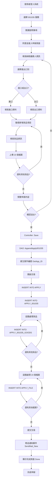

# 001035 非感染性人體器官、組織及細胞進出口申請作業 - 完整技術文件

## 服務基本資訊

| 項目             | 內容                                                       |
| ---------------- | ---------------------------------------------------------- |
| **服務代碼**     | 001035                                                     |
| **服務名稱**     | 非感染性人體器官、組織及細胞進出口申請作業                 |
| **業務單位**     | 醫事司（UNIT_CD = 4）                                      |
| **是否需繳費**   | 否                                                         |
| **Controller**   | `ES/Controllers/Apply_001035Controller.cs` (342 行)        |
| **ViewModel**    | `ES/Models/ViewModels/Apply_001035ViewModel.cs` (1,649 行) |
| **Entity Model** | `ES/Models/Entities/Apply_001035Model.cs` (535 行)         |
| **Goods Model**  | `ES/Models/Entities/Apply_001035_GoodsModel.cs` (113 行)   |
| **主要資料表**   | APPLY, APPLY_001035, APPLY_001035_GOODS, APPLY_FILE        |
| **檔案數量**     | 23 個檔案上傳欄位（固定）                                  |

---

## 服務特色

### 與其他服務的差異

| 項目           | 001034 危險性醫療儀器  | 001035 人體器官組織細胞            | 001008 英文證明書 |
| -------------- | ---------------------- | ---------------------------------- | ----------------- |
| **貨品清單**   | 動態（無限制）         | 動態（無限制）                     | 無                |
| **檔案上傳**   | 每個貨品 19 個檔案     | **23 個固定檔案（不分貨品）**      | 無                |
| **進出口選擇** | 固定進口               | **可選進口或出口**                 | 無                |
| **進口資料**   | 目的國、賣方國、起運港 | **生產國、賣方國、起運港**         | 無                |
| **出口資料**   | 無                     | **目的國、買方國、轉口港、起運港** | 無                |
| **檢附文件**   | 19 種（每個貨品）      | **23 種（整個案件）**              | 無                |
| **複雜度**     | ⭐⭐⭐⭐⭐ 極高        | ⭐⭐⭐⭐⭐ 極高                    | ⭐⭐⭐⭐ 高       |

### 核心功能

1. **動態貨品清單管理**

   - 可動態新增/刪除貨品項目
   - 每個貨品包含：類型、名稱、數量、單位、規格等

2. **進出口別選擇**

   - 進口（IM_EXPORT = "0"）：填寫進口資料
   - 出口（IM_EXPORT = "1"）：填寫出口資料
   - 根據選擇顯示不同的表單欄位

3. **23 個檢附文件類型**

   - 固定 23 個檔案上傳欄位
   - 每個文件包含：類型代碼、字號、說明、檔案
   - 文件類型代碼：B11~B32, B99

4. **進出口資訊管理**

   - 進口：生產國家、賣方國家、起運口岸、賣方資訊
   - 出口：目的地國家、買方國家、轉口港、起運口岸、買方資訊

5. **申請用途與核發方式**
   - 申請用途選擇
   - 核發方式選擇

---

## 系統架構

### 架構圖

```
使用者 → Controller → DAO → Database
         ↓
      ViewModel
         ↓
      Razor View
```

**說明：**

- 使用者透過瀏覽器填寫表單
- Controller 接收請求並處理業務邏輯
- ViewModel 負責資料驗證和格式轉換
- DAO 負責資料庫操作
- Razor View 負責頁面呈現

### 資料流程圖

```
1. 申請流程：
   使用者填寫表單 → 選擇進出口別 → 填寫對應資料 → 動態新增貨品 → 上傳 23 個檔案 → 預覽 → 送出

2. 儲存流程：
   Controller.Save() → DAO.AppendApply001035() →
   INSERT APPLY → INSERT APPLY_001035 →
   迴圈 INSERT APPLY_001035_GOODS → 迴圈 INSERT APPLY_FILE (23 個檔案) →
   寄送通知郵件 → 顯示完成頁面

3. 補件流程：
   Controller.AppDoc() → DAO.QueryApply_001035() →
   顯示原申請資料 → 上傳補件檔案 →
   Controller.AppDocSave() → DAO.UpdateAddtionalDocApply_001035() →
   更新資料 → 寄送補件完成郵件
```

---

## 資料庫結構

### 1. APPLY 資料表（主表）

**說明：** 所有申辦案件的主表

**主要欄位：**

- `APP_ID` (PK)：案件編號
- `SRV_ID`：服務代碼（001035）
- `ACC_NO`：申請人帳號
- `NAME`：申請人姓名
- `IDN`：申請人身分證字號
- `FLOW_CD`：流程狀態（1:申請中, 2:補件中, 3:補件完成）
- `UNIT_CD`：業務單位（4:醫事司）
- `APP_TIME`：申請時間
- `APP_EXT_DATE`：展延日期

### 2. APPLY_001035 資料表（服務明細表）

**說明：** 001035 服務的詳細資料

**主要欄位：**

| 欄位名稱                                      | 資料型別      | 說明                                         |
| --------------------------------------------- | ------------- | -------------------------------------------- |
| `APP_ID`                                      | varchar(50)   | 案件編號（PK）                               |
| `TAX_ORG_ID`                                  | varchar(20)   | 身分證字號/統一編號                          |
| `TAX_ORG_NAME`                                | nvarchar(100) | 姓名/公司名稱（中文）                        |
| `TAX_ORG_ENAME`                               | varchar(200)  | 姓名/公司名稱（英文）                        |
| `TAX_ORG_ADDR`                                | nvarchar(200) | 聯絡地址（中文）                             |
| `TAX_ORG_EADDR`                               | varchar(400)  | 聯絡地址（英文）                             |
| `TAX_ORG_MAN`                                 | nvarchar(50)  | 聯絡人姓名                                   |
| `TAX_ORG_TEL`                                 | varchar(20)   | 聯絡人電話                                   |
| `TAX_ORG_EMAIL`                               | varchar(100)  | 聯絡人 Email                                 |
| `TAX_ORG_FAX`                                 | varchar(20)   | 聯絡人傳真                                   |
| `IM_EXPORT`                                   | varchar(1)    | 進出口別（0:進口, 1:出口）                   |
| `DATE_S`                                      | datetime      | 起始日期                                     |
| `DATE_E`                                      | datetime      | 終止日期                                     |
| **進口資料**                                  |               |                                              |
| `DEST_STATE_ID`                               | varchar(10)   | 生產國家代碼（進口）/ 目的地國家代碼（出口） |
| `DEST_STATE`                                  | nvarchar(100) | 生產國家名稱（進口）/ 目的地國家名稱（出口） |
| `SELL_STATE_ID`                               | varchar(10)   | 賣方國家代碼（進口）/ 買方國家代碼（出口）   |
| `SELL_STATE`                                  | nvarchar(100) | 賣方國家名稱（進口）/ 買方國家名稱（出口）   |
| `BEG_COUNTRY_ID`                              | varchar(10)   | 起運口岸國家代碼                             |
| `BEG_PORT_ID`                                 | varchar(10)   | 起運口岸代碼                                 |
| `BEG_PORT`                                    | nvarchar(100) | 起運口岸名稱                                 |
| `SELL_NAME`                                   | varchar(200)  | 賣方英文名稱（進口）/ 買方英文名稱（出口）   |
| `SELL_ADDR`                                   | varchar(400)  | 賣方英文地址（進口）/ 買方英文地址（出口）   |
| **出口資料**                                  |               |                                              |
| `TRN_COUNTRY_ID`                              | varchar(10)   | 轉口港國家代碼（僅出口）                     |
| `TRN_PORT_ID`                                 | varchar(10)   | 轉口港代碼（僅出口）                         |
| `TRN_PORT`                                    | nvarchar(100) | 轉口港名稱（僅出口）                         |
| **其他資料**                                  |               |                                              |
| `APP_USE_ID`                                  | varchar(10)   | 申請用途代碼                                 |
| `APP_USE`                                     | nvarchar(100) | 申請用途名稱                                 |
| `CONF_TYPE_ID`                                | varchar(10)   | 核發方式代碼                                 |
| `CONF_TYPE`                                   | nvarchar(100) | 核發方式名稱                                 |
| **檢附文件（23 個）**                         |               |                                              |
| `DOC_TYP_01` ~ `DOC_TYP_23`                   | varchar(10)   | 檢附文件類型代碼                             |
| `DOC_COD_01` ~ `DOC_COD_23`                   | varchar(50)   | 檢附文件字號                                 |
| `DOC_TXT_01` ~ `DOC_TXT_23`                   | nvarchar(500) | 檢附文件說明                                 |
| **標準欄位**                                  |               |                                              |
| `ADD_TIME`, `ADD_FUN_CD`, `ADD_ACC`           |               | 新增資訊                                     |
| `UPD_TIME`, `UPD_FUN_CD`, `UPD_ACC`           |               | 更新資訊                                     |
| `DEL_MK`, `DEL_TIME`, `DEL_FUN_CD`, `DEL_ACC` |               | 刪除資訊                                     |

### 3. APPLY_001035_GOODS 資料表（貨品清單表）

**說明：** 儲存每個案件的貨品清單（一對多關係）

**主要欄位：**

| 欄位名稱                                      | 資料型別      | 說明           |
| --------------------------------------------- | ------------- | -------------- |
| `APP_ID`                                      | varchar(50)   | 案件編號（PK） |
| `SRL_NO`                                      | int           | 序號（PK）     |
| `GOODS_TYPE_ID`                               | varchar(10)   | 貨品類型代碼   |
| `GOODS_TYPE`                                  | nvarchar(100) | 貨品類型名稱   |
| `GOODS_SID`                                   | varchar(50)   | 貨品編號       |
| `GOODS_NAME`                                  | nvarchar(200) | 貨品名稱       |
| `APPLY_CNT`                                   | int           | 申請數量       |
| `GOODS_UNIT_ID`                               | varchar(10)   | 單位代碼       |
| `GOODS_UNIT`                                  | nvarchar(50)  | 單位名稱       |
| `GOODS_MODEL`                                 | nvarchar(100) | 型號           |
| `GOODS_SPEC_1`                                | nvarchar(200) | 規格 1         |
| `GOODS_SPEC_2`                                | nvarchar(200) | 規格 2         |
| `GOODS_BRAND`                                 | nvarchar(100) | 品牌           |
| `GOODS_DESC`                                  | nvarchar(500) | 說明           |
| **標準欄位**                                  |               |                |
| `ADD_TIME`, `ADD_FUN_CD`, `ADD_ACC`           |               | 新增資訊       |
| `UPD_TIME`, `UPD_FUN_CD`, `UPD_ACC`           |               | 更新資訊       |
| `DEL_MK`, `DEL_TIME`, `DEL_FUN_CD`, `DEL_ACC` |               | 刪除資訊       |

### 4. APPLY_FILE 資料表（附件檔案表）

**說明：** 儲存所有案件的附件檔案

**主要欄位：**

- `APP_ID` (PK)：案件編號
- `FILE_NO` (PK)：檔案編號（1~23）
- `FILENAME`：實際檔案名稱（儲存在伺服器）
- `SRC_FILENAME`：原始檔案名稱
- `SRC_NO`：檔案來源編號（1~23，對應 DOC_TYP_01~23）
- `BATCH_INDEX`：批次索引（此服務固定為 NULL）

**檔案關聯邏輯：**

- `FILE_NO`：檔案編號（1~23）
- `SRC_NO`：對應檢附文件類型（1~23）
- 例如：FILE_NO=1, SRC_NO=1 表示第 1 個檔案，對應 DOC_TYP_01

### 5. 檢附文件類型代碼對照表

| 代碼 | 文件類型                                                                     | 欄位名稱   |
| ---- | ---------------------------------------------------------------------------- | ---------- |
| B11  | 申請單位同意試驗〈使用〉之文件或計畫摘要                                     | DOC_TYP_01 |
| B12  | 輸出國主管機關同意輸出文件或足以證明輸出國未管制輸出文件                     | DOC_TYP_02 |
| B13  | 貨品之檢驗證明文件                                                           | DOC_TYP_03 |
| B14  | 來源單位合法設立證明文件                                                     | DOC_TYP_04 |
| B15  | 來源單位證明捐贈者同意捐贈之文件                                             | DOC_TYP_05 |
| B16  | 與貨品輸入單位合作之相關證明文件                                             | DOC_TYP_06 |
| B17  | 來本署藥政處藥品臨床試驗許可函(如進行藥物臨床試驗者必備)                     | DOC_TYP_07 |
| B18  | 捐贈者年齡、器官、組織或細胞摘取時間等資料(進口眼角膜得於輸入後一個月內補正) | DOC_TYP_08 |
| B19  | 教學課程計畫書                                                               | DOC_TYP_09 |
| B20  | 藥物臨床試驗許可函                                                           | DOC_TYP_10 |
| B21  | 臨床試驗摘要                                                                 | DOC_TYP_11 |
| B22  | 檢體數量概估說明(表)                                                         | DOC_TYP_12 |
| B23  | IRB 審核通過之國外擔保書                                                     | DOC_TYP_13 |
| B24  | 捐贈者同意文件（或來源單位證明捐者同意捐贈之文件）                           | DOC_TYP_14 |
| B25  | 捐贈者同意範例文件                                                           | DOC_TYP_15 |
| B26  | 與單位合作之相關證明文件                                                     | DOC_TYP_16 |
| B27  | 研究單位同意試驗文件（如：IRB 許可函）                                       | DOC_TYP_17 |
| B28  | 輸入貨品之檢驗證明文件或無污染證明文件                                       | DOC_TYP_18 |
| B29  | 藥物臨床試驗許可函及/或試驗計畫摘要                                          | DOC_TYP_19 |
| B30  | 原核准輸出同意函                                                             | DOC_TYP_20 |
| B31  | 細胞治療技術施行計畫核准函                                                   | DOC_TYP_21 |
| B32  | 細胞製備場所 GTP 認可函                                                      | DOC_TYP_22 |
| B99  | 其他                                                                         | DOC_TYP_23 |

---

## ViewModel 結構

### Apply_001035FormModel

**繼承：** Apply_001035Model

**主要屬性：**

```csharp
public class Apply_001035FormModel : Apply_001035Model
{
    // 基本資訊
    public string APP_ID { get; set; }
    public string SRV_ID { get; set; }
    public string ACC_NO { get; set; }
    public string NAME { get; set; }
    public string IDN { get; set; }
    public DateTime? APP_TIME { get; set; }
    public string APP_TIME_AD { get; set; }  // 民國年格式

    // 納稅義務人資料
    public string TAX_ORG_ID { get; set; }
    public string TAX_ORG_NAME { get; set; }
    public string TAX_ORG_ENAME { get; set; }
    public string TAX_ORG_ZIP { get; set; }
    public string TAX_ORG_ADDR { get; set; }
    public string TAX_ORG_EADDR { get; set; }

    // 聯絡資訊
    public string TAX_ORG_MAN { get; set; }
    public string TAX_ORG_TEL { get; set; }
    public string TAX_ORG_EMAIL { get; set; }
    public string TAX_ORG_FAX { get; set; }

    // 進出口別
    public string IM_EXPORT { get; set; }  // 0:進口, 1:出口
    public DateTime? DATE_S { get; set; }
    public DateTime? DATE_E { get; set; }
    public string DATE_S_AD { get; set; }  // 民國年格式
    public string DATE_E_AD { get; set; }  // 民國年格式

    // 進口資料（IM_EXPORT = "0"）
    public string Dest_DEST_STATE_ID { get; set; }  // 生產國家代碼
    public string Dest_SELL_STATE_ID { get; set; }  // 賣方國家代碼
    public string Dest_BEG_COUNTRY_ID { get; set; }  // 起運口岸國家代碼
    public string Dest_BEG_PORT_ID { get; set; }  // 起運口岸代碼
    public string Dest_SELL_NAME { get; set; }  // 賣方英文名稱
    public string Dest_SELL_ADDR { get; set; }  // 賣方英文地址

    // 出口資料（IM_EXPORT = "1"）
    public string Sell_DEST_STATE_ID { get; set; }  // 目的地國家代碼
    public string Sell_SELL_STATE_ID { get; set; }  // 買方國家代碼
    public string Sell_TRN_COUNTRY_ID { get; set; }  // 轉口港國家代碼
    public string Sell_TRN_PORT_ID { get; set; }  // 轉口港代碼
    public string Sell_BEG_COUNTRY_ID { get; set; }  // 起運口岸國家代碼
    public string Sell_BEG_PORT_ID { get; set; }  // 起運口岸代碼
    public string Sell_SELL_NAME { get; set; }  // 買方英文名稱
    public string Sell_SELL_ADDR { get; set; }  // 買方英文地址

    // 貨品清單（動態網格）
    public GoodsDynamicGrid<Apply_001035_GoodsModel> GOODS { get; set; }

    // 其他資料
    public string APP_USE_ID { get; set; }  // 申請用途代碼
    public string CONF_TYPE_ID { get; set; }  // 核發方式代碼

    // 檢附文件（23 個）
    // 每個文件包含：勾選、字號、說明、檔案
    public Boolean DOC_TYP_01_SHOW { get; set; }  // 勾選
    public string DOC_COD_01 { get; set; }  // 字號
    public string DOC_TXT_01 { get; set; }  // 說明
    public HttpPostedFileBase DOC_FILE_01 { get; set; }  // 檔案
    public string DOC_FILE_01_FILENAME { get; set; }  // 檔案名稱
    // ... (DOC_TYP_02 ~ DOC_TYP_23 結構相同)

    // 控制欄位
    public bool IsNew { get; set; }  // 是否為新增
    public string IsMode { get; set; }  // 模式
}
```

### Apply_001035_GoodsModel

**說明：** 貨品清單項目

**主要屬性：**

```csharp
public class Apply_001035_GoodsModel
{
    public string APP_ID { get; set; }  // 案件編號
    public int? SRL_NO { get; set; }  // 序號
    public string GOODS_TYPE_ID { get; set; }  // 貨品類型代碼
    public string GOODS_TYPE { get; set; }  // 貨品類型名稱
    public string GOODS_SID { get; set; }  // 貨品編號
    public string GOODS_NAME { get; set; }  // 貨品名稱
    public int? APPLY_CNT { get; set; }  // 申請數量
    public string GOODS_UNIT_ID { get; set; }  // 單位代碼
    public string GOODS_UNIT { get; set; }  // 單位名稱
    public string GOODS_MODEL { get; set; }  // 型號
    public string GOODS_SPEC_1 { get; set; }  // 規格 1
    public string GOODS_SPEC_2 { get; set; }  // 規格 2
    public string GOODS_BRAND { get; set; }  // 品牌
    public string GOODS_DESC { get; set; }  // 說明
}
```

---

## Controller 實作

### Apply_001035Controller

**檔案位置：** `ES/Controllers/Apply_001035Controller.cs`

**繼承：** BaseController

**主要方法：**

#### 1. Prompt() - 說明事項頁面

```csharp
[HttpGet]
public ActionResult Prompt()
{
    SessionModel sm = SessionModel.Get();
    string s_msg_1A = "請先閱讀 「{0}說明事項」點選同意後，再進入申辦頁面 !";
    sm.LastErrorMessage = string.Format(s_msg_1A, s_SRV_NAME);
    return View("Prompt001035");
}
```

**說明：**

- 顯示服務說明事項
- 要求使用者閱讀並同意後才能進入申辦頁面

**回傳：** Prompt001035.cshtml 視圖

#### 2. Apply() [GET] - 申請表單頁面

```csharp
public ActionResult Apply(string agree)
{
    SessionModel sm = SessionModel.Get();
    Apply_001035FormModel model = new Apply_001035FormModel();
    ActionResult rtn = View("Index", model);
    model.ADD_TIME = DateTime.Now;
    var UsIn = sm.UserInfo.Member;
    model.IM_EXPORT = "0";  // 預設為進口
    model.APP_TIME = DateTime.Now;

    if (UsIn != null)
    {
        ShareDAO dao = new ShareDAO();
        model.ACC_NO = UsIn.ACC_NO;
        model.SRV_ID = "001035";
        model.SRC_SRV_ID = "001035";
        model.UNIT_CD = dao.GetServiceUnitCD(model.SRV_ID);
        model.NAME = UsIn.NAME;
        model.IDN = UsIn.IDN;

        // 帶入會員資訊
        model.TAX_ORG_MAN = !string.IsNullOrWhiteSpace(UsIn.CNT_NAME) ? UsIn.CNT_NAME : UsIn.NAME;
        model.TAX_ORG_TEL = UsIn.TEL;
        model.TAX_ORG_EMAIL = UsIn.MAIL;
        model.TAX_ORG_FAX = UsIn.FAX;
        model.TAX_ORG_ID = UsIn.IDN;
        model.TAX_ORG_NAME = UsIn.NAME;
        model.TAX_ORG_ENAME = UsIn.ENAME;

        return rtn;
    }
    else
    {
        return RedirectToAction("Index", "Login");
    }
}
```

**說明：**

- 顯示空白申請表單
- 自動帶入會員基本資料
- 預設進出口別為「進口」
- 初始化動態貨品清單

**回傳：** Index.cshtml 視圖

#### 3. Apply() [POST] - AJAX 表單驗證

```csharp
[HttpPost]
public ActionResult Apply(Apply_001035FormModel model)
{
    SessionModel sm = SessionModel.Get();
    ApplyDAO dao = new ApplyDAO();
    ActionResult rtn = View(model);
    var errormsg = string.Empty;

    // 根據進出口別清除不需要的驗證錯誤
    if (model.IM_EXPORT == "0")  // 進口
    {
        foreach (var item in ModelState)
        {
            if (item.Key.ToLeft(5) == "Sell_")  // 清除出口欄位的驗證錯誤
            {
                item.Value.Errors.Clear();
            }
        }
    }
    if (model.IM_EXPORT == "1")  // 出口
    {
        foreach (var item in ModelState)
        {
            if (item.Key.ToLeft(5) == "Dest_")  // 清除進口欄位的驗證錯誤
            {
                item.Value.Errors.Clear();
            }
        }
    }

    if (ModelState.IsValid)
    {
        ModelState.Clear();
        errormsg = model.FileSave();  // 儲存檔案
        errormsg += dao.Check001035(model);  // 自訂驗證

        if (errormsg != "")
        {
            sm.LastErrorMessage = errormsg;
        }
        else
        {
            if (model.IsMode == "1")  // 預覽模式
            {
                model.IsNew = false;
                model.GOODS.IsReadOnly = true;
            }
            if (model.IsMode == "0")  // 編輯模式
            {
                model.IsNew = true;
                model.GOODS.IsReadOnly = false;
            }
        }
    }
    else
    {
        errormsg = errormsg + model.FileSave();
        errormsg = errormsg + dao.Check001035(model);

        foreach (var item in ModelState.Values)
        {
            if (item.Errors.ToCount() > 0)
            {
                errormsg = errormsg + item.Errors[0].ErrorMessage + "\n";
            }
        }
        sm.LastErrorMessage = errormsg;
    }

    rtn = View("Index", model);
    return rtn;
}
```

**說明：**

- 接收 AJAX 表單驗證請求
- 根據進出口別清除不需要的驗證錯誤
- 執行自訂驗證（Check001035）
- 儲存上傳的檔案
- 回傳驗證結果

**自訂驗證規則（Check001035）：**

- 中文或英文地址至少填寫一個
- 中文或英文姓名/公司名稱至少填寫一個
- Email 格式驗證
- 起始日期不得大於終止日期
- 賣方/買方英文名稱僅可輸入英文
- 賣方/買方英文地址僅可輸入英文、數字、符號

**回傳：** Index.cshtml 視圖

#### 4. Save() - 儲存並完成申報

```csharp
[HttpPost]
public ActionResult Save(Apply_001035FormModel model)
{
    SessionModel sm = SessionModel.Get();
    ApplyDAO dao = new ApplyDAO();
    var memberName = string.IsNullOrWhiteSpace(model.NAME) ? sm.UserInfo.Member.NAME : model.NAME;
    var memberEmail = string.IsNullOrWhiteSpace(model.TAX_ORG_EMAIL) ? sm.UserInfo.Member.MAIL : model.TAX_ORG_EMAIL;
    ModelState.Clear();

    // 存檔
    dao.AppendApply001035(model);

    // 寄信
    dao.SendMail_New(memberName, memberEmail, model.APP_ID, "非感染性人體器官、組織及細胞進出口", "001035");

    return Done("1");
}
```

**說明：**

- 取得會員資訊
- 呼叫 `AppendApply001035()` 儲存申請資料
- 呼叫 `SendMail_New()` 寄送通知郵件
- 顯示完成頁面

**處理流程：**

1. 產生案件編號
2. 儲存至 APPLY 表
3. 儲存至 APPLY_001035 表
4. 儲存貨品清單至 APPLY_001035_GOODS 表
5. 儲存 23 個檔案至 APPLY_FILE 表
6. 寄送通知郵件
7. 顯示完成頁面

**回傳：** Done.cshtml 視圖

#### 5. AppDoc() - 補件查詢

```csharp
public ActionResult AppDoc(string APP_ID)
{
    ApplyDAO dao = new ApplyDAO();
    SessionModel sm = SessionModel.Get();
    Apply_001035FormModel model = new Apply_001035FormModel(APP_ID);

    try
    {
        var UsIn = sm.UserInfo.Member;

        // 案件基本資訊
        ApplyModel aly = new ApplyModel();
        aly.APP_ID = APP_ID;
        var alydata = dao.GetRow(aly);
        model.SRV_ID = "001035";
        model.APP_TIME = alydata.APP_TIME;
        model.NAME = alydata.NAME;
        model.IDN = alydata.IDN;

        // 判斷是否為該案件申請人
        if (alydata.ACC_NO == UsIn.ACC_NO)
        {
            // 基本資料
            Apply_001035Model app = new Apply_001035Model();
            app.APP_ID = APP_ID;
            var appdata = dao.GetRow(app);

            // 納稅義務人資料
            model.TAX_ORG_ID = appdata.TAX_ORG_ID;
            model.TAX_ORG_NAME = appdata.TAX_ORG_NAME;
            model.TAX_ORG_ENAME = appdata.TAX_ORG_ENAME;
            model.TAX_ORG_ADDR = appdata.TAX_ORG_ADDR;
            model.TAX_ORG_EADDR = appdata.TAX_ORG_EADDR;
            model.TAX_ORG_MAN = appdata.TAX_ORG_MAN;
            model.TAX_ORG_TEL = appdata.TAX_ORG_TEL;
            model.TAX_ORG_EMAIL = appdata.TAX_ORG_EMAIL;
            model.TAX_ORG_FAX = appdata.TAX_ORG_FAX;
            model.IM_EXPORT = appdata.IM_EXPORT;
            model.DATE_S = appdata.DATE_S;
            model.DATE_E = appdata.DATE_E;

            // 根據進出口別載入對應資料
            if (model.IM_EXPORT == "0")  // 進口
            {
                model.Dest_DEST_STATE_ID = appdata.DEST_STATE_ID;
                model.Dest_SELL_STATE_ID = appdata.SELL_STATE_ID;
                model.Dest_BEG_COUNTRY_ID = appdata.BEG_COUNTRY_ID;
                model.Dest_BEG_PORT_ID = appdata.BEG_PORT_ID;
                model.Dest_SELL_NAME = appdata.SELL_NAME;
                model.Dest_SELL_ADDR = appdata.SELL_ADDR;
            }
            if (model.IM_EXPORT == "1")  // 出口
            {
                model.Sell_DEST_STATE_ID = appdata.DEST_STATE_ID;
                model.Sell_SELL_STATE_ID = appdata.SELL_STATE_ID;
                model.Sell_TRN_COUNTRY_ID = appdata.TRN_COUNTRY_ID;
                model.Sell_TRN_PORT_ID = appdata.TRN_PORT_ID;
                model.Sell_BEG_COUNTRY_ID = appdata.BEG_COUNTRY_ID;
                model.Sell_BEG_PORT_ID = appdata.BEG_PORT_ID;
                model.Sell_SELL_NAME = appdata.SELL_NAME;
                model.Sell_SELL_ADDR = appdata.SELL_ADDR;
            }

            // 其他資料
            model.APP_USE_ID = appdata.APP_USE_ID;
            model.CONF_TYPE_ID = appdata.CONF_TYPE_ID;

            // 載入 23 個檢附文件資料（使用反射）
            for (var k = 1; k <= 23; k++)
            {
                var kNo = k.TONotNullString().PadLeft(2, '0');

                // 檢附文件類型
                var MOD_DOC_TYP = model.GetType().GetProperties().Where(m => m.Name == "DOC_TYP_" + kNo);
                var APP_DOC_TYP = appdata.GetType().GetProperties().Where(m => m.Name == "DOC_TYP_" + kNo);
                if (MOD_DOC_TYP.ToCount() > 0 && APP_DOC_TYP.ToCount() > 0)
                {
                    var ModObj = MOD_DOC_TYP.FirstOrDefault();
                    var AppObj = APP_DOC_TYP.FirstOrDefault();
                    var AppVal = AppObj.GetValue(appdata);
                    ModObj.SetValue(model, AppVal);
                }

                // 檢附文件字號
                var MOD_DOC_COD = model.GetType().GetProperties().Where(m => m.Name == "DOC_COD_" + kNo);
                var APP_DOC_COD = appdata.GetType().GetProperties().Where(m => m.Name == "DOC_COD_" + kNo);
                if (MOD_DOC_COD.ToCount() > 0 && APP_DOC_COD.ToCount() > 0)
                {
                    var ModObj = MOD_DOC_COD.FirstOrDefault();
                    var AppObj = APP_DOC_COD.FirstOrDefault();
                    var AppVal = AppObj.GetValue(appdata);
                    ModObj.SetValue(model, AppVal);
                }

                // 檢附文件說明
                var MOD_DOC_TXT = model.GetType().GetProperties().Where(m => m.Name == "DOC_TXT_" + kNo);
                var APP_DOC_TXT = appdata.GetType().GetProperties().Where(m => m.Name == "DOC_TXT_" + kNo);
                if (MOD_DOC_TXT.ToCount() > 0 && APP_DOC_TXT.ToCount() > 0)
                {
                    var ModObj = MOD_DOC_TXT.FirstOrDefault();
                    var AppObj = APP_DOC_TXT.FirstOrDefault();
                    var AppVal = AppObj.GetValue(appdata);
                    ModObj.SetValue(model, AppVal);
                }
            }

            // 載入檔案資料
            for (var k = 1; k <= 23; k++)
            {
                Apply_FileModel fileWhere = new Apply_FileModel();
                fileWhere.APP_ID = APP_ID;
                fileWhere.FILE_NO = k;
                var filedata = dao.GetRow(fileWhere);

                var kNo = k.TONotNullString().PadLeft(2, '0');
                var fileNo = model.GetType().GetProperties().Where(m => m.Name == "DOC_FILE_" + kNo + "_FILENAME");
                if (fileNo.ToCount() > 0)
                {
                    var fileObj = fileNo.FirstOrDefault();
                    fileObj.SetValue(model, filedata.FILENAME);
                }
            }

            model.IsNew = false;
            model.GOODS.IsReadOnly = true;

            return View("Detail", model);
        }
        else
        {
            throw new Exception("非案件申請人無法瀏覽次案件 !");
        }
    }
    catch (Exception ex)
    {
        sm.LastErrorMessage = ex.Message;
        return RedirectToAction("Index", "Login");
    }
}
```

**說明：**

- 查詢申請案件資料
- 驗證是否為案件申請人
- 根據進出口別載入對應資料
- 使用反射載入 23 個檢附文件資料
- 載入檔案資料
- 顯示案件明細（唯讀）

**回傳：** Detail.cshtml 視圖

#### 6. Done() - 完成頁面

```csharp
public ActionResult Done(string status, string Count = "")
{
    SessionModel sm = SessionModel.Get();
    Apply_001035DoneModel model = new Apply_001035DoneModel();

    model.status = status.TONotNullString();
    model.Count = Count.TONotNullString();

    return View("Done", model);
}
```

**說明：**

- 顯示申請完成或補件完成訊息
- status = "1"：申請完成
- status = "A"：補件完成

**回傳：** Done.cshtml 視圖

---

## DAO 實作

### ApplyDAO

**檔案位置：** `ES/DataLayers/ApplyDAO.cs`

#### 1. AppendApply001035() 方法

**方法簽章：**

```csharp
public void AppendApply001035(Apply_001035FormModel form)
```

**說明：** 新增非感染性人體器官、組織及細胞進出口申請作業案件

**處理流程：**

1. 產生案件編號（GetApp_ID）
2. 開啟資料庫連線和交易
3. 插入 APPLY 主表
4. 插入 APPLY_001035 明細表（根據進出口別儲存對應資料）
5. 迴圈處理每個貨品：
   - 插入 APPLY_001035_GOODS 表
6. 迴圈處理 23 個檔案：
   - 上傳並插入檔案到 APPLY_FILE 表
7. 提交交易
8. 發生錯誤時回滾交易

**重要欄位處理：**

- 進出口別判斷：根據 IM_EXPORT 決定儲存進口或出口資料
- 進口資料：DEST_STATE_ID（生產國）, SELL_STATE_ID（賣方國）, BEG_PORT_ID（起運港）
- 出口資料：DEST_STATE_ID（目的國）, SELL_STATE_ID（買方國）, TRN_PORT_ID（轉口港）, BEG_PORT_ID（起運港）
- 檔案編號：FILE_NO = 1~23, SRC_NO = 1~23

#### 2. Check001035() 方法

**方法簽章：**

```csharp
public string Check001035(Apply_001035FormModel form)
```

**說明：** 自訂驗證規則

**驗證項目：**

1. 中文或英文地址至少填寫一個
2. 中文或英文姓名/公司名稱至少填寫一個
3. Email 格式驗證（正則表達式）
4. 起始日期不得大於終止日期
5. 賣方/買方英文名稱僅可輸入英文（正則表達式：`^[A-Za-z\.\&\s]+$`）
6. 賣方/買方英文地址僅可輸入英文、數字、符號（正則表達式：`^[A-Za-z0-9\.\-\,\s\(\)]+$`）

**回傳：** 錯誤訊息字串（無錯誤則回傳空字串）

---

## 前端實作

### View 檔案結構

**檔案位置：** `ES/Views/Apply_001035/`

**主要視圖檔案：**

1. **Prompt001035.cshtml** - 說明事項頁面

   - 顯示服務說明
   - 同意按鈕

2. **Index.cshtml** - 申請表單頁面

   - 納稅義務人資訊
   - 進出口別選擇（單選按鈕）
   - 進口資料區塊（IM_EXPORT = "0" 時顯示）
   - 出口資料區塊（IM_EXPORT = "1" 時顯示）
   - 動態貨品清單
   - 23 個檔案上傳欄位

3. **Detail.cshtml** - 明細頁面

   - 顯示案件詳細資料（唯讀）
   - 顯示貨品清單
   - 顯示附件清單

4. **Done.cshtml** - 完成頁面
   - 顯示申請成功訊息
   - 顯示案件編號
   - 提供查詢案件連結

### JavaScript 實作

#### 進出口別切換

```javascript
// 進出口別切換事件
$("input[name='IM_EXPORT']").change(function () {
  var value = $(this).val();

  if (value == "0") {
    // 進口
    $("#IMPORT").show(); // 顯示進口資料區塊
    $("#EXPORT").hide(); // 隱藏出口資料區塊
  } else if (value == "1") {
    // 出口
    $("#IMPORT").hide(); // 隱藏進口資料區塊
    $("#EXPORT").show(); // 顯示出口資料區塊
  }
});
```

#### 動態貨品清單管理

```javascript
// 新增貨品項目
function addGoods() {
  var goodsCount = $("#goodsContainer .goods-item").length;
  var newIndex = goodsCount;

  // 複製貨品範本
  var template = $("#goodsTemplate").html();
  template = template.replace(/\{INDEX\}/g, newIndex);

  $("#goodsContainer").append(template);

  // 重新綁定事件
  bindGoodsEvents();
}

// 刪除貨品項目
function removeGoods(index) {
  if (confirm("確定要刪除此貨品嗎？")) {
    $("#goods_" + index).remove();
    reindexGoods();
  }
}

// 重新編號貨品
function reindexGoods() {
  $("#goodsContainer .goods-item").each(function (index) {
    $(this).attr("id", "goods_" + index);
    $(this)
      .find("[name^='GOODS']")
      .each(function () {
        var name = $(this).attr("name");
        var newName = name.replace(
          /GOODS\.model\[\d+\]/,
          "GOODS.model[" + index + "]"
        );
        $(this).attr("name", newName);
      });
  });
}
```

#### 檔案上傳處理

```javascript
// 檔案上傳事件
function bindFileUpload() {
  $(".file-upload").change(function () {
    var fileInput = $(this);
    var fileName = fileInput.val().split("\\").pop();
    var fileNameDisplay = fileInput.siblings(".file-name-display");

    if (fileName) {
      fileNameDisplay.text(fileName);
      fileNameDisplay.show();
    } else {
      fileNameDisplay.hide();
    }
  });
}

// 檢附文件勾選事件
function doDocCheck(checkbox) {
  var isChecked = checkbox.is(":checked");
  var formId = checkbox.attr("form_id");

  if (isChecked) {
    // 顯示對應的字號、說明、檔案欄位
    $("#" + formId.replace("_SHOW", "_COD"))
      .closest("tr")
      .show();
    $("#" + formId.replace("_SHOW", "_TXT"))
      .closest("tr")
      .show();
    $("#" + formId.replace("_SHOW", "_FILE"))
      .closest("tr")
      .show();
  } else {
    // 隱藏對應的字號、說明、檔案欄位
    $("#" + formId.replace("_SHOW", "_COD"))
      .closest("tr")
      .hide();
    $("#" + formId.replace("_SHOW", "_TXT"))
      .closest("tr")
      .hide();
    $("#" + formId.replace("_SHOW", "_FILE"))
      .closest("tr")
      .hide();
  }
}
```

#### 表單驗證

```javascript
function validateForm() {
  // 驗證納稅義務人資訊
  if (!$("#TAX_ORG_ID").val()) {
    alert("請輸入身分證字號/統一編號");
    return false;
  }

  // 驗證中文或英文姓名至少填寫一個
  if (!$("#TAX_ORG_NAME").val() && !$("#TAX_ORG_ENAME").val()) {
    alert("請至少填寫姓名/公司名稱中文或英文");
    return false;
  }

  // 驗證中文或英文地址至少填寫一個
  if (!$("#TAX_ORG_ADDR").val() && !$("#TAX_ORG_EADDR").val()) {
    alert("請至少填寫聯絡地址中文或英文");
    return false;
  }

  // 驗證聯絡資訊
  if (!$("#TAX_ORG_MAN").val()) {
    alert("請輸入聯絡人姓名");
    return false;
  }

  if (!$("#TAX_ORG_TEL").val()) {
    alert("請輸入聯絡電話");
    return false;
  }

  if (!$("#TAX_ORG_EMAIL").val()) {
    alert("請輸入Email");
    return false;
  }

  // 驗證進出口別
  if (!$("input[name='IM_EXPORT']:checked").val()) {
    alert("請選擇進出口別");
    return false;
  }

  // 驗證貨品清單
  var goodsCount = $("#goodsContainer .goods-item").length;
  if (goodsCount == 0) {
    alert("請至少新增一個貨品項目");
    return false;
  }

  return true;
}
```

#### 送出表單

```javascript
function submitForm() {
  if (validateForm()) {
    if (confirm("確定要送出申請嗎？")) {
      $("#mainForm").attr("action", "/Apply_001035/Save");
      $("#mainForm").submit();
    }
  }
}
```

---

## 完整處理流程

### 流程圖



---

## 技術重點

### 1. 進出口別動態切換

**特點：**

- 使用單選按鈕選擇進出口別
- 根據選擇動態顯示/隱藏對應的表單區塊
- 進口和出口有不同的欄位要求

**實作方式：**

- JavaScript 監聽單選按鈕變更事件
- 使用 jQuery show()/hide() 切換區塊顯示
- Controller 根據 IM_EXPORT 清除不需要的驗證錯誤

### 2. 動態貨品清單管理

**特點：**

- 可動態新增/刪除貨品項目
- 每個貨品有獨立的資料欄位
- 自動重新編號

**實作方式：**

- 使用 GoodsDynamicGrid 動態網格元件
- JavaScript 動態生成 HTML
- 使用陣列索引命名：`GOODS.model[0].GOODS_TYPE_ID`

### 3. 23 個檢附文件管理

**特點：**

- 固定 23 個檔案上傳欄位
- 每個文件包含：勾選、字號、說明、檔案
- 勾選後才顯示對應的輸入欄位

**實作方式：**

- 使用反射動態處理 23 個欄位
- JavaScript 控制欄位顯示/隱藏
- 檔案編號：FILE_NO = 1~23, SRC_NO = 1~23

### 4. 進出口資訊管理

**進口資料：**

- 生產國家（貨品來源國家）
- 賣方國家（出口國）
- 起運口岸
- 賣方英文名稱、地址

**出口資料：**

- 目的地國家（貨品送達國家）
- 買方國家（進口國）
- 轉口港
- 起運口岸
- 買方英文名稱、地址

### 5. 交易管理

**重要性：**

- 確保資料一致性
- 多表插入時必須使用交易
- 發生錯誤時自動回滾

**涉及資料表：**

1. APPLY（主表）
2. APPLY_001035（明細表）
3. APPLY_001035_GOODS（貨品清單，多筆）
4. APPLY_FILE（附件檔案，23 筆）

---

## 相關檔案清單

### 前端檔案

- `ES/Controllers/Apply_001035Controller.cs` (342 行) - 控制器
- `ES/Models/ViewModels/Apply_001035ViewModel.cs` (1,649 行) - 視圖模型
- `ES/Views/Apply_001035/Prompt001035.cshtml` - 說明事項頁面
- `ES/Views/Apply_001035/Index.cshtml` - 申請表單
- `ES/Views/Apply_001035/Detail.cshtml` - 明細頁面
- `ES/Views/Apply_001035/Done.cshtml` - 完成頁面

### 後端檔案

- `ES/DataLayers/ApplyDAO.cs` - 資料存取層
- `ES/DataLayers/ShareDAO.cs` - 共用資料存取層
- `ES/Models/Entities/Apply_001035Model.cs` (535 行) - 實體模型
- `ES/Models/Entities/Apply_001035_GoodsModel.cs` (113 行) - 貨品實體模型
- `ES/Models/Entities/APPLYModel.cs` - APPLY 實體
- `ES/Models/Entities/Apply_FileModel.cs` - APPLY_FILE 實體

### 資料庫資料表

- `SERVICE` - 服務定義表
- `APPLY` - 申請主表
- `APPLY_001035` - 服務明細表
- `APPLY_001035_GOODS` - 貨品清單表
- `APPLY_FILE` - 附件檔案表
- `CODE_CD` - 代碼表（貨品類型、單位、國家、港口等）

---

## 注意事項

### 1. 進出口別選擇

- 必須選擇進口或出口
- 進口和出口有不同的欄位要求
- 切換進出口別時會清除對應的驗證錯誤

### 2. 貨品清單管理

- 至少需要新增一個貨品項目
- 貨品序號從 1 開始
- 刪除貨品後需要重新編號

### 3. 檔案上傳

- 共 23 個檔案上傳欄位
- 檔案格式限制（通常為 PDF）
- 檔案大小限制（通常為 10MB）
- 檔案編號：FILE_NO = 1~23, SRC_NO = 1~23

### 4. 進出口資訊

- 進口：需填寫生產國家、賣方國家、起運口岸、賣方資訊
- 出口：需填寫目的地國家、買方國家、轉口港、起運口岸、買方資訊
- 賣方/買方資訊需使用英文

### 5. 郵件通知

- 申請完成後自動寄送通知郵件
- 郵件包含案件編號和申請資訊
- 需要確保 Email 正確

### 6. 案件編號

- 格式：服務代碼 + 日期 + 流水號
- 例如：001035202501130001
- 每日流水號從 0001 開始

### 7. 流程狀態

- 01：申請中
- 02：補件中
- 03：補件完成
- 04：審核中
- 05：審核完成

### 8. 資料驗證

**前端驗證：**

- jQuery Validation
- AJAX 表單驗證
- 即時驗證回饋
- 貨品清單驗證

**後端驗證：**

- Data Annotations
- ModelState 驗證
- 業務邏輯驗證（Check001035）
- 檔案格式驗證

---

**版本：** 1.0
**日期：** 2025-10-20
**作者：** 柏通股份有限公司
