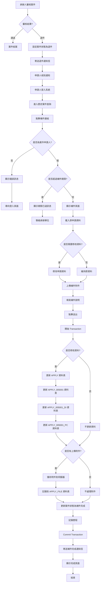
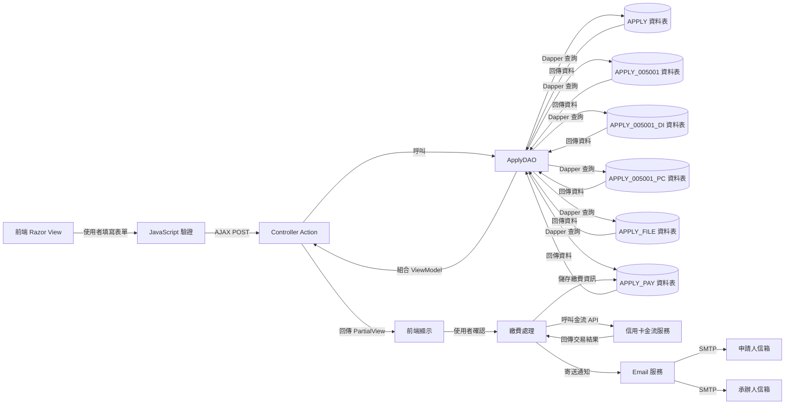
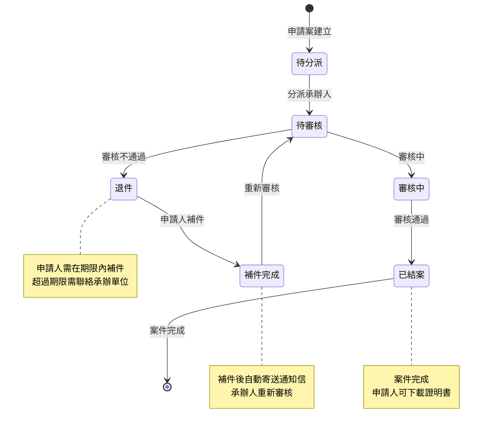

# 005001 產銷證明書 - 完整技術文件

## 服務基本資訊

| 項目             | 內容                                                                         |
| ---------------- | ---------------------------------------------------------------------------- |
| **服務代碼**     | 005001                                                                       |
| **服務名稱**     | 產銷證明書                                                                   |
| **業務單位**     | 中醫藥司                                                                     |
| **是否需繳費**   | 是（每份 1,500 元）                                                          |
| **Controller**   | `ES/Controllers/Apply_005001Controller.cs` (2,018 行)                        |
| **ViewModel**    | `ES/Models/ViewModels/Apply_005001ViewModel.cs` (1,355 行)                   |
| **Entity Model** | `ES/Models/Entities/Apply_005001Model.cs` (297 行)                           |
| **主要資料表**   | APPLY, APPLY_005001, APPLY_005001_DI, APPLY_005001_PC, APPLY_FILE, APPLY_PAY |
| **動態網格數量** | 2 個（成分內容 DI、賦形劑 PC）                                               |
| **檔案數量**     | 3 個固定檔案上傳欄位（可選）                                                 |

---

## 服務特色

### 與其他服務的差異

| 項目             | 001008 英文證明書 | 001034 危險性醫療儀器進口申請 | **005001 產銷證明書**        |
| ---------------- | ----------------- | ----------------------------- | ---------------------------- |
| **服務性質**     | 英文證明書        | 危險性醫療儀器進口申請        | **產銷證明書**               |
| **繳費方式**     | 無                | 無                            | **有（每份 1,500 元）**      |
| **動態網格**     | 4 個              | 1 個（貨品清單）              | **2 個（成分內容、賦形劑）** |
| **固定檔案上傳** | 無                | 無                            | **3 個（可選）**             |
| **檔案合併選項** | 無                | 無                            | **有**                       |
| **複雜度**       | ⭐⭐⭐⭐ 高       | ⭐⭐⭐⭐⭐ 極高               | **⭐⭐⭐⭐⭐ 極高**          |

### 核心功能

1. **申請人基本資料**

   - 公司名稱
   - 聯絡人姓名
   - 聯絡電話（區碼 + 號碼 + 分機）
   - 傳真（區碼 + 號碼 + 分機）
   - EMAIL（帳號 + 網域）

2. **藥商許可執照字號**

   - 中文：藥商許可執照字號（代碼 + 字號）
   - 英文：藥商許可執照字號（代碼 + 字號）

3. **製造廠資訊**

   - 製造廠名稱（中文、英文）
   - 製造廠地址（中文：縣市 + 詳細地址、英文）

4. **藥品資訊**

   - 藥品名稱（中文、英文）
   - 外銷品名（中文、英文，可選）
   - 劑型（中文、英文）
   - 核准日期（中文）
   - 有效日期（中文，可選）

5. **處方說明**

   - 處方說明（中文、英文）

6. **成分內容（動態網格 DI）**

   - 成分內容（中文）
   - 藥材名（英文）
   - 份量
   - 單位

7. **賦形劑（動態網格 PC）**

   - 成分內容（中文）
   - 藥材名（英文）
   - 份量
   - 單位

8. **濃縮製劑資訊（可選）**

   - 生藥與浸膏比例（分量、中文單位、英文單位、比例 1~4）

9. **適應症/效能（可選）**

   - 適應症（中文、英文）
   - 效能（中文、英文）

10. **檢附文件管理**（3 個固定檔案，可選）

    - 藥品許可證影本（正面）
    - 藥品許可證影本（反面）
    - 處方之中藥材中英文對照表

11. **繳費功能**
    - 申請份數（預設 1 份）
    - 繳費金額（每份 1,500 元）
    - 5 種繳費方式

---

## 系統架構

### 架構圖

```
使用者 → Controller → DAO → Database
         ↓
      ViewModel
         ↓
      Razor View
         ↓
   GoodsDynamicGrid (DI, PC)
```

**說明：**

- 使用者透過瀏覽器填寫表單
- Controller 接收請求並處理業務邏輯
- ViewModel 負責資料驗證和格式轉換
- DAO 負責資料庫操作
- Razor View 負責頁面呈現
- GoodsDynamicGrid 負責動態網格管理（成分內容 DI、賦形劑 PC）

### 資料流程圖

```
1. 申請流程：
   使用者填寫基本資料 → 填寫藥商許可執照字號 → 填寫製造廠資訊 →
   填寫藥品資訊 → 填寫處方說明 → 填寫成分內容（動態網格 DI） →
   填寫賦形劑（動態網格 PC） → 填寫濃縮製劑資訊（可選） →
   填寫適應症/效能（可選） → 上傳檢附文件（3 個檔案，可選） →
   選擇是否合併檔案 → 選擇申請份數 → 預覽 → 繳費 → 送出 → 完成

2. 儲存流程：
   Controller.Apply() → DAO.SaveApply005001() →
   INSERT APPLY → INSERT APPLY_005001 →
   INSERT APPLY_005001_DI (成分內容) →
   INSERT APPLY_005001_PC (賦形劑) →
   INSERT APPLY_FILE (檔案) →
   INSERT APPLY_PAY (繳費) →
   寄送通知郵件 → 顯示完成頁面

3. 補件流程：
   Controller.AppDoc() → DAO.QueryApply005001() →
   顯示原申請資料 → 上傳補件檔案 →
   Controller.AppDocSave() → DAO.SaveAppDoc005001() →
   更新資料 → 寄送補件完成郵件
```

---

## 資料庫結構

### 1. APPLY 資料表（主表）

**說明：** 所有申辦案件的主表

**主要欄位：**

- `APP_ID` (PK)：案件編號
- `SRV_ID`：服務代碼（005001）
- `ACC_NO`：申請人帳號
- `NAME`：申請人姓名
- `IDN`：申請人身分證字號
- `FLOW_CD`：流程狀態（1:申請中, 2:補件中, 3:補件完成）
- `UNIT_CD`：業務單位
- `APP_TIME`：申請時間
- `APP_EXT_DATE`：展延日期

### 2. APPLY_005001 資料表（服務明細表）

**說明：** 005001 服務的詳細資料

**主要欄位：**

| 欄位名稱                                      | 資料型別 | 長度 | NULL | 說明                       | 範例值                          |
| --------------------------------------------- | -------- | ---- | ---- | -------------------------- | ------------------------------- |
| `APP_ID`                                      | varchar  | 50   | NO   | 案件編號（PK）             | 005001202501130001              |
| `MF_CNT_NAME`                                 | varchar  | 200  | YES  | 製造廠名稱（中文）         | 台灣製藥股份有限公司            |
| `MF_CNT_NAME_E`                               | varchar  | 200  | YES  | 製造廠名稱（英文）         | Taiwan Pharmaceutical Co., Ltd. |
| `MF_CNT_TEL`                                  | varchar  | 50   | YES  | 製造廠連絡電話             | 02-12345678                     |
| `MF_ADDR`                                     | varchar  | 500  | YES  | 製造廠地址（中文）         | 台北市中正區...                 |
| `MF_ADDR_E`                                   | varchar  | 500  | YES  | 製造廠地址（英文）         | Taipei City...                  |
| `DRUG_NAME`                                   | varchar  | 200  | YES  | 藥品名稱（中文）           | 感冒膠囊                        |
| `DRUG_NAME_E`                                 | varchar  | 200  | YES  | 藥品名稱（英文）           | Cold Capsule                    |
| `DRUG_ABROAD_NAME`                            | varchar  | 200  | YES  | 外銷品名（中文）           | 感冒膠囊（外銷）                |
| `DRUG_ABROAD_NAME_E`                          | varchar  | 200  | YES  | 外銷品名（英文）           | Cold Capsule (Export)           |
| `DOSAGE_FORM`                                 | varchar  | 100  | YES  | 劑型（中文）               | 膠囊劑                          |
| `DOSAGE_FORM_E`                               | varchar  | 100  | YES  | 劑型（英文）               | Capsule                         |
| `LIC_CD`                                      | varchar  | 50   | YES  | 許可證名稱（中文）         | 衛署藥製字第                    |
| `LIC_NUM`                                     | varchar  | 50   | YES  | 許可證字號（中文）         | 123456 號                       |
| `LIC_CD_E`                                    | varchar  | 50   | YES  | 許可證名稱（英文）         | License No.                     |
| `LIC_NUM_E`                                   | varchar  | 50   | YES  | 許可證字號（英文）         | 123456                          |
| `ISSUE_DATE`                                  | datetime | -    | YES  | 核准日期                   | 2020-01-01                      |
| `EXPIR_DATE`                                  | datetime | -    | YES  | 有效日期                   | 2025-12-31                      |
| `MF_CONT`                                     | varchar  | 2000 | YES  | 處方說明（中文）           | 每粒含...                       |
| `MF_CONT_E`                                   | varchar  | 2000 | YES  | 處方說明（英文）           | Each capsule contains...        |
| `PC_SCALE_1`                                  | varchar  | 50   | YES  | 生藥與浸膏比例（分量）     | 10                              |
| `PC_SCALE_1E`                                 | varchar  | 50   | YES  | 生藥與浸膏比例（中文單位） | 公克                            |
| `PC_SCALE_2E`                                 | varchar  | 50   | YES  | 生藥與浸膏比例（英文單位） | g                               |
| `PC_SCALE_21`                                 | varchar  | 50   | YES  | 生藥與浸膏比例（比例 1）   | 1                               |
| `PC_SCALE_22`                                 | varchar  | 50   | YES  | 生藥與浸膏比例（比例 2）   | 2                               |
| `PC_SCALE_23`                                 | varchar  | 50   | YES  | 生藥與浸膏比例（比例 3）   | 3                               |
| `PC_SCALE_24`                                 | varchar  | 50   | YES  | 生藥與浸膏比例（比例 4）   | 4                               |
| `INDIOCATION`                                 | varchar  | 2000 | YES  | 適應症（中文）             | 感冒、發燒...                   |
| `INDIOCATION_E`                               | varchar  | 2000 | YES  | 適應症（英文）             | Cold, Fever...                  |
| `EFFICACY`                                    | varchar  | 2000 | YES  | 效能（中文）               | 解熱、鎮痛...                   |
| `EFFICACY_E`                                  | varchar  | 2000 | YES  | 效能（英文）               | Antipyretic, Analgesic...       |
| `ATTACH_1`                                    | varchar  | 200  | YES  | 附件                       | file.pdf                        |
| `MF_REMARK`                                   | varchar  | 500  | YES  | 製造商備註                 | 備註...                         |
| `MF_COPIES`                                   | int      | -    | YES  | 申請份數                   | 1                               |
| `DRUG_ABROAD_CHECK`                           | varchar  | 1    | YES  | 外銷品名勾選（Y/N）        | Y                               |
| `EXPIR_DATE_CHECK`                            | varchar  | 1    | YES  | 顯示有效日期勾選（Y/N）    | Y                               |
| `Concentrate_CHECK`                           | varchar  | 1    | YES  | 是否為濃縮製劑勾選（Y/N）  | Y                               |
| `INDIOCATION_CHECK`                           | varchar  | 1    | YES  | 適應症勾選（Y/N）          | Y                               |
| `EFFICACY_CHECK`                              | varchar  | 1    | YES  | 效能勾選（Y/N）            | Y                               |
| `EMAIL`                                       | varchar  | 100  | YES  | E-MAIL                     | test@example.com                |
| **標準欄位**                                  |          |      |      |                            |                                 |
| `ADD_TIME`, `ADD_FUN_CD`, `ADD_ACC`           |          |      |      | 新增資訊                   |                                 |
| `UPD_TIME`, `UPD_FUN_CD`, `UPD_ACC`           |          |      |      | 更新資訊                   |                                 |
| `DEL_MK`, `DEL_TIME`, `DEL_FUN_CD`, `DEL_ACC` |          |      |      | 刪除資訊                   |                                 |

### 3. APPLY_005001_DI 資料表（成分內容表）

**說明：** 儲存成分內容的動態網格資料

**主要欄位：**

| 欄位名稱                                      | 資料型別 | 長度 | NULL | 說明             | 範例值             |
| --------------------------------------------- | -------- | ---- | ---- | ---------------- | ------------------ |
| `APP_ID`                                      | varchar  | 50   | NO   | 案件編號（PK）   | 005001202501130001 |
| `SRL_NO`                                      | int      | -    | NO   | 序號（PK）       | 1                  |
| `DI_NAME`                                     | varchar  | 200  | YES  | 成分內容（中文） | 黃耆               |
| `DI_ENAME`                                    | varchar  | 200  | YES  | 藥材名（英文）   | Astragalus         |
| `DI_CONT`                                     | varchar  | 50   | YES  | 份量             | 10                 |
| `DI_UNIT`                                     | varchar  | 50   | YES  | 單位             | 公克               |
| **標準欄位**                                  |          |      |      |                  |                    |
| `ADD_TIME`, `ADD_FUN_CD`, `ADD_ACC`           |          |      |      | 新增資訊         |                    |
| `UPD_TIME`, `UPD_FUN_CD`, `UPD_ACC`           |          |      |      | 更新資訊         |                    |
| `DEL_MK`, `DEL_TIME`, `DEL_FUN_CD`, `DEL_ACC` |          |      |      | 刪除資訊         |                    |

### 4. APPLY_005001_PC 資料表（賦形劑表）

**說明：** 儲存賦形劑的動態網格資料

**主要欄位：**

| 欄位名稱                                      | 資料型別 | 長度 | NULL | 說明             | 範例值             |
| --------------------------------------------- | -------- | ---- | ---- | ---------------- | ------------------ |
| `APP_ID`                                      | varchar  | 50   | NO   | 案件編號（PK）   | 005001202501130001 |
| `SRL_NO`                                      | int      | -    | NO   | 序號（PK）       | 1                  |
| `PC_NAME`                                     | varchar  | 200  | YES  | 成分內容（中文） | 澱粉               |
| `PC_ENAME`                                    | varchar  | 200  | YES  | 藥材名（英文）   | Starch             |
| `PC_CONT`                                     | varchar  | 50   | YES  | 份量             | 5                  |
| `PC_UNIT`                                     | varchar  | 50   | YES  | 單位             | 公克               |
| **標準欄位**                                  |          |      |      |                  |                    |
| `ADD_TIME`, `ADD_FUN_CD`, `ADD_ACC`           |          |      |      | 新增資訊         |                    |
| `UPD_TIME`, `UPD_FUN_CD`, `UPD_ACC`           |          |      |      | 更新資訊         |                    |
| `DEL_MK`, `DEL_TIME`, `DEL_FUN_CD`, `DEL_ACC` |          |      |      | 刪除資訊         |                    |

### 5. APPLY_FILE 資料表（附件檔案表）

**說明：** 儲存所有案件的附件檔案

**主要欄位：**

- `APP_ID` (PK)：案件編號
- `FILE_NO` (PK)：檔案編號（1~3）
- `FILENAME`：實際檔案名稱（儲存在伺服器）
- `SRC_FILENAME`：原始檔案名稱
- `SRC_NO`：檔案來源編號（1~3）

### 6. APPLY_PAY 資料表（繳費資料表）

**說明：** 儲存所有案件的繳費資料

**主要欄位：**

- `APP_ID` (PK)：案件編號
- `PAY_AMOUNT`：繳費金額
- `PAY_STATUS`：繳費狀態（0:未繳費, 1:已繳費）
- `PAY_TIME`：繳費時間
- `PAY_METHOD`：繳費方式（1~5）

---

## ViewModel 結構

### Apply_005001FormModel

**繼承：** ApplyModel

**主要屬性：**

```csharp
public class Apply_005001FormModel : ApplyModel
{
    public Apply_005001FormModel()
    {
        // 初始化成分內容動態網格
        DI = new GoodsDynamicGrid<Apply_005001_DiViewModel>();
        DI.APP_ID = this.APP_ID;
        DI.model = new Apply_005001_DiViewModel();
        DI.GetGoodsList();
        DI.SourceModelName = "DI";
        DI.IsReadOnly = false;
        DI.IsNewOpen = true;
        DI.IsDeleteOpen = true;

        // 初始化賦形劑動態網格
        PC = new GoodsDynamicGrid<Apply_005001_PcViewModel>();
        PC.APP_ID = this.APP_ID;
        PC.model = new Apply_005001_PcViewModel();
        PC.GetGoodsList();
        PC.SourceModelName = "PC";
        PC.IsReadOnly = false;
        PC.IsNewOpen = true;
        PC.IsDeleteOpen = true;
    }

    // 申請日期（民國）
    public string APP_TIME_TW { get; set; }

    // 申請份數
    public string PAYCOUNT { get; set; }

    // 繳費金額
    [Display(Name = "繳費金額")]
    [Required]
    public int PAYAMOUNT { get; set; }  // 預設 1500

    // 公司名稱
    [Display(Name = "公司名稱")]
    [Required]
    public string NAME { get; set; }

    // 聯絡人姓名
    [Display(Name = "聯絡人姓名")]
    [Required]
    public string CNT_NAME { get; set; }

    // 連絡電話（分段）
    [Display(Name = "連絡電話區域號碼")]
    public string TEL_BEFORE { get; set; }  // 區碼

    [Display(Name = "連絡電話")]
    public string TEL_AFTER { get; set; }  // 號碼

    public string TEL_Extension { get; set; }  // 分機

    [Display(Name = "連絡電話")]
    [Required]
    public string TEL { get; set; }  // 完整電話（組合後）

    // 傳真（分段）
    public string FAX_BEFORE { get; set; }  // 區碼
    public string FAX_AFTER { get; set; }  // 號碼
    public string FAX_Extension { get; set; }  // 分機
    public string FAX { get; set; }  // 完整傳真（組合後）

    // EMAIL（分段）
    [Display(Name = "EMAIL")]
    public string EMAIL_BEFORE { get; set; }  // 帳號

    [Display(Name = "EMAIL")]
    public string EMAIL_CUSTOM { get; set; }  // 其他 MAIL

    [Display(Name = "EMAIL")]
    public string EMAIL_ADDR { get; set; }  // 網域

    [Display(Name = "EMAIL")]
    public string EMAIL_ADDR_TEXT { get; set; }  // 網域文字

    [Display(Name = "EMAIL")]
    [Required]
    public string EMAIL { get; set; }  // 完整 EMAIL（組合後）

    // 藥商許可執照字號（中文，分段）
    [Display(Name = "藥商許可執照字號(中文)")]
    [Required]
    public string PL_CD { get; set; }  // 代碼

    public string PL_CD_TEXT { get; set; }  // 代碼文字

    [Display(Name = "藥商許可執照字號(中文)")]
    [Required]
    public string PL_Num { get; set; }  // 字號

    // 藥商許可執照字號（英文，分段）
    [Display(Name = "藥商許可執照字號(英文)")]
    [Required]
    public string PL_CD_E { get; set; }  // 代碼

    public string PL_CD_E_TEXT { get; set; }  // 代碼文字

    [Display(Name = "藥商許可執照字號(英文)")]
    [Required]
    public string PL_Num_E { get; set; }  // 字號

    // 製造廠名稱
    [Display(Name = "製造廠名稱(中文)")]
    [Required]
    public string MF_CNT_NAME { get; set; }

    [Display(Name = "製造廠名稱(英文)")]
    [Required]
    public string MF_CNT_NAME_E { get; set; }

    // 製造廠地址（中文，分段）
    [Display(Name = "製造廠地址區域號碼")]
    [Required]
    public string TAX_ORG_CITY_CODE { get; set; }  // 縣市代碼

    [Display(Name = "製造廠地址區域名稱")]
    [Required]
    public string TAX_ORG_CITY_TEXT { get; set; }  // 縣市名稱

    [Display(Name = "製造廠地址")]
    [Required]
    public string TAX_ORG_CITY_DETAIL { get; set; }  // 詳細地址

    // 製造廠地址（英文）
    [Display(Name = "製造廠地址(英文)")]
    [Required]
    public string MF_ADDR_E { get; set; }

    // 藥品名稱
    [Display(Name = "藥品名稱(中文)")]
    [Required]
    public string DRUG_NAME { get; set; }

    [Display(Name = "藥品名稱(英文)")]
    public string DRUG_NAME_E { get; set; }

    // 外銷品名（可選）
    public string DRUG_ABROAD_CHECK { get; set; }  // 勾選（Y/N）

    public bool IS_DRUG_ABROAD_CHECK  // 勾選（布林值）
    {
        get { return ("Y".Equals(!string.IsNullOrEmpty(this.DRUG_ABROAD_CHECK) ? this.DRUG_ABROAD_CHECK.ToUpper() : "N") ? true : false); }
        set
        {
            if (value)
            {
                DRUG_ABROAD_CHECK = "Y";
            }
            else
            {
                DRUG_ABROAD_CHECK = "N";
            }
        }
    }

    [Display(Name = "外銷品名(中文)")]
    public string DRUG_ABROAD_NAME { get; set; }

    [Display(Name = "外銷品名(英文)")]
    public string DRUG_ABROAD_NAME_E { get; set; }

    // 劑型
    [Display(Name = "劑型(中文)")]
    [Required]
    public string DOSAGE_FORM { get; set; }

    [Display(Name = "劑型(英文)")]
    [Required]
    public string DOSAGE_FORM_E { get; set; }

    // 核准日期
    [Display(Name = "核准日期(中文)")]
    [Required]
    public string ISSUE_DATE { get; set; }

    public string ISSUE_DATE_TW  // 民國年格式
    {
        get
        {
            if (string.IsNullOrEmpty(ISSUE_DATE))
            {
                return null;
            }
            else
            {
                return HelperUtil.DateTimeToTwString(HelperUtil.TransToDateTime(ISSUE_DATE));
            }
        }
        set
        {
            ISSUE_DATE = HelperUtil.DateTimeToString(HelperUtil.TransTwToDateTime(value));
        }
    }

    // 有效日期（可選）
    public string EXPIR_DATE_CHECK { get; set; }  // 勾選（Y/N）

    public bool IS_EXPIR_DATE_CHECK  // 勾選（布林值）
    {
        get { return ("Y".Equals(!string.IsNullOrEmpty(this.EXPIR_DATE_CHECK) ? this.EXPIR_DATE_CHECK.ToUpper() : "N") ? true : false); }
        set
        {
            if (value)
            {
                EXPIR_DATE_CHECK = "Y";
            }
            else
            {
                EXPIR_DATE_CHECK = "N";
            }
        }
    }

    [Display(Name = "有效日期(中文)")]
    public string EXPIR_DATE { get; set; }

    public string EXPIR_DATE_TW  // 民國年格式
    {
        get
        {
            if (string.IsNullOrEmpty(EXPIR_DATE))
            {
                return null;
            }
            else
            {
                return HelperUtil.DateTimeToTwString(HelperUtil.TransToDateTime(EXPIR_DATE));
            }
        }
        set
        {
            EXPIR_DATE = HelperUtil.DateTimeToString(HelperUtil.TransTwToDateTime(value));
        }
    }

    // 處方說明
    [Display(Name = "處方說明(中文)")]
    [Required]
    public string MF_CONT { get; set; }

    [Display(Name = "處方說明(英文)")]
    [Required]
    public string MF_CONT_E { get; set; }

    // 成分內容（動態網格）
    public GoodsDynamicGrid<Apply_005001_DiViewModel> DI { get; set; }

    // 賦形劑（動態網格）
    public GoodsDynamicGrid<Apply_005001_PcViewModel> PC { get; set; }

    // 是否為濃縮製劑（可選）
    public string Concentrate_CHECK { get; set; }  // 勾選（Y/N）

    public bool IS_Concentrate_CHECK  // 勾選（布林值）
    {
        get { return ("Y".Equals(!string.IsNullOrEmpty(this.Concentrate_CHECK) ? this.Concentrate_CHECK.ToUpper() : "N") ? true : false); }
        set
        {
            if (value)
            {
                Concentrate_CHECK = "Y";
            }
            else
            {
                Concentrate_CHECK = "N";
            }
        }
    }

    // 生藥與浸膏比例
    public string PC_SCALE_1 { get; set; }  // 分量
    public string PC_SCALE_1E { get; set; }  // 中文單位
    public string PC_SCALE_2E { get; set; }  // 英文單位
    public string PC_SCALE_21 { get; set; }  // 比例 1
    public string PC_SCALE_22 { get; set; }  // 比例 2
    public string PC_SCALE_23 { get; set; }  // 比例 3
    public string PC_SCALE_24 { get; set; }  // 比例 4

    // 適應症（可選）
    public string INDIOCATION_CHECK { get; set; }  // 勾選（Y/N）

    public bool IS_INDIOCATION_CHECK  // 勾選（布林值）
    {
        get { return ("Y".Equals(!string.IsNullOrEmpty(this.INDIOCATION_CHECK) ? this.INDIOCATION_CHECK.ToUpper() : "N") ? true : false); }
        set
        {
            if (value)
            {
                INDIOCATION_CHECK = "Y";
            }
            else
            {
                INDIOCATION_CHECK = "N";
            }
        }
    }

    // 效能（可選）
    public string EFFICACY_CHECK { get; set; }  // 勾選（Y/N）

    public bool IS_EFFICACY_CHECK  // 勾選（布林值）
    {
        get { return ("Y".Equals(!string.IsNullOrEmpty(this.EFFICACY_CHECK) ? this.EFFICACY_CHECK.ToUpper() : "N") ? true : false); }
        set
        {
            if (value)
            {
                EFFICACY_CHECK = "Y";
            }
            else
            {
                EFFICACY_CHECK = "N";
            }
        }
    }

    [Display(Name = "適應症(中文)")]
    public string INDIOCATION { get; set; }

    [Display(Name = "適應症(英文)")]
    public string INDIOCATION_E { get; set; }

    [Display(Name = "效能(中文)")]
    public string EFFICACY { get; set; }

    [Display(Name = "效能(英文)")]
    public string EFFICACY_E { get; set; }

    // 佐證文件採合併檔案
    [Display(Name = "佐證文件採合併檔案")]
    public string RADIOYN { get; set; }

    // 檔案上傳（3 個檔案，可選）
    [Display(Name = "藥品許可證影本(正面)")]
    public HttpPostedFileBase File_1 { get; set; }
    public string File_1_FILENAME { get; set; }
    public string File_1_TEXT { get; set; }
    public string FILE1 { get; set; }
    public string FILE1_TEXT { get; set; }
    public string Name_File_1 { get; set; }

    [Display(Name = "藥品許可證影本(反面)")]
    public HttpPostedFileBase File_2 { get; set; }
    public string FILE2 { get; set; }
    public string FILE2_TEXT { get; set; }
    public string Name_File_2 { get; set; }

    [Display(Name = "處方之中藥材中英文對照表")]
    public HttpPostedFileBase File_3 { get; set; }
    public string FILE3 { get; set; }
    public string FILE3_TEXT { get; set; }
    public string Name_File_3 { get; set; }

    // 補件狀態
    public string DOCYN { get; set; }

    // 是否為預覽
    public bool IS_PREVIEW { get; set; }

    public string IsMode { get; set; }

    // 是否允許開放補件（Y:是 / N:否）
    public string IsNotice { get; set; }

    public string IsUpLoadFile { get; set; }
}
```

### Apply_005001_DiViewModel（成分內容）

**繼承：** Apply_005001_DiModel

**主要屬性：**

```csharp
public class Apply_005001_DiViewModel : Apply_005001_DiModel
{
    // 成分內容（中文）
    [Display(Name = "成分內容 成分內容(中文)")]
    [Required]
    public string DI_NAME { get; set; }

    // 藥材名（英文）
    [Display(Name = "成分內容 藥材名")]
    [Required]
    public string DI_ENAME { get; set; }
}
```

### Apply_005001_PcViewModel（賦形劑）

**繼承：** Apply_005001_PcModel

**主要屬性：**

```csharp
public class Apply_005001_PcViewModel : Apply_005001_PcModel
{
    // 成分內容（中文）
    [Display(Name = "賦形劑 成分內容(中文)")]
    public string PC_NAME { get; set; }

    // 藥材名（英文）
    [Display(Name = "賦形劑 藥材名")]
    public string PC_ENAME { get; set; }
}
```

---

## 完整流程圖

### 申請流程圖

```mermaid
graph TD
    A[使用者登入] --> B{是否已登入?}
    B -->|否| C[導向登入頁面]
    C --> D[選擇登入方式]
    D --> E[帳號密碼登入]
    D --> F[自然人憑證登入]
    D --> G[工商憑證登入]
    E --> H[驗證成功]
    F --> H
    G --> H
    B -->|是| I[顯示服務說明頁面]
    H --> I
    I --> J{是否同意說明事項?}
    J -->|否| K[停留在說明頁面]
    J -->|是| L[進入申辦表單]
    L --> M[自動帶入會員資料]
    M --> N[填寫申辦資料]
    N --> O[填寫公司基本資料]
    O --> P[填寫藥商許可執照字號]
    P --> Q[填寫製造廠資訊]
    Q --> R[填寫藥品資訊]
    R --> S{是否勾選外銷品名?}
    S -->|是| T[填寫外銷品名]
    S -->|否| U[繼續填寫]
    T --> U
    U --> V{是否勾選有效日期?}
    V -->|是| W[填寫有效日期]
    V -->|否| X[繼續填寫]
    W --> X
    X --> Y[填寫處方說明]
    Y --> Z[新增成分內容項目]
    Z --> AA{是否新增賦形劑?}
    AA -->|是| AB[新增賦形劑項目]
    AA -->|否| AC[繼續填寫]
    AB --> AC
    AC --> AD{是否勾選濃縮製劑?}
    AD -->|是| AE[填寫生藥與浸膏比例]
    AD -->|否| AF[繼續填寫]
    AE --> AF
    AF --> AG{選擇適應症或效能?}
    AG -->|適應症| AH[填寫適應症]
    AG -->|效能| AI[填寫效能]
    AG -->|都不選| AJ[繼續填寫]
    AH --> AJ
    AI --> AJ
    AJ --> AK{是否上傳檔案?}
    AK -->|是| AL[上傳檔案]
    AL --> AM{是否合併檔案?}
    AM -->|是| AN[選擇合併檔案]
    AM -->|否| AO[繼續填寫]
    AK -->|否| AO
    AN --> AO
    AO --> AP[填寫申請份數]
    AP --> AQ[點擊預覽]
    AQ --> AR[顯示預覽頁面]
    AR --> AS{資料是否正確?}
    AS -->|否| N
    AS -->|是| AT[點擊繳費]
    AT --> AU[顯示繳費頁面]
    AU --> AV[選擇繳費方式]
    AV --> AW{繳費方式?}
    AW -->|信用卡| AX[導向信用卡金流]
    AW -->|匯票| AY[顯示匯票資訊]
    AW -->|劃撥| AZ[顯示劃撥資訊]
    AW -->|臨櫃| BA[顯示臨櫃資訊]
    AW -->|超商| BB[顯示超商繳費資訊]
    AX --> BC[執行信用卡交易]
    BC --> BD{交易是否成功?}
    BD -->|否| BE[刪除申請案]
    BE --> BF[顯示錯誤訊息]
    BD -->|是| BG[儲存申請案]
    AY --> BG
    AZ --> BG
    BA --> BG
    BB --> BG
    BG --> BH[產生申請案號]
    BH --> BI[寄送通知信]
    BI --> BJ[顯示完成頁面]
    BJ --> BK[結束]
    BF --> BK
```



### 補件流程圖



### 資料流程圖



### 案件狀態轉換圖



**流程圖說明：**

1. **申請流程圖**：完整呈現從登入、填寫表單、預覽、繳費到完成的整個申請流程
2. **補件流程圖**：說明退件後的補件流程，包含權限檢查、期限檢查、資料更新等步驟
3. **資料流程圖**：展示資料在前端、Controller、DAO、資料庫之間的流動
4. **案件狀態轉換圖**：說明案件在不同狀態之間的轉換關係

---

## 技術重點

### 1. 2 個動態網格（成分內容 DI、賦形劑 PC）

**特點：**

- 使用 GoodsDynamicGrid 元件
- 可新增、刪除項目
- 每個項目包含：成分內容（中文）、藥材名（英文）、份量、單位

**成分內容（DI）實作方式：**

```csharp
// 初始化成分內容動態網格
DI = new GoodsDynamicGrid<Apply_005001_DiViewModel>();
DI.APP_ID = this.APP_ID;
DI.model = new Apply_005001_DiViewModel();
DI.GetGoodsList();
DI.SourceModelName = "DI";
DI.IsReadOnly = false;
DI.IsNewOpen = true;
DI.IsDeleteOpen = true;
```

**賦形劑（PC）實作方式：**

```csharp
// 初始化賦形劑動態網格
PC = new GoodsDynamicGrid<Apply_005001_PcViewModel>();
PC.APP_ID = this.APP_ID;
PC.model = new Apply_005001_PcViewModel();
PC.GetGoodsList();
PC.SourceModelName = "PC";
PC.IsReadOnly = false;
PC.IsNewOpen = true;
PC.IsDeleteOpen = true;
```

**JavaScript 控制：**

```javascript
// 新增成分內容項目
function addDIItem() {
  var grid = $("#DI_Grid");
  var newRow = grid.find("tr.template").clone();
  newRow.removeClass("template");
  newRow.find("input").val("");
  grid.find("tbody").append(newRow);
}

// 刪除成分內容項目
function deleteDIItem(btn) {
  $(btn).closest("tr").remove();
}

// 新增賦形劑項目
function addPCItem() {
  var grid = $("#PC_Grid");
  var newRow = grid.find("tr.template").clone();
  newRow.removeClass("template");
  newRow.find("input").val("");
  grid.find("tbody").append(newRow);
}

// 刪除賦形劑項目
function deletePCItem(btn) {
  $(btn).closest("tr").remove();
}
```

### 2. 繳費功能（每份 1,500 元）

**特點：**

- 申請份數可選擇（預設 1 份）
- 繳費金額 = 申請份數 × 1,500 元
- 5 種繳費方式

**實作方式：**

```csharp
// Controller 端設定繳費金額
Form.PAYAMOUNT = 1500;
Form.PAYCOUNT = "1";

// 計算繳費金額
int payCount = int.Parse(Form.PAYCOUNT);
int payAmount = payCount * 1500;
Form.PAYAMOUNT = payAmount;
```

**JavaScript 控制：**

```javascript
// 計算繳費金額
function calculatePayAmount() {
  var payCount = parseInt($("#PAYCOUNT").val());
  var payAmount = payCount * 1500;
  $("#PAYAMOUNT").val(payAmount);
  $("#PAYAMOUNT_TEXT").text(payAmount.toLocaleString());
}

// 當申請份數改變時，重新計算繳費金額
$("#PAYCOUNT").change(function () {
  calculatePayAmount();
});
```

### 3. 多個勾選選項（外銷品名、有效日期、濃縮製劑、適應症、效能）

**特點：**

- 使用勾選框控制是否顯示對應的輸入欄位
- 勾選後才顯示對應的輸入欄位
- 未勾選時，對應的輸入欄位隱藏

**外銷品名勾選實作方式：**

```javascript
// 當勾選外銷品名時，顯示外銷品名輸入欄位
$("#DRUG_ABROAD_CHECK").change(function () {
  var isChecked = $(this).is(":checked");
  if (isChecked) {
    $("#DRUG_ABROAD_NAME_BLOCK").show();
    $("#DRUG_ABROAD_NAME_E_BLOCK").show();
  } else {
    $("#DRUG_ABROAD_NAME_BLOCK").hide();
    $("#DRUG_ABROAD_NAME_E_BLOCK").hide();
    $("#DRUG_ABROAD_NAME").val("");
    $("#DRUG_ABROAD_NAME_E").val("");
  }
});
```

**有效日期勾選實作方式：**

```javascript
// 當勾選有效日期時，顯示有效日期輸入欄位
$("#EXPIR_DATE_CHECK").change(function () {
  var isChecked = $(this).is(":checked");
  if (isChecked) {
    $("#EXPIR_DATE_BLOCK").show();
  } else {
    $("#EXPIR_DATE_BLOCK").hide();
    $("#EXPIR_DATE").val("");
  }
});
```

**濃縮製劑勾選實作方式：**

```javascript
// 當勾選濃縮製劑時，顯示生藥與浸膏比例輸入欄位
$("#Concentrate_CHECK").change(function () {
  var isChecked = $(this).is(":checked");
  if (isChecked) {
    $("#PC_SCALE_BLOCK").show();
  } else {
    $("#PC_SCALE_BLOCK").hide();
    $("#PC_SCALE_1").val("");
    $("#PC_SCALE_1E").val("");
    $("#PC_SCALE_2E").val("");
    $("#PC_SCALE_21").val("");
    $("#PC_SCALE_22").val("");
    $("#PC_SCALE_23").val("");
    $("#PC_SCALE_24").val("");
  }
});
```

**適應症/效能勾選實作方式：**

```javascript
// 當勾選適應症時，顯示適應症輸入欄位
$("#INDIOCATION_CHECK").change(function () {
  var isChecked = $(this).is(":checked");
  if (isChecked) {
    $("#INDIOCATION_BLOCK").show();
    $("#EFFICACY_CHECK").prop("checked", false);
    $("#EFFICACY_BLOCK").hide();
  } else {
    $("#INDIOCATION_BLOCK").hide();
    $("#INDIOCATION").val("");
    $("#INDIOCATION_E").val("");
  }
});

// 當勾選效能時，顯示效能輸入欄位
$("#EFFICACY_CHECK").change(function () {
  var isChecked = $(this).is(":checked");
  if (isChecked) {
    $("#EFFICACY_BLOCK").show();
    $("#INDIOCATION_CHECK").prop("checked", false);
    $("#INDIOCATION_BLOCK").hide();
  } else {
    $("#EFFICACY_BLOCK").hide();
    $("#EFFICACY").val("");
    $("#EFFICACY_E").val("");
  }
});
```

### 4. 中英文對照資料

**特點：**

- 所有重要欄位都需要填寫中文和英文
- 中文和英文欄位分開儲存
- 產銷證明書會同時顯示中文和英文

**實作方式：**

- 製造廠名稱：MF_CNT_NAME（中文）、MF_CNT_NAME_E（英文）
- 製造廠地址：MF_ADDR（中文）、MF_ADDR_E（英文）
- 藥品名稱：DRUG_NAME（中文）、DRUG_NAME_E（英文）
- 外銷品名：DRUG_ABROAD_NAME（中文）、DRUG_ABROAD_NAME_E（英文）
- 劑型：DOSAGE_FORM（中文）、DOSAGE_FORM_E（英文）
- 處方說明：MF_CONT（中文）、MF_CONT_E（英文）
- 適應症：INDIOCATION（中文）、INDIOCATION_E（英文）
- 效能：EFFICACY（中文）、EFFICACY_E（英文）

### 5. 檔案合併選項

**特點：**

- 可選擇是否將所有檔案合併為一個 PDF（RADIOYN）
- 合併後的檔案會儲存在伺服器
- 合併功能使用 PDF 合併工具

**實作方式：**

```csharp
// Controller 端處理
if (model.RADIOYN == "Y")
{
    // 合併所有上傳的檔案
    List<string> filePaths = new List<string>();
    if (model.File_1 != null) filePaths.Add(SaveFile(model.File_1));
    if (model.File_2 != null) filePaths.Add(SaveFile(model.File_2));
    if (model.File_3 != null) filePaths.Add(SaveFile(model.File_3));

    // 使用 PDF 合併工具合併檔案
    string mergedFilePath = MergePDFFiles(filePaths);

    // 儲存合併後的檔案路徑
    model.ATTACH_1 = mergedFilePath;
}
```

---

## 相關檔案清單

### 前端檔案

- `ES/Controllers/Apply_005001Controller.cs` (2,018 行) - 控制器
- `ES/Models/ViewModels/Apply_005001ViewModel.cs` (1,355 行) - 視圖模型
- `ES/Models/ViewModels/Apply_005001_DiViewModel.cs` (29 行) - 成分內容視圖模型
- `ES/Models/ViewModels/Apply_005001_PcViewModel.cs` (29 行) - 賦形劑視圖模型
- `ES/Views/Apply_005001/Prompt005001.cshtml` - 說明事項頁面
- `ES/Views/Apply_005001/Index.cshtml` - 申請表單
- `ES/Views/Apply_005001/PreView.cshtml` - 預覽頁面
- `ES/Views/Apply_005001/Done.cshtml` - 完成頁面
- `ES/Views/Apply_005001/AppDoc.cshtml` - 補件頁面

### 後端檔案

- `ES/DataLayers/ApplyDAO.cs` - 資料存取層（包含 SaveApply005001, QueryApply005001, SaveAppDoc005001 方法）
- `ES/DataLayers/ShareDAO.cs` - 共用資料存取層
- `ES/Models/Entities/Apply_005001Model.cs` (297 行) - 實體模型
- `ES/Models/Entities/Apply_005001_DiModel.cs` (81 行) - 成分內容實體模型
- `ES/Models/Entities/Apply_005001_PcModel.cs` (81 行) - 賦形劑實體模型
- `ES/Models/Entities/APPLYModel.cs` - APPLY 實體

### 資料庫資料表

- `SERVICE` - 服務定義表
- `APPLY` - 申請主表
- `APPLY_005001` - 服務明細表
- `APPLY_005001_DI` - 成分內容表
- `APPLY_005001_PC` - 賦形劑表
- `APPLY_FILE` - 附件檔案表
- `APPLY_PAY` - 繳費資料表
- `CODE_CD` - 代碼表

---

## 注意事項

### 1. 申請人基本資料

- 公司名稱為必填
- 聯絡人姓名為必填
- 聯絡電話為必填
- EMAIL 為必填
- 電話和傳真的區碼、號碼、分機需分段輸入

### 2. 藥商許可執照字號

- 中文和英文都為必填
- 中文：代碼 + 字號
- 英文：代碼 + 字號
- 字號必須為數字

### 3. 製造廠資訊

- 製造廠名稱（中文、英文）為必填
- 製造廠地址（中文、英文）為必填
- 中文地址需選擇縣市並填寫詳細地址

### 4. 藥品資訊

- 藥品名稱（中文）為必填
- 劑型（中文、英文）為必填
- 核准日期為必填
- 外銷品名為可選（勾選後才需填寫）
- 有效日期為可選（勾選後才需填寫）

### 5. 處方說明

- 處方說明（中文、英文）為必填

### 6. 成分內容和賦形劑

- 成分內容（DI）至少需要 1 個項目
- 賦形劑（PC）為可選
- 每個項目需填寫：成分內容（中文）、藥材名（英文）、份量、單位

### 7. 濃縮製劑資訊

- 為可選（勾選後才需填寫）
- 需填寫：分量、中文單位、英文單位、比例 1~4

### 8. 適應症/效能

- 適應症和效能只能擇一勾選
- 勾選後需填寫中文和英文

### 9. 檢附文件

- 所有檔案都是可選的（非必填）
- 只接受 PDF 格式
- 每個檔案大小不超過 5MB
- 可選擇是否將所有檔案合併為一個 PDF

### 10. 繳費功能

- 申請份數預設為 1 份
- 繳費金額 = 申請份數 × 1,500 元
- 需選擇繳費方式（5 種）

### 11. 補件功能

- 只有流程狀態為「補件中」的案件才能補件
- 補件有期限限制
- 補件完成後流程狀態會更新為「補件完成」

---

**版本：** 1.0
**日期：** 2025-10-20
**作者：** 柏通股份有限公司
