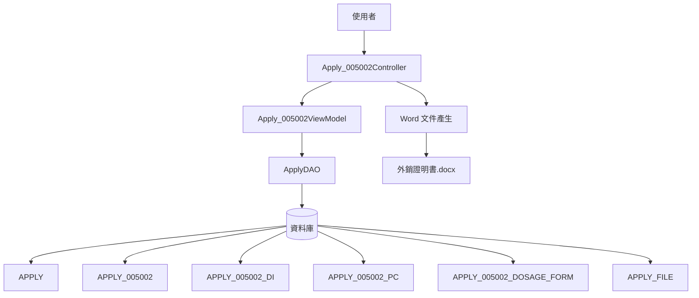
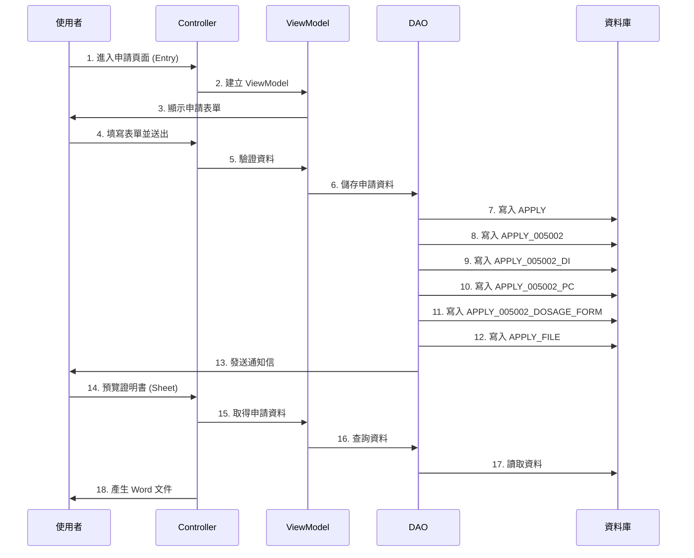
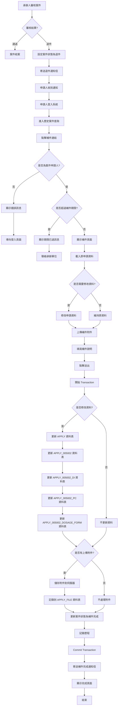
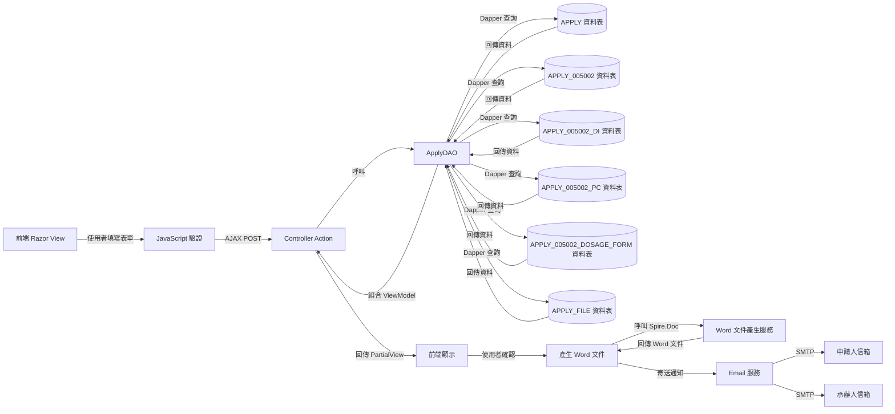
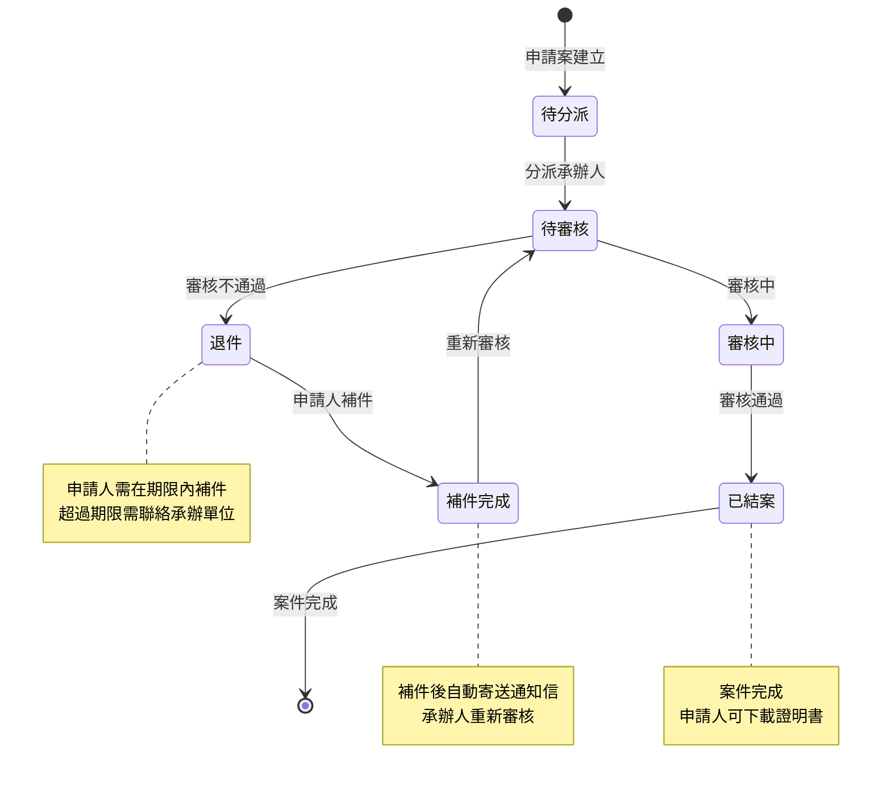

# 005002 GMP 證明書申請 - 完整技術文件

## 服務基本資訊

| 項目         | 內容                         |
| ------------ | ---------------------------- |
| **服務代碼** | 005002                       |
| **服務名稱** | GMP 證明書申請（外銷證明書） |
| **業務單位** | 中醫藥司                     |
| **服務類型** | 線上申辦服務                 |
| **複雜度**   | ⭐⭐⭐⭐⭐ 極高              |
| **文件類型** | 獨立完整技術文件             |
| **建立日期** | 2025-01-13                   |
| **最後更新** | 2025-01-13                   |

---

## 服務特色

### 與其他服務的差異

| 項目             | 005001 產銷證明書                                  | **005002 GMP 證明書申請**              |
| ---------------- | -------------------------------------------------- | -------------------------------------- |
| **服務性質**     | 產銷證明書                                         | **GMP 證明書申請（外銷證明書）**       |
| **繳費方式**     | 有（每份 1,500 元）                                | **無**                                 |
| **動態網格**     | 2 個（成分內容、賦形劑）                           | **3 個（成分內容、賦形劑、外銷品名）** |
| **固定檔案上傳** | 3 個（可選）                                       | **3 個（可選）**                       |
| **檔案合併選項** | 有                                                 | **有**                                 |
| **中英文對照**   | 有（所有重要欄位）                                 | **有（所有重要欄位）**                 |
| **勾選選項**     | 5 個（外銷品名、有效日期、濃縮製劑、適應症、效能） | **無（外銷品名改為動態網格）**         |
| **複雜度**       | ⭐⭐⭐⭐⭐ 極高                                    | **⭐⭐⭐⭐⭐ 極高**                    |

### 核心功能

1. **3 個動態網格**

   - 成分內容（DI）：可新增、刪除成分內容項目
   - 賦形劑（PC）：可新增、刪除賦形劑項目
   - 外銷品名（DOSAGE_FORM）：可新增、刪除外銷品名項目

2. **3 個固定檔案上傳欄位（可選）**

   - 檔案 1：藥品許可證影本（正面）
   - 檔案 2：藥品許可證影本（反面）
   - 檔案 3：處方之中藥材中英文對照表

3. **檔案合併選項**

   - 可選擇是否將所有檔案合併為一個 PDF（MERGE_YN）

4. **中英文對照資料**

   - 所有重要欄位都需要填寫中文和英文

5. **補件功能**
   - 支援補件流程
   - 補件有期限限制

---

## 系統架構

### 架構圖



### 資料流程圖



---

## 資料庫結構

### 1. APPLY（申請主表）

| 欄位名稱 | 資料型別     | 說明               |
| -------- | ------------ | ------------------ |
| APP_ID   | VARCHAR(50)  | 案件編號（PK）     |
| SVC_CD   | VARCHAR(10)  | 服務代碼（005002） |
| NAME     | VARCHAR(200) | 公司名稱           |
| CNT_NAME | VARCHAR(100) | 聯絡人姓名         |
| TEL      | VARCHAR(50)  | 聯絡電話           |
| FLOW_CD  | VARCHAR(10)  | 流程狀態代碼       |
| ADD_TIME | DATETIME     | 建立時間           |
| UPD_TIME | DATETIME     | 更新時間           |

### 2. APPLY_005002（服務明細表）

| 欄位名稱           | 資料型別     | 說明                      |
| ------------------ | ------------ | ------------------------- |
| APP_ID             | VARCHAR(50)  | 案件編號（PK, FK）        |
| MF_CNT_NAME        | VARCHAR(200) | 製造廠名稱（中文）        |
| MF_CNT_NAME_E      | VARCHAR(200) | 製造廠名稱（英文）        |
| MF_CNT_TEL         | VARCHAR(50)  | 製造廠連絡電話            |
| MF_ADDR            | VARCHAR(500) | 製造廠地址（中文）        |
| MF_ADDR_E          | VARCHAR(500) | 製造廠地址（英文）        |
| DRUG_NAME          | VARCHAR(200) | 藥品名稱（中文）          |
| DRUG_NAME_E        | VARCHAR(200) | 藥品名稱（英文）          |
| DRUG_ABROAD_NAME   | VARCHAR(200) | 外銷品名（中文）          |
| DRUG_ABROAD_NAME_E | VARCHAR(200) | 外銷品名（英文）          |
| DOSAGE_FORM        | VARCHAR(100) | 劑型（中文）              |
| DOSAGE_FORM_E      | VARCHAR(100) | 劑型（英文）              |
| LIC_CD             | VARCHAR(50)  | 藥品許可證名稱（中文）    |
| LIC_NUM            | VARCHAR(50)  | 藥品許可證字號（中文）    |
| LIC_CD_E           | VARCHAR(50)  | 藥品許可證名稱（英文）    |
| LIC_NUM_E          | VARCHAR(50)  | 藥品許可證字號（英文）    |
| ISSUE_DATE         | DATETIME     | 核准日期                  |
| EXPIR_DATE         | DATETIME     | 有效日期                  |
| MF_CONT            | TEXT         | 處方說明（中文）          |
| MF_CONT_E          | TEXT         | 處方說明（英文）          |
| PC_SCALE_1         | VARCHAR(50)  | 生藥與浸膏比例-1          |
| PC_SCALE_1E        | VARCHAR(50)  | 生藥與浸膏比例-2          |
| PC_SCALE_2E        | VARCHAR(50)  | 生藥與浸膏比例-3          |
| PC_SCALE_21        | VARCHAR(50)  | 生藥與浸膏比例-4          |
| PC_SCALE_22        | VARCHAR(50)  | 生藥與浸膏比例-5          |
| PC_SCALE_23        | VARCHAR(50)  | 生藥與浸膏比例-6          |
| PC_SCALE_24        | VARCHAR(50)  | 生藥與浸膏比例-7          |
| INDIOCATION        | TEXT         | 適應症（中文）            |
| INDIOCATION_E      | TEXT         | 適應症（英文）            |
| EFFICACY           | TEXT         | 效能（中文）              |
| EFFICACY_E         | TEXT         | 效能（英文）              |
| MF_REMARK          | TEXT         | 備註                      |
| MF_COPIES          | INT          | 申請份數                  |
| EMAIL              | VARCHAR(100) | 電子郵件                  |
| MERGE_YN           | VARCHAR(1)   | 佐證文件採合併檔案（Y/N） |
| ATTACH_1           | VARCHAR(500) | 附件路徑                  |
| ADD_TIME           | DATETIME     | 建立時間                  |
| UPD_TIME           | DATETIME     | 更新時間                  |

### 3. APPLY_005002_DI（成分內容表）

| 欄位名稱 | 資料型別     | 說明               |
| -------- | ------------ | ------------------ |
| APP_ID   | VARCHAR(50)  | 案件編號（PK, FK） |
| SRL_NO   | INT          | 序號（PK）         |
| DI_NAME  | VARCHAR(200) | 成分內容（中文）   |
| DI_ENAME | VARCHAR(200) | 藥材名（英文）     |
| DI_CONT  | VARCHAR(50)  | 份量               |
| DI_UNIT  | VARCHAR(50)  | 單位               |
| ADD_TIME | DATETIME     | 建立時間           |
| UPD_TIME | DATETIME     | 更新時間           |

### 4. APPLY_005002_PC（賦形劑表）

| 欄位名稱 | 資料型別     | 說明               |
| -------- | ------------ | ------------------ |
| APP_ID   | VARCHAR(50)  | 案件編號（PK, FK） |
| SRL_NO   | INT          | 序號（PK）         |
| PC_NAME  | VARCHAR(200) | 成分內容（中文）   |
| PC_ENAME | VARCHAR(200) | 藥材名（英文）     |
| PC_CONT  | VARCHAR(50)  | 份量               |
| PC_UNIT  | VARCHAR(50)  | 單位               |
| ADD_TIME | DATETIME     | 建立時間           |
| UPD_TIME | DATETIME     | 更新時間           |

### 5. APPLY_005002_DOSAGE_FORM（外銷品名表）

| 欄位名稱      | 資料型別     | 說明               |
| ------------- | ------------ | ------------------ |
| APPLY_ID      | VARCHAR(50)  | 案件編號（PK, FK） |
| DF_ID         | INT          | 外銷品名編號（PK） |
| DOSAGE_FROM   | VARCHAR(200) | 外銷品名（中文）   |
| DOSAGE_FROM_E | VARCHAR(200) | 外銷品名（英文）   |
| SORT          | INT          | 排序               |
| ADD_TIME      | DATETIME     | 建立時間           |
| UPD_TIME      | DATETIME     | 更新時間           |

### 6. APPLY_FILE（附件檔案表）

| 欄位名稱 | 資料型別     | 說明               |
| -------- | ------------ | ------------------ |
| APP_ID   | VARCHAR(50)  | 案件編號（PK, FK） |
| FILE_NO  | INT          | 檔案編號（PK）     |
| FILENAME | VARCHAR(200) | 檔案名稱           |
| FILEPATH | VARCHAR(500) | 檔案路徑           |
| ADD_TIME | DATETIME     | 建立時間           |

---

## ViewModel 結構

### Apply_005002ViewModel

主要的視圖模型，包含所有申請資料。

```csharp
public class Apply_005002ViewModel
{
    // 案件編號
    public string APP_ID { get; set; }

    // 申請主表
    public ApplyModel Apply { get; set; }

    // 服務明細表
    public Apply_005002Model Detail { get; set; }

    // 繳費資料（本服務無繳費功能，但保留欄位）
    public APPLY_PAY Pay { get; set; }

    // 補件清單
    public IList<ErrataModel> ErrataList { get; set; }

    // 其他欄位
    public Apply_005002FieldModel AnoField { get; set; }

    // 新設定的案件狀態
    public string NewFlowCd { get; set; }

    // 成分內容清單
    public IList<Apply_005002_DiModel> IngredientList { get; set; }

    // 賦形劑清單
    public IList<Apply_005002_PcModel> ExcipientList { get; set; }

    // 外銷品名清單
    public IList<Apply_005002_DOSAGE_FORM> DosageFormList { get; set; }

    // 附件檔案
    public Apply_FileModel ApplyFile_1 { get; set; }
    public Apply_FileModel ApplyFile_2 { get; set; }
    public Apply_FileModel ApplyFile_3 { get; set; }

    // 上傳檔案
    public HttpPostedFileBase UploadFile_1 { get; set; }
    public HttpPostedFileBase UploadFile_2 { get; set; }
    public HttpPostedFileBase UploadFile_3 { get; set; }

    // JSON 序列化
    public string ModelJson { get; set; }
}
```

### Apply_005002Model

服務明細表的實體模型，包含所有表單欄位。

**完整屬性列表：**

```csharp
public class Apply_005002Model
{
    // 案件編號
    [Display(Name = "案件編號")]
    public string APP_ID { get; set; }

    // 製造廠資訊
    [Display(Name = "製造廠名稱")]
    public string MF_CNT_NAME { get; set; }

    [Display(Name = "製造廠名稱(英文)")]
    public string MF_CNT_NAME_E { get; set; }

    [Display(Name = "製造廠連絡電話")]
    public string MF_CNT_TEL { get; set; }

    [Display(Name = "製造廠地址")]
    public string MF_ADDR { get; set; }

    [Display(Name = "製造廠英文地址")]
    public string MF_ADDR_E { get; set; }

    // 藥品資訊
    [Display(Name = "藥品名稱")]
    public string DRUG_NAME { get; set; }

    [Display(Name = "藥品英文名稱")]
    public string DRUG_NAME_E { get; set; }

    [Display(Name = "外銷品名")]
    public string DRUG_ABROAD_NAME { get; set; }

    [Display(Name = "外銷品名(英文)")]
    public string DRUG_ABROAD_NAME_E { get; set; }

    [Display(Name = "劑型")]
    public string DOSAGE_FORM { get; set; }

    [Display(Name = "劑型(英文)")]
    public string DOSAGE_FORM_E { get; set; }

    // 藥品許可證資訊
    [Display(Name = "藥品許可證名稱")]
    public string LIC_CD { get; set; }

    [Display(Name = "藥品許可證字號")]
    public string LIC_NUM { get; set; }

    [Display(Name = "藥品許可證英文名稱")]
    public string LIC_CD_E { get; set; }

    [Display(Name = "藥品許可證英文字號")]
    public string LIC_NUM_E { get; set; }

    // 日期資訊
    [Display(Name = "核准日期")]
    public DateTime? ISSUE_DATE { get; set; }

    [Display(Name = "有效日期")]
    public DateTime? EXPIR_DATE { get; set; }

    // 處方說明
    [Display(Name = "處方說明")]
    public string MF_CONT { get; set; }

    [Display(Name = "處方說明(英文)")]
    public string MF_CONT_E { get; set; }

    // 生藥與浸膏比例
    [Display(Name = "生藥與浸膏比例-1")]
    public string PC_SCALE_1 { get; set; }

    [Display(Name = "生藥與浸膏比例-2")]
    public string PC_SCALE_1E { get; set; }

    [Display(Name = "生藥與浸膏比例-3")]
    public string PC_SCALE_2E { get; set; }

    [Display(Name = "生藥與浸膏比例-4")]
    public string PC_SCALE_21 { get; set; }

    [Display(Name = "生藥與浸膏比例-5")]
    public string PC_SCALE_22 { get; set; }

    [Display(Name = "生藥與浸膏比例-6")]
    public string PC_SCALE_23 { get; set; }

    [Display(Name = "生藥與浸膏比例-7")]
    public string PC_SCALE_24 { get; set; }

    // 適應症/效能
    [Display(Name = "適應症中文")]
    public string INDIOCATION { get; set; }

    [Display(Name = "適應症英文")]
    public string INDIOCATION_E { get; set; }

    [Display(Name = "效能中文")]
    public string EFFICACY { get; set; }

    [Display(Name = "效能英文")]
    public string EFFICACY_E { get; set; }

    // 其他資訊
    [Display(Name = "備註")]
    public string MF_REMARK { get; set; }

    [Display(Name = "申請份數")]
    public int? MF_COPIES { get; set; }

    [Display(Name = "電子郵件")]
    public string EMAIL { get; set; }

    // 佐證文件採合併檔案
    public string MERGE_YN { get; set; }

    // 附件路徑
    public string ATTACH_1 { get; set; }

    // 標準審計欄位
    public string DEL_MK { get; set; }
    public DateTime? DEL_TIME { get; set; }
    public string DEL_FUN_CD { get; set; }
    public string DEL_ACC { get; set; }
    public DateTime? UPD_TIME { get; set; }
    public string UPD_FUN_CD { get; set; }
    public string UPD_ACC { get; set; }
    public DateTime? ADD_TIME { get; set; }
    public string ADD_FUN_CD { get; set; }
    public string ADD_ACC { get; set; }
}
```

### Apply_005002_DiModel

成分內容動態網格的實體模型。

```csharp
public class Apply_005002_DiModel
{
    // 案件編號
    public string APP_ID { get; set; }

    // 序號
    public int? SRL_NO { get; set; }

    // 成分內容（中文）
    public string DI_NAME { get; set; }

    // 藥材名（英文）
    public string DI_ENAME { get; set; }

    // 份量
    public string DI_CONT { get; set; }

    // 單位
    public string DI_UNIT { get; set; }

    // 標準審計欄位
    public string DEL_MK { get; set; }
    public DateTime? DEL_TIME { get; set; }
    public string DEL_FUN_CD { get; set; }
    public string DEL_ACC { get; set; }
    public DateTime? UPD_TIME { get; set; }
    public string UPD_FUN_CD { get; set; }
    public string UPD_ACC { get; set; }
    public DateTime? ADD_TIME { get; set; }
    public string ADD_FUN_CD { get; set; }
    public string ADD_ACC { get; set; }
}
```

### Apply_005002_PcModel

賦形劑動態網格的實體模型。

```csharp
public class Apply_005002_PcModel
{
    // 案件編號
    public string APP_ID { get; set; }

    // 序號
    public int? SRL_NO { get; set; }

    // 成分內容（中文）
    public string PC_NAME { get; set; }

    // 藥材名（英文）
    public string PC_ENAME { get; set; }

    // 份量
    public string PC_CONT { get; set; }

    // 單位
    public string PC_UNIT { get; set; }

    // 標準審計欄位
    public string DEL_MK { get; set; }
    public DateTime? DEL_TIME { get; set; }
    public string DEL_FUN_CD { get; set; }
    public string DEL_ACC { get; set; }
    public DateTime? UPD_TIME { get; set; }
    public string UPD_FUN_CD { get; set; }
    public string UPD_ACC { get; set; }
    public DateTime? ADD_TIME { get; set; }
    public string ADD_FUN_CD { get; set; }
    public string ADD_ACC { get; set; }
}
```

### Apply_005002_DOSAGE_FORM

外銷品名動態網格的實體模型。

```csharp
public class Apply_005002_DOSAGE_FORM
{
    // 案件編號
    public string APPLY_ID { get; set; }

    // 外銷品名編號
    public int DF_ID { get; set; }

    // 外銷品名（中文）
    public string DOSAGE_FROM { get; set; }

    // 外銷品名（英文）
    public string DOSAGE_FROM_E { get; set; }

    // 排序
    public int SORT { get; set; }

    // 標準審計欄位
    public string DEL_MK { get; set; }
    public DateTime? DEL_TIME { get; set; }
    public string DEL_FUNC_CD { get; set; }
    public DateTime? UPD_TIME { get; set; }
    public string UPD_FUN_CD { get; set; }
    public string UPD_ACC { get; set; }
    public DateTime? ADD_TIME { get; set; }
    public string ADD_FUN_CD { get; set; }
    public string ADD_ACC { get; set; }
}
```

---

## 完整流程圖

### 申請流程圖

```mermaid
graph TD
    A[使用者登入] --> B{是否已登入?}
    B -->|否| C[導向登入頁面]
    C --> D[選擇登入方式]
    D --> E[帳號密碼登入]
    D --> F[自然人憑證登入]
    D --> G[工商憑證登入]
    E --> H[驗證成功]
    F --> H
    G --> H
    B -->|是| I[顯示進入頁面]
    H --> I
    I --> J[點擊進入申請]
    J --> K[進入申辦表單]
    K --> L[自動帶入會員資料]
    L --> M[填寫申辦資料]
    M --> N[填寫公司基本資料]
    N --> O[填寫藥品許可證字號]
    O --> P[填寫製造廠資訊]
    P --> Q[填寫藥品資訊]
    Q --> R[填寫處方說明]
    R --> S[新增成分內容項目]
    S --> T{是否新增賦形劑?}
    T -->|是| U[新增賦形劑項目]
    T -->|否| V[繼續填寫]
    U --> V
    V --> W{是否新增外銷品名?}
    W -->|是| X[新增外銷品名項目]
    W -->|否| Y[繼續填寫]
    X --> Y
    Y --> Z[填寫申請份數]
    Z --> AA{是否上傳檔案?}
    AA -->|是| AB[上傳檔案]
    AB --> AC{是否合併檔案?}
    AC -->|是| AD[選擇合併檔案]
    AC -->|否| AE[繼續填寫]
    AA -->|否| AE
    AD --> AE
    AE --> AF[點擊送出]
    AF --> AG[開始 Transaction]
    AG --> AH[驗證資料]
    AH --> AI{驗證是否通過?}
    AI -->|否| AJ[顯示錯誤訊息]
    AJ --> M
    AI -->|是| AK[儲存 APPLY 資料表]
    AK --> AL[儲存 APPLY_005002 資料表]
    AL --> AM[儲存 APPLY_005002_DI 資料表]
    AM --> AN[儲存 APPLY_005002_PC 資料表]
    AN --> AO[儲存 APPLY_005002_DOSAGE_FORM 資料表]
    AO --> AP{是否有上傳檔案?}
    AP -->|是| AQ[儲存附件到伺服器]
    AQ --> AR[記錄到 APPLY_FILE 資料表]
    AP -->|否| AS[不處理附件]
    AR --> AT[Commit Transaction]
    AS --> AT
    AT --> AU[產生申請案號]
    AU --> AV[寄送通知信]
    AV --> AW[顯示完成頁面]
    AW --> AX{是否預覽證明書?}
    AX -->|是| AY[產生 Word 文件]
    AY --> AZ[下載外銷證明書.docx]
    AZ --> BA[結束]
    AX -->|否| BA
```



### 補件流程圖



### 資料流程圖



### 案件狀態轉換圖



**流程圖說明：**

1. **申請流程圖**：完整呈現從登入、填寫表單、送出、產生 Word 文件到完成的整個申請流程
2. **補件流程圖**：說明退件後的補件流程，包含權限檢查、期限檢查、資料更新等步驟
3. **資料流程圖**：展示資料在前端、Controller、DAO、資料庫之間的流動
4. **案件狀態轉換圖**：說明案件在不同狀態之間的轉換關係

---

## 技術重點

### 1. 3 個動態網格（成分內容 DI、賦形劑 PC、外銷品名 DOSAGE_FORM）

**特點：**

- 使用動態網格元件
- 可新增、刪除項目
- 每個項目包含：成分內容（中文）、藥材名（英文）、份量、單位

**成分內容（DI）實作方式：**

```csharp
// 初始化成分內容動態網格
IngredientList = new List<Apply_005002_DiModel>();

// 新增成分內容項目
var newIngredient = new Apply_005002_DiModel
{
    APP_ID = this.APP_ID,
    SRL_NO = GetNextSrlNo(),
    DI_NAME = "成分內容（中文）",
    DI_ENAME = "Ingredient Name (English)",
    DI_CONT = "100",
    DI_UNIT = "mg"
};
IngredientList.Add(newIngredient);
```

**賦形劑（PC）實作方式：**

```csharp
// 初始化賦形劑動態網格
ExcipientList = new List<Apply_005002_PcModel>();

// 新增賦形劑項目
var newExcipient = new Apply_005002_PcModel
{
    APP_ID = this.APP_ID,
    SRL_NO = GetNextSrlNo(),
    PC_NAME = "賦形劑（中文）",
    PC_ENAME = "Excipient Name (English)",
    PC_CONT = "50",
    PC_UNIT = "mg"
};
ExcipientList.Add(newExcipient);
```

**外銷品名（DOSAGE_FORM）實作方式：**

```csharp
// 初始化外銷品名動態網格
DosageFormList = new List<Apply_005002_DOSAGE_FORM>();

// 新增外銷品名項目
var newDosageForm = new Apply_005002_DOSAGE_FORM
{
    APPLY_ID = this.APP_ID,
    DF_ID = GetNextDfId(),
    DOSAGE_FROM = "外銷品名（中文）",
    DOSAGE_FROM_E = "Export Product Name (English)",
    SORT = 1
};
DosageFormList.Add(newDosageForm);
```

**JavaScript 控制：**

```javascript
// 新增成分內容項目
function addDIItem() {
  var grid = $("#DI_Grid");
  var newRow = grid.find("tr.template").clone();
  newRow.removeClass("template");
  newRow.find("input").val("");
  grid.find("tbody").append(newRow);
}

// 刪除成分內容項目
function deleteDIItem(btn) {
  $(btn).closest("tr").remove();
}

// 新增賦形劑項目
function addPCItem() {
  var grid = $("#PC_Grid");
  var newRow = grid.find("tr.template").clone();
  newRow.removeClass("template");
  newRow.find("input").val("");
  grid.find("tbody").append(newRow);
}

// 刪除賦形劑項目
function deletePCItem(btn) {
  $(btn).closest("tr").remove();
}

// 新增外銷品名項目
function addDosageFormItem() {
  var grid = $("#DosageForm_Grid");
  var newRow = grid.find("tr.template").clone();
  newRow.removeClass("template");
  newRow.find("input").val("");
  grid.find("tbody").append(newRow);
}

// 刪除外銷品名項目
function deleteDosageFormItem(btn) {
  $(btn).closest("tr").remove();
}
```

### 2. 中英文對照資料

**特點：**

- 所有重要欄位都需要填寫中文和英文
- 中文和英文欄位分開儲存
- GMP 證明書會同時顯示中文和英文

**實作方式：**

- 製造廠名稱：MF_CNT_NAME（中文）、MF_CNT_NAME_E（英文）
- 製造廠地址：MF_ADDR（中文）、MF_ADDR_E（英文）
- 藥品名稱：DRUG_NAME（中文）、DRUG_NAME_E（英文）
- 外銷品名：DRUG_ABROAD_NAME（中文）、DRUG_ABROAD_NAME_E（英文）
- 劑型：DOSAGE_FORM（中文）、DOSAGE_FORM_E（英文）
- 處方說明：MF_CONT（中文）、MF_CONT_E（英文）
- 適應症：INDIOCATION（中文）、INDIOCATION_E（英文）
- 效能：EFFICACY（中文）、EFFICACY_E（英文）
- 藥品許可證字號：LIC_CD（中文）、LIC_CD_E（英文）

### 3. 檔案合併選項

**特點：**

- 可選擇是否將所有檔案合併為一個 PDF（MERGE_YN）
- 合併後的檔案會儲存在伺服器
- 合併功能使用 PDF 合併工具

**實作方式：**

```csharp
// Controller 端處理
if (model.Detail.MERGE_YN == "Y")
{
    // 合併所有上傳的檔案
    List<string> filePaths = new List<string>();
    if (model.UploadFile_1 != null) filePaths.Add(SaveFile(model.UploadFile_1));
    if (model.UploadFile_2 != null) filePaths.Add(SaveFile(model.UploadFile_2));
    if (model.UploadFile_3 != null) filePaths.Add(SaveFile(model.UploadFile_3));

    // 使用 PDF 合併工具合併檔案
    string mergedFilePath = MergePDFFiles(filePaths);

    // 儲存合併後的檔案路徑
    model.Detail.ATTACH_1 = mergedFilePath;
}
```

### 4. Word 文件產生（外銷證明書.docx）

**特點：**

- 使用 Spire.Doc 產生 Word 文件
- 支援中英文對照
- 支援動態網格資料（成分內容、賦形劑、外銷品名）

**實作方式：**

```csharp
// Controller 端處理
public byte[] PreviewApplyForm(Apply_005002ViewModel model)
{
    // 載入 Word 範本
    Document doc = new Document();
    doc.LoadFromFile(Server.MapPath("~/Templates/005002_Template.docx"));

    // 替換文字標記
    doc.Replace("{公司名稱}", model.Apply.NAME, false, true);
    doc.Replace("{製造廠名稱}", model.Detail.MF_CNT_NAME, false, true);
    doc.Replace("{製造廠名稱_英文}", model.Detail.MF_CNT_NAME_E, false, true);
    doc.Replace("{製造廠地址}", model.Detail.MF_ADDR, false, true);
    doc.Replace("{製造廠地址_英文}", model.Detail.MF_ADDR_E, false, true);
    doc.Replace("{藥品名稱}", model.Detail.DRUG_NAME, false, true);
    doc.Replace("{藥品名稱_英文}", model.Detail.DRUG_NAME_E, false, true);
    doc.Replace("{劑型}", model.Detail.DOSAGE_FORM, false, true);
    doc.Replace("{劑型_英文}", model.Detail.DOSAGE_FORM_E, false, true);
    doc.Replace("{藥品許可證字號}", model.Detail.LIC_CD + model.Detail.LIC_NUM, false, true);
    doc.Replace("{藥品許可證字號_英文}", model.Detail.LIC_CD_E + model.Detail.LIC_NUM_E, false, true);
    doc.Replace("{核准日期}", model.Detail.ISSUE_DATE.HasValue ? model.Detail.ISSUE_DATE.Value.ToString("yyyy/MM/dd") : "", false, true);
    doc.Replace("{處方說明}", model.Detail.MF_CONT, false, true);
    doc.Replace("{處方說明_英文}", model.Detail.MF_CONT_E, false, true);

    // 插入成分內容表格
    Table ingredientTable = CreateIngredientTable(model.IngredientList);
    doc.Sections[0].Tables.Add(ingredientTable);

    // 插入賦形劑表格
    Table excipientTable = CreateExcipientTable(model.ExcipientList);
    doc.Sections[0].Tables.Add(excipientTable);

    // 插入外銷品名表格
    Table dosageFormTable = CreateDosageFormTable(model.DosageFormList);
    doc.Sections[0].Tables.Add(dosageFormTable);

    // 儲存為 byte array
    using (MemoryStream ms = new MemoryStream())
    {
        doc.SaveToStream(ms, FileFormat.Docx);
        return ms.ToArray();
    }
}
```

### 5. 補件功能

**特點：**

- 支援補件流程
- 補件有期限限制
- 補件完成後流程狀態會更新為「補件完成」

**實作方式：**

```csharp
// ViewModel 端處理
public bool IsReadonly()
{
    bool res = false;
    ShareDAO dao = new ShareDAO();
    if (this.Apply != null && (this.Apply.FLOW_CD == "2" || this.Apply.FLOW_CD == "4"))
    {
        if (dao.CalculationDocDate("005002", APP_ID))
        {
            res = true;  // 已過補件期限
        }
        else
        {
            res = false;
        }
    }
    return res;
}

// 補件重新送件
public void SaveResend(ModelStateDictionary state)
{
    this.Validate(state);
    ApplyDAO dao = new ApplyDAO();
    dao.UpdateApply005002(this);
    dao.SendMail_005002Resend(this);
}
```

---

## 相關檔案清單

### 前端檔案

- `ES/Controllers/Apply_005002Controller.cs` (1,309 行) - 控制器
- `ES/Models/ViewModels/Apply_005002ViewModel.cs` (334 行) - 視圖模型
- `ES/Models/Entities/Apply_005002Model.cs` (278 行) - 實體模型
- `ES/Models/Entities/Apply_005002_DiModel.cs` (81 行) - 成分內容實體模型
- `ES/Models/Entities/Apply_005002_PcModel.cs` (81 行) - 賦形劑實體模型
- `ES/Models/Entities/Apply_005002_DOSAGE_FORM.cs` (45 行) - 外銷品名實體模型
- `ES/Views/Apply_005002/Entry.cshtml` - 進入頁面
- `ES/Views/Apply_005002/Index.cshtml` - 申請表單
- `ES/Views/Apply_005002/Sheet.cshtml` - 預覽頁面

### 後端檔案

- `ES/DataLayers/ApplyDAO.cs` - 資料存取層（包含 AppendApply005002, UpdateApply005002, SendMail_005002Notice, SendMail_005002Resend 方法）
- `ES/DataLayers/ShareDAO.cs` - 共用資料存取層

### 資料庫資料表

- `SERVICE` - 服務定義表
- `APPLY` - 申請主表
- `APPLY_005002` - 服務明細表
- `APPLY_005002_DI` - 成分內容表
- `APPLY_005002_PC` - 賦形劑表
- `APPLY_005002_DOSAGE_FORM` - 外銷品名表
- `APPLY_FILE` - 附件檔案表
- `CODE_CD` - 代碼表

### Word 範本

- `Templates/005002_Template.docx` - 外銷證明書範本

---

## 注意事項

### 1. 申請人基本資料

- 公司名稱為必填
- 聯絡人姓名為必填
- 聯絡電話為必填
- EMAIL 為必填

### 2. 藥品許可證字號

- 中文和英文都為必填
- 中文：LIC_CD（名稱）+ LIC_NUM（字號）
- 英文：LIC_CD_E（名稱）+ LIC_NUM_E（字號）

### 3. 製造廠資訊

- 製造廠名稱（中文、英文）為必填
- 製造廠地址（中文、英文）為必填

### 4. 藥品資訊

- 藥品名稱（中文、英文）為必填
- 劑型（中文、英文）為必填
- 核准日期為必填

### 5. 處方說明

- 處方說明（中文、英文）為必填

### 6. 成分內容和賦形劑

- 成分內容（DI）至少需要 1 個項目
- 賦形劑（PC）為可選
- 每個項目需填寫：成分內容（中文）、藥材名（英文）、份量、單位

### 7. 外銷品名

- 外銷品名（DOSAGE_FORM）為可選
- 可新增多個外銷品名項目
- 每個項目需填寫：外銷品名（中文）、外銷品名（英文）

### 8. 檢附文件

- 所有檔案都是可選的（非必填）
- 只接受 PDF 格式
- 每個檔案大小不超過 5MB
- 可選擇是否將所有檔案合併為一個 PDF

### 9. 申請份數

- 申請份數為必填
- 預設為 1 份

### 10. 補件功能

- 只有流程狀態為「補件中」的案件才能補件
- 補件有期限限制
- 補件完成後流程狀態會更新為「補件完成」

---

**版本：** 1.0
**日期：** 2025-10-20
**作者：** 柏通股份有限公司
