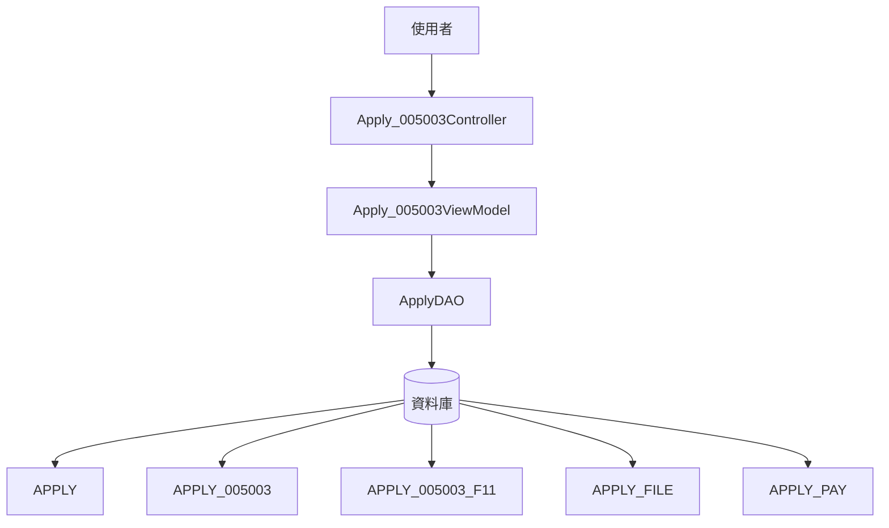
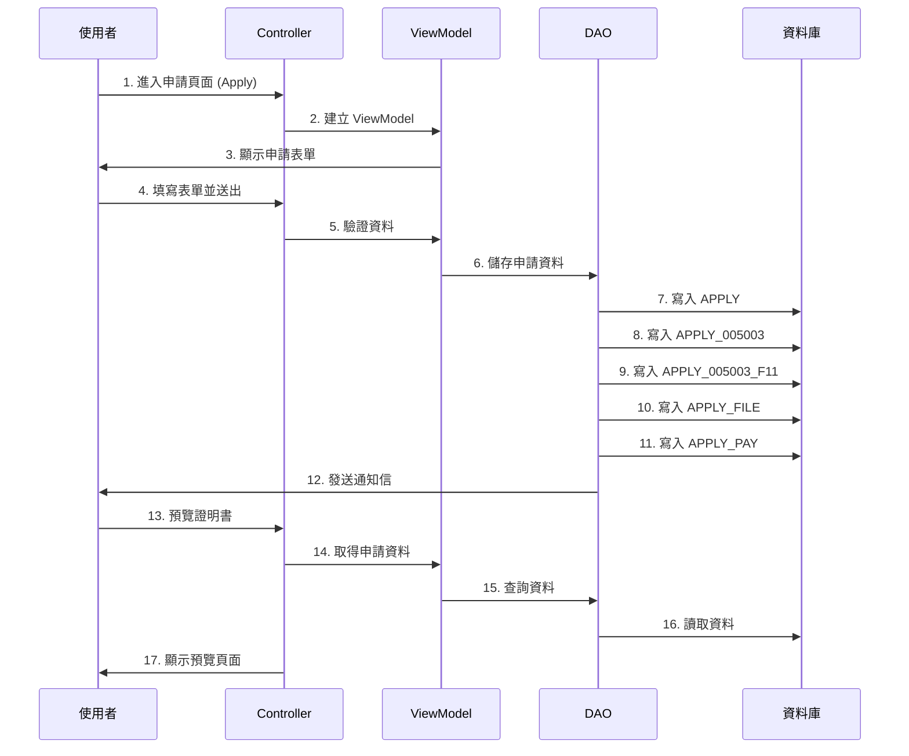
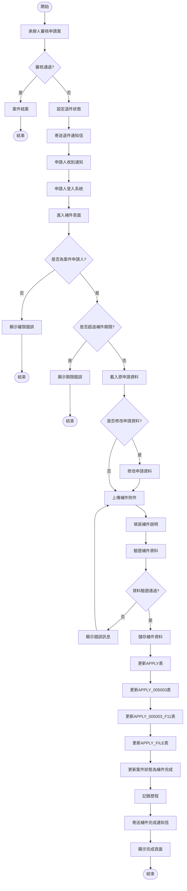
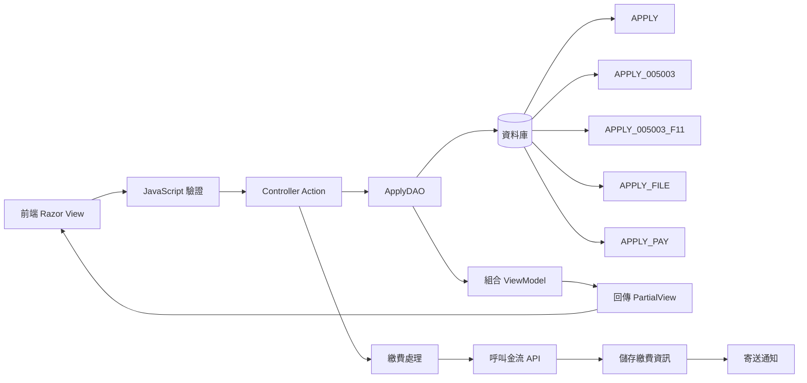
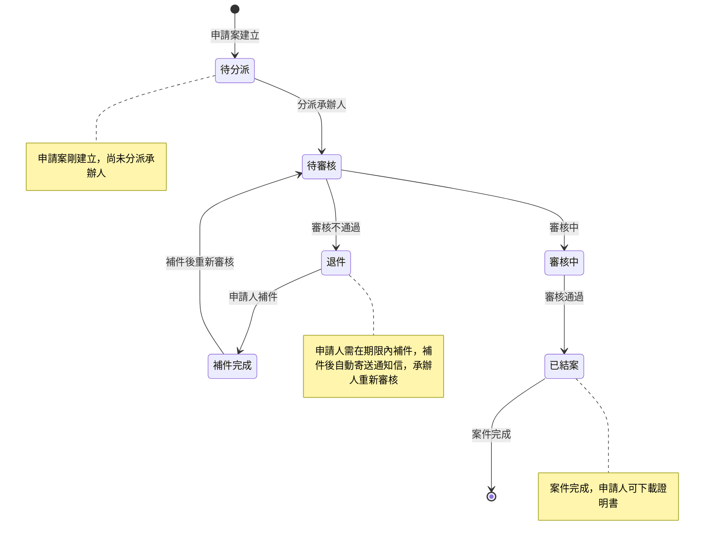

# 005003 WHO 格式之產銷證明書(英文) - 完整技術文件

## 服務基本資訊

| 項目         | 內容                       |
| ------------ | -------------------------- |
| **服務代碼** | 005003                     |
| **服務名稱** | WHO 格式之產銷證明書(英文) |
| **業務單位** | 中醫藥司                   |
| **服務類型** | 線上申辦服務               |
| **複雜度**   | ⭐⭐⭐⭐⭐ 極高            |
| **文件類型** | 獨立完整技術文件           |
| **建立日期** | 2025-01-13                 |
| **最後更新** | 2025-01-13                 |

---

## 服務特色

### 與其他服務的差異

| 項目             | 005001 產銷證明書        | 005002 GMP 證明書申請              | **005003 WHO 格式之產銷證明書(英文)**                                                                                    |
| ---------------- | ------------------------ | ---------------------------------- | ------------------------------------------------------------------------------------------------------------------------ |
| **服務性質**     | 產銷證明書               | GMP 證明書申請（外銷證明書）       | **WHO 格式之產銷證明書(英文)**                                                                                           |
| **繳費方式**     | 有（每份 1,500 元）      | 無                                 | **有（每份 1,500 元）**                                                                                                  |
| **動態網格**     | 2 個（成分內容、賦形劑） | 3 個（成分內容、賦形劑、外銷品名） | **1 個（成分內容 F11）**                                                                                                 |
| **固定檔案上傳** | 3 個（可選）             | 3 個（可選）                       | **3 個（可選）**                                                                                                         |
| **檔案合併選項** | 有                       | 有                                 | **有**                                                                                                                   |
| **語言**         | 中英文對照               | 中英文對照                         | **純英文**                                                                                                               |
| **表單欄位**     | 一般欄位                 | 一般欄位                           | **WHO 格式欄位（F_1, F_2A_1, F_2A_2, F_2A_3, F_2A_4, F_2A_5, F_2A_6, F_2B_2, F_2B_3, F_3_0, F_3_1, F_3_2, F_3_3, F_4）** |
| **複雜度**       | ⭐⭐⭐⭐⭐ 極高          | ⭐⭐⭐⭐⭐ 極高                    | **⭐⭐⭐⭐⭐ 極高**                                                                                                      |

### 核心功能

1. **1 個動態網格**

   - 成分內容（F11）：可新增、刪除成分內容項目

2. **3 個固定檔案上傳欄位（可選）**

   - 檔案 1：藥品許可證影本（正面）
   - 檔案 2：藥品許可證影本（反面）
   - 檔案 3：處方之中藥材中英文對照表

3. **檔案合併選項**

   - 可選擇是否將所有檔案合併為一個 PDF（MERGEYN）

4. **WHO 格式欄位**

   - 所有欄位都使用 WHO 格式命名（F_1, F_2A_1, F_2A_2, F_2A_3, F_2A_4, F_2A_5, F_2A_6, F_2B_2, F_2B_3, F_3_0, F_3_1, F_3_2, F_3_3, F_4）
   - 所有欄位都使用英文填寫

5. **繳費功能**

   - 每份 1,500 元
   - 申請份數可選擇（預設 1 份）
   - 5 種繳費方式

6. **補件功能**
   - 支援補件流程
   - 補件有期限限制

---

## 系統架構

### 架構圖



### 資料流程圖



---

## Controller Actions

### Apply_005003Controller

主要的控制器，處理所有與 005003 服務相關的請求。

#### 核心 Actions

| Action 名稱          | HTTP 方法 | 說明                             | 回傳類型                  |
| -------------------- | --------- | -------------------------------- | ------------------------- |
| **Apply**            | GET       | 進入申請頁面，初始化表單         | View("Index", Form)       |
| **Apply**            | POST      | 驗證申請資料                     | JSON (AjaxResultStruct)   |
| **PreView**          | POST      | 預覽申請資料                     | View("PreView1", Form)    |
| **Save**             | POST      | 儲存申請資料並發送通知信         | View("Save", Form)        |
| **PreviewApplyForm** | POST      | 產生 Word 文件（WHO 格式證明書） | Word 文件下載             |
| **AppDoc**           | GET       | 進入補件頁面                     | View("AppDoc", ViewModel) |
| **AppDocSave**       | POST      | 儲存補件資料                     | View("AppDocSave", Form)  |

---

### 1. Apply (GET) - 進入申請頁面

**功能說明：**

- 初始化申請表單
- 自動帶入會員資料（公司名稱、聯絡人、電話、傳真、EMAIL）
- 設定預設值（申請日期、繳費金額、申請份數）

**預設值：**

- APP_TIME_TW：當前日期（民國年）
- PAYAMOUNT：1500（每份 1,500 元）
- PAYCOUNT：1（預設 1 份）
- COPIES：1（預設 1 份）
- IS_PREVIEW：false

---

### 2. Apply (POST) - 驗證申請資料

**功能說明：**

- 驗證所有必填欄位
- 驗證英文欄位格式（使用正則表達式 `^[A-Za-z0-9\.\-\,\s\(\)\'\:]+$`）
- 驗證數字欄位格式（使用正則表達式 `^[0-9\.]+$` 或 `^[0-9]+$`）
- 驗證條件式欄位（根據 F_1_2 的值決定是否驗證 2A 或 2B 欄位）
- 驗證成分內容動態網格（至少 1 個）
- 驗證檔案上傳（如果選擇合併檔案，至少上傳 1 個）

**核心驗證規則：**

| 欄位名稱      | 驗證規則                 | 錯誤訊息                                                                          |
| ------------- | ------------------------ | --------------------------------------------------------------------------------- |
| COPIES        | 必填                     | "申辦份數 為必選欄位"                                                             |
| NAME          | 必填                     | "公司名稱 為必填欄位"                                                             |
| TEL_1         | 必填                     | "電話 為必填欄位"                                                                 |
| EMAIL         | 必填                     | "E-MAIL 為必填欄位"                                                               |
| MF_ADDR       | 必填且以「.」結尾        | "外銷國家 為必填欄位" / "外銷國家 最後請以「.」結尾。"                            |
| F_2A_1_WORD   | 必填                     | "2A.1 藥品許可證字號-字 為必選欄位"                                               |
| F_2A_1_NUM    | 必填                     | "2A.1 藥品許可證字號-號 為必填欄位"                                               |
| F_1_DF        | 必填                     | "劑型 為必填欄位"                                                                 |
| F_1_1         | 必填且以「:」結尾        | "1.1 處方說明 為必填欄位" / "1.1 處方說明最後請以「:」結尾。"                     |
| F_1_3         | 必填                     | "1.3 本產品是否有在國內販售？ 為必選欄位"                                         |
| F_2A_1_DATE   | 必填                     | "2A.1 核准日期 為必填欄位"                                                        |
| F_2A_3_1_NAME | 必填                     | "2A.2/2A.3.1/2B.2.1 製造廠名稱 為必填欄位"                                        |
| F_2A_3_2_ADDR | 必填                     | "2A.2/2A.3.1/2B.2.1 製造廠地址 為必填欄位"                                        |
| F_3_0         | 必填                     | "3.製造廠是否定期接受本部之 GMP 查核？ 為必選欄位"                                |
| F_3_1         | 必填                     | "3.1 接受定期查核之週期為何？ 為必選欄位"                                         |
| F_3_2         | 必填                     | "3.2 申請案藥品許可證之劑型，是否經過本部查核？ 為必選欄位"                       |
| F_3_3         | 必填                     | "3.3 申請案藥品許可證之製造設備及製程，是否符合 WHO 建議之 GMP 規範？ 為必選欄位" |
| F_4           | 必填                     | "4.申請者所提供之資訊，是否符合外銷對象對產品製造所有方面的標準？ 為必選欄位"     |
| F11_SCI_NM    | 必填（每個成分內容項目） | "成分內容\_生藥名(N)為必選欄位"                                                   |

**條件式驗證邏輯：**

```
如果 F_1_2 == "Y"（本產品獲准在國內販售）：
  - 驗證 2A 欄位（F_2A_2_COMM, F_2A_2, F_2A_2_ADDR, F_2A_3）
  - 清空 2B 欄位（F_2B_2, F_2B_3, F_2B_3_REMARKS）

如果 F_1_2 == "N"（本產品未獲准在國內販售）：
  - 驗證 2B 欄位（F_2B_2, F_2B_3）
  - 清空 2A 欄位（F_2A_2_COMM, F_2A_2, F_2A_2_ADDR, F_2A_3, F_2A_4, F_2A_5, F_2A_6）
```

---

### 3. PreView (POST) - 預覽申請資料

**功能說明：**

- 設定動態網格為唯讀模式
- 設定 IS_PREVIEW = true
- 顯示預覽頁面

---

### 4. Save (POST) - 儲存申請資料

**功能說明：**

- 呼叫 `dao.AppendApply005003(Form)` 儲存申請資料
- 產生申請案號（APP_ID）
- 發送通知信給申請人
- 顯示完成頁面

**通知信內容：**

```
貴公司申請WHO格式之產銷證明書(英文)(案號：{APP_ID})一案，「人民申請案線上申辦服務系統」已收件，
尚待貴公司繳納規費，請提供申請者聯絡資訊、申請案類別、案件編號及規費金額等資料，
連同欲繳納之匯票或現金，寄到「115204台北市南港區忠孝東路六段488號衛生福利部中醫藥司收」，敬請配合。

衛生福利部 中醫藥司
```

---

### 5. PreviewApplyForm (POST) - 產生 Word 文件

**功能說明：**

- 使用 Xceed.Words.NET 產生 WHO 格式證明書（Word 文件）
- 從範本檔案 `~/Sample/apply005003.docx` 載入
- 替換範本中的佔位符
- 下載 Word 文件

**成分內容處理：**

```csharp
var str = "";
foreach (var item in fm.F11.GoodsList)
{
    if(item.F11_QUANTITY.TONotNullString() == "")
    {
        item.F11_QUANTITY = "0";
    }
    str += item.F11_SCI_NM.TONotNullString() + " " +
           item.F11_QUANTITY.TONotNullString() + " " +
           item.F11_UNIT.TONotNullString() + ", ";
}
if (str.Length > 0)
{
    str = str.Remove(str.LastIndexOf(","), 2); // 去除最後一個,
    str += "."; // 英文句點
}
doc.ReplaceText("[$F11$]", str, false, System.Text.RegularExpressions.RegexOptions.None);
```

**2B.3 僅供外銷專用之原因對照表：**

| 代碼 | 英文說明             |
| ---- | -------------------- |
| 1    | Not required.        |
| 2    | Not requested.       |
| 3    | Under consideration. |
| 4    | Refused.             |

---

## 完整流程圖

### 5.1 申請流程圖

完整呈現從登入、填寫表單、預覽、繳費到完成的整個申請流程。

```mermaid
graph TD
    Start([開始]) --> Login{使用者登入}
    Login -->|帳號密碼| CheckAuth1[驗證帳號密碼]
    Login -->|自然人憑證| CheckAuth2[驗證自然人憑證]
    Login -->|工商憑證| CheckAuth3[驗證工商憑證]

    CheckAuth1 --> AuthSuccess{驗證成功?}
    CheckAuth2 --> AuthSuccess
    CheckAuth3 --> AuthSuccess

    AuthSuccess -->|是| EnterPage[進入申請頁面]
    AuthSuccess -->|否| Login

    EnterPage --> LoadMemberData[載入會員資料]
    LoadMemberData --> FillForm[填寫申請表單]

    FillForm --> FillBasicInfo[填寫基本資料]
    FillBasicInfo --> FillCompanyInfo[填寫公司名稱]
    FillCompanyInfo --> FillContactInfo[填寫聯絡人資訊]
    FillContactInfo --> FillExportCountry[填寫外銷國家]

    FillExportCountry --> FillDrugInfo[填寫藥品資訊]
    FillDrugInfo --> FillDrugName[填寫藥品名稱]
    FillDrugName --> FillDosageForm[填寫劑型]
    FillDosageForm --> FillPrescription[填寫處方說明]
    FillPrescription --> FillLicenseNo[填寫藥品許可證字號]
    FillLicenseNo --> FillLicenseDate[填寫核准日期]

    FillLicenseDate --> CheckF12{1.2本產品是否獲准在國內販售?}
    CheckF12 -->|是| Fill2AFields[填寫2A欄位]
    CheckF12 -->|否| Fill2BFields[填寫2B欄位]

    Fill2AFields --> FillManufacturer2A[填寫製造廠資訊]
    FillManufacturer2A --> CheckCommission{是否為委託製造?}
    CheckCommission -->|是| FillPharmacyInfo[填寫藥商名稱和地址]
    CheckCommission -->|否| FillLicenseHolderType[填寫藥品許可證持有者之類別]
    FillPharmacyInfo --> FillLicenseHolderType
    FillLicenseHolderType --> FillGMPInfo

    Fill2BFields --> FillManufacturer2B[填寫製造廠資訊]
    FillManufacturer2B --> FillApplicantType[填寫申請者之類別]
    FillApplicantType --> FillExportOnlyReason[填寫僅供外銷專用之原因]
    FillExportOnlyReason --> FillGMPInfo

    FillGMPInfo[填寫GMP查核資訊]
    FillGMPInfo --> FillF30[填寫3.製造廠是否定期接受本部之GMP查核?]
    FillF30 --> FillF31[填寫3.1接受定期查核之週期為何?]
    FillF31 --> FillF32[填寫3.2申請案藥品許可證之劑型，是否經過本部查核?]
    FillF32 --> FillF33[填寫3.3申請案藥品許可證之製造設備及製程，是否符合WHO建議之GMP規範?]
    FillF33 --> FillF4[填寫4.申請者所提供之資訊，是否符合外銷對象對產品製造所有方面的標準?]

    FillF4 --> ManageF11[管理成分內容動態網格]
    ManageF11 --> AddF11Item{新增成分內容項目}
    AddF11Item -->|新增| FillF11SciName[填寫學名]
    FillF11SciName --> FillF11SciNameEng[填寫成分內容英文]
    FillF11SciNameEng --> FillF11Quantity[填寫數量-份量]
    FillF11Quantity --> FillF11Unit[填寫數量-單位]
    FillF11Unit --> AddF11Item
    AddF11Item -->|完成| CheckF11Count{至少1個成分內容?}
    CheckF11Count -->|否| AddF11Item
    CheckF11Count -->|是| UploadFiles

    UploadFiles[上傳檔案]
    UploadFiles --> CheckMergeFile{是否合併檔案?}
    CheckMergeFile -->|是| SelectMergeYes[選擇合併檔案]
    CheckMergeFile -->|否| SelectMergeNo[不合併檔案]

    SelectMergeYes --> UploadFile1[上傳藥品許可證影本正面]
    SelectMergeNo --> UploadFile1
    UploadFile1 --> UploadFile2[上傳藥品許可證影本反面]
    UploadFile2 --> UploadFile3[上傳處方之中藥材中英文對照表]

    UploadFile3 --> CheckMergeFileCount{合併檔案且至少上傳1個?}
    CheckMergeFileCount -->|否| UploadFiles
    CheckMergeFileCount -->|是| FillCopies[填寫申請份數]

    FillCopies --> CalculatePayAmount[計算繳費金額]
    CalculatePayAmount --> ValidateData[驗證資料]

    ValidateData --> CheckValid{資料驗證通過?}
    CheckValid -->|否| ShowError[顯示錯誤訊息]
    ShowError --> FillForm
    CheckValid -->|是| PreviewData[預覽資料]

    PreviewData --> ConfirmData{確認資料?}
    ConfirmData -->|否| FillForm
    ConfirmData -->|是| SelectPayMethod[選擇繳費方式]

    SelectPayMethod --> PayMethod{繳費方式}
    PayMethod -->|信用卡| PayByCreditCard[信用卡繳費]
    PayMethod -->|匯票| PayByMoneyOrder[匯票繳費]
    PayMethod -->|劃撥| PayByPostalTransfer[劃撥繳費]
    PayMethod -->|臨櫃| PayByCounter[臨櫃繳費]
    PayMethod -->|超商| PayByConvenienceStore[超商繳費]

    PayByCreditCard --> ProcessPayment[處理繳費交易]
    PayByMoneyOrder --> ProcessPayment
    PayByPostalTransfer --> ProcessPayment
    PayByCounter --> ProcessPayment
    PayByConvenienceStore --> ProcessPayment

    ProcessPayment --> CheckPaySuccess{繳費成功?}
    CheckPaySuccess -->|否| SelectPayMethod
    CheckPaySuccess -->|是| SaveData[儲存申請資料]

    SaveData --> SaveToAPPLY[儲存到APPLY表]
    SaveToAPPLY --> SaveToAPPLY005003[儲存到APPLY_005003表]
    SaveToAPPLY005003 --> SaveToAPPLY005003F11[儲存到APPLY_005003_F11表]
    SaveToAPPLY005003F11 --> SaveToAPPLYFILE[儲存到APPLY_FILE表]
    SaveToAPPLYFILE --> SaveToAPPLYPAY[儲存到APPLY_PAY表]

    SaveToAPPLYPAY --> GenerateAppID[產生申請案號]
    GenerateAppID --> SendNotification[發送通知信]
    SendNotification --> ShowComplete[顯示完成頁面]
    ShowComplete --> End([結束])
```



---

### 5.2 補件流程圖

說明退件後的補件流程，包含權限檢查、期限檢查、資料更新等步驟。



---

### 5.3 資料流程圖

展示資料在前端、Controller、DAO、資料庫之間的流動。



**資料表說明：**

| 資料表               | 說明       | 主要欄位                                                                                                                                                                                                                                                                                                                                               |
| -------------------- | ---------- | ------------------------------------------------------------------------------------------------------------------------------------------------------------------------------------------------------------------------------------------------------------------------------------------------------------------------------------------------------ |
| **APPLY**            | 申請主表   | APP_ID, SVC_CD, NAME, CNT_NAME, TEL, FLOW_CD                                                                                                                                                                                                                                                                                                           |
| **APPLY_005003**     | 服務明細表 | APP_ID, EMAIL, COPIES, MF_ADDR, F_2A_1_WORD, F_2A_1_NUM, F_1_2, F_1, F_1_DF, F_1_1, F_1_3, F_2A_1_DATE, F_2A_3_1_NAME, F_2A_3_2_ADDR, F_2A_2_COMM, F_2A_2, F_2A_2_ADDR, F_2A_3, F_2A_4, F_2A_5, F_2A_6, F_2A_6_NAME, F_2A_6_ADDR, F_2B_2, F_2B_3, F_2B_3_REMARKS, F_3_0, F_3_1, F_3_2, F_3_3, F_4, ATTACH_1, MERGEYN, FILE_LICF, FILE_LICB, FILE_CHART |
| **APPLY_005003_F11** | 成分內容表 | APP_ID, SRL_NO, F11_SCI_NM, F11_SCI_NAME, F11_QUANTITY, F11_UNIT                                                                                                                                                                                                                                                                                       |
| **APPLY_FILE**       | 附件檔案表 | APP_ID, FILE_NO, FILENAME, FILEPATH                                                                                                                                                                                                                                                                                                                    |
| **APPLY_PAY**        | 繳費資料表 | APP_ID, PAYAMOUNT, PAYCOUNT, PAY_STATUS, PAY_METHOD                                                                                                                                                                                                                                                                                                    |

---

### 5.4 案件狀態轉換圖

說明案件在不同狀態之間的轉換關係。



**狀態說明：**

| 狀態代碼 | 狀態名稱 | 說明                       |
| -------- | -------- | -------------------------- |
| 1        | 待分派   | 申請案建立，尚未分派承辦人 |
| 2        | 待審核   | 已分派承辦人，等待審核     |
| 3        | 退件     | 審核不通過，申請人需補件   |
| 4        | 補件完成 | 申請人已補件，等待重新審核 |
| 5        | 審核中   | 承辦人審核中               |
| 0        | 已結案   | 審核通過，案件完成         |

---

## 技術重點

### 1. WHO 格式欄位

005003 服務使用 WHO 格式欄位命名，所有欄位都使用英文填寫。

**WHO 格式欄位分類：**

| 分類                   | 欄位                                                                                                                                                           | 說明                                                                                                                                                                                                                                                       |
| ---------------------- | -------------------------------------------------------------------------------------------------------------------------------------------------------------- | ---------------------------------------------------------------------------------------------------------------------------------------------------------------------------------------------------------------------------------------------------------- |
| **1. 藥品名稱**        | F_1, F_1_1, F_1_2, F_1_3, F_1_DF                                                                                                                               | 藥品名稱、處方說明、是否獲准在國內販售、是否有在國內販售、劑型                                                                                                                                                                                             |
| **2A. 藥品許可證資訊** | F_2A_1_WORD, F_2A_1_NUM, F_2A_1_DATE, F_2A_2, F_2A_2_ADDR, F_2A_2_COMM, F_2A_3_1_NAME, F_2A_3_2_ADDR, F_2A_3, F_2A_4, F_2A_5, F_2A_6, F_2A_6_NAME, F_2A_6_ADDR | 藥品許可證字號、核准日期、藥商名稱、藥商地址、是否為委託製造、製造廠名稱、製造廠地址、藥品許可證持有者之類別、該藥品許可證是否有經認可之試驗佐證、所附產品資訊是否完整且與藥品許可證一致、申請者是否為藥品許可證持有者、申請者之公司名稱、申請者之公司地址 |
| **2B. 僅供外銷專用**   | F_2B_2, F_2B_3, F_2B_3_REMARKS                                                                                                                                 | 申請者之類別、僅供外銷專用之原因、備註                                                                                                                                                                                                                     |
| **3. GMP 查核**        | F_3_0, F_3_1, F_3_2, F_3_3                                                                                                                                     | 製造廠是否定期接受本部之 GMP 查核、接受定期查核之週期為何、申請案藥品許可證之劑型是否經過本部查核、申請案藥品許可證之製造設備及製程是否符合 WHO 建議之 GMP 規範                                                                                            |
| **4. 標準符合性**      | F_4                                                                                                                                                            | 申請者所提供之資訊是否符合外銷對象對產品製造所有方面的標準                                                                                                                                                                                                 |

---

### 2. 條件式欄位驗證

根據 F_1_2（本產品是否獲准在國內販售？）的值，決定是否驗證 2A 或 2B 欄位。

**驗證邏輯：**

```
如果 F_1_2 == "Y"（本產品獲准在國內販售）：
  - 驗證 2A 欄位
  - 清空 2B 欄位

如果 F_1_2 == "N"（本產品未獲准在國內販售）：
  - 驗證 2B 欄位
  - 清空 2A 欄位
```

---

### 3. 成分內容動態網格

使用 GoodsDynamicGrid 管理成分內容（F11）。

**欄位：**

- F11_SCI_NM：學名
- F11_SCI_NAME：成分內容（英文）
- F11_QUANTITY：數量-份量
- F11_UNIT：數量-單位

**驗證規則：**

- 至少 1 個成分內容項目
- F11_SCI_NM 為必填

---

### 4. 檔案上傳與合併

**3 個固定檔案上傳欄位（可選）：**

1. FILE_LICF：藥品許可證影本（正面）
2. FILE_LICB：藥品許可證影本（反面）
3. FILE_CHART：處方之中藥材中英文對照表

**檔案合併選項：**

- MERGEYN：佐證文件採合併檔案（Y/N）
- 如果選擇合併檔案（MERGEYN = "Y"），至少上傳 1 個檔案

---

### 5. 繳費功能

**繳費金額：**

- 每份 1,500 元
- 申請份數可選擇（預設 1 份）
- 繳費金額 = 1,500 × 申請份數

**5 種繳費方式：**

1. 信用卡
2. 匯票
3. 劃撥
4. 臨櫃
5. 超商

---

### 6. Word 文件產生

使用 Xceed.Words.NET 產生 WHO 格式證明書（Word 文件）。

**範本檔案：**

- `~/Sample/apply005003.docx`

**佔位符替換：**

- [$IMP_COUNTRY$]：外銷國家
- [$F_1$]：藥品名稱
- [$F_1_DF$]：劑型
- [$F11$]：成分內容（格式：學名 份量 單位, 學名 份量 單位, ...）
- [$F_1_1$]：處方說明
- [$F_1_2_F$]：本產品是否獲准在國內販售（Yes/No）
- [$F_1_3_F$]：本產品是否有在國內販售（Yes/No）
- [$F_2A_1_NUM$]：藥品許可證字號（格式：License number: 字-號）
- [$F_2A_1_DATE_F$]：核准日期（美國日期格式）
- [$F_2A_2$]：藥商名稱
- [$F_2A_2_ADDR$]：藥商地址
- [$F_2A_3$]：藥品許可證持有者之類別
- [$F_2A_4_F$]：該藥品許可證是否有經認可之試驗佐證（Yes/No）
- [$F_2A_5_F$]：所附產品資訊是否完整且與藥品許可證一致（Yes/No）
- [$F_2A_6_NAME$]：申請者之公司名稱
- [$F_2A_6_ADDR$]：申請者之公司地址
- [$F_2B_2$]：申請者之類別
- [$F_2B_3$]：僅供外銷專用之原因（Not required. / Not requested. / Under consideration. / Refused.）
- [$F_2A_3_1_NAME$]：製造廠名稱
- [$F_2A_3_2_ADDR$]：製造廠地址
- [$F_2A_3_3_REMARKS$]：備註
- [$F_3_F$]：製造廠是否定期接受本部之 GMP 查核（Yes/No）
- [$F_3_1$]：接受定期查核之週期為何（格式：N years.）
- [$F_3_2_F$]：申請案藥品許可證之劑型是否經過本部查核（Yes/No）
- [$F_3_3_F$]：申請案藥品許可證之製造設備及製程是否符合 WHO 建議之 GMP 規範（Yes/No）
- [$F_4_F$]：申請者所提供之資訊是否符合外銷對象對產品製造所有方面的標準（Yes/No）

---

## 總結

005003 WHO 格式之產銷證明書(英文)服務是一個極高複雜度的線上申辦服務，具有以下特點：

1. **WHO 格式欄位**：所有欄位都使用 WHO 格式命名，所有欄位都使用英文填寫
2. **條件式欄位驗證**：根據 F_1_2 的值決定是否驗證 2A 或 2B 欄位
3. **1 個動態網格**：成分內容（F11）
4. **3 個固定檔案上傳欄位（可選）**：藥品許可證影本（正面）、藥品許可證影本（反面）、處方之中藥材中英文對照表
5. **檔案合併選項**：可選擇是否將所有檔案合併為一個 PDF
6. **繳費功能**：每份 1,500 元，5 種繳費方式
7. **Word 文件產生**：使用 Xceed.Words.NET 產生 WHO 格式證明書
8. **補件功能**：支援補件流程，補件有期限限制

這個服務可作為其他類似 WHO 格式證明書服務的參考範本。

---

## 資料庫結構

### 1. APPLY（申請主表）

| 欄位名稱 | 資料型別     | 說明               |
| -------- | ------------ | ------------------ |
| APP_ID   | VARCHAR(50)  | 案件編號（PK）     |
| SVC_CD   | VARCHAR(10)  | 服務代碼（005003） |
| NAME     | VARCHAR(200) | 公司名稱           |
| CNT_NAME | VARCHAR(100) | 聯絡人姓名         |
| TEL      | VARCHAR(50)  | 聯絡電話           |
| FLOW_CD  | VARCHAR(10)  | 流程狀態代碼       |
| ADD_TIME | DATETIME     | 建立時間           |
| UPD_TIME | DATETIME     | 更新時間           |

### 2. APPLY_005003（服務明細表）

| 欄位名稱       | 資料型別     | 說明                                                             |
| -------------- | ------------ | ---------------------------------------------------------------- |
| APP_ID         | VARCHAR(50)  | 案件編號（PK, FK）                                               |
| EMAIL          | VARCHAR(100) | 電子郵件                                                         |
| COPIES         | INT          | 申請份數                                                         |
| MF_ADDR        | VARCHAR(500) | 外銷國家                                                         |
| F_2A_1_WORD    | VARCHAR(50)  | 藥品許可證字號-字                                                |
| F_2A_1_NUM     | VARCHAR(50)  | 藥品許可證字號-號                                                |
| F_1_2          | VARCHAR(10)  | 本產品是否獲准在國內販售？                                       |
| F_1            | VARCHAR(200) | 藥品名稱                                                         |
| F_1_DF         | VARCHAR(100) | 劑型                                                             |
| F_1_1          | TEXT         | 處方說明                                                         |
| F_1_3          | VARCHAR(10)  | 本產品是否有在國內販售？                                         |
| F_2A_1_DATE    | DATETIME     | 核准日期                                                         |
| F_2A_3_1_NAME  | VARCHAR(200) | 製造廠名稱                                                       |
| F_2A_3_2_ADDR  | VARCHAR(500) | 製造廠地址                                                       |
| F_2A_2_COMM    | VARCHAR(10)  | 是否為委託製造？                                                 |
| F_2A_2         | VARCHAR(200) | 藥商名稱                                                         |
| F_2A_2_ADDR    | VARCHAR(500) | 藥商地址                                                         |
| F_2A_3         | VARCHAR(10)  | 藥品許可證持有者之類別                                           |
| F_2A_4         | VARCHAR(10)  | 該藥品許可證是否有經認可之試驗佐證？                             |
| F_2A_5         | VARCHAR(10)  | 所附產品資訊是否完整且與藥品許可證一致？                         |
| F_2A_6         | VARCHAR(10)  | 申請者是否為藥品許可證持有者？                                   |
| F_2A_6_NAME    | VARCHAR(200) | 申請者之公司名稱                                                 |
| F_2A_6_ADDR    | VARCHAR(500) | 申請者之公司地址                                                 |
| F_2B_2         | VARCHAR(10)  | 申請者之類別                                                     |
| F_2B_3         | VARCHAR(500) | 僅供外銷專用之原因                                               |
| F_2B_3_REMARKS | TEXT         | 備註                                                             |
| F_3_0          | VARCHAR(10)  | 製造廠是否定期接受本部之 GMP 查核？                              |
| F_3_1          | VARCHAR(100) | 接受定期查核之週期為何？                                         |
| F_3_2          | VARCHAR(10)  | 申請案藥品許可證之劑型，是否經過本部查核？                       |
| F_3_3          | VARCHAR(10)  | 申請案藥品許可證之製造設備及製程，是否符合 WHO 建議之 GMP 規範？ |
| F_4            | VARCHAR(10)  | 申請者所提供之資訊，是否符合外銷對象對產品製造所有方面的標準？   |
| ATTACH_1       | VARCHAR(500) | 附件路徑                                                         |
| MERGEYN        | VARCHAR(1)   | 佐證文件採合併檔案（Y/N）                                        |
| FILE_LICF      | VARCHAR(20)  | 藥品許可證影本（正面）                                           |
| FILE_LICB      | VARCHAR(20)  | 藥品許可證影本（反面）                                           |
| FILE_CHART     | VARCHAR(20)  | 處方之中藥材中英文對照表                                         |
| ADD_TIME       | DATETIME     | 建立時間                                                         |
| UPD_TIME       | DATETIME     | 更新時間                                                         |

### 3. APPLY_005003_F11（成分內容表）

| 欄位名稱     | 資料型別     | 說明               |
| ------------ | ------------ | ------------------ |
| APP_ID       | VARCHAR(50)  | 案件編號（PK, FK） |
| SRL_NO       | INT          | 序號（PK）         |
| F11_SCI_NM   | VARCHAR(200) | 學名               |
| F11_SCI_NAME | VARCHAR(200) | 成分內容（英文）   |
| F11_QUANTITY | VARCHAR(50)  | 數量-份量          |
| F11_UNIT     | VARCHAR(50)  | 數量-單位          |
| ADD_TIME     | DATETIME     | 建立時間           |
| UPD_TIME     | DATETIME     | 更新時間           |

### 4. APPLY_FILE（附件檔案表）

| 欄位名稱 | 資料型別     | 說明               |
| -------- | ------------ | ------------------ |
| APP_ID   | VARCHAR(50)  | 案件編號（PK, FK） |
| FILE_NO  | INT          | 檔案編號（PK）     |
| FILENAME | VARCHAR(200) | 檔案名稱           |
| FILEPATH | VARCHAR(500) | 檔案路徑           |
| ADD_TIME | DATETIME     | 建立時間           |

### 5. APPLY_PAY（繳費資料表）

| 欄位名稱   | 資料型別    | 說明               |
| ---------- | ----------- | ------------------ |
| APP_ID     | VARCHAR(50) | 案件編號（PK, FK） |
| PAYAMOUNT  | INT         | 繳費金額           |
| PAYCOUNT   | VARCHAR(10) | 申請份數           |
| PAY_STATUS | VARCHAR(10) | 繳費狀態           |
| PAY_METHOD | VARCHAR(10) | 繳費方式           |
| ADD_TIME   | DATETIME    | 建立時間           |

---

**版本：** 1.0
**日期：** 2025-10-20
**作者：** 柏通股份有限公司
