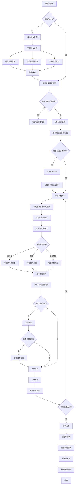
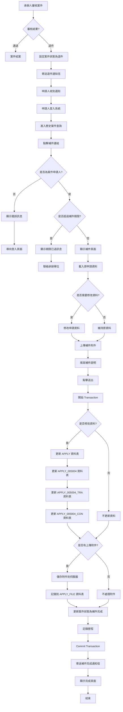
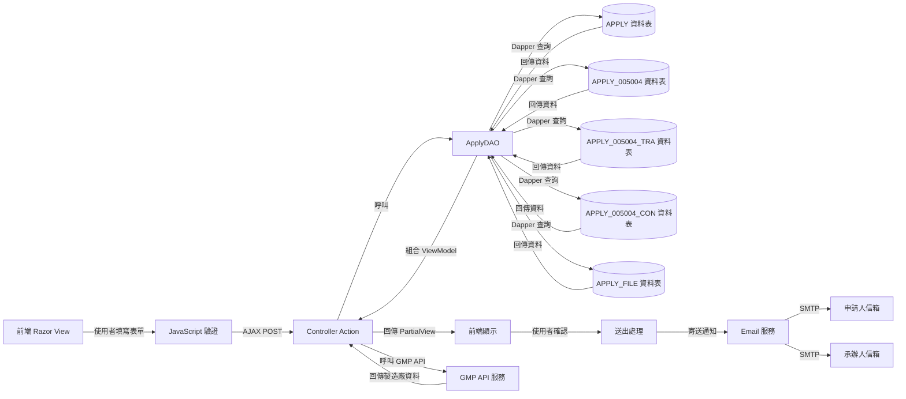
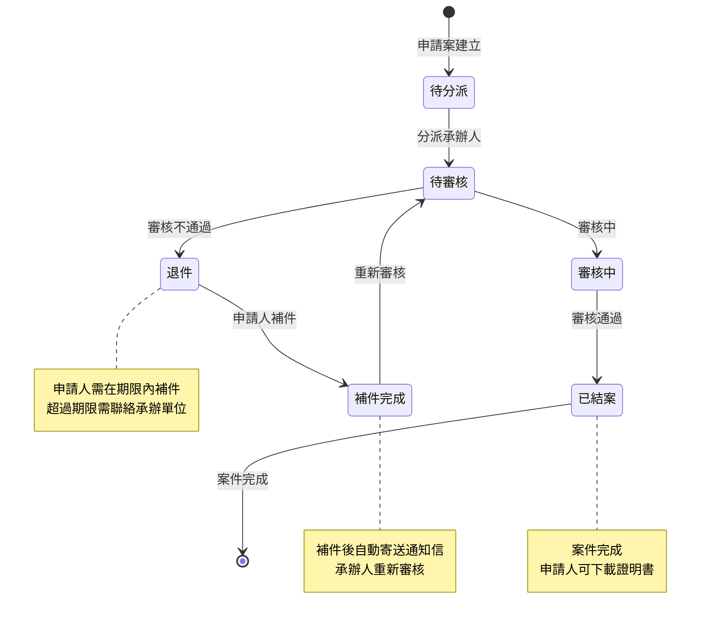

# 005004 中藥 GMP 廠證明文件(中文) - 完整技術文件

## 服務基本資訊

| 項目             | 內容                                                                |
| ---------------- | ------------------------------------------------------------------- |
| **服務代碼**     | 005004                                                              |
| **服務名稱**     | 中藥 GMP 廠證明文件(中文)                                           |
| **業務單位**     | 中醫藥司                                                            |
| **是否需繳費**   | 是                                                                  |
| **申請對象**     | 中藥廠商                                                            |
| **Controller**   | `ES/Controllers/Apply_005004Controller.cs` (509 行)                 |
| **ViewModel**    | `ES/Models/ViewModels/Apply_005004ViewModel.cs` (791 行)            |
| **Entity Model** | `ES/Models/Entities/Apply_005004Model.cs`                           |
| **主要資料表**   | APPLY, APPLY_005004, APPLY_005004_TRA, APPLY_005004_CON, APPLY_FILE |
| **檔案數量**     | 4 個固定檔案上傳欄位（可選）                                        |

---

## 服務特色

### 與其他服務的差異

| 項目             | 005001 產銷證明書   | 005002 GMP 證明書申請 | **005004 中藥 GMP 廠證明(中文)** |
| ---------------- | ------------------- | --------------------- | -------------------------------- |
| **服務性質**     | 產銷證明書          | GMP 證明書申請        | **中藥 GMP 廠證明文件**          |
| **繳費方式**     | 有（每份 1,500 元） | 有                    | **有**                           |
| **動態網格**     | 2 個                | 2 個                  | **0 個（使用勾選項目）**         |
| **固定檔案上傳** | 3 個                | 無                    | **4 個（可選）**                 |
| **GMP API 整合** | 無                  | 無                    | **有（自動帶入製造廠資料）**     |
| **複雜度**       | ⭐⭐⭐⭐⭐ 極高     | ⭐⭐⭐⭐ 高           | **⭐⭐⭐⭐ 高**                  |

### 核心功能

1. **申請人基本資料**

   - 公司名稱
   - 聯絡人姓名
   - 聯絡電話（區碼 + 號碼 + 分機）
   - 傳真（區碼 + 號碼 + 分機）
   - EMAIL（帳號 + 網域）

2. **製造廠資訊**

   - 製造廠許可編號（格式：(C)XXXXXXX）
   - 製造廠名稱
   - 製造廠地址（縣市 + 詳細地址）
   - 監製藥師
   - 負責人姓名
   - 負責人身分證字號

3. **藥商許可執照資訊**

   - 藥商許可執照字號（代碼 + 字號）
   - 工廠登記證字號

4. **GMP 查廠資訊**

   - 最近一次 GMP 查廠日期
   - 查廠證明文件影本

5. **產品類別選擇**

   - 原料藥（可勾選多個劑型）
   - 製劑（可勾選多個劑型）

6. **申請類別**

   - 新申請
   - 遺失補發
   - 汙損換發

7. **檢附文件管理**（4 個固定檔案，可選）

   - 最近一次 GMP 查廠日期證明文件影本
   - 藥品優良製造證明書申請表用印之掃描檔
   - 本部核發藥物製造或展延許可函影本
   - 製造業藥商許可執照影本

8. **GMP API 整合**
   - 自動帶入製造廠資料（勾選同意後）
   - 透過製造廠許可編號查詢 GMP 資料

---

## 系統架構

### 架構圖

```
使用者 → Controller → DAO → Database
         ↓
      ViewModel
         ↓
      Razor View
         ↓
   GMP API (自動帶入製造廠資料)
```

**說明：**

- 使用者透過瀏覽器填寫表單
- Controller 接收請求並處理業務邏輯
- ViewModel 負責資料驗證和格式轉換
- DAO 負責資料庫操作
- Razor View 負責頁面呈現
- GMP API 負責自動帶入製造廠資料

### 資料流程圖

```
1. 申請流程：
   使用者填寫基本資料 → 填寫製造廠許可編號 →
   勾選是否自動帶入製造廠資料 → 填寫藥商許可執照字號 →
   填寫製造廠資訊 → 選擇產品類別（原料藥/製劑） →
   選擇申請類別 → 填寫GMP查廠日期 → 上傳檢附文件（4 個檔案，可選） →
   選擇是否合併檔案 → 預覽 → 繳費 → 送出 → 完成

2. 儲存流程：
   Controller.Save() → DAO.AppendApply005004() →
   INSERT APPLY → INSERT APPLY_005004 →
   INSERT APPLY_005004_TRA (原料藥劑型) →
   INSERT APPLY_005004_CON (製劑劑型) →
   INSERT APPLY_FILE (檔案) →
   寄送通知郵件 → 顯示完成頁面

3. 補件流程：
   Controller.AppDoc() → DAO.QueryApply_005004() →
   顯示原申請資料 → 上傳補件檔案 →
   Controller.DocFinish() → DAO.AppendApplyDoc005004() →
   更新資料 → 寄送補件完成郵件
```

---

## 資料庫結構

### 1. APPLY 資料表（主表）

**說明：** 所有申辦案件的主表

**主要欄位：**

- `APP_ID` (PK)：案件編號
- `SRV_ID`：服務代碼（005004）
- `ACC_NO`：申請人帳號
- `NAME`：製造廠名稱
- `CNT_NAME`：聯絡人姓名
- `CHR_NAME`：負責人姓名
- `IDN`：負責人身分證字號
- `FLOW_CD`：流程狀態（1:申請中, 2:補件中, 3:補件完成）
- `UNIT_CD`：業務單位（7:中醫藥司）
- `APP_TIME`：申請時間
- `APP_EXT_DATE`：展延日期
- `TEL`：聯絡電話
- `FAX`：傳真
- `ADDR_CODE`：地址代碼
- `ADDR`：地址

### 2. APPLY_005004 資料表（服務明細表）

**說明：** 005004 服務的詳細資料

**主要欄位：**

| 欄位名稱                                      | 資料型別 | 長度 | NULL | 說明                                 | 範例值                   |
| --------------------------------------------- | -------- | ---- | ---- | ------------------------------------ | ------------------------ |
| `APP_ID`                                      | varchar  | 50   | NO   | 案件編號（PK）                       | 005004202501130001       |
| `APPLY_TYPE`                                  | varchar  | 50   | YES  | 申請類別                             | 新申請/遺失補發/汙損換發 |
| `MF_ADDR`                                     | varchar  | 500  | YES  | 製造廠地址                           | 台北市中正區...          |
| `LIC_NUM`                                     | varchar  | 50   | YES  | 製造廠許可編號                       | (C)1234567               |
| `ISSUE_DATE`                                  | datetime | -    | YES  | 查廠日期                             | 2020-01-01               |
| `EXPIR_DATE`                                  | datetime | -    | YES  | 有效日期                             | 2025-12-31               |
| `ATTACH_1`                                    | varchar  | 200  | YES  | 核備函（最近一期查廠之核備函公文）   | file1.pdf                |
| `ATTACH_2`                                    | varchar  | 200  | YES  | 藥品優良製造證明書申請表用印之掃描檔 | file2.pdf                |
| `ATTACH_3`                                    | varchar  | 200  | YES  | 本部核發藥物製造或展延許可函影本     | file3.pdf                |
| `ATTACH_4`                                    | varchar  | 200  | YES  | 製造業藥商許可執照影本               | file4.pdf                |
| `COPIES`                                      | int      | -    | YES  | 申請份數                             | 1                        |
| `COMP_NAME`                                   | varchar  | 200  | YES  | 公司名稱                             | 台灣製藥股份有限公司     |
| `EMAIL`                                       | varchar  | 100  | YES  | EMAIL                                | test@example.com         |
| `PL_CD`                                       | varchar  | 50   | YES  | 藥商許可執照字號（代碼）             | 北市衛藥販字第           |
| `PL_NUM`                                      | varchar  | 50   | YES  | 藥商許可執照字號（字號）             | 123456 號                |
| `PP_NAME`                                     | varchar  | 100  | YES  | 監製藥師                             | 王小明                   |
| `FRC_NUM`                                     | varchar  | 50   | YES  | 工廠登記證字號                       | 99999999                 |
| `TRA_CHECK`                                   | varchar  | 1    | YES  | 原料藥勾選（Y/N）                    | Y                        |
| `CON_CHECK`                                   | varchar  | 1    | YES  | 製劑勾選（Y/N）                      | Y                        |
| `RADIOYN`                                     | varchar  | 1    | YES  | 佐證文件採合併檔案（Y/N）            | Y                        |
| `MOHW_CASE_NO_SELF`                           | varchar  | 100  | YES  | 公文文號（申請人填寫）               | 1130001                  |
| **標準欄位**                                  |          |      |      |                                      |                          |
| `ADD_TIME`, `ADD_FUN_CD`, `ADD_ACC`           |          |      |      | 新增資訊                             |                          |
| `UPD_TIME`, `UPD_FUN_CD`, `UPD_ACC`           |          |      |      | 更新資訊                             |                          |
| `DEL_MK`, `DEL_TIME`, `DEL_FUN_CD`, `DEL_ACC` |          |      |      | 刪除資訊                             |                          |

### 3. APPLY_005004_TRA 資料表（原料藥劑型表）

**說明：** 儲存原料藥的劑型資料

**主要欄位：**

| 欄位名稱                                      | 資料型別 | 長度 | NULL | 說明           | 範例值             |
| --------------------------------------------- | -------- | ---- | ---- | -------------- | ------------------ |
| `APP_ID`                                      | varchar  | 50   | NO   | 案件編號（PK） | 005004202501130001 |
| `TRA_FORMS`                                   | varchar  | 50   | NO   | 劑型代碼（PK） | F5_001             |
| **標準欄位**                                  |          |      |      |                |                    |
| `ADD_TIME`, `ADD_FUN_CD`, `ADD_ACC`           |          |      |      | 新增資訊       |                    |
| `UPD_TIME`, `UPD_FUN_CD`, `UPD_ACC`           |          |      |      | 更新資訊       |                    |
| `DEL_MK`, `DEL_TIME`, `DEL_FUN_CD`, `DEL_ACC` |          |      |      | 刪除資訊       |                    |

### 4. APPLY_005004_CON 資料表（製劑劑型表）

**說明：** 儲存製劑的劑型資料

**主要欄位：**

| 欄位名稱                                      | 資料型別 | 長度 | NULL | 說明           | 範例值             |
| --------------------------------------------- | -------- | ---- | ---- | -------------- | ------------------ |
| `APP_ID`                                      | varchar  | 50   | NO   | 案件編號（PK） | 005004202501130001 |
| `CON_FORMS`                                   | varchar  | 50   | NO   | 劑型代碼（PK） | F5_002             |
| **標準欄位**                                  |          |      |      |                |                    |
| `ADD_TIME`, `ADD_FUN_CD`, `ADD_ACC`           |          |      |      | 新增資訊       |                    |
| `UPD_TIME`, `UPD_FUN_CD`, `UPD_ACC`           |          |      |      | 更新資訊       |                    |
| `DEL_MK`, `DEL_TIME`, `DEL_FUN_CD`, `DEL_ACC` |          |      |      | 刪除資訊       |                    |

### 5. APPLY_FILE 資料表（附件檔案表）

**說明：** 儲存所有案件的附件檔案

**主要欄位：**

- `APP_ID` (PK)：案件編號
- `FILE_NO` (PK)：檔案編號（1~4）
- `FILENAME`：實際檔案名稱（儲存在伺服器）
- `SRC_FILENAME`：原始檔案名稱
- `SRC_NO`：檔案來源編號（1~4）

---

## ViewModel 結構

### Apply_005004FormModel

**繼承：** ApplyModel

**主要屬性：**

```csharp
public class Apply_005004FormModel : ApplyModel
{
    // 製造廠許可編號
    [Display(Name = "製造廠許可編號")]
    public string LIC_NUM { get; set; }

    // 製造廠名稱
    [Display(Name = "製造廠名稱")]
    [Required]
    public string MF_CNT_NAME { get; set; }

    // 監製藥師
    [Display(Name = "監製藥師")]
    [Required]
    public string PP_NAME { get; set; }

    // 負責人姓名
    [Display(Name = "負責人姓名")]
    [Required]
    public string CHR_NAME { get; set; }

    // 負責人身分證字號
    [Display(Name = "負責人身分證字號")]
    [Required]
    public string IDN { get; set; }

    // 藥商許可執照字號
    [Display(Name = "藥商許可執照字號")]
    [Required]
    public string PL_Num { get; set; }

    // 製造廠地址（分段）
    [Display(Name = "製造廠地址區碼")]
    [Required]
    public string TAX_ORG_CITY_CODE { get; set; }

    [Display(Name = "製造廠地址區域")]
    [Required]
    public string TAX_ORG_CITY_TEXT { get; set; }

    [Display(Name = "製造廠地址")]
    [Required]
    public string TAX_ORG_CITY_DETAIL { get; set; }

    // 工廠登記證字號
    [Display(Name = "工廠登記證字號")]
    [Required]
    public string FRC_Num { get; set; }

    // 公司名稱
    [Display(Name = "公司名稱")]
    [Required]
    public string NAME { get; set; }

    // 聯絡人姓名
    [Display(Name = "聯絡人")]
    [Required]
    public string CNT_NAME { get; set; }

    // 查廠日期
    [Display(Name = "最近一次GMP查廠日期")]
    [Required]
    public string ISSUE_DATE { get; set; }

    public string ISSUE_DATE_TW
    {
        get
        {
            if (string.IsNullOrEmpty(ISSUE_DATE))
            {
                return null;
            }
            else
            {
                return HelperUtil.DateTimeToTwString(HelperUtil.TransToDateTime(ISSUE_DATE));
            }
        }
        set
        {
            ISSUE_DATE = HelperUtil.DateTimeToString(HelperUtil.TransTwToDateTime(value));
        }
    }

    // 申請日期(民國)
    public string APP_TIME_TW { get; set; }

    // 連絡電話（分段）
    [Display(Name = "電話")]
    public string TEL_BEFORE { get; set; }  // 區碼

    [Display(Name = "電話")]
    public string TEL_AFTER { get; set; }  // 號碼

    public string TEL_Extension { get; set; }  // 分機

    [Display(Name = "電話")]
    [Required]
    public string TEL { get; set; }  // 完整電話（組合後）

    // 傳真（分段）
    public string FAX_BEFORE { get; set; }  // 區碼
    public string FAX_AFTER { get; set; }  // 號碼
    public string FAX_Extension { get; set; }  // 分機
    public string FAX { get; set; }  // 完整傳真（組合後）

    // 藥商許可執照字號
    [Display(Name = "藥商許可執照字號")]
    [Required]
    public string PL_CD { get; set; }

    public string PL_CD_TEXT { get; set; }

    // 國別
    public string COUNTRY { get; set; }

    // EMAIL（分段）
    [Display(Name = "EMAIL")]
    public string EMAIL_BEFORE { get; set; }

    [Display(Name = "EMAIL")]
    public string EMAIL_CUSTOM { get; set; }

    [Display(Name = "EMAIL")]
    public string EMAIL_ADDR { get; set; }

    [Display(Name = "EMAIL")]
    public string EMAIL_ADDR_TEXT { get; set; }

    [Display(Name = "EMAIL")]
    [Required]
    public string EMAIL { get; set; }

    // 申請類別
    [Display(Name = "申請類別")]
    public string APPLY_TYPE { get; set; }

    // 自動帶入製造廠資料
    public string AGREE_LICENCE { get; set; }

    public bool IS_AGREE_LICENCE
    {
        get { return ("Y".Equals(!string.IsNullOrEmpty(this.AGREE_LICENCE) ? this.AGREE_LICENCE.ToUpper() : "N") ? true : false); }
        set
        {
            if (value)
            {
                AGREE_LICENCE = "Y";
            }
            else
            {
                AGREE_LICENCE = "N";
            }
        }
    }

    // 檔案上傳（4 個檔案，可選）
    public HttpPostedFileBase File_1 { get; set; }
    public HttpPostedFileBase File_2 { get; set; }
    public HttpPostedFileBase File_3 { get; set; }
    public HttpPostedFileBase File_4 { get; set; }

    public string RadioYN { get; set; }

    public string Name_File_1 { get; set; }
    public string Name_File_2 { get; set; }
    public string Name_File_3 { get; set; }
    public string Name_File_4 { get; set; }

    // 原料藥
    public string TRA { get; set; }
    public string TRA_CHECK { get; set; }

    public bool IS_TRA_CHECK
    {
        get { return ("Y".Equals(!string.IsNullOrEmpty(this.TRA_CHECK) ? this.TRA_CHECK.ToUpper() : "N") ? true : false); }
        set
        {
            if (value)
            {
                TRA_CHECK = "Y";
            }
            else
            {
                TRA_CHECK = "N";
            }
        }
    }

    public string TRA_ITEM { get; set; }
    public string TRA_ITEM_CD { get; set; }

    // 製劑
    public string CON { get; set; }
    public string CON_CHECK { get; set; }

    public bool IS_CON_CHECK
    {
        get { return ("Y".Equals(!string.IsNullOrEmpty(this.CON_CHECK) ? this.CON_CHECK.ToUpper() : "N") ? true : false); }
        set
        {
            if (value)
            {
                CON_CHECK = "Y";
            }
            else
            {
                CON_CHECK = "N";
            }
        }
    }

    public string CON_ITEM { get; set; }
    public string CON_ITEM_CD { get; set; }

    // 檔案說明
    public string FILE2_TEXT { get; set; }
    public string FILE3_TEXT { get; set; }
    public string FILE4_TEXT { get; set; }

    // 補件狀態
    public string DOCYN { get; set; }

    // 公文文號(申請人填寫)
    [Display(Name = "文號")]
    [Required]
    public string MOHW_CASE_NO_SELF { get; set; }

    // 補件數量
    public string DOCCOUNT { get; set; }
}
```

---

## 完整流程圖

### 申請流程圖



### 補件流程圖



### 資料流程圖



### 案件狀態轉換圖



**流程圖說明：**

1. **申請流程圖**：完整呈現從登入、填寫表單、GMP API 整合、預覽到完成的整個申請流程
2. **補件流程圖**：說明退件後的補件流程，包含權限檢查、期限檢查、資料更新等步驟
3. **資料流程圖**：展示資料在前端、Controller、DAO、資料庫、GMP API 之間的流動
4. **案件狀態轉換圖**：說明案件在不同狀態之間的轉換關係

---

## 技術重點

### 1. GMP API 整合（自動帶入製造廠資料）

**特點：**

- 使用者勾選「同意自動帶入製造廠資料」後，系統會透過製造廠許可編號呼叫 GMP API
- API 會回傳製造廠名稱、地址、負責人、查廠日期、有效期限等資料
- 自動填入表單欄位，減少使用者輸入時間

**實作方式：**

```csharp
// Controller 端處理
[HttpPost]
public ActionResult GetGMPData(Apply_005004FormModel Form)
{
    var result = new AjaxResultStruct();
    ApplyDAO dao = new ApplyDAO();
    GMPAPI Data = new GMPAPI();

    if (ConfigModel.WebTestEnvir == "Y")
    {
        // 測試環境：使用模擬資料
        var temp = "{" +
                   "\"GMPResp\": {" +
                   "\"名稱\": \"順天堂藥廠股份有限公司\"," +
                   "\"醫事機構代碼\": \"623105B224\"," +
                   "\"郵遞區號\": \"40252\"," +
                   "\"營業地址\": \"新北市新店區北新路3段207號3樓\"," +
                   "\"負責人\": \"盧道隆\"," +
                   "\"查廠日期\": \"2005/06/27\"," +
                   "\"有效期限\": \"2020/12/25\"" +
                   "},\"STATUS\": \"成功\"}";
        Data = JsonConvert.DeserializeObject<GMPAPI>(temp);
    }
    else
    {
        // 正式環境：呼叫 GMP API
        APIDAO api = new APIDAO();
        Data = api.GetGMPLicense(Form.LIC_NUM);
    }

    if (Data.STATUS == "成功")
    {
        // 資料處理
        Data.GMPResp = dao.SortAddr(Data.GMPResp);

        result.status = true;
        result.message = "成功";
        result.data = Data.GMPResp;
    }
    else if (Data.STATUS == "失敗")
    {
        result.status = false;
        result.message = "取得資料失敗";
    }

    return Content(result.Serialize(), "application/json");
}
```

**JavaScript 控制：**

```javascript
// 勾選自動帶入製造廠資料
$("#AGREE_LICENCE").change(function () {
  var isChecked = $(this).is(":checked");
  if (isChecked) {
    var licNum = $("#LIC_NUM").val();
    if (licNum != "") {
      // 呼叫 API 取得 GMP 資料
      $.ajax({
        url: "/Apply_005004/GetGMPData",
        type: "POST",
        data: { LIC_NUM: licNum },
        success: function (data) {
          if (data.status) {
            // 自動填入資料
            $("#MF_CNT_NAME").val(data.data.名稱);
            $("#TAX_ORG_CITY_CODE").val(data.data.郵遞區號);
            $("#MF_ADDR").val(data.data.營業地址);
            $("#CHR_NAME").val(data.data.負責人);
            $("#ISSUE_DATE").val(data.data.查廠日期);
          } else {
            alert(data.message);
          }
        }
      });
    }
  }
});
```

### 2. 產品類別選擇（原料藥/製劑）

**特點：**

- 使用勾選框控制是否顯示對應的劑型選擇
- 可同時勾選原料藥和製劑
- 劑型選擇使用動態新增/刪除的方式

**實作方式：**

```javascript
// 勾選原料藥
$("#TRA_CHECK").change(function () {
  var isChecked = $(this).is(":checked");
  if (isChecked) {
    $("#traTable").show();
  } else {
    $("#traTable").hide();
    $("#traTable tbody").empty();
  }
});

// 勾選製劑
$("#CON_CHECK").change(function () {
  var isChecked = $(this).is(":checked");
  if (isChecked) {
    $("#conTable").show();
  } else {
    $("#conTable").hide();
    $("#conTable tbody").empty();
  }
});

// 新增原料藥劑型
function TraConAdd(type) {
  var table = type == "tra" ? "#traTable" : "#conTable";
  var select = type == "tra" ? "#TRA" : "#CON";

  var selectedText = $(select + " option:selected").text();
  var selectedValue = $(select + " option:selected").val();

  if (selectedValue != "") {
    var newRow =
      "<tr>" +
      "<td><input type='text' class='form-control' readonly value='" +
      selectedText +
      "' />" +
      "<input type='hidden' class='form-control' value='" +
      selectedValue +
      "' /></td>" +
      "<td><button type='button' class='btn btn-danger' onclick='TraConDel(this)'>刪除</button></td>" +
      "</tr>";

    $(table + " tbody").append(newRow);
    $(table).show();
  }
}

// 刪除劑型
function TraConDel(btn) {
  $(btn).closest("tr").remove();
}
```

### 3. 製造廠許可編號驗證

**特點：**

- 製造廠許可編號格式：(C)XXXXXXX（7 位數字）
- 使用正規表達式驗證格式

**實作方式：**

```csharp
// Controller 端驗證
if (!string.IsNullOrEmpty(form.LIC_NUM))
{
    if (!System.Text.RegularExpressions.Regex.IsMatch(form.LIC_NUM.ToUpper(), @"^\(C\)[0-9]{7}$"))
    {
        ErrorMsg += "製造廠許可編號輸入錯誤\r\n";
    }
}
```

### 4. 申請類別選擇

**特點：**

- 新申請
- 遺失補發
- 汙損換發

**實作方式：**

```csharp
// Controller 端處理
if (Form.APPLY_TYPE == "新申請")
{
    doc.ReplaceText("$APPLY_TYPE", "■新申請       □遺失補發      □汙損換發", false, System.Text.RegularExpressions.RegexOptions.None);
}
else if (Form.APPLY_TYPE == "遺失補發")
{
    doc.ReplaceText("$APPLY_TYPE", "□新申請       ■遺失補發      □汙損換發", false, System.Text.RegularExpressions.RegexOptions.None);
}
else if (Form.APPLY_TYPE == "汙損換發")
{
    doc.ReplaceText("$APPLY_TYPE", "□新申請       □遺失補發      ■汙損換發", false, System.Text.RegularExpressions.RegexOptions.None);
}
```

---

## 相關檔案清單

### 前端檔案

- `ES/Controllers/Apply_005004Controller.cs` (509 行) - 控制器
- `ES/Models/ViewModels/Apply_005004ViewModel.cs` (791 行) - 視圖模型
- `ES/Views/Apply_005004/Prompt005004.cshtml` - 說明事項頁面
- `ES/Views/Apply_005004/Apply.cshtml` - 申請表單
- `ES/Views/Apply_005004/PreView005004.cshtml` - 預覽頁面
- `ES/Views/Apply_005004/Save.cshtml` - 完成頁面
- `ES/Views/Apply_005004/AppDoc.cshtml` - 補件頁面
- `ES/Views/Apply_005004/Detail005004.cshtml` - 詳細資料頁面

### 後端檔案

- `ES/DataLayers/ApplyDAO.cs` - 資料存取層（包含 AppendApply005004, QueryApply_005004, AppendApplyDoc005004, GetApplyNotice_005004 方法）
- `ES/DataLayers/ShareDAO.cs` - 共用資料存取層
- `ES/DataLayers/APIDAO.cs` - API 資料存取層（包含 GetGMPLicense 方法）
- `ES/Models/Entities/Apply_005004Model.cs` - 實體模型
- `ES/Models/Entities/APPLYModel.cs` - APPLY 實體
- `ES/Action/Form/Form005004Action.cs` - 表單處理

### 資料庫資料表

- `SERVICE` - 服務定義表
- `APPLY` - 申請主表
- `APPLY_005004` - 服務明細表
- `APPLY_005004_TRA` - 原料藥劑型表
- `APPLY_005004_CON` - 製劑劑型表
- `APPLY_FILE` - 附件檔案表
- `APPLY_NOTICE` - 補件通知表
- `CODE_CD` - 代碼表（劑型代碼：F5_DOSAGE_FORM）

---

## 注意事項

### 1. 申請人基本資料

- 公司名稱為必填
- 聯絡人姓名為必填
- 聯絡電話為必填
- EMAIL 為必填
- 電話和傳真的區碼、號碼、分機需分段輸入

### 2. 製造廠許可編號

- 格式：(C)XXXXXXX（7 位數字）
- 可選擇是否自動帶入製造廠資料

### 3. 藥商許可執照字號

- 代碼 + 字號
- 字號必須為數字

### 4. 製造廠資訊

- 製造廠名稱為必填
- 製造廠地址為必填（需選擇縣市並填寫詳細地址）
- 監製藥師為必填
- 負責人姓名為必填
- 負責人身分證字號為必填
- 工廠登記證字號為必填

### 5. GMP 查廠資訊

- 最近一次 GMP 查廠日期為必填
- 需上傳查廠證明文件影本

### 6. 產品類別

- 至少需勾選原料藥或製劑其中一項
- 勾選後需選擇至少一個劑型

### 7. 申請類別

- 新申請、遺失補發、汙損換發三選一

### 8. 檢附文件

- 所有檔案都是可選的（非必填）
- 只接受 PDF 格式
- 每個檔案大小不超過 5MB
- 可選擇是否將所有檔案合併為一個 PDF

### 9. 補件功能

- 只有流程狀態為「補件中」的案件才能補件
- 補件有期限限制
- 補件完成後流程狀態會更新為「補件完成」

---

**版本：** 1.0
**日期：** 2025-10-20
**作者：** 柏通股份有限公司
