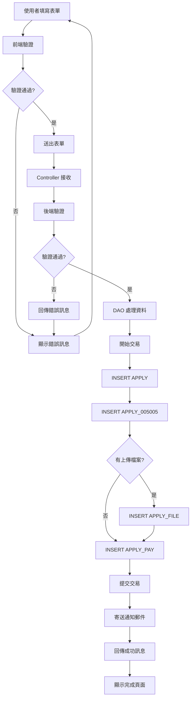
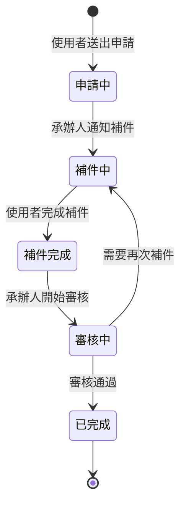

# 005005 中藥 GMP 廠證明文件(英文) - 完整技術文件

## 服務基本資訊

| 項目             | 內容                                                     |
| ---------------- | -------------------------------------------------------- |
| **服務代碼**     | 005005                                                   |
| **服務名稱**     | 中藥 GMP 廠證明文件(英文)                                |
| **業務單位**     | 中醫藥司                                                 |
| **是否需繳費**   | 是（每份 1,500 元）                                      |
| **申請對象**     | 中藥廠商                                                 |
| **Controller**   | `ES/Controllers/Apply_005005Controller.cs` (511 行)      |
| **ViewModel**    | `ES/Models/ViewModels/Apply_005005ViewModel.cs` (540 行) |
| **Entity Model** | `ES/Models/Entities/Apply_005005Model.cs` (129 行)       |
| **主要資料表**   | APPLY, APPLY_005005, APPLY_FILE, APPLY_PAY               |
| **檔案數量**     | 2 個固定檔案上傳欄位（可選）                             |

---

## 服務特色

### 與其他服務的差異

| 項目             | 005004 中藥 GMP 廠證明(中文) | **005005 中藥 GMP 廠證明(英文)** | 005001 產銷證明書   |
| ---------------- | ---------------------------- | -------------------------------- | ------------------- |
| **服務性質**     | 中藥 GMP 廠證明文件          | **中藥 GMP 廠證明文件**          | 產銷證明書          |
| **語言**         | 中文                         | **英文**                         | 中英文對照          |
| **繳費方式**     | 有                           | **有（每份 1,500 元）**          | 有（每份 1,500 元） |
| **動態網格**     | 0 個（使用勾選項目）         | **0 個**                         | 2 個                |
| **固定檔案上傳** | 4 個                         | **2 個（可選）**                 | 3 個                |
| **英文驗證**     | 部分欄位                     | **所有主要欄位**                 | 部分欄位            |
| **外銷國家**     | 無                           | **有（必填）**                   | 無                  |
| **複雜度**       | ⭐⭐⭐⭐ 高                  | **⭐⭐⭐⭐ 高**                  | ⭐⭐⭐⭐⭐ 極高     |

### 核心功能

1. **申請人基本資料**

   - 公司名稱（英文）
   - 聯絡人姓名（中文）
   - 聯絡電話（區碼 + 號碼 + 分機）
   - 傳真（區碼 + 號碼 + 分機）
   - EMAIL（帳號 + 網域）

2. **外銷國家資訊**

   - 外銷國家（英文，必填）
   - 需以「.」結尾

3. **製造廠資訊**

   - 製造廠許可編號（格式：(C)XXXXXXX）
   - 製造廠名稱（英文）
   - 製造廠地址（英文）

4. **GMP 查廠資訊**

   - 最近一次 GMP 查廠日期
   - GMP 有效日期

5. **檢附文件管理**（2 個固定檔案，可選）

   - 本部核發藥物製造或展延許可函影本
   - 製造業藥商許可執照影本

6. **繳費功能**

   - 申請份數（預設 1 份）
   - 繳費金額（每份 1,500 元）
   - 5 種繳費方式

7. **英文資料驗證**
   - 公司名稱必須為英文或數字
   - 製造廠名稱必須為英文或數字
   - 製造廠地址必須為英文或數字
   - 外銷國家必須為英文

---

## 系統架構

### 架構圖

```
使用者 → Controller → DAO → Database
         ↓
      ViewModel
         ↓
      Razor View
         ↓
   英文資料驗證
```

**說明：**

- 使用者透過瀏覽器填寫表單
- Controller 接收請求並處理業務邏輯
- ViewModel 負責資料驗證和格式轉換
- DAO 負責資料庫操作
- Razor View 負責頁面呈現
- 英文資料驗證確保所有主要欄位符合英文格式

### 資料流程圖

```
1. 申請流程：
   使用者填寫基本資料 → 填寫公司名稱（英文） →
   填寫聯絡人姓名（中文） → 填寫聯絡電話 → 填寫EMAIL →
   填寫外銷國家（英文） → 填寫製造廠許可編號 →
   填寫製造廠名稱（英文） → 填寫製造廠地址（英文） →
   填寫GMP查廠日期 → 填寫GMP有效日期 →
   上傳檢附文件（2 個檔案，可選） → 選擇是否合併檔案 →
   選擇申請份數 → 預覽 → 繳費 → 送出 → 完成

2. 儲存流程：
   Controller.Save() → DAO.AppendApply005005() →
   INSERT APPLY → INSERT APPLY_005005 →
   INSERT APPLY_FILE (檔案) →
   INSERT APPLY_PAY (繳費) →
   寄送通知郵件 → 顯示完成頁面

3. 補件流程：
   Controller.AppDoc() → DAO.QueryApply_005005() →
   顯示原申請資料 → 上傳補件檔案 →
   Controller.DocFinish() → DAO.AppendApplyDoc005005() →
   更新資料 → 寄送補件完成郵件
```

---

## 資料庫結構

### 1. APPLY 資料表（主表）

**說明：** 所有申辦案件的主表

**主要欄位：**

- `APP_ID` (PK)：案件編號
- `SRV_ID`：服務代碼（005005）
- `ACC_NO`：申請人帳號
- `NAME`：公司名稱（英文）
- `CNT_NAME`：聯絡人姓名（中文）
- `FLOW_CD`：流程狀態（1:申請中, 2:補件中, 3:補件完成）
- `UNIT_CD`：業務單位（7:中醫藥司）
- `APP_TIME`：申請時間
- `APP_EXT_DATE`：展延日期
- `TEL`：聯絡電話
- `FAX`：傳真
- `EMAIL`：EMAIL

### 2. APPLY_005005 資料表（服務明細表）

**說明：** 005005 服務的詳細資料

**主要欄位：**

| 欄位名稱                                      | 資料型別 | 長度 | NULL | 說明                             | 範例值                                  |
| --------------------------------------------- | -------- | ---- | ---- | -------------------------------- | --------------------------------------- |
| `APP_ID`                                      | varchar  | 50   | NO   | 案件編號（PK）                   | 005005202501130001                      |
| `MF_ADDR`                                     | varchar  | 500  | YES  | 製造廠地址（英文）               | No.207, Sec. 3, Beixin Rd., Taipei City |
| `LIC_NUM`                                     | varchar  | 50   | YES  | 製造廠許可編號                   | (C)1234567                              |
| `ISSUE_DATE`                                  | datetime | -    | YES  | 查廠日期                         | 2020-01-01                              |
| `EXPIR_DATE`                                  | datetime | -    | YES  | GMP 有效日期                     | 2025-12-31                              |
| `ATTACH_1`                                    | varchar  | 200  | YES  | 本部核發藥物製造或展延許可函影本 | file1.pdf                               |
| `ATTACH_2`                                    | varchar  | 200  | YES  | 製造業藥商許可執照影本           | file2.pdf                               |
| `COPIES`                                      | int      | -    | YES  | 申請份數                         | 1                                       |
| `COMP_NAME`                                   | varchar  | 200  | YES  | 公司名稱（英文）                 | Taiwan Pharmaceutical Co., Ltd.         |
| `EMAIL`                                       | varchar  | 100  | YES  | EMAIL                            | test@example.com                        |
| `RADIOYN`                                     | varchar  | 1    | YES  | 佐證文件採合併檔案（Y/N）        | Y                                       |
| `MF_CNT_NAME`                                 | varchar  | 200  | YES  | 製造廠名稱（英文）               | Taiwan Pharmaceutical Factory           |
| **標準欄位**                                  |          |      |      |                                  |                                         |
| `ADD_TIME`, `ADD_FUN_CD`, `ADD_ACC`           |          |      |      | 新增資訊                         |                                         |
| `UPD_TIME`, `UPD_FUN_CD`, `UPD_ACC`           |          |      |      | 更新資訊                         |                                         |
| `DEL_MK`, `DEL_TIME`, `DEL_FUN_CD`, `DEL_ACC` |          |      |      | 刪除資訊                         |                                         |

### 3. APPLY_FILE 資料表（附件檔案表）

**說明：** 儲存所有案件的附件檔案

**主要欄位：**

- `APP_ID` (PK)：案件編號
- `FILE_NO` (PK)：檔案編號（1~2）
- `FILENAME`：實際檔案名稱（儲存在伺服器）
- `SRC_FILENAME`：原始檔案名稱
- `SRC_NO`：檔案來源編號（1~2）

### 4. APPLY_PAY 資料表（繳費資料表）

**說明：** 儲存所有案件的繳費資料

**主要欄位：**

- `APP_ID` (PK)：案件編號
- `PAY_AMOUNT`：繳費金額
- `PAY_STATUS`：繳費狀態（0:未繳費, 1:已繳費）
- `PAY_TIME`：繳費時間
- `PAY_METHOD`：繳費方式（1~5）

---

## ViewModel 結構

### Apply_005005FormModel

**繼承：** ApplyModel

**主要屬性：**

```csharp
public class Apply_005005FormModel : ApplyModel
{
    // 申請日期(民國)
    public string APP_TIME_TW { get; set; }

    // 申請份數/補件數量
    public string PAYCOUNT { get; set; }

    // 繳費金額
    [Display(Name = "繳費金額")]
    [Required]
    public int PAYAMOUNT { get; set; }

    // 公司名稱（英文）
    [Display(Name = "公司名稱")]
    [Required]
    public string NAME { get; set; }

    // 聯絡人姓名（中文）
    [Display(Name = "聯絡人")]
    [Required]
    public string CNT_NAME { get; set; }

    // 連絡電話（分段）
    [Display(Name = "電話")]
    public string TEL_BEFORE { get; set; }  // 區碼

    [Display(Name = "電話")]
    public string TEL_AFTER { get; set; }  // 號碼

    public string TEL_Extension { get; set; }  // 分機

    [Display(Name = "電話")]
    [Required]
    public string TEL { get; set; }  // 完整電話（組合後）

    // 傳真（分段）
    public string FAX_BEFORE { get; set; }  // 區碼
    public string FAX_AFTER { get; set; }  // 號碼
    public string FAX_Extension { get; set; }  // 分機

    [Display(Name = "傳真")]
    public string FAX { get; set; }  // 完整傳真（組合後）

    // EMAIL（分段）
    [Display(Name = "EMAIL")]
    public string EMAIL_BEFORE { get; set; }  // 帳號

    [Display(Name = "EMAIL")]
    public string EMAIL_CUSTOM { get; set; }  // 其他MAIL

    [Display(Name = "EMAIL")]
    public string EMAIL_ADDR { get; set; }  // 網域

    [Display(Name = "EMAIL")]
    public string EMAIL_ADDR_TEXT { get; set; }  // 網域文字

    [Display(Name = "EMAIL")]
    [Required]
    public string EMAIL { get; set; }  // 完整EMAIL（組合後）

    // 外銷國家（英文）
    [Display(Name = "外銷國家")]
    [Required]
    public string IMP_COUNTRY { get; set; }

    // 製造廠許可編號
    [Display(Name = "製造廠許可編號")]
    [Required]
    public string LIC_NUM { get; set; }

    // 製造廠名稱（英文）
    [Display(Name = "製造廠名稱")]
    [Required]
    public string MF_CNT_NAME { get; set; }

    // 製造廠地址（英文）
    [Display(Name = "製造廠地址")]
    [Required]
    public string MF_ADDR { get; set; }

    // 查廠日期
    [Display(Name = "最近一次GMP查廠日期")]
    [Required]
    public string ISSUE_DATE { get; set; }

    public string ISSUE_DATE_TW
    {
        get
        {
            if (string.IsNullOrEmpty(ISSUE_DATE))
            {
                return null;
            }
            else
            {
                return HelperUtil.DateTimeToTwString(HelperUtil.TransToDateTime(ISSUE_DATE));
            }
        }
        set { ISSUE_DATE = HelperUtil.DateTimeToString(HelperUtil.TransTwToDateTime(value)); }
    }

    // GMP有效日期
    [Display(Name = "GMP有效日期")]
    [Required]
    public string EXPIR_DATE { get; set; }

    public string EXPIR_DATE_TW
    {
        get
        {
            if (string.IsNullOrEmpty(EXPIR_DATE))
            {
                return null;
            }
            else
            {
                return HelperUtil.DateTimeToTwString(HelperUtil.TransToDateTime(EXPIR_DATE));
            }
        }
        set { EXPIR_DATE = HelperUtil.DateTimeToString(HelperUtil.TransTwToDateTime(value)); }
    }

    // 佐證文件採合併檔案
    public string RadioYN { get; set; }

    // 本部核發藥物製造或展延許可函影本
    public HttpPostedFileBase File_1 { get; set; }
    public string Name_File_1 { get; set; }

    // 製造業藥商許可執照影本
    public HttpPostedFileBase File_2 { get; set; }
    public string Name_File_2 { get; set; }

    // 補件狀態
    public string DOCYN { get; set; }
}
```

### Apply_005005Form2Model

**繼承：** ApplyModel

**主要屬性：**

```csharp
public class Apply_005005Form2Model : ApplyModel
{
    // 申請狀態
    [Display(Name = "申請狀態")]
    public string APPLY_STATUS { get; set; }

    // 申請日期(民國)
    public string APP_TIME_TW { get; set; }

    // 申請份數
    public string PAYCOUNT { get; set; }

    // 繳費金額
    [Display(Name = "繳費金額")]
    public int PAYAMOUNT { get; set; }

    // 公司名稱（英文）
    [Display(Name = "公司名稱")]
    public string NAME { get; set; }

    // 聯絡人姓名（中文）
    [Display(Name = "聯絡人姓名")]
    public string CNT_NAME { get; set; }

    // 連絡電話（分段）
    [Display(Name = "連絡電話區域號碼")]
    public string TEL_BEFORE { get; set; }

    [Display(Name = "連絡電話")]
    public string TEL_AFTER { get; set; }

    [Display(Name = "連絡電話分機")]
    public string TEL_Extension { get; set; }

    // 傳真（分段）
    public string FAX_BEFORE { get; set; }
    public string FAX_AFTER { get; set; }
    public string FAX_Extension { get; set; }

    // EMAIL（分段）
    [Display(Name = "EMAIL")]
    public string EMAIL_BEFORE { get; set; }

    [Display(Name = "EMAIL")]
    public string EMAIL_CUSTOM { get; set; }

    [Display(Name = "EMAIL")]
    public string EMAIL_ADDR { get; set; }

    [Display(Name = "EMAIL")]
    public string EMAIL_ADDR_TEXT { get; set; }

    [Display(Name = "EMAIL")]
    public string EMAIL { get; set; }

    // 外銷國家（英文）
    [Display(Name = "外銷國家")]
    public string IMP_COUNTRY { get; set; }

    // 製造廠許可編號
    [Display(Name = "製造廠許可編號")]
    public string LIC_NUM { get; set; }

    // 製造廠名稱（英文）
    [Display(Name = "製造廠名稱")]
    public string MF_CNT_NAME { get; set; }

    // 製造廠地址（英文）
    [Display(Name = "製造廠地址")]
    public string MF_ADDR { get; set; }

    // 查廠日期
    [Display(Name = "最近一次GMP查廠日期")]
    public string ISSUE_DATE { get; set; }
    public string ISSUE_DATE_TW { get; set; }

    // GMP有效日期
    [Display(Name = "GMP有效日期")]
    public string EXPIR_DATE { get; set; }
    public string EXPIR_DATE_TW { get; set; }

    // 預計完成日
    public string APP_EXT_DATE_TW { get; set; }

    // 佐證文件採合併檔案
    public string RADIOYN { get; set; }

    // 本部核發藥物製造或展延許可函影本
    public HttpPostedFileBase File_1 { get; set; }
    [Display(Name = "本部核發藥物製造或展延許可函影本")]
    public string Name_File_1 { get; set; }
    public string Name_File_1_TEXT { get; set; }

    // 製造業藥商許可執照影本
    public HttpPostedFileBase File_2 { get; set; }
    [Display(Name = "製造業藥商許可執照影本")]
    public string Name_File_2 { get; set; }
    public string Name_File_2_TEXT { get; set; }

    // 補件狀態
    public string DOCYN { get; set; }

    // 案件狀態
    public string CODE_CD { get; set; }

    // 案件是否鎖定
    public bool IS_CASE_LOCK { get; set; }

    // 繳費日期
    public string PAY_ACT_TIME { get; set; }

    // 繳費狀態
    public string PAY_STATUS { get; set; }

    // 繳費狀態YN
    public bool IS_PAY_STATUS { get; set; }

    // 案件承辦人姓名
    public string ADMIN_NAME { get; set; }

    // 公司名稱
    public string COMP_NAME { get; set; }

    // 申辦份數
    public string COPIES { get; set; }

    // 當前案件進度
    public string CODE_CD_TEXT { get; set; }
}
```

---

## 完整流程圖

### 1. 申請流程圖


### 2. 補件流程圖


### 3. 資料流程圖



### 4. 狀態轉換圖



---

## 技術亮點

### 1. 英文資料驗證

**實作位置：** `Apply_005005Controller.cs` (第 58-126 行)

**功能說明：**

- 公司名稱必須為英文或數字
- 製造廠名稱必須為英文或數字
- 製造廠地址必須為英文或數字
- 外銷國家必須為英文
- 聯絡人姓名必須為中文

**實作範例：**

```csharp
// 英文或數字驗證
System.Text.RegularExpressions.Regex reg = new System.Text.RegularExpressions.Regex(@"^[A-Za-z0-9\'\.\-\,\s\(\)]+$");

// 中文驗證
System.Text.RegularExpressions.Regex reg4 = new System.Text.RegularExpressions.Regex(@"^[\u4e00-\u9fa5]+$");

// 公司名稱驗證（英文）
if (!string.IsNullOrEmpty(form.NAME))
{
    if (!reg.IsMatch(form.NAME))
    {
        ErrorMsg += "公司名稱請以英文或數字填寫。\r\n";
    }
}

// 聯絡人姓名驗證（中文）
if (!string.IsNullOrEmpty(form.CNT_NAME))
{
    if (!reg4.IsMatch(form.CNT_NAME))
    {
        ErrorMsg += "請填入中文姓名。\r\n";
    }
}

// 製造廠名稱驗證（英文）
if (!string.IsNullOrEmpty(form.MF_CNT_NAME))
{
    if (!reg.IsMatch(form.MF_CNT_NAME))
    {
        ErrorMsg += "製造廠名稱請以英文或數字填寫。\r\n";
    }
}

// 製造廠地址驗證（英文）
if (!string.IsNullOrEmpty(form.MF_ADDR))
{
    if (!reg.IsMatch(form.MF_ADDR))
    {
        ErrorMsg += "製造廠地址請以英文或數字填寫。\r\n";
    }
}
```

### 2. 外銷國家驗證

**實作位置：** `Apply_005005Controller.cs` (第 91-102 行)

**功能說明：**

- 外銷國家必須為英文
- 外銷國家必須以「.」結尾

**實作範例：**

```csharp
if (!string.IsNullOrEmpty(form.IMP_COUNTRY))
{
    // 檢查是否以「.」結尾
    if (form.IMP_COUNTRY.Trim().Substring(form.IMP_COUNTRY.Trim().Length - 1, 1) != ".")
    {
        ErrorMsg += "外銷國家最後請以「.」結尾。\r\n";
    }

    // 檢查是否為英文
    if (!reg.IsMatch(form.IMP_COUNTRY))
    {
        ErrorMsg += "外銷國家請以英文填寫。\r\n";
    }
}
```

### 3. 製造廠許可編號驗證

**實作位置：** `Apply_005005Controller.cs` (第 104-110 行)

**功能說明：**

- 格式：(C)XXXXXXX（7 位數字）
- 使用正規表示式驗證

**實作範例：**

```csharp
if (!string.IsNullOrEmpty(form.LIC_NUM))
{
    if (!System.Text.RegularExpressions.Regex.IsMatch(form.LIC_NUM.ToUpper(), @"^\(C\)[0-9]{7}$"))
    {
        ErrorMsg += "製造廠許可編號輸入錯誤。\r\n";
    }
}
```

### 4. 檔案上傳與合併

**實作位置：** `Apply_005005Controller.cs` (第 200-300 行)

**功能說明：**

- 2 個固定檔案上傳欄位（可選）
- 可選擇是否合併檔案
- 支援多種檔案格式（PDF、JPG、PNG、DOC、DOCX）

**實作範例：**

```csharp
// 檔案上傳處理
if (Form.FAX_BEFORE.TONotNullString() != "")
{
    Form.FAX = Form.FAX_BEFORE + "-" + Form.FAX_AFTER;
    if (Form.FAX_Extension.TONotNullString() != "")
    {
        Form.FAX = Form.FAX + "#" + Form.FAX_Extension;
    }
}

// 合併檔案處理
if (Form.RadioYN == "Y")
{
    // 合併檔案邏輯
}
```

---

## 相關檔案清單

### 前端檔案

- `ES/Controllers/Apply_005005Controller.cs` (511 行) - 主要控制器
- `ES/Models/ViewModels/Apply_005005ViewModel.cs` (540 行) - ViewModel
- `ES/Views/Apply_005005/Prompt005005.cshtml` - 說明事項頁面
- `ES/Views/Apply_005005/Index.cshtml` - 申請頁面
- `ES/Views/Apply_005005/Preview.cshtml` - 預覽頁面
- `ES/Views/Apply_005005/Save.cshtml` - 完成頁面
- `ES/Views/Apply_005005/AppDoc.cshtml` - 補件頁面
- `ES/Views/Apply_005005/Detail005005.cshtml` - 詳細資料頁面

### 後端檔案

- `ES/DataLayers/ApplyDAO.cs` - 資料存取層（包含 AppendApply005005, QueryApply_005005, AppendApplyDoc005005, GetApplyNotice_005005 方法）
- `ES/DataLayers/ShareDAO.cs` - 共用資料存取層
- `ES/Models/Entities/Apply_005005Model.cs` (129 行) - 實體模型
- `ES/Models/Entities/APPLYModel.cs` - APPLY 實體

### 資料庫資料表

- `SERVICE` - 服務定義表
- `APPLY` - 申請主表
- `APPLY_005005` - 服務明細表
- `APPLY_FILE` - 附件檔案表
- `APPLY_PAY` - 繳費資料表
- `APPLY_NOTICE` - 補件通知表
- `CODE_CD` - 代碼表

---

**版本：** 1.0
**日期：** 2025-10-20
**作者：** 柏通股份有限公司
