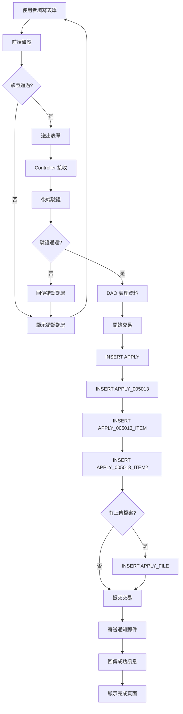
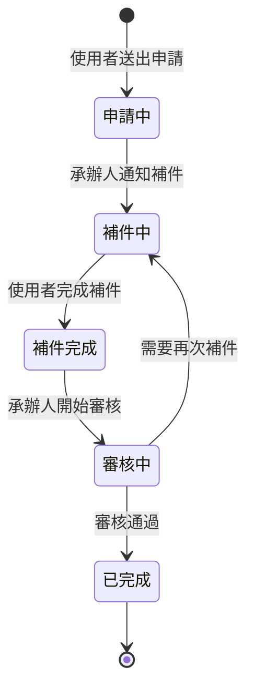

# 005013 民眾少量自用中藥貨品進口 - 完整技術文件

## 服務基本資訊

| 項目             | 內容                                                                   |
| ---------------- | ---------------------------------------------------------------------- |
| **服務代碼**     | 005013                                                                 |
| **服務名稱**     | 民眾少量自用中藥貨品進口                                               |
| **業務單位**     | 中醫藥司                                                               |
| **是否需繳費**   | 否（免繳費）                                                           |
| **申請對象**     | 一般民眾                                                               |
| **Controller**   | `ES/Controllers/Apply_005013Controller.cs` (654 行)                    |
| **ViewModel**    | `ES/Models/ViewModels/Apply_005013ViewModel.cs` (687 行)               |
| **主要資料表**   | APPLY, APPLY_005013, APPLY_005013_ITEM, APPLY_005013_ITEM2, APPLY_FILE |
| **動態網格數量** | 2 個（申請項目、民眾輸入自用中藥切結書申請項目）                       |
| **檔案數量**     | 6 個固定檔案上傳欄位 + 動態其他佐證文件                                |

---

## 服務特色

### 與其他服務的差異

| 項目             | 005001 產銷證明書 | 005004 中藥 GMP 廠證明(中文) | **005013 民眾少量自用中藥貨品進口** |
| ---------------- | ----------------- | ---------------------------- | ----------------------------------- |
| **服務性質**     | 產銷證明書        | GMP 廠證明文件               | **民眾自用中藥進口**                |
| **申請對象**     | 藥商              | 藥商                         | **一般民眾**                        |
| **是否需繳費**   | 是                | 是                           | **否（免繳費）**                    |
| **動態網格**     | 2 個              | 0 個                         | **2 個**                            |
| **固定檔案上傳** | 3 個              | 4 個                         | **6 個 + 動態其他佐證文件**         |
| **申請類型**     | 無                | 無                           | **事前申請/補辦案件**               |
| **數量限制**     | 無                | 無                           | **有（中藥材/中藥製劑限量）**       |
| **複雜度**       | ⭐⭐⭐⭐⭐ 極高   | ⭐⭐⭐⭐ 高                  | **⭐⭐⭐⭐⭐ 極高**                 |

### 核心功能

1. **申請人基本資料**

   - 姓名（自動帶入）
   - 身分證字號（自動帶入）
   - 地址（區碼 + 區域 + 詳細地址）
   - 聯絡電話（區碼 + 號碼 + 分機）
   - 行動電話（自動帶入）
   - EMAIL（帳號 + 網域）

2. **申請類型選擇**

   - 事前申請（Y）
   - 補辦案件（N）

3. **貨品來源資訊**

   - 生產國家（下拉選單）
   - 販賣國（下拉選單）
   - 起運地（下拉選單）

4. **申請項目（動態網格 1）**

   - 項次（自動編號）
   - 產品類別（下拉選單）
   - 貨名（文字輸入）
   - 備註（文字輸入）
   - 劑型（下拉選單）
   - 規格（文字輸入）
   - 申請數量（數字輸入）
   - 申請數量單位（下拉選單）
   - 規格數量（數字輸入）
   - 規格數量單位（下拉選單）

5. **個人用途選擇**

   - 自用（1）
   - 贈與（2）
   - 其他（3，需填寫說明）

6. **民眾輸入自用中藥切結書申請項目（動態網格 2）**

   - 項次（自動編號）
   - 貨品名稱（自動帶入）
   - 用法（文字輸入）
   - 總數量（自動計算）

7. **檢附文件管理**（6 個固定檔案 + 動態其他佐證文件）

   - 檔案 1：國際包裹招領單或海關補辦驗關通關手續通知書之正面影本
   - 檔案 2：國際包裹招領單或海關補辦驗關通關手續通知書之反面影本
   - 檔案 3：貨品數量超過海關規定時需檢附醫師診斷證明或其他相關證明文件
   - 檔案 4：產品外盒、仿單、說明書
   - 檔案 5：身分證影本(正面)
   - 檔案 6：身分證影本(反面)
   - 其他佐證文件：動態新增

8. **數量限制檢查**
   - 中藥材：每種至多 1 公斤，合計不得超過 12 種
   - 中藥製劑：每種至多 12 瓶(盒)，合計以不超過 36 瓶(盒)為限
   - 超過限量需檢附醫療證明，且不逾 3 個月用量

---

## 系統架構

### 架構圖

```
使用者 → Controller → DAO → Database
         ↓
      ViewModel
         ↓
      Razor View
         ↓
   動態網格 (2個)
         ↓
   檔案上傳 (6個固定 + 動態)
```

**說明：**

- 使用者透過瀏覽器填寫表單
- Controller 接收請求並處理業務邏輯
- ViewModel 負責資料驗證和格式轉換
- DAO 負責資料庫操作
- Razor View 負責頁面呈現
- 動態網格支援新增/刪除申請項目
- 檔案上傳支援固定檔案和動態其他佐證文件

### 資料流程圖

```
1. 申請流程：
   使用者登入 → 閱讀說明事項 → 同意並進入申辦頁面 →
   自動帶入會員資料 → 選擇申請類型 → 填寫貨品來源資訊 →
   動態新增申請項目 → 選擇個人用途 →
   填寫民眾輸入自用中藥切結書申請項目 →
   上傳檢附文件（6 個固定 + 動態其他佐證文件） →
   選擇是否合併檔案 → 預覽 → 送出 → 完成

2. 儲存流程：
   Controller.Save() → DAO.AppendApply005013() →
   INSERT APPLY → INSERT APPLY_005013 →
   INSERT APPLY_005013_ITEM (動態網格 1) →
   INSERT APPLY_005013_ITEM2 (動態網格 2) →
   INSERT APPLY_FILE (檔案) →
   寄送通知郵件 → 顯示完成頁面

3. 補件流程：
   Controller.AppDoc() → DAO.QueryApply_005013() →
   顯示原申請資料 → 上傳補件檔案 →
   Controller.DocFinish() → DAO.AppendApplyDoc005013() →
   更新資料 → 寄送補件完成郵件
```

---

## 資料庫結構

### 1. APPLY 資料表（主表）

**說明：** 所有申辦案件的主表

**主要欄位：**

- `APP_ID` (PK)：案件編號
- `SRV_ID`：服務代碼（005013）
- `ACC_NO`：申請人帳號
- `NAME`：申請人姓名
- `IDN`：申請人身分證字號
- `FLOW_CD`：流程狀態（1:申請中, 2:補件中, 3:補件完成）
- `UNIT_CD`：業務單位（7:中醫藥司）
- `APP_TIME`：申請時間
- `APP_EXT_DATE`：展延日期
- `TEL`：聯絡電話
- `MOBILE`：行動電話
- `EMAIL`：EMAIL
- `ADDR`：地址
- `ADDR_CODE`：地址區碼

### 2. APPLY_005013 資料表（服務明細表）

**說明：** 005013 服務的詳細資料

**主要欄位：**

| 欄位名稱                                      | 資料型別 | 長度 | NULL | 說明                               | 範例值                  |
| --------------------------------------------- | -------- | ---- | ---- | ---------------------------------- | ----------------------- |
| `APP_ID`                                      | varchar  | 50   | NO   | 案件編號（PK）                     | 005013202501130001      |
| `CSEE_TYPE`                                   | varchar  | 1    | YES  | 申請類型（Y:事前申請, N:補辦案件） | Y                       |
| `ProductionCountry`                           | varchar  | 50   | YES  | 生產國家代碼                       | US                      |
| `ProductionCountry_TEXT`                      | varchar  | 100  | YES  | 生產國家名稱                       | 美國                    |
| `SellerCountry`                               | varchar  | 50   | YES  | 販賣國代碼                         | US                      |
| `SellerCountry_TEXT`                          | varchar  | 100  | YES  | 販賣國名稱                         | 美國                    |
| `ShippingPort`                                | varchar  | 50   | YES  | 起運地代碼                         | US                      |
| `ShippingPort_TEXT`                           | varchar  | 100  | YES  | 起運地名稱                         | 美國                    |
| `RADIOUSAGE`                                  | varchar  | 1    | YES  | 個人用途（1:自用, 2:贈與, 3:其他） | 1                       |
| `RADIOUSAGE_TEXT`                             | varchar  | 200  | YES  | 個人用途其他說明                   | 其他用途說明            |
| `RADIOYN`                                     | varchar  | 1    | YES  | 佐證文件採合併檔案（Y/N）          | Y                       |
| `MOHW_CASE_NO`                                | varchar  | 50   | YES  | 公文文號                           | 衛部中藥字第 1234567 號 |
| **標準欄位**                                  |          |      |      |                                    |                         |
| `ADD_TIME`, `ADD_FUN_CD`, `ADD_ACC`           |          |      |      | 新增資訊                           |                         |
| `UPD_TIME`, `UPD_FUN_CD`, `UPD_ACC`           |          |      |      | 更新資訊                           |                         |
| `DEL_MK`, `DEL_TIME`, `DEL_FUN_CD`, `DEL_ACC` |          |      |      | 刪除資訊                           |                         |

### 3. APPLY_005013_ITEM 資料表（申請項目表）

**說明：** 儲存動態網格 1 的申請項目資料

**主要欄位：**

| 欄位名稱      | 資料型別 | 長度 | NULL | 說明             | 範例值    |
| ------------- | -------- | ---- | ---- | ---------------- | --------- |
| `APP_ID`      | varchar  | 50   | NO   | 案件編號（PK）   | 005013... |
| `ITEM_NUM`    | int      | -    | NO   | 項次（PK）       | 1         |
| `PORC_TYPE`   | varchar  | 50   | YES  | 產品類別代碼     | 1         |
| `COMMODITIES` | varchar  | 200  | YES  | 貨名             | 當歸      |
| `COMMOD_MEMO` | varchar  | 200  | YES  | 備註             | 備註說明  |
| `COMMOD_TYPE` | varchar  | 50   | YES  | 劑型代碼         | 1         |
| `SPEC`        | varchar  | 100  | YES  | 規格             | 100g/包   |
| `QTY`         | varchar  | 50   | YES  | 申請數量         | 10        |
| `UNIT`        | varchar  | 50   | YES  | 申請數量單位代碼 | 1         |
| `SPEC_QTY`    | varchar  | 50   | YES  | 規格數量         | 100       |
| `SPEC_UNIT`   | varchar  | 50   | YES  | 規格數量單位代碼 | 1         |
| `ADD_TIME`    | datetime | -    | YES  | 建立時間         |           |

### 4. APPLY_005013_ITEM2 資料表（民眾輸入自用中藥切結書申請項目表）

**說明：** 儲存動態網格 2 的民眾輸入自用中藥切結書申請項目資料

**主要欄位：**

| 欄位名稱        | 資料型別 | 長度 | NULL | 說明             | 範例值    |
| --------------- | -------- | ---- | ---- | ---------------- | --------- |
| `APP_ID`        | varchar  | 50   | NO   | 案件編號（PK）   | 005013... |
| `ITEM_NUM`      | int      | -    | NO   | 項次（PK）       | 1         |
| `ITEM_NAME`     | varchar  | 200  | YES  | 貨品名稱         | 當歸      |
| `USAGE`         | varchar  | 200  | YES  | 用法             | 煎煮服用  |
| `ITEM_QTY`      | varchar  | 50   | YES  | 申請數量         | 10        |
| `UNIT`          | varchar  | 50   | YES  | 申請數量單位代碼 | 1         |
| `ITEM_SPEC_QTY` | varchar  | 50   | YES  | 規格數量         | 100       |
| `SPEC_UNIT`     | varchar  | 50   | YES  | 規格數量單位代碼 | 1         |
| `ALL_QTY`       | varchar  | 50   | YES  | 總數量           | 1000      |
| `ADD_TIME`      | datetime | -    | YES  | 建立時間         |           |

### 5. APPLY_FILE 資料表（附件檔案表）

**說明：** 儲存所有案件的附件檔案

**主要欄位：**

- `APP_ID` (PK)：案件編號
- `FILE_NO` (PK)：檔案編號（1~6 + 動態其他佐證文件）
- `FILENAME`：實際檔案名稱（儲存在伺服器）
- `SRC_FILENAME`：原始檔案名稱
- `SRC_NO`：檔案來源編號（1~6 + 動態其他佐證文件）

### 6. APPLY_NOTICE 資料表（補件通知表）

**說明：** 儲存補件通知資料

**主要欄位：**

- `APP_ID` (PK)：案件編號
- `NOTICE_NO` (PK)：補件通知編號
- `NOTICE_DATE`：補件通知日期
- `NOTICE_CONTENT`：補件通知內容
- `NOTICE_STATUS`：補件通知狀態

---

## ViewModel 結構

### Apply_005013FormModel

**繼承：** ApplyModel

**主要屬性：**

```csharp
public class Apply_005013FormModel : ApplyModel
{
    // 申請類型
    [Display(Name = "申請類型")]
    public string CSEE_TYPE { get; set; }

    // 申請日期(民國)
    [Display(Name = "申請日期")]
    public string APP_TIME_TW { get; set; }

    // 姓名
    [Display(Name = "姓名")]
    [Required]
    public string NAME { get; set; }

    // 身分證字號
    [Display(Name = "身分證字號")]
    [Required]
    public string IDN { get; set; }

    // 地址（分段）
    [Display(Name = "地址區碼")]
    [Required]
    public string TAX_ORG_CITY_CODE { get; set; }

    [Display(Name = "地址區域")]
    [Required]
    public string TAX_ORG_CITY_TEXT { get; set; }

    [Display(Name = "地址")]
    [Required]
    public string TAX_ORG_CITY_DETAIL { get; set; }

    public string ADDR { get; set; }

    // 連絡電話（分段）
    [Display(Name = "電話Tel. No.")]
    public string TEL_BEFORE { get; set; }  // 區碼

    [Display(Name = "電話Tel. No.")]
    public string TEL_AFTER { get; set; }  // 號碼

    public string TEL_Extension { get; set; }  // 分機

    [Display(Name = "電話Tel. No.")]
    [Required]
    public string TEL { get; set; }  // 完整電話（組合後）

    // EMAIL（分段）
    [Display(Name = "EMAIL")]
    public string EMAIL_BEFORE { get; set; }  // 帳號

    [Display(Name = "EMAIL")]
    public string EMAIL_CUSTOM { get; set; }  // 其他MAIL

    [Display(Name = "EMAIL")]
    public string EMAIL_ADDR { get; set; }  // 網域

    [Display(Name = "EMAIL")]
    public string EMAIL_ADDR_TEXT { get; set; }  // 網域文字

    [Display(Name = "EMAIL")]
    [Required]
    public string EMAIL { get; set; }  // 完整EMAIL（組合後）

    // 生產國家
    [Display(Name = "生產國家")]
    [Required]
    public string ProductionCountry { get; set; }

    [Display(Name = "生產國家")]
    public string ProductionCountry_TEXT { get; set; }

    // 販賣國
    [Display(Name = "販賣國")]
    [Required]
    public string SellerCountry { get; set; }

    [Display(Name = "販賣國")]
    public string SellerCountry_TEXT { get; set; }

    // 起運地
    [Display(Name = "起運地")]
    [Required]
    public string ShippingPort { get; set; }

    [Display(Name = "起運地")]
    public string ShippingPort_TEXT { get; set; }

    // 申請項目（動態網格 1）
    [Display(Name = "申請項目")]
    public IList<ApplyItemModel> newApplyItem { get; set; }

    // 個人用途
    [Display(Name = "個人用途")]
    public string RADIOUSAGE { get; set; }

    // 個人用途_其他說明
    [Display(Name = "個人用途_其他說明")]
    public string RADIOUSAGE_TEXT { get; set; }

    // 民眾輸入自用中藥切結書申請項目（動態網格 2）
    [Display(Name = "民眾輸入自用中藥切結書申請項目")]
    public IList<ApplyItem2Model> ApplyItem2 { get; set; }

    // 佐證文件採合併檔案
    [Display(Name = "佐證文件採合併檔案")]
    public string RADIOYN { get; set; }

    // 檔案 1：國際包裹招領單或海關補辦驗關通關手續通知書之正面影本
    public HttpPostedFileBase File_1 { get; set; }
    public string File_1_Name { get; set; }

    // 檔案 2：國際包裹招領單或海關補辦驗關通關手續通知書之反面影本
    public HttpPostedFileBase File_2 { get; set; }
    public string File_2_Name { get; set; }

    // 檔案 3：貨品數量超過海關規定時需檢附醫師診斷證明或其他相關證明文件
    public HttpPostedFileBase File_3 { get; set; }
    public string File_3_Name { get; set; }

    // 檔案 4：產品外盒、仿單、說明書
    public HttpPostedFileBase File_4 { get; set; }
    public string File_4_Name { get; set; }

    // 檔案 5：身分證影本(正面)
    public HttpPostedFileBase File_5 { get; set; }
    public string File_5_Name { get; set; }

    // 檔案 6：身分證影本(反面)
    public HttpPostedFileBase File_6 { get; set; }
    public string File_6_Name { get; set; }

    // 其他佐證文件（動態）
    public IList<ApplyFileItem4Model> ApplyFile { get; set; }

    // 是否補件
    public string DOCYN { get; set; }

    // 補件數量
    public string DOCCOUNT { get; set; }
}
```

### ApplyItemModel（申請項目）

```csharp
public class ApplyItemModel
{
    // 項次
    [Display(Name = "項次")]
    public string ItemNum { get; set; }

    // 產品類別
    [Display(Name = "產品類別")]
    public string PorcType { get; set; }

    // 貨名
    [Display(Name = "貨名")]
    public string Commodities { get; set; }

    // 備註
    [Display(Name = "備註")]
    public string CommodMemo { get; set; }

    // 劑型
    [Display(Name = "劑型")]
    public string CommodType { get; set; }

    [Display(Name = "劑型")]
    public string CommodType_TEXT { get; set; }

    // 規格
    [Display(Name = "規格")]
    public string Spec { get; set; }

    // 申請數量
    [Display(Name = "申請數量")]
    public string Qty { get; set; }

    // 申請數量單位
    [Display(Name = "申請數量單位")]
    public string Unit { get; set; }

    [Display(Name = "申請數量單位")]
    public string Unit_TEXT { get; set; }

    // 規格數量
    [Display(Name = "規格數量")]
    public string SpecQty { get; set; }

    // 規格數量單位
    [Display(Name = "規格數量單位")]
    public string SpecUnit { get; set; }

    [Display(Name = "規格數量單位")]
    public string SpecUnit_TEXT { get; set; }
}
```

### ApplyItem2Model（民眾輸入自用中藥切結書申請項目）

```csharp
public class ApplyItem2Model
{
    // 項次
    [Display(Name = "項次")]
    public string ItemNum { get; set; }

    // 貨品名稱
    [Display(Name = "貨品名稱")]
    public string ItemName { get; set; }

    // 用法
    [Display(Name = "用法")]
    public string Usage { get; set; }

    public string ItemQty { get; set; }
    public string UNIT { get; set; }
    public string ItemQtyUnit { get; set; }
    public string ItemQtyUnit2 { get; set; }
    public string ItemSpecQty { get; set; }
    public string SPECUNIT { get; set; }
    public string ItemSpecQtyUnit { get; set; }

    // 總數量
    [Display(Name = "總數量")]
    public string AllQty { get; set; }
}
```

---

## 完整流程圖

### 1. 申請流程圖


### 2. 補件流程圖


### 3. 資料流程圖



### 4. 狀態轉換圖



---

## 技術亮點

### 1. 動態網格 1：申請項目

**實作位置：** `Apply_005013Controller.cs` (第 133-170 行)

**功能說明：**

- 支援動態新增/刪除申請項目
- 每個項目包含 10 個欄位
- 所有欄位都為必填
- 項次自動編號

**實作範例：**

```csharp
// 申請項目欄位驗證
foreach (var item in Form.newApplyItem)
{
    if (string.IsNullOrEmpty(item.PorcType))
    {
        ErrorMsg += "申請項目項次 " + item.ItemNum + " 產品類別 為必填欄位。\r\n";
    }

    if (string.IsNullOrEmpty(item.Commodities))
    {
        ErrorMsg += "申請項目項次 " + item.ItemNum + " 貨名 為必填欄位。\r\n";
    }

    if (string.IsNullOrEmpty(item.CommodType))
    {
        ErrorMsg += "申請項目項次 " + item.CommodType + " 劑型 為必填欄位。\r\n";
    }

    if (string.IsNullOrEmpty(item.Qty))
    {
        ErrorMsg += "申請項目項次 " + item.ItemNum + " 申請數量 為必填欄位。\r\n";
    }

    if (string.IsNullOrEmpty(item.Unit))
    {
        ErrorMsg += "申請項目項次 " + item.ItemNum + " 申請數量單位 為必填欄位。\r\n";
    }

    if (string.IsNullOrEmpty(item.SpecQty))
    {
        ErrorMsg += "申請項目項次 " + item.ItemNum + " 規格數量 為必填欄位。\r\n";
    }

    if (string.IsNullOrEmpty(item.SpecUnit))
    {
        ErrorMsg += "申請項目項次 " + item.ItemNum + " 規格數量單位 為必填欄位。\r\n";
    }
}
```

### 2. 動態網格 2：民眾輸入自用中藥切結書申請項目

**實作位置：** `Apply_005013Controller.cs` (第 172-180 行)

**功能說明：**

- 支援動態新增/刪除民眾輸入自用中藥切結書申請項目
- 貨品名稱自動帶入（來自動態網格 1）
- 用法為必填
- 總數量自動計算

**實作範例：**

```csharp
// 民眾輸入自用中藥切結書申請項目欄位驗證
foreach (var item in Form.ApplyItem2)
{
    if (string.IsNullOrEmpty(item.Usage))
    {
        ErrorMsg += "民眾輸入自用中藥切結書申請項目項次 " + item.ItemNum + " 用法 為必填欄位。\r\n";
    }
    // 總數量自動計算
}
```

### 3. 檔案上傳與合併（6 個固定 + 動態其他佐證文件）

**實作位置：** `Apply_005013Controller.cs` (第 190-212 行)

**功能說明：**

- 6 個固定檔案上傳欄位
- 支援動態新增其他佐證文件
- 可選擇是否合併檔案
- 檔案 4、5、6 為必要欄位（當 RADIOYN = N 時）

**實作範例：**

```csharp
// 佐證文件檔案上傳驗證
if (Form.RADIOYN == "N")
{
    if (string.IsNullOrEmpty(Form.File_4_Name))
    {
        ErrorMsg += "佐證文件檔案：產品外盒、仿單、說明書 為必要欄位。\r\n";
    }
    if(string.IsNullOrEmpty(Form.File_5_Name))
    {
        ErrorMsg += "佐證文件檔案：身分證影本(正面) 為必要欄位。\r\n";
    }
    if (string.IsNullOrEmpty(Form.File_6_Name))
    {
        ErrorMsg += "佐證文件檔案：身分證影本(反面) 為必要欄位。\r\n";
    }
}
else if (Form.RADIOYN == "Y")
{
    if (string.IsNullOrEmpty(Form.File_1_Name) && string.IsNullOrEmpty(Form.File_2_Name) &&
        string.IsNullOrEmpty(Form.File_3_Name) && string.IsNullOrEmpty(Form.File_4_Name) &&
        string.IsNullOrEmpty(Form.File_5_Name) && string.IsNullOrEmpty(Form.File_6_Name))
    {
        ErrorMsg += "佐證文件檔案上傳 為必要欄位。\r\n";
    }
}
```

### 4. 會員資料自動帶入

**實作位置：** `Apply_005013Controller.cs` (第 58-91 行)

**功能說明：**

- 登入後自動帶入會員資料
- 姓名、身分證字號、行動電話、地址、電話、EMAIL 自動帶入
- 地址自動切割為區碼、區域、詳細地址

**實作範例：**

```csharp
// 取得 USERINFO
if (sm.UserInfo != null)
{
    Form.NAME = sm.UserInfo.Member.NAME;
    Form.IDN = sm.UserInfo.Member.IDN;
    Form.MOBILE = sm.UserInfo.Member.MOBILE;

    // 地址
    TblZIPCODE zip = new TblZIPCODE();
    zip.ZIP_CO = sm.UserInfo.Member.TOWN_CD;
    var address = dao.GetRow(zip);
    Form.TAX_ORG_CITY_CODE = sm.UserInfo.Member.TOWN_CD;
    if (address != null)
    {
        Form.TAX_ORG_CITY_TEXT = address.TOWNNM;
        Form.TAX_ORG_CITY_DETAIL = sm.UserInfo.Member.ADDR.TONotNullString().Replace(address.CITYNM + address.TOWNNM, "");
    }

    // 電話
    if (sm.UserInfo.Member.TEL.TONotNullString().Trim() != "")
    {
        string[] tel = sm.UserInfo.Member.TEL.TONotNullString().Split('-');
        Form.TEL_BEFORE = tel[0];
        Form.TEL_AFTER = tel[1].ToSplit('#')[0];

        if (sm.UserInfo.Member.TEL.IndexOf('#') > 0)
        {
            Form.TEL_Extension = sm.UserInfo.Member.TEL.Split('#')[1];
        }
    }

    Form.EMAIL = sm.UserInfo.Member.MAIL;
}
```

### 5. 數量限制說明

**實作位置：** `Prompt005013.cshtml`

**功能說明：**

- 中藥材：每種至多 1 公斤，合計不得超過 12 種
- 中藥製劑：每種至多 12 瓶(盒)，合計以不超過 36 瓶(盒)為限
- 超過限量需檢附醫療證明，且不逾 3 個月用量
- 非處方藥品於 6 個月內不得重複申請

**說明內容：**

```
一、依據入境旅客攜帶行李物品報驗稅放辦法及藥物樣品贈品管理辦法等規定。

二、中藥材及中藥製劑：
1.中藥材每種至多1公斤，合計不得超過12種。
2.中藥製劑(藥品)每種至多12瓶(盒)，合計以不超過36瓶(盒)為限。
3.攜帶入境超過前述限量之中藥材及中藥製劑(藥品)，應檢附醫療證明之文件(如醫師診斷證明)，且不逾3個月用量為限。
4.非處方藥品於6個月內不得重複申請。

三、說明：
1.旅客或隨交通工具服務人員攜帶入境或郵寄入境之自用藥品，不得供非自用之用途。
2.本表鎖定之產品種類：瓶(盒、罐、條、支、包、袋)等均以「原包裝」為限。
3.藥品成分含保育類物種者，應先取得主管機關(農業部)同意始可攜帶入境。
4.自中國大陸輸入中藥製劑(藥品)需另取得經濟部國際貿易署輸入許可文件。
```

---

## 相關檔案清單

### 前端檔案

- `ES/Controllers/Apply_005013Controller.cs` (654 行) - 主要控制器
- `ES/Models/ViewModels/Apply_005013ViewModel.cs` (687 行) - ViewModel
- `ES/Views/Apply_005013/Prompt005013.cshtml` - 說明事項頁面
- `ES/Views/Apply_005013/Index.cshtml` - 申請頁面
- `ES/Views/Apply_005013/PreView005013.cshtml` - 預覽頁面
- `ES/Views/Apply_005013/Save.cshtml` - 完成頁面
- `ES/Views/Apply_005013/AppDoc.cshtml` - 補件頁面
- `ES/Views/Apply_005013/Detail005013.cshtml` - 詳細資料頁面

### 後端檔案

- `ES/DataLayers/ApplyDAO.cs` - 資料存取層（包含 AppendApply005013, QueryApply_005013, AppendApplyDoc005013, GetApplyNotice_005013, QueryApplyFileList_005013 方法）
- `ES/DataLayers/ShareDAO.cs` - 共用資料存取層
- `ES/Models/Entities/APPLYModel.cs` - APPLY 實體
- `ES/Areas/BACKMIN/Controllers/Apply_005013Controller.cs` - 後台控制器
- `ES/Areas/BACKMIN/Models/Apply_005013ViewModel.cs` - 後台 ViewModel

### 資料庫資料表

- `SERVICE` - 服務定義表
- `APPLY` - 申請主表
- `APPLY_005013` - 服務明細表
- `APPLY_005013_ITEM` - 申請項目表（動態網格 1）
- `APPLY_005013_ITEM2` - 民眾輸入自用中藥切結書申請項目表（動態網格 2）
- `APPLY_FILE` - 附件檔案表
- `APPLY_NOTICE` - 補件通知表
- `CODE_CD` - 代碼表（產品類別、劑型、單位等）
- `TblZIPCODE` - 郵遞區號表

---

**版本：** 1.0
**日期：** 2025-10-20
**作者：** 柏通股份有限公司
