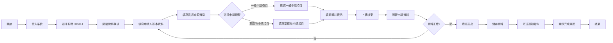
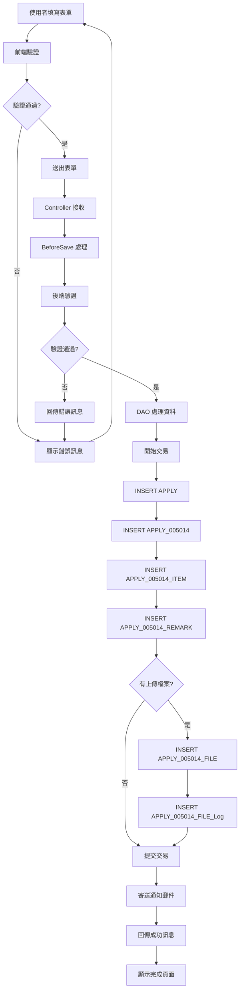
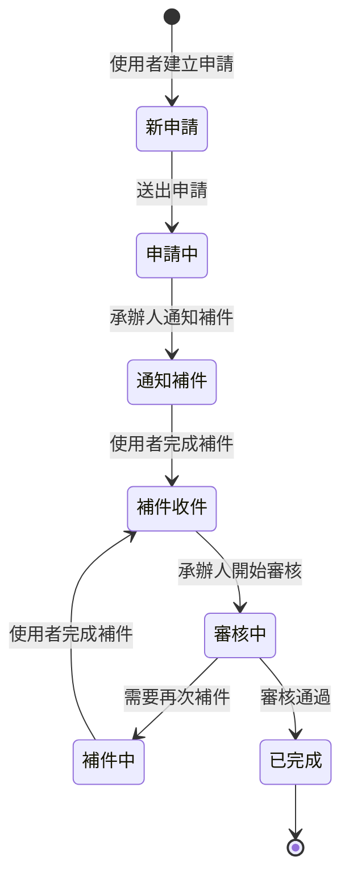

# 005014 中藥製劑相關申請 - 完整技術文件

## 服務基本資訊

| 項目           | 內容                                                           |
| -------------- | -------------------------------------------------------------- |
| 服務代碼       | 005014                                                         |
| 服務名稱       | 中藥製劑相關申請                                               |
| 服務說明       | 提供中藥材作為食品使用、中藥材萃取物作為食品原料等相關申請服務 |
| 申請對象       | 藥商、食品業者                                                 |
| 是否需繳費     | 否（免繳費）                                                   |
| 是否需登入     | 是                                                             |
| 是否需會員資格 | 是                                                             |
| 補件期限       | 7 天                                                           |
| 審核期限       | 5 天                                                           |

---

## 服務特色

### 與其他服務比較

| 特色項目     | 005014 中藥製劑相關申請                  | 005004 中藥 GMP 廠證明文件(中文) | 005005 中藥 GMP 廠證明文件(英文) | 005013 民眾少量自用中藥貨品進口 |
| ------------ | ---------------------------------------- | -------------------------------- | -------------------------------- | ------------------------------- |
| 申請對象     | 藥商、食品業者                           | 藥商                             | 藥商                             | 一般民眾                        |
| 動態網格數量 | 2 個（一般申請項目、萃取物申請項目）     | 1 個                             | 1 個                             | 2 個                            |
| 檔案上傳     | 動態檔案上傳                             | 4 個固定檔案                     | 2 個固定檔案                     | 6 個固定 + 動態                 |
| 切結書       | 2 個（中藥材作為食品使用、萃取物切結書） | 無                               | 無                               | 1 個                            |
| 備註系統     | 3 大類備註（REMARK1, REMARK2, REMARK3）  | 無                               | 無                               | 無                              |
| 補正功能     | 完整補正功能（每個欄位都有補正欄位）     | 有                               | 有                               | 有                              |
| 文件套表     | Word 文件自動套表                        | 無                               | 無                               | 無                              |
| 檔案歷程     | 檔案上傳歷程記錄                         | 無                               | 無                               | 無                              |
| 是否繳費     | 否                                       | 否                               | 否                               | 否                              |
| GMP API 整合 | 無                                       | 有                               | 有                               | 無                              |
| 英文驗證     | 無                                       | 無                               | 有                               | 無                              |

---

## 核心功能

### 1. 雙動態網格系統

- **動態網格 1：一般申請項目（ApplyItems）**

  - 適用於中藥材作為食品使用者
  - 每個項目包含 18 個欄位（含補正欄位）
  - 支援動態新增/刪除
  - 項次自動編號

- **動態網格 2：萃取物申請項目（ApplyItems2）**

  - 適用於中藥材萃取物作為食品原料者
  - 每個項目包含 18 個欄位（含補正欄位）
  - 支援動態新增/刪除
  - 項次自動編號

- **互斥規則：** 一般申請項目與萃取物申請項目擇一填寫

### 2. 三大類備註系統

- **備註 1（REMARK1）：** 中藥材作為食品使用切結書

  - 報單號碼（REMARK1_ITEM1_COMMENT）
  - 申請 H01 用途（REMARK1_ITEM2：中藥用/非中藥材用途）
  - 非中藥材用途說明（REMARK1_ITEM2_COMMENT）

- **備註 2（REMARK2）：** 萃取物（提取物）切結書

- **備註 3（REMARK3）：** 非中藥用途貨品進口
  - 食品用途（REMARK3_2_COMMENT）
  - 研發用途（REMARK3_3_COMMENT）
  - 試製用途（REMARK3_4_COMMENT）
  - 其他用途（REMARK3_5_COMMENT）

### 3. 完整補正功能

- 每個欄位都有對應的補正欄位（\_E 結尾）
- 補正欄位自動從 APPLY_NOTICE 表載入
- 補正期限為 7 天
- 補正完成後自動更新狀態為「補件收件」（FLOW_CD = 3）

### 4. 動態檔案上傳

- 支援多個檔案上傳
- 檔案上傳歷程記錄（Apply_005014_FILE_Log）
- 可選擇是否合併檔案（IS_MERGE_FILE）
- 檔案補正功能

### 5. Word 文件自動套表

- 自動產生申請單 Word 文件（apply005014_1.docx）
- 自動替換文件中的變數（如 [$YEAR], [$MONTH], [$DAY], [$APPLICANT] 等）
- 動態表格處理（申請項目表格）
- 支援預覽與下載

### 6. 郵件通知系統

- 申請完成後自動寄送通知郵件
- 補件完成後自動寄送通知郵件
- 郵件內容包含案件編號、申請人資訊等

### 7. 前後台分離架構

- 前台：使用者申請與補件
- 後台：承辦人審核與補正通知
- 前後台共用 ViewModel 基礎類別

### 8. 資料驗證

- 前端驗證：JavaScript 即時驗證
- 後端驗證：ModelState 驗證
- 業務邏輯驗證：一般申請項目與萃取物申請項目互斥驗證

---

## 系統架構

### 1. MVC 架構

```
Controller (Apply_005014Controller)
    ↓
ViewModel (Apply_005014ViewModel)
    ↓
DAO (ApplyDAO)
    ↓
Database (APPLY, APPLY_005014, APPLY_005014_ITEM, APPLY_005014_REMARK, APPLY_005014_FILE, APPLY_005014_FILE_Log)
```

### 2. 資料流

```
使用者填寫表單 → 前端驗證 → 送出表單 → Controller 接收 → 後端驗證 → DAO 處理 → 資料庫儲存 → 寄送郵件 → 回傳結果
```

---

## 資料庫結構

### 1. APPLY 表（申請主表）

| 欄位名稱     | 資料型別     | 說明               | 必填 |
| ------------ | ------------ | ------------------ | ---- |
| APP_ID       | VARCHAR(50)  | 案件編號（PK）     | 是   |
| SRV_ID       | VARCHAR(10)  | 服務代碼（005014） | 是   |
| ACC_NO       | VARCHAR(50)  | 申請人帳號         | 是   |
| NAME         | VARCHAR(100) | 公司名稱           | 是   |
| IDN          | VARCHAR(20)  | 統一編號           | 是   |
| CHR_NAME     | VARCHAR(50)  | 負責人姓名         | 否   |
| CNT_NAME     | VARCHAR(50)  | 承辦人姓名         | 是   |
| CNT_TEL      | VARCHAR(50)  | 連絡電話           | 是   |
| MOBILE       | VARCHAR(20)  | 行動電話           | 是   |
| ADDR_CODE    | VARCHAR(10)  | 地址區碼           | 是   |
| ADDR         | VARCHAR(200) | 地址               | 是   |
| FLOW_CD      | VARCHAR(2)   | 流程狀態碼         | 是   |
| APP_TIME     | DATETIME     | 申請時間           | 是   |
| APP_EXT_DATE | DATETIME     | 補件期限           | 否   |
| PRO_ACC      | VARCHAR(50)  | 承辦人員帳號       | 否   |

**流程狀態碼（FLOW_CD）：**

- 0：新申請
- 1：申請中
- 2：通知補件
- 3：補件收件
- 4：補件中

### 2. APPLY_005014 表（服務明細表）

| 欄位名稱             | 資料型別     | 說明                     | 必填 |
| -------------------- | ------------ | ------------------------ | ---- |
| APP_ID               | VARCHAR(50)  | 案件編號（PK, FK）       | 是   |
| EMAIL                | VARCHAR(100) | 電子郵件                 | 是   |
| EMAIL_E              | VARCHAR(500) | 電子郵件補正             | 否   |
| PRODUCTION_COUNTRY   | VARCHAR(10)  | 生產國別                 | 是   |
| PRODUCTION_COUNTRY_E | VARCHAR(500) | 生產國別補正             | 否   |
| SELL_COUNTRY         | VARCHAR(10)  | 賣方國家                 | 是   |
| SELL_COUNTRY_E       | VARCHAR(500) | 賣方國家補正             | 否   |
| TRANSFER_COUNTRY     | VARCHAR(10)  | 起運國家                 | 是   |
| TRANSFER_COUNTRY_E   | VARCHAR(500) | 起運國家補正             | 否   |
| TRANSFER_PORT        | VARCHAR(10)  | 起運口岸                 | 否   |
| TRANSFER_PORT_E      | VARCHAR(500) | 起運口岸補正             | 否   |
| AFF1_COMMODITIES     | VARCHAR(200) | 貨品名稱（切結書 1）     | 否   |
| AFF1_COMMODITIES_E   | VARCHAR(500) | 貨品名稱補正             | 否   |
| AFF1_QTY             | INT          | 貨品數量（切結書 1）     | 否   |
| AFF1_QTY_E           | VARCHAR(500) | 貨品數量補正             | 否   |
| AFF1_NO              | VARCHAR(100) | 報單號碼項次（切結書 1） | 否   |
| AFF1_NO_E            | VARCHAR(500) | 報單號碼項次補正         | 否   |
| AFFIDAVIT2           | VARCHAR(1)   | 萃取物切結書（Y/N）      | 否   |
| AFF2_COMMODITIES     | VARCHAR(200) | 貨品名稱（切結書 2）     | 否   |
| AFF2_COMMODITIES_E   | VARCHAR(500) | 貨品名稱補正             | 否   |
| AFF2_QTY             | INT          | 貨品數量（切結書 2）     | 否   |
| AFF2_QTY_E           | VARCHAR(500) | 貨品數量補正             | 否   |
| AFF2_NO              | VARCHAR(100) | 報單號碼項次（切結書 2） | 否   |
| AFF2_NO_E            | VARCHAR(500) | 報單號碼項次補正         | 否   |
| IS_MERGE_FILE        | VARCHAR(1)   | 是否合併檔案（Y/N）      | 否   |

### 3. APPLY_005014_ITEM 表（申請項目表）

| 欄位名稱              | 資料型別     | 說明                             | 必填 |
| --------------------- | ------------ | -------------------------------- | ---- |
| APP_ID                | VARCHAR(50)  | 案件編號（PK, FK）               | 是   |
| ITEM                  | INT          | 申請項目編號（PK）               | 是   |
| ITEM_TYPE             | INT          | 類型（1:萃取物, 2:一般, 3:其他） | 是   |
| ITEM_TYPE_ANOTHER     | VARCHAR(100) | 類型-其它                        | 否   |
| ITEM_TYPE_E           | VARCHAR(500) | 類型補正                         | 否   |
| COMMODITIES           | VARCHAR(200) | 貨名                             | 是   |
| COMMODITIES_E         | VARCHAR(500) | 貨名補正                         | 否   |
| QTY                   | VARCHAR(50)  | 申請數量                         | 是   |
| QTY_E                 | VARCHAR(500) | 申請數量補正                     | 否   |
| UNIT                  | VARCHAR(20)  | 申請數量單位                     | 是   |
| UNIT_E                | VARCHAR(500) | 單位補正                         | 否   |
| SPECQTY               | VARCHAR(50)  | 規格數量                         | 是   |
| SPECQTY_E             | VARCHAR(500) | 規格數量補正                     | 否   |
| SPECUNIT              | VARCHAR(20)  | 規格數量單位                     | 是   |
| SPECUNIT_E            | VARCHAR(500) | 規格數量單位補正                 | 否   |
| PORCTYPE              | VARCHAR(20)  | 產品類別                         | 是   |
| PORCTYPE_E            | VARCHAR(500) | 產品類別補正                     | 否   |
| COMMODTYPE            | VARCHAR(20)  | 劑型                             | 是   |
| COMMODTYPE_E          | VARCHAR(500) | 劑型補正                         | 否   |
| AFF1_EXPORT_COUNTRY   | VARCHAR(10)  | 出口國（切結書 1）               | 否   |
| AFF1_EXPORT_COUNTRY_E | VARCHAR(500) | 出口國補正                       | 否   |
| AFF1_SHEET_NO         | VARCHAR(100) | 報單號碼（切結書 1）             | 否   |
| AFF1_SHEET_NO_E       | VARCHAR(500) | 報單號碼補正                     | 否   |
| AFF1_IMPORT_COUNTRY   | VARCHAR(10)  | 進口關（切結書 1）               | 否   |
| AFF1_IMPORT_COUNTRY_E | VARCHAR(500) | 進口關補正                       | 否   |
| AFF2_EXPORT_COUNTRY   | VARCHAR(10)  | 出口國（切結書 2）               | 否   |
| AFF2_EXPORT_COUNTRY_E | VARCHAR(500) | 出口國補正                       | 否   |
| AFF2_AMOUNT_NAME      | VARCHAR(200) | 原中藥材含量名稱（切結書 2）     | 否   |
| AFF2_AMOUNT_NAME_E    | VARCHAR(500) | 原中藥材含量名稱補正             | 否   |
| AFF2_AMOUNT           | VARCHAR(50)  | 原中藥材含量數量（切結書 2）     | 否   |
| AFF2_AMOUNT_E         | VARCHAR(500) | 原中藥材含量數量補正             | 否   |
| AFF2_SHEET_NO         | VARCHAR(100) | 報單號碼（切結書 2）             | 否   |
| AFF2_SHEET_NO_E       | VARCHAR(500) | 報單號碼補正                     | 否   |
| AFF2_IMPORT_COUNTRY   | VARCHAR(10)  | 進口關（切結書 2）               | 否   |
| AFF2_IMPORT_COUNTRY_E | VARCHAR(500) | 進口關補正                       | 否   |

**ITEM_TYPE 說明：**

- 1：中藥材萃取物作為食品原料者（ApplyItems2）
- 2：中藥材作為食品使用者（ApplyItems）
- 3：其他（ApplyItems）

### 4. APPLY_005014_REMARK 表（備註表）

| 欄位名稱              | 資料型別     | 說明                                              | 必填 |
| --------------------- | ------------ | ------------------------------------------------- | ---- |
| APP_ID                | VARCHAR(50)  | 案件編號（PK, FK）                                | 是   |
| REMARK1               | VARCHAR(1)   | 備註 1（Y/N）                                     | 否   |
| REMARK1_ITEM1_COMMENT | VARCHAR(500) | 備註 1\_報單號碼                                  | 否   |
| REMARK1_ITEM2         | VARCHAR(1)   | 備註 1\_申請 H01 用途（1:中藥用, 2:非中藥材用途） | 否   |
| REMARK1_ITEM2_COMMENT | VARCHAR(500) | 備註 1\_非中藥材用途說明                          | 否   |
| REMARK1_E             | VARCHAR(500) | 備註 1 補正                                       | 否   |
| REMARK2               | VARCHAR(1)   | 備註 2（Y/N）                                     | 否   |
| REMARK2_E             | VARCHAR(500) | 備註 2 補正                                       | 否   |
| REMARK3_1             | VARCHAR(1)   | 備註 3_1（Y/N）                                   | 否   |
| REMARK3_2             | VARCHAR(1)   | 備註 3_2（1:食品, 2:研發, 3:試製, 4:其他）        | 否   |
| REMARK3_2_COMMENT     | VARCHAR(500) | 備註 3*2*食品用途說明                             | 否   |
| REMARK3_3             | VARCHAR(1)   | 備註 3_3（研發）                                  | 否   |
| REMARK3_3_COMMENT     | VARCHAR(500) | 備註 3*3*研發用途說明                             | 否   |
| REMARK3_4             | VARCHAR(1)   | 備註 3_4（試製）                                  | 否   |
| REMARK3_4_COMMENT     | VARCHAR(500) | 備註 3*4*試製用途說明                             | 否   |
| REMARK3_5             | VARCHAR(1)   | 備註 3_5（其他）                                  | 否   |
| REMARK3_5_COMMENT     | VARCHAR(500) | 備註 3*5*其他用途說明                             | 否   |
| REMARK3_E             | VARCHAR(500) | 備註 3 補正                                       | 否   |

### 5. APPLY_005014_FILE 表（附件檔案表）

| 欄位名稱  | 資料型別     | 說明               | 必填 |
| --------- | ------------ | ------------------ | ---- |
| APP_ID    | VARCHAR(50)  | 案件編號（PK, FK） | 是   |
| FILE_ID   | VARCHAR(50)  | 檔案編號（PK）     | 是   |
| FILE_NAME | VARCHAR(200) | 檔案名稱           | 是   |
| MIME      | VARCHAR(100) | 檔案類型           | 是   |
| FILE_URL  | VARCHAR(500) | 檔案路徑           | 是   |
| FILE_E    | VARCHAR(500) | 檔案補正           | 否   |

### 6. APPLY_005014_FILE_Log 表（檔案上傳歷程表）

| 欄位名稱    | 資料型別     | 說明                       | 必填 |
| ----------- | ------------ | -------------------------- | ---- |
| APP_ID      | VARCHAR(50)  | 案件編號（FK）             | 是   |
| FILE_ID     | VARCHAR(50)  | 檔案編號                   | 是   |
| FILE_NAME   | VARCHAR(200) | 檔案名稱                   | 是   |
| MIME        | VARCHAR(100) | 檔案類型                   | 是   |
| FILE_URL    | VARCHAR(500) | 檔案路徑                   | 是   |
| MODTIME     | VARCHAR(50)  | 修改時間                   | 是   |
| MODUSER     | VARCHAR(50)  | 修改人員                   | 是   |
| MODTYPE     | VARCHAR(20)  | 修改類型（新增/修改/刪除） | 是   |
| CREATE_DATE | DATETIME     | 建立時間                   | 是   |
| DEL_MK      | VARCHAR(1)   | 刪除標記                   | 否   |
| SRV_ID      | VARCHAR(10)  | 服務代碼                   | 是   |

---

## ViewModel 結構

### Apply_005014ViewModel

```csharp
public partial class Apply_005014ViewModel
{
    // 基本屬性
    public string APP_ID { get; set; }
    public Apply_005014ApplyModel Apply { get; set; }
    public Apply_005014DetailModel Detail { get; set; }

    // 動態網格
    public IList<Apply_005014_ItemExt> ApplyItems { get; set; }  // 一般申請項目
    public IList<Apply_005014_Item2Ext> ApplyItems2 { get; set; }  // 萃取物申請項目
    public string ApplyItemsJson { get; set; }
    public string ApplyItems2Json { get; set; }

    // 檔案上傳
    public IList<HttpPostedFileBase> UploadFiles { get; set; }
    public IList<Apply_005014_FILExt> FileList { get; set; }

    // 補正功能
    public IList<ErrataModel> ErrataList { get; set; }
    public IList<TblAPPLY_NOTICE> ApplyNoticeList { get; set; }
    public IList<TblAPPLY_NOTICE> CurrentNoticeList { get; set; }

    // 編輯模式
    public bool IsEditable { get; set; }

    // 地址欄位
    public string ADDR_ZIP { get; set; }
    public string ADDR_ZIP_ADDR { get; set; }
    public string ADDR_ZIP_DETAIL { get; set; }

    // 電話欄位
    public string TEL_Zip { get; set; }
    public string TEL_Phone { get; set; }
    public string TEL_Num { get; set; }
    public string TEL { get; set; }

    public string CNT_TEL_Zip { get; set; }
    public string CNT_TEL_Phone { get; set; }
    public string CNT_TEL_Num { get; set; }
    public string CNT_TEL { get; set; }

    // 行動電話
    public string MOBILE { get; set; }

    // EMAIL 欄位
    public string EMAIL_1 { get; set; }
    public string EMAIL_2 { get; set; }
    public string EMAIL_3 { get; set; }
    public string EMAIL { get; set; }
}
```

---

## 流程圖

### 1. 申請流程圖



### 2. 補件流程圖


### 3. 資料流程圖



### 4. 狀態轉換圖



---

## 技術亮點

### 1. 雙動態網格系統與互斥驗證

**實作位置：** `Apply_005014ViewModel.cs` (第 639-757 行)

**功能說明：**

- 一般申請項目（ApplyItems）與萃取物申請項目（ApplyItems2）擇一填寫
- 前端 JavaScript 控制顯示/隱藏
- 後端驗證確保互斥規則

**實作範例：**

```csharp
// 互斥驗證
if (applyitem == "1" && this.ApplyItems2 != null && this.ApplyItems2.Count > 0)
{
    if (!string.IsNullOrWhiteSpace(this.ApplyItems2.FirstOrDefault().COMMODITIES))
    {
        state.AddModelError("Detail_Remark_REMARK1_E", "一般申請項目、萃取物(提取物)項目，擇一填寫");
    }
}
else if (applyitem == "2" && this.ApplyItems != null && this.ApplyItems.Count > 1)
{
    if (!string.IsNullOrWhiteSpace(this.ApplyItems.FirstOrDefault().COMMODITIES))
    {
        state.AddModelError("Detail_Remark_REMARK1_E", "一般申請項目、萃取物(提取物)項目，擇一填寫");
    }
}
else if (applyitem == "undefined")
{
    state.AddModelError("Detail_Remark_REMARK1_E", "一般申請項目、萃取物(提取物)項目，擇一填寫");
}
if (this.ApplyItems != null && this.ApplyItems.Count > 0 && this.ApplyItems2 != null && this.ApplyItems2.Count > 0)
{
    if (!string.IsNullOrWhiteSpace(this.ApplyItems2.FirstOrDefault().COMMODITIES) && !string.IsNullOrWhiteSpace(this.ApplyItems.FirstOrDefault().COMMODITIES))
    {
        state.AddModelError("Detail_Remark_REMARK1_E", "一般申請項目、萃取物(提取物)項目，擇一填寫");
    }
}
```

### 2. 完整補正功能（每個欄位都有補正欄位）

**實作位置：** `Apply_005014ViewModel.cs` (第 231-276, 277-322 行)

**功能說明：**

- 每個欄位都有對應的補正欄位（\_E 結尾）
- 補正欄位自動從 APPLY_NOTICE 表載入
- 支援動態網格項目的補正
- 支援檔案的補正

**實作範例：**

```csharp
// 載入一般申請項目的補正欄位
public void GetApplyItemList()
{
    if (this.APP_ID != null)
    {
        ShareDAO dao = new ShareDAO();
        IList<Apply_005014_Item> itemList = dao.GetRowList(new Apply_005014_Item { APP_ID = this.APP_ID });
        IList<Apply_005014_ItemExt> extList = itemList.Where(x => x.ITEM_TYPE.TOInt32() > 1)
            .Select(x => new Apply_005014_ItemExt().InjectFrom(x) as Apply_005014_ItemExt).ToList();
        this.ApplyItems = extList;

        var noticeList = dao.GetRowList(new TblAPPLY_NOTICE { APP_ID = this.APP_ID }).OrderByDescending(x => x.FREQUENCY).ToList();
        if (noticeList != null && noticeList.Count > 0)
        {
            var maxSeq = noticeList[0].FREQUENCY;
            this.ApplyNoticeList = noticeList.Where(x => x.FREQUENCY == maxSeq).ToList();
        }

        if (this.ApplyItems != null)
        {
            foreach (var item in this.ApplyItems)
            {
                item.ITEM_TYPE_E = this.GetApplyItemNoticeField("ApplyItems_ITEM_TYPE_E", item.ITEM);
                item.COMMODITIES_E = this.GetApplyItemNoticeField("ApplyItems_COMMODITIES_E", item.ITEM);
                item.QTY_E = this.GetApplyItemNoticeField("ApplyItems_QTY_E", item.ITEM);
                item.UNIT_E = this.GetApplyItemNoticeField("ApplyItems_UNIT_E", item.ITEM);
                item.SPECQTY_E = this.GetApplyItemNoticeField("ApplyItems_SPECQTY_E", item.ITEM);
                item.SPECUNIT_E = this.GetApplyItemNoticeField("ApplyItems_SPECUNIT_E", item.ITEM);
                item.PORCTYPE_E = this.GetApplyItemNoticeField("ApplyItems_PORCTYPE_E", item.ITEM);
                item.COMMODTYPE_E = this.GetApplyItemNoticeField("ApplyItems_COMMODTYPE_E", item.ITEM);
                item.AFF1_EXPORT_COUNTRY_E = this.GetApplyItemNoticeField("ApplyItems_AFF1_EXPORT_COUNTRY_E", item.ITEM);
                item.AFF1_SHEET_NO_E = this.GetApplyItemNoticeField("ApplyItems_AFF1_SHEET_NO_E", item.ITEM);
                item.AFF1_IMPORT_COUNTRY_E = this.GetApplyItemNoticeField("ApplyItems_AFF1_IMPORT_COUNTRY_E", item.ITEM);
                item.AFF2_EXPORT_COUNTRY_E = this.GetApplyItemNoticeField("ApplyItems_AFF2_EXPORT_COUNTRY_E", item.ITEM);
                item.AFF2_AMOUNT_NAME_E = this.GetApplyItemNoticeField("ApplyItems_AFF2_AMOUNT_NAME_E", item.ITEM);
                item.AFF2_AMOUNT_E = this.GetApplyItemNoticeField("ApplyItems_AFF2_AMOUNT_E", item.ITEM);
                item.AFF2_SHEET_NO_E = this.GetApplyItemNoticeField("ApplyItems_AFF2_SHEET_NO_E", item.ITEM);
                item.AFF2_IMPORT_COUNTRY_E = this.GetApplyItemNoticeField("ApplyItems_AFF2_IMPORT_COUNTRY_E", item.ITEM);
            }
        }
    }
}

// 取得補正欄位值
private string GetApplyItemNoticeField(string filename, int? item)
{
    string result = null;
    var notice = this.ApplyNoticeList
        .Where(x => x.Field == filename && x.SRC_NO == item)
        .FirstOrDefault();

    if (notice != null)
    {
        result = notice.NOTE;
    }
    return result;
}
```

### 3. Word 文件自動套表

**實作位置：** `Apply_005014Controller.cs` (第 245-350 行)

**功能說明：**

- 使用 Xceed.Words.NET 套件
- 自動替換文件中的變數
- 動態表格處理
- 支援預覽與下載

**實作範例：**

```csharp
public void PreviewApplyForm1(Apply_005014ViewModel model)
{
    ApplyDAO dao = new ApplyDAO();
    string path = Server.MapPath("~/Sample/apply005014_1.docx");
    byte[] buffer = null;
    using (MemoryStream ms = new MemoryStream())
    {
        using (DocX doc = DocX.Load(path))
        {
            var cnt_phone = !string.IsNullOrEmpty(model.CNT_TEL_Zip) ? $"({model.CNT_TEL_Zip}){model.CNT_TEL_Phone}" : "";
            var cnt_tel = !string.IsNullOrEmpty(model.CNT_TEL_Num) ? $"{cnt_phone}#{model.CNT_TEL_Num}" : cnt_phone;

            //地址
            TblZIPCODE zip = new TblZIPCODE();
            zip.ZIP_CO = model.Apply.ADDR_ZIP;
            var address = dao.GetRow(zip);
            if (address != null && !string.IsNullOrEmpty(address.TOWNNM))
            {
                model.Apply.ADDR_ZIP_ADDR = address.CITYNM + address.TOWNNM;
                model.Apply.ADDR_ZIP_DETAIL = model.Apply.ADDR_ZIP_DETAIL.TONotNullString().Replace(address.CITYNM + address.TOWNNM, "");
            }

            // 替換文字
            doc.ReplaceText("[$YEAR]", ((DateTime.Now.Year) - 1911).TONotNullString(), false, System.Text.RegularExpressions.RegexOptions.None);
            doc.ReplaceText("[$MONTH]", (DateTime.Now.Month).TONotNullString().Length < 2 ? "0" + (DateTime.Now.Month).TONotNullString() : (DateTime.Now.Month).TONotNullString(), false, System.Text.RegularExpressions.RegexOptions.None);
            doc.ReplaceText("[$DAY]", (DateTime.Now.Day).TONotNullString(), false, System.Text.RegularExpressions.RegexOptions.None);
            doc.ReplaceText("[$APPLICANT]", model.Apply.NAME.TONotNullString(), false, System.Text.RegularExpressions.RegexOptions.None);
            doc.ReplaceText("[$IDN]", model.Apply.IDN.TONotNullString(), false, System.Text.RegularExpressions.RegexOptions.None);
            doc.ReplaceText("[$AATO]",model.Apply.ADDR_ZIP.TONotNullString()+ model.Apply.ADDR_ZIP_ADDR.TONotNullString() + model.Apply.ADDR_ZIP_DETAIL.TONotNullString() + "\n" + cnt_tel.TONotNullString(), false, System.Text.RegularExpressions.RegexOptions.None);

            // 動態表格處理
            var itemlist = new List<Hashtable>();
            var record = Convert.ToString(model.ApplyItemsJson);
            var tempFinal = (JArray)JsonConvert.DeserializeObject(record);
            int i = 0;
            foreach (var jitem in tempFinal)
            {
                // 處理動態表格項目...
            }

            doc.SaveAs(ms);
        }
        buffer = ms.ToArray();
    }

    Response.Clear();
    Response.ContentType = "application/vnd.openxmlformats-officedocument.wordprocessingml.document";
    Response.AddHeader("Content-Disposition", "attachment; filename=apply005014_1.docx");
    Response.BinaryWrite(buffer);
    Response.End();
}
```

### 4. 檔案上傳歷程記錄

**實作位置：** `Apply_005014_FILE_Log` 表

**功能說明：**

- 記錄所有檔案上傳、修改、刪除的歷程
- 包含修改時間、修改人員、修改類型
- 支援檔案版本追蹤

**資料結構：**

```csharp
public class Apply_005014_FILE_Log
{
    public string APP_ID { get; set; }
    public string FILE_ID { get; set; }
    public string MIME { get; set; }
    public string FILE_URL { get; set; }
    public string MODTIME { get; set; }
    public string MODUSER { get; set; }
    public string MODTYPE { get; set; }  // 新增/修改/刪除
    public DateTime? CREATE_DATE { get; set; }
    public string DEL_MK { get; set; }
    public string SRV_ID { get; set; }
    public string FILE_NAME { get; set; }
}
```

### 5. 三大類備註系統

**實作位置：** `Apply_005014_REMARK` 表, `Apply_005014ViewModel.cs` (第 697-731 行)

**功能說明：**

- 備註 1：中藥材作為食品使用切結書
- 備註 2：萃取物（提取物）切結書
- 備註 3：非中藥用途貨品進口（食品/研發/試製/其他）

**實作範例：**

```csharp
// 備註 1 驗證
if (remark.REMARK1 == "Y" && string.IsNullOrEmpty(remark.REMARK1_ITEM1_COMMENT))
{
    state.AddModelError("Detail_Remark_REMARK1_E", "報單號碼為必要項");
}
if (remark.REMARK1 == "Y" && string.IsNullOrEmpty(remark.REMARK1_ITEM2))
{
    state.AddModelError("Detail_Remark_REMARK1_E", "申請H01用途為必要項");
}
else if (remark.REMARK1 == "Y" && remark.REMARK1_ITEM2 == "2" && string.IsNullOrEmpty(remark.REMARK1_ITEM2_COMMENT))
{
    state.AddModelError("Detail_Remark_REMARK1_E", "申請H01非中藥材用途為必要項");
}

// 備註 3 驗證
if (remark.REMARK3_1 == "Y" && string.IsNullOrEmpty(remark.REMARK3_2))
{
    remark.REMARK3_2 = "1";
}
if (remark.REMARK3_1 == "Y")
{
    switch (remark.REMARK3_2)
    {
        case "1":
            if (string.IsNullOrEmpty(remark.REMARK3_2_COMMENT)) { state.AddModelError("Detail_Remark_REMARK1_E", "請輸入食品用途"); }
            break;
        case "2":
            if (string.IsNullOrEmpty(remark.REMARK3_3_COMMENT)) { state.AddModelError("Detail_Remark_REMARK1_E", "請輸入研發用途"); }
            break;
        case "3":
            if (string.IsNullOrEmpty(remark.REMARK3_4_COMMENT)) { state.AddModelError("Detail_Remark_REMARK1_E", "請輸入試製用途"); }
            break;
        case "4":
            if (string.IsNullOrEmpty(remark.REMARK3_5_COMMENT)) { state.AddModelError("Detail_Remark_REMARK1_E", "請輸入\"其他\"用途"); }
            break;
    }
}
```

### 6. 前後台分離架構

**實作位置：** `ES/Controllers/Apply_005014Controller.cs`, `ES/Areas/BACKMIN/Controllers/Apply_005014Controller.cs`

**功能說明：**

- 前台：使用者申請與補件
- 後台：承辦人審核與補正通知
- 前後台共用 ViewModel 基礎類別
- 後台 ViewModel 繼承前台 ViewModel 並擴充功能

**架構範例：**

```csharp
// 前台 ViewModel
namespace ES.Models.ViewModels
{
    public partial class Apply_005014ViewModel
    {
        // 基本功能
        public void GetApplyData(string appId) { ... }
        public void SaveApply(ModelStateDictionary state) { ... }
        public void Validate(ModelStateDictionary state, string applyitem = "") { ... }
    }
}

// 後台 ViewModel
namespace ES.Areas.BACKMIN.Models
{
    public partial class Apply_005014ViewModel : ES.Models.ViewModels.Apply_005014ViewModel
    {
        // 擴充功能
        public IList<TblAPPLY_NOTICE> AllNoticeList { get; set; }
        public IList<Apply_005014_FILE_Log> FileLogList { get; set; }

        public new void GetApplyData(string AppId)
        {
            base.GetApplyData(AppId);

            // 取得歷程
            ApplyDAO applyDao = new ApplyDAO();
            this.AllNoticeList = applyDao.GetRowList(new TblAPPLY_NOTICE { APP_ID = this.Apply.APP_ID })
                .OrderByDescending(x => x.FREQUENCY)
                .ToList();

            // 取得檔案上傳歷程
            this.FileLogList = applyDao
                .GetRowList(new Apply_005014_FILE_Log { APP_ID = AppId })
                .ToList();
        }

        public new void SaveApply(ModelStateDictionary state)
        {
            BackApplyDAO dao = new BackApplyDAO();

            if (!string.IsNullOrEmpty(this.Apply.APP_ID))
            {
                dao.Update_Apply005014(this);   // 儲存案件資料
                dao.SendMail_005014(this);      // 寄送郵件
            }
        }
    }
}
```

---

## 相關檔案清單

### 前端檔案

- `ES/Controllers/Apply_005014Controller.cs` (580 行) - 主要控制器
- `ES/Models/ViewModels/Apply_005014ViewModel.cs` (925 行) - ViewModel
- `ES/Views/Apply_005014/Index.cshtml` - 申請頁面
- `ES/Views/Apply_005014/Complete.cshtml` - 完成頁面
- `ES/Views/Apply_005014/CasePreview.cshtml` - 預覽頁面

### 後端檔案

- `ES/DataLayers/ApplyDAO.cs` - 資料存取層（包含 AppendApply005014, SendMail_005014, Update_Apply005014Front 方法）
- `ES/DataLayers/ShareDAO.cs` - 共用資料存取層
- `ES/Models/Entities/Apply_005014.cs` (108 行) - APPLY_005014 實體
- `ES/Models/Entities/Apply_005014_ITEM.cs` (164 行) - APPLY_005014_ITEM 實體
- `ES/Models/Entities/Apply_005014_REMARK.cs` (115 行) - APPLY_005014_REMARK 實體
- `ES/Models/Entities/Apply_005014_FILE_Log.cs` (22 行) - APPLY_005014_FILE_Log 實體
- `ES/Areas/BACKMIN/Controllers/Apply_005014Controller.cs` - 後台控制器
- `ES/Areas/BACKMIN/Models/Apply_005014ViewModel.cs` - 後台 ViewModel

### 資料庫資料表

- `SERVICE` - 服務定義表
- `APPLY` - 申請主表
- `APPLY_005014` - 服務明細表
- `APPLY_005014_ITEM` - 申請項目表（動態網格 1 & 2）
- `APPLY_005014_REMARK` - 備註表
- `APPLY_005014_FILE` - 附件檔案表
- `APPLY_005014_FILE_Log` - 檔案上傳歷程表
- `APPLY_NOTICE` - 補件通知表
- `CODE_CD` - 代碼表（產品類別、劑型、單位、國家等）
- `TblZIPCODE` - 郵遞區號表

### 範本檔案

- `Sample/apply005014_1.docx` - 申請單 Word 範本

---

**版本：** 1.0
**日期：** 2025-10-20
**作者：** 柏通股份有限公司
