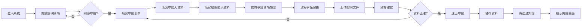
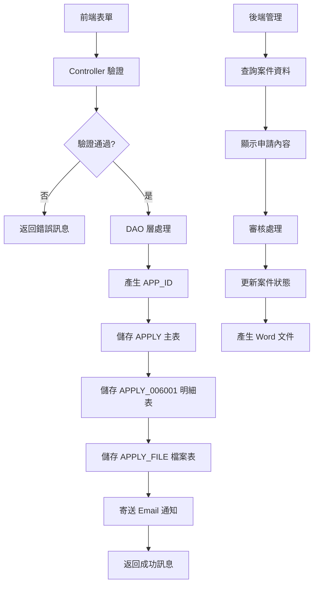
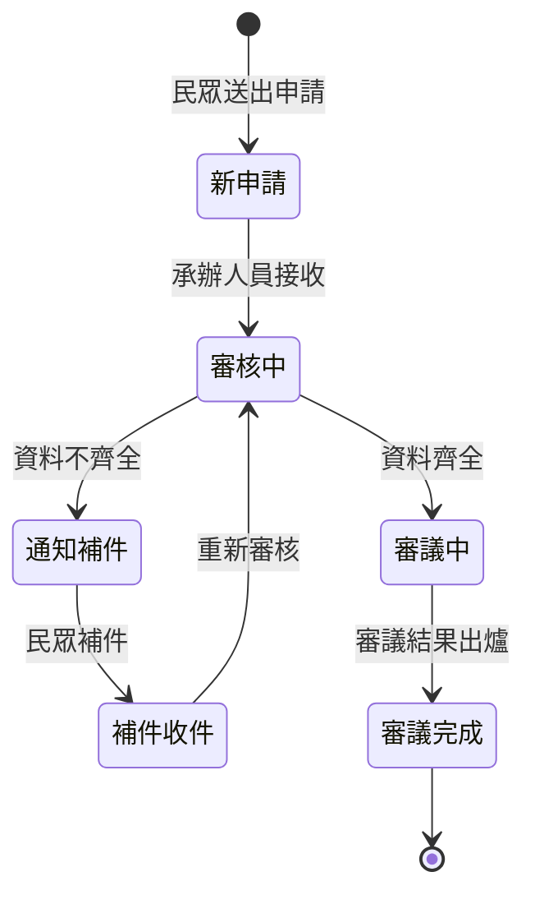

# 006001 國民年金爭議審議線上申辦 - 完整技術文件

## 服務基本資訊

| 項目             | 內容                                                     |
| ---------------- | -------------------------------------------------------- |
| **服務代碼**     | 006001                                                   |
| **服務名稱**     | 國民年金爭議審議線上申辦                                 |
| **業務單位**     | 社會保險司                                               |
| **是否需繳費**   | 否                                                       |
| **申請對象**     | 一般民眾                                                 |
| **Controller**   | `ES/Controllers/APPLY_006001Controller.cs` (474 行)      |
| **ViewModel**    | `ES/Models/ViewModels/Apply_006001ViewModel.cs` (494 行) |
| **Entity Model** | `ES/Models/Entities/APPLY_006001.cs` (97 行)             |
| **主要資料表**   | APPLY, APPLY_006001, APPLY_FILE                          |
| **動態網格數量** | 1 個（其他證明文件清單）                                 |
| **檔案數量**     | 1 個固定檔案上傳欄位 + 動態證明文件清單                  |

---

## 服務特色

### 與其他服務的差異

| 項目             | 041001 全民健保爭議審議 | 005014 中藥製劑相關申請 | **006001 國民年金爭議審議** |
| ---------------- | ----------------------- | ----------------------- | --------------------------- |
| **服務性質**     | 全民健保爭議審議        | 中藥製劑申請            | **國民年金爭議審議**        |
| **繳費方式**     | 無                      | 無                      | **無**                      |
| **動態網格**     | 無                      | 2 個                    | **1 個（證明文件清單）**    |
| **固定檔案上傳** | 1 個                    | 6 個                    | **1 個（保險核定文件）**    |
| **Word 套表**    | 有                      | 有                      | **有**                      |
| **代理人機制**   | 無                      | 無                      | **有（被保險人資料）**      |
| **複雜度**       | ⭐⭐⭐ 中               | ⭐⭐⭐⭐⭐ 極高         | **⭐⭐⭐⭐ 高**             |

### 核心功能

1. **申請人基本資料**

   - 姓名（自動帶入會員資料）
   - 出生年月日（民國年格式）
   - 身分證統一編號
   - 聯絡電話（住家電話、行動電話）
   - 通訊地址（郵遞區號 + 詳細地址）
   - EMAIL

2. **被保險人資料**

   - 是否與申請人同一人（勾選框）
   - 姓名
   - 出生年月日
   - 身分證統一編號
   - 聯絡電話（住家電話、行動電話）
   - 通訊地址（郵遞區號 + 詳細地址）

3. **爭議事項選擇**

   - 類型 1：保險核定文件（核定文號）
     - 核定文件日期
     - 核定文件字號（字 + 號）
   - 類型 2：保險繳納通知
     - 繳納年度
     - 繳納月份
     - 繳納字號

4. **爭議理由說明**

   - 收受或知悉日期
   - 爭議事項說明
   - 事實及理由（以書狀方式，另行檢附）

5. **檔案上傳管理**

   - 固定檔案：保險核定文件或繳納通知（PDF/JPG/JPEG/BMP/PNG/GIF/TIF，5MB 以下）
   - 動態檔案清單：其他證明文件（可多筆上傳）

6. **Word 文件套表功能**

   - 自動產生「國民年金爭議審議線上申辦書.docx」
   - 套印所有申請資料
   - 前端、後端皆可下載

7. **補件功能**
   - 支援補件流程
   - 補件資料查詢與顯示

---

## 系統架構

### 申請流程圖



### 補件流程圖


### 資料流程圖



### 狀態轉換圖



---

## 資料庫結構

### APPLY 主表（共用）

| 欄位名稱     | 資料型別      | 說明                   | 備註                                                             |
| ------------ | ------------- | ---------------------- | ---------------------------------------------------------------- |
| APP_ID       | varchar(20)   | 申請案件編號（PK）     | 格式：YYYYMMDD + 006001 + 流水號                                 |
| SRV_ID       | varchar(6)    | 服務代碼               | 固定值：006001                                                   |
| SRC_SRV_ID   | varchar(6)    | 來源服務代碼           | 固定值：006001                                                   |
| UNIT_CD      | int           | 業務單位代碼           | 固定值：61（國監會）                                             |
| ACC_NO       | varchar(50)   | 申請人帳號             | 會員帳號                                                         |
| NAME         | nvarchar(50)  | 申請人姓名             |                                                                  |
| ENAME        | nvarchar(100) | 申請人英文姓名         |                                                                  |
| IDN          | varchar(20)   | 申請人身分證字號       |                                                                  |
| BIRTHDAY     | datetime      | 申請人出生年月日       |                                                                  |
| SEX_CD       | varchar(1)    | 申請人性別             | M/F                                                              |
| CNT_TEL      | varchar(20)   | 申請人聯絡電話         |                                                                  |
| MOBILE       | varchar(20)   | 申請人行動電話         |                                                                  |
| ADDR_CODE    | varchar(10)   | 申請人通訊地址郵遞區號 |                                                                  |
| ADDR         | nvarchar(200) | 申請人通訊地址         |                                                                  |
| APP_TIME     | datetime      | 申請時間               | 系統自動產生                                                     |
| FLOW_CD      | varchar(2)    | 案件流程狀態           | 0:新申請, 1:審核中, 2:通知補件, 3:補件收件, 4:審議中, 5:審議完成 |
| APP_EXT_DATE | datetime      | 補件期限               |                                                                  |
| ADD_TIME     | datetime      | 新增時間               |                                                                  |
| ADD_ACC      | varchar(50)   | 新增人員帳號           |                                                                  |
| UPD_TIME     | datetime      | 更新時間               |                                                                  |
| UPD_ACC      | varchar(50)   | 更新人員帳號           |                                                                  |

### APPLY_006001 明細表

| 欄位名稱    | 資料型別      | 說明                       | 備註                   |
| ----------- | ------------- | -------------------------- | ---------------------- |
| APP_ID      | varchar(20)   | 申請案件編號（PK, FK）     | 關聯 APPLY.APP_ID      |
| EMAIL       | varchar(100)  | 申請人 EMAIL               |                        |
| ISSAME      | varchar(1)    | 被保險人是否與申請人同一人 | Y/N                    |
| R_NAME      | nvarchar(50)  | 被保險人姓名               |                        |
| R_BIRTH     | datetime      | 被保險人出生年月日         |                        |
| R_IDN       | varchar(20)   | 被保險人身分證統一編號     |                        |
| R_ADDR_CODE | varchar(10)   | 被保險人地址郵遞區號       |                        |
| R_ADDR      | nvarchar(200) | 被保險人詳細地址           |                        |
| R_MOBILE    | varchar(20)   | 被保險人行動電話           |                        |
| R_TEL       | varchar(20)   | 被保險人住家電話           |                        |
| KINDTYPE    | varchar(10)   | 爭議事項類型               | 1:核定文件, 2:繳納通知 |
| LIC_DATE    | datetime      | 核定文件日期               | KINDTYPE=1 時填寫      |
| LIC_CD      | varchar(10)   | 核定文件字號（字）         | KINDTYPE=1 時填寫      |
| LIC_NUM     | varchar(20)   | 核定文件字號（號）         | KINDTYPE=1 時填寫      |
| PAY_YEAR    | varchar(10)   | 繳納年度                   | KINDTYPE=2 時填寫      |
| PAY_MONTH   | varchar(10)   | 繳納月份                   | KINDTYPE=2 時填寫      |
| PAY_NUM     | varchar(20)   | 繳納字號                   | KINDTYPE=2 時填寫      |
| KNOW_DATE   | datetime      | 收受或知悉日期             |                        |
| KNOW_MEMO   | nvarchar(500) | 爭議事項說明               |                        |
| KNOW_FACT   | nvarchar(max) | 事實及理由                 |                        |
| DEL_MK      | varchar(1)    | 刪除註記                   | Y/N                    |
| DEL_TIME    | datetime      | 刪除時間                   |                        |
| DEL_FUN_CD  | varchar(20)   | 刪除功能代碼               |                        |
| DEL_ACC     | varchar(50)   | 刪除人員帳號               |                        |
| UPD_TIME    | datetime      | 更新時間                   |                        |
| UPD_FUN_CD  | varchar(20)   | 更新功能代碼               |                        |
| UPD_ACC     | varchar(50)   | 更新人員帳號               |                        |
| ADD_TIME    | datetime      | 新增時間                   |                        |
| ADD_FUN_CD  | varchar(20)   | 新增功能代碼               |                        |
| ADD_ACC     | varchar(50)   | 新增人員帳號               |                        |

### APPLY_FILE 檔案表（共用）

| 欄位名稱     | 資料型別      | 說明                   | 備註                         |
| ------------ | ------------- | ---------------------- | ---------------------------- |
| APP_ID       | varchar(20)   | 申請案件編號（PK, FK） | 關聯 APPLY.APP_ID            |
| FILE_NO      | int           | 檔案編號（PK）         | 1:核定文件, 2~N:其他證明文件 |
| SRC_NO       | int           | 來源編號               |                              |
| FILENAME     | varchar(200)  | 儲存檔案名稱           | 系統產生的檔案名稱           |
| SRC_FILENAME | nvarchar(200) | 原始檔案名稱           | 使用者上傳的檔案名稱         |
| MIME         | varchar(100)  | 檔案 MIME 類型         |                              |
| FILE_SIZE    | bigint        | 檔案大小（bytes）      |                              |
| ADD_TIME     | datetime      | 新增時間               |                              |
| ADD_ACC      | varchar(50)   | 新增人員帳號           |                              |

---

## ViewModel 結構

### Apply_006001ViewModel

```csharp
public class Apply_006001ViewModel
{
    // 申請表單
    public Apply_006001FormModel Form { get; set; }

    // 補件表單
    public Apply_006001AppDocModel AppDoc { get; set; }
}
```

### Apply_006001FormModel（繼承 ApplyModel）

```csharp
public class Apply_006001FormModel : ApplyModel
{
    // === 申請人基本資料 ===
    [Display(Name = "申辦日期")]
    public string APP_DATE { get; set; }

    [Display(Name = "申請人E-MAIL")]
    [Required]
    public string EMAIL { get; set; }

    [Display(Name = "申請人姓名")]
    [Required]
    public string NAME { get; set; }

    [Display(Name = "申請人出生年月日")]
    public string BIRTHDAY_STR { get; set; }

    [Display(Name = "申請人身分證統一編號")]
    [Required]
    public string IDN { get; set; }

    [Display(Name = "申請人住家電話")]
    public string H_TEL { get; set; }

    [Display(Name = "申請人行動電話")]
    public string MOBILE { get; set; }

    [Display(Name = "申請人通訊地址(含郵遞區號)")]
    [Required]
    public string C_ZIPCODE { get; set; }

    public string C_ZIPCODE_TEXT { get; set; }
    public string C_ADDR { get; set; }

    // === 被保險人資料 ===
    [Display(Name = "同上欄(即被保險人與申請人為同一人)")]
    public string ISSAME { get; set; }
    public bool ISSAME_CHK { get; set; }

    [Display(Name = "被保險人姓名")]
    public string R_NAME { get; set; }

    [Display(Name = "被保險人出生年月日")]
    public string R_BIRTH_STR { get; set; }

    [Display(Name = "被保險人身分證統一編號")]
    public string R_IDN { get; set; }

    [Display(Name = "被保險人住家電話")]
    public string R_TEL { get; set; }

    [Display(Name = "被保險人行動電話")]
    public string R_MOBILE { get; set; }

    [Display(Name = "被保險人地址(含郵遞區號)")]
    public string R_ZIPCODE { get; set; }

    public string R_ZIPCODE_TEXT { get; set; }
    public string R_ADDR { get; set; }

    // === 爭議事項 ===
    [Display(Name = "爭議事項,保險核定文件(核定文號)")]
    public string KINDTYPE { get; set; }
    public bool KIND1_CHK { get; set; }  // 核定文件
    public bool KIND2_CHK { get; set; }  // 繳納通知

    // 核定文件資訊
    public DateTime? LIC_DATE { get; set; }
    public string LIC_DATE_STR { get; set; }
    public string LIC_CD { get; set; }    // 字
    public string LIC_NUM { get; set; }   // 號

    // 繳納通知資訊
    public string PAY_YEAR { get; set; }
    public string PAY_MONTH { get; set; }
    public string PAY_NUM { get; set; }

    // === 爭議理由 ===
    public DateTime? KNOW_DATE { get; set; }

    [Display(Name = "收受或知悉日期")]
    public string KNOW_DATE_STR { get; set; }

    [Display(Name = "爭議事項")]
    public string KNOW_MEMO { get; set; }

    [Display(Name = "事實及理由(以書狀方式,另行檢附)")]
    public string KNOW_FACT { get; set; }

    [Display(Name = "是否合併審議")]
    public string IS_MERGE { get; set; }

    // === 檔案上傳 ===
    [Display(Name = "保險核定文件或繳納通知")]
    [Control(Mode = Control.FileUpload, LimitFileType = "1", MaxFileSize = "5",
             UploadDesc = "(檔案大小5MB以下,可以上傳檔名為PDF、JPG、JPEG、BMP、PNG、GIF、TIF)")]
    public HttpPostedFileBase FILE_1 { get; set; }

    public string FILE_1_FILENAME { get; set; }

    [Control(Mode = Control.Hidden)]
    public string FILE_1_TEXT { get; set; }

    public string FILE_1_MIME
    {
        get
        {
            string ret = null;
            if (this.FILE_1 != null)
            {
                ret = this.FILE_1.ContentType;
            }
            return ret;
        }
    }

    // === 其他證明文件清單（動態） ===
    public IList<Apply_006001SRVLSTModel> SRVLIST { get; set; }
}
```

### Apply_006001SRVLSTModel（繼承 Apply_FileModel）

```csharp
public class Apply_006001SRVLSTModel : Apply_FileModel
{
    public string SEQ_NO { get; set; }

    [Display(Name = "其他")]
    public HttpPostedFileBase FILE_2 { get; set; }
    public string FILE_2_TEXT { get; set; }
}
```

### Apply_006001AppDocModel（補件用，繼承 ApplyModel）

```csharp
public class Apply_006001AppDocModel : ApplyModel
{
    // 結構與 Apply_006001FormModel 相同
    // 用於補件流程

    // 申請人基本資料
    public string APP_DATE { get; set; }
    public string EMAIL { get; set; }
    public string NAME { get; set; }
    public string BIRTHDAY_STR { get; set; }
    public string IDN { get; set; }
    public string H_TEL { get; set; }
    public string MOBILE { get; set; }
    public string C_ZIPCODE { get; set; }
    public string C_ZIPCODE_TEXT { get; set; }
    public string C_ADDR { get; set; }

    // 被保險人資料
    public string ISSAME { get; set; }
    public bool ISSAME_CHK { get; set; }
    public string R_NAME { get; set; }
    public string R_BIRTH_STR { get; set; }
    public string R_IDN { get; set; }
    public string R_TEL { get; set; }
    public string R_MOBILE { get; set; }
    public string R_ZIPCODE { get; set; }
    public string R_ZIPCODE_TEXT { get; set; }
    public string R_ADDR { get; set; }

    // 爭議事項
    public string KINDTYPE { get; set; }
    public bool KIND1_CHK { get; set; }
    public bool KIND2_CHK { get; set; }
    public DateTime? LIC_DATE { get; set; }
    public string LIC_DATE_STR { get; set; }
    public string LIC_CD { get; set; }
    public string LIC_NUM { get; set; }
    public string PAY_YEAR { get; set; }
    public string PAY_MONTH { get; set; }
    public string PAY_NUM { get; set; }

    // 爭議理由
    public DateTime? KNOW_DATE { get; set; }
    public string KNOW_DATE_STR { get; set; }
    public string KNOW_MEMO { get; set; }
    public string KNOW_FACT { get; set; }
    public string IS_MERGE { get; set; }

    // 檔案
    public HttpPostedFileBase FILE_1 { get; set; }
    public string FILE_1_FILENAME { get; set; }
    public string FILE_1_TEXT { get; set; }

    // 其他證明文件清單
    public IList<Apply_006001SRVLSTModel> SRVLIST { get; set; }

    // 已上傳檔案清單
    public IList<Apply_006001FILEModel> FILE { get; set; }
}
```

### Apply_006001DoneModel

```csharp
public class Apply_006001DoneModel
{
    // 完成狀態
    public string status { get; set; }

    // 數量
    public string Count { get; set; }
}
```

---

## Controller 方法說明

### APPLY_006001Controller（前端）

#### 1. Prompt() - 顯示說明事項

```csharp
[HttpGet]
public ActionResult Prompt()
{
    SessionModel sm = SessionModel.Get();
    string s_msg_1A = "請先閱讀 「{0}說明事項」點選同意後，再進入申辦頁面 !";
    sm.LastErrorMessage = string.Format(s_msg_1A, s_SRV_NAME);
    return View("Prompt");
}
```

**功能說明：**

- 顯示服務說明事項頁面
- 要求使用者閱讀並同意後才能進入申辦

#### 2. Apply(string agree) - 空白表單畫面

```csharp
public ActionResult Apply(string agree)
{
    SessionModel sm = SessionModel.Get();
    Apply_006001FormModel model = new Apply_006001FormModel();
    ActionResult rtn = View("Index", model);
    var UsIn = sm.UserInfo.Member;

    if (UsIn != null)
    {
        // 帶入帳號資訊
        model.ACC_NO = UsIn.ACC_NO;
        model.H_TEL = UsIn.TEL;
        model.TEL = UsIn.TEL;
        model.MOBILE = UsIn.MOBILE;
        model.C_ZIPCODE = UsIn.CITY_CD;
        model.C_ADDR = UsIn.ADDR;
        model.NAME = UsIn.NAME;
        model.ENAME = UsIn.ENAME;
        model.EMAIL = UsIn.MAIL;
        model.IDN = UsIn.IDN;
        model.BIRTHDAY = UsIn.BIRTHDAY;
        model.BIRTHDAY_STR = HelperUtil.DateTimeToTwString(UsIn.BIRTHDAY);
        model.SEX_CD = UsIn.SEX_CD;
        model.APP_DATE = HelperUtil.DateTimeToTwString(DateTime.Now);
    }
    else
        rtn = RedirectToAction("Index", "Login");

    // agree: 1:同意新增 /other:請先閱讀規章
    if (string.IsNullOrEmpty(agree)) { agree = "0"; }
    if (agree != null && !agree.Equals("1")) { return Prompt(); }

    return rtn;
}
```

**功能說明：**

- 檢查使用者是否已登入
- 自動帶入會員基本資料（姓名、身分證、地址、電話、EMAIL 等）
- 檢查是否同意說明事項（agree=1）

#### 3. Apply(Apply_006001FormModel model) - 表單驗證

```csharp
[HttpPost]
public ActionResult Apply(Apply_006001FormModel model)
{
    var result = new AjaxResultStruct();
    ApplyDAO dao = new ApplyDAO();
    string ErrorMsg = dao.ChkApply006001(model);

    if (ModelState.IsValid)
    {
        ModelState.Clear();

        if (ErrorMsg == "")
        {
            result.status = true;
            result.message = "";
        }
        else
        {
            result.status = false;
            result.message = ErrorMsg;
        }
    }
    else
    {
        result.status = false;
        foreach (var item in ModelState.Values)
        {
            if (item.Errors.ToCount() > 0)
            {
                ErrorMsg = ErrorMsg + item.Errors[0].ErrorMessage + "\r\n";
            }
        }
        result.message = ErrorMsg;
    }
    return Content(result.Serialize(), "application/json");
}
```

**功能說明：**

- 接收前端送出的表單資料
- 執行 ModelState 驗證
- 執行自訂驗證（ChkApply006001）
- 返回 JSON 格式的驗證結果

#### 4. PreView(Apply_006001FormModel model) - 預覽畫面

```csharp
[HttpPost]
public ActionResult PreView(Apply_006001FormModel model)
{
    ApplyDAO dao = new ApplyDAO();
    return PartialView("PreView", model);
}
```

**功能說明：**

- 顯示申請資料預覽畫面
- 讓使用者確認資料正確性

#### 5. Save(Apply_006001FormModel model) - 儲存申請

```csharp
[HttpPost]
public ActionResult Save(Apply_006001FormModel model)
{
    SessionModel sm = SessionModel.Get();
    ApplyDAO dao = new ApplyDAO();
    var app_id = string.Empty;
    var memberName = string.IsNullOrWhiteSpace(model.NAME) ?
                     sm.UserInfo.Member.NAME : model.NAME;
    var memberEmail = string.IsNullOrWhiteSpace(model.EMAIL) ?
                      sm.UserInfo.Member.MAIL : model.EMAIL;

    // 存檔
    app_id = dao.AppendApply006001(model);

    // 寄信
    dao.SendMail_New(memberName, memberEmail, app_id, s_SRV_NAME, s_SRV_ID);

    return Done("1");
}
```

**功能說明：**

- 儲存申請資料到資料庫
- 產生申請案件編號（APP_ID）
- 寄送申請成功通知信
- 導向完成頁面

#### 6. AppDoc(string APP_ID) - 補件畫面

```csharp
public ActionResult AppDoc(string APP_ID)
{
    ApplyDAO dao = new ApplyDAO();
    SessionModel sm = SessionModel.Get();
    Apply_006001AppDocModel model = new Apply_006001AppDocModel();

    // 案件基本資訊
    TblAPPLY_006001 app = new TblAPPLY_006001();
    app.APP_ID = APP_ID;
    var appdata = dao.GetRow(app);

    ApplyModel aly = new ApplyModel();
    aly.APP_ID = APP_ID;
    var alydata = dao.GetRow(aly);

    try
    {
        var UsIn = sm.UserInfo.Member;

        // 取檔案
        model = dao.GetFile_006001(APP_ID);
        model.SRVLIST = new List<Apply_006001SRVLSTModel>();

        if (model.FILE.Count > 0)
        {
            foreach (var item in model.FILE)
            {
                var insert_data = new Apply_006001SRVLSTModel();
                insert_data.InjectFrom(item);
                insert_data.FILE_2_TEXT = item.SRC_FILENAME;
                insert_data.FILE_NO = item.FILE_NO;
                insert_data.SRC_NO = item.SRC_NO;
                model.SRVLIST.Add(insert_data);
            }
        }

        // 處理完資料帶出顯示
        model.InjectFrom(appdata);
        model.InjectFrom(alydata);

        model.APP_DATE = HelperUtil.DateTimeToString(alydata.ADD_TIME);
        model.NAME = alydata.NAME;
        model.BIRTHDAY_STR = HelperUtil.DateTimeToTwString(alydata.BIRTHDAY);
        model.IDN = alydata.IDN;
        model.EMAIL = appdata.EMAIL;
        model.MOBILE = alydata.MOBILE;
        model.H_TEL = alydata.CNT_TEL;

        // 申請人通訊地址
        TblZIPCODE zip = new TblZIPCODE();
        zip.ZIP_CO = alydata.ADDR_CODE;
        var zipdata = dao.GetRow(zip);
        model.C_ZIPCODE = alydata.ADDR_CODE;
        model.C_ZIPCODE_TEXT = zipdata.CITYNM + zipdata.TOWNNM;
        model.C_ADDR = alydata.ADDR;

        // 被保險人通訊地址
        TblZIPCODE zipr = new TblZIPCODE();
        zipr.ZIP_CO = appdata.R_ADDR_CODE;
        var zipdatar = dao.GetRow(zipr);
        model.R_ZIPCODE = appdata.R_ADDR_CODE;
        model.R_ZIPCODE_TEXT = zipdatar.CITYNM + zipdatar.TOWNNM;
        model.R_ADDR = appdata.R_ADDR;

        // 申請說明
        model.ISSAME = appdata.ISSAME;
        model.ISSAME_CHK = appdata.ISSAME == "Y" ? true : false;
        model.R_NAME = appdata.R_NAME;
        model.R_BIRTH_STR = HelperUtil.DateTimeToString(appdata.R_BIRTH);
        model.R_IDN = appdata.R_IDN;
        model.R_TEL = appdata.R_TEL;
        model.R_MOBILE = appdata.R_MOBILE;
        model.KINDTYPE = appdata.KINDTYPE;
        model.KIND1_CHK = appdata.KINDTYPE.Contains("1") ? true : false;
        model.KIND2_CHK = appdata.KINDTYPE.Contains("2") ? true : false;
        model.LIC_DATE_STR = HelperUtil.DateTimeToString(appdata.LIC_DATE);
        model.LIC_CD = appdata.LIC_CD;
        model.LIC_NUM = appdata.LIC_NUM;
        model.PAY_YEAR = appdata.PAY_YEAR;
        model.PAY_MONTH = appdata.PAY_MONTH;
        model.PAY_NUM = appdata.PAY_NUM;
        model.KNOW_DATE_STR = HelperUtil.DateTimeToString(appdata.KNOW_DATE);
        model.KNOW_MEMO = appdata.KNOW_MEMO;
        model.KNOW_FACT = appdata.KNOW_FACT;

        return View("AppDoc", model);
    }
    catch (Exception ex)
    {
        sm.LastErrorMessage = ex.Message;
        logger.Error(ex.Message, ex);
        return RedirectToAction("Index", "History");
    }
}
```

**功能說明：**

- 查詢原申請案件資料
- 顯示原申請內容
- 提供補件上傳功能
- 處理地址郵遞區號轉換

#### 7. Done(string status, string Count) - 完成畫面

```csharp
public ActionResult Done(string status, string Count = "")
{
    SessionModel sm = SessionModel.Get();
    Apply_006001DoneModel model = new Apply_006001DoneModel();
    model.status = status.TONotNullString();
    model.Count = Count.TONotNullString();

    return View("Done", model);
}
```

**功能說明：**

- 顯示申請完成畫面
- status: 1=成功, 其他=失敗

#### 8. PrintDoc(string APP_ID) - 套印申請書

```csharp
public void PrintDoc(string APP_ID)
{
    ApplyDAO dao = new ApplyDAO();
    string path = Server.MapPath("~/Sample/apply006001.docx");
    var filesStr = string.Empty;
    byte[] buffer = null;
    Apply_006001AppDocModel model = new Apply_006001AppDocModel();
    model.APP_ID = APP_ID;

    // 案件基本資訊
    TblAPPLY_006001 app = new TblAPPLY_006001();
    app.APP_ID = APP_ID;
    var appdata = dao.GetRow(app);

    ApplyModel aly = new ApplyModel();
    aly.APP_ID = APP_ID;
    var alydata = dao.GetRow(aly);

    try
    {
        // 取檔案
        model = dao.GetFile_006001(APP_ID);
        model.SRVLIST = new List<Apply_006001SRVLSTModel>();

        if (model.FILE.Count > 0)
        {
            foreach (var item in model.FILE)
            {
                filesStr += item.SRC_FILENAME + ",";
            }
        }

        // 處理完資料帶出顯示
        model.InjectFrom(appdata);
        model.InjectFrom(alydata);

        model.SEX_CD = alydata.SEX_CD;
        model.APP_DATE = HelperUtil.TransToTwYear(alydata.ADD_TIME);
        model.BIRTHDAY_STR = HelperUtil.TransToTwYear(alydata.BIRTHDAY);

        if (appdata.R_BIRTH != null)
        {
            model.R_BIRTH_STR = HelperUtil.TransToTwYear(appdata.R_BIRTH);
        }

        if (appdata.KNOW_DATE != null)
        {
            model.KNOW_DATE_STR = HelperUtil.TransToTwYear(appdata.KNOW_DATE);
        }

        if (appdata.LIC_DATE != null)
        {
            model.LIC_DATE_STR = HelperUtil.TransToTwYear(appdata.LIC_DATE);
        }

        // 申請人通訊地址
        TblZIPCODE zip = new TblZIPCODE();
        zip.ZIP_CO = alydata.ADDR_CODE;
        var zipdata = dao.GetRow(zip);
        model.C_ZIPCODE = alydata.ADDR_CODE;
        model.C_ZIPCODE_TEXT = zipdata.CITYNM + zipdata.TOWNNM;
        model.C_ADDR = alydata.ADDR;

        // 被保險人通訊地址
        TblZIPCODE zipr = new TblZIPCODE();
        zipr.ZIP_CO = appdata.R_ADDR_CODE;
        var zipdatar = dao.GetRow(zipr);
        model.R_ZIPCODE = appdata.R_ADDR_CODE;
        model.R_ZIPCODE_TEXT = zipdatar.CITYNM + zipdatar.TOWNNM;
        model.R_ADDR = appdata.R_ADDR;
    }
    catch (Exception ex)
    {
        logger.Error(ex.Message, ex);
    }

    using (MemoryStream ms = new MemoryStream())
    {
        using (DocX doc = DocX.Load(path))
        {
            // 申請人
            doc.ReplaceText("$ANAME$", alydata.NAME.TONotNullString());
            doc.ReplaceText("$BYEAR$", model.BIRTHDAY_STR.Split('/')[0]);
            doc.ReplaceText("$BMONTH$", model.BIRTHDAY_STR.Split('/')[1]);
            doc.ReplaceText("$BDAY$", model.BIRTHDAY_STR.Split('/')[2]);
            doc.ReplaceText("$AIDN$", alydata.IDN.TONotNullString());
            doc.ReplaceText("$AADDRCODE$", alydata.ADDR_CODE.TONotNullString() + " " + model.C_ZIPCODE_TEXT.TONotNullString());
            doc.ReplaceText("$AADDR$", alydata.ADDR.TONotNullString());
            doc.ReplaceText("$AMOBILE$", alydata.MOBILE.TONotNullString());
            doc.ReplaceText("$ATEL$", alydata.CNT_TEL.TONotNullString());

            // 被保險人
            doc.ReplaceText("$ISSAME$", appdata.ISSAME == "Y" ? "█" : "□");
            doc.ReplaceText("$RNAME$", appdata.R_NAME.TONotNullString());

            if (!string.IsNullOrEmpty(model.R_BIRTH_STR))
            {
                doc.ReplaceText("$RYEAR$", model.R_BIRTH_STR.Split('/')[0]);
                doc.ReplaceText("$RMONTH$", model.R_BIRTH_STR.Split('/')[1]);
                doc.ReplaceText("$RDAY$", model.R_BIRTH_STR.Split('/')[2]);
            }
            else
            {
                doc.ReplaceText("$RYEAR$", "");
                doc.ReplaceText("$RMONTH$", "");
                doc.ReplaceText("$RDAY$", "");
            }

            doc.ReplaceText("$RIDN$", appdata.R_IDN.TONotNullString());
            doc.ReplaceText("$RADDRCODE$", appdata.R_ADDR.TONotNullString() == "" ? "" : appdata.R_ADDR_CODE.TONotNullString() + " " + model.R_ZIPCODE_TEXT.TONotNullString());
            doc.ReplaceText("$RADDR$", appdata.R_ADDR.TONotNullString());
            doc.ReplaceText("$RMOBILE$", appdata.R_MOBILE.TONotNullString());
            doc.ReplaceText("$RTEL$", appdata.R_TEL.TONotNullString());

            // 申請內容
            doc.ReplaceText("$KIND1$", appdata.KINDTYPE.Contains("1") ? "█" : "□");

            if (appdata.KINDTYPE.Contains("1"))
            {
                doc.ReplaceText("$LYEAR$", model.LIC_DATE_STR.Split('/')[0]);
                doc.ReplaceText("$LMONTH$", model.LIC_DATE_STR.Split('/')[1]);
                doc.ReplaceText("$LDAY$", model.LIC_DATE_STR.Split('/')[2]);
                doc.ReplaceText("$LICCD$", appdata.LIC_CD.TONotNullString());
                doc.ReplaceText("$LICNUM$", appdata.LIC_NUM.TONotNullString());
            }
            else
            {
                doc.ReplaceText("$LYEAR$", "");
                doc.ReplaceText("$LMONTH$", "");
                doc.ReplaceText("$LDAY$", "");
                doc.ReplaceText("$LICCD$", "");
                doc.ReplaceText("$LICNUM$", "");
            }

            doc.ReplaceText("$KIND2$", appdata.KINDTYPE.Contains("2") ? "█" : "□");

            if (appdata.KINDTYPE.Contains("2"))
            {
                doc.ReplaceText("$PYEAR$", appdata.PAY_YEAR.TONotNullString());
                doc.ReplaceText("$PMONTH$", appdata.PAY_MONTH.TONotNullString());
                doc.ReplaceText("$PNUM$", appdata.PAY_NUM.TONotNullString());
            }
            else
            {
                doc.ReplaceText("$PYEAR$", "");
                doc.ReplaceText("$PMONTH$", "");
                doc.ReplaceText("$PNUM$", "");
            }

            if (appdata.KNOW_DATE != null)
            {
                doc.ReplaceText("$KYEAR$", model.KNOW_DATE_STR.Split('/')[0]);
                doc.ReplaceText("$KMONTH$", model.KNOW_DATE_STR.Split('/')[1]);
                doc.ReplaceText("$KDAY$", model.KNOW_DATE_STR.Split('/')[2]);
            }
            else
            {
                doc.ReplaceText("$KYEAR$", "");
                doc.ReplaceText("$KMONTH$", "");
                doc.ReplaceText("$KDAY$", "");
            }

            doc.ReplaceText("$KNOWMEMO$", appdata.KNOW_MEMO.TONotNullString());
            doc.ReplaceText("$KNOWFACT$", appdata.KNOW_FACT.TONotNullString());
            doc.ReplaceText("$FILES$", filesStr.TONotNullString());
            doc.ReplaceText("$AYEAR$", model.APP_DATE.Split('/')[0]);
            doc.ReplaceText("$AMONTH$", model.APP_DATE.Split('/')[1]);
            doc.ReplaceText("$ADAY$", model.APP_DATE.Split('/')[2]);
            doc.ReplaceText("$ANAME2$", alydata.NAME.TONotNullString());

            doc.SaveAs(ms);
        }
        buffer = ms.ToArray();
    }

    Response.ClearContent();
    Response.ClearHeaders();
    Response.ContentType = "Application/msword";
    Response.AddHeader("Content-Disposition", "attachment; filename=國民年金爭議審議線上申辦書.docx");
    Response.BinaryWrite(buffer);
    Response.OutputStream.Flush();
    Response.OutputStream.Close();
    Response.Flush();
    Response.End();
}
```

**功能說明：**

- 載入 Word 範本檔案（~/Sample/apply006001.docx）
- 套印所有申請資料到 Word 文件
- 處理日期格式轉換（民國年）
- 處理勾選框顯示（█ 或 □）
- 產生 Word 檔案供下載

---

## DAO 方法說明

### ApplyDAO.ChkApply006001(Apply_006001FormModel form)

```csharp
public string ChkApply006001(Apply_006001FormModel form)
{
    string Msg = "";

    // 申請人資料驗證
    if (string.IsNullOrWhiteSpace(form.C_ADDR))
    {
        Msg += "申請人詳細地址 請填寫\n";
    }

    if (string.IsNullOrWhiteSpace(form.MOBILE) && string.IsNullOrWhiteSpace(form.H_TEL))
    {
        Msg += "申請人電話、行動電話請擇一填寫\n";
    }

    // 被保險人資料驗證
    if (string.IsNullOrWhiteSpace(form.R_NAME))
    {
        Msg += "被保險人姓名 請填寫\n";
    }

    if (string.IsNullOrWhiteSpace(form.R_BIRTH_STR))
    {
        Msg += "被保險人出生年月日 請填寫\n";
    }

    if (string.IsNullOrWhiteSpace(form.R_IDN))
    {
        Msg += "被保險人身分證統一編號 請填寫\n";
    }

    if (string.IsNullOrWhiteSpace(form.R_ADDR))
    {
        Msg += "被保險人詳細地址 請填寫\n";
    }

    // 爭議事項驗證
    if (string.IsNullOrWhiteSpace(form.KINDTYPE))
    {
        Msg += "爭議事項類型 請選擇\n";
    }
    else
    {
        if (form.KINDTYPE.Contains("1"))
        {
            if (string.IsNullOrWhiteSpace(form.LIC_DATE_STR))
            {
                Msg += "核定文件日期 請填寫\n";
            }
            if (string.IsNullOrWhiteSpace(form.LIC_CD))
            {
                Msg += "核定文件字號(字) 請填寫\n";
            }
            if (string.IsNullOrWhiteSpace(form.LIC_NUM))
            {
                Msg += "核定文件字號(號) 請填寫\n";
            }
        }

        if (form.KINDTYPE.Contains("2"))
        {
            if (string.IsNullOrWhiteSpace(form.PAY_YEAR))
            {
                Msg += "繳納年度 請填寫\n";
            }
            if (string.IsNullOrWhiteSpace(form.PAY_MONTH))
            {
                Msg += "繳納月份 請填寫\n";
            }
            if (string.IsNullOrWhiteSpace(form.PAY_NUM))
            {
                Msg += "繳納字號 請填寫\n";
            }
        }
    }

    if (string.IsNullOrWhiteSpace(form.KNOW_DATE_STR))
    {
        Msg += "收受或知悉日期 請填寫\n";
    }

    if (string.IsNullOrWhiteSpace(form.KNOW_MEMO))
    {
        Msg += "爭議事項說明 請填寫\n";
    }

    if (string.IsNullOrWhiteSpace(form.KNOW_FACT))
    {
        Msg += "事實及理由 請填寫\n";
    }

    // 檔案驗證
    if (form.FILE_1 == null && string.IsNullOrWhiteSpace(form.FILE_1_TEXT))
    {
        Msg += "保險核定文件或繳納通知 請上傳\n";
    }

    return Msg;
}
```

**功能說明：**

- 驗證申請人必填欄位
- 驗證被保險人必填欄位
- 驗證爭議事項類型及相關欄位
- 驗證檔案上傳
- 返回錯誤訊息字串

### ApplyDAO.AppendApply006001(Apply_006001FormModel form)

```csharp
public string AppendApply006001(Apply_006001FormModel form)
{
    SessionModel sm = SessionModel.Get();
    ShareDAO dao = new ShareDAO();
    ClamMember UserInfo = sm.UserInfo.Member;
    var CaseNum = "006001";
    var APP_ID = GetApp_ID(CaseNum);

    using (SqlConnection conn = DataUtils.GetConnection())
    {
        conn.Open();
        SqlTransaction tran = conn.BeginTransaction();

        try
        {
            this.Tran(conn, tran);

            // Insert APPLY 主表
            ApplyModel where = new ApplyModel();
            where.InjectFrom(form);
            where.APP_ID = APP_ID;
            where.SRV_ID = CaseNum;
            where.SRC_SRV_ID = CaseNum;
            where.UNIT_CD = 61;  // 國監會
            where.ACC_NO = UserInfo.ACC_NO.TONotNullString();
            where.ADD_ACC = UserInfo.ACC_NO.TONotNullString();
            where.BIRTHDAY = HelperUtil.TransTwToDateTime(form.BIRTHDAY_STR);
            where.CNT_TEL = form.H_TEL;
            where.MOBILE = form.MOBILE;
            where.ADDR_CODE = form.C_ZIPCODE;
            where.ADDR = form.C_ADDR;
            where.APP_TIME = DateTime.Now;
            where.ADD_TIME = DateTime.Now;
            where.FLOW_CD = "1";  // 審核中

            this.Insert(where);

            // Insert APPLY_006001 明細表
            TblAPPLY_006001 data = new TblAPPLY_006001();
            data.APP_ID = APP_ID;
            data.EMAIL = form.EMAIL;
            data.ISSAME = form.ISSAME;
            data.R_NAME = form.R_NAME;
            data.R_BIRTH = HelperUtil.TransTwToDateTime(form.R_BIRTH_STR);
            data.R_IDN = form.R_IDN;
            data.R_ADDR_CODE = form.R_ZIPCODE;
            data.R_ADDR = form.R_ADDR;
            data.R_MOBILE = form.R_MOBILE;
            data.R_TEL = form.R_TEL;
            data.KINDTYPE = form.KINDTYPE;
            data.LIC_DATE = HelperUtil.TransTwToDateTime(form.LIC_DATE_STR);
            data.LIC_CD = form.LIC_CD;
            data.LIC_NUM = form.LIC_NUM;
            data.PAY_YEAR = form.PAY_YEAR;
            data.PAY_MONTH = form.PAY_MONTH;
            data.PAY_NUM = form.PAY_NUM;
            data.KNOW_DATE = HelperUtil.TransTwToDateTime(form.KNOW_DATE_STR);
            data.KNOW_MEMO = form.KNOW_MEMO;
            data.KNOW_FACT = form.KNOW_FACT;
            data.ADD_TIME = DateTime.Now;
            data.ADD_ACC = UserInfo.ACC_NO.TONotNullString();
            data.ADD_FUN_CD = "APPLY_006001";

            this.Insert(data);

            // Insert APPLY_FILE 檔案表
            // FILE_1: 保險核定文件或繳納通知
            if (form.FILE_1 != null)
            {
                Apply_FileModel file = new Apply_FileModel();
                file.APP_ID = APP_ID;
                file.FILE_NO = 1;
                file.SRC_NO = 1;
                file.FILENAME = dao.SaveFile(form.FILE_1, APP_ID, 1);
                file.SRC_FILENAME = form.FILE_1.FileName;
                file.MIME = form.FILE_1.ContentType;
                file.FILE_SIZE = form.FILE_1.ContentLength;
                file.ADD_TIME = DateTime.Now;
                file.ADD_ACC = UserInfo.ACC_NO.TONotNullString();

                this.Insert(file);
            }

            // FILE_2~N: 其他證明文件清單
            if (form.SRVLIST != null && form.SRVLIST.Count > 0)
            {
                int fileNo = 2;
                foreach (var item in form.SRVLIST)
                {
                    if (item.FILE_2 != null)
                    {
                        Apply_FileModel file = new Apply_FileModel();
                        file.APP_ID = APP_ID;
                        file.FILE_NO = fileNo;
                        file.SRC_NO = fileNo;
                        file.FILENAME = dao.SaveFile(item.FILE_2, APP_ID, fileNo);
                        file.SRC_FILENAME = item.FILE_2.FileName;
                        file.MIME = item.FILE_2.ContentType;
                        file.FILE_SIZE = item.FILE_2.ContentLength;
                        file.ADD_TIME = DateTime.Now;
                        file.ADD_ACC = UserInfo.ACC_NO.TONotNullString();

                        this.Insert(file);
                        fileNo++;
                    }
                }
            }

            tran.Commit();
        }
        catch (Exception ex)
        {
            logger.Warn(ex.Message, ex);
            tran.Rollback();
            throw new Exception("AppendApply006001 failed:" + ex.Message, ex);
        }
        finally
        {
            conn.Close();
            conn.Dispose();
        }
    }

    return APP_ID;
}
```

**功能說明：**

- 產生申請案件編號（APP_ID）
- 儲存 APPLY 主表資料
- 儲存 APPLY_006001 明細表資料
- 儲存 APPLY_FILE 檔案表資料
- 使用 Transaction 確保資料一致性
- 返回申請案件編號

### ApplyDAO.GetFile_006001(string APP_ID)

```csharp
public Apply_006001AppDocModel GetFile_006001(string APP_ID)
{
    Apply_006001AppDocModel result = new Apply_006001AppDocModel();

    Dictionary<string, object> dictionary = new Dictionary<string, object>
    {
        { "@APP_ID", APP_ID }
    };
    DynamicParameters parameters = new DynamicParameters(dictionary);

    string _sql = @"SELECT app.APP_ID, dbo.FN_FILE_TEXT(app.APP_ID, '1') FILE_1_TEXT
                    FROM APPLY app
                    WHERE app.app_id = '" + APP_ID + "'";

    string _files = @"SELECT *
                      FROM APPLY_FILE
                      WHERE app_id = '" + APP_ID + "'";

    using (SqlConnection conn = DataUtils.GetConnection())
    {
        conn.Open();
        result = conn.Query<Apply_006001AppDocModel>(_sql).FirstOrDefault();
        result.FILE = conn.Query<Apply_006001FILEModel>(_files).ToList();
        conn.Close();
        conn.Dispose();
    }

    return result;
}
```

**功能說明：**

- 查詢申請案件的檔案資料
- 使用 Dapper 查詢資料庫
- 返回 Apply_006001AppDocModel 物件

---

## 技術重點

### 1. 會員資料自動帶入

系統會自動從 Session 中取得會員資料，並帶入申請表單：

- 姓名、身分證字號
- 出生年月日
- 聯絡電話、行動電話
- 通訊地址
- EMAIL

### 2. 被保險人資料處理

提供「同上欄」勾選框，當被保險人與申請人為同一人時，可快速帶入資料。

### 3. 爭議事項類型選擇

支援兩種爭議事項類型：

1. **保險核定文件（核定文號）**

   - 核定文件日期
   - 核定文件字號（字 + 號）

2. **保險繳納通知**
   - 繳納年度
   - 繳納月份
   - 繳納字號

### 4. 日期格式處理

- 前端顯示：民國年格式（YYY/MM/DD）
- 資料庫儲存：西元年格式（DateTime）
- 使用 `HelperUtil.TransTwToDateTime()` 轉換
- 使用 `HelperUtil.DateTimeToTwString()` 轉換

### 5. 郵遞區號處理

- 使用 ZIPCODE 資料表查詢縣市鄉鎮名稱
- 顯示格式：郵遞區號 + 縣市 + 鄉鎮

### 6. Word 文件套表

使用 Xceed.Words.NET 套件進行 Word 文件套表：

- 載入範本檔案：~/Sample/apply006001.docx
- 使用 `doc.ReplaceText()` 替換變數
- 支援的變數包括：
  - 申請人資料：$ANAME$, $AIDN$, $AADDR$, $AMOBILE$, $ATEL$ 等
  - 被保險人資料：$RNAME$, $RIDN$, $RADDR$, $RMOBILE$, $RTEL$ 等
  - 爭議事項：$KIND1$, $KIND2$, $LICCD$, $LICNUM$, $PYEAR$, $PMONTH$, $PNUM$ 等
  - 爭議理由：$KNOWMEMO$, $KNOWFACT$, $KYEAR$, $KMONTH$, $KDAY$ 等
  - 檔案清單：$FILES$
  - 申請日期：$AYEAR$, $AMONTH$, $ADAY$

### 7. 檔案上傳管理

- **固定檔案（FILE_1）**：保險核定文件或繳納通知
- **動態檔案清單（FILE_2~N）**：其他證明文件
- 檔案限制：PDF、JPG、JPEG、BMP、PNG、GIF、TIF，5MB 以下
- 使用 `ShareDAO.SaveFile()` 儲存檔案

### 8. Email 通知

使用 `ApplyDAO.SendMail_New()` 寄送申請成功通知信：

- 收件人：申請人 EMAIL
- 主旨：國民年金爭議審議線上申辦
- 內容：申請案件編號、申請時間等

### 9. 補件功能

- 查詢原申請案件資料
- 顯示原申請內容（唯讀）
- 提供補件檔案上傳
- 更新案件狀態

### 10. 前後端分離

- **前端 Controller**：`ES/Controllers/APPLY_006001Controller.cs`
  - 民眾申請、補件
- **後端 Controller**：`ES/Areas/BACKMIN/Controllers/Apply_006001Controller.cs`
  - 承辦人員審核、查詢

---

## 相關檔案清單

### Controller

- `ES/Controllers/APPLY_006001Controller.cs` (474 行)
- `ES/Areas/BACKMIN/Controllers/Apply_006001Controller.cs` (334 行)

### ViewModel

- `ES/Models/ViewModels/Apply_006001ViewModel.cs` (494 行)

### Entity Model

- `ES/Models/Entities/APPLY_006001.cs` (97 行)
- `ES/Models/Entities/APPLYModel.cs`
- `ES/Models/Entities/Apply_FileModel.cs`

### DAO

- `ES/DataLayers/ApplyDAO.cs`
  - `ChkApply006001()`
  - `AppendApply006001()`
  - `GetFile_006001()`
- `ES/DataLayers/BackApplyDAO.cs`
  - `QueryApply_006001()`
  - `CheckApply006001()`
  - `AppendApply006001()`
  - `GetFileList_006001()`

### View

- `ES/Views/APPLY_006001/Prompt.cshtml` - 說明事項頁面
- `ES/Views/APPLY_006001/Index.cshtml` - 申請表單頁面
- `ES/Views/APPLY_006001/PreView.cshtml` - 預覽頁面
- `ES/Views/APPLY_006001/Done.cshtml` - 完成頁面
- `ES/Views/APPLY_006001/AppDoc.cshtml` - 補件頁面
- `ES/Areas/BACKMIN/Views/Apply_006001/Index.cshtml` - 後端審核頁面

### Word 範本

- `Sample/apply006001.docx` - 申請書範本

---

## 重要注意事項

### 1. 業務單位代碼

- UNIT_CD = 61（國監會）

### 2. 案件流程狀態

- 0: 新申請
- 1: 審核中
- 2: 通知補件
- 3: 補件收件
- 4: 審議中
- 5: 審議完成

### 3. 爭議事項類型

- KINDTYPE = "1": 保險核定文件（核定文號）
- KINDTYPE = "2": 保險繳納通知
- KINDTYPE = "1,2": 兩者皆選

### 4. 被保險人與申請人關係

- ISSAME = "Y": 被保險人與申請人為同一人
- ISSAME = "N": 被保險人與申請人非同一人

### 5. 檔案編號規則

- FILE_NO = 1: 保險核定文件或繳納通知（固定）
- FILE_NO = 2~N: 其他證明文件（動態）

### 6. 日期欄位處理

所有日期欄位需注意：

- 前端輸入：民國年格式（YYY/MM/DD）
- 資料庫儲存：西元年格式（DateTime）
- Word 套表：民國年格式（YYY/MM/DD）

### 7. 必填欄位

**申請人：**

- 姓名、EMAIL、身分證字號
- 通訊地址（郵遞區號 + 詳細地址）
- 電話或行動電話（擇一）

**被保險人：**

- 姓名、身分證字號、出生年月日
- 通訊地址（郵遞區號 + 詳細地址）

**爭議事項：**

- 爭議事項類型
- 核定文件資訊（若選擇類型 1）
- 繳納通知資訊（若選擇類型 2）
- 收受或知悉日期
- 爭議事項說明
- 事實及理由

**檔案：**

- 保險核定文件或繳納通知（FILE_1）

---

## 維護記錄

| 日期       | 版本 | 修改人 | 修改內容         |
| ---------- | ---- | ------ | ---------------- |
| 2025-10-15 | 1.0  | AI     | 建立完整技術文件 |

---

**版本：** 1.0
**日期：** 2025-10-20
**作者：** 柏通股份有限公司
