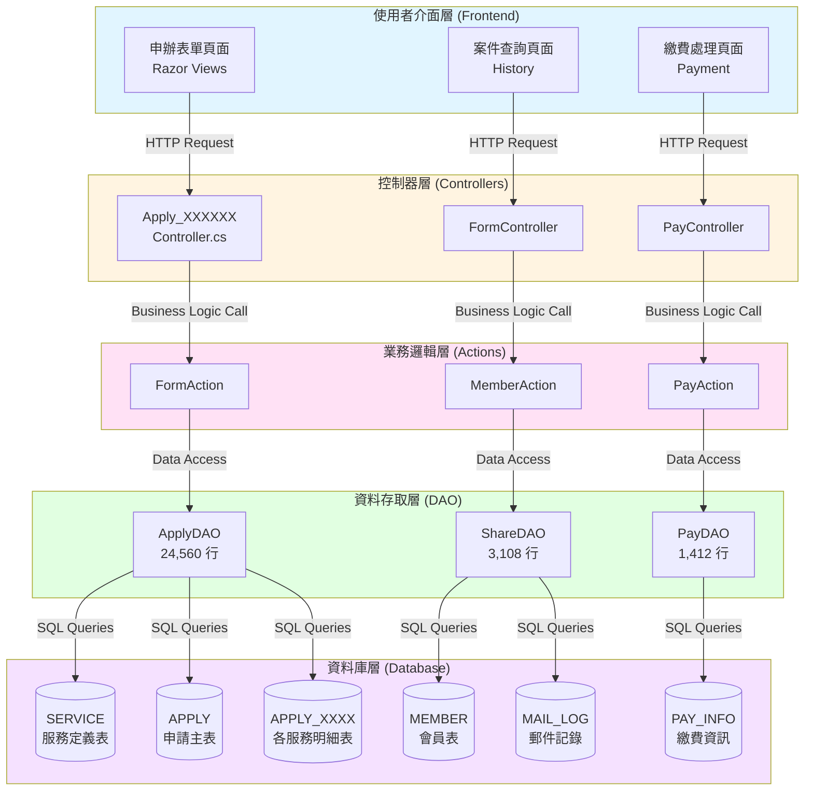

# 衛生福利部電子化服務平台 - 線上申辦服務總覽

## 文件說明

本文件提供衛生福利部電子化服務平台（e-service）所有 **34 種**線上申辦服務的完整概覽，包含各服務的全端處理流程說明，從前端使用者介面、API 路由、業務邏輯層到後端資料庫的詳細技術架構。

## 系統架構概述

### 整體架構圖



## 線上申辦服務分類與清單

### 服務分類說明

線上申辦服務依據業務單位分類，主要包含：

- **001xxx** - 醫事司相關服務
- **005xxx** - 中醫藥司相關服務
- **006xxx** - 社會保險司相關服務
- **010xxx** - 保護服務司相關服務
- **011xxx** - 社會及家庭署相關服務
- **012xxx** - 國民年金監理會相關服務
- **040xxx** - 法規會相關服務
- **041xxx** - 中央健康保險署相關服務

### 完整服務清單

| 服務代碼 | 服務名稱                                             | 業務單位       | 詳細文件                                     | 狀態 |
| -------- | ---------------------------------------------------- | -------------- | -------------------------------------------- | ---- |
| 001005   | 醫事人員或公共衛生師證書補(換)發                     | 醫事司         | [詳細說明](./001005_醫事人員證書補換發.md)   | ✅   |
| 001007   | 專科醫師證書補(換)發                                 | 醫事司         | [詳細說明](./001007_專科醫師證書補換發.md)   | ✅   |
| 001008   | 醫事人員或公共衛生師請領英文證明書                   | 醫事司         | [詳細說明](./001008_醫事人員英文證明書.md)   | ✅   |
| 001009   | 醫事人員或公共衛生師資格英文求證                     | 醫事司         | [詳細說明](./001009_醫事人員資格英文求證.md) | ✅   |
| 001010   | 醫事人員或公共衛生師證書影本申請書                   | 醫事司         | [詳細說明](./001010_醫事人員證書影本申請.md) | ✅   |
| 001034   | 藥物樣品贈品申請                                     | 醫事司         | [詳細說明](./001034_藥物樣品贈品申請.md)     | ✅   |
| 001035   | 非感染性人體器官、組織及細胞進出口                   | 醫事司         | [詳細說明](./001035_人體器官組織進出口.md)   | ✅   |
| 001036   | 專科護理師證書補(換)發                               | 醫事司         | [詳細說明](./001036_專科護理師證書補換發.md) | ✅   |
| 001037   | 醫事人員或公共衛生師請領無懲戒紀錄證明申請書         | 醫事司         | [詳細說明](./001037_無懲戒紀錄證明.md)       | ✅   |
| 001038   | 生殖細胞及胚胎輸入輸出                               | 醫事司         | [詳細說明](./001038_生殖細胞胚胎輸入輸出.md) | ✅   |
| 001039   | 醫師赴國外訓練英文保證函                             | 醫事司         | [詳細說明](./001039_醫師國外訓練保證函.md)   | ✅   |
| 005001   | 產銷證明書                                           | 中醫藥司       | [詳細說明](./005001_產銷證明書.md)           | ✅   |
| 005002   | GMP 證明書申請                                       | 中醫藥司       | [詳細說明](./005002_GMP證明書申請.md)        | ✅   |
| 005003   | WHO 格式之產銷證明書(英文)                           | 中醫藥司       | [詳細說明](./005003_WHO產銷證明書.md)        | ✅   |
| 005004   | 中藥 GMP 廠證明文件(中文)                            | 中醫藥司       | [詳細說明](./005004_中藥GMP證明中文.md)      | ✅   |
| 005005   | 中藥 GMP 廠證明文件(英文)                            | 中醫藥司       | [詳細說明](./005005_中藥GMP證明英文.md)      | ✅   |
| 005013   | 民眾少量自用中藥貨品進口                             | 中醫藥司       | [詳細說明](./005013_民眾自用中藥進口.md)     | ✅   |
| 005014   | 中藥製劑相關申請                                     | 中醫藥司       | [詳細說明](./005014_中藥製劑申請.md)         | ✅   |
| 006001   | 國民年金爭議審議線上申辦                             | 社會保險司     | [詳細說明](./006001_國民年金爭議審議.md)     | ✅   |
| 010001   | 檔案應用申請                                         | 綜合規劃司     | [詳細說明](./010001_檔案應用申請.md)         | ✅   |
| 010002   | 低收入戶及中低收入戶之體外受精(俗稱試管嬰兒)補助方案 | 保護服務司     | [詳細說明](./010002_試管嬰兒補助.md)         | ✅   |
| 011001   | 社會工作師執業執照申請                               | 社會及家庭署   | [詳細說明](./011001_社工師執業執照.md)       | ✅   |
| 011002   | 專科社會工作師證書核發                               | 社會及家庭署   | [詳細說明](./011002_專科社工師證書.md)       | ✅   |
| 011003   | 社會工作實務經驗及從事社會工作業務年資審查           | 社會及家庭署   | [詳細說明](./011003_社工實務經驗審查.md)     | ✅   |
| 011004   | 社工師證書核發(英文)                                 | 社會及家庭署   | [詳細說明](./011004_社工師證書英文.md)       | ✅   |
| 011005   | 社工師執業執照相關申請                               | 社會及家庭署   | [詳細說明](./011005_社工師執業執照申請.md)   | ✅   |
| 011006   | 社工師繼續教育積分審查                               | 社會及家庭署   | [詳細說明](./011006_社工師繼續教育.md)       | ✅   |
| 011007   | 社工師證書核發（中文）                               | 社會及家庭署   | [詳細說明](./011007_社工師證書中文.md)       | ✅   |
| 011008   | 社工師證書換發（更名或汙損）                         | 社會及家庭署   | [詳細說明](./011008_社工師證書換發.md)       | ✅   |
| 011009   | 社工師證書補發（遺失）                               | 社會及家庭署   | [詳細說明](./011009_社工師證書補發.md)       | ✅   |
| 011010   | 全國社會工作專業人員選拔推薦                         | 社會及家庭署   | [詳細說明](./011010_社工人員選拔.md)         | ✅   |
| 012001   | 國民年金相關申請                                     | 國民年金監理會 | [詳細說明](./012001_國民年金申請.md)         | ✅   |
| 040001   | 衛生福利部訴願案件                                   | 法規會         | [詳細說明](./040001_訴願案件.md)             | ✅   |
| 041001   | 全民健康保險爭議案件(權益案件及特約管理案件)線上申辦 | 中央健康保險署 | [詳細說明](./041001_健保爭議案件.md)         | ✅   |

## 通用處理流程

### 1. 前端申辦流程

所有線上申辦服務遵循統一的前端處理流程：

```
使用者登入
    ↓
選擇申辦服務
    ↓
閱讀說明事項 (Prompt 頁面)
    ↓
填寫申辦表單 (Index/Apply 頁面)
    ↓
上傳附件檔案 (如需要)
    ↓
預覽申辦內容 (Preview 頁面)
    ↓
確認送出申請
    ↓
繳費處理 (如需繳費)
    ↓
完成申辦 (Done 頁面)
```

### 2. 後端處理流程

```
Controller 接收請求
    ↓
驗證使用者登入狀態 (BaseController)
    ↓
驗證表單資料 (ModelState Validation)
    ↓
呼叫 Action 層處理業務邏輯
    ↓
呼叫 DAO 層存取資料庫
    ↓
產生案件編號 (GetApp_ID)
    ↓
儲存申請資料至資料庫
    ↓
寄送通知郵件 (SendMail_New)
    ↓
返回處理結果
```

### 3. 資料庫處理流程

每個申辦服務涉及的主要資料表：

1. **SERVICE** - 服務定義表

   - 儲存服務基本資訊、費用、處理期限等

2. **APPLY** - 申請主表

   - 儲存所有申請案件的共通資訊
   - 包含案件編號、申請人、狀態、時間等

3. **APPLY_XXXXXX** - 各服務專屬明細表

   - 儲存該服務特定的申請資料
   - 例如：APPLY_001008、APPLY_005001 等

4. **APPLY_FILE** - 附件檔案表

   - 儲存申請案件上傳的附件資訊

5. **PAY_INFO** - 繳費資訊表

   - 儲存案件繳費相關資訊

6. **MAIL_LOG** - 郵件記錄表
   - 記錄系統寄送的所有通知郵件

## 技術架構說明

### 前端技術

- **框架**: ASP.NET MVC 5 Razor Views
- **UI 框架**: Bootstrap 3.x
- **JavaScript**: jQuery 3.x
- **表單驗證**: jQuery Validation + Unobtrusive Validation
- **檔案上傳**: HTML5 File API + AJAX

### 後端技術

- **框架**: ASP.NET MVC 5 (.NET Framework 4.7.2)
- **ORM**: Dapper (輕量級) + ADO.NET (直接 SQL)
- **資料庫**: Microsoft SQL Server
- **排程**: Hangfire
- **郵件**: System.Net.Mail
- **文件產生**: Spire.Doc, NPOI

### 資料庫設計

- **資料庫**: SQL Server 2016+
- **連線方式**: Connection Pooling
- **交易處理**: SqlTransaction
- **預存程序**: 部分使用，大多使用動態 SQL

## 核心程式碼檔案說明

### Controllers (控制器層)

每個服務都有對應的 Controller，命名規則：`Apply_XXXXXX Controller.cs`

**主要方法**:

- `Prompt()` - 顯示說明事項頁面
- `Apply()` - 顯示申辦表單頁面
- `Save()` - 儲存申請資料
- `Preview()` - 預覽申辦內容
- `Done()` - 完成申辦

### ViewModels (視圖模型層)

每個服務都有對應的 ViewModel，命名規則：`Apply_XXXXXXViewModel.cs`

**主要類別**:

- `Apply_XXXXXXFormModel` - 表單資料模型
- `Apply_XXXXXXViewModel` - 視圖模型
- `Apply_XXXXXX_FileModel` - 附件檔案模型

### DataLayers (資料存取層)

**ApplyDAO.cs** (24,560 行)

- 包含所有申辦服務的資料存取方法
- 主要方法：
  - `GetApp_ID(string serviceId)` - 產生案件編號
  - `AppendApplyXXXXXX()` - 新增申請資料
  - `SendMail_New()` - 寄送通知郵件
  - `GetApplyXXXXXX()` - 查詢申請資料

**ShareDAO.cs** (3,108 行)

- 共用資料存取方法
- 包含代碼表查詢、檔案處理等

### Views (視圖層)

每個服務都有對應的 Views 資料夾：`Views/Apply_XXXXXX/`

**主要視圖**:

- `Prompt.cshtml` - 說明事項頁面
- `Index.cshtml` - 申辦表單頁面
- `Preview.cshtml` - 預覽頁面
- `Done.cshtml` - 完成頁面

## 使用說明

### 如何閱讀本文件

1. 先閱讀本總覽文件，了解整體架構
2. 根據需要查看特定服務的詳細文件
3. 每個服務的詳細文件包含：
   - 服務說明
   - 前端流程
   - API 路由
   - 業務邏輯
   - 資料庫結構
   - 程式碼範例

### 文件更新

- **建立日期**: 2025-10-13
- **最後更新**: 2025-10-13
- **維護人員**: 系統開發團隊

## 相關文件

- [專案高階概述](../01_專案高階概述.md)
- [資料庫架構說明](./資料庫架構說明.md)
- [API 路由說明](./API路由說明.md)
- [部署與維運手冊](./部署與維運手冊.md)

---

**版本：** 1.0
**日期：** 2025-10-20
**作者：** 柏通股份有限公司
