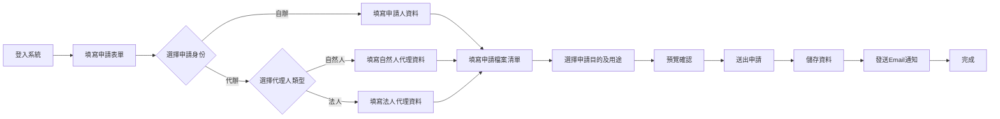
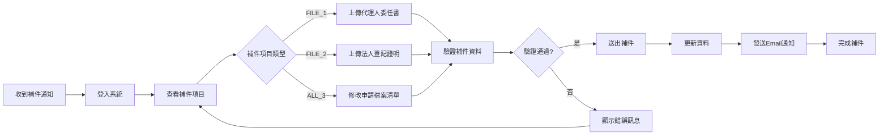
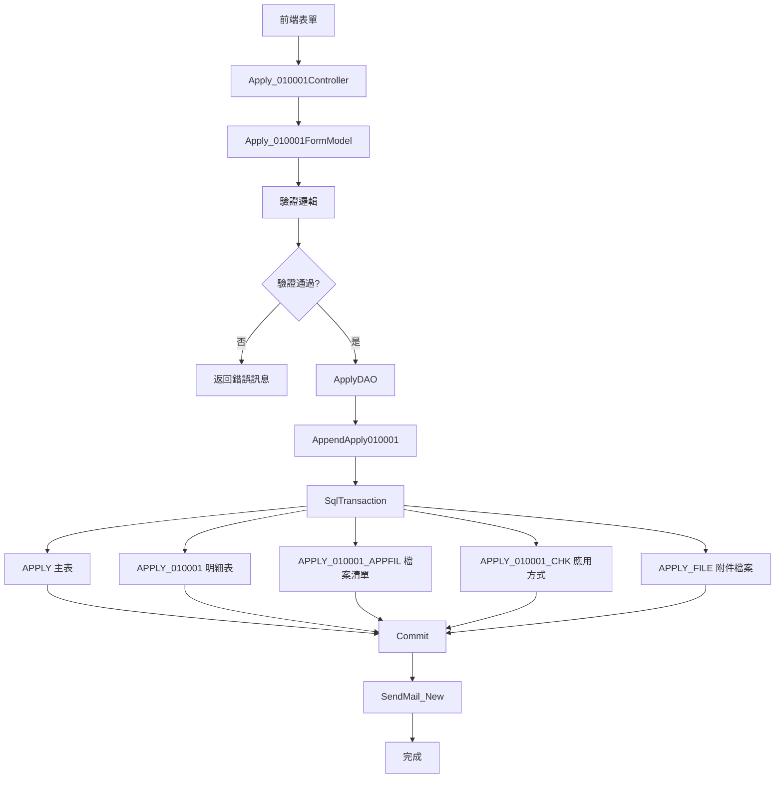
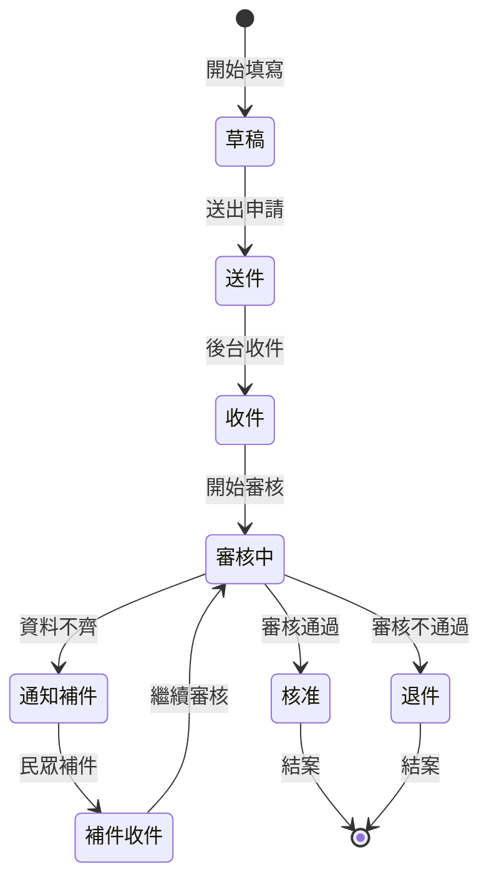

# 010001 檔案應用申請 - 完整技術文件

## 服務基本資訊

| 項目             | 內容                                                                   |
| ---------------- | ---------------------------------------------------------------------- |
| **服務代碼**     | 010001                                                                 |
| **服務名稱**     | 檔案應用申請                                                           |
| **業務單位**     | 綜合規劃司                                                             |
| **是否需繳費**   | 否                                                                     |
| **Controller**   | `ES/Controllers/Apply_010001Controller.cs` (587 行)                    |
| **ViewModel**    | `ES/Models/ViewModels/Apply_010001ViewModel.cs` (855 行)               |
| **Entity Model** | `ES/Models/Entities/APPLY_010001.cs` (228 行)                          |
| **主要資料表**   | APPLY, APPLY_010001, APPLY_010001_APPFIL, APPLY_010001_CHK, APPLY_FILE |
| **動態網格數量** | 1 個（申請檔案清單 APPFIL）                                            |
| **檔案數量**     | 2 個條件式檔案上傳（代理人證明文件）                                   |

---

## 服務特色

### 與其他服務的差異

| 項目             | 005001 產銷證明書 | 006001 國民年金爭議審議 | **010001 檔案應用申請**          |
| ---------------- | ----------------- | ----------------------- | -------------------------------- |
| **服務性質**     | 產銷證明書        | 爭議審議申請            | **檔案應用申請**                 |
| **繳費方式**     | 有（1,500 元/份） | 無                      | **無**                           |
| **動態網格**     | 2 個              | 無                      | **1 個（申請檔案清單）**         |
| **申請身份管理** | 無                | 有（被保險人資料）      | **有（自辦/代辦、自然人/法人）** |
| **應用方式選擇** | 無                | 無                      | **有（閱覽/抄錄/複製）**         |
| **複雜度**       | ⭐⭐⭐⭐⭐ 極高   | ⭐⭐⭐⭐ 高             | **⭐⭐⭐⭐ 高**                  |

### 核心功能

1. **申請身份管理**

   - 申請身份：自辦 / 代辦
   - 代理人類型：自然人 / 法人
   - 條件式欄位顯示與驗證

2. **申請人基本資料**

   - 姓名
   - 出生年月日
   - 身分證明文件字號
   - 地址（郵遞區號 + 縣市鄉鎮 + 詳細地址）
   - 電話
   - E-MAIL

3. **代理人資料（自然人）**

   - 姓名
   - 與申請人關係
   - 出生年月日
   - 身分證明文件字號
   - 地址
   - 電話
   - E-MAIL
   - 委任書電子檔上傳

4. **代理人資料（法人）**

   - 法人、團體、事務所或營業所名稱
   - 地址
   - 登記證明文件影本上傳

5. **申請檔案清單（動態網格 APPFIL）**

   - 檔號及文號
   - 檔案名稱或內容要旨
   - 件數
   - 應用方式（閱覽/抄錄/複製，多選）

6. **申請目的及用途**

   - 多選項目（CheckBoxList）
   - 包含「其他」選項可自行填寫

7. **補件功能**

   - 支援補件流程
   - 補件項目選擇（FILE_1、FILE_2、ALL_3）
   - 補件期限管理

8. **Word 文件套印**

   - 自動產生「衛生福利部檔案應用申請書」
   - 使用 Spire.Doc 套印技術
   - 包含申請人、代理人、申請檔案清單等資訊

9. **Email 通知**

   - 新申請通知
   - 補件通知
   - 退件通知

10. **條件式驗證**
    - 根據申請身份動態調整驗證規則
    - 自辦時移除代理人欄位驗證
    - 代辦時根據代理人類型驗證不同欄位

---

## 系統架構圖

### 1. 申請流程圖



### 2. 補件流程圖



### 3. 資料流程圖



### 4. 狀態轉換圖



---

## 資料庫結構

### 1. APPLY 主表（共用）

| 欄位名稱   | 資料型別      | 說明                                       |
| ---------- | ------------- | ------------------------------------------ |
| APP_ID     | varchar(50)   | 申請案件編號（PK）                         |
| SRV_ID     | varchar(10)   | 服務代碼（010001）                         |
| SRC_SRV_ID | varchar(10)   | 來源服務代碼                               |
| ACC_NO     | varchar(50)   | 申請人帳號                                 |
| UNIT_CD    | varchar(10)   | 業務單位代碼                               |
| NAME       | nvarchar(50)  | 申請人姓名                                 |
| IDN        | varchar(20)   | 身分證明文件字號                           |
| BIRTHDAY   | datetime      | 出生年月日                                 |
| ADDR_CODE  | varchar(10)   | 地址郵遞區號                               |
| ADDR       | nvarchar(200) | 地址詳細                                   |
| TEL        | varchar(20)   | 電話                                       |
| MAIL       | varchar(100)  | E-MAIL                                     |
| FLOW_CD    | varchar(2)    | 流程狀態（0:草稿, 1:送件, 2:補件, 8:退件） |
| MAILBODY   | nvarchar(MAX) | 補件/退件通知內容                          |
| ADD_TIME   | datetime      | 建立時間                                   |
| ADD_ACC    | varchar(50)   | 建立人員帳號                               |
| UPD_TIME   | datetime      | 更新時間                                   |
| UPD_ACC    | varchar(50)   | 更新人員帳號                               |

### 2. APPLY_010001 明細表

| 欄位名稱         | 資料型別      | 說明                           |
| ---------------- | ------------- | ------------------------------ |
| APP_ID           | varchar(50)   | 申請案件編號（PK, FK）         |
| APP_UNIT         | int           | 申請單位                       |
| APP_TIME         | datetime      | 申請日期                       |
| APP_ROLE         | varchar(2)    | 申請身份（0:自辦, 1:代辦）     |
| ACC_NO           | varchar(50)   | 申請人帳號                     |
| NAME             | nvarchar(50)  | 申請人姓名                     |
| BIRTHDAY         | datetime      | 申請人出生年月日               |
| IDN              | varchar(20)   | 申請人身分證明文件字號         |
| ADDR_CODE        | varchar(10)   | 申請人地址郵遞區號             |
| ADDR             | nvarchar(200) | 申請人地址詳細                 |
| TEL              | varchar(20)   | 申請人電話                     |
| MAIL             | varchar(100)  | 申請人 E-MAIL                  |
| A_AGENT          | varchar(2)    | 代理人類型（0:自然人, 1:法人） |
| E_NAME           | nvarchar(50)  | 代理人姓名（自然人）           |
| AE_RELATION      | nvarchar(50)  | 代理人與申請人關係             |
| E_BIRTHDAY       | datetime      | 代理人出生年月日               |
| E_IDN            | varchar(20)   | 代理人身分證明文件字號         |
| E_ADDR_CODE      | varchar(10)   | 代理人地址郵遞區號             |
| E_ADDR           | nvarchar(200) | 代理人地址詳細                 |
| E_TEL            | varchar(20)   | 代理人電話                     |
| E_MAIL           | varchar(100)  | 代理人 E-MAIL                  |
| FILE_01          | varchar(200)  | 代理人委任書電子檔路徑         |
| E_UNIT_NAME      | nvarchar(100) | 法人名稱                       |
| E_UNIT_ADDR_CODE | varchar(10)   | 法人地址郵遞區號               |
| E_UNIT_ADDR      | nvarchar(200) | 法人地址詳細                   |
| FILE_02          | varchar(200)  | 法人登記證明文件路徑           |
| APP_REASON       | nvarchar(MAX) | 使用檔卷原件事由（已棄用）     |
| CHECK_FLAG       | varchar(2)    | 是否已點擊 EMAIL 確認連結      |
| DEL_MK           | varchar(1)    | 刪除註記（N:未刪除, Y:已刪除） |
| ADD_TIME         | datetime      | 建立時間                       |
| ADD_FUN_CD       | varchar(20)   | 建立功能代碼                   |
| ADD_ACC          | varchar(50)   | 建立人員帳號                   |
| UPD_TIME         | datetime      | 更新時間                       |
| UPD_FUN_CD       | varchar(20)   | 更新功能代碼                   |
| UPD_ACC          | varchar(50)   | 更新人員帳號                   |

### 3. APPLY_010001_APPFIL 申請檔案清單表（動態網格）

| 欄位名稱   | 資料型別      | 說明                   |
| ---------- | ------------- | ---------------------- |
| APP_ID     | varchar(50)   | 申請案件編號（PK, FK） |
| SEQ_NO     | int           | 序號（PK）             |
| FILENUM    | nvarchar(100) | 檔號及文號             |
| FILENAME   | nvarchar(200) | 檔案名稱或內容要旨     |
| NUMCNT     | varchar(10)   | 件數                   |
| DEL_MK     | varchar(1)    | 刪除註記               |
| ADD_TIME   | datetime      | 建立時間               |
| ADD_FUN_CD | varchar(20)   | 建立功能代碼           |
| ADD_ACC    | varchar(50)   | 建立人員帳號           |
| UPD_TIME   | datetime      | 更新時間               |
| UPD_FUN_CD | varchar(20)   | 更新功能代碼           |
| UPD_ACC    | varchar(50)   | 更新人員帳號           |

### 4. APPLY_010001_CHK 應用方式及目的表

| 欄位名稱 | 資料型別      | 說明                                      |
| -------- | ------------- | ----------------------------------------- |
| APP_ID   | varchar(50)   | 申請案件編號（PK, FK）                    |
| SEQ_NO   | int           | 序號（對應 APPFIL 的 SEQ_NO，0 表示主表） |
| TYPE     | varchar(2)    | 類型（0:申請目的, 1:應用方式）            |
| CHECKNO  | varchar(10)   | 選項代碼                                  |
| NOTE     | nvarchar(200) | 備註（其他選項的說明）                    |
| ADD_TIME | datetime      | 建立時間                                  |
| ADD_ACC  | varchar(50)   | 建立人員帳號                              |

**CHECKNO 代碼說明（TYPE=0 申請目的）：**

- 1: 學術研究
- 2: 訴訟需要
- 3: 行政救濟
- 4: 維護權益
- 5: 新聞採訪
- 6: 歷史研究
- 7: 政策研究
- 8: 其他（需填寫 NOTE）

**CHECKNO 代碼說明（TYPE=1 應用方式）：**

- 1: 閱覽
- 2: 抄錄
- 3: 複製

### 5. APPLY_FILE 附件檔案表（共用）

| 欄位名稱 | 資料型別     | 說明                   |
| -------- | ------------ | ---------------------- |
| APP_ID   | varchar(50)  | 申請案件編號（PK, FK） |
| FILE_NO  | int          | 檔案編號（PK）         |
| FILENAME | varchar(200) | 檔案路徑               |
| ADD_TIME | datetime     | 建立時間               |
| ADD_ACC  | varchar(50)  | 建立人員帳號           |

**FILE_NO 說明：**

- 1: 代理人委任書電子檔（自然人）
- 2: 法人登記證明文件影本

---

## ViewModel 結構

### Apply_010001FormModel 主要屬性

```csharp
public class Apply_010001FormModel : TblAPPLY_010001
{
    // 基本屬性
    public bool IsNew { get; set; }
    public string IsMode { get; set; }

    // 申請基本資訊
    public string APP_ID { get; set; }
    public string SRV_ID { get; set; }
    public string SRC_SRV_ID { get; set; }
    public string ACC_NO { get; set; }
    public string UNIT_CD { get; set; }

    // 申請日期（轉換為民國年格式）
    public string APP_TIME_AD { get; set; }

    // 申請身份（0:自辦, 1:代辦）
    public string APP_ROLE { get; set; }
    public IList<SelectListItem> APP_ROLE_list { get; }

    // 申請人資料
    public string NAME { get; set; }
    public string BIRTHDAY_AD { get; set; }
    public string IDN { get; set; }
    public string ADDR { get; set; }
    public string ADDR_DETAIL { get; set; }
    public string TEL { get; set; }
    public string MAIL { get; set; }

    // 代理人類型（0:自然人, 1:法人）
    public string A_AGENT { get; set; }
    public IList<SelectListItem> A_AGENT_list { get; }

    // 自然人代理資料
    public string NPIN_E_NAME { get; set; }
    public string NPIN_AE_RELATION { get; set; }
    public string NPIN_E_BIRTHDAY_AD { get; set; }
    public string NPIN_E_IDN { get; set; }
    public string NPIN_E_ADDR { get; set; }
    public string NPIN_E_ADDR_DETAIL { get; set; }
    public string NPIN_E_TEL { get; set; }
    public string NPIN_E_MAIL { get; set; }
    public HttpPostedFileBase NPIN_FILE_01 { get; set; }
    public string NPIN_FILE_01_FILENAME { get; set; }

    // 法人代理資料
    public string LPIN_E_UNIT_NAME { get; set; }
    public string LPIN_E_UNIT_ADDR { get; set; }
    public string LPIN_E_UNIT_ADDR_DETAIL { get; set; }
    public HttpPostedFileBase LPIN_FILE_02 { get; set; }
    public string LPIN_FILE_02_FILENAME { get; set; }

    // 申請檔案清單（動態網格）
    public GoodsDynamicGrid<APPLY_010001_APPFILModel> APPFIL { get; set; }

    // 申請目的及用途
    public string CHECKNO_ITEMS { get; set; }
    public string CHECKNO { get; set; }
    public string[] CHECKNO_SHOW { get; set; }
    public IList<CheckBoxListItem> CHECKNO_SHOW_list { get; }
    public string CHECKNO_NOTE { get; set; }

    // 檔案上傳方法
    public string FileSave();
    public string APPFILSave();
    public string EMAILSave();
}
```

### APPLY_010001_APPFILModel 動態網格模型

```csharp
public class APPLY_010001_APPFILModel : TblAPPLY_010001_APPFIL
{
    public string APP_ID { get; set; }
    public int SEQ_NO { get; set; }
    public string FILENUM { get; set; }        // 檔號及文號
    public string FILENAME { get; set; }       // 檔案名稱或內容要旨
    public string NUMCNT { get; set; }         // 件數
    public string CHECKNO_Lst { get; set; }    // 應用方式（逗號分隔）
    public string[] CHECKNO_ChekLst { get; set; }
}
```

### Apply_010001DocModel 補件模型

```csharp
public class Apply_010001DocModel : ApplyModel
{
    // 繼承 ApplyModel 的基本屬性
    public string ADD_TIME { get; set; }
    public string APP_ROLE { get; set; }
    public string NAME { get; set; }
    public string BIRTHDAY_AD { get; set; }
    public string IDN { get; set; }
    public string TEL { get; set; }
    public string MAIL { get; set; }

    // 動態網格
    public GoodsDynamicGrid<APPLY_010001_APPFILModel> APPFIL { get; set; }

    // 申請目的及用途
    public string APP_REASON { get; set; }
    public string CHECK_NO_LIST { get; set; }
    public string CHECK_NO_NOTE { get; set; }

    // 地址資訊
    public string TAX_ORG_CITY_CODE { get; set; }
    public string TAX_ORG_CITY_TEXT { get; set; }
    public string TAX_ORG_CITY_DETAIL { get; set; }

    // 代理人資訊
    public string A_AGENT { get; set; }

    // 自然人代理資料
    public string E_NAME { get; set; }
    public string AE_RELATION { get; set; }
    public DateTime? E_BIRTHDAY { get; set; }
    public string E_BIRTHDAY_AD { get; set; }
    public string E_IDN { get; set; }
    public string E_ADDR_CODE { get; set; }
    public string E_ADDR { get; set; }
    public string E_TAX_ORG_CITY_CODE { get; set; }
    public string E_TAX_ORG_CITY_TEXT { get; set; }
    public string E_TAX_ORG_CITY_DETAIL { get; set; }
    public string E_TEL { get; set; }
    public string E_MAIL { get; set; }
    public string FILE_01 { get; set; }
    public HttpPostedFileBase newFILE_01 { get; set; }

    // 法人代理資料
    public string E_UNIT_NAME { get; set; }
    public string E_UNIT_ADDR_CODE { get; set; }
    public string E_UNIT_ADDR { get; set; }
    public string E_UNIT_TAX_ORG_CITY_CODE { get; set; }
    public string E_UNIT_TAX_ORG_CITY_TEXT { get; set; }
    public string E_UNIT_TAX_ORG_CITY_DETAIL { get; set; }
    public string FILE_02 { get; set; }
    public HttpPostedFileBase newFILE_02 { get; set; }

    // 補件項目
    public string DOC_ITEM { get; set; }
    public string DOC_FILE { get; set; }
}
```

---

## Controller 方法說明

### 前台 Controller (Apply_010001Controller.cs)

#### 1. Apply() - GET - 空白表單畫面

**功能：** 顯示空白申請表單，並自動帶入會員資料

```csharp
public ActionResult Apply()
{
    SessionModel sm = SessionModel.Get();
    Apply_010001FormModel model = new Apply_010001FormModel();
    model.APP_TIME = DateTime.Now;
    var UsIn = sm.UserInfo.Member;
    model.A_AGENT = "0";
    model.APP_ROLE = "0";

    if (UsIn != null)
    {
        ShareDAO dao = new ShareDAO();
        model.ACC_NO = UsIn.ACC_NO;
        model.SRV_ID = "010001";
        model.SRC_SRV_ID = "010001";
        model.UNIT_CD = dao.GetServiceUnitCD(model.SRV_ID);
        model.IDN = UsIn.IDN;
        model.NAME = UsIn.NAME;
        model.ADDR = UsIn.CITY_CD;
        model.ADDR_DETAIL = UsIn.ADDR;
        model.TEL = UsIn.TEL;
        model.MAIL = UsIn.MAIL;
        model.BIRTHDAY = UsIn.BIRTHDAY;
    }

    return View("Index", model);
}
```

**特色：**

- 自動帶入會員基本資料
- 預設為「自辦」、「自然人」
- 取得服務單位代碼

#### 2. Apply() - POST - 預覽畫面

**功能：** 驗證表單資料並顯示預覽畫面

```csharp
[HttpPost]
public ActionResult Apply(Apply_010001FormModel model)
{
    SessionModel sm = SessionModel.Get();
    var errormsg = string.Empty;

    // 根據申請身份動態調整驗證規則
    if (model.APP_ROLE == "0")
    {
        // 自辦時將代理人欄位檢核拔除
        foreach (var item in ModelState)
        {
            if (item.Key.ToLeft(5) == "LPIN_" || item.Key.ToLeft(5) == "NPIN_")
            {
                item.Value.Errors.Clear();
            }
        }
    }
    else
    {
        // 代辦時判斷自然人或法人
        if (model.A_AGENT == "0")
        {
            // 移除法人欄位驗證
            foreach (var item in ModelState)
            {
                if (item.Key.ToLeft(5) == "LPIN_")
                {
                    item.Value.Errors.Clear();
                }
            }
        }
        if (model.A_AGENT == "1")
        {
            // 移除自然人欄位驗證
            foreach (var item in ModelState)
            {
                if (item.Key.ToLeft(5) == "NPIN_")
                {
                    item.Value.Errors.Clear();
                }
            }
        }
    }

    if (ModelState.IsValid)
    {
        ModelState.Clear();
        errormsg = model.FileSave();
        errormsg += model.APPFILSave();
        errormsg += model.EMAILSave();

        if (errormsg != "")
        {
            sm.LastErrorMessage = errormsg;
        }
        else
        {
            if (model.IsMode == "1")
            {
                model.IsNew = false;
                model.APPFIL.IsReadOnly = true;
            }
            if (model.IsMode == "0")
            {
                model.IsNew = true;
                model.APPFIL.IsReadOnly = false;
            }
        }
    }

    return View("Index", model);
}
```

**特色：**

- 條件式驗證邏輯
- 根據申請身份動態移除不需要的欄位驗證
- 檔案上傳驗證
- 動態網格驗證
- Email 格式驗證

#### 3. Save() - POST - 儲存申請資料

**功能：** 儲存申請資料並發送 Email 通知

```csharp
[HttpPost]
public ActionResult Save(Apply_010001FormModel model)
{
    SessionModel sm = SessionModel.Get();
    ApplyDAO dao = new ApplyDAO();
    var memberName = string.IsNullOrWhiteSpace(model.NAME) ? sm.UserInfo.Member.NAME : model.NAME;
    var memberEmail = string.IsNullOrWhiteSpace(model.MAIL) ? sm.UserInfo.Member.MAIL : model.MAIL;
    ModelState.Clear();

    // 存檔
    dao.AppendApply010001(model);

    // 寄信
    dao.SendMail_New(memberName, memberEmail, model.APP_ID, "檔案應用", "010001");

    return Done("1");
}
```

**特色：**

- 呼叫 DAO 的 AppendApply010001 方法儲存資料
- 發送新申請通知 Email
- 導向完成頁面

#### 4. AppDoc() - GET - 補件畫面

**功能：** 顯示補件畫面，載入案件資料

```csharp
public ActionResult AppDoc(string APP_ID)
{
    ApplyDAO dao = new ApplyDAO();
    SessionModel sm = SessionModel.Get();
    Apply_010001DocModel model = new Apply_010001DocModel(APP_ID);

    // 取得案件基本資訊
    TblAPPLY_010001 app = new TblAPPLY_010001();
    app.APP_ID = APP_ID;
    var appdata = dao.GetRow(app);

    ApplyModel aly = new ApplyModel();
    aly.APP_ID = APP_ID;
    var alydata = dao.GetRow(aly);

    // 取得附件檔案
    Apply_FileModel applyFile = new Apply_FileModel();
    applyFile.APP_ID = APP_ID;
    var applyFileData = dao.GetRowList(applyFile);

    // 取得應用方式及目的
    TblAPPLY_010001_CHK applyChk = new TblAPPLY_010001_CHK();
    applyChk.APP_ID = APP_ID;
    var applyChkData = dao.GetRowList(applyChk);

    // 判斷是否為該案件申請人
    if (alydata.ACC_NO == UsIn.ACC_NO)
    {
        // 載入申請人資料
        model.NAME = alydata.NAME;
        model.BIRTHDAY = alydata.BIRTHDAY;
        model.IDN = alydata.IDN;

        // 載入地址（使用 ZIPCODE 轉換）
        model.TAX_ORG_CITY_CODE = alydata.ADDR_CODE;
        model.TAX_ORG_CITY_DETAIL = alydata.ADDR;
        TblZIPCODE zip = new TblZIPCODE();
        zip.ZIP_CO = alydata.ADDR_CODE;
        var getnam = dao.GetRow(zip);
        if (getnam != null)
        {
            model.TAX_ORG_CITY_DETAIL = alydata.ADDR.TONotNullString().Replace(getnam.CITYNM + getnam.TOWNNM, "");
            model.TAX_ORG_CITY_TEXT = getnam.CITYNM + getnam.TOWNNM;
        }

        // 載入申請目的及用途
        foreach (var item in applyChkData)
        {
            if (item.TYPE == "0")
            {
                model.CHECK_NO_LIST = model.CHECK_NO_LIST.TONotNullString() + item.CHECKNO + ",";
            }
        }
        model.CHECK_NO_LIST = model.CHECK_NO_LIST.Trim(new Char[] {' ', ','});

        // 載入代理人資料
        if (appdata.APP_ROLE == "1")
        {
            if (appdata.A_AGENT == "0")
            {
                // 自然人
                model.E_NAME = appdata.E_NAME;
                model.AE_RELATION = appdata.AE_RELATION;
                model.E_BIRTHDAY = appdata.BIRTHDAY;
                model.E_IDN = appdata.E_IDN;
                // ... 其他欄位
            }
            else
            {
                // 法人
                model.E_UNIT_NAME = appdata.E_UNIT_NAME;
                // ... 其他欄位
            }
        }

        // 載入動態網格的應用方式
        for (var i = 0; i < model.APPFIL.GoodsList.Count; i++)
        {
            var chkList = applyChkData
                .Where(m => m.TYPE == "1" && m.SEQ_NO == model.APPFIL.GoodsList[i].SEQ_NO).ToList();
            foreach (var item in chkList)
            {
                model.APPFIL.GoodsList[i].CHECKNO_Lst = model.APPFIL.GoodsList[i].CHECKNO_Lst.TONotNullString() + item.CHECKNO + ",";
            }
            model.APPFIL.GoodsList[i].CHECKNO_Lst = model.APPFIL.GoodsList[i].CHECKNO_Lst.Trim(new Char[] { ' ', ',' });
        }

        // 判斷補件項目
        model.FLOW_CD = alydata.FLOW_CD;
        model.DOC_ITEM = "N";
        model.APPFIL.IsReadOnly = true;
        if (alydata.FLOW_CD == "2")
        {
            model.MAILBODY = alydata.MAILBODY;
            model.DOC_FILE = "";
            TblAPPLY_NOTICE notice = new TblAPPLY_NOTICE();
            notice.APP_ID = APP_ID;
            var noticedata = dao.GetRowList(notice);
            var noticedataSort = noticedata.Where(m => m.FREQUENCY == noticedata.Max(x => x.FREQUENCY));
            foreach (var item in noticedataSort)
            {
                if (item.Field == "FILE_1")
                {
                    model.DOC_FILE = item.Field;
                }
                if (item.Field == "FILE_2")
                {
                    model.DOC_FILE = item.Field;
                }
                if (item.Field == "ALL_3")
                {
                    model.DOC_ITEM = "Y";
                    model.APPFIL.IsReadOnly = false;
                }
            }
        }

        return View("AppDoc", model);
    }
    else
    {
        throw new Exception("非案件申請人無法瀏覽次案件 !");
    }
}
```

**特色：**

- 載入案件完整資料
- 使用 ZIPCODE 表轉換地址
- 載入動態網格的應用方式
- 根據補件項目決定可編輯欄位
- 權限檢查（僅申請人可查看）

#### 5. DocSave() - POST - 補件驗證

**功能：** 驗證補件資料

```csharp
public ActionResult DocSave(Apply_010001DocModel Form)
{
    var result = new AjaxResultStruct();
    string ErrorMsg = "";
    System.Text.RegularExpressions.Regex reg3 = new System.Text.RegularExpressions.Regex(@"^([\w\.\-]+)@([\w\-]+)((\.(\w){2,10})+)$");

    // 欄位驗證
    if (string.IsNullOrEmpty(Form.TAX_ORG_CITY_CODE) || string.IsNullOrEmpty(Form.TAX_ORG_CITY_TEXT) ||
        string.IsNullOrEmpty(Form.TAX_ORG_CITY_DETAIL))
    {
        ErrorMsg += "地址 為必填欄位\n";
    }

    if (Form.APP_ROLE == "1")
    {
        // 自然人
        if (Form.A_AGENT == "0")
        {
            if (string.IsNullOrEmpty(Form.E_NAME))
            {
                ErrorMsg += "自然人姓名 為必填欄位\n";
            }
            // ... 其他欄位驗證
        }
        // 法人
        if (Form.A_AGENT == "1")
        {
            if (string.IsNullOrEmpty(Form.E_UNIT_NAME))
            {
                ErrorMsg += "法人、團體、事務所或營業所名稱 為必填欄位\n";
            }
            // ... 其他欄位驗證
        }
    }

    // 動態表格驗證
    for (var i = 0; i < Form.APPFIL.GoodsList.Count; i++)
    {
        if (string.IsNullOrEmpty(Form.APPFIL.GoodsList[i].FILENUM))
        {
            ErrorMsg += "序號" + (i+1) + "_檔號及文號 為必填欄位\n";
        }
        if (string.IsNullOrEmpty(Form.APPFIL.GoodsList[i].NUMCNT))
        {
            ErrorMsg += "序號" + (i+1) + "_件數 為必填欄位\n";
        }
        if (string.IsNullOrEmpty(Form.APPFIL.GoodsList[i].CHECKNO_Lst))
        {
            ErrorMsg += "序號" + (i+1) + "_申請項目 為必填欄位\n";
        }
    }

    if (ErrorMsg == "")
    {
        result.status = true;
        result.message = "";
    }
    else
    {
        result.status = false;
        result.message = ErrorMsg;
    }

    return Content(result.Serialize(), "application/json");
}
```

**特色：**

- AJAX 驗證
- 條件式驗證（根據申請身份）
- 動態網格逐筆驗證
- Email 格式驗證
- 身分證格式驗證

#### 6. SaveAppDoc() - POST - 補件存檔

**功能：** 儲存補件資料並發送 Email 通知

```csharp
public ActionResult SaveAppDoc(Apply_010001DocModel model)
{
    SessionModel sm = SessionModel.Get();
    ApplyDAO dao = new ApplyDAO();
    var memberName = string.IsNullOrWhiteSpace(model.NAME) ? sm.UserInfo.Member.NAME : model.NAME;
    var memberEmail = string.IsNullOrWhiteSpace(model.MAIL) ? sm.UserInfo.Member.MAIL : model.MAIL;

    // 存檔
    dao.UpdateApply010001(model);

    // 寄信
    dao.SendMail_Update(memberName, memberEmail, model.APP_ID, "檔案應用申請", "010001", "0");

    return Done("2", "0");
}
```

**特色：**

- 呼叫 DAO 的 UpdateApply010001 方法更新資料
- 發送補件通知 Email
- 導向完成頁面

---

### 後台 Controller (Apply_010001Controller.cs in BACKMIN)

#### 1. Index() - GET - 後台審核畫面

**功能：** 顯示後台審核畫面

```csharp
public ActionResult Index(string appid, string srvid)
{
    Apply_010001FormModel model = new Apply_010001FormModel();
    model = GetApply010001Data(appid);
    return View("Index", model);
}
```

#### 2. Save() - POST - 後台儲存

**功能：** 後台審核儲存（核准/補件/退件）

```csharp
public ActionResult Save(Apply_010001FormModel model)
{
    SessionModel sm = SessionModel.Get();
    BackApplyDAO dao = new BackApplyDAO();
    var result = new AjaxResultStruct();
    result.status = false;
    var ErrorMsg = "";

    if (model.FLOW_CD == "2" && model.FileCheck.TONotNullString() == "")
    {
        ErrorMsg = "請至少選擇一種補件項目 !";
    }
    else if (model.FLOW_CD == "8" && model.NOTE.TONotNullString() == "")
    {
        ErrorMsg = "請填寫退件原因！";
    }

    if (ErrorMsg == "")
    {
        // 存檔
        ErrorMsg = dao.AppendApply010001(model);
    }

    if (ErrorMsg == "")
    {
        result.status = true;
        result.message = "存檔成功 !";
    }
    else { result.message = ErrorMsg; }

    return Content(result.Serialize(), "application/json");
}
```

**特色：**

- 補件項目驗證
- 退件原因驗證
- AJAX 回應

#### 3. PreviewApplyForm() - GET - 套印申請書

**功能：** 使用 Spire.Doc 套印「衛生福利部檔案應用申請書」

```csharp
public void PreviewApplyForm(string APP_ID)
{
    Apply_010001FormModel vm = new Apply_010001FormModel();
    vm = GetApply010001Data(APP_ID);
    var alFontName = "標楷體";
    var alFontSize = 14;
    byte[] buffer = null;

    using (MemoryStream ms = new MemoryStream())
    {
        Document doc = new Document();
        Section s = doc.AddSection();

        // 標題
        Paragraph para1 = s.AddParagraph();
        para1.AppendText("衛生福利部檔案應用申請書");

        Paragraph para2 = s.AddParagraph();
        para2.AppendText("申請書編號：_______________");

        // 建立表格
        Spire.Doc.Table sTable = s.AddTable(true);
        var t = vm.APPFIL.Count;
        sTable.ResetCells(8 + t, 4);

        // 填入申請人資料
        sTable[1, 0].AddParagraph().AppendText("申請人：" + vm.NAME);
        sTable[1, 1].AddParagraph().AppendText(vm.BIRTHDAY_AD);
        sTable[1, 2].AddParagraph().AppendText(vm.IDN);
        sTable[1, 3].AddParagraph().AppendText($"地址：{vm.ADDR_CODE}{vm.ADDR_CODE_ADDR}{vm.ADDR_CODE_DETAIL} \r\n電話：{vm.TEL}");

        // 填入代理人資料
        // ... 代理人資料填入邏輯

        // 填入申請檔案清單（動態）
        // ... 動態表格填入邏輯

        // 輸出 Word 文件
        doc.SaveToStream(ms, FileFormat.Docx);
        buffer = ms.ToArray();
    }

    Response.Clear();
    Response.ContentType = "application/vnd.openxmlformats-officedocument.wordprocessingml.document";
    Response.AddHeader("Content-Disposition", "attachment; filename=檔案應用申請書.docx");
    Response.BinaryWrite(buffer);
    Response.End();
}
```

**特色：**

- 使用 Spire.Doc 套印 Word 文件
- 動態產生表格（根據申請檔案數量）
- 條件式顯示代理人資料
- 直接輸出 Word 檔案供下載

---

## DAO 方法說明

### ApplyDAO.AppendApply010001()

**功能：** 新增申請資料（含交易管理）

**主要邏輯：**

1. 開啟 SqlTransaction
2. 新增 APPLY 主表
3. 新增 APPLY_010001 明細表
4. 新增 APPLY_010001_APPFIL 動態網格資料
5. 新增 APPLY_010001_CHK 應用方式及目的資料
6. 新增 APPLY_FILE 附件檔案資料
7. Commit 交易

### ApplyDAO.UpdateApply010001()

**功能：** 更新補件資料（含交易管理）

**主要邏輯：**

1. 開啟 SqlTransaction
2. 更新 APPLY 主表
3. 更新 APPLY_010001 明細表
4. 刪除舊的 APPLY_010001_APPFIL 資料
5. 新增新的 APPLY_010001_APPFIL 資料
6. 刪除舊的 APPLY_010001_CHK 資料
7. 新增新的 APPLY_010001_CHK 資料
8. 更新 APPLY_FILE 附件檔案資料
9. Commit 交易

### ApplyDAO.SendMail_New()

**功能：** 發送新申請通知 Email

**參數：**

- memberName: 申請人姓名
- memberEmail: 申請人 Email
- APP_ID: 申請案件編號
- serviceName: 服務名稱
- serviceCode: 服務代碼

### ApplyDAO.SendMail_Update()

**功能：** 發送補件通知 Email

**參數：**

- memberName: 申請人姓名
- memberEmail: 申請人 Email
- APP_ID: 申請案件編號
- serviceName: 服務名稱
- serviceCode: 服務代碼
- updateType: 更新類型

---

## 技術亮點

### 1. 條件式驗證邏輯

根據申請身份（自辦/代辦）和代理人類型（自然人/法人）動態調整驗證規則：

```csharp
if (model.APP_ROLE == "0")
{
    // 自辦時將代理人欄位檢核拔除
    foreach (var item in ModelState)
    {
        if (item.Key.ToLeft(5) == "LPIN_" || item.Key.ToLeft(5) == "NPIN_")
        {
            item.Value.Errors.Clear();
        }
    }
}
else
{
    // 代辦時判斷自然人或法人
    if (model.A_AGENT == "0")
    {
        // 移除法人欄位驗證
        foreach (var item in ModelState)
        {
            if (item.Key.ToLeft(5) == "LPIN_")
            {
                item.Value.Errors.Clear();
            }
        }
    }
    if (model.A_AGENT == "1")
    {
        // 移除自然人欄位驗證
        foreach (var item in ModelState)
        {
            if (item.Key.ToLeft(5) == "NPIN_")
            {
                item.Value.Errors.Clear();
            }
        }
    }
}
```

### 2. ZIPCODE 地址轉換

使用 ZIPCODE 表將郵遞區號轉換為縣市鄉鎮名稱：

```csharp
TblZIPCODE zip = new TblZIPCODE();
zip.ZIP_CO = alydata.ADDR_CODE;
var getnam = dao.GetRow(zip);
if (getnam != null)
{
    model.TAX_ORG_CITY_DETAIL = alydata.ADDR.TONotNullString().Replace(getnam.CITYNM + getnam.TOWNNM, "");
    model.TAX_ORG_CITY_TEXT = getnam.CITYNM + getnam.TOWNNM;
}
```

### 3. 動態網格應用方式管理

使用 APPLY_010001_CHK 表儲存每筆申請檔案的應用方式（閱覽/抄錄/複製）：

```csharp
// 載入動態網格的應用方式
for (var i = 0; i < model.APPFIL.GoodsList.Count; i++)
{
    var chkList = applyChkData
        .Where(m => m.TYPE == "1" && m.SEQ_NO == model.APPFIL.GoodsList[i].SEQ_NO).ToList();
    foreach (var item in chkList)
    {
        model.APPFIL.GoodsList[i].CHECKNO_Lst = model.APPFIL.GoodsList[i].CHECKNO_Lst.TONotNullString() + item.CHECKNO + ",";
    }
    model.APPFIL.GoodsList[i].CHECKNO_Lst = model.APPFIL.GoodsList[i].CHECKNO_Lst.Trim(new Char[] { ' ', ',' });
}
```

### 4. 補件項目管理

根據 APPLY_NOTICE 表的 Field 欄位決定補件項目：

- **FILE_1**: 補件代理人委任書
- **FILE_2**: 補件法人登記證明
- **ALL_3**: 補件申請檔案清單（可編輯動態網格）

```csharp
if (alydata.FLOW_CD == "2")
{
    model.MAILBODY = alydata.MAILBODY;
    model.DOC_FILE = "";
    TblAPPLY_NOTICE notice = new TblAPPLY_NOTICE();
    notice.APP_ID = APP_ID;
    var noticedata = dao.GetRowList(notice);
    var noticedataSort = noticedata.Where(m => m.FREQUENCY == noticedata.Max(x => x.FREQUENCY));
    foreach (var item in noticedataSort)
    {
        if (item.Field == "FILE_1")
        {
            model.DOC_FILE = item.Field;
        }
        if (item.Field == "FILE_2")
        {
            model.DOC_FILE = item.Field;
        }
        if (item.Field == "ALL_3")
        {
            model.DOC_ITEM = "Y";
            model.APPFIL.IsReadOnly = false;
        }
    }
}
```

### 5. Word 文件動態套印

使用 Spire.Doc 動態產生 Word 文件，表格列數根據申請檔案數量調整：

```csharp
// 建立表格
Spire.Doc.Table sTable = s.AddTable(true);
var t = vm.APPFIL.Count;
sTable.ResetCells(8 + t, 4);  // 基本 8 列 + 動態檔案列數
```

### 6. 檔案上傳驗證

根據申請身份和代理人類型驗證檔案上傳：

```csharp
public string FileSave()
{
    ShareDAO dao = new ShareDAO();
    var ErrorMsg = "";

    if (this.A_AGENT == "0" && this.APP_ROLE == "1")
    {
        if (this.NPIN_FILE_01.TONotNullString().Equals(""))
        {
            ErrorMsg += "代理人委任書電子檔 為必填欄位\n";
        }
        else
        {
            this.NPIN_FILE_01_FILENAME = dao.PutFile("010001", this.NPIN_FILE_01, "1").Replace("\\", "/");
        }
    }

    if (this.A_AGENT == "1" && this.APP_ROLE == "1")
    {
        if (this.LPIN_FILE_02.TONotNullString().Equals(""))
        {
            ErrorMsg += "代理<法人>登記證明文件影本 為必填欄位\n";
        }
        else
        {
            this.LPIN_FILE_02_FILENAME = dao.PutFile("010001", this.LPIN_FILE_02, "2").Replace("\\", "/");
        }
    }
    return ErrorMsg;
}
```

### 7. 動態網格驗證

逐筆驗證動態網格資料：

```csharp
public string APPFILSave()
{
    var ErrorMsg = string.Empty;
    if (this.APPFIL != null && this.APPFIL.GoodsList != null && this.APPFIL.GoodsList.Count() > 0)
    {
        var i = 1;
        foreach (var goods in this.APPFIL.GoodsList)
        {
            if (string.IsNullOrWhiteSpace(goods.FILENUM))
            {
                ErrorMsg += $"序號{i}檔號及文號 為必填欄位\n";
            }
            if (string.IsNullOrWhiteSpace(goods.NUMCNT))
            {
                ErrorMsg += $"序號{i}件數 為必填欄位\n";
            }
            if (string.IsNullOrWhiteSpace(goods.CHECKNO_Lst))
            {
                ErrorMsg += $"序號{i}應用方式 為必填欄位\n";
            }
            i++;
        }
    }
    return ErrorMsg;
}
```

### 8. Email 及身分證格式驗證

使用正規表達式驗證 Email 格式和身分證格式：

```csharp
public string EMAILSave()
{
    var ErrorMsg = string.Empty;
    System.Text.RegularExpressions.Regex reg3 = new System.Text.RegularExpressions.Regex(@"^([\w\.\-]+)@([\w\-]+)((\.(\w){2,10})+)$");

    // Email 驗證
    if (!string.IsNullOrWhiteSpace(this.MAIL))
    {
        if (!reg3.IsMatch(this.MAIL))
        {
            ErrorMsg += "請輸入正確的Email格式\n";
        }
    }

    // 身分證驗證
    if (!string.IsNullOrWhiteSpace(this.IDN))
    {
        if (!CheckUtils.IsIdentity(this.IDN))
        {
            ErrorMsg += "請輸入正確的身分證明文件字號或統一編號\n";
        }
    }

    return ErrorMsg;
}
```

### 9. 交易管理

使用 SqlTransaction 確保資料一致性：

```csharp
using (SqlConnection conn = DataUtils.GetConnection())
{
    conn.Open();
    SqlTransaction trans = conn.BeginTransaction();
    try
    {
        // 1. 新增 APPLY 主表
        // 2. 新增 APPLY_010001 明細表
        // 3. 新增 APPLY_010001_APPFIL 動態網格資料
        // 4. 新增 APPLY_010001_CHK 應用方式及目的資料
        // 5. 新增 APPLY_FILE 附件檔案資料

        trans.Commit();
    }
    catch (Exception ex)
    {
        trans.Rollback();
        throw ex;
    }
}
```

### 10. 權限檢查

確保僅申請人可查看自己的案件：

```csharp
if (alydata.ACC_NO == UsIn.ACC_NO)
{
    // 載入案件資料
}
else
{
    throw new Exception("非案件申請人無法瀏覽次案件 !");
}
```

---

## 相關檔案清單

### Controller

- `ES/Controllers/Apply_010001Controller.cs` (587 行)
- `ES/Areas/BACKMIN/Controllers/Apply_010001Controller.cs` (522 行)

### ViewModel

- `ES/Models/ViewModels/Apply_010001ViewModel.cs` (855 行)

### Entity

- `ES/Models/Entities/APPLY_010001.cs` (228 行)
- `ES/Models/Entities/APPLY_010001_APPFIL.cs` (90 行)

### DAO

- `ES/DataLayers/ApplyDAO.cs` (AppendApply010001, UpdateApply010001, SendMail_New, SendMail_Update)
- `ES/DataLayers/BackApplyDAO.cs` (AppendApply010001)

### View

- `ES/Views/Apply_010001/Index.cshtml`
- `ES/Views/Apply_010001/AppDoc.cshtml`
- `ES/Views/Apply_010001/Done.cshtml`
- `ES/Areas/BACKMIN/Views/Apply_010001/Index.cshtml`

---

## 重要注意事項

### 1. 申請身份管理

**問題：** 申請身份（自辦/代辦）和代理人類型（自然人/法人）的組合較複雜

**解決方案：**

- 使用條件式驗證邏輯
- 前端使用 JavaScript 動態顯示/隱藏欄位
- 後端使用 ModelState.Errors.Clear() 移除不需要的驗證

### 2. 動態網格應用方式

**問題：** 每筆申請檔案都有獨立的應用方式（閱覽/抄錄/複製）

**解決方案：**

- 使用 APPLY_010001_CHK 表儲存應用方式
- TYPE=0 表示申請目的（主表）
- TYPE=1 表示應用方式（動態網格，SEQ_NO 對應 APPFIL 的 SEQ_NO）

### 3. ZIPCODE 地址轉換

**問題：** 需要將郵遞區號轉換為縣市鄉鎮名稱

**解決方案：**

- 使用 ZIPCODE 表查詢縣市鄉鎮名稱
- 從完整地址中移除縣市鄉鎮名稱，保留詳細地址

### 4. 補件項目管理

**問題：** 補件項目可能包含檔案上傳或動態網格編輯

**解決方案：**

- 使用 APPLY_NOTICE 表的 Field 欄位標記補件項目
- FILE_1: 補件代理人委任書
- FILE_2: 補件法人登記證明
- ALL_3: 補件申請檔案清單（可編輯動態網格）

### 5. Word 文件套印

**問題：** 需要動態產生 Word 文件，表格列數根據申請檔案數量調整

**解決方案：**

- 使用 Spire.Doc 套印技術
- 動態計算表格列數：8 + 申請檔案數量
- 條件式顯示代理人資料

### 6. 檔案上傳管理

**問題：** 檔案上傳欄位根據申請身份和代理人類型條件式顯示

**解決方案：**

- 自辦時不需要上傳檔案
- 代辦 + 自然人時需要上傳委任書（FILE_01）
- 代辦 + 法人時需要上傳登記證明（FILE_02）

### 7. 權限檢查

**問題：** 需要確保僅申請人可查看自己的案件

**解決方案：**

- 在 AppDoc() 方法中檢查 ACC_NO
- 不符合權限時拋出例外

---

## 維護記錄

| 日期       | 版本 | 修改內容               | 修改人 |
| ---------- | ---- | ---------------------- | ------ |
| 2024-01-15 | 1.0  | 初版建立               | -      |
| 2024-02-20 | 1.1  | 新增補件功能           | -      |
| 2024-03-10 | 1.2  | 新增 Word 文件套印功能 | -      |
| 2024-04-05 | 1.3  | 優化條件式驗證邏輯     | -      |

---

**版本：** 1.0
**日期：** 2025-10-20
**作者：** 柏通股份有限公司
