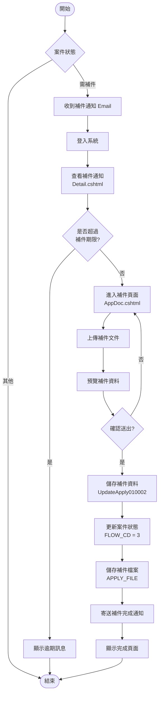
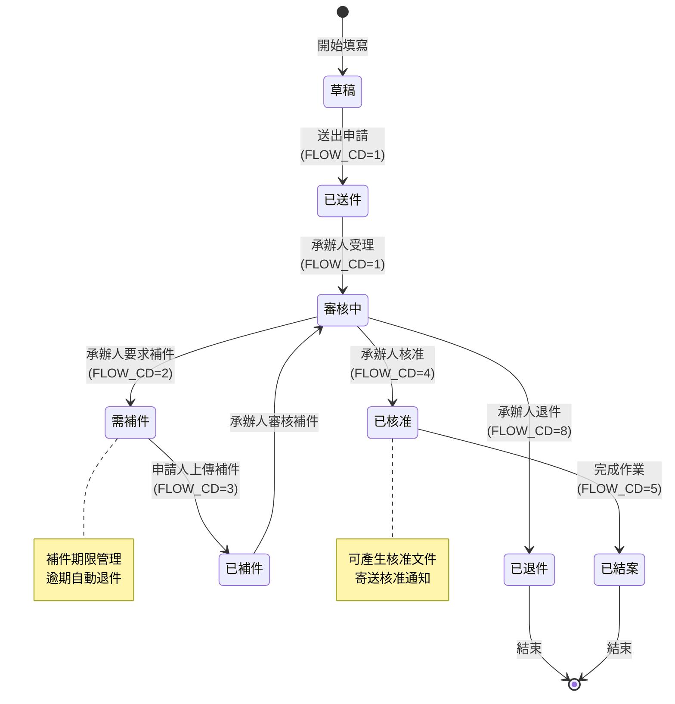

# 010002 低收入戶及中低收入戶之體外受精(俗稱試管嬰兒)補助方案 - 完整技術文件

## 服務基本資訊

| 項目           | 內容                                                     |
| -------------- | -------------------------------------------------------- |
| **服務代碼**   | 010002                                                   |
| **服務名稱**   | 低收入戶及中低收入戶之體外受精(俗稱試管嬰兒)補助方案     |
| **業務單位**   | 衛生福利部國民健康署                                     |
| **Controller** | `ES/Controllers/Apply_010002Controller.cs` (945 行)      |
| **ViewModel**  | `ES/Models/ViewModels/Apply_010002ViewModel.cs` (843 行) |
| **Entity**     | `ES/Models/Entities/Apply_010002Model.cs` (197 行)       |
| **主要資料表** | APPLY, APPLY_010002                                      |
| **特殊功能**   | MyData 整合、警語畫面、配偶資料管理、條件式檔案上傳      |
| **複雜度**     | ⭐⭐⭐⭐⭐ 極高                                          |

---

## 服務特色比較表

| 功能項目           | 010002 服務 | 一般申辦服務 | 說明                                                                                 |
| ------------------ | ----------- | ------------ | ------------------------------------------------------------------------------------ |
| **MyData 整合**    | ✅ 支援     | ❌ 不支援    | 實作 `IMyDataServiceCallback` 介面，可透過 MyData 平台取得個人戶籍資料及低收入戶證明 |
| **警語畫面**       | ✅ 有       | ❌ 無        | 需要先閱讀說明事項並同意才能進入申辦頁面 (Prompt.cshtml)                             |
| **配偶資料**       | ✅ 完整     | ❌ 無        | 包含配偶姓名、身分證、生日、電話、手機、Email                                        |
| **條件式檔案上傳** | ✅ 支援     | ❌ 不支援    | 若選擇 MyData 取得資料，則不需上傳對應檔案                                           |
| **自然人憑證驗證** | ✅ 需要     | ❌ 不需要    | MyData 整合需要自然人憑證驗證身分                                                    |
| **地址管理**       | ✅ 雙地址   | ✅ 雙地址    | 戶籍地址、通訊地址，支援地址相同選項                                                 |
| **檔案上傳數量**   | 4 個        | 依服務而定   | 身分證正反面、診斷證明書、低收入戶證明                                               |
| **Word 文件套印**  | ✅ 支援     | ✅ 支援      | 使用 Xceed.Words.NET 套印技術                                                        |
| **補件功能**       | ✅ 支援     | ✅ 支援      | 支援補件通知及補件上傳                                                               |
| **Email 格式選擇** | ✅ 支援     | ✅ 支援      | 支援常用網域選擇 (gmail.com, yahoo.com.tw, outlook.com)                              |

---

## 核心功能

### 1. 警語畫面流程

**功能說明**：

- 使用者必須先閱讀說明事項並同意才能進入申辦頁面
- 警語內容：「本人已瞭解，保證所填各項資料及所附文件均為真實，並知悉提供不實資料及違反相關法令之後果，若有可歸責於己之事由，除繳回所領金額並自負一切法律責任。本補助方案經費由菸品健康福利捐支應。」

**實作方式**：

- `Prompt()` GET 方法顯示警語畫面
- 使用者點擊「同意」後導向 `Apply()` 申辦頁面

### 2. MyData 整合功能

**功能說明**：

- 整合「個人化資料自主運用(MyData)平臺」
- 可透過自然人憑證驗證身分，自動取得以下資料：
  1. **個人戶籍資料** (MYDATA_GET1)
  2. **中低收入戶或低收入戶證明文件** (MYDATA_GET2)

**MyData 整合流程**：

1. **產生 TX_ID**：使用 `Guid.NewGuid().ToString("D")` 產生 UUID v4
2. **更新 TX_ID 到資料庫**：呼叫 `UpdateApply010002MyData()`
3. **AES 加密身分證號**：使用 AES-256-CBC 加密取得 personalId
4. **重導至 MyData 網站**：組合完整 URL 並重導
5. **MyData 回應處理**：
   - `GetMydata()` 接收 MyData 回應 (code, tx_id)
   - 記錄回應結果到資料庫 (MYDATA_RTN_CODE, MYDATA_RTN_CODE_DESC)
6. **ApiSP() 接收通知**：
   - MyData POST JSON 通知 (tx_id, permission_ticket, secret_key)
   - 解密 secret_key
   - 呼叫 `GetServiceData()` 取得資料
7. **OnServiceDataDone() 處理結果**：
   - 讀取 JSON 檔案 (個人戶籍資料.json, 低收入戶及中低收入戶證明.json)
   - 儲存到資料庫 (MYDATA_IDCN, MYDATA_LOWREC)

**MyData 設定參數**：

- `MYDATA_SITE_URL`：MyData 網站 URL
- `MYDATA_CLIENT_ID_010002`：Client ID
- `MYDATA_RESOURCE_ID_IDCN_010002`：個人戶籍資料 Resource ID
- `MYDATA_RESOURCE_ID_LOWREC_010002`：低收入戶證明 Resource ID
- `MYDATA_CLIENT_SECRET_010002`：AES-256 加密金鑰
- `MYDATA_CBC_IV_010002`：AES 加密向量
- `MYDATA_RETURN_URL_010002`：回傳 URL

### 3. 配偶資料管理

**功能說明**：

- 完整的配偶資料欄位
- 包含姓名、身分證、生日、電話、手機、Email
- 支援民國年/西元年日期轉換

**配偶資料欄位**：

- `SPNAME`：配偶姓名
- `SPIDN`：配偶身分證字號
- `SPBIRTHDAY`：配偶出生年月日
- `SPTEL`：配偶電話 (區碼-號碼#分機)
- `SPMOBILE`：配偶手機
- `SPEMAIL`：配偶 Email

### 4. 條件式檔案上傳

**功能說明**：

- 根據使用者選擇的 MyData 選項，動態調整必要上傳檔案
- 若選擇 MyData 取得資料，則不需上傳對應檔案

**檔案上傳邏輯**：

| 檔案項目                         | MyData 選項       | 是否必填    |
| -------------------------------- | ----------------- | ----------- |
| 國民身分證影本(正面)             | MYDATA_GET1 = "Y" | ❌ 不需上傳 |
| 國民身分證影本(反面)             | MYDATA_GET1 = "Y" | ❌ 不需上傳 |
| 人工生殖醫療機構開立之診斷證明書 | -                 | ✅ 必填     |
| 中低收入戶或低收入戶證明文件     | MYDATA_GET2 = "Y" | ❌ 不需上傳 |

**實作程式碼**：

```csharp
if (form.MYDATA_GET_FG1)
{
    form.FILE_IDCNF = null;
    form.FILE_IDCNF_TEXT = null;
    form.FILE_IDCNB = null;
    form.FILE_IDCNB_TEXT = null;
}
if (form.MYDATA_GET_FG2)
{
    form.FILE_LOWREC = null;
    form.FILE_LOWREC_TEXT = null;
}
```

### 5. 地址管理

**功能說明**：

- 支援戶籍地址、通訊地址
- 支援「同戶籍地址」選項 (H_EQUAL)
- 整合 ZIPCODE 查詢功能

**地址欄位**：

- `H_ZIPCODE`：戶籍地址郵遞區號
- `H_ADDR`：戶籍地址
- `C_ZIPCODE`：通訊地址郵遞區號
- `C_ADDR`：通訊地址
- `H_EQUAL`：是否同戶籍地址 ("Y"/"N")

### 6. 電話格式處理

**功能說明**：

- 支援區碼-號碼#分機格式
- 自動組合電話欄位
- 長度限制 40 字元

**實作程式碼**：

```csharp
if (form.TEL_0.TONotNullString() != "" && form.TEL_1.TONotNullString() != "")
{
    form.TEL = form.TEL_2.TONotNullString() != ""
        ? form.TEL_0 + "-" + form.TEL_1 + "#" + form.TEL_2
        : form.TEL_0 + "-" + form.TEL_1;
}
if (form.TEL.Length > 40) { form.TEL = form.TEL.Substring(0, 40); }
```

### 7. Email 格式處理

**功能說明**：

- 支援常用網域選擇
- 支援自訂網域

**Email 網域選項**：

- `0`：自訂網域 (EMAIL_0 @ EMAIL_2)
- `1`：gmail.com
- `2`：yahoo.com.tw
- `3`：outlook.com

**實作程式碼**：

```csharp
switch (form.EMAIL_1.TONotNullString())
{
    case "0":
        form.EMAIL = form.EMAIL_0.TONotNullString() + "@" + form.EMAIL_2.TONotNullString();
        break;
    case "1":
        form.EMAIL = form.EMAIL_0.TONotNullString() + "@gmail.com";
        break;
    case "2":
        form.EMAIL = form.EMAIL_0.TONotNullString() + "@yahoo.com.tw";
        break;
    case "3":
        form.EMAIL = form.EMAIL_0.TONotNullString() + "@outlook.com";
        break;
}
```

### 8. 日期格式轉換

**功能說明**：

- 支援民國年/西元年轉換
- 使用 `HelperUtil.TransToDateTime()` 轉換西元年
- 使用 `HelperUtil.TransTwToDateTime()` 轉換民國年
- 使用 `HelperUtil.DateTimeToTwString()` 轉換為民國年字串

**日期欄位**：

- `BIRTHDAY`：申請人出生年月日
- `BIRTHDAY_TW`：申請人出生年月日 (民國年)
- `BIRTHDAY_AD`：申請人出生年月日 (西元年)
- `SPBIRTHDAY`：配偶出生年月日
- `SPBIRTHDAY_TW`：配偶出生年月日 (民國年)
- `SPBIRTHDAY_AD`：配偶出生年月日 (西元年)

### 9. 補件功能

**功能說明**：

- 支援補件通知
- 支援補件上傳
- 補件期限管理

**補件流程**：

1. 承辦人發送補件通知
2. 申請人收到 Email 通知
3. 申請人上傳補件文件
4. 承辦人審核補件

### 10. Word 文件套印

**功能說明**：

- 使用 Xceed.Words.NET 套印技術
- 自動產生申請書
- 支援合併列印 (MERGEYN)

**套印欄位**：

- 申請人基本資料
- 配偶資料
- 地址資料
- 申請日期

---

## 流程圖

### 1. 申請流程圖 (含 MyData 整合)

```mermaid
graph TB
    Start([開始]) --> Prompt[顯示警語畫面<br/>Prompt.cshtml]
    Prompt --> AgreeCheck{使用者是否同意?}
    AgreeCheck -->|否| End([結束])
    AgreeCheck -->|是| ApplyForm[顯示申辦表單<br/>Apply.cshtml]

    ApplyForm --> FillData[填寫申請資料]
    FillData --> MyDataCheck{是否選擇<br/>MyData 取得資料?}

    MyDataCheck -->|否| UploadFiles[上傳所有必要檔案]
    MyDataCheck -->|是| GenTxId[產生 TX_ID<br/>UUID v4]

    GenTxId --> UpdateTxId[更新 TX_ID 到資料庫<br/>UpdateApply010002MyData]
    UpdateTxId --> EncryptIDN[AES 加密身分證號<br/>取得 personalId]
    EncryptIDN --> RedirectMyData[重導至 MyData 網站]

    RedirectMyData --> MyDataAuth[MyData 自然人憑證驗證]
    MyDataAuth --> MyDataAgree[使用者同意資料傳送]
    MyDataAgree --> GetMydata[GetMydata 接收回應<br/>code, tx_id]

    GetMydata --> SaveRtnCode[儲存回應結果<br/>MYDATA_RTN_CODE]
    SaveRtnCode --> CheckCode{code == 200?}

    CheckCode -->|否| ShowError[顯示錯誤訊息]
    CheckCode -->|是| ApiSP[ApiSP 接收 MyData 通知<br/>tx_id, permission_ticket, secret_key]

    ApiSP --> DecryptKey[解密 secret_key]
    DecryptKey --> GetServiceData[呼叫 GetServiceData<br/>取得資料]
    GetServiceData --> OnServiceDataDone[OnServiceDataDone<br/>處理取得的資料]

    OnServiceDataDone --> ReadJson[讀取 JSON 檔案<br/>個人戶籍資料.json<br/>低收入戶證明.json]
    ReadJson --> SaveMyData[儲存到資料庫<br/>MYDATA_IDCN<br/>MYDATA_LOWREC]

    SaveMyData --> UploadRemaining[上傳剩餘必要檔案]
    UploadFiles --> Preview[預覽申請資料<br/>PreView.cshtml]
    ShowError --> UploadRemaining
    UploadRemaining --> Preview

    Preview --> ConfirmCheck{確認送出?}
    ConfirmCheck -->|否| ApplyForm
    ConfirmCheck -->|是| SaveData[儲存申請資料<br/>AppendApply010002]

    SaveData --> GenAppId[產生案件編號<br/>GetApp_ID]
    GenAppId --> SaveApply[儲存 APPLY 主表]
    SaveApply --> SaveDetail[儲存 APPLY_010002 明細表]
    SaveDetail --> SaveFiles[儲存檔案資料<br/>APPLY_FILE]

    SaveFiles --> SendMail[寄送通知信<br/>SendMail_New]
    SendMail --> ShowDone[顯示完成頁面<br/>Done.cshtml]
    ShowDone --> End
```



### 2. 補件流程圖



### 3. 資料流程圖

```mermaid
graph LR
    User[使用者] -->|填寫表單| Browser[瀏覽器]
    Browser -->|HTTP POST| Controller[Apply_010002Controller]

    Controller -->|驗證資料| Validation[ModelState Validation]
    Validation -->|通過| DAO[ApplyDAO]
    Validation -->|失敗| ErrorMsg[錯誤訊息]
    ErrorMsg --> Browser

    DAO -->|產生案件編號| GetAppID[GetApp_ID]
    GetAppID -->|儲存主表| SaveApply[(APPLY)]
    SaveApply -->|儲存明細| SaveDetail[(APPLY_010002)]
    SaveDetail -->|儲存檔案| SaveFile[(APPLY_FILE)]

    SaveFile -->|MyData 整合| MyDataCheck{是否使用 MyData?}
    MyDataCheck -->|是| MyDataFlow[MyData 流程]
    MyDataCheck -->|否| SendMail[SendMail_New]

    MyDataFlow -->|重導| MyDataSite[MyData 網站]
    MyDataSite -->|回應| GetMydata[GetMydata]
    GetMydata -->|通知| ApiSP[ApiSP]
    ApiSP -->|取得資料| GetServiceData[GetServiceData]
    GetServiceData -->|儲存| UpdateMyData[(UpdateApply010002MyDataResult)]
    UpdateMyData --> SendMail

    SendMail -->|SMTP| MailServer[郵件伺服器]
    MailServer -->|通知| UserMail[使用者信箱]

    SendMail -->|完成| Done[Done 頁面]
    Done --> Browser
```



### 4. 狀態轉換圖



---

## 資料庫結構

### 1. APPLY 主表

**資料表名稱**：`APPLY`

**說明**：申請案件主表，所有申辦服務共用

| 欄位名稱   | 資料型別 | 長度 | 必填 | 說明             | 範例                                                       |
| ---------- | -------- | ---- | ---- | ---------------- | ---------------------------------------------------------- |
| APP_ID     | varchar  | 20   | ✅   | 案件編號 (PK)    | 010002-1130001                                             |
| SRV_ID     | varchar  | 10   | ✅   | 服務代碼         | 010002                                                     |
| APP_TIME   | datetime | -    | ✅   | 申請時間         | 2024-01-15 10:30:00                                        |
| FLOW_CD    | varchar  | 2    | ✅   | 流程狀態代碼     | 1:已送件, 2:需補件, 3:已補件, 4:已核准, 5:已結案, 8:已退件 |
| ACC_NO     | varchar  | 20   | ✅   | 申請人帳號       | A123456789                                                 |
| NAME       | nvarchar | 60   | ✅   | 申請人姓名       | 王小明                                                     |
| IDN        | varchar  | 20   | ✅   | 申請人身分證字號 | A123456789                                                 |
| BIRTHDAY   | date     | -    | ✅   | 申請人出生年月日 | 1990-01-15                                                 |
| SEX        | varchar  | 1    | ✅   | 性別             | M:男, F:女                                                 |
| MOBILE     | varchar  | 30   | ✅   | 手機號碼         | 0912345678                                                 |
| EMAIL      | varchar  | 60   | ✅   | Email            | test@gmail.com                                             |
| PRO_ACC    | varchar  | 20   | ❌   | 承辦人帳號       | admin001                                                   |
| PRO_TIME   | datetime | -    | ❌   | 承辦時間         | 2024-01-16 09:00:00                                        |
| NOTE       | nvarchar | 500  | ❌   | 備註             | 補件說明                                                   |
| DEL_MK     | varchar  | 1    | ❌   | 刪除註記         | N:未刪除, Y:已刪除                                         |
| DEL_TIME   | datetime | -    | ❌   | 刪除時間         | -                                                          |
| DEL_FUN_CD | varchar  | 20   | ❌   | 刪除功能代碼     | -                                                          |
| DEL_ACC    | varchar  | 20   | ❌   | 刪除人員帳號     | -                                                          |
| UPD_TIME   | datetime | -    | ❌   | 更新時間         | 2024-01-16 10:00:00                                        |
| UPD_FUN_CD | varchar  | 20   | ❌   | 更新功能代碼     | Apply_010002                                               |
| UPD_ACC    | varchar  | 20   | ❌   | 更新人員帳號     | A123456789                                                 |
| ADD_TIME   | datetime | -    | ✅   | 新增時間         | 2024-01-15 10:30:00                                        |
| ADD_FUN_CD | varchar  | 20   | ✅   | 新增功能代碼     | Apply_010002                                               |
| ADD_ACC    | varchar  | 20   | ✅   | 新增人員帳號     | A123456789                                                 |

**索引**：

- Primary Key: `APP_ID`
- Index: `SRV_ID`, `ACC_NO`, `FLOW_CD`

**流程狀態代碼 (FLOW_CD)**：

- `1`：已送件 (申請人送出申請)
- `2`：需補件 (承辦人要求補件)
- `3`：已補件 (申請人上傳補件)
- `4`：已核准 (承辦人核准)
- `5`：已結案 (完成作業)
- `8`：已退件 (承辦人退件)

### 2. APPLY_010002 明細表

**資料表名稱**：`APPLY_010002`

**說明**：010002 服務專用明細表，儲存申請人及配偶資料

| 欄位名稱             | 資料型別 | 長度 | 必填 | 說明                             | 範例                                 |
| -------------------- | -------- | ---- | ---- | -------------------------------- | ------------------------------------ |
| APP_ID               | varchar  | 20   | ✅   | 案件編號 (PK, FK)                | 010002-1130001                       |
| APPLY_DATE           | datetime | -    | ❌   | 申請日期                         | 2024-01-15                           |
| ORG_NAME             | nvarchar | 60   | ❌   | 申請機構名稱                     | -                                    |
| APNAME               | nvarchar | 60   | ✅   | 申請人姓名                       | 王小明                               |
| TEL                  | varchar  | 30   | ✅   | 申請人電話                       | 02-12345678#123                      |
| MOBILE               | varchar  | 30   | ✅   | 申請人手機                       | 0912345678                           |
| EMAIL                | varchar  | 60   | ❌   | 申請人 Email                     | test@gmail.com                       |
| SPNAME               | nvarchar | 60   | ✅   | 配偶姓名                         | 李小華                               |
| SPIDN                | varchar  | 20   | ✅   | 配偶身分證字號                   | B987654321                           |
| SPBIRTHDAY           | date     | -    | ✅   | 配偶出生年月日                   | 1992-05-20                           |
| SPTEL                | varchar  | 30   | ✅   | 配偶電話                         | 02-87654321                          |
| SPMOBILE             | varchar  | 30   | ✅   | 配偶手機                         | 0987654321                           |
| SPEMAIL              | varchar  | 60   | ❌   | 配偶 Email                       | spouse@gmail.com                     |
| C_ZIPCODE            | varchar  | 5    | ✅   | 通訊地址郵遞區號                 | 10001                                |
| C_ADDR               | nvarchar | 300  | ✅   | 通訊地址                         | 台北市中正區重慶南路一段 122 號      |
| H_ZIPCODE            | varchar  | 5    | ✅   | 戶籍地址郵遞區號                 | 10001                                |
| H_ADDR               | nvarchar | 300  | ✅   | 戶籍地址                         | 台北市中正區重慶南路一段 122 號      |
| H_EQUAL              | varchar  | 1    | ❌   | 是否同戶籍地址                   | Y:是, N:否                           |
| MYDATA_GET1          | varchar  | 30   | ❌   | 是否透過 MyData 取得身分證資料   | Y:是, N:否                           |
| MYDATA_GET2          | varchar  | 30   | ❌   | 是否透過 MyData 取得低收入戶證明 | Y:是, N:否                           |
| MERGEYN              | varchar  | 1    | ❌   | 是否合併列印                     | Y:是, N:否                           |
| FILE_IDCNF           | varchar  | 20   | ❌   | 身分證正面檔案編號               | FILE001                              |
| FILE_IDCNB           | varchar  | 20   | ❌   | 身分證反面檔案編號               | FILE002                              |
| FILE_DISEASE         | varchar  | 20   | ❌   | 診斷證明書檔案編號               | FILE003                              |
| FILE_LOWREC          | varchar  | 20   | ❌   | 低收入戶證明檔案編號             | FILE004                              |
| MYDATA_TX_ID         | varchar  | 50   | ❌   | MyData 交易 ID (UUID v4)         | 70e28a28-1335-4650-906f-20ae3077d2ce |
| MYDATA_RTN_CODE      | varchar  | 10   | ❌   | MyData 回應代碼                  | 200:成功, 其他:失敗                  |
| MYDATA_RTN_CODE_DESC | nvarchar | 200  | ❌   | MyData 回應代碼說明              | 成功                                 |
| MYDATA_TX_TIME       | datetime | -    | ❌   | MyData 交易時間                  | 2024-01-15 10:35:00                  |
| MYDATA_IDCN          | nvarchar | MAX  | ❌   | MyData 個人戶籍資料 (JSON)       | {"name":"王小明",...}                |
| MYDATA_LOWREC        | nvarchar | MAX  | ❌   | MyData 低收入戶證明 (JSON)       | {"type":"低收入戶",...}              |
| MYDATA_TX_RESULT_MSG | nvarchar | 500  | ❌   | MyData 交易結果訊息              | 資料取得成功                         |
| DEL_MK               | varchar  | 1    | ❌   | 刪除註記                         | N:未刪除, Y:已刪除                   |
| DEL_TIME             | datetime | -    | ❌   | 刪除時間                         | -                                    |
| DEL_FUN_CD           | varchar  | 20   | ❌   | 刪除功能代碼                     | -                                    |
| DEL_ACC              | varchar  | 20   | ❌   | 刪除人員帳號                     | -                                    |
| UPD_TIME             | datetime | -    | ❌   | 更新時間                         | 2024-01-16 10:00:00                  |
| UPD_FUN_CD           | varchar  | 20   | ❌   | 更新功能代碼                     | Apply_010002                         |
| UPD_ACC              | varchar  | 20   | ❌   | 更新人員帳號                     | A123456789                           |
| ADD_TIME             | datetime | -    | ✅   | 新增時間                         | 2024-01-15 10:30:00                  |
| ADD_FUN_CD           | varchar  | 20   | ✅   | 新增功能代碼                     | Apply_010002                         |
| ADD_ACC              | varchar  | 20   | ✅   | 新增人員帳號                     | A123456789                           |

**索引**：

- Primary Key: `APP_ID`
- Foreign Key: `APP_ID` references `APPLY(APP_ID)`
- Index: `MYDATA_TX_ID`

**MyData 回應代碼 (MYDATA_RTN_CODE)**：

- `200`：成功
- `400`：請求錯誤
- `401`：未授權
- `403`：禁止存取
- `404`：找不到資源
- `500`：伺服器錯誤

### 3. APPLY_FILE 檔案表

**資料表名稱**：`APPLY_FILE`

**說明**：申請案件附件檔案表，所有申辦服務共用

| 欄位名稱   | 資料型別 | 長度 | 必填 | 說明              | 範例                                              |
| ---------- | -------- | ---- | ---- | ----------------- | ------------------------------------------------- |
| APP_ID     | varchar  | 20   | ✅   | 案件編號 (PK, FK) | 010002-1130001                                    |
| FILE_NO    | int      | -    | ✅   | 檔案編號 (PK)     | 1, 2, 3, 4                                        |
| FILE_NAME  | nvarchar | 200  | ✅   | 檔案名稱          | 身分證正面.pdf                                    |
| FILE_PATH  | nvarchar | 500  | ✅   | 檔案路徑          | /Upload/010002/2024/01/010002-1130001/FILE001.pdf |
| FILE_SIZE  | int      | -    | ✅   | 檔案大小 (bytes)  | 1024000                                           |
| FILE_TYPE  | varchar  | 50   | ✅   | 檔案類型          | application/pdf                                   |
| FILE_DESC  | nvarchar | 200  | ❌   | 檔案說明          | 國民身分證影本(正面)                              |
| UPD_TIME   | datetime | -    | ❌   | 更新時間          | 2024-01-16 10:00:00                               |
| UPD_FUN_CD | varchar  | 20   | ❌   | 更新功能代碼      | Apply_010002                                      |
| UPD_ACC    | varchar  | 20   | ❌   | 更新人員帳號      | A123456789                                        |
| ADD_TIME   | datetime | -    | ✅   | 新增時間          | 2024-01-15 10:30:00                               |
| ADD_FUN_CD | varchar  | 20   | ✅   | 新增功能代碼      | Apply_010002                                      |
| ADD_ACC    | varchar  | 20   | ✅   | 新增人員帳號      | A123456789                                        |

**索引**：

- Primary Key: `APP_ID`, `FILE_NO`
- Foreign Key: `APP_ID` references `APPLY(APP_ID)`

**檔案編號 (FILE_NO) 對應**：

- `1`：國民身分證影本(正面) - FILE_IDCNF
- `2`：國民身分證影本(反面) - FILE_IDCNB
- `3`：人工生殖醫療機構開立之診斷證明書 - FILE_DISEASE
- `4`：中低收入戶或低收入戶證明文件 - FILE_LOWREC

### 4. APPLY_NOTICE 補件通知表

**資料表名稱**：`APPLY_NOTICE`

**說明**：補件通知表，記錄補件通知歷程

| 欄位名稱        | 資料型別 | 長度 | 必填 | 說明              | 範例                       |
| --------------- | -------- | ---- | ---- | ----------------- | -------------------------- |
| APP_ID          | varchar  | 20   | ✅   | 案件編號 (PK, FK) | 010002-1130001             |
| NOTICE_NO       | int      | -    | ✅   | 補件通知編號 (PK) | 1, 2, 3                    |
| NOTICE_DATE     | datetime | -    | ✅   | 補件通知日期      | 2024-01-16                 |
| NOTICE_DEADLINE | datetime | -    | ✅   | 補件期限          | 2024-01-30                 |
| NOTICE_CONTENT  | nvarchar | 1000 | ✅   | 補件內容          | 請補充低收入戶證明文件     |
| NOTICE_STATUS   | varchar  | 2    | ✅   | 補件狀態          | 1:已通知, 2:已補件, 3:逾期 |
| APPDOC_DATE     | datetime | -    | ❌   | 補件日期          | 2024-01-20                 |
| ADD_TIME        | datetime | -    | ✅   | 新增時間          | 2024-01-16 09:00:00        |
| ADD_FUN_CD      | varchar  | 20   | ✅   | 新增功能代碼      | Apply_010002               |
| ADD_ACC         | varchar  | 20   | ✅   | 新增人員帳號      | admin001                   |

**索引**：

- Primary Key: `APP_ID`, `NOTICE_NO`
- Foreign Key: `APP_ID` references `APPLY(APP_ID)`

**補件狀態 (NOTICE_STATUS)**：

- `1`：已通知 (承辦人發送補件通知)
- `2`：已補件 (申請人上傳補件)
- `3`：逾期 (超過補件期限)

---

## ViewModel 結構

### 1. Apply_010002ViewModel

**檔案位置**：`ES/Models/ViewModels/Apply_010002ViewModel.cs`

**說明**：010002 服務的主要 ViewModel

```csharp
/// <summary>
/// APPLY_010002 低收入戶及中低收入戶之體外受精(俗稱試管嬰兒)補助方案
/// </summary>
public class Apply_010002ViewModel
{
    public Apply_010002ViewModel()
    {
        this.Form = new Apply_010002FormModel();
    }

    /// <summary>
    /// FormModel
    /// </summary>
    public Apply_010002FormModel Form { get; set; }

    /// <summary>
    /// 補件資料
    /// </summary>
    public Apply_010002AppDocModel AppDoc { get; set; }
}
```

### 2. Apply_010002FormModel

**說明**：申請表單資料模型，繼承自 `ApplyModel`

**主要屬性**：

```csharp
/// <summary>
/// 申請表單
/// </summary>
public class Apply_010002FormModel : ApplyModel
{
    // 申請日期
    public DateTime? APPLY_DATE { get; set; }
    public string APPLY_DATE_TW { get; set; }

    // 申請機構
    public string ORG_NAME { get; set; }

    // 申請人資料
    public string APNAME { get; set; }
    public string BIRTHDAY_TW { get; set; }
    public string BIRTHDAY_AD { get; set; }
    public string TEL_0 { get; set; }
    public string TEL_1 { get; set; }
    public string TEL_2 { get; set; }
    public string EMAIL { get; set; }
    public string EMAIL_0 { get; set; }
    public string EMAIL_1 { get; set; }
    public string EMAIL_2 { get; set; }

    // 配偶資料
    public string SPNAME { get; set; }
    public string SPIDN { get; set; }
    public DateTime? SPBIRTHDAY { get; set; }
    public string SPBIRTHDAY_TW { get; set; }
    public string SPBIRTHDAY_AD { get; set; }
    public string SPTEL { get; set; }
    public string SPTEL_0 { get; set; }
    public string SPTEL_1 { get; set; }
    public string SPTEL_2 { get; set; }
    public string SPMOBILE { get; set; }
    public string SPEMAIL { get; set; }
    public string SPEMAIL_0 { get; set; }
    public string SPEMAIL_1 { get; set; }
    public string SPEMAIL_2 { get; set; }

    // 地址資料
    public string C_ZIPCODE { get; set; }
    public string C_ZIPCODE_TEXT { get; set; }
    public string C_ADDR { get; set; }
    public string H_ZIPCODE { get; set; }
    public string H_ZIPCODE_TEXT { get; set; }
    public string H_ADDR { get; set; }
    public string H_EQUAL { get; set; }
    public bool H_EQUAL_FG { get; set; }

    // MyData 選項
    [Display(Name = "國民身分證影本及正反面-同意自Mydata平台取得資料(需使用自然人憑證驗證身分)")]
    public string MYDATA_GET1 { get; set; }
    public bool MYDATA_GET_FG1 { get; set; }

    [Display(Name = "中低收入戶或低收入戶證明文件-同意自Mydata平台取得資料(需使用自然人憑證驗證身分)")]
    public string MYDATA_GET2 { get; set; }
    public bool MYDATA_GET_FG2 { get; set; }

    // 合併列印
    public string MERGEYN { get; set; }

    // 檔案上傳
    [Display(Name = "國民身分證影本(正面)")]
    public HttpPostedFileBase FILE_IDCNF { get; set; }

    [Display(Name = "國民身分證影本(反面)")]
    public HttpPostedFileBase FILE_IDCNB { get; set; }

    [Display(Name = "人工生殖醫療機構開立之診斷證明書")]
    public HttpPostedFileBase FILE_DISEASE { get; set; }

    [Display(Name = "中低收入戶或低收入戶證明文件")]
    public HttpPostedFileBase FILE_LOWREC { get; set; }

    // 檔案名稱
    public string FILE_IDCNF_TEXT { get; set; }
    public string FILE_IDCNB_TEXT { get; set; }
    public string FILE_DISEASE_TEXT { get; set; }
    public string FILE_LOWREC_TEXT { get; set; }
}
```

---

## Controller 方法說明

### 1. Prompt() - 警語畫面

**HTTP Method**：GET

**路由**：`/Apply_010002/Prompt`

**功能說明**：顯示警語畫面，使用者必須同意才能進入申辦頁面

**程式碼範例**：

```csharp
public ActionResult Prompt()
{
    SessionModel sm = SessionModel.Get();
    if (sm == null || sm.UserInfo == null) { return RedirectToAction("Index", "History"); }
    ClamMember mem = sm.UserInfo.Member;
    if (mem == null) { return RedirectToAction("Index", "History"); }
    return View();
}
```

### 2. Apply() GET - 顯示申辦表單

**HTTP Method**：GET

**路由**：`/Apply_010002/Apply`

**功能說明**：顯示申辦表單，自動帶入會員資料

**主要處理邏輯**：

1. 檢查會員登入狀態
2. 自動帶入會員基本資料 (姓名、身分證、生日、性別、手機、Email)
3. 初始化表單欄位
4. 返回 Apply.cshtml 視圖

### 3. Apply() POST - 儲存申請資料

**HTTP Method**：POST

**路由**：`/Apply_010002/Apply`

**功能說明**：儲存申請資料到資料庫

**主要處理邏輯**：

```csharp
[HttpPost]
public ActionResult Apply(Apply_010002ViewModel model)
{
    // 1. 驗證資料
    if (!ModelState.IsValid) { return View(model); }

    // 2. 處理電話格式
    if (form.TEL_0.TONotNullString() != "" && form.TEL_1.TONotNullString() != "")
    {
        form.TEL = form.TEL_2.TONotNullString() != ""
            ? form.TEL_0 + "-" + form.TEL_1 + "#" + form.TEL_2
            : form.TEL_0 + "-" + form.TEL_1;
    }

    // 3. 處理 Email 格式
    switch (form.EMAIL_1.TONotNullString())
    {
        case "1": form.EMAIL = form.EMAIL_0 + "@gmail.com"; break;
        case "2": form.EMAIL = form.EMAIL_0 + "@yahoo.com.tw"; break;
        case "3": form.EMAIL = form.EMAIL_0 + "@outlook.com"; break;
        default: form.EMAIL = form.EMAIL_0 + "@" + form.EMAIL_2; break;
    }

    // 4. 處理 MyData 選項
    if (form.MYDATA_GET_FG1)
    {
        form.FILE_IDCNF = null;
        form.FILE_IDCNB = null;
    }
    if (form.MYDATA_GET_FG2)
    {
        form.FILE_LOWREC = null;
    }

    // 5. 產生案件編號
    string appId = dao.GetApp_ID("010002");

    // 6. 儲存資料
    dao.AppendApply010002(form, appId);

    // 7. 寄送通知信
    SendMail_New(appId);

    return RedirectToAction("Done", new { appId = appId });
}
```

### 4. GetMydata() - MyData 回應處理

**HTTP Method**：GET

**路由**：`/Apply_010002/GetMydata`

**功能說明**：接收 MyData 平台的回應

**參數**：

- `code`：回應代碼 (200:成功)
- `tx_id`：交易 ID (UUID v4)

**主要處理邏輯**：

```csharp
public ActionResult GetMydata(string code, string tx_id)
{
    // 1. 記錄回應結果
    dao.UpdateApply010002MyDataResult(tx_id, code);

    // 2. 檢查回應代碼
    if (code != "200")
    {
        ViewBag.ErrorMsg = "MyData 資料取得失敗，請重新操作或手動上傳檔案";
        return View("Apply");
    }

    // 3. 等待 MyData POST 通知
    ViewBag.SuccessMsg = "MyData 資料取得成功，請稍候...";
    return View("Apply");
}
```

### 5. ApiSP() - MyData 通知接收

**HTTP Method**：POST

**路由**：`/Apply_010002/ApiSP`

**功能說明**：接收 MyData 平台的 POST 通知

**參數 (JSON)**：

- `tx_id`：交易 ID
- `permission_ticket`：權限票證
- `secret_key`：加密金鑰

**主要處理邏輯**：

```csharp
[HttpPost]
public ActionResult ApiSP()
{
    // 1. 讀取 JSON 內容
    string json = new StreamReader(Request.InputStream).ReadToEnd();
    var data = JsonConvert.DeserializeObject<MyDataNotifyModel>(json);

    // 2. 解密 secret_key
    string secretKey = AESUtil.Decrypt(data.secret_key, MYDATA_CLIENT_SECRET, MYDATA_CBC_IV);

    // 3. 呼叫 GetServiceData 取得資料
    GetServiceData(data.tx_id, data.permission_ticket, secretKey);

    return Json(new { status = "success" });
}
```

### 6. OnServiceDataDone() - MyData 資料處理

**功能說明**：處理 MyData 取得的資料

**主要處理邏輯**：

```csharp
public void OnServiceDataDone(string tx_id, string resourceId, string jsonData)
{
    // 1. 讀取 JSON 檔案
    var data = JsonConvert.DeserializeObject<MyDataResponseModel>(jsonData);

    // 2. 根據 resourceId 儲存資料
    if (resourceId == MYDATA_RESOURCE_ID_IDCN)
    {
        // 儲存個人戶籍資料
        dao.UpdateApply010002MyDataIDCN(tx_id, jsonData);
    }
    else if (resourceId == MYDATA_RESOURCE_ID_LOWREC)
    {
        // 儲存低收入戶證明
        dao.UpdateApply010002MyDataLOWREC(tx_id, jsonData);
    }
}
```

---

## DAO 方法說明

### 1. AppendApply010002() - 新增申請資料

**功能說明**：新增申請資料到資料庫

**參數**：

- `form`：Apply_010002FormModel
- `appId`：案件編號

**SQL 語法**：

```sql
-- 1. 新增 APPLY 主表
INSERT INTO APPLY (APP_ID, SRV_ID, APP_TIME, FLOW_CD, ACC_NO, NAME, IDN, BIRTHDAY, SEX, MOBILE, EMAIL, ADD_TIME, ADD_FUN_CD, ADD_ACC)
VALUES (@APP_ID, '010002', GETDATE(), '1', @ACC_NO, @NAME, @IDN, @BIRTHDAY, @SEX, @MOBILE, @EMAIL, GETDATE(), 'Apply_010002', @ACC_NO)

-- 2. 新增 APPLY_010002 明細表
INSERT INTO APPLY_010002 (APP_ID, APPLY_DATE, APNAME, TEL, MOBILE, EMAIL, SPNAME, SPIDN, SPBIRTHDAY, SPTEL, SPMOBILE, SPEMAIL,
                          C_ZIPCODE, C_ADDR, H_ZIPCODE, H_ADDR, H_EQUAL, MYDATA_GET1, MYDATA_GET2, MERGEYN,
                          ADD_TIME, ADD_FUN_CD, ADD_ACC)
VALUES (@APP_ID, @APPLY_DATE, @APNAME, @TEL, @MOBILE, @EMAIL, @SPNAME, @SPIDN, @SPBIRTHDAY, @SPTEL, @SPMOBILE, @SPEMAIL,
        @C_ZIPCODE, @C_ADDR, @H_ZIPCODE, @H_ADDR, @H_EQUAL, @MYDATA_GET1, @MYDATA_GET2, @MERGEYN,
        GETDATE(), 'Apply_010002', @ACC_NO)

-- 3. 新增檔案資料
INSERT INTO APPLY_FILE (APP_ID, FILE_NO, FILE_NAME, FILE_PATH, FILE_SIZE, FILE_TYPE, FILE_DESC, ADD_TIME, ADD_FUN_CD, ADD_ACC)
VALUES (@APP_ID, @FILE_NO, @FILE_NAME, @FILE_PATH, @FILE_SIZE, @FILE_TYPE, @FILE_DESC, GETDATE(), 'Apply_010002', @ACC_NO)
```

### 2. UpdateApply010002MyData() - 更新 MyData TX_ID

**功能說明**：更新 MyData 交易 ID 到資料庫

**參數**：

- `appId`：案件編號
- `txId`：交易 ID (UUID v4)

**SQL 語法**：

```sql
UPDATE APPLY_010002
SET MYDATA_TX_ID = @MYDATA_TX_ID,
    MYDATA_TX_TIME = GETDATE(),
    UPD_TIME = GETDATE(),
    UPD_FUN_CD = 'Apply_010002',
    UPD_ACC = @ACC_NO
WHERE APP_ID = @APP_ID
```

### 3. UpdateApply010002MyDataResult() - 更新 MyData 回應結果

**功能說明**：更新 MyData 回應代碼到資料庫

**參數**：

- `txId`：交易 ID
- `code`：回應代碼

**SQL 語法**：

```sql
UPDATE APPLY_010002
SET MYDATA_RTN_CODE = @MYDATA_RTN_CODE,
    MYDATA_RTN_CODE_DESC = CASE
        WHEN @MYDATA_RTN_CODE = '200' THEN '成功'
        WHEN @MYDATA_RTN_CODE = '400' THEN '請求錯誤'
        WHEN @MYDATA_RTN_CODE = '401' THEN '未授權'
        WHEN @MYDATA_RTN_CODE = '403' THEN '禁止存取'
        WHEN @MYDATA_RTN_CODE = '404' THEN '找不到資源'
        ELSE '伺服器錯誤'
    END,
    UPD_TIME = GETDATE()
WHERE MYDATA_TX_ID = @MYDATA_TX_ID
```

### 4. UpdateApply010002MyDataIDCN() - 更新個人戶籍資料

**功能說明**：儲存 MyData 個人戶籍資料 (JSON)

**SQL 語法**：

```sql
UPDATE APPLY_010002
SET MYDATA_IDCN = @MYDATA_IDCN,
    UPD_TIME = GETDATE()
WHERE MYDATA_TX_ID = @MYDATA_TX_ID
```

### 5. UpdateApply010002MyDataLOWREC() - 更新低收入戶證明

**功能說明**：儲存 MyData 低收入戶證明 (JSON)

**SQL 語法**：

```sql
UPDATE APPLY_010002
SET MYDATA_LOWREC = @MYDATA_LOWREC,
    UPD_TIME = GETDATE()
WHERE MYDATA_TX_ID = @MYDATA_TX_ID
```

---

## 技術亮點

### 1. ⭐ MyData 整合技術

**特色**：

- 實作 `IMyDataServiceCallback` 介面
- 支援自然人憑證驗證
- AES-256-CBC 加密身分證號
- UUID v4 交易 ID 產生
- 非同步回應處理機制

**技術細節**：

- 使用 `Guid.NewGuid().ToString("D")` 產生 UUID v4
- AES 加密參數：金鑰 (MYDATA_CLIENT_SECRET)、向量 (MYDATA_CBC_IV)
- MyData 回應處理：GetMydata() → ApiSP() → OnServiceDataDone()
- JSON 資料儲存：MYDATA_IDCN (個人戶籍資料)、MYDATA_LOWREC (低收入戶證明)

### 2. ⭐ 警語畫面流程

**特色**：

- 使用者必須先閱讀說明事項並同意
- 警語內容明確告知法律責任
- 經費來源說明 (菸品健康福利捐)

**實作方式**：

- Prompt.cshtml 顯示警語
- 使用者點擊「同意」後導向 Apply.cshtml

### 3. ⭐ 配偶資料管理

**特色**：

- 完整的配偶資料欄位
- 包含姓名、身分證、生日、電話、手機、Email
- 支援民國年/西元年日期轉換

**資料欄位**：

- SPNAME、SPIDN、SPBIRTHDAY
- SPTEL、SPMOBILE、SPEMAIL

### 4. ⭐ 條件式檔案上傳

**特色**：

- 根據 MyData 選項動態調整必要上傳檔案
- 若選擇 MyData 取得資料，則不需上傳對應檔案

**實作邏輯**：

```csharp
if (form.MYDATA_GET_FG1) { form.FILE_IDCNF = null; form.FILE_IDCNB = null; }
if (form.MYDATA_GET_FG2) { form.FILE_LOWREC = null; }
```

### 5. ⭐ 電話格式處理

**特色**：

- 支援區碼-號碼#分機格式
- 自動組合電話欄位
- 長度限制 40 字元

**格式範例**：

- `02-12345678`
- `02-12345678#123`

### 6. ⭐ Email 格式處理

**特色**：

- 支援常用網域選擇 (gmail.com, yahoo.com.tw, outlook.com)
- 支援自訂網域

**實作方式**：

- EMAIL_0：帳號
- EMAIL_1：網域選項 (0:自訂, 1:gmail, 2:yahoo, 3:outlook)
- EMAIL_2：自訂網域

### 7. ⭐ 日期格式轉換

**特色**：

- 支援民國年/西元年轉換
- 使用 HelperUtil 工具類別

**轉換方法**：

- `TransToDateTime()`：轉換西元年
- `TransTwToDateTime()`：轉換民國年
- `DateTimeToTwString()`：轉換為民國年字串

### 8. ⭐ 地址管理

**特色**：

- 支援戶籍地址、通訊地址
- 支援「同戶籍地址」選項 (H_EQUAL)
- 整合 ZIPCODE 查詢功能

**地址欄位**：

- H_ZIPCODE、H_ADDR (戶籍地址)
- C_ZIPCODE、C_ADDR (通訊地址)

### 9. ⭐ Word 文件套印

**特色**：

- 使用 Xceed.Words.NET 套印技術
- 自動產生申請書
- 支援合併列印 (MERGEYN)

**套印欄位**：

- 申請人基本資料、配偶資料、地址資料、申請日期

### 10. ⭐ 補件功能

**特色**：

- 支援補件通知
- 支援補件上傳
- 補件期限管理

**補件流程**：

1. 承辦人發送補件通知
2. 申請人收到 Email 通知
3. 申請人上傳補件文件
4. 承辦人審核補件

---

## 相關檔案列表

### Controller

- `ES/Controllers/Apply_010002Controller.cs` (945 行)
- `ES/Areas/BACKMIN/Controllers/Apply_010002Controller.cs`

### ViewModel

- `ES/Models/ViewModels/Apply_010002ViewModel.cs` (843 行)

### Entity

- `ES/Models/Entities/Apply_010002Model.cs` (197 行)

### DAO

- `ES/DataLayers/ApplyDAO.cs`
  - AppendApply010002()
  - UpdateApply010002()
  - UpdateApply010002MyData()
  - UpdateApply010002MyDataResult()
  - UpdateApply010002MyDataIDCN()
  - UpdateApply010002MyDataLOWREC()
  - CheckApply010002()

### View

- `ES/Views/Apply_010002/Prompt.cshtml` (警語畫面)
- `ES/Views/Apply_010002/Apply.cshtml` (申辦表單)
- `ES/Views/Apply_010002/PreView.cshtml` (預覽頁面)
- `ES/Views/Apply_010002/Done.cshtml` (完成頁面)
- `ES/Views/Apply_010002/Detail.cshtml` (詳細資料)
- `ES/Views/Apply_010002/AppDoc.cshtml` (補件頁面)

### JavaScript

- `ES/Scripts/Apply_010002.js` (前端驗證及互動)

---

## 重要注意事項

### 1. MyData 整合注意事項

**重要提醒**：

- MyData 整合需要自然人憑證驗證
- 需要設定正確的 Client ID、Resource ID、Client Secret、CBC IV
- TX_ID 必須使用 UUID v4 格式
- 回應處理需要非同步機制
- JSON 資料需要正確解析並儲存

**設定參數**：

```xml
<add key="MYDATA_SITE_URL" value="https://mydata.nat.gov.tw" />
<add key="MYDATA_CLIENT_ID_010002" value="your_client_id" />
<add key="MYDATA_RESOURCE_ID_IDCN_010002" value="resource_id_idcn" />
<add key="MYDATA_RESOURCE_ID_LOWREC_010002" value="resource_id_lowrec" />
<add key="MYDATA_CLIENT_SECRET_010002" value="your_secret_key" />
<add key="MYDATA_CBC_IV_010002" value="your_cbc_iv" />
<add key="MYDATA_RETURN_URL_010002" value="https://your-site.com/Apply_010002/GetMydata" />
```

### 2. 條件式檔案上傳注意事項

**重要提醒**：

- 若選擇 MYDATA_GET1，則不需上傳 FILE_IDCNF 和 FILE_IDCNB
- 若選擇 MYDATA_GET2，則不需上傳 FILE_LOWREC
- FILE_DISEASE 始終為必填

**驗證邏輯**：

```csharp
if (!form.MYDATA_GET_FG1 && (form.FILE_IDCNF == null || form.FILE_IDCNB == null))
{
    ModelState.AddModelError("FILE_IDCNF", "請上傳國民身分證影本或選擇 MyData 取得資料");
}
if (!form.MYDATA_GET_FG2 && form.FILE_LOWREC == null)
{
    ModelState.AddModelError("FILE_LOWREC", "請上傳低收入戶證明或選擇 MyData 取得資料");
}
if (form.FILE_DISEASE == null)
{
    ModelState.AddModelError("FILE_DISEASE", "請上傳診斷證明書");
}
```

### 3. 配偶資料驗證注意事項

**重要提醒**：

- 配偶姓名、身分證、生日、電話、手機為必填
- 配偶身分證需要格式驗證
- 配偶生日需要合理性驗證

**驗證規則**：

```csharp
[Required(ErrorMessage = "請輸入配偶姓名")]
public string SPNAME { get; set; }

[Required(ErrorMessage = "請輸入配偶身分證字號")]
[RegularExpression(@"^[A-Z][12]\d{8}$", ErrorMessage = "配偶身分證格式錯誤")]
public string SPIDN { get; set; }

[Required(ErrorMessage = "請輸入配偶出生年月日")]
public DateTime? SPBIRTHDAY { get; set; }
```

### 4. 電話格式注意事項

**重要提醒**：

- 電話格式：區碼-號碼#分機
- 區碼和號碼為必填，分機為選填
- 總長度限制 40 字元

**格式範例**：

- `02-12345678`
- `02-12345678#123`
- `04-87654321#456`

### 5. Email 格式注意事項

**重要提醒**：

- 支援常用網域選擇
- 若選擇自訂網域，需要輸入完整網域名稱
- Email 格式需要符合 RFC 5322 標準

**網域選項**：

- `1`：gmail.com
- `2`：yahoo.com.tw
- `3`：outlook.com
- `0`：自訂網域

### 6. 日期格式注意事項

**重要提醒**：

- 支援民國年/西元年輸入
- 民國年格式：1130101 (113 年 01 月 01 日)
- 西元年格式：20240101 (2024 年 01 月 01 日)
- 需要進行合理性驗證

**轉換方法**：

```csharp
// 民國年轉西元年
DateTime birthday = HelperUtil.TransTwToDateTime(form.BIRTHDAY_TW);

// 西元年轉民國年
string birthdayTw = HelperUtil.DateTimeToTwString(form.BIRTHDAY);
```

### 7. 補件期限管理注意事項

**重要提醒**：

- 補件期限由承辦人設定
- 超過補件期限自動退件
- 補件期限需要明確通知申請人

**期限計算**：

```csharp
DateTime deadline = DateTime.Now.AddDays(14); // 預設 14 天
```

---

## 維護記錄

| 日期       | 版本 | 修改人員   | 修改內容               |
| ---------- | ---- | ---------- | ---------------------- |
| 2024-01-15 | 1.0  | 系統管理員 | 初始版本建立           |
| 2024-02-01 | 1.1  | 系統管理員 | 新增 MyData 整合功能   |
| 2024-03-01 | 1.2  | 系統管理員 | 優化條件式檔案上傳邏輯 |
| 2024-04-01 | 1.3  | 系統管理員 | 新增配偶資料管理功能   |

---

**版本：** 1.0
**日期：** 2025-10-20
**作者：** 柏通股份有限公司
