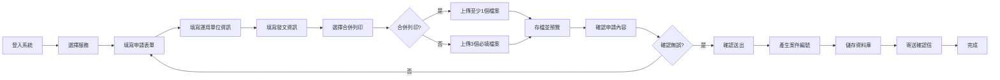
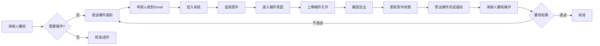
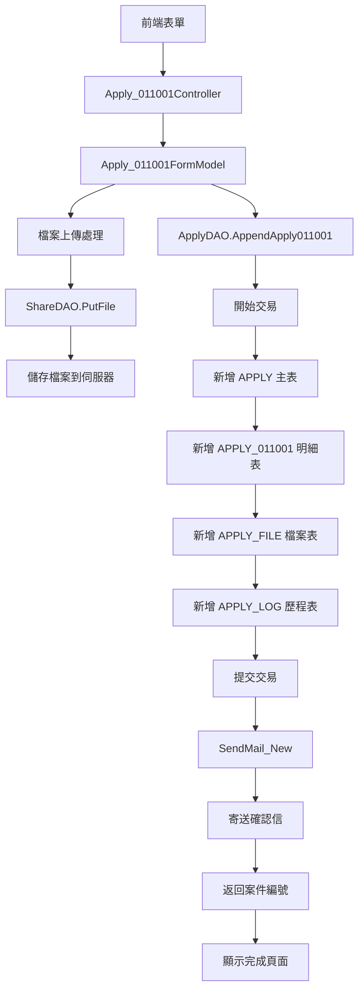
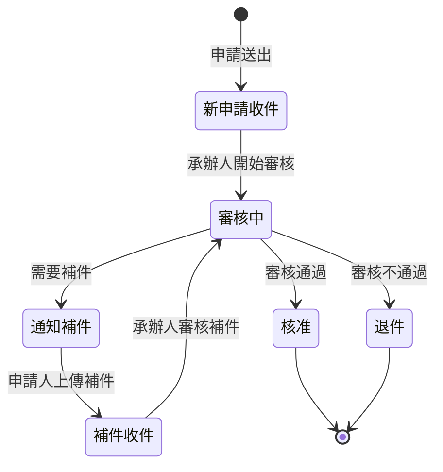

# 011001 - 社會工作師執業執照申請 - 完整技術文件

## 服務基本資訊

| 項目             | 內容                                                                                       |
| ---------------- | ------------------------------------------------------------------------------------------ |
| **服務代碼**     | 011001                                                                                     |
| **服務名稱**     | 社會工作師執業執照申請 (志願服務計畫核備)                                                  |
| **業務單位**     | 社會及家庭署                                                                               |
| **是否需繳費**   | 否                                                                                         |
| **申請對象**     | 志願服務運用單位                                                                           |
| **Controller**   | `ES/Controllers/Apply_011001Controller.cs` (282 行)                                        |
| **ViewModel**    | `ES/Models/ViewModels/Apply_011001ViewModel.cs` (629 行)                                   |
| **Entity Model** | `ES/Models/Entities/Apply_011001.cs` (127 行)                                              |
| **DAO 方法**     | `ApplyDAO.AppendApply011001()`, `ApplyDAO.UpdateApply011001()`, `ApplyDAO.GetFile011001()` |
| **資料表**       | `APPLY`, `APPLY_011001`, `APPLY_FILE`, `APPLY_NOTICE`                                      |
| **建立日期**     | 2024-01-15                                                                                 |
| **最後更新**     | 2024-04-01                                                                                 |

---

## 服務特色對照表

| 特色項目   | 是否支援 | 說明                                |
| ---------- | -------- | ----------------------------------- |
| 會員登入   | ✅       | 需要會員登入才能申辦                |
| 線上繳費   | ❌       | 本服務不需繳費                      |
| 檔案上傳   | ✅       | 支援 4 種檔案上傳 (3 必填 + 1 選填) |
| 補件功能   | ✅       | 支援補件通知及補件上傳              |
| Email 通知 | ✅       | 申請成功及補件時寄送 Email          |
| 合併列印   | ✅       | 支援合併列印功能 (MERGEYN)          |
| 預覽功能   | ✅       | 送出前可預覽申請內容                |
| 案件查詢   | ✅       | 可查詢歷史申請案件                  |
| 狀態追蹤   | ✅       | 可追蹤案件處理狀態                  |
| 後台審核   | ✅       | 後台承辦人員審核功能                |

---

## 核心功能

### 1. 志願服務計畫核備申請

- 提供志願服務運用單位線上申請計畫核備
- 自動帶入運用單位基本資料
- 支援發文日期及發文字號輸入

### 2. 檔案上傳管理

- **必填檔案 (3 個)**：
  1. 志願服務運用計畫 (FILE_1)
  2. 運用單位立案證明文件 (FILE_2)
  3. 法人登記證書影本 (FILE_3)
- **選填檔案 (1 個)**： 4. 志工名冊資料清冊 (FILE_4)

### 3. 合併列印功能

- 支援合併列印選項 (MERGEYN: Y/N)
- 若選擇合併列印 (Y)，至少需上傳一個檔案
- 若選擇不合併列印 (N)，必填檔案皆為必要

### 4. 申請資料自動帶入

- 自動帶入會員帳號資訊
- 自動帶入運用單位名稱
- 自動帶入聯絡電話及地址
- 自動帶入申請人姓名及 Email

### 5. 預覽確認機制

- 填寫完成後可預覽申請內容
- 確認無誤後再送出申請
- 支援返回修改功能

### 6. 補件功能

- 承辦人可發送補件通知
- 申請人收到 Email 通知後可上傳補件
- 支援動態補件欄位
- 補件完成後自動通知承辦人

### 7. Email 通知機制

- 申請成功時寄送確認信
- 補件通知時寄送提醒信
- 補件完成時寄送通知信
- Email 內容包含案件編號及處理狀態

### 8. 案件狀態管理

- FLOW_CD = 1：新申請收件
- FLOW_CD = 2：通知補件
- FLOW_CD = 3：補件收件
- FLOW_CD = 4：審核中
- FLOW_CD = 5：核准
- FLOW_CD = 6：退件

### 9. 地址管理

- 支援郵遞區號選擇
- 自動轉換縣市鄉鎮
- 支援詳細地址輸入

### 10. 日期格式轉換

- 支援民國年/西元年轉換
- 自動格式化日期顯示
- 日期選擇器輔助輸入

---

## 申請流程圖



---

## 補件流程圖



---

## 資料流程圖



---

## 狀態轉換圖



---

## 資料庫結構

### 1. APPLY 主表

**資料表名稱**：`APPLY`

**說明**：所有申辦服務的主表，記錄案件基本資訊

| 欄位名稱     | 資料型別 | 長度 | 必填 | 說明          | 範例                            |
| ------------ | -------- | ---- | ---- | ------------- | ------------------------------- |
| APP_ID       | varchar  | 20   | ✅   | 案件編號 (PK) | 011001-1130001                  |
| SRV_ID       | varchar  | 10   | ✅   | 服務代碼      | 011001                          |
| SRC_SRV_ID   | varchar  | 10   | ✅   | 來源服務代碼  | 011001                          |
| ACC_NO       | varchar  | 20   | ✅   | 申請人帳號    | A123456789                      |
| NAME         | nvarchar | 50   | ✅   | 申請人姓名    | 王小明                          |
| IDN          | varchar  | 10   | ❌   | 身分證字號    | A123456789                      |
| BIRTHDAY     | datetime | -    | ❌   | 出生日期      | 1980-01-01                      |
| SEX          | varchar  | 1    | ❌   | 性別          | M:男, F:女                      |
| MOBILE       | varchar  | 20   | ❌   | 手機號碼      | 0912345678                      |
| EMAIL        | varchar  | 100  | ❌   | Email         | test@example.com                |
| TEL          | varchar  | 40   | ❌   | 電話          | 02-12345678                     |
| ADDR_CODE    | varchar  | 10   | ❌   | 地址郵遞區號  | 100                             |
| ADDR         | nvarchar | 200  | ❌   | 地址          | 台北市中正區...                 |
| APP_TIME     | datetime | -    | ✅   | 申請時間      | 2024-01-15 10:30:00             |
| APP_EXT_DATE | datetime | -    | ❌   | 預計完成日期  | 2024-01-20                      |
| FLOW_CD      | varchar  | 2    | ✅   | 流程狀態代碼  | 1:新申請, 2:補件, 3:補件收件... |
| UNIT_CD      | int      | -    | ✅   | 業務單位代碼  | 8                               |
| PRO_ACC      | varchar  | 20   | ❌   | 承辦人帳號    | admin001                        |
| PRO_UNIT_CD  | int      | -    | ❌   | 承辦單位代碼  | 8                               |
| APP_DISP_MK  | varchar  | 1    | ❌   | 分文處理註記  | Y:是, N:否                      |
| LOGIN_TYPE   | varchar  | 2    | ❌   | 登入類型      | 01:一般會員, 02:自然人憑證      |
| MAILBODY     | nvarchar | MAX  | ❌   | 補件通知內容  | 請補充...                       |
| DEL_MK       | varchar  | 1    | ❌   | 刪除註記      | N:未刪除, Y:已刪除              |
| ADD_TIME     | datetime | -    | ✅   | 新增時間      | 2024-01-15 10:30:00             |
| ADD_FUN_CD   | varchar  | 20   | ✅   | 新增功能代碼  | Apply_011001                    |
| ADD_ACC      | varchar  | 20   | ✅   | 新增人員帳號  | A123456789                      |

**索引**：

- Primary Key: `APP_ID`
- Index: `SRV_ID`, `ACC_NO`, `FLOW_CD`

**流程狀態代碼 (FLOW_CD)**：

- `1`：新申請收件
- `2`：通知補件
- `3`：補件收件
- `4`：審核中
- `5`：核准
- `6`：退件

### 2. APPLY_011001 明細表

**資料表名稱**：`APPLY_011001`

**說明**：011001 服務的明細資料表

| 欄位名稱         | 資料型別 | 長度 | 必填 | 說明                     | 範例                       |
| ---------------- | -------- | ---- | ---- | ------------------------ | -------------------------- |
| APP_ID           | varchar  | 20   | ✅   | 案件編號 (PK, FK)        | 011001-1130001             |
| ACC_NO           | varchar  | 20   | ✅   | 運用單位登入帳號         | A123456789                 |
| ACC_NAM          | nvarchar | 100  | ✅   | 運用單位名稱             | 財團法人 XXX 基金會        |
| ACC_TEL          | varchar  | 40   | ✅   | 運用單位電話             | 02-12345678                |
| ACC_ADDR_CODE    | varchar  | 10   | ✅   | 運用單位地址郵遞區號     | 100                        |
| ACC_ADDR         | nvarchar | 200  | ✅   | 運用單位地址             | 台北市中正區...            |
| ADM_NAM          | nvarchar | 50   | ✅   | 申請人姓名               | 王小明                     |
| ADM_MOBILE       | varchar  | 20   | ❌   | 申請人行動電話           | 0912345678                 |
| ADM_MAIL         | varchar  | 100  | ✅   | 申請人 E-MAIL            | test@example.com           |
| ACC_SDATE        | datetime | -    | ✅   | 運用單位發文日期         | 2024-01-10                 |
| ACC_NUM          | nvarchar | 50   | ✅   | 運用單位發文字號         | XX 字第 1130001 號         |
| MERGEYN          | varchar  | 1    | ✅   | 是否合併列印             | Y:是, N:否                 |
| FILE_SERVICE     | nvarchar | 500  | ❌   | 志願服務運用計畫檔案路徑 | /Upload/011001/2024/01/... |
| FILE_UNIT        | nvarchar | 500  | ❌   | 運用單位立案證明檔案路徑 | /Upload/011001/2024/01/... |
| FILE_CERTIFICATE | nvarchar | 500  | ❌   | 法人登記證書檔案路徑     | /Upload/011001/2024/01/... |
| FILE_BASIC       | nvarchar | 500  | ❌   | 志工名冊檔案路徑         | /Upload/011001/2024/01/... |
| DEL_MK           | varchar  | 1    | ❌   | 刪除註記                 | N:未刪除, Y:已刪除         |
| DEL_TIME         | datetime | -    | ❌   | 刪除時間                 | -                          |
| DEL_FUN_CD       | varchar  | 20   | ❌   | 刪除功能代碼             | -                          |
| DEL_ACC          | varchar  | 20   | ❌   | 刪除人員帳號             | -                          |
| UPD_TIME         | datetime | -    | ❌   | 更新時間                 | 2024-01-16 10:00:00        |
| UPD_FUN_CD       | varchar  | 20   | ❌   | 更新功能代碼             | Apply_011001               |
| UPD_ACC          | varchar  | 20   | ❌   | 更新人員帳號             | A123456789                 |
| ADD_TIME         | datetime | -    | ✅   | 新增時間                 | 2024-01-15 10:30:00        |
| ADD_FUN_CD       | varchar  | 20   | ✅   | 新增功能代碼             | Apply_011001               |
| ADD_ACC          | varchar  | 20   | ✅   | 新增人員帳號             | A123456789                 |

**索引**：

- Primary Key: `APP_ID`
- Foreign Key: `APP_ID` references `APPLY(APP_ID)`

**合併列印 (MERGEYN)**：

- `Y`：是 (至少上傳 1 個檔案)
- `N`：否 (必須上傳 3 個必填檔案)

### 3. APPLY_FILE 檔案表

**資料表名稱**：`APPLY_FILE`

**說明**：申請案件附件檔案表，所有申辦服務共用

| 欄位名稱   | 資料型別 | 長度 | 必填 | 說明              | 範例                                              |
| ---------- | -------- | ---- | ---- | ----------------- | ------------------------------------------------- |
| APP_ID     | varchar  | 20   | ✅   | 案件編號 (PK, FK) | 011001-1130001                                    |
| FILE_NO    | int      | -    | ✅   | 檔案編號 (PK)     | 1, 2, 3, 4                                        |
| FILE_NAME  | nvarchar | 200  | ✅   | 檔案名稱          | 志願服務運用計畫.pdf                              |
| FILE_PATH  | nvarchar | 500  | ✅   | 檔案路徑          | /Upload/011001/2024/01/011001-1130001/FILE001.pdf |
| FILE_SIZE  | int      | -    | ✅   | 檔案大小 (bytes)  | 1024000                                           |
| FILE_TYPE  | varchar  | 50   | ✅   | 檔案類型          | application/pdf                                   |
| FILE_DESC  | nvarchar | 200  | ❌   | 檔案說明          | 志願服務運用計畫                                  |
| SRC_NO     | int      | -    | ❌   | 來源編號          | 0                                                 |
| UPD_TIME   | datetime | -    | ❌   | 更新時間          | 2024-01-16 10:00:00                               |
| UPD_FUN_CD | varchar  | 20   | ❌   | 更新功能代碼      | Apply_011001                                      |
| UPD_ACC    | varchar  | 20   | ❌   | 更新人員帳號      | A123456789                                        |
| ADD_TIME   | datetime | -    | ✅   | 新增時間          | 2024-01-15 10:30:00                               |
| ADD_FUN_CD | varchar  | 20   | ✅   | 新增功能代碼      | Apply_011001                                      |
| ADD_ACC    | varchar  | 20   | ✅   | 新增人員帳號      | A123456789                                        |

**索引**：

- Primary Key: `APP_ID`, `FILE_NO`
- Foreign Key: `APP_ID` references `APPLY(APP_ID)`

**檔案編號 (FILE_NO) 對應**：

- `1`：志願服務運用計畫 - FILE_SERVICE (必填\*)
- `2`：運用單位立案證明文件 - FILE_UNIT (必填\*)
- `3`：法人登記證書影本 - FILE_CERTIFICATE (必填\*)
- `4`：志工名冊資料清冊 - FILE_BASIC (選填)

\*註：若 MERGEYN = 'Y'，則至少上傳 1 個檔案即可

### 4. APPLY_NOTICE 補件通知表

**資料表名稱**：`APPLY_NOTICE`

**說明**：補件通知表，記錄補件通知歷程

| 欄位名稱   | 資料型別 | 長度 | 必填 | 說明              | 範例                   |
| ---------- | -------- | ---- | ---- | ----------------- | ---------------------- |
| APP_ID     | varchar  | 20   | ✅   | 案件編號 (PK, FK) | 011001-1130001         |
| NOTICE_NO  | int      | -    | ✅   | 補件通知編號 (PK) | 1, 2, 3                |
| Field      | nvarchar | 100  | ✅   | 補件欄位名稱      | FILE_1, FILE_2, FILE_3 |
| ISADDYN    | varchar  | 1    | ✅   | 是否已補件        | Y:已補件, N:未補件     |
| ADD_TIME   | datetime | -    | ✅   | 新增時間          | 2024-01-16 09:00:00    |
| ADD_FUN_CD | varchar  | 20   | ✅   | 新增功能代碼      | Apply_011001           |
| ADD_ACC    | varchar  | 20   | ✅   | 新增人員帳號      | admin001               |

**索引**：

- Primary Key: `APP_ID`, `NOTICE_NO`
- Foreign Key: `APP_ID` references `APPLY(APP_ID)`

**補件欄位 (Field)**：

- `FILE_1`：志願服務運用計畫
- `FILE_2`：運用單位立案證明文件
- `FILE_3`：法人登記證書影本
- `FILE_4`：志工名冊資料清冊
- `全部`：所有欄位

---

## ViewModel 結構

### 1. Apply_011001ViewModel

**檔案位置**：`ES/Models/ViewModels/Apply_011001ViewModel.cs`

**說明**：011001 服務的主要 ViewModel

```csharp
/// <summary>
/// APPLY_011001 志願服務計畫核備
/// </summary>
public class Apply_011001ViewModel
{
    public Apply_011001ViewModel()
    {
    }

    /// <summary>
    /// 申請表單
    /// </summary>
    public Apply_011001FormModel Form { get; set; }

    /// <summary>
    /// 補件資料
    /// </summary>
    public Apply_011001DetailModel Detail { get; set; }
}
```

### 2. Apply_011001FormModel

**說明**：申請表單資料模型，繼承自 `APPLY_011001`

**主要屬性**：

```csharp
/// <summary>
/// 申請表單
/// </summary>
public class Apply_011001FormModel : APPLY_011001
{
    // 是否為新申請
    public bool IsNew { get; set; }
    public string IsMode { get; set; }

    // 申請資訊
    public string APP_ID { get; set; }
    public string SRV_ID { get; set; }
    public string SRC_SRV_ID { get; set; }
    public DateTime? APP_TIME { get; set; }
    public string APP_TIME_AD { get; set; }  // 民國年格式

    // 運用單位資訊
    [Required]
    [Display(Name = "運用單位登入帳號")]
    public string ACC_NO { get; set; }

    [Required]
    [Display(Name = "運用單位名稱")]
    public string ACC_NAM { get; set; }

    [Required]
    [Display(Name = "運用單位電話")]
    public string ACC_TEL { get; set; }

    [Required]
    [Display(Name = "運用單位地址(含郵遞區號)")]
    public string ACC_ADDR_CODE { get; set; }
    public string ACC_ADDR_CODE_ADDR { get; set; }
    public string ACC_ADDR_CODE_DETAIL { get; set; }
    public string ACC_ADDR { get; set; }

    // 申請人資訊
    [Required]
    [Display(Name = "申請人姓名")]
    public string ADM_NAM { get; set; }

    [Display(Name = "申請人行動電話")]
    public string ADM_MOBILE { get; set; }

    [Required]
    [Display(Name = "申請人E-MAIL")]
    public string ADM_MAIL { get; set; }

    // 發文資訊
    [Required]
    [Display(Name = "運用單位發文日期")]
    public string ACC_SDATE { get; set; }
    public string ACC_SDATE_AD { get; set; }  // 民國年格式

    [Required]
    [Display(Name = "運用單位發文字號")]
    public string ACC_NUM { get; set; }

    // 合併列印
    [Display(Name = "是否合併列印")]
    public string MERGEYN { get; set; }
    public IList<SelectListItem> MERGEYN_list { get; set; }

    // 檔案上傳
    [Required]
    [Display(Name = "志願服務運用計畫")]
    public HttpPostedFileBase FILE_1 { get; set; }
    public string FILE_1_FILENAME { get; set; }

    [Required]
    [Display(Name = "運用單位立案證明文件")]
    public HttpPostedFileBase FILE_2 { get; set; }
    public string FILE_2_FILENAME { get; set; }

    [Required]
    [Display(Name = "法人登記證書影本")]
    public HttpPostedFileBase FILE_3 { get; set; }
    public string FILE_3_FILENAME { get; set; }

    [Display(Name = "志工名冊資料清冊")]
    public HttpPostedFileBase FILE_4 { get; set; }
    public string FILE_4_FILENAME { get; set; }

    // 檔案上傳方法
    public string FileSave() { ... }
}
```

### 3. Apply_011001DetailModel

**說明**：補件資料模型，繼承自 `ApplyModel`

**主要屬性**：

```csharp
/// <summary>
/// 補件資料
/// </summary>
public class Apply_011001DetailModel : ApplyModel
{
    /// <summary>
    /// 是否為新申請
    /// </summary>
    public bool IsNew { get; set; }
    public string IsMode { get; set; }

    /// <summary>
    /// 補件欄位字串
    /// </summary>
    public string FieldStr { get; set; }

    /// <summary>
    /// 補件狀態
    /// </summary>
    public string APPSTATUS { get; set; }

    // 其他欄位與 Apply_011001FormModel 相同
    // ...
}
```

### 4. Apply_011001DoneModel

**說明**：完成頁面資料模型

**主要屬性**：

```csharp
/// <summary>
/// 完成頁面
/// </summary>
public class Apply_011001DoneModel
{
    /// <summary>
    /// 狀態
    /// </summary>
    public string status { get; set; }

    /// <summary>
    /// 數量
    /// </summary>
    public string Count { get; set; }
}
```

---

## Controller 方法說明

### 1. Apply() GET - 顯示申辦表單

**HTTP Method**：GET

**路由**：`/Apply_011001/Apply`

**功能說明**：顯示申辦表單，自動帶入會員資料

**程式碼範例**：

```csharp
public ActionResult Apply()
{
    SessionModel sm = SessionModel.Get();
    Apply_011001FormModel model = new Apply_011001FormModel();
    ActionResult rtn = View("Index", model);
    model.APP_TIME = DateTime.Now;
    var UsIn = sm.UserInfo.Member;

    if (UsIn != null)
    {
        // 帶入帳號資訊
        model.ACC_NO = UsIn.ACC_NO;
        model.ACC_NAM = UsIn.NAME;
        model.ACC_TEL = UsIn.TEL;
        model.ACC_ADDR_CODE = UsIn.CITY_CD;
        model.ACC_ADDR = UsIn.ADDR;
        model.ADM_NAM = UsIn.CNT_NAME;
        model.ADM_MOBILE = UsIn.MOBILE;
        model.ADM_MAIL = UsIn.MAIL;
        model.SRV_ID = "011001";
        model.SRC_SRV_ID = "011001";
        model.MERGEYN = "N";
    }
    else
    {
        rtn = RedirectToAction("Index", "Login");
    }

    return rtn;
}
```

### 2. Apply() POST - 預覽申請資料

**HTTP Method**：POST

**路由**：`/Apply_011001/Apply`

**功能說明**：處理表單提交，進行檔案上傳並切換預覽模式

**主要處理邏輯**：

```csharp
[HttpPost]
public ActionResult Apply(Apply_011001FormModel model)
{
    SessionModel sm = SessionModel.Get();
    ActionResult rtn = View(model);

    // 若選擇合併列印，清除檔案必填驗證
    if (model.MERGEYN == "Y")
    {
        foreach (var item in ModelState)
        {
            if (item.Key.ToLeft(5) == "FILE_")
            {
                item.Value.Errors.Clear();
            }
        }
    }

    if (ModelState.IsValid)
    {
        // 檔案上傳處理
        var errormsg = model.FileSave();
        if (errormsg != "")
        {
            sm.LastErrorMessage = errormsg;
        }
        else
        {
            // 切換預覽模式
            if (model.IsMode == "1")
            {
                model.IsNew = false;  // 顯示預覽畫面
            }
            if (model.IsMode == "0")
            {
                model.IsNew = true;   // 返回編輯畫面
            }
        }
    }

    rtn = View("Index", model);
    return rtn;
}
```

### 3. Save() - 儲存申請資料

**HTTP Method**：POST

**路由**：`/Apply_011001/Save`

**功能說明**：儲存申請資料到資料庫並寄送確認信

**程式碼範例**：

```csharp
[HttpPost]
public ActionResult Save(Apply_011001FormModel model)
{
    SessionModel sm = SessionModel.Get();
    ApplyDAO dao = new ApplyDAO();
    var memberName = string.IsNullOrWhiteSpace(model.ADM_NAM) ? sm.UserInfo.Member.NAME : model.ADM_NAM;
    var memberEmail = string.IsNullOrWhiteSpace(model.ADM_MAIL) ? sm.UserInfo.Member.MAIL : model.ADM_MAIL;
    ModelState.Clear();

    // 存檔
    var appid = dao.AppendApply011001(model);

    // 寄信
    dao.SendMail_New(memberName, memberEmail, appid, "志願服務計畫核備", "011001", ISSEND: true);

    return Done("1");
}
```

### 4. AppDoc() - 補件頁面

**HTTP Method**：GET

**路由**：`/Apply_011001/AppDoc`

**功能說明**：顯示補件頁面，載入案件資料及補件欄位

**主要處理邏輯**：

1. 檢查是否為案件申請人
2. 載入案件基本資料
3. 載入已上傳檔案資訊
4. 載入補件欄位清單
5. 返回補件頁面

### 5. SaveAppDoc() - 儲存補件資料

**HTTP Method**：POST

**路由**：`/Apply_011001/SaveAppDoc`

**功能說明**：儲存補件資料並寄送通知信

**程式碼範例**：

```csharp
public ActionResult SaveAppDoc(Apply_011001DetailModel model)
{
    SessionModel sm = SessionModel.Get();
    ApplyDAO dao = new ApplyDAO();
    var memberName = string.IsNullOrWhiteSpace(model.ADM_NAM) ? sm.UserInfo.Member.NAME : model.ADM_NAM;
    var memberEmail = string.IsNullOrWhiteSpace(model.ADM_MAIL) ? sm.UserInfo.Member.MAIL : model.ADM_MAIL;
    ModelState.Clear();

    // 存檔
    var count = dao.UpdateApply011001(model);

    // 寄信
    dao.SendMail_Update(memberName, memberEmail, model.APP_ID, "志願服務計畫核備", "011001", count, ISSEND: true);

    return Done("2", count);
}
```

---

## DAO 方法說明

### 1. AppendApply011001() - 新增申請資料

**功能說明**：新增申請資料到資料庫

**參數**：

- `form`：Apply_011001FormModel

**返回值**：

- `string`：案件編號 (APP_ID)

**SQL 語法**：

```sql
-- 1. 新增 APPLY 主表
INSERT INTO APPLY (APP_ID, SRV_ID, SRC_SRV_ID, ACC_NO, NAME, IDN, BIRTHDAY, SEX, MOBILE, EMAIL, TEL, ADDR_CODE, ADDR,
                   APP_TIME, FLOW_CD, UNIT_CD, PRO_ACC, PRO_UNIT_CD, APP_DISP_MK, LOGIN_TYPE,
                   ADD_TIME, ADD_FUN_CD, ADD_ACC)
VALUES (@APP_ID, '011001', '011001', @ACC_NO, @NAME, @IDN, @BIRTHDAY, @SEX, @MOBILE, @EMAIL, @TEL, @ADDR_CODE, @ADDR,
        GETDATE(), '1', 8, @PRO_ACC, @PRO_UNIT_CD, 'Y', @LOGIN_TYPE,
        GETDATE(), 'Apply_011001', @ACC_NO)

-- 2. 新增 APPLY_011001 明細表
INSERT INTO APPLY_011001 (APP_ID, ACC_NO, ACC_NAM, ACC_TEL, ACC_ADDR_CODE, ACC_ADDR, ADM_NAM, ADM_MOBILE, ADM_MAIL,
                          ACC_SDATE, ACC_NUM, MERGEYN, FILE_SERVICE, FILE_UNIT, FILE_CERTIFICATE, FILE_BASIC,
                          ADD_TIME, ADD_FUN_CD, ADD_ACC)
VALUES (@APP_ID, @ACC_NO, @ACC_NAM, @ACC_TEL, @ACC_ADDR_CODE, @ACC_ADDR, @ADM_NAM, @ADM_MOBILE, @ADM_MAIL,
        @ACC_SDATE, @ACC_NUM, @MERGEYN, @FILE_SERVICE, @FILE_UNIT, @FILE_CERTIFICATE, @FILE_BASIC,
        GETDATE(), 'Apply_011001', @ACC_NO)

-- 3. 新增 APPLY_FILE 檔案表 (依檔案數量)
INSERT INTO APPLY_FILE (APP_ID, FILE_NO, FILE_NAME, FILE_PATH, FILE_SIZE, FILE_TYPE, FILE_DESC, SRC_NO,
                        ADD_TIME, ADD_FUN_CD, ADD_ACC)
VALUES (@APP_ID, @FILE_NO, @FILE_NAME, @FILE_PATH, @FILE_SIZE, @FILE_TYPE, @FILE_DESC, 0,
        GETDATE(), 'Apply_011001', @ACC_NO)

-- 4. 新增 APPLY_LOG 歷程表
INSERT INTO APPLY_LOG (APP_ID, SRV_ID, LOG_DESC, LOG_TIME, LOG_ACC)
VALUES (@APP_ID, '011001', '新申請收件', GETDATE(), @ACC_NO)
```

### 2. UpdateApply011001() - 更新補件資料

**功能說明**：更新補件資料到資料庫

**參數**：

- `model`：Apply_011001DetailModel

**返回值**：

- `string`：補件件數

**SQL 語法**：

```sql
-- 1. 更新補件欄位狀態
UPDATE APPLY_NOTICE
SET ISADDYN = 'Y',
    UPD_TIME = GETDATE(),
    UPD_FUN_CD = 'Apply_011001',
    UPD_ACC = @ACC_NO
WHERE APP_ID = @APP_ID AND ISADDYN = 'N'

-- 2. 更新 APPLY 主表狀態
UPDATE APPLY
SET FLOW_CD = '3',  -- 補件收件
    UPD_TIME = GETDATE(),
    UPD_FUN_CD = 'Apply_011001',
    UPD_ACC = @ACC_NO
WHERE APP_ID = @APP_ID

-- 3. 更新 APPLY_011001 明細表
UPDATE APPLY_011001
SET FILE_SERVICE = @FILE_SERVICE,
    FILE_UNIT = @FILE_UNIT,
    FILE_CERTIFICATE = @FILE_CERTIFICATE,
    FILE_BASIC = @FILE_BASIC,
    UPD_TIME = GETDATE(),
    UPD_FUN_CD = 'Apply_011001',
    UPD_ACC = @ACC_NO
WHERE APP_ID = @APP_ID

-- 4. 新增 APPLY_FILE 檔案表 (補件檔案)
INSERT INTO APPLY_FILE (APP_ID, FILE_NO, FILE_NAME, FILE_PATH, FILE_SIZE, FILE_TYPE, FILE_DESC, SRC_NO,
                        ADD_TIME, ADD_FUN_CD, ADD_ACC)
VALUES (@APP_ID, @FILE_NO, @FILE_NAME, @FILE_PATH, @FILE_SIZE, @FILE_TYPE, @FILE_DESC, @SRC_NO,
        GETDATE(), 'Apply_011001', @ACC_NO)

-- 5. 新增 APPLY_LOG 歷程表
INSERT INTO APPLY_LOG (APP_ID, SRV_ID, LOG_DESC, LOG_TIME, LOG_ACC)
VALUES (@APP_ID, '011001', '補件收件', GETDATE(), @ACC_NO)
```

### 3. GetFile011001() - 取得檔案資訊

**功能說明**：取得案件的檔案資訊

**參數**：

- `APP_ID`：案件編號

**返回值**：

- `Apply_011001DetailModel`：包含檔案資訊的模型

**SQL 語法**：

```sql
SELECT TOP 1 FILENAME
FROM APPLY_FILE
WHERE APP_ID = @APP_ID AND FILE_NO = @FILE_NO
ORDER BY ADD_TIME DESC
```

---

## 技術亮點

### 1. ⭐ 合併列印功能

**特色**：

- 支援合併列印選項 (MERGEYN)
- 彈性檔案上傳驗證
- 動態調整必填欄位

**實作邏輯**：

```csharp
if (model.MERGEYN == "Y")
{
    // 至少上傳 1 個檔案
    if (FILE_1 == null && FILE_2 == null && FILE_3 == null && FILE_4 == null)
    {
        ErrorMsg = "至少上傳一個檔案";
    }
}
else
{
    // 必須上傳 3 個必填檔案
    if (FILE_1 == null || FILE_2 == null || FILE_3 == null)
    {
        ErrorMsg = "請上傳必填檔案";
    }
}
```

### 2. ⭐ 預覽確認機制

**特色**：

- 填寫完成後可預覽申請內容
- 確認無誤後再送出申請
- 支援返回修改功能

**實作方式**：

- IsNew = true：顯示編輯畫面
- IsNew = false：顯示預覽畫面
- IsMode = "1"：存檔並預覽
- IsMode = "0"：返回修改

### 3. ⭐ 補件功能

**特色**：

- 承辦人可發送補件通知
- 申請人收到 Email 通知後可上傳補件
- 支援動態補件欄位
- 補件完成後自動通知承辦人

**補件欄位管理**：

- FieldStr：補件欄位字串 (逗號分隔)
- ISADDYN：是否已補件 (Y/N)
- Field：補件欄位名稱 (FILE_1, FILE_2, FILE_3, FILE_4, 全部)

### 4. ⭐ 檔案上傳管理

**特色**：

- 支援 4 種檔案上傳
- 檔案路徑自動產生
- 檔案資訊記錄到資料庫
- 支援補件檔案上傳

**檔案路徑格式**：

```
/Upload/011001/{年}/{月}/{檔案名稱}
```

### 5. ⭐ 日期格式轉換

**特色**：

- 支援民國年/西元年轉換
- 自動格式化日期顯示
- 日期選擇器輔助輸入

**轉換方法**：

```csharp
// 民國年轉西元年
DateTime date = HelperUtil.TransToDateTime(ACC_SDATE, "/");

// 西元年轉民國年
string dateTw = HelperUtil.DateTimeToTwString(APP_TIME);
```

### 6. ⭐ 地址管理

**特色**：

- 支援郵遞區號選擇
- 自動轉換縣市鄉鎮
- 支援詳細地址輸入

**地址欄位**：

- ACC_ADDR_CODE：郵遞區號
- ACC_ADDR_CODE_ADDR：縣市鄉鎮
- ACC_ADDR_CODE_DETAIL：詳細地址
- ACC_ADDR：完整地址

### 7. ⭐ Email 通知機制

**特色**：

- 申請成功時寄送確認信
- 補件通知時寄送提醒信
- 補件完成時寄送通知信
- Email 內容包含案件編號及處理狀態

**通知時機**：

- 新申請：SendMail_New()
- 補件完成：SendMail_Update()

### 8. ⭐ 交易管理

**特色**：

- 使用 SqlTransaction 確保資料一致性
- 錯誤時自動 Rollback
- 成功時 Commit

**實作方式**：

```csharp
using (SqlConnection conn = DataUtils.GetConnection())
{
    conn.Open();
    SqlTransaction tran = conn.BeginTransaction();
    try
    {
        // 資料庫操作
        tran.Commit();
    }
    catch (Exception ex)
    {
        tran.Rollback();
        throw;
    }
}
```

### 9. ⭐ 分文處理

**特色**：

- APP_DISP_MK = "Y"：啟用分文處理
- 自動指派承辦人 (PRO_ACC)
- 自動指派承辦單位 (PRO_UNIT_CD)

**實作方式**：

```csharp
where.APP_DISP_MK = "Y";
where.PRO_ACC = GetServicePageMakerId("011001");
where.PRO_UNIT_CD = GetServiceFixUnitCd("011001");
```

### 10. ⭐ 歷程記錄

**特色**：

- 記錄所有操作歷程
- 包含操作時間、操作人員、操作內容
- 支援歷程查詢

**歷程類型**：

- 新申請收件
- 補件收件
- 審核中
- 核准
- 退件

---

## 相關檔案列表

### Controller

- `ES/Controllers/Apply_011001Controller.cs` (282 行)
- `ES/Areas/BACKMIN/Controllers/Apply_011001Controller.cs`

### ViewModel

- `ES/Models/ViewModels/Apply_011001ViewModel.cs` (629 行)

### Entity

- `ES/Models/Entities/Apply_011001.cs` (127 行)

### DAO

- `ES/DataLayers/ApplyDAO.cs`
  - AppendApply011001()
  - UpdateApply011001()
  - GetFile011001()
  - QueryApply_011001()

### View

- `ES/Views/Apply_011001/Index.cshtml` (申辦表單)
- `ES/Views/Apply_011001/Apply.cshtml` (預覽頁面)
- `ES/Views/Apply_011001/Detail.cshtml` (補件頁面)
- `ES/Views/Apply_011001/Done.cshtml` (完成頁面)

### JavaScript

- `ES/Scripts/Apply_011001.js` (前端驗證及互動)

---

## 重要注意事項

### 1. 合併列印注意事項

**重要提醒**：

- 若選擇合併列印 (MERGEYN = 'Y')，至少需上傳 1 個檔案
- 若選擇不合併列印 (MERGEYN = 'N')，必須上傳 3 個必填檔案
- FILE_4 (志工名冊) 始終為選填

**驗證邏輯**：

```csharp
if (MERGEYN == "Y")
{
    if (FILE_1 == null && FILE_2 == null && FILE_3 == null && FILE_4 == null)
    {
        ErrorMsg = "至少上傳一個檔案";
    }
}
else
{
    if (FILE_1 == null) ErrorMsg += "志願服務運用計畫、";
    if (FILE_2 == null) ErrorMsg += "運用單位立案證明文件、";
    if (FILE_3 == null) ErrorMsg += "法人登記證書影本、";
}
```

### 2. 檔案上傳注意事項

**重要提醒**：

- 檔案大小限制：依系統設定
- 檔案格式：PDF、DOC、DOCX、JPG、PNG
- 檔案命名：避免特殊字元
- 檔案路徑：自動產生，不可手動修改

**檔案上傳流程**：

1. 選擇檔案
2. 驗證檔案格式及大小
3. 上傳到伺服器
4. 記錄檔案資訊到資料庫
5. 返回檔案路徑

### 3. 補件注意事項

**重要提醒**：

- 補件期限：由承辦人設定
- 補件欄位：由承辦人指定
- 補件次數：不限
- 補件狀態：ISADDYN (Y:已補件, N:未補件)

**補件流程**：

1. 承辦人發送補件通知
2. 申請人收到 Email 通知
3. 申請人登入系統
4. 進入補件頁面
5. 上傳補件文件
6. 確認送出
7. 系統更新補件狀態
8. 寄送補件完成通知

### 4. 日期格式注意事項

**重要提醒**：

- 民國年格式：1130101 (113 年 01 月 01 日)
- 西元年格式：2024/01/01
- 日期分隔符號：斜線 (/)

**轉換方法**：

```csharp
// 民國年轉西元年
DateTime date = HelperUtil.TransToDateTime(ACC_SDATE, "/");

// 西元年轉民國年
string dateTw = HelperUtil.DateTimeToTwString(APP_TIME);
```

### 5. 地址格式注意事項

**重要提醒**：

- 郵遞區號：3 或 5 碼
- 縣市鄉鎮：自動帶入
- 詳細地址：手動輸入
- 完整地址：自動組合

**地址組合**：

```
完整地址 = 縣市鄉鎮 + 詳細地址
```

---

## 維護記錄

| 日期       | 版本 | 修改人員   | 修改內容         |
| ---------- | ---- | ---------- | ---------------- |
| 2024-01-15 | 1.0  | 系統管理員 | 初始版本建立     |
| 2024-02-01 | 1.1  | 系統管理員 | 新增合併列印功能 |
| 2024-03-01 | 1.2  | 系統管理員 | 優化補件流程     |
| 2024-04-01 | 1.3  | 系統管理員 | 新增預覽確認機制 |

---

**版本：** 1.0
**日期：** 2025-10-20
**作者：** 柏通股份有限公司
