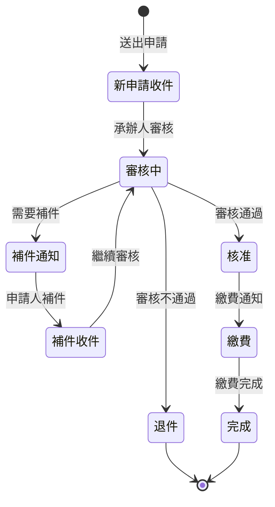

# 011002 專科社會工作師證書核發 - 完整技術文件

## 服務基本資訊

| 項目             | 內容                                                                                        |
| ---------------- | ------------------------------------------------------------------------------------------- |
| **服務代碼**     | 011002                                                                                      |
| **服務名稱**     | 專科社會工作師證書核發                                                                      |
| **業務單位**     | 社會及家庭署                                                                                |
| **申請對象**     | 社會工作師                                                                                  |
| **是否需繳費**   | 是                                                                                          |
| **Controller**   | `ES/Controllers/APPLY_011002Controller.cs` (624 行)                                         |
| **ViewModel**    | `ES/Models/ViewModels/Apply_011002ViewModel.cs` (1,250 行)                                  |
| **Entity Model** | `ES/Models/Entities/Apply_011002Model.cs` (164 行)                                          |
| **DAO 方法**     | `ApplyDAO.AppendApply011002()`, `ApplyDAO.UpdateApply011002()`, `ApplyDAO.GetFile_011002()` |
| **資料表**       | `APPLY`, `APPLY_011002`, `APPLY_FILE`, `APPLY_NOTICE`                                       |
| **建立日期**     | 2024-01-15                                                                                  |

---

## 服務特色對照表

| 特色項目     | 011001 志願服務計畫核備 | 011002 專科社工師證書核發 | 說明                                    |
| ------------ | ----------------------- | ------------------------- | --------------------------------------- |
| 前導說明頁   | ❌                      | ✅                        | 011002 有 Prompt() 前導說明頁           |
| 預覽確認機制 | ✅                      | ✅                        | 兩者都有預覽功能                        |
| AJAX 驗證    | ❌                      | ✅                        | 011002 使用 AJAX 進行表單驗證           |
| 合併列印功能 | ✅                      | ✅                        | 兩者都支援合併列印                      |
| 檔案上傳數量 | 4 個 (3 必填 + 1 選填)  | 4 個 (3 必填 + 1 選填)    | 相同                                    |
| 電話欄位     | 2 組 (公/宅)            | 2 組 (公/宅)              | 相同                                    |
| 地址欄位     | 1 組 (通訊地址)         | 2 組 (通訊/戶籍)          | 011002 多了戶籍地址                     |
| Email 驗證   | 基本驗證                | Regex 驗證                | 011002 有更嚴格的 Email 格式驗證        |
| 專科類別選擇 | ❌                      | ✅                        | 011002 有 5 種專科類別                  |
| 申請用途選擇 | ❌                      | ✅                        | 011002 有 3 種申請用途 (核發/補發/換發) |
| 考試年度選擇 | ❌                      | ✅                        | 011002 需選擇考試年度                   |
| 執業處所     | ❌                      | ✅                        | 011002 需填寫執業處所                   |
| 分文處理     | ✅                      | ✅                        | 兩者都啟用分文處理                      |
| 補件功能     | ✅                      | ✅                        | 兩者都支援補件                          |
| 繳費功能     | ❌                      | ✅                        | 011002 需要繳費                         |
| 預覽方式     | 切換 IsNew              | PartialView               | 011002 使用 PartialView 預覽            |
| 驗證方式     | ModelState              | AJAX + ModelState         | 011002 使用 AJAX 先驗證                 |
| 完成頁面     | Done()                  | Done()                    | 相同                                    |

---

## 核心功能說明

### 1. 前導說明頁 (Prompt)

**功能說明**：

- 顯示申辦說明事項
- 要求使用者閱讀並同意後才能進入申辦頁面
- 未同意時顯示提示訊息

**實作方式**：

```csharp
public ActionResult Prompt()
{
    SessionModel sm = SessionModel.Get();
    Apply_011002ViewModel model = new Apply_011002ViewModel();
    string s_msg_1A = "請先閱讀 「{0}說明事項」點選同意後，再進入申辦頁面 !";
    sm.LastErrorMessage = string.Format(s_msg_1A, "專科社會工作師證書核發");
    return View("Prompt", model.Form);
}
```

### 2. Apply() GET - 顯示申辦表單

**HTTP Method**：GET

**路由**：`/APPLY_011002/Apply`

**功能說明**：顯示申辦表單，自動帶入會員基本資料

**主要處理邏輯**：

```csharp
[HttpGet]
public ActionResult Apply(string agree)
{
    SessionModel sm = SessionModel.Get();
    Apply_011002ViewModel model = new Apply_011002ViewModel();
    ActionResult rtn = View("Index", model.Form);

    if (sm == null || sm.UserInfo == null)
    {
        rtn = RedirectToAction("Index", "Login");
    }
    else
    {
        var UsIn = sm.UserInfo.Member;
        if (UsIn != null)
        {
            // 檢查是否同意說明事項
            if (string.IsNullOrEmpty(agree)) { agree = "0"; }
            if (agree != null && !agree.Equals("1")) { return Prompt(); }

            // 設定申請日期
            if (model.Form.APP_TIME == null)
                model.Form.APP_TIME_SHOW = HelperUtil.DateTimeToTwString(DateTime.Now);
            else
                model.Form.APP_TIME_SHOW = HelperUtil.DateTimeToTwString(model.Form.APP_TIME);

            // 帶入基本資料
            model.Form.APPLY_TYPE = "1";  // 預設為核發
            model.Form.NAME = UsIn.NAME;
            model.Form.IDN = UsIn.IDN;
            model.Form.BIRTHDAY = UsIn.BIRTHDAY;
            model.Form.SEX_CD = UsIn.SEX_CD;

            // 電話 (公)
            var Tel = UsIn.TEL.Split('-');
            model.Form.H_TEL_0 = Tel[0];
            if (Tel.ToCount() > 1)
            {
                model.Form.H_TEL_1 = Tel[1];
                if (model.Form.H_TEL_1.IndexOf('#') > 0)
                {
                    model.Form.H_TEL_1 = Tel[1].Substring(0, Tel[1].IndexOf('#'));
                    model.Form.H_TEL_2 = Tel[1].Split('#')[1];
                }
            }

            // 電話 (宅) - 同公
            model.Form.W_TEL_0 = Tel[0];
            if (Tel.ToCount() > 1)
            {
                model.Form.W_TEL_1 = Tel[1];
                if (model.Form.W_TEL_1.IndexOf('#') > 0)
                {
                    model.Form.W_TEL_1 = Tel[1].Substring(0, Tel[1].IndexOf('#'));
                    model.Form.W_TEL_2 = Tel[1].Split('#')[1];
                }
            }

            // 地址
            model.Form.C_ZIPCODE = UsIn.CITY_CD;
            model.Form.C_ADDR = UsIn.ADDR;
            model.Form.MOBILE = UsIn.MOBILE;
            model.Form.EMAIL = UsIn.MAIL;
            model.Form.MERGEYN = "N";
            model.Form.H_EQUAL = "N";
        }
        else
        {
            rtn = RedirectToAction("Index", "Login");
        }
    }
    return rtn;
}
```

### 3. Apply() POST - AJAX 表單驗證

**HTTP Method**：POST

**路由**：`/APPLY_011002/Apply`

**功能說明**：使用 AJAX 進行表單驗證，返回 JSON 格式的驗證結果

**驗證邏輯**：

```csharp
[HttpPost]
public ActionResult Apply(Apply_011002FormModel model)
{
    var result = new AjaxResultStruct();
    ApplyDAO dao = new ApplyDAO();
    string ErrorMsg = "";

    // 1. 電話驗證：公/宅/行動電話至少填寫一組
    if (string.IsNullOrWhiteSpace(model.H_TEL_0) && string.IsNullOrWhiteSpace(model.H_TEL_1)
      && string.IsNullOrWhiteSpace(model.W_TEL_0) && string.IsNullOrWhiteSpace(model.W_TEL_1)
      && string.IsNullOrWhiteSpace(model.MOBILE))
    {
        ModelState.AddModelError("TEL_MOBILE", "電話(公)、電話(宅)、行動電話請擇一填寫");
    }

    // 2. 性別驗證
    if (string.IsNullOrEmpty(model.SEX_CD))
    {
        ModelState.AddModelError("SEX_CD", "性別為必填欄位");
    }

    // 3. 電話 (公) 完整性驗證
    if (!string.IsNullOrWhiteSpace(model.H_TEL_0) || !string.IsNullOrWhiteSpace(model.H_TEL_1))
    {
        if (string.IsNullOrWhiteSpace(model.H_TEL_0) || string.IsNullOrWhiteSpace(model.H_TEL_1))
        {
            ModelState.AddModelError("H_TEL_0", "電話(公)請填寫完整");
        }
    }

    // 4. 電話 (宅) 完整性驗證
    if (!string.IsNullOrWhiteSpace(model.W_TEL_0) || !string.IsNullOrWhiteSpace(model.W_TEL_1))
    {
        if (string.IsNullOrWhiteSpace(model.W_TEL_0) || string.IsNullOrWhiteSpace(model.W_TEL_1))
        {
            ModelState.AddModelError("W_TEL_0", "電話(宅)請填寫完整");
        }
    }

    // 5. Email 驗證
    if (string.IsNullOrEmpty(model.EMAIL_0))
    {
        ModelState.AddModelError("EMAIL_0", "E-MAIL帳號名稱為必填欄位");
    }

    if (string.IsNullOrEmpty(model.EMAIL_2))
    {
        ModelState.AddModelError("EMAIL_2", "E-MAIL帳號網域為必填欄位");
    }

    // 6. Email 格式驗證 (Regex)
    System.Text.RegularExpressions.Regex mailReg =
        new System.Text.RegularExpressions.Regex(@"^([\w\.\-]+)@([\w\-]+)((\.(\w){2,10})+)$");

    if (!mailReg.IsMatch(model.EMAIL_0 + "@" + model.EMAIL_2))
    {
        ModelState.AddModelError("EMAIL", "請輸入正確的E-MAIL格式 !");
    }

    // 7. 檔案驗證
    if (model.MERGEYN == "Y")
    {
        // 合併列印：至少上傳 1 個檔案
        if (string.IsNullOrWhiteSpace(model.FILE_IDNF_TEXT) && string.IsNullOrWhiteSpace(model.FILE_IDNB_TEXT)
            && string.IsNullOrWhiteSpace(model.FILE_PHOTO_TEXT) && string.IsNullOrWhiteSpace(model.FILE_HOUSEHOLD_TEXT))
        {
            ModelState.AddModelError("FILE_IDNF", "請至少上傳一個檔案");
        }
    }
    else
    {
        // 不合併列印：必須上傳 3 個必填檔案
        if (model.FILE_IDNF_TEXT == null)
        {
            ModelState.AddModelError("FILE_IDNF", "請上傳身分證正面影本");
        }
        if (model.FILE_IDNB_TEXT == null)
        {
            ModelState.AddModelError("FILE_IDNB", "請上傳身分證反面影本");
        }
        if (model.FILE_PHOTO_TEXT == null)
        {
            ModelState.AddModelError("FILE_PHOTO", "請上傳照片(規格應同護照照片)");
        }
    }

    // 8. 返回驗證結果
    if (ModelState.IsValid)
    {
        ModelState.Clear();
        result.status = true;
        result.message = "";
    }
    else
    {
        result.status = false;
        foreach (var item in ModelState.Values)
        {
            if (item.Errors.ToCount() > 0)
            {
                ErrorMsg = ErrorMsg + item.Errors[0].ErrorMessage + "\r\n";
            }
        }
        result.message = ErrorMsg;
    }

    return Content(result.Serialize(), "application/json");
}
```

### 4. PreView() POST - 預覽頁面

**HTTP Method**：POST

**路由**：`/APPLY_011002/PreView`

**功能說明**：使用 PartialView 顯示預覽內容

**程式碼範例**：

```csharp
[HttpPost]
public ActionResult PreView(Apply_011002FormModel model)
{
    ApplyDAO dao = new ApplyDAO();
    return PartialView("PreView011002", model);
}
```

### 5. Save() - 儲存申請資料

**HTTP Method**：POST

**路由**：`/APPLY_011002/Save`

**功能說明**：儲存申請資料到資料庫並寄送確認信

**程式碼範例**：

```csharp
[HttpPost]
public ActionResult Save(Apply_011002FormModel model)
{
    SessionModel sm = SessionModel.Get();
    ApplyDAO dao = new ApplyDAO();
    ShareDAO Sdao = new ShareDAO();
    var memberName = string.IsNullOrWhiteSpace(model.NAME) ? sm.UserInfo.Member.NAME : model.NAME;
    var memberEmail = string.IsNullOrWhiteSpace(model.EMAIL) ? sm.UserInfo.Member.MAIL : model.EMAIL;
    var APP_ID = dao.GetApp_ID("011002");

    // 存檔
    dao.AppendApply011002(model, APP_ID);

    // 寄信
    dao.SendMail_New(memberName, memberEmail, APP_ID, "專科社會工作師證書核發", "011002", ISSEND: true);

    return Done("1");
}
```

### 6. AppDoc() - 補件頁面

**HTTP Method**：GET

**路由**：`/APPLY_011002/AppDoc`

**功能說明**：顯示補件頁面，載入案件資料及補件欄位

**主要處理邏輯**：

1. 檢查是否為案件申請人
2. 載入案件基本資料
3. 載入已上傳檔案資訊
4. 載入補件欄位清單
5. 返回補件頁面

**程式碼範例**：

```csharp
public ActionResult AppDoc(string APP_ID)
{
    ApplyDAO dao = new ApplyDAO();
    SessionModel sm = SessionModel.Get();
    Apply_011002AppDocModel model = new Apply_011002AppDocModel();

    // 取得案件資料
    Apply_011002Model app_011002 = new Apply_011002Model();
    app_011002.APP_ID = APP_ID;
    var app_011002data = dao.GetRow(app_011002);

    ApplyModel app = new ApplyModel();
    app.APP_ID = APP_ID;
    app.SRV_ID = "011002";
    var appdata = dao.GetRow(app);

    try
    {
        var UsIn = sm.UserInfo.Member;

        // 判斷是否為該案件申請人
        if (appdata.ACC_NO == UsIn.ACC_NO)
        {
            // 取檔案
            model = dao.GetFile_011002(APP_ID);

            // 帶入案件資料
            model.FLOW_CD = appdata.FLOW_CD;
            model.APPSTATUS = appdata.FLOW_CD.TONotNullString() == "2" ? "1" : "0";
            model.MAILBODY = appdata.MAILBODY;
            model.APP_TIME = appdata.APP_TIME;
            model.APP_TIME_SHOW = HelperUtil.DateTimeToTwString(appdata.APP_TIME);
            model.ACC_NO = appdata.ACC_NO;
            model.APPLY_TYPE = app_011002data.APPLY_TYPE;
            model.SPECIALIST_TYPE = app_011002data.SPECIALIST_TYPE;
            model.NAME = appdata.NAME;
            model.BIRTHDAY = appdata.BIRTHDAY;
            model.SEX_CD = appdata.SEX_CD;
            model.IDN = appdata.IDN;

            // 電話處理
            model.W_TEL = app_011002data.W_TEL;
            if (!string.IsNullOrEmpty(app_011002data.W_TEL))
            {
                model.W_TEL_0 = app_011002data.W_TEL.ToSplit('-').FirstOrDefault();
                model.W_TEL_1 = app_011002data.W_TEL.ToSplit('-').LastOrDefault().ToSplit('#').FirstOrDefault();
                model.W_TEL_2 = app_011002data.W_TEL.Contains('#') ? app_011002data.W_TEL.ToSplit('#').LastOrDefault() : "";
            }

            model.H_TEL = app_011002data.H_TEL;
            if (!string.IsNullOrEmpty(app_011002data.H_TEL))
            {
                model.H_TEL_0 = app_011002data.H_TEL.ToSplit('-').FirstOrDefault();
                model.H_TEL_1 = app_011002data.H_TEL.ToSplit('-').LastOrDefault().ToSplit('#').FirstOrDefault();
                model.H_TEL_2 = app_011002data.H_TEL.Contains("#") ? app_011002data.H_TEL.ToSplit('#').LastOrDefault() : "";
            }

            model.MOBILE = appdata.MOBILE;
            model.C_ZIPCODE = app_011002data.C_ZIPCODE;
            model.C_ADDR = app_011002data.C_ADDR;
            model.H_ZIPCODE = app_011002data.H_ZIPCODE;
            model.H_ADDR = app_011002data.H_ADDR;
            model.H_EQUAL = app_011002data.H_EQUAL;
            model.EMAIL = app_011002data.EMAIL;
            model.PRACTICE_PLACE = app_011002data.PRACTICE_PLACE;
            model.TEST_YEAR = app_011002data.TEST_YEAR;
            model.MERGEYN = app_011002data.MERGEYN;

            // 取回補件備註欄位
            TblAPPLY_NOTICE ntwhere = new TblAPPLY_NOTICE();
            ntwhere.APP_ID = APP_ID;
            ntwhere.ISADDYN = "N";
            var ntdata = dao.GetRowList(ntwhere);

            // 無動態欄位
            var ntLst = new List<string>();
            // 動態欄位(通常適用於檔案)
            var ntLstForList = new List<string>();
            foreach (var item in ntdata)
            {
                if (item.SRC_NO.TONotNullString() == "")
                {
                    ntLst.Add(item.Field);
                }
                else
                {
                    ntLstForList.Add(item.Field);
                }
            }
            // 組成字串丟回前端跑JS
            model.FieldStr = string.Join(",", ntLst);

            return View("AppDoc", model);
        }
        else
        {
            throw new Exception("非案件申請人無法瀏覽次案件 !");
        }
    }
    catch (Exception ex)
    {
        sm.LastErrorMessage = ex.Message;
        return RedirectToAction("Index", "Login");
    }
}
```

### 7. SaveAppDoc() - 儲存補件資料

**HTTP Method**：POST

**路由**：`/APPLY_011002/SaveAppDoc`

**功能說明**：儲存補件資料並寄送通知信

**程式碼範例**：

```csharp
public ActionResult SaveAppDoc(Apply_011002AppDocModel model)
{
    SessionModel sm = SessionModel.Get();
    ApplyDAO dao = new ApplyDAO();
    var memberName = string.IsNullOrWhiteSpace(model.NAME) ? sm.UserInfo.Member.NAME : model.NAME;
    var memberEmail = string.IsNullOrWhiteSpace(model.EMAIL) ? sm.UserInfo.Member.MAIL : model.EMAIL;

    #region 檢核
    string ErrorMsg = "";

    // 電話驗證
    if (string.IsNullOrWhiteSpace(model.H_TEL_0) && string.IsNullOrWhiteSpace(model.H_TEL_1)
        && string.IsNullOrWhiteSpace(model.W_TEL_0) && string.IsNullOrWhiteSpace(model.W_TEL_1)
        && string.IsNullOrWhiteSpace(model.MOBILE))
    {
        ModelState.AddModelError("TEL_MOBILE", "電話(公)、電話(宅)、行動電話請擇一填寫");
    }

    // 電話完整性驗證
    if (!string.IsNullOrWhiteSpace(model.H_TEL_0) || !string.IsNullOrWhiteSpace(model.H_TEL_1))
    {
        if (string.IsNullOrWhiteSpace(model.H_TEL_0) || string.IsNullOrWhiteSpace(model.H_TEL_1))
        {
            ModelState.AddModelError("H_TEL_0", "電話(公)請填寫完整");
        }
    }

    if (!string.IsNullOrWhiteSpace(model.W_TEL_0) || !string.IsNullOrWhiteSpace(model.W_TEL_1))
    {
        if (string.IsNullOrWhiteSpace(model.W_TEL_0) || string.IsNullOrWhiteSpace(model.W_TEL_1))
        {
            ModelState.AddModelError("W_TEL_0", "電話(宅)請填寫完整");
        }
    }

    // 性別驗證
    if (string.IsNullOrEmpty(model.SEX_CD))
    {
        ModelState.AddModelError("SEX_CD", "性別為必填欄位");
    }

    // Email 驗證
    if (string.IsNullOrEmpty(model.EMAIL_0))
    {
        ModelState.AddModelError("EMAIL_0", "E-MAIL帳號名稱為必填欄位");
    }

    if (string.IsNullOrEmpty(model.EMAIL_2))
    {
        ModelState.AddModelError("EMAIL_2", "E-MAIL帳號網域為必填欄位");
    }

    System.Text.RegularExpressions.Regex mailReg =
        new System.Text.RegularExpressions.Regex(@"^([\w\.\-]+)@([\w\-]+)((\.(\w){2,10})+)$");

    if (!mailReg.IsMatch(model.EMAIL_0 + "@" + model.EMAIL_2))
    {
        ModelState.AddModelError("EMAIL", "請輸入正確的E-MAIL格式 !");
    }
    #endregion

    if (ModelState.IsValid)
    {
        ModelState.Clear();
        // 存檔
        var count = dao.UpdateApply011002(model);
        // 寄信
        dao.SendMail_Update(memberName, memberEmail, model.APP_ID, "專科社會工作師證書核發", "011002", count, ISSEND: true);

        return Done("2", count);
    }
    else
    {
        foreach (var item in ModelState.Values)
        {
            if (item.Errors.ToCount() > 0)
            {
                ErrorMsg = ErrorMsg + item.Errors[0].ErrorMessage + "\n";
            }
        }
        sm.LastErrorMessage = ErrorMsg;
    }
    return View("AppDoc", model);
}
```

### 8. Done() - 完成頁面

**HTTP Method**：GET

**路由**：`/APPLY_011002/Done`

**功能說明**：顯示完成頁面

**程式碼範例**：

```csharp
public ActionResult Done(string status, string Count = "")
{
    SessionModel sm = SessionModel.Get();
    Apply_011002DoneModel model = new Apply_011002DoneModel();
    model.status = status.TONotNullString();
    model.Count = Count.TONotNullString();

    return View("Done", model);
}
```

**狀態說明**：

- `status = "1"`：新申請完成
- `status = "2"`：補件完成

---

## DAO 方法說明

### 1. AppendApply011002() - 新增申請資料

**功能說明**：新增申請資料到資料庫

**參數**：

- `form`：Apply_011002FormModel
- `APP_ID`：案件編號

**返回值**：

- `void`

**主要處理邏輯**：

1. 取得繳費資訊
2. 組合電話號碼
3. 新增 APPLY 主表
4. 新增 APPLY_011002 明細表
5. 新增 APPLY_FILE 檔案表
6. 新增 APPLY_LOG 歷程表
7. 新增 APPLY_PAY 繳費表

**SQL 語法**：

```sql
-- 1. 新增 APPLY 主表
INSERT INTO APPLY (APP_ID, SRV_ID, SRC_SRV_ID, ACC_NO, NAME, IDN, BIRTHDAY, SEX_CD, MOBILE, EMAIL, TEL, ADDR_CODE, ADDR,
                   APP_TIME, FLOW_CD, UNIT_CD, PRO_ACC, PRO_UNIT_CD, APP_DISP_MK, LOGIN_TYPE,
                   ADD_TIME, ADD_FUN_CD, ADD_ACC)
VALUES (@APP_ID, '011002', '011002', @ACC_NO, @NAME, @IDN, @BIRTHDAY, @SEX_CD, @MOBILE, @EMAIL, @TEL, @ADDR_CODE, @ADDR,
        GETDATE(), '1', 8, @PRO_ACC, @PRO_UNIT_CD, 'Y', @LOGIN_TYPE,
        GETDATE(), 'WEB-APPLY', @ACC_NO)

-- 2. 新增 APPLY_011002 明細表
INSERT INTO APPLY_011002 (APP_ID, APPLY_TYPE, SPECIALIST_TYPE, W_TEL, H_TEL, C_ZIPCODE, C_ADDR, H_ZIPCODE, H_ADDR, H_EQUAL,
                          EMAIL, PRACTICE_PLACE, TEST_YEAR, MERGEYN, FILE_IDNF, FILE_IDNB, FILE_PHOTO, FILE_HOUSEHOLD,
                          ADD_TIME, ADD_FUN_CD, ADD_ACC)
VALUES (@APP_ID, @APPLY_TYPE, @SPECIALIST_TYPE, @W_TEL, @H_TEL, @C_ZIPCODE, @C_ADDR, @H_ZIPCODE, @H_ADDR, @H_EQUAL,
        @EMAIL, @PRACTICE_PLACE, @TEST_YEAR, @MERGEYN, @FILE_IDNF, @FILE_IDNB, @FILE_PHOTO, @FILE_HOUSEHOLD,
        GETDATE(), 'WEB-APPLY', @ACC_NO)

-- 3. 新增 APPLY_FILE 檔案表 (依檔案數量)
INSERT INTO APPLY_FILE (APP_ID, FILE_NO, FILE_NAME, FILE_PATH, FILE_SIZE, FILE_TYPE, FILE_DESC, SRC_NO,
                        ADD_TIME, ADD_FUN_CD, ADD_ACC)
VALUES (@APP_ID, @FILE_NO, @FILE_NAME, @FILE_PATH, @FILE_SIZE, @FILE_TYPE, @FILE_DESC, 0,
        GETDATE(), 'WEB-APPLY', @ACC_NO)

-- 4. 新增 APPLY_LOG 歷程表
INSERT INTO APPLY_LOG (APP_ID, SRV_ID, LOG_DESC, LOG_TIME, LOG_ACC)
VALUES (@APP_ID, '011002', '新申請收件', GETDATE(), @ACC_NO)

-- 5. 新增 APPLY_PAY 繳費表
INSERT INTO APPLY_PAY (APP_ID, PAY_A_FEE, PAY_METHOD, PAY_POINT, ADD_TIME, ADD_FUN_CD, ADD_ACC)
VALUES (@APP_ID, @PAY_A_FEE, @PAY_METHOD, @PAY_POINT, GETDATE(), 'WEB-APPLY', @ACC_NO)
```

### 2. 申請表單 (Apply GET)

**功能說明**：

- 檢查是否已同意說明事項 (agree = "1")
- 自動帶入會員基本資料
- 初始化表單欄位

**自動帶入欄位**：

- 姓名、身分證字號、出生年月日、性別
- 電話 (公/宅)、行動電話
- 通訊地址、Email

### 3. AJAX 表單驗證 (Apply POST)

**功能說明**：

- 使用 AJAX 進行表單驗證
- 返回 JSON 格式的驗證結果
- 驗證通過後才能進入預覽頁面

**驗證項目**：

- 電話驗證：公/宅/行動電話至少填寫一組
- 性別驗證：必填
- Email 驗證：格式驗證 (Regex)
- 檔案驗證：合併列印至少上傳 1 個，不合併列印必須上傳 3 個必填檔案

### 4. 預覽頁面 (PreView)

**功能說明**：

- 使用 PartialView 顯示預覽內容
- 確認申請資料無誤後再送出

### 5. 儲存申請 (Save)

**功能說明**：

- 儲存申請資料到資料庫
- 寄送確認信
- 導向完成頁面

### 6. 補件功能 (AppDoc / SaveAppDoc)

**功能說明**：

- 顯示補件頁面
- 載入案件資料及補件欄位
- 儲存補件資料並寄送通知信

### 7. 完成頁面 (Done)

**功能說明**：

- 顯示申請完成訊息
- status = "1"：新申請完成
- status = "2"：補件完成

### 8. 專科類別選擇

**專科類別**：

1. 醫療專科
2. 護理及衛生專科
3. 兒童、青少年、婦女及家庭專科
4. 老人專科
5. 精神衛生及司法專科

### 9. 申請用途選擇

**申請用途**：

1. 核發
2. 補發 (遺失、毀損)
3. 換發 (更名)

### 10. 考試年度選擇

**功能說明**：

- 動態產生最近 16 年的考試年度選項
- 使用民國年格式

---

## 申請流程圖


---

## 補件流程圖


---

## 資料流程圖


---

## 狀態轉換圖



---

## 資料庫結構

### 1. APPLY 主表 (共用)

| 欄位名稱    | 資料型別      | 說明         | 備註                   |
| ----------- | ------------- | ------------ | ---------------------- |
| APP_ID      | VARCHAR(20)   | 案件編號     | PK                     |
| SRV_ID      | VARCHAR(10)   | 服務代碼     | 011002                 |
| SRC_SRV_ID  | VARCHAR(10)   | 來源服務代碼 | 011002                 |
| ACC_NO      | VARCHAR(20)   | 帳號         |                        |
| NAME        | NVARCHAR(50)  | 姓名         |                        |
| IDN         | VARCHAR(10)   | 身分證字號   |                        |
| BIRTHDAY    | DATETIME      | 出生年月日   |                        |
| SEX_CD      | VARCHAR(1)    | 性別代碼     | M/F                    |
| TEL         | VARCHAR(20)   | 電話         | 公/宅電話擇一          |
| MOBILE      | VARCHAR(20)   | 行動電話     |                        |
| EMAIL       | VARCHAR(100)  | Email        |                        |
| ADDR_CODE   | VARCHAR(10)   | 地址郵遞區號 |                        |
| ADDR        | NVARCHAR(200) | 地址         |                        |
| APP_TIME    | DATETIME      | 申請時間     |                        |
| FLOW_CD     | VARCHAR(2)    | 流程狀態代碼 | 1:收件, 2:補件, 3:審核 |
| UNIT_CD     | INT           | 業務單位代碼 | 8:社會及家庭署         |
| PRO_ACC     | VARCHAR(20)   | 承辦人帳號   |                        |
| PRO_UNIT_CD | INT           | 承辦單位代碼 |                        |
| APP_DISP_MK | VARCHAR(1)    | 分文處理註記 | Y/N                    |
| LOGIN_TYPE  | VARCHAR(10)   | 登入類型     |                        |
| MAILBODY    | NVARCHAR(MAX) | 補件通知內容 |                        |
| ADD_TIME    | DATETIME      | 新增時間     |                        |
| ADD_FUN_CD  | VARCHAR(50)   | 新增功能代碼 |                        |
| ADD_ACC     | VARCHAR(20)   | 新增人員帳號 |                        |
| UPD_TIME    | DATETIME      | 更新時間     |                        |
| UPD_FUN_CD  | VARCHAR(50)   | 更新功能代碼 |                        |
| UPD_ACC     | VARCHAR(20)   | 更新人員帳號 |                        |
| DEL_MK      | VARCHAR(1)    | 刪除註記     | Y/N                    |
| DEL_TIME    | DATETIME      | 刪除時間     |                        |
| DEL_FUN_CD  | VARCHAR(50)   | 刪除功能代碼 |                        |
| DEL_ACC     | VARCHAR(20)   | 刪除人員帳號 |                        |

### 2. APPLY_011002 明細表

| 欄位名稱        | 資料型別      | 說明                   | 備註                                               |
| --------------- | ------------- | ---------------------- | -------------------------------------------------- |
| APP_ID          | VARCHAR(20)   | 案件編號               | PK, FK to APPLY                                    |
| APPLY_TYPE      | VARCHAR(2)    | 申請用途               | 1:核發, 2:補發, 3:換發                             |
| SPECIALIST_TYPE | VARCHAR(2)    | 專科類別               | 1:醫療, 2:護理衛生, 3:兒少婦家, 4:老人, 5:精神司法 |
| W_TEL           | VARCHAR(20)   | 電話 (公)              | 格式: 00-00000000#000                              |
| H_TEL           | VARCHAR(20)   | 電話 (宅)              | 格式: 00-00000000#000                              |
| C_ZIPCODE       | VARCHAR(10)   | 通訊地址郵遞區號       |                                                    |
| C_ADDR          | NVARCHAR(200) | 通訊地址               |                                                    |
| H_ZIPCODE       | VARCHAR(10)   | 戶籍地址郵遞區號       |                                                    |
| H_ADDR          | NVARCHAR(200) | 戶籍地址               |                                                    |
| H_EQUAL         | VARCHAR(1)    | 同通訊地址             | Y/N                                                |
| EMAIL           | VARCHAR(100)  | Email                  |                                                    |
| PRACTICE_PLACE  | NVARCHAR(200) | 執業處所               |                                                    |
| TEST_YEAR       | VARCHAR(3)    | 考試年度               | 民國年 (例: 113)                                   |
| MERGEYN         | VARCHAR(1)    | 是否合併上傳           | Y/N                                                |
| FILE_IDNF       | VARCHAR(200)  | 身分證正面影本         | 檔案路徑                                           |
| FILE_IDNB       | VARCHAR(200)  | 身分證反面影本         | 檔案路徑                                           |
| FILE_PHOTO      | VARCHAR(200)  | 照片 (護照規格)        | 檔案路徑                                           |
| FILE_HOUSEHOLD  | VARCHAR(200)  | 戶籍謄本或戶口名簿影本 | 檔案路徑 (選填)                                    |
| ADD_TIME        | DATETIME      | 新增時間               |                                                    |
| ADD_FUN_CD      | VARCHAR(50)   | 新增功能代碼           |                                                    |
| ADD_ACC         | VARCHAR(20)   | 新增人員帳號           |                                                    |
| UPD_TIME        | DATETIME      | 更新時間               |                                                    |
| UPD_FUN_CD      | VARCHAR(50)   | 更新功能代碼           |                                                    |
| UPD_ACC         | VARCHAR(20)   | 更新人員帳號           |                                                    |
| DEL_MK          | VARCHAR(1)    | 刪除註記               | Y/N                                                |
| DEL_TIME        | DATETIME      | 刪除時間               |                                                    |
| DEL_FUN_CD      | VARCHAR(50)   | 刪除功能代碼           |                                                    |
| DEL_ACC         | VARCHAR(20)   | 刪除人員帳號           |                                                    |

### 3. APPLY_FILE 檔案表 (共用)

| 欄位名稱     | 資料型別      | 說明         | 備註                                               |
| ------------ | ------------- | ------------ | -------------------------------------------------- |
| APP_ID       | VARCHAR(20)   | 案件編號     | PK, FK to APPLY                                    |
| FILE_NO      | VARCHAR(2)    | 檔案編號     | PK, 1:身分證正面, 2:身分證反面, 3:照片, 4:戶籍謄本 |
| SRC_NO       | INT           | 來源編號     | 補件次數                                           |
| FILENAME     | VARCHAR(200)  | 檔案名稱     | 完整路徑                                           |
| SRC_FILENAME | VARCHAR(200)  | 原始檔案名稱 |                                                    |
| FILE_SIZE    | INT           | 檔案大小     | Bytes                                              |
| FILE_TYPE    | VARCHAR(50)   | 檔案類型     | MIME Type                                          |
| FILE_DESC    | NVARCHAR(200) | 檔案說明     |                                                    |
| ADD_TIME     | DATETIME      | 新增時間     |                                                    |
| ADD_FUN_CD   | VARCHAR(50)   | 新增功能代碼 |                                                    |
| ADD_ACC      | VARCHAR(20)   | 新增人員帳號 |                                                    |

### 4. APPLY_NOTICE 補件通知表 (共用)

| 欄位名稱   | 資料型別    | 說明         | 備註                                                           |
| ---------- | ----------- | ------------ | -------------------------------------------------------------- |
| APP_ID     | VARCHAR(20) | 案件編號     | PK, FK to APPLY                                                |
| Field      | VARCHAR(50) | 補件欄位名稱 | PK, 例: FILE_IDNF, FILE_IDNB, FILE_PHOTO, FILE_HOUSEHOLD, 全部 |
| SRC_NO     | INT         | 來源編號     | 補件次數                                                       |
| ISADDYN    | VARCHAR(1)  | 是否已補件   | Y/N                                                            |
| ADD_TIME   | DATETIME    | 新增時間     |                                                                |
| ADD_FUN_CD | VARCHAR(50) | 新增功能代碼 |                                                                |
| ADD_ACC    | VARCHAR(20) | 新增人員帳號 |                                                                |
| UPD_TIME   | DATETIME    | 更新時間     |                                                                |
| UPD_FUN_CD | VARCHAR(50) | 更新功能代碼 |                                                                |
| UPD_ACC    | VARCHAR(20) | 更新人員帳號 |                                                                |

---

## ViewModel 結構

### 1. Apply_011002ViewModel

**功能說明**：主要 ViewModel，包含 Form 和 AppDoc

**屬性**：

```csharp
public class Apply_011002ViewModel
{
    public Apply_011002FormModel Form { get; set; }
    public Apply_011002AppDocModel AppDoc { get; set; }
}
```

### 2. Apply_011002FormModel

**功能說明**：申請表單模型，繼承自 ApplyModel

**主要屬性**：

| 屬性名稱            | 資料型別           | 說明                   | 驗證規則        |
| ------------------- | ------------------ | ---------------------- | --------------- |
| APP_TIME_SHOW       | string             | 申請日期 (民國年)      |                 |
| SPECIALIST_TYPE     | string             | 專科類別               | Required        |
| APPLY_TYPE          | string             | 申請用途               | Required        |
| BIRTHDAY_AD_TW      | string             | 出生年月日 (民國年)    |                 |
| BIRTHDAY_AD         | string             | 出生年月日 (西元年)    |                 |
| W_TEL               | string             | 電話 (公)              |                 |
| W_TEL_0             | string             | 電話 (公) 區碼         |                 |
| W_TEL_1             | string             | 電話 (公) 號碼         |                 |
| W_TEL_2             | string             | 電話 (公) 分機         |                 |
| H_TEL               | string             | 電話 (宅)              |                 |
| H_TEL_0             | string             | 電話 (宅) 區碼         |                 |
| H_TEL_1             | string             | 電話 (宅) 號碼         |                 |
| H_TEL_2             | string             | 電話 (宅) 分機         |                 |
| EMAIL               | string             | Email                  | Required, Regex |
| EMAIL_0             | string             | Email 帳號名稱         | Required        |
| EMAIL_1             | string             | Email 網域選項         |                 |
| EMAIL_2             | string             | Email 網域 (自訂)      | Required        |
| EMAIL_3             | string             | Email 網域 (備用)      |                 |
| PRACTICE_PLACE      | string             | 執業處所               | Required        |
| TEST_YEAR           | string             | 考試年度               | Required        |
| MERGEYN             | string             | 是否合併上傳           |                 |
| C_ZIPCODE           | string             | 通訊地址郵遞區號       | Required        |
| C_ZIPCODE_TEXT      | string             | 通訊地址 (縣市鄉鎮)    |                 |
| C_ADDR              | string             | 通訊地址 (詳細地址)    | Required        |
| H_ZIPCODE           | string             | 戶籍地址郵遞區號       | Required        |
| H_ZIPCODE_TEXT      | string             | 戶籍地址 (縣市鄉鎮)    |                 |
| H_ADDR              | string             | 戶籍地址 (詳細地址)    | Required        |
| H_EQUAL             | string             | 同通訊地址             |                 |
| FILE_IDNF           | HttpPostedFileBase | 身分證正面影本         |                 |
| FILE_IDNF_TEXT      | string             | 身分證正面影本檔名     |                 |
| FILE_IDNB           | HttpPostedFileBase | 身分證反面影本         |                 |
| FILE_IDNB_TEXT      | string             | 身分證反面影本檔名     |                 |
| FILE_PHOTO          | HttpPostedFileBase | 照片 (護照規格)        |                 |
| FILE_PHOTO_TEXT     | string             | 照片檔名               |                 |
| FILE_HOUSEHOLD      | HttpPostedFileBase | 戶籍謄本或戶口名簿影本 |                 |
| FILE_HOUSEHOLD_TEXT | string             | 戶籍謄本檔名           |                 |

**下拉選單屬性**：

```csharp
// 專科類別清單
public IList<SelectListItem> SPECIALIST_TYPE_LIST { get; }

// 申請用途清單
public IList<SelectListItem> APPLY_TYPE_LIST { get; }

// 考試年度清單
public IList<SelectListItem> TEST_YEAR_LIST { get; }

// 性別清單
public IList<SelectListItem> SEX_CD_LIST { get; }
```

### 3. Apply_011002AppDocModel

**功能說明**：補件模型，繼承自 ApplyModel

**主要屬性**：

| 屬性名稱  | 資料型別 | 說明         | 備註                 |
| --------- | -------- | ------------ | -------------------- |
| APPSTATUS | string   | 補件狀態     | 1:需補件, 0:不需補件 |
| FieldStr  | string   | 補件欄位字串 | 逗號分隔             |
| APP_ID    | string   | 案件編號     |                      |

**其他屬性**：與 Apply_011002FormModel 相同

### 4. Apply_011002DoneModel

**功能說明**：完成頁面模型

**屬性**：

```csharp
public class Apply_011002DoneModel
{
    public string status { get; set; }  // 狀態: 1:新申請, 2:補件
    public string Count { get; set; }   // 補件件數
}
```

---

## Controller 方法說明

### 1. Prompt() - 前導說明頁

**HTTP Method**：GET

**路由**：`/APPLY_011002/Prompt`

**功能說明**：顯示前導說明頁面，要求使用者閱讀並同意說明事項

**程式碼範例**：

```csharp
public ActionResult Prompt()
{
    SessionModel sm = SessionModel.Get();
    if (sm == null || sm.UserInfo == null) { return RedirectToAction("Index", "History"); }
    ClamMember mem = sm.UserInfo.Member;
    if (mem == null) { return RedirectToAction("Index", "History"); }

    Apply_011002ViewModel model = new Apply_011002ViewModel();
    string s_msg_1A = "請先閱讀 「{0}說明事項」點選同意後，再進入申辦頁面 !";
    sm.LastErrorMessage = string.Format(s_msg_1A, "專科社會工作師證書核發");
    return View("Prompt", model.Form);
}
```

---

## 技術亮點

### 1. 前導說明頁機制

- 在申請前顯示說明事項
- 要求使用者閱讀並同意後才能進入申辦頁面
- 使用 `agree` 參數控制流程

### 2. AJAX 表單驗證

- 使用 AJAX 進行表單驗證
- 返回 JSON 格式的驗證結果
- 提升使用者體驗

### 3. PartialView 預覽功能

- 使用 PartialView 顯示預覽內容
- 不需導向新頁面

### 4. 專科類別選擇

- 5 種專科類別選項
- 使用下拉選單選擇

### 5. 申請用途選擇

- 3 種申請用途選項 (核發/補發/換發)
- 使用下拉選單選擇

### 6. 考試年度動態清單

- 動態產生最近 16 年的考試年度選項
- 使用民國年格式

### 7. Email 網域管理

- 下拉選單選擇常用 Email 網域
- 支援自訂 Email 網域

### 8. 電話格式處理

- 分離區碼、號碼、分機
- 自動組合完整電話號碼
- 支援公/宅兩組電話

### 9. 地址管理

- 分離通訊地址和戶籍地址
- 支援「同通訊地址」功能

### 10. 合併列印功能

- 支援合併列印模式
- 合併列印時至少上傳 1 個檔案
- 不合併列印時必須上傳 3 個必填檔案

### 11. Email 格式驗證 (Regex)

- 使用正則表達式驗證 Email 格式
- 確保 Email 格式正確

### 12. 繳費功能

- 支援繳費功能
- 取得繳費資訊 (金額、方式、地點)
- 儲存繳費資料到 APPLY_PAY 表

---

## 相關檔案列表

### Controller 檔案

- `ES/Controllers/APPLY_011002Controller.cs` (624 行)

### ViewModel 檔案

- `ES/Models/ViewModels/Apply_011002ViewModel.cs` (1,250 行)

### Entity Model 檔案

- `ES/Models/Entities/Apply_011002Model.cs` (164 行)

### DAO 檔案

- `ES/DataLayers/ApplyDAO.cs` (24,561 行)
- `ES/DataLayers/ShareDAO.cs`

### View 檔案

- `ES/Views/APPLY_011002/Prompt.cshtml`
- `ES/Views/APPLY_011002/Index.cshtml`
- `ES/Views/APPLY_011002/PreView011002.cshtml`
- `ES/Views/APPLY_011002/AppDoc.cshtml`
- `ES/Views/APPLY_011002/Done.cshtml`

---

## 重要注意事項

### 1. 前導說明頁

- 必須先閱讀並同意說明事項才能進入申辦頁面
- `agree` 參數必須為 "1" 才能進入申辦頁面

### 2. AJAX 驗證

- Apply() POST 方法返回 JSON 格式
- 前端 JavaScript 需處理驗證結果

### 3. 電話驗證

- 公/宅/行動電話至少填寫一組
- 電話欄位需填寫完整 (區碼 + 號碼)

### 4. Email 驗證

- Email 帳號名稱為必填
- Email 網域為必填
- 使用 Regex 驗證 Email 格式

### 5. 檔案上傳

- 合併列印：至少上傳 1 個檔案
- 不合併列印：必須上傳 3 個必填檔案

### 6. 補件功能

- 只有案件申請人可以補件
- 補件欄位由 APPLY_NOTICE 表控制

### 7. 繳費功能

- 繳費資訊由 getPayInfo() 取得
- 繳費資料儲存於 APPLY_PAY 表

---

## 維護記錄

| 日期       | 版本  | 修改人員 | 修改內容         |
| ---------- | ----- | -------- | ---------------- |
| 2024-01-15 | 1.0.0 | 系統開發 | 初版建立         |
| 2025-01-15 | 2.0.0 | 技術文件 | 完整技術文件建立 |

---

**版本：** 1.0
**日期：** 2025-10-20
**作者：** 柏通股份有限公司
