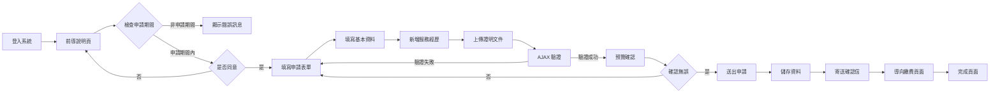
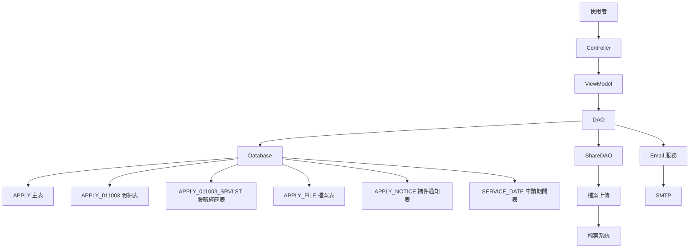
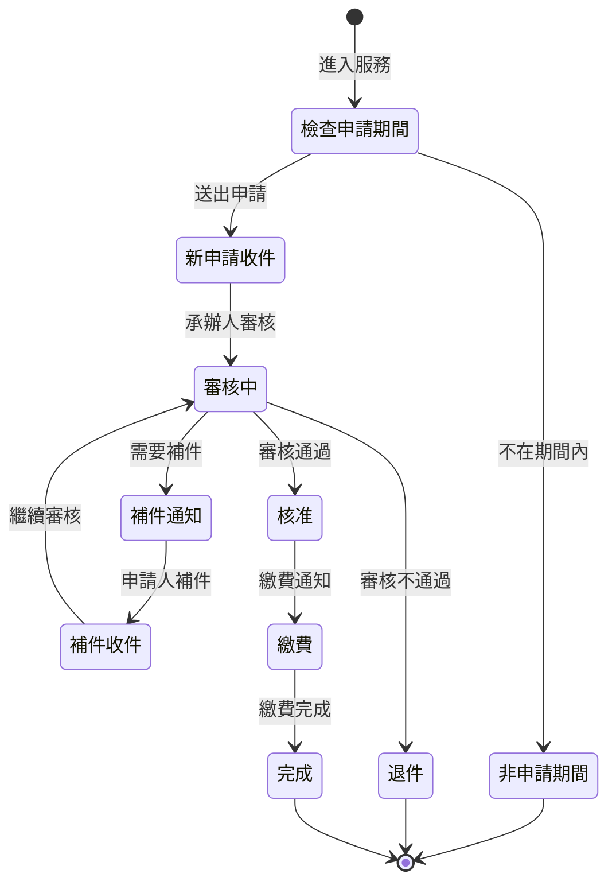

# 011003 - 社會工作實務經驗及從事社會工作業務年資審查 - 完整技術文件

## 服務基本資訊

| 項目         | 內容                                       |
| ------------ | ------------------------------------------ |
| 服務代碼     | 011003                                     |
| 服務名稱     | 社會工作實務經驗及從事社會工作業務年資審查 |
| 業務單位     | 社會及家庭署 (UNIT_CD: 8)                  |
| Controller   | Apply_011003Controller.cs (423 行)         |
| ViewModel    | Apply_011003ViewModel.cs (480 行)          |
| Entity Model | APPLY_011003.cs (243 行)                   |
| 子表 Entity  | APPLY_011003_SRVLST.cs (151 行)            |
| 是否需繳費   | 是                                         |
| 處理期限     | 依規定辦理                                 |
| 申請對象     | 社會工作人員                               |
| 特殊功能     | 申請期間控制、服務經歷列表、多檔案上傳     |

## 服務特色對照表

| 特色項目         | 011001 社工師執業執照 | 011002 專科社工師證書 | 011003 實務經驗審查 |
| ---------------- | --------------------- | --------------------- | ------------------- |
| 前導說明頁       | ✅                    | ✅                    | ✅                  |
| 申請期間控制     | ❌                    | ❌                    | ✅                  |
| AJAX 驗證        | ❌                    | ✅                    | ✅                  |
| PartialView 預覽 | ❌                    | ✅                    | ✅                  |
| 服務經歷列表     | ❌                    | ❌                    | ✅                  |
| 合併列印功能     | ❌                    | ✅                    | ✅                  |
| 檔案上傳數量     | 4 個                  | 4 個                  | 11 個               |
| 繳費功能         | ❌                    | ✅                    | ✅                  |
| 補件功能         | ✅                    | ✅                    | ✅                  |
| Email 網域管理   | ✅                    | ✅                    | ✅                  |
| 電話格式處理     | ✅                    | ✅                    | ✅                  |
| 地址管理         | ✅                    | ✅                    | ✅                  |
| 考試通知日期     | ❌                    | ❌                    | ✅                  |

## 核心功能說明

### 1. 前導說明頁 (Prompt)

**功能說明**：

- 顯示服務說明事項
- 檢查是否在申請期間內 (SERVICE_DATE 表)
- 要求使用者閱讀並同意後才能進入申辦頁面

**申請期間控制**：

```csharp
var data = dao.GetRow<TblSERVICE_DATE>(new TblSERVICE_DATE { SRV_ID = "011003" });
if (data != null)
{
    if (DateTime.Now >= data.TIME_S && DateTime.Now < (data.TIME_E.Value.AddDays(1)))
    {
        ViewBag.CanApply = "Y";
    }
}
```

### 2. 申請表單 (Apply GET)

**功能說明**：

- 檢查是否已同意說明事項 (agree = "1")
- 自動帶入會員基本資料
- 初始化表單欄位

**自動帶入欄位**：

- 姓名、身分證字號、出生年月日、性別
- 電話 (公/宅)、行動電話
- 通訊地址、Email
- 學歷資訊

### 3. AJAX 表單驗證 (Apply POST)

**功能說明**：

- 使用 AJAX 進行表單驗證
- 返回 JSON 格式的驗證結果
- 驗證通過後才能進入預覽頁面

**驗證項目**：

- 郵遞區號驗證
- 身分證字號驗證 (CheckUtils.IsIdentity)
- 電話驗證：公/宅/行動電話至少填寫一組
- Email 驗證：格式驗證 (Regex)
- 檔案驗證：合併列印至少上傳 1 個，不合併列印必須上傳必填檔案
- 服務經歷列表驗證

### 4. 預覽頁面 (PreView)

**功能說明**：

- 使用 PartialView 顯示預覽內容
- 確認申請資料無誤後再送出

### 5. 儲存申請 (Save)

**功能說明**：

- 儲存申請資料到資料庫
- 儲存服務經歷列表
- 上傳多個證明文件
- 寄送確認信
- 導向繳費頁面

### 6. 補件功能 (AppDoc / SaveAppDoc)

**功能說明**：

- 顯示補件頁面
- 載入案件資料及補件欄位
- 載入服務經歷列表
- 儲存補件資料並寄送通知信

### 7. 完成頁面 (Done)

**功能說明**：

- 顯示申請完成訊息
- status = "1"：新申請完成
- status = "2"：補件完成

### 8. 服務經歷列表管理

**功能說明**：

- 動態新增/刪除服務經歷
- 每筆經歷包含：服務單位名稱、職稱、服務年限、證明文件
- 儲存至 APPLY_011003_SRVLST 表

**欄位**：

- SRV_NAM：服務單位名稱
- SRV_TITLE：職稱
- SRV_SYEAR：服務年限 (起)
- SRV_EYEAR：服務年限 (迄)
- FILE_PICRGB：服務證明文件
- FILE_SRVPROVE：服務單位證明文件
- FILE_LABOR：勞保證明文件
- FILE_LEGAL：法人登記證明文件
- FILE_CHARTER：章程文件

### 9. 考試通知日期選擇

**功能說明**：

- 選擇考試通知年度和月份
- 組合為 NOTICEDAY 欄位 (格式: YYYYMM)

### 10. 多檔案上傳管理

**功能說明**：

- 支援 11 種不同類型的檔案上傳
- 合併列印模式：至少上傳 1 個檔案
- 不合併列印模式：必須上傳必填檔案

**檔案類型**：

1. FILE_FIDC：身分證正面影本
2. FILE_BIDC：身分證反面影本
3. FILE_PIC：最近一年內二吋照片
4. FILE_GRAD：畢業證書影本
5. FILE_NOTI：考試通知單影本
6. FILE_NOTI2：畢業證書影本 (第 2 份)
7. FILE_NOTI3：學位證書影本
8. FILE_NOTI4：其他證明文件
9. FILE_GRADOFF：學程證明文件
10. FILE_FONSRV：從事社會工作證明文件
11. FILE_DOMICILE：戶籍謄本或戶口名簿影本
12. FILE_SCHOOL：學校證明文件
13. FILE_OTHER：其他文件

---

## 申請流程圖



---

## 補件流程圖


---

## 資料流程圖



---

## 狀態轉換圖



---

## 資料庫結構

### 1. APPLY 主表 (共用)

| 欄位名稱    | 資料型別      | 說明         | 備註                   |
| ----------- | ------------- | ------------ | ---------------------- |
| APP_ID      | VARCHAR(20)   | 案件編號     | PK                     |
| SRV_ID      | VARCHAR(10)   | 服務代碼     | 011003                 |
| SRC_SRV_ID  | VARCHAR(10)   | 來源服務代碼 | 011003                 |
| ACC_NO      | VARCHAR(20)   | 帳號         |                        |
| NAME        | NVARCHAR(50)  | 姓名         |                        |
| IDN         | VARCHAR(10)   | 身分證字號   |                        |
| BIRTHDAY    | DATETIME      | 出生年月日   |                        |
| SEX_CD      | VARCHAR(1)    | 性別代碼     | M/F                    |
| TEL         | VARCHAR(20)   | 電話         | 公/宅電話擇一          |
| MOBILE      | VARCHAR(20)   | 行動電話     |                        |
| EMAIL       | VARCHAR(100)  | Email        |                        |
| ADDR_CODE   | VARCHAR(10)   | 地址郵遞區號 |                        |
| ADDR        | NVARCHAR(200) | 地址         |                        |
| APP_TIME    | DATETIME      | 申請時間     |                        |
| FLOW_CD     | VARCHAR(2)    | 流程狀態代碼 | 1:收件, 2:補件, 3:審核 |
| UNIT_CD     | INT           | 業務單位代碼 | 8:社會及家庭署         |
| PRO_ACC     | VARCHAR(20)   | 承辦人帳號   |                        |
| PRO_UNIT_CD | INT           | 承辦單位代碼 |                        |
| APP_DISP_MK | VARCHAR(1)    | 分文處理註記 | Y/N                    |
| LOGIN_TYPE  | VARCHAR(10)   | 登入類型     |                        |
| MAILBODY    | NVARCHAR(MAX) | 補件通知內容 |                        |
| ADD_TIME    | DATETIME      | 新增時間     |                        |
| ADD_FUN_CD  | VARCHAR(50)   | 新增功能代碼 |                        |
| ADD_ACC     | VARCHAR(20)   | 新增人員帳號 |                        |
| UPD_TIME    | DATETIME      | 更新時間     |                        |
| UPD_FUN_CD  | VARCHAR(50)   | 更新功能代碼 |                        |
| UPD_ACC     | VARCHAR(20)   | 更新人員帳號 |                        |
| DEL_MK      | VARCHAR(1)    | 刪除註記     | Y/N                    |
| DEL_TIME    | DATETIME      | 刪除時間     |                        |
| DEL_FUN_CD  | VARCHAR(50)   | 刪除功能代碼 |                        |
| DEL_ACC     | VARCHAR(20)   | 刪除人員帳號 |                        |

### 2. APPLY_011003 明細表

| 欄位名稱      | 資料型別      | 說明                   | 備註         |
| ------------- | ------------- | ---------------------- | ------------ |
| APP_ID        | VARCHAR(20)   | 案件編號               | PK, FK       |
| ISMEET        | VARCHAR(1)    | 是否符合資格           | Y/N          |
| NAME          | NVARCHAR(50)  | 姓名                   |              |
| BIRTHDAY      | DATETIME      | 出生年月日             |              |
| IDN           | VARCHAR(10)   | 身分證字號             |              |
| SEX_CD        | VARCHAR(1)    | 性別代碼               | M/F          |
| TEL           | VARCHAR(20)   | 電話 (公)              |              |
| FAX           | VARCHAR(20)   | 電話 (宅)              |              |
| MOBILE        | VARCHAR(20)   | 行動電話               |              |
| ADDR_CODE     | VARCHAR(10)   | 通訊地址郵遞區號       |              |
| ADDR          | NVARCHAR(200) | 通訊地址               |              |
| MAIL          | VARCHAR(100)  | Email                  |              |
| EDUCATION     | VARCHAR(10)   | 學歷類別               |              |
| SCHOOL        | NVARCHAR(100) | 學校名稱               |              |
| OFFICE        | NVARCHAR(100) | 系(所)名稱             |              |
| GRADUATION    | VARCHAR(6)    | 畢業年月               | 格式: YYYYMM |
| MERGEYN       | VARCHAR(1)    | 是否合併上傳           | Y/N          |
| FILE_FIDC     | VARCHAR(200)  | 身分證正面影本         | 檔案路徑     |
| FILE_BIDC     | VARCHAR(200)  | 身分證反面影本         | 檔案路徑     |
| FILE_PIC      | VARCHAR(200)  | 最近一年內二吋照片     | 檔案路徑     |
| FILE_GRAD     | VARCHAR(200)  | 畢業證書影本           | 檔案路徑     |
| FILE_NOTI     | VARCHAR(200)  | 考試通知單影本         | 檔案路徑     |
| FILE_NOTI2    | VARCHAR(200)  | 畢業證書影本 (第 2 份) | 檔案路徑     |
| FILE_NOTI3    | VARCHAR(200)  | 學位證書影本           | 檔案路徑     |
| FILE_NOTI4    | VARCHAR(200)  | 其他證明文件           | 檔案路徑     |
| FILE_GRADOFF  | VARCHAR(200)  | 學程證明文件           | 檔案路徑     |
| FILE_FONSRV   | VARCHAR(200)  | 從事社會工作證明文件   | 檔案路徑     |
| FILE_DOMICILE | VARCHAR(200)  | 戶籍謄本或戶口名簿影本 | 檔案路徑     |
| FILE_SCHOOL   | VARCHAR(200)  | 學校證明文件           | 檔案路徑     |
| FILE_OTHER    | VARCHAR(200)  | 其他文件               | 檔案路徑     |
| NOTICEDAY     | VARCHAR(6)    | 考試通知年月           | 格式: YYYYMM |
| ADD_TIME      | DATETIME      | 新增時間               |              |
| ADD_FUN_CD    | VARCHAR(50)   | 新增功能代碼           |              |
| ADD_ACC       | VARCHAR(20)   | 新增人員帳號           |              |
| UPD_TIME      | DATETIME      | 更新時間               |              |
| UPD_FUN_CD    | VARCHAR(50)   | 更新功能代碼           |              |
| UPD_ACC       | VARCHAR(20)   | 更新人員帳號           |              |
| DEL_MK        | VARCHAR(1)    | 刪除註記               | Y/N          |
| DEL_TIME      | DATETIME      | 刪除時間               |              |
| DEL_FUN_CD    | VARCHAR(50)   | 刪除功能代碼           |              |
| DEL_ACC       | VARCHAR(20)   | 刪除人員帳號           |              |

### 3. APPLY_011003_SRVLST 服務經歷表

| 欄位名稱             | 資料型別      | 說明              | 備註     |
| -------------------- | ------------- | ----------------- | -------- |
| APP_ID               | VARCHAR(20)   | 案件編號          | PK, FK   |
| SEQ_NO               | VARCHAR(10)   | 序號              | PK       |
| SRV_NAM              | NVARCHAR(100) | 服務單位名稱      |          |
| SRV_TITLE            | NVARCHAR(50)  | 職稱              |          |
| SRV_SYEAR            | DATETIME      | 服務年限 (起)     |          |
| SRV_EYEAR            | DATETIME      | 服務年限 (迄)     |          |
| FILE_PICRGB          | VARCHAR(200)  | 服務證明文件      | 檔案路徑 |
| FILE_SRVPROVE        | VARCHAR(200)  | 服務單位證明文件  | 檔案路徑 |
| FILE_LABOR           | VARCHAR(200)  | 勞保證明文件      | 檔案路徑 |
| SRVLST_DEMAND_1      | VARCHAR(1)    | 特殊需求 1 (是否) | 0/1      |
| SRVLST_DEMAND_1_TEXT | NVARCHAR(200) | 特殊需求 1 說明   |          |
| FILE_LEGAL           | VARCHAR(200)  | 法人登記證明文件  | 檔案路徑 |
| SRVLST_DEMAND_2      | VARCHAR(1)    | 特殊需求 2 (是否) | 0/1      |
| SRVLST_DEMAND_2_TEXT | NVARCHAR(200) | 特殊需求 2 說明   |          |
| FILE_CHARTER         | VARCHAR(200)  | 章程文件          | 檔案路徑 |
| ADD_TIME             | DATETIME      | 新增時間          |          |
| ADD_FUN_CD           | VARCHAR(50)   | 新增功能代碼      |          |
| ADD_ACC              | VARCHAR(20)   | 新增人員帳號      |          |
| UPD_TIME             | DATETIME      | 更新時間          |          |
| UPD_FUN_CD           | VARCHAR(50)   | 更新功能代碼      |          |
| UPD_ACC              | VARCHAR(20)   | 更新人員帳號      |          |
| DEL_MK               | VARCHAR(1)    | 刪除註記          | Y/N      |
| DEL_TIME             | DATETIME      | 刪除時間          |          |
| DEL_FUN_CD           | VARCHAR(50)   | 刪除功能代碼      |          |
| DEL_ACC              | VARCHAR(20)   | 刪除人員帳號      |          |

### 4. APPLY_FILE 檔案表 (共用)

| 欄位名稱     | 資料型別      | 說明         | 備註      |
| ------------ | ------------- | ------------ | --------- |
| APP_ID       | VARCHAR(20)   | 案件編號     | PK, FK    |
| FILE_NO      | VARCHAR(2)    | 檔案編號     | PK        |
| SRC_NO       | INT           | 來源編號     | 補件次數  |
| FILENAME     | VARCHAR(200)  | 檔案名稱     | 完整路徑  |
| SRC_FILENAME | VARCHAR(200)  | 原始檔案名稱 |           |
| FILE_SIZE    | INT           | 檔案大小     | Bytes     |
| FILE_TYPE    | VARCHAR(50)   | 檔案類型     | MIME Type |
| FILE_DESC    | NVARCHAR(200) | 檔案說明     |           |
| ADD_TIME     | DATETIME      | 新增時間     |           |
| ADD_FUN_CD   | VARCHAR(50)   | 新增功能代碼 |           |
| ADD_ACC      | VARCHAR(20)   | 新增人員帳號 |           |

### 5. APPLY_NOTICE 補件通知表 (共用)

| 欄位名稱   | 資料型別    | 說明         | 備註     |
| ---------- | ----------- | ------------ | -------- |
| APP_ID     | VARCHAR(20) | 案件編號     | PK, FK   |
| Field      | VARCHAR(50) | 補件欄位名稱 | PK       |
| SRC_NO     | INT         | 來源編號     | 補件次數 |
| ISADDYN    | VARCHAR(1)  | 是否已補件   | Y/N      |
| ADD_TIME   | DATETIME    | 新增時間     |          |
| ADD_FUN_CD | VARCHAR(50) | 新增功能代碼 |          |
| ADD_ACC    | VARCHAR(20) | 新增人員帳號 |          |
| UPD_TIME   | DATETIME    | 更新時間     |          |
| UPD_FUN_CD | VARCHAR(50) | 更新功能代碼 |          |
| UPD_ACC    | VARCHAR(20) | 更新人員帳號 |          |

### 6. SERVICE_DATE 申請期間表

| 欄位名稱 | 資料型別    | 說明         | 備註 |
| -------- | ----------- | ------------ | ---- |
| SRV_ID   | VARCHAR(10) | 服務代碼     | PK   |
| TIME_S   | DATETIME    | 開始時間     |      |
| TIME_E   | DATETIME    | 結束時間     |      |
| ADD_TIME | DATETIME    | 新增時間     |      |
| ADD_ACC  | VARCHAR(20) | 新增人員帳號 |      |
| UPD_TIME | DATETIME    | 更新時間     |      |
| UPD_ACC  | VARCHAR(20) | 更新人員帳號 |      |

---

## ViewModel 結構

### 1. Apply_011003ViewModel

**功能說明**：主要 ViewModel，包含 Form

**屬性**：

```csharp
public class Apply_011003ViewModel
{
    public Apply_011003FormModel Form { get; set; }
}
```

### 2. Apply_011003FormModel

**功能說明**：申請表單模型，繼承自 ApplyModel

**主要屬性**：

| 屬性名稱              | 資料型別                      | 說明                   | 驗證規則 |
| --------------------- | ----------------------------- | ---------------------- | -------- |
| ISMEET                | string                        | 是否符合資格           |          |
| NAME                  | string                        | 姓名                   |          |
| BIRTHDAY              | string                        | 出生年月日 (民國年)    |          |
| BIRTHDAY_AD           | string                        | 出生年月日 (西元年)    |          |
| IDN                   | string                        | 身分證字號             |          |
| SEX_CD                | string                        | 性別代碼               |          |
| TEL                   | string                        | 電話 (公)              |          |
| TEL_0                 | string                        | 電話 (公) 號碼         |          |
| TEL_1                 | string                        | 電話 (公) 分機         |          |
| FAX                   | string                        | 電話 (宅)              |          |
| FAX_0                 | string                        | 電話 (宅) 號碼         |          |
| FAX_1                 | string                        | 電話 (宅) 分機         |          |
| MOBILE                | string                        | 行動電話               |          |
| ADDR_CODE             | string                        | 通訊地址郵遞區號       | Required |
| ADDR_TEXT             | string                        | 通訊地址 (縣市鄉鎮)    |          |
| ADDR_DETAIL           | string                        | 通訊地址 (詳細地址)    | Required |
| MAIL                  | string                        | Email 帳號名稱         | Required |
| MAIL_0                | string                        | Email 網域選項         |          |
| MAIL_1                | string                        | Email 網域 (自訂)      |          |
| MAIL_2                | string                        | Email 網域 (備用)      |          |
| EDUCATION             | string                        | 學歷類別               | Required |
| SCHOOL                | string                        | 學校名稱               | Required |
| OFFICE                | string                        | 系(所)名稱             | Required |
| GRADUATION            | string                        | 畢業年度               | Required |
| GRADUATION_MONTH      | string                        | 畢業月份               |          |
| GRADUATION_TEXT       | string                        | 畢業年度 (顯示用)      |          |
| GRADUATION_MONTH_TEXT | string                        | 畢業月份 (顯示用)      |          |
| NOTICEDAY_YEAR        | string                        | 考試通知年度           |          |
| NOTICEDAY_MONTH       | string                        | 考試通知月份           |          |
| NOTICEDAY             | string                        | 考試通知年月           |          |
| MERGEYN               | string                        | 是否合併上傳           |          |
| FILE_FIDC             | HttpPostedFileBase            | 身分證正面影本         |          |
| FILE_FIDC_TEXT        | string                        | 身分證正面影本檔名     |          |
| FILE_BIDC             | HttpPostedFileBase            | 身分證反面影本         |          |
| FILE_BIDC_TEXT        | string                        | 身分證反面影本檔名     |          |
| FILE_PIC              | HttpPostedFileBase            | 最近一年內二吋照片     |          |
| FILE_PIC_TEXT         | string                        | 照片檔名               |          |
| FILE_GRAD             | HttpPostedFileBase            | 畢業證書影本           |          |
| FILE_GRAD_TEXT        | string                        | 畢業證書檔名           |          |
| FILE_NOTI             | HttpPostedFileBase            | 考試通知單影本         |          |
| FILE_NOTI_TEXT        | string                        | 考試通知單檔名         |          |
| FILE_NOTI2            | HttpPostedFileBase            | 畢業證書影本 (第 2 份) |          |
| FILE_NOTI2_TEXT       | string                        | 畢業證書檔名 (第 2 份) |          |
| FILE_NOTI3            | HttpPostedFileBase            | 學位證書影本           |          |
| FILE_NOTI3_TEXT       | string                        | 學位證書檔名           |          |
| FILE_NOTI4            | HttpPostedFileBase            | 其他證明文件           |          |
| FILE_NOTI4_TEXT       | string                        | 其他證明文件檔名       |          |
| FILE_GRADOFF          | HttpPostedFileBase            | 學程證明文件           |          |
| FILE_GRADOFF_TEXT     | string                        | 學程證明文件檔名       |          |
| FILE_FONSRV           | HttpPostedFileBase            | 從事社會工作證明文件   |          |
| FILE_FONSRV_TEXT      | string                        | 從事社會工作證明檔名   |          |
| FILE_DOMICILE         | HttpPostedFileBase            | 戶籍謄本或戶口名簿影本 |          |
| FILE_DOMICILE_TEXT    | string                        | 戶籍謄本檔名           |          |
| FILE_SCHOOL           | HttpPostedFileBase            | 學校證明文件           |          |
| FILE_SCHOOL_TEXT      | string                        | 學校證明文件檔名       |          |
| FILE_OTHER            | HttpPostedFileBase            | 其他文件               |          |
| FILE_OTHER_TEXT       | string                        | 其他文件檔名           |          |
| SRVLIST               | List<Apply_011003SRVLSTModel> | 服務經歷列表           |          |
| FILE                  | List<Apply_011003FILEModel>   | 檔案列表               |          |

### 3. Apply_011003SRVLSTModel

**功能說明**：服務經歷列表模型

**主要屬性**：

| 屬性名稱             | 資料型別           | 說明              | 驗證規則 |
| -------------------- | ------------------ | ----------------- | -------- |
| APP_ID               | string             | 案件編號          |          |
| SEQ_NO               | string             | 序號              |          |
| SRV_NAM              | string             | 服務單位名稱      |          |
| SRV_TITLE            | string             | 職稱              |          |
| SRV_SYEAR            | string             | 服務年限 (起)     |          |
| SRV_EYEAR            | string             | 服務年限 (迄)     |          |
| FILE_PICRGB          | HttpPostedFileBase | 服務證明文件      |          |
| FILE_PICRGB_TEXT     | string             | 服務證明文件檔名  |          |
| FILE_SRVPROVE        | HttpPostedFileBase | 服務單位證明文件  |          |
| FILE_SRVPROVE_TEXT   | string             | 服務單位證明檔名  |          |
| FILE_LABOR           | HttpPostedFileBase | 勞保證明文件      |          |
| FILE_LABOR_TEXT      | string             | 勞保證明文件檔名  |          |
| SRVLST_DEMAND_1      | string             | 特殊需求 1 (是否) |          |
| SRVLST_DEMAND_1_TEXT | string             | 特殊需求 1 說明   |          |
| FILE_LEGAL           | HttpPostedFileBase | 法人登記證明文件  |          |
| FILE_LEGAL_TEXT      | string             | 法人登記證明檔名  |          |
| SRVLST_DEMAND_2      | string             | 特殊需求 2 (是否) |          |
| SRVLST_DEMAND_2_TEXT | string             | 特殊需求 2 說明   |          |
| FILE_CHARTER         | HttpPostedFileBase | 章程文件          |          |
| FILE_CHARTER_TEXT    | string             | 章程文件檔名      |          |

### 4. Apply_011003DoneModel

**功能說明**：完成頁面模型

**屬性**：

```csharp
public class Apply_011003DoneModel
{
    public string status { get; set; }  // 狀態: 1:新申請, 2:補件
    public string Count { get; set; }   // 補件件數
}
```

---

## Controller 方法說明

### 1. Prompt() - 前導說明頁

**HTTP Method**：GET

**路由**：`/Apply_011003/Prompt`

**功能說明**：顯示前導說明頁面，檢查申請期間，要求使用者閱讀並同意說明事項

**程式碼範例**：

```csharp
public ActionResult Prompt()
{
    ShareDAO dao = new ShareDAO();
    SessionModel sm = SessionModel.Get();
    Apply_011003ViewModel model = new Apply_011003ViewModel();

    string s_msg_1A = "請先閱讀 「{0}說明事項」點選同意後，再進入申辦頁面 !";
    string showText = "社會工作實務經驗年資審查";
    sm.LastErrorMessage = string.Format(s_msg_1A, showText);
    ViewBag.CanApply = "N";

    // 檢查是否在申請期間內
    var data = dao.GetRow<TblSERVICE_DATE>(new TblSERVICE_DATE { SRV_ID = "011003" });
    if (data != null)
    {
        if (DateTime.Now >= data.TIME_S && DateTime.Now < (data.TIME_E.Value.AddDays(1)))
        {
            ViewBag.CanApply = "Y";
        }
    }
    return View("Prompt011003", model.Form);
}
```

### 2. Apply() GET - 申請表單頁面

**HTTP Method**：GET

**路由**：`/Apply_011003/Apply?agree=1`

**功能說明**：顯示申請表單，自動帶入會員基本資料

**主要處理邏輯**：

1. 檢查是否已同意說明事項 (agree = "1")
2. 自動帶入會員基本資料
3. 初始化表單欄位

### 3. Apply() POST - AJAX 表單驗證

**HTTP Method**：POST

**路由**：`/Apply_011003/Apply`

**功能說明**：使用 AJAX 進行表單驗證，返回 JSON 格式的驗證結果

**程式碼範例**：

```csharp
[HttpPost]
public ActionResult Apply(Apply_011003FormModel model)
{
    var result = new AjaxResultStruct();
    ApplyDAO dao = new ApplyDAO();
    string ErrorMsg = dao.ChkApply011003(model);

    if (ModelState.IsValid)
    {
        ModelState.Clear();
        if (ErrorMsg == "")
        {
            result.status = true;
            result.message = "";
        }
        else
        {
            result.status = false;
            result.message = ErrorMsg;
        }
    }
    else
    {
        result.status = false;
        foreach (var item in ModelState.Values)
        {
            if (item.Errors.ToCount() > 0)
            {
                ErrorMsg = ErrorMsg + item.Errors[0].ErrorMessage + "\r\n";
            }
        }
        result.message = ErrorMsg;
    }

    return Content(result.Serialize(), "application/json");
}
```

### 4. PreView() POST - 預覽頁面

**HTTP Method**：POST

**路由**：`/Apply_011003/PreView`

**功能說明**：使用 PartialView 顯示預覽內容

**程式碼範例**：

```csharp
[HttpPost]
public ActionResult PreView(Apply_011003FormModel model)
{
    model.NOTICEDAY = model.NOTICEDAY_YEAR.TONotNullString() + model.NOTICEDAY_MONTH.TONotNullString();
    return PartialView("PreView011003", model);
}
```

### 5. Save() POST - 儲存申請

**HTTP Method**：POST

**路由**：`/Apply_011003/Save`

**功能說明**：儲存申請資料到資料庫，寄送確認信，導向繳費頁面

**主要處理邏輯**：

1. 組合 Email 地址
2. 呼叫 DAO.AppendApply011003() 儲存資料
3. 寄送確認信
4. 導向完成頁面

**程式碼範例**：

```csharp
[HttpPost]
public ActionResult Save(Apply_011003FormModel form)
{
    SessionModel sm = SessionModel.Get();
    ApplyDAO dao = new ApplyDAO();

    // 組合 Email
    switch (form.MAIL_0)
    {
        case "1": form.MAIL_1 = "gmail.com"; break;
        case "2": form.MAIL_1 = "yahoo.com.tw"; break;
        case "3": form.MAIL_1 = "outlook.com"; break;
    }
    var email = $"{form.MAIL}@{form.MAIL_1}";
    var memberName = string.IsNullOrWhiteSpace(form.NAME) ? sm.UserInfo.Member.NAME : form.NAME;
    var memberEmail = string.IsNullOrWhiteSpace(form.MAIL) ? sm.UserInfo.Member.MAIL : email;

    // 存檔
    form.APP_ID = dao.AppendApply011003(form);

    // 寄信
    dao.SendMail_New(memberName, memberEmail, form.APP_ID, "社會工作實務經驗年資審查", "011003");

    return Done("1");
}
```

### 6. AppDoc() GET - 補件頁面

**HTTP Method**：GET

**路由**：`/Apply_011003/AppDoc?APP_ID=xxx`

**功能說明**：顯示補件頁面，載入案件資料及補件欄位

**主要處理邏輯**：

1. 驗證是否為案件申請人
2. 載入案件資料
3. 載入服務經歷列表
4. 載入補件欄位
5. 檢查補件期限

### 7. SaveAppDoc() POST - 儲存補件

**HTTP Method**：POST

**路由**：`/Apply_011003/SaveAppDoc`

**功能說明**：儲存補件資料並寄送通知信

**主要處理邏輯**：

1. 組合 Email 地址
2. 組合考試通知年月
3. 呼叫 DAO.UpdateApply011003() 更新資料
4. 寄送補件完成通知信
5. 導向完成頁面

### 8. Done() - 完成頁面

**HTTP Method**：GET

**路由**：`/Apply_011003/Done?status=1`

**功能說明**：顯示申請完成訊息

**參數**：

- status: "1" = 新申請完成, "2" = 補件完成
- Count: 補件件數

---

## DAO 方法說明

### 1. ChkApply011003() - 表單驗證

**功能說明**：驗證申請表單資料

**參數**：

- `form`：Apply_011003FormModel

**返回值**：

- `string`：錯誤訊息 (空字串表示驗證通過)

**驗證項目**：

- 郵遞區號驗證
- 身分證字號驗證 (CheckUtils.IsIdentity)
- 電話驗證：公/宅/行動電話至少填寫一組
- Email 格式驗證 (Regex)
- 檔案驗證：合併列印至少上傳 1 個，不合併列印必須上傳必填檔案
- 服務經歷列表驗證

### 2. AppendApply011003() - 新增案件

**功能說明**：新增申請案件到資料庫

**參數**：

- `form`：Apply_011003FormModel

**返回值**：

- `string`：案件編號 (APP_ID)

**主要處理邏輯**：

1. 產生案件編號
2. 新增 APPLY 主表
3. 新增 APPLY_011003 明細表
4. 新增服務經歷列表 (APPLY_011003_SRVLST)
5. 上傳檔案並新增 APPLY_FILE 表
6. 新增 APPLY_LOG 歷程表
7. 新增 APPLY_PAY 繳費表 (如有繳費)

**SQL 語法範例**：

```sql
-- 1. 新增 APPLY 主表
INSERT INTO APPLY (APP_ID, SRV_ID, SRC_SRV_ID, ACC_NO, NAME, IDN, BIRTHDAY, SEX_CD,
                   TEL, MOBILE, EMAIL, ADDR_CODE, ADDR, APP_TIME, FLOW_CD, UNIT_CD,
                   PRO_ACC, PRO_UNIT_CD, APP_DISP_MK, LOGIN_TYPE, ADD_TIME, ADD_FUN_CD, ADD_ACC)
VALUES (@APP_ID, '011003', '011003', @ACC_NO, @NAME, @IDN, @BIRTHDAY, @SEX_CD,
        @TEL, @MOBILE, @EMAIL, @ADDR_CODE, @ADDR, GETDATE(), '1', 8,
        @PRO_ACC, @PRO_UNIT_CD, 'Y', @LOGIN_TYPE, GETDATE(), 'WEB-APPLY', @ACC_NO)

-- 2. 新增 APPLY_011003 明細表
INSERT INTO APPLY_011003 (APP_ID, ISMEET, NAME, BIRTHDAY, IDN, SEX_CD, TEL, FAX, MOBILE,
                          ADDR_CODE, ADDR, MAIL, EDUCATION, SCHOOL, OFFICE, GRADUATION,
                          MERGEYN, FILE_FIDC, FILE_BIDC, FILE_PIC, FILE_GRAD, FILE_NOTI,
                          FILE_NOTI2, FILE_NOTI3, FILE_NOTI4, FILE_GRADOFF, FILE_FONSRV,
                          FILE_DOMICILE, FILE_SCHOOL, FILE_OTHER, NOTICEDAY,
                          ADD_TIME, ADD_FUN_CD, ADD_ACC)
VALUES (@APP_ID, @ISMEET, @NAME, @BIRTHDAY, @IDN, @SEX_CD, @TEL, @FAX, @MOBILE,
        @ADDR_CODE, @ADDR, @MAIL, @EDUCATION, @SCHOOL, @OFFICE, @GRADUATION,
        @MERGEYN, @FILE_FIDC, @FILE_BIDC, @FILE_PIC, @FILE_GRAD, @FILE_NOTI,
        @FILE_NOTI2, @FILE_NOTI3, @FILE_NOTI4, @FILE_GRADOFF, @FILE_FONSRV,
        @FILE_DOMICILE, @FILE_SCHOOL, @FILE_OTHER, @NOTICEDAY,
        GETDATE(), 'WEB-APPLY', @ACC_NO)

-- 3. 新增服務經歷列表
INSERT INTO APPLY_011003_SRVLST (APP_ID, SEQ_NO, SRV_NAM, SRV_TITLE, SRV_SYEAR, SRV_EYEAR,
                                 FILE_PICRGB, FILE_SRVPROVE, FILE_LABOR, SRVLST_DEMAND_1,
                                 SRVLST_DEMAND_1_TEXT, FILE_LEGAL, SRVLST_DEMAND_2,
                                 SRVLST_DEMAND_2_TEXT, FILE_CHARTER,
                                 ADD_TIME, ADD_FUN_CD, ADD_ACC)
VALUES (@APP_ID, @SEQ_NO, @SRV_NAM, @SRV_TITLE, @SRV_SYEAR, @SRV_EYEAR,
        @FILE_PICRGB, @FILE_SRVPROVE, @FILE_LABOR, @SRVLST_DEMAND_1,
        @SRVLST_DEMAND_1_TEXT, @FILE_LEGAL, @SRVLST_DEMAND_2,
        @SRVLST_DEMAND_2_TEXT, @FILE_CHARTER,
        GETDATE(), 'WEB-APPLY', @ACC_NO)

-- 4. 新增 APPLY_FILE 檔案表
INSERT INTO APPLY_FILE (APP_ID, FILE_NO, SRC_NO, FILENAME, SRC_FILENAME, FILE_SIZE, FILE_TYPE, FILE_DESC, ADD_TIME, ADD_FUN_CD, ADD_ACC)
VALUES (@APP_ID, @FILE_NO, 0, @FILENAME, @SRC_FILENAME, @FILE_SIZE, @FILE_TYPE, @FILE_DESC, GETDATE(), 'WEB-APPLY', @ACC_NO)

-- 5. 新增 APPLY_LOG 歷程表
INSERT INTO APPLY_LOG (APP_ID, FLOW_CD, FLOW_NAME, ADD_TIME, ADD_ACC)
VALUES (@APP_ID, '1', '新申請收件', GETDATE(), @ACC_NO)
```

### 3. GetDetail011003() - 取得案件詳細資料

**功能說明**：取得案件的詳細資料，包含服務經歷列表和檔案列表

**參數**：

- `APP_ID`：案件編號

**返回值**：

- `Apply_011003FormModel`：包含案件資料、服務經歷列表、檔案列表

**SQL 語法**：

```sql
-- 取得案件基本資料
SELECT convert(varchar,app.APP_TIME, 111)APP_TIME, app.APP_EXT_DATE, ad.NAME as PRO_NAM, app.MOHW_CASE_NO,
       a03.APP_ID, a03.ISMEET, a03.NAME, convert(varchar,a03.BIRTHDAY, 111)BIRTHDAY,
       a03.IDN, a03.SEX_CD, app.TEL, a03.FAX, a03.MOBILE, app.ADDR, app.ADDR_CODE, a03.MAIL, a03.EDUCATION,
       a03.SCHOOL, a03.OFFICE, a03.GRADUATION, a03.FILE_FIDC AS FILE_FIDC_TEXT, a03.FILE_BIDC AS FILE_BIDC_TEXT,
       a03.FILE_PIC AS FILE_PIC_TEXT, a03.FILE_GRAD AS FILE_GRAD_TEXT, a03.FILE_NOTI AS FILE_NOTI_TEXT,
       a03.FILE_GRADOFF AS FILE_GRADOFF_TEXT, a03.FILE_FONSRV AS FILE_FONSRV_TEXT,
       a03.FILE_SCHOOL AS FILE_SCHOOL_TEXT, a03.FILE_DOMICILE AS FILE_DOMICILE_TEXT,
       a03.FILE_OTHER AS FILE_OTHER_TEXT, app.FLOW_CD, a03.MERGEYN, app.MAILBODY, a03.NOTICEDAY,
       a03.FILE_NOTI2 AS FILE_NOTI2_TEXT, a03.FILE_NOTI3 AS FILE_NOTI3_TEXT, a03.FILE_NOTI4 AS FILE_NOTI4_TEXT
FROM APPLY_011003 a03
JOIN APPLY app ON a03.APP_ID = app.APP_ID
LEFT JOIN ADMIN ad ON app.PRO_ACC = ad.ACC_NO
WHERE a03.app_id = @APP_ID

-- 取得服務經歷列表
SELECT APP_ID, SRV_NAM, SRV_TITLE, CONVERT(varchar, SRV_SYEAR, 111) SRV_SYEAR, CONVERT(varchar, SRV_EYEAR, 111) SRV_EYEAR,
       FILE_PICRGB as FILE_PICRGB_TEXT, FILE_SRVPROVE as FILE_SRVPROVE_TEXT, FILE_LABOR as FILE_LABOR_TEXT,
       CONVERT(BIT,SRVLST_DEMAND_1) as SRVLST_DEMAND_1, SRVLST_DEMAND_1_TEXT,
       FILE_LEGAL as FILE_LEGAL_TEXT, CONVERT(BIT,SRVLST_DEMAND_2) as SRVLST_DEMAND_2,
       SRVLST_DEMAND_2_TEXT, FILE_CHARTER as FILE_CHARTER_TEXT, SEQ_NO
FROM APPLY_011003_SRVLST
WHERE app_id = @APP_ID
```

### 4. UpdateApply011003() - 更新補件資料

**功能說明**：更新補件資料到資料庫

**參數**：

- `model`：Apply_011003FormModel

**返回值**：

- `string`：補件件數

**主要處理邏輯**：

1. 計算補件件數
2. 更新 APPLY_NOTICE 補件狀態
3. 更新 APPLY 主表
4. 更新 APPLY_011003 明細表
5. 更新服務經歷列表 (APPLY_011003_SRVLST)
6. 新增 APPLY_FILE 補件檔案
7. 新增 APPLY_LOG 歷程表

---

## 技術亮點

### 1. 申請期間控制

**特色**：

- 使用 SERVICE_DATE 表控制申請期間
- 只有在申請期間內才能申請
- 非申請期間顯示錯誤訊息

**實作方式**：

```csharp
var data = dao.GetRow<TblSERVICE_DATE>(new TblSERVICE_DATE { SRV_ID = "011003" });
if (data != null)
{
    if (DateTime.Now >= data.TIME_S && DateTime.Now < (data.TIME_E.Value.AddDays(1)))
    {
        ViewBag.CanApply = "Y";
    }
}
```

### 2. 服務經歷列表管理

**特色**：

- 動態新增/刪除服務經歷
- 每筆經歷包含多個檔案上傳
- 支援特殊需求選項

**優點**：

- 彈性管理多筆服務經歷
- 每筆經歷獨立驗證
- 支援複雜的檔案上傳需求

### 3. 多檔案上傳管理

**特色**：

- 支援 13 種不同類型的檔案上傳
- 合併列印模式：至少上傳 1 個檔案
- 不合併列印模式：必須上傳必填檔案

**檔案類型**：

- 基本證明文件：身分證、照片、畢業證書
- 考試相關文件：考試通知單、學位證書
- 服務證明文件：服務經歷證明、勞保證明
- 其他文件：戶籍謄本、學校證明、其他

### 4. AJAX 表單驗證

**特色**：

- 使用 AJAX 進行表單驗證
- 返回 JSON 格式的驗證結果
- 前端 JavaScript 接收驗證結果並顯示錯誤訊息

**優點**：

- 不需重新載入頁面
- 提升使用者體驗
- 減少伺服器負擔

### 5. PartialView 預覽功能

**特色**：

- 使用 PartialView 顯示預覽內容
- 不需導向新頁面
- 可在同一頁面確認資料

### 6. 考試通知日期選擇

**特色**：

- 分離年度和月份選擇
- 自動組合為 YYYYMM 格式
- 支援民國年格式

### 7. Email 網域管理

**特色**：

- 下拉選單選擇常用 Email 網域
- 支援自訂 Email 網域
- 自動組合完整 Email 地址

### 8. 電話格式處理

**特色**：

- 分離區碼、號碼、分機
- 自動組合完整電話號碼
- 支援公/宅兩組電話

### 9. 地址管理

**特色**：

- 郵遞區號自動轉換為縣市鄉鎮
- 分離郵遞區號和詳細地址

### 10. 合併列印功能

**特色**：

- 支援合併列印模式
- 合併列印時至少上傳 1 個檔案
- 不合併列印時必須上傳必填檔案

### 11. 繳費功能

**特色**：

- 支援繳費功能
- 取得繳費資訊 (金額、方式、地點)
- 儲存繳費資料到 APPLY_PAY 表

### 12. 補件期限檢查

**特色**：

- 檢查補件期限
- 超過期限無法補件
- 使用 CalculationDocDate() 計算期限

---

## 相關檔案列表

### Controller 檔案

- `ES/Controllers/Apply_011003Controller.cs` (423 行)

### ViewModel 檔案

- `ES/Models/ViewModels/Apply_011003ViewModel.cs` (480 行)

### Entity Model 檔案

- `ES/Models/Entities/APPLY_011003.cs` (243 行)
- `ES/Models/Entities/APPLY_011003_SRVLST.cs` (151 行)

### DAO 檔案

- `ES/DataLayers/ApplyDAO.cs` (24,561 行)
- `ES/DataLayers/ShareDAO.cs`

### View 檔案

- `ES/Views/Apply_011003/Prompt011003.cshtml`
- `ES/Views/Apply_011003/Index.cshtml`
- `ES/Views/Apply_011003/PreView011003.cshtml`
- `ES/Views/Apply_011003/AppDoc.cshtml`
- `ES/Views/Apply_011003/Done.cshtml`

---

## 重要注意事項

### 1. 申請期間控制

- 必須在申請期間內才能申請
- 非申請期間顯示錯誤訊息
- 申請期間由 SERVICE_DATE 表控制

### 2. 前導說明頁

- 必須先閱讀並同意說明事項才能進入申辦頁面
- `agree` 參數必須為 "1" 才能進入申辦頁面

### 3. AJAX 驗證

- Apply() POST 方法返回 JSON 格式
- 前端 JavaScript 需處理驗證結果

### 4. 電話驗證

- 公/宅/行動電話至少填寫一組
- 電話欄位需填寫完整 (區碼 + 號碼)

### 5. Email 驗證

- Email 帳號名稱為必填
- Email 網域為必填
- 使用 Regex 驗證 Email 格式

### 6. 檔案上傳

- 合併列印：至少上傳 1 個檔案
- 不合併列印：必須上傳必填檔案
- 服務經歷列表中的檔案需獨立上傳

### 7. 服務經歷列表

- 至少需新增 1 筆服務經歷
- 每筆經歷需填寫完整資訊
- 每筆經歷的檔案需獨立上傳

### 8. 補件功能

- 只有案件申請人可以補件
- 補件欄位由 APPLY_NOTICE 表控制
- 需檢查補件期限

### 9. 繳費功能

- 繳費資訊由 getPayInfo() 取得
- 繳費資料儲存於 APPLY_PAY 表

---

## 維護記錄

| 日期       | 版本  | 修改人員 | 修改內容         |
| ---------- | ----- | -------- | ---------------- |
| 2024-01-15 | 1.0.0 | 系統開發 | 初版建立         |
| 2025-01-15 | 2.0.0 | 技術文件 | 完整技術文件建立 |

---

**版本：** 1.0
**日期：** 2025-10-20
**作者：** 柏通股份有限公司
