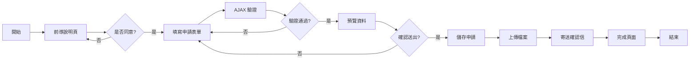
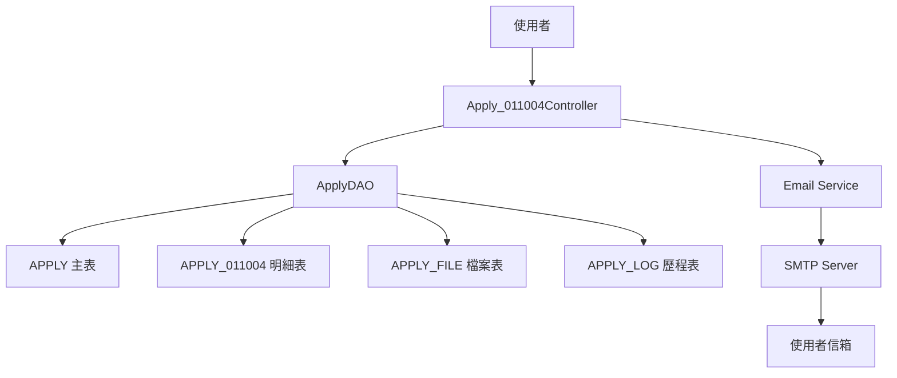
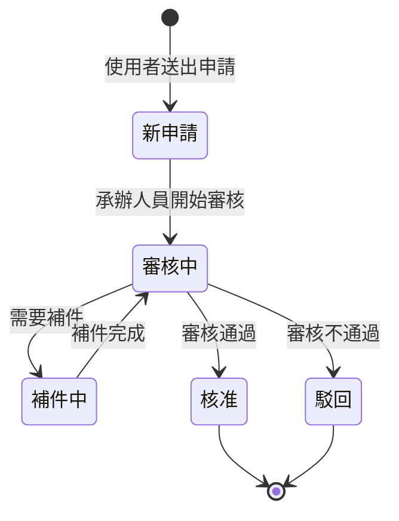

# 011004 社工師證書核發(英文) - 完整技術文件

## 服務基本資訊

| 項目         | 內容                                                               |
| ------------ | ------------------------------------------------------------------ |
| 服務代碼     | 011004                                                             |
| 服務名稱     | 社工師證書核發(英文)                                               |
| 服務分類     | 線上申辦服務                                                       |
| 主管機關     | 社會及家庭署                                                       |
| 業務單位     | 社會及家庭署 (UNIT_CD = 8)                                         |
| 開發日期     | 2024-01-15                                                         |
| 最後更新     | 2025-01-15                                                         |
| 技術架構     | ASP.NET MVC 5 + Dapper ORM + SQL Server                            |
| Controller   | `ES/Controllers/Apply_011004Controller.cs` (277 行)                |
| ViewModel    | `ES/Models/ViewModels/Apply_011004ViewModel.cs` (340 行)           |
| Entity Model | `ES/Models/Entities/APPLY_011004.cs` (80 行)                       |
| DAO          | `ES/DataLayers/ApplyDAO.cs` (ChkApply011004, AppendApply011004 等) |
| 資料表       | APPLY, APPLY_011004, APPLY_FILE, APPLY_LOG, APPLY_NOTICE           |

---

## 服務特色對照表

| 特色項目          | 011001 執業執照申請 | 011002 專科證書核發 | 011004 證書核發(英文) |
| ----------------- | ------------------- | ------------------- | --------------------- |
| 申請期間控制      | ❌                  | ❌                  | ❌                    |
| 前導說明頁        | ✅                  | ✅                  | ✅                    |
| 會員資料自動帶入  | ✅                  | ✅                  | ✅                    |
| AJAX 表單驗證     | ✅                  | ✅                  | ✅                    |
| PartialView 預覽  | ✅                  | ✅                  | ✅                    |
| 英文姓名格式驗證  | ❌                  | ❌                  | ✅                    |
| 多檔案上傳        | ✅                  | ✅                  | ❌ (單一檔案)         |
| 合併列印功能      | ✅                  | ✅                  | ✅                    |
| 繳費功能          | ✅                  | ✅                  | ❌                    |
| Email 通知        | ✅                  | ✅                  | ✅                    |
| 補件功能          | ✅                  | ✅                  | ✅                    |
| 通訊/戶籍地址分離 | ✅                  | ✅                  | ✅                    |
| 電話格式處理      | ✅                  | ✅                  | ✅                    |
| 郵遞區號轉換      | ✅                  | ✅                  | ✅                    |

---

## 核心功能

### 1. 英文姓名格式驗證

**說明**：驗證英文姓名必須符合特定格式

**格式要求**：

- 全大寫英文字母
- 必須包含「, 」(逗號 + 空格)
- 必須包含「-」(連字號)
- 格式範例：`CHEN, HSIAO-MING`

**Regex 驗證**：

```csharp
Regex reg = new Regex(@"^([A-Z]+)(,)(\s+)([A-Z]+)(-)([A-Z]+)$");
if (!reg.IsMatch(model.ENAME))
{
    ErrorMsg = "英文姓名必須全大寫英文，有「, 」及「-」";
}
```

### 2. 單一檔案上傳

**說明**：只需上傳一個「社會工作師證書影本」檔案

**驗證規則**：

- 檔案為必填
- 檔案大小限制：依系統設定
- 檔案格式：PDF, JPG, PNG 等

### 3. 申請年度與類別選擇

**說明**：選擇考試年度與證書類別

**欄位**：

- `APPLY_FOR`：申請年度 (必填)
- `APPLY_NUM`：申請份數 (必填)
- `TYEAR`：考試年度 (必填)
- `TYPE`：證書類別 (必填)

### 4. 合併列印選項

**說明**：選擇是否合併列印

**欄位**：

- `IS_MERGE`：是否合併列印 (Y/N)

### 5. 通訊地址與戶籍地址

**說明**：分別填寫通訊地址和戶籍地址

**欄位**：

- 通訊地址：`C_ZIPCODE`, `C_ADDR`
- 戶籍地址：`H_ZIPCODE`, `H_ADDR`

### 6. 電話驗證

**說明**：公/宅/行動電話至少填寫一組

**驗證規則**：

```csharp
if (string.IsNullOrWhiteSpace(form.MOBILE) &&
    string.IsNullOrWhiteSpace(form.H_TEL) &&
    string.IsNullOrWhiteSpace(form.C_TEL))
{
    Msg += "電話(公)、電話(宅)、行動電話請擇一填寫\n";
}
```

### 7. Email 通知

**說明**：申請完成後寄送確認信

**通知時機**：

- 新申請完成
- 補件完成

### 8. 補件功能

**說明**：支援補件功能，可補充缺漏資料

**補件欄位**：

- 由 APPLY_NOTICE 表控制
- 動態顯示需補件欄位

### 9. 前導說明頁

**說明**：申請前必須閱讀並同意說明事項

**驗證**：

- `agree` 參數必須為 "1"
- 未同意則導回前導說明頁

### 10. 會員資料自動帶入

**說明**：自動帶入會員基本資料

**自動帶入欄位**：

- 姓名 (中文/英文)
- 身分證字號
- 出生年月日
- 性別
- 行動電話
- Email
- 通訊地址

---

## 申請流程圖



---

## 補件流程圖


---

## 資料流程圖



---

## 狀態轉換圖



---

## 資料庫結構

### 1. APPLY (主表)

**功能說明**：儲存所有申辦案件的共用資料

**主要欄位**：

| 欄位名稱    | 資料型別     | 說明           | 備註                 |
| ----------- | ------------ | -------------- | -------------------- |
| APP_ID      | varchar(20)  | 案件編號 (PK)  | 格式：011004YYYYMMDD |
| SRV_ID      | varchar(10)  | 服務代碼       | 固定值：011004       |
| SRC_SRV_ID  | varchar(10)  | 來源服務代碼   | 固定值：011004       |
| ACC_NO      | varchar(20)  | 申請人帳號     |                      |
| NAME        | nvarchar(50) | 申請人姓名     |                      |
| ENAME       | varchar(100) | 申請人英文姓名 |                      |
| IDN         | varchar(10)  | 身分證字號     |                      |
| BIRTHDAY    | datetime     | 出生年月日     |                      |
| SEX_CD      | varchar(1)   | 性別代碼       | M:男, F:女           |
| CNT_TEL     | varchar(20)  | 聯絡電話       |                      |
| MOBILE      | varchar(20)  | 行動電話       |                      |
| EMAIL       | varchar(100) | Email          |                      |
| APP_TIME    | datetime     | 申請時間       |                      |
| FLOW_CD     | varchar(2)   | 流程狀態       | 1:新申請, 2:補件     |
| UNIT_CD     | int          | 業務單位代碼   | 8:社會及家庭署       |
| PRO_ACC     | varchar(20)  | 承辦人員帳號   |                      |
| PRO_UNIT_CD | int          | 承辦單位代碼   |                      |
| APP_DISP_MK | varchar(1)   | 分文處理       | Y:是, N:否           |
| LOGIN_TYPE  | varchar(10)  | 登入類型       |                      |
| ADD_TIME    | datetime     | 新增時間       |                      |
| ADD_FUN_CD  | varchar(20)  | 新增功能代碼   | WEB-APPLY            |
| ADD_ACC     | varchar(20)  | 新增人員帳號   |                      |

### 2. APPLY_011004 (明細表)

**功能說明**：儲存社工師證書核發(英文)的專屬資料

**主要欄位**：

| 欄位名稱  | 資料型別      | 說明          | 備註 |
| --------- | ------------- | ------------- | ---- |
| APP_ID    | varchar(20)   | 案件編號 (PK) |      |
| EMAIL     | varchar(100)  | Email         |      |
| C_TEL     | varchar(20)   | 電話(公)      |      |
| H_TEL     | varchar(20)   | 電話(宅)      |      |
| MOBILE    | varchar(20)   | 行動電話      |      |
| C_ZIP     | varchar(5)    | 通訊郵遞區號  |      |
| C_ADDR    | nvarchar(200) | 通訊地址      |      |
| H_ADDR    | nvarchar(200) | 戶籍地址      |      |
| APPLY_FOR | nvarchar(50)  | 申請年度      |      |
| APPLY_NUM | varchar(10)   | 申請份數      |      |
| YEAR      | varchar(10)   | 考試年度      |      |
| TYPE      | nvarchar(50)  | 證書類別      |      |
| IS_MERGE  | varchar(1)    | 是否合併列印  | Y/N  |
| FILE_NAME | nvarchar(200) | 檔案名稱      |      |

### 3. APPLY_FILE (檔案表)

**功能說明**：儲存申辦案件的附件檔案資訊

**主要欄位**：

| 欄位名稱     | 資料型別      | 說明         | 備註                 |
| ------------ | ------------- | ------------ | -------------------- |
| APP_ID       | varchar(20)   | 案件編號     |                      |
| FILE_NO      | int           | 檔案編號     | 1:社會工作師證書影本 |
| SRC_NO       | int           | 來源編號     | 0:新申請, >0:補件    |
| FILENAME     | nvarchar(200) | 檔案名稱     | 實際儲存檔名         |
| SRC_FILENAME | nvarchar(200) | 原始檔名     | 使用者上傳的原始檔名 |
| FILE_SIZE    | int           | 檔案大小     | 單位：Bytes          |
| FILE_TYPE    | varchar(50)   | 檔案類型     | MIME Type            |
| FILE_DESC    | nvarchar(200) | 檔案說明     |                      |
| ADD_TIME     | datetime      | 新增時間     |                      |
| ADD_FUN_CD   | varchar(20)   | 新增功能代碼 | WEB-APPLY            |
| ADD_ACC      | varchar(20)   | 新增人員帳號 |                      |

### 4. APPLY_LOG (歷程表)

**功能說明**：記錄案件處理歷程

**主要欄位**：

| 欄位名稱  | 資料型別     | 說明         | 備註                 |
| --------- | ------------ | ------------ | -------------------- |
| APP_ID    | varchar(20)  | 案件編號     |                      |
| FLOW_CD   | varchar(2)   | 流程狀態     | 1:新申請收件, 2:補件 |
| FLOW_NAME | nvarchar(50) | 流程名稱     |                      |
| ADD_TIME  | datetime     | 新增時間     |                      |
| ADD_ACC   | varchar(20)  | 新增人員帳號 |                      |

### 5. APPLY_NOTICE (補件通知表)

**功能說明**：記錄補件通知資訊

**主要欄位**：

| 欄位名稱 | 資料型別    | 說明         | 備註           |
| -------- | ----------- | ------------ | -------------- |
| APP_ID   | varchar(20) | 案件編號     |                |
| Field    | varchar(50) | 補件欄位名稱 |                |
| ISADDYN  | varchar(1)  | 是否已補件   | Y:已補, N:未補 |
| ADD_TIME | datetime    | 新增時間     |                |
| ADD_ACC  | varchar(20) | 新增人員帳號 |                |

---

## ViewModel 結構

### 1. Apply_011004ViewModel

**功能說明**：主要 ViewModel，包含表單模型和補件模型

**屬性**：

```csharp
public class Apply_011004ViewModel
{
    public Apply_011004FormModel Form { get; set; }
    public Apply_011004AppDocModel AppDoc { get; set; }
}
```

### 2. Apply_011004FormModel

**功能說明**：申請表單模型，繼承自 ApplyModel

**主要屬性**：

| 屬性名稱       | 資料型別           | 說明                   | 驗證規則 |
| -------------- | ------------------ | ---------------------- | -------- |
| APP_DATE       | string             | 申請日期               |          |
| EMAIL          | string             | Email                  | Required |
| NAME           | string             | 中文姓名               | Required |
| ENAME          | string             | 英文姓名               | Required |
| BIRTHDAY_STR   | string             | 出生年月日 (字串)      | Required |
| SEX_CD         | string             | 性別代碼               | Required |
| IDN            | string             | 身分證字號             | Required |
| C_TEL          | string             | 電話(公)               |          |
| H_TEL          | string             | 電話(宅)               |          |
| MOBILE         | string             | 行動電話               |          |
| C_ZIPCODE      | string             | 通訊郵遞區號           | Required |
| C_ZIPCODE_TEXT | string             | 通訊郵遞區號 (文字)    |          |
| C_ADDR         | string             | 通訊地址               |          |
| H_ZIPCODE      | string             | 戶籍郵遞區號           |          |
| H_ZIPCODE_TEXT | string             | 戶籍郵遞區號 (文字)    |          |
| H_ADDR         | string             | 戶籍地址               |          |
| APPLY_FOR      | string             | 申請年度               | Required |
| APPLY_NUM      | string             | 申請份數               | Required |
| TYEAR          | string             | 考試年度               | Required |
| TYPE           | string             | 證書類別               | Required |
| IS_MERGE       | string             | 是否合併列印           |          |
| FILE_0         | HttpPostedFileBase | 社會工作師證書影本     |          |
| FILE_0_TEXT    | string             | 社會工作師證書影本檔名 |          |

### 3. Apply_011004AppDocModel

**功能說明**：補件模型，繼承自 ApplyModel

**主要屬性**：

| 屬性名稱       | 資料型別           | 說明                   | 驗證規則 |
| -------------- | ------------------ | ---------------------- | -------- |
| APPSTATUS      | string             | 案件狀態               |          |
| FieldStr       | string             | 補件欄位字串           |          |
| APP_DATE       | string             | 申請日期               |          |
| EMAIL          | string             | Email                  | Required |
| NAME           | string             | 中文姓名               | Required |
| ENAME          | string             | 英文姓名               | Required |
| BIRTHDAY_STR   | string             | 出生年月日 (字串)      | Required |
| C_TEL          | string             | 電話(公)               |          |
| H_TEL          | string             | 電話(宅)               |          |
| MOBILE         | string             | 行動電話               |          |
| C_ZIPCODE      | string             | 通訊郵遞區號           |          |
| C_ZIPCODE_TEXT | string             | 通訊郵遞區號 (文字)    |          |
| C_ADDR         | string             | 通訊地址               | Required |
| H_ADDR         | string             | 戶籍地址               |          |
| APPLY_FOR      | string             | 申請年度               | Required |
| APPLY_NUM      | string             | 申請份數               | Required |
| YEAR           | string             | 考試年度               | Required |
| TYPE           | string             | 證書類別               | Required |
| IS_MERGE       | string             | 是否合併列印           |          |
| FILE_0         | HttpPostedFileBase | 社會工作師證書影本     |          |
| FILE_0_TEXT    | string             | 社會工作師證書影本檔名 |          |
| NG_ITEM        | string             | 補件項目               |          |

### 4. Apply_011004DoneModel

**功能說明**：完成頁面模型

**屬性**：

```csharp
public class Apply_011004DoneModel
{
    public string status { get; set; }  // 狀態: 1:新申請, 2:補件
    public string Count { get; set; }   // 補件件數
}
```

---

## Controller 方法說明

### 1. Prompt() - 前導說明頁

**HTTP Method**：GET

**路由**：`/Apply_011004/Prompt`

**功能說明**：顯示前導說明頁面，要求使用者閱讀並同意說明事項

**程式碼範例**：

```csharp
public ActionResult Prompt()
{
    SessionModel sm = SessionModel.Get();
    string s_msg_1A = "請先閱讀 「{0}說明事項」點選同意後，再進入申辦頁面 !";
    sm.LastErrorMessage = string.Format(s_msg_1A, s_SRV_NAME);
    return View("Prompt011004");
}
```

### 2. Apply() GET - 申請表單頁面

**HTTP Method**：GET

**路由**：`/Apply_011004/Apply?agree=1`

**功能說明**：顯示申請表單，自動帶入會員基本資料

**主要處理邏輯**：

1. 檢查是否已同意說明事項 (agree = "1")
2. 自動帶入會員基本資料
3. 初始化表單欄位

**程式碼範例**：

```csharp
public ActionResult Apply(string agree)
{
    SessionModel sm = SessionModel.Get();
    Apply_011004FormModel model = new Apply_011004FormModel();
    var UsIn = sm.UserInfo.Member;

    if (UsIn != null)
    {
        model.ACC_NO = UsIn.ACC_NO;
        model.C_ZIPCODE = UsIn.CITY_CD;
        model.C_ADDR = UsIn.ADDR;
        model.NAME = UsIn.NAME;
        model.ENAME = UsIn.ENAME;
        model.MOBILE = UsIn.MOBILE;
        model.EMAIL = UsIn.MAIL;
        model.IDN = UsIn.IDN;
        model.BIRTHDAY = UsIn.BIRTHDAY;
        model.BIRTHDAY_STR = HelperUtil.DateTimeToString(UsIn.BIRTHDAY);
        model.SEX_CD = UsIn.SEX_CD;
        model.APP_DATE = HelperUtil.DateTimeToTwString(DateTime.Now);
    }

    if (string.IsNullOrEmpty(agree)) { agree = "0"; }
    if (agree != null && !agree.Equals("1")) { return Prompt(); }

    return View("Index", model);
}
```

### 3. Apply() POST - AJAX 表單驗證

**HTTP Method**：POST

**路由**：`/Apply_011004/Apply`

**功能說明**：使用 AJAX 進行表單驗證，返回 JSON 格式的驗證結果

**程式碼範例**：

```csharp
[HttpPost]
public ActionResult Apply(Apply_011004FormModel model)
{
    var result = new AjaxResultStruct();
    ApplyDAO dao = new ApplyDAO();
    string ErrorMsg = dao.ChkApply011004(model);

    if (ModelState.IsValid)
    {
        ModelState.Clear();
        // 英文姓名格式驗證
        Regex reg = new Regex(@"^([A-Z]+)(,)(\s+)([A-Z]+)(-)([A-Z]+)$");
        if (!reg.IsMatch(model.ENAME))
        {
            ErrorMsg = "英文姓名必須全大寫英文，有「, 」及「-」";
        }

        if (ErrorMsg == "")
        {
            result.status = true;
            result.message = "";
        }
        else
        {
            result.status = false;
            result.message = ErrorMsg;
        }
    }
    else
    {
        result.status = false;
        foreach (var item in ModelState.Values)
        {
            if (item.Errors.ToCount() > 0)
            {
                ErrorMsg = ErrorMsg + item.Errors[0].ErrorMessage + "\r\n";
            }
        }
        result.message = ErrorMsg;
    }

    return Content(result.Serialize(), "application/json");
}
```

### 4. PreView() POST - 預覽頁面

**HTTP Method**：POST

**路由**：`/Apply_011004/PreView`

**功能說明**：使用 PartialView 顯示預覽內容

**程式碼範例**：

```csharp
[HttpPost]
public ActionResult PreView(Apply_011004FormModel model)
{
    ApplyDAO dao = new ApplyDAO();
    return PartialView("PreView011004", model);
}
```

### 5. Save() POST - 儲存申請

**HTTP Method**：POST

**路由**：`/Apply_011004/Save`

**功能說明**：儲存申請資料到資料庫，寄送確認信，導向完成頁面

**主要處理邏輯**：

1. 呼叫 DAO.AppendApply011004() 儲存資料
2. 寄送確認信
3. 導向完成頁面

**程式碼範例**：

```csharp
[HttpPost]
public ActionResult Save(Apply_011004FormModel model)
{
    SessionModel sm = SessionModel.Get();
    ApplyDAO dao = new ApplyDAO();
    var app_id = string.Empty;
    var memberName = string.IsNullOrWhiteSpace(model.NAME) ? sm.UserInfo.Member.NAME : model.NAME;
    var memberEmail = string.IsNullOrWhiteSpace(model.EMAIL) ? sm.UserInfo.Member.MAIL : model.EMAIL;

    // 存檔
    app_id = dao.AppendApply011004(model);
    // 寄信
    dao.SendMail_New(memberName, memberEmail, app_id, "社工師證書核發（英文）", "011004");

    return Done("1");
}
```

### 6. AppDoc() GET - 補件頁面

**HTTP Method**：GET

**路由**：`/Apply_011004/AppDoc?APP_ID=xxx`

**功能說明**：顯示補件頁面，載入案件資料及補件欄位

**主要處理邏輯**：

1. 驗證是否為案件申請人
2. 載入案件資料
3. 載入檔案資料
4. 載入補件欄位
5. 檢查補件期限

### 7. SaveAppDoc() POST - 儲存補件

**HTTP Method**：POST

**路由**：`/Apply_011004/SaveAppDoc`

**功能說明**：儲存補件資料並寄送通知信

**主要處理邏輯**：

1. 呼叫 DAO.UpdateApply011004() 更新資料
2. 寄送補件完成通知信
3. 導向完成頁面

**程式碼範例**：

```csharp
public ActionResult SaveAppDoc(Apply_011004AppDocModel model)
{
    SessionModel sm = SessionModel.Get();
    ApplyDAO dao = new ApplyDAO();
    var memberName = string.IsNullOrWhiteSpace(model.NAME) ? sm.UserInfo.Member.NAME : model.NAME;
    var memberEmail = string.IsNullOrWhiteSpace(model.EMAIL) ? sm.UserInfo.Member.MAIL : model.EMAIL;

    // 存檔
    var count = dao.UpdateApply011004(model);
    // 寄信
    dao.SendMail_Update(memberName, memberEmail, model.APP_ID, "社工師證書核發（英文）", "011004", count);

    return Done("2", count);
}
```

### 8. Done() - 完成頁面

**HTTP Method**：GET

**路由**：`/Apply_011004/Done?status=1`

**功能說明**：顯示申請完成訊息

**參數**：

- status: "1" = 新申請完成, "2" = 補件完成
- Count: 補件件數

---

## DAO 方法說明

### 1. ChkApply011004() - 表單驗證

**功能說明**：驗證申請表單資料

**參數**：

- `form`：Apply_011004FormModel

**返回值**：

- `string`：錯誤訊息 (空字串表示驗證通過)

**驗證項目**：

- 電話驗證：公/宅/行動電話至少填寫一組
- 檔案驗證：必須上傳附件

**程式碼**：

```csharp
public string ChkApply011004(Apply_011004FormModel form)
{
    string Msg = "";
    if (string.IsNullOrWhiteSpace(form.MOBILE) &&
        string.IsNullOrWhiteSpace(form.H_TEL) &&
        string.IsNullOrWhiteSpace(form.C_TEL))
    {
        Msg += "電話(公)、電話(宅)、行動電話請擇一填寫\n";
    }
    if (string.IsNullOrWhiteSpace(form.FILE_0_TEXT))
    {
        Msg += "請上傳附件\n";
    }
    return Msg;
}
```

### 2. AppendApply011004() - 新增案件

**功能說明**：新增申請案件到資料庫

**參數**：

- `form`：Apply_011004FormModel

**返回值**：

- `string`：案件編號 (APP_ID)

**主要處理邏輯**：

1. 產生案件編號
2. 新增 APPLY 主表
3. 新增 APPLY_011004 明細表
4. 上傳檔案並新增 APPLY_FILE 表
5. 新增 APPLY_LOG 歷程表

### 3. GetFile_011004() - 取得檔案資料

**功能說明**：取得案件的檔案資料

**參數**：

- `APP_ID`：案件編號

**返回值**：

- `Apply_011004AppDocModel`：包含檔案資料

**SQL 語法**：

```sql
SELECT (SUBSTRING(FILENAME,16,len(fl1.FILENAME))+','+
        convert(varchar,fl1.APP_ID)+','+
        convert(varchar,fl1.FILE_NO)+','+
        isnull(convert(varchar,fl1.SRC_NO),'0')) as FILE_0_TEXT
FROM apply app
LEFT JOIN (SELECT TOP 1 * FROM APPLY_FILE
           WHERE FILE_NO = '1' AND APP_ID = @APP_ID
           ORDER BY ADD_TIME DESC) as fl1
ON app.APP_ID = fl1.APP_ID
WHERE app.app_id = @APP_ID
```

### 4. UpdateApply011004() - 更新補件資料

**功能說明**：更新補件資料到資料庫

**參數**：

- `model`：Apply_011004AppDocModel

**返回值**：

- `string`：補件件數

**主要處理邏輯**：

1. 計算補件件數
2. 更新 APPLY_NOTICE 補件狀態
3. 更新 APPLY 主表
4. 更新 APPLY_011004 明細表
5. 新增 APPLY_FILE 補件檔案
6. 新增 APPLY_LOG 歷程表

---

## 技術亮點

### 1. 英文姓名格式驗證

**特色**：

- 使用 Regex 驗證英文姓名格式
- 必須全大寫英文字母
- 必須包含「, 」和「-」

**實作方式**：

```csharp
Regex reg = new Regex(@"^([A-Z]+)(,)(\s+)([A-Z]+)(-)([A-Z]+)$");
if (!reg.IsMatch(model.ENAME))
{
    ErrorMsg = "英文姓名必須全大寫英文，有「, 」及「-」";
}
```

**優點**：

- 確保英文姓名格式正確
- 符合國際證書格式要求
- 避免格式錯誤導致證書無效

### 2. 單一檔案上傳

**特色**：

- 只需上傳一個檔案
- 簡化上傳流程
- 減少使用者操作步驟

**優點**：

- 提升使用者體驗
- 減少錯誤發生機率
- 加快申請流程

### 3. AJAX 表單驗證

**特色**：

- 使用 AJAX 進行表單驗證
- 返回 JSON 格式的驗證結果
- 前端 JavaScript 接收驗證結果並顯示錯誤訊息

**優點**：

- 不需重新載入頁面
- 提升使用者體驗
- 減少伺服器負擔

### 4. PartialView 預覽功能

**特色**：

- 使用 PartialView 顯示預覽內容
- 不需導向新頁面
- 可在同一頁面確認資料

### 5. 通訊地址與戶籍地址分離

**特色**：

- 分別填寫通訊地址和戶籍地址
- 支援不同地址需求

### 6. 電話格式處理

**特色**：

- 支援公/宅/行動電話
- 至少填寫一組電話

### 7. 郵遞區號轉換

**特色**：

- 郵遞區號自動轉換為縣市鄉鎮
- 使用 ZIPCODE 表查詢

### 8. 合併列印功能

**特色**：

- 支援合併列印選項
- 彈性選擇列印方式

### 9. Email 通知

**特色**：

- 申請完成後自動寄送確認信
- 補件完成後寄送通知信

### 10. 補件功能

**特色**：

- 支援補件功能
- 動態顯示需補件欄位
- 補件完成後更新狀態

---

## 相關檔案列表

### Controller 檔案

- `ES/Controllers/Apply_011004Controller.cs` (277 行)

### ViewModel 檔案

- `ES/Models/ViewModels/Apply_011004ViewModel.cs` (340 行)

### Entity Model 檔案

- `ES/Models/Entities/APPLY_011004.cs` (80 行)

### DAO 檔案

- `ES/DataLayers/ApplyDAO.cs` (24,561 行)
- `ES/DataLayers/ShareDAO.cs`

### View 檔案

- `ES/Views/Apply_011004/Prompt011004.cshtml`
- `ES/Views/Apply_011004/Index.cshtml`
- `ES/Views/Apply_011004/PreView011004.cshtml`
- `ES/Views/Apply_011004/AppDoc.cshtml`
- `ES/Views/Apply_011004/Done.cshtml`

---

## 重要注意事項

### 1. 前導說明頁

- 必須先閱讀並同意說明事項才能進入申辦頁面
- `agree` 參數必須為 "1" 才能進入申辦頁面

### 2. 英文姓名格式

- 必須全大寫英文字母
- 必須包含「, 」(逗號 + 空格)
- 必須包含「-」(連字號)
- 格式範例：`CHEN, HSIAO-MING`

### 3. AJAX 驗證

- Apply() POST 方法返回 JSON 格式
- 前端 JavaScript 需處理驗證結果

### 4. 電話驗證

- 公/宅/行動電話至少填寫一組

### 5. 檔案上傳

- 必須上傳社會工作師證書影本
- 檔案為必填項目

### 6. 補件功能

- 只有案件申請人可以補件
- 補件欄位由 APPLY_NOTICE 表控制
- 需檢查補件期限

---

## 維護記錄

| 日期       | 版本  | 修改人員 | 修改內容         |
| ---------- | ----- | -------- | ---------------- |
| 2024-01-15 | 1.0.0 | 系統開發 | 初版建立         |
| 2025-01-15 | 2.0.0 | 技術文件 | 完整技術文件建立 |

---

**版本：** 1.0
**日期：** 2025-10-20
**作者：** 柏通股份有限公司
