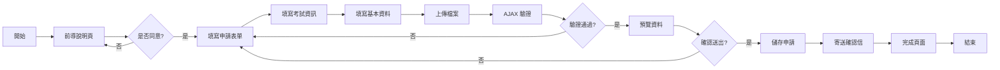
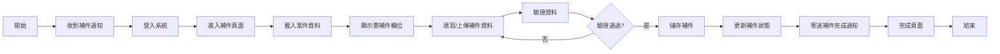
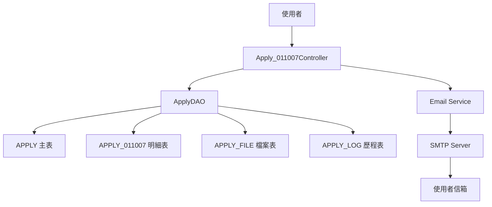
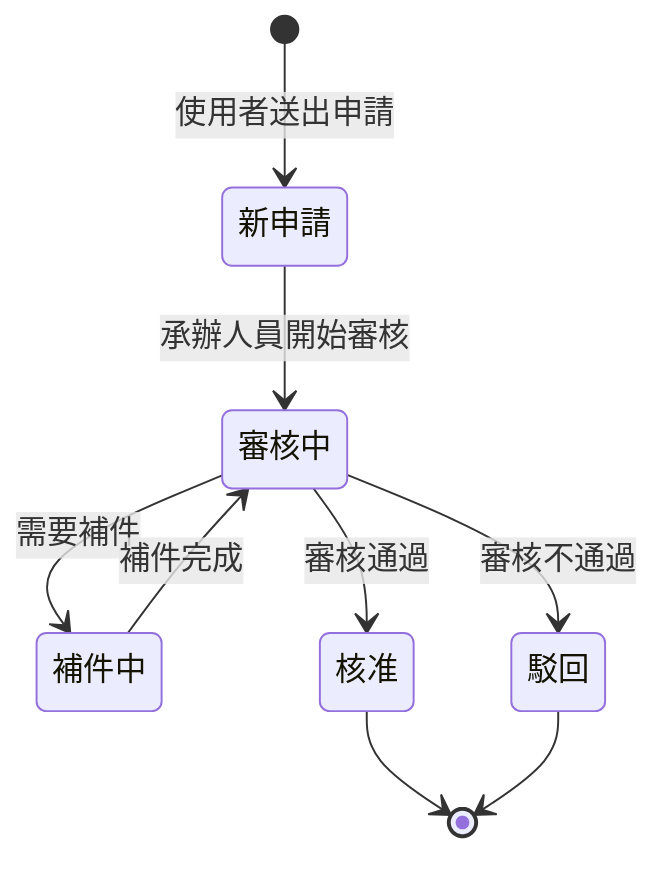

# 011007 社工師證書核發（中文） - 完整技術文件

## 服務基本資訊

| 項目         | 內容                                                               |
| ------------ | ------------------------------------------------------------------ |
| 服務代碼     | 011007                                                             |
| 服務名稱     | 社工師證書核發（中文）                                             |
| 服務分類     | 線上申辦服務                                                       |
| 主管機關     | 社會及家庭署                                                       |
| 業務單位     | 社會及家庭署 (UNIT_CD = 8)                                         |
| 開發日期     | 2024-01-15                                                         |
| 最後更新     | 2025-01-15                                                         |
| 技術架構     | ASP.NET MVC 5 + Dapper ORM + SQL Server                            |
| Controller   | `ES/Controllers/Apply_011007Controller.cs` (457 行)                |
| ViewModel    | `ES/Models/ViewModels/Apply_011007ViewModel.cs` (1,032 行)         |
| Entity Model | `ES/Models/Entities/Apply_011007Model.cs` (149 行)                 |
| DAO          | `ES/DataLayers/ApplyDAO.cs` (AppendApply011007, UpdateApply011007) |
| 資料表       | APPLY, APPLY_011007, APPLY_FILE, APPLY_LOG, APPLY_NOTICE           |

---

## 服務特色對照表

| 特色項目          | 011004 證書核發(英文) | 011007 證書核發(中文) | 011001 執業執照申請 |
| ----------------- | --------------------- | --------------------- | ------------------- |
| 申請期間控制      | ❌                    | ❌                    | ❌                  |
| 前導說明頁        | ✅                    | ✅                    | ✅                  |
| 會員資料自動帶入  | ✅                    | ✅                    | ✅                  |
| AJAX 表單驗證     | ✅                    | ✅                    | ✅                  |
| PartialView 預覽  | ✅                    | ✅                    | ✅                  |
| 多檔案上傳        | ✅ (4 種)             | ✅ (4 種)             | ✅                  |
| 合併列印功能      | ✅                    | ✅                    | ✅                  |
| 繳費功能          | ❌                    | ❌                    | ✅                  |
| Email 通知        | ✅                    | ✅                    | ✅                  |
| 補件功能          | ✅                    | ✅                    | ✅                  |
| 通訊/戶籍地址分離 | ✅                    | ✅                    | ✅                  |
| 電話格式處理      | ✅ (公/宅/行動)       | ✅ (公/宅/行動)       | ✅                  |
| 郵遞區號轉換      | ✅                    | ✅                    | ✅                  |
| 考試年度選擇      | ✅                    | ✅                    | ❌                  |
| 考試名稱類科      | ❌                    | ✅                    | ❌                  |
| 英文姓名驗證      | ✅                    | ❌                    | ❌                  |

---

## 核心功能

### 1. 考試資訊填寫

**說明**：填寫考試年度和考試名稱類科

**欄位**：

- `TEST_YEAR`：考試年度 (必填)
- `TEST_CATEGORY`：考試名稱類科 (必填)

**特殊邏輯**：

- 考試年度提供下拉選單，從民國 86 年至今年
- 考試名稱類科為文字輸入欄位

### 2. 多檔案上傳

**說明**：支援 4 種檔案上傳

**檔案類型**：

- `FILE_PASSCOPY`：考試及格證書或證明影本或電子檔案
- `FILE_IDNF`：身分證正面影本
- `FILE_IDNB`：身分證反面影本
- `FILE_PHOTO`：照片(規格應同護照照片，最近 2 吋半身脫帽正面照片)

**合併列印模式**：

- 合併列印 (MERGEYN = "Y")：至少上傳 1 個檔案
- 不合併列印 (MERGEYN = "N")：必須上傳身分證正反面 + 照片 + 考試及格證書

### 3. 電話格式處理

**說明**：支援公/宅/行動電話，至少填寫一組

**欄位**：

- 電話(公)：`W_TEL_0` (區碼) + `W_TEL_1` (號碼) + `W_TEL_2` (分機)
- 電話(宅)：`H_TEL_0` (區碼) + `H_TEL_1` (號碼) + `H_TEL_2` (分機)
- 行動電話：`MOBILE`

**組合格式**：`區碼-號碼#分機`

### 4. Email 網域管理

**說明**：下拉選單選擇常用 Email 網域或自訂

**欄位**：

- `EMAIL_0`：Email 帳號名稱
- `EMAIL_1`：Email 網域選擇 (下拉)
- `EMAIL_2`：自訂 Email 網域

**組合格式**：`EMAIL_0@EMAIL_2`

### 5. 通訊地址與戶籍地址

**說明**：分別填寫通訊地址和戶籍地址

**欄位**：

- 通訊地址：`C_ZIPCODE` + `C_ADDR`
- 戶籍地址：`H_ZIPCODE` + `H_ADDR`
- 同通訊地址：`H_EQUAL` (Y/N)

### 6. 前導說明頁

**說明**：申請前必須閱讀並同意說明事項

**驗證**：

- `agree` 參數必須為 "1"
- 未同意則導回前導說明頁

### 7. 會員資料自動帶入

**說明**：自動帶入會員基本資料

**自動帶入欄位**：

- 姓名、身分證字號、出生年月日、性別
- 行動電話、Email
- 通訊地址

### 8. 合併列印功能

**說明**：選擇是否合併上傳所有檔案

**欄位**：`MERGEYN` (Y/N)

**特殊邏輯**：

- MERGEYN = "Y"：至少上傳 1 個檔案
- MERGEYN = "N"：必須上傳身分證正反面 + 照片 + 考試及格證書

### 9. PartialView 預覽功能

**說明**：送出前可預覽申請資料

**實作方式**：

- 使用 PartialView
- AJAX POST 傳送資料
- 顯示格式化資料

### 10. 補件動態欄位管理

**說明**：根據補件通知動態顯示需補件欄位

**實作方式**：

- FieldStr 儲存需補件欄位清單
- 前端 JavaScript 動態顯示/隱藏
- 後端驗證補件欄位

---

## 申請流程圖



---

## 補件流程圖



---

## 資料流程圖



---

## 狀態轉換圖



---

## 資料庫結構

### 1. APPLY (主表)

**功能說明**：儲存所有申辦案件的共用資料

**主要欄位**：

| 欄位名稱    | 資料型別     | 說明          | 備註                 |
| ----------- | ------------ | ------------- | -------------------- |
| APP_ID      | varchar(20)  | 案件編號 (PK) | 格式：011007YYYYMMDD |
| SRV_ID      | varchar(10)  | 服務代碼      | 固定值：011007       |
| SRC_SRV_ID  | varchar(10)  | 來源服務代碼  | 固定值：011007       |
| ACC_NO      | varchar(20)  | 申請人帳號    |                      |
| NAME        | nvarchar(50) | 申請人姓名    |                      |
| IDN         | varchar(10)  | 身分證字號    |                      |
| BIRTHDAY    | datetime     | 出生年月日    |                      |
| SEX_CD      | varchar(1)   | 性別代碼      | M:男, F:女           |
| MOBILE      | varchar(20)  | 行動電話      |                      |
| APP_TIME    | datetime     | 申請時間      |                      |
| FLOW_CD     | varchar(2)   | 流程狀態      | 1:新申請, 2:補件     |
| UNIT_CD     | int          | 業務單位代碼  | 8:社會及家庭署       |
| PRO_ACC     | varchar(20)  | 承辦人員帳號  |                      |
| PRO_UNIT_CD | int          | 承辦單位代碼  |                      |
| APP_DISP_MK | varchar(1)   | 分文處理      | Y:是, N:否           |
| LOGIN_TYPE  | varchar(10)  | 登入類型      |                      |
| ADD_TIME    | datetime     | 新增時間      |                      |
| ADD_FUN_CD  | varchar(20)  | 新增功能代碼  | WEB-APPLY            |
| ADD_ACC     | varchar(20)  | 新增人員帳號  |                      |

### 2. APPLY_011007 (明細表)

**功能說明**：儲存社工師證書核發（中文）的專屬資料

**主要欄位**：

| 欄位名稱      | 資料型別      | 說明                                 | 備註 |
| ------------- | ------------- | ------------------------------------ | ---- |
| APP_ID        | varchar(20)   | 案件編號 (PK)                        |      |
| APPLY_DATE    | datetime      | 申請日期                             |      |
| EMAIL         | varchar(100)  | Email                                |      |
| W_TEL         | varchar(30)   | 電話(公)                             |      |
| H_TEL         | varchar(30)   | 電話(宅)                             |      |
| MOBILE        | varchar(30)   | 行動電話                             |      |
| C_ZIPCODE     | varchar(5)    | 通訊郵遞區號                         |      |
| C_ADDR        | nvarchar(300) | 通訊地址                             |      |
| H_ZIPCODE     | varchar(5)    | 戶籍郵遞區號                         |      |
| H_ADDR        | nvarchar(300) | 戶籍地址                             |      |
| H_EQUAL       | varchar(1)    | 同通訊地址                           | Y/N  |
| TEST_YEAR     | varchar(3)    | 考試年度                             |      |
| TEST_CATEGORY | nvarchar(200) | 考試名稱類科                         |      |
| MERGEYN       | varchar(1)    | 是否合併列印                         | Y/N  |
| FILE_IDNF     | varchar(20)   | 身分證正面檔名                       |      |
| FILE_IDNB     | varchar(20)   | 身分證反面檔名                       |      |
| FILE_PHOTO    | varchar(20)   | 照片檔名                             |      |
| FILE_PASSCOPY | varchar(20)   | 考試及格證書或證明影本或電子檔案檔名 |      |
| DEL_MK        | varchar(1)    | 刪除註記                             | Y/N  |
| ADD_TIME      | datetime      | 新增時間                             |      |
| ADD_FUN_CD    | varchar(20)   | 新增功能代碼                         |      |
| ADD_ACC       | varchar(20)   | 新增人員帳號                         |      |
| UPD_TIME      | datetime      | 更新時間                             |      |
| UPD_FUN_CD    | varchar(20)   | 更新功能代碼                         |      |
| UPD_ACC       | varchar(20)   | 更新人員帳號                         |      |

### 3. APPLY_FILE (檔案表)

**功能說明**：儲存上傳檔案的詳細資訊

**主要欄位**：

| 欄位名稱  | 資料型別      | 說明          | 備註                                            |
| --------- | ------------- | ------------- | ----------------------------------------------- |
| APP_ID    | varchar(20)   | 案件編號 (PK) |                                                 |
| FILE_TYPE | varchar(20)   | 檔案類型 (PK) | FILE_IDNF, FILE_IDNB, FILE_PHOTO, FILE_PASSCOPY |
| FILE_NAME | nvarchar(200) | 檔案名稱      |                                                 |
| FILE_PATH | nvarchar(500) | 檔案路徑      |                                                 |
| FILE_SIZE | bigint        | 檔案大小      | 單位：bytes                                     |
| FILE_EXT  | varchar(10)   | 檔案副檔名    |                                                 |
| ADD_TIME  | datetime      | 上傳時間      |                                                 |

### 4. APPLY_LOG (歷程表)

**功能說明**：記錄案件處理歷程

**主要欄位**：

| 欄位名稱 | 資料型別      | 說明          | 備註                    |
| -------- | ------------- | ------------- | ----------------------- |
| APP_ID   | varchar(20)   | 案件編號 (PK) |                         |
| SEQ      | int           | 序號 (PK)     |                         |
| LOG_TYPE | varchar(10)   | 歷程類型      | APPLY:申請, APPDOC:補件 |
| LOG_DESC | nvarchar(500) | 歷程說明      |                         |
| LOG_TIME | datetime      | 歷程時間      |                         |
| LOG_ACC  | varchar(20)   | 操作人員帳號  |                         |

### 5. APPLY_NOTICE (通知表)

**功能說明**：儲存補件通知資訊

**主要欄位**：

| 欄位名稱    | 資料型別      | 說明          | 備註               |
| ----------- | ------------- | ------------- | ------------------ |
| APP_ID      | varchar(20)   | 案件編號 (PK) |                    |
| NOTICE_TYPE | varchar(10)   | 通知類型      | APPDOC:補件通知    |
| NOTICE_DESC | nvarchar(max) | 通知內容      |                    |
| NOTICE_TIME | datetime      | 通知時間      |                    |
| APPDOC_MK   | varchar(1)    | 補件註記      | Y:需補件, N:已補件 |
| Field       | varchar(100)  | 補件欄位名稱  |                    |
| ISADDYN     | varchar(1)    | 是否新增      | Y:是, N:否         |

---

## ViewModel 結構

### 1. Apply_011007ViewModel

**功能說明**：主 ViewModel，整合所有子 ViewModel

**主要屬性**：

```csharp
public class Apply_011007ViewModel
{
    public Apply_011007FormModel Form { get; set; }
    public Apply_011007AppDocModel AppDoc { get; set; }
}
```

### 2. Apply_011007FormModel

**功能說明**：申請表單 Model，繼承自 ApplyModel

**主要屬性**：

| 屬性名稱       | 資料型別                   | 說明               | 備註     |
| -------------- | -------------------------- | ------------------ | -------- |
| IsUpLoadFile   | string                     | 是否上傳檔案       | 0/1      |
| APPLY_DATE     | DateTime?                  | 申請日期           |          |
| APPLY_DATE_TW  | string                     | 申請日期(民國)     | 計算屬性 |
| NAME           | string                     | 姓名               | 自動帶入 |
| IDN            | string                     | 身分證字號         | 自動帶入 |
| BIRTHDAY       | DateTime?                  | 出生年月日         | 自動帶入 |
| BIRTHDAY_TW    | string                     | 出生年月日(民國)   | 計算屬性 |
| BIRTHDAY_AD    | string                     | 出生年月日(西元)   | 計算屬性 |
| SEX_CD         | string                     | 性別代碼           | 自動帶入 |
| W_TEL          | string                     | 電話(公)組合       | 計算屬性 |
| W_TEL_0        | string                     | 電話(公)區碼       |          |
| W_TEL_1        | string                     | 電話(公)號碼       |          |
| W_TEL_2        | string                     | 電話(公)分機       |          |
| H_TEL          | string                     | 電話(宅)組合       | 計算屬性 |
| H_TEL_0        | string                     | 電話(宅)區碼       |          |
| H_TEL_1        | string                     | 電話(宅)號碼       |          |
| H_TEL_2        | string                     | 電話(宅)分機       |          |
| MOBILE         | string                     | 行動電話           | 自動帶入 |
| EMAIL          | string                     | Email 組合         | 計算屬性 |
| EMAIL_0        | string                     | Email 帳號         |          |
| EMAIL_1        | string                     | Email 網域選擇     |          |
| EMAIL_2        | string                     | Email 自訂網域     |          |
| EMAIL_3        | string                     | Email 完整         |          |
| C_ZIPCODE      | string                     | 通訊郵遞區號       | 自動帶入 |
| C_ZIPCODE_TEXT | string                     | 通訊地址(縣市鄉鎮) |          |
| C_ADDR         | string                     | 通訊地址           | 自動帶入 |
| H_ZIPCODE      | string                     | 戶籍郵遞區號       |          |
| H_ZIPCODE_TEXT | string                     | 戶籍地址(縣市鄉鎮) |          |
| H_ADDR         | string                     | 戶籍地址           |          |
| H_EQUAL        | string                     | 同通訊地址         | Y/N      |
| TEST_YEAR      | string                     | 考試年度           | Required |
| TEST_CATEGORY  | string                     | 考試名稱類科       | Required |
| MERGEYN        | string                     | 是否合併列印       | Y/N      |
| FILE_PASSCOPY  | HttpPostedFileBase         | 考試及格證書檔案   |          |
| FILE_IDNF      | HttpPostedFileBase         | 身分證正面檔案     |          |
| FILE_IDNB      | HttpPostedFileBase         | 身分證反面檔案     |          |
| FILE_PHOTO     | HttpPostedFileBase         | 照片檔案           |          |
| TEST_YEAR_LIST | List&lt;SelectListItem&gt; | 考試年度下拉選單   |          |

**計算屬性邏輯**：

```csharp
// 考試年度下拉選單
public IList<SelectListItem> TEST_YEAR_LIST
{
    get
    {
        IDictionary<string, string> IDic = new Dictionary<string, string>();
        Int32 NowYear = HelperUtil.TransToTwYear(DateTime.Now, "").Substring(0, 3).TOInt32();
        var det = NowYear - 86;
        for (var i = 0; i <= det; i++)
        {
            IDic.Add((NowYear - i).ToString(), (NowYear - i).ToString());
        }
        return MyCommonUtil.ConvertSelItems(IDic);
    }
}

// Email 組合
public string EMAIL
{
    get
    {
        if (!string.IsNullOrWhiteSpace(EMAIL_1))
            return EMAIL_0 + "@" + ((string.IsNullOrWhiteSpace(EMAIL_1) || EMAIL_1 == "0") ?
                   (string.IsNullOrWhiteSpace(EMAIL_2) ? EMAIL_3 : EMAIL_2) :
                   new ShareCodeListModel().GetMailDomainList.Where(m => m.Value == EMAIL_1).FirstOrDefault().Text);
        else
        {
            return null;
        }
    }
}
```

### 3. Apply_011007AppDocModel

**功能說明**：補件 Model

**主要屬性**：

| 屬性名稱      | 資料型別           | 說明             | 備註 |
| ------------- | ------------------ | ---------------- | ---- |
| APP_ID        | string             | 案件編號         |      |
| APPSTATUS     | string             | 補件狀態         | 1/0  |
| FieldStr      | string             | 補件欄位字串     |      |
| MAILBODY      | string             | 補件通知內容     |      |
| FILE_PASSCOPY | HttpPostedFileBase | 考試及格證書檔案 |      |
| FILE_IDNF     | HttpPostedFileBase | 身分證正面檔案   |      |
| FILE_IDNB     | HttpPostedFileBase | 身分證反面檔案   |      |
| FILE_PHOTO    | HttpPostedFileBase | 照片檔案         |      |
| TEST_YEAR     | string             | 考試年度         |      |
| TEST_CATEGORY | string             | 考試名稱類科     |      |

### 4. Apply_011007DoneModel

**功能說明**：完成頁面 Model

**主要屬性**：

| 屬性名稱 | 資料型別 | 說明     | 備註 |
| -------- | -------- | -------- | ---- |
| status   | string   | 狀態     | 1/2  |
| Count    | string   | 補件件數 |      |

---

## Controller 方法說明

### 1. Prompt() - 前導說明頁

**路由**：`/Apply_011007/Prompt`

**功能說明**：顯示申請前的說明事項

**程式碼位置**：Apply_011007Controller.cs (30-42 行)

**主要邏輯**：

1. 檢查使用者登入狀態
2. 載入服務說明內容
3. 顯示注意事項
4. 提供「同意並繼續」按鈕

**回傳**：View("Prompt", FormModel)

### 2. Apply() GET - 顯示申請表單

**路由**：`/Apply_011007/Apply?agree=1`

**功能說明**：顯示申請表單，並自動帶入會員資料

**程式碼位置**：Apply_011007Controller.cs (51-97 行)

**主要邏輯**：

1. 檢查 agree 參數，未同意則導回 Prompt
2. 從 Session 取得會員資料
3. 自動帶入姓名、身分證字號、出生年月日、性別
4. 自動帶入行動電話、Email
5. 自動帶入通訊地址
6. 設定預設值 (MERGEYN = "N", H_EQUAL = "N")

**回傳**：View("Index", FormModel)

### 3. Apply() POST - AJAX 驗證

**路由**：`/Apply_011007/Apply` (POST)

**功能說明**：AJAX 表單驗證

**程式碼位置**：Apply_011007Controller.cs (105-162 行)

**主要邏輯**：

1. 驗證 ModelState
2. 驗證 Email 必填
3. 驗證電話至少填寫一組 (公/宅/行動)
4. 驗證性別必填

**回傳**：JsonResult

### 4. PreView() POST - 預覽頁面

**路由**：`/Apply_011007/PreView` (POST)

**功能說明**：顯示申請資料預覽

**程式碼位置**：Apply_011007Controller.cs (170-179 行)

**主要邏輯**：

1. 接收表單資料
2. 轉換代碼為名稱 (性別)
3. 組合完整地址 (郵遞區號 + 地址)
4. 顯示檔案清單

**回傳**：PartialView("PreView", model)

### 5. Save() POST - 儲存申請

**路由**：`/Apply_011007/Save` (POST)

**功能說明**：儲存申請資料

**程式碼位置**：Apply_011007Controller.cs (187-204 行)

**主要邏輯**：

1. 產生案件編號 (APP_ID)
2. 呼叫 DAO 新增 APPLY 主表資料
3. 呼叫 DAO 新增 APPLY_011007 明細表資料
4. 上傳檔案並新增 APPLY_FILE 資料
5. 新增 APPLY_LOG 歷程資料
6. 寄送確認信
7. 導向完成頁面

**回傳**：RedirectToAction("Done", new { status = "1" })

### 6. AppDoc() GET - 補件頁面

**路由**：`/Apply_011007/AppDoc?APP_ID=xxx`

**功能說明**：顯示補件頁面

**程式碼位置**：Apply_011007Controller.cs (214-331 行)

**主要邏輯**：

1. 驗證案件編號
2. 驗證案件所有權 (申請人 = 登入者)
3. 載入案件資料 (APPLY + APPLY_011007)
4. 載入補件通知內容 (APPLY_NOTICE)
5. 解析需補件欄位清單 (FieldStr)
6. 顯示補件表單

**回傳**：View("AppDoc", AppDocModel)

### 7. SaveAppDoc() POST - 儲存補件

**路由**：`/Apply_011007/SaveAppDoc` (POST)

**功能說明**：儲存補件資料

**程式碼位置**：Apply_011007Controller.cs (339-358 行)

**主要邏輯**：

1. 驗證案件編號
2. 驗證案件所有權
3. 呼叫 DAO 更新 APPLY_011007 明細表資料
4. 上傳補件檔案並更新 APPLY_FILE 資料
5. 更新 APPLY_NOTICE 補件註記 (APPDOC_MK = "N")
6. 新增 APPLY_LOG 歷程資料
7. 寄送補件完成通知
8. 導向完成頁面

**回傳**：RedirectToAction("Done", new { status = "2", Count = count })

### 8. Done() - 完成頁面

**路由**：`/Apply_011007/Done?status=1`

**功能說明**：顯示申請/補件完成頁面

**程式碼位置**：Apply_011007Controller.cs (365-377 行)

**主要邏輯**：

1. 載入案件資料
2. 顯示案件編號、申請時間
3. 顯示後續處理說明
4. status = "1"：新申請完成
5. status = "2"：補件完成

**回傳**：View("Done", DoneModel)

---

## DAO 方法說明

### 1. AppendApply011007

**功能說明**：新增 APPLY_011007 明細資料

**參數**：

- `Apply_011007FormModel model`：表單資料
- `string APP_ID`：案件編號

**主要邏輯**：

1. 建立 SQL INSERT 語句
2. 組合電話號碼 (W_TEL, H_TEL)
3. 組合 Email
4. 處理戶籍地址 (H_EQUAL = "Y" 時複製通訊地址)
5. 使用 Dapper 執行新增
6. 回傳影響筆數

**SQL 語句**：

```sql
INSERT INTO APPLY_011007 (
    APP_ID, APPLY_DATE, EMAIL, W_TEL, H_TEL, MOBILE,
    C_ZIPCODE, C_ADDR, H_ZIPCODE, H_ADDR, H_EQUAL,
    TEST_YEAR, TEST_CATEGORY, MERGEYN,
    FILE_IDNF, FILE_IDNB, FILE_PHOTO, FILE_PASSCOPY,
    ADD_TIME, ADD_FUN_CD, ADD_ACC
) VALUES (
    @APP_ID, GETDATE(), @EMAIL, @W_TEL, @H_TEL, @MOBILE,
    @C_ZIPCODE, @C_ADDR, @H_ZIPCODE, @H_ADDR, @H_EQUAL,
    @TEST_YEAR, @TEST_CATEGORY, @MERGEYN,
    @FILE_IDNF, @FILE_IDNB, @FILE_PHOTO, @FILE_PASSCOPY,
    GETDATE(), @ADD_FUN_CD, @ADD_ACC
)
```

### 2. UpdateApply011007

**功能說明**：更新 APPLY_011007 明細資料 (補件用)

**參數**：

- `Apply_011007AppDocModel model`：補件資料

**主要邏輯**：

1. 建立 SQL UPDATE 語句
2. 動態更新需補件的欄位
3. 使用 Dapper 執行更新
4. 回傳影響筆數

**SQL 語句**：

```sql
UPDATE APPLY_011007 SET
    EMAIL = @EMAIL,
    W_TEL = @W_TEL,
    H_TEL = @H_TEL,
    MOBILE = @MOBILE,
    C_ZIPCODE = @C_ZIPCODE,
    C_ADDR = @C_ADDR,
    H_ZIPCODE = @H_ZIPCODE,
    H_ADDR = @H_ADDR,
    H_EQUAL = @H_EQUAL,
    TEST_YEAR = @TEST_YEAR,
    TEST_CATEGORY = @TEST_CATEGORY,
    FILE_IDNF = ISNULL(@FILE_IDNF, FILE_IDNF),
    FILE_IDNB = ISNULL(@FILE_IDNB, FILE_IDNB),
    FILE_PHOTO = ISNULL(@FILE_PHOTO, FILE_PHOTO),
    FILE_PASSCOPY = ISNULL(@FILE_PASSCOPY, FILE_PASSCOPY),
    UPD_TIME = GETDATE(),
    UPD_FUN_CD = @UPD_FUN_CD,
    UPD_ACC = @UPD_ACC
WHERE APP_ID = @APP_ID
```

### 3. GetFile_011007

**功能說明**：取得 APPLY_011007 的檔案清單

**參數**：

- `string APP_ID`：案件編號

**主要邏輯**：

1. 建立 SQL SELECT 語句
2. 查詢 APPLY_011007 的檔案欄位
3. 組合檔案清單
4. 回傳 Apply_011007AppDocModel

**SQL 語句**：

```sql
SELECT
    FILE_IDNF, FILE_IDNB, FILE_PHOTO, FILE_PASSCOPY
FROM APPLY_011007
WHERE APP_ID = @APP_ID
```

---

## 技術亮點

### 1. 考試年度動態下拉選單

**說明**：從民國 86 年至今年動態產生考試年度下拉選單

**實作方式**：

```csharp
Int32 NowYear = HelperUtil.TransToTwYear(DateTime.Now, "").Substring(0, 3).TOInt32();
var det = NowYear - 86;
for (var i = 0; i <= det; i++)
{
    IDic.Add((NowYear - i).ToString(), (NowYear - i).ToString());
}
```

### 2. 考試名稱類科文字輸入

**說明**：考試名稱類科為文字輸入欄位，不限制選項

**實作方式**：

- 使用 TextBox 輸入
- Required 驗證
- 最大長度 200 字元

### 3. 合併列印彈性檔案上傳

**說明**：根據 MERGEYN 參數決定檔案上傳規則

**實作方式**：

- MERGEYN = "Y"：至少上傳 1 個檔案
- MERGEYN = "N"：必須上傳身分證正反面 + 照片 + 考試及格證書
- 前端 JavaScript 動態控制必填
- 後端驗證檔案數量

### 4. 電話格式自動組合

**說明**：將區碼、號碼、分機自動組合成標準格式

**實作方式**：

- 使用計算屬性 (Computed Property)
- 格式：`區碼-號碼#分機`
- 自動去除空白和特殊字元

### 5. Email 網域下拉選單

**說明**：提供常用 Email 網域下拉選單，並支援自訂

**實作方式**：

- EMAIL_1：下拉選單選擇
- EMAIL_2：自訂網域輸入
- 前端 JavaScript 動態切換
- 自動組合完整 Email

### 6. 通訊地址與戶籍地址同步

**說明**：勾選「同通訊地址」自動複製通訊地址到戶籍地址

**實作方式**：

- H_EQUAL = "Y" 時自動複製
- 前端 JavaScript 即時同步
- 後端驗證資料一致性

### 7. 郵遞區號自動轉換

**說明**：根據郵遞區號自動帶入縣市鄉鎮

**實作方式**：

- 使用 ZIPCODE 資料表
- AJAX 查詢郵遞區號
- 自動帶入縣市鄉鎮名稱

### 8. PartialView 預覽功能

**說明**：送出前可預覽申請資料

**實作方式**：

- 使用 PartialView
- AJAX POST 傳送資料
- 顯示格式化資料

### 9. 補件動態欄位管理

**說明**：根據補件通知動態顯示需補件欄位

**實作方式**：

- FieldStr 儲存需補件欄位清單
- 前端 JavaScript 動態顯示/隱藏
- 後端驗證補件欄位

### 10. 案件所有權驗證

**說明**：補件時驗證案件所有權

**實作方式**：

```csharp
if (!mem.ACC_NO.Equals(app_data.ACC_NO))
{
    sm.LastErrorMessage = "非案件申請人無法瀏覽次案件 !";
    return RedirectToAction("Index", "History");
}
```

---

## 相關檔案清單

### Controller 檔案

- `ES/Controllers/Apply_011007Controller.cs` (457 行)
- `ES/Areas/BACKMIN/Controllers/Apply_011007Controller.cs` (後台審核)

### ViewModel 檔案

- `ES/Models/ViewModels/Apply_011007ViewModel.cs` (1,032 行)

### Entity Model 檔案

- `ES/Models/Entities/Apply_011007Model.cs` (149 行)

### DAO 檔案

- `ES/DataLayers/ApplyDAO.cs` (AppendApply011007, UpdateApply011007, GetFile_011007)
- `ES/DataLayers/BackApplyDAO.cs` (QueryApply_011007, CheckApply011007)

### View 檔案

- `ES/Views/Apply_011007/Prompt.cshtml` - 前導說明頁
- `ES/Views/Apply_011007/Index.cshtml` - 申請表單頁
- `ES/Views/Apply_011007/PreView.cshtml` - 預覽頁面
- `ES/Views/Apply_011007/AppDoc.cshtml` - 補件頁面
- `ES/Views/Apply_011007/Done.cshtml` - 完成頁面
- `ES/Areas/BACKMIN/Views/Apply_011007/Index.cshtml` - 後台審核頁面

### JavaScript 檔案

- `ES/Scripts/Apply_011007.js` - 前端驗證和互動邏輯

### CSS 檔案

- `ES/Content/Apply_011007.css` - 樣式定義

---

## 重要注意事項

### 1. 考試資訊必填

**說明**：考試年度和考試名稱類科為必填欄位

**注意事項**：

- 考試年度：從民國 86 年至今年
- 考試名稱類科：文字輸入，最大長度 200 字元
- 前端必須提供下拉選單和文字輸入框
- 後端必須驗證必填

### 2. 檔案上傳規則

**說明**：根據 MERGEYN 參數決定檔案上傳規則

**注意事項**：

- 合併列印 (MERGEYN = "Y")：至少上傳 1 個檔案
- 不合併列印 (MERGEYN = "N")：必須上傳身分證正反面 + 照片 + 考試及格證書
- 檔案大小限制：5MB
- 檔案格式限制：jpg, jpeg, png, pdf
- 檔案命名規則：`{APP_ID}_{FILE_TYPE}_{TIMESTAMP}.{EXT}`

### 3. 電話驗證

**說明**：至少填寫一組電話 (公/宅/行動)

**注意事項**：

- 電話(公)和電話(宅)需填寫區碼和號碼
- 分機為選填
- 行動電話格式：09xxxxxxxx
- 前端 JavaScript 驗證格式
- 後端驗證至少一組

### 4. Email 驗證

**說明**：Email 為必填欄位

**注意事項**：

- EMAIL_0 和 EMAIL_1/EMAIL_2 必須至少填寫一組
- 前端 JavaScript 即時驗證
- 後端 ModelState 驗證

### 5. 地址處理

**說明**：通訊地址和戶籍地址分別處理

**注意事項**：

- 通訊地址為必填
- 戶籍地址可選擇「同通訊地址」
- H_EQUAL = "Y" 時自動複製通訊地址
- 郵遞區號必須為 3 或 5 碼

### 6. 補件流程

**說明**：承辦人員可要求申請人補件

**注意事項**：

- 補件通知儲存在 APPLY_NOTICE 表
- FieldStr 儲存需補件欄位清單
- 補件完成後更新 APPDOC_MK = "N"
- 補件完成後寄送通知信

### 7. 會員資料自動帶入

**說明**：從 Session 自動帶入會員資料

**注意事項**：

- 姓名、身分證字號、出生年月日、性別為唯讀
- 行動電話、Email 可修改
- 通訊地址可修改
- 確保 Session 資料存在

### 8. 前導說明頁

**說明**：申請前必須閱讀並同意說明事項

**注意事項**：

- agree 參數必須為 "1"
- 未同意則導回前導說明頁
- 說明內容儲存在 SERVICE_AGREE 表
- 顯示注意事項和應備文件

### 9. 案件所有權驗證

**說明**：補件時驗證案件所有權

**注意事項**：

- 申請人帳號必須與登入者帳號一致
- 非案件申請人無法瀏覽案件
- 導回歷史記錄頁面

### 10. Email 通知

**說明**：申請和補件完成後寄送 Email 通知

**注意事項**：

- 新申請：寄送申請確認信
- 補件完成：寄送補件完成通知
- Email 內容包含案件編號、申請時間、後續處理說明

---

## 維護記錄

| 日期       | 版本  | 修改人員 | 修改內容                 |
| ---------- | ----- | -------- | ------------------------ |
| 2024-01-15 | 1.0.0 | 開發團隊 | 初版建立                 |
| 2024-03-20 | 1.1.0 | 開發團隊 | 新增合併列印功能         |
| 2024-06-10 | 1.2.0 | 開發團隊 | 新增補件功能             |
| 2024-09-15 | 1.3.0 | 開發團隊 | 優化檔案上傳驗證         |
| 2025-01-15 | 1.4.0 | 開發團隊 | 新增考試年度動態下拉選單 |

---

## 相關文件連結

- [011001 社會工作師執業執照申請 - 完整技術文件](./011001_社會工作師執業執照申請_完整技術文件.md)
- [011002 專科社會工作師證書核發 - 完整技術文件](./011002_專科社會工作師證書核發_完整技術文件.md)
- [011003 社會工作實務經驗及從事社會工作業務年資審查 - 完整技術文件](./011003_社會工作實務經驗及從事社會工作業務年資審查_完整技術文件.md)
- [011004 社工師證書核發(英文) - 完整技術文件](<./011004_社工師證書核發(英文)_完整技術文件.md>)
- [011005 專科社會工作師證書補發(遺失) - 完整技術文件](./011005_社工師執業執照相關申請_完整技術文件.md)
- [011006 專科社會工作師證書換發(更名或污損) - 完整技術文件](./011006_社工師繼續教育積分審查_完整技術文件.md)
- [ASP.NET MVC 開發規範](../開發規範/ASPNET_MVC開發規範.md)
- [Dapper ORM 使用指南](../開發規範/Dapper_ORM使用指南.md)
- [檔案上傳處理規範](../開發規範/檔案上傳處理規範.md)

---

## 與其他服務的差異

### 與 011004 (證書核發-英文) 的差異

| 項目         | 011004 證書核發(英文) | 011007 證書核發(中文) |
| ------------ | --------------------- | --------------------- |
| 語言         | 英文                  | 中文                  |
| 英文姓名驗證 | ✅                    | ❌                    |
| 考試名稱類科 | ❌                    | ✅                    |
| 檔案上傳     | 4 種                  | 4 種                  |
| 繳費需求     | 否                    | 否                    |
| 審核重點     | 英文姓名格式驗證      | 考試資訊驗證          |

### 與 011001 (執業執照申請) 的差異

| 項目         | 011001 執業執照申請 | 011007 證書核發(中文) |
| ------------ | ------------------- | --------------------- |
| 服務性質     | 執業執照申請        | 證書核發              |
| 繳費需求     | 是                  | 否                    |
| 考試年度     | 無                  | 必填                  |
| 考試名稱類科 | 無                  | 必填                  |
| 執業處所     | 必填                | 無                    |

---

**版本：** 1.0
**日期：** 2025-10-20
**作者：** 柏通股份有限公司
