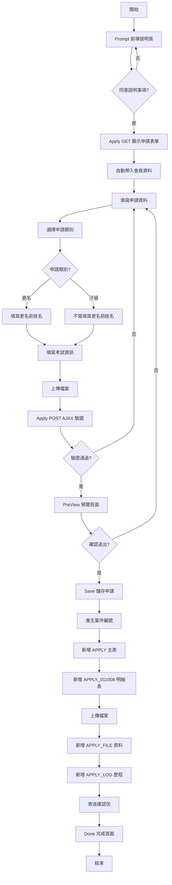
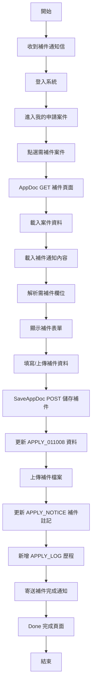
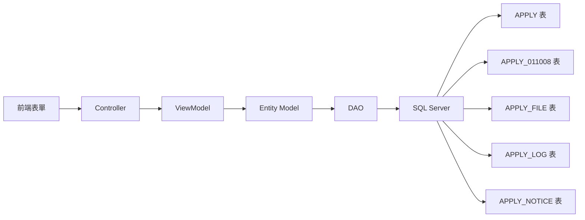
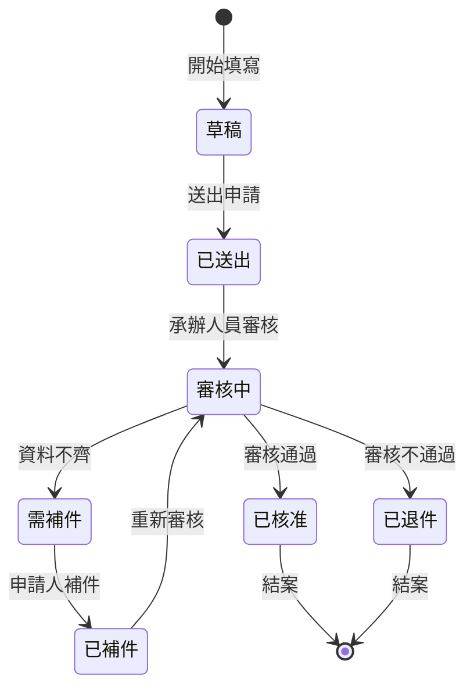

# 011008 社工師證書換發（更名或汙損） - 完整技術文件

## 服務基本資訊

| 項目         | 內容                                    |
| ------------ | --------------------------------------- |
| 服務代碼     | 011008                                  |
| 服務名稱     | 社工師證書換發（更名或汙損）            |
| 主辦單位     | 社會及家庭署 (UNIT_CD = 8)              |
| 技術架構     | ASP.NET MVC 5 + Dapper ORM + SQL Server |
| Controller   | Apply_011008Controller.cs (469 行)      |
| ViewModel    | Apply_011008ViewModel.cs (1,092 行)     |
| Entity Model | Apply_011008Model.cs (163 行)           |
| 資料表       | APPLY, APPLY_011008                     |
| 繳費需求     | 否                                      |
| 補件功能     | 是                                      |

---

## 服務特色對照表

| 功能項目         | 011008 證書換發 | 011007 證書核發(中文) | 011005 執業執照申請 |
| ---------------- | --------------- | --------------------- | ------------------- |
| 申請類別選擇     | ✅ (更名/汙損)  | ❌                    | ❌                  |
| 更名前姓名       | ✅              | ❌                    | ❌                  |
| 考試年度         | ✅              | ✅                    | ❌                  |
| 考試名稱類科     | ✅              | ✅                    | ❌                  |
| 戶籍謄本上傳     | ✅              | ❌                    | ❌                  |
| 合併列印         | ✅              | ✅                    | ❌                  |
| 檔案上傳數量     | 5 種            | 4 種                  | 多種                |
| 繳費需求         | ❌              | ❌                    | ✅                  |
| 補件功能         | ✅              | ✅                    | ✅                  |
| 前導說明頁       | ✅              | ✅                    | ✅                  |
| PartialView 預覽 | ✅              | ✅                    | ✅                  |

---

## 核心功能

### 1. 申請類別選擇

**說明**：提供「更名」或「汙損」兩種申請類別選擇

**實作方式**：

- APPLY_TYPE = "1"：更名
- APPLY_TYPE = "2"：汙損
- 預設值為 "1" (更名)
- 使用 Radio Button 選擇

### 2. 更名前姓名驗證

**說明**：當申請類別為「更名」時，必須填寫更名前姓名

**實作方式**：

- CHG_NAME 欄位為更名前姓名
- APPLY_TYPE = "1" 時，CHG_NAME 為必填
- CHG_NAME 不可等於 NAME (現在姓名)
- 前端 JavaScript 動態控制必填

### 3. 考試資訊填寫

**說明**：填寫考試年度和考試名稱類科

**實作方式**：

- TEST_YEAR：考試年度 (下拉選單，近 16 年)
- TEST_CATEGORY：考試名稱類科 (文字輸入)
- 兩者皆為必填欄位

### 4. 戶籍謄本上傳

**說明**：上傳戶籍謄本或戶口名簿影本

**實作方式**：

- FILE_HOUSEHOLD：戶籍謄本或戶口名簿影本
- 檔案格式：jpg, jpeg, png, pdf
- 檔案大小限制：5MB
- 更名申請時為必要文件

### 5. 多檔案上傳管理

**說明**：支援 5 種檔案類型上傳

**實作方式**：

- FILE_IDNF：身分證正面影本
- FILE_IDNB：身分證反面影本
- FILE_PHOTO：最近 2 吋半身脫帽照片
- FILE_PASSCOPY：考試及格證書或證照影本
- FILE_HOUSEHOLD：戶籍謄本或戶口名簿影本

### 6. 合併列印功能

**說明**：根據 MERGEYN 參數決定檔案上傳規則

**實作方式**：

- MERGEYN = "Y"：合併上傳，至少上傳 1 個檔案
- MERGEYN = "N"：不合併上傳，必須上傳所有必要檔案
- 預設值為 "N"

### 7. 會員資料自動帶入

**說明**：從 Session 自動帶入會員資料

**實作方式**：

- 姓名、身分證字號、出生年月日、性別：自動帶入且唯讀
- Email、行動電話：自動帶入但可修改
- 通訊地址：自動帶入但可修改

### 8. 前導說明頁

**說明**：申請前必須閱讀並同意說明事項

**實作方式**：

- Prompt() 方法顯示說明頁面
- agree 參數必須為 "1" 才能進入申請頁面
- 未同意則導回前導說明頁

### 9. PartialView 預覽功能

**說明**：送出前可預覽申請資料

**實作方式**：

- PreView() 方法回傳 PartialView
- AJAX POST 傳送資料
- 顯示格式化資料供確認

### 10. 補件動態欄位管理

**說明**：根據補件通知動態顯示需補件欄位

**實作方式**：

- FieldStr 儲存需補件欄位清單
- 前端 JavaScript 動態顯示/隱藏
- 後端驗證補件欄位

---

## 申請流程圖



---

## 補件流程圖



---

## 資料流程圖



---

## 狀態轉換圖



---

## 資料庫結構

### 1. APPLY (主表)

**功能說明**：儲存所有服務的共用申請資料

**主要欄位**：

| 欄位名稱 | 資料型別      | 說明          | 備註                  |
| -------- | ------------- | ------------- | --------------------- |
| APP_ID   | varchar(20)   | 案件編號 (PK) | 格式：SRV_ID + 流水號 |
| SRV_ID   | varchar(10)   | 服務代碼      | 011008                |
| ACC_NO   | varchar(20)   | 申請人帳號    |                       |
| NAME     | nvarchar(50)  | 姓名          |                       |
| IDN      | varchar(10)   | 身分證字號    |                       |
| BIRTHDAY | datetime      | 出生年月日    |                       |
| SEX_CD   | varchar(1)    | 性別代碼      | M/F                   |
| APP_TIME | datetime      | 申請時間      |                       |
| FLOW_CD  | varchar(2)    | 流程狀態代碼  | 1:已送出, 2:需補件    |
| MAILBODY | nvarchar(max) | 補件通知內容  |                       |

### 2. APPLY_011008 (明細表)

**功能說明**：儲存 011008 服務的專屬資料

**主要欄位**：

| 欄位名稱       | 資料型別      | 說明                   | 備註                 |
| -------------- | ------------- | ---------------------- | -------------------- |
| APP_ID         | varchar(20)   | 案件編號 (PK, FK)      |                      |
| APPLY_TYPE     | varchar(1)    | 申請類別               | 1:更名, 2:汙損       |
| APPLY_DATE     | datetime      | 申請日期               |                      |
| CHG_NAME       | varchar(20)   | 姓名(更正前)           | 更名時必填           |
| EMAIL          | varchar(100)  | Email                  | 必填                 |
| W_TEL          | varchar(30)   | 電話(公)               | 格式：區碼-號碼#分機 |
| H_TEL          | varchar(30)   | 電話(宅)               | 格式：區碼-號碼#分機 |
| MOBILE         | varchar(30)   | 行動電話               |                      |
| C_ZIPCODE      | varchar(5)    | 通訊郵遞區號           |                      |
| C_ADDR         | nvarchar(300) | 通訊地址               |                      |
| H_ZIPCODE      | varchar(5)    | 戶籍郵遞區號           |                      |
| H_ADDR         | nvarchar(300) | 戶籍地址               |                      |
| H_EQUAL        | varchar(1)    | 同通訊地址             | Y/N                  |
| TEST_YEAR      | varchar(3)    | 考試年度               | 必填                 |
| TEST_CATEGORY  | nvarchar(200) | 考試名稱類科           | 必填                 |
| MERGEYN        | varchar(1)    | 是否合併列印           | Y/N                  |
| FILE_IDNF      | varchar(20)   | 身分證正面影本         |                      |
| FILE_IDNB      | varchar(20)   | 身分證反面影本         |                      |
| FILE_PHOTO     | varchar(20)   | 最近 2 吋半身脫帽照片  |                      |
| FILE_PASSCOPY  | varchar(20)   | 考試及格證書或證照影本 |                      |
| FILE_HOUSEHOLD | varchar(20)   | 戶籍謄本或戶口名簿影本 | 更名時必要           |
| DEL_MK         | varchar(1)    | 刪除註記               | Y/N                  |
| ADD_TIME       | datetime      | 新增時間               |                      |
| ADD_FUN_CD     | varchar(20)   | 新增功能代碼           |                      |
| ADD_ACC        | varchar(20)   | 新增人員帳號           |                      |
| UPD_TIME       | datetime      | 更新時間               |                      |
| UPD_FUN_CD     | varchar(20)   | 更新功能代碼           |                      |
| UPD_ACC        | varchar(20)   | 更新人員帳號           |                      |

### 3. APPLY_FILE (檔案表)

**功能說明**：儲存上傳檔案的詳細資訊

**主要欄位**：

| 欄位名稱  | 資料型別      | 說明          | 備註                                                            |
| --------- | ------------- | ------------- | --------------------------------------------------------------- |
| APP_ID    | varchar(20)   | 案件編號 (PK) |                                                                 |
| FILE_TYPE | varchar(20)   | 檔案類型 (PK) | FILE_IDNF, FILE_IDNB, FILE_PHOTO, FILE_PASSCOPY, FILE_HOUSEHOLD |
| FILE_NAME | nvarchar(200) | 檔案名稱      |                                                                 |
| FILE_PATH | nvarchar(500) | 檔案路徑      |                                                                 |
| FILE_SIZE | bigint        | 檔案大小      | 單位：bytes                                                     |
| FILE_EXT  | varchar(10)   | 檔案副檔名    |                                                                 |
| ADD_TIME  | datetime      | 上傳時間      |                                                                 |

### 4. APPLY_LOG (歷程表)

**功能說明**：記錄案件處理歷程

**主要欄位**：

| 欄位名稱 | 資料型別      | 說明          | 備註                    |
| -------- | ------------- | ------------- | ----------------------- |
| APP_ID   | varchar(20)   | 案件編號 (PK) |                         |
| SEQ      | int           | 序號 (PK)     |                         |
| LOG_TYPE | varchar(10)   | 歷程類型      | APPLY:申請, APPDOC:補件 |
| LOG_DESC | nvarchar(500) | 歷程說明      |                         |
| LOG_TIME | datetime      | 歷程時間      |                         |
| LOG_ACC  | varchar(20)   | 操作人員帳號  |                         |

### 5. APPLY_NOTICE (通知表)

**功能說明**：儲存補件通知資訊

**主要欄位**：

| 欄位名稱    | 資料型別      | 說明          | 備註               |
| ----------- | ------------- | ------------- | ------------------ |
| APP_ID      | varchar(20)   | 案件編號 (PK) |                    |
| NOTICE_TYPE | varchar(10)   | 通知類型      | APPDOC:補件通知    |
| NOTICE_DESC | nvarchar(max) | 通知內容      |                    |
| NOTICE_TIME | datetime      | 通知時間      |                    |
| APPDOC_MK   | varchar(1)    | 補件註記      | Y:需補件, N:已補件 |
| Field       | varchar(100)  | 補件欄位名稱  |                    |
| ISADDYN     | varchar(1)    | 是否新增      | Y:是, N:否         |

---

## ViewModel 結構

### 1. Apply_011008ViewModel

**功能說明**：主 ViewModel，整合所有子 ViewModel

**主要屬性**：

```csharp
public class Apply_011008ViewModel
{
    public Apply_011008FormModel Form { get; set; }
    public Apply_011008AppDocModel AppDoc { get; set; }
}
```

### 2. Apply_011008FormModel

**功能說明**：申請表單 Model，繼承自 ApplyModel

**主要屬性**：

| 屬性名稱       | 資料型別                   | 說明               | 備註     |
| -------------- | -------------------------- | ------------------ | -------- |
| IsUpLoadFile   | string                     | 是否上傳檔案       | 0/1      |
| APPLY_TYPE     | string                     | 申請類別           | 1/2      |
| CHG_NAME       | string                     | 姓名(更正前)       | 更名必填 |
| APPLY_DATE     | DateTime?                  | 申請日期           |          |
| APPLY_DATE_TW  | string                     | 申請日期(民國)     | 計算屬性 |
| NAME           | string                     | 姓名               | 自動帶入 |
| IDN            | string                     | 身分證字號         | 自動帶入 |
| BIRTHDAY       | DateTime?                  | 出生年月日         | 自動帶入 |
| BIRTHDAY_TW    | string                     | 出生年月日(民國)   | 計算屬性 |
| BIRTHDAY_AD    | string                     | 出生年月日(西元)   | 計算屬性 |
| SEX_CD         | string                     | 性別代碼           | 自動帶入 |
| W_TEL          | string                     | 電話(公)組合       | 計算屬性 |
| W_TEL_0        | string                     | 電話(公)區碼       |          |
| W_TEL_1        | string                     | 電話(公)號碼       |          |
| W_TEL_2        | string                     | 電話(公)分機       |          |
| H_TEL          | string                     | 電話(宅)組合       | 計算屬性 |
| H_TEL_0        | string                     | 電話(宅)區碼       |          |
| H_TEL_1        | string                     | 電話(宅)號碼       |          |
| H_TEL_2        | string                     | 電話(宅)分機       |          |
| MOBILE         | string                     | 行動電話           | 自動帶入 |
| EMAIL          | string                     | Email 組合         | 計算屬性 |
| EMAIL_0        | string                     | Email 帳號         |          |
| EMAIL_1        | string                     | Email 網域選擇     |          |
| EMAIL_2        | string                     | Email 自訂網域     |          |
| EMAIL_3        | string                     | Email 完整         |          |
| C_ZIPCODE      | string                     | 通訊郵遞區號       | 自動帶入 |
| C_ZIPCODE_TEXT | string                     | 通訊地址(縣市鄉鎮) |          |
| C_ADDR         | string                     | 通訊地址           | 自動帶入 |
| H_ZIPCODE      | string                     | 戶籍郵遞區號       |          |
| H_ZIPCODE_TEXT | string                     | 戶籍地址(縣市鄉鎮) |          |
| H_ADDR         | string                     | 戶籍地址           |          |
| H_EQUAL        | string                     | 同通訊地址         | Y/N      |
| TEST_YEAR      | string                     | 考試年度           | Required |
| TEST_CATEGORY  | string                     | 考試名稱類科       | Required |
| MERGEYN        | string                     | 是否合併列印       | Y/N      |
| FILE_PASSCOPY  | HttpPostedFileBase         | 考試及格證書檔案   |          |
| FILE_IDNF      | HttpPostedFileBase         | 身分證正面檔案     |          |
| FILE_IDNB      | HttpPostedFileBase         | 身分證反面檔案     |          |
| FILE_PHOTO     | HttpPostedFileBase         | 照片檔案           |          |
| FILE_HOUSEHOLD | HttpPostedFileBase         | 戶籍謄本檔案       |          |
| TEST_YEAR_LIST | List&lt;SelectListItem&gt; | 考試年度下拉選單   |          |

**計算屬性邏輯**：

```csharp
// 考試年度下拉選單 (近 16 年)
public IList<SelectListItem> TEST_YEAR_LIST
{
    get
    {
        IDictionary<string, string> IDic = new Dictionary<string, string>();
        Int32 NowYear = HelperUtil.TransToTwYear(DateTime.Now, "").Substring(0, 3).TOInt32();
        for (var i = 0; i < 16; i++)
        {
            IDic.Add((NowYear - i).ToString(), (NowYear - i).ToString());
        }
        return MyCommonUtil.ConvertSelItems(IDic);
    }
}

// Email 組合
public string EMAIL
{
    get
    {
        if (!string.IsNullOrWhiteSpace(EMAIL_1))
            return EMAIL_0 + "@" + ((string.IsNullOrWhiteSpace(EMAIL_1) || EMAIL_1 == "0") ?
                   (string.IsNullOrWhiteSpace(EMAIL_2) ? EMAIL_3 : EMAIL_2) :
                   new ShareCodeListModel().GetMailDomainList.Where(m => m.Value == EMAIL_1).FirstOrDefault().Text);
        else
        {
            return null;
        }
    }
}
```

### 3. Apply_011008AppDocModel

**功能說明**：補件 Model

**主要屬性**：

| 屬性名稱       | 資料型別           | 說明             | 備註 |
| -------------- | ------------------ | ---------------- | ---- |
| APP_ID         | string             | 案件編號         |      |
| APPSTATUS      | string             | 補件狀態         | 1/0  |
| APPLY_TYPE     | string             | 申請類別         | 1/2  |
| CHG_NAME       | string             | 姓名(更正前)     |      |
| FieldStr       | string             | 補件欄位字串     |      |
| MAILBODY       | string             | 補件通知內容     |      |
| FILE_PASSCOPY  | HttpPostedFileBase | 考試及格證書檔案 |      |
| FILE_IDNF      | HttpPostedFileBase | 身分證正面檔案   |      |
| FILE_IDNB      | HttpPostedFileBase | 身分證反面檔案   |      |
| FILE_PHOTO     | HttpPostedFileBase | 照片檔案         |      |
| FILE_HOUSEHOLD | HttpPostedFileBase | 戶籍謄本檔案     |      |
| TEST_YEAR      | string             | 考試年度         |      |
| TEST_CATEGORY  | string             | 考試名稱類科     |      |

### 4. Apply_011008DoneModel

**功能說明**：完成頁面 Model

**主要屬性**：

| 屬性名稱 | 資料型別 | 說明     | 備註 |
| -------- | -------- | -------- | ---- |
| status   | string   | 狀態     | 1/2  |
| Count    | string   | 補件件數 |      |

---

## Controller 方法說明

### 1. Prompt() - 前導說明頁

**路由**：`/Apply_011008/Prompt`

**功能說明**：顯示申請前的說明事項

**程式碼位置**：Apply_011008Controller.cs (30-42 行)

**主要邏輯**：

1. 檢查使用者登入狀態
2. 載入服務說明內容
3. 顯示注意事項
4. 提供「同意並繼續」按鈕

**回傳**：View("Prompt", FormModel)

### 2. Apply() GET - 顯示申請表單

**路由**：`/Apply_011008/Apply?agree=1`

**功能說明**：顯示申請表單，並自動帶入會員資料

**程式碼位置**：Apply_011008Controller.cs (51-98 行)

**主要邏輯**：

1. 檢查 agree 參數，未同意則導回 Prompt
2. 從 Session 取得會員資料
3. 自動帶入姓名、身分證字號、出生年月日、性別
4. 自動帶入行動電話、Email
5. 自動帶入通訊地址
6. 設定預設值 (APPLY_TYPE = "1", MERGEYN = "N", H_EQUAL = "N")

**回傳**：View("Index", FormModel)

### 3. Apply() POST - AJAX 驗證

**路由**：`/Apply_011008/Apply` (POST)

**功能說明**：AJAX 表單驗證

**程式碼位置**：Apply_011008Controller.cs (106-176 行)

**主要邏輯**：

1. 驗證 ModelState
2. 驗證 Email 必填
3. 驗證電話至少填寫一組 (公/宅/行動)
4. 驗證性別必填
5. 驗證申請類別必選
6. 驗證更名前姓名 (APPLY_TYPE = "1" 時必填且不可等於現在姓名)

**回傳**：JsonResult

### 4. PreView() POST - 預覽頁面

**路由**：`/Apply_011008/PreView` (POST)

**功能說明**：顯示申請資料預覽

**程式碼位置**：Apply_011008Controller.cs (184-193 行)

**主要邏輯**：

1. 接收表單資料
2. 轉換代碼為名稱 (性別、申請類別)
3. 組合完整地址 (郵遞區號 + 地址)
4. 顯示檔案清單

**回傳**：PartialView("PreView", model)

### 5. Save() POST - 儲存申請

**路由**：`/Apply_011008/Save` (POST)

**功能說明**：儲存申請資料

**程式碼位置**：Apply_011008Controller.cs (201-218 行)

**主要邏輯**：

1. 產生案件編號 (APP_ID)
2. 呼叫 DAO 新增 APPLY 主表資料
3. 呼叫 DAO 新增 APPLY_011008 明細表資料
4. 上傳檔案並新增 APPLY_FILE 資料
5. 新增 APPLY_LOG 歷程資料
6. 寄送確認信
7. 導向完成頁面

**回傳**：RedirectToAction("Done", new { status = "1" })

### 6. AppDoc() GET - 補件頁面

**路由**：`/Apply_011008/AppDoc?APP_ID=xxx`

**功能說明**：顯示補件頁面

**程式碼位置**：Apply_011008Controller.cs (228-343 行)

**主要邏輯**：

1. 驗證案件編號
2. 驗證案件所有權 (申請人 = 登入者)
3. 載入案件資料 (APPLY + APPLY_011008)
4. 載入補件通知內容 (APPLY_NOTICE)
5. 解析需補件欄位清單 (FieldStr)
6. 顯示補件表單

**回傳**：View("AppDoc", AppDocModel)

### 7. SaveAppDoc() POST - 儲存補件

**路由**：`/Apply_011008/SaveAppDoc` (POST)

**功能說明**：儲存補件資料

**程式碼位置**：Apply_011008Controller.cs (352-369 行)

**主要邏輯**：

1. 驗證案件編號
2. 驗證案件所有權
3. 呼叫 DAO 更新 APPLY_011008 明細表資料
4. 上傳補件檔案並更新 APPLY_FILE 資料
5. 更新 APPLY_NOTICE 補件註記 (APPDOC_MK = "N")
6. 新增 APPLY_LOG 歷程資料
7. 寄送補件完成通知
8. 導向完成頁面

**回傳**：RedirectToAction("Done", new { status = "2", Count = count })

### 8. Done() - 完成頁面

**路由**：`/Apply_011008/Done?status=1`

**功能說明**：顯示申請/補件完成頁面

**程式碼位置**：Apply_011008Controller.cs (377-389 行)

**主要邏輯**：

1. 載入案件資料
2. 顯示案件編號、申請時間
3. 顯示後續處理說明
4. status = "1"：新申請完成
5. status = "2"：補件完成

**回傳**：View("Done", DoneModel)

---

## DAO 方法說明

### 1. AppendApply011008

**功能說明**：新增 APPLY_011008 明細資料

**參數**：

- `Apply_011008FormModel model`：表單資料
- `string APP_ID`：案件編號

**主要邏輯**：

1. 建立 SQL INSERT 語句
2. 組合電話號碼 (W_TEL, H_TEL)
3. 組合 Email
4. 處理戶籍地址 (H_EQUAL = "Y" 時複製通訊地址)
5. 使用 Dapper 執行新增
6. 回傳影響筆數

**SQL 語句**：

```sql
INSERT INTO APPLY_011008 (
    APP_ID, APPLY_TYPE, APPLY_DATE, CHG_NAME, EMAIL, W_TEL, H_TEL, MOBILE,
    C_ZIPCODE, C_ADDR, H_ZIPCODE, H_ADDR, H_EQUAL,
    TEST_YEAR, TEST_CATEGORY, MERGEYN,
    FILE_IDNF, FILE_IDNB, FILE_PHOTO, FILE_PASSCOPY, FILE_HOUSEHOLD,
    ADD_TIME, ADD_FUN_CD, ADD_ACC
) VALUES (
    @APP_ID, @APPLY_TYPE, GETDATE(), @CHG_NAME, @EMAIL, @W_TEL, @H_TEL, @MOBILE,
    @C_ZIPCODE, @C_ADDR, @H_ZIPCODE, @H_ADDR, @H_EQUAL,
    @TEST_YEAR, @TEST_CATEGORY, @MERGEYN,
    @FILE_IDNF, @FILE_IDNB, @FILE_PHOTO, @FILE_PASSCOPY, @FILE_HOUSEHOLD,
    GETDATE(), @ADD_FUN_CD, @ADD_ACC
)
```

### 2. UpdateApply011008

**功能說明**：更新 APPLY_011008 明細資料 (補件用)

**參數**：

- `Apply_011008AppDocModel model`：補件資料

**主要邏輯**：

1. 建立 SQL UPDATE 語句
2. 動態更新需補件的欄位
3. 使用 Dapper 執行更新
4. 回傳影響筆數

**SQL 語句**：

```sql
UPDATE APPLY_011008 SET
    APPLY_TYPE = @APPLY_TYPE,
    CHG_NAME = @CHG_NAME,
    EMAIL = @EMAIL,
    W_TEL = @W_TEL,
    H_TEL = @H_TEL,
    MOBILE = @MOBILE,
    C_ZIPCODE = @C_ZIPCODE,
    C_ADDR = @C_ADDR,
    H_ZIPCODE = @H_ZIPCODE,
    H_ADDR = @H_ADDR,
    H_EQUAL = @H_EQUAL,
    TEST_YEAR = @TEST_YEAR,
    TEST_CATEGORY = @TEST_CATEGORY,
    FILE_IDNF = ISNULL(@FILE_IDNF, FILE_IDNF),
    FILE_IDNB = ISNULL(@FILE_IDNB, FILE_IDNB),
    FILE_PHOTO = ISNULL(@FILE_PHOTO, FILE_PHOTO),
    FILE_PASSCOPY = ISNULL(@FILE_PASSCOPY, FILE_PASSCOPY),
    FILE_HOUSEHOLD = ISNULL(@FILE_HOUSEHOLD, FILE_HOUSEHOLD),
    UPD_TIME = GETDATE(),
    UPD_FUN_CD = @UPD_FUN_CD,
    UPD_ACC = @UPD_ACC
WHERE APP_ID = @APP_ID
```

### 3. GetFile_011008

**功能說明**：取得 APPLY_011008 的檔案清單

**參數**：

- `string APP_ID`：案件編號

**主要邏輯**：

1. 建立 SQL SELECT 語句
2. 查詢 APPLY_011008 的檔案欄位
3. 組合檔案清單
4. 回傳 Apply_011008AppDocModel

**SQL 語句**：

```sql
SELECT
    FILE_IDNF, FILE_IDNB, FILE_PHOTO, FILE_PASSCOPY, FILE_HOUSEHOLD
FROM APPLY_011008
WHERE APP_ID = @APP_ID
```

---

## 技術亮點

### 1. 申請類別動態驗證

**說明**：根據申請類別動態調整必填欄位

**實作方式**：

```csharp
if (model.APPLY_TYPE != null && model.APPLY_TYPE.Equals("1"))
{
    if (string.IsNullOrEmpty(model.CHG_NAME))
    {
        ModelState.AddModelError("CHR_NAME", "申請類別為更名 姓名(更正前) 必填欄位");
    }
    else if (model.CHG_NAME != null && model.NAME != null && model.CHG_NAME.Equals(model.NAME))
    {
        ModelState.AddModelError("CHR_NAME", "申請類別為更名 姓名(更正前) 不可等同 姓名");
    }
}
```

### 2. 考試年度近 16 年下拉選單

**說明**：從今年往前推 16 年動態產生考試年度下拉選單

**實作方式**：

```csharp
Int32 NowYear = HelperUtil.TransToTwYear(DateTime.Now, "").Substring(0, 3).TOInt32();
for (var i = 0; i < 16; i++)
{
    IDic.Add((NowYear - i).ToString(), (NowYear - i).ToString());
}
```

### 3. 戶籍謄本檔案上傳

**說明**：支援戶籍謄本或戶口名簿影本上傳

**實作方式**：

- FILE_HOUSEHOLD 欄位儲存檔案路徑
- 更名申請時為必要文件
- 檔案格式：jpg, jpeg, png, pdf
- 檔案大小限制：5MB

### 4. 5 種檔案類型管理

**說明**：支援 5 種不同檔案類型上傳

**實作方式**：

- FILE_IDNF：身分證正面影本
- FILE_IDNB：身分證反面影本
- FILE_PHOTO：最近 2 吋半身脫帽照片
- FILE_PASSCOPY：考試及格證書或證照影本
- FILE_HOUSEHOLD：戶籍謄本或戶口名簿影本

### 5. 合併列印彈性檔案上傳

**說明**：根據 MERGEYN 參數決定檔案上傳規則

**實作方式**：

- MERGEYN = "Y"：至少上傳 1 個檔案
- MERGEYN = "N"：必須上傳所有必要檔案
- 前端 JavaScript 動態控制必填
- 後端驗證檔案數量

### 6. 電話格式自動組合

**說明**：將區碼、號碼、分機自動組合成標準格式

**實作方式**：

- 使用計算屬性 (Computed Property)
- 格式：`區碼-號碼#分機`
- 自動去除空白和特殊字元

### 7. Email 網域下拉選單

**說明**：提供常用 Email 網域下拉選單，並支援自訂

**實作方式**：

- EMAIL_1：下拉選單選擇
- EMAIL_2：自訂網域輸入
- 前端 JavaScript 動態切換
- 自動組合完整 Email

### 8. 通訊地址與戶籍地址同步

**說明**：勾選「同通訊地址」自動複製通訊地址到戶籍地址

**實作方式**：

- H_EQUAL = "Y" 時自動複製
- 前端 JavaScript 即時同步
- 後端驗證資料一致性

### 9. PartialView 預覽功能

**說明**：送出前可預覽申請資料

**實作方式**：

- 使用 PartialView
- AJAX POST 傳送資料
- 顯示格式化資料

### 10. 案件所有權驗證

**說明**：補件時驗證案件所有權

**實作方式**：

```csharp
if (!mem.ACC_NO.Equals(app_data.ACC_NO))
{
    sm.LastErrorMessage = "非案件申請人無法瀏覽次案件 !";
    return RedirectToAction("Index", "History");
}
```

---

## 相關檔案清單

### Controller 檔案

- `ES/Controllers/Apply_011008Controller.cs` (469 行)
- `ES/Areas/BACKMIN/Controllers/Apply_011008Controller.cs` (後台審核)

### ViewModel 檔案

- `ES/Models/ViewModels/Apply_011008ViewModel.cs` (1,092 行)

### Entity Model 檔案

- `ES/Models/Entities/Apply_011008Model.cs` (163 行)

### DAO 檔案

- `ES/DataLayers/ApplyDAO.cs` (AppendApply011008, UpdateApply011008, GetFile_011008)
- `ES/DataLayers/BackApplyDAO.cs` (QueryApply_011008, CheckApply011008)

### View 檔案

- `ES/Views/Apply_011008/Prompt.cshtml` - 前導說明頁
- `ES/Views/Apply_011008/Index.cshtml` - 申請表單頁
- `ES/Views/Apply_011008/PreView.cshtml` - 預覽頁面
- `ES/Views/Apply_011008/AppDoc.cshtml` - 補件頁面
- `ES/Views/Apply_011008/Done.cshtml` - 完成頁面
- `ES/Areas/BACKMIN/Views/Apply_011008/Index.cshtml` - 後台審核頁面

### JavaScript 檔案

- `ES/Scripts/Apply_011008.js` - 前端驗證和互動邏輯

### CSS 檔案

- `ES/Content/Apply_011008.css` - 樣式定義

---

## 重要注意事項

### 1. 申請類別必選

**說明**：申請類別為必選欄位

**注意事項**：

- APPLY_TYPE = "1"：更名
- APPLY_TYPE = "2"：汙損
- 預設值為 "1" (更名)
- 前端必須提供 Radio Button 選擇
- 後端必須驗證必選

### 2. 更名前姓名驗證

**說明**：當申請類別為「更名」時，必須填寫更名前姓名

**注意事項**：

- APPLY_TYPE = "1" 時，CHG_NAME 為必填
- CHG_NAME 不可等於 NAME (現在姓名)
- 前端 JavaScript 動態控制必填
- 後端驗證必填和不可重複

### 3. 檔案上傳規則

**說明**：根據 MERGEYN 參數決定檔案上傳規則

**注意事項**：

- 合併列印 (MERGEYN = "Y")：至少上傳 1 個檔案
- 不合併列印 (MERGEYN = "N")：必須上傳所有必要檔案
- 檔案大小限制：5MB
- 檔案格式限制：jpg, jpeg, png, pdf
- 檔案命名規則：`{APP_ID}_{FILE_TYPE}_{TIMESTAMP}.{EXT}`

### 4. 戶籍謄本上傳

**說明**：更名申請時必須上傳戶籍謄本或戶口名簿影本

**注意事項**：

- APPLY_TYPE = "1" 時，FILE_HOUSEHOLD 為必要文件
- 檔案格式：jpg, jpeg, png, pdf
- 檔案大小限制：5MB
- 前端 JavaScript 動態控制必填

### 5. 電話驗證

**說明**：至少填寫一組電話 (公/宅/行動)

**注意事項**：

- 電話(公)和電話(宅)需填寫區碼和號碼
- 分機為選填
- 行動電話格式：09xxxxxxxx
- 前端 JavaScript 驗證格式
- 後端驗證至少一組

### 6. Email 驗證

**說明**：Email 為必填欄位

**注意事項**：

- EMAIL_0 和 EMAIL_1/EMAIL_2 必須至少填寫一組
- 前端 JavaScript 即時驗證
- 後端 ModelState 驗證

### 7. 地址處理

**說明**：通訊地址和戶籍地址分別處理

**注意事項**：

- 通訊地址為必填
- 戶籍地址可選擇「同通訊地址」
- H_EQUAL = "Y" 時自動複製通訊地址
- 郵遞區號必須為 3 或 5 碼

### 8. 補件流程

**說明**：承辦人員可要求申請人補件

**注意事項**：

- 補件通知儲存在 APPLY_NOTICE 表
- FieldStr 儲存需補件欄位清單
- 補件完成後更新 APPDOC_MK = "N"
- 補件完成後寄送通知信

### 9. 會員資料自動帶入

**說明**：從 Session 自動帶入會員資料

**注意事項**：

- 姓名、身分證字號、出生年月日、性別為唯讀
- 行動電話、Email 可修改
- 通訊地址可修改
- 確保 Session 資料存在

### 10. Email 通知

**說明**：申請和補件完成後寄送 Email 通知

**注意事項**：

- 新申請：寄送申請確認信
- 補件完成：寄送補件完成通知
- Email 內容包含案件編號、申請時間、後續處理說明

---

## 維護記錄

| 日期       | 版本  | 修改人員 | 修改內容             |
| ---------- | ----- | -------- | -------------------- |
| 2024-01-15 | 1.0.0 | 開發團隊 | 初版建立             |
| 2024-03-20 | 1.1.0 | 開發團隊 | 新增合併列印功能     |
| 2024-06-10 | 1.2.0 | 開發團隊 | 新增補件功能         |
| 2024-09-15 | 1.3.0 | 開發團隊 | 優化檔案上傳驗證     |
| 2025-01-15 | 1.4.0 | 開發團隊 | 新增戶籍謄本上傳功能 |

---

## 相關文件連結

- [011001 社會工作師執業執照申請 - 完整技術文件](./011001_社會工作師執業執照申請_完整技術文件.md)
- [011002 專科社會工作師證書核發 - 完整技術文件](./011002_專科社會工作師證書核發_完整技術文件.md)
- [011003 社會工作實務經驗及從事社會工作業務年資審查 - 完整技術文件](./011003_社會工作實務經驗及從事社會工作業務年資審查_完整技術文件.md)
- [011004 社工師證書核發(英文) - 完整技術文件](<./011004_社工師證書核發(英文)_完整技術文件.md>)
- [011005 專科社會工作師證書補發(遺失) - 完整技術文件](./011005_社工師執業執照相關申請_完整技術文件.md)
- [011006 專科社會工作師證書換發(更名或污損) - 完整技術文件](./011006_社工師繼續教育積分審查_完整技術文件.md)
- [011007 社工師證書核發(中文) - 完整技術文件](<./011007_社工師證書核發(中文)_完整技術文件.md>)
- [ASP.NET MVC 開發規範](../開發規範/ASPNET_MVC開發規範.md)
- [Dapper ORM 使用指南](../開發規範/Dapper_ORM使用指南.md)
- [檔案上傳處理規範](../開發規範/檔案上傳處理規範.md)

---

## 與其他服務的差異

### 與 011007 (證書核發-中文) 的差異

| 項目         | 011007 證書核發(中文) | 011008 證書換發(更名或汙損) |
| ------------ | --------------------- | --------------------------- |
| 服務性質     | 證書核發              | 證書換發                    |
| 申請類別     | ❌                    | ✅ (更名/汙損)              |
| 更名前姓名   | ❌                    | ✅                          |
| 戶籍謄本上傳 | ❌                    | ✅                          |
| 檔案上傳數量 | 4 種                  | 5 種                        |
| 繳費需求     | 否                    | 否                          |
| 審核重點     | 考試資訊驗證          | 更名資料驗證                |

### 與 011005 (執業執照申請) 的差異

| 項目         | 011005 執業執照申請 | 011008 證書換發(更名或汙損) |
| ------------ | ------------------- | --------------------------- |
| 服務性質     | 執業執照申請        | 證書換發                    |
| 繳費需求     | 是                  | 否                          |
| 申請類別     | 無                  | 更名/汙損                   |
| 更名前姓名   | 無                  | 更名時必填                  |
| 戶籍謄本上傳 | 無                  | 更名時必要                  |
| 執業處所     | 必填                | 無                          |

---

**版本：** 1.0
**日期：** 2025-10-20
**作者：** 柏通股份有限公司
