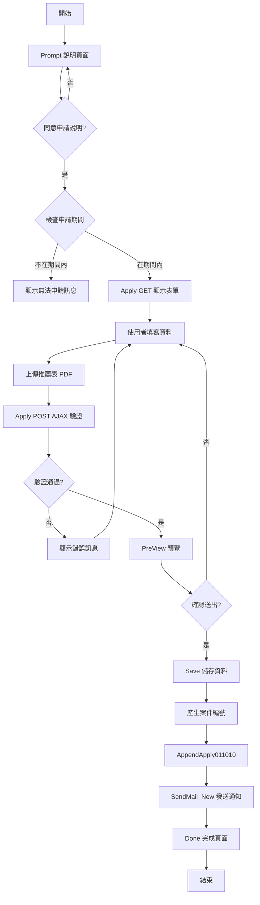
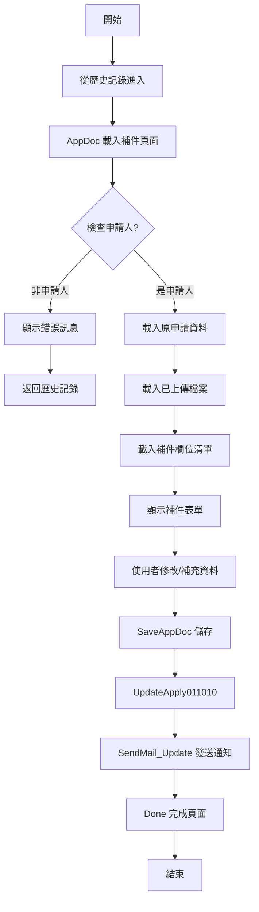
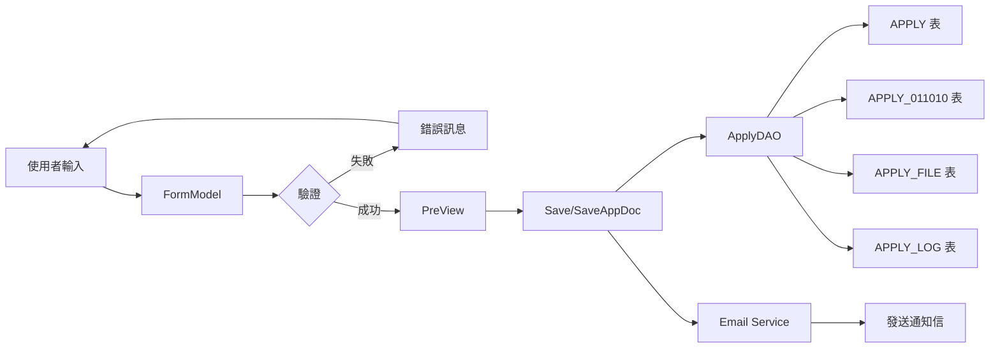
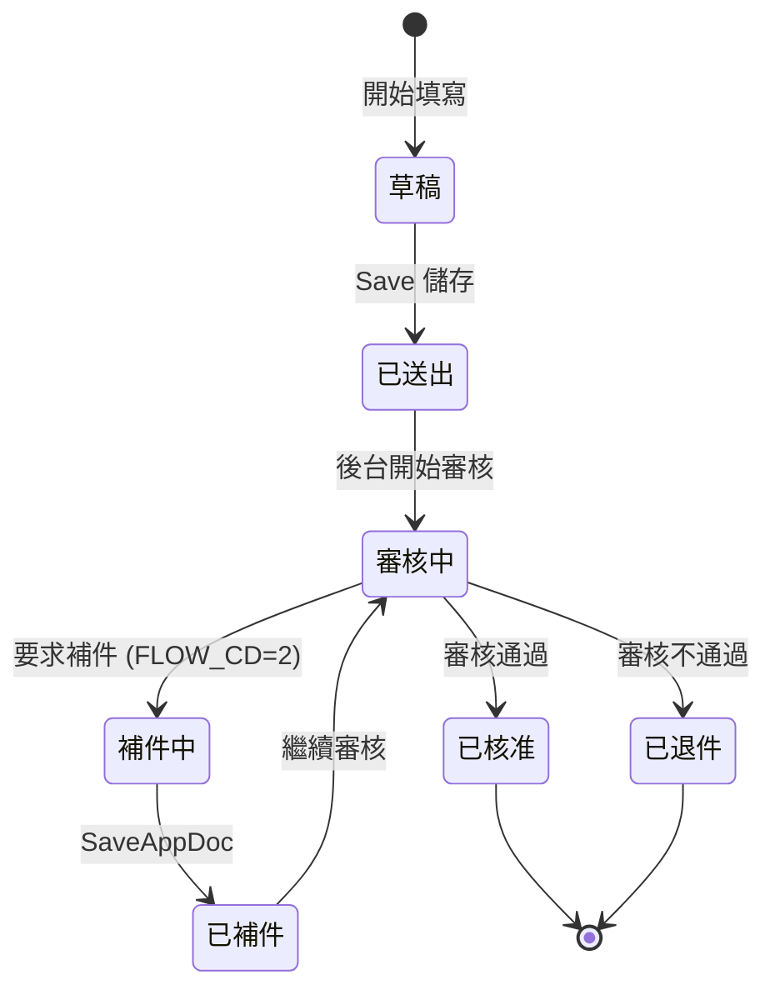

# 011010 全國社會工作專業人員選拔推薦 - 完整技術文件

## 一、服務基本資訊

| 項目           | 內容                                                                    |
| -------------- | ----------------------------------------------------------------------- |
| **服務代碼**   | 011010                                                                  |
| **服務名稱**   | 全國社會工作專業人員選拔推薦                                            |
| **業務單位**   | 社會及家庭署 (UNIT_CD = 8)                                              |
| **服務說明**   | 提供各單位推薦優秀社會工作專業人員參與全國性選拔表揚                    |
| **申請對象**   | 公部門、私部門、公私立醫事機構                                          |
| **Controller** | `ES.Controllers.Apply_011010Controller`                                 |
| **主要 Model** | `Apply_011010Model`, `Apply_011010FormModel`, `Apply_011010AppDocModel` |
| **主要資料表** | `APPLY`, `APPLY_011010`, `APPLY_FILE`, `APPLY_LOG`, `APPLY_NOTICE`      |
| **開發日期**   | 2024-01-15                                                              |
| **最後更新**   | 2025-01-15                                                              |

---

## 二、服務特色比較表

| 功能項目         | 011010 全國社會工作專業人員選拔推薦 | 其他社工師服務 | 說明                                       |
| ---------------- | ----------------------------------- | -------------- | ------------------------------------------ |
| **申請主體**     | 單位推薦                            | 個人申請       | 由單位統一推薦優秀人員                     |
| **推薦名額計算** | ✅ 有                               | ❌ 無          | 依單位類型及社工人數計算推薦名額上限       |
| **獎項分類**     | ✅ 四種獎項                         | ❌ 無          | 績優社工獎、督導獎、資深敬業獎、特殊貢獻獎 |
| **單位類型分類** | ✅ 三種類型                         | ❌ 無          | 公部門、私部門、醫事機構                   |
| **私部門細分**   | ✅ 七種子類型                       | ❌ 無          | 身障、老人、兒少、學校、矯正等             |
| **社工人數統計** | ✅ 複雜統計                         | ❌ 無          | 總會/分會人數分別統計                      |
| **推薦表上傳**   | ✅ 多筆上傳                         | ❌ 無          | 支援多位被推薦人的推薦表                   |
| **名額驗證規則** | ✅ 複雜規則                         | ❌ 無          | 依人數區間有不同計算公式                   |
| **申請期間限制** | ✅ 有                               | ⚠️ 部分有      | 需在指定期間內申請                         |
| **合併上傳功能** | ✅ 有                               | ⚠️ 部分有      | 可選擇合併或分開上傳推薦表                 |
| **補件功能**     | ✅ 有                               | ✅ 有          | 支援補件流程                               |
| **Email 通知**   | ✅ 有                               | ✅ 有          | 新增及補件皆發送通知                       |

---

## 三、核心功能說明

### 1. 申請前說明頁面 (Prompt)

- **功能**：顯示服務說明及注意事項，要求使用者同意後才能進入申請
- **檢查項目**：
  - 檢查使用者登入狀態
  - 檢查申請期間 (查詢 `TblSERVICE_DATE` 表)
  - 顯示是否可申請狀態 (`ViewBag.CanApply`)
- **流程**：使用者點選「同意」後才能進入申請頁面

### 2. 空白表單頁面 (Apply GET)

- **功能**：顯示空白申請表單
- **預設值設定**：
  - 從會員資料帶入：姓名、身分證字號、手機、Email
  - 單位聯絡電話預設為會員手機
  - 單位名稱預設為會員姓名
  - 單位類型預設為「1」(公部門)
  - 合併上傳預設為「N」
- **必要參數**：`agree=1` (表示同意申請說明)

### 3. 表單驗證 (Apply POST)

- **功能**：AJAX 驗證表單資料正確性
- **驗證項目**：
  - Email 完整性驗證
  - 單位類型必填
  - 私部門需填寫子類型
  - 單位基本資料 (名稱、部門、職稱、聯絡人、電話)
  - 社工人數必填 (CNT_D)
  - 各獎項推薦人數必填 (CNT_E, CNT_F, CNT_G, CNT_H)
  - **推薦名額上限驗證** (複雜規則，見下方說明)
  - 推薦表 PDF 檔至少上傳一個

### 4. 推薦名額驗證規則

#### 公部門或私部門 (UNIT_TYPE = 1 或 2)

- 績優社工獎 + 績優督導獎 總數限制：
  - 社工人數 ≤ 30：最多 1 名
  - 30 < 社工人數 < 900：最多 ⌈社工人數 / 30⌉ 名 (無條件進位)
  - 社工人數 ≥ 900：最多 30 名

#### 醫事機構 (UNIT_TYPE = 3)

- 績優社工獎 + 績優督導獎 總數限制：
  - 社工人數 ≤ 15：最多 1 名
  - 社工人數 > 15：最多 2 名

### 5. 預覽功能 (PreView)

- **功能**：以 PartialView 方式顯示申請資料預覽
- **顯示內容**：所有填寫的表單資料
- **用途**：讓使用者確認資料正確性後再送出

### 6. 儲存申請 (Save)

- **功能**：儲存申請資料並發送通知信
- **處理流程**：
  1. 產生申請案件編號 (`GetApp_ID`)
  2. 呼叫 `AppendApply011010` 儲存資料
  3. 呼叫 `SendMail_New` 發送新申請通知信
  4. 導向完成頁面 (status=1)

### 7. 補件頁面 (AppDoc)

- **功能**：顯示補件表單
- **資料載入**：
  - 從 `APPLY` 及 `APPLY_011010` 表載入原申請資料
  - 從 `APPLY_FILE` 表載入已上傳檔案
  - 從 `APPLY_NOTICE` 表載入補件欄位清單
- **權限檢查**：僅案件申請人可補件
- **補件狀態判斷**：`FLOW_CD = 2` 表示補件狀態

### 8. 補件儲存 (SaveAppDoc)

- **功能**：儲存補件資料並發送通知信
- **處理流程**：
  1. 呼叫 `UpdateApply011010` 更新資料
  2. 呼叫 `SendMail_Update` 發送補件通知信
  3. 導向完成頁面 (status=2, Count=補件次數)

### 9. 完成頁面 (Done)

- **功能**：顯示申請或補件完成訊息
- **參數**：
  - `status`：1=新申請完成, 2=補件完成
  - `Count`：補件次數 (僅補件時有值)

### 10. 檔案上傳管理

- **支援檔案類型**：
  - `FILE_EXCEL`：名冊表 (EXCEL 檔)
  - `FILE_PDF`：佐證文件 (PDF 檔)
  - `FILE_3`：推薦表 (PDF 檔) - 支援多筆上傳
- **多筆推薦表**：使用 `SRVLIST` 集合管理多位被推薦人的推薦表
- **合併上傳選項**：`MERGEYN` 控制是否合併上傳

---

## 四、申請流程圖



---

## 五、補件流程圖



---

## 六、資料流程圖



---

## 七、狀態轉換圖



---

## 八、資料庫結構

### 8.1 APPLY 表 (主申請表)

| 欄位名稱 | 資料型別      | 說明             | 備註                     |
| -------- | ------------- | ---------------- | ------------------------ |
| APP_ID   | VARCHAR(20)   | 案件編號 (PK)    | 格式: 011010YYYYMMDDNNNN |
| SRV_ID   | VARCHAR(6)    | 服務代碼         | 固定值: 011010           |
| UNIT_CD  | VARCHAR(2)    | 業務單位代碼     | 固定值: 8 (社家署)       |
| ACC_NO   | VARCHAR(50)   | 申請人帳號       |                          |
| NAME     | VARCHAR(50)   | 申請人姓名       |                          |
| IDN      | VARCHAR(10)   | 申請人身分證字號 |                          |
| MOBILE   | VARCHAR(20)   | 申請人手機       |                          |
| APP_TIME | DATETIME      | 申請時間         |                          |
| FLOW_CD  | VARCHAR(2)    | 流程狀態碼       | 2=補件中                 |
| MAILBODY | NVARCHAR(MAX) | 補件通知內容     |                          |
| DEL_MK   | CHAR(1)       | 刪除註記         | Y/N                      |
| ADD_TIME | DATETIME      | 新增時間         |                          |
| ADD_ACC  | VARCHAR(50)   | 新增人員帳號     |                          |
| UPD_TIME | DATETIME      | 更新時間         |                          |
| UPD_ACC  | VARCHAR(50)   | 更新人員帳號     |                          |

### 8.2 APPLY_011010 表 (服務專屬表)

| 欄位名稱     | 資料型別      | 說明                      | 備註                           |
| ------------ | ------------- | ------------------------- | ------------------------------ |
| APP_ID       | VARCHAR(20)   | 案件編號 (PK, FK)         |                                |
| UNIT_TYPE    | VARCHAR(1)    | 單位類型                  | 1=公部門, 2=私部門, 3=醫事機構 |
| UNIT_SUBTYPE | VARCHAR(1)    | 單位子類型 (私部門)       | 1-7 (見下方說明)               |
| UNIT_NAME    | NVARCHAR(100) | 單位名稱                  |                                |
| UNIT_DEPART  | NVARCHAR(100) | 單位聯絡人局處/部門       |                                |
| UNIT_TITLE   | NVARCHAR(50)  | 單位聯絡人職稱            |                                |
| UNIT_CNAME   | NVARCHAR(50)  | 單位聯絡人姓名            |                                |
| UNIT_TEL     | VARCHAR(20)   | 連絡電話                  |                                |
| UNIT_EMAIL   | VARCHAR(100)  | 連絡 Email                |                                |
| CNT_TYPE     | VARCHAR(1)    | 社工人數統計類型          | 1=總會統一推薦, 2=非協會       |
| CNT_A        | VARCHAR(10)   | 總會人數                  | CNT_TYPE=1 時使用              |
| CNT_B        | VARCHAR(10)   | 分會人數                  | CNT_TYPE=1 時使用              |
| CNT_C        | VARCHAR(10)   | 單位社工人員總數 (協會)   | CNT_A + CNT_B                  |
| CNT_D        | VARCHAR(10)   | 單位社工人員總數 (非協會) | CNT_TYPE=2 時使用              |
| CNT_E        | VARCHAR(10)   | 績優社工獎推薦人數        |                                |
| CNT_F        | VARCHAR(10)   | 績優社工督導獎推薦人數    |                                |
| CNT_G        | VARCHAR(10)   | 資深敬業獎推薦人數        |                                |
| CNT_H        | VARCHAR(10)   | 特殊貢獻獎推薦人數        |                                |
| MERGEYN      | CHAR(1)       | 佐證文件採合併檔案        | Y/N                            |
| DEL_MK       | CHAR(1)       | 刪除註記                  | Y/N                            |
| ADD_TIME     | DATETIME      | 新增時間                  |                                |
| ADD_FUN_CD   | VARCHAR(10)   | 新增功能代碼              |                                |
| ADD_ACC      | VARCHAR(50)   | 新增人員帳號              |                                |
| UPD_TIME     | DATETIME      | 更新時間                  |                                |
| UPD_FUN_CD   | VARCHAR(10)   | 更新功能代碼              |                                |
| UPD_ACC      | VARCHAR(50)   | 更新人員帳號              |                                |

**UNIT_SUBTYPE 說明** (私部門子類型)：

1. 身心障礙福利機構/團體
2. 老人及長期照顧福利機構/團體
3. 兒少、婦女及家庭福利機構/團體
4. 學校
5. 矯正機關
6. 社工師事務所及公會/協會/學會
7. 其他(非屬上述類別)

### 8.3 APPLY_FILE 表 (檔案表)

| 欄位名稱  | 資料型別      | 說明          | 備註                         |
| --------- | ------------- | ------------- | ---------------------------- |
| FILE_ID   | INT           | 檔案編號 (PK) | IDENTITY(1,1)                |
| APP_ID    | VARCHAR(20)   | 案件編號 (FK) |                              |
| FILE_TYPE | VARCHAR(20)   | 檔案類型      | FILE_EXCEL, FILE_PDF, FILE_3 |
| FILE_NAME | NVARCHAR(200) | 檔案名稱      |                              |
| FILE_PATH | NVARCHAR(500) | 檔案路徑      |                              |
| FILE_SIZE | BIGINT        | 檔案大小      | Bytes                        |
| SEQ_NO    | INT           | 序號          | 用於多筆推薦表排序           |
| ADD_TIME  | DATETIME      | 上傳時間      |                              |
| ADD_ACC   | VARCHAR(50)   | 上傳人員帳號  |                              |

### 8.4 APPLY_LOG 表 (異動記錄表)

| 欄位名稱    | 資料型別      | 說明          | 備註                |
| ----------- | ------------- | ------------- | ------------------- |
| LOG_ID      | INT           | 記錄編號 (PK) | IDENTITY(1,1)       |
| APP_ID      | VARCHAR(20)   | 案件編號 (FK) |                     |
| ACTION_TYPE | VARCHAR(20)   | 異動類型      | NEW, UPDATE, APPDOC |
| ACTION_TIME | DATETIME      | 異動時間      |                     |
| ACTION_ACC  | VARCHAR(50)   | 異動人員帳號  |                     |
| ACTION_DESC | NVARCHAR(500) | 異動說明      |                     |

### 8.5 APPLY_NOTICE 表 (補件通知表)

| 欄位名稱 | 資料型別    | 說明          | 備註                  |
| -------- | ----------- | ------------- | --------------------- |
| ID       | INT         | 編號 (PK)     | IDENTITY(1,1)         |
| APP_ID   | VARCHAR(20) | 案件編號 (FK) |                       |
| Field    | VARCHAR(50) | 欄位名稱      | 需補件的欄位          |
| SRC_NO   | VARCHAR(10) | 來源序號      | 用於動態欄位 (如檔案) |
| ISADDYN  | CHAR(1)     | 是否為補件    | Y/N                   |
| ADD_TIME | DATETIME    | 新增時間      |                       |
| ADD_ACC  | VARCHAR(50) | 新增人員帳號  |                       |

---

## 九、ViewModel 結構

### 9.1 Apply_011010ViewModel (主 ViewModel)

```csharp
public class Apply_011010ViewModel
{
    public Apply_011010FormModel Form { get; set; }
    public Apply_011010AppDocModel AppDoc { get; set; }
}
```

### 9.2 Apply_011010FormModel (表單 Model)

**繼承**：`ApplyModel`

**主要屬性**：

| 屬性名稱        | 型別                           | 說明                      | 備註                    |
| --------------- | ------------------------------ | ------------------------- | ----------------------- |
| IsUpLoadFile    | string                         | 是否上傳檔案              | 0=未上傳, 1=已上傳      |
| APPLY_DATE      | DateTime?                      | 申請日期                  |                         |
| APPLY_DATE_TW   | string                         | 申請日期 (民國年)         | 自動轉換                |
| UNIT_TYPE       | string                         | 單位類型                  | 1/2/3                   |
| UNIT_SUBTYPE    | string                         | 單位子類型 (私部門)       | 1-7                     |
| UNIT_NAME       | string                         | 單位名稱                  |                         |
| UNIT_DEPART     | string                         | 單位聯絡人局處/部門       |                         |
| UNIT_TITLE      | string                         | 單位聯絡人職稱            |                         |
| UNIT_CNAME      | string                         | 單位聯絡人姓名            |                         |
| UNIT_TEL        | string                         | 連絡電話                  |                         |
| EMAIL           | string                         | Email (組合欄位)          | EMAIL_0 + @ + EMAIL_1/2 |
| EMAIL_0         | string                         | Email 帳號                |                         |
| EMAIL_1         | string                         | Email 網域 (下拉選項)     |                         |
| EMAIL_2         | string                         | Email 網域 (自訂)         | 當 EMAIL_1=0 時使用     |
| EMAIL_3         | string                         | Email 備用                |                         |
| CNT_TYPE        | string                         | 社工人數統計類型          | 1/2                     |
| CNT_A           | string                         | 總會人數                  |                         |
| CNT_B           | string                         | 分會人數                  |                         |
| CNT_C           | string                         | 單位社工人員總數 (協會)   | CNT_A + CNT_B           |
| CNT_D           | string                         | 單位社工人員總數 (非協會) |                         |
| CNT_E           | string                         | 績優社工獎推薦人數        |                         |
| CNT_F           | string                         | 績優社工督導獎推薦人數    |                         |
| CNT_G           | string                         | 資深敬業獎推薦人數        |                         |
| CNT_H           | string                         | 特殊貢獻獎推薦人數        |                         |
| MERGEYN         | string                         | 佐證文件採合併檔案        | Y/N                     |
| FILE_EXCEL      | HttpPostedFileBase             | 名冊表 (EXCEL 檔)         |                         |
| FILE_EXCEL_TEXT | string                         | 名冊表檔名                |                         |
| FILE_PDF        | HttpPostedFileBase             | 佐證文件 (PDF 檔)         |                         |
| FILE_PDF_TEXT   | string                         | 佐證文件檔名              |                         |
| FILE_3          | HttpPostedFileBase             | 推薦表 (PDF 檔)           |                         |
| FILE_3_TEXT     | string                         | 推薦表檔名                |                         |
| SRVLIST         | IList<Apply_011010SRVLSTModel> | 推薦表清單 (多筆)         | 支援多位被推薦人        |

### 9.3 Apply_011010SRVLSTModel (推薦表清單 Model)

**繼承**：`Apply_FileModel`

**主要屬性**：

| 屬性名稱    | 型別               | 說明            | 備註 |
| ----------- | ------------------ | --------------- | ---- |
| SEQ_NO      | string             | 序號            |      |
| FILE_3      | HttpPostedFileBase | 推薦表 (PDF 檔) |      |
| FILE_3_TEXT | string             | 推薦表檔名      |      |

### 9.4 Apply_011010AppDocModel (補件 Model)

**繼承**：`ApplyModel`

**主要屬性**：

| 屬性名稱      | 型別                           | 說明                      | 備註             |
| ------------- | ------------------------------ | ------------------------- | ---------------- |
| APPSTATUS     | string                         | 補件狀態                  | 1=補件, 0=非補件 |
| FieldStr      | string                         | 補件欄位字串              | 逗號分隔         |
| APP_TIME_TW   | string                         | 申請時間 (民國年)         |                  |
| APPLY_DATE_TW | string                         | 申請日期 (民國年)         |                  |
| UNIT_TYPE     | string                         | 單位類型                  |                  |
| UNIT_SUBTYPE  | string                         | 單位子類型                |                  |
| UNIT_NAME     | string                         | 單位名稱                  |                  |
| UNIT_DEPART   | string                         | 單位聯絡人局處/部門       |                  |
| UNIT_TITLE    | string                         | 單位聯絡人職稱            |                  |
| UNIT_CNAME    | string                         | 單位聯絡人姓名            |                  |
| UNIT_TEL      | string                         | 連絡電話                  |                  |
| EMAIL         | string                         | Email (組合欄位)          |                  |
| CNT_TYPE      | string                         | 社工人數統計類型          |                  |
| CNT_A         | string                         | 總會人數                  |                  |
| CNT_B         | string                         | 分會人數                  |                  |
| CNT_C         | string                         | 單位社工人員總數 (協會)   |                  |
| CNT_D         | string                         | 單位社工人員總數 (非協會) |                  |
| CNT_E         | string                         | 績優社工獎推薦人數        |                  |
| CNT_F         | string                         | 績優社工督導獎推薦人數    |                  |
| CNT_G         | string                         | 資深敬業獎推薦人數        |                  |
| CNT_H         | string                         | 特殊貢獻獎推薦人數        |                  |
| MERGEYN       | string                         | 佐證文件採合併檔案        | Y/N              |
| FILE_EXCEL    | HttpPostedFileBase             | 名冊表 (EXCEL 檔)         |                  |
| FILE_PDF      | HttpPostedFileBase             | 佐證文件 (PDF 檔)         |                  |
| FILE_3        | HttpPostedFileBase             | 推薦表 (PDF 檔)           |                  |
| SRVLIST       | IList<Apply_011010SRVLSTModel> | 推薦表清單                |                  |
| FILE          | IList<Apply_011010FILEModel>   | 已上傳檔案清單            |                  |

### 9.5 Apply_011010DoneModel (完成頁面 Model)

| 屬性名稱 | 型別   | 說明     | 備註             |
| -------- | ------ | -------- | ---------------- |
| status   | string | 狀態     | 1=新申請, 2=補件 |
| Count    | string | 補件次數 | 僅補件時有值     |

---

## 十、Controller 方法說明

### 10.1 Prompt() - 申請前說明頁面

**路由**：`GET /Apply_011010/Prompt`

**功能**：顯示服務說明及注意事項

**處理流程**：

1. 檢查使用者登入狀態
2. 查詢 `TblSERVICE_DATE` 表檢查申請期間
3. 設定 `ViewBag.CanApply` (Y/N)
4. 顯示 Prompt 頁面

**關鍵程式碼**：

```csharp
var data = dao.GetRow<TblSERVICE_DATE>(new TblSERVICE_DATE { SRV_ID = "011010" });
if (data != null)
{
    if (DateTime.Now >= data.TIME_S && DateTime.Now < (data.TIME_E.Value.AddDays(1)))
    {
        ViewBag.CanApply = "Y";
    }
}
```

### 10.2 Apply(string agree) - 空白表單頁面

**路由**：`GET /Apply_011010/Apply?agree=1`

**功能**：顯示空白申請表單

**參數**：

- `agree`：是否同意申請說明 (1=同意)

**處理流程**：

1. 檢查 `agree` 參數，若非 "1" 則返回 Prompt 頁面
2. 從會員資料帶入預設值
3. 顯示申請表單

**預設值設定**：

```csharp
model.Form.APPLY_DATE_TW = HelperUtil.DateTimeToTwString(DateTime.Now);
model.Form.EMAIL = mem.MAIL;
model.Form.NAME = mem.NAME;
model.Form.IDN = mem.IDN;
model.Form.MOBILE = mem.MOBILE;
model.Form.UNIT_TEL = mem.MOBILE;
model.Form.UNIT_NAME = mem.NAME;
model.Form.UNIT_TYPE = "1";
model.Form.MERGEYN = "N";
```

### 10.3 Apply(Apply_011010FormModel model) - 表單驗證

**路由**：`POST /Apply_011010/Apply`

**功能**：AJAX 驗證表單資料

**驗證項目**：

1. Email 完整性驗證
2. 單位類型及子類型驗證
3. 單位基本資料驗證
4. 社工人數驗證
5. 推薦人數驗證
6. **推薦名額上限驗證** (複雜規則)
7. 推薦表檔案驗證

**推薦名額驗證邏輯**：

```csharp
var sum_ef = Convert.ToInt32(model.CNT_E) + Convert.ToInt32(model.CNT_F);
var sum_d = Convert.ToInt32(model.CNT_D);

if (model.UNIT_TYPE == "1" || model.UNIT_TYPE == "2")
{
    if (sum_d <= 30)
    {
        if (sum_ef > 1) { /* 錯誤 */ }
    }
    else if (sum_d > 30 && sum_d < 900)
    {
        if (sum_d % 30 == 0)
        {
            if (sum_ef > (sum_d / 30)) { /* 錯誤 */ }
        }
        else
        {
            if (sum_ef > (sum_d / 30) + 1) { /* 錯誤 */ }
        }
    }
    else if (sum_d >= 900)
    {
        if (sum_ef > 30) { /* 錯誤 */ }
    }
}
else if (model.UNIT_TYPE == "3")
{
    if (sum_d <= 15)
    {
        if (sum_ef > 1) { /* 錯誤 */ }
    }
    else if (sum_d > 15)
    {
        if (sum_ef > 2) { /* 錯誤 */ }
    }
}
```

**回傳格式**：

```json
{
    "status": true/false,
    "message": "錯誤訊息"
}
```

### 10.4 PreView(Apply_011010FormModel model) - 預覽頁面

**路由**：`POST /Apply_011010/PreView`

**功能**：以 PartialView 顯示申請資料預覽

**回傳**：`PartialView("PreView", model)`

### 10.5 Save(Apply_011010FormModel model) - 儲存申請

**路由**：`POST /Apply_011010/Save`

**功能**：儲存申請資料並發送通知信

**處理流程**：

1. 產生案件編號：`dao.GetApp_ID("011010")`
2. 儲存資料：`dao.AppendApply011010(model, APP_ID)`
3. 發送通知信：`dao.SendMail_New(mem.NAME, mem.MAIL, APP_ID, s_SRV_NAME, s_SRV_ID)`
4. 導向完成頁面：`Done("1")`

### 10.6 AppDoc(string APP_ID) - 補件頁面

**路由**：`GET /Apply_011010/AppDoc?APP_ID=xxx`

**功能**：顯示補件表單

**處理流程**：

1. 載入案件資料 (`APPLY` 及 `APPLY_011010` 表)
2. 檢查申請人權限
3. 載入已上傳檔案 (`GetFile_011010`)
4. 載入補件欄位清單 (`APPLY_NOTICE` 表，`ISADDYN='N'`)
5. 組成補件欄位字串 (`FieldStr`)
6. 顯示補件表單

**權限檢查**：

```csharp
if (!mem.ACC_NO.Equals(app_data.ACC_NO))
{
    sm.LastErrorMessage = "非案件申請人無法瀏覽次案件 !";
    return RedirectToAction("Index", "History");
}
```

### 10.7 SaveAppDoc(Apply_011010AppDocModel model) - 補件儲存

**路由**：`POST /Apply_011010/SaveAppDoc`

**功能**：儲存補件資料並發送通知信

**處理流程**：

1. 更新資料：`dao.UpdateApply011010(model)` (回傳補件次數)
2. 發送通知信：`dao.SendMail_Update(memName, memEmail, model.APP_ID, s_SRV_NAME, s_SRV_ID, count)`
3. 導向完成頁面：`Done("2", count)`

### 10.8 Done(string status, string Count) - 完成頁面

**路由**：`GET /Apply_011010/Done?status=1&Count=`

**功能**：顯示申請或補件完成訊息

**參數**：

- `status`：1=新申請完成, 2=補件完成
- `Count`：補件次數 (僅補件時有值)

---

## 十一、DAO 方法說明

### 11.1 GetApp_ID(string SRV_ID) - 產生案件編號

**功能**：產生唯一的案件編號

**格式**：`011010YYYYMMDDNNNN`

- `011010`：服務代碼
- `YYYYMMDD`：申請日期
- `NNNN`：當日流水號 (4 位數)

**範例**：`01101020250115001`

### 11.2 AppendApply011010(Apply_011010FormModel model, string APP_ID) - 新增申請

**功能**：新增申請資料至資料庫

**處理項目**：

1. 新增 `APPLY` 表資料
2. 新增 `APPLY_011010` 表資料
3. 新增 `APPLY_FILE` 表資料 (檔案)
4. 新增 `APPLY_LOG` 表資料 (異動記錄)

**交易處理**：使用 Transaction 確保資料一致性

### 11.3 UpdateApply011010(Apply_011010AppDocModel model) - 更新補件

**功能**：更新補件資料

**處理項目**：

1. 更新 `APPLY` 表資料
2. 更新 `APPLY_011010` 表資料
3. 新增/更新 `APPLY_FILE` 表資料
4. 新增 `APPLY_LOG` 表資料
5. 更新 `APPLY_NOTICE` 表 (標記已補件)

**回傳**：補件次數 (string)

### 11.4 GetFile_011010(string APP_ID) - 取得檔案清單

**功能**：取得案件的所有已上傳檔案

**回傳**：`Apply_011010AppDocModel` (包含 FILE 集合)

**SQL 查詢**：

```sql
SELECT * FROM APPLY_FILE
WHERE APP_ID = @APP_ID
ORDER BY FILE_TYPE, SEQ_NO
```

### 11.5 SendMail_New(string name, string email, string APP_ID, string SRV_NAME, string SRV_ID) - 發送新申請通知

**功能**：發送新申請確認信

**信件內容**：

- 收件人：申請人 Email
- 主旨：【衛生福利部】全國社會工作專業人員選拔推薦 - 申請完成通知
- 內容：案件編號、申請時間、服務名稱、注意事項

### 11.6 SendMail_Update(string name, string email, string APP_ID, string SRV_NAME, string SRV_ID, string count) - 發送補件通知

**功能**：發送補件完成通知信

**信件內容**：

- 收件人：申請人 Email
- 主旨：【衛生福利部】全國社會工作專業人員選拔推薦 - 補件完成通知
- 內容：案件編號、補件次數、補件時間、注意事項

---

## 十二、技術亮點

### 1. 複雜的推薦名額驗證規則

- 依單位類型 (公部門/私部門/醫事機構) 有不同計算方式
- 依社工人數區間有不同上限
- 公部門/私部門：≤30 人最多 1 名，30-900 人依比例，≥900 人最多 30 名
- 醫事機構：≤15 人最多 1 名，>15 人最多 2 名
- 使用無條件進位計算 (⌈人數/30⌉)

### 2. 多筆推薦表上傳管理

- 使用 `SRVLIST` 集合管理多位被推薦人的推薦表
- 支援動態新增/刪除推薦表
- 每筆推薦表有獨立的 `SEQ_NO` 序號
- 前端 JavaScript 動態產生表單欄位

### 3. 單位類型分類系統

- 三種主要類型：公部門、私部門、醫事機構
- 私部門細分七種子類型
- 不同類型有不同的驗證規則
- 動態顯示/隱藏相關欄位

### 4. 社工人數統計彈性設計

- 支援兩種統計方式：總會統一推薦、非協會
- 總會統一推薦：分別統計總會人數 (CNT_A) 及分會人數 (CNT_B)
- 非協會：直接填寫總人數 (CNT_D)
- 自動計算總數 (CNT_C = CNT_A + CNT_B)

### 5. 申請期間控制機制

- 查詢 `TblSERVICE_DATE` 表檢查申請期間
- 動態顯示是否可申請 (`ViewBag.CanApply`)
- 期間外顯示提示訊息
- 支援跨日期計算 (AddDays(1))

### 6. Email 組合欄位設計

- 分離 Email 帳號 (EMAIL_0) 及網域 (EMAIL_1/EMAIL_2)
- 支援下拉選單常用網域 (EMAIL_1)
- 支援自訂網域 (EMAIL_2，當 EMAIL_1=0 時)
- 自動組合完整 Email 地址

### 7. 補件欄位動態標記

- 使用 `APPLY_NOTICE` 表記錄需補件欄位
- 支援一般欄位及動態欄位 (如檔案)
- 使用 `SRC_NO` 區分動態欄位的序號
- 前端 JavaScript 依 `FieldStr` 標記需補件欄位

### 8. 合併上傳功能

- `MERGEYN` 控制是否合併上傳推薦表
- 合併上傳：所有推薦表合併為一個 PDF 檔
- 分開上傳：每位被推薦人一個 PDF 檔
- 彈性滿足不同單位需求

### 9. 四種獎項分類管理

- 績優社工獎 (CNT_E)
- 績優社工督導獎 (CNT_F)
- 資深敬業獎 (CNT_G)
- 特殊貢獻獎 (CNT_H)
- 各獎項獨立統計推薦人數

### 10. 完整的異動記錄

- 使用 `APPLY_LOG` 表記錄所有異動
- 記錄異動類型 (NEW, UPDATE, APPDOC)
- 記錄異動時間及人員
- 記錄異動說明
- 便於追蹤及稽核

---

## 十三、相關檔案清單

### 13.1 Controller 層

- `ES/Controllers/Apply_011010Controller.cs` - 前台 Controller (474 行)
- `ES/Areas/BACKMIN/Controllers/Apply_011010Controller.cs` - 後台 Controller

### 13.2 Model 層

- `ES/Models/Entities/Apply_011010Model.cs` - Entity Model (169 行)
- `ES/Models/ViewModels/Apply_011010ViewModel.cs` - ViewModel (593 行)

### 13.3 DAO 層

- `ES/DataLayers/ApplyDAO.cs` - 資料存取層 (包含 011010 相關方法)

### 13.4 View 層

- `ES/Views/Apply_011010/Prompt.cshtml` - 申請前說明頁面
- `ES/Views/Apply_011010/Index.cshtml` - 申請表單頁面
- `ES/Views/Apply_011010/PreView.cshtml` - 預覽頁面 (PartialView)
- `ES/Views/Apply_011010/AppDoc.cshtml` - 補件頁面
- `ES/Views/Apply_011010/Done.cshtml` - 完成頁面

### 13.5 JavaScript 檔案

- `ES/Scripts/Apply_011010.js` - 前端驗證及互動邏輯 (推測)

### 13.6 資料庫相關

- `APPLY` - 主申請表
- `APPLY_011010` - 服務專屬表
- `APPLY_FILE` - 檔案表
- `APPLY_LOG` - 異動記錄表
- `APPLY_NOTICE` - 補件通知表
- `TblSERVICE_DATE` - 服務申請期間表

---

## 十四、重要注意事項

### 1. 推薦名額計算規則

- **務必正確理解並實作推薦名額上限驗證規則**
- 公部門/私部門與醫事機構有不同計算方式
- 需考慮無條件進位 (⌈人數/30⌉)
- 驗證邏輯複雜，需仔細測試各種情境

### 2. 單位類型與子類型關聯

- 私部門 (UNIT_TYPE=2) 必須填寫子類型 (UNIT_SUBTYPE)
- 公部門及醫事機構不需填寫子類型
- 前端需動態顯示/隱藏子類型欄位
- 後端驗證需檢查此關聯性

### 3. 社工人數統計方式

- 需依 CNT_TYPE 決定使用哪組欄位
- CNT_TYPE=1：使用 CNT_A + CNT_B = CNT_C
- CNT_TYPE=2：使用 CNT_D
- 驗證時需使用正確的人數欄位

### 4. 多筆推薦表管理

- SRVLIST 集合需正確綁定至前端表單
- 每筆推薦表需有唯一的 SEQ_NO
- 至少需上傳一筆推薦表
- 檔案驗證需檢查每筆推薦表

### 5. 申請期間控制

- 需查詢 TblSERVICE_DATE 表確認申請期間
- 期間外不允許申請
- 期間結束日需加 1 天 (AddDays(1)) 以包含當天
- Prompt 頁面需顯示是否可申請狀態

### 6. Email 欄位處理

- Email 由三個欄位組合而成 (EMAIL_0, EMAIL_1, EMAIL_2)
- EMAIL_1 為下拉選單常用網域
- EMAIL_1=0 時使用 EMAIL_2 自訂網域
- 需驗證 Email 完整性

### 7. 補件流程權限

- 僅案件申請人可進行補件
- 需檢查 ACC_NO 是否相符
- 非申請人需顯示錯誤訊息並導向歷史記錄頁面
- 補件狀態需檢查 FLOW_CD=2

### 8. 檔案上傳類型

- FILE_EXCEL：名冊表 (EXCEL 檔)
- FILE_PDF：佐證文件 (PDF 檔)
- FILE_3：推薦表 (PDF 檔) - 支援多筆
- 需驗證檔案格式及大小

### 9. 合併上傳選項

- MERGEYN 控制是否合併上傳推薦表
- 需在前端提供選項讓使用者選擇
- 影響檔案上傳及儲存方式
- 需在說明中清楚告知使用者差異

### 10. 交易處理

- 新增及更新資料需使用 Transaction
- 確保 APPLY、APPLY_011010、APPLY_FILE、APPLY_LOG 表資料一致性
- 發生錯誤需 Rollback
- 成功後需 Commit

---

## 十五、維護記錄

| 日期       | 版本  | 修改人員 | 修改內容               |
| ---------- | ----- | -------- | ---------------------- |
| 2024-01-15 | 1.0.0 | 開發團隊 | 初版建立               |
| 2024-03-20 | 1.1.0 | 開發團隊 | 新增多筆推薦表上傳功能 |
| 2024-06-10 | 1.2.0 | 開發團隊 | 新增補件功能           |
| 2024-09-15 | 1.3.0 | 開發團隊 | 優化推薦名額驗證規則   |
| 2025-01-15 | 1.4.0 | 開發團隊 | 新增申請期間控制機制   |

---

## 十六、相關文件連結

### 16.1 相關服務文件

- [011005 社工師執業執照相關申請](./011005_社工師執業執照相關申請_完整技術文件.md)
- [011006 社工師繼續教育積分審查](./011006_社工師繼續教育積分審查_完整技術文件.md)
- [011007 社工師證書核發(中文)](<./011007_社工師證書核發(中文)_完整技術文件.md>)
- [011008 社工師證書換發(更名或汙損)](<./011008_社工師證書換發(更名或汙損)_完整技術文件.md>)
- [011009 社工師證書補發(遺失)](<./011009_社工師證書補發(遺失)_完整技術文件.md>)

### 16.2 技術文件

- [ASP.NET MVC 5 開發規範](../開發規範/ASPNET_MVC5_開發規範.md)
- [Dapper ORM 使用指南](../開發規範/Dapper_使用指南.md)
- [檔案上傳處理規範](../開發規範/檔案上傳處理規範.md)
- [Email 通知服務規範](../開發規範/Email_通知服務規範.md)

### 16.3 業務文件

- 全國社會工作專業人員選拔及表揚要點
- 社會工作師法
- 社會工作專業人員選拔作業手冊

---

## 十七、與其他服務的差異

### 17.1 與 011005-011009 服務的主要差異

| 項目             | 011010 全國社會工作專業人員選拔推薦 | 011005-011009 社工師證照服務 |
| ---------------- | ----------------------------------- | ---------------------------- |
| **申請主體**     | 單位推薦                            | 個人申請                     |
| **申請對象**     | 公部門、私部門、醫事機構            | 社工師個人                   |
| **資料複雜度**   | 高 (單位資料+推薦人數+獎項分類)     | 中 (個人基本資料)            |
| **驗證規則**     | 複雜 (推薦名額計算)                 | 簡單 (基本欄位驗證)          |
| **檔案上傳**     | 多筆推薦表 (SRVLIST)                | 單一或固定數量檔案           |
| **申請期間限制** | 有 (查詢 TblSERVICE_DATE)           | 部分有                       |
| **單位類型分類** | 有 (三種主類型+七種子類型)          | 無                           |
| **人數統計**     | 有 (總會/分會/非協會)               | 無                           |
| **獎項分類**     | 有 (四種獎項)                       | 無                           |
| **合併上傳選項** | 有 (MERGEYN)                        | 部分有                       |

### 17.2 特殊之處

1. **推薦名額計算最複雜**：依單位類型及社工人數有不同計算公式
2. **多筆推薦表管理**：支援動態新增多位被推薦人的推薦表
3. **單位類型分類最細**：三種主類型加上私部門七種子類型
4. **社工人數統計彈性**：支援總會/分會分別統計或直接填寫總數
5. **四種獎項分類**：績優社工、督導、資深敬業、特殊貢獻
6. **申請期間嚴格控制**：需在指定期間內才能申請

---

## 十八、常見問題 (FAQ)

### Q1: 推薦名額如何計算？

**A**: 依單位類型及社工人數計算：

- **公部門/私部門**：
  - ≤30 人：績優社工+督導最多 1 名
  - 30-900 人：最多 ⌈人數/30⌉ 名 (無條件進位)
  - ≥900 人：最多 30 名
- **醫事機構**：
  - ≤15 人：績優社工+督導最多 1 名
  - > 15 人：最多 2 名

### Q2: 私部門子類型有哪些？

**A**: 私部門細分為七種子類型：

1. 身心障礙福利機構/團體
2. 老人及長期照顧福利機構/團體
3. 兒少、婦女及家庭福利機構/團體
4. 學校
5. 矯正機關
6. 社工師事務所及公會/協會/學會
7. 其他(非屬上述類別)

### Q3: 社工人數如何統計？

**A**: 依單位性質選擇統計方式：

- **總會統一推薦** (CNT_TYPE=1)：分別填寫總會人數 (CNT_A) 及分會人數 (CNT_B)，系統自動計算總數 (CNT_C)
- **非協會** (CNT_TYPE=2)：直接填寫單位社工人員總數 (CNT_D)

### Q4: 可以推薦幾位被推薦人？

**A**: 依各獎項分別統計：

- 績優社工獎 (CNT_E)
- 績優社工督導獎 (CNT_F)
- 資深敬業獎 (CNT_G)
- 特殊貢獻獎 (CNT_H)

其中績優社工獎+督導獎有名額上限限制，資深敬業獎及特殊貢獻獎無上限。

### Q5: 推薦表如何上傳？

**A**: 支援兩種方式：

- **合併上傳** (MERGEYN=Y)：所有被推薦人的推薦表合併為一個 PDF 檔上傳
- **分開上傳** (MERGEYN=N)：每位被推薦人一個 PDF 檔，使用 SRVLIST 管理多筆推薦表

### Q6: 申請期間如何確認？

**A**: 系統會查詢 `TblSERVICE_DATE` 表確認申請期間，只有在期間內才能申請。Prompt 頁面會顯示是否可申請 (ViewBag.CanApply)。

### Q7: 補件時可以修改哪些資料？

**A**: 補件時可以修改所有申請資料，包括：

- 單位基本資料
- 社工人數
- 推薦人數
- 上傳檔案

系統會依 `APPLY_NOTICE` 表標記需補件的欄位。

### Q8: Email 欄位如何填寫？

**A**: Email 由三個部分組成：

- EMAIL_0：Email 帳號 (@ 前面的部分)
- EMAIL_1：Email 網域 (下拉選單常用網域)
- EMAIL_2：Email 網域 (自訂網域，當 EMAIL_1=0 時使用)

系統會自動組合成完整的 Email 地址。

### Q9: 如何確認申請是否成功？

**A**: 申請成功後會：

1. 顯示完成頁面 (Done)，顯示申請成功訊息
2. 發送確認信至申請人 Email
3. 產生唯一的案件編號 (格式：011010YYYYMMDDNNNN)
4. 可在歷史記錄中查詢申請案件

### Q10: 推薦名額驗證失敗怎麼辦？

**A**: 請檢查：

1. 單位社工人員總數是否正確填寫
2. 績優社工獎+督導獎推薦人數是否超過上限
3. 單位類型是否正確選擇 (公部門/私部門/醫事機構)
4. 依錯誤訊息調整推薦人數或社工人數

---

**版本：** 1.0
**日期：** 2025-10-20
**作者：** 柏通股份有限公司
