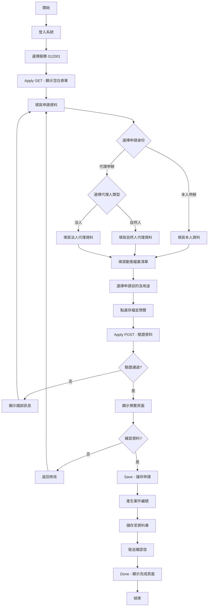
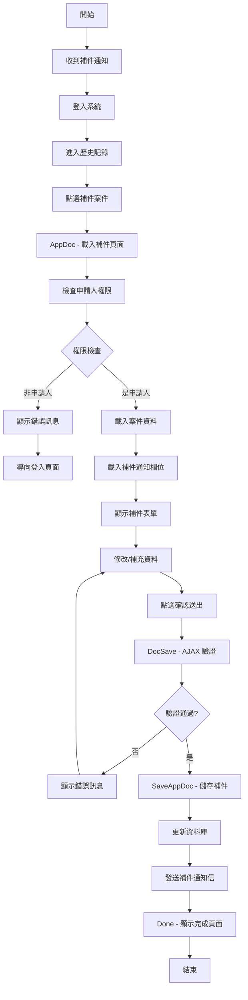
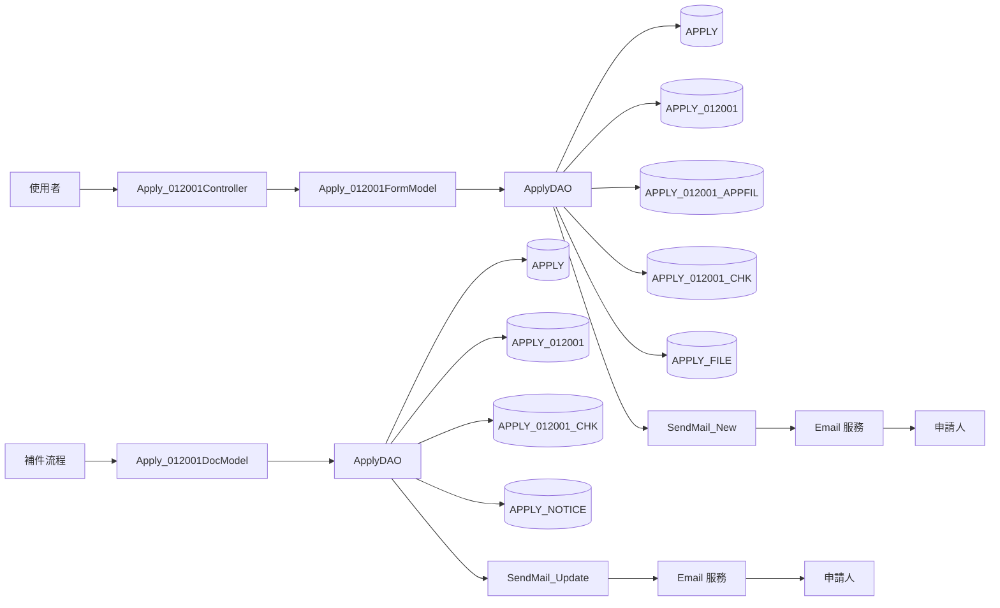
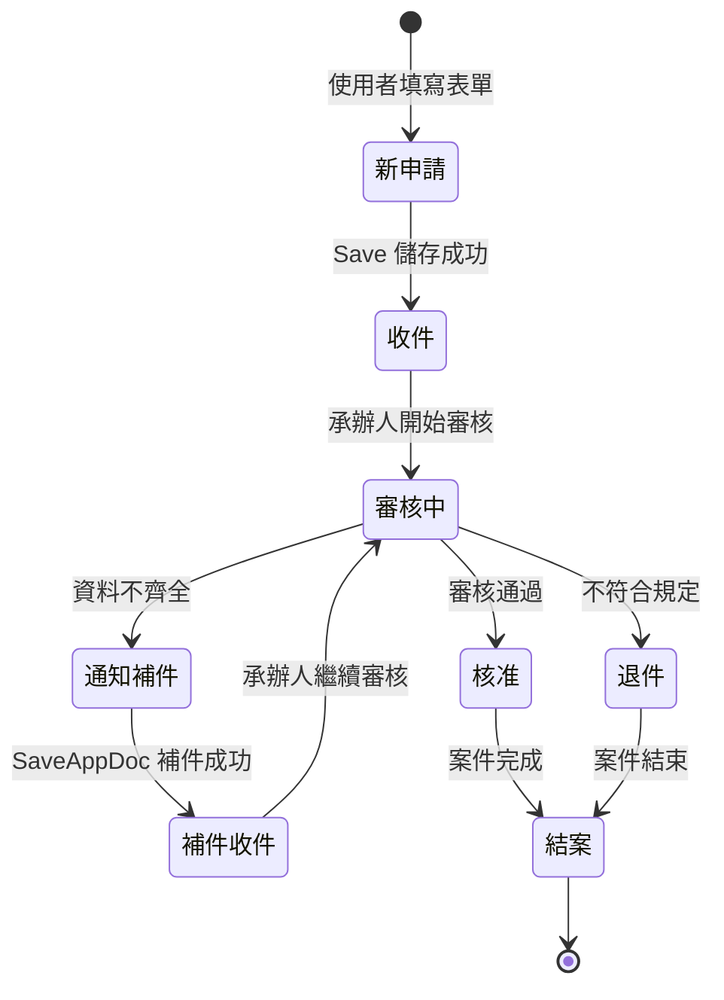

# 012001 國民年金相關申請 - 完整技術文件

## 一、服務基本資訊

| 項目           | 內容                                                                             |
| -------------- | -------------------------------------------------------------------------------- |
| **服務代碼**   | 012001                                                                           |
| **服務名稱**   | 國民年金相關申請                                                                 |
| **業務單位**   | 國民年金監理會                                                                   |
| **服務說明**   | 提供民眾申請國民年金相關給付及檔案應用的線上申辦服務                             |
| **申請對象**   | 一般民眾                                                                         |
| **Controller** | `ES.Controllers.Apply_012001Controller`                                          |
| **主要 Model** | `TblAPPLY_012001`, `Apply_012001FormModel`, `Apply_012001DocModel`               |
| **主要資料表** | `APPLY`, `APPLY_012001`, `APPLY_012001_APPFIL`, `APPLY_012001_CHK`, `APPLY_FILE` |
| **開發日期**   | 2024-01-15                                                                       |
| **最後更新**   | 2025-01-15                                                                       |

---

## 二、服務特色比較表

| 功能項目         | 012001 國民年金相關申請 | 其他申辦服務 | 說明                                   |
| ---------------- | ----------------------- | ------------ | -------------------------------------- |
| **申請身份**     | ✅ 本人/代理人          | ⚠️ 部分有    | 支援本人申辦或代理人申辦               |
| **代理人類型**   | ✅ 自然人/法人          | ⚠️ 部分有    | 代理人可為自然人或法人、團體、事務所   |
| **動態檔案清單** | ✅ 有                   | ⚠️ 部分有    | 支援動態新增多筆檔案申請項目           |
| **申請項目分類** | ✅ 複雜分類             | ❌ 無        | 申請目的及用途有多種選項（含其他自訂） |
| **檔案項目檢核** | ✅ 雙層檢核             | ❌ 無        | 檔案清單及申請目的分別檢核             |
| **補件功能**     | ✅ 有                   | ✅ 有        | 支援補件流程                           |
| **Email 通知**   | ✅ 有                   | ✅ 有        | 新增及補件皆發送通知                   |
| **身份驗證**     | ✅ 嚴格驗證             | ✅ 有        | 身分證字號格式驗證                     |
| **地址輸入**     | ✅ 郵遞區號整合         | ✅ 有        | 整合郵遞區號查詢                       |
| **預覽功能**     | ✅ 有                   | ✅ 有        | 送出前可預覽申請資料                   |

---

## 三、核心功能說明

### 1. 空白表單頁面 (Apply GET)

- **功能**：顯示空白申請表單
- **處理項目**：
  - 載入會員基本資料（姓名、身分證字號、地址、電話、Email、生日）
  - 設定預設值（A_AGENT=0, APP_ROLE=0）
  - 取得服務單位代碼
- **流程**：使用者填寫表單後點選「存檔並預覽」

### 2. 表單驗證及預覽 (Apply POST)

- **功能**：驗證表單資料並顯示預覽
- **驗證邏輯**：
  - 依申請身份 (APP_ROLE) 決定驗證欄位
  - 本人申辦 (APP_ROLE=0)：清除代理人欄位驗證
  - 代理申辦 (APP_ROLE=1)：依代理人類型 (A_AGENT) 驗證
    - 自然人 (A*AGENT=0)：驗證自然人欄位 (NPIN*\*)
    - 法人 (A*AGENT=1)：驗證法人欄位 (LPIN*\*)
- **檔案處理**：
  - 呼叫 `FileSave()` 處理檔案上傳
  - 呼叫 `APPFILSave()` 驗證動態檔案清單
  - 呼叫 `EMAILSave()` 驗證 Email 及身分證字號格式
- **預覽模式**：
  - IsMode=1：顯示預覽（IsNew=false, IsReadOnly=true）
  - IsMode=0：返回編輯（IsNew=true, IsReadOnly=false）

### 3. 儲存申請 (Save)

- **功能**：儲存申請資料並發送通知信
- **處理流程**：
  1. 產生案件編號：`dao.GetApp_ID("012001")`
  2. 儲存資料：`dao.AppendApply012001(model)`
  3. 發送通知信：`dao.SendMail_New(memberName, memberEmail, APP_ID, "檔案應用", "012001")`
  4. 導向完成頁面：`Done("1")`

### 4. 補件頁面 (AppDoc)

- **功能**：顯示補件表單
- **處理流程**：
  1. 載入案件資料（APPLY 及 APPLY_012001 表）
  2. 檢查申請人權限（ACC_NO 是否相符）
  3. 載入已上傳檔案（APPLY_FILE 表）
  4. 載入補件檢核項目（APPLY_012001_CHK 表）
  5. 載入補件通知（APPLY_NOTICE 表）
  6. 組成補件欄位清單
  7. 顯示補件表單
- **權限檢查**：
  - 僅案件申請人可進行補件
  - 非申請人顯示錯誤訊息並導向登入頁面

### 5. 補件驗證 (DocSave)

- **功能**：AJAX 驗證補件資料
- **驗證項目**：
  - 地址欄位完整性
  - 代理人資料（依 APP_ROLE 及 A_AGENT）
  - 身分證字號格式
  - Email 格式
  - 動態檔案清單（檔號、件數、申請項目）
  - 申請目的及用途
- **回傳格式**：JSON `{status: true/false, message: "錯誤訊息"}`

### 6. 補件儲存 (SaveAppDoc)

- **功能**：儲存補件資料並發送通知信
- **處理流程**：
  1. 更新資料：`dao.UpdateApply012001(model)`
  2. 發送通知信：`dao.SendMail_Update(memberName, memberEmail, APP_ID, "檔案應用申請", "012001", "0")`
  3. 導向完成頁面：`Done("2", "0")`

### 7. 完成頁面 (Done)

- **功能**：顯示申請或補件完成訊息
- **參數**：
  - status：1=新申請完成, 2=補件完成
  - Count：補件次數（僅補件時有值）

---

## 四、申請流程圖



---

## 五、補件流程圖



---

## 六、資料流程圖



---

## 七、狀態轉換圖



---

## 八、資料庫結構

### 8.1 APPLY 表（主申請表）

| 欄位名稱  | 資料型別      | 說明          | 備註                                   |
| --------- | ------------- | ------------- | -------------------------------------- |
| APP_ID    | VARCHAR(20)   | 案件編號 (PK) | 格式：012001YYYYMMDDNNNN               |
| SRV_ID    | VARCHAR(10)   | 服務代碼      | 固定值：012001                         |
| ACC_NO    | VARCHAR(50)   | 申請人帳號    |                                        |
| NAME      | NVARCHAR(50)  | 申請人姓名    |                                        |
| IDN       | VARCHAR(20)   | 身分證字號    |                                        |
| ADDR_CODE | VARCHAR(10)   | 地址郵遞區號  |                                        |
| ADDR      | NVARCHAR(200) | 地址詳細      |                                        |
| TEL       | VARCHAR(20)   | 電話          |                                        |
| MAIL      | VARCHAR(100)  | Email         |                                        |
| BIRTHDAY  | DATETIME      | 生日          |                                        |
| FLOW_CD   | VARCHAR(2)    | 流程狀態      | 1=收件, 2=通知補件, 3=補件收件, 8=退件 |
| APP_TIME  | DATETIME      | 申請時間      |                                        |
| MAILBODY  | NVARCHAR(MAX) | 補件通知內容  |                                        |
| DEL_MK    | CHAR(1)       | 刪除註記      | Y/N                                    |
| ADD_TIME  | DATETIME      | 新增時間      |                                        |
| ADD_ACC   | VARCHAR(50)   | 新增人員帳號  |                                        |
| UPD_TIME  | DATETIME      | 更新時間      |                                        |
| UPD_ACC   | VARCHAR(50)   | 更新人員帳號  |                                        |

### 8.2 APPLY_012001 表（服務專屬表）

| 欄位名稱         | 資料型別      | 說明                           | 備註             |
| ---------------- | ------------- | ------------------------------ | ---------------- |
| APP_ID           | VARCHAR(20)   | 案件編號 (PK, FK)              |                  |
| APP_UNIT         | INT           | 申請單位                       |                  |
| APP_TIME         | DATETIME      | 申請時間                       |                  |
| APP_ROLE         | VARCHAR(1)    | 申請身份                       | 0=本人, 1=代理   |
| ACC_NO           | VARCHAR(50)   | 申請人帳號                     |                  |
| NAME             | NVARCHAR(50)  | 姓名                           |                  |
| BIRTHDAY         | DATETIME      | 出生年月日                     |                  |
| IDN              | VARCHAR(20)   | 身分證明文件字號               |                  |
| ADDR_CODE        | VARCHAR(10)   | 地址郵遞區號                   |                  |
| ADDR             | NVARCHAR(200) | 地址詳細                       |                  |
| TEL              | VARCHAR(20)   | 電話                           |                  |
| MAIL             | VARCHAR(100)  | E-MAIL                         |                  |
| CHECK_FLAG       | VARCHAR(1)    | 是否已點選 EMAIL 確認連結      | Y/N              |
| A_AGENT          | VARCHAR(1)    | 代理人類型                     | 0=自然人, 1=法人 |
| E_NAME           | NVARCHAR(50)  | 代理人姓名（自然人）           |                  |
| AE_RELATION      | NVARCHAR(50)  | 代理人與申請人關係             |                  |
| E_BIRTHDAY       | DATETIME      | 代理人出生年月日               |                  |
| E_IDN            | VARCHAR(20)   | 代理人身分證明文件字號         |                  |
| E_ADDR_CODE      | VARCHAR(10)   | 代理人地址郵遞區號             |                  |
| E_ADDR           | NVARCHAR(200) | 代理人地址詳細                 |                  |
| E_TEL            | VARCHAR(20)   | 代理人電話                     |                  |
| E_MAIL           | VARCHAR(100)  | 代理人 E-MAIL                  |                  |
| FILE_01          | VARCHAR(200)  | 代理上傳委任書電子檔           |                  |
| E_UNIT_NAME      | NVARCHAR(100) | 法人、團體、事務所或營業所名稱 |                  |
| E_UNIT_ADDR_CODE | VARCHAR(10)   | 法人地址郵遞區號               |                  |
| E_UNIT_ADDR      | NVARCHAR(200) | 法人地址詳細                   |                  |
| FILE_02          | VARCHAR(200)  | 代理<法人>上傳登記證影本       |                  |
| APP_REASON       | NVARCHAR(MAX) | 申請目的及用途                 |                  |
| DEL_MK           | CHAR(1)       | 刪除註記                       | Y/N              |
| ADD_TIME         | DATETIME      | 新增時間                       |                  |
| ADD_FUN_CD       | VARCHAR(10)   | 新增功能代碼                   |                  |
| ADD_ACC          | VARCHAR(50)   | 新增人員帳號                   |                  |
| UPD_TIME         | DATETIME      | 更新時間                       |                  |
| UPD_FUN_CD       | VARCHAR(10)   | 更新功能代碼                   |                  |
| UPD_ACC          | VARCHAR(50)   | 更新人員帳號                   |                  |

### 8.3 APPLY_012001_APPFIL 表（申請檔案清單）

| 欄位名稱   | 資料型別      | 說明               | 備註   |
| ---------- | ------------- | ------------------ | ------ |
| APP_ID     | VARCHAR(20)   | 案件編號 (PK, FK)  |        |
| SEQ_NO     | INT           | 序號 (PK)          | 流水號 |
| FILENUM    | NVARCHAR(100) | 檔號及文號         |        |
| FILENAME   | NVARCHAR(200) | 檔案名稱或內容要旨 |        |
| NUMCNT     | NVARCHAR(50)  | 件數               |        |
| DEL_MK     | CHAR(1)       | 刪除註記           | Y/N    |
| ADD_TIME   | DATETIME      | 新增時間           |        |
| ADD_FUN_CD | VARCHAR(10)   | 新增功能代碼       |        |
| ADD_ACC    | VARCHAR(50)   | 新增人員帳號       |        |
| UPD_TIME   | DATETIME      | 更新時間           |        |
| UPD_FUN_CD | VARCHAR(10)   | 更新功能代碼       |        |
| UPD_ACC    | VARCHAR(50)   | 更新人員帳號       |        |

### 8.4 APPLY_012001_CHK 表（申請項目檢核）

| 欄位名稱 | 資料型別      | 說明              | 備註                   |
| -------- | ------------- | ----------------- | ---------------------- |
| APP_ID   | VARCHAR(20)   | 案件編號 (PK, FK) |                        |
| SEQ_NO   | INT           | 序號 (PK)         | 與 APPFIL 關聯         |
| TYPE     | VARCHAR(1)    | 類型              | 0=申請檔案, 1=申請目的 |
| CHECKNO  | VARCHAR(10)   | 申請項目代碼      | 1-8                    |
| NOTE     | NVARCHAR(200) | 備註              | 其他項目說明           |

**申請項目代碼說明**：

- 1：閱覽
- 2：抄錄
- 3：複製
- 4：申請交付複製本
- 5：申請交付節本
- 6：申請交付影本
- 7：申請交付譯本
- 8：其他（需填寫 NOTE）

### 8.5 APPLY_FILE 表（附件檔案）

| 欄位名稱 | 資料型別     | 說明          | 備註               |
| -------- | ------------ | ------------- | ------------------ |
| APP_ID   | VARCHAR(20)  | 案件編號 (FK) |                    |
| FILE_NO  | INT          | 檔案編號      | 1=委任書, 2=登記證 |
| SEQ_NO   | INT          | 序號          |                    |
| FILENAME | VARCHAR(200) | 檔案路徑      |                    |
| ADD_TIME | DATETIME     | 新增時間      |                    |

### 8.6 APPLY_NOTICE 表（補件通知）

| 欄位名稱 | 資料型別    | 說明          | 備註         |
| -------- | ----------- | ------------- | ------------ |
| APP_ID   | VARCHAR(20) | 案件編號 (FK) |              |
| Field    | VARCHAR(50) | 欄位名稱      | 需補件的欄位 |
| SRC_NO   | VARCHAR(10) | 來源序號      | 用於動態欄位 |
| ISADDYN  | CHAR(1)     | 是否為補件    | Y/N          |
| ADD_TIME | DATETIME    | 新增時間      |              |
| ADD_ACC  | VARCHAR(50) | 新增人員帳號  |              |

---

## 九、ViewModel 結構

### 9.1 Apply_012001FormModel（申請表單 Model）

**繼承**：`TblAPPLY_012001`

**主要屬性**：

| 屬性名稱           | 資料型別                                   | 說明                   | 備註                            |
| ------------------ | ------------------------------------------ | ---------------------- | ------------------------------- |
| IsNew              | bool                                       | 是否為新申請           |                                 |
| IsMode             | string                                     | 模式                   | 0=編輯, 1=預覽                  |
| APP_ID             | string                                     | 案件編號               | Hidden                          |
| SRV_ID             | string                                     | 服務代碼               | Hidden, 固定值 012001           |
| SRC_SRV_ID         | string                                     | 來源服務代碼           | Hidden                          |
| ACC_NO             | string                                     | 帳號                   | Hidden                          |
| UNIT_CD            | string                                     | 單位代碼               | Hidden                          |
| SRV_ID_NAME        | string                                     | 服務名稱               | Label, 唯讀                     |
| APP_UNIT           | string                                     | 申請單位               | Label, 固定值「國民年金監理會」 |
| APP_TIME_AD        | string                                     | 申請時間（民國年）     | DatePicker, 唯讀                |
| APP_ROLE           | string                                     | 申請身份               | RadioGroup, 0=本人/1=代理       |
| NAME               | string                                     | 姓名                   | TextBox, Required               |
| BIRTHDAY_AD        | string                                     | 出生年月日（民國年）   | DatePicker, Required            |
| IDN                | string                                     | 身分證明文件字號       | TextBox, Required               |
| ADDR               | string                                     | 地址                   | ADDR, Required                  |
| TEL                | string                                     | 電話                   | Tel, Required                   |
| MAIL               | string                                     | E-MAIL                 | EMAIL, Required                 |
| A_AGENT            | string                                     | 代理人類型             | RadioGroup, 0=自然人/1=法人     |
| NPIN_E_NAME        | string                                     | 自然人姓名             | TextBox, Required               |
| NPIN_AE_RELATION   | string                                     | 與申請人關係           | TextBox, Required               |
| NPIN_E_BIRTHDAY_AD | string                                     | 自然人出生年月日       | DatePicker, Required            |
| NPIN_E_IDN         | string                                     | 自然人身分證字號       | TextBox, Required               |
| NPIN_E_ADDR        | string                                     | 自然人地址             | ADDR, Required                  |
| NPIN_E_TEL         | string                                     | 自然人電話             | Tel, Required                   |
| NPIN_E_MAIL        | string                                     | 自然人 E-MAIL          | EMAIL, Required                 |
| NPIN_FILE_01       | HttpPostedFileBase                         | 委任書電子檔           | FileUpload                      |
| LPIN_E_UNIT_NAME   | string                                     | 法人名稱               | TextBox, Required               |
| LPIN_E_UNIT_ADDR   | string                                     | 法人地址               | ADDR, Required                  |
| LPIN_FILE_02       | HttpPostedFileBase                         | 登記證影本             | FileUpload                      |
| APPFIL             | GoodsDynamicGrid<APPLY_012001_APPFILModel> | 動態檔案清單           | Goods                           |
| CHECKNO_ITEMS      | string                                     | 申請目的及用途（隱藏） | Hidden                          |
| CHECKNO_SHOW       | string[]                                   | 申請目的及用途（顯示） | CheckBoxList, Required          |
| CHECKNO_NOTE       | string                                     | 申請目的及用途（其他） | TextBox                         |

**主要方法**：

| 方法名稱     | 說明                    | 回傳值             |
| ------------ | ----------------------- | ------------------ |
| FileSave()   | 處理檔案上傳            | string（錯誤訊息） |
| APPFILSave() | 驗證動態檔案清單        | string（錯誤訊息） |
| EMAILSave()  | 驗證 Email 及身分證字號 | string（錯誤訊息） |

### 9.2 APPLY_012001_APPFILModel（檔案清單項目 Model）

**繼承**：`TblAPPLY_012001_APPFIL`

**主要屬性**：

| 屬性名稱        | 資料型別 | 說明                 | 備註     |
| --------------- | -------- | -------------------- | -------- |
| APP_ID          | string   | 案件編號             |          |
| SEQ_NO          | int      | 序號                 |          |
| FILENUM         | string   | 檔號及文號           | Required |
| FILENAME        | string   | 檔案名稱或內容要旨   |          |
| NUMCNT          | string   | 件數                 | Required |
| CHECKNO_Lst     | string   | 申請項目（逗號分隔） |          |
| CHECKNO_ChekLst | string[] | 申請項目（陣列）     |          |

### 9.3 Apply_012001DocModel（補件 Model）

**繼承**：`ApplyModel`

**主要屬性**：

| 屬性名稱                   | 資料型別                                   | 說明                   | 備註     |
| -------------------------- | ------------------------------------------ | ---------------------- | -------- |
| ADD_TIME                   | string                                     | 申請時間               |          |
| APP_ROLE                   | string                                     | 申請身份               |          |
| NAME                       | string                                     | 姓名                   | Required |
| BIRTHDAY_AD                | string                                     | 出生年月日             | Required |
| IDN                        | string                                     | 身分證字號             | Required |
| TEL                        | string                                     | 電話                   | Required |
| MAIL                       | string                                     | Email                  | Required |
| APPFIL                     | GoodsDynamicGrid<APPLY_012001_APPFILModel> | 動態檔案清單           |          |
| CHECK_NO_LIST              | string                                     | 申請目的及用途清單     |          |
| CHECK_NO_NOTE              | string                                     | 申請目的及用途（其他） |          |
| TAX_ORG_CITY_CODE          | string                                     | 地址郵遞區號           |          |
| TAX_ORG_CITY_TEXT          | string                                     | 地址縣市鄉鎮           |          |
| TAX_ORG_CITY_DETAIL        | string                                     | 地址詳細               |          |
| A_AGENT                    | string                                     | 代理人類型             |          |
| E_NAME                     | string                                     | 自然人姓名             |          |
| AE_RELATION                | string                                     | 與申請人關係           |          |
| E_BIRTHDAY                 | DateTime?                                  | 自然人出生年月日       |          |
| E_IDN                      | string                                     | 自然人身分證字號       |          |
| E_TAX_ORG_CITY_CODE        | string                                     | 自然人地址郵遞區號     |          |
| E_TAX_ORG_CITY_TEXT        | string                                     | 自然人地址縣市鄉鎮     |          |
| E_TAX_ORG_CITY_DETAIL      | string                                     | 自然人地址詳細         |          |
| E_TEL                      | string                                     | 自然人電話             |          |
| E_MAIL                     | string                                     | 自然人 Email           |          |
| FILE_01                    | string                                     | 委任書檔案             |          |
| newFILE_01                 | HttpPostedFileBase                         | 新上傳委任書           |          |
| E_UNIT_NAME                | string                                     | 法人名稱               |          |
| E_UNIT_TAX_ORG_CITY_CODE   | string                                     | 法人地址郵遞區號       |          |
| E_UNIT_TAX_ORG_CITY_TEXT   | string                                     | 法人地址縣市鄉鎮       |          |
| E_UNIT_TAX_ORG_CITY_DETAIL | string                                     | 法人地址詳細           |          |
| FILE_02                    | string                                     | 登記證檔案             |          |
| newFILE_02                 | HttpPostedFileBase                         | 新上傳登記證           |          |
| DOC_ITEM                   | string                                     | 是否補件項目           | Y/N      |
| DOC_FILE                   | string                                     | 檔案補件欄位           |          |

**主要方法**：

| 方法名稱      | 說明             | 回傳值             |
| ------------- | ---------------- | ------------------ |
| DocFileSave() | 處理補件檔案上傳 | string（錯誤訊息） |

### 9.4 Apply_012001DoneModel（完成頁面 Model）

**主要屬性**：

| 屬性名稱 | 資料型別 | 說明     | 備註             |
| -------- | -------- | -------- | ---------------- |
| status   | string   | 狀態     | 1=新申請, 2=補件 |
| Count    | string   | 補件次數 |                  |

---

## 十、Controller 方法說明

### 10.1 Apply() GET - 空白表單

**路由**：`GET /Apply_012001/Apply`

**功能**：顯示空白申請表單

**處理流程**：

1. 建立 `Apply_012001FormModel` 實例
2. 設定申請時間為當前時間
3. 載入會員資料（ACC_NO, IDN, NAME, ADDR, TEL, MAIL, BIRTHDAY）
4. 設定預設值（A_AGENT=0, APP_ROLE=0）
5. 取得服務單位代碼
6. 檢查登入狀態，未登入導向登入頁面

**回傳**：`View("Index", model)`

### 10.2 Apply() POST - 表單驗證及預覽

**路由**：`POST /Apply_012001/Apply`

**功能**：驗證表單資料並顯示預覽

**處理流程**：

1. 依 APP_ROLE 清除不需驗證的欄位
   - APP*ROLE=0（本人）：清除 LPIN*\_ 及 NPIN\_\_ 欄位驗證
   - APP_ROLE=1（代理）：
     - A*AGENT=0（自然人）：清除 LPIN*\* 欄位驗證
     - A*AGENT=1（法人）：清除 NPIN*\* 欄位驗證
2. 執行 ModelState 驗證
3. 呼叫 `FileSave()` 處理檔案上傳
4. 呼叫 `APPFILSave()` 驗證動態檔案清單
5. 呼叫 `EMAILSave()` 驗證 Email 及身分證字號
6. 依 IsMode 設定顯示模式
   - IsMode=1：預覽模式（IsNew=false, IsReadOnly=true）
   - IsMode=0：編輯模式（IsNew=true, IsReadOnly=false）
7. 有錯誤時顯示錯誤訊息

**回傳**：`View("Index", model)`

### 10.3 Save(Apply_012001FormModel model) - 儲存申請

**路由**：`POST /Apply_012001/Save`

**功能**：儲存申請資料並發送通知信

**處理流程**：

1. 產生案件編號：`dao.GetApp_ID("012001")`
2. 儲存資料：`dao.AppendApply012001(model)`
3. 發送通知信：`dao.SendMail_New(memberName, memberEmail, APP_ID, "檔案應用", "012001")`
4. 導向完成頁面：`Done("1")`

**回傳**：`ActionResult`

### 10.4 AppDoc(string APP_ID) - 補件頁面

**路由**：`GET /Apply_012001/AppDoc?APP_ID=xxx`

**功能**：顯示補件表單

**處理流程**：

1. 載入案件資料（APPLY 及 APPLY_012001 表）
2. 檢查申請人權限（ACC_NO 是否相符）
3. 載入已上傳檔案（APPLY_FILE 表）
4. 載入補件檢核項目（APPLY_012001_CHK 表）
5. 組成申請目的及用途清單（CHECK_NO_LIST）
6. 載入補件通知（APPLY_NOTICE 表）
7. 依補件通知設定補件欄位（DOC_FILE, DOC_ITEM）
8. 顯示補件表單

**權限檢查**：

```csharp
if (alydata.ACC_NO != UsIn.ACC_NO)
{
    throw new Exception("非案件申請人無法瀏覽次案件 !");
}
```

**補件欄位標記**：

- FILE_1：委任書需補件
- FILE_2：登記證需補件
- ALL_3：動態檔案清單需補件（DOC_ITEM=Y, IsReadOnly=false）

**回傳**：`View("AppDoc", model)`

### 10.5 DocSave(Apply_012001DocModel form) - 補件驗證

**路由**：`POST /Apply_012001/DocSave`

**功能**：AJAX 驗證補件資料

**驗證項目**：

1. 地址欄位完整性（TAX_ORG_CITY_CODE, TAX_ORG_CITY_TEXT, TAX_ORG_CITY_DETAIL）
2. 代理人資料（依 APP_ROLE 及 A_AGENT）
   - 自然人：姓名、關係、生日、身分證字號、地址、電話、Email、委任書
   - 法人：名稱、地址、登記證
3. 身分證字號格式驗證（CheckUtils.IsIdentity）
4. Email 格式驗證（正則表達式）
5. 動態檔案清單驗證（FILENUM, NUMCNT, CHECKNO_Lst）
6. 申請目的及用途（CHECK_NO_LIST）
7. 其他項目說明（CHECKNO=8 時需填寫 CHECK_NO_NOTE）

**回傳格式**：

```json
{
    "status": true/false,
    "message": "錯誤訊息"
}
```

### 10.6 SaveAppDoc(Apply_012001DocModel model) - 補件儲存

**路由**：`POST /Apply_012001/SaveAppDoc`

**功能**：儲存補件資料並發送通知信

**處理流程**：

1. 更新資料：`dao.UpdateApply012001(model)`
2. 發送通知信：`dao.SendMail_Update(memberName, memberEmail, APP_ID, "檔案應用申請", "012001", "0")`
3. 導向完成頁面：`Done("2", "0")`

**回傳**：`ActionResult`

### 10.7 Done(string status, string Count) - 完成頁面

**路由**：`GET /Apply_012001/Done?status=1&Count=`

**功能**：顯示申請或補件完成訊息

**參數**：

- status：1=新申請完成, 2=補件完成
- Count：補件次數（僅補件時有值）

**回傳**：`View("Done", model)`

---

## 十一、DAO 方法說明

### 11.1 GetApp_ID(string SRV_ID) - 產生案件編號

**功能**：產生唯一的案件編號

**格式**：`012001YYYYMMDDNNNN`

- `012001`：服務代碼
- `YYYYMMDD`：申請日期
- `NNNN`：當日流水號（4 位數）

**範例**：`01200120250115001`

### 11.2 AppendApply012001(Apply_012001FormModel model) - 新增申請

**功能**：新增申請資料至資料庫

**處理項目**：

1. 新增 `APPLY` 表資料
2. 新增 `APPLY_012001` 表資料
3. 新增 `APPLY_012001_APPFIL` 表資料（動態檔案清單）
4. 新增 `APPLY_012001_CHK` 表資料（申請項目檢核）
5. 新增 `APPLY_FILE` 表資料（委任書/登記證）
6. 新增 `APPLY_LOG` 表資料（異動記錄）

**交易處理**：使用 Transaction 確保資料一致性

### 11.3 UpdateApply012001(Apply_012001DocModel model) - 更新補件

**功能**：更新補件資料

**處理項目**：

1. 更新 `APPLY` 表資料
2. 更新 `APPLY_012001` 表資料
3. 更新/新增 `APPLY_012001_APPFIL` 表資料
4. 更新/新增 `APPLY_012001_CHK` 表資料
5. 更新/新增 `APPLY_FILE` 表資料
6. 新增 `APPLY_LOG` 表資料
7. 更新 `APPLY_NOTICE` 表（標記已補件）

**回傳**：補件次數（string）

### 11.4 SendMail_New(string name, string email, string APP_ID, string SRV_NAME, string SRV_ID) - 發送新申請通知

**功能**：發送新申請確認信

**信件內容**：

- 收件人：申請人 Email
- 主旨：【衛生福利部】檔案應用 - 申請完成通知
- 內容：案件編號、申請時間、服務名稱、注意事項

### 11.5 SendMail_Update(string name, string email, string APP_ID, string SRV_NAME, string SRV_ID, string count) - 發送補件通知

**功能**：發送補件完成通知信

**信件內容**：

- 收件人：申請人 Email
- 主旨：【衛生福利部】檔案應用申請 - 補件完成通知
- 內容：案件編號、補件次數、補件時間、注意事項

---

## 十二、技術亮點

### 1. 彈性的申請身份設計

- 支援本人申辦及代理申辦兩種模式
- 代理人可為自然人或法人、團體、事務所、營業所
- 依申請身份動態調整驗證規則
- 前端 JavaScript 動態顯示/隱藏相關欄位

### 2. 動態檔案清單管理

- 使用 `GoodsDynamicGrid` 管理多筆檔案申請項目
- 支援動態新增/刪除檔案項目
- 每筆檔案項目有獨立的申請項目檢核
- 前端 JavaScript 動態產生表單欄位

### 3. 雙層申請項目檢核

- 檔案清單層級：每筆檔案可選擇申請項目（TYPE=1）
- 整體申請層級：申請目的及用途（TYPE=0）
- 使用 `APPLY_012001_CHK` 表統一管理
- 支援「其他」項目自訂說明

### 4. 條件式欄位驗證

- 依 APP_ROLE 決定是否驗證代理人欄位
- 依 A_AGENT 決定驗證自然人或法人欄位
- 使用 ModelState.Clear() 清除不需驗證的欄位
- 避免不必要的驗證錯誤

### 5. 地址輸入整合郵遞區號

- 整合 `TblZIPCODE` 表查詢郵遞區號
- 自動分離縣市鄉鎮及詳細地址
- 補件時自動還原地址資訊
- 提升使用者輸入體驗

### 6. 檔案上傳處理

- 支援委任書（FILE_01）及登記證（FILE_02）上傳
- 使用 `ShareDAO.PutFile()` 統一處理檔案上傳
- 檔案路徑自動轉換（\ 轉 /）
- 補件時可重新上傳檔案

### 7. 預覽功能

- 送出前可預覽申請資料
- 使用 IsMode 控制編輯/預覽模式
- 預覽時設定 IsReadOnly=true 防止修改
- 可返回修改資料

### 8. 補件欄位動態標記

- 使用 `APPLY_NOTICE` 表記錄需補件欄位
- 支援一般欄位及動態欄位（如檔案清單）
- 使用 SRC_NO 區分動態欄位的序號
- 前端依補件欄位標記顯示提示

### 9. Email 及身分證字號驗證

- 使用正則表達式驗證 Email 格式
- 使用 `CheckUtils.IsIdentity()` 驗證身分證字號
- 申請人及代理人分別驗證
- 提供明確的錯誤訊息

### 10. 完整的異動記錄

- 使用 `APPLY_LOG` 表記錄所有異動
- 記錄異動類型（NEW, UPDATE, APPDOC）
- 記錄異動時間及人員
- 便於追蹤及稽核

---

## 十三、相關檔案清單

### 13.1 Controller 層

- `ES/Controllers/Apply_012001Controller.cs` - 前台 Controller（613 行）
- `ES/Areas/BACKMIN/Controllers/Apply_012001Controller.cs` - 後台 Controller

### 13.2 Model 層

- `ES/Models/Entities/APPLY_012001.cs` - Entity Model（226 行）
- `ES/Models/Entities/APPLY_012001_APPFIL.cs` - 檔案清單 Entity（90 行）
- `ES/Models/Entities/APPLY_012001_CHK.cs` - 檢核項目 Entity（43 行）
- `ES/Models/ViewModels/Apply_012001ViewModel.cs` - ViewModel（891 行）

### 13.3 DAO 層

- `ES/DataLayers/ApplyDAO.cs` - 資料存取層（包含 012001 相關方法）
- `ES/DataLayers/ShareDAO.cs` - 共用資料存取層

### 13.4 View 層

- `ES/Views/Apply_012001/Index.cshtml` - 申請表單頁面
- `ES/Views/Apply_012001/Apply.cshtml` - 申請表單內容（PartialView）
- `ES/Views/Apply_012001/AppDoc.cshtml` - 補件頁面
- `ES/Views/Apply_012001/Done.cshtml` - 完成頁面

### 13.5 JavaScript 檔案

- `ES/Scripts/Apply_012001.js` - 前端驗證及互動邏輯（推測）

### 13.6 資料庫相關

- `APPLY` - 主申請表
- `APPLY_012001` - 服務專屬表
- `APPLY_012001_APPFIL` - 檔案清單表
- `APPLY_012001_CHK` - 檢核項目表
- `APPLY_FILE` - 附件檔案表
- `APPLY_LOG` - 異動記錄表
- `APPLY_NOTICE` - 補件通知表
- `TblZIPCODE` - 郵遞區號表

---

## 十四、重要注意事項

### 1. 申請身份選擇

- **務必正確選擇申請身份**（本人/代理）
- 本人申辦：僅需填寫本人資料
- 代理申辦：需填寫代理人資料及上傳證明文件
- 選擇錯誤會導致驗證失敗

### 2. 代理人類型

- 自然人代理：需上傳委任書電子檔（FILE_01）
- 法人代理：需上傳登記證影本（FILE_02）
- 代理人資料需完整填寫
- 身分證字號需符合格式

### 3. 動態檔案清單

- 至少需新增一筆檔案項目
- 每筆檔案項目需填寫：檔號及文號、件數、申請項目
- 檔案名稱或內容要旨為選填
- 申請項目至少需選擇一項

### 4. 申請目的及用途

- 必須選擇至少一項申請目的及用途
- 選擇「其他」時需填寫說明
- 此欄位與檔案清單的申請項目不同
- 兩者皆需填寫

### 5. 地址輸入

- 需完整填寫郵遞區號、縣市鄉鎮、詳細地址
- 使用郵遞區號查詢功能可自動帶入縣市鄉鎮
- 代理人地址也需完整填寫
- 地址不完整會導致驗證失敗

### 6. Email 格式

- Email 需符合標準格式（xxx@xxx.xxx）
- 申請人及代理人 Email 分別驗證
- Email 用於接收通知信
- 請確保 Email 正確

### 7. 身分證字號驗證

- 身分證字號需符合台灣身分證格式
- 申請人及代理人身分證字號分別驗證
- 格式錯誤會顯示明確錯誤訊息
- 請仔細檢查輸入

### 8. 檔案上傳

- 委任書及登記證需上傳 PDF 或圖片檔
- 檔案大小有限制
- 補件時可重新上傳檔案
- 請確保檔案清晰可辨識

### 9. 補件流程

- 僅案件申請人可進行補件
- 需依補件通知修改/補充資料
- 補件欄位會特別標記
- 補件完成後會發送通知信

### 10. 預覽功能

- 送出前務必預覽申請資料
- 預覽時可檢查所有填寫內容
- 發現錯誤可返回修改
- 確認無誤後再送出

---

## 十五、維護記錄

| 日期       | 版本  | 修改人員 | 修改內容                   |
| ---------- | ----- | -------- | -------------------------- |
| 2024-01-15 | 1.0.0 | 開發團隊 | 初版建立                   |
| 2024-03-20 | 1.1.0 | 開發團隊 | 新增動態檔案清單功能       |
| 2024-06-10 | 1.2.0 | 開發團隊 | 新增補件功能               |
| 2024-09-15 | 1.3.0 | 開發團隊 | 優化地址輸入及郵遞區號整合 |
| 2025-01-15 | 1.4.0 | 開發團隊 | 優化驗證邏輯及錯誤訊息     |

---

## 十六、相關文件連結

### 16.1 相關服務文件

- [006001 國民年金爭議審議線上申辦](./006001_國民年金爭議審議線上申辦_完整技術文件.md)

### 16.2 技術文件

- [ASP.NET MVC 5 開發規範](../開發規範/ASPNET_MVC5_開發規範.md)
- [Dapper ORM 使用指南](../開發規範/Dapper_使用指南.md)
- [檔案上傳處理規範](../開發規範/檔案上傳處理規範.md)
- [Email 通知服務規範](../開發規範/Email_通知服務規範.md)
- [動態表格 GoodsDynamicGrid 使用指南](../開發規範/GoodsDynamicGrid_使用指南.md)

### 16.3 業務文件

- 國民年金法
- 檔案法
- 政府資訊公開法
- 檔案應用作業手冊

---

## 十七、與其他服務的差異

### 17.1 與其他申辦服務的主要差異

| 項目             | 012001 國民年金相關申請 | 其他申辦服務 |
| ---------------- | ----------------------- | ------------ |
| **申請身份**     | 本人/代理               | 多為本人     |
| **代理人類型**   | 自然人/法人             | 部分支援     |
| **動態檔案清單** | 有（多筆）              | 部分有       |
| **申請項目檢核** | 雙層檢核                | 單層或無     |
| **地址輸入**     | 郵遞區號整合            | 部分有       |
| **檔案上傳**     | 委任書/登記證           | 依服務而異   |
| **預覽功能**     | 有                      | 部分有       |
| **補件功能**     | 有                      | 有           |

### 17.2 特殊之處

1. **彈性的申請身份設計**：支援本人及代理人申辦，代理人可為自然人或法人
2. **動態檔案清單管理**：支援多筆檔案申請項目，每筆可獨立選擇申請項目
3. **雙層申請項目檢核**：檔案清單及整體申請分別檢核
4. **條件式欄位驗證**：依申請身份動態調整驗證規則
5. **地址輸入整合郵遞區號**：提升使用者輸入體驗
6. **完整的補件流程**：支援補件欄位動態標記

---

## 十八、常見問題 (FAQ)

### Q1: 如何選擇申請身份？

**A**: 依實際情況選擇：

- **本人申辦**：由本人親自申請，僅需填寫本人資料
- **代理申辦**：由代理人代為申請，需填寫代理人資料及上傳證明文件

### Q2: 代理人類型有何差異？

**A**: 代理人分為兩種類型：

- **自然人**：個人代理，需填寫代理人姓名、身分證字號、地址等，並上傳委任書
- **法人**：法人、團體、事務所或營業所代理，需填寫名稱、地址，並上傳登記證影本

### Q3: 動態檔案清單如何填寫？

**A**:

1. 點選「新增」按鈕新增檔案項目
2. 填寫檔號及文號（必填）
3. 填寫檔案名稱或內容要旨（選填）
4. 填寫件數（必填）
5. 選擇申請項目（至少一項）
6. 可新增多筆檔案項目

### Q4: 申請目的及用途與申請項目有何不同？

**A**:

- **申請項目**：針對每筆檔案選擇（閱覽、抄錄、複製等）
- **申請目的及用途**：整體申請的目的（學術研究、訴訟使用等）
- 兩者皆需填寫，分別記錄於 `APPLY_012001_CHK` 表的不同 TYPE

### Q5: 地址如何輸入？

**A**:

1. 先選擇或輸入郵遞區號
2. 系統自動帶入縣市鄉鎮
3. 再輸入詳細地址
4. 三個欄位皆需完整填寫

### Q6: 補件時可以修改哪些資料？

**A**: 補件時可以修改所有申請資料，包括：

- 本人基本資料
- 代理人資料
- 動態檔案清單
- 申請目的及用途
- 上傳檔案

系統會依 `APPLY_NOTICE` 表標記需補件的欄位。

### Q7: 如何確認申請是否成功？

**A**: 申請成功後會：

1. 顯示完成頁面（Done），顯示申請成功訊息
2. 發送確認信至申請人 Email
3. 產生唯一的案件編號（格式：012001YYYYMMDDNNNN）
4. 可在歷史記錄中查詢申請案件

### Q8: 身分證字號格式錯誤怎麼辦？

**A**: 請檢查：

1. 第一碼為英文字母（A-Z）
2. 第二碼為數字（1 或 2）
3. 後面 8 碼為數字
4. 總共 10 碼
5. 符合台灣身分證檢查碼規則

### Q9: Email 格式錯誤怎麼辦？

**A**: 請確保 Email 格式正確：

- 格式：xxx@xxx.xxx
- 包含 @ 符號
- @ 前後皆有內容
- 網域部分包含至少一個點（.）
- 網域後綴至少 2 個字元

### Q10: 預覽時發現錯誤如何修改？

**A**:

1. 點選「返回修改」按鈕
2. 系統會返回編輯模式
3. 修改錯誤的欄位
4. 再次點選「存檔並預覽」
5. 確認無誤後點選「確認送出」

---

**版本：** 1.0
**日期：** 2025-10-20
**作者：** 柏通股份有限公司
