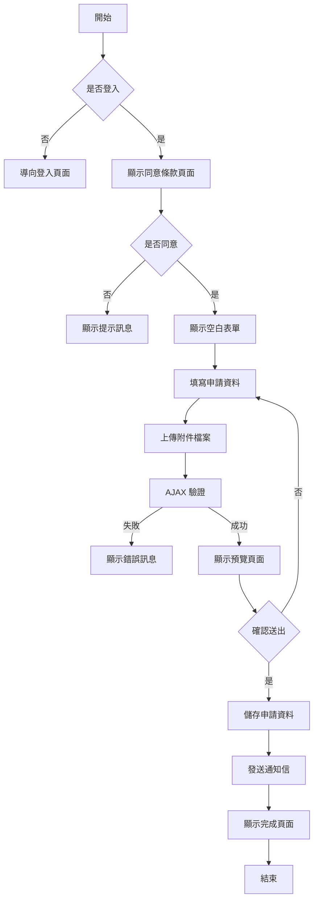
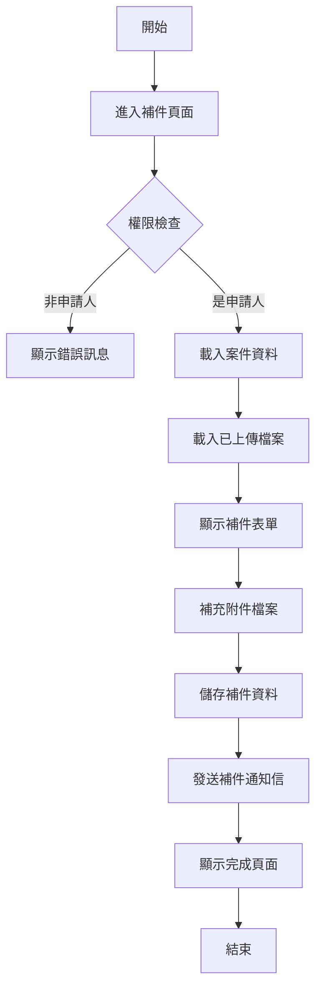
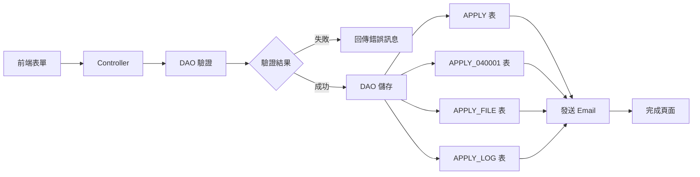
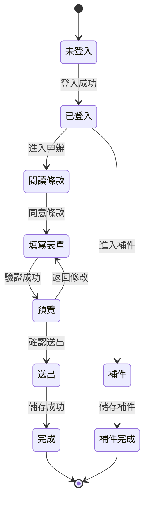

# 040001 衛生福利部訴願案件 - 完整技術文件

## 一、服務基本資訊

| 項目           | 內容                                                 |
| -------------- | ---------------------------------------------------- |
| **服務代碼**   | 040001                                               |
| **服務名稱**   | 衛生福利部訴願案件                                   |
| **業務單位**   | 法規會                                               |
| **服務類型**   | 線上申辦服務                                         |
| **服務說明**   | 提供民眾針對衛生福利部所屬機關之行政處分提出訴願申請 |
| **Controller** | `APPLY_040001Controller.cs`                          |
| **Entity**     | `APPLY_040001.cs`                                    |
| **ViewModel**  | `Apply_040001ViewModel.cs`                           |
| **主要功能**   | 訴願申請、補件、套印申請書                           |
| **特殊功能**   | 同意條款確認、Word 文件套印、多檔案上傳              |

---

## 二、服務特色比較表

| 項目           | 040001 衛生福利部訴願案件 | 其他申辦服務 |
| -------------- | ------------------------- | ------------ |
| **同意條款**   | 有（Prompt 頁面）         | 部分有       |
| **訴願人資料** | 完整（含代表人、代理人）  | 無           |
| **原處分機關** | 有                        | 無           |
| **事實與理由** | 有                        | 無           |
| **附件上傳**   | 多檔案上傳                | 部分有       |
| **套印申請書** | Word 文件套印             | 部分有       |
| **預覽功能**   | 有（PartialView）         | 部分有       |
| **補件功能**   | 有                        | 有           |

---

## 三、核心功能說明

### 3.1 訴願申請

- **功能**：提供民眾針對衛生福利部所屬機關之行政處分提出訴願申請
- **申請人資料**：姓名、出生年月日、身分證字號、通訊地址、電話、Email
- **代表人資料**：姓名、出生年月日、身分證字號、通訊地址、電話（選填）
- **代理人資料**：姓名、出生年月日、身分證字號、通訊地址、電話（選填）
- **原處分機關**：原處分機關名稱、原處分書送達或知悉日期、訴願事項、事實與理由
- **附件上傳**：支援多檔案上傳

### 3.2 同意條款確認

- **功能**：申請前需先閱讀並同意說明事項
- **Prompt 頁面**：顯示說明事項，點選同意後才能進入申辦頁面
- **參數**：`agree=1` 表示同意，其他值導向 Prompt 頁面

### 3.3 表單驗證

- **功能**：驗證申請表單資料
- **驗證項目**：必填欄位、Email 格式、身分證字號格式、日期格式
- **AJAX 驗證**：使用 AJAX 驗證，回傳 JSON 格式結果
- **DAO 驗證**：`ChkApply040001(model)` 方法進行額外驗證

### 3.4 預覽功能

- **功能**：送出前可預覽申請資料
- **PartialView**：使用 `PreView.cshtml` 顯示預覽內容
- **回傳格式**：PartialView

### 3.5 儲存申請

- **功能**：儲存申請資料並發送通知信
- **處理流程**：
  1. 產生案件編號
  2. 儲存資料至資料庫
  3. 發送通知信
  4. 導向完成頁面

### 3.6 補件功能

- **功能**：提供補件功能
- **權限檢查**：僅案件申請人可進行補件
- **補件內容**：可補充附件檔案
- **補件通知**：補件完成後發送通知信

### 3.7 套印申請書

- **功能**：套印 Word 格式申請書
- **範本檔案**：`~/Sample/apply040001.docx`
- **套印欄位**：訴願人、代表人、代理人、原處分機關、訴願事項、事實與理由、附件清單
- **下載檔名**：訴願申請書.docx

---

## 四、申請流程圖



---

## 五、補件流程圖



---

## 六、資料流程圖



---

## 七、狀態轉換圖



---

## 八、資料庫結構

### 8.1 APPLY 表（主申請表）

請參考其他服務文件的 APPLY 表結構說明。

### 8.2 APPLY_040001 表（訴願案件專屬資料）

| 欄位名稱      | 資料型別      | 說明                                       | 備註     |
| ------------- | ------------- | ------------------------------------------ | -------- |
| APP_ID        | VARCHAR(20)   | 案件編號 (PK, FK)                          |          |
| CHR_NAME      | NVARCHAR(50)  | 代表人姓名                                 | 選填     |
| CHR_BIRTH     | DATETIME      | 代表人出生年月日                           | 選填     |
| CHR_IDN       | VARCHAR(20)   | 代表人身分證明文件字號                     | 選填     |
| CHR_ADDR_CODE | VARCHAR(10)   | 代表人地址郵遞區號                         | 選填     |
| CHR_ADDR      | NVARCHAR(200) | 代表人通訊地址                             | 選填     |
| CHR_MOBILE    | VARCHAR(20)   | 代表人行動電話                             | 選填     |
| CHR_TEL       | VARCHAR(20)   | 代表人市內電話                             | 選填     |
| R_NAME        | NVARCHAR(50)  | 代理人姓名                                 | 選填     |
| R_BIRTH       | DATETIME      | 代理人出生年月日                           | 選填     |
| R_IDN         | VARCHAR(20)   | 代理人身分證明文件字號                     | 選填     |
| R_ADDR_CODE   | VARCHAR(10)   | 代理人地址郵遞區號                         | 選填     |
| R_ADDR        | NVARCHAR(200) | 代理人通訊地址                             | 選填     |
| R_MOBILE      | VARCHAR(20)   | 代理人行動電話                             | 選填     |
| R_TEL         | VARCHAR(20)   | 代理人市內電話                             | 選填     |
| ORG_NAME      | NVARCHAR(100) | 原處分機關名稱                             | Required |
| ORG_DATE      | DATETIME      | 訴願人收受或知悉原處分書送達日期           | Required |
| ORG_MEMO      | NVARCHAR(MAX) | 訴願事項（含訴願事項與原處分書發文字號等） | Required |
| ORG_FACT      | NVARCHAR(MAX) | 事實與理由                                 | Required |
| EMAIL         | VARCHAR(100)  | Email                                      | Required |
| DEL_MK        | CHAR(1)       | 刪除註記                                   | Y/N      |
| DEL_TIME      | DATETIME      | 刪除時間                                   |          |
| DEL_FUN_CD    | VARCHAR(10)   | 刪除功能代碼                               |          |
| DEL_ACC       | VARCHAR(50)   | 刪除人員帳號                               |          |
| ADD_TIME      | DATETIME      | 新增時間                                   |          |
| ADD_FUN_CD    | VARCHAR(10)   | 新增功能代碼                               |          |
| ADD_ACC       | VARCHAR(50)   | 新增人員帳號                               |          |
| UPD_TIME      | DATETIME      | 更新時間                                   |          |
| UPD_FUN_CD    | VARCHAR(10)   | 更新功能代碼                               |          |
| UPD_ACC       | VARCHAR(50)   | 更新人員帳號                               |          |

### 8.3 APPLY_FILE 表（附件檔案）

| 欄位名稱     | 資料型別     | 說明          | 備註       |
| ------------ | ------------ | ------------- | ---------- |
| APP_ID       | VARCHAR(20)  | 案件編號 (FK) |            |
| FILE_NO      | INT          | 檔案編號      | 1=附件檔案 |
| SEQ_NO       | INT          | 序號          |            |
| FILENAME     | VARCHAR(200) | 檔案路徑      |            |
| SRC_FILENAME | VARCHAR(200) | 原始檔名      |            |
| ADD_TIME     | DATETIME     | 新增時間      |            |

### 8.4 APPLY_LOG 表（異動記錄）

| 欄位名稱 | 資料型別      | 說明          | 備註                |
| -------- | ------------- | ------------- | ------------------- |
| APP_ID   | VARCHAR(20)   | 案件編號 (FK) |                     |
| SEQ_NO   | INT           | 序號          |                     |
| LOG_TYPE | VARCHAR(10)   | 異動類型      | NEW, UPDATE, APPDOC |
| LOG_TIME | DATETIME      | 異動時間      |                     |
| LOG_ACC  | VARCHAR(50)   | 異動人員帳號  |                     |
| LOG_MEMO | NVARCHAR(MAX) | 異動說明      |                     |

---

## 九、ViewModel 結構

### 9.1 Apply_040001FormModel（申請表單 Model）

**繼承**：`ApplyModel`

**主要屬性**：

| 屬性名稱         | 資料型別                       | 說明                                       | 備註     |
| ---------------- | ------------------------------ | ------------------------------------------ | -------- |
| APP_DATE         | string                         | 申請日期                                   | 唯讀     |
| EMAIL            | string                         | 訴願人 E-MAIL                              | Required |
| NAME             | string                         | 訴願人或法人名稱                           | Required |
| BIRTHDAY_STR     | string                         | 訴願人出生年月日                           |          |
| IDN              | string                         | 訴願人身分證明文件字號                     | Required |
| H_TEL            | string                         | 訴願人市內電話                             |          |
| MOBILE           | string                         | 訴願人行動電話                             |          |
| C_ZIPCODE        | string                         | 訴願人通訊地址（含郵遞區號）               | Required |
| C_ZIPCODE_TEXT   | string                         | 訴願人通訊地址                             |          |
| C_ADDR           | string                         | 訴願人通訊地址                             |          |
| CHR_NAME         | string                         | 代表人姓名                                 | 選填     |
| CHR_BIRTH_STR    | string                         | 代表人出生年月日                           | 選填     |
| CHR_IDN          | string                         | 代表人身分證明文件字號                     | 選填     |
| CHR_TEL          | string                         | 代表人市內電話                             | 選填     |
| CHR_MOBILE       | string                         | 代表人行動電話                             | 選填     |
| CHR_ZIPCODE      | string                         | 代表人通訊地址（含郵遞區號）               | 選填     |
| CHR_ZIPCODE_TEXT | string                         | 代表人通訊地址                             | 選填     |
| CHR_ADDR         | string                         | 代表人通訊地址                             | 選填     |
| R_NAME           | string                         | 代理人姓名                                 | 選填     |
| R_BIRTH_STR      | string                         | 代理人出生年月日                           | 選填     |
| R_IDN            | string                         | 代理人身分證明文件字號                     | 選填     |
| R_TEL            | string                         | 代理人市內電話                             | 選填     |
| R_MOBILE         | string                         | 代理人行動電話                             | 選填     |
| R_ZIPCODE        | string                         | 代理人通訊地址（含郵遞區號）               | 選填     |
| R_ZIPCODE_TEXT   | string                         | 代理人通訊地址                             | 選填     |
| R_ADDR           | string                         | 代理人通訊地址                             | 選填     |
| ORG_NAME         | string                         | 原處分機關名稱                             | Required |
| ORG_DATE         | string                         | 訴願人收受或知悉原處分書送達日期           | Required |
| ORG_MEMO         | string                         | 訴願事項（含訴願事項與原處分書發文字號等） | Required |
| ORG_FACT         | string                         | 事實與理由                                 | Required |
| IS_MERGE         | string                         | 是否附件合併檔案                           |          |
| SRVLIST          | IList<Apply_040001SRVLSTModel> | 附件檔案清單                               |          |

### 9.2 Apply_040001SRVLSTModel（附件檔案項目 Model）

**繼承**：`Apply_FileModel`

**主要屬性**：

| 屬性名稱    | 資料型別           | 說明     | 備註       |
| ----------- | ------------------ | -------- | ---------- |
| SEQ_NO      | string             | 序號     |            |
| FILE_1      | HttpPostedFileBase | 附件檔案 | FileUpload |
| FILE_1_TEXT | string             | 檔案名稱 | 顯示用     |
| FILE_NO     | int                | 檔案編號 | 1=附件檔案 |
| SRC_NO      | int                | 來源序號 |            |

### 9.3 Apply_040001AppDocModel（補件 Model）

**繼承**：`ApplyModel`

**主要屬性**：

與 `Apply_040001FormModel` 相同，另外包含：

| 屬性名稱 | 資料型別                       | 說明           | 備註 |
| -------- | ------------------------------ | -------------- | ---- |
| SRVLIST  | IList<Apply_040001SRVLSTModel> | 附件檔案清單   |      |
| FILE     | IList<Apply_040001FILEModel>   | 已上傳檔案清單 |      |

### 9.4 Apply_040001DoneModel（完成頁面 Model）

**主要屬性**：

| 屬性名稱 | 資料型別 | 說明     | 備註             |
| -------- | -------- | -------- | ---------------- |
| status   | string   | 狀態     | 1=新申請, 2=補件 |
| Count    | string   | 補件次數 |                  |

---

## 十、Controller 方法說明

### 10.1 Prompt() GET - 同意條款頁面

**路由**：`GET /APPLY_040001/Prompt`

**功能**：顯示同意條款頁面

**處理流程**：

1. 設定提示訊息：「請先閱讀 「衛生福利部訴願案件說明事項」點選同意後，再進入申辦頁面 !」
2. 顯示 Prompt 頁面

**回傳**：`View("Prompt")`

### 10.2 Apply() GET - 空白表單

**路由**：`GET /APPLY_040001/Apply?agree=1`

**功能**：顯示空白申請表單

**處理流程**：

1. 檢查 agree 參數，若非 "1" 則導向 Prompt 頁面
2. 建立 `Apply_040001FormModel` 實例
3. 載入會員資料（ACC_NO, NAME, ENAME, IDN, BIRTHDAY, SEX_CD, TEL, MOBILE, ADDR, MAIL）
4. 設定申請日期為當前時間（民國年）
5. 檢查登入狀態，未登入導向登入頁面

**回傳**：`View("Index", model)`

### 10.3 Apply() POST - 表單驗證

**路由**：`POST /APPLY_040001/Apply`

**功能**：AJAX 驗證表單資料

**處理流程**：

1. 執行 ModelState 驗證
2. 呼叫 `dao.ChkApply040001(model)` 進行額外驗證
3. 組成驗證結果（status, message）

**回傳格式**：

```json
{
    "status": true/false,
    "message": "錯誤訊息"
}
```

### 10.4 PreView() POST - 預覽頁面

**路由**：`POST /APPLY_040001/PreView`

**功能**：顯示預覽頁面

**處理流程**：

1. 接收表單資料
2. 顯示預覽 PartialView

**回傳**：`PartialView("PreView", model)`

### 10.5 Save(Apply_040001FormModel model) - 儲存申請

**路由**：`POST /APPLY_040001/Save`

**功能**：儲存申請資料並發送通知信

**處理流程**：

1. 產生案件編號：`dao.AppendApply040001(model)`
2. 發送通知信：`dao.SendMail_New(memberName, memberEmail, app_id, "衛生福利部訴願案件", "040001")`
3. 導向完成頁面：`Done("1")`

**回傳**：`ActionResult`

### 10.6 AppDoc(string APP_ID) - 補件頁面

**路由**：`GET /APPLY_040001/AppDoc?APP_ID=xxx`

**功能**：顯示補件表單

**處理流程**：

1. 載入案件資料（APPLY 及 APPLY_040001 表）
2. 載入已上傳檔案（APPLY_FILE 表）：`dao.GetFile_040001(APP_ID)`
3. 組成檔案清單（SRVLIST）
4. 載入郵遞區號資料（TblZIPCODE 表）
5. 組成地址資訊（訴願人、代表人、代理人）
6. 顯示補件表單

**回傳**：`View("AppDoc", model)`

### 10.7 Done(string status, string Count) - 完成頁面

**路由**：`GET /APPLY_040001/Done?status=1&Count=`

**功能**：顯示申請或補件完成訊息

**參數**：

- status：1=新申請完成, 2=補件完成
- Count：補件次數（僅補件時有值）

**回傳**：`View("Done", model)`

### 10.8 PrintDoc(string APP_ID) - 套印申請書

**路由**：`GET /APPLY_040001/PrintDoc?APP_ID=xxx`

**功能**：套印 Word 格式申請書並下載

**處理流程**：

1. 載入範本檔案：`~/Sample/apply040001.docx`
2. 載入案件資料
3. 使用 DocX 套印欄位：
   - 訴願人資料：$ANAME$, $ABIRTH$, $AIDN$, $AADDRCODE$, $AADDR$, $AMOBILE$, $ATEL$
   - 代表人資料：$CHRNAME$, $CHRBIRTH$, $CHRIDN$, $CHRADDRCODE$, $CHRADDR$, $CHRMOBILE$, $CHRTEL$
   - 代理人資料：$RNAME$, $RBIRTH$, $RIDN$, $RADDRCODE$, $RADDR$, $RMOBILE$, $RTEL$
   - 申請內容：$ORGNAME$, $ORGDATE$, $ORGMEMO$, $ORGFACT$, $FILES$
   - 申請日期：$AYEAR$, $AMONTH$, $ADAY$
4. 產生 Word 檔案並下載

**回傳**：Word 檔案（訴願申請書.docx）

---

## 十一、DAO 方法說明

### 11.1 ChkApply040001(Apply_040001FormModel model) - 驗證申請資料

**功能**：驗證申請資料

**驗證項目**：

- 必填欄位檢查
- Email 格式驗證
- 身分證字號格式驗證
- 日期格式驗證
- 附件檔案檢查

**回傳**：錯誤訊息（string），無錯誤回傳空字串

### 11.2 AppendApply040001(Apply_040001FormModel model) - 新增申請

**功能**：新增申請資料至資料庫

**處理項目**：

1. 產生案件編號：`GetApp_ID("040001")`
2. 新增 `APPLY` 表資料
3. 新增 `APPLY_040001` 表資料
4. 新增 `APPLY_FILE` 表資料（附件檔案）
5. 新增 `APPLY_LOG` 表資料（異動記錄）

**交易處理**：使用 Transaction 確保資料一致性

**回傳**：案件編號（string）

### 11.3 GetFile_040001(string APP_ID) - 取得檔案清單

**功能**：取得案件的附件檔案清單

**處理流程**：

1. 查詢 `APPLY_FILE` 表
2. 組成 `Apply_040001AppDocModel`
3. 填入 FILE 清單

**回傳**：`Apply_040001AppDocModel`

### 11.4 SendMail_New(string name, string email, string APP_ID, string SRV_NAME, string SRV_ID) - 發送新申請通知

**功能**：發送新申請確認信

**信件內容**：

- 收件人：申請人 Email
- 主旨：【衛生福利部】衛生福利部訴願案件 - 申請完成通知
- 內容：案件編號、申請時間、服務名稱、注意事項

---

## 十二、技術亮點

### 1. 同意條款機制

- 使用 Prompt 頁面顯示說明事項
- 使用 agree 參數控制是否進入申辦頁面
- 未同意時顯示提示訊息並導向 Prompt 頁面
- 提升使用者對服務內容的了解

### 2. Word 文件套印

- 使用 DocX 套印 Word 文件
- 支援多欄位套印（訴願人、代表人、代理人、申請內容）
- 自動產生申請書並下載
- 提供民眾完整的申請書格式

### 3. 多檔案上傳

- 支援多個附件檔案上傳
- 使用 `Apply_040001SRVLSTModel` 管理檔案清單
- 檔案資訊儲存於 `APPLY_FILE` 表
- 補件時可查看已上傳檔案

### 4. 三方資料管理

- 訴願人資料：必填
- 代表人資料：選填（法人或團體時填寫）
- 代理人資料：選填（委託代理人時填寫）
- 彈性的資料結構設計

### 5. 地址輸入整合郵遞區號

- 整合 `TblZIPCODE` 表查詢郵遞區號
- 自動分離縣市鄉鎮及詳細地址
- 補件時自動還原地址資訊
- 提升使用者輸入體驗

### 6. AJAX 驗證

- 使用 AJAX 驗證表單資料
- 回傳 JSON 格式結果
- 前端即時顯示錯誤訊息
- 提升使用者體驗

### 7. PartialView 預覽

- 使用 PartialView 顯示預覽內容
- 可在同一頁面切換編輯/預覽模式
- 提供更流暢的使用體驗
- 減少頁面跳轉

### 8. 完整的異動記錄

- 使用 `APPLY_LOG` 表記錄所有異動
- 記錄異動類型（NEW, UPDATE, APPDOC）
- 記錄異動時間及人員
- 便於追蹤及稽核

### 9. 民國年日期處理

- 使用 `HelperUtil.DateTimeToTwString()` 轉換民國年
- 使用 `HelperUtil.TransToTwYear()` 轉換民國年
- 套印時自動分離年月日
- 符合台灣使用習慣

### 10. 錯誤處理機制

- 使用 try-catch 捕捉例外
- 記錄錯誤訊息至 logger
- 顯示友善的錯誤訊息
- 導向適當的錯誤頁面

---

## 十三、相關檔案清單

### 13.1 Controller 層

- `ES/Controllers/APPLY_040001Controller.cs` - 前台 Controller（409 行）
- `ES/Areas/BACKMIN/Controllers/Apply_040001Controller.cs` - 後台 Controller

### 13.2 Model 層

- `ES/Models/Entities/APPLY_040001.cs` - Entity Model（105 行）
- `ES/Models/ViewModels/Apply_040001ViewModel.cs` - ViewModel（471 行）

### 13.3 DAO 層

- `ES/DataLayers/ApplyDAO.cs` - 資料存取層（包含 040001 相關方法）
- `ES/DataLayers/ShareDAO.cs` - 共用資料存取層

### 13.4 View 層

- `ES/Views/APPLY_040001/Index.cshtml` - 申請表單頁面
- `ES/Views/APPLY_040001/Prompt.cshtml` - 同意條款頁面
- `ES/Views/APPLY_040001/PreView.cshtml` - 預覽頁面（PartialView）
- `ES/Views/APPLY_040001/AppDoc.cshtml` - 補件頁面
- `ES/Views/APPLY_040001/Done.cshtml` - 完成頁面

### 13.5 範本檔案

- `ES/Sample/apply040001.docx` - Word 申請書範本

### 13.6 資料庫相關

- `APPLY` - 主申請表
- `APPLY_040001` - 服務專屬表
- `APPLY_FILE` - 附件檔案表
- `APPLY_LOG` - 異動記錄表
- `TblZIPCODE` - 郵遞區號表

---

## 十四、重要注意事項

### 1. 同意條款

- **務必先閱讀說明事項**
- 點選同意後才能進入申辦頁面
- 未同意時會顯示提示訊息
- agree 參數必須為 "1"

### 2. 訴願人資料

- 訴願人資料為必填
- 包含姓名、身分證字號、通訊地址、Email
- 出生年月日、電話為選填
- 資料需正確填寫

### 3. 代表人資料

- 代表人資料為選填
- 法人或團體時需填寫代表人資料
- 包含姓名、身分證字號、通訊地址、電話
- 出生年月日為選填

### 4. 代理人資料

- 代理人資料為選填
- 委託代理人時需填寫代理人資料
- 包含姓名、身分證字號、通訊地址、電話
- 出生年月日為選填

### 5. 原處分機關資料

- 原處分機關名稱為必填
- 原處分書送達或知悉日期為必填
- 訴願事項為必填（含訴願事項與原處分書發文字號等）
- 事實與理由為必填

### 6. 附件上傳

- 支援多個附件檔案上傳
- 檔案格式建議為 PDF
- 檔案大小有限制
- 請確保檔案清晰可辨識

### 7. 地址輸入

- 需完整填寫郵遞區號、縣市鄉鎮、詳細地址
- 使用郵遞區號查詢功能可自動帶入縣市鄉鎮
- 訴願人、代表人、代理人地址分別填寫
- 地址不完整會導致驗證失敗

### 8. Email 格式

- Email 需符合標準格式（xxx@xxx.xxx）
- Email 用於接收通知信
- 請確保 Email 正確
- Email 為必填欄位

### 9. 套印申請書

- 套印申請書功能僅供參考
- 請依實際需求調整內容
- 下載後可自行編輯
- 檔名為「訴願申請書.docx」

### 10. 補件流程

- 僅案件申請人可進行補件
- 可補充附件檔案
- 補件完成後會發送通知信
- 補件次數會記錄

---

## 十五、維護記錄

| 日期       | 版本  | 修改人員 | 修改內容                   |
| ---------- | ----- | -------- | -------------------------- |
| 2024-01-15 | 1.0.0 | 開發團隊 | 初版建立                   |
| 2024-03-20 | 1.1.0 | 開發團隊 | 新增套印申請書功能         |
| 2024-06-10 | 1.2.0 | 開發團隊 | 新增補件功能               |
| 2024-09-15 | 1.3.0 | 開發團隊 | 優化地址輸入及郵遞區號整合 |
| 2025-01-15 | 1.4.0 | 開發團隊 | 優化驗證邏輯及錯誤訊息     |

---

## 十六、相關文件連結

### 16.1 相關服務文件

- [041001 訴願決定書查詢](./041001_訴願決定書查詢_完整技術文件.md)

### 16.2 技術文件

- [ASP.NET MVC 5 開發規範](../開發規範/ASPNET_MVC5_開發規範.md)
- [Dapper ORM 使用指南](../開發規範/Dapper_使用指南.md)
- [檔案上傳處理規範](../開發規範/檔案上傳處理規範.md)
- [Email 通知服務規範](../開發規範/Email_通知服務規範.md)
- [Word 文件套印指南](../開發規範/Word_文件套印指南.md)

### 16.3 業務文件

- 訴願法
- 行政程序法
- 訴願案件處理作業手冊

---

## 十七、與其他服務的差異

### 17.1 與其他申辦服務的主要差異

| 項目           | 040001 衛生福利部訴願案件 | 其他申辦服務 |
| -------------- | ------------------------- | ------------ |
| **同意條款**   | 有（Prompt 頁面）         | 部分有       |
| **訴願人資料** | 完整（含代表人、代理人）  | 無           |
| **原處分機關** | 有                        | 無           |
| **事實與理由** | 有                        | 無           |
| **附件上傳**   | 多檔案上傳                | 部分有       |
| **套印申請書** | Word 文件套印             | 部分有       |
| **預覽功能**   | 有（PartialView）         | 部分有       |
| **補件功能**   | 有                        | 有           |

### 17.2 特殊之處

1. **同意條款機制**：申請前需先閱讀並同意說明事項
2. **三方資料管理**：訴願人、代表人、代理人資料分別管理
3. **Word 文件套印**：自動產生 Word 格式申請書
4. **多檔案上傳**：支援多個附件檔案上傳
5. **PartialView 預覽**：使用 PartialView 顯示預覽內容
6. **完整的訴願資料**：包含原處分機關、訴願事項、事實與理由

---

## 十八、常見問題 (FAQ)

### Q1: 什麼是訴願？

**A**: 訴願是指人民對於中央或地方機關之行政處分，認為違法或不當，致損害其權利或利益者，得向訴願管轄機關提起訴願。

### Q2: 誰可以提起訴願？

**A**:

- **自然人**：對行政處分不服之人民
- **法人或團體**：需填寫代表人資料
- **委託代理人**：可委託代理人代為提起訴願

### Q3: 訴願期限為何？

**A**: 訴願應自行政處分達到或公告期滿之次日起 30 日內提起。但法律另有規定者，從其規定。

### Q4: 代表人與代理人有何不同？

**A**:

- **代表人**：法人或團體的法定代表人（如董事長、理事長）
- **代理人**：受訴願人委託代為提起訴願之人

### Q5: 附件檔案需要上傳哪些？

**A**:

- 原處分書影本
- 相關證明文件
- 委任書（委託代理人時）
- 其他相關文件

### Q6: 如何套印申請書？

**A**:

1. 填寫完申請資料並送出
2. 進入歷史記錄頁面
3. 點選「套印申請書」按鈕
4. 系統自動產生 Word 檔案並下載

### Q7: 套印的申請書可以修改嗎？

**A**: 可以。下載後可使用 Word 軟體自行編輯修改。

### Q8: 補件時可以修改哪些資料？

**A**: 補件時主要是補充附件檔案，無法修改申請資料。如需修改申請資料，請重新提出申請。

### Q9: 如何確認申請是否成功？

**A**: 申請成功後會：

1. 顯示完成頁面（Done），顯示申請成功訊息
2. 發送確認信至申請人 Email
3. 產生唯一的案件編號（格式：040001YYYYMMDDNNNN）
4. 可在歷史記錄中查詢申請案件

### Q10: 訴願事項應如何填寫？

**A**: 訴願事項應包含：

- 訴願事項（簡述不服之處分內容）
- 原處分書發文字號
- 原處分書送達日期
- 其他相關資訊

---

**版本：** 1.0
**日期：** 2025-10-20
**作者：** 柏通股份有限公司
