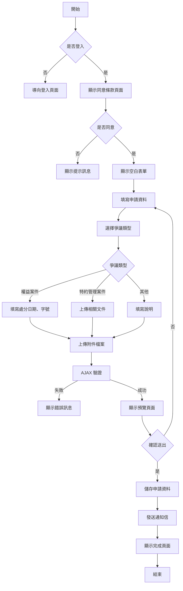
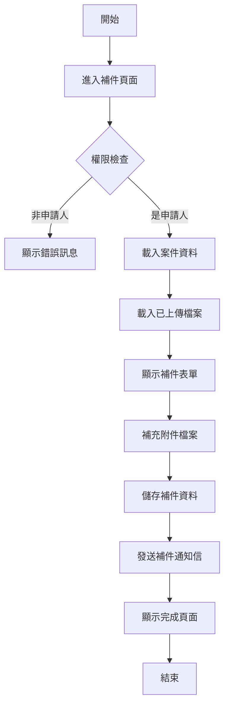
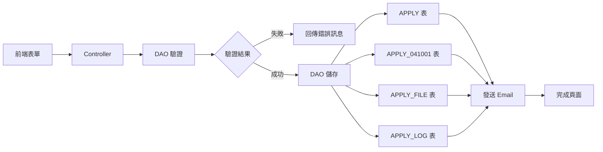
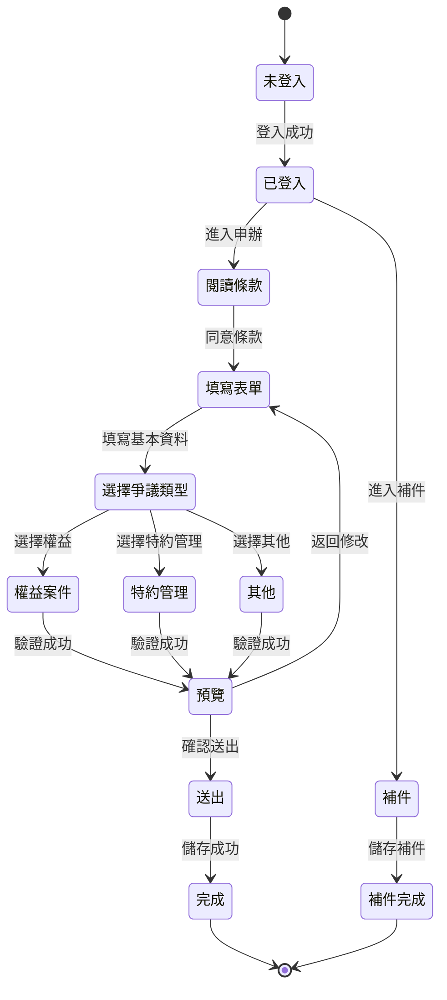

# 041001 全民健康保險爭議案件(權益案件及特約管理案件)線上申辦 - 完整技術文件

## 一、服務基本資訊

| 項目           | 內容                                                  |
| -------------- | ----------------------------------------------------- |
| **服務代碼**   | 041001                                                |
| **服務名稱**   | 全民健康保險爭議案件(權益案件及特約管理案件)線上申辦  |
| **業務單位**   | 中央健康保險署                                        |
| **服務類型**   | 線上申辦服務                                          |
| **服務說明**   | 提供民眾針對全民健康保險相關爭議案件提出申請          |
| **Controller** | `APPLY_041001Controller.cs`                           |
| **Entity**     | `APPLY_041001.cs`                                     |
| **ViewModel**  | `Apply_041001ViewModel.cs`                            |
| **主要功能**   | 爭議審議申請、補件、套印申請書                        |
| **特殊功能**   | 同意條款確認、Word 文件套印、多檔案上傳、爭議類型選擇 |

---

## 二、服務特色比較表

| 項目             | 041001 全民健康保險爭議案件 | 其他申辦服務 |
| ---------------- | --------------------------- | ------------ |
| **同意條款**     | 有（Prompt 頁面）           | 部分有       |
| **申請人資料**   | 完整（含代理人）            | 部分有       |
| **爭議類型選擇** | 有（權益、特約管理、其他）  | 無           |
| **處分書資訊**   | 有（處分日期、字號）        | 部分有       |
| **附件上傳**     | 多檔案上傳（3 種類型）      | 部分有       |
| **套印申請書**   | Word 文件套印               | 部分有       |
| **預覽功能**     | 有（PartialView）           | 部分有       |
| **補件功能**     | 有                          | 有           |

---

## 三、核心功能說明

### 3.1 爭議審議申請

- **功能**：提供民眾針對全民健康保險相關爭議案件提出申請
- **申請人資料**：姓名/法人名稱、身分證明文件字號、通訊地址、電話、Email
- **代理人資料**：姓名、身分證明文件字號、通訊地址、電話（選填）
- **爭議類型**：
  - 權益案件（需填寫處分日期、字號）
  - 特約管理案件（需上傳相關文件）
  - 其他（需填寫說明）
- **附件上傳**：支援多檔案上傳（代理人委任書、特約管理案件文件、其他附件）

### 3.2 同意條款確認

- **功能**：申請前需先閱讀並同意說明事項
- **Prompt 頁面**：顯示說明事項，點選同意後才能進入申辦頁面
- **參數**：`agree=1` 表示同意，其他值導向 Prompt 頁面

### 3.3 表單驗證

- **功能**：驗證申請表單資料
- **驗證項目**：必填欄位、Email 格式、身分證字號格式、日期格式、爭議類型選擇
- **AJAX 驗證**：使用 AJAX 驗證，回傳 JSON 格式結果
- **DAO 驗證**：`ChkApply041001(model)` 方法進行額外驗證

### 3.4 預覽功能

- **功能**：送出前可預覽申請資料
- **PartialView**：使用 `PreView.cshtml` 顯示預覽內容
- **回傳格式**：PartialView

### 3.5 儲存申請

- **功能**：儲存申請資料並發送通知信
- **處理流程**：
  1. 產生案件編號
  2. 儲存資料至資料庫
  3. 發送通知信
  4. 導向完成頁面

### 3.6 補件功能

- **功能**：提供補件功能
- **權限檢查**：僅案件申請人可進行補件
- **補件內容**：可補充附件檔案
- **補件通知**：補件完成後發送通知信

### 3.7 套印申請書

- **功能**：套印 Word 格式申請書
- **範本檔案**：`~/Sample/apply041001.docx`
- **套印欄位**：申請人、代理人、爭議類型、處分資訊、事實與理由、附件清單
- **下載檔名**：全民健康保險爭議審議申請書.docx

---

## 四、申請流程圖

---

## 五、補件流程圖

---

## 六、資料流程圖

---

## 七、狀態轉換圖

---

## 八、資料庫結構

### 8.1 APPLY 表（主申請表）

請參考其他服務文件的 APPLY 表結構說明。

### 8.2 APPLY_041001 表（全民健康保險爭議案件專屬資料）

| 欄位名稱    | 資料型別      | 說明                                                   | 備註           |
| ----------- | ------------- | ------------------------------------------------------ | -------------- |
| APP_ID      | VARCHAR(20)   | 案件編號 (PK, FK)                                      |                |
| EMAIL       | VARCHAR(100)  | Email                                                  | Required       |
| R_NAME      | NVARCHAR(50)  | 代理人姓名（或法人名稱）                               | 選填           |
| R_IDN       | VARCHAR(20)   | 代理人身分證明文件字號（或統一編號、醫事服務機構代號） | 選填           |
| R_ADDR_CODE | VARCHAR(10)   | 代理人地址郵遞區號                                     | 選填           |
| R_ADDR      | NVARCHAR(200) | 代理人通訊地址                                         | 選填           |
| R_MOBILE    | VARCHAR(20)   | 代理人行動電話                                         | 選填           |
| R_TEL       | VARCHAR(20)   | 代理人市內電話                                         | 選填           |
| LIC_DATE    | DATETIME      | 處分日期                                               | 權益案件時填寫 |
| LIC_CD      | VARCHAR(20)   | 處分字號（字）                                         | 權益案件時填寫 |
| LIC_NUM     | VARCHAR(50)   | 處分字號（號）                                         | 權益案件時填寫 |
| KIND1       | VARCHAR(1)    | 爭議類型（權益案件）                                   | Y/N            |
| KIND2       | VARCHAR(1)    | 爭議類型（特約管理案件）                               | Y/N            |
| KIND3       | VARCHAR(1)    | 爭議類型（其他）                                       | Y/N            |
| KNOW_DATE   | DATETIME      | 收受或知悉日期                                         | Required       |
| KNOW_MEMO   | NVARCHAR(MAX) | 事項及字號                                             | Required       |
| KNOW_FACT   | NVARCHAR(MAX) | 事實與理由（或申請人所持理由，並請詳述）               | Required       |
| DEL_MK      | CHAR(1)       | 刪除註記                                               | Y/N            |
| DEL_TIME    | DATETIME      | 刪除時間                                               |                |
| DEL_FUN_CD  | VARCHAR(10)   | 刪除功能代碼                                           |                |
| DEL_ACC     | VARCHAR(50)   | 刪除人員帳號                                           |                |
| ADD_TIME    | DATETIME      | 新增時間                                               |                |
| ADD_FUN_CD  | VARCHAR(10)   | 新增功能代碼                                           |                |
| ADD_ACC     | VARCHAR(50)   | 新增人員帳號                                           |                |
| UPD_TIME    | DATETIME      | 更新時間                                               |                |
| UPD_FUN_CD  | VARCHAR(10)   | 更新功能代碼                                           |                |
| UPD_ACC     | VARCHAR(50)   | 更新人員帳號                                           |                |

### 8.3 APPLY_FILE 表（附件檔案）

| 欄位名稱     | 資料型別     | 說明          | 備註                                       |
| ------------ | ------------ | ------------- | ------------------------------------------ |
| APP_ID       | VARCHAR(20)  | 案件編號 (FK) |                                            |
| FILE_NO      | INT          | 檔案編號      | 1=代理人委任書, 2=特約管理案件文件, 3=其他 |
| SEQ_NO       | INT          | 序號          |                                            |
| FILENAME     | VARCHAR(200) | 檔案路徑      |                                            |
| SRC_FILENAME | VARCHAR(200) | 原始檔名      |                                            |
| ADD_TIME     | DATETIME     | 新增時間      |                                            |

### 8.4 APPLY_LOG 表（異動記錄）

| 欄位名稱 | 資料型別      | 說明          | 備註                |
| -------- | ------------- | ------------- | ------------------- |
| APP_ID   | VARCHAR(20)   | 案件編號 (FK) |                     |
| SEQ_NO   | INT           | 序號          |                     |
| LOG_TYPE | VARCHAR(10)   | 異動類型      | NEW, UPDATE, APPDOC |
| LOG_TIME | DATETIME      | 異動時間      |                     |
| LOG_ACC  | VARCHAR(50)   | 異動人員帳號  |                     |
| LOG_MEMO | NVARCHAR(MAX) | 異動說明      |                     |

---

## 九、ViewModel 結構

### 9.1 Apply_041001FormModel（申請表單 Model）

**繼承**：`ApplyModel`

**主要屬性**：

| 屬性名稱       | 資料型別                       | 說明                                                   | 備註           |
| -------------- | ------------------------------ | ------------------------------------------------------ | -------------- |
| APP_DATE       | string                         | 申請日期                                               | 唯讀           |
| EMAIL          | string                         | 申請人 E-MAIL                                          | Required       |
| NAME           | string                         | 申請人姓名/法人名稱                                    | Required       |
| IDN            | string                         | 申請人身分證明文件字號（或統一編號、醫事服務機構代號） | Required       |
| H_TEL          | string                         | 申請人市內電話                                         |                |
| MOBILE         | string                         | 申請人行動電話                                         |                |
| C_ZIPCODE      | string                         | 申請人地址（含郵遞區號）                               | Required       |
| C_ZIPCODE_TEXT | string                         | 申請人地址                                             |                |
| C_ADDR         | string                         | 申請人地址                                             |                |
| R_NAME         | string                         | 代理人姓名（或法人名稱）                               | 選填           |
| R_IDN          | string                         | 代理人身分證明文件字號                                 | 選填           |
| R_TEL          | string                         | 代理人市內電話                                         | 選填           |
| R_MOBILE       | string                         | 代理人行動電話                                         | 選填           |
| R_ZIPCODE      | string                         | 代理人地址（含郵遞區號）                               | 選填           |
| R_ZIPCODE_TEXT | string                         | 代理人地址                                             | 選填           |
| R_ADDR         | string                         | 代理人地址                                             | 選填           |
| KIND1          | string                         | 爭議類型（權益案件）                                   | Y/N            |
| KIND1_CHK      | bool                           | 爭議類型（權益案件）勾選狀態                           |                |
| LIC_DATE       | DateTime?                      | 處分日期                                               | 權益案件時填寫 |
| LIC_DATE_STR   | string                         | 處分日期（字串）                                       | 權益案件時填寫 |
| LIC_CD         | string                         | 處分字號（字）                                         | 權益案件時填寫 |
| LIC_NUM        | string                         | 處分字號（號）                                         | 權益案件時填寫 |
| KIND2          | string                         | 爭議類型（特約管理案件）                               | Y/N            |
| KIND2_CHK      | bool                           | 爭議類型（特約管理案件）勾選狀態                       |                |
| KIND3          | string                         | 爭議類型（其他）                                       | Y/N            |
| KIND3_CHK      | bool                           | 爭議類型（其他）勾選狀態                               |                |
| KNOW_DATE      | DateTime?                      | 收受或知悉日期                                         | Required       |
| KNOW_DATE_STR  | string                         | 收受或知悉日期（字串）                                 | Required       |
| KNOW_MEMO      | string                         | 事項及字號                                             | Required       |
| KNOW_FACT      | string                         | 事實與理由（或申請人所持理由，並請詳述）               | Required       |
| IS_MERGE       | string                         | 是否附件合併檔案                                       |                |
| FILE_1         | HttpPostedFileBase             | 代理人委任書                                           | FileUpload     |
| FILE_1_TEXT    | string                         | 代理人委任書檔名                                       | 顯示用         |
| FILE_2         | HttpPostedFileBase             | 爭議類型（特約管理案件）文件                           | FileUpload     |
| FILE_2_TEXT    | string                         | 爭議類型（特約管理案件）文件檔名                       | 顯示用         |
| SRVLIST        | IList<Apply_041001SRVLSTModel> | 附件檔案清單（其他）                                   |                |

### 9.2 Apply_041001SRVLSTModel（附件清單 Model）

**繼承**：`Apply_FileModel`

**主要屬性**：

| 屬性名稱    | 資料型別           | 說明     | 備註       |
| ----------- | ------------------ | -------- | ---------- |
| SEQ_NO      | string             | 序號     |            |
| FILE_3      | HttpPostedFileBase | 附件檔案 | FileUpload |
| FILE_3_TEXT | string             | 附件檔名 | 顯示用     |

### 9.3 Apply_041001DoneModel（完成頁面 Model）

**主要屬性**：

| 屬性名稱 | 資料型別 | 說明     | 備註           |
| -------- | -------- | -------- | -------------- |
| status   | string   | 狀態     | 1=新增, 2=補件 |
| Count    | string   | 補件數量 | 補件時使用     |

### 9.4 Apply_041001AppDocModel（補件 Model）

**繼承**：`ApplyModel`

**主要屬性**：與 `Apply_041001FormModel` 相同，另外增加：

| 屬性名稱 | 資料型別                     | 說明           | 備註 |
| -------- | ---------------------------- | -------------- | ---- |
| FILE     | IList<Apply_041001FILEModel> | 已上傳檔案清單 |      |

---

## 十、Controller 方法說明

### 10.1 Prompt() - GET

**功能**：顯示同意條款頁面

**參數**：無

**回傳**：`View("Prompt")`

**處理流程**：

1. 取得 SessionModel
2. 設定提示訊息：「請先閱讀 「{服務名稱}說明事項」點選同意後，再進入申辦頁面 !」
3. 回傳 Prompt 頁面

**程式碼位置**：`APPLY_041001Controller.cs` Line 29-35

---

### 10.2 Apply() - GET

**功能**：顯示空白表單畫面

**參數**：

- `agree` (string): 是否同意條款（1=同意, 其他=不同意）

**回傳**：`View("Index", model)` 或 `Prompt()` 或 `RedirectToAction("Index", "Login")`

**處理流程**：

1. 檢查是否登入，未登入導向登入頁面
2. 建立空白 `Apply_041001FormModel`
3. 從 Session 取得會員資料，帶入預設值：
   - 帳號 (ACC_NO)
   - 電話 (H_TEL, TEL, MOBILE)
   - 地址 (C_ZIPCODE, C_ADDR)
   - 姓名 (NAME, ENAME)
   - Email (EMAIL)
   - 身分證字號 (IDN)
   - 生日 (BIRTHDAY)
   - 性別 (SEX_CD)
   - 申請日期 (APP_DATE) - 使用 `HelperUtil.DateTimeToTwString(DateTime.Now)` 轉換為民國年
4. 檢查 `agree` 參數，若不等於 "1" 則導向 Prompt 頁面
5. 回傳 Index 頁面

**程式碼位置**：`APPLY_041001Controller.cs` Line 41-80

---

### 10.3 Apply() - POST

**功能**：驗證表單資料

**參數**：

- `model` (Apply_041001FormModel): 申請表單資料

**回傳**：JSON 格式驗證結果

**處理流程**：

1. 建立 `AjaxResultStruct` 物件
2. 呼叫 `ApplyDAO.ChkApply041001(model)` 進行驗證
3. 檢查 `ModelState.IsValid`
4. 若驗證成功，回傳 `{ status: true, message: "" }`
5. 若驗證失敗，回傳 `{ status: false, message: "錯誤訊息" }`
6. 回傳 JSON 格式結果

**程式碼位置**：`APPLY_041001Controller.cs` Line 89-122

---

### 10.4 PreView() - POST

**功能**：顯示預覽頁面

**參數**：

- `model` (Apply_041001FormModel): 申請表單資料

**回傳**：`PartialView("PreView", model)`

**處理流程**：

1. 接收表單資料
2. 回傳 PreView PartialView

**程式碼位置**：`APPLY_041001Controller.cs` Line 130-134

---

### 10.5 Save() - POST

**功能**：儲存申請資料

**參數**：

- `model` (Apply_041001FormModel): 申請表單資料

**回傳**：`Done("1")`

**處理流程**：

1. 取得 SessionModel
2. 取得會員姓名和 Email（若表單未填寫則使用 Session 資料）
3. 呼叫 `ApplyDAO.AppendApply041001(model)` 儲存資料，取得案件編號
4. 呼叫 `ApplyDAO.SendMail_New()` 發送通知信
5. 導向完成頁面 `Done("1")`

**程式碼位置**：`APPLY_041001Controller.cs` Line 142-156

---

### 10.6 AppDoc() - GET

**功能**：顯示補件頁面

**參數**：

- `APP_ID` (string): 案件編號

**回傳**：`View("AppDoc", model)` 或 `RedirectToAction("Index", "History")`

**處理流程**：

1. 建立 `Apply_041001AppDocModel`
2. 從資料庫取得案件資料（APPLY_041001 表）
3. 從資料庫取得申請資料（APPLY 表）
4. 呼叫 `ApplyDAO.GetFile_041001(APP_ID)` 取得已上傳檔案清單
5. 將檔案清單轉換為 `Apply_041001SRVLSTModel` 清單
6. 使用 `InjectFrom` 將資料注入 Model
7. 處理地址資料：
   - 申請人通訊地址：從 TblZIPCODE 取得縣市鄉鎮名稱
   - 代理人通訊地址：從 TblZIPCODE 取得縣市鄉鎮名稱
8. 處理爭議類型資料：
   - KIND1_CHK: 權益案件勾選狀態
   - KIND2_CHK: 特約管理案件勾選狀態
   - KIND3_CHK: 其他勾選狀態
9. 處理日期資料：
   - LIC_DATE_STR: 處分日期（使用 `HelperUtil.DateTimeToString` 轉換）
   - KNOW_DATE_STR: 收受或知悉日期（使用 `HelperUtil.DateTimeToString` 轉換）
10. 回傳 AppDoc 頁面
11. 若發生錯誤，記錄 Log 並導向歷史記錄頁面

**程式碼位置**：`APPLY_041001Controller.cs` Line 167-246

---

### 10.7 Done() - GET

**功能**：顯示完成頁面

**參數**：

- `status` (string): 狀態（1=新增, 2=補件）
- `Count` (string): 補件數量（選填）

**回傳**：`View("Done", model)`

**處理流程**：

1. 建立 `Apply_041001DoneModel`
2. 設定 status 和 Count
3. 回傳 Done 頁面

**程式碼位置**：`APPLY_041001Controller.cs` Line 253-261

---

### 10.8 PrintDoc() - GET

**功能**：套印 Word 格式申請書

**參數**：

- `APP_ID` (string): 案件編號

**回傳**：Word 文件下載

**處理流程**：

1. 取得範本檔案路徑：`~/Sample/apply041001.docx`
2. 從資料庫取得案件資料（APPLY_041001 表）
3. 從資料庫取得申請資料（APPLY 表）
4. 呼叫 `ApplyDAO.GetFile_041001ForDoc(APP_ID)` 取得檔案清單
5. 組合附件檔名清單（以逗號分隔）
6. 處理地址資料（同 AppDoc 方法）
7. 處理日期資料（使用 `HelperUtil.TransToTwYear` 轉換為民國年）
8. 使用 DocX 套印 Word 文件：
   - **申請人資料**：
     - `$ANAME$`: 申請人姓名
     - `$AIDN$`: 申請人身分證字號
     - `$AADDRCODE$`: 申請人地址郵遞區號 + 縣市鄉鎮
     - `$AADDR$`: 申請人地址
     - `$AMOBILE$`: 申請人行動電話
     - `$ATEL$`: 申請人市內電話
   - **代理人資料**：
     - `$RNAME$`: 代理人姓名
     - `$RIDN$`: 代理人身分證字號
     - `$RADDRCODE$`: 代理人地址郵遞區號 + 縣市鄉鎮
     - `$RADDR$`: 代理人地址
     - `$RMOBILE$`: 代理人行動電話
     - `$RTEL$`: 代理人市內電話
   - **爭議類型**：
     - `$KIND1$`: 權益案件（█ 或 □）
     - `$LYEAR$`: 處分日期（年）
     - `$LMONTH$`: 處分日期（月）
     - `$LDAY$`: 處分日期（日）
     - `$LICCD$`: 處分字號（字）
     - `$LICNUM$`: 處分字號（號）
     - `$KIND2$`: 特約管理案件（█ 或 □）
     - `$KIND3$`: 其他（█ 或 □）
   - **爭議內容**：
     - `$KYEAR$`: 收受或知悉日期（年）
     - `$KMONTH$`: 收受或知悉日期（月）
     - `$KDAY$`: 收受或知悉日期（日）
     - `$KNOWMEMO$`: 事項及字號
     - `$KNOWFACT$`: 事實與理由
   - **附件清單**：
     - `$FILES$`: 附件檔名清單（以逗號分隔）
   - **申請日期**：
     - `$AYEAR$`: 申請日期（年）
     - `$AMONTH$`: 申請日期（月）
     - `$ADAY$`: 申請日期（日）
9. 儲存為 MemoryStream
10. 設定 Response Header：
    - ContentType: `Application/msword`
    - Content-Disposition: `attachment; filename=全民健康保險爭議審議申請書.docx`
11. 輸出檔案

**程式碼位置**：`APPLY_041001Controller.cs` Line 269-420

---

## 十一、DAO 方法說明

### 11.1 ChkApply041001(model)

**功能**：驗證申請表單資料

**參數**：

- `model` (Apply_041001FormModel): 申請表單資料

**回傳**：錯誤訊息（string），若無錯誤則回傳空字串

**驗證項目**：

1. 必填欄位檢查
2. Email 格式檢查
3. 身分證字號格式檢查（使用 `CheckUtils.IsIdentity()`）
4. 日期格式檢查
5. 爭議類型至少選擇一項
6. 權益案件時，處分日期、字號必填
7. 特約管理案件時，相關文件必填
8. 其他業務邏輯驗證

---

### 11.2 AppendApply041001(model)

**功能**：新增申請資料

**參數**：

- `model` (Apply_041001FormModel): 申請表單資料

**回傳**：案件編號（string）

**處理流程**：

1. 產生案件編號（使用 `GetNewAppID()` 方法）
2. 新增資料至 APPLY 表
3. 新增資料至 APPLY_041001 表
4. 新增附件檔案至 APPLY_FILE 表
5. 新增異動記錄至 APPLY_LOG 表
6. 回傳案件編號

---

### 11.3 GetFile_041001(APP_ID)

**功能**：取得案件附件檔案清單（補件用）

**參數**：

- `APP_ID` (string): 案件編號

**回傳**：`Apply_041001AppDocModel`（包含檔案清單）

**處理流程**：

1. 從 APPLY_FILE 表取得檔案清單
2. 轉換為 `Apply_041001FILEModel` 清單
3. 回傳 Model

---

### 11.4 GetFile_041001ForDoc(APP_ID)

**功能**：取得案件附件檔案清單（套印用）

**參數**：

- `APP_ID` (string): 案件編號

**回傳**：`Apply_041001AppDocModel`（包含檔案清單）

**處理流程**：

1. 從 APPLY_FILE 表取得檔案清單
2. 轉換為 `Apply_041001FILEModel` 清單
3. 回傳 Model

---

### 11.5 SendMail_New(memberName, memberEmail, app_id, s_SRV_NAME, s_SRV_ID)

**功能**：發送申請通知信

**參數**：

- `memberName` (string): 會員姓名
- `memberEmail` (string): 會員 Email
- `app_id` (string): 案件編號
- `s_SRV_NAME` (string): 服務名稱
- `s_SRV_ID` (string): 服務代碼

**回傳**：無

**處理流程**：

1. 組合 Email 內容
2. 發送 Email

---

## 十二、技術亮點

### 1. 同意條款機制

- **Prompt 頁面**：申請前需先閱讀並同意說明事項
- **參數驗證**：`agree=1` 表示同意，其他值導向 Prompt 頁面
- **使用者體驗**：確保使用者了解申請流程和注意事項

### 2. Word 文件套印

- **DocX 函式庫**：使用 Xceed.Words.NET 進行 Word 文件套印
- **範本檔案**：`~/Sample/apply041001.docx`
- **動態欄位替換**：使用 `$變數名$` 格式進行欄位替換
- **條件顯示**：根據爭議類型顯示不同內容（█ 或 □）
- **日期格式轉換**：使用 `HelperUtil.TransToTwYear` 轉換為民國年格式

### 3. 爭議類型選擇

- **多選機制**：支援同時選擇多種爭議類型
- **條件欄位**：根據選擇的爭議類型顯示不同欄位
- **權益案件**：需填寫處分日期、字號
- **特約管理案件**：需上傳相關文件
- **其他**：需填寫說明

### 4. 代理人資料管理

- **選填機制**：代理人資料為選填
- **完整資料**：姓名、身分證字號、通訊地址、電話
- **地址整合**：與 TblZIPCODE 整合，自動帶入縣市鄉鎮名稱
- **套印支援**：代理人資料可套印至 Word 文件

### 5. 多檔案上傳

- **三種檔案類型**：
  - FILE_1: 代理人委任書
  - FILE_2: 特約管理案件文件
  - FILE_3: 其他附件（可多筆）
- **檔案限制**：每個檔案最大 5MB
- **支援格式**：PDF, JPG, JPEG, BMP, PNG, GIF, TIF
- **檔案清單**：使用 `IList<Apply_041001SRVLSTModel>` 管理多筆附件

### 6. AJAX 表單驗證

- **即時驗證**：使用 AJAX 進行表單驗證
- **JSON 回傳**：回傳 `{ status: true/false, message: "錯誤訊息" }`
- **使用者體驗**：不需重新載入頁面即可顯示驗證結果

### 7. 預覽功能

- **PartialView**：使用 `PreView.cshtml` 顯示預覽內容
- **資料確認**：送出前可預覽申請資料
- **返回修改**：可返回表單進行修改

### 8. 地址整合

- **TblZIPCODE 整合**：與郵遞區號表整合
- **自動帶入**：根據郵遞區號自動帶入縣市鄉鎮名稱
- **雙地址支援**：申請人地址、代理人地址

### 9. 民國年轉換

- **HelperUtil.DateTimeToTwString**：將 DateTime 轉換為民國年字串（申請日期）
- **HelperUtil.TransToTwYear**：將 DateTime 轉換為民國年字串（套印用）
- **HelperUtil.DateTimeToString**：將 DateTime 轉換為字串（補件用）
- **日期格式**：`YYY/MM/DD`（民國年/月/日）

### 10. 補件功能

- **權限檢查**：僅案件申請人可進行補件
- **檔案清單**：顯示已上傳檔案清單
- **補充附件**：可補充附件檔案
- **補件通知**：補件完成後發送通知信

---

## 十三、相關檔案清單

### Controller

- `APPLY_041001Controller.cs` (424 lines)

### Entity

- `APPLY_041001.cs` (91 lines)

### ViewModel

- `Apply_041001ViewModel.cs` (511 lines)
  - `Apply_041001FormModel`
  - `Apply_041001SRVLSTModel`
  - `Apply_041001DoneModel`
  - `Apply_041001AppDocModel`
  - `Apply_041001FILEModel`

### View

- `Index.cshtml` - 申請表單頁面
- `Prompt.cshtml` - 同意條款頁面
- `PreView.cshtml` - 預覽頁面
- `AppDoc.cshtml` - 補件頁面
- `Done.cshtml` - 完成頁面

### DAO

- `ApplyDAO.cs`
  - `ChkApply041001(model)`
  - `AppendApply041001(model)`
  - `GetFile_041001(APP_ID)`
  - `GetFile_041001ForDoc(APP_ID)`
  - `SendMail_New(...)`

### 範本檔案

- `~/Sample/apply041001.docx` - Word 申請書範本

---

## 十四、重要注意事項

### 1. 同意條款必須確認

- 申請前必須先閱讀並同意說明事項
- `agree` 參數必須等於 "1" 才能進入申辦頁面
- 若未同意，導向 Prompt 頁面

### 2. 爭議類型至少選擇一項

- KIND1（權益案件）、KIND2（特約管理案件）、KIND3（其他）至少選擇一項
- 選擇權益案件時，處分日期、字號為必填
- 選擇特約管理案件時，相關文件為必填

### 3. 代理人資料為選填

- 代理人資料為選填，若填寫則需完整填寫
- 代理人姓名、身分證字號、通訊地址、電話
- 若有代理人，需上傳代理人委任書（FILE_1）

### 4. 附件檔案限制

- 每個檔案最大 5MB
- 支援格式：PDF, JPG, JPEG, BMP, PNG, GIF, TIF
- FILE_1: 代理人委任書（選填）
- FILE_2: 特約管理案件文件（選填）
- FILE_3: 其他附件（可多筆，選填）

### 5. 日期格式

- 申請日期：自動帶入當天日期（民國年格式）
- 處分日期：權益案件時填寫（民國年格式）
- 收受或知悉日期：必填（民國年格式）

### 6. Email 通知

- 申請完成後發送通知信
- Email 內容包含案件編號、服務名稱
- 使用 `ApplyDAO.SendMail_New()` 方法發送

### 7. 補件權限

- 僅案件申請人可進行補件
- 補件時可補充附件檔案
- 補件完成後發送通知信

### 8. Word 文件套印

- 範本檔案：`~/Sample/apply041001.docx`
- 使用 DocX 函式庫進行套印
- 下載檔名：全民健康保險爭議審議申請書.docx

### 9. 地址資料

- 申請人地址、代理人地址需填寫郵遞區號
- 系統自動從 TblZIPCODE 取得縣市鄉鎮名稱
- 套印時顯示完整地址（郵遞區號 + 縣市鄉鎮 + 地址）

### 10. 身分證字號驗證

- 使用 `CheckUtils.IsIdentity()` 驗證身分證字號格式
- 申請人身分證字號為必填
- 代理人身分證字號為選填（若填寫代理人資料則必填）

---

## 十五、維護記錄

| 日期       | 版本  | 修改人員 | 修改內容         |
| ---------- | ----- | -------- | ---------------- |
| 2025-10-15 | 1.0.0 | AI       | 建立完整技術文件 |

---

## 十六、相關文件連結

- [040001 衛生福利部訴願案件 技術文件](./040001_衛生福利部訴願案件_完整技術文件.md)
- [011005 社工師執業執照相關申請 技術文件](./011005_社工師執業執照相關申請_完整技術文件.md)
- [012001 國民年金相關申請 技術文件](./012001_國民年金相關申請_完整技術文件.md)

---

## 十七、與其他服務的差異分析

### 17.1 與 040001（衛生福利部訴願案件）的差異

| 項目           | 041001 全民健康保險爭議案件              | 040001 衛生福利部訴願案件  |
| -------------- | ---------------------------------------- | -------------------------- |
| **業務單位**   | 中央健康保險署                           | 衛生福利部                 |
| **爭議類型**   | 權益案件、特約管理案件、其他             | 訴願案件                   |
| **處分資訊**   | 處分日期、字號（權益案件時填寫）         | 原處分機關、處分日期、字號 |
| **代理人資料** | 選填                                     | 選填                       |
| **附件類型**   | 代理人委任書、特約管理案件文件、其他附件 | 訴願書、原處分書、其他附件 |
| **套印檔名**   | 全民健康保險爭議審議申請書.docx          | 訴願書.docx                |

### 17.2 與 011005（社工師執業執照相關申請）的差異

| 項目           | 041001 全民健康保險爭議案件  | 011005 社工師執業執照相關申請 |
| -------------- | ---------------------------- | ----------------------------- |
| **業務單位**   | 中央健康保險署               | 社會及家庭署                  |
| **申請類型**   | 爭議審議申請                 | 執業執照申請                  |
| **同意條款**   | 有（Prompt 頁面）            | 無                            |
| **代理人資料** | 有                           | 無                            |
| **爭議類型**   | 權益案件、特約管理案件、其他 | 無                            |
| **套印功能**   | 有（Word 文件）              | 無                            |

### 17.3 與 012001（國民年金相關申請）的差異

| 項目           | 041001 全民健康保險爭議案件  | 012001 國民年金相關申請 |
| -------------- | ---------------------------- | ----------------------- |
| **業務單位**   | 中央健康保險署               | 社會保險司              |
| **申請模式**   | 單一模式                     | 雙模式（本人/代理）     |
| **代理人類型** | 單一類型                     | 雙類型（自然人/法人）   |
| **爭議類型**   | 權益案件、特約管理案件、其他 | 無                      |
| **套印功能**   | 有（Word 文件）              | 無                      |

---

## 十八、常見問題 FAQ

### Q1: 申請前是否需要先閱讀說明事項？

**A**: 是的，申請前必須先閱讀並同意說明事項。系統會顯示 Prompt 頁面，點選同意後才能進入申辦頁面。

---

### Q2: 爭議類型可以同時選擇多項嗎？

**A**: 可以。系統支援同時選擇多種爭議類型（權益案件、特約管理案件、其他），但至少需選擇一項。

---

### Q3: 選擇權益案件時需要填寫哪些資料？

**A**: 選擇權益案件時，需填寫處分日期、處分字號（字）、處分字號（號）。

---

### Q4: 代理人資料是否為必填？

**A**: 代理人資料為選填。若填寫代理人資料，則需完整填寫姓名、身分證字號、通訊地址、電話，並上傳代理人委任書。

---

### Q5: 附件檔案有哪些限制？

**A**: 每個檔案最大 5MB，支援格式：PDF, JPG, JPEG, BMP, PNG, GIF, TIF。

---

### Q6: 可以上傳多少個附件檔案？

**A**: 系統支援三種檔案類型：

- FILE_1: 代理人委任書（1 個）
- FILE_2: 特約管理案件文件（1 個）
- FILE_3: 其他附件（可多筆）

---

### Q7: 申請完成後會收到通知信嗎？

**A**: 是的，申請完成後系統會自動發送通知信至申請人 Email，內容包含案件編號、服務名稱。

---

### Q8: 如何套印申請書？

**A**: 在歷史記錄頁面點選「套印申請書」按鈕，系統會自動產生 Word 格式申請書並下載。

---

### Q9: 補件時可以補充哪些資料？

**A**: 補件時可以補充附件檔案，包含代理人委任書、特約管理案件文件、其他附件。

---

### Q10: 日期格式為何？

**A**: 系統使用民國年格式，格式為 `YYY/MM/DD`（例如：114/10/15）。

---

**版本：** 1.0
**日期：** 2025-10-20
**作者：** 柏通股份有限公司
