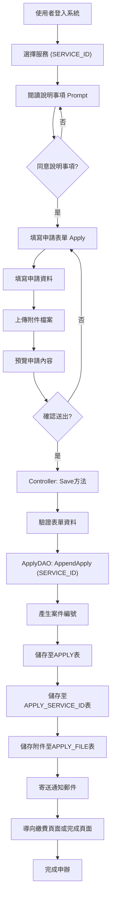
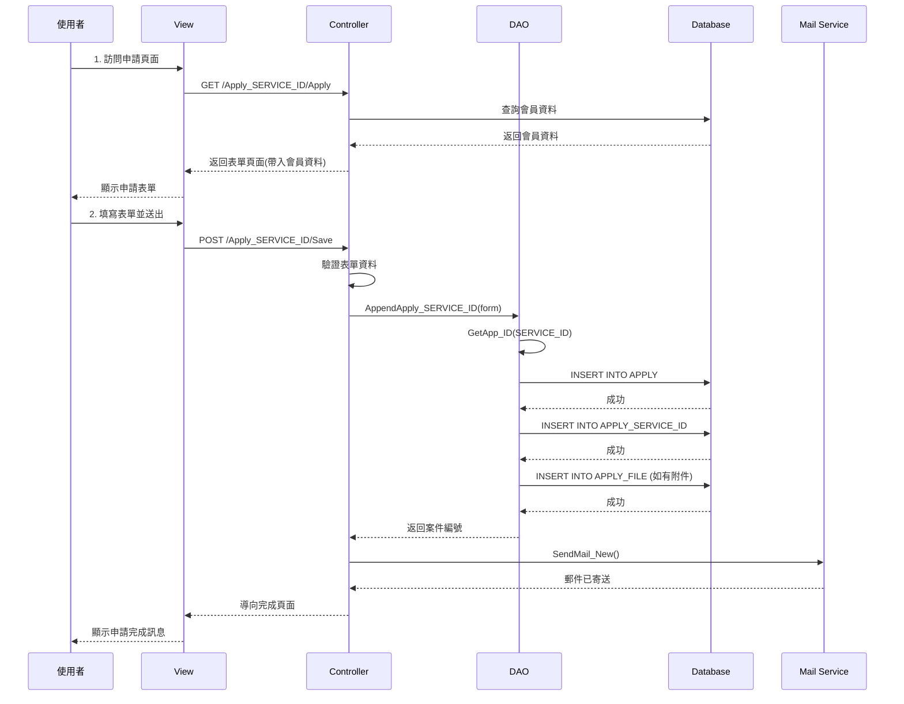

# {SERVICE_ID} - {SERVICE_NAME}

## 服務概述

### 服務基本資訊

| 項目       | 內容           |
| ---------- | -------------- |
| 服務代碼   | {SERVICE_ID}   |
| 服務名稱   | {SERVICE_NAME} |
| 業務單位   | {UNIT_NAME}    |
| 是否需繳費 | {NEED_PAY}     |
| 處理期限   | 依規定辦理     |
| 申請對象   | {TARGET_USER}  |

### 服務說明

{SERVICE_DESCRIPTION}

## 全端處理流程架構圖



## 前端實作

### 1. 路由設定

**URL 路徑**: `/Apply_{SERVICE_ID}/{action}`

**主要路由**:

- `GET /Apply_{SERVICE_ID}/Prompt` - 說明事項頁面
- `GET /Apply_{SERVICE_ID}/Apply` - 申請表單頁面
- `POST /Apply_{SERVICE_ID}/Save` - 儲存申請資料
- `GET /Apply_{SERVICE_ID}/Preview` - 預覽頁面
- `GET /Apply_{SERVICE_ID}/Done` - 完成頁面

### 2. Controller 實作

**檔案位置**: `ES/Controllers/Apply_{SERVICE_ID}Controller.cs`

```csharp
public class Apply_{SERVICE_ID}Controller : BaseController
{
    public static string s_SRV_ID = "{SERVICE_ID}";
    public static string s_SRV_NAME = "{SERVICE_NAME}";

    /// <summary>
    /// 說明事項頁面
    /// </summary>
    [HttpGet]
    public ActionResult Prompt()
    {
        SessionModel sm = SessionModel.Get();
        string s_msg_1A = "請先閱讀 「{0}說明事項」點選同意後，再進入申辦頁面 !";
        sm.LastErrorMessage = string.Format(s_msg_1A, s_SRV_NAME);
        return View("Prompt");
    }

    /// <summary>
    /// 申請表單頁面
    /// </summary>
    [HttpGet]
    [DisplayName("Apply_{SERVICE_ID}_申請")]
    public ActionResult Apply(string agree)
    {
        ApplyDAO dao = new ApplyDAO();
        SessionModel sm = SessionModel.Get();
        Apply_{SERVICE_ID}ViewModel model = new Apply_{SERVICE_ID}ViewModel();

        // 檢查登入狀態
        if (sm == null || sm.UserInfo == null)
        {
            return RedirectToAction("Index", "Login");
        }

        // 帶入會員資料
        ClamMember mem = sm.UserInfo.Member;
        model.Form.NAME = mem.NAME;
        model.Form.IDN = mem.IDN;
        model.Form.EMAIL = mem.MAIL;
        model.Form.TEL = mem.TEL;

        return View("Index", model);
    }

    /// <summary>
    /// 儲存申請資料
    /// </summary>
    [HttpPost]
    [DisplayName("{SERVICE_ID}_申請案件完成")]
    public ActionResult Save(Apply_{SERVICE_ID}FormModel Form)
    {
        ApplyDAO dao = new ApplyDAO();
        SessionModel sm = SessionModel.Get();

        // 驗證表單
        if (!ModelState.IsValid)
        {
            return View("Index", new Apply_{SERVICE_ID}ViewModel { Form = Form });
        }

        // 產生案件編號並儲存
        Form.APP_ID = dao.AppendApply{SERVICE_ID}(Form);

        // 寄送通知郵件
        dao.SendMail_New(Form.NAME, Form.EMAIL, Form.APP_ID, s_SRV_NAME, s_SRV_ID);

        return Done("1");
    }
}
```

### 3. ViewModel 定義

**檔案位置**: `ES/Models/ViewModels/Apply_{SERVICE_ID}ViewModel.cs`

```csharp
public class Apply_{SERVICE_ID}FormModel
{
    /// <summary>
    /// 案件編號 (系統自動產生)
    /// </summary>
    public string APP_ID { get; set; }

    /// <summary>
    /// 申請人姓名
    /// </summary>
    [Required(ErrorMessage = "請輸入姓名")]
    [Display(Name = "姓名")]
    public string NAME { get; set; }

    /// <summary>
    /// 身分證字號
    /// </summary>
    [Required(ErrorMessage = "請輸入身分證字號")]
    [Display(Name = "身分證字號")]
    public string IDN { get; set; }

    /// <summary>
    /// 聯絡電話
    /// </summary>
    [Required(ErrorMessage = "請輸入聯絡電話")]
    [Display(Name = "聯絡電話")]
    public string TEL { get; set; }

    /// <summary>
    /// 電子郵件
    /// </summary>
    [Required(ErrorMessage = "請輸入電子郵件")]
    [EmailAddress(ErrorMessage = "電子郵件格式不正確")]
    [Display(Name = "電子郵件")]
    public string EMAIL { get; set; }

    // ... 其他欄位依據服務需求定義
}
```

## 後端實作

### 1. 業務邏輯層 (DAO)

**檔案位置**: `ES/DataLayers/ApplyDAO.cs`

```csharp
/// <summary>
/// 新增{SERVICE_ID}申請資料
/// </summary>
public string AppendApply{SERVICE_ID}(Apply_{SERVICE_ID}FormModel form)
{
    using (SqlConnection conn = DataUtils.GetConnection())
    {
        conn.Open();
        SqlTransaction tran = conn.BeginTransaction();

        try
        {
            // 1. 產生案件編號
            string appId = GetApp_ID("{SERVICE_ID}");
            form.APP_ID = appId;

            // 2. 新增至 APPLY 主表
            string sqlApply = @"
                INSERT INTO APPLY (
                    APP_ID, SRV_ID, ACC_NO, IDN, NAME,
                    APP_TIME, APP_STATUS, FLOW_CD
                ) VALUES (
                    @APP_ID, @SRV_ID, @ACC_NO, @IDN, @NAME,
                    GETDATE(), '01', '01'
                )";

            ExecuteNonQuery(sqlApply, new {
                APP_ID = appId,
                SRV_ID = "{SERVICE_ID}",
                ACC_NO = form.ACC_NO,
                IDN = form.IDN,
                NAME = form.NAME
            }, conn, tran);

            // 3. 新增至 APPLY_{SERVICE_ID} 明細表
            string sqlDetail = @"
                INSERT INTO APPLY_{SERVICE_ID} (
                    APP_ID, NAME, IDN, TEL, EMAIL
                    -- ... 其他欄位
                ) VALUES (
                    @APP_ID, @NAME, @IDN, @TEL, @EMAIL
                    -- ... 其他參數
                )";

            ExecuteNonQuery(sqlDetail, new {
                APP_ID = appId,
                NAME = form.NAME,
                IDN = form.IDN,
                TEL = form.TEL,
                EMAIL = form.EMAIL
                // ... 其他參數
            }, conn, tran);

            // 4. 儲存附件檔案 (如有需要)
            if (form.Files != null && form.Files.Count > 0)
            {
                SaveApplyFiles(appId, form.Files, conn, tran);
            }

            tran.Commit();
            return appId;
        }
        catch (Exception ex)
        {
            tran.Rollback();
            logger.Error("AppendApply{SERVICE_ID} failed", ex);
            throw;
        }
    }
}
```

## 資料庫結構

### 1. SERVICE 表 (服務定義)

```sql
-- 服務定義資料
SELECT * FROM SERVICE WHERE SRV_ID = '{SERVICE_ID}'
```

### 2. APPLY 表 (申請主表)

```sql
CREATE TABLE APPLY (
    APP_ID VARCHAR(20) PRIMARY KEY,      -- 案件編號
    SRV_ID VARCHAR(10),                  -- 服務代碼
    ACC_NO VARCHAR(50),                  -- 帳號
    IDN VARCHAR(20),                     -- 身分證字號
    NAME NVARCHAR(100),                  -- 姓名
    APP_TIME DATETIME,                   -- 申請時間
    APP_STATUS VARCHAR(2),               -- 申請狀態
    FLOW_CD VARCHAR(2),                  -- 流程代碼
    -- ... 其他欄位
)
```

### 3. APPLY\_{SERVICE_ID} 表 (服務明細表)

```sql
CREATE TABLE APPLY_{SERVICE_ID} (
    APP_ID VARCHAR(20) PRIMARY KEY,      -- 案件編號 (FK)
    NAME NVARCHAR(100),                  -- 姓名
    IDN VARCHAR(20),                     -- 身分證字號
    TEL VARCHAR(20),                     -- 聯絡電話
    EMAIL VARCHAR(100),                  -- 電子郵件
    -- ... 其他服務特定欄位
    CREATE_TIME DATETIME,                -- 建立時間
    UPDATE_TIME DATETIME                 -- 更新時間
)
```

## 完整處理流程時序圖



## 相關檔案清單

### 前端檔案

- `ES/Controllers/Apply_{SERVICE_ID}Controller.cs` - 控制器
- `ES/Models/ViewModels/Apply_{SERVICE_ID}ViewModel.cs` - 視圖模型
- `ES/Views/Apply_{SERVICE_ID}/Prompt.cshtml` - 說明頁面
- `ES/Views/Apply_{SERVICE_ID}/Index.cshtml` - 申請表單
- `ES/Views/Apply_{SERVICE_ID}/Preview.cshtml` - 預覽頁面
- `ES/Views/Apply_{SERVICE_ID}/Done.cshtml` - 完成頁面

### 後端檔案

- `ES/DataLayers/ApplyDAO.cs` - 資料存取層
- `ES/Action/FormAction.cs` - 表單業務邏輯
- `ES/Models/Entities/APPLY.cs` - APPLY 實體
- `ES/Models/Entities/APPLY_{SERVICE_ID}.cs` - APPLY\_{SERVICE_ID} 實體

### 資料庫檔案

- `SERVICE` 表 - 服務定義
- `APPLY` 表 - 申請主表
- `APPLY_{SERVICE_ID}` 表 - 服務明細表
- `APPLY_FILE` 表 - 附件檔案表
- `MAIL_LOG` 表 - 郵件記錄表

## 注意事項

1. **登入驗證**: 需要登入後才能申請
2. **表單驗證**: 前後端都需進行資料驗證
3. **附件上傳**: 支援多個附件上傳 (如有需要)
4. **郵件通知**: 申請完成後會自動寄送通知郵件
5. **案件編號**: 案件編號格式為 服務代碼+日期+流水號
6. **交易處理**: 使用 Transaction 確保資料一致性

## 維護記錄

| 日期       | 版本 | 說明     | 維護人員     |
| ---------- | ---- | -------- | ------------ |
| 2025-10-13 | 1.0  | 初版建立 | 系統開發團隊 |

---

**版本：** 1.0
**日期：** 2025-10-20
**作者：** 柏通股份有限公司
