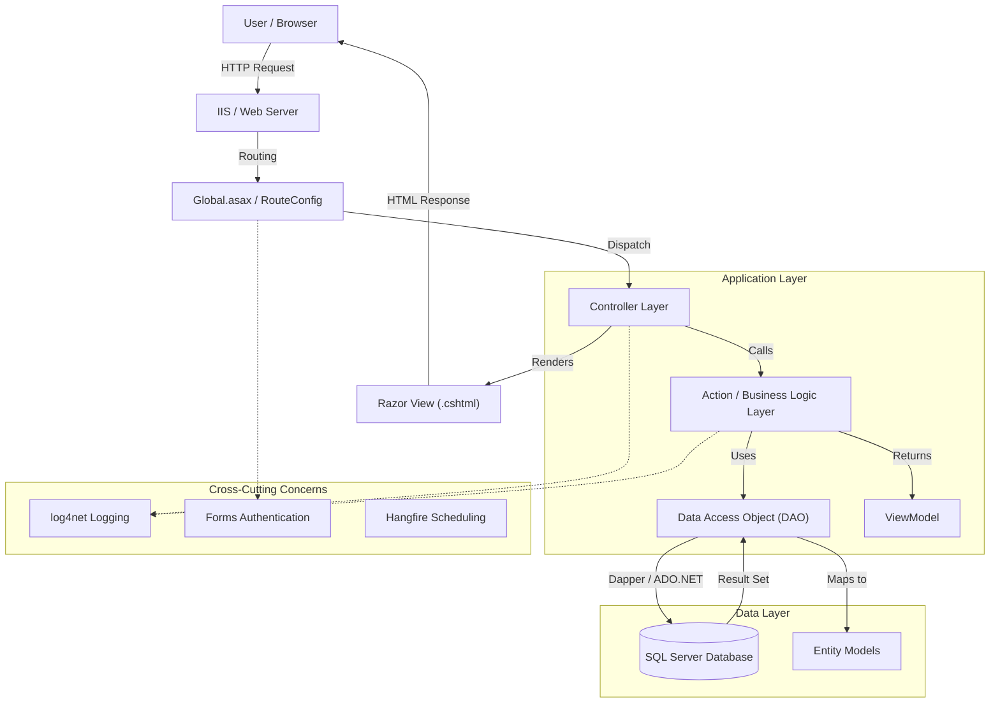

# Codebase Analysis

## 1. Project Overview
This project is a large-scale **ASP.NET MVC** web application designed for e-service delivery (likely government or enterprise level). It features a modular architecture with a clear separation of concerns between the frontend (Views), request handling (Controllers), business logic/data access (Actions/DAOs), and data models (Entities/ViewModels).

The application supports both a public-facing frontend and a backend administration area (`BACKMIN`). It uses **Dapper** for high-performance data access and **SQL Server** as the underlying database.

## 2. Architecture Diagram

The following Mermaid diagram illustrates the high-level architecture and request flow:



## 3. Directory Structure Analysis

The codebase is organized into the following key directories:

| Directory | Description |
|-----------|-------------|
| **Controllers** | Contains the MVC Controllers that handle incoming HTTP requests. Files like `LoginController.cs` and `Apply_XXXXController.cs` suggest a feature-based organization. |
| **Views** | Stores the Razor (`.cshtml`) templates for the user interface. Matches the Controller structure. |
| **Models** | Contains data structures. <br> - **Entities**: Direct mappings to database tables (e.g., `TblMEMBER`). <br> - **ViewModels**: Data shapes specifically for UI display (e.g., `LoginViewModel`). |
| **Action** | Contains the business logic and base classes for data operations. `BaseAction.cs` provides common CRUD and database utilities. |
| **DataLayers** | Dedicated Data Access Objects (DAOs) like `LoginDAO.cs`. These classes encapsulate specific SQL queries and database interactions. |
| **Areas** | Contains separate modules, most notably `BACKMIN` for the backend administration interface. |
| **App_Start** | Configuration files for Routing (`RouteConfig.cs`), Bundling (`BundleConfig.cs`), and Web API (`WebApiConfig.cs`). |
| **Global.asax** | Application entry point, handling lifecycle events like startup, error handling, and authentication requests. |

## 4. Key Components & Patterns

### 4.1 BaseAction & Data Access
The `BaseAction` class is a cornerstone of the backend architecture. It provides:
- **Connection Management**: Handles `SqlConnection` and `SqlTransaction`.
- **Helper Methods**: `Insert`, `Update`, `GetList`, `GetRow` generic methods to reduce boilerplate code.
- **Pagination**: Logic for calculating page offsets and generating paged SQL queries.

**Example Pattern (from LoginDAO):**
```csharp
public class LoginDAO : BaseAction 
{
    public LoginUserInfo LoginValidate(string userNo, string userPwd) 
    {
        // 1. Define SQL with Parameters
        string sql = "SELECT * FROM MEMBER WHERE ACC_NO = @ACC_NO ...";
        
        // 2. Execute using Dapper or Helper
        using (SqlConnection conn = DataUtils.GetConnection()) 
        {
            var result = conn.QueryFirst<TblMEMBER>(sql, parameters);
        }
        
        // 3. Return Domain Object
        return userInfo;
    }
}
```

### 4.2 Modular Application Logic (`Apply_XXXX`)
A significant portion of the codebase is dedicated to specific application forms or services, named with the pattern `Apply_XXXX`.
- **Controller**: `Apply_001008Controller.cs`
- **Model**: `Apply_001008Model.cs`
- **View**: `Views/Apply_001008/Index.cshtml`

This suggests a system where new forms or services can be added as distinct modules without affecting the core framework.

### 4.3 Authentication & Security
- **Forms Authentication**: Used for user session management.
- **Role-Based Access**: `Global.asax` parses roles from the authentication ticket to set the `HttpContext.Current.User`.
- **Input Validation**: Regex checks in DAOs (e.g., `ChkMemberInfo`) to validate IDs, emails, and passwords.
- **SQL Injection Prevention**: Usage of parameterized queries (Dapper/`SqlParameter`) throughout the DAOs.

## 5. Technology Stack

- **Backend Framework**: ASP.NET MVC 5 (estimated based on structure).
- **Language**: C# .NET Framework.
- **ORM / Data Access**: Dapper (Micro-ORM) + Raw ADO.NET.
- **Database**: Microsoft SQL Server.
- **Frontend**: Razor View Engine, HTML5, CSS3, JavaScript (jQuery).
- **Logging**: log4net.
- **Scheduling**: Hangfire (referenced in `Global.asax`).
- **Utilities**: `Omu.ValueInjecter` for object mapping.

## 6. Data Flow Scenario: User Login

1.  **User** submits login form (Account/Password).
2.  **`LoginController`** receives the POST request.
3.  **`LoginController`** calls `LoginDAO.LoginValidate()`.
4.  **`LoginDAO`**:
    - Hashes the password.
    - Executes a SQL query against the `MEMBER` table.
    - Maps the result to a `ClamMember` object.
5.  **`LoginController`**:
    - If successful, creates a Forms Authentication ticket.
    - Sets the cookie.
    - Redirects the user to the dashboard.
6.  **`Global.asax`**: On subsequent requests, decrypts the cookie and restores the user identity.
