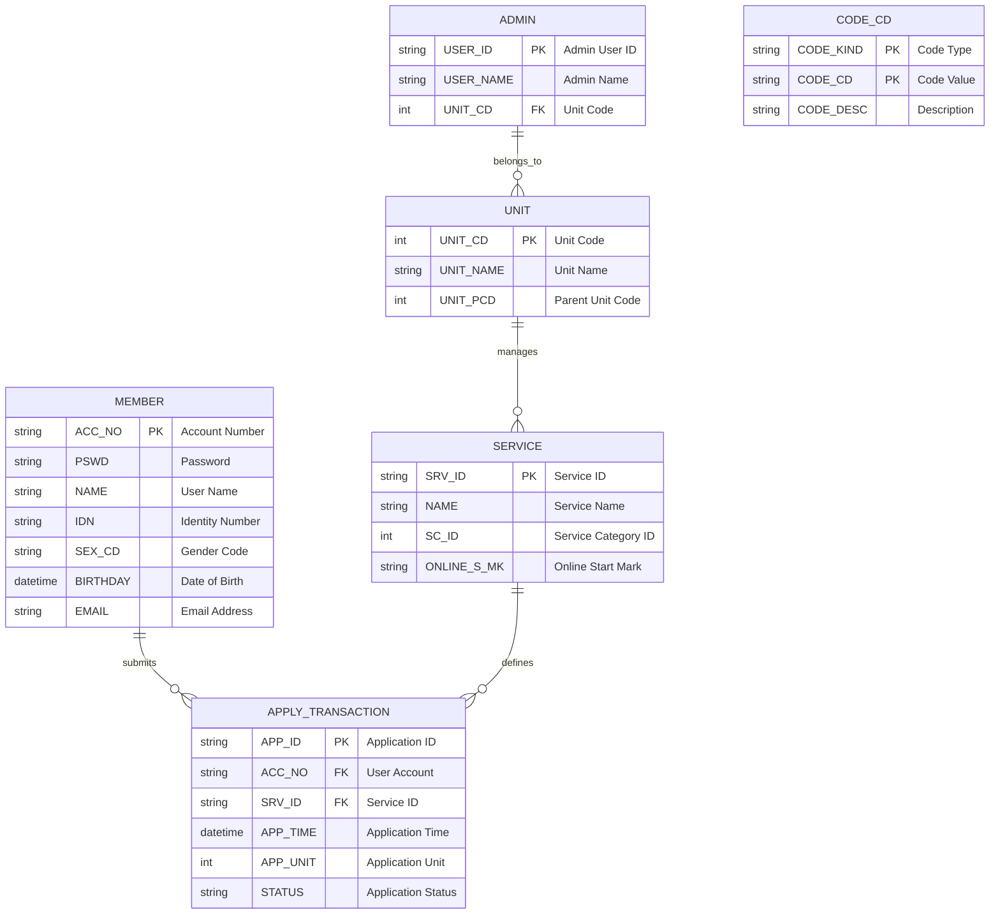

# Database Schema & ER Diagram

This document provides a detailed overview of the database schema, including Entity-Relationship (ER) diagrams, table definitions, and relationships inferred from the codebase.

## 1. High-Level ER Diagram

The following Mermaid diagram illustrates the core relationships between the main entities in the system.

> **Note**: `APPLY_TRANSACTION` represents the various `APPLY_XXXX` tables (e.g., `APPLY_010001`, `APPLY_005013`) which store specific application data for different services.

## 2. Table Definitions

### 2.1 Core Entities

#### MEMBER (User Accounts)
Stores information about the public users of the e-service platform.

| Column Name | Data Type | Description | Key |
|-------------|-----------|-------------|-----|
| `ACC_NO` | `varchar` | Unique Account Number | PK |
| `PSWD` | `varchar` | Encrypted Password | |
| `IDN` | `varchar` | National ID Number | |
| `NAME` | `varchar` | Full Name | |
| `SEX_CD` | `char` | Gender Code | |
| `BIRTHDAY` | `datetime` | Date of Birth | |
| `EMAIL` | `varchar` | Email Address | |
| `TEL` | `varchar` | Telephone Number | |
| `MOBILE` | `varchar` | Mobile Number | |
| `ADDR` | `varchar` | Address | |

#### SERVICE (Service Definitions)
Defines the available services that users can apply for.

| Column Name | Data Type | Description | Key |
|-------------|-----------|-------------|-----|
| `SRV_ID` | `varchar` | Service Identifier | PK |
| `NAME` | `varchar` | Service Name | |
| `SC_ID` | `int` | Service Category ID | |
| `SC_PID` | `int` | Parent Category ID | |
| `ONLINE_S_MK` | `char` | Online Service Start Mark | |
| `ONLINE_N_MK` | `char` | Online Service End Mark | |
| `FORM_MAKER_ID`| `varchar` | ID of the form creator | |

#### UNIT (Organizational Units)
Represents the organizational hierarchy (e.g., departments, agencies).

| Column Name | Data Type | Description | Key |
|-------------|-----------|-------------|-----|
| `UNIT_CD` | `int` | Unit Code | PK |
| `UNIT_NAME` | `varchar` | Unit Name | |
| `UNIT_PCD` | `int` | Parent Unit Code | FK |
| `UNIT_LEVEL` | `int` | Hierarchy Level | |
| `UNIT_ADDR` | `varchar` | Address | |

### 2.2 Application Data (Example: APPLY_010001)
Each service typically has its own application table, often named `APPLY_{ServiceCode}`. Below is a representative schema.

| Column Name | Data Type | Description | Key |
|-------------|-----------|-------------|-----|
| `APP_ID` | `varchar` | Application ID | PK |
| `ACC_NO` | `varchar` | Applicant Account Number | FK |
| `APP_TIME` | `datetime` | Submission Time | |
| `APP_UNIT` | `int` | Handling Unit Code | FK |
| `APP_ROLE` | `varchar` | Applicant Role | |
| `STATUS` | `char` | Current Status (e.g., Pending, Approved) | |

### 2.3 System Configuration

#### CODE_CD (System Codes)
A general-purpose lookup table for system codes and enumerations.

| Column Name | Data Type | Description | Key |
|-------------|-----------|-------------|-----|
| `CODE_KIND` | `varchar` | Category of the code (e.g., 'SEX', 'CITY') | PK |
| `CODE_CD` | `varchar` | The code value | PK |
| `CODE_DESC` | `varchar` | Display text for the code | |
| `SEQ_NO` | `int` | Display order | |

#### ADMIN (Backend Users)
Stores accounts for internal staff who manage applications.

| Column Name | Data Type | Description | Key |
|-------------|-----------|-------------|-----|
| `USER_ID` | `varchar` | Login ID | PK |
| `USER_NAME` | `varchar` | Staff Name | |
| `UNIT_CD` | `int` | Associated Unit | FK |
| `ROLE_ID` | `varchar` | Role/Permission Group | |

## 3. Relationships & Data Flow

1.  **User Registration**:
    - Users create an account in `MEMBER`.
    - Demographic data (`IDN`, `BIRTHDAY`) is stored here and reused across applications.

2.  **Service Application**:
    - When a user applies for a service (e.g., Service ID `010001`), a record is created in the corresponding `APPLY_010001` table.
    - The `ACC_NO` links the application back to the `MEMBER`.
    - The `APP_UNIT` determines which organizational `UNIT` is responsible for processing the application.

3.  **System Codes**:
    - Dropdown lists and status codes are resolved using `CODE_CD`.
    - Example: `SEX_CD` in `MEMBER` joins with `CODE_CD` where `CODE_KIND = 'SEX'`.

4.  **Hierarchy**:
    - `UNIT` table supports a recursive relationship via `UNIT_PCD` to model the organizational tree structure.
