# EECOnline 系統架構圖

## 1. 整體系統架構

### 1.1 系統部署架構

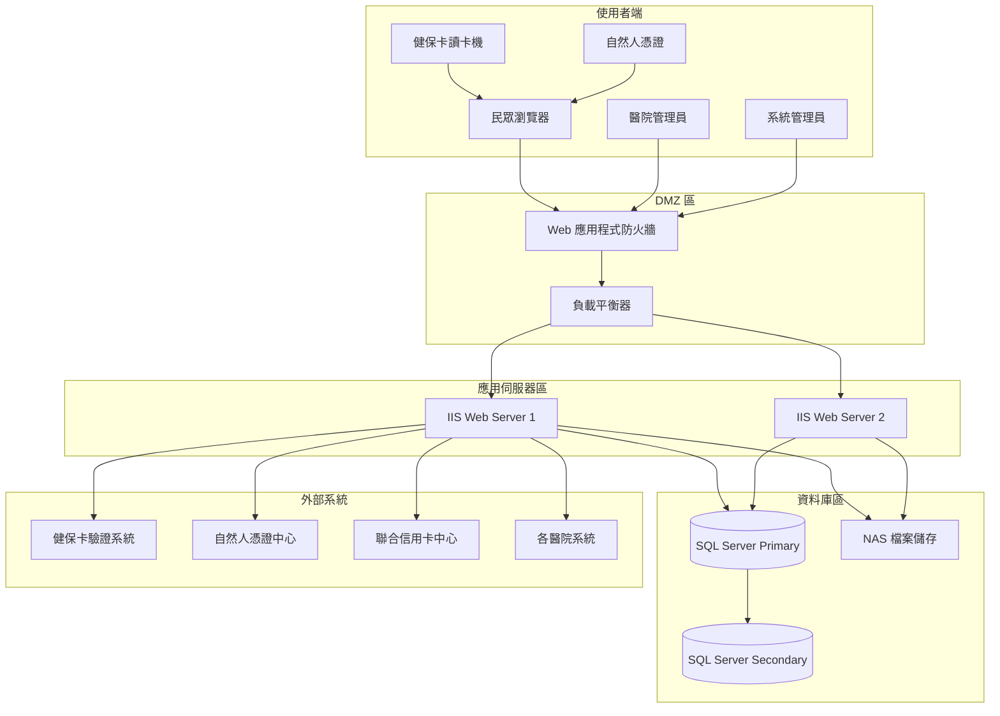
```mermaid
graph TB
    subgraph "使用者端"
        USER1[民眾瀏覽器]
        USER2[醫院管理員]
        USER3[系統管理員]
        CARD[健保卡讀卡機]
        CERT[自然人憑證]
    end
    
    subgraph "DMZ 區"
        LB[負載平衡器]
        WAF[Web 應用程式防火牆]
    end
    
    subgraph "應用伺服器區"
        IIS1[IIS Web Server 1]
        IIS2[IIS Web Server 2]
    end
    
    subgraph "資料庫區"
        SQL1[(SQL Server Primary)]
        SQL2[(SQL Server Secondary)]
        NAS[NAS 檔案儲存]
    end
    
    subgraph "外部系統"
        HCA_SYS[健保卡驗證系統]
        MOICA[自然人憑證中心]
        NCCC[聯合信用卡中心]
        HOSP[各醫院系統]
    end
    
    USER1 --> WAF
    USER2 --> WAF
    USER3 --> WAF
    CARD --> USER1
    CERT --> USER1
    
    WAF --> LB
    LB --> IIS1
    LB --> IIS2
    
    IIS1 --> SQL1
    IIS2 --> SQL1
    SQL1 --> SQL2
    
    IIS1 --> NAS
    IIS2 --> NAS
    
    IIS1 --> HCA_SYS
    IIS1 --> MOICA
    IIS1 --> NCCC
    IIS1 --> HOSP
```

### 1.2 應用程式層次架構

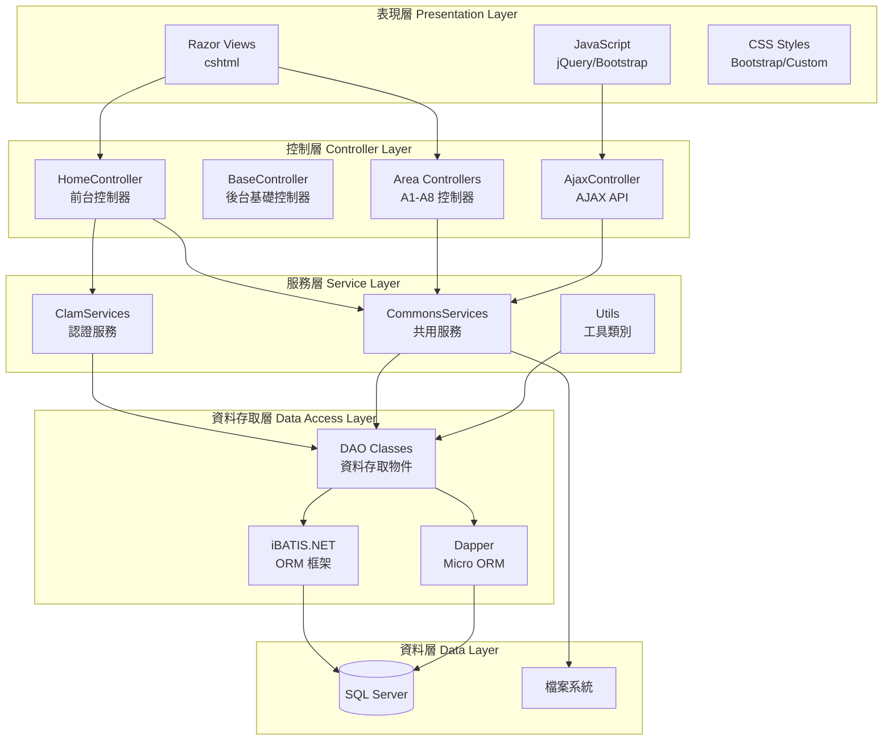
```mermaid
graph TB
    subgraph "表現層 Presentation Layer"
        direction LR
        VIEWS[Razor Views<br/>cshtml]
        JS[JavaScript<br/>jQuery/Bootstrap]
        CSS[CSS Styles<br/>Bootstrap/Custom]
    end
    
    subgraph "控制層 Controller Layer"
        direction LR
        HOME[HomeController<br/>前台控制器]
        BASE[BaseController<br/>後台基礎控制器]
        AREA[Area Controllers<br/>A1-A8 控制器]
        API[AjaxController<br/>AJAX API]
    end
    
    subgraph "服務層 Service Layer"
        direction LR
        CLAM[ClamServices<br/>認證服務]
        COMM[CommonsServices<br/>共用服務]
        UTIL[Utils<br/>工具類別]
    end
    
    subgraph "資料存取層 Data Access Layer"
        direction LR
        DAO[DAO Classes<br/>資料存取物件]
        IBATIS[iBATIS.NET<br/>ORM 框架]
        DAPPER[Dapper<br/>Micro ORM]
    end
    
    subgraph "資料層 Data Layer"
        direction LR
        SQL[(SQL Server)]
        FILE[檔案系統]
    end
    
    VIEWS --> HOME
    VIEWS --> AREA
    JS --> API
    
    HOME --> CLAM
    HOME --> COMM
    AREA --> COMM
    API --> COMM
    
    CLAM --> DAO
    COMM --> DAO
    UTIL --> DAO
    
    DAO --> IBATIS
    DAO --> DAPPER
    IBATIS --> SQL
    DAPPER --> SQL
    
    COMM --> FILE
```

---

## 2. MVC 架構模式

### 2.1 請求處理流程

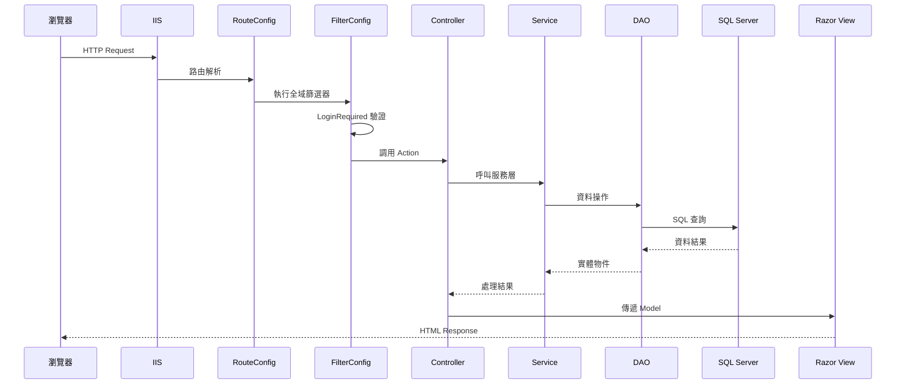
```mermaid
sequenceDiagram
    participant Browser as 瀏覽器
    participant IIS as IIS
    participant Route as RouteConfig
    participant Filter as FilterConfig
    participant Controller as Controller
    participant Service as Service
    participant DAO as DAO
    participant DB as SQL Server
    participant View as Razor View
    
    Browser->>IIS: HTTP Request
    IIS->>Route: 路由解析
    Route->>Filter: 執行全域篩選器
    Filter->>Filter: LoginRequired 驗證
    Filter->>Controller: 調用 Action
    Controller->>Service: 呼叫服務層
    Service->>DAO: 資料操作
    DAO->>DB: SQL 查詢
    DB-->>DAO: 資料結果
    DAO-->>Service: 實體物件
    Service-->>Controller: 處理結果
    Controller->>View: 傳遞 Model
    View-->>Browser: HTML Response
```

### 2.2 Controller 繼承關係

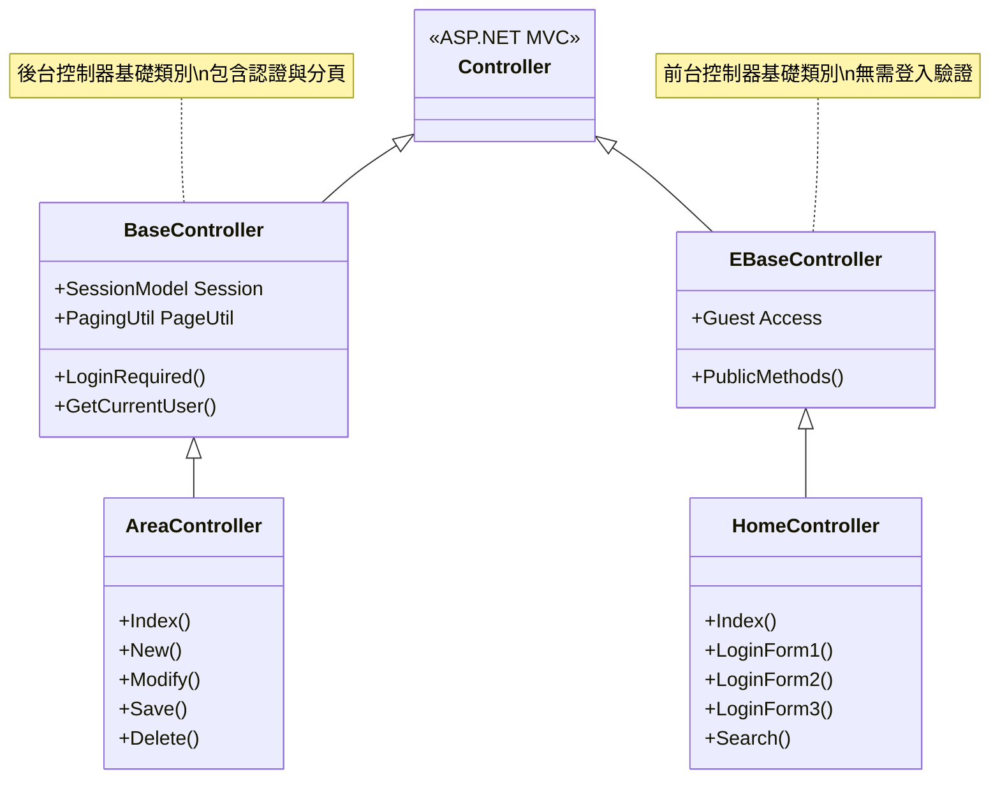
```mermaid
classDiagram
    class Controller {
        <<ASP.NET MVC>>
    }
    
    class BaseController {
        +SessionModel Session
        +PagingUtil PageUtil
        +LoginRequired()
        +GetCurrentUser()
    }
    
    class EBaseController {
        +Guest Access
        +PublicMethods()
    }
    
    class HomeController {
        +Index()
        +LoginForm1()
        +LoginForm2()
        +LoginForm3()
        +Search()
    }
    
    class AreaController {
        +Index()
        +New()
        +Modify()
        +Save()
        +Delete()
    }
    
    Controller <|-- BaseController
    Controller <|-- EBaseController
    EBaseController <|-- HomeController
    BaseController <|-- AreaController
    
    note for BaseController "後台控制器基礎類別\n包含認證與分頁"
    note for EBaseController "前台控制器基礎類別\n無需登入驗證"
```

---

## 3. 模組架構

### 3.1 Areas 模組結構

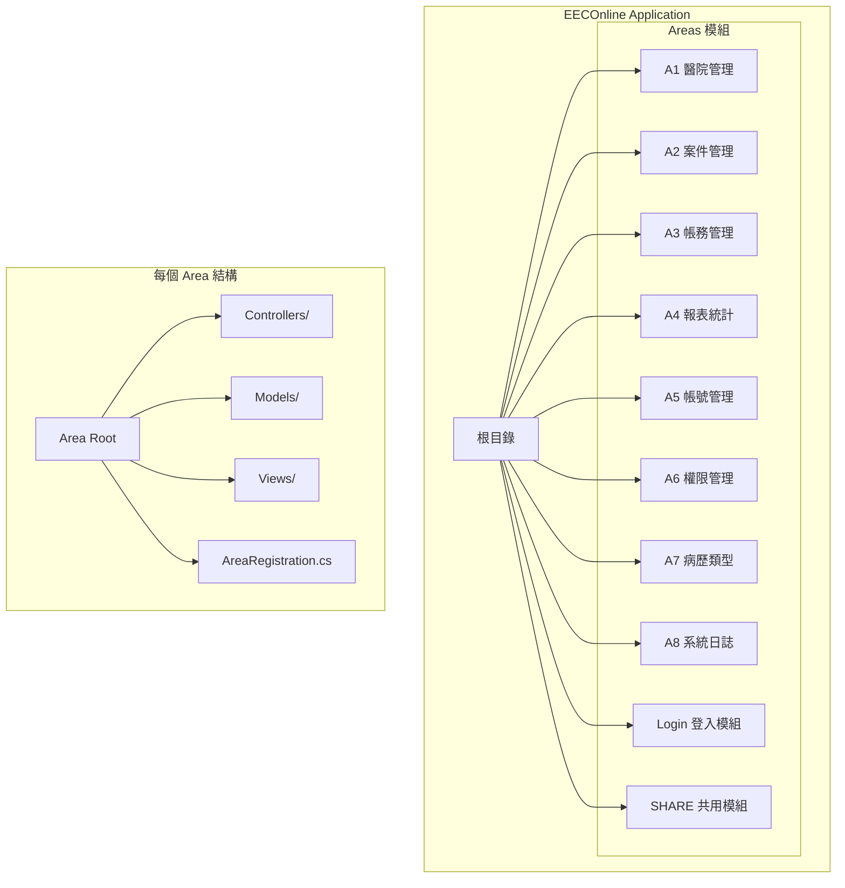
```mermaid
graph TB
    subgraph "EECOnline Application"
        ROOT[根目錄]
        
        subgraph "Areas 模組"
            A1[A1 醫院管理]
            A2[A2 案件管理]
            A3[A3 帳務管理]
            A4[A4 報表統計]
            A5[A5 帳號管理]
            A6[A6 權限管理]
            A7[A7 病歷類型]
            A8[A8 系統日誌]
            LOGIN[Login 登入模組]
            SHARE[SHARE 共用模組]
        end
        
        ROOT --> A1
        ROOT --> A2
        ROOT --> A3
        ROOT --> A4
        ROOT --> A5
        ROOT --> A6
        ROOT --> A7
        ROOT --> A8
        ROOT --> LOGIN
        ROOT --> SHARE
    end
    
    subgraph "每個 Area 結構"
        AREA_ROOT[Area Root]
        CONTROLLERS[Controllers/]
        MODELS[Models/]
        VIEWS[Views/]
        REG[AreaRegistration.cs]
        
        AREA_ROOT --> CONTROLLERS
        AREA_ROOT --> MODELS
        AREA_ROOT --> VIEWS
        AREA_ROOT --> REG
    end
```

### 3.2 Area 內部結構

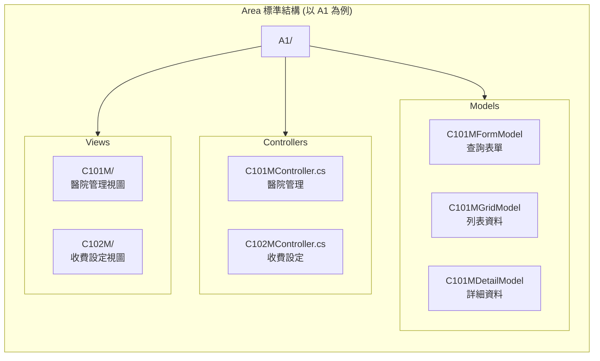
```mermaid
graph LR
    subgraph "Area 標準結構 (以 A1 為例)"
        direction TB
        A1ROOT[A1/]
        
        subgraph "Controllers"
            C101M[C101MController.cs<br/>醫院管理]
            C102M[C102MController.cs<br/>收費設定]
        end
        
        subgraph "Models"
            FORM[C101MFormModel<br/>查詢表單]
            GRID[C101MGridModel<br/>列表資料]
            DETAIL[C101MDetailModel<br/>詳細資料]
        end
        
        subgraph "Views"
            V101[C101M/<br/>醫院管理視圖]
            V102[C102M/<br/>收費設定視圖]
        end
        
        A1ROOT --> Controllers
        A1ROOT --> Models
        A1ROOT --> Views
    end
```

---

## 4. 資料存取架構

### 4.1 DAO 層架構

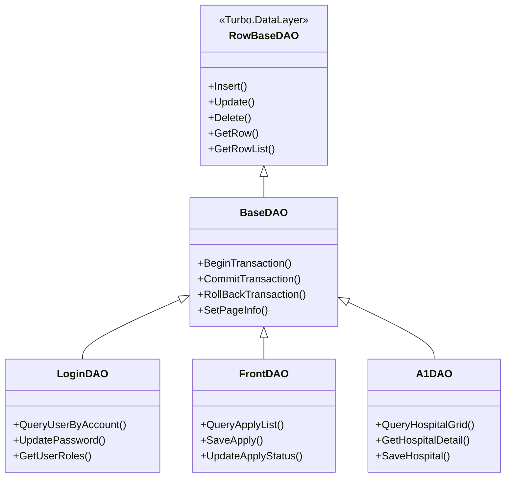
```mermaid
classDiagram
    class RowBaseDAO {
        <<Turbo.DataLayer>>
        +Insert()
        +Update()
        +Delete()
        +GetRow()
        +GetRowList()
    }
    
    class BaseDAO {
        +BeginTransaction()
        +CommitTransaction()
        +RollBackTransaction()
        +SetPageInfo()
    }
    
    class LoginDAO {
        +QueryUserByAccount()
        +UpdatePassword()
        +GetUserRoles()
    }
    
    class FrontDAO {
        +QueryApplyList()
        +SaveApply()
        +UpdateApplyStatus()
    }
    
    class A1DAO {
        +QueryHospitalGrid()
        +GetHospitalDetail()
        +SaveHospital()
    }
    
    RowBaseDAO <|-- BaseDAO
    BaseDAO <|-- LoginDAO
    BaseDAO <|-- FrontDAO
    BaseDAO <|-- A1DAO
```

### 4.2 iBATIS SqlMap 架構

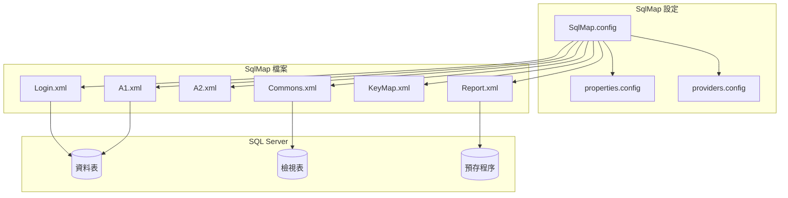
```mermaid
graph TB
    subgraph "SqlMap 設定"
        CONFIG[SqlMap.config]
        PROPS[properties.config]
        PROV[providers.config]
    end
    
    subgraph "SqlMap 檔案"
        LOGIN_XML[Login.xml]
        A1_XML[A1.xml]
        A2_XML[A2.xml]
        COMMONS_XML[Commons.xml]
        KEYMAP_XML[KeyMap.xml]
        REPORT_XML[Report.xml]
    end
    
    subgraph "SQL Server"
        TABLES[(資料表)]
        VIEWS_DB[(檢視表)]
        SP[(預存程序)]
    end
    
    CONFIG --> PROPS
    CONFIG --> PROV
    CONFIG --> LOGIN_XML
    CONFIG --> A1_XML
    CONFIG --> A2_XML
    CONFIG --> COMMONS_XML
    CONFIG --> KEYMAP_XML
    CONFIG --> REPORT_XML
    
    LOGIN_XML --> TABLES
    A1_XML --> TABLES
    COMMONS_XML --> VIEWS_DB
    REPORT_XML --> SP
```

---

## 5. 身份驗證架構

### 5.1 登入驗證流程

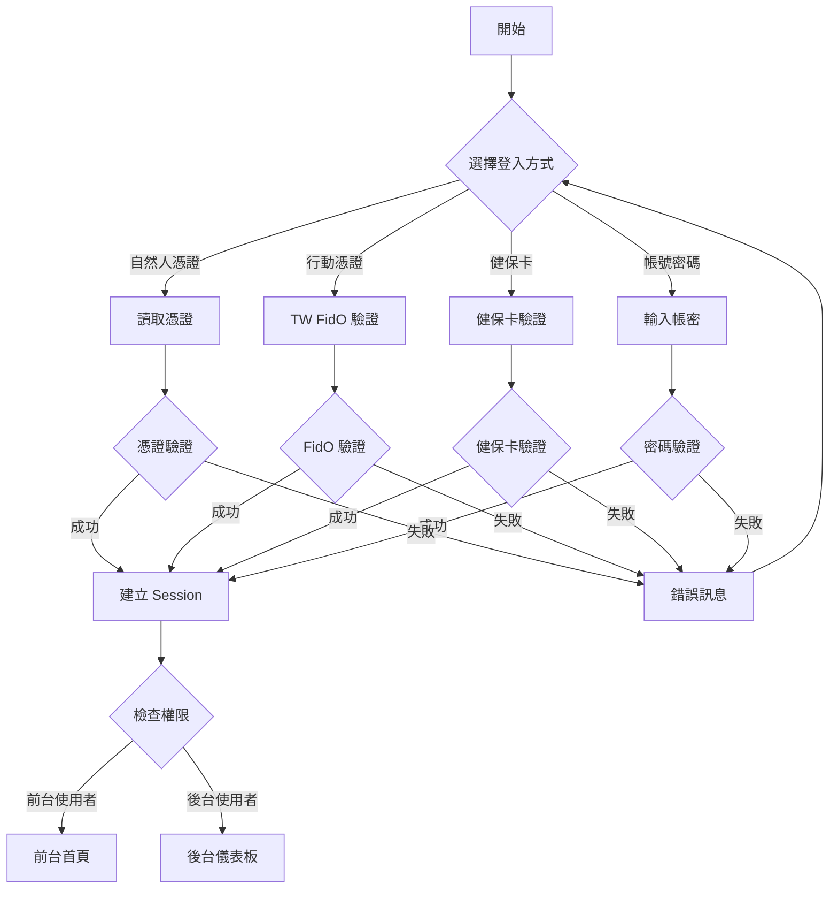
```mermaid
flowchart TB
    START[開始] --> SELECT{選擇登入方式}
    
    SELECT -->|自然人憑證| CERT[讀取憑證]
    SELECT -->|行動憑證| FIDO[TW FidO 驗證]
    SELECT -->|健保卡| HCA[健保卡驗證]
    SELECT -->|帳號密碼| PWD[輸入帳密]
    
    CERT --> CERT_V{憑證驗證}
    FIDO --> FIDO_V{FidO 驗證}
    HCA --> HCA_V{健保卡驗證}
    PWD --> PWD_V{密碼驗證}
    
    CERT_V -->|成功| SESSION[建立 Session]
    FIDO_V -->|成功| SESSION
    HCA_V -->|成功| SESSION
    PWD_V -->|成功| SESSION
    
    CERT_V -->|失敗| ERROR[錯誤訊息]
    FIDO_V -->|失敗| ERROR
    HCA_V -->|失敗| ERROR
    PWD_V -->|失敗| ERROR
    
    SESSION --> CHECK{檢查權限}
    CHECK -->|前台使用者| FRONT[前台首頁]
    CHECK -->|後台使用者| BACK[後台儀表板]
    
    ERROR --> SELECT
```

### 5.2 Session 管理架構

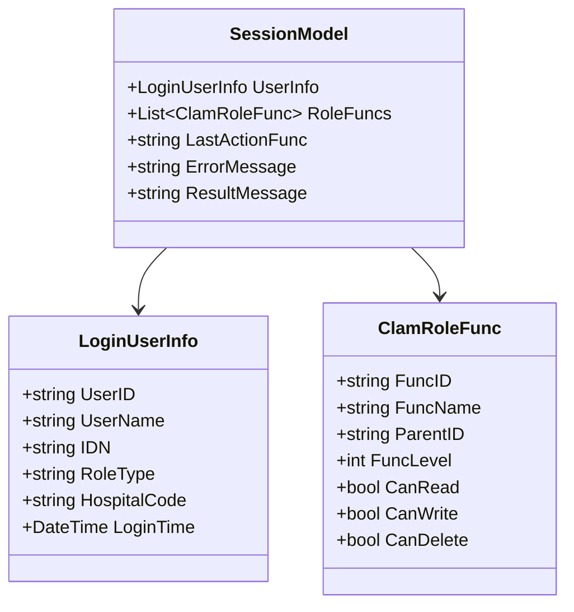
```mermaid
classDiagram
    class SessionModel {
        +LoginUserInfo UserInfo
        +List~ClamRoleFunc~ RoleFuncs
        +string LastActionFunc
        +string ErrorMessage
        +string ResultMessage
    }
    
    class LoginUserInfo {
        +string UserID
        +string UserName
        +string IDN
        +string RoleType
        +string HospitalCode
        +DateTime LoginTime
    }
    
    class ClamRoleFunc {
        +string FuncID
        +string FuncName
        +string ParentID
        +int FuncLevel
        +bool CanRead
        +bool CanWrite
        +bool CanDelete
    }
    
    SessionModel --> LoginUserInfo
    SessionModel --> ClamRoleFunc
```

---

## 6. 外部系統整合架構

### 6.1 外部系統連接

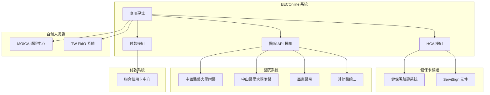
```mermaid
graph TB
    subgraph "EECOnline 系統"
        APP[應用程式]
        HCA_MOD[HCA 模組]
        HOSP_API[醫院 API 模組]
        PAY_MOD[付款模組]
    end
    
    subgraph "健保卡驗證"
        HCA_SYS[健保署驗證系統]
        SERVISIGN[ServiSign 元件]
    end
    
    subgraph "自然人憑證"
        MOICA[MOICA 憑證中心]
        TWFIDO[TW FidO 系統]
    end
    
    subgraph "醫院系統"
        CMUH[中國醫藥大學附醫]
        CSH[中山醫學大學附醫]
        FEH[亞東醫院]
        OTHER[其他醫院...]
    end
    
    subgraph "付款系統"
        NCCC[聯合信用卡中心]
    end
    
    APP --> HCA_MOD
    APP --> HOSP_API
    APP --> PAY_MOD
    
    HCA_MOD --> HCA_SYS
    HCA_MOD --> SERVISIGN
    
    APP --> MOICA
    APP --> TWFIDO
    
    HOSP_API --> CMUH
    HOSP_API --> CSH
    HOSP_API --> FEH
    HOSP_API --> OTHER
    
    PAY_MOD --> NCCC
```

### 6.2 醫院 API 整合

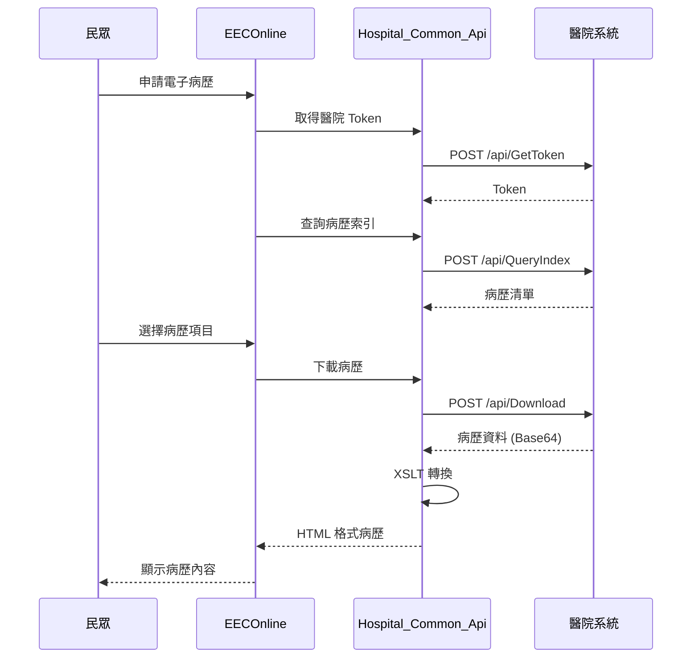
```mermaid
sequenceDiagram
    participant User as 民眾
    participant EEC as EECOnline
    participant API as Hospital_Common_Api
    participant Hospital as 醫院系統
    
    User->>EEC: 申請電子病歷
    EEC->>API: 取得醫院 Token
    API->>Hospital: POST /api/GetToken
    Hospital-->>API: Token
    
    EEC->>API: 查詢病歷索引
    API->>Hospital: POST /api/QueryIndex
    Hospital-->>API: 病歷清單
    
    User->>EEC: 選擇病歷項目
    EEC->>API: 下載病歷
    API->>Hospital: POST /api/Download
    Hospital-->>API: 病歷資料 (Base64)
    
    API->>API: XSLT 轉換
    API-->>EEC: HTML 格式病歷
    EEC-->>User: 顯示病歷內容
```

---

## 7. 背景工作架構

### 7.1 Hangfire 排程架構

```mermaid
graph TB
    subgraph "Hangfire 服務"
        STARTUP[Startup.cs]
        DASHBOARD[/hangfire Dashboard]
        MEMORY[MemoryStorage]
    end
    
    subgraph "排程工作"
        JOB1[CheckProvideDataStatus<br/>每日 04:00]
        JOB2[CheckDataIsGot<br/>每日 04:00]
        JOB3[SendMailToHospital<br/>通知醫院]
    end
    
    subgraph "工作內容"
        TASK1[檢查資料提供狀態]
        TASK2[檢查資料下載狀態]
        TASK3[發送電子郵件]
    end
    
    STARTUP --> MEMORY
    STARTUP --> JOB1
    STARTUP --> JOB2
    STARTUP --> JOB3
    
    JOB1 --> TASK1
    JOB2 --> TASK2
    JOB3 --> TASK3
    
    DASHBOARD --> JOB1
    DASHBOARD --> JOB2
    DASHBOARD --> JOB3
```

---

## 8. 錯誤處理架構

### 8.1 例外處理流程

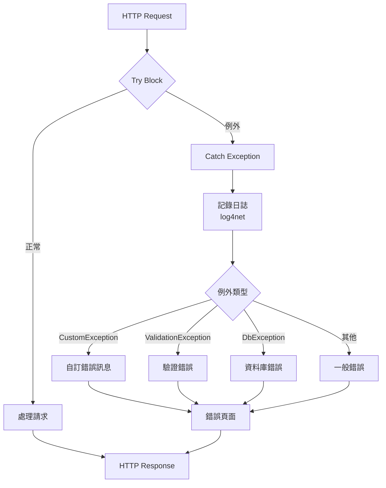
```mermaid
flowchart TB
    REQUEST[HTTP Request] --> TRY{Try Block}
    
    TRY -->|正常| PROCESS[處理請求]
    TRY -->|例外| CATCH[Catch Exception]
    
    CATCH --> LOG[記錄日誌<br/>log4net]
    LOG --> TYPE{例外類型}
    
    TYPE -->|CustomException| CUSTOM[自訂錯誤訊息]
    TYPE -->|ValidationException| VALID[驗證錯誤]
    TYPE -->|DbException| DB[資料庫錯誤]
    TYPE -->|其他| GENERAL[一般錯誤]
    
    CUSTOM --> ERROR_PAGE[錯誤頁面]
    VALID --> ERROR_PAGE
    DB --> ERROR_PAGE
    GENERAL --> ERROR_PAGE
    
    PROCESS --> RESPONSE[HTTP Response]
    ERROR_PAGE --> RESPONSE
```

### 8.2 日誌記錄架構

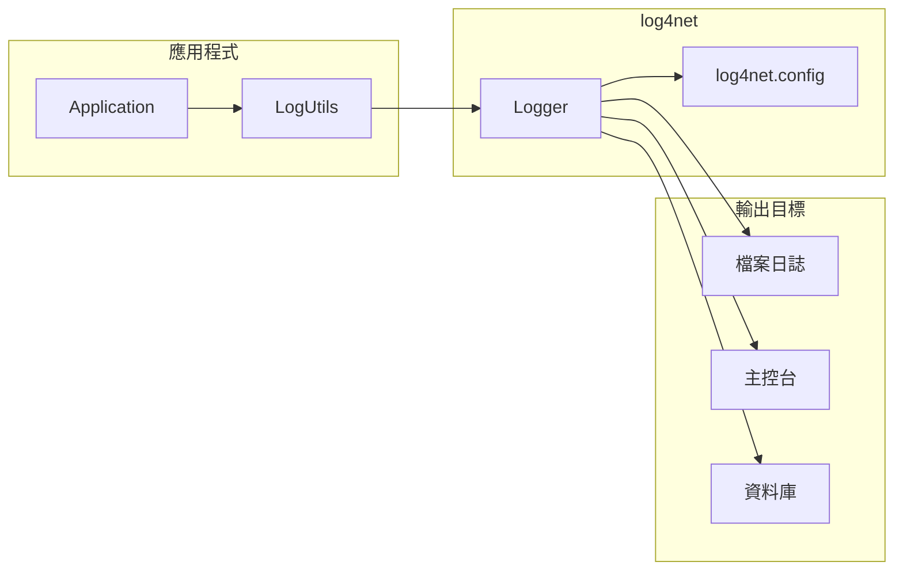
```mermaid
graph LR
    subgraph "應用程式"
        APP[Application]
        LOGUTIL[LogUtils]
    end
    
    subgraph "log4net"
        CONFIG[log4net.config]
        LOGGER[Logger]
    end
    
    subgraph "輸出目標"
        FILE[檔案日誌]
        CONSOLE[主控台]
        DB[資料庫]
    end
    
    APP --> LOGUTIL
    LOGUTIL --> LOGGER
    LOGGER --> CONFIG
    
    LOGGER --> FILE
    LOGGER --> CONSOLE
    LOGGER --> DB
```

---

## 9. 快取架構

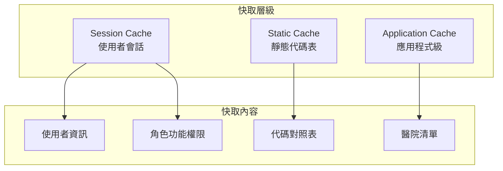
```mermaid
graph TB
    subgraph "快取層級"
        SESSION[Session Cache<br/>使用者會話]
        APP_CACHE[Application Cache<br/>應用程式級]
        STATIC[Static Cache<br/>靜態代碼表]
    end
    
    subgraph "快取內容"
        USER_INFO[使用者資訊]
        ROLE_FUNC[角色功能權限]
        CODE_MAP[代碼對照表]
        HOSPITAL_LIST[醫院清單]
    end
    
    SESSION --> USER_INFO
    SESSION --> ROLE_FUNC
    
    STATIC --> CODE_MAP
    APP_CACHE --> HOSPITAL_LIST
```

---

## 10. 安全架構

### 10.1 安全防護層級

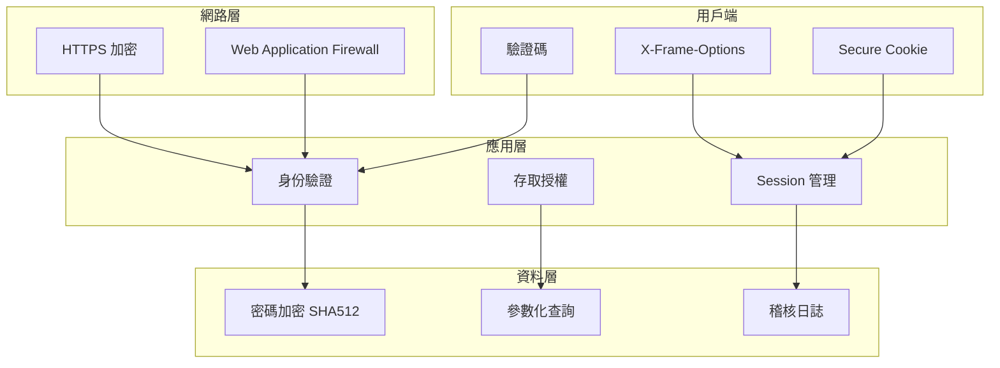
```mermaid
graph TB
    subgraph "網路層"
        HTTPS[HTTPS 加密]
        WAF[Web Application Firewall]
    end
    
    subgraph "應用層"
        AUTH[身份驗證]
        AUTHZ[存取授權]
        SESSION[Session 管理]
    end
    
    subgraph "資料層"
        ENCRYPT[密碼加密 SHA512]
        PARAM[參數化查詢]
        AUDIT[稽核日誌]
    end
    
    subgraph "用戶端"
        CAPTCHA[驗證碼]
        XFRAME[X-Frame-Options]
        COOKIE[Secure Cookie]
    end
    
    HTTPS --> AUTH
    WAF --> AUTH
    AUTH --> ENCRYPT
    AUTHZ --> PARAM
    SESSION --> AUDIT
    
    CAPTCHA --> AUTH
    XFRAME --> SESSION
    COOKIE --> SESSION
```

---

本文件說明 EECOnline 系統的整體架構設計，包含部署架構、應用程式分層、模組結構、資料存取、身份驗證、外部整合等各個面向。詳細的實作說明請參考其他技術文件。
