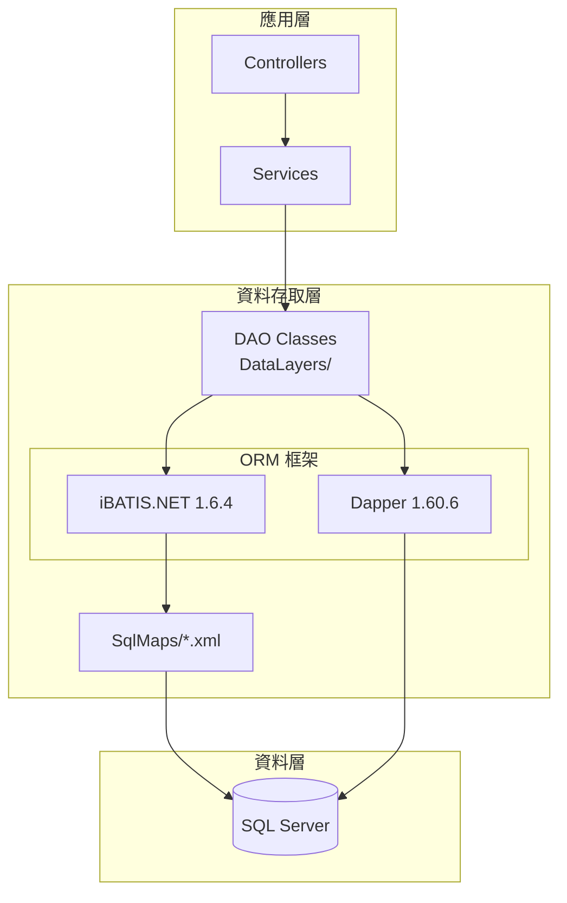
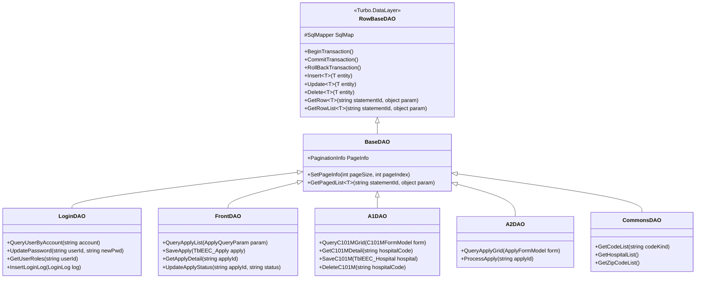
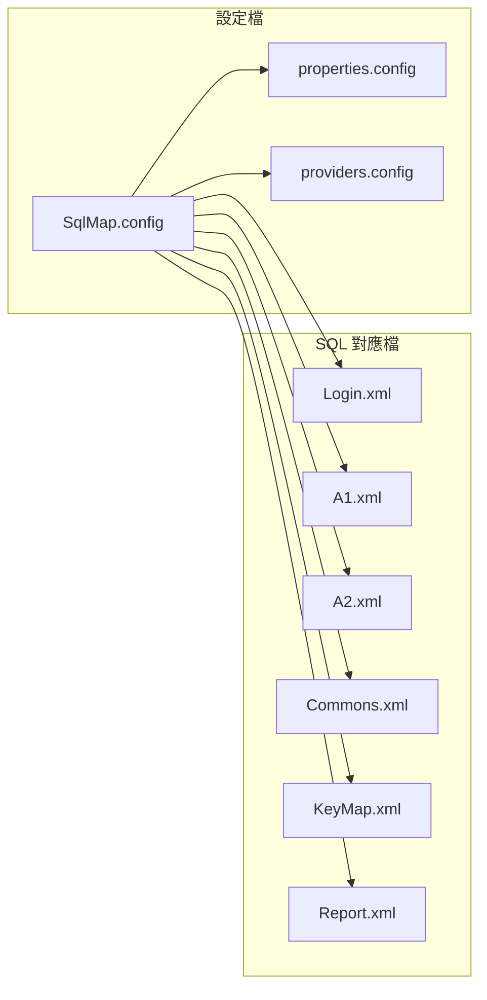
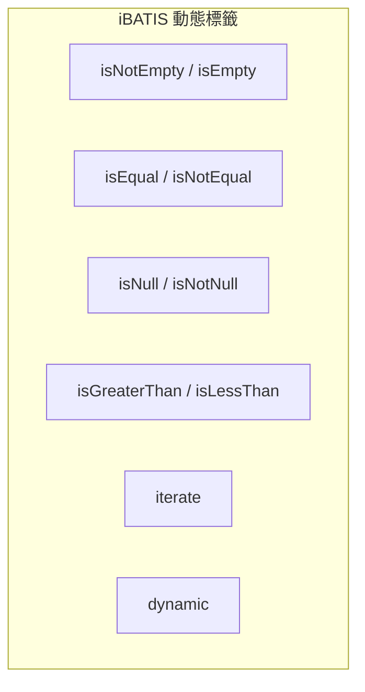
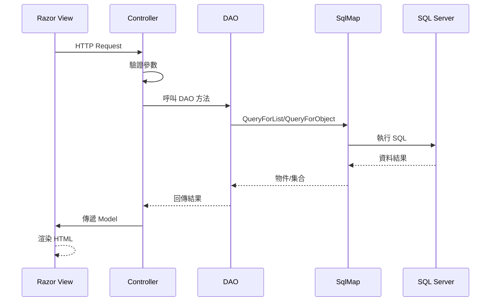
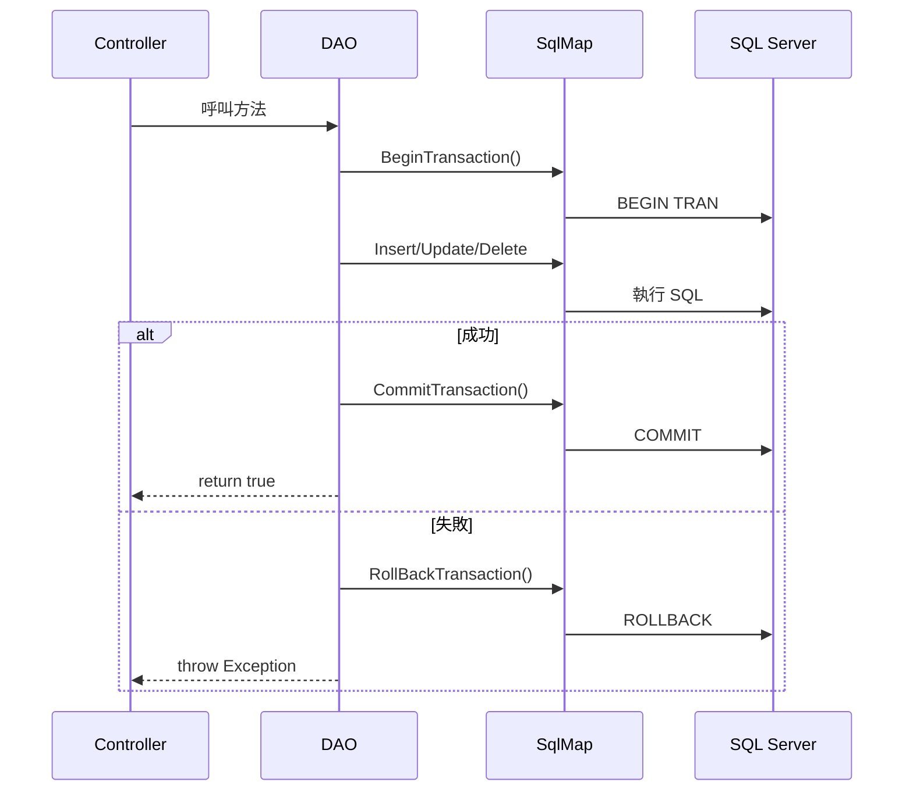
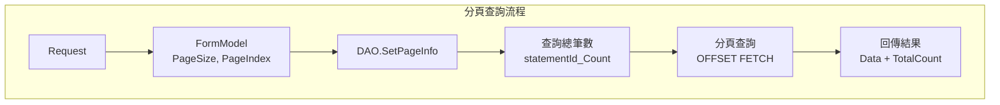
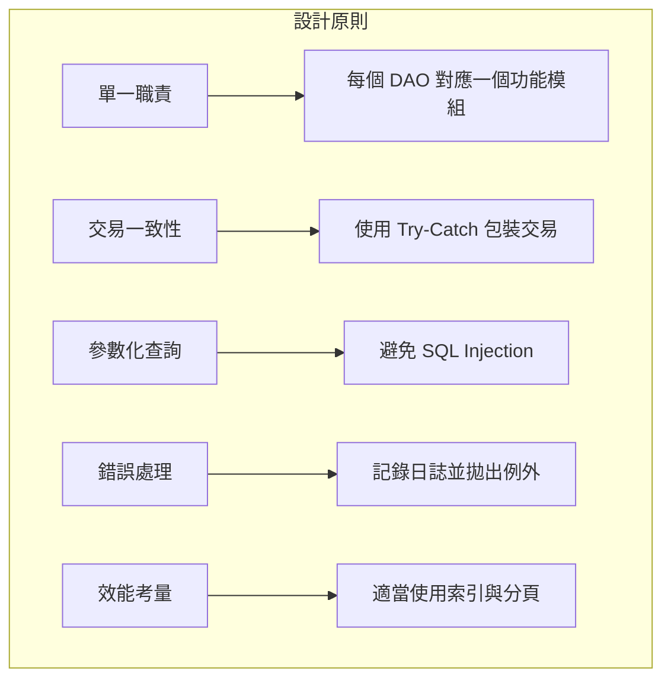

# EECOnline 資料庫存取層

## 1. 概述

EECOnline 採用 **DAO (Data Access Object) 模式** 搭配 **iBATIS.NET** 作為主要的資料存取層架構，同時也使用 **Dapper** 作為輔助的 Micro ORM。

### 1.1 資料存取架構



---

## 2. DAO 類別架構

### 2.1 類別繼承結構



### 2.2 DAO 類別列表

| DAO 類別 | 檔案位置 | 功能說明 |
|----------|----------|----------|
| `BaseDAO` | DataLayers/BaseDAO.cs | 基礎 DAO，提供交易與分頁 |
| `LoginDAO` | DataLayers/LoginDAO.cs | 登入驗證、密碼管理 |
| `FrontDAO` | DataLayers/FrontDAO.cs | 前台申請功能 |
| `A1DAO` ~ `A8DAO` | DataLayers/A1DAO.cs ~ A8DAO.cs | 各功能模組資料存取 |
| `SHAREDAO` | DataLayers/SHAREDAO.cs | 共用資料查詢 |
| `TransLogDAO` | DataLayers/TransLogDAO.cs | 交易日誌記錄 |
| `MyKeyMapDAO` | DataLayers/MyKeyMapDAO.cs | 代碼對照表 |
| `BackApplyDAO` | DataLayers/BackApplyDAO.cs | 後台申請處理 |

---

## 3. iBATIS.NET 設定

### 3.1 設定檔架構



### 3.2 SqlMap.config 結構

```xml
<?xml version="1.0" encoding="utf-8"?>
<sqlMapConfig xmlns="http://ibatis.apache.org/dataMapper"
              xmlns:xsi="http://www.w3.org/2001/XMLSchema-instance">
    
    <!-- 設定屬性 -->
    <settings>
        <setting useStatementNamespaces="true"/>
        <setting cacheModelsEnabled="true"/>
        <setting lazyLoadEnabled="false"/>
    </settings>
    
    <!-- 載入屬性檔 -->
    <properties resource="properties.config"/>
    
    <!-- 載入資料提供者 -->
    <providers resource="providers.config"/>
    
    <!-- 資料庫設定 -->
    <database>
        <provider name="SQLClient4"/>
        <dataSource name="EEC_PD_DB" 
                    connectionString="${connectionString}"/>
    </database>
    
    <!-- SQL Map 檔案 -->
    <sqlMaps>
        <sqlMap resource="SqlMaps/Login.xml"/>
        <sqlMap resource="SqlMaps/A1.xml"/>
        <sqlMap resource="SqlMaps/A2.xml"/>
        <sqlMap resource="SqlMaps/A3.xml"/>
        <sqlMap resource="SqlMaps/A4.xml"/>
        <sqlMap resource="SqlMaps/A5.xml"/>
        <sqlMap resource="SqlMaps/A6.xml"/>
        <sqlMap resource="SqlMaps/A7.xml"/>
        <sqlMap resource="SqlMaps/A8.xml"/>
        <sqlMap resource="SqlMaps/Commons.xml"/>
        <sqlMap resource="SqlMaps/KeyMap.xml"/>
        <sqlMap resource="SqlMaps/Report.xml"/>
        <sqlMap resource="SqlMaps/Front.xml"/>
        <sqlMap resource="SqlMaps/SHARE.xml"/>
        <sqlMap resource="SqlMaps/BackApply.xml"/>
        <sqlMap resource="SqlMaps/MaAPI.xml"/>
        <sqlMap resource="SqlMaps/AM.xml"/>
    </sqlMaps>
</sqlMapConfig>
```

---

## 4. SqlMap XML 語法

### 4.1 基本查詢語法

```xml
<!-- SqlMaps/A1.xml -->
<sqlMap namespace="A1" xmlns="http://ibatis.apache.org/mapping">
    
    <!-- 結果對應 -->
    <resultMaps>
        <resultMap id="HospitalResult" class="TblEEC_Hospital">
            <result property="HOSPITAL_CODE" column="HOSPITAL_CODE"/>
            <result property="HOSPITAL_NAME" column="HOSPITAL_NAME"/>
            <result property="HOSPITAL_ADDR" column="HOSPITAL_ADDR"/>
            <result property="CREATE_DATE" column="CREATE_DATE"/>
        </resultMap>
    </resultMaps>
    
    <!-- 查詢語句 -->
    <statements>
        <!-- 列表查詢 -->
        <select id="queryC101MGrid" 
                resultMap="HospitalResult"
                parameterClass="C101MFormModel">
            SELECT 
                HOSPITAL_CODE,
                HOSPITAL_NAME,
                HOSPITAL_ADDR,
                CREATE_DATE
            FROM EEC_Hospital
            WHERE 1=1
            <isNotEmpty property="HospitalCode">
                AND HOSPITAL_CODE LIKE '%' + #HospitalCode# + '%'
            </isNotEmpty>
            <isNotEmpty property="HospitalName">
                AND HOSPITAL_NAME LIKE '%' + #HospitalName# + '%'
            </isNotEmpty>
            ORDER BY CREATE_DATE DESC
        </select>
        
        <!-- 單筆查詢 -->
        <select id="getC101MDetail" 
                resultClass="TblEEC_Hospital"
                parameterClass="string">
            SELECT * FROM EEC_Hospital
            WHERE HOSPITAL_CODE = #value#
        </select>
        
        <!-- 新增 -->
        <insert id="insertC101M" parameterClass="TblEEC_Hospital">
            INSERT INTO EEC_Hospital (
                HOSPITAL_CODE, HOSPITAL_NAME, HOSPITAL_ADDR,
                CREATE_DATE, CREATE_USER
            ) VALUES (
                #HOSPITAL_CODE#, #HOSPITAL_NAME#, #HOSPITAL_ADDR#,
                GETDATE(), #CREATE_USER#
            )
        </insert>
        
        <!-- 更新 -->
        <update id="updateC101M" parameterClass="TblEEC_Hospital">
            UPDATE EEC_Hospital SET
                HOSPITAL_NAME = #HOSPITAL_NAME#,
                HOSPITAL_ADDR = #HOSPITAL_ADDR#,
                UPDATE_DATE = GETDATE(),
                UPDATE_USER = #UPDATE_USER#
            WHERE HOSPITAL_CODE = #HOSPITAL_CODE#
        </update>
        
        <!-- 刪除 -->
        <delete id="deleteC101M" parameterClass="string">
            DELETE FROM EEC_Hospital
            WHERE HOSPITAL_CODE = #value#
        </delete>
    </statements>
</sqlMap>
```

### 4.2 動態 SQL 語法



```xml
<!-- 動態條件範例 -->
<select id="queryWithDynamic" resultClass="hashmap">
    SELECT * FROM EEC_Apply
    <dynamic prepend="WHERE">
        <!-- 非空判斷 -->
        <isNotEmpty property="ApplyNo" prepend="AND">
            APPLY_NO = #ApplyNo#
        </isNotEmpty>
        
        <!-- 相等判斷 -->
        <isEqual property="Status" compareValue="1" prepend="AND">
            STATUS = '1'
        </isEqual>
        
        <!-- NULL 判斷 -->
        <isNotNull property="StartDate" prepend="AND">
            APPLY_DATE >= #StartDate#
        </isNotNull>
        
        <!-- 大於判斷 -->
        <isGreaterThan property="Amount" compareValue="0" prepend="AND">
            AMOUNT > #Amount#
        </isGreaterThan>
        
        <!-- 迭代 (IN 條件) -->
        <isNotEmpty property="StatusList" prepend="AND">
            STATUS IN
            <iterate property="StatusList" open="(" close=")" conjunction=",">
                #StatusList[]#
            </iterate>
        </isNotEmpty>
    </dynamic>
    ORDER BY APPLY_DATE DESC
</select>
```

---

## 5. DAO 實作範例

### 5.1 BaseDAO 基礎類別

```csharp
// DataLayers/BaseDAO.cs
public class BaseDAO : RowBaseDAO
{
    // 分頁資訊
    public PaginationInfo PageInfo { get; set; }
    
    // 設定分頁
    public void SetPageInfo(int pageSize, int pageIndex)
    {
        PageInfo = new PaginationInfo
        {
            PageSize = pageSize,
            PageIndex = pageIndex
        };
    }
    
    // 交易管理
    public void BeginTransaction()
    {
        SqlMap.BeginTransaction();
    }
    
    public void CommitTransaction()
    {
        SqlMap.CommitTransaction();
    }
    
    public void RollBackTransaction()
    {
        SqlMap.RollBackTransaction();
    }
    
    // 分頁查詢
    public IList<T> GetPagedList<T>(string statementId, object param)
    {
        // 查詢總筆數
        var countId = statementId + "_Count";
        var totalCount = SqlMap.QueryForObject<int>(countId, param);
        PageInfo.TotalCount = totalCount;
        
        // 分頁查詢
        var skip = (PageInfo.PageIndex - 1) * PageInfo.PageSize;
        return SqlMap.QueryForList<T>(statementId, param, skip, PageInfo.PageSize);
    }
}
```

### 5.2 功能 DAO 實作

```csharp
// DataLayers/A1DAO.cs
public class A1DAO : BaseDAO
{
    /// <summary>
    /// 查詢醫院列表
    /// </summary>
    public IList<C101MGridModel> QueryC101MGrid(C101MFormModel form)
    {
        return GetRowList<C101MGridModel>("A1.queryC101MGrid", form);
    }
    
    /// <summary>
    /// 取得醫院詳細資料
    /// </summary>
    public TblEEC_Hospital GetC101MDetail(string hospitalCode)
    {
        return GetRow<TblEEC_Hospital>("A1.getC101MDetail", hospitalCode);
    }
    
    /// <summary>
    /// 儲存醫院資料
    /// </summary>
    public bool SaveC101M(TblEEC_Hospital hospital, bool isNew)
    {
        try
        {
            BeginTransaction();
            
            if (isNew)
            {
                SqlMap.Insert("A1.insertC101M", hospital);
            }
            else
            {
                SqlMap.Update("A1.updateC101M", hospital);
            }
            
            CommitTransaction();
            return true;
        }
        catch (Exception ex)
        {
            RollBackTransaction();
            throw;
        }
    }
    
    /// <summary>
    /// 刪除醫院資料
    /// </summary>
    public bool DeleteC101M(string hospitalCode)
    {
        try
        {
            BeginTransaction();
            SqlMap.Delete("A1.deleteC101M", hospitalCode);
            CommitTransaction();
            return true;
        }
        catch
        {
            RollBackTransaction();
            throw;
        }
    }
}
```

---

## 6. Controller 呼叫 DAO

### 6.1 呼叫流程



### 6.2 Controller 程式碼範例

```csharp
// Areas/A1/Controllers/C101MController.cs
[LoginRequired]
public class C101MController : BaseController
{
    private A1DAO _dao = new A1DAO();
    
    /// <summary>
    /// 列表頁面
    /// </summary>
    public ActionResult Index()
    {
        var model = new C101MFormModel();
        return View(model);
    }
    
    /// <summary>
    /// 查詢 (AJAX)
    /// </summary>
    [HttpPost]
    public ActionResult Query(C101MFormModel form)
    {
        // 設定分頁
        _dao.SetPageInfo(form.PageSize, form.PageIndex);
        
        // 查詢資料
        var list = _dao.QueryC101MGrid(form);
        
        // 回傳 JSON
        return Json(new {
            success = true,
            data = list,
            total = _dao.PageInfo.TotalCount
        });
    }
    
    /// <summary>
    /// 新增頁面
    /// </summary>
    public ActionResult New()
    {
        var model = new TblEEC_Hospital();
        ViewBag.IsNew = true;
        return View("Detail", model);
    }
    
    /// <summary>
    /// 修改頁面
    /// </summary>
    public ActionResult Modify(string id)
    {
        var model = _dao.GetC101MDetail(id);
        ViewBag.IsNew = false;
        return View("Detail", model);
    }
    
    /// <summary>
    /// 儲存
    /// </summary>
    [HttpPost]
    public ActionResult Save(TblEEC_Hospital model, bool isNew)
    {
        try
        {
            // 設定異動資訊
            if (isNew)
            {
                model.CREATE_USER = CurrentUser.UserID;
            }
            else
            {
                model.UPDATE_USER = CurrentUser.UserID;
            }
            
            // 儲存
            _dao.SaveC101M(model, isNew);
            
            return Json(new { success = true, message = "儲存成功" });
        }
        catch (Exception ex)
        {
            return Json(new { success = false, message = ex.Message });
        }
    }
    
    /// <summary>
    /// 刪除
    /// </summary>
    [HttpPost]
    public ActionResult Delete(string id)
    {
        try
        {
            _dao.DeleteC101M(id);
            return Json(new { success = true, message = "刪除成功" });
        }
        catch (Exception ex)
        {
            return Json(new { success = false, message = ex.Message });
        }
    }
}
```

---

## 7. 交易管理

### 7.1 交易處理流程



### 7.2 交易處理範例

```csharp
public bool ProcessApply(string applyId, List<ApplyDetailModel> details)
{
    try
    {
        // 開始交易
        BeginTransaction();
        
        // 更新主檔
        SqlMap.Update("A2.updateApplyStatus", new { 
            ApplyId = applyId, 
            Status = "2" 
        });
        
        // 批次新增明細
        foreach (var detail in details)
        {
            detail.APPLY_ID = applyId;
            SqlMap.Insert("A2.insertApplyDetail", detail);
        }
        
        // 記錄日誌
        SqlMap.Insert("A2.insertProcessLog", new {
            ApplyId = applyId,
            ProcessDate = DateTime.Now,
            ProcessUser = CurrentUser.UserID
        });
        
        // 提交交易
        CommitTransaction();
        return true;
    }
    catch (Exception ex)
    {
        // 回滾交易
        RollBackTransaction();
        LogUtils.Error("ProcessApply Error", ex);
        throw;
    }
}
```

---

## 8. 分頁查詢

### 8.1 分頁機制



### 8.2 分頁 SQL 範例

```xml
<!-- 查詢總筆數 -->
<select id="queryC101MGrid_Count" resultClass="int" parameterClass="C101MFormModel">
    SELECT COUNT(1) FROM EEC_Hospital
    WHERE 1=1
    <isNotEmpty property="HospitalCode">
        AND HOSPITAL_CODE LIKE '%' + #HospitalCode# + '%'
    </isNotEmpty>
</select>

<!-- 分頁查詢 (SQL Server 2012+) -->
<select id="queryC101MGrid" resultClass="C101MGridModel" parameterClass="C101MFormModel">
    SELECT 
        HOSPITAL_CODE,
        HOSPITAL_NAME,
        HOSPITAL_ADDR
    FROM EEC_Hospital
    WHERE 1=1
    <isNotEmpty property="HospitalCode">
        AND HOSPITAL_CODE LIKE '%' + #HospitalCode# + '%'
    </isNotEmpty>
    ORDER BY CREATE_DATE DESC
    OFFSET $skip$ ROWS
    FETCH NEXT $pageSize$ ROWS ONLY
</select>
```

---

## 9. Dapper 使用

### 9.1 Dapper 簡介

Dapper 是輕量級的 Micro ORM，在 EECOnline 中用於較複雜的查詢或效能要求較高的場景。

### 9.2 Dapper 使用範例

```csharp
using Dapper;
using System.Data.SqlClient;

public class ReportDAO
{
    private string _connectionString;
    
    public ReportDAO()
    {
        _connectionString = ConfigurationManager.ConnectionStrings["EEC_PD_DB"].ConnectionString;
    }
    
    /// <summary>
    /// 使用 Dapper 查詢報表資料
    /// </summary>
    public IEnumerable<ReportModel> GetReportData(ReportParam param)
    {
        using (var conn = new SqlConnection(_connectionString))
        {
            var sql = @"
                SELECT 
                    a.APPLY_NO,
                    a.APPLY_DATE,
                    h.HOSPITAL_NAME,
                    COUNT(d.DETAIL_ID) as DetailCount,
                    SUM(d.PRICE) as TotalAmount
                FROM EEC_Apply a
                INNER JOIN EEC_Hospital h ON a.HOSPITAL_CODE = h.HOSPITAL_CODE
                LEFT JOIN EEC_ApplyDetail d ON a.APPLY_ID = d.APPLY_ID
                WHERE a.APPLY_DATE BETWEEN @StartDate AND @EndDate
                GROUP BY a.APPLY_NO, a.APPLY_DATE, h.HOSPITAL_NAME
                ORDER BY a.APPLY_DATE DESC";
            
            return conn.Query<ReportModel>(sql, param);
        }
    }
    
    /// <summary>
    /// 使用 Dapper 執行預存程序
    /// </summary>
    public IEnumerable<StatisticsModel> GetStatistics(int year, int month)
    {
        using (var conn = new SqlConnection(_connectionString))
        {
            return conn.Query<StatisticsModel>(
                "sp_GetMonthlyStatistics",
                new { Year = year, Month = month },
                commandType: CommandType.StoredProcedure
            );
        }
    }
}
```

---

## 10. 最佳實踐

### 10.1 DAO 設計原則



### 10.2 注意事項

| 項目 | 說明 |
|------|------|
| SQL Injection 防護 | 使用 `#param#` 參數化，避免使用 `$param$` |
| 交易管理 | 多表操作必須使用交易 |
| 連線管理 | 使用 `using` 確保連線釋放 |
| 日誌記錄 | 重要操作需記錄稽核日誌 |
| 分頁查詢 | 大量資料必須使用分頁 |
| 快取機制 | 靜態資料可啟用 iBATIS 快取 |

### 10.3 SqlMap 命名規範

| 類型 | 命名格式 | 範例 |
|------|----------|------|
| 列表查詢 | queryXXXGrid | queryC101MGrid |
| 單筆查詢 | getXXXDetail | getC101MDetail |
| 新增 | insertXXX | insertC101M |
| 更新 | updateXXX | updateC101M |
| 刪除 | deleteXXX | deleteC101M |
| 總筆數 | queryXXX_Count | queryC101MGrid_Count |

---

本文件說明 EECOnline 的資料庫存取層架構，包含 DAO 模式、iBATIS.NET 設定與語法、交易管理、分頁查詢等核心技術。
