# EECOnline MVC Areas 架構

## 1. Areas 概述

ASP.NET MVC Areas 允許將大型應用程式劃分為較小的功能區塊，每個 Area 都有自己的 Controllers、Models 和 Views。EECOnline 使用 Areas 來組織不同的功能模組。

### 1.1 Areas 總覽

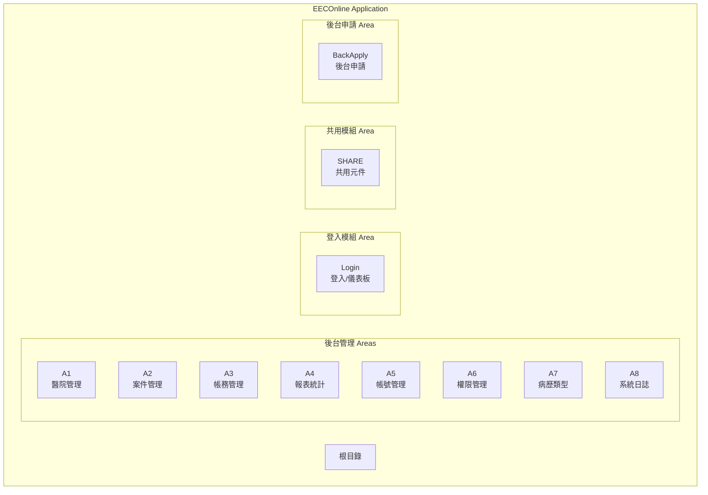

### 1.2 Areas 功能對照表

| Area | 功能模組 | 說明 | 主要 Controller |
|------|----------|------|-----------------|
| A1 | 醫院管理 | 醫院資料、收費標準設定 | C101M, C102M |
| A2 | 案件管理 | 申請案件處理與追蹤 | C101M, C102M |
| A3 | 帳務管理 | 繳費記錄、對帳報表 | C101M-C104M |
| A4 | 報表統計 | 統計報表、資料匯出 | C101M-C103M |
| A5 | 帳號管理 | 使用者帳號維護 | C101M, C102M |
| A6 | 權限管理 | 群組、角色、功能權限 | C101M-C104M |
| A7 | 病歷類型 | 電子病歷項目設定 | C101M-C104M |
| A8 | 系統日誌 | 操作記錄、稽核軌跡 | C101M-C103M |
| Login | 登入模組 | 身份驗證、後台儀表板 | C101M, C102M |
| SHARE | 共用元件 | 郵遞區號、單位選擇等 | GRP, OPERAT, UNIT, ZIP_CO |
| BackApply | 後台申請 | 後台代申請功能 | - |

---

## 2. Area 目錄結構

### 2.1 標準 Area 結構

```
Areas/
├── A1/                           # 醫院管理
│   ├── A1AreaRegistration.cs     # Area 註冊
│   ├── Controllers/              # 控制器
│   │   ├── C101MController.cs    # 醫院資料管理
│   │   └── C102MController.cs    # 收費標準設定
│   ├── Models/                   # 視圖模型
│   │   ├── C101MFormModel.cs     # 查詢表單
│   │   ├── C101MGridModel.cs     # 列表資料
│   │   └── C101MDetailModel.cs   # 詳細資料
│   └── Views/                    # 視圖
│       ├── C101M/                # 醫院資料視圖
│       │   ├── Index.cshtml
│       │   ├── Detail.cshtml
│       │   └── _Grid.cshtml
│       └── C102M/                # 收費標準視圖
│           ├── Index.cshtml
│           └── Detail.cshtml
├── A2/                           # 案件管理
│   └── ...
├── Login/                        # 登入模組
│   └── ...
└── SHARE/                        # 共用元件
    └── ...
```

### 2.2 目錄結構圖

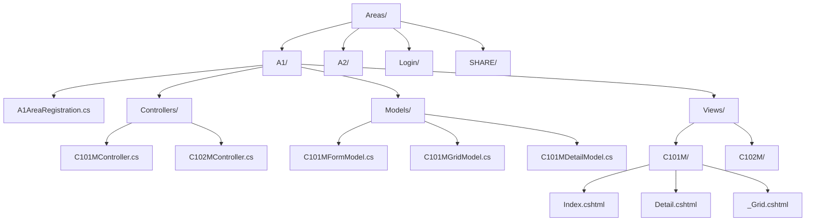

---

## 3. Area 註冊

### 3.1 AreaRegistration 類別

每個 Area 都有一個 `AreaRegistration` 類別負責註冊路由：

```csharp
// Areas/A1/A1AreaRegistration.cs
namespace EECOnline.Areas.A1
{
    public class A1AreaRegistration : AreaRegistration
    {
        public override string AreaName
        {
            get { return "A1"; }
        }

        public override void RegisterArea(AreaRegistrationContext context)
        {
            // 預設路由
            context.MapRoute(
                "A1_default",
                "A1/{controller}/{action}/{id}",
                new { action = "Index", id = UrlParameter.Optional }
            );
        }
    }
}
```

### 3.2 全域 Area 註冊

```csharp
// Global.asax.cs
protected void Application_Start()
{
    // 註冊所有 Areas
    AreaRegistration.RegisterAllAreas();
    
    // 其他初始化...
    FilterConfig.RegisterGlobalFilters(GlobalFilters.Filters);
    RouteConfig.RegisterRoutes(RouteTable.Routes);
    BundleConfig.RegisterBundles(BundleTable.Bundles);
}
```

### 3.3 路由對應

```mermaid
graph LR
    subgraph "URL 路由對應"
        URL1[/A1/C101M/Index] --> CTRL1[A1.C101MController.Index]
        URL2[/A1/C101M/Detail/1] --> CTRL2[A1.C101MController.Detail]
        URL3[/Login/C101M/Login] --> CTRL3[Login.C101MController.Login]
        URL4[/SHARE/ZIP_CO/GetList] --> CTRL4[SHARE.ZIP_COController.GetList]
    end
```

---

## 4. 各 Area 詳細說明

### 4.1 A1 - 醫院管理

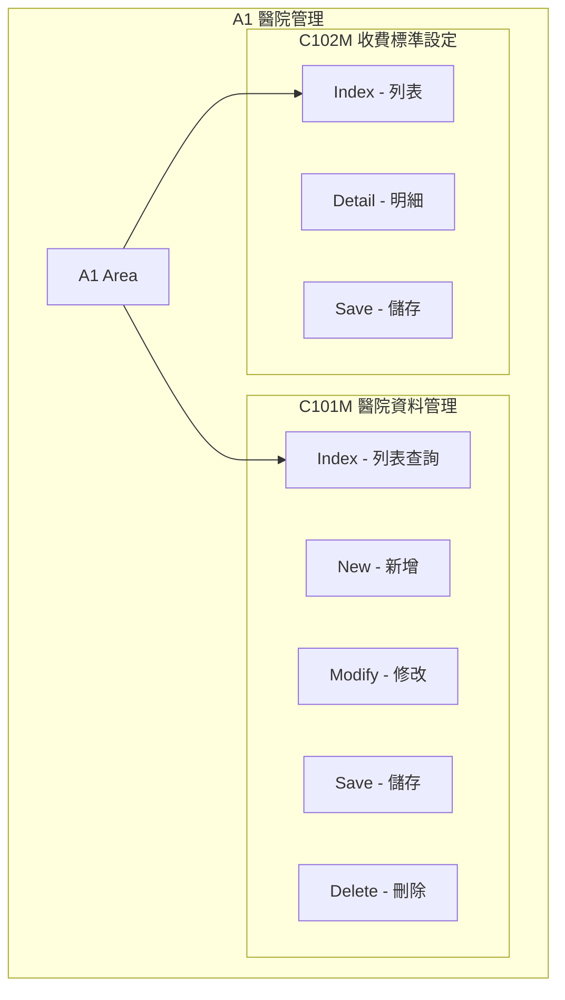

**功能說明：**
- **C101M**: 醫院基本資料維護（院所代碼、名稱、地址、聯絡人等）
- **C102M**: 各醫院電子病歷收費標準設定

### 4.2 A2 - 案件管理

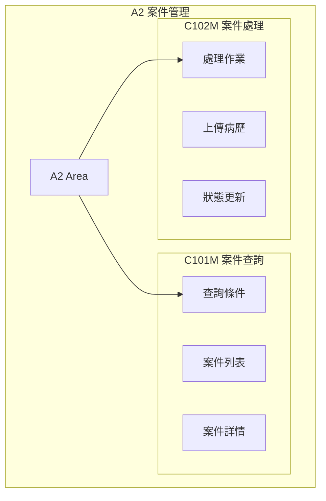

**功能說明：**
- **C101M**: 申請案件查詢與檢視
- **C102M**: 案件處理、病歷上傳、狀態更新

### 4.3 A3 - 帳務管理

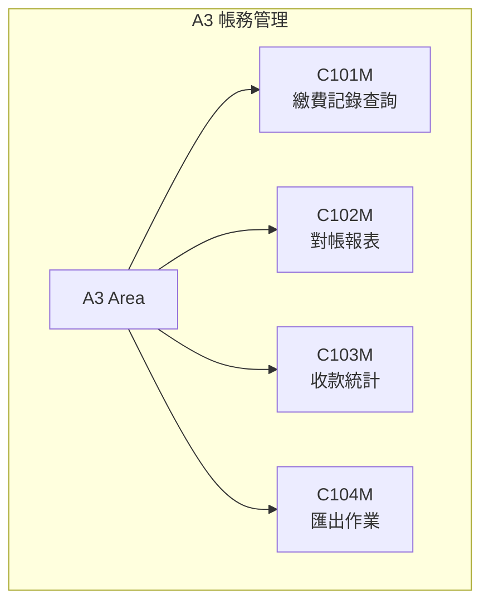

**功能說明：**
- **C101M**: 繳費記錄查詢
- **C102M**: 對帳報表產製
- **C103M**: 收款統計分析
- **C104M**: 資料匯出功能

### 4.4 A4 - 報表統計

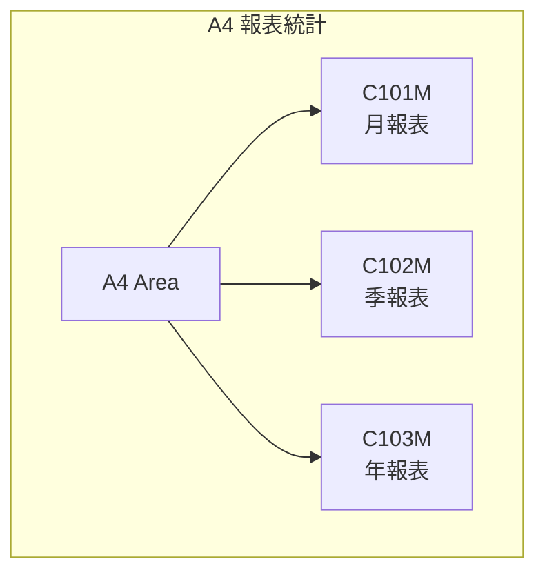

**功能說明：**
- **C101M**: 月度統計報表
- **C102M**: 季度統計報表
- **C103M**: 年度統計報表

### 4.5 A5 - 帳號管理

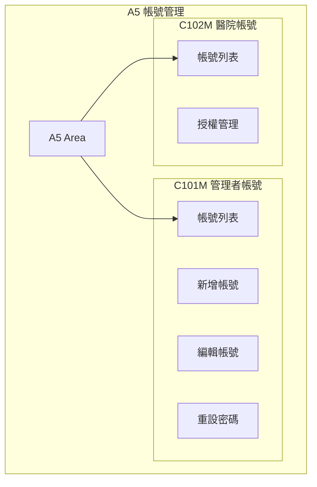

**功能說明：**
- **C101M**: 系統管理員帳號維護
- **C102M**: 醫院管理員帳號管理

### 4.6 A6 - 權限管理

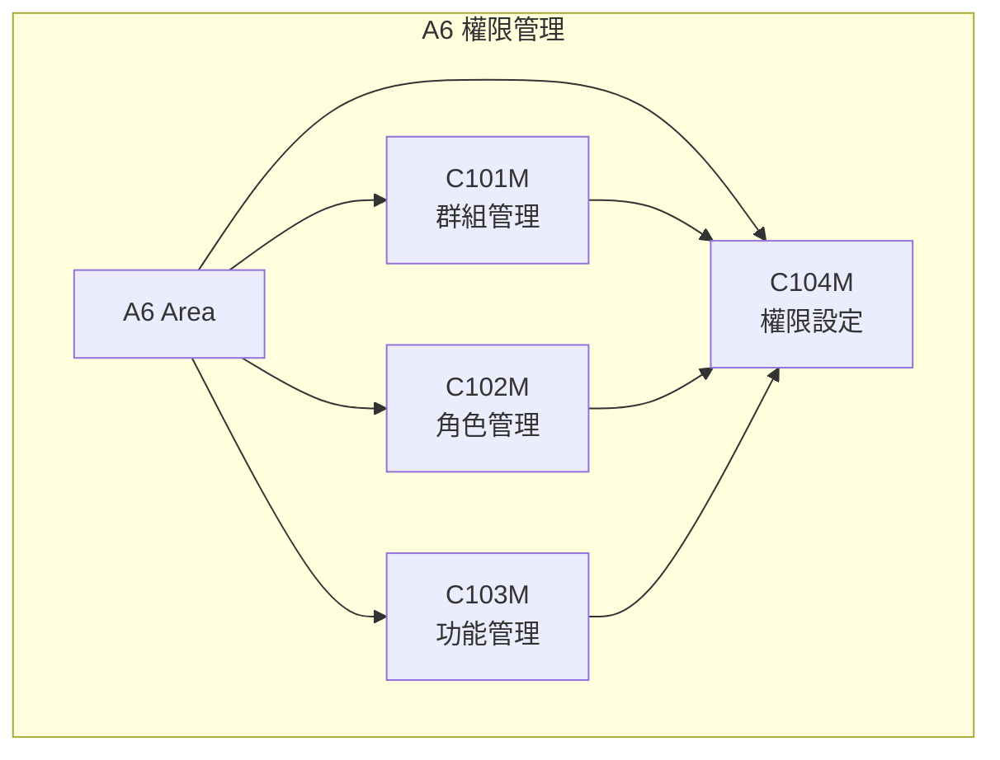

**功能說明：**
- **C101M**: 群組（Group）管理
- **C102M**: 角色（Role）管理
- **C103M**: 功能（Function）管理
- **C104M**: 權限對應設定

### 4.7 A7 - 病歷類型設定

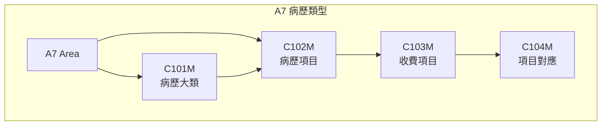

**功能說明：**
- **C101M**: 電子病歷大分類管理
- **C102M**: 病歷項目細項設定
- **C103M**: 收費項目設定
- **C104M**: 項目與收費對應

### 4.8 A8 - 系統日誌

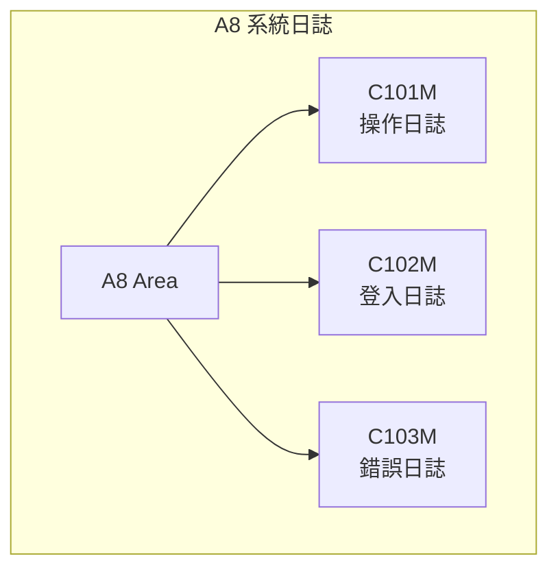

**功能說明：**
- **C101M**: 使用者操作記錄
- **C102M**: 登入/登出記錄
- **C103M**: 系統錯誤記錄

### 4.9 Login - 登入模組

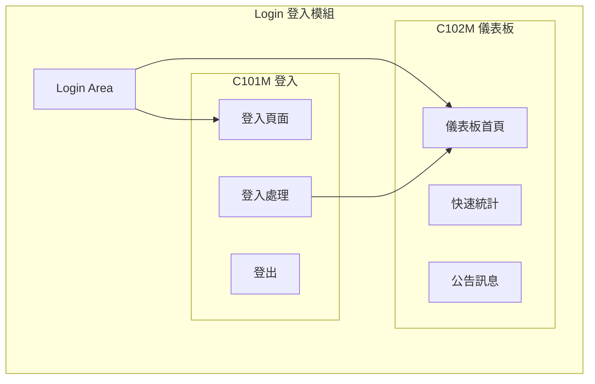

**功能說明：**
- **C101M**: 後台登入頁面與驗證
- **C102M**: 後台儀表板與首頁

### 4.10 SHARE - 共用元件

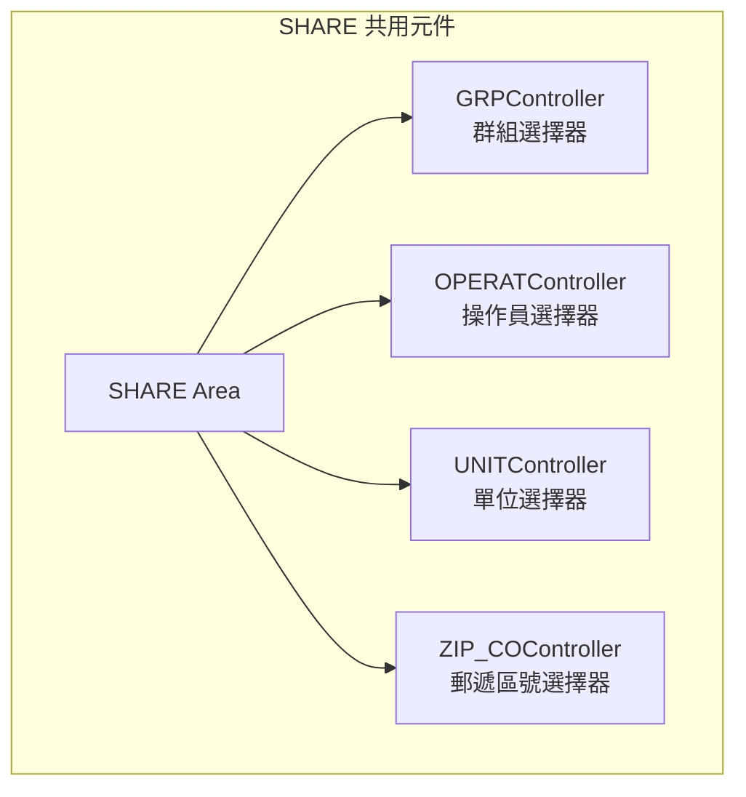

**功能說明：**
- **GRP**: 群組下拉選單
- **OPERAT**: 操作人員選擇
- **UNIT**: 單位/機關選擇
- **ZIP_CO**: 郵遞區號（縣市-區鄉鎮）選擇

---

## 5. Controller 標準模式

### 5.1 Controller 繼承結構

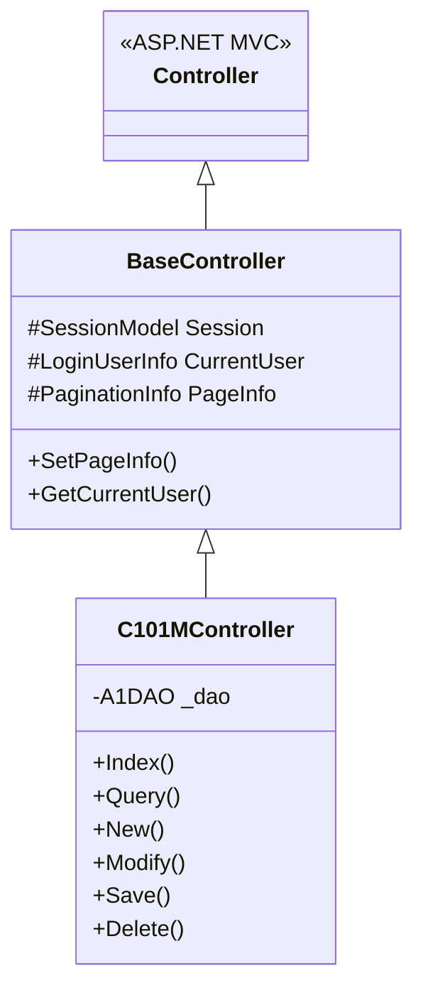

### 5.2 標準 CRUD Action

```csharp
// Areas/A1/Controllers/C101MController.cs
namespace EECOnline.Areas.A1.Controllers
{
    [LoginRequired]
    public class C101MController : BaseController
    {
        private A1DAO _dao = new A1DAO();
        
        /// <summary>
        /// 列表頁面
        /// </summary>
        public ActionResult Index()
        {
            var model = new C101MFormModel();
            return View(model);
        }
        
        /// <summary>
        /// 查詢 (AJAX)
        /// </summary>
        [HttpPost]
        public ActionResult Query(C101MFormModel form)
        {
            _dao.SetPageInfo(form.PageSize, form.PageIndex);
            var list = _dao.QueryC101MGrid(form);
            
            return Json(new {
                success = true,
                rows = list,
                total = _dao.PageInfo.TotalCount
            });
        }
        
        /// <summary>
        /// 新增頁面
        /// </summary>
        public ActionResult New()
        {
            var model = new TblEEC_Hospital();
            ViewBag.IsNew = true;
            return View("Detail", model);
        }
        
        /// <summary>
        /// 修改頁面
        /// </summary>
        public ActionResult Modify(string id)
        {
            var model = _dao.GetC101MDetail(id);
            if (model == null)
            {
                return RedirectToAction("Index");
            }
            ViewBag.IsNew = false;
            return View("Detail", model);
        }
        
        /// <summary>
        /// 儲存
        /// </summary>
        [HttpPost]
        [ValidateAntiForgeryToken]
        public ActionResult Save(TblEEC_Hospital model, bool isNew)
        {
            try
            {
                // 驗證
                if (!ModelState.IsValid)
                {
                    return Json(new { success = false, message = "資料驗證失敗" });
                }
                
                // 設定異動資訊
                if (isNew)
                {
                    model.CREATE_USER = CurrentUser.UserID;
                    model.CREATE_DATE = DateTime.Now;
                }
                else
                {
                    model.UPDATE_USER = CurrentUser.UserID;
                    model.UPDATE_DATE = DateTime.Now;
                }
                
                // 儲存
                _dao.SaveC101M(model, isNew);
                
                return Json(new { success = true, message = "儲存成功" });
            }
            catch (Exception ex)
            {
                LogUtils.Error("Save Error", ex);
                return Json(new { success = false, message = "儲存失敗：" + ex.Message });
            }
        }
        
        /// <summary>
        /// 刪除
        /// </summary>
        [HttpPost]
        public ActionResult Delete(string id)
        {
            try
            {
                _dao.DeleteC101M(id);
                return Json(new { success = true, message = "刪除成功" });
            }
            catch (Exception ex)
            {
                LogUtils.Error("Delete Error", ex);
                return Json(new { success = false, message = "刪除失敗：" + ex.Message });
            }
        }
    }
}
```

---

## 6. View 標準結構

### 6.1 Index.cshtml (列表頁)

```html
@model EECOnline.Areas.A1.Models.C101MFormModel
@{
    ViewBag.Title = "醫院資料管理";
    Layout = "~/Views/Shared/_MainLayout.cshtml";
}

<div class="content-wrapper">
    <!-- 查詢表單 -->
    <div class="box box-primary">
        <div class="box-header">
            <h3 class="box-title">查詢條件</h3>
        </div>
        <div class="box-body">
            @using (Html.BeginForm("Query", "C101M", FormMethod.Post, new { id = "queryForm" }))
            {
                <div class="row">
                    <div class="col-md-4">
                        @Html.LabelFor(m => m.HospitalCode)
                        @Html.TextBoxFor(m => m.HospitalCode, new { @class = "form-control" })
                    </div>
                    <div class="col-md-4">
                        @Html.LabelFor(m => m.HospitalName)
                        @Html.TextBoxFor(m => m.HospitalName, new { @class = "form-control" })
                    </div>
                    <div class="col-md-4">
                        <button type="button" class="btn btn-primary" onclick="doQuery()">
                            <i class="fa fa-search"></i> 查詢
                        </button>
                        <button type="button" class="btn btn-success" onclick="doNew()">
                            <i class="fa fa-plus"></i> 新增
                        </button>
                    </div>
                </div>
            }
        </div>
    </div>
    
    <!-- 資料列表 -->
    <div class="box">
        <div class="box-body">
            <table id="dataGrid" class="table table-bordered table-hover">
                <thead>
                    <tr>
                        <th>院所代碼</th>
                        <th>院所名稱</th>
                        <th>地址</th>
                        <th>操作</th>
                    </tr>
                </thead>
                <tbody id="gridBody">
                </tbody>
            </table>
            <!-- 分頁 -->
            <div id="paging"></div>
        </div>
    </div>
</div>

@section scripts {
    <script>
        function doQuery() {
            $.ajax({
                url: '@Url.Action("Query")',
                type: 'POST',
                data: $('#queryForm').serialize(),
                success: function(response) {
                    if (response.success) {
                        renderGrid(response.rows);
                        renderPaging(response.total);
                    }
                }
            });
        }
        
        function doNew() {
            window.location.href = '@Url.Action("New")';
        }
        
        function doModify(id) {
            window.location.href = '@Url.Action("Modify")' + '?id=' + id;
        }
        
        function doDelete(id) {
            if (confirm('確定要刪除嗎？')) {
                $.post('@Url.Action("Delete")', { id: id }, function(response) {
                    if (response.success) {
                        doQuery();
                    } else {
                        alert(response.message);
                    }
                });
            }
        }
        
        $(function() {
            doQuery();
        });
    </script>
}
```

### 6.2 Detail.cshtml (詳細頁)

```html
@model EECOnline.Models.Entities.TblEEC_Hospital
@{
    ViewBag.Title = ViewBag.IsNew ? "新增醫院" : "修改醫院";
    Layout = "~/Views/Shared/_MainLayout.cshtml";
}

<div class="content-wrapper">
    <div class="box box-primary">
        <div class="box-header">
            <h3 class="box-title">@ViewBag.Title</h3>
        </div>
        @using (Html.BeginForm("Save", "C101M", FormMethod.Post, new { id = "detailForm" }))
        {
            @Html.AntiForgeryToken()
            @Html.Hidden("isNew", ViewBag.IsNew)
            
            <div class="box-body">
                <div class="row">
                    <div class="col-md-6">
                        <div class="form-group">
                            @Html.LabelFor(m => m.HOSPITAL_CODE, "院所代碼")
                            @Html.TextBoxFor(m => m.HOSPITAL_CODE, new { 
                                @class = "form-control", 
                                @readonly = !ViewBag.IsNew 
                            })
                        </div>
                    </div>
                    <div class="col-md-6">
                        <div class="form-group">
                            @Html.LabelFor(m => m.HOSPITAL_NAME, "院所名稱")
                            @Html.TextBoxFor(m => m.HOSPITAL_NAME, new { @class = "form-control" })
                        </div>
                    </div>
                </div>
                <div class="row">
                    <div class="col-md-12">
                        <div class="form-group">
                            @Html.LabelFor(m => m.HOSPITAL_ADDR, "地址")
                            @Html.TextBoxFor(m => m.HOSPITAL_ADDR, new { @class = "form-control" })
                        </div>
                    </div>
                </div>
            </div>
            
            <div class="box-footer">
                <button type="button" class="btn btn-primary" onclick="doSave()">
                    <i class="fa fa-save"></i> 儲存
                </button>
                <button type="button" class="btn btn-default" onclick="doBack()">
                    <i class="fa fa-arrow-left"></i> 返回
                </button>
            </div>
        }
    </div>
</div>

@section scripts {
    <script>
        function doSave() {
            $.ajax({
                url: '@Url.Action("Save")',
                type: 'POST',
                data: $('#detailForm').serialize(),
                success: function(response) {
                    if (response.success) {
                        alert(response.message);
                        doBack();
                    } else {
                        alert(response.message);
                    }
                }
            });
        }
        
        function doBack() {
            window.location.href = '@Url.Action("Index")';
        }
    </script>
}
```

---

## 7. Model 標準結構

### 7.1 FormModel (查詢表單)

```csharp
// Areas/A1/Models/C101MFormModel.cs
public class C101MFormModel : PagingFormModel
{
    [Display(Name = "院所代碼")]
    public string HospitalCode { get; set; }
    
    [Display(Name = "院所名稱")]
    public string HospitalName { get; set; }
    
    [Display(Name = "狀態")]
    public string Status { get; set; }
}

// 分頁基礎模型
public class PagingFormModel
{
    public int PageIndex { get; set; } = 1;
    public int PageSize { get; set; } = 20;
}
```

### 7.2 GridModel (列表資料)

```csharp
// Areas/A1/Models/C101MGridModel.cs
public class C101MGridModel
{
    public string HOSPITAL_CODE { get; set; }
    public string HOSPITAL_NAME { get; set; }
    public string HOSPITAL_ADDR { get; set; }
    public string STATUS { get; set; }
    public string STATUS_NAME { get; set; }
    public DateTime? CREATE_DATE { get; set; }
}
```

### 7.3 DetailModel (詳細資料)

```csharp
// Areas/A1/Models/C101MDetailModel.cs
public class C101MDetailModel
{
    [Required(ErrorMessage = "院所代碼為必填")]
    [Display(Name = "院所代碼")]
    [StringLength(10)]
    public string HOSPITAL_CODE { get; set; }
    
    [Required(ErrorMessage = "院所名稱為必填")]
    [Display(Name = "院所名稱")]
    [StringLength(100)]
    public string HOSPITAL_NAME { get; set; }
    
    [Display(Name = "地址")]
    [StringLength(200)]
    public string HOSPITAL_ADDR { get; set; }
    
    [Display(Name = "電話")]
    [Phone(ErrorMessage = "電話格式不正確")]
    public string PHONE { get; set; }
    
    [Display(Name = "電子郵件")]
    [EmailAddress(ErrorMessage = "Email格式不正確")]
    public string EMAIL { get; set; }
}
```

---

## 8. Area 間的互動

### 8.1 跨 Area 呼叫

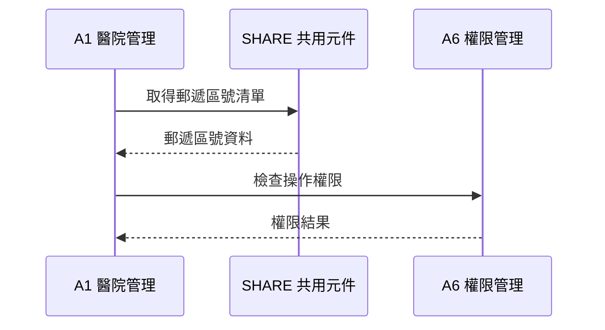

### 8.2 共用元件呼叫範例

```javascript
// 在 A1 的 View 中使用 SHARE 的郵遞區號選擇器
$.ajax({
    url: '/SHARE/ZIP_CO/GetCityList',
    type: 'GET',
    success: function(data) {
        $('#citySelect').html(data);
    }
});

// 選擇縣市後取得區域
$('#citySelect').change(function() {
    var cityCode = $(this).val();
    $.ajax({
        url: '/SHARE/ZIP_CO/GetDistrictList',
        type: 'GET',
        data: { cityCode: cityCode },
        success: function(data) {
            $('#districtSelect').html(data);
        }
    });
});
```

---

## 9. 命名規範

### 9.1 Controller 命名

| 類型 | 格式 | 範例 |
|------|------|------|
| 主要功能 | C{序號}MController | C101MController |
| 次要功能 | C{序號}MController | C102MController |
| 共用元件 | {功能名}Controller | ZIP_COController |

### 9.2 Action 命名

| 操作 | Action 名稱 | HTTP 方法 |
|------|------------|-----------|
| 列表頁 | Index | GET |
| 查詢 | Query | POST |
| 新增頁 | New | GET |
| 修改頁 | Modify | GET |
| 儲存 | Save | POST |
| 刪除 | Delete | POST |
| 詳細 | Detail | GET |
| 匯出 | Export | GET/POST |

### 9.3 View 命名

| 類型 | 命名 | 說明 |
|------|------|------|
| 列表頁 | Index.cshtml | 主要列表頁面 |
| 詳細頁 | Detail.cshtml | 新增/修改共用 |
| 部分視圖 | _Grid.cshtml | 列表區塊 |
| 部分視圖 | _Form.cshtml | 表單區塊 |

---

本文件說明 EECOnline 的 MVC Areas 架構，包含各 Area 的功能說明、目錄結構、Controller/View/Model 的標準模式與命名規範。
