# EECOnline 前台申請流程

## 1. 概述

民眾可透過 EECOnline 前台系統線上申請電子病歷，整個流程包含身份驗證、選擇醫院、選擇病歷項目、確認費用、線上付款及下載病歷等步驟。

### 1.1 申請流程總覽

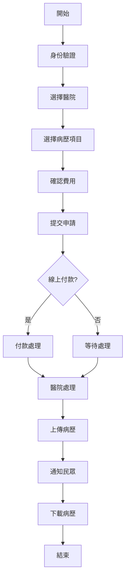

---

## 2. 身份驗證流程

### 2.1 驗證方式選擇

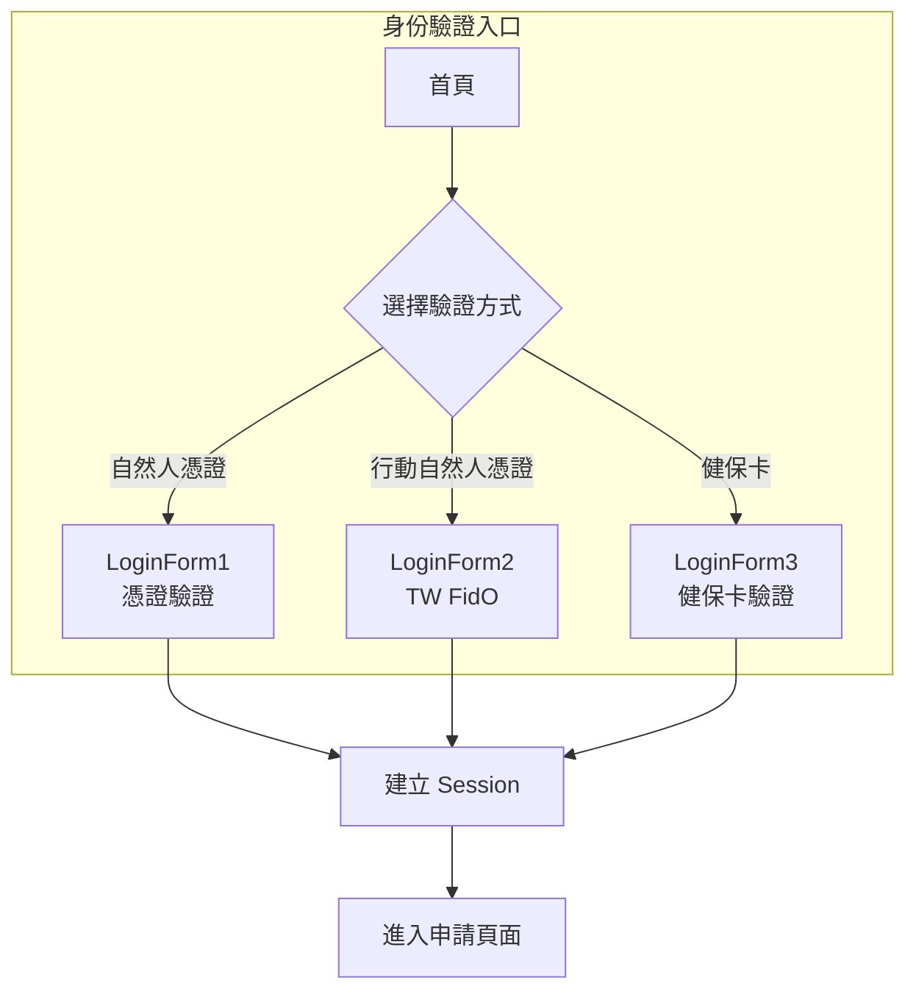

### 2.2 驗證成功後的處理

```csharp
// Controllers/HomeController.cs
private void CreateUserSession(TblEEC_User user, LoginType loginType)
{
    // 建立前台使用者 Session
    var sessionModel = new SessionModel
    {
        LoginUserInfo = new LoginUserInfo
        {
            UserID = user.USER_ID,
            UserName = user.USER_NAME,
            IDN = user.IDN,              // 身分證字號
            RoleType = "CITIZEN",        // 民眾角色
            LoginTime = DateTime.Now,
            LoginType = loginType.ToString()
        }
    };
    
    Session["FrontSession"] = sessionModel;
    
    // 記錄登入日誌
    _frontDAO.InsertLoginLog(new LoginLog
    {
        USER_ID = user.USER_ID,
        IDN = user.IDN,
        LOGIN_TIME = DateTime.Now,
        LOGIN_IP = GetClientIP(),
        LOGIN_TYPE = loginType.ToString()
    });
}
```

---

## 3. 申請作業流程

### 3.1 申請頁面結構

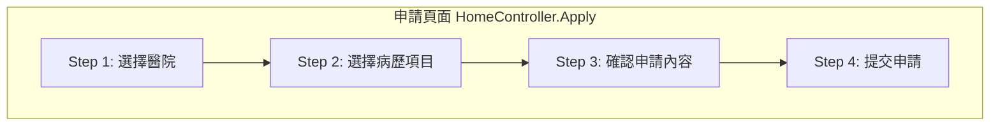

### 3.2 選擇醫院

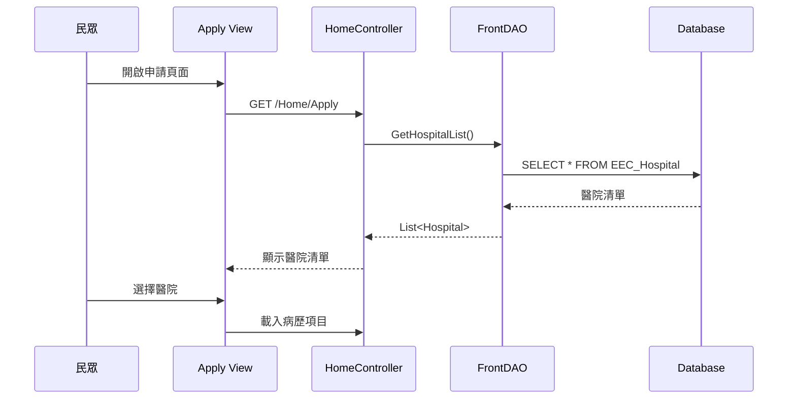

#### 程式碼實作

```csharp
// Controllers/HomeController.cs
public ActionResult Apply()
{
    // 檢查登入狀態
    var session = GetFrontSession();
    if (session == null)
    {
        return RedirectToAction("Index");
    }
    
    // 取得醫院清單
    var hospitals = _frontDAO.GetActiveHospitalList();
    ViewBag.Hospitals = hospitals;
    
    // 取得使用者基本資料
    var user = _frontDAO.GetUserByIDN(session.LoginUserInfo.IDN);
    var model = new ApplyModel
    {
        IDN = user.IDN,
        UserName = user.USER_NAME,
        Phone = user.PHONE,
        Email = user.EMAIL,
        Address = user.ADDRESS
    };
    
    return View(model);
}
```

### 3.3 選擇病歷項目

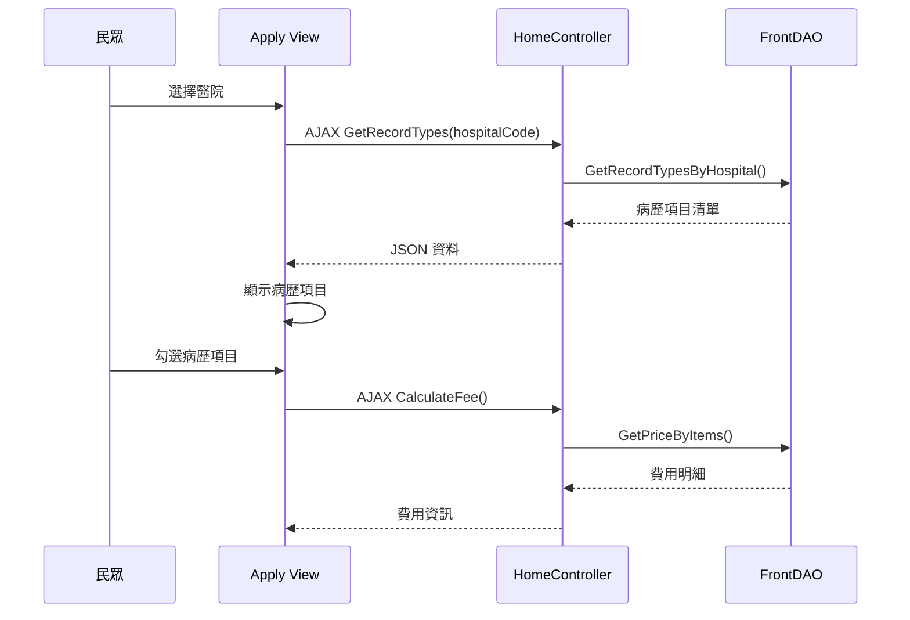

#### 取得病歷項目

```csharp
// Controllers/HomeController.cs
[HttpPost]
public ActionResult GetRecordTypes(string hospitalCode)
{
    try
    {
        // 取得該醫院提供的病歷類型
        var recordTypes = _frontDAO.GetRecordTypesByHospital(hospitalCode);
        
        return Json(new {
            success = true,
            data = recordTypes.Select(r => new {
                RecordTypeCode = r.RECORD_TYPE_CODE,
                RecordTypeName = r.RECORD_TYPE_NAME,
                Price = r.PRICE,
                Description = r.DESCRIPTION
            })
        });
    }
    catch (Exception ex)
    {
        return Json(new { success = false, message = ex.Message });
    }
}

[HttpPost]
public ActionResult CalculateFee(string hospitalCode, List<string> recordTypeCodes)
{
    try
    {
        decimal totalFee = 0;
        var feeDetails = new List<FeeDetailModel>();
        
        foreach (var code in recordTypeCodes)
        {
            var price = _frontDAO.GetRecordTypePrice(hospitalCode, code);
            feeDetails.Add(new FeeDetailModel
            {
                RecordTypeCode = code,
                RecordTypeName = price.RECORD_TYPE_NAME,
                Price = price.PRICE
            });
            totalFee += price.PRICE;
        }
        
        return Json(new {
            success = true,
            details = feeDetails,
            totalFee = totalFee
        });
    }
    catch (Exception ex)
    {
        return Json(new { success = false, message = ex.Message });
    }
}
```

### 3.4 提交申請

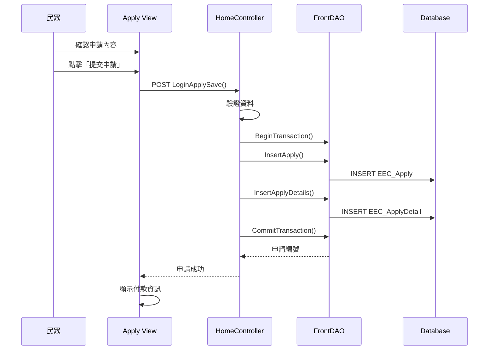

#### 申請儲存程式碼

```csharp
// Controllers/HomeController.cs
[HttpPost]
public ActionResult LoginApplySave(ApplyFormModel model)
{
    try
    {
        var session = GetFrontSession();
        if (session == null)
        {
            return Json(new { success = false, message = "請先登入" });
        }
        
        // 驗證資料
        if (!ValidateApplyData(model))
        {
            return Json(new { success = false, message = "資料驗證失敗" });
        }
        
        // 產生申請編號
        string applyNo = GenerateApplyNo();
        
        // 開始交易
        _frontDAO.BeginTransaction();
        
        try
        {
            // 建立申請主檔
            var apply = new TblEEC_Apply
            {
                APPLY_NO = applyNo,
                USER_ID = session.LoginUserInfo.UserID,
                IDN = session.LoginUserInfo.IDN,
                USER_NAME = model.UserName,
                PHONE = model.Phone,
                EMAIL = model.Email,
                ADDRESS = model.Address,
                HOSPITAL_CODE = model.HospitalCode,
                STATUS = "01",  // 待付款
                APPLY_DATE = DateTime.Now,
                CREATE_DATE = DateTime.Now
            };
            
            _frontDAO.InsertApply(apply);
            
            // 建立申請明細
            decimal totalFee = 0;
            foreach (var item in model.RecordItems)
            {
                var price = _frontDAO.GetRecordTypePrice(model.HospitalCode, item.RecordTypeCode);
                
                var detail = new TblEEC_ApplyDetail
                {
                    APPLY_NO = applyNo,
                    RECORD_TYPE_CODE = item.RecordTypeCode,
                    RECORD_TYPE_NAME = price.RECORD_TYPE_NAME,
                    PRICE = price.PRICE,
                    STATUS = "01",
                    CREATE_DATE = DateTime.Now
                };
                
                _frontDAO.InsertApplyDetail(detail);
                totalFee += price.PRICE;
            }
            
            // 更新總金額
            _frontDAO.UpdateApplyTotalFee(applyNo, totalFee);
            
            // 提交交易
            _frontDAO.CommitTransaction();
            
            return Json(new {
                success = true,
                applyNo = applyNo,
                totalFee = totalFee,
                message = "申請成功"
            });
        }
        catch
        {
            _frontDAO.RollBackTransaction();
            throw;
        }
    }
    catch (Exception ex)
    {
        LogUtils.Error("LoginApplySave Error", ex);
        return Json(new { success = false, message = "申請失敗：" + ex.Message });
    }
}

private string GenerateApplyNo()
{
    // 格式: EEC + 民國年 + 月 + 日 + 流水號
    string dateStr = DateTime.Now.ToString("yyyMMdd");
    int seq = _frontDAO.GetNextApplySeq(dateStr);
    return $"EEC{dateStr}{seq:D4}";
}
```

---

## 4. 線上付款流程

### 4.1 付款流程圖

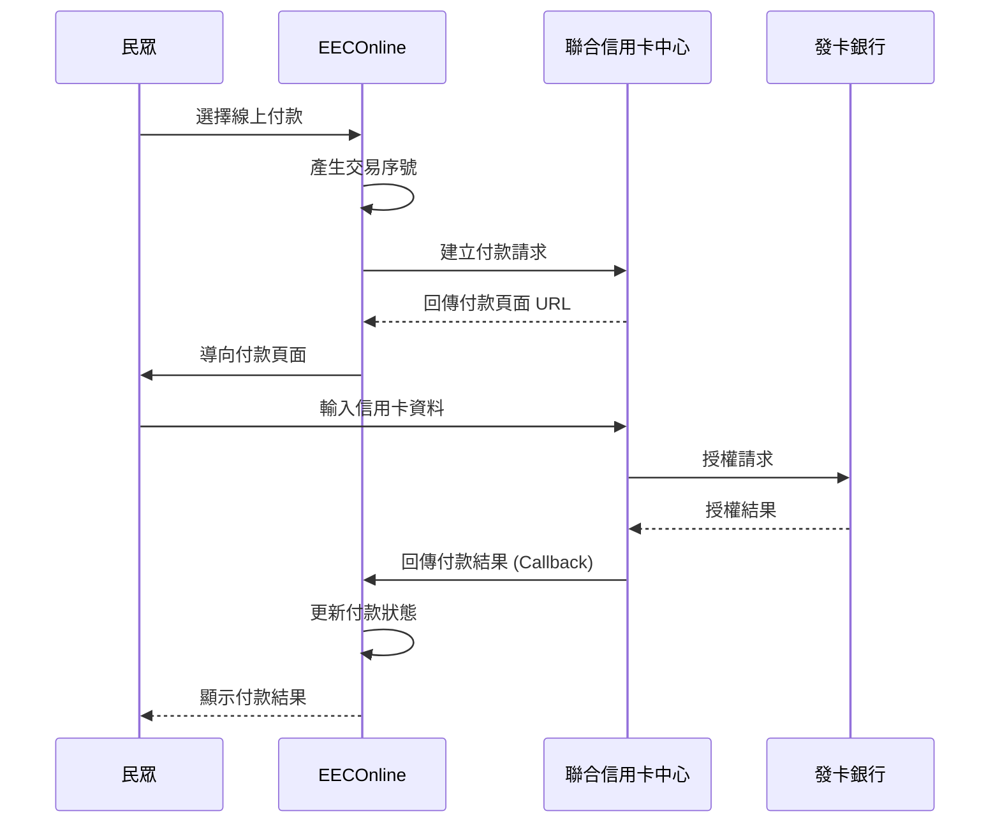

### 4.2 付款實作

```csharp
// Controllers/HomeController.cs
[HttpPost]
public ActionResult InitiatePayment(string applyNo)
{
    try
    {
        // 取得申請資料
        var apply = _frontDAO.GetApplyByNo(applyNo);
        if (apply == null)
        {
            return Json(new { success = false, message = "申請單不存在" });
        }
        
        // 檢查是否已付款
        if (apply.PAY_STATUS == "1")
        {
            return Json(new { success = false, message = "此申請已付款" });
        }
        
        // 產生付款交易序號
        string transactionKey = Guid.NewGuid().ToString("N");
        
        // 儲存交易序號
        _frontDAO.UpdateApplyTransKey(applyNo, transactionKey);
        Session["PaymentTransKey"] = transactionKey;
        
        // 組成付款參數
        var paymentParams = new PaymentParams
        {
            MerchantID = ConfigHelper.GetValue("NCCC_MerchantID"),
            TransactionKey = transactionKey,
            Amount = apply.TOTAL_FEE,
            OrderNo = applyNo,
            ReturnURL = Url.Action("PaymentCallback", "Home", null, Request.Url.Scheme),
            NotifyURL = Url.Action("PaymentNotify", "Home", null, Request.Url.Scheme)
        };
        
        // 產生付款頁面 URL
        string paymentUrl = NCCCHelper.GeneratePaymentUrl(paymentParams);
        
        return Json(new {
            success = true,
            paymentUrl = paymentUrl
        });
    }
    catch (Exception ex)
    {
        LogUtils.Error("InitiatePayment Error", ex);
        return Json(new { success = false, message = ex.Message });
    }
}

// 付款結果回呼
[HttpPost]
public ActionResult PaymentCallback(PaymentCallbackModel model)
{
    try
    {
        // 驗證簽章
        if (!NCCCHelper.VerifySignature(model))
        {
            LogUtils.Warn("Payment signature verification failed");
            return View("PaymentFailed");
        }
        
        // 更新付款狀態
        if (model.ResponseCode == "00")
        {
            _frontDAO.UpdatePaymentStatus(model.OrderNo, "1", model.AuthCode);
            
            // 更新申請狀態為「處理中」
            _frontDAO.UpdateApplyStatus(model.OrderNo, "02");
            
            // 發送通知給醫院
            SendHospitalNotification(model.OrderNo);
            
            return View("PaymentSuccess", model);
        }
        else
        {
            _frontDAO.UpdatePaymentStatus(model.OrderNo, "2", null);
            return View("PaymentFailed", model);
        }
    }
    catch (Exception ex)
    {
        LogUtils.Error("PaymentCallback Error", ex);
        return View("PaymentFailed");
    }
}
```

---

## 5. 申請進度查詢

### 5.1 查詢流程

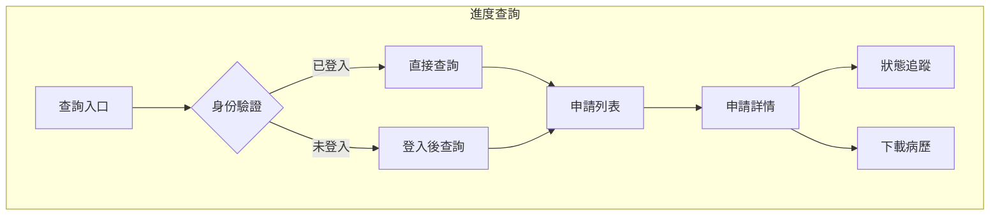

### 5.2 查詢程式碼

```csharp
// Controllers/HomeController.cs
public ActionResult Search()
{
    var session = GetFrontSession();
    if (session == null)
    {
        return RedirectToAction("Index");
    }
    
    return View();
}

[HttpPost]
public ActionResult SearchApplyList(SearchFormModel form)
{
    try
    {
        var session = GetFrontSession();
        
        // 設定查詢條件
        form.IDN = session.LoginUserInfo.IDN;
        
        // 查詢申請列表
        var list = _frontDAO.SearchApplyList(form);
        
        return Json(new {
            success = true,
            data = list.Select(a => new {
                ApplyNo = a.APPLY_NO,
                HospitalName = a.HOSPITAL_NAME,
                ApplyDate = a.APPLY_DATE?.ToString("yyyy/MM/dd"),
                Status = a.STATUS,
                StatusName = GetStatusName(a.STATUS),
                TotalFee = a.TOTAL_FEE,
                PayStatus = a.PAY_STATUS,
                CanDownload = a.STATUS == "04"  // 已完成可下載
            })
        });
    }
    catch (Exception ex)
    {
        return Json(new { success = false, message = ex.Message });
    }
}

public ActionResult SearchDetail(string applyNo)
{
    var session = GetFrontSession();
    if (session == null)
    {
        return RedirectToAction("Index");
    }
    
    // 取得申請詳情
    var apply = _frontDAO.GetApplyDetail(applyNo);
    
    // 驗證是否為本人申請
    if (apply.IDN != session.LoginUserInfo.IDN)
    {
        return RedirectToAction("Search");
    }
    
    // 取得申請明細
    var details = _frontDAO.GetApplyDetailList(applyNo);
    
    var model = new ApplyDetailViewModel
    {
        Apply = apply,
        Details = details
    };
    
    return View(model);
}
```

---

## 6. 申請狀態說明

### 6.1 狀態流程圖

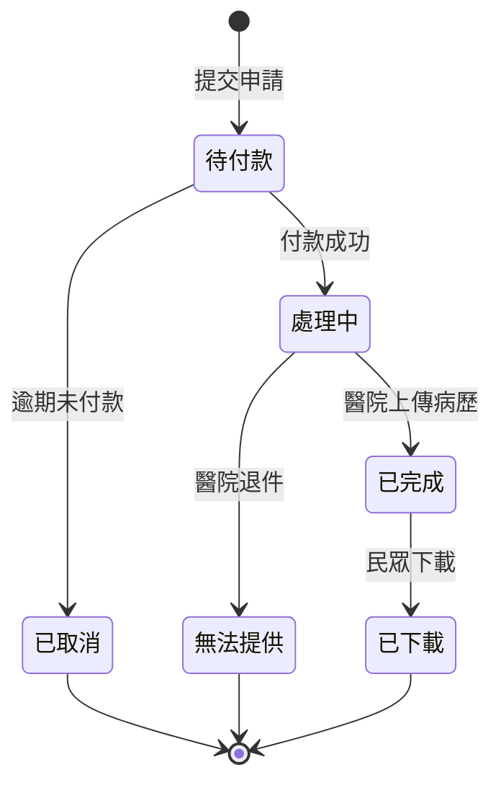

### 6.2 狀態代碼對照

| 狀態碼 | 狀態名稱 | 說明 |
|--------|----------|------|
| 01 | 待付款 | 申請已提交，等待付款 |
| 02 | 處理中 | 已付款，醫院處理中 |
| 03 | 無法提供 | 醫院無法提供病歷 |
| 04 | 已完成 | 病歷已上傳，可下載 |
| 05 | 已下載 | 民眾已下載病歷 |
| 09 | 已取消 | 申請已取消 |

---

## 7. 病歷下載

### 7.1 下載流程

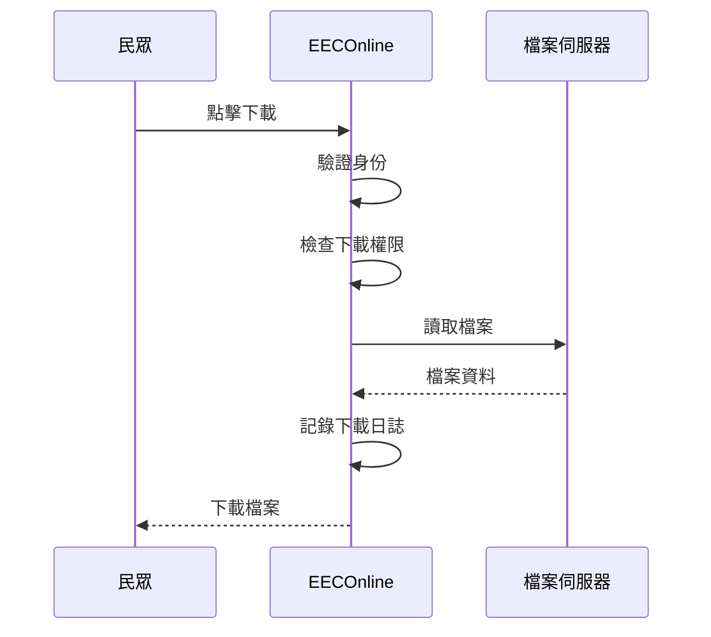

### 7.2 下載程式碼

```csharp
// Controllers/HomeController.cs
public ActionResult DownloadRecord(string applyNo, string detailId)
{
    try
    {
        var session = GetFrontSession();
        if (session == null)
        {
            return RedirectToAction("Index");
        }
        
        // 取得申請資料
        var apply = _frontDAO.GetApplyByNo(applyNo);
        
        // 驗證身份
        if (apply.IDN != session.LoginUserInfo.IDN)
        {
            return new HttpStatusCodeResult(403, "無權限下載");
        }
        
        // 驗證狀態
        if (apply.STATUS != "04" && apply.STATUS != "05")
        {
            return new HttpStatusCodeResult(400, "申請尚未完成");
        }
        
        // 取得檔案路徑
        var detail = _frontDAO.GetApplyDetailById(detailId);
        if (string.IsNullOrEmpty(detail.FILE_PATH))
        {
            return new HttpStatusCodeResult(404, "檔案不存在");
        }
        
        // 讀取檔案
        string filePath = Path.Combine(
            ConfigHelper.GetValue("NASPath"),
            detail.FILE_PATH
        );
        
        if (!System.IO.File.Exists(filePath))
        {
            return new HttpStatusCodeResult(404, "檔案不存在");
        }
        
        byte[] fileBytes = System.IO.File.ReadAllBytes(filePath);
        
        // 記錄下載日誌
        _frontDAO.InsertDownloadLog(new DownloadLog
        {
            APPLY_NO = applyNo,
            DETAIL_ID = detailId,
            USER_ID = session.LoginUserInfo.UserID,
            DOWNLOAD_TIME = DateTime.Now,
            DOWNLOAD_IP = GetClientIP()
        });
        
        // 更新狀態為已下載
        if (apply.STATUS == "04")
        {
            _frontDAO.UpdateApplyStatus(applyNo, "05");
        }
        
        // 回傳檔案
        string fileName = $"{apply.HOSPITAL_NAME}_{detail.RECORD_TYPE_NAME}_{applyNo}.pdf";
        return File(fileBytes, "application/pdf", fileName);
    }
    catch (Exception ex)
    {
        LogUtils.Error("DownloadRecord Error", ex);
        return new HttpStatusCodeResult(500, "下載失敗");
    }
}
```

---

## 8. 前台頁面結構

### 8.1 頁面對應

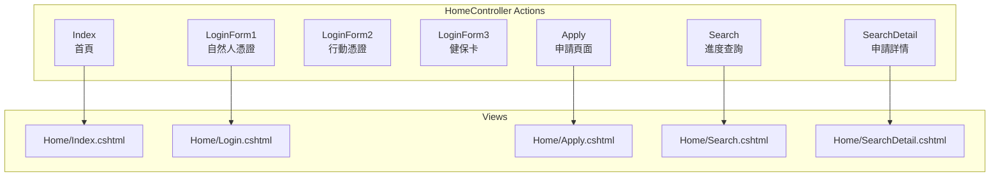

### 8.2 前台 Layout

```html
<!-- Views/Shared/_FrontLayout.cshtml -->
<!DOCTYPE html>
<html>
<head>
    <meta charset="utf-8" />
    <meta name="viewport" content="width=device-width, initial-scale=1.0">
    <title>@ViewBag.Title - 電子病歷服務平台</title>
    <link href="~/Content/bootstrap.min.css" rel="stylesheet" />
    <link href="~/Content/front/style.css" rel="stylesheet" />
</head>
<body>
    <!-- 頁首 -->
    <header class="main-header">
        <div class="container">
            <div class="logo">
                
                <span>電子病歷服務平台</span>
            </div>
            <nav class="main-nav">
                <ul>
                    <li><a href="@Url.Action("Index", "Home")">首頁</a></li>
                    <li><a href="@Url.Action("Apply", "Home")">線上申請</a></li>
                    <li><a href="@Url.Action("Search", "Home")">進度查詢</a></li>
                    <li><a href="@Url.Action("FAQ", "Home")">常見問題</a></li>
                </ul>
            </nav>
        </div>
    </header>
    
    <!-- 內容區 -->
    <main class="content">
        @RenderBody()
    </main>
    
    <!-- 頁尾 -->
    <footer class="main-footer">
        <div class="container">
            <p>衛生福利部 版權所有</p>
            <p>服務專線：02-12345678</p>
        </div>
    </footer>
    
    <script src="~/Scripts/jquery-2.1.3.min.js"></script>
    <script src="~/Scripts/bootstrap.min.js"></script>
    @RenderSection("scripts", required: false)
</body>
</html>
```

---

## 9. 通知機制

### 9.1 通知類型

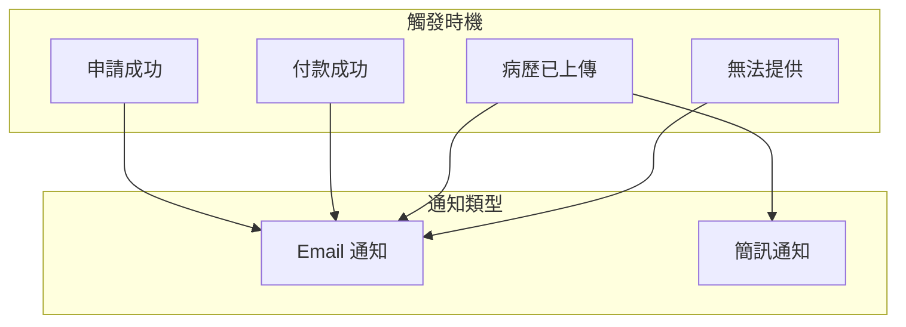

### 9.2 通知實作

```csharp
// Services/NotificationService.cs
public class NotificationService
{
    /// <summary>
    /// 發送申請成功通知
    /// </summary>
    public static void SendApplySuccessNotification(string applyNo)
    {
        var apply = new FrontDAO().GetApplyByNo(applyNo);
        
        // Email 通知
        if (!string.IsNullOrEmpty(apply.EMAIL))
        {
            var subject = "電子病歷申請成功通知";
            var body = $@"
親愛的 {apply.USER_NAME} 您好：

您的電子病歷申請已成功提交。

申請編號：{apply.APPLY_NO}
申請醫院：{apply.HOSPITAL_NAME}
申請日期：{apply.APPLY_DATE:yyyy/MM/dd}
應付金額：{apply.TOTAL_FEE:N0} 元

請儘速完成付款，以利後續處理。

衛生福利部 電子病歷服務平台
";
            CommonsServices.SendEmail(apply.EMAIL, subject, body);
        }
    }
    
    /// <summary>
    /// 發送病歷完成通知
    /// </summary>
    public static void SendRecordReadyNotification(string applyNo)
    {
        var apply = new FrontDAO().GetApplyByNo(applyNo);
        
        // Email 通知
        if (!string.IsNullOrEmpty(apply.EMAIL))
        {
            var subject = "電子病歷已備妥通知";
            var body = $@"
親愛的 {apply.USER_NAME} 您好：

您申請的電子病歷已備妥，可供下載。

申請編號：{apply.APPLY_NO}
申請醫院：{apply.HOSPITAL_NAME}

請登入系統下載您的電子病歷。

衛生福利部 電子病歷服務平台
";
            CommonsServices.SendEmail(apply.EMAIL, subject, body);
        }
        
        // 簡訊通知
        if (!string.IsNullOrEmpty(apply.PHONE))
        {
            var message = $"您申請的電子病歷已備妥，申請編號：{apply.APPLY_NO}，請登入系統下載。";
            SmsMsgUtil.SendSms(apply.PHONE, message);
        }
    }
}
```

---

本文件說明 EECOnline 前台民眾申請電子病歷的完整流程，包含身份驗證、申請作業、線上付款、進度查詢及病歷下載等功能。
