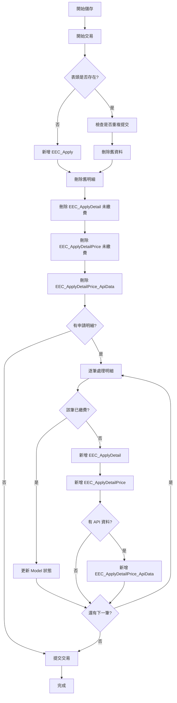

# 電子病歷申請系統 (EECOnline) - 病歷申請管理補充：儲存與繳費流程

> 本文件為「02_全端功能詳細範例_病歷申請管理.md」的補充文件，詳細說明申請資料儲存與線上繳費的完整流程。

## 1. 申請資料儲存流程

### 1.1 LoginApplySave 儲存申請資料

**檔案位置：** `Controllers/HomeController.cs`

```csharp
/// <summary>
/// 儲存申請資料（表單提交）
/// </summary>
[HttpPost]
public ActionResult LoginApplySave(HomeViewModel model)
{
    ModelState.Clear();
    SessionModel sm = SessionModel.Get();
    ActionResult rtn = View("Login", model);
    
    #region 檢查
    // 檢查是否至少有一筆申請資料
    if (model.LoginApply.ApplyDetail.ToCount() <= 0)
    {
        sm.LastErrorMessage = "請至少新增一筆申請資料！";
        return rtn;
    }
    
    string rtnMsg = "";
    List<string> tmpHospitalList = new List<string>();
    
    // 逐筆檢查申請明細
    for (int i = 0; i <= model.LoginApply.ApplyDetail.ToCount() - 1; i++)
    {
        var row = model.LoginApply.ApplyDetail[i];
        
        // 檢查醫院名稱
        if (row.hospital_code.TONotNullString() == "")
            rtnMsg = rtnMsg + " 醫院名稱 是必填項目！<br/>";
        
        // 檢查病歷時間區間
        if (row.his_range1.TONotNullString() == "" || row.his_range2.TONotNullString() == "")
            rtnMsg = rtnMsg + " 病歷時間區間 是必填項目！<br/>";
        
        // 檢查病歷類型
        if (row.his_types.TONotNullString() == "")
            rtnMsg = rtnMsg + " 病歷類型 是必填項目！<br/>";
        
        // 檢查是否重複選取同一醫院
        if (tmpHospitalList.IndexOf(row.hospital_code) >= 0)
            rtnMsg = rtnMsg + "項目：" + (i + 1).ToString() + "「" + row.hospital_name + "」已重複選取！<br/>";
        else
            tmpHospitalList.Add(row.hospital_code);
        
        // 資安防護：防止竄改金額
        if (row.ApplyDetailPrice != null)
        {
            var ckHisList = row.HisTypes_List;
            foreach (var rowPri in row.ApplyDetailPrice)
            {
                var findHis = ckHisList.Where(x => x.his_type == rowPri.his_type).FirstOrDefault();
                if (findHis != null) rowPri.price = findHis.price;
            }
        }
    }
    
    // 如果有錯誤訊息，返回
    if (rtnMsg != "")
    {
        sm.LastErrorMessage = rtnMsg;
        return rtn;
    }
    #endregion
    
    // 檢查通過，存入資料庫
    this.SaveLoginApply(ref model);
    
    // 進入繳費頁面
    model.ProcessStep = "4";
    return rtn;
}
```

### 1.2 SaveLoginApply 儲存申請資料到資料庫

```csharp
/// <summary>
/// 將使用者填的 LoginApply 資料存入資料庫 EEC_Apply <br/>
/// 如果是新增 會回填 model.LoginApply.keyid <br/>
/// 如果是修改 會先整批刪除舊明細，再進行新增 <br/>
/// EEC_Apply (表頭) 一位使用者只會有一筆，除新增以外基本上不會異動它
/// </summary>
/// <param name="model">視圖模型</param>
private void SaveLoginApply(ref HomeViewModel model)
{
    FrontDAO dao = new FrontDAO();
    
    try
    {
        // 開始交易
        dao.BeginTransaction();
        
        #region 處理表頭 EEC_Apply
        if (model.LoginApply.keyid.TONotNullString() == "")
        {
            // 檢查是否已存在（防止重複提交）
            if (dao.GetRowList(new TblEEC_Apply() { apply_no = model.LoginApply.apply_no }).Any())
            {
                // 理論上 keyid 空白進來，應該是新增
                // 但卻有資料，那有可能是異常，或是按F5重新整理
                // 那就把原本的砍了
                int resDel = dao.Delete(new TblEEC_Apply() { apply_no = model.LoginApply.apply_no });
            }
            
            // 新增表頭
            TblEEC_Apply Ins = new TblEEC_Apply();
            Ins.InjectFrom(model.LoginApply);
            int resKey = dao.Insert(Ins);
            model.LoginApply.keyid = resKey;
        }
        #endregion
        
        #region 先整批刪除舊明細
        // 刪除 EEC_ApplyDetail（未繳費的）
        int resDel1 = dao.Delete(new TblEEC_ApplyDetail() 
        { 
            apply_no = model.LoginApply.apply_no, 
            payed = "N" 
        });
        
        // 刪除 EEC_ApplyDetailPrice（未繳費的）
        var keyDel2 = dao.GetRowList(new TblEEC_ApplyDetailPrice() 
        { 
            apply_no = model.LoginApply.apply_no, 
            payed = "N" 
        }).Select(x => x.keyid).ToList();
        
        int resDel2 = dao.Delete(new TblEEC_ApplyDetailPrice() 
        { 
            apply_no = model.LoginApply.apply_no, 
            payed = "N" 
        });
        
        // 刪除 EEC_ApplyDetailPrice_ApiData（附屬資料）
        foreach (var key in keyDel2)
        {
            if (key == null) continue;
            if (key <= 0) continue;
            int resDel2ApiData = dao.Delete(new TblEEC_ApplyDetailPrice_ApiData() 
            { 
                master_keyid = key 
            });
        }
        #endregion
        
        #region 新增明細 EEC_ApplyDetail
        var tmpListDet = model.LoginApply.ApplyDetail.Where(x => x.payed == "N").ToList();
        if (tmpListDet.Any())
        {
            foreach (var rowDet in tmpListDet)
            {
                // 新增之前，先檢查目前資料庫內，該筆資料是否被付款了
                var tmpCheck = dao.GetRow(new TblEEC_ApplyDetail()
                {
                    apply_no = rowDet.apply_no,
                    apply_no_sub = rowDet.apply_no_sub
                });
                
                if (tmpCheck != null && tmpCheck.payed == "Y")
                {
                    // 已繳費，更新 Model 狀態
                    int tmpI = model.LoginApply.ApplyDetail.IndexOf(rowDet);
                    model.LoginApply.ApplyDetail[tmpI].payed = "Y";
                    foreach (var pri in model.LoginApply.ApplyDetail[tmpI].ApplyDetailPrice) 
                        pri.payed = "Y";
                    continue;
                }
                
                // 新增申請明細
                TblEEC_ApplyDetail insDet = new TblEEC_ApplyDetail();
                insDet.InjectFrom(rowDet);
                int resDet = dao.Insert(insDet);
                
                #region 新增明細 EEC_ApplyDetailPrice
                var tmpListPri = rowDet.ApplyDetailPrice.Where(x => x.payed != "Y").ToList();
                if (tmpListPri.Any())
                {
                    foreach (var rowPce in tmpListPri)
                    {
                        // 新增價格明細
                        TblEEC_ApplyDetailPrice insPce = new TblEEC_ApplyDetailPrice();
                        insPce.InjectFrom(rowPce);
                        int resPce = dao.Insert(insPce);
                        
                        #region 新增附屬資料 EEC_ApplyDetailPrice_ApiData
                        // 新增完 EEC_ApplyDetailPrice 後，換新增其附屬資料（如果有的話）
                        if (rowPce.ApiData != null
                         && rowPce.ApiData.Guid.TONotNullString() != ""
                         && rowPce.ApiData.PatientIdNo.TONotNullString() != ""
                         && rowPce.ApiData.AccessionNum.TONotNullString() != ""
                         && rowPce.ApiData.HospitalId.TONotNullString() != ""
                         && rowPce.ApiData.TemplateId.TONotNullString() != "")
                        {
                            TblEEC_ApplyDetailPrice_ApiData insApiData = new TblEEC_ApplyDetailPrice_ApiData();
                            insApiData.InjectFrom(rowPce.ApiData);
                            insApiData.master_keyid = resPce;  // 關聯到價格明細的 keyid
                            insApiData.keyid = null;
                            int resApiData = dao.Insert(insApiData);
                        }
                        #endregion
                    }
                }
                #endregion
            }
        }
        #endregion
        
        // 提交交易
        dao.CommitTransaction();
    }
    catch (Exception ex)
    {
        // 發生錯誤，回滾交易
        dao.RollBackTransaction();
        LOG.Debug("HomeController.SaveLoginApply() Error: " + ex.Message);
    }
}
```

### 1.3 資料儲存流程圖



## 2. 線上繳費流程

### 2.1 Get_Pay_STKey_forLogin 取得繳費 SessionKey

**檔案位置：** `Controllers/HomeController.cs`

```csharp
/// <summary>
/// 聯合信用卡中心 SessionTransactionKey <br/>
/// 去取得付款用的 SessionKey
/// </summary>
[HttpPost]
public ActionResult Get_Pay_STKey_forLogin(HomeViewModel model)
{
    ModelState.Clear();
    AjaxResultStruct Result = new AjaxResultStruct();
    FrontDAO dao = new FrontDAO();
    var ErrCode = "";
    var ErrMsg = "";
    
    // 測試環境處理
    var OnOff = ConfigModel.level1OnOrOff;
    if (OnOff != "1")
    {
        model.LoginApply.user_idno = "T202434361";  // 測試用身分證字號
    }
    
    #region 資安防護：防止竄改金額
    foreach (var row in model.LoginApply.ApplyDetail)
    {
        var ckHisList = row.HisTypes_List;
        foreach (var rowPri in row.ApplyDetailPrice)
        {
            var findHis = ckHisList.Where(x => x.his_type == rowPri.his_type).FirstOrDefault();
            if (findHis != null) rowPri.price = findHis.price;
        }
    }
    #endregion
    
    // 去取得付款用的 SessionKey (聯合信用卡中心)
    var STKey = dao.Get_ApplyDetail_Pay_SessionTransactionKey_forLogin(
        model.LoginApply, ref ErrCode, ref ErrMsg);
    
    if (ErrCode == "00" && STKey != "")
    {
        Result.data = STKey;
        Result.status = true;
    }
    else
    {
        Result.message = "取得預約交易代碼失敗(" + ErrCode + ":" + ErrMsg + ")";
        Result.status = false;
    }
    
    // 記錄 LOG
    FrontDAO.FrontLOG(model.LoginApply.user_idno, model.LoginApply.user_name, 
        (FrontDAO.em_lType)model.UserLoginTab.TOInt32(), FrontDAO.em_lStatus.LoginSuccess,
        HttpContext.Request.UserHostAddress, "Home/Get_Pay_STKey_forLogin", "線上申辦-立即繳費");
    
    return Content(Result.Serialize(), "application/json");
}
```

### 2.2 Get_ApplyDetail_Pay_SessionTransactionKey_forLogin 取得繳費 SessionKey (DAO)

**檔案位置：** `DataLayers/FrontDAO.cs`

```csharp
/// <summary>
/// 聯合信用卡中心 SessionTransactionKey <br/>
/// 去取得付款用的 SessionKey
/// </summary>
public string Get_ApplyDetail_Pay_SessionTransactionKey_forLogin(
    LoginApplyModel model, ref string ErrCode, ref string ErrMsg)
{
    if (model == null) return "";
    
    // 取得系統設定（商店代號、終端機代號等）
    var GetSetups = base.QueryForListAll<Hashtable>("Front.get_ApplyDetail_Pay_SETUP", null);
    var tmpMERCHANTID = this.GetDataFromHashtableList(GetSetups, "PAY_EEC_MERCHANTID");
    var tmpTRMINALID = this.GetDataFromHashtableList(GetSetups, "PAY_EEC_TRMINALID");
    
    // 特殊醫院使用不同的商店代號（亞東醫院）
    if (model.ApplyDetail.FirstOrDefault().hospital_code == "1131010011H")
    {
        tmpMERCHANTID = this.GetDataFromHashtableList(GetSetups, "PAY_EEC_MERCHANTID_FE");
        tmpTRMINALID = this.GetDataFromHashtableList(GetSetups, "PAY_EEC_TRMINALID_FE");
    }
    
    // 組合信用卡繳費參數
    var ECmodel = new CreditHPPModel();
    ECmodel.EncModel.MerchantID = tmpMERCHANTID;
    ECmodel.EncModel.OrderID = "";
    ECmodel.EncModel.TerminalID = tmpTRMINALID;
    ECmodel.EncModel.TransAmt = GetTotalTransAmt_forLogin(model);  // 計算總金額
    ECmodel.EncModel.TransMode = "0";
    ECmodel.EncModel.Template = "BOTH";
    ECmodel.EncModel.CardholderName = "";
    ECmodel.EncModel.CardholderEmailAddress = "";
    ECmodel.EncModel.IDNUMBER = Convert.ToString(model.user_idno);  // 持卡人身份證字號
    ECmodel.EncModel.PrivateData = "";  // 自訂資料
    ECmodel.ECConnetModel.DomainName = this.GetDataFromHashtableList(GetSetups, "PAY_EEC_DOMAINNAME");
    ECmodel.ECConnetModel.RequestURL = this.GetDataFromHashtableList(GetSetups, "PAY_EEC_REQUESTURL");
    
    // 回應網址（繳費完成後的回傳網址）
    ECmodel.EncModel.NotifyURL = this.GetDataFromHashtableList(GetSetups, "PAY_EEC_NOTIFYURL");
    
    // 呼叫聯合信用卡 API
    ApiClient resEC = CardUtils.GetTransactionKeyEC(ECmodel, model.ApplyDetail.FirstOrDefault().apply_no_sub);
    
    if (resEC != null)
    {
        ErrCode = resEC.getRESPONSECODE();
        ErrMsg = resEC.getRESPONSEMSG();
        
        if (ErrCode.Equals("00"))
        {
            // 作業執行成功
            var orderid = resEC.getORDERID();
            var sessionkey = resEC.getKEY();
            var transdate = resEC.getTRANSDATE();
            var approvecode = resEC.getAPPROVECODE();
            
            // 更新申請明細的繳費資訊
            TblEEC_ApplyDetail where = new TblEEC_ApplyDetail()
            {
                apply_no = model.apply_no,
                apply_no_sub = model.ApplyDetail.FirstOrDefault().apply_no_sub,
            };
            
            TblEEC_ApplyDetail update = new TblEEC_ApplyDetail()
            {
                payed_orderid = orderid,
                payed_sessionkey = sessionkey,
                payed_transdate = transdate,
                payed_approvecode = approvecode,
            };
            
            int res = base.Update(update, where);
            return sessionkey;
        }
    }
    else
    {
        ErrCode = "-1";
        ErrMsg = "取得預約交易代碼失敗";
    }
    
    return "";
}
```

由於文件長度限制，完整的繳費流程將在後續補充。

## 3. 總結

本補充文件詳細說明了：

1. **申請資料儲存流程**：包含表頭、明細、價格明細、API 資料的完整儲存邏輯
2. **交易管理**：使用 BeginTransaction、CommitTransaction、RollBackTransaction 確保資料一致性
3. **資安防護**：防止金額竄改、重複提交等安全機制
4. **線上繳費流程**：整合聯合信用卡中心的繳費機制

完整的程式碼範例和詳細說明請參考主文件「02_全端功能詳細範例_病歷申請管理.md」。

