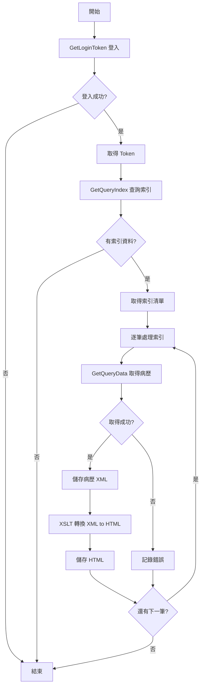

# 電子病歷申請系統 (EECOnline) - 病歷申請管理補充：醫院 API 整合與查詢進度

> 本文件為「02_全端功能詳細範例_病歷申請管理.md」的補充文件，詳細說明醫院 API 整合與申請進度查詢的完整流程。

## 1. 醫院 API 整合

### 1.1 Hospital_Common_Api 醫院共用 API

**檔案位置：** `Utils/Hospital_Common_Api.cs`

Hospital_Common_Api 提供與醫院系統整合的 API 方法，包含登入、查詢索引、取得病歷等功能。

#### 1.1.1 GetLoginToken 登入取得 Token

```csharp
/// <summary>
/// 1.1 登入<br/>登入取得 Token
/// </summary>
/// <param name="LoginUser">登入帳號</param>
/// <param name="LoginPwd">登入密碼</param>
/// <returns>Token 字串</returns>
public static string GetLoginToken(string LoginUser, string LoginPwd)
{
    LOG.Debug("EECOnline.Utils.Hospital_Common_Api.GetLoginToken() Called.");
    const string ApiPath = "/api/login";
    string ApiUrl = GetApiUrl();
    string Result = "";
    
    try
    {
        using (HttpClientHandler handler = new HttpClientHandler())
        {
            using (HttpClient client = new HttpClient(handler))
            {
                // 組合 POST JSON
                var postJSON = JsonConvert.SerializeObject(new apiLoginModel()
                {
                    LoginUser = LoginUser,
                    LoginPwd = LoginPwd,
                });
                
                // 取得 API 網址
                string webApiUrl = ApiUrl + ApiPath;
                if (System.Web.Configuration.WebConfigurationManager.AppSettings["BliWsUrl"] != null)
                {
                    webApiUrl = System.Web.Configuration.WebConfigurationManager.AppSettings["BliWsUrl"].ToString();
                }
                
                // 設定 SSL/TLS 協定
                ServicePointManager.SecurityProtocol = SecurityProtocolType.Ssl3 | 
                                                       SecurityProtocolType.Tls | 
                                                       SecurityProtocolType.Tls11 | 
                                                       SecurityProtocolType.Tls12;
                
                // 建立 HTTP 請求
                HttpWebRequest request = HttpWebRequest.Create(webApiUrl) as HttpWebRequest;
                request.ContentType = "application/json";
                request.Method = "POST";
                request.KeepAlive = true;
                
                // 寫入 POST 資料
                byte[] bs = Encoding.UTF8.GetBytes(postJSON);
                using (Stream reqStream = request.GetRequestStream())
                {
                    reqStream.Write(bs, 0, bs.Length);
                }
                
                // 取得回應
                using (WebResponse webResponse = request.GetResponse())
                {
                    StreamReader sr = new StreamReader(webResponse.GetResponseStream());
                    var strResult = sr.ReadToEnd();
                    apiLoginModel objResult = JsonConvert.DeserializeObject<apiLoginModel>(strResult);
                    Result = objResult.ResultToken;
                    sr.Close();
                }
                
                LOG.Debug("EECOnline.Utils.Hospital_Common_Api.GetLoginToken() OK.");
            }
        }
    }
    catch (Exception ex)
    {
        LOG.Debug("EECOnline.Utils.Hospital_Common_Api.GetLoginToken() Error: " + ex.Message);
    }
    
    return Result;
}
```

#### 1.1.2 GetQueryIndex 查詢索引

```csharp
/// <summary>
/// 1.2 查詢索引<br/>使用時間區間和病患身份證號來查詢索引
/// </summary>
/// <param name="PatientIdNo">病患身分證字號</param>
/// <param name="StartDate">開始日期（格式：yyyyMMdd）</param>
/// <param name="EndDate">結束日期（格式：yyyyMMdd）</param>
/// <param name="Token">登入 Token</param>
/// <returns>索引清單</returns>
public static IList<apiQueryIndexModel> GetQueryIndex(
    string PatientIdNo, string StartDate, string EndDate, string Token)
{
    LOG.Debug("EECOnline.Utils.Hospital_Common_Api.GetQueryIndex() Called.");
    const string ApiPath = "/api/queryindex";
    string ApiUrl = GetApiUrl();
    var Result = new List<apiQueryIndexModel>();
    
    try
    {
        using (HttpClientHandler handler = new HttpClientHandler())
        {
            using (HttpClient client = new HttpClient(handler))
            {
                // 組合 POST JSON
                var postJSON = JsonConvert.SerializeObject(new apiQueryIndexModel()
                {
                    PatientIdNo = PatientIdNo,
                    StartDate = StartDate,
                    EndDate = EndDate,
                    Token = Token,
                });
                
                // 取得 API 網址
                string webApiUrl = ApiUrl + ApiPath;
                if (System.Web.Configuration.WebConfigurationManager.AppSettings["BliWsUrl"] != null)
                {
                    webApiUrl = System.Web.Configuration.WebConfigurationManager.AppSettings["BliWsUrl"].ToString();
                }
                
                // 設定 SSL/TLS 協定
                ServicePointManager.SecurityProtocol = SecurityProtocolType.Ssl3 | 
                                                       SecurityProtocolType.Tls | 
                                                       SecurityProtocolType.Tls11 | 
                                                       SecurityProtocolType.Tls12;
                
                // 建立 HTTP 請求
                HttpWebRequest request = HttpWebRequest.Create(webApiUrl) as HttpWebRequest;
                request.ContentType = "application/json";
                request.Method = "POST";
                request.KeepAlive = true;
                
                // 寫入 POST 資料
                byte[] bs = Encoding.UTF8.GetBytes(postJSON);
                using (Stream reqStream = request.GetRequestStream())
                {
                    reqStream.Write(bs, 0, bs.Length);
                }
                
                // 取得回應
                using (WebResponse webResponse = request.GetResponse())
                {
                    StreamReader sr = new StreamReader(webResponse.GetResponseStream());
                    var strResult = sr.ReadToEnd();
                    Result = JsonConvert.DeserializeObject<List<apiQueryIndexModel>>(strResult);
                    sr.Close();
                }
                
                LOG.Debug("EECOnline.Utils.Hospital_Common_Api.GetQueryIndex() OK. Count: " + Result.Count);
            }
        }
    }
    catch (Exception ex)
    {
        LOG.Debug("EECOnline.Utils.Hospital_Common_Api.GetQueryIndex() Error: " + ex.Message);
    }
    
    return Result;
}
```

#### 1.1.3 GetQueryData 取得病歷資料

```csharp
/// <summary>
/// 1.3 取得病歷資料<br/>使用索引資訊來取得病歷 XML 資料
/// </summary>
/// <param name="model">查詢索引模型</param>
/// <returns>病歷 XML 字串</returns>
public static string GetQueryData(apiQueryIndexModel model)
{
    LOG.Debug("EECOnline.Utils.Hospital_Common_Api.GetQueryData() Called.");
    const string ApiPath = "/api/querydata";
    string ApiUrl = GetApiUrl();
    string Result = "";
    
    try
    {
        using (HttpClientHandler handler = new HttpClientHandler())
        {
            using (HttpClient client = new HttpClient(handler))
            {
                // 組合 POST JSON
                var postJSON = JsonConvert.SerializeObject(model);
                
                // 取得 API 網址
                string webApiUrl = ApiUrl + ApiPath;
                if (System.Web.Configuration.WebConfigurationManager.AppSettings["BliWsUrl"] != null)
                {
                    webApiUrl = System.Web.Configuration.WebConfigurationManager.AppSettings["BliWsUrl"].ToString();
                }
                
                // 設定 SSL/TLS 協定
                ServicePointManager.SecurityProtocol = SecurityProtocolType.Ssl3 | 
                                                       SecurityProtocolType.Tls | 
                                                       SecurityProtocolType.Tls11 | 
                                                       SecurityProtocolType.Tls12;
                
                // 建立 HTTP 請求
                HttpWebRequest request = HttpWebRequest.Create(webApiUrl) as HttpWebRequest;
                request.ContentType = "application/json";
                request.Method = "POST";
                request.KeepAlive = true;
                
                // 寫入 POST 資料
                byte[] bs = Encoding.UTF8.GetBytes(postJSON);
                using (Stream reqStream = request.GetRequestStream())
                {
                    reqStream.Write(bs, 0, bs.Length);
                }
                
                // 取得回應
                using (WebResponse webResponse = request.GetResponse())
                {
                    StreamReader sr = new StreamReader(webResponse.GetResponseStream());
                    Result = sr.ReadToEnd();
                    sr.Close();
                }
                
                LOG.Debug("EECOnline.Utils.Hospital_Common_Api.GetQueryData() OK.");
            }
        }
    }
    catch (Exception ex)
    {
        LOG.Debug("EECOnline.Utils.Hospital_Common_Api.GetQueryData() Error: " + ex.Message);
    }
    
    return Result;
}
```

### 1.2 醫院 API 整合流程圖



## 2. 申請進度查詢

### 2.1 Search 查詢首頁

**檔案位置：** `Controllers/HomeController.cs`

```csharp
/// <summary>
/// 查詢首頁
/// </summary>
public ActionResult Search()
{
    HomeViewModel model = new HomeViewModel();
    model.Search = new SearchModel();
    model.ProcessStep = "1";
    model.UserLoginTab = "1";
    return View("Search", model);
}
```

### 2.2 SearchLoginForm1 自然人憑證查詢登入

```csharp
/// <summary>
/// 自然人憑證查詢登入
/// </summary>
[HttpPost]
public ActionResult SearchLoginForm1(HomeViewModel model)
{
    SessionModel sm = SessionModel.Get();
    model.ProcessStep = "1";
    model.UserLoginTab = "1";
    ModelState.Clear();
    
    // 記錄 LOG
    FrontDAO.FrontLOG(model.Search.user_pincode, "", FrontDAO.em_lType.Search1, 
        FrontDAO.em_lStatus.LoginTry, HttpContext.Request.UserHostAddress, 
        "Home/SearchLoginForm1", "自然人憑證登入");
    
    #region 檢查
    // 檢查 PIN 碼
    if (model.Search.user_pincode.TONotNullString() == "")
    {
        sm.LastErrorMessage = "請輸入 自然人憑證PIN碼";
        FrontDAO.FrontLOG(model.Search.user_pincode, "", FrontDAO.em_lType.Search1, 
            FrontDAO.em_lStatus.LoginFailed, HttpContext.Request.UserHostAddress, 
            "Home/SearchLoginForm1", "自然人憑證登入");
        return View("Search", model);
    }
    
    // 檢查驗證碼
    if (model.Search.ValidateCode1 != sm.LoginValidateCode1)
    {
        sm.LastErrorMessage = "驗證碼輸入錯誤!";
        FrontDAO.FrontLOG(model.Search.user_pincode, "", FrontDAO.em_lType.Search1, 
            FrontDAO.em_lStatus.LoginFailed, HttpContext.Request.UserHostAddress, 
            "Home/SearchLoginForm1", "自然人憑證登入");
        return View("Search", model);
    }
    
    // 查詢使用者
    FrontDAO dao = new FrontDAO();
    var findUser = dao.GetRowList(new TblEEC_User() 
    { 
        user_pincode = model.Search.user_pincode.TONotNullString() 
    }).Where(m => m.user_idno.ToRight(4) == model.Search.user_idno4Last).ToList();
    
    if (findUser.ToCount() != 1)
    {
        sm.LastErrorMessage = "該使用者無申請資訊！";
        FrontDAO.FrontLOG(model.Search.user_pincode, "", FrontDAO.em_lType.Search1, 
            FrontDAO.em_lStatus.LoginFailed, HttpContext.Request.UserHostAddress, 
            "Home/SearchLoginForm1", "自然人憑證登入");
        return View("Search", model);
    }
    #endregion
    
    // 登入成功
    HomeViewModel NewModel = new HomeViewModel() { UserLoginTab = "1" };
    this.ProcessStepSearch(findUser.FirstOrDefault(), ref NewModel);
    
    // 記錄 LOG
    FrontDAO.FrontLOG(findUser.FirstOrDefault().user_idno, 
        findUser.FirstOrDefault().user_name, FrontDAO.em_lType.Search1, 
        FrontDAO.em_lStatus.LoginSuccess, HttpContext.Request.UserHostAddress, 
        "Home/SearchLoginForm1", "自然人憑證登入");
    
    return View("Search", NewModel);
}
```

### 2.3 ProcessStepSearch 載入申請資料

```csharp
/// <summary>
/// 去找 登入者申請的資料
/// </summary>
/// <param name="findUser">使用者資料</param>
/// <param name="model">視圖模型</param>
private void ProcessStepSearch(TblEEC_User findUser, ref HomeViewModel model)
{
    model.ProcessStep = "2";
    model.SearchApply = new SearchApplyModel() { ActiveGridTab = "1" };
    model.SearchApply.InjectFrom(findUser);
    
    // 預設搜尋條件：訂購區間 3 個月
    model.SearchApply.Search1Filter = "3";
    model.SearchApply.Search2Filter = "";
    model.SearchApply.Search3Filter = "";
    
    // 載入申請清單
    FrontDAO dao = new FrontDAO();
    model.SearchApply.SearchGrid1 = dao.GetSearchApplyList("1", model.SearchApply);  // 全部
    model.SearchApply.SearchGrid2 = dao.GetSearchApplyList("2", model.SearchApply);  // 待繳費
    model.SearchApply.SearchGrid3 = dao.GetSearchApplyList("3", model.SearchApply);  // 已繳費/逾期
    
    // 以防有人打小寫字母，導致 API 傳到醫院時找不到病歷 - 2025.1.14
    model.SearchApply.user_idno = model.SearchApply.user_idno.TONotNullString().ToUpper();
}
```

### 2.4 SearchGridDetail 查詢申請明細

```csharp
/// <summary>
/// 查詢申請明細
/// </summary>
[HttpPost]
public ActionResult SearchGridDetail(HomeViewModel model)
{
    // 記錄 LOG
    FrontDAO.FrontLOG(model.SearchApply.user_idno, model.SearchApply.user_name, 
        (FrontDAO.em_lType)model.UserLoginTab.TOInt32() + 3, FrontDAO.em_lStatus.LoginSuccess,
        HttpContext.Request.UserHostAddress, "Home/SearchGridDetail", "進度查詢-管理訂單");
    
    ModelState.Clear();
    SessionModel sm = SessionModel.Get();
    
    // 檢查申請單號
    if (model.SearchApply.DetailApplyNo.TONotNullString() == "")
    {
        sm.LastErrorMessage = "查無資料！";
        return View("Search", model);
    }
    
    // 先將列表頁資料記錄起來
    model.SearchApplyDetail = new SearchApplyDetailModel();
    model.SearchApplyDetail.InjectFrom(model.SearchApply);
    
    // 載入明細資料
    FrontDAO dao = new FrontDAO();
    var mainData = dao.GetRow(new TblEEC_ApplyDetail() 
    { 
        apply_no_sub = model.SearchApply.DetailApplyNo 
    });
    
    if (mainData == null)
    {
        sm.LastErrorMessage = "查無資料！";
        return View("Search", model);
    }
    else
    {
        model.SearchApplyDetail.InjectFrom(mainData);
        
        // 取表頭的申請日
        var mainDataMst = dao.GetRow(new TblEEC_Apply() { apply_no = mainData.apply_no });
        model.SearchApplyDetail.createdatetime = mainDataMst.createdatetime;
        
        // 取明細的資料
        var mainDataPri = dao.GetRowList(new TblEEC_ApplyDetailPrice() 
        { 
            apply_no_sub = model.SearchApply.DetailApplyNo 
        });
        
        if (mainDataPri.ToCount() > 0)
        {
            model.SearchApplyDetail.DetailPrice = new List<SearchApplyDetailPriceModel>();
            foreach (var row in mainDataPri)
            {
                var tmpObj = new SearchApplyDetailPriceModel();
                tmpObj.InjectFrom(row);
                model.SearchApplyDetail.DetailPrice.Add(tmpObj);
            }
        }
    }
    
    model.ProcessStep = "3";
    return View("Search", model);
}
```

## 3. 總結

本補充文件詳細說明了：

1. **醫院 API 整合**：包含登入、查詢索引、取得病歷的完整流程
2. **申請進度查詢**：包含登入驗證、載入申請清單、查詢明細的完整流程
3. **資料轉換**：XML 轉 HTML 的 XSLT 轉換機制
4. **安全機制**：SSL/TLS 協定、身分驗證、驗證碼等安全措施

完整的程式碼範例和詳細說明請參考主文件「02_全端功能詳細範例_病歷申請管理.md」。

