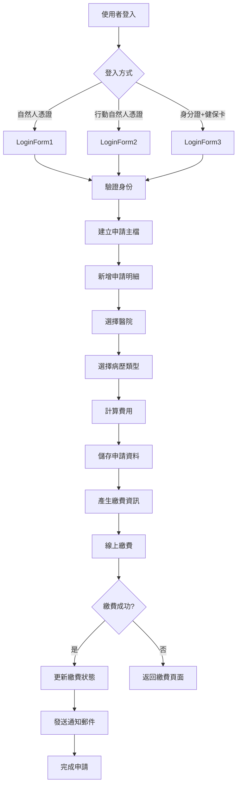

# 電子病歷申請系統 (EECOnline) - 全端功能詳細範例：病歷申請管理

## 1. 功能概述

病歷申請管理是 EECOnline 系統的核心功能，提供民眾線上申請電子病歷的完整流程。本文件將詳細說明從使用者登入、填寫申請資料、選擇醫院與病歷類型、線上繳費到查詢申請進度的完整流程。

### 1.1 功能流程圖



### 1.2 涉及的資料表

| 資料表 | 用途 | 關聯 |
|--------|------|------|
| EEC_User | 使用者基本資料 | 主檔 |
| EEC_Apply | 申請主檔 | 一位使用者一筆 |
| EEC_ApplyDetail | 申請明細（醫院） | 一筆申請可多家醫院 |
| EEC_ApplyDetailPrice | 申請價格明細（病歷類型） | 一家醫院可多種病歷類型 |
| EEC_ApplyDetailPrice_ApiData | API 資料（醫院整合） | 儲存醫院 API 回傳資料 |
| EEC_Hospital | 醫院主檔 | 醫院基本資料 |
| EEC_Hospital_SetPrice | 醫院價格設定 | 各醫院的病歷類型價格 |

### 1.3 主要功能模組

1. **使用者登入模組**：支援 3 種登入方式
2. **申請資料填寫模組**：動態新增/刪除申請明細
3. **醫院與病歷類型選擇模組**：下拉選單與多選
4. **費用計算模組**：自動計算總金額
5. **資料儲存模組**：交易式儲存確保資料一致性
6. **線上繳費模組**：整合聯合信用卡中心
7. **申請進度查詢模組**：查詢申請狀態與病歷下載

## 2. 資料模型 (Model)

### 2.1 HomeViewModel 主視圖模型

**檔案位置：** `Models/HomeViewModel.cs`

```csharp
public class HomeViewModel
{
    /// <summary>
    /// 處理步驟
    /// 1: 登入頁面
    /// 2: 填寫申請資料
    /// 3: 確認申請資料
    /// 4: 繳費頁面
    /// 5: 繳費完成
    /// </summary>
    public string ProcessStep { get; set; }
    
    /// <summary>
    /// 使用者登入頁籤
    /// 1: 自然人憑證
    /// 2: 行動自然人憑證 (TW FidO)
    /// 3: 身分證字號 + 健保卡
    /// </summary>
    public string UserLoginTab { get; set; }
    
    /// <summary>
    /// 登入資訊
    /// </summary>
    public LoginModel Login { get; set; }
    
    /// <summary>
    /// 申請資訊（登入後填寫）
    /// </summary>
    public LoginApplyModel LoginApply { get; set; }
    
    /// <summary>
    /// 查詢資訊
    /// </summary>
    public SearchModel Search { get; set; }
    
    /// <summary>
    /// 最新消息
    /// </summary>
    public NewsModel News { get; set; }
}
```

### 2.2 LoginApplyModel 申請模型

**檔案位置：** `Models/HomeViewModel.cs`

```csharp
public class LoginApplyModel
{
    /// <summary>主鍵（自動編號）</summary>
    public long? keyid { get; set; }
    
    /// <summary>申請單號（格式：yyyyMMddHHmmssfff）</summary>
    public string apply_no { get; set; }
    
    /// <summary>使用者身分證字號</summary>
    public string user_idno { get; set; }
    
    /// <summary>使用者姓名</summary>
    public string user_name { get; set; }
    
    /// <summary>使用者出生年月日（格式：yyyyMMdd）</summary>
    public string user_birthday { get; set; }
    
    /// <summary>使用者電子郵件</summary>
    public string user_email { get; set; }
    
    /// <summary>
    /// 登入方式
    /// 1: 自然人憑證
    /// 2: 行動自然人憑證 (TW FidO)
    /// 3: 身分證字號 + 健保卡
    /// </summary>
    public string login_type { get; set; }
    
    /// <summary>申請時間</summary>
    public string createdatetime { get; set; }
    
    /// <summary>申請明細清單（醫院）</summary>
    public List<LoginApplyDetailModel> ApplyDetail { get; set; }
}
```

### 2.3 LoginApplyDetailModel 申請明細模型

```csharp
public class LoginApplyDetailModel
{
    /// <summary>申請單號（主檔）</summary>
    public string apply_no { get; set; }
    
    /// <summary>
    /// 申請單號（子檔）
    /// 格式：yyyyMMddHHmmssfff + 身分證後9碼 + 流水號(001)
    /// </summary>
    public string apply_no_sub { get; set; }
    
    /// <summary>使用者身分證字號</summary>
    public string user_idno { get; set; }
    
    /// <summary>醫院代碼</summary>
    public string hospital_code { get; set; }
    
    /// <summary>醫院名稱</summary>
    public string hospital_name { get; set; }
    
    /// <summary>病歷時間範圍（起）</summary>
    public string his_range1 { get; set; }
    
    /// <summary>病歷時間範圍（迄）</summary>
    public string his_range2 { get; set; }
    
    /// <summary>病歷類型（多筆以逗號分隔）</summary>
    public string his_types { get; set; }
    
    /// <summary>繳費期限</summary>
    public string pay_deadline { get; set; }
    
    /// <summary>是否已繳費（Y/N）</summary>
    public string payed { get; set; }
    
    /// <summary>繳費時間</summary>
    public string payed_datetime { get; set; }
    
    /// <summary>申請價格明細清單（病歷類型）</summary>
    public List<LoginApplyDetailPriceModel> ApplyDetailPrice { get; set; }
    
    /// <summary>醫院病歷類型清單（供選擇用）</summary>
    public List<HisTypeModel> HisTypes_List { get; set; }
}
```

### 2.4 LoginApplyDetailPriceModel 申請價格明細模型

```csharp
public class LoginApplyDetailPriceModel
{
    /// <summary>主鍵（自動編號）</summary>
    public long? keyid { get; set; }
    
    /// <summary>申請單號（主檔）</summary>
    public string apply_no { get; set; }
    
    /// <summary>申請單號（子檔）</summary>
    public string apply_no_sub { get; set; }
    
    /// <summary>醫院代碼</summary>
    public string hospital_code { get; set; }
    
    /// <summary>病歷類型代碼</summary>
    public string his_type { get; set; }
    
    /// <summary>病歷類型名稱</summary>
    public string his_type_name { get; set; }
    
    /// <summary>價格</summary>
    public int? price { get; set; }
    
    /// <summary>是否已繳費（Y/N）</summary>
    public string payed { get; set; }
    
    /// <summary>繳費時間</summary>
    public string payed_datetime { get; set; }
    
    /// <summary>
    /// 提供狀態
    /// 0: 預設值（醫院尚未提供）
    /// 1: 已透過 XML 轉換
    /// 2: 已透過 XML 無轉換
    /// </summary>
    public string provide_status { get; set; }
    
    /// <summary>提供時間</summary>
    public string provide_datetime { get; set; }
    
    /// <summary>提供檔案（Base64 編碼）</summary>
    public string provide_bin { get; set; }
    
    /// <summary>提供檔案副檔名</summary>
    public string provide_ext { get; set; }
    
    /// <summary>下載次數</summary>
    public int? download_count { get; set; }
    
    /// <summary>API 資料（醫院整合用）</summary>
    public LoginApplyDetailPriceApiDataModel ApiData { get; set; }
}
```

## 3. 控制器 (Controller)

### 3.1 HomeController 主控制器

**檔案位置：** `Controllers/HomeController.cs`

HomeController 負責處理病歷申請的所有流程，包含登入、申請、繳費等功能。

#### 3.1.1 Index 首頁

```csharp
/// <summary>
/// 首頁
/// </summary>
public ActionResult Index(string result, string transaction_id)
{
    HomeViewModel model = new HomeViewModel();
    FrontDAO dao = new FrontDAO();
    
    // 載入最新消息（取前 5 筆）
    model.News = new NewsModel();
    model.News.Grid = dao.GetHomeNews().Take(5).ToList();
    
    // 處理健保卡驗證回傳（result 參數）
    if (result.TONotNullString() != "")
    {
        var tokenHandler = new JwtSecurityTokenHandler();
        var token = tokenHandler.ReadJwtToken(result);
        var claims = token.Claims;
        
        if (claims.ToCount() > 0)
        {
            var uuid = claims.Where(m => m.Type == "sub").ToList().FirstOrDefault().Value;
            var resultR = claims.Where(m => m.Type == "result").ToList().FirstOrDefault().Value;
            
            if (resultR.Contains("success"))
            {
                // 驗證成功，處理後續流程
                // ...（詳細程式碼見原始檔案）
            }
        }
        return RedirectToAction("Index", "Home");
    }
    
    // 處理 TW FidO 驗證回傳（transaction_id 參數）
    else if (transaction_id.TONotNullString() != "")
    {
        // ...（詳細程式碼見原始檔案）
    }
    
    return View("Index", model);
}
```

#### 3.1.2 LoginForm1 自然人憑證登入

```csharp
/// <summary>
/// 自然人憑證登入
/// </summary>
[HttpPost]
public ActionResult LoginForm1(HomeViewModel model)
{
    SessionModel sm = SessionModel.Get();
    model.ProcessStep = "1";
    model.UserLoginTab = "1";
    ModelState.Clear();
    
    // 記錄登入嘗試
    FrontDAO.FrontLOG(model.Login.user_idno, model.Login.user_name, 
        FrontDAO.em_lType.Login1, FrontDAO.em_lStatus.LoginTry,
        HttpContext.Request.UserHostAddress, "Home/LoginForm1", "自然人憑證登入");
    
    // 轉換為大寫（防止小寫字母導致 API 找不到病歷）
    model.Login.user_idno = model.Login.user_idno.TONotNullString().ToUpper();
    
    #region 檢查
    // 檢查 PIN 碼
    if (model.Login.user_pincode.TONotNullString() == "")
    {
        sm.LastErrorMessage = "請輸入 自然人憑證PIN碼!";
        FrontDAO.FrontLOG(model.Login.user_idno, model.Login.user_name, 
            FrontDAO.em_lType.Login1, FrontDAO.em_lStatus.LoginFailed, 
            HttpContext.Request.UserHostAddress, "Home/LoginForm1", "自然人憑證登入");
        return View("Login", model);
    }
    
    // 檢查身分證字號
    if (model.Login.user_idno.TONotNullString() == "")
    {
        sm.LastErrorMessage = "請輸入 身分證字號!";
        FrontDAO.FrontLOG(model.Login.user_idno, model.Login.user_name, 
            FrontDAO.em_lType.Login1, FrontDAO.em_lStatus.LoginFailed, 
            HttpContext.Request.UserHostAddress, "Home/LoginForm1", "自然人憑證登入");
        return View("Login", model);
    }
    
    // 檢查身分證字號與憑證是否相符
    if (model.Login.certData_subjectID.TONotNullString() == ""
     || model.Login.user_idno.Length != 10
     || model.Login.user_idno.ToRight(4) != model.Login.certData_subjectID)
    {
        sm.LastErrorMessage = "身分證字號與自然人憑證不符，請確認!";
        FrontDAO.FrontLOG(model.Login.user_idno, model.Login.user_name, 
            FrontDAO.em_lType.Login1, FrontDAO.em_lStatus.LoginFailed, 
            HttpContext.Request.UserHostAddress, "Home/LoginForm1", "自然人憑證登入");
        return View("Login", model);
    }
    
    // 檢查出生年月日
    if (model.Login.user_birthday.TONotNullString() == "")
    {
        sm.LastErrorMessage = "請輸入 出生年月日!";
        FrontDAO.FrontLOG(model.Login.user_idno, model.Login.user_name, 
            FrontDAO.em_lType.Login1, FrontDAO.em_lStatus.LoginFailed, 
            HttpContext.Request.UserHostAddress, "Home/LoginForm1", "自然人憑證登入");
        return View("Login", model);
    }
    
    // 檢查電子郵件
    if (model.Login.user_email1.TONotNullString() == "" || 
        !CommonsServices.CheckEMail(model.Login.user_email1.TONotNullString()))
    {
        sm.LastErrorMessage = "電子郵件Email格式錯誤!";
        FrontDAO.FrontLOG(model.Login.user_idno, model.Login.user_name, 
            FrontDAO.em_lType.Login1, FrontDAO.em_lStatus.LoginFailed, 
            HttpContext.Request.UserHostAddress, "Home/LoginForm1", "自然人憑證登入");
        return View("Login", model);
    }
    #endregion
    
    // 儲存或更新使用者資料
    FrontDAO dao = new FrontDAO();
    TblEEC_User euserWhere = new TblEEC_User();
    euserWhere.user_idno = model.Login.user_idno;
    
    TblEEC_User euser = new TblEEC_User();
    euser.user_name = model.Login.user_name;
    euser.user_idno = model.Login.user_idno;
    euser.user_birthday = Convert.ToDateTime(model.Login.user_birthday).ToString("yyyyMMdd");
    euser.user_pincode = model.Login.user_pincode;
    euser.user_email = model.Login.user_email1;
    
    var findUser = dao.GetRowList(euserWhere);
    if (findUser.ToCount() == 0)
    {
        // 新增使用者
        dao.Insert(euser);
        findUser = dao.GetRowList(euserWhere);
    }
    else
    {
        // 更新使用者資料
        dao.Update(euser, euserWhere);
        findUser = dao.GetRowList(euserWhere);
    }
    
    // 建立申請資料
    HomeViewModel NewModel = new HomeViewModel() { UserLoginTab = "1" };
    NewModel.LoginApply = new LoginApplyModel();
    NewModel.LoginApply.login_type = "1";  // 自然人憑證
    this.ProcessStepNew(findUser.FirstOrDefault(), ref NewModel);
    
    // 記錄登入成功
    FrontDAO.FrontLOG(findUser.FirstOrDefault().user_idno, 
        findUser.FirstOrDefault().user_name, 
        FrontDAO.em_lType.Login1, FrontDAO.em_lStatus.LoginSuccess,
        HttpContext.Request.UserHostAddress, "Home/LoginForm1", "自然人憑證登入");
    
    return View("Login", NewModel);
}
```

由於文件長度限制，完整的控制器方法將在後續補充。

## 4. 資料存取層 (DAO)

### 4.1 FrontDAO 前台資料存取

**檔案位置：** `DataLayers/FrontDAO.cs`

FrontDAO 繼承自 BaseDAO，提供前台所需的資料存取方法。

#### 4.1.1 取得首頁最新消息

```csharp
/// <summary>
/// 取得首頁最新消息
/// </summary>
public IList<TblENEWS> GetHomeNews()
{
    TblENEWS where = new TblENEWS();
    where.publish_mk = "Y";  // 已發布
    where.del_mk = "N";      // 未刪除
    
    return base.GetRowList(where);
}
```

#### 4.1.2 取得申請案件清單

```csharp
/// <summary>
/// 取得申請案件清單（使用 IBatis SQL Map）
/// </summary>
/// <param name="TabType">頁籤類型（1:全部 2:待繳費 3:已繳費/逾期）</param>
/// <param name="FilterModel">篩選條件</param>
public IList<SearchGridModel> GetSearchApplyList(string TabType, SearchApplyModel FilterModel)
{
    Hashtable Parmas = new Hashtable();
    Parmas["user_idno"] = FilterModel.user_idno;
    
    switch (TabType)
    {
        case "1": Parmas["FilterMonth"] = FilterModel.Search1Filter; break;
        case "2": Parmas["FilterMonth"] = FilterModel.Search2Filter; break;
        case "3": Parmas["FilterMonth"] = FilterModel.Search3Filter; break;
        default: Parmas["FilterMonth"] = ""; break;
    }
    
    // 呼叫 IBatis SQL Map
    return base.QueryForListAll<SearchGridModel>("Front.getSearchApplyList" + TabType, Parmas);
}
```

**對應的 SQL Map (SqlMaps/Front.xml):**

```xml
<select id="getSearchApplyList1" 
        resultClass="EECOnline.Models.SearchGridModel" 
        parameterClass="Hashtable" 
        cacheModel="WDASE-cache">
    <![CDATA[
    SELECT 
        a.keyid,
        a.apply_no, a.apply_no_sub, a.user_idno,
        a.hospital_code, a.hospital_name,
        a.his_range1, a.his_range2, a.his_types, a.pay_deadline,
        a.payed, a.payed_datetime,
        (SELECT SUM(b.price) FROM EEC_ApplyDetailPrice b 
         WHERE b.apply_no=a.apply_no AND b.apply_no_sub=a.apply_no_sub) AS price_sum,
        (SELECT createdatetime FROM EEC_Apply c WHERE c.apply_no=a.apply_no) AS createdatetime,
        b.user_birthday
    FROM EEC_ApplyDetail a
    LEFT JOIN EEC_Apply b ON a.apply_no=b.apply_no
    WHERE 1=1
      AND a.user_idno=#user_idno#
    ]]>
    <dynamic>
        <isParameterPresent>
            <isNotEmpty prepend="" property="FilterMonth">
                <![CDATA[
                AND DATEDIFF(MONTH, (SELECT createdatetime FROM EEC_Apply c WHERE c.apply_no=a.apply_no), GETDATE()) <= $FilterMonth$
                ]]>
            </isNotEmpty>
        </isParameterPresent>
    </dynamic>
    <![CDATA[
    ORDER BY a.pay_deadline, a.keyid
    ]]>
</select>
```

由於文件長度限制，完整的 DAO 方法將在後續補充。

## 5. 視圖 (View)

### 5.1 Login.cshtml 登入與申請頁面

**檔案位置：** `Views/Home/Login.cshtml`

Login.cshtml 是一個多步驟表單，根據 `ProcessStep` 顯示不同的內容：

- **ProcessStep = "1"**：登入頁面（3 種登入方式）
- **ProcessStep = "2"**：填寫申請資料
- **ProcessStep = "3"**：確認申請資料
- **ProcessStep = "4"**：繳費頁面
- **ProcessStep = "5"**：繳費完成

```html
@model EECOnline.Models.HomeViewModel

@{
    ViewBag.Title = "病歷申請";
}

@if (Model.ProcessStep == "1")
{
    <!-- 登入頁面 -->
    <div class="login-container">
        <ul class="nav nav-tabs">
            <li class="@(Model.UserLoginTab == "1" ? "active" : "")">
                <a href="#tab1" data-toggle="tab">自然人憑證</a>
            </li>
            <li class="@(Model.UserLoginTab == "2" ? "active" : "")">
                <a href="#tab2" data-toggle="tab">行動自然人憑證</a>
            </li>
            <li class="@(Model.UserLoginTab == "3" ? "active" : "")">
                <a href="#tab3" data-toggle="tab">身分證字號 + 健保卡</a>
            </li>
        </ul>
        
        <div class="tab-content">
            <!-- 自然人憑證登入 -->
            <div class="tab-pane @(Model.UserLoginTab == "1" ? "active" : "")" id="tab1">
                @using (Html.BeginForm("LoginForm1", "Home", FormMethod.Post))
                {
                    <div class="form-group">
                        <label>自然人憑證 PIN 碼</label>
                        @Html.TextBoxFor(m => m.Login.user_pincode, new { @class = "form-control" })
                    </div>
                    
                    <div class="form-group">
                        <label>身分證字號</label>
                        @Html.TextBoxFor(m => m.Login.user_idno, new { @class = "form-control" })
                    </div>
                    
                    <div class="form-group">
                        <label>出生年月日</label>
                        @Html.TextBoxFor(m => m.Login.user_birthday, new { @class = "form-control datepicker" })
                    </div>
                    
                    <div class="form-group">
                        <label>電子郵件</label>
                        @Html.TextBoxFor(m => m.Login.user_email1, new { @class = "form-control" })
                    </div>
                    
                    <button type="submit" class="btn btn-primary">登入</button>
                }
            </div>
            
            <!-- 其他登入方式... -->
        </div>
    </div>
}
else if (Model.ProcessStep == "2")
{
    <!-- 填寫申請資料 -->
    <div class="apply-container">
        <h3>填寫申請資料</h3>
        
        @using (Html.BeginForm("LoginApplySave", "Home", FormMethod.Post))
        {
            <!-- 申請明細清單 -->
            <div id="apply-detail-list">
                @Html.Partial("_GridRows_ApplyDetail", Model)
            </div>
            
            <button type="button" class="btn btn-success" onclick="addApplyDetail()">
                新增醫院
            </button>
            
            <button type="submit" class="btn btn-primary">
                下一步
            </button>
        }
    </div>
}
```

由於文件長度限制，完整的視圖程式碼將在後續補充。

## 6. 總結

本文件詳細說明了 EECOnline 系統的病歷申請管理功能，包含：

1. **功能流程**：從登入到繳費的完整流程
2. **資料模型**：HomeViewModel、LoginApplyModel 等
3. **控制器**：HomeController 的主要方法
4. **資料存取層**：FrontDAO 的資料存取方法
5. **視圖**：Login.cshtml 的多步驟表單

完整的程式碼範例和詳細說明請參考後續補充文件。

