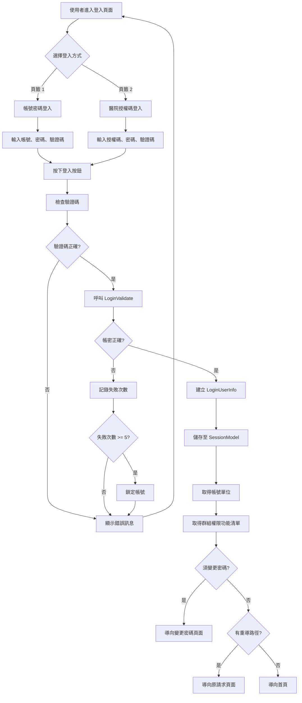

# 電子病歷申請系統 (EECOnline) - 身份驗證與授權補充：登入流程與 Session 管理

> 本文件為「06\_身份驗證與授權機制詳細範例\_Authentication 與 Authorization.md」的補充文件，詳細說明登入流程、Session 管理、密碼加密等核心功能。

## 1. 登入流程

### 1.1 C101MController 登入控制器

**檔案位置：** `Areas/Login/Controllers/C101MController.cs`

C101MController 負責處理使用者登入的所有流程，包含帳號密碼登入與醫院授權碼登入。

#### 1.1.1 Index 登入頁面

```csharp
/// <summary>
/// 登入頁面
/// </summary>
[AllowAnonymous]
public ActionResult Index()
{
    C101MFormModel form = new C101MFormModel() { ThePage = "1" };
    ActionResult rtn = View(form);
    return rtn;
}
```

**程式碼說明：**

1. **AllowAnonymous 屬性**：允許匿名存取（不需登入）
2. **ThePage = "1"**：預設顯示帳號密碼登入頁籤
3. **C101MFormModel**：登入表單模型

#### 1.1.2 Login 登入處理

```csharp
/// <summary>
/// 使用者按下登入按鈕
/// </summary>
[HttpPost]
[AllowAnonymous]
public ActionResult Login(C101MFormModel form)
{
    ActionResult rtn;
    try
    {
        var IP = HttpContext.Request.UserHostAddress;

        // 系統管理邏輯
        ClamService service = new ClamService();

        // 檢查驗證碼及輸入欄位
        this.InputValidate(form);

        #region 登入帳密檢核
        LoginUserInfo userInfo = null;

        // 頁籤 1：帳號密碼登入
        if (form.ThePage == "1")
        {
            userInfo = service.LoginValidate(form.UserNo, form.UserPwd, IP);
        }

        // 頁籤 2：醫院授權碼登入
        if (form.ThePage == "2")
        {
            userInfo = service.LoginValidate_Hosp(form.AuthCode, form.AuthCode_Pwd, IP);
            LoginDAO dao = new LoginDAO();
            var tmpObj = dao.GetRow(new TblEEC_Hospital() { AuthCode = form.AuthCode });
            if (tmpObj != null) userInfo.HospitalCode = tmpObj.code;
        }

        if (userInfo == null) return Redirect("~/Home/Index");

        userInfo.LoginIP = IP;
        userInfo.LoginTab = form.ThePage;
        #endregion

        #region 登入失敗處理
        // 登入失敗, 丟出錯誤訊息
        if (!userInfo.LoginSuccess)
        {
            throw new LoginExceptions(userInfo.LoginErrMessage);
        }
        #endregion

        #region 將登入者資訊保存在 SessionModel 中
        SessionModel sm = SessionModel.Get();
        sm.UserInfo = userInfo;
        #endregion

        #region 取得帳號單位
        if (form.ThePage == "1")
        {
            LoginDAO dao = new LoginDAO();
            TblAMUROLE ar = new TblAMUROLE();
            ar.userno = form.UserNo;
            var ar_data = dao.GetRow(ar);
            TblAMGRP ag = new TblAMGRP();
            ag.grp_id = ar_data.grp_id;
            var ag_data = dao.GetRow(ag);
            sm.UserInfo.User.UNIT_NAME = ag_data.grpname;
        }
        if (form.ThePage == "2")
        {
            LoginDAO dao = new LoginDAO();
            TblAMUROLE_Hosp ar = new TblAMUROLE_Hosp();
            ar.AuthCode = form.AuthCode;
            var ar_data = dao.GetRow(ar);
            TblAMGRP_Hosp ag = new TblAMGRP_Hosp();
            ag.grp_id = ar_data.grp_id;
            var ag_data = dao.GetRow(ag);
            sm.UserInfo.User.UNIT_NAME = ag_data.grpname;
        }
        #endregion

        #region 將登入者群組權限功能清單保存在 SessionModel 中
        if (form.ThePage == "1")
            sm.RoleFuncs = service.GetUserRoleFuncs(userInfo);
        if (form.ThePage == "2")
            sm.RoleFuncs = service.GetUserRoleFuncs_Hosp(userInfo);
        #endregion

        #region 須變更密碼
        if (userInfo.ChangePwdRequired)
        {
            if (form.ThePage == "1")
            {
                string msg = userInfo.LoginErrMessage;
                sm.LastErrorMessage = string.IsNullOrEmpty(msg) ?
                    "為了安全起見，請您先變更密碼再用本系統！" : msg;
                sm.RedirectUrlAfterBlock = Url.Action("PasswordChange", "C101M",
                    new { area = "Login", useCache = "2" });
            }
            C101MFormModel model = new C101MFormModel();
            model = form;
            return View("Index", model);
        }
        #endregion

        #region 重導處理
        else if (TempData["RedirectPath"] != null)
        {
            var TPath = TempData["RedirectPath"].TONotNullString().ToSplit('/');

            if (TempData["RedirectApyId"] != null || TempData["RedirectGUID"] != null)
            {
                var TApy_id = TempData["RedirectApyId"];
                var TGUID = TempData["RedirectGUID"];

                TempData["RedirectApyId"] = null;
                TempData["RedirectGUID"] = null;
                return RedirectToAction(TPath[2], TPath[1],
                    new { area = TPath[0], apy_id = TApy_id, GUID = TGUID });
            }
            TempData["RedirectPath"] = null;

            return RedirectToAction(TPath[2], TPath[1], new { area = TPath[0] });
        }
        #endregion

        // 登入成功，導向首頁
        rtn = RedirectToAction("Index", "C102M");
    }
    catch (LoginExceptions ex)
    {
        if (form.ThePage == "1")
            LOG.Info("Login(" + form.UserNo + ") Failed from " +
                     Request.UserHostAddress + ": " + ex.Message);
        if (form.ThePage == "2")
            LOG.Info("Login(" + form.AuthCode + ") Failed from " +
                     Request.UserHostAddress + ": " + ex.Message);

        // 清除不想要 Cache POST data 的欄位
        form.UserPwd = null;
        form.AuthCode_Pwd = null;

        SessionModel sm = SessionModel.Get();
        sm.LastErrorMessage = ex.Message;
        rtn = View("Index", form);
    }

    return rtn;
}
```

### 1.2 登入流程圖



## 2. Session 管理

### 2.1 SessionModel 屬性定義

**檔案位置：** `Models/SessionModel.cs`

#### 2.1.1 驗證碼相關屬性

```csharp
/// <summary>
/// 使用者登入驗證碼（後台）
/// </summary>
public string LoginValidateCode
{
    get { return (string)this.session[VALIDATE_CODE]; }
    set { this.session[VALIDATE_CODE] = value; }
}

/// <summary>
/// 使用者登入驗證碼_前台自然人憑證
/// </summary>
public string LoginValidateCode1
{
    get { return (string)this.session[VALIDATE_CODE1]; }
    set { this.session[VALIDATE_CODE1] = value; }
}

/// <summary>
/// 使用者登入驗證碼_前台行動自然人憑證
/// </summary>
public string LoginValidateCode2
{
    get { return (string)this.session[VALIDATE_CODE2]; }
    set { this.session[VALIDATE_CODE2] = value; }
}

/// <summary>
/// 使用者登入驗證碼_前台健保卡
/// </summary>
public string LoginValidateCode3
{
    get { return (string)this.session[VALIDATE_CODE3]; }
    set { this.session[VALIDATE_CODE3] = value; }
}
```

#### 2.1.2 使用者資訊相關屬性

```csharp
/// <summary>
/// 登入者使用者帳號資訊
/// </summary>
public LoginUserInfo UserInfo
{
    get
    {
        LoginUserInfo userInfo = null;
        string jsonUserInfo = (string)this.session[USER_INFO];
        if (!string.IsNullOrWhiteSpace(jsonUserInfo))
        {
            userInfo = JsonConvert.DeserializeObject<LoginUserInfo>(jsonUserInfo);
        }
        return userInfo;
    }
    set
    {
        if (value != null && value.UserType == null)
        {
            value.UserType = LoginUserType.SKILL_USER;
        }
        this.session[USER_INFO] = JsonConvert.SerializeObject(value);
    }
}

/// <summary>
/// 作用中角色對應的權限功能清單
/// </summary>
public IList<ClamRoleFunc> RoleFuncs
{
    get
    {
        IList<ClamRoleFunc> roleFuncs = new List<ClamRoleFunc>();
        string jsonRoleFunc = (string)this.session[CUR_ROLE_FUNCTION];
        if (!string.IsNullOrWhiteSpace(jsonRoleFunc))
        {
            roleFuncs = JsonConvert.DeserializeObject<IList<ClamRoleFunc>>(jsonRoleFunc);
        }
        return roleFuncs;
    }
    set
    {
        this.session[CUR_ROLE_FUNCTION] = JsonConvert.SerializeObject(value);
    }
}
```

#### 2.1.3 錯誤訊息相關屬性

```csharp
/// <summary>
/// 最後被記錄的應用功能錯誤提示訊息, 設定這個值, 在下一個頁面中會觸發 blockAlert() 顯示這個訊息,
/// 每次這個訊息被讀取後會自動清除, 確保這個訊息只會在一個頁面中被觸發.
/// </summary>
public string LastErrorMessage
{
    get
    {
        string message = (string)this.session[LAST_ERROR_MESSAGE];
        this.session[LAST_ERROR_MESSAGE] = string.Empty;
        return (string.IsNullOrEmpty(message) ? string.Empty :
                message.Replace("\n", "<br/>").Replace("'", "\""));
    }
    set { this.session[LAST_ERROR_MESSAGE] = value; }
}

/// <summary>
/// 最後被記錄的應用功能操作結果提示訊息, 設定這個值, 在下一個頁面中會觸發 blockResult() 顯示這個訊息,
/// 每次這個訊息被讀取後會自動清除, 確保這個訊息只會在一個頁面中被觸發.
/// </summary>
public string LastResultMessage
{
    get
    {
        string message = (string)this.session[LAST_RESULT_MESSAGE];
        this.session[LAST_RESULT_MESSAGE] = string.Empty;
        return (string.IsNullOrEmpty(message) ? string.Empty :
                message.Replace("\n", "<br/>").Replace("'", "\""));
    }
    set { this.session[LAST_RESULT_MESSAGE] = value; }
}
```

## 3. 密碼加密

### 3.1 LoginDAO 密碼加密方法

**檔案位置：** `DataLayers/LoginDAO.cs`

#### 3.1.1 SHA512 加密

```csharp
/// <summary>
/// SHA512加密法
/// </summary>
/// <param name="originText">加密前字串（必須是明文密碼，請勿傳入加密之後的密碼）</param>
/// <returns>加密後的 Base64 字串</returns>
public string CypherText(string originText)
{
    string strRtn = "";
    using (System.Security.Cryptography.SHA512CryptoServiceProvider sha512 =
           new System.Security.Cryptography.SHA512CryptoServiceProvider())
    {
        byte[] dataToHash = System.Text.Encoding.UTF8.GetBytes(originText);
        byte[] hashvalue = sha512.ComputeHash(dataToHash);
        strRtn = Convert.ToBase64String(hashvalue);
    }
    return strRtn;
}
```

**程式碼說明：**

1. **SHA512**：使用 SHA512 雜湊演算法
2. **不可逆**：雜湊後無法還原原始密碼
3. **Base64 編碼**：將雜湊結果轉換為 Base64 字串儲存
4. **安全性**：符合現代密碼儲存標準

#### 3.1.2 RSA 加密（舊版）

```csharp
/// <summary>
/// 傳入使用者輸入的密碼明文, 加密後回傳
/// </summary>
/// <param name="userPwd">使用者密碼明文</param>
/// <returns>加密後的密碼</returns>
private string EncPassword(string userPwd)
{
    if (string.IsNullOrWhiteSpace(userPwd))
    {
        throw new ArgumentNullException("userPwd");
    }
    //TODO: 置換 RSACSP 改成不可逆的 Hash 方法
    RSACSP.RSACSP rsa = new RSACSP.RSACSP();
    return rsa.Utl_Encrypt(userPwd);
}
```

**程式碼說明：**

1. **RSA 加密**：舊版使用 RSA 加密（可逆）
2. **待改進**：註解中提到應改用不可逆的 Hash 方法
3. **目前狀態**：新版已改用 SHA512（CypherText 方法）

## 4. LoginDAO 資料存取層

**檔案位置：** `DataLayers/LoginDAO.cs`

LoginDAO 負責與資料庫互動，執行登入驗證、使用者資訊查詢、權限載入等操作。

### 4.1 LoginValidate 帳號密碼驗證

```csharp
/// <summary>
/// 登入帳密檢核，並取得使用者帳號及權限角色清單資料
/// </summary>
/// <param name="userNo">使用者帳號</param>
/// <param name="userPwd_encry">加密後的密碼</param>
/// <returns>登入使用者資訊</returns>
public LoginUserInfo LoginValidate(string userNo, string userPwd_encry)
{
    // 第一步：建立 LoginUserInfo 物件
    LoginUserInfo userInfo = new LoginUserInfo();
    userInfo.UserNo = userNo;
    userInfo.LoginSuccess = false;

    // 第二步：查詢使用者資料
    using (SqlConnection conn = DataUtils.GetConnection())
    {
        // 第三步：開啟資料庫連線
        DataUtils.OpenDbConn(conn);

        try
        {
            // 第四步：建立 SQL 查詢
            string sql = @"
                SELECT * FROM AMUSERS
                WHERE userno = @userno
                AND pswd = @pswd
                AND enabled = 'Y'
                AND ISNULL(del_mk, 'N') = 'N'
            ";

            // 第五步：建立 SqlCommand
            using (SqlCommand cmd = new SqlCommand(sql, conn))
            {
                // 第六步：加入參數（防止 SQL Injection）
                cmd.Parameters.AddWithValue("@userno", userNo);
                cmd.Parameters.AddWithValue("@pswd", userPwd_encry);

                // 第七步：執行查詢
                using (SqlDataReader reader = cmd.ExecuteReader())
                {
                    if (reader.Read())
                    {
                        // 第八步：登入成功，載入使用者資料
                        userInfo.LoginSuccess = true;
                        userInfo.User = new ClamUser();
                        userInfo.User.userno = reader["userno"].ToString();
                        userInfo.User.username = reader["username"].ToString();
                        userInfo.User.email = reader["email"].ToString();
                        userInfo.User.enabled = reader["enabled"].ToString();

                        // 第九步：檢查密碼是否需要變更
                        if (reader["PWDMODTIME"] != DBNull.Value)
                        {
                            DateTime pwdModTime = Convert.ToDateTime(reader["PWDMODTIME"]);
                            userInfo.PWDMODTIME = pwdModTime;

                            // 密碼超過 90 天未變更，強制變更
                            if (DateTime.Now.Subtract(pwdModTime).Days > 90)
                            {
                                userInfo.ChangePwdRequired = true;
                                userInfo.LoginErrMessage = "密碼已超過 90 天未變更，請變更密碼。";
                            }
                        }
                    }
                    else
                    {
                        // 第十步：登入失敗
                        userInfo.LoginSuccess = false;
                        userInfo.LoginErrMessage = "帳號或密碼錯誤。";
                    }
                }
            }
        }
        finally
        {
            // 第十一步：關閉資料庫連線
            DataUtils.CloseDbConn(conn);
        }
    }

    return userInfo;
}
```

**程式碼說明：**

1. **參數化查詢**：使用 @userno 和 @pswd 參數，防止 SQL Injection 攻擊
2. **帳號狀態檢查**：檢查 enabled = 'Y' 和 del_mk = 'N'，確保帳號啟用且未刪除
3. **密碼比對**：比對加密後的密碼，不儲存明文密碼
4. **密碼變更檢查**：檢查密碼最後修改時間，超過 90 天強制變更
5. **錯誤訊息**：登入失敗時提供明確的錯誤訊息
6. **資源管理**：使用 using 語句確保資料庫連線和資源正確釋放

### 4.2 GetUserRoleFuncs 取得使用者權限清單

```csharp
/// <summary>
/// 取得使用者可存取的功能清單（角色權限）
/// </summary>
/// <param name="userNo">使用者帳號</param>
/// <returns>角色功能權限清單</returns>
public IList<ClamRoleFunc> GetUserRoleFuncs(string userNo)
{
    // 第一步：建立權限清單
    IList<ClamRoleFunc> roleFuncs = new List<ClamRoleFunc>();

    // 第二步：查詢使用者權限
    using (SqlConnection conn = DataUtils.GetConnection())
    {
        DataUtils.OpenDbConn(conn);

        try
        {
            // 第三步：建立 SQL 查詢
            // 透過 AMUROLE（使用者角色）和 AMROLEFUNC（角色功能）關聯查詢
            string sql = @"
                SELECT DISTINCT
                    f.sysid,
                    f.modules,
                    f.submodules,
                    f.prgname AS funcname
                FROM AMUROLE ur
                INNER JOIN AMROLEFUNC rf ON ur.role_id = rf.role_id
                INNER JOIN AMFUNCM f ON rf.sysid = f.sysid
                    AND rf.modules = f.modules
                    AND rf.submodules = f.submodules
                WHERE ur.userno = @userno
                AND f.enabled = 'Y'
                ORDER BY f.sysid, f.modules, f.submodules
            ";

            // 第四步：建立 SqlCommand
            using (SqlCommand cmd = new SqlCommand(sql, conn))
            {
                // 第五步：加入參數
                cmd.Parameters.AddWithValue("@userno", userNo);

                // 第六步：執行查詢
                using (SqlDataReader reader = cmd.ExecuteReader())
                {
                    while (reader.Read())
                    {
                        // 第七步：建立 ClamRoleFunc 物件
                        ClamRoleFunc roleFunc = new ClamRoleFunc();
                        roleFunc.sysid = reader["sysid"].ToString();
                        roleFunc.modules = reader["modules"].ToString();
                        roleFunc.submodules = reader["submodules"].ToString();
                        roleFunc.funcname = reader["funcname"].ToString();

                        // 第八步：加入清單
                        roleFuncs.Add(roleFunc);
                    }
                }
            }
        }
        finally
        {
            DataUtils.CloseDbConn(conn);
        }
    }

    return roleFuncs;
}
```

**程式碼說明：**

1. **三表關聯查詢**：

   - AMUROLE：使用者角色關聯表
   - AMROLEFUNC：角色功能關聯表
   - AMFUNCM：功能定義表

2. **DISTINCT 去重**：避免重複的權限記錄

3. **啟用狀態檢查**：只載入 enabled = 'Y' 的功能

4. **排序**：按 sysid、modules、submodules 排序，方便權限比對

5. **權限清單**：回傳 IList<ClamRoleFunc>，儲存到 SessionModel.RoleFuncs

## 5. 登入失敗鎖定機制

### 5.1 登入失敗記錄

**檔案位置：** `DataLayers/LoginDAO.cs`

```csharp
/// <summary>
/// 記錄登入失敗
/// </summary>
/// <param name="userNo">使用者帳號</param>
/// <param name="loginIP">登入 IP</param>
public void RecordLoginFailure(string userNo, string loginIP)
{
    // 第一步：查詢最後一筆登入記錄
    using (SqlConnection conn = DataUtils.GetConnection())
    {
        DataUtils.OpenDbConn(conn);

        try
        {
            // 第二步：查詢最後一筆登入記錄
            string sqlSelect = @"
                SELECT TOP 1 * FROM LOGIN_LOG
                WHERE userno = @userno
                ORDER BY login_time DESC
            ";

            int failCount = 0;
            DateTime? lastLoginTime = null;

            using (SqlCommand cmd = new SqlCommand(sqlSelect, conn))
            {
                cmd.Parameters.AddWithValue("@userno", userNo);

                using (SqlDataReader reader = cmd.ExecuteReader())
                {
                    if (reader.Read())
                    {
                        // 第三步：取得失敗次數
                        if (reader["STATUS"].ToString() == "A")  // A = 失敗
                        {
                            failCount = Convert.ToInt32(reader["FAIL_COUNT"]);
                            lastLoginTime = Convert.ToDateTime(reader["LOGIN_TIME"]);
                        }
                    }
                }
            }

            // 第四步：檢查是否在鎖定期間內
            if (lastLoginTime.HasValue &&
                DateTime.Now.Subtract(lastLoginTime.Value).TotalMinutes < 15)
            {
                // 在鎖定期間內，累加失敗次數
                failCount++;
            }
            else
            {
                // 超過鎖定期間，重新計算
                failCount = 1;
            }

            // 第五步：新增登入失敗記錄
            string sqlInsert = @"
                INSERT INTO LOGIN_LOG
                (userno, login_time, login_ip, STATUS, FAIL_COUNT, FAIL_TOTAL)
                VALUES
                (@userno, @login_time, @login_ip, 'A', @fail_count,
                 (SELECT ISNULL(MAX(FAIL_TOTAL), 0) + 1 FROM LOGIN_LOG WHERE userno = @userno))
            ";

            using (SqlCommand cmd = new SqlCommand(sqlInsert, conn))
            {
                cmd.Parameters.AddWithValue("@userno", userNo);
                cmd.Parameters.AddWithValue("@login_time", DateTime.Now);
                cmd.Parameters.AddWithValue("@login_ip", loginIP);
                cmd.Parameters.AddWithValue("@fail_count", failCount);

                cmd.ExecuteNonQuery();
            }

            // 第六步：檢查是否達到鎖定條件
            if (failCount >= 5)
            {
                throw new LoginExceptions("連續登入失敗 5 次，帳號已鎖定 15 分鐘。");
            }
        }
        finally
        {
            DataUtils.CloseDbConn(conn);
        }
    }
}
```

**程式碼說明：**

1. **失敗次數累計**：記錄連續失敗次數（FAIL_COUNT）
2. **總失敗次數**：記錄累計失敗次數（FAIL_TOTAL）
3. **鎖定機制**：連續失敗 5 次鎖定 15 分鐘
4. **時間檢查**：超過 15 分鐘後重新計算失敗次數
5. **IP 記錄**：記錄登入 IP，用於安全稽核

### 5.2 登入成功記錄

```csharp
/// <summary>
/// 記錄登入成功
/// </summary>
/// <param name="userNo">使用者帳號</param>
/// <param name="loginIP">登入 IP</param>
public void RecordLoginSuccess(string userNo, string loginIP)
{
    using (SqlConnection conn = DataUtils.GetConnection())
    {
        DataUtils.OpenDbConn(conn);

        try
        {
            // 新增登入成功記錄
            string sql = @"
                INSERT INTO LOGIN_LOG
                (userno, login_time, login_ip, STATUS, FAIL_COUNT, FAIL_TOTAL)
                VALUES
                (@userno, @login_time, @login_ip, 'S', 0,
                 (SELECT ISNULL(MAX(FAIL_TOTAL), 0) FROM LOGIN_LOG WHERE userno = @userno))
            ";

            using (SqlCommand cmd = new SqlCommand(sql, conn))
            {
                cmd.Parameters.AddWithValue("@userno", userNo);
                cmd.Parameters.AddWithValue("@login_time", DateTime.Now);
                cmd.Parameters.AddWithValue("@login_ip", loginIP);

                cmd.ExecuteNonQuery();
            }
        }
        finally
        {
            DataUtils.CloseDbConn(conn);
        }
    }
}
```

**程式碼說明：**

1. **成功狀態**：STATUS = 'S' 表示登入成功
2. **重置失敗次數**：FAIL_COUNT = 0，清除連續失敗次數
3. **保留總次數**：FAIL_TOTAL 保留，用於統計分析

## 6. 總結

本補充文件詳細說明了：

1. **登入流程**：包含帳號密碼登入與醫院授權碼登入的完整流程

   - C101MController 登入控制器
   - 驗證碼檢查
   - 密碼加密
   - Session 建立
   - 權限載入

2. **Session 管理**：SessionModel 的屬性定義與使用方式

   - 使用者資訊儲存
   - 角色權限儲存
   - 錯誤訊息管理
   - JSON 序列化

3. **密碼加密**：SHA512 雜湊演算法的實作與安全性考量

   - CypherText 方法
   - Base64 編碼
   - 不可逆加密

4. **資料存取層**：LoginDAO 的實作

   - LoginValidate 帳號密碼驗證
   - GetUserRoleFuncs 權限載入
   - 參數化查詢防止 SQL Injection

5. **登入失敗鎖定機制**：
   - 連續失敗 5 次鎖定 15 分鐘
   - 失敗次數記錄
   - 登入成功記錄

完整的程式碼範例和詳細說明請參考主文件「06\_身份驗證與授權機制詳細範例\_Authentication 與 Authorization.md」。
