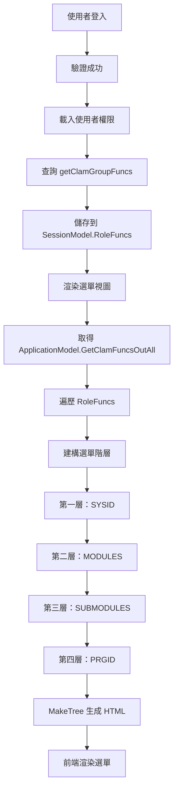
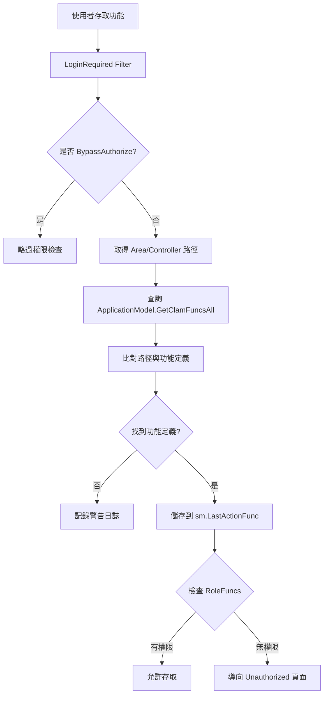

# EECOnline 電子病歷申請系統 - 側邊選單權限控制詳細範例：Menu 與 Permission 整合

## 功能概述

本文詳細說明 EECOnline 系統中的側邊選單（Sidebar Menu）和選單項目權限控制機制。系統採用基於角色的選單權限控制（Role-Based Menu Access Control, RBAC），透過多層級的樹狀選單結構，結合使用者角色和功能權限，動態產生個人化的選單介面。

## 選單權限控制架構概覽

```
EECOnline 選單權限控制架構：

使用者登入
    ↓ 身份驗證通過
載入使用者權限
    ↓ 從 Session 取得 RoleFuncs
查詢功能定義
    ↓ ApplicationModel.GetClamFuncsOutAll()
權限過濾
    ↓ 比對 RoleFuncs 與 AMFUNCM
建構選單階層
    ↓ 四層樹狀結構
前端選單渲染
    ↓ _LeftMenu.cshtml / _Back_LeftMenu.cshtml
使用者個人化選單
```

## 1. 資料庫選單權限架構

### 1.1 選單權限相關資料表結構

```
選單權限資料表關聯圖：

AMFUNCM (功能定義表)
    ↓ 階層式結構 (SYSID, MODULES, SUBMODULES, PRGID)
    ↓ 多對多
AMGMAPM (群組功能權限表)
    ↓ 關聯到
AMUROLE (使用者角色關聯表)
    ↓ 關聯到
AMDBURM (使用者表)
```

### 1.2 AMFUNCM 功能定義資料表

**檔案位置：** `trunk_DISK_trunk/trunk/Models/Entities/TblAMFUNCM.cs`

#### 1.2.1 功能定義資料結構

```csharp
/// <summary>
/// 功能定義資料表
/// 支援四層級樹狀結構的選單系統
/// </summary>
public class TblAMFUNCM
{
    /// <summary>
    /// 系統 ID（第一層）
    /// 例如：A1（病歷申請管理）、A2（案件查詢）、A6（系統管理）
    /// </summary>
    public string sysid { get; set; }

    /// <summary>
    /// 模組（第二層）
    /// 例如：M1（申請管理）、M2（查詢管理）
    /// 空白表示為第一層節點
    /// </summary>
    public string modules { get; set; }

    /// <summary>
    /// 子模組（第三層）
    /// 例如：S1（申請單管理）、S2（進度查詢）
    /// 空白表示為第二層節點
    /// </summary>
    public string submodules { get; set; }

    /// <summary>
    /// 功能 ID（第四層，對應 Area/Controller 路徑）
    /// 例如：A1/C101M（帳號管理）、A2/C201M（案件查詢）
    /// 空白表示為第三層節點
    /// </summary>
    public string prgid { get; set; }

    /// <summary>
    /// 功能名稱 - 顯示在選單上的文字
    /// 例如：「帳號管理」、「案件查詢」
    /// </summary>
    public string prgname { get; set; }

    /// <summary>
    /// 功能排序
    /// 數字越小越優先顯示
    /// </summary>
    public string prgorder { get; set; }

    /// <summary>
    /// 是否顯示在選單
    /// '1': 顯示，'0': 不顯示
    /// </summary>
    public string showmenu { get; set; }

    /// <summary>
    /// 查詢字串參數
    /// 附加在 URL 後的參數
    /// </summary>
    public string querystring { get; set; }

    /// <summary>
    /// 是否啟用
    /// 'Y': 啟用，'N': 停用
    /// </summary>
    public string enabled { get; set; }

    /// <summary>
    /// 修改者帳號
    /// </summary>
    public string moduser { get; set; }

    /// <summary>
    /// 修改者姓名
    /// </summary>
    public string modusername { get; set; }

    /// <summary>
    /// 修改時間
    /// </summary>
    public DateTime? modtime { get; set; }

    /// <summary>
    /// 修改者 IP
    /// </summary>
    public string modip { get; set; }
}
```

**程式碼說明：**

1. **四層階層設計**：透過 `sysid`、`modules`、`submodules`、`prgid` 四個欄位建立多層級選單結構
2. **空白判斷**：欄位為空白（" "）表示該層級為父節點，沒有實際功能連結
3. **排序機制**：`prgorder` 欄位確保選單按正確順序顯示
4. **顯示控制**：`showmenu` 控制是否在選單中顯示
5. **權限整合**：`prgid` 作為權限檢查的關鍵識別碼，對應 Area/Controller 路徑

### 1.3 ClamRoleFunc 角色功能權限模型

**檔案位置：** `trunk_DISK_trunk/trunk/Models/ClamRoleFunc.cs`

```csharp
/// <summary>
/// 角色功能權限 Model
/// 繼承自 TblAMFUNCM，包含所有功能定義欄位
/// </summary>
public class ClamRoleFunc : TblAMFUNCM
{
    /// <summary>
    /// 功能資料字串
    /// 用於除錯和日誌記錄
    /// </summary>
    /// <returns>功能資料的字串表示</returns>
    public override string ToString()
    {
        // 第一步：建立 StringBuilder
        StringBuilder x = new StringBuilder();

        // 第二步：附加 showmenu 屬性
        x.Append("showmenu=");
        x.Append(this.showmenu);

        // 第三步：附加 sysid 屬性
        x.Append(", sysid=");
        x.Append(this.sysid);

        // 第四步：附加 modules 屬性
        x.Append(", modules=");
        x.Append(this.modules);

        // 第五步：附加 submodules 屬性
        x.Append(", submodules=");
        x.Append(this.submodules);

        // 第六步：附加 prgid 屬性
        x.Append(", prgid=");
        x.Append(this.prgid);

        // 第七步：附加 prgname 屬性
        x.Append(", prgname=");
        x.Append(this.prgname);

        // 第八步：回傳完整字串
        return x.ToString();
    }
}
```

**程式碼說明：**

1. **繼承設計**：繼承自 `TblAMFUNCM`，擁有所有功能定義欄位
2. **ToString 覆寫**：提供清晰的字串表示，便於除錯
3. **權限儲存**：儲存在 `SessionModel.RoleFuncs` 中，供選單渲染使用

### 1.4 選單權限關聯資料表

#### 1.4.1 AMGMAPM 群組功能權限表

```sql
-- 群組功能權限表結構
CREATE TABLE AMGMAPM (
    grp_id VARCHAR(20),      -- 群組 ID
    sysid VARCHAR(10),       -- 系統 ID
    modules VARCHAR(10),     -- 模組
    submodules VARCHAR(10),  -- 子模組
    prgid VARCHAR(50),       -- 功能 ID
    prg_i CHAR(1),          -- 新增權限 ('1': 有, '0': 無)
    prg_u CHAR(1),          -- 修改權限
    prg_d CHAR(1),          -- 刪除權限
    prg_q CHAR(1),          -- 查詢權限
    prg_p CHAR(1),          -- 列印權限
    PRIMARY KEY (grp_id, sysid, modules, submodules, prgid)
);
```

#### 1.4.2 AMUROLE 使用者角色關聯表

```sql
-- 使用者角色關聯表結構
CREATE TABLE AMUROLE (
    userno VARCHAR(20),     -- 使用者帳號
    grp_id VARCHAR(20),     -- 群組 ID
    PRIMARY KEY (userno, grp_id)
);
```

**程式碼說明：**

1. **多對多關聯**：透過 `AMGMAPM` 和 `AMUROLE` 建立使用者與功能的多對多關聯
2. **細緻權限控制**：`prg_i`、`prg_u`、`prg_d`、`prg_q`、`prg_p` 提供五種操作權限
3. **群組管理**：使用者可屬於多個群組，系統自動合併權限

## 2. 後端選單權限查詢機制

### 2.1 ApplicationModel 快取管理

**檔案位置：** `trunk_DISK_trunk/trunk/Models/ApplicationModel.cs`

#### 2.1.1 取得系統最外層功能清單

```csharp
/// <summary>
/// 取得系統最外層清單（沒有 PRGID 的父節點）
/// 使用 Application 層級快取，提升效能
/// </summary>
/// <returns>最外層功能清單</returns>
public static IList<TblAMFUNCM> GetClamFuncsOutAll()
{
    // 第一步：定義快取鍵值
    const string _KEY = "TblCLAMFUNCMAll";

    // 第二步：取得 ApplicationModel 實例
    ApplicationModel model = GetInstance();

    // 第三步：嘗試從快取中取得資料
    object value = model.GetApplicationVar(_KEY);

    // 第四步：檢查快取是否存在且型別正確
    if (value != null && value is IList<TblAMFUNCM>)
    {
        // 快取命中，直接返回
        return (IList<TblAMFUNCM>)value;
    }
    else
    {
        // 第五步：快取未命中，從資料庫載入
        BaseDAO dao = new BaseDAO();

        // 第六步：查詢所有父節點（PRGID = ' '）
        IList<TblAMFUNCM> list = dao.QueryForListAll<TblAMFUNCM>(
            "Login.getClamFuncsOutAll", null);

        // 第七步：計算快取過期時間（隔天 00:00:00）
        DateTime now = DateTime.Now;
        now = now.AddDays(1);
        DateTime expire = new DateTime(now.Year, now.Month, now.Day, 0, 0, 0);

        // 第八步：將資料儲存至 Application 快取
        model.SetApplicationVar(_KEY, list, expire);

        // 第九步：回傳查詢結果
        return list;
    }
}
```

**程式碼說明：**

1. **Application 快取**：使用 Application 層級快取，所有使用者共用，減少資料庫查詢
2. **快取策略**：快取有效期至隔天 00:00:00，每天自動更新
3. **查詢條件**：只查詢 `PRGID = ' '` 的父節點，用於建構選單階層
4. **效能優化**：避免每次請求都查詢資料庫，大幅提升效能

#### 2.1.2 取得系統已啟用的全部功能清單

### 2.2 LoginDAO 權限查詢

**檔案位置：** `trunk_DISK_trunk/trunk/DataLayers/LoginDAO.cs`

#### 2.2.1 取得使用者角色功能權限清單

```csharp
/// <summary>
/// 取得角色群組權限功能清單
/// 根據使用者帳號查詢所有可存取的功能
/// </summary>
/// <param name="userNo">使用者帳號</param>
/// <returns>角色功能權限清單</returns>
public IList<ClamRoleFunc> GetRoleFuncs(string userNo)
{
    // 第一步：建立查詢參數
    Hashtable parms = new Hashtable();
    parms["USERNO"] = userNo;

    // 第二步：執行查詢並回傳結果
    return base.QueryForListAll<ClamRoleFunc>("Login.getClamGroupFuncs", parms);
}
```

**程式碼說明：**

1. **參數化查詢**：使用 Hashtable 傳遞參數，防止 SQL Injection
2. **IBatis 查詢**：呼叫 `Login.getClamGroupFuncs` SQL 查詢
3. **回傳型別**：回傳 `IList<ClamRoleFunc>`，儲存到 Session 中

#### 2.2.2 醫院授權碼權限查詢

```csharp
/// <summary>
/// 取得醫院授權碼的角色功能權限清單
/// 用於醫院端登入
/// </summary>
/// <param name="AuthCode">醫院授權碼</param>
/// <returns>角色功能權限清單</returns>
public IList<ClamRoleFunc> GetRoleFuncs_Hosp(string AuthCode)
{
    // 第一步：建立查詢參數
    Hashtable parms = new Hashtable();
    parms["AuthCode"] = AuthCode;

    // 第二步：執行查詢並回傳結果
    return base.QueryForListAll<ClamRoleFunc>("Login.getClamGroupFuncs_Hosp", parms);
}
```

**程式碼說明：**

1. **醫院端權限**：使用醫院授權碼查詢權限
2. **獨立權限表**：使用 `AMGMAPM_Hosp` 和 `AMUROLE_Hosp` 表
3. **雙重登入機制**：支援一般使用者和醫院端兩種登入方式

### 2.3 IBatis SQL 查詢定義

**檔案位置：** `trunk_DISK_trunk/trunk/SqlMaps/Login.xml`

#### 2.3.1 一般使用者權限查詢

```xml
<!-- 取得群組功能權限清單 -->
<select id="getClamGroupFuncs" resultClass="EECOnline.Models.ClamRoleFunc"
        parameterClass="Hashtable" cacheModel="TBKC-cache">
  <![CDATA[
    -- 第一步：查詢使用者可存取的功能清單
    SELECT DISTINCT
        a.sysid,           -- 系統 ID
        a.modules,         -- 模組
        a.submodules,      -- 子模組
        a.prgid,           -- 功能 ID
        a.prgname,         -- 功能名稱
        a.prgorder,        -- 排序
        a.showmenu,        -- 是否顯示在選單
        a.querystring,     -- 查詢字串
        a.moduser,         -- 修改者
        a.modusername,     -- 修改者姓名
        a.modtime,         -- 修改時間
        a.modip            -- 修改者 IP
    FROM amfuncm a
        -- 第二步：關聯群組功能權限表
        INNER JOIN amgmapm b ON b.sysid = a.sysid
            AND b.modules = a.modules
            AND b.submodules = b.submodules
            AND b.prgid = a.prgid
        -- 第三步：關聯使用者角色表
        INNER JOIN amurole c ON c.grp_id = b.grp_id
        -- 第四步：關聯使用者表
        INNER JOIN amdburm d ON d.userno = c.userno
    WHERE 1 = 1
        -- 第五步：只顯示在選單中的功能
        AND showmenu = '1'
        -- 第六步：至少有一種操作權限
        AND (b.prg_i <> '0' OR b.prg_u <> '0' OR b.prg_d <> '0'
             OR b.prg_q <> '0' OR b.prg_p <> '0')
        -- 第七步：指定使用者帳號
        AND d.userno = #USERNO#
    -- 第八步：排序
    ORDER BY a.prgorder, a.sysid, a.modules, a.submodules, a.prgid
  ]]>
</select>
```

**程式碼說明：**

1. **四表關聯查詢**：

   - `amfuncm`：功能定義表
   - `amgmapm`：群組功能權限表
   - `amurole`：使用者角色表
   - `amdburm`：使用者表

2. **DISTINCT 去重**：避免使用者屬於多個群組時產生重複記錄

3. **權限過濾**：

   - `showmenu = '1'`：只顯示在選單中的功能
   - 至少有一種操作權限（新增、修改、刪除、查詢、列印）

4. **排序**：按 `prgorder`、`sysid`、`modules`、`submodules`、`prgid` 排序

5. **快取機制**：使用 `cacheModel="TBKC-cache"` 快取查詢結果

#### 2.3.2 醫院端權限查詢

```xml
<!-- 取得醫院端群組功能權限清單 -->
<select id="getClamGroupFuncs_Hosp" resultClass="EECOnline.Models.ClamRoleFunc"
        parameterClass="Hashtable" cacheModel="TBKC-cache">
  <![CDATA[
    -- 第一步：查詢醫院端可存取的功能清單
    SELECT DISTINCT
        a.sysid, a.modules, a.submodules, a.prgid, a.prgname,
        a.prgorder, a.showmenu, a.querystring,
        a.moduser, a.modusername, a.modtime, a.modip
    FROM amfuncm a
        -- 第二步：關聯醫院端群組功能權限表
        INNER JOIN amgmapm_Hosp b ON b.sysid = a.sysid
            AND b.modules = a.modules
            AND b.submodules = b.submodules
            AND b.prgid = a.prgid
        -- 第三步：關聯醫院端使用者角色表
        INNER JOIN amurole_Hosp c ON c.grp_id = b.grp_id
        -- 第四步：關聯醫院表
        INNER JOIN EEC_Hospital d ON d.AuthCode = c.AuthCode
    WHERE 1=1
        -- 第五步：只顯示在選單中的功能
        AND showmenu = '1'
        -- 第六步：至少有一種操作權限
        AND (b.prg_i <> '0' OR b.prg_u <> '0' OR b.prg_d <> '0'
             OR b.prg_q <> '0' OR b.prg_p <> '0')
        -- 第七步：指定醫院授權碼
        AND d.AuthCode = #AuthCode#
    -- 第八步：排序
    ORDER BY a.prgorder, a.sysid, a.modules, a.submodules, a.prgid
  ]]>
</select>
```

**程式碼說明：**

1. **醫院端專用表**：使用 `amgmapm_Hosp`、`amurole_Hosp`、`EEC_Hospital` 表
2. **授權碼識別**：使用 `AuthCode` 而非 `userno` 識別醫院
3. **相同邏輯**：查詢邏輯與一般使用者相同，只是使用不同的資料表

#### 2.3.3 取得系統最外層功能清單

```xml
<!-- 取得系統最外層功能清單（父節點） -->
<select id="getClamFuncsOutAll" resultClass="EECOnline.Models.Entities.TblAMFUNCM"
        parameterClass="Hashtable" cacheModel="TBKC-cache">
  <![CDATA[
    -- 查詢所有父節點（PRGID = ' '）
    SELECT * FROM AMFUNCM
    WHERE 1=1
        -- 只顯示在選單中的功能
        AND SHOWMENU = '1'
        -- 只查詢父節點（沒有實際功能連結）
        AND PRGID = ' '
    -- 排序
    ORDER BY SYSID, MODULES, SUBMODULES, PRGORDER
  ]]>
</select>
```

**程式碼說明：**

1. **父節點查詢**：`PRGID = ' '` 表示該節點為父節點，沒有實際功能連結
2. **選單顯示**：`SHOWMENU = '1'` 確保只查詢要顯示在選單中的項目
3. **快取**：使用 `cacheModel="TBKC-cache"` 快取查詢結果

#### 2.3.4 取得系統全部功能清單

```xml
<!-- 取得系統已啟用的全部功能清單 -->
<select id="getClamFuncsAll" resultClass="EECOnline.Models.Entities.TblAMFUNCM"
        parameterClass="Hashtable" cacheModel="TBKC-cache">
  <![CDATA[
    -- 查詢所有功能定義
    SELECT * FROM AMFUNCM
    WHERE 1=1
        /*AND SHOWMENU = '1'*/  -- 註解：包含不顯示在選單的功能
    -- 排序
    ORDER BY SYSID, MODULES, SUBMODULES, PRGORDER
  ]]>
</select>
```

**程式碼說明：**

1. **完整清單**：包含所有功能定義，不限於顯示在選單中的項目
2. **權限檢查用**：主要用於 `LoginRequired` Filter 中的權限檢查
3. **排序**：按階層和排序欄位排序

## 3. 前端選單渲染機制

### 3.1 \_LeftMenu.cshtml 選單視圖（舊版）

**檔案位置：** `trunk_DISK_trunk/trunk/Views/Shared/_LeftMenu.cshtml`

#### 3.1.1 選單資料準備

```csharp
@using System.Text
@using EECOnline.Models
@using EECOnline.DataLayers
@using EECOnline.Services
@using Omu.ValueInjecter;
@using EECOnline.Models.Entities
@{
    // 第一步：取得 Session 中的使用者資訊
    SessionModel sm = SessionModel.Get();

    // 第二步：取得選單類型設定
    string mainMenuType = ConfigModel.MainMenuType;
    string OnOrOff = ConfigModel.OnOrOff;

    // 第三步：取得系統最外層功能清單（父節點）
    IList<AMFUNCM> BigFuncModules = ApplicationModel.GetClamFuncsOutAll();

    // 第四步：建立有程式連結的節點清單
    IList<AMFUNCM> funcModules = new List<AMFUNCM>();

    // 第五步：依權限給予節點
    foreach (var item in sm.RoleFuncs)
    {
        // 第六步：建構第一層功能代碼
        var firstFuncCode = item.SYSID + "| " + "| " + "| ";

        // 第七步：查找第一層父節點
        var firstFunc = BigFuncModules.Where(m =>
            m.SYSID + "|" +
            m.MODULES + "|" +
            m.SUBMODULES + "|" +
            m.PRGID == firstFuncCode).FirstOrDefault();

        // 第八步：加入第一層節點（避免重複）
        if (!funcModules.Contains(firstFunc) && firstFunc != null)
        {
            funcModules.Add(firstFunc);
        }

        // 第九步：建構第二層功能代碼
        var secFuncCode = item.SYSID + "|" + item.MODULES + "| " + "| ";

        // 第十步：查找第二層父節點
        var secFunc = BigFuncModules.Where(m =>
            m.SYSID + "|" +
            m.MODULES + "|" +
            m.SUBMODULES + "|" +
            m.PRGID == secFuncCode).FirstOrDefault();

        // 第十一步：加入第二層節點（避免重複）
        if (!funcModules.Contains(secFunc) && secFunc != null)
        {
            funcModules.Add(secFunc);
        }

        // 第十二步：建構第三層功能代碼
        var thrFuncCode = item.SYSID + "|" + item.MODULES + "|" + item.SUBMODULES + "| ";

        // 第十三步：查找第三層父節點
        var thrFunc = BigFuncModules.Where(m =>
            m.SYSID + "|" +
            m.MODULES + "|" +
            m.SUBMODULES + "|" +
            m.PRGID == thrFuncCode).FirstOrDefault();

        // 第十四步：加入第三層節點（避免重複）
        if (!funcModules.Contains(thrFunc) && thrFunc != null)
        {
            funcModules.Add(thrFunc);
        }

        // 第十五步：加入實際功能節點
        AMFUNCM func = new AMFUNCM();
        func.InjectFrom(item);
        funcModules.Add(func);
    }

    // 第十六步：為有 PRGID 的節點加上路徑前綴
    foreach (var item in funcModules.Where(m => m.PRGID.TONotNullString() != " "))
    {
        item.PRGID = OnOrOff + item.PRGID;
    }
}
```

**程式碼說明：**

1. **Session 取得**：從 `SessionModel.Get()` 取得使用者資訊和權限清單
2. **父節點查詢**：從 `ApplicationModel.GetClamFuncsOutAll()` 取得所有父節點
3. **權限過濾**：遍歷 `sm.RoleFuncs`，只加入使用者有權限的功能
4. **階層建構**：
   - 第一層：`SYSID + "| " + "| " + "| "`
   - 第二層：`SYSID + "|" + MODULES + "| " + "| "`
   - 第三層：`SYSID + "|" + MODULES + "|" + SUBMODULES + "| "`
   - 第四層：實際功能節點（有 PRGID）
5. **去重處理**：使用 `Contains` 檢查避免重複加入父節點
6. **路徑前綴**：為實際功能加上 `OnOrOff` 前綴（用於區分環境）

#### 3.1.2 MakeTree 選單樹建構方法

```csharp
@functions{
    /// <summary>
    /// 建立第二層以後節點
    /// 並以字串回傳組成的 li, ul 等 html 內容
    /// </summary>
    /// <param name="funcModules">系統功能項目集合</param>
    /// <returns>HTML 字串</returns>
    private string MakeTree(IList<TblAMFUNCM> funcModules)
    {
        string html = "";

        // 第一步：查找第一層節點
        var branchGroup1 = funcModules.Where(m =>
            m.SYSID.TONotNullString() != " " &&
            m.MODULES.TONotNullString() == " " &&
            m.SUBMODULES.TONotNullString() == " " &&
            m.PRGID.TONotNullString() == " ").ToList();

        // 第二步：遍歷第一層節點
        foreach (var branch1 in branchGroup1)
        {
            // 第三步：建立第一層 li 標籤
            html += "<li class='branch'>";
            html += "<a href='#' id='" + branch1.SYSID + "| | | ' title='" + branch1.PRGNAME + "'>" + branch1.PRGNAME + "</a> ";

            // 第四步：查找第二層節點
            var branchGroup2 = funcModules.Where(m =>
                m.SYSID == branch1.SYSID &&
                m.MODULES.TONotNullString() != " " &&
                m.SUBMODULES.TONotNullString() == " " &&
                m.PRGID.TONotNullString() == " ");

            html += "<ul>";

            // 第五步：遍歷第二層節點
            foreach (var branch2 in branchGroup2)
            {
                html += "<li class=\"branch\" style=\"display: list-item;\">";
                html += string.Format("<a href=\"#\" id=\"{0}|{1}| | \" title=\"{2}\">{3}</a>",
                    branch2.SYSID, branch2.MODULES, branch2.PRGNAME, branch2.PRGNAME);

                // 第六步：查找第三層節點
                var branchGroup3 = funcModules.Where(m =>
                    m.SYSID == branch2.SYSID &&
                    m.MODULES == branch2.MODULES &&
                    m.SUBMODULES.TONotNullString() != " " &&
                    m.PRGID.TONotNullString() == " ");

                html += "<ul>";

                // 第七步：檢查是否有第三層節點
                if (branchGroup3.ToCount() > 0)
                {
                    // 有第三層父節點
                    foreach (var branch3 in branchGroup3)
                    {
                        html += "<li class=\"branch\" style=\"display: list-item;\">";
                        html += string.Format("<a href=\"#\" id=\"{0}|{1}|{2}| \" title=\"{3}\">{4}</a>",
                            branch3.SYSID, branch3.MODULES, branch3.SUBMODULES, branch3.PRGNAME, branch3.PRGNAME);

                        // 第八步：查找第四層節點（實際功能）
                        var branchGroup4 = funcModules.Where(m =>
                            m.SYSID == branch3.SYSID &&
                            m.MODULES == branch3.MODULES &&
                            m.SUBMODULES.TONotNullString() == branch3.SUBMODULES &&
                            m.PRGID.TONotNullString() != " ");

                        foreach (var branch4 in branchGroup4)
                        {
                            html += "<ul>";
                            html += "<li style=\"display:list-item;\">";
                            html += "<i class=\"leaf-marker glyphicon glyphicon-map-marker\"></i>";
                            html += string.Format("<a href=\"/{0}\" id=\"{1}|{2}|{3}|{4}\" title=\"{5}\">{6}</a></li>",
                                branch4.PRGID, branch4.SYSID, branch4.MODULES, branch4.SUBMODULES, branch4.PRGID,
                                branch4.PRGNAME, branch4.PRGNAME);
                            html += "</ul>";
                        }
                        html += "</li>";
                    }
                }
                else
                {
                    // 第九步：沒有第三層父節點，直接顯示功能
                    var branchGroup3No = funcModules.Where(m =>
                        m.SYSID == branch2.SYSID &&
                        m.MODULES == branch2.MODULES &&
                        m.PRGID.TONotNullString() != " ");

                    foreach (var branch3no in branchGroup3No)
                    {
                        html += "<li style=\"display:list-item;\">";
                        html += "<i class=\"leaf-marker glyphicon glyphicon-map-marker\"></i>";
                        html += string.Format("<a href=\"/{0}\" id=\"{1}|{2}| |{3}\" title=\"{4}\">{5}</a></li>",
                            branch3no.PRGID, branch3no.SYSID, branch3no.MODULES, branch3no.PRGID,
                            branch3no.PRGNAME, branch3no.PRGNAME);
                    }
                }
                html += "</ul>";
                html += "</li>";
            }

            html += "</ul>";
            html += "</li>";
        }

        return string.Format(html);
    }
}
```

**程式碼說明：**

1. **四層階層處理**：

   - 第一層：系統分類（SYSID）
   - 第二層：模組分類（MODULES）
   - 第三層：子模組分類（SUBMODULES）
   - 第四層：實際功能（PRGID）

2. **條件判斷**：使用 `TONotNullString()` 判斷欄位是否為空白

3. **HTML 生成**：動態生成 `<li>` 和 `<ul>` 標籤，建構樹狀選單

4. **圖示標記**：使用 `glyphicon-map-marker` 標記實際功能項目

5. **連結生成**：
   - 父節點：`href="#"`（無連結）
   - 功能節點：`href="/{PRGID}"`（實際路徑）

#### 3.1.3 前端 HTML 渲染

```html
<!-- Sidebar Left Menu -->
<link rel="stylesheet" type="text/css" href="~/Scripts/treemenu/treemenu.css" />
<script
  type="text/javascript"
  src="~/Scripts/treemenu/sessionstorage.js"></script>
<script type="text/javascript" src="~/Scripts/treemenu/treemenu.js"></script>

<div class="navbg">
  <div style="position: fixed;width:17.3%;">
    <h4 class="menu-header">功能選單</h4>
    <div class="mainMenu">
      <ul id="mainMenu" style="" class="tree">
        <!-- 固定首頁連結 -->
        <li class="branch">
          <a href="~/" title="回首頁">回首頁</a>
        </li>
        <!-- 動態產生的選單樹 -->
        @Html.Raw(this.MakeTree(funcModules))
      </ul>
    </div>
  </div>
</div>

<script>
  $(document).ready(function () {
    try {
      // 判斷功能表類型以顯示對應的系統主功能表
      var menuType = "@(mainMenuType)";
      switch (menuType) {
        case "1":
          // 樹型選單
          markupTreeMenu();
          break;
        default:
          // 預設選單
          markupDefaultMenu();
          break;
      }
    } catch (ex) {
      blockAlert(ex.message);
    }
  });

  // 顯示樹型結構的系統主功能表
  function markupTreeMenu() {
    var elm = $("ul#mainMenu");
    if (elm) {
      elm.treeMenu(null);
      elm.showMenu();
    }
  }
</script>
```

**程式碼說明：**

1. **固定首頁**：第一個 `<li>` 固定為首頁連結
2. **動態選單**：使用 `@Html.Raw()` 輸出 `MakeTree()` 生成的 HTML
3. **選單類型**：根據 `mainMenuType` 決定使用樹型或預設選單
4. **JavaScript 初始化**：使用 `treeMenu()` 插件初始化樹型選單

### 3.2 \_Back_LeftMenu.cshtml 選單視圖（新版）

**檔案位置：** `trunk_DISK_trunk/trunk/Views/Shared/_Back_LeftMenu.cshtml`

#### 3.2.1 選單資料準備（新版）

```csharp
@using System.Text
@using EECOnline.Models
@using EECOnline.DataLayers
@using EECOnline.Services
@using Omu.ValueInjecter;
@using EECOnline.Models.Entities
@{
    // 第一步：取得 Session 中的使用者資訊
    SessionModel sm = SessionModel.Get();

    // 第二步：取得選單類型設定
    string mainMenuType = ConfigModel.MainMenuType;
    string OnOrOff = ConfigModel.OnOrOff;

    // 第三步：取得系統最外層功能清單（父節點）
    IList<TblAMFUNCM> BigFuncModules = ApplicationModel.GetClamFuncsOutAll();

    // 第四步：建立有程式連結的節點清單
    IList<TblAMFUNCM> funcModules = new List<TblAMFUNCM>();

    // 第五步：依權限給予節點（與舊版相同邏輯）
    foreach (var item in sm.RoleFuncs)
    {
        // 建構第一層功能代碼
        var firstFuncCode = item.sysid + "| " + "| " + "| ";
        var firstFunc = BigFuncModules.Where(m =>
            m.sysid + "|" +
            m.modules + "|" +
            m.submodules + "|" +
            m.prgid == firstFuncCode).FirstOrDefault();
        if (!funcModules.Contains(firstFunc) && firstFunc != null)
        {
            funcModules.Add(firstFunc);
        }

        // 建構第二層功能代碼
        var secFuncCode = item.sysid + "|" + item.modules + "| " + "| ";
        var secFunc = BigFuncModules.Where(m =>
            m.sysid + "|" +
            m.modules + "|" +
            m.submodules + "|" +
            m.prgid == secFuncCode).FirstOrDefault();
        if (!funcModules.Contains(secFunc) && secFunc != null)
        {
            funcModules.Add(secFunc);
        }

        // 建構第三層功能代碼
        var thrFuncCode = item.sysid + "|" + item.modules + "|" + item.submodules + "| ";
        var thrFunc = BigFuncModules.Where(m =>
            m.sysid + "|" +
            m.modules + "|" +
            m.submodules + "|" +
            m.prgid == thrFuncCode).FirstOrDefault();
        if (!funcModules.Contains(thrFunc) && thrFunc != null)
        {
            funcModules.Add(thrFunc);
        }

        // 加入實際功能節點
        TblAMFUNCM func = new TblAMFUNCM();
        func.InjectFrom(item);
        funcModules.Add(func);
    }
}
```

**程式碼說明：**

1. **相同邏輯**：資料準備邏輯與舊版相同
2. **型別差異**：使用 `TblAMFUNCM` 而非 `AMFUNCM`（小寫屬性名稱）
3. **權限過濾**：同樣遍歷 `sm.RoleFuncs` 建構選單階層

#### 3.2.2 MakeTree 選單樹建構方法（新版）

```csharp
@functions{
    /// <summary>
    /// 建立第二層以後節點
    /// 並以字串回傳組成的 li, ul 等 html 內容
    /// </summary>
    /// <param name="funcModules">系統功能項目集合</param>
    /// <returns>HTML 字串</returns>
    private string MakeTree(IList<TblAMFUNCM> funcModules)
    {
        string html = "<ul class='nav-links'>";

        // 第一步：查找第一層節點
        var branchGroup1 = funcModules.Where(m =>
            m.sysid.TONotNullString() != " " &&
            m.modules.TONotNullString() == " " &&
            m.submodules.TONotNullString() == " " &&
            m.prgid.TONotNullString() == " ").ToList();

        // 第二步：遍歷第一層節點
        foreach (var branch1 in branchGroup1)
        {
            var active1 = "";
            var active2 = "";

            // 第三步：根據功能名稱選擇圖示
            var show = CheckStringContains(branch1.prgname);

            // 第四步：建立第一層選單項目
            html += "<li><div class='iocn-link'>";
            html += "<a href='#'><i class='bx bxs-" + show + "'></i>";
            html += "<span class='link_name'" + active1 + "' data-nav1='" + branch1.prgname + "'>" + branch1.prgname + "</span></a>";
            html += "<i class='bx bx-caret-right arrow'></i></div>";

            // 第五步：查找第二層節點（直接有功能的項目）
            var branchGroup2 = funcModules.Where(m =>
                m.sysid == branch1.sysid &&
                m.modules.TONotNullString() != " " &&
                m.submodules.TONotNullString() == " " &&
                m.prgid.TONotNullString() != " ");

            html += "<ul class='sub-menu'>";

            // 第六步：遍歷第二層節點
            foreach (var branch2 in branchGroup2)
            {
                html += string.Format("<li><a href=\"/{0}\" id=\"{1}|{2}| | \" title=\"{3}\" data-nav2='{4}' class='" + active2 + "'><i class='bx bxs-chevron-right'></i>{4}</a></li> ",
                    branch2.prgid, branch2.sysid, branch2.modules, branch2.prgname, branch2.prgname);
            }
            html += "</ul><li>";
        }
        html += "</ul>";
        return string.Format(html);
    }

    /// <summary>
    /// 選單 icon 對應
    /// 根據功能名稱關鍵字選擇對應的圖示
    /// </summary>
    /// <param name="input">功能名稱</param>
    /// <returns>Boxicons 圖示名稱</returns>
    public string CheckStringContains(string input)
    {
        if (input.Contains("病歷"))
        {
            return "clinic";
        }
        else if (input.Contains("案件"))
        {
            return "detail";
        }
        else if (input.Contains("帳務"))
        {
            return "wallet";
        }
        else if (input.Contains("統計"))
        {
            return "bar-chart-square";
        }
        else if (input.Contains("系統"))
        {
            return "cog";
        }
        else if (input.Contains("帳號"))
        {
            return "user-account";
        }
        else if (input.Contains("紀錄"))
        {
            return "file-find";
        }
        else if (input.Contains("網站"))
        {
            return "data";
        }
        else
        {
            return "right-arrow-alt";
        }
    }
}
```

**程式碼說明：**

1. **簡化階層**：新版只處理兩層（第一層分類 + 第二層功能）
2. **Boxicons 圖示**：使用 `bxs-` 前綴的 Boxicons 圖示
3. **圖示對應**：根據功能名稱關鍵字自動選擇對應圖示
4. **響應式設計**：使用 `nav-links` 和 `sub-menu` 類別支援響應式選單

#### 3.2.3 前端 HTML 渲染（新版）

```html
<div class="sidebar" id="sideNav">
  <div class="logo-details">
    <span class="logo_name">系統選單</span>
    <i class="bx bxs-chevrons-left"></i>
  </div>
  @Html.Raw(this.MakeTree(funcModules))
</div>
```

**程式碼說明：**

1. **側邊欄設計**：使用 `sidebar` 類別建立固定側邊欄
2. **Logo 區域**：顯示「系統選單」標題和收合圖示
3. **動態選單**：使用 `@Html.Raw()` 輸出 `MakeTree()` 生成的 HTML
4. **現代化 UI**：使用 Boxicons 圖示和現代化 CSS 樣式

## 4. 選單權限檢查機制

### 4.1 LoginRequired Filter 權限檢查

**檔案位置：** `trunk_DISK_trunk/trunk/Commons/Filter/CustomAuthAttribute.cs`

#### 4.1.1 OnAuthorization 權限檢查方法

```csharp
/// <summary>
/// 權限檢查方法
/// 在每個 Action 執行前檢查使用者是否有權限存取
/// </summary>
/// <param name="filterContext">過濾器上下文</param>
public override void OnAuthorization(AuthorizationContext filterContext)
{
    // 第一步：取得 Session
    SessionModel sm = SessionModel.Get();

    // 第二步：檢查是否為 BypassAuthorize（略過權限檢查）
    bool isByPassAuth = filterContext.ActionDescriptor.IsDefined(
        typeof(BypassAuthorize), true);

    if (isByPassAuth)
    {
        // 略過權限檢查
        return;
    }

    // 第三步：取得當前 Action 路徑
    string area = filterContext.RouteData.DataTokens["area"]?.ToString() ?? "";
    string controller = filterContext.RouteData.Values["controller"]?.ToString() ?? "";
    string funcPath = area + "/" + controller;

    // 第四步：取得系統中已啟用的全部功能定義
    IList<TblAMFUNCM> allFuncs = ApplicationModel.GetClamFuncsAll();
    sm.LastActionFunc = null;

    // 第五步：比對當前路徑與功能定義
    for (int i = 0; i < allFuncs.Count; i++)
    {
        TblAMFUNCM item = allFuncs[i];
        if (funcPath.Equals(item.prgid))
        {
            // 找到對應功能
            sm.LastActionFunc = item;
            break;
        }
    }

    // 第六步：檢查是否找到功能定義
    if (sm.LastActionFunc == null && !isByPassAuth)
    {
        LOG.Warn("功能路徑 [" + funcPath + "] 找不到 AMFUNCM 定義");
    }

    // 第七步：檢查使用者是否有權限
    if (sm.LastActionFunc != null)
    {
        // 檢查使用者的 RoleFuncs 是否包含此功能
        bool hasPermission = sm.RoleFuncs.Any(rf =>
            rf.sysid == sm.LastActionFunc.sysid &&
            rf.modules == sm.LastActionFunc.modules &&
            rf.submodules == sm.LastActionFunc.submodules &&
            rf.prgid == sm.LastActionFunc.prgid);

        if (!hasPermission)
        {
            // 無權限，導向錯誤頁面
            filterContext.Result = new RedirectResult("~/Error/Unauthorized");
        }
    }
}
```

**程式碼說明：**

1. **BypassAuthorize 檢查**：允許特定 Action 略過權限檢查
2. **路徑解析**：從 RouteData 取得 Area 和 Controller，組成功能路徑
3. **功能比對**：從 `ApplicationModel.GetClamFuncsAll()` 取得所有功能定義並比對
4. **權限檢查**：檢查 `sm.RoleFuncs` 是否包含當前功能
5. **未授權處理**：無權限時導向錯誤頁面

### 4.2 ApplicationModel GetHeader 麵包屑導航

**檔案位置：** `trunk_DISK_trunk/trunk/Models/ApplicationModel.cs`

```csharp
/// <summary>
/// 組合路徑_主要
/// 產生麵包屑導航
/// </summary>
/// <returns>麵包屑 HTML</returns>
public static string GetHeader()
{
    // 第一步：取得 Session
    SessionModel sm = SessionModel.Get();
    var dao = new BaseDAO();
    var FUNCMSTR = "首頁";

    // 第二步：檢查是否有最後存取的功能
    if (sm.LastActionFunc != null)
    {
        // 第三步：取得功能資訊
        var SYSID = sm.LastActionFunc.sysid;
        var MODULES = sm.LastActionFunc.modules;
        var SUBMODULES = sm.LastActionFunc.submodules;
        var PRGID = sm.LastActionFunc.prgid;

        // 第四步：取得第一層名稱
        var firstnm = GetFUNCM(SYSID, " ").prgname;

        // 第五步：取得第二層名稱
        var secnm = GetFUNCM(SYSID, PRGID).prgname;

        // 第六步：組合麵包屑字串
        FUNCMSTR = "<a href='/Login/C102M'>首頁</a> / <a href='#'>" + firstnm + "</a> / <a href='/" + PRGID + "'>" + secnm + "</a>";
    }

    return FUNCMSTR;
}

/// <summary>
/// 取得程式代碼相關物件
/// </summary>
/// <param name="SYSID">系統 ID</param>
/// <param name="PRGID">功能 ID</param>
/// <param name="MODULES">模組（預設空白）</param>
/// <param name="SUBMODULES">子模組（預設空白）</param>
/// <returns>功能定義物件</returns>
public static TblAMFUNCM GetFUNCM(string SYSID, string PRGID, string MODULES = " ", string SUBMODULES = " ")
{
    // 第一步：建立查詢條件
    TblAMFUNCM where = new TblAMFUNCM();
    where.sysid = SYSID;
    where.prgid = PRGID;

    // 第二步：查詢資料庫
    var dao = new BaseDAO();
    var AMFUNCM = dao.GetRow(where);

    return AMFUNCM;
}
```

**程式碼說明：**

1. **麵包屑導航**：根據 `sm.LastActionFunc` 產生麵包屑導航
2. **階層顯示**：顯示「首頁 / 第一層 / 第二層」的導航路徑
3. **GetFUNCM 方法**：根據 SYSID 和 PRGID 查詢功能定義
4. **HTML 連結**：產生可點擊的麵包屑連結

## 5. 完整選單權限流程圖

### 5.1 選單載入流程



### 5.2 權限檢查流程



### 5.3 選單階層結構

```
AMFUNCM 資料表結構：

第一層（系統分類）
├─ SYSID = "A1", MODULES = " ", SUBMODULES = " ", PRGID = " "
│  └─ PRGNAME = "病歷申請管理"
│
├─ 第二層（模組分類）
│  ├─ SYSID = "A1", MODULES = "M1", SUBMODULES = " ", PRGID = " "
│  │  └─ PRGNAME = "申請管理"
│  │
│  ├─ 第三層（子模組分類）
│  │  ├─ SYSID = "A1", MODULES = "M1", SUBMODULES = "S1", PRGID = " "
│  │  │  └─ PRGNAME = "申請單管理"
│  │  │
│  │  ├─ 第四層（實際功能）
│  │  │  ├─ SYSID = "A1", MODULES = "M1", SUBMODULES = "S1", PRGID = "A1/C101M"
│  │  │  │  └─ PRGNAME = "帳號管理"
│  │  │  │
│  │  │  ├─ SYSID = "A1", MODULES = "M1", SUBMODULES = "S1", PRGID = "A1/C102M"
│  │  │  │  └─ PRGNAME = "案件查詢"
```

## 6. 選單權限管理最佳實踐

### 6.1 功能定義管理

#### 6.1.1 新增功能定義

```sql
-- 新增功能定義範例
INSERT INTO AMFUNCM (
    sysid, modules, submodules, prgid, prgname,
    prgorder, showmenu, enabled,
    moduser, modusername, modtime, modip
) VALUES (
    'A1',           -- 系統 ID
    'M1',           -- 模組
    'S1',           -- 子模組
    'A1/C103M',     -- 功能 ID（對應 Area/Controller）
    '新功能',       -- 功能名稱
    100,            -- 排序
    '1',            -- 顯示在選單
    'Y',            -- 啟用
    'admin',        -- 修改者帳號
    '管理員',       -- 修改者姓名
    GETDATE(),      -- 修改時間
    '127.0.0.1'     -- 修改者 IP
);
```

#### 6.1.2 新增父節點

```sql
-- 新增第一層父節點
INSERT INTO AMFUNCM (
    sysid, modules, submodules, prgid, prgname,
    prgorder, showmenu, enabled
) VALUES (
    'A7',           -- 新系統 ID
    ' ',            -- 空白表示第一層
    ' ',            -- 空白表示第一層
    ' ',            -- 空白表示父節點
    '新系統',       -- 系統名稱
    700,            -- 排序
    '1',            -- 顯示在選單
    'Y'             -- 啟用
);

-- 新增第二層父節點
INSERT INTO AMFUNCM (
    sysid, modules, submodules, prgid, prgname,
    prgorder, showmenu, enabled
) VALUES (
    'A7',           -- 系統 ID
    'M1',           -- 新模組 ID
    ' ',            -- 空白表示第二層
    ' ',            -- 空白表示父節點
    '新模組',       -- 模組名稱
    710,            -- 排序
    '1',            -- 顯示在選單
    'Y'             -- 啟用
);
```

### 6.2 權限授予管理

#### 6.2.1 授予群組權限

```sql
-- 授予群組功能權限
INSERT INTO AMGMAPM (
    grp_id, sysid, modules, submodules, prgid,
    prg_i, prg_u, prg_d, prg_q, prg_p
) VALUES (
    'GRP001',       -- 群組 ID
    'A1',           -- 系統 ID
    'M1',           -- 模組
    'S1',           -- 子模組
    'A1/C103M',     -- 功能 ID
    '1',            -- 新增權限
    '1',            -- 修改權限
    '1',            -- 刪除權限
    '1',            -- 查詢權限
    '1'             -- 列印權限
);
```

#### 6.2.2 指派使用者角色

```sql
-- 指派使用者到群組
INSERT INTO AMUROLE (userno, grp_id)
VALUES ('user001', 'GRP001');
```

### 6.3 快取管理

#### 6.3.1 清除 Application 快取

```csharp
/// <summary>
/// 清除功能定義快取
/// 當功能定義有異動時呼叫
/// </summary>
public static void ClearFuncCache()
{
    ApplicationModel model = GetInstance();

    // 清除最外層功能清單快取
    model.RemoveApplicationVar("TblCLAMFUNCMAll");

    // 清除全部功能清單快取
    model.RemoveApplicationVar("TblCLAMFUNCM");
}
```

#### 6.3.2 重新載入使用者權限

```csharp
/// <summary>
/// 重新載入使用者權限
/// 當使用者權限有異動時呼叫
/// </summary>
public static void ReloadUserPermissions(string userNo)
{
    // 取得 Session
    SessionModel sm = SessionModel.Get();

    // 重新查詢使用者權限
    LoginDAO dao = new LoginDAO();
    sm.RoleFuncs = dao.GetRoleFuncs(userNo);
}
```

### 6.4 安全性考量

#### 6.4.1 防止 SQL Injection

```csharp
// ✓ 正確：使用參數化查詢
Hashtable parms = new Hashtable();
parms["USERNO"] = userNo;
return base.QueryForListAll<ClamRoleFunc>("Login.getClamGroupFuncs", parms);

// ✗ 錯誤：字串拼接
string sql = "SELECT * FROM AMFUNCM WHERE userno = '" + userNo + "'";
```

#### 6.4.2 權限檢查

```csharp
// ✓ 正確：每個 Action 都檢查權限
[LoginRequired]
public ActionResult Index()
{
    // ...
}

// ✗ 錯誤：略過權限檢查
[BypassAuthorize]
public ActionResult SensitiveData()
{
    // 敏感資料不應略過權限檢查
}
```

#### 6.4.3 Session 安全

```csharp
// ✓ 正確：檢查 Session 是否存在
SessionModel sm = SessionModel.Get();
if (sm.UserInfo == null)
{
    return RedirectToAction("Login", "Account");
}

// ✗ 錯誤：直接使用 Session 可能導致 NullReferenceException
var userNo = sm.UserInfo.UserNo;
```

## 7. 總結

EECOnline 系統的側邊選單權限控制機制提供了完整且靈活的解決方案：

### 7.1 核心特色

1. **四層級樹狀結構**：支援 SYSID、MODULES、SUBMODULES、PRGID 四層階層，適應複雜的業務需求
2. **基於角色的權限控制（RBAC）**：透過群組和角色管理實現細緻的權限控制
3. **雙重登入機制**：支援一般使用者和醫院端兩種登入方式
4. **Application 快取**：使用 Application 層級快取提升效能
5. **動態選單產生**：根據使用者權限動態產生個人化選單

### 7.2 技術優勢

1. **安全性**：

   - 參數化查詢防止 SQL Injection
   - LoginRequired Filter 統一權限檢查
   - Session 管理確保使用者身份

2. **效能**：

   - Application 快取減少資料庫查詢
   - IBatis 快取機制
   - 快取有效期至隔天 00:00:00

3. **可維護性**：

   - 資料庫驅動的選單系統
   - 清晰的階層結構
   - 統一的權限管理

4. **擴充性**：
   - 支援多層級選單
   - 支援多種操作權限（新增、修改、刪除、查詢、列印）
   - 支援雙重登入機制

### 7.3 應用價值

透過這套選單權限控制機制，EECOnline 系統能夠：

- 為不同角色的使用者提供個人化的操作介面
- 確保敏感功能只有授權使用者才能存取
- 支援複雜的組織架構和權限需求
- 提供良好的使用者體驗和系統效能
- 便於系統管理員進行權限管理和維護

這套機制不僅滿足了當前的業務需求，也為未來的功能擴展和系統整合奠定了堅實的基礎。
