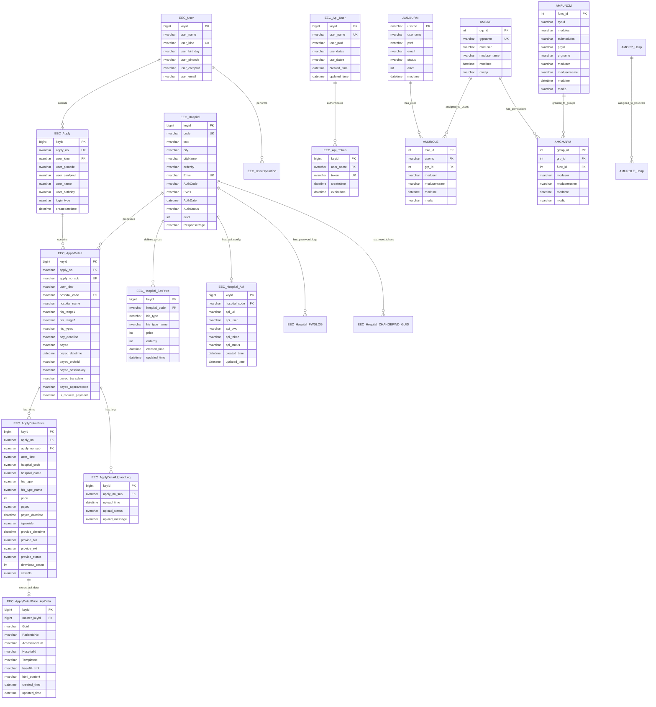
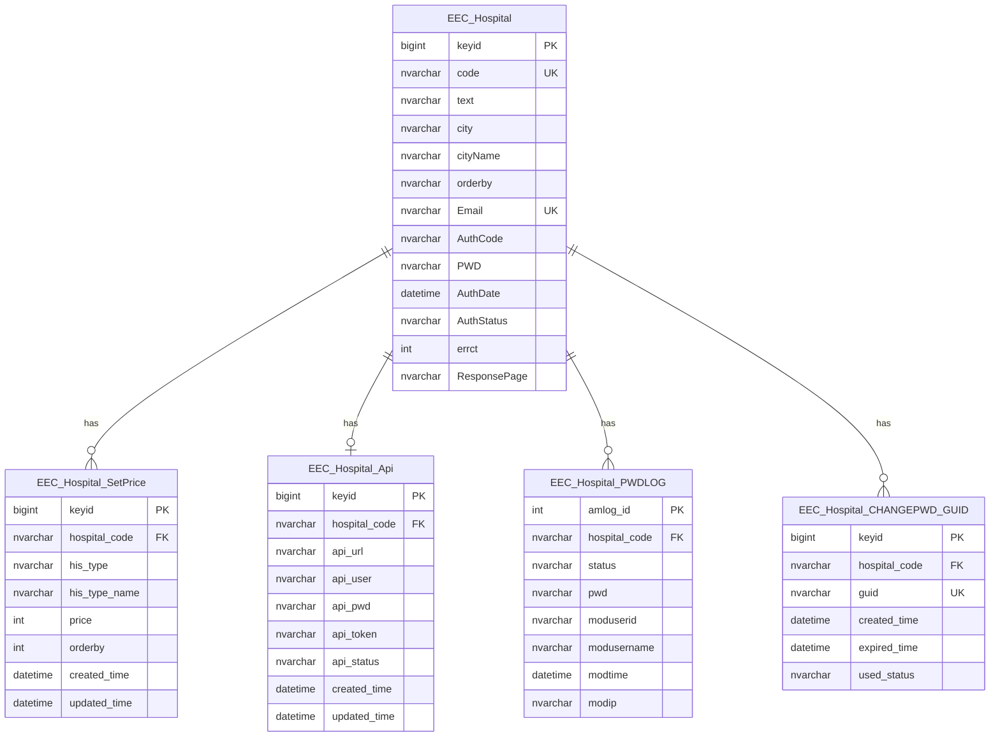
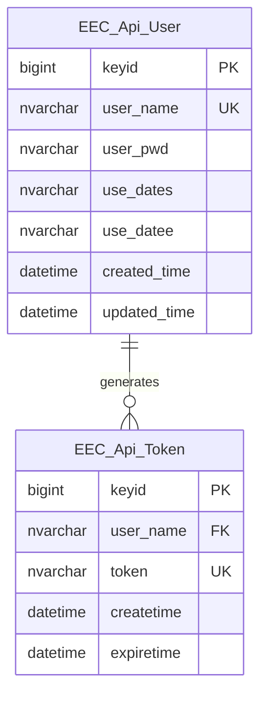
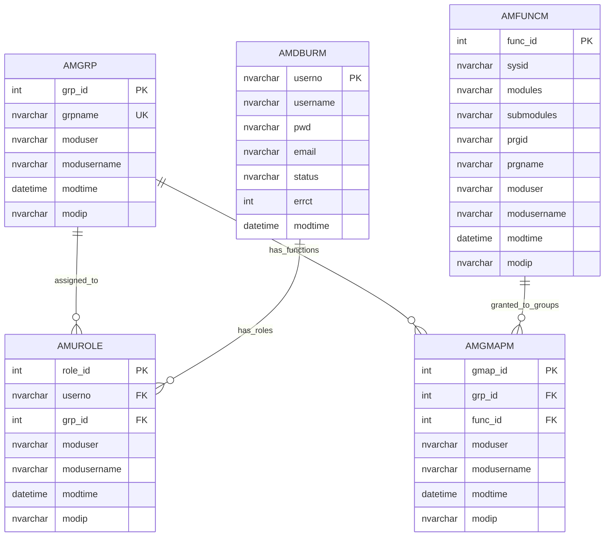
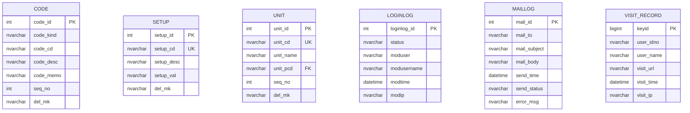
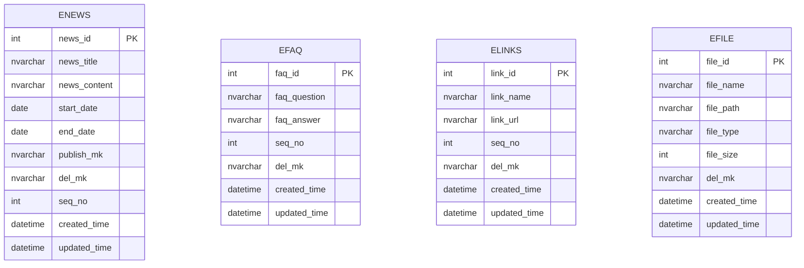

# 電子病歷申請系統 (EECOnline) - 資料庫架構與 CRUD 操作詳細範例

## 資料庫概述

EECOnline 系統使用 SQL Server 資料庫，採用 IBatis.NET 作為 ORM 框架。系統共包含 **60 個主要資料表**，分為以下幾大類：

```
資料庫架構
├── 申請系統 (EEC_Apply, EEC_ApplyDetail, EEC_ApplyDetailPrice...)
├── 醫院系統 (EEC_Hospital, EEC_Hospital_SetPrice, EEC_Hospital_Api...)
├── 使用者系統 (EEC_User, EEC_UserOperation...)
├── API 系統 (EEC_Api_User, EEC_Api_Token...)
├── 權限管理 (AMFUNCM, AMGRP, AMUROLE, AMGMAPM...)
├── 系統管理 (CODE, SETUP, UNIT, LOGINLOG, MAILLOG...)
└── 內容管理 (ENEWS, EFAQ, ELINKS, EFILE...)
```

## 1. 主要資料表結構

### 1.1 申請系統資料表

#### 1.1.1 EEC_Apply 申請主檔

**用途：** 儲存病歷申請的主要資訊

**檔案位置：** `Models/Entities/EEC_Apply.cs`

| 欄位名稱       | 資料型別      | 說明              | 備註                                          |
| -------------- | ------------- | ----------------- | --------------------------------------------- |
| keyid          | BIGINT        | 主鍵              | 自動編號                                      |
| apply_no       | NVARCHAR(50)  | 申請單號          | 格式：yyyyMMddHHmmssfff                       |
| user_idno      | NVARCHAR(20)  | 使用者身分證字號  |                                               |
| user_pincode   | NVARCHAR(50)  | 自然人憑證 PIN 碼 |                                               |
| user_cardpwd   | NVARCHAR(50)  | 健保卡密碼        |                                               |
| user_name      | NVARCHAR(100) | 使用者姓名        |                                               |
| user_birthday  | NVARCHAR(20)  | 出生年月日        |                                               |
| login_type     | NVARCHAR(1)   | 登入方式          | 1:自然人憑證 2:行動自然人憑證 3:身分證+健保卡 |
| createdatetime | DATETIME      | 申請時間          |                                               |

**索引設計：**

- PRIMARY KEY: keyid
- INDEX: apply_no (唯一)
- INDEX: user_idno

#### 1.1.2 EEC_ApplyDetail 申請明細檔

**用途：** 儲存申請的醫院明細資訊

**檔案位置：** `Models/Entities/EEC_ApplyDetail.cs`

| 欄位名稱           | 資料型別      | 說明                  | 備註                                              |
| ------------------ | ------------- | --------------------- | ------------------------------------------------- |
| keyid              | BIGINT        | 主鍵                  | 自動編號                                          |
| apply_no           | NVARCHAR(50)  | 申請單號（主檔）      | FK to EEC_Apply                                   |
| apply_no_sub       | NVARCHAR(50)  | 申請單號（子檔）      | 格式：yyyyMMddHHmmssfff+身分證後 9 碼+流水號(001) |
| user_idno          | NVARCHAR(20)  | 使用者身分證字號      |                                                   |
| hospital_code      | NVARCHAR(20)  | 醫院代碼              | FK to EEC_Hospital                                |
| hospital_name      | NVARCHAR(200) | 醫院名稱              |                                                   |
| his_range1         | NVARCHAR(20)  | 病歷時間範圍（起）    |                                                   |
| his_range2         | NVARCHAR(20)  | 病歷時間範圍（迄）    |                                                   |
| his_types          | NVARCHAR(MAX) | 病歷類型              | 多筆以逗號分隔                                    |
| pay_deadline       | NVARCHAR(20)  | 繳費期限              |                                                   |
| payed              | NVARCHAR(1)   | 是否已繳費            | Y:已繳 N:未繳                                     |
| payed_datetime     | DATETIME      | 繳費時間              |                                                   |
| payed_orderid      | NVARCHAR(50)  | 信用卡繳費 OrderID    |                                                   |
| payed_sessionkey   | NVARCHAR(100) | 信用卡繳費 SessionKey |                                                   |
| payed_transdate    | NVARCHAR(20)  | 信用卡繳費交易日期    |                                                   |
| payed_approvecode  | NVARCHAR(20)  | 信用卡繳費授權碼      |                                                   |
| is_request_payment | NVARCHAR(1)   | 是否已請款            | Y/N                                               |

**索引設計：**

- PRIMARY KEY: keyid
- INDEX: apply_no
- INDEX: apply_no_sub (唯一)
- INDEX: (user_idno, hospital_code)

#### 1.1.3 EEC_ApplyDetailPrice 申請價格明細檔

**用途：** 儲存申請的病歷類型與價格明細

**檔案位置：** `Models/Entities/EEC_ApplyDetailPrice.cs`

| 欄位名稱         | 資料型別      | 說明                       | 備註                                           |
| ---------------- | ------------- | -------------------------- | ---------------------------------------------- |
| keyid            | BIGINT        | 主鍵                       | 自動編號                                       |
| apply_no         | NVARCHAR(50)  | 申請單號（主檔）           | FK to EEC_Apply                                |
| apply_no_sub     | NVARCHAR(50)  | 申請單號（子檔）           | FK to EEC_ApplyDetail                          |
| user_idno        | NVARCHAR(20)  | 使用者身分證字號           |                                                |
| hospital_code    | NVARCHAR(20)  | 醫院代碼                   |                                                |
| hospital_name    | NVARCHAR(200) | 醫院名稱                   |                                                |
| his_type         | NVARCHAR(20)  | 病歷類型代碼               | 單筆                                           |
| his_type_name    | NVARCHAR(200) | 病歷類型名稱               | 單筆                                           |
| price            | INT           | 病歷類型價格               | 單筆                                           |
| pay_deadline     | NVARCHAR(20)  | 繳費期限                   |                                                |
| payed            | NVARCHAR(1)   | 是否已繳費                 | Y/N                                            |
| payed_datetime   | DATETIME      | 繳費時間                   |                                                |
| isprovide        | NVARCHAR(1)   | 是否已提供                 | Y/N（已棄用，改用 provide_status）             |
| provide_datetime | DATETIME      | 提供時間                   |                                                |
| provide_bin      | NVARCHAR(MAX) | 提供檔案 base64 字串       |                                                |
| provide_ext      | NVARCHAR(10)  | 提供檔案副檔名             |                                                |
| provide_status   | NVARCHAR(1)   | 提供狀態                   | 0:預設值 1:已透過 XML 轉換 2:已透過 XML 無轉換 |
| ec_date          | NVARCHAR(20)  | 病歷日期（非醫院代碼）     |                                                |
| ec_dateText      | NVARCHAR(50)  | 病歷日期文字（非醫院代碼） |                                                |
| ec_note          | NVARCHAR(MAX) | 病歷備註（非醫院代碼）     |                                                |
| ec_dept          | NVARCHAR(100) | 病歷科別（非醫院代碼）     |                                                |
| ec_doctor        | NVARCHAR(100) | 病歷醫師（非醫院代碼）     |                                                |
| ec_docType       | NVARCHAR(100) | 文件類型（非醫院代碼）     |                                                |
| ec_system        | NVARCHAR(100) | 系統名稱（非醫院代碼）     |                                                |
| ec_fileName      | NVARCHAR(200) | 匯出至 SFTP 檔案名稱       |                                                |
| ec_success       | NVARCHAR(1)   | API A2-1 回傳是否成功      |                                                |
| ec_success_yn    | NVARCHAR(1)   | API A2-2 回傳是否成功      |                                                |
| ec_reason        | NVARCHAR(500) | API A2-2 回傳失敗原因      |                                                |
| download_count   | INT           | 記錄病歷下載次數           |                                                |
| caseNo           | NVARCHAR(50)  | 亞東 API 使用 caseNo       |                                                |

**索引設計：**

- PRIMARY KEY: keyid
- INDEX: apply_no_sub
- INDEX: (hospital_code, payed, provide_status)

#### 1.1.4 EEC_ApplyDetailPrice_ApiData API 資料檔

**用途：** 儲存從醫院 API 取得的病歷資料

**檔案位置：** `Models/Entities/EEC_ApplyDetailPrice_ApiData.cs`

| 欄位名稱     | 資料型別      | 說明                   | 備註                       |
| ------------ | ------------- | ---------------------- | -------------------------- |
| keyid        | BIGINT        | 主鍵                   | 自動編號                   |
| master_keyid | BIGINT        | 主檔 keyid             | FK to EEC_ApplyDetailPrice |
| Guid         | NVARCHAR(50)  | API GUID               |                            |
| PatientIdNo  | NVARCHAR(20)  | 病患身分證字號         |                            |
| AccessionNum | NVARCHAR(50)  | 病歷號碼               |                            |
| HospitalId   | NVARCHAR(20)  | 醫院代碼               |                            |
| TemplateId   | NVARCHAR(50)  | 模板編號               |                            |
| base64_xml   | NVARCHAR(MAX) | Base64 編碼的 XML 病歷 |                            |
| html_content | NVARCHAR(MAX) | 轉換後的 HTML 內容     |                            |
| created_time | DATETIME      | 建立時間               |                            |
| updated_time | DATETIME      | 更新時間               |                            |

#### 1.1.5 EEC_ApplyDetailUploadLog 上傳記錄檔

**用途：** 記錄病歷上傳的歷程

| 欄位名稱       | 資料型別      | 說明             | 備註          |
| -------------- | ------------- | ---------------- | ------------- |
| keyid          | BIGINT        | 主鍵             | 自動編號      |
| apply_no_sub   | NVARCHAR(50)  | 申請單號（子檔） |               |
| upload_time    | DATETIME      | 上傳時間         |               |
| upload_status  | NVARCHAR(1)   | 上傳狀態         | S:成功 F:失敗 |
| upload_message | NVARCHAR(500) | 上傳訊息         |               |

### 1.2 醫院系統資料表

#### 1.2.1 EEC_Hospital 醫院主檔

**用途：** 儲存醫院基本資料

**檔案位置：** `Models/Entities/EEC_Hospital.cs`

| 欄位名稱     | 資料型別      | 說明                 | 備註          |
| ------------ | ------------- | -------------------- | ------------- |
| keyid        | BIGINT        | 主鍵                 | 自動編號      |
| code         | NVARCHAR(20)  | 醫院代碼             | 唯一          |
| text         | NVARCHAR(200) | 醫院名稱             |               |
| city         | NVARCHAR(10)  | 縣市代碼             |               |
| cityName     | NVARCHAR(50)  | 縣市名稱             |               |
| orderby      | NVARCHAR(10)  | 排序欄位             |               |
| Email        | NVARCHAR(100) | 醫院登入信箱（帳號） |               |
| AuthCode     | NVARCHAR(50)  | 醫院授權碼           |               |
| PWD          | NVARCHAR(100) | 醫院登入密碼         |               |
| AuthDate     | DATETIME      | 醫院授權碼產生時間   |               |
| AuthStatus   | NVARCHAR(1)   | 醫院帳號狀態         | A:啟用 D:停用 |
| errct        | INT           | 錯誤次數             |               |
| ResponsePage | NVARCHAR(200) | 請款回應頁面         |               |

**索引設計：**

- PRIMARY KEY: keyid
- UNIQUE INDEX: code
- INDEX: Email

#### 1.2.2 EEC_Hospital_SetPrice 醫院價格設定檔

**用途：** 儲存醫院的病歷類型價格設定

| 欄位名稱      | 資料型別      | 說明         | 備註               |
| ------------- | ------------- | ------------ | ------------------ |
| keyid         | BIGINT        | 主鍵         | 自動編號           |
| hospital_code | NVARCHAR(20)  | 醫院代碼     | FK to EEC_Hospital |
| his_type      | NVARCHAR(20)  | 病歷類型代碼 |                    |
| his_type_name | NVARCHAR(200) | 病歷類型名稱 |                    |
| price         | INT           | 價格         |                    |
| orderby       | INT           | 排序         |                    |
| created_time  | DATETIME      | 建立時間     |                    |
| updated_time  | DATETIME      | 更新時間     |                    |

#### 1.2.3 EEC_Hospital_Api 醫院 API 設定檔

**用途：** 儲存醫院 API 整合設定

| 欄位名稱      | 資料型別      | 說明       | 備註               |
| ------------- | ------------- | ---------- | ------------------ |
| keyid         | BIGINT        | 主鍵       | 自動編號           |
| hospital_code | NVARCHAR(20)  | 醫院代碼   | FK to EEC_Hospital |
| api_url       | NVARCHAR(500) | API 網址   |                    |
| api_user      | NVARCHAR(100) | API 使用者 |                    |
| api_pwd       | NVARCHAR(100) | API 密碼   |                    |
| api_token     | NVARCHAR(500) | API Token  |                    |
| api_status    | NVARCHAR(1)   | API 狀態   | A:啟用 D:停用      |
| created_time  | DATETIME      | 建立時間   |                    |
| updated_time  | DATETIME      | 更新時間   |                    |

#### 1.2.4 EEC_Hospital_PWDLOG 醫院密碼變更記錄

**用途：** 記錄醫院密碼變更歷程

| 欄位名稱      | 資料型別      | 說明       | 備註     |
| ------------- | ------------- | ---------- | -------- |
| amlog_id      | INT           | 主鍵       | 自動編號 |
| hospital_code | NVARCHAR(20)  | 醫院代碼   |          |
| status        | NVARCHAR(1)   | 狀態       |          |
| pwd           | NVARCHAR(100) | 密碼       |          |
| moduserid     | NVARCHAR(50)  | 修改者帳號 |          |
| modusername   | NVARCHAR(100) | 修改者姓名 |          |
| modtime       | DATETIME      | 修改時間   |          |
| modip         | NVARCHAR(50)  | 修改 IP    |          |

### 1.3 使用者系統資料表

#### 1.3.1 EEC_User 使用者主檔

**用途：** 儲存使用者基本資料

**檔案位置：** `Models/Entities/EEC_User.cs`

| 欄位名稱      | 資料型別      | 說明              | 備註     |
| ------------- | ------------- | ----------------- | -------- |
| keyid         | BIGINT        | 主鍵              | 自動編號 |
| user_name     | NVARCHAR(100) | 使用者姓名        |          |
| user_idno     | NVARCHAR(20)  | 使用者身分證字號  |          |
| user_birthday | NVARCHAR(20)  | 使用者出生年月日  |          |
| user_pincode  | NVARCHAR(50)  | 自然人憑證 PIN 碼 |          |
| user_cardpwd  | NVARCHAR(50)  | 健保卡密碼        |          |
| user_email    | NVARCHAR(100) | 使用者電子郵件    |          |

#### 1.3.2 EEC_UserOperation 使用者操作記錄

**用途：** 記錄使用者操作歷程

| 欄位名稱       | 資料型別      | 說明             | 備註     |
| -------------- | ------------- | ---------------- | -------- |
| keyid          | BIGINT        | 主鍵             | 自動編號 |
| user_idno      | NVARCHAR(20)  | 使用者身分證字號 |          |
| operation_type | NVARCHAR(50)  | 操作類型         |          |
| operation_time | DATETIME      | 操作時間         |          |
| operation_ip   | NVARCHAR(50)  | 操作 IP          |          |
| operation_desc | NVARCHAR(500) | 操作說明         |          |

### 1.4 API 系統資料表

#### 1.4.1 EEC_Api_User API 使用者主檔

**用途：** 儲存 API 使用者帳號

**檔案位置：** `Models/Entities/EEC_Api_User.cs`

| 欄位名稱  | 資料型別      | 說明           | 備註     |
| --------- | ------------- | -------------- | -------- |
| keyid     | BIGINT        | 主鍵           | 自動編號 |
| user_name | NVARCHAR(100) | API 使用者名稱 |          |
| user_pwd  | NVARCHAR(100) | API 使用者密碼 |          |
| use_dates | NVARCHAR(20)  | 使用起始日期   |          |
| use_datee | NVARCHAR(20)  | 使用結束日期   |          |

#### 1.4.2 EEC_Api_Token API Token 檔

**用途：** 儲存 API Token

**檔案位置：** `Models/Entities/EEC_Api_Token.cs`

| 欄位名稱   | 資料型別      | 說明           | 備註     |
| ---------- | ------------- | -------------- | -------- |
| keyid      | BIGINT        | 主鍵           | 自動編號 |
| user_name  | NVARCHAR(100) | API 使用者名稱 |          |
| token      | NVARCHAR(500) | API Token      |          |
| createtime | DATETIME      | 建立時間       |          |

### 1.5 權限管理資料表

#### 1.5.1 AMFUNCM 功能主檔

**用途：** 儲存系統功能清單

| 欄位名稱    | 資料型別      | 說明             | 備註     |
| ----------- | ------------- | ---------------- | -------- |
| func_id     | INT           | 功能編號（主鍵） | 自動編號 |
| sysid       | NVARCHAR(20)  | 系統編號         |          |
| modules     | NVARCHAR(50)  | 模組名稱         |          |
| submodules  | NVARCHAR(50)  | 子模組名稱       |          |
| prgid       | NVARCHAR(50)  | 程式編號         |          |
| prgname     | NVARCHAR(200) | 程式名稱         |          |
| moduser     | NVARCHAR(50)  | 修改者           |          |
| modusername | NVARCHAR(100) | 修改者姓名       |          |
| modtime     | DATETIME      | 修改時間         |          |
| modip       | NVARCHAR(50)  | 修改 IP          |          |

#### 1.5.2 AMGRP 群組主檔

**用途：** 儲存權限群組

| 欄位名稱    | 資料型別      | 說明             | 備註     |
| ----------- | ------------- | ---------------- | -------- |
| grp_id      | INT           | 群組編號（主鍵） | 自動編號 |
| grpname     | NVARCHAR(100) | 群組名稱         |          |
| moduser     | NVARCHAR(50)  | 修改者           |          |
| modusername | NVARCHAR(100) | 修改者姓名       |          |
| modtime     | DATETIME      | 修改時間         |          |
| modip       | NVARCHAR(50)  | 修改 IP          |          |

#### 1.5.3 AMUROLE 使用者角色對應

**用途：** 儲存使用者與群組的對應關係

| 欄位名稱    | 資料型別      | 說明             | 備註        |
| ----------- | ------------- | ---------------- | ----------- |
| role_id     | INT           | 角色編號（主鍵） | 自動編號    |
| userno      | NVARCHAR(50)  | 使用者帳號       |             |
| grp_id      | INT           | 群組編號         | FK to AMGRP |
| moduser     | NVARCHAR(50)  | 修改者           |             |
| modusername | NVARCHAR(100) | 修改者姓名       |             |
| modtime     | DATETIME      | 修改時間         |             |
| modip       | NVARCHAR(50)  | 修改 IP          |             |

#### 1.5.4 AMGMAPM 群組功能對應

**用途：** 儲存群組與功能的對應關係

| 欄位名稱    | 資料型別      | 說明             | 備註          |
| ----------- | ------------- | ---------------- | ------------- |
| gmap_id     | INT           | 對應編號（主鍵） | 自動編號      |
| grp_id      | INT           | 群組編號         | FK to AMGRP   |
| func_id     | INT           | 功能編號         | FK to AMFUNCM |
| moduser     | NVARCHAR(50)  | 修改者           |               |
| modusername | NVARCHAR(100) | 修改者姓名       |               |
| modtime     | DATETIME      | 修改時間         |               |
| modip       | NVARCHAR(50)  | 修改 IP          |               |

### 1.6 系統管理資料表

#### 1.6.1 CODE 代碼主檔

**用途：** 儲存系統代碼資料

| 欄位名稱  | 資料型別      | 說明             | 備註            |
| --------- | ------------- | ---------------- | --------------- |
| code_id   | INT           | 代碼編號（主鍵） | 自動編號        |
| code_kind | NVARCHAR(50)  | 代碼種類         |                 |
| code_cd   | NVARCHAR(50)  | 代碼值           |                 |
| code_desc | NVARCHAR(200) | 代碼說明         |                 |
| code_memo | NVARCHAR(500) | 代碼備註         |                 |
| seq_no    | INT           | 排序序號         |                 |
| del_mk    | NVARCHAR(1)   | 刪除標記         | N:正常 Y:已刪除 |

#### 1.6.2 SETUP 系統參數表

**用途：** 儲存系統設定參數

| 欄位名稱   | 資料型別      | 說明             | 備註     |
| ---------- | ------------- | ---------------- | -------- |
| setup_id   | INT           | 參數編號（主鍵） | 自動編號 |
| setup_cd   | NVARCHAR(50)  | 參數代碼         |          |
| setup_desc | NVARCHAR(200) | 參數說明         |          |
| setup_val  | NVARCHAR(MAX) | 參數值           |          |
| del_mk     | NVARCHAR(1)   | 刪除標記         |          |

**常用參數：**

- Hospital_Common_Api：醫院共用 API 網址
- APPLY_FILE：申請檔案儲存路徑
- PAY*EEC*\*：繳費相關參數

#### 1.6.3 UNIT 單位主檔

**用途：** 儲存組織單位資料

| 欄位名稱  | 資料型別      | 說明             | 備註     |
| --------- | ------------- | ---------------- | -------- |
| unit_id   | INT           | 單位編號（主鍵） | 自動編號 |
| unit_cd   | NVARCHAR(20)  | 單位代碼         |          |
| unit_name | NVARCHAR(200) | 單位名稱         |          |
| unit_pcd  | NVARCHAR(20)  | 父單位代碼       | 階層結構 |
| seq_no    | INT           | 排序序號         |          |
| del_mk    | NVARCHAR(1)   | 刪除標記         |          |

#### 1.6.4 LOGINLOG 登入記錄表

**用途：** 記錄使用者登入歷程

| 欄位名稱    | 資料型別      | 說明             | 備註     |
| ----------- | ------------- | ---------------- | -------- |
| loginlog_id | INT           | 記錄編號（主鍵） | 自動編號 |
| status      | NVARCHAR(1)   | 狀態             |          |
| moduser     | NVARCHAR(50)  | 使用者帳號       |          |
| modusername | NVARCHAR(100) | 使用者姓名       |          |
| modtime     | DATETIME      | 登入時間         |          |
| modip       | NVARCHAR(50)  | 登入 IP          |          |

#### 1.6.5 MAILLOG 郵件記錄表

**用途：** 記錄系統發送的郵件

| 欄位名稱     | 資料型別      | 說明             | 備註          |
| ------------ | ------------- | ---------------- | ------------- |
| mail_id      | INT           | 郵件編號（主鍵） | 自動編號      |
| mail_to      | NVARCHAR(200) | 收件者           |               |
| mail_subject | NVARCHAR(200) | 主旨             |               |
| mail_body    | NVARCHAR(MAX) | 內容             |               |
| send_time    | DATETIME      | 發送時間         |               |
| send_status  | NVARCHAR(1)   | 發送狀態         | S:成功 F:失敗 |
| error_msg    | NVARCHAR(500) | 錯誤訊息         |               |

### 1.7 內容管理資料表

#### 1.7.1 ENEWS 最新消息表

**用途：** 儲存最新消息

| 欄位名稱     | 資料型別      | 說明             | 備註     |
| ------------ | ------------- | ---------------- | -------- |
| news_id      | INT           | 消息編號（主鍵） | 自動編號 |
| news_title   | NVARCHAR(200) | 消息標題         |          |
| news_content | NVARCHAR(MAX) | 消息內容         |          |
| start_date   | DATE          | 開始日期         |          |
| end_date     | DATE          | 結束日期         |          |
| publish_mk   | NVARCHAR(1)   | 發布標記         | Y/N      |
| del_mk       | NVARCHAR(1)   | 刪除標記         |          |

#### 1.7.2 EFAQ 常見問題表

**用途：** 儲存常見問題

| 欄位名稱     | 資料型別      | 說明             | 備註     |
| ------------ | ------------- | ---------------- | -------- |
| faq_id       | INT           | 問題編號（主鍵） | 自動編號 |
| faq_question | NVARCHAR(500) | 問題             |          |
| faq_answer   | NVARCHAR(MAX) | 答案             |          |
| seq_no       | INT           | 排序序號         |          |
| del_mk       | NVARCHAR(1)   | 刪除標記         |          |

#### 1.7.3 ELINKS 相關連結表

**用途：** 儲存相關連結

| 欄位名稱  | 資料型別      | 說明             | 備註     |
| --------- | ------------- | ---------------- | -------- |
| link_id   | INT           | 連結編號（主鍵） | 自動編號 |
| link_name | NVARCHAR(200) | 連結名稱         |          |
| link_url  | NVARCHAR(500) | 連結網址         |          |
| seq_no    | INT           | 排序序號         |          |
| del_mk    | NVARCHAR(1)   | 刪除標記         |          |

## 2. 資料表關聯圖（ER Diagrams）

### 2.1 完整系統資料表關聯總覽

以下是 EECOnline 系統的完整資料表關聯圖，展示所有資料表之間的關聯關係：



### 2.2 申請系統 ER 圖

```mermaid
erDiagram
    EEC_Apply ||--o{ EEC_ApplyDetail : "has"
    EEC_ApplyDetail ||--o{ EEC_ApplyDetailPrice : "has"
    EEC_ApplyDetailPrice ||--o| EEC_ApplyDetailPrice_ApiData : "has"
    EEC_ApplyDetail ||--o{ EEC_ApplyDetailUploadLog : "has"
    EEC_User ||--o{ EEC_Apply : "submits"
    EEC_Hospital ||--o{ EEC_ApplyDetail : "receives"

    EEC_Apply {
        bigint keyid PK
        nvarchar apply_no UK
        nvarchar user_idno FK
        nvarchar user_pincode
        nvarchar user_cardpwd
        nvarchar user_name
        nvarchar user_birthday
        nvarchar login_type
        datetime createdatetime
    }

    EEC_ApplyDetail {
        bigint keyid PK
        nvarchar apply_no FK
        nvarchar apply_no_sub UK
        nvarchar user_idno
        nvarchar hospital_code FK
        nvarchar hospital_name
        nvarchar his_range1
        nvarchar his_range2
        nvarchar his_types
        nvarchar pay_deadline
        nvarchar payed
        datetime payed_datetime
        nvarchar payed_orderid
        nvarchar is_request_payment
    }

    EEC_ApplyDetailPrice {
        bigint keyid PK
        nvarchar apply_no FK
        nvarchar apply_no_sub FK
        nvarchar user_idno
        nvarchar hospital_code
        nvarchar hospital_name
        nvarchar his_type
        nvarchar his_type_name
        int price
        nvarchar payed
        datetime payed_datetime
        nvarchar provide_status
        nvarchar provide_bin
        nvarchar provide_ext
        int download_count
    }

    EEC_ApplyDetailPrice_ApiData {
        bigint keyid PK
        bigint master_keyid FK
        nvarchar Guid
        nvarchar PatientIdNo
        nvarchar AccessionNum
        nvarchar HospitalId
        nvarchar TemplateId
        nvarchar base64_xml
        nvarchar html_content
        datetime created_time
        datetime updated_time
    }

    EEC_ApplyDetailUploadLog {
        bigint keyid PK
        nvarchar apply_no_sub FK
        datetime upload_time
        nvarchar upload_status
        nvarchar upload_message
    }

    EEC_User {
        bigint keyid PK
        nvarchar user_name
        nvarchar user_idno UK
        nvarchar user_birthday
        nvarchar user_pincode
        nvarchar user_cardpwd
        nvarchar user_email
    }

    EEC_Hospital {
        bigint keyid PK
        nvarchar code UK
        nvarchar text
        nvarchar city
        nvarchar cityName
        nvarchar Email
        nvarchar PWD
        nvarchar AuthStatus
    }
```



### 2.2 醫院系統 ER 圖



### 2.3 API 系統 ER 圖



### 2.4 權限管理系統 ER 圖



### 2.5 系統管理 ER 圖



### 2.6 內容管理 ER 圖



## 3. 總結

EECOnline 系統的資料庫架構設計提供了完整的病歷申請管理機制：

### 3.1 資料庫設計特色

- **模組化設計**：清楚區分申請、醫院、使用者、API、權限等模組
- **完整的審計欄位**：記錄修改者、修改時間、修改 IP
- **軟刪除機制**：使用 del_mk 標記刪除，保留歷史資料
- **階層結構支援**：支援多層級的階層資料（單位、代碼）
- **API 整合設計**：完整的 API Token 管理機制

### 3.2 資料表分類

系統共包含 **60 個主要資料表**，分為以下類別：

1. **申請系統**：EEC_Apply, EEC_ApplyDetail, EEC_ApplyDetailPrice, EEC_ApplyDetailPrice_ApiData, EEC_ApplyDetailUploadLog
2. **醫院系統**：EEC_Hospital, EEC_Hospital_SetPrice, EEC_Hospital_Api, EEC_Hospital_PWDLOG, EEC_Hospital_CHANGEPWD_GUID
3. **使用者系統**：EEC_User, EEC_UserOperation
4. **API 系統**：EEC_Api_User, EEC_Api_Token
5. **權限管理**：AMFUNCM, AMGRP, AMUROLE, AMGMAPM, AMGRP_Hosp, AMUROLE_Hosp, AMGMAPM_Hosp
6. **系統管理**：CODE, SETUP, UNIT, LOGINLOG, MAILLOG, VISIT_RECORD, ZIPCODE
7. **內容管理**：ENEWS, EFAQ, ELINKS, EFILE

### 3.3 CRUD 操作特色

- **IBatis.NET ORM**：使用 XML 設定檔定義 SQL 語句
- **參數化查詢**：防止 SQL Injection 攻擊
- **交易管理**：確保資料一致性
- **錯誤處理**：完整的例外處理機制

這套資料庫架構為系統提供了穩定、安全、高效的資料管理解決方案，支援系統的長期運作和維護。
