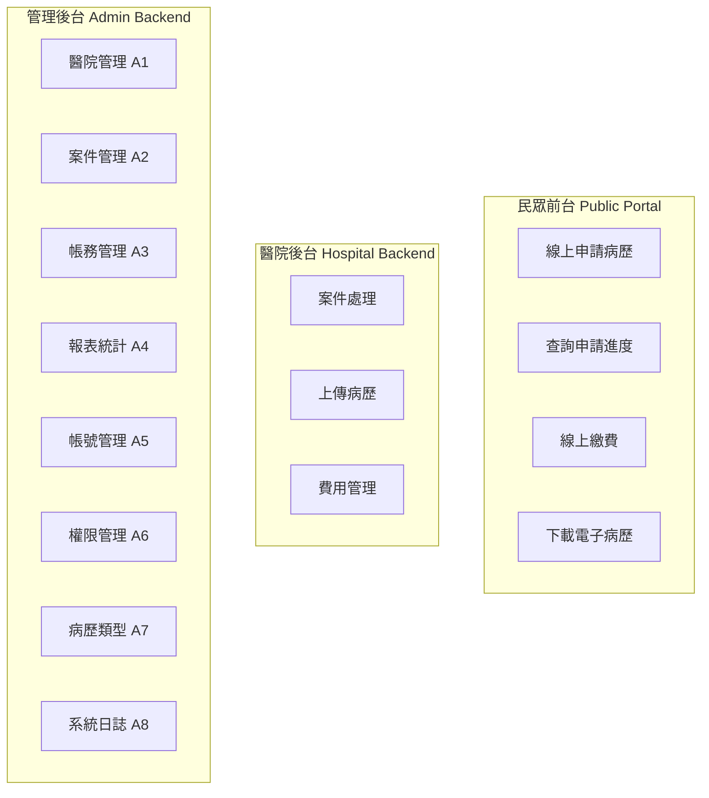

# EECOnline 電子病歷服務平台 - 專案概述

## 1. 專案簡介

**EECOnline** (Electronic Medical Record E-Service Online) 是衛生福利部建置的電子病歷線上申請服務平台，提供民眾線上申請醫院電子病歷的服務。

### 1.1 專案目標


### 1.2 專案資訊

| 項目 | 說明 |
|------|------|
| 專案名稱 | EECOnline 電子病歷服務平台 |
| 主管機關 | 衛生福利部 |
| 技術框架 | ASP.NET MVC 5.2.3 |
| .NET 版本 | .NET Framework 4.5.2 |
| 資料庫 | Microsoft SQL Server |
| 目標平台 | Windows Server / IIS |

---

## 2. 技術架構總覽

### 2.1 系統層次架構


### 2.2 技術堆疊


---

## 3. 專案目錄結構

### 3.1 主要目錄說明

```
trunk/
├── App_Data/           # 應用程式資料（憑證、暫存檔）
├── App_Start/          # MVC 啟動設定
│   ├── BundleConfig.cs     # CSS/JS 打包設定
│   ├── FilterConfig.cs     # 全域篩選器設定
│   └── RouteConfig.cs      # 路由設定
├── Areas/              # MVC Areas 模組
│   ├── A1/ ~ A8/           # 功能模組區域
│   ├── Login/              # 登入模組
│   ├── SHARE/              # 共用元件
│   └── BackApply/          # 後台申請
├── bin/                # 編譯輸出
├── Commons/            # 共用工具類別
├── Content/            # CSS 樣式檔
├── Controllers/        # 主要控制器
├── DataLayers/         # 資料存取層 (DAO)
├── fonts/              # 字型檔案
├── HCA/                # 健保卡驗證元件
├── Helpers/            # HTML Helper 擴充
├── images/             # 圖片資源
├── Models/             # 資料模型
│   ├── base/               # 基礎模型
│   └── Entities/           # 實體類別
├── Properties/         # 專案屬性
├── Scripts/            # JavaScript 檔案
├── Services/           # 商業邏輯服務
├── SqlMaps/            # iBATIS SQL 對應檔
├── Template/           # 文件範本
├── Uploads/            # 檔案上傳目錄
├── Utils/              # 工具類別
├── vendor/             # 第三方程式庫
├── Views/              # Razor 視圖
└── webfonts/           # Web 字型
```

### 3.2 目錄結構圖


---

## 4. 主要功能模組

### 4.1 功能模組總覽



### 4.2 Areas 功能對應表

| Area | 代碼 | 功能說明 | 主要控制器 |
|------|------|----------|------------|
| A1 | 醫院管理 | 醫院資料設定、收費標準 | C101M, C102M |
| A2 | 案件管理 | 申請案件處理 | C101M, C102M |
| A3 | 帳務管理 | 繳費記錄、對帳報表 | C101M-C104M |
| A4 | 報表統計 | 統計報表、資料匯出 | C101M-C103M |
| A5 | 帳號管理 | 使用者帳號維護 | C101M, C102M |
| A6 | 權限管理 | 群組、角色、功能權限 | C101M-C104M |
| A7 | 病歷類型 | 病歷項目設定 | C101M-C104M |
| A8 | 系統日誌 | 操作記錄、稽核軌跡 | C101M-C103M |
| Login | 登入 | 身份驗證、儀表板 | C101M, C102M |
| SHARE | 共用 | 共用元件 (郵遞區號等) | GRP, OPERAT, UNIT |

---

## 5. 系統角色與權限

### 5.1 使用者角色


### 5.2 權限控制層級

| 層級 | 說明 | 實作方式 |
|------|------|----------|
| 功能層 | 控制可存取的功能模組 | AMFUNCM 功能表 |
| 角色層 | 定義角色權限組合 | AMROLEM 角色表 |
| 群組層 | 群組功能對應 | AMGMAPM 對應表 |
| 使用者層 | 使用者角色指派 | AMUROLE 角色指派 |

---

## 6. 設定檔說明

### 6.1 主要設定檔

| 設定檔 | 用途 |
|--------|------|
| Web.config | 主要應用程式設定 |
| SqlMap.config | iBATIS 資料對應設定 |
| properties.config | 資料庫連線字串 |
| providers.config | 資料提供者設定 |
| log4net.config | 日誌記錄設定 |
| Report.config | 報表設定 |
| REST.config | REST API 設定 |

### 6.2 重要應用程式設定

```xml
<!-- Web.config 關鍵設定 -->
<appSettings>
    <!-- 環境設定 -->
    <add key="Deploy" value="0"/>           <!-- 0:測試, 1:正式 -->
    <add key="NetID" value="2"/>            <!-- 1:內網, 2:外網 -->
    
    <!-- 驗證開關 -->
    <add key="HCAOnOff" value="1"/>         <!-- 健保卡驗證 -->
    <add key="level1OnOrOff" value="1"/>    <!-- 自然人憑證 -->
    
    <!-- 系統設定 -->
    <add key="SessionTimeOut" value="60"/>  <!-- Session 逾時(分鐘) -->
    <add key="MailServer" value="..."/>     <!-- SMTP 伺服器 -->
    <add key="FtpNasServer" value="..."/>   <!-- 檔案伺服器 -->
</appSettings>
```

---

## 7. 部署環境

### 7.1 環境需求


### 7.2 部署檢查清單

- [ ] .NET Framework 4.5.2 已安裝
- [ ] IIS 已設定應用程式集區 (x64)
- [ ] SQL Server 連線正常
- [ ] 憑證檔案已部署
- [ ] 檔案上傳目錄權限已設定
- [ ] log4net 日誌目錄已建立

---

## 8. 開發指南

### 8.1 開發環境設定

1. **IDE**: Visual Studio 2015/2017+
2. **資料庫**: SQL Server 2014+
3. **版本控制**: Git

### 8.2 建置步驟

```bash
# 1. 還原 NuGet 套件
nuget restore EECOnline.sln

# 2. 建置專案
msbuild EECOnline.csproj /p:Configuration=Release

# 3. 發佈
msbuild EECOnline.csproj /p:DeployOnBuild=true /p:PublishProfile=Release
```

### 8.3 相關文件索引

| 文件 | 說明 |
|------|------|
| [02_系統架構圖.md](./02_系統架構圖.md) | 系統架構詳細說明 |
| [03_資料庫存取層.md](./03_資料庫存取層.md) | DAO 與 iBATIS 模式 |
| [04_身份驗證機制.md](./04_身份驗證機制.md) | 認證與授權機制 |
| [05_MVC_Areas架構.md](./05_MVC_Areas架構.md) | Areas 模組說明 |
| [06_前台申請流程.md](./06_前台申請流程.md) | 民眾申請流程 |
| [07_後台管理功能.md](./07_後台管理功能.md) | 後台管理系統 |
| [08_外部系統整合.md](./08_外部系統整合.md) | HCA 與醫院 API 整合 |
| [09_資料模型.md](./09_資料模型.md) | 實體模型與資料表 |
| [10_安全機制.md](./10_安全機制.md) | 安全設計與防護 |
