# EECOnline 身份驗證機制

## 1. 概述

EECOnline 系統支援多種身份驗證方式，針對不同使用者角色提供適當的認證機制。

### 1.1 驗證方式總覽

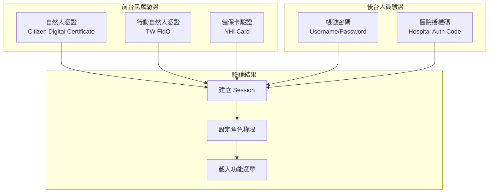

---

## 2. 前台民眾驗證

### 2.1 自然人憑證 (Citizen Digital Certificate)

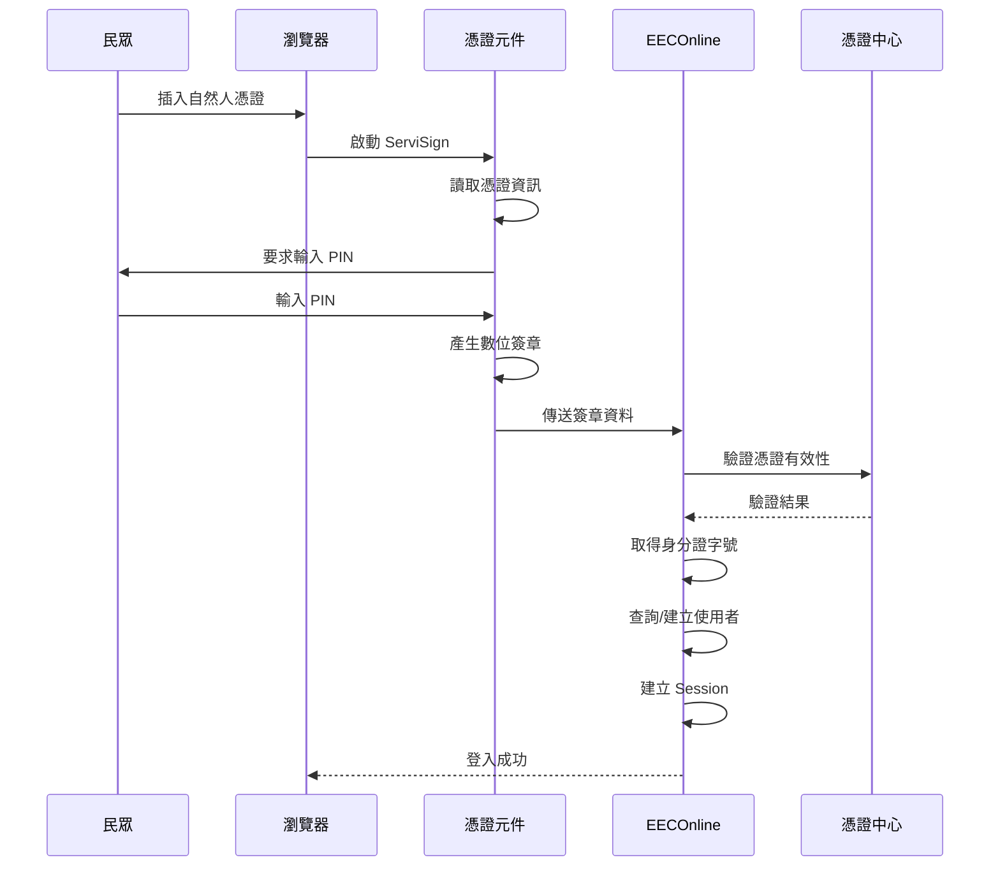

#### 程式碼實作

```csharp
// Controllers/HomeController.cs
[HttpPost]
public ActionResult LoginForm1(string signData, string certData)
{
    try
    {
        // 1. 驗證簽章
        var verifyResult = VerifyCertSignature(signData, certData);
        if (!verifyResult.IsValid)
        {
            return Json(new { success = false, message = "憑證驗證失敗" });
        }
        
        // 2. 取得身分證字號
        string idn = ExtractIDNFromCert(certData);
        
        // 3. 查詢或建立使用者
        var user = _frontDAO.GetOrCreateUser(idn);
        
        // 4. 建立 Session
        CreateUserSession(user, LoginType.Certificate);
        
        return Json(new { success = true, redirectUrl = "/Home/Apply" });
    }
    catch (Exception ex)
    {
        LogUtils.Error("LoginForm1 Error", ex);
        return Json(new { success = false, message = "登入失敗" });
    }
}
```

### 2.2 行動自然人憑證 (TW FidO)

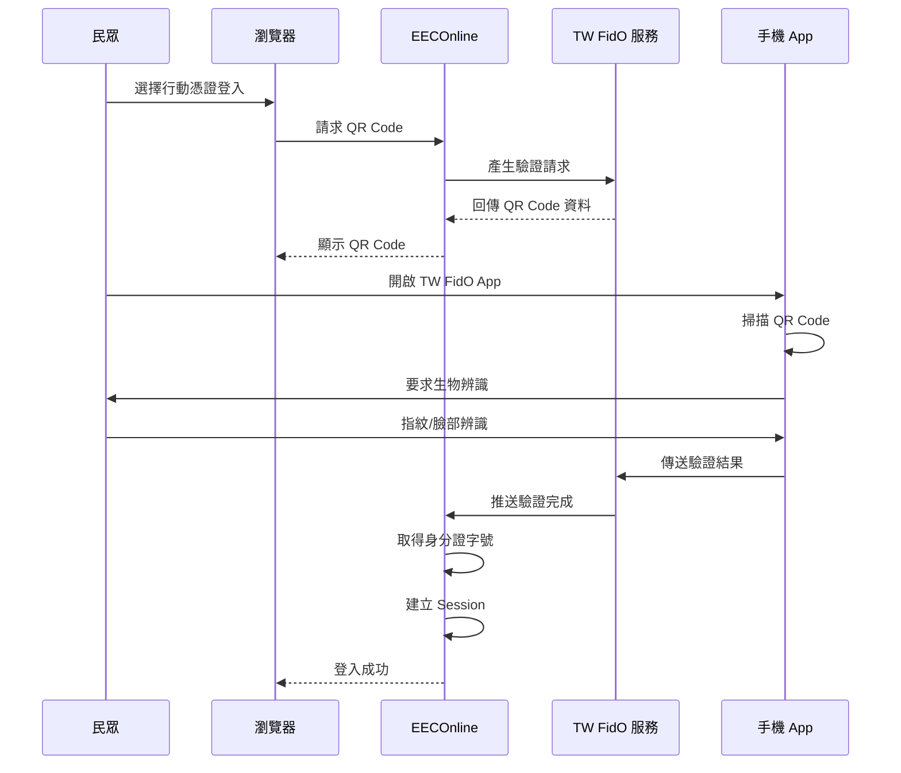

#### TW FidO 整合程式碼

```csharp
// Controllers/HomeController.cs
[HttpPost]
public ActionResult LoginForm2_GetQRCode()
{
    try
    {
        // 產生交易序號
        string transId = Guid.NewGuid().ToString("N");
        
        // 呼叫 TW FidO API 取得 QR Code
        var fidoService = new TWFidOService();
        var qrResult = fidoService.GenerateQRCode(transId);
        
        // 儲存交易序號至 Session
        Session["FidO_TransId"] = transId;
        
        return Json(new { 
            success = true, 
            qrCode = qrResult.QRCodeBase64,
            transId = transId
        });
    }
    catch (Exception ex)
    {
        LogUtils.Error("LoginForm2_GetQRCode Error", ex);
        return Json(new { success = false, message = "取得 QR Code 失敗" });
    }
}

[HttpPost]
public ActionResult LoginForm2_CheckStatus(string transId)
{
    try
    {
        var fidoService = new TWFidOService();
        var result = fidoService.CheckAuthStatus(transId);
        
        if (result.IsAuthenticated)
        {
            // 取得身分證字號
            string idn = result.IDN;
            
            // 查詢或建立使用者
            var user = _frontDAO.GetOrCreateUser(idn);
            
            // 建立 Session
            CreateUserSession(user, LoginType.FidO);
            
            return Json(new { 
                success = true, 
                status = "completed",
                redirectUrl = "/Home/Apply" 
            });
        }
        
        return Json(new { success = true, status = "pending" });
    }
    catch (Exception ex)
    {
        return Json(new { success = false, message = ex.Message });
    }
}
```

### 2.3 健保卡驗證 (HCA)

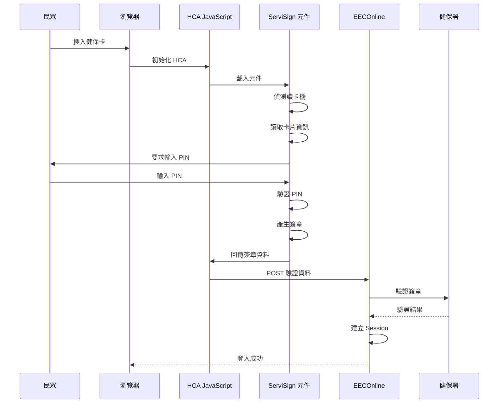

#### HCA JavaScript 模組

```javascript
// HCA/HCALogin.js
var HCALogin = {
    // 初始化
    init: function() {
        // 載入 ServiSign 元件
        HCAEvn.loadServiSign(function(success) {
            if (success) {
                HCALogin.checkCardReader();
            } else {
                alert("請安裝 ServiSign 元件");
            }
        });
    },
    
    // 檢查讀卡機
    checkCardReader: function() {
        HCAServiSign.getReaderList(function(readers) {
            if (readers.length === 0) {
                alert("未偵測到讀卡機");
                return;
            }
            HCALogin.selectReader(readers[0]);
        });
    },
    
    // 讀取卡片
    readCard: function() {
        HCAServiSign.readCard(function(cardInfo) {
            if (cardInfo.success) {
                HCALogin.cardData = cardInfo.data;
                $("#cardId").text(cardInfo.data.cardId);
            } else {
                alert("讀取卡片失敗: " + cardInfo.message);
            }
        });
    },
    
    // 驗證登入
    login: function() {
        // 產生簽章
        HCAServiSign.sign(HCALogin.cardData, function(signResult) {
            if (signResult.success) {
                // 傳送至伺服器驗證
                $.ajax({
                    url: '/Home/LoginForm3',
                    type: 'POST',
                    data: {
                        signData: signResult.signature,
                        certData: signResult.certificate
                    },
                    success: function(response) {
                        if (response.success) {
                            window.location.href = response.redirectUrl;
                        } else {
                            alert(response.message);
                        }
                    }
                });
            }
        });
    }
};
```

---

## 3. 後台人員驗證

### 3.1 帳號密碼登入

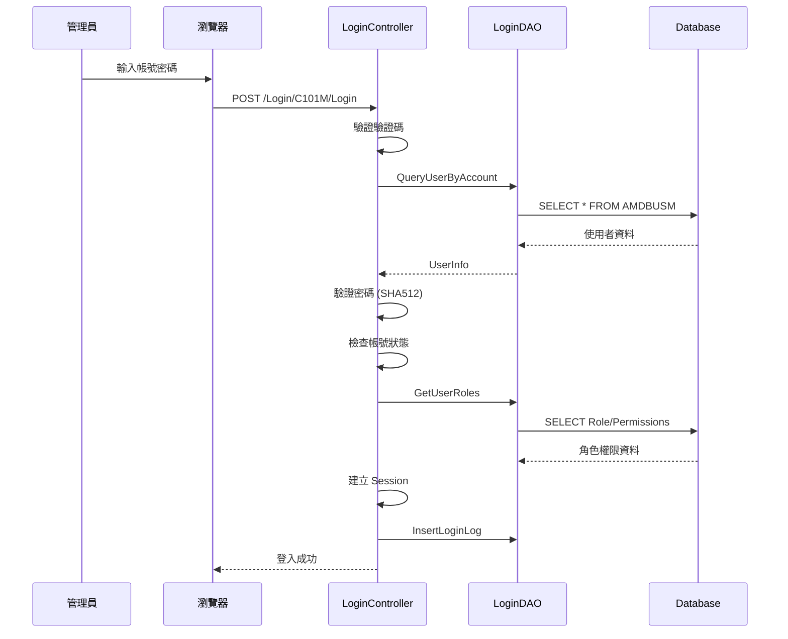

#### 密碼驗證程式碼

```csharp
// Areas/Login/Controllers/C101MController.cs
[HttpPost]
[BypassAuthorize]
public ActionResult Login(LoginModel model)
{
    try
    {
        // 1. 驗證驗證碼
        if (!ValidateCaptcha(model.Captcha))
        {
            return Json(new { success = false, message = "驗證碼錯誤" });
        }
        
        // 2. 查詢使用者
        var user = _loginDAO.QueryUserByAccount(model.Account);
        if (user == null)
        {
            return Json(new { success = false, message = "帳號或密碼錯誤" });
        }
        
        // 3. 檢查帳號狀態
        if (user.STATUS != "1")
        {
            return Json(new { success = false, message = "帳號已停用" });
        }
        
        // 4. 驗證密碼 (SHA512)
        string hashedPassword = CommonsServices.HashSHA512(model.Password);
        if (user.PASSWORD != hashedPassword)
        {
            // 記錄失敗次數
            _loginDAO.IncrementFailCount(user.USER_ID);
            
            // 檢查是否鎖定
            if (user.FAIL_COUNT >= 5)
            {
                _loginDAO.LockAccount(user.USER_ID);
                return Json(new { success = false, message = "帳號已鎖定，請聯繫管理員" });
            }
            
            return Json(new { success = false, message = "帳號或密碼錯誤" });
        }
        
        // 5. 重設失敗次數
        _loginDAO.ResetFailCount(user.USER_ID);
        
        // 6. 取得角色權限
        var roles = _loginDAO.GetUserRoles(user.USER_ID);
        var funcs = _loginDAO.GetUserFunctions(user.USER_ID);
        
        // 7. 建立 Session
        var sessionModel = new SessionModel
        {
            LoginUserInfo = new LoginUserInfo
            {
                UserID = user.USER_ID,
                UserName = user.USER_NAME,
                RoleType = user.ROLE_TYPE,
                LoginTime = DateTime.Now
            },
            RoleFuncs = funcs.Select(f => new ClamRoleFunc
            {
                FuncID = f.FUNC_ID,
                FuncName = f.FUNC_NAME,
                ParentID = f.PARENT_ID,
                CanRead = f.CAN_READ == "1",
                CanWrite = f.CAN_WRITE == "1",
                CanDelete = f.CAN_DELETE == "1"
            }).ToList()
        };
        
        Session["SessionModel"] = sessionModel;
        
        // 8. 記錄登入日誌
        _loginDAO.InsertLoginLog(new LoginLog
        {
            USER_ID = user.USER_ID,
            LOGIN_TIME = DateTime.Now,
            LOGIN_IP = GetClientIP(),
            LOGIN_TYPE = "PWD"
        });
        
        return Json(new { success = true, redirectUrl = "/Login/C102M" });
    }
    catch (Exception ex)
    {
        LogUtils.Error("Login Error", ex);
        return Json(new { success = false, message = "登入失敗" });
    }
}
```

### 3.2 密碼加密機制

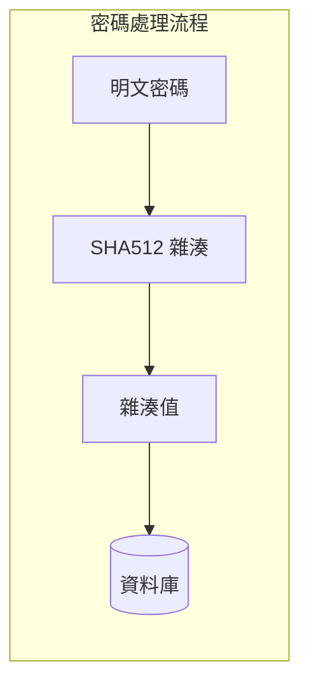

```csharp
// Services/CommonsServices.cs
public static string HashSHA512(string input)
{
    using (SHA512 sha512 = SHA512.Create())
    {
        byte[] inputBytes = Encoding.UTF8.GetBytes(input);
        byte[] hashBytes = sha512.ComputeHash(inputBytes);
        
        StringBuilder sb = new StringBuilder();
        foreach (byte b in hashBytes)
        {
            sb.Append(b.ToString("x2"));
        }
        return sb.ToString();
    }
}
```

---

## 4. Session 管理

### 4.1 SessionModel 結構

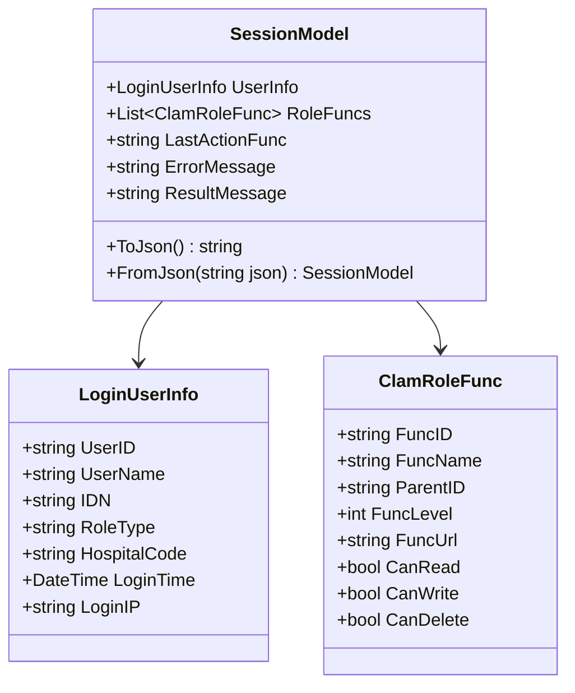

### 4.2 Session 存取

```csharp
// Models/SessionModel.cs
public class SessionModel
{
    public LoginUserInfo LoginUserInfo { get; set; }
    public List<ClamRoleFunc> RoleFuncs { get; set; }
    public string LastActionFunc { get; set; }
    public string ErrorMessage { get; set; }
    public string ResultMessage { get; set; }
    
    // 序列化為 JSON
    public string ToJson()
    {
        return JsonConvert.SerializeObject(this);
    }
    
    // 從 JSON 還原
    public static SessionModel FromJson(string json)
    {
        return JsonConvert.DeserializeObject<SessionModel>(json);
    }
}

// 存取 Session
public static class SessionHelper
{
    private const string SESSION_KEY = "SessionModel";
    
    public static SessionModel GetSession(HttpSessionStateBase session)
    {
        var json = session[SESSION_KEY] as string;
        if (string.IsNullOrEmpty(json))
            return null;
        return SessionModel.FromJson(json);
    }
    
    public static void SetSession(HttpSessionStateBase session, SessionModel model)
    {
        session[SESSION_KEY] = model.ToJson();
    }
    
    public static void ClearSession(HttpSessionStateBase session)
    {
        session.Remove(SESSION_KEY);
        session.Abandon();
    }
}
```

---

## 5. 授權機制

### 5.1 LoginRequired 篩選器

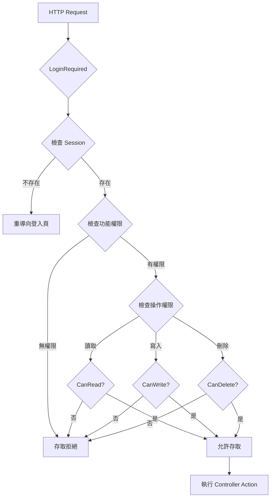

#### LoginRequired 實作

```csharp
// Commons/Filter/LoginRequired.cs
public class LoginRequired : ActionFilterAttribute
{
    public override void OnActionExecuting(ActionExecutingContext filterContext)
    {
        // 檢查是否略過授權
        if (filterContext.ActionDescriptor.IsDefined(typeof(BypassAuthorize), true))
        {
            base.OnActionExecuting(filterContext);
            return;
        }
        
        // 取得 Session
        var session = SessionHelper.GetSession(filterContext.HttpContext.Session);
        
        // 檢查登入狀態
        if (session == null || session.LoginUserInfo == null)
        {
            filterContext.Result = new RedirectResult("/Login/C101M");
            return;
        }
        
        // 取得目前功能 ID
        string areaName = filterContext.RouteData.DataTokens["area"]?.ToString();
        string controllerName = filterContext.RouteData.Values["controller"]?.ToString();
        string actionName = filterContext.RouteData.Values["action"]?.ToString();
        string funcId = $"{areaName}_{controllerName}";
        
        // 檢查功能權限
        var func = session.RoleFuncs.FirstOrDefault(f => f.FuncID == funcId);
        if (func == null)
        {
            filterContext.Result = new RedirectResult("/ErrorPage/AccessDenied");
            return;
        }
        
        // 檢查操作權限
        bool hasPermission = false;
        switch (GetPermissionType(actionName))
        {
            case PermissionType.Read:
                hasPermission = func.CanRead;
                break;
            case PermissionType.Write:
                hasPermission = func.CanWrite;
                break;
            case PermissionType.Delete:
                hasPermission = func.CanDelete;
                break;
        }
        
        if (!hasPermission)
        {
            filterContext.Result = new RedirectResult("/ErrorPage/AccessDenied");
            return;
        }
        
        // 記錄最後操作功能
        session.LastActionFunc = funcId;
        SessionHelper.SetSession(filterContext.HttpContext.Session, session);
        
        base.OnActionExecuting(filterContext);
    }
    
    private PermissionType GetPermissionType(string actionName)
    {
        if (actionName.StartsWith("Delete"))
            return PermissionType.Delete;
        if (actionName.StartsWith("Save") || actionName.StartsWith("New") || 
            actionName.StartsWith("Modify") || actionName.StartsWith("Update"))
            return PermissionType.Write;
        return PermissionType.Read;
    }
}

// 略過授權屬性
public class BypassAuthorize : Attribute { }
```

### 5.2 權限資料表結構

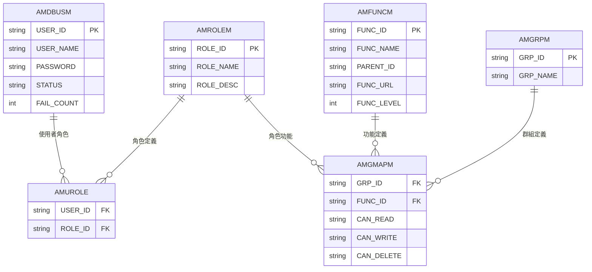

---

## 6. 功能選單載入

### 6.1 選單結構

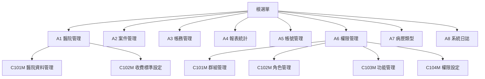

### 6.2 選單載入程式

```csharp
// Services/ClamServices.cs
public class ClamServices
{
    /// <summary>
    /// 取得使用者功能選單
    /// </summary>
    public static List<MenuModel> GetUserMenu(string userId)
    {
        var dao = new LoginDAO();
        var funcs = dao.GetUserFunctions(userId);
        
        // 建立選單樹狀結構
        var menuList = new List<MenuModel>();
        var rootFuncs = funcs.Where(f => string.IsNullOrEmpty(f.PARENT_ID));
        
        foreach (var rootFunc in rootFuncs)
        {
            var menu = new MenuModel
            {
                FuncID = rootFunc.FUNC_ID,
                FuncName = rootFunc.FUNC_NAME,
                FuncUrl = rootFunc.FUNC_URL,
                Icon = rootFunc.ICON,
                Children = GetChildMenu(funcs, rootFunc.FUNC_ID)
            };
            menuList.Add(menu);
        }
        
        return menuList;
    }
    
    private static List<MenuModel> GetChildMenu(IEnumerable<FuncModel> funcs, string parentId)
    {
        var children = funcs.Where(f => f.PARENT_ID == parentId);
        return children.Select(f => new MenuModel
        {
            FuncID = f.FUNC_ID,
            FuncName = f.FUNC_NAME,
            FuncUrl = f.FUNC_URL,
            Icon = f.ICON,
            Children = GetChildMenu(funcs, f.FUNC_ID)
        }).ToList();
    }
}
```

---

## 7. 驗證碼 (CAPTCHA)

### 7.1 驗證碼產生

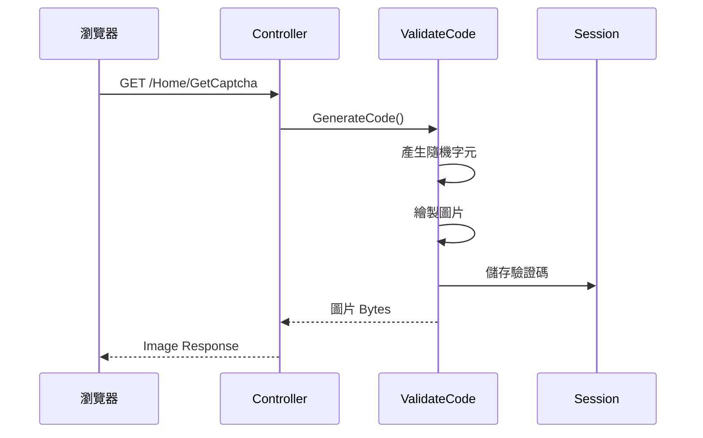

#### ValidateCode 實作

```csharp
// Commons/ValidateCode.cs
public class ValidateCode
{
    public static byte[] GenerateImage(out string code)
    {
        // 產生隨機碼
        code = GenerateRandomCode(4);
        
        // 建立圖片
        using (var bitmap = new Bitmap(100, 40))
        using (var graphics = Graphics.FromImage(bitmap))
        {
            // 背景
            graphics.Clear(Color.White);
            
            // 干擾線
            Random random = new Random();
            for (int i = 0; i < 5; i++)
            {
                int x1 = random.Next(bitmap.Width);
                int y1 = random.Next(bitmap.Height);
                int x2 = random.Next(bitmap.Width);
                int y2 = random.Next(bitmap.Height);
                graphics.DrawLine(Pens.Silver, x1, y1, x2, y2);
            }
            
            // 繪製文字
            using (var font = new Font("Arial", 18, FontStyle.Bold))
            {
                graphics.DrawString(code, font, Brushes.Navy, 10, 5);
            }
            
            // 輸出
            using (var ms = new MemoryStream())
            {
                bitmap.Save(ms, ImageFormat.Png);
                return ms.ToArray();
            }
        }
    }
    
    private static string GenerateRandomCode(int length)
    {
        const string chars = "ABCDEFGHJKLMNPQRSTUVWXYZ23456789";
        var random = new Random();
        return new string(Enumerable.Repeat(chars, length)
            .Select(s => s[random.Next(s.Length)]).ToArray());
    }
}

// Controller
public ActionResult GetCaptcha()
{
    string code;
    var imageBytes = ValidateCode.GenerateImage(out code);
    Session["Captcha"] = code;
    return File(imageBytes, "image/png");
}
```

---

## 8. 安全性考量

### 8.1 密碼政策

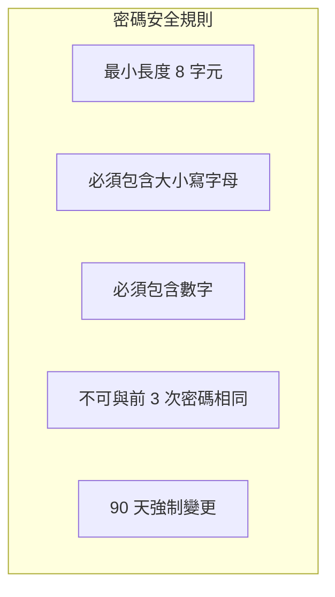

### 8.2 帳號鎖定機制

| 規則 | 說明 |
|------|------|
| 失敗次數上限 | 5 次 |
| 鎖定時間 | 永久鎖定，需管理員解鎖 |
| 重設方式 | 管理員解鎖或密碼重設 |

### 8.3 Session 安全設定

```xml
<!-- Web.config -->
<system.web>
    <sessionState 
        mode="InProc" 
        timeout="60" 
        cookieless="false"
        regenerateExpiredSessionId="true">
    </sessionState>
    
    <httpCookies 
        httpOnlyCookies="true" 
        requireSSL="true" 
        sameSite="Strict">
    </httpCookies>
</system.web>
```

---

## 9. 登出處理

```csharp
// Controllers/HomeController.cs
public ActionResult Logout()
{
    // 記錄登出日誌
    var session = SessionHelper.GetSession(Session);
    if (session?.LoginUserInfo != null)
    {
        _loginDAO.InsertLogoutLog(new LogoutLog
        {
            USER_ID = session.LoginUserInfo.UserID,
            LOGOUT_TIME = DateTime.Now
        });
    }
    
    // 清除 Session
    SessionHelper.ClearSession(Session);
    
    // 清除認證 Cookie
    FormsAuthentication.SignOut();
    
    return RedirectToAction("Index", "Home");
}
```

---

本文件說明 EECOnline 的身份驗證機制，包含前台民眾的多種驗證方式（自然人憑證、行動憑證、健保卡）與後台管理人員的帳號密碼驗證，以及 Session 管理、授權機制等安全設計。
