# EECOnline 後台管理功能

## 1. 概述

EECOnline 後台管理系統提供系統管理員與醫院管理員進行系統維護、案件處理、報表統計等功能。

### 1.1 後台功能架構

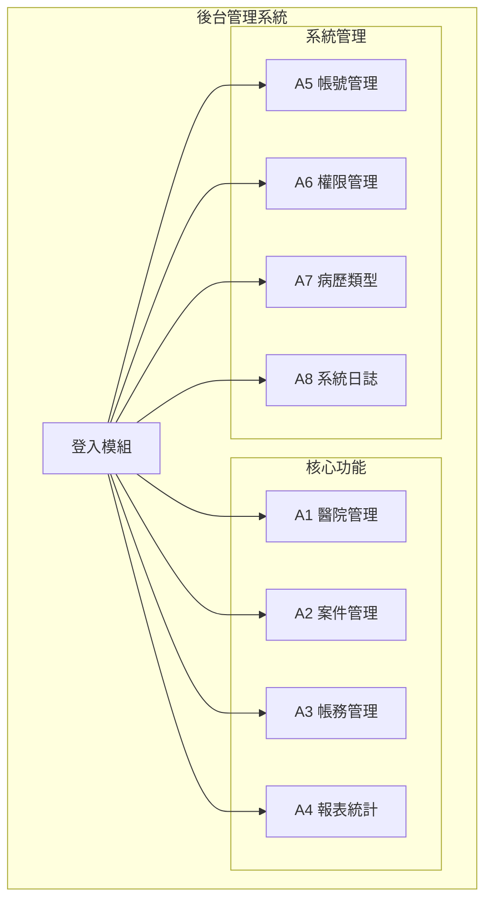

---

## 2. 登入與儀表板

### 2.1 後台登入流程

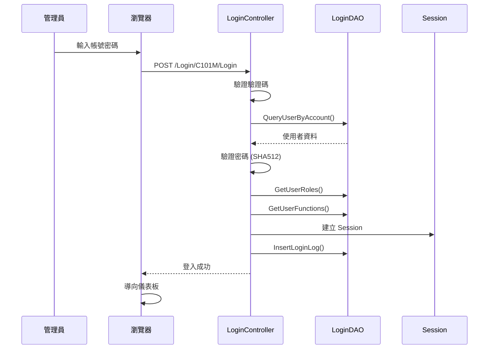

### 2.2 儀表板功能

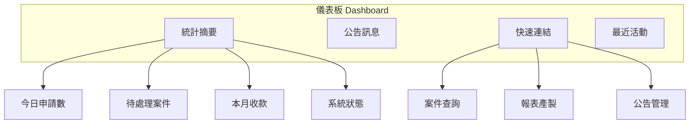

---

## 3. A1 醫院管理

### 3.1 功能架構

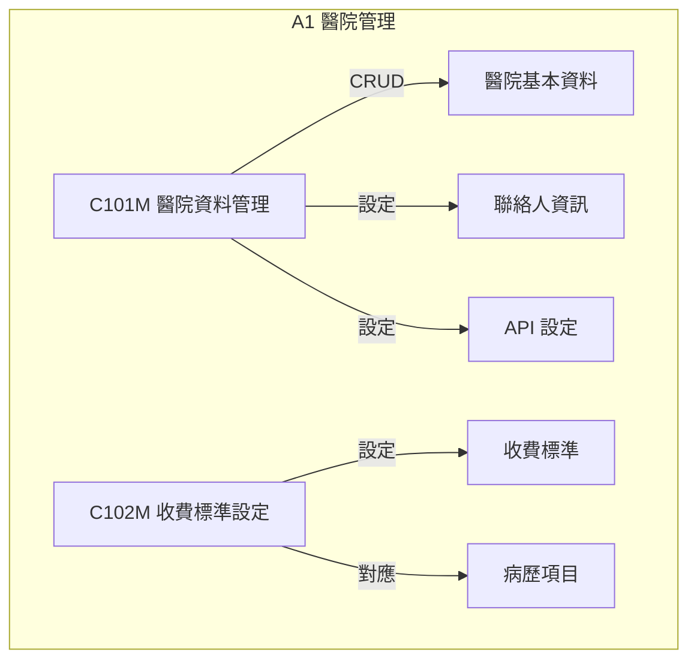

### 3.2 醫院資料管理

```csharp
// Areas/A1/Controllers/C101MController.cs
[LoginRequired]
public class C101MController : BaseController
{
    private A1DAO _dao = new A1DAO();
    
    /// <summary>
    /// 醫院列表
    /// </summary>
    public ActionResult Index()
    {
        return View(new C101MFormModel());
    }
    
    /// <summary>
    /// 查詢醫院
    /// </summary>
    [HttpPost]
    public ActionResult Query(C101MFormModel form)
    {
        _dao.SetPageInfo(form.PageSize, form.PageIndex);
        var list = _dao.QueryHospitalGrid(form);
        
        return Json(new {
            success = true,
            rows = list,
            total = _dao.PageInfo.TotalCount
        });
    }
    
    /// <summary>
    /// 新增醫院
    /// </summary>
    public ActionResult New()
    {
        var model = new HospitalDetailModel();
        ViewBag.IsNew = true;
        return View("Detail", model);
    }
    
    /// <summary>
    /// 修改醫院
    /// </summary>
    public ActionResult Modify(string hospitalCode)
    {
        var model = _dao.GetHospitalDetail(hospitalCode);
        if (model == null)
        {
            return RedirectToAction("Index");
        }
        ViewBag.IsNew = false;
        return View("Detail", model);
    }
    
    /// <summary>
    /// 儲存醫院
    /// </summary>
    [HttpPost]
    public ActionResult Save(HospitalDetailModel model, bool isNew)
    {
        try
        {
            if (isNew)
            {
                // 檢查代碼是否重複
                if (_dao.IsHospitalCodeExists(model.HospitalCode))
                {
                    return Json(new { success = false, message = "醫院代碼已存在" });
                }
                
                model.CreateUser = CurrentUser.UserID;
                model.CreateDate = DateTime.Now;
                _dao.InsertHospital(model);
            }
            else
            {
                model.UpdateUser = CurrentUser.UserID;
                model.UpdateDate = DateTime.Now;
                _dao.UpdateHospital(model);
            }
            
            return Json(new { success = true, message = "儲存成功" });
        }
        catch (Exception ex)
        {
            LogUtils.Error("Save Hospital Error", ex);
            return Json(new { success = false, message = ex.Message });
        }
    }
}
```

### 3.3 收費標準設定

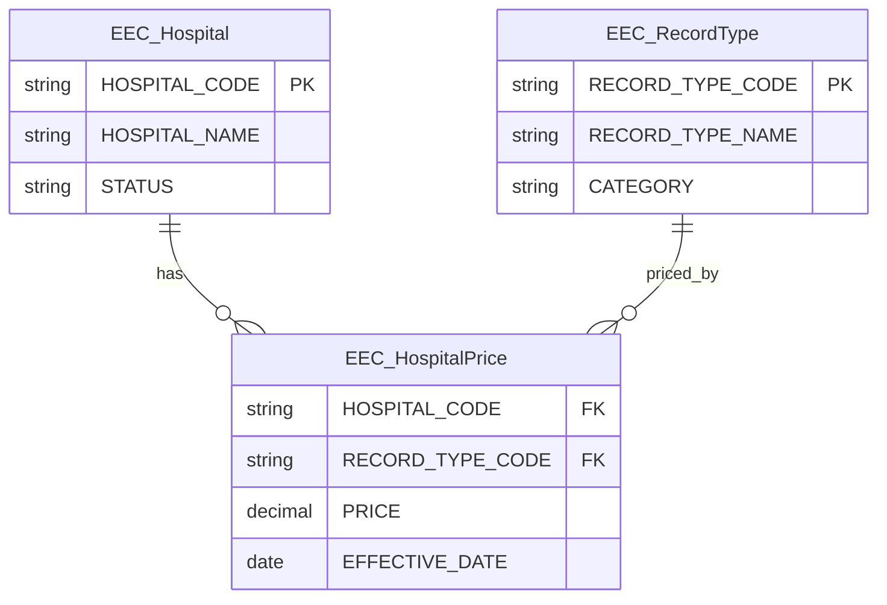

---

## 4. A2 案件管理

### 4.1 案件處理流程

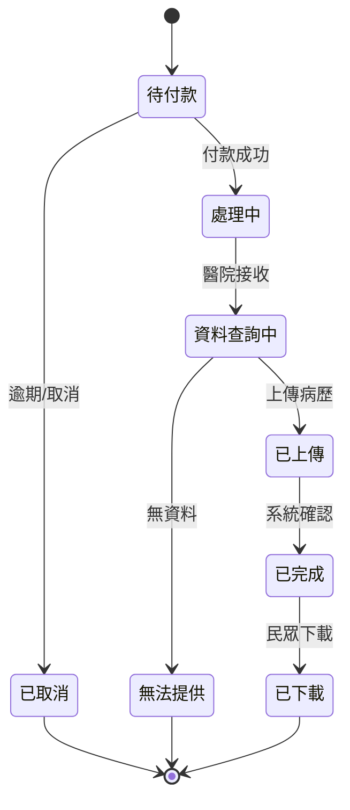

### 4.2 案件查詢與處理

```csharp
// Areas/A2/Controllers/C101MController.cs
[LoginRequired]
public class C101MController : BaseController
{
    private A2DAO _dao = new A2DAO();
    
    /// <summary>
    /// 案件列表
    /// </summary>
    public ActionResult Index()
    {
        var model = new ApplyQueryFormModel();
        
        // 如果是醫院管理員，預設只顯示該醫院案件
        if (CurrentUser.RoleType == "HOSPITAL")
        {
            model.HospitalCode = CurrentUser.HospitalCode;
        }
        
        return View(model);
    }
    
    /// <summary>
    /// 查詢案件
    /// </summary>
    [HttpPost]
    public ActionResult Query(ApplyQueryFormModel form)
    {
        // 醫院管理員只能查詢自己醫院的案件
        if (CurrentUser.RoleType == "HOSPITAL")
        {
            form.HospitalCode = CurrentUser.HospitalCode;
        }
        
        _dao.SetPageInfo(form.PageSize, form.PageIndex);
        var list = _dao.QueryApplyGrid(form);
        
        return Json(new {
            success = true,
            rows = list.Select(a => new {
                ApplyNo = a.APPLY_NO,
                UserName = MaskName(a.USER_NAME),  // 遮罩姓名
                IDN = MaskIDN(a.IDN),              // 遮罩身分證
                HospitalName = a.HOSPITAL_NAME,
                ApplyDate = a.APPLY_DATE?.ToString("yyyy/MM/dd"),
                Status = a.STATUS,
                StatusName = GetStatusName(a.STATUS),
                TotalFee = a.TOTAL_FEE
            }),
            total = _dao.PageInfo.TotalCount
        });
    }
    
    /// <summary>
    /// 案件詳情
    /// </summary>
    public ActionResult Detail(string applyNo)
    {
        var apply = _dao.GetApplyDetail(applyNo);
        
        // 權限檢查
        if (CurrentUser.RoleType == "HOSPITAL" && 
            apply.HOSPITAL_CODE != CurrentUser.HospitalCode)
        {
            return RedirectToAction("Index");
        }
        
        var details = _dao.GetApplyDetailList(applyNo);
        
        var model = new ApplyDetailViewModel
        {
            Apply = apply,
            Details = details
        };
        
        return View(model);
    }
    
    /// <summary>
    /// 上傳病歷檔案
    /// </summary>
    [HttpPost]
    public ActionResult UploadRecord(string applyNo, string detailId, 
                                      HttpPostedFileBase file)
    {
        try
        {
            if (file == null || file.ContentLength == 0)
            {
                return Json(new { success = false, message = "請選擇檔案" });
            }
            
            // 驗證檔案類型
            var allowedTypes = new[] { ".pdf", ".xml" };
            var extension = Path.GetExtension(file.FileName).ToLower();
            if (!allowedTypes.Contains(extension))
            {
                return Json(new { success = false, message = "只允許上傳 PDF 或 XML 檔案" });
            }
            
            // 儲存檔案
            var fileName = $"{applyNo}_{detailId}_{DateTime.Now:yyyyMMddHHmmss}{extension}";
            var uploadPath = Path.Combine(
                ConfigHelper.GetValue("UploadPath"),
                DateTime.Now.ToString("yyyyMM"),
                fileName
            );
            
            // 確保目錄存在
            Directory.CreateDirectory(Path.GetDirectoryName(uploadPath));
            
            // 儲存檔案
            file.SaveAs(uploadPath);
            
            // 更新資料庫
            _dao.UpdateApplyDetailFile(detailId, uploadPath, CurrentUser.UserID);
            
            // 檢查是否所有項目都已上傳
            var apply = _dao.GetApplyDetail(applyNo);
            var details = _dao.GetApplyDetailList(applyNo);
            
            if (details.All(d => !string.IsNullOrEmpty(d.FILE_PATH)))
            {
                // 更新申請狀態為已完成
                _dao.UpdateApplyStatus(applyNo, "04");
                
                // 發送通知給民眾
                NotificationService.SendRecordReadyNotification(applyNo);
            }
            
            return Json(new { success = true, message = "上傳成功" });
        }
        catch (Exception ex)
        {
            LogUtils.Error("UploadRecord Error", ex);
            return Json(new { success = false, message = ex.Message });
        }
    }
}
```

---

## 5. A3 帳務管理

### 5.1 帳務功能架構

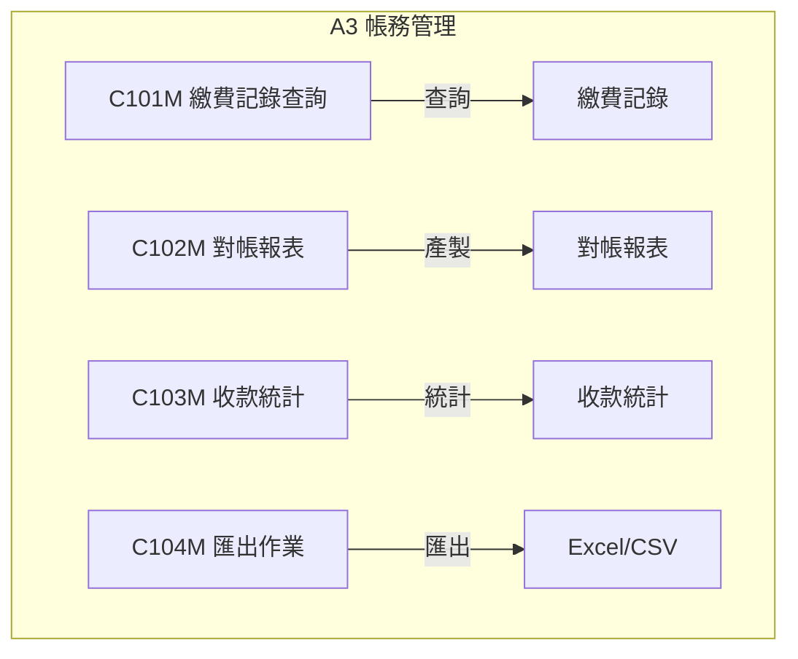

### 5.2 繳費記錄查詢

```csharp
// Areas/A3/Controllers/C101MController.cs
[LoginRequired]
public class C101MController : BaseController
{
    private A3DAO _dao = new A3DAO();
    
    public ActionResult Index()
    {
        return View(new PaymentQueryFormModel());
    }
    
    [HttpPost]
    public ActionResult Query(PaymentQueryFormModel form)
    {
        _dao.SetPageInfo(form.PageSize, form.PageIndex);
        var list = _dao.QueryPaymentGrid(form);
        
        return Json(new {
            success = true,
            rows = list,
            total = _dao.PageInfo.TotalCount,
            summary = new {
                TotalAmount = list.Sum(p => p.AMOUNT),
                TotalCount = _dao.PageInfo.TotalCount
            }
        });
    }
    
    /// <summary>
    /// 匯出 Excel
    /// </summary>
    public ActionResult Export(PaymentQueryFormModel form)
    {
        var list = _dao.QueryPaymentForExport(form);
        
        // 使用 NPOI 產生 Excel
        var workbook = new XSSFWorkbook();
        var sheet = workbook.CreateSheet("繳費記錄");
        
        // 標題列
        var headerRow = sheet.CreateRow(0);
        headerRow.CreateCell(0).SetCellValue("申請編號");
        headerRow.CreateCell(1).SetCellValue("申請人");
        headerRow.CreateCell(2).SetCellValue("醫院");
        headerRow.CreateCell(3).SetCellValue("金額");
        headerRow.CreateCell(4).SetCellValue("付款日期");
        headerRow.CreateCell(5).SetCellValue("付款方式");
        
        // 資料列
        for (int i = 0; i < list.Count; i++)
        {
            var row = sheet.CreateRow(i + 1);
            row.CreateCell(0).SetCellValue(list[i].APPLY_NO);
            row.CreateCell(1).SetCellValue(list[i].USER_NAME);
            row.CreateCell(2).SetCellValue(list[i].HOSPITAL_NAME);
            row.CreateCell(3).SetCellValue((double)list[i].AMOUNT);
            row.CreateCell(4).SetCellValue(list[i].PAY_DATE?.ToString("yyyy/MM/dd"));
            row.CreateCell(5).SetCellValue(list[i].PAY_TYPE_NAME);
        }
        
        using (var ms = new MemoryStream())
        {
            workbook.Write(ms);
            var fileName = $"繳費記錄_{DateTime.Now:yyyyMMdd}.xlsx";
            return File(ms.ToArray(), 
                "application/vnd.openxmlformats-officedocument.spreadsheetml.sheet",
                fileName);
        }
    }
}
```

---

## 6. A4 報表統計

### 6.1 報表類型

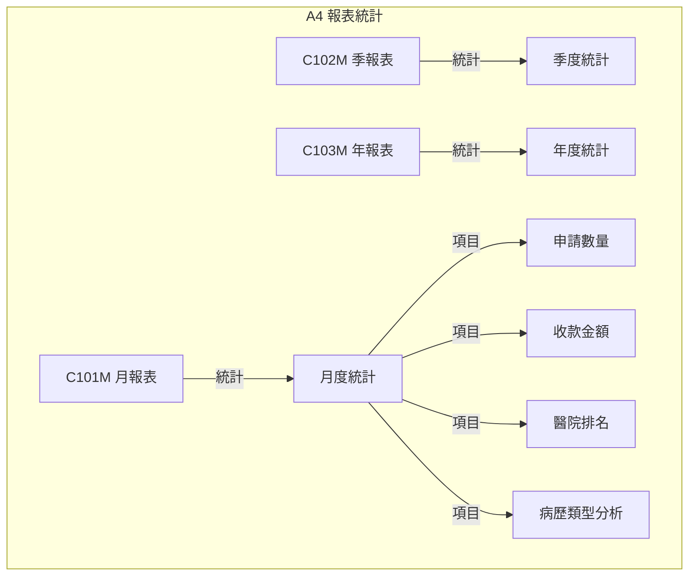

### 6.2 報表產製

```csharp
// Areas/A4/Controllers/C101MController.cs
[LoginRequired]
public class C101MController : BaseController
{
    private A4DAO _dao = new A4DAO();
    
    public ActionResult Index()
    {
        return View();
    }
    
    [HttpPost]
    public ActionResult GenerateReport(ReportFormModel form)
    {
        try
        {
            var reportData = new MonthlyReportModel();
            
            // 申請統計
            reportData.ApplyStats = _dao.GetMonthlyApplyStats(form.Year, form.Month);
            
            // 收款統計
            reportData.PaymentStats = _dao.GetMonthlyPaymentStats(form.Year, form.Month);
            
            // 醫院排名
            reportData.HospitalRanking = _dao.GetMonthlyHospitalRanking(form.Year, form.Month);
            
            // 病歷類型分析
            reportData.RecordTypeStats = _dao.GetMonthlyRecordTypeStats(form.Year, form.Month);
            
            return PartialView("_ReportResult", reportData);
        }
        catch (Exception ex)
        {
            LogUtils.Error("GenerateReport Error", ex);
            return Json(new { success = false, message = ex.Message });
        }
    }
    
    /// <summary>
    /// 匯出 PDF 報表
    /// </summary>
    public ActionResult ExportPdf(ReportFormModel form)
    {
        var reportData = GetReportData(form);
        
        // 使用 iTextSharp 產生 PDF
        using (var ms = new MemoryStream())
        {
            var document = new Document(PageSize.A4, 50, 50, 50, 50);
            var writer = PdfWriter.GetInstance(document, ms);
            
            document.Open();
            
            // 載入中文字型
            var baseFont = BaseFont.CreateFont(
                @"C:\Windows\Fonts\kaiu.ttf",
                BaseFont.IDENTITY_H,
                BaseFont.EMBEDDED
            );
            var titleFont = new Font(baseFont, 18, Font.BOLD);
            var headerFont = new Font(baseFont, 12, Font.BOLD);
            var bodyFont = new Font(baseFont, 10);
            
            // 標題
            document.Add(new Paragraph(
                $"電子病歷服務平台 {form.Year}年{form.Month}月 月報表",
                titleFont
            ));
            document.Add(new Paragraph(" "));
            
            // 統計表格
            var table = new PdfPTable(4);
            table.WidthPercentage = 100;
            
            // 表頭
            table.AddCell(new PdfPCell(new Phrase("項目", headerFont)));
            table.AddCell(new PdfPCell(new Phrase("數量", headerFont)));
            table.AddCell(new PdfPCell(new Phrase("金額", headerFont)));
            table.AddCell(new PdfPCell(new Phrase("備註", headerFont)));
            
            // 資料
            // ... 填入統計資料
            
            document.Add(table);
            document.Close();
            
            var fileName = $"月報表_{form.Year}{form.Month:D2}.pdf";
            return File(ms.ToArray(), "application/pdf", fileName);
        }
    }
}
```

---

## 7. A5 帳號管理

### 7.1 帳號管理架構

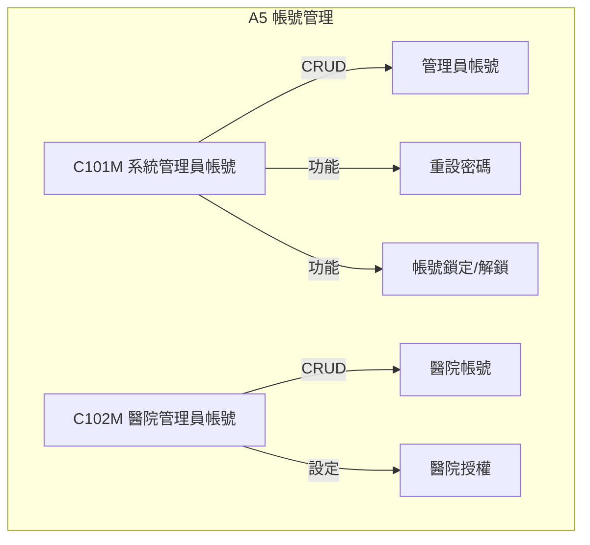

### 7.2 帳號管理實作

```csharp
// Areas/A5/Controllers/C101MController.cs
[LoginRequired]
public class C101MController : BaseController
{
    private A5DAO _dao = new A5DAO();
    
    [HttpPost]
    public ActionResult Save(UserDetailModel model, bool isNew)
    {
        try
        {
            _dao.BeginTransaction();
            
            if (isNew)
            {
                // 檢查帳號是否重複
                if (_dao.IsAccountExists(model.Account))
                {
                    return Json(new { success = false, message = "帳號已存在" });
                }
                
                // 產生預設密碼
                var defaultPassword = GenerateDefaultPassword();
                model.Password = CommonsServices.HashSHA512(defaultPassword);
                model.PasswordChangeRequired = true;
                model.CreateUser = CurrentUser.UserID;
                
                _dao.InsertUser(model);
                
                // 設定角色
                foreach (var roleId in model.RoleIds)
                {
                    _dao.InsertUserRole(model.UserId, roleId);
                }
                
                // 發送密碼通知信
                if (!string.IsNullOrEmpty(model.Email))
                {
                    SendPasswordEmail(model.Email, model.Account, defaultPassword);
                }
            }
            else
            {
                model.UpdateUser = CurrentUser.UserID;
                _dao.UpdateUser(model);
                
                // 更新角色
                _dao.DeleteUserRoles(model.UserId);
                foreach (var roleId in model.RoleIds)
                {
                    _dao.InsertUserRole(model.UserId, roleId);
                }
            }
            
            _dao.CommitTransaction();
            return Json(new { success = true, message = "儲存成功" });
        }
        catch (Exception ex)
        {
            _dao.RollBackTransaction();
            LogUtils.Error("Save User Error", ex);
            return Json(new { success = false, message = ex.Message });
        }
    }
    
    /// <summary>
    /// 重設密碼
    /// </summary>
    [HttpPost]
    public ActionResult ResetPassword(string userId)
    {
        try
        {
            var user = _dao.GetUserById(userId);
            if (user == null)
            {
                return Json(new { success = false, message = "使用者不存在" });
            }
            
            // 產生新密碼
            var newPassword = GenerateDefaultPassword();
            var hashedPassword = CommonsServices.HashSHA512(newPassword);
            
            // 更新密碼
            _dao.UpdatePassword(userId, hashedPassword, true);
            
            // 發送通知信
            if (!string.IsNullOrEmpty(user.EMAIL))
            {
                SendPasswordEmail(user.EMAIL, user.ACCOUNT, newPassword);
            }
            
            return Json(new { success = true, message = "密碼已重設" });
        }
        catch (Exception ex)
        {
            return Json(new { success = false, message = ex.Message });
        }
    }
    
    /// <summary>
    /// 解鎖帳號
    /// </summary>
    [HttpPost]
    public ActionResult UnlockAccount(string userId)
    {
        try
        {
            _dao.UnlockAccount(userId);
            return Json(new { success = true, message = "帳號已解鎖" });
        }
        catch (Exception ex)
        {
            return Json(new { success = false, message = ex.Message });
        }
    }
}
```

---

## 8. A6 權限管理

### 8.1 權限架構

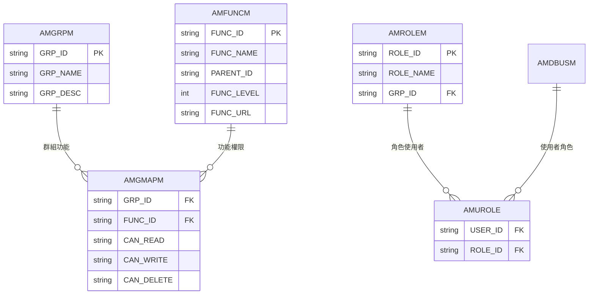

### 8.2 權限設定

```csharp
// Areas/A6/Controllers/C104MController.cs
[LoginRequired]
public class C104MController : BaseController
{
    private A6DAO _dao = new A6DAO();
    
    /// <summary>
    /// 權限設定頁面
    /// </summary>
    public ActionResult Index()
    {
        // 取得群組清單
        ViewBag.Groups = _dao.GetGroupList();
        
        // 取得功能清單（樹狀結構）
        ViewBag.Functions = _dao.GetFunctionTree();
        
        return View();
    }
    
    /// <summary>
    /// 取得群組權限
    /// </summary>
    [HttpPost]
    public ActionResult GetGroupPermissions(string grpId)
    {
        var permissions = _dao.GetGroupPermissions(grpId);
        return Json(new { success = true, data = permissions });
    }
    
    /// <summary>
    /// 儲存群組權限
    /// </summary>
    [HttpPost]
    public ActionResult SavePermissions(string grpId, List<PermissionModel> permissions)
    {
        try
        {
            _dao.BeginTransaction();
            
            // 刪除原有權限
            _dao.DeleteGroupPermissions(grpId);
            
            // 新增新權限
            foreach (var perm in permissions)
            {
                if (perm.CanRead || perm.CanWrite || perm.CanDelete)
                {
                    _dao.InsertGroupPermission(new AMGMAPM
                    {
                        GRP_ID = grpId,
                        FUNC_ID = perm.FuncId,
                        CAN_READ = perm.CanRead ? "1" : "0",
                        CAN_WRITE = perm.CanWrite ? "1" : "0",
                        CAN_DELETE = perm.CanDelete ? "1" : "0"
                    });
                }
            }
            
            _dao.CommitTransaction();
            return Json(new { success = true, message = "儲存成功" });
        }
        catch (Exception ex)
        {
            _dao.RollBackTransaction();
            return Json(new { success = false, message = ex.Message });
        }
    }
}
```

---

## 9. A8 系統日誌

### 9.1 日誌類型

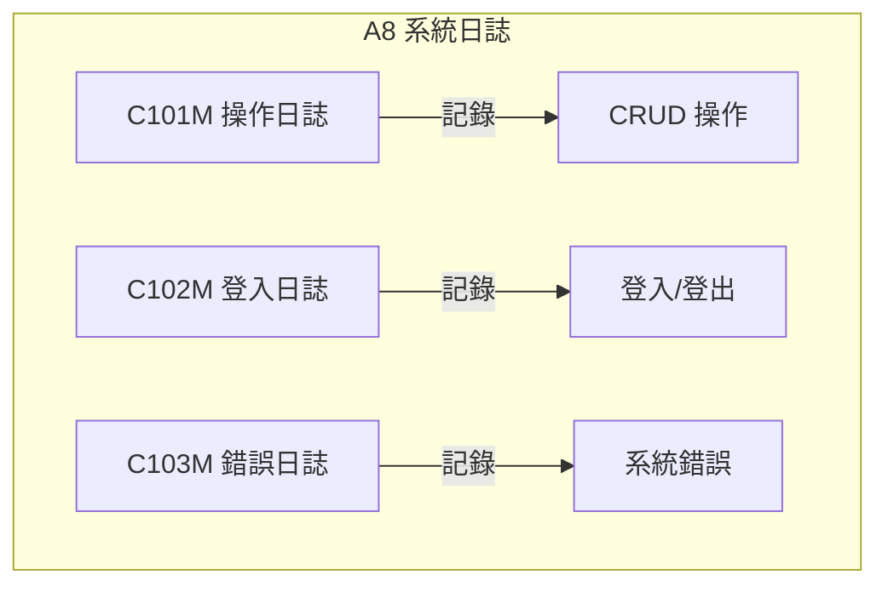

### 9.2 操作日誌查詢

```csharp
// Areas/A8/Controllers/C101MController.cs
[LoginRequired]
public class C101MController : BaseController
{
    private A8DAO _dao = new A8DAO();
    
    public ActionResult Index()
    {
        return View(new OperationLogQueryModel());
    }
    
    [HttpPost]
    public ActionResult Query(OperationLogQueryModel form)
    {
        _dao.SetPageInfo(form.PageSize, form.PageIndex);
        var list = _dao.QueryOperationLog(form);
        
        return Json(new {
            success = true,
            rows = list.Select(l => new {
                LogId = l.LOG_ID,
                UserName = l.USER_NAME,
                FuncName = l.FUNC_NAME,
                Action = l.ACTION,
                Description = l.DESCRIPTION,
                IP = l.IP_ADDRESS,
                LogTime = l.LOG_TIME?.ToString("yyyy/MM/dd HH:mm:ss")
            }),
            total = _dao.PageInfo.TotalCount
        });
    }
    
    /// <summary>
    /// 日誌詳情
    /// </summary>
    public ActionResult Detail(string logId)
    {
        var log = _dao.GetOperationLogDetail(logId);
        return PartialView("_LogDetail", log);
    }
}
```

---

## 10. 後台 Layout 結構

### 10.1 主要 Layout

```html
<!-- Views/Shared/_MainLayout.cshtml -->
<!DOCTYPE html>
<html>
<head>
    <meta charset="utf-8" />
    <title>@ViewBag.Title - 電子病歷服務平台管理系統</title>
    <link href="~/Content/bootstrap.min.css" rel="stylesheet" />
    <link href="~/Content/AdminLTE.min.css" rel="stylesheet" />
    <link href="~/css/css.all.css" rel="stylesheet" />
</head>
<body class="hold-transition skin-blue sidebar-mini">
    <div class="wrapper">
        <!-- 頁首 -->
        @Html.Partial("_MainHeader")
        
        <!-- 側邊選單 -->
        @Html.Partial("_LeftMenu")
        
        <!-- 主要內容區 -->
        <div class="content-wrapper">
            <section class="content-header">
                <h1>@ViewBag.Title</h1>
            </section>
            <section class="content">
                @RenderBody()
            </section>
        </div>
        
        <!-- 頁尾 -->
        @Html.Partial("_Footer")
    </div>
    
    <script src="~/Scripts/jquery-2.1.3.min.js"></script>
    <script src="~/Scripts/bootstrap.min.js"></script>
    <script src="~/Scripts/adminlte.min.js"></script>
    @RenderSection("scripts", required: false)
</body>
</html>
```

### 10.2 側邊選單

```html
<!-- Views/Shared/_LeftMenu.cshtml -->
@{
    var menu = ViewBag.UserMenu as List<MenuModel>;
}
<aside class="main-sidebar">
    <section class="sidebar">
        <ul class="sidebar-menu" data-widget="tree">
            <li class="header">功能選單</li>
            @foreach (var item in menu)
            {
                if (item.Children != null && item.Children.Any())
                {
                    <li class="treeview">
                        <a href="#">
                            <i class="fa @item.Icon"></i>
                            <span>@item.FuncName</span>
                            <span class="pull-right-container">
                                <i class="fa fa-angle-left pull-right"></i>
                            </span>
                        </a>
                        <ul class="treeview-menu">
                            @foreach (var child in item.Children)
                            {
                                <li>
                                    <a href="@child.FuncUrl">
                                        <i class="fa fa-circle-o"></i>
                                        @child.FuncName
                                    </a>
                                </li>
                            }
                        </ul>
                    </li>
                }
                else
                {
                    <li>
                        <a href="@item.FuncUrl">
                            <i class="fa @item.Icon"></i>
                            <span>@item.FuncName</span>
                        </a>
                    </li>
                }
            }
        </ul>
    </section>
</aside>
```

---

本文件說明 EECOnline 後台管理系統的各項功能，包含醫院管理、案件管理、帳務管理、報表統計、帳號管理、權限管理及系統日誌等模組的功能架構與實作方式。
