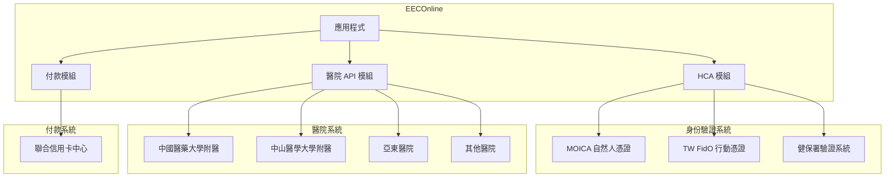
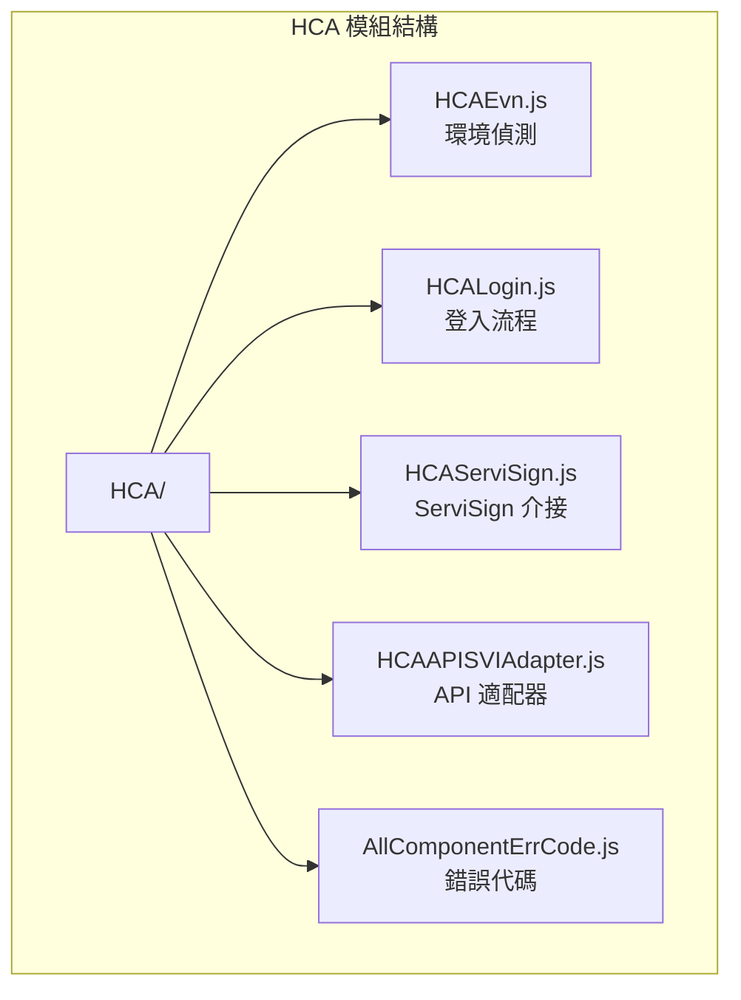
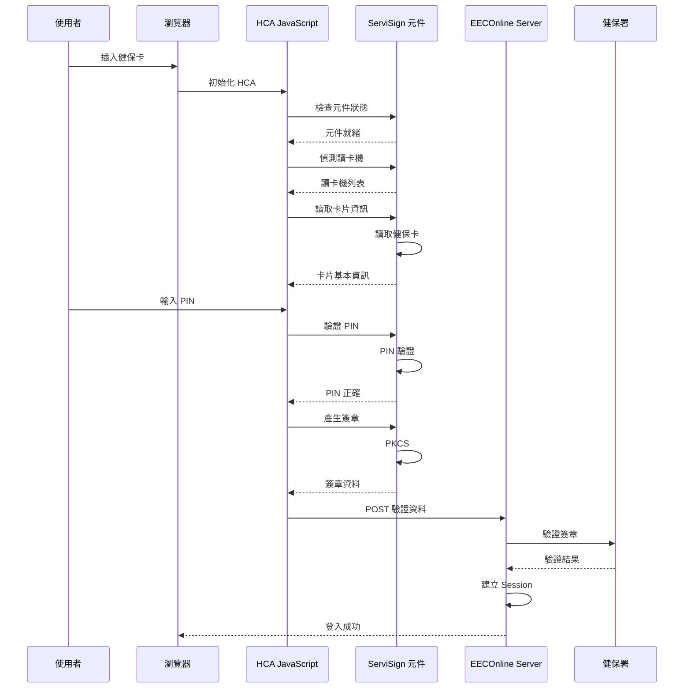
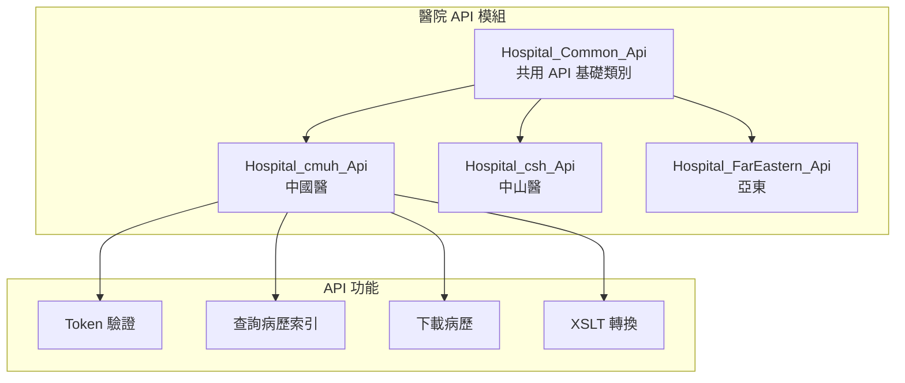
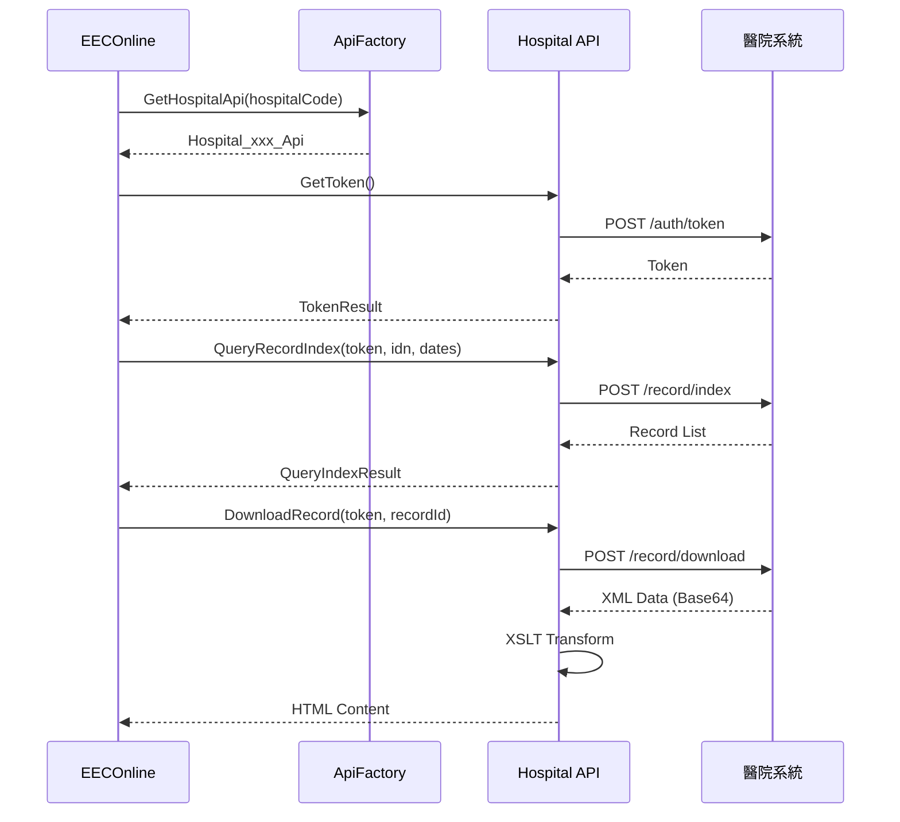
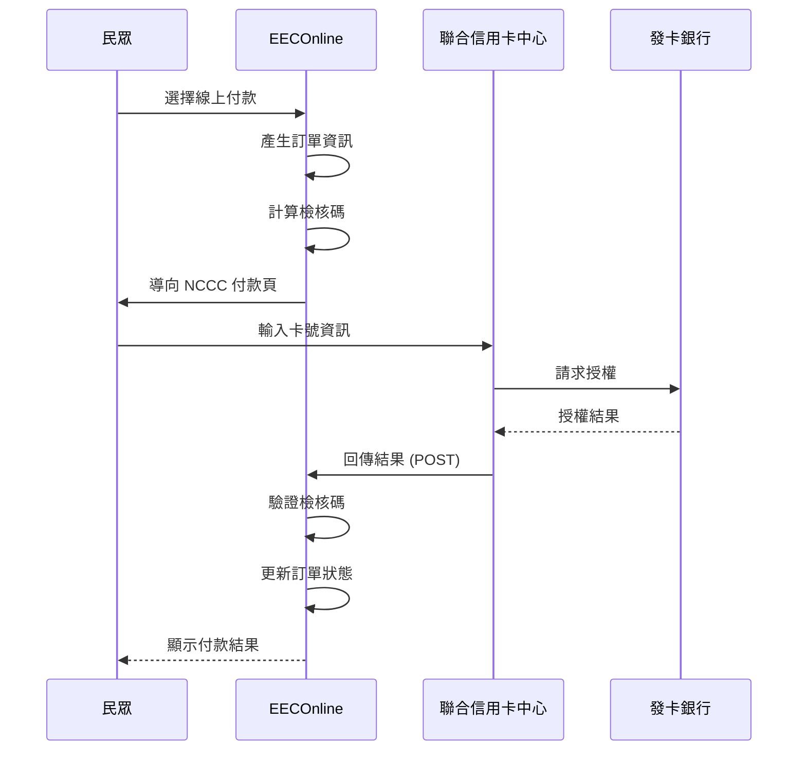

# EECOnline 外部系統整合

## 1. 概述

EECOnline 系統需要與多個外部系統進行整合，包括身份驗證系統、醫院資訊系統及付款系統等。

### 1.1 外部系統整合架構



---

## 2. 健保卡驗證 (HCA)

### 2.1 HCA 元件架構



### 2.2 HCA 驗證流程



### 2.3 HCA JavaScript 實作

```javascript
// HCA/HCAEvn.js
var HCAEvn = {
    // 檢查 ServiSign 是否已安裝
    isServiSignInstalled: function() {
        return typeof window.ServiSign !== 'undefined';
    },
    
    // 載入 ServiSign
    loadServiSign: function(callback) {
        if (this.isServiSignInstalled()) {
            callback(true);
            return;
        }
        
        // 動態載入 ServiSign
        var script = document.createElement('script');
        script.src = '/HCA/ServiSign.js';
        script.onload = function() {
            callback(true);
        };
        script.onerror = function() {
            callback(false);
        };
        document.head.appendChild(script);
    },
    
    // 取得瀏覽器類型
    getBrowserType: function() {
        var ua = navigator.userAgent;
        if (ua.indexOf('Chrome') > -1) return 'Chrome';
        if (ua.indexOf('Firefox') > -1) return 'Firefox';
        if (ua.indexOf('Edge') > -1) return 'Edge';
        if (ua.indexOf('MSIE') > -1 || ua.indexOf('Trident') > -1) return 'IE';
        return 'Unknown';
    }
};

// HCA/HCALogin.js
var HCALogin = {
    cardInfo: null,
    
    // 初始化
    init: function(options) {
        this.options = options || {};
        
        HCAEvn.loadServiSign(function(success) {
            if (success) {
                HCALogin.checkReader();
            } else {
                HCALogin.showError('請安裝 ServiSign 元件');
            }
        });
    },
    
    // 檢查讀卡機
    checkReader: function() {
        HCAServiSign.getReaderList(function(result) {
            if (result.success && result.readers.length > 0) {
                $('#readerSelect').html(
                    result.readers.map(function(r) {
                        return '<option value="' + r.name + '">' + r.name + '</option>';
                    }).join('')
                );
                HCALogin.readCard();
            } else {
                HCALogin.showError('未偵測到讀卡機');
            }
        });
    },
    
    // 讀取卡片
    readCard: function() {
        var readerName = $('#readerSelect').val();
        
        HCAServiSign.readCard(readerName, function(result) {
            if (result.success) {
                HCALogin.cardInfo = result.cardInfo;
                $('#cardNumber').text(result.cardInfo.cardNumber);
                $('#cardHolder').text('已讀取卡片');
                $('#pinSection').show();
            } else {
                HCALogin.showError('讀取卡片失敗: ' + result.message);
            }
        });
    },
    
    // 登入
    login: function() {
        var pin = $('#pinInput').val();
        if (!pin || pin.length < 4) {
            HCALogin.showError('請輸入正確的 PIN 碼');
            return;
        }
        
        // 驗證 PIN 並產生簽章
        HCAServiSign.signWithPin(HCALogin.cardInfo, pin, function(result) {
            if (result.success) {
                // 傳送至伺服器驗證
                $.ajax({
                    url: '/Home/LoginForm3',
                    type: 'POST',
                    data: {
                        signature: result.signature,
                        certificate: result.certificate,
                        cardNumber: HCALogin.cardInfo.cardNumber
                    },
                    success: function(response) {
                        if (response.success) {
                            window.location.href = response.redirectUrl;
                        } else {
                            HCALogin.showError(response.message);
                        }
                    },
                    error: function() {
                        HCALogin.showError('伺服器連線失敗');
                    }
                });
            } else {
                HCALogin.showError('簽章失敗: ' + result.message);
            }
        });
    },
    
    showError: function(message) {
        $('#errorMessage').text(message).show();
    }
};

// HCA/HCAServiSign.js
var HCAServiSign = {
    // 取得讀卡機列表
    getReaderList: function(callback) {
        try {
            ServiSign.execute({
                command: 'GetReaderList',
                success: function(data) {
                    callback({
                        success: true,
                        readers: data.readers
                    });
                },
                error: function(err) {
                    callback({
                        success: false,
                        message: err.message
                    });
                }
            });
        } catch (e) {
            callback({
                success: false,
                message: e.message
            });
        }
    },
    
    // 讀取卡片
    readCard: function(readerName, callback) {
        try {
            ServiSign.execute({
                command: 'ReadCard',
                reader: readerName,
                cardType: 'NHI',  // 健保卡
                success: function(data) {
                    callback({
                        success: true,
                        cardInfo: {
                            cardNumber: data.cardNumber,
                            cardType: data.cardType
                        }
                    });
                },
                error: function(err) {
                    callback({
                        success: false,
                        message: err.message
                    });
                }
            });
        } catch (e) {
            callback({
                success: false,
                message: e.message
            });
        }
    },
    
    // 使用 PIN 簽章
    signWithPin: function(cardInfo, pin, callback) {
        try {
            // 產生待簽章資料
            var dataToSign = new Date().getTime().toString();
            
            ServiSign.execute({
                command: 'SignData',
                cardNumber: cardInfo.cardNumber,
                pin: pin,
                data: dataToSign,
                hashAlgorithm: 'SHA256',
                success: function(data) {
                    callback({
                        success: true,
                        signature: data.signature,
                        certificate: data.certificate
                    });
                },
                error: function(err) {
                    callback({
                        success: false,
                        message: err.message
                    });
                }
            });
        } catch (e) {
            callback({
                success: false,
                message: e.message
            });
        }
    }
};
```

### 2.4 伺服器端驗證

```csharp
// Controllers/HomeController.cs
[HttpPost]
public ActionResult LoginForm3(HCALoginModel model)
{
    try
    {
        // 1. 驗證簽章
        var verifyResult = NHICardVerifier.VerifySignature(
            model.Signature,
            model.Certificate
        );
        
        if (!verifyResult.IsValid)
        {
            return Json(new { 
                success = false, 
                message = "健保卡驗證失敗: " + verifyResult.ErrorMessage 
            });
        }
        
        // 2. 從憑證取得身分證字號
        string idn = NHICardVerifier.ExtractIDN(model.Certificate);
        
        // 3. 查詢或建立使用者
        var user = _frontDAO.GetOrCreateUserByIDN(idn);
        
        // 4. 建立 Session
        CreateUserSession(user, LoginType.NHICard);
        
        // 5. 記錄登入日誌
        _frontDAO.InsertLoginLog(new LoginLog
        {
            USER_ID = user.USER_ID,
            IDN = idn,
            LOGIN_TIME = DateTime.Now,
            LOGIN_IP = GetClientIP(),
            LOGIN_TYPE = "HCA"
        });
        
        return Json(new { 
            success = true, 
            redirectUrl = Url.Action("Apply", "Home") 
        });
    }
    catch (Exception ex)
    {
        LogUtils.Error("LoginForm3 Error", ex);
        return Json(new { success = false, message = "登入失敗" });
    }
}
```

---

## 3. 醫院 API 整合

### 3.1 醫院 API 架構



### 3.2 共用 API 基礎類別

```csharp
// Utils/Hospital_Common_Api.cs
public class Hospital_Common_Api
{
    protected string _baseUrl;
    protected string _apiKey;
    protected string _apiSecret;
    
    public Hospital_Common_Api(string hospitalCode)
    {
        var config = GetHospitalConfig(hospitalCode);
        _baseUrl = config.ApiUrl;
        _apiKey = config.ApiKey;
        _apiSecret = config.ApiSecret;
    }
    
    /// <summary>
    /// 取得 Token
    /// </summary>
    public virtual TokenResult GetToken()
    {
        try
        {
            var client = new RestClient(_baseUrl);
            var request = new RestRequest("/api/auth/token", Method.POST);
            
            request.AddHeader("Content-Type", "application/json");
            request.AddJsonBody(new {
                apiKey = _apiKey,
                apiSecret = _apiSecret,
                timestamp = DateTime.Now.ToString("yyyyMMddHHmmss")
            });
            
            var response = client.Execute<TokenResponse>(request);
            
            if (response.IsSuccessful && response.Data.Success)
            {
                return new TokenResult
                {
                    Success = true,
                    Token = response.Data.Token,
                    ExpiresIn = response.Data.ExpiresIn
                };
            }
            
            return new TokenResult
            {
                Success = false,
                ErrorMessage = response.Data?.Message ?? "取得 Token 失敗"
            };
        }
        catch (Exception ex)
        {
            LogUtils.Error("GetToken Error", ex);
            return new TokenResult
            {
                Success = false,
                ErrorMessage = ex.Message
            };
        }
    }
    
    /// <summary>
    /// 查詢病歷索引
    /// </summary>
    public virtual QueryIndexResult QueryRecordIndex(string token, string idn, 
                                                      DateTime startDate, DateTime endDate)
    {
        try
        {
            var client = new RestClient(_baseUrl);
            var request = new RestRequest("/api/record/index", Method.POST);
            
            request.AddHeader("Authorization", "Bearer " + token);
            request.AddHeader("Content-Type", "application/json");
            request.AddJsonBody(new {
                patientId = idn,
                startDate = startDate.ToString("yyyy-MM-dd"),
                endDate = endDate.ToString("yyyy-MM-dd")
            });
            
            var response = client.Execute<QueryIndexResponse>(request);
            
            if (response.IsSuccessful && response.Data.Success)
            {
                return new QueryIndexResult
                {
                    Success = true,
                    Records = response.Data.Records.Select(r => new RecordIndexItem
                    {
                        RecordId = r.RecordId,
                        RecordType = r.RecordType,
                        RecordDate = r.RecordDate,
                        Department = r.Department,
                        Doctor = r.Doctor
                    }).ToList()
                };
            }
            
            return new QueryIndexResult
            {
                Success = false,
                ErrorMessage = response.Data?.Message ?? "查詢失敗"
            };
        }
        catch (Exception ex)
        {
            LogUtils.Error("QueryRecordIndex Error", ex);
            return new QueryIndexResult
            {
                Success = false,
                ErrorMessage = ex.Message
            };
        }
    }
    
    /// <summary>
    /// 下載病歷
    /// </summary>
    public virtual DownloadRecordResult DownloadRecord(string token, string recordId)
    {
        try
        {
            var client = new RestClient(_baseUrl);
            var request = new RestRequest("/api/record/download", Method.POST);
            
            request.AddHeader("Authorization", "Bearer " + token);
            request.AddJsonBody(new { recordId = recordId });
            
            var response = client.Execute<DownloadRecordResponse>(request);
            
            if (response.IsSuccessful && response.Data.Success)
            {
                // 解碼 Base64 資料
                var xmlData = Convert.FromBase64String(response.Data.Data);
                
                // XSLT 轉換為 HTML
                var htmlContent = TransformToHtml(xmlData);
                
                return new DownloadRecordResult
                {
                    Success = true,
                    XmlData = xmlData,
                    HtmlContent = htmlContent
                };
            }
            
            return new DownloadRecordResult
            {
                Success = false,
                ErrorMessage = response.Data?.Message ?? "下載失敗"
            };
        }
        catch (Exception ex)
        {
            LogUtils.Error("DownloadRecord Error", ex);
            return new DownloadRecordResult
            {
                Success = false,
                ErrorMessage = ex.Message
            };
        }
    }
    
    /// <summary>
    /// XSLT 轉換
    /// </summary>
    protected string TransformToHtml(byte[] xmlData)
    {
        using (var xmlStream = new MemoryStream(xmlData))
        using (var xmlReader = XmlReader.Create(xmlStream))
        {
            var xslt = new XslCompiledTransform();
            var xsltPath = HttpContext.Current.Server.MapPath("~/Uploads/XSLTemplate/CDA.xslt");
            xslt.Load(xsltPath);
            
            using (var sw = new StringWriter())
            {
                xslt.Transform(xmlReader, null, sw);
                return sw.ToString();
            }
        }
    }
}
```

### 3.3 醫院特定 API 實作

```csharp
// Utils/Hospital_cmuh_Api.cs
public class Hospital_cmuh_Api : Hospital_Common_Api
{
    public Hospital_cmuh_Api() : base("CMUH")
    {
    }
    
    /// <summary>
    /// 中國醫專用的 Token 取得方式
    /// </summary>
    public override TokenResult GetToken()
    {
        // 中國醫使用不同的驗證方式
        try
        {
            var client = new RestClient(_baseUrl);
            var request = new RestRequest("/api/v2/authenticate", Method.POST);
            
            // 使用 HMAC 簽章
            var timestamp = DateTime.Now.ToString("yyyyMMddHHmmss");
            var signature = GenerateHmacSignature(timestamp);
            
            request.AddHeader("X-Api-Key", _apiKey);
            request.AddHeader("X-Timestamp", timestamp);
            request.AddHeader("X-Signature", signature);
            
            var response = client.Execute<CmuhTokenResponse>(request);
            
            if (response.IsSuccessful && response.Data.Code == "0000")
            {
                return new TokenResult
                {
                    Success = true,
                    Token = response.Data.AccessToken,
                    ExpiresIn = response.Data.ExpiresIn
                };
            }
            
            return new TokenResult
            {
                Success = false,
                ErrorMessage = response.Data?.Message ?? "驗證失敗"
            };
        }
        catch (Exception ex)
        {
            LogUtils.Error("CMUH GetToken Error", ex);
            throw;
        }
    }
    
    private string GenerateHmacSignature(string timestamp)
    {
        var data = _apiKey + timestamp;
        using (var hmac = new HMACSHA256(Encoding.UTF8.GetBytes(_apiSecret)))
        {
            var hash = hmac.ComputeHash(Encoding.UTF8.GetBytes(data));
            return Convert.ToBase64String(hash);
        }
    }
}

// Utils/Hospital_FarEastern_Api.cs
public class Hospital_FarEastern_Api : Hospital_Common_Api
{
    public Hospital_FarEastern_Api() : base("FEH")
    {
    }
    
    /// <summary>
    /// 亞東醫院使用 SOAP Web Service
    /// </summary>
    public override QueryIndexResult QueryRecordIndex(string token, string idn,
                                                       DateTime startDate, DateTime endDate)
    {
        try
        {
            // 使用 Web Reference
            var service = new tw.org.csh.sysint.MedRecApplyService();
            service.Url = _baseUrl;
            
            var request = new QueryRequest
            {
                Token = token,
                PatientId = idn,
                StartDate = startDate,
                EndDate = endDate
            };
            
            var response = service.QueryMedicalRecordIndex(request);
            
            if (response.ResultCode == "0")
            {
                return new QueryIndexResult
                {
                    Success = true,
                    Records = response.Records.Select(r => new RecordIndexItem
                    {
                        RecordId = r.RecordId,
                        RecordType = r.RecordType,
                        RecordDate = DateTime.Parse(r.RecordDate),
                        Department = r.Department
                    }).ToList()
                };
            }
            
            return new QueryIndexResult
            {
                Success = false,
                ErrorMessage = response.ResultMessage
            };
        }
        catch (Exception ex)
        {
            LogUtils.Error("FEH QueryRecordIndex Error", ex);
            throw;
        }
    }
}
```

### 3.4 API 呼叫流程



---

## 4. 付款系統整合

### 4.1 NCCC 付款流程



### 4.2 NCCC 整合實作

```csharp
// Utils/NCCCHelper.cs
public class NCCCHelper
{
    private static string _merchantId;
    private static string _terminalId;
    private static string _hashKey;
    private static string _paymentUrl;
    
    static NCCCHelper()
    {
        _merchantId = ConfigHelper.GetValue("NCCC_MerchantId");
        _terminalId = ConfigHelper.GetValue("NCCC_TerminalId");
        _hashKey = ConfigHelper.GetValue("NCCC_HashKey");
        _paymentUrl = ConfigHelper.GetValue("NCCC_PaymentUrl");
    }
    
    /// <summary>
    /// 產生付款表單
    /// </summary>
    public static PaymentFormModel GeneratePaymentForm(PaymentRequestModel request)
    {
        var form = new PaymentFormModel
        {
            ActionUrl = _paymentUrl,
            MerchantId = _merchantId,
            TerminalId = _terminalId,
            OrderNumber = request.OrderNo,
            Amount = ((int)(request.Amount * 100)).ToString(),  // 轉換為分
            Currency = "TWD",
            ReturnUrl = request.ReturnUrl,
            NotifyUrl = request.NotifyUrl,
            OrderDesc = request.Description,
            TimeStamp = DateTime.Now.ToString("yyyyMMddHHmmss")
        };
        
        // 計算檢核碼
        form.CheckCode = GenerateCheckCode(form);
        
        return form;
    }
    
    /// <summary>
    /// 產生檢核碼
    /// </summary>
    private static string GenerateCheckCode(PaymentFormModel form)
    {
        // 組合待簽章字串
        var signString = $"{form.MerchantId}{form.TerminalId}{form.OrderNumber}" +
                         $"{form.Amount}{form.TimeStamp}{_hashKey}";
        
        // SHA256 雜湊
        using (var sha256 = SHA256.Create())
        {
            var hashBytes = sha256.ComputeHash(Encoding.UTF8.GetBytes(signString));
            return BitConverter.ToString(hashBytes).Replace("-", "").ToUpper();
        }
    }
    
    /// <summary>
    /// 驗證回傳結果
    /// </summary>
    public static bool VerifyCallback(PaymentCallbackModel callback)
    {
        // 重新計算檢核碼
        var signString = $"{callback.MerchantId}{callback.TerminalId}{callback.OrderNumber}" +
                         $"{callback.Amount}{callback.ResponseCode}{callback.AuthCode}" +
                         $"{callback.TimeStamp}{_hashKey}";
        
        using (var sha256 = SHA256.Create())
        {
            var hashBytes = sha256.ComputeHash(Encoding.UTF8.GetBytes(signString));
            var expectedCheckCode = BitConverter.ToString(hashBytes).Replace("-", "").ToUpper();
            
            return callback.CheckCode == expectedCheckCode;
        }
    }
    
    /// <summary>
    /// 解析回應碼
    /// </summary>
    public static string GetResponseMessage(string responseCode)
    {
        switch (responseCode)
        {
            case "00": return "交易成功";
            case "01": return "請聯絡發卡銀行";
            case "04": return "沒收卡片";
            case "05": return "拒絕交易";
            case "12": return "無效交易";
            case "14": return "無效卡號";
            case "41": return "卡片已掛失";
            case "43": return "卡片已被竊";
            case "51": return "餘額不足";
            case "54": return "卡片已過期";
            case "55": return "密碼錯誤";
            case "57": return "不允許持卡人交易";
            case "61": return "超過單筆限額";
            case "65": return "超過交易次數限制";
            default: return "交易失敗";
        }
    }
}

// Controllers/HomeController.cs
[HttpPost]
public ActionResult InitiatePayment(string applyNo)
{
    try
    {
        var apply = _frontDAO.GetApplyByNo(applyNo);
        if (apply == null)
        {
            return Json(new { success = false, message = "申請單不存在" });
        }
        
        // 產生付款表單
        var paymentForm = NCCCHelper.GeneratePaymentForm(new PaymentRequestModel
        {
            OrderNo = applyNo,
            Amount = apply.TOTAL_FEE,
            Description = $"電子病歷申請 {applyNo}",
            ReturnUrl = Url.Action("PaymentReturn", "Home", null, Request.Url.Scheme),
            NotifyUrl = Url.Action("PaymentNotify", "Home", null, Request.Url.Scheme)
        });
        
        return Json(new {
            success = true,
            form = paymentForm
        });
    }
    catch (Exception ex)
    {
        LogUtils.Error("InitiatePayment Error", ex);
        return Json(new { success = false, message = ex.Message });
    }
}

[HttpPost]
public ActionResult PaymentNotify(PaymentCallbackModel callback)
{
    try
    {
        // 驗證檢核碼
        if (!NCCCHelper.VerifyCallback(callback))
        {
            LogUtils.Warn($"Payment callback verification failed: {callback.OrderNumber}");
            return Content("FAIL");
        }
        
        // 更新付款狀態
        if (callback.ResponseCode == "00")
        {
            _frontDAO.UpdatePaymentSuccess(callback.OrderNumber, callback.AuthCode);
            _frontDAO.UpdateApplyStatus(callback.OrderNumber, "02");
            
            // 發送通知
            NotificationService.SendPaymentSuccessNotification(callback.OrderNumber);
        }
        else
        {
            _frontDAO.UpdatePaymentFailed(callback.OrderNumber, 
                NCCCHelper.GetResponseMessage(callback.ResponseCode));
        }
        
        return Content("OK");
    }
    catch (Exception ex)
    {
        LogUtils.Error("PaymentNotify Error", ex);
        return Content("FAIL");
    }
}
```

---

## 5. 整合設定管理

### 5.1 設定檔結構

```xml
<!-- Web.config -->
<appSettings>
    <!-- 健保卡驗證 -->
    <add key="HCAOnOff" value="1" />
    <add key="HCA_VerifyUrl" value="https://verify.nhi.gov.tw/api" />
    
    <!-- TW FidO -->
    <add key="TWFidO_ApiUrl" value="https://fido.moi.gov.tw/api" />
    <add key="TWFidO_AppId" value="..." />
    
    <!-- NCCC 付款 -->
    <add key="NCCC_MerchantId" value="..." />
    <add key="NCCC_TerminalId" value="..." />
    <add key="NCCC_HashKey" value="..." />
    <add key="NCCC_PaymentUrl" value="https://payment.nccc.com.tw" />
</appSettings>
```

### 5.2 醫院 API 設定表

```sql
CREATE TABLE EEC_Hospital_Api_Config (
    HOSPITAL_CODE VARCHAR(10) PRIMARY KEY,
    API_URL VARCHAR(500),
    API_KEY VARCHAR(100),
    API_SECRET VARCHAR(200),
    API_TYPE VARCHAR(20),      -- REST / SOAP
    AUTH_TYPE VARCHAR(20),     -- BASIC / HMAC / OAUTH
    IS_ACTIVE CHAR(1),
    CREATE_DATE DATETIME,
    UPDATE_DATE DATETIME
);
```

---

## 6. 錯誤處理與重試機制

### 6.1 重試機制

```csharp
public class RetryHelper
{
    public static T ExecuteWithRetry<T>(Func<T> action, int maxRetries = 3, 
                                         int delayMs = 1000)
    {
        Exception lastException = null;
        
        for (int i = 0; i < maxRetries; i++)
        {
            try
            {
                return action();
            }
            catch (Exception ex)
            {
                lastException = ex;
                LogUtils.Warn($"Retry {i + 1}/{maxRetries} failed: {ex.Message}");
                
                if (i < maxRetries - 1)
                {
                    Thread.Sleep(delayMs * (i + 1));  // 指數退避
                }
            }
        }
        
        throw lastException;
    }
}

// 使用範例
var token = RetryHelper.ExecuteWithRetry(() => _hospitalApi.GetToken());
```

---

本文件說明 EECOnline 與外部系統的整合方式，包括健保卡驗證 (HCA)、醫院 API 整合及 NCCC 付款系統整合的技術實作細節。
