# EECOnline 資料模型

## 1. 概述

本文件說明 EECOnline 系統的資料模型設計，包含實體類別（Entity）、資料表結構及其關聯。

### 1.1 資料模型架構

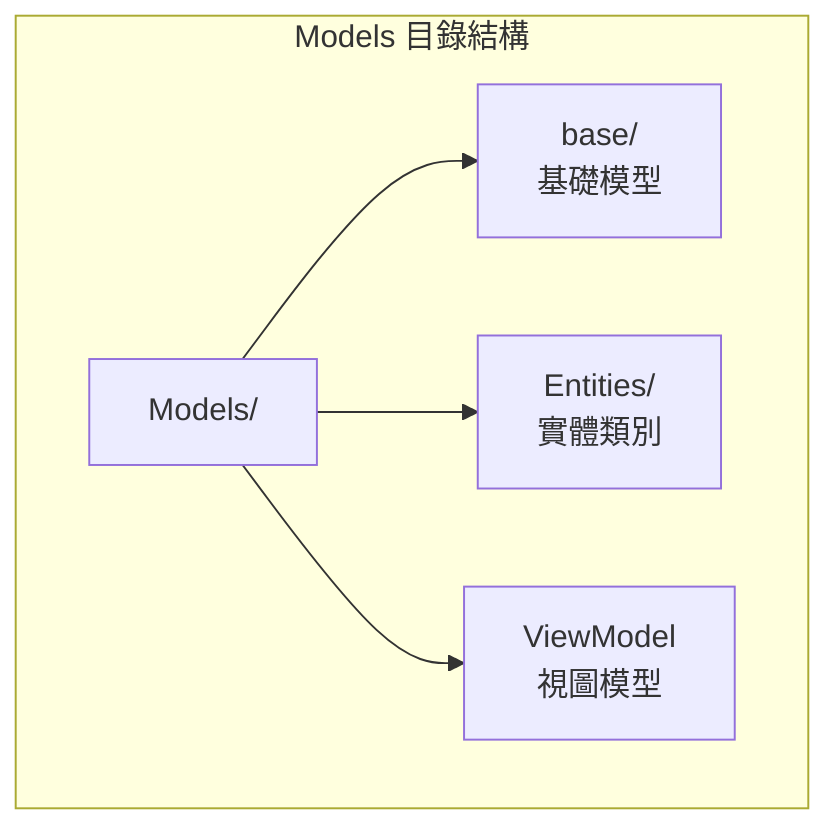

---

## 2. 核心實體類別

### 2.1 使用者相關

#### TblAMDBUSM - 管理者帳號

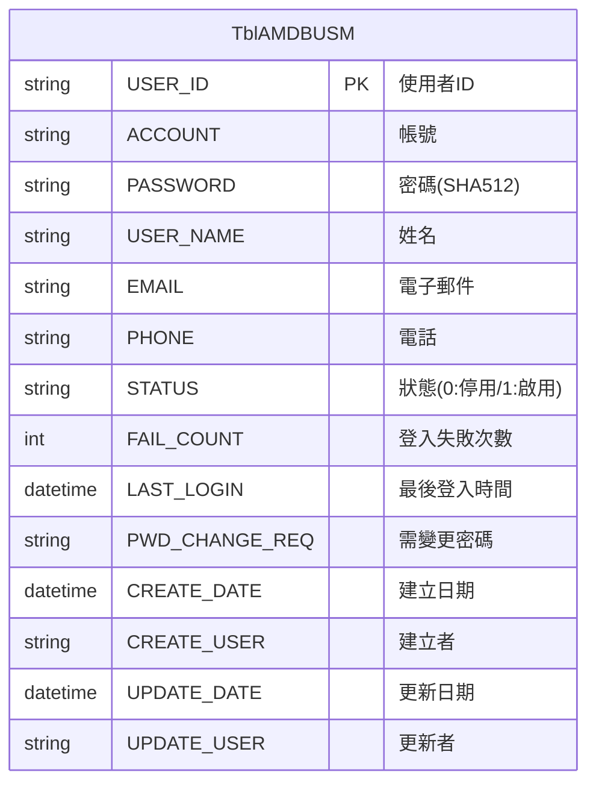

```csharp
// Models/Entities/TblAMDBUSM.cs
public class TblAMDBUSM : IDBRow
{
    [IdentityDBField]
    public string USER_ID { get; set; }
    public string ACCOUNT { get; set; }
    public string PASSWORD { get; set; }
    public string USER_NAME { get; set; }
    public string EMAIL { get; set; }
    public string PHONE { get; set; }
    public string STATUS { get; set; }
    public int? FAIL_COUNT { get; set; }
    public DateTime? LAST_LOGIN { get; set; }
    public string PWD_CHANGE_REQ { get; set; }
    public DateTime? CREATE_DATE { get; set; }
    public string CREATE_USER { get; set; }
    public DateTime? UPDATE_DATE { get; set; }
    public string UPDATE_USER { get; set; }
    
    public string GetTableName()
    {
        return "AMDBUSM";
    }
}
```

#### TblEEC_User - 民眾帳號

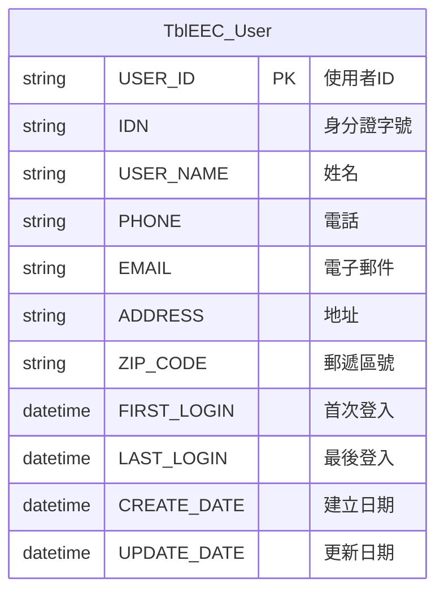

### 2.2 權限相關

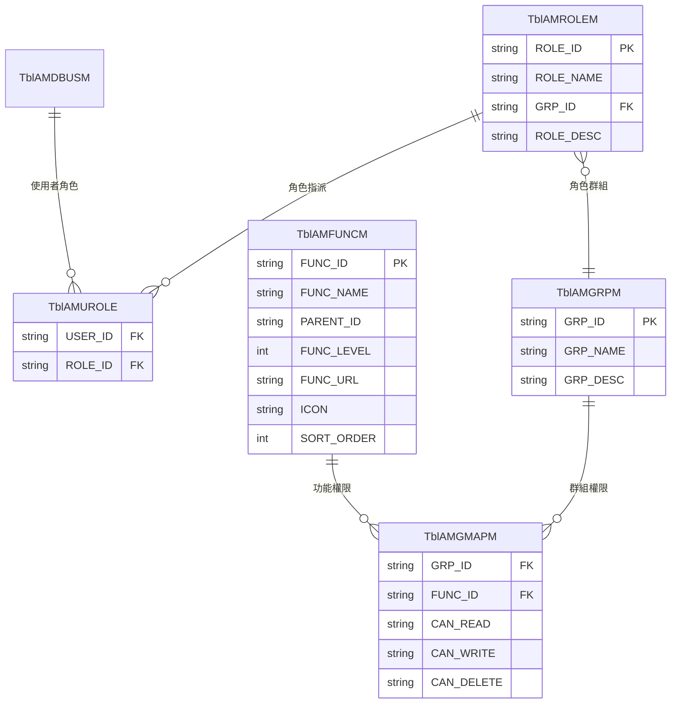

```csharp
// Models/Entities/TblAMFUNCM.cs
public class TblAMFUNCM : IDBRow
{
    public string FUNC_ID { get; set; }
    public string FUNC_NAME { get; set; }
    public string PARENT_ID { get; set; }
    public int? FUNC_LEVEL { get; set; }
    public string FUNC_URL { get; set; }
    public string ICON { get; set; }
    public int? SORT_ORDER { get; set; }
    public string STATUS { get; set; }
    
    public string GetTableName() => "AMFUNCM";
}

// Models/Entities/TblAMGMAPM.cs
public class TblAMGMAPM : IDBRow
{
    public string GRP_ID { get; set; }
    public string FUNC_ID { get; set; }
    public string CAN_READ { get; set; }
    public string CAN_WRITE { get; set; }
    public string CAN_DELETE { get; set; }
    
    public string GetTableName() => "AMGMAPM";
}
```

### 2.3 醫院相關

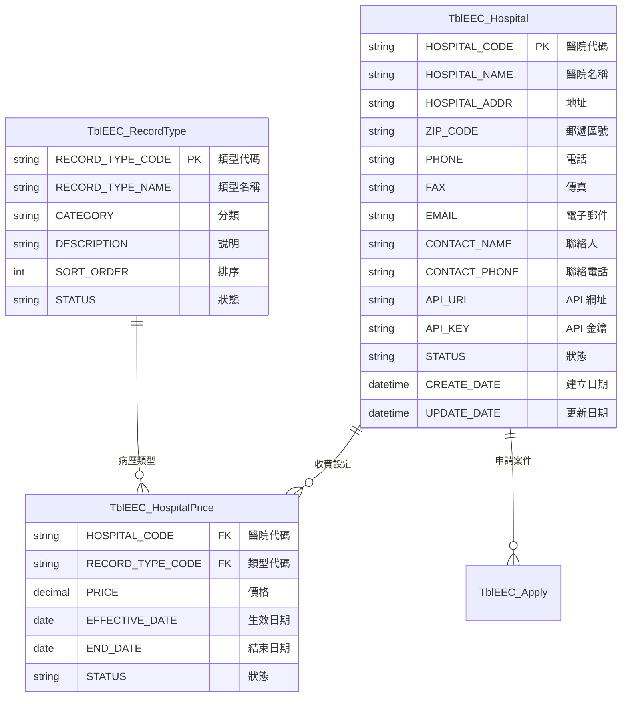

```csharp
// Models/Entities/TblEEC_Hospital.cs
public class TblEEC_Hospital : IDBRow
{
    public string HOSPITAL_CODE { get; set; }
    public string HOSPITAL_NAME { get; set; }
    public string HOSPITAL_ADDR { get; set; }
    public string ZIP_CODE { get; set; }
    public string PHONE { get; set; }
    public string FAX { get; set; }
    public string EMAIL { get; set; }
    public string CONTACT_NAME { get; set; }
    public string CONTACT_PHONE { get; set; }
    public string API_URL { get; set; }
    public string API_KEY { get; set; }
    public string STATUS { get; set; }
    public DateTime? CREATE_DATE { get; set; }
    public string CREATE_USER { get; set; }
    public DateTime? UPDATE_DATE { get; set; }
    public string UPDATE_USER { get; set; }
    
    public string GetTableName() => "EEC_Hospital";
}
```

### 2.4 申請相關

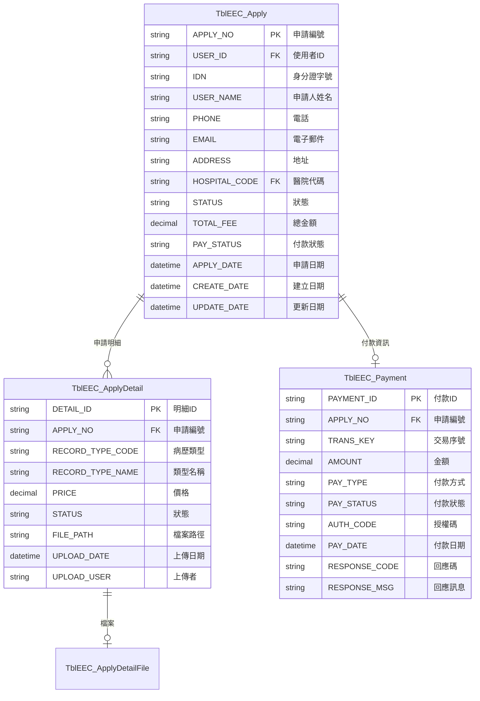

```csharp
// Models/Entities/TblEEC_Apply.cs
public class TblEEC_Apply : IDBRow
{
    [IdentityDBField]
    public string APPLY_NO { get; set; }
    public string USER_ID { get; set; }
    public string IDN { get; set; }
    public string USER_NAME { get; set; }
    public string PHONE { get; set; }
    public string EMAIL { get; set; }
    public string ADDRESS { get; set; }
    public string HOSPITAL_CODE { get; set; }
    public string STATUS { get; set; }
    public decimal? TOTAL_FEE { get; set; }
    public string PAY_STATUS { get; set; }
    public DateTime? APPLY_DATE { get; set; }
    public DateTime? CREATE_DATE { get; set; }
    public DateTime? UPDATE_DATE { get; set; }
    
    public string GetTableName() => "EEC_Apply";
}

// Models/Entities/TblEEC_ApplyDetail.cs
public class TblEEC_ApplyDetail : IDBRow
{
    [IdentityDBField]
    public string DETAIL_ID { get; set; }
    public string APPLY_NO { get; set; }
    public string RECORD_TYPE_CODE { get; set; }
    public string RECORD_TYPE_NAME { get; set; }
    public decimal? PRICE { get; set; }
    public string STATUS { get; set; }
    public string FILE_PATH { get; set; }
    public DateTime? UPLOAD_DATE { get; set; }
    public string UPLOAD_USER { get; set; }
    
    public string GetTableName() => "EEC_ApplyDetail";
}
```

---

## 3. 系統管理實體

### 3.1 公告管理

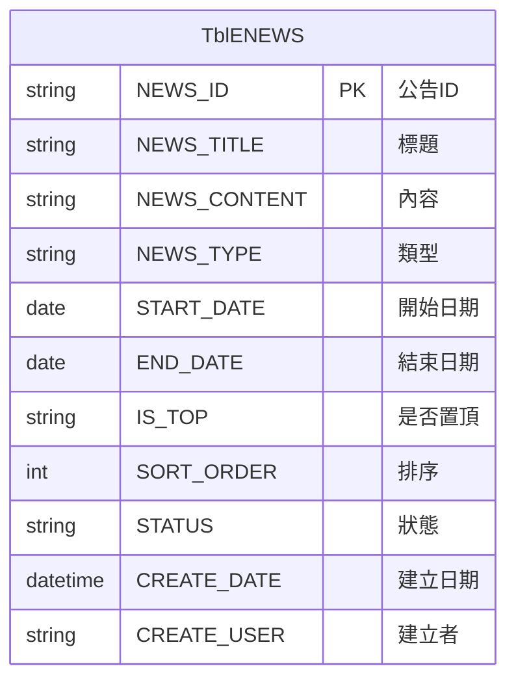

### 3.2 郵遞區號

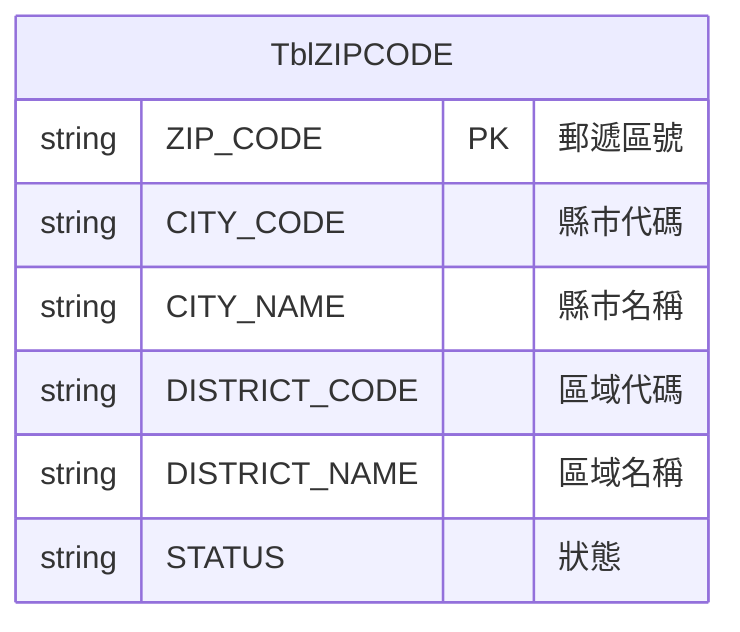

### 3.3 代碼對照

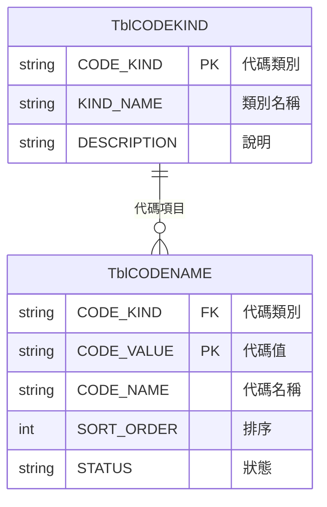

---

## 4. 日誌相關實體

### 4.1 日誌表結構

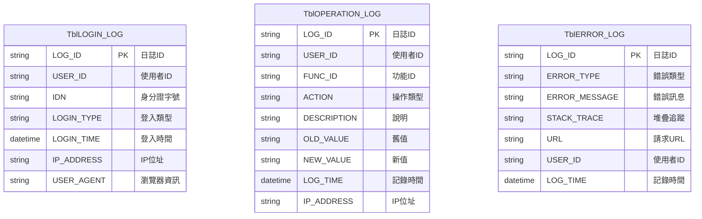

---

## 5. 視圖模型 (ViewModel)

### 5.1 Session 模型

```csharp
// Models/SessionModel.cs
public class SessionModel
{
    public LoginUserInfo LoginUserInfo { get; set; }
    public List<ClamRoleFunc> RoleFuncs { get; set; }
    public string LastActionFunc { get; set; }
    public string ErrorMessage { get; set; }
    public string ResultMessage { get; set; }
}

// Models/LoginUserInfo.cs
public class LoginUserInfo
{
    public string UserID { get; set; }
    public string UserName { get; set; }
    public string Account { get; set; }
    public string IDN { get; set; }
    public string RoleType { get; set; }
    public string HospitalCode { get; set; }
    public string HospitalName { get; set; }
    public DateTime LoginTime { get; set; }
    public string LoginIP { get; set; }
    public string LoginType { get; set; }
}

// Models/ClamRoleFunc.cs
public class ClamRoleFunc
{
    public string FuncID { get; set; }
    public string FuncName { get; set; }
    public string ParentID { get; set; }
    public int FuncLevel { get; set; }
    public string FuncUrl { get; set; }
    public string Icon { get; set; }
    public bool CanRead { get; set; }
    public bool CanWrite { get; set; }
    public bool CanDelete { get; set; }
}
```

### 5.2 查詢表單模型

```csharp
// Models/base/PagingFormModel.cs
public class PagingFormModel
{
    public int PageIndex { get; set; } = 1;
    public int PageSize { get; set; } = 20;
}

// Areas/A1/Models/C101MFormModel.cs
public class C101MFormModel : PagingFormModel
{
    [Display(Name = "醫院代碼")]
    public string HospitalCode { get; set; }
    
    [Display(Name = "醫院名稱")]
    public string HospitalName { get; set; }
    
    [Display(Name = "狀態")]
    public string Status { get; set; }
}

// Areas/A2/Models/ApplyQueryFormModel.cs
public class ApplyQueryFormModel : PagingFormModel
{
    [Display(Name = "申請編號")]
    public string ApplyNo { get; set; }
    
    [Display(Name = "醫院")]
    public string HospitalCode { get; set; }
    
    [Display(Name = "申請日期起")]
    public DateTime? StartDate { get; set; }
    
    [Display(Name = "申請日期迄")]
    public DateTime? EndDate { get; set; }
    
    [Display(Name = "狀態")]
    public string Status { get; set; }
}
```

### 5.3 列表模型

```csharp
// Areas/A1/Models/C101MGridModel.cs
public class C101MGridModel
{
    public string HOSPITAL_CODE { get; set; }
    public string HOSPITAL_NAME { get; set; }
    public string HOSPITAL_ADDR { get; set; }
    public string PHONE { get; set; }
    public string STATUS { get; set; }
    public string STATUS_NAME { get; set; }
    public DateTime? CREATE_DATE { get; set; }
}

// Areas/A2/Models/ApplyGridModel.cs
public class ApplyGridModel
{
    public string APPLY_NO { get; set; }
    public string USER_NAME { get; set; }
    public string IDN { get; set; }
    public string HOSPITAL_NAME { get; set; }
    public DateTime? APPLY_DATE { get; set; }
    public string STATUS { get; set; }
    public string STATUS_NAME { get; set; }
    public decimal? TOTAL_FEE { get; set; }
    public string PAY_STATUS { get; set; }
    public string PAY_STATUS_NAME { get; set; }
}
```

---

## 6. 資料表關聯圖

### 6.1 完整 ER 圖

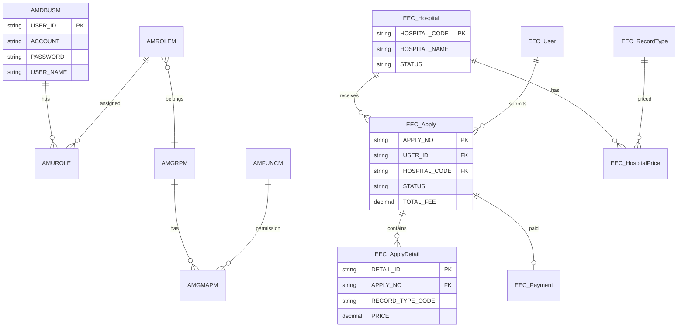

---

## 7. 代碼對照表

### 7.1 申請狀態

| 代碼 | 名稱 | 說明 |
|------|------|------|
| 01 | 待付款 | 申請已提交，等待付款 |
| 02 | 處理中 | 已付款，醫院處理中 |
| 03 | 無法提供 | 醫院無法提供病歷 |
| 04 | 已完成 | 病歷已上傳 |
| 05 | 已下載 | 民眾已下載 |
| 09 | 已取消 | 申請已取消 |

### 7.2 付款狀態

| 代碼 | 名稱 |
|------|------|
| 0 | 未付款 |
| 1 | 已付款 |
| 2 | 付款失敗 |
| 3 | 已退款 |

### 7.3 使用者狀態

| 代碼 | 名稱 |
|------|------|
| 0 | 停用 |
| 1 | 啟用 |
| 2 | 鎖定 |

### 7.4 登入類型

| 代碼 | 名稱 |
|------|------|
| CERT | 自然人憑證 |
| FIDO | 行動自然人憑證 |
| HCA | 健保卡 |
| PWD | 帳號密碼 |

---

## 8. 實體類別介面

### 8.1 IDBRow 介面

```csharp
// Models/base/IDBRow.cs
public interface IDBRow
{
    /// <summary>
    /// 取得資料表名稱
    /// </summary>
    string GetTableName();
}
```

### 8.2 IdentityDBField 屬性

```csharp
// Models/base/IdentityDBFieldAttribute.cs
[AttributeUsage(AttributeTargets.Property)]
public class IdentityDBFieldAttribute : Attribute
{
    /// <summary>
    /// 標示此欄位為識別欄位（主鍵/自動編號）
    /// </summary>
}
```

---

## 9. 命名規範

### 9.1 資料表命名

| 前綴 | 用途 | 範例 |
|------|------|------|
| AM | 管理模組 | AMDBUSM, AMROLEM |
| EEC_ | 電子病歷 | EEC_Hospital, EEC_Apply |
| LOG_ | 日誌表 | LOGIN_LOG, ERROR_LOG |
| CODE | 代碼表 | CODEKIND, CODENAME |

### 9.2 欄位命名

| 後綴 | 用途 | 範例 |
|------|------|------|
| _ID | 主鍵/外鍵 | USER_ID, APPLY_NO |
| _CODE | 代碼 | HOSPITAL_CODE |
| _NAME | 名稱 | USER_NAME |
| _DATE | 日期 | CREATE_DATE |
| _USER | 操作者 | CREATE_USER |
| _STATUS | 狀態 | PAY_STATUS |

---

本文件說明 EECOnline 系統的資料模型設計，包含核心實體類別、資料表結構、關聯關係及代碼對照表。
