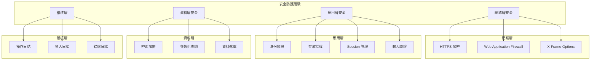
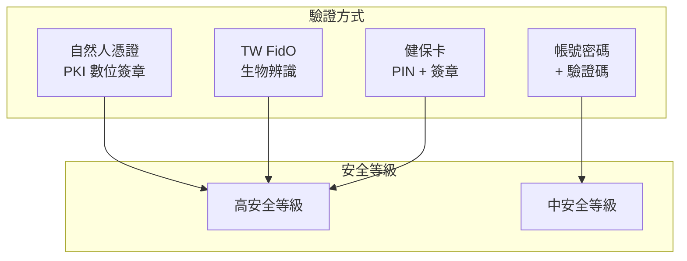
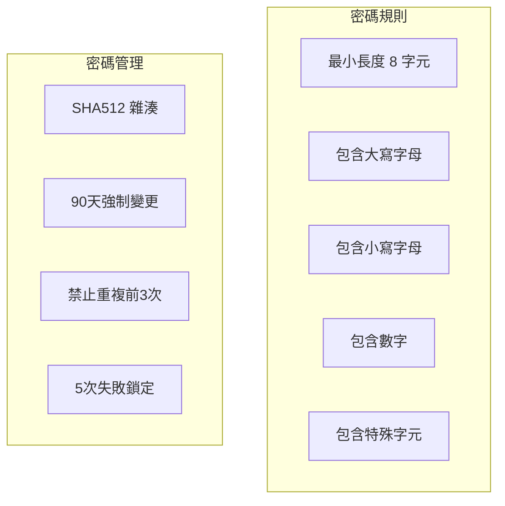
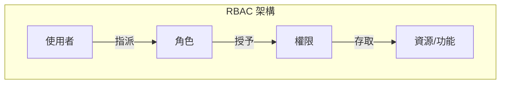
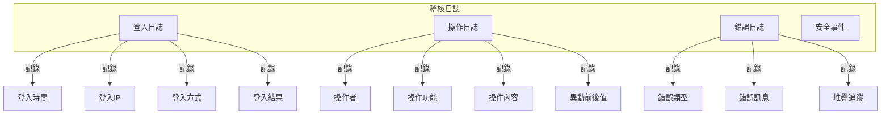

# EECOnline 安全機制

## 1. 概述

本文件說明 EECOnline 系統的安全設計與防護機制，涵蓋身份驗證、授權控制、資料保護、日誌稽核等面向。

### 1.1 安全架構總覽



---

## 2. 身份驗證安全

### 2.1 多因素驗證



### 2.2 密碼安全政策



#### 密碼驗證實作

```csharp
// Commons/MyCheckUtil.cs
public class MyCheckUtil
{
    /// <summary>
    /// 驗證密碼強度
    /// </summary>
    public static PasswordValidationResult ValidatePassword(string password)
    {
        var result = new PasswordValidationResult { IsValid = true };
        var errors = new List<string>();
        
        // 最小長度
        if (string.IsNullOrEmpty(password) || password.Length < 8)
        {
            errors.Add("密碼長度至少需要 8 個字元");
        }
        
        // 大寫字母
        if (!Regex.IsMatch(password, "[A-Z]"))
        {
            errors.Add("密碼需包含至少一個大寫字母");
        }
        
        // 小寫字母
        if (!Regex.IsMatch(password, "[a-z]"))
        {
            errors.Add("密碼需包含至少一個小寫字母");
        }
        
        // 數字
        if (!Regex.IsMatch(password, "[0-9]"))
        {
            errors.Add("密碼需包含至少一個數字");
        }
        
        // 特殊字元
        if (!Regex.IsMatch(password, @"[!@#$%^&*(),.?"":{}|<>]"))
        {
            errors.Add("密碼需包含至少一個特殊字元");
        }
        
        if (errors.Any())
        {
            result.IsValid = false;
            result.Errors = errors;
        }
        
        return result;
    }
    
    /// <summary>
    /// 檢查密碼歷史
    /// </summary>
    public static bool CheckPasswordHistory(string userId, string newPassword, 
                                             int historyCount = 3)
    {
        var dao = new LoginDAO();
        var history = dao.GetPasswordHistory(userId, historyCount);
        var hashedNew = CommonsServices.HashSHA512(newPassword);
        
        return !history.Any(h => h.PASSWORD_HASH == hashedNew);
    }
}

// Services/CommonsServices.cs
public static class CommonsServices
{
    /// <summary>
    /// SHA512 密碼雜湊
    /// </summary>
    public static string HashSHA512(string input)
    {
        if (string.IsNullOrEmpty(input))
            return string.Empty;
            
        using (var sha512 = SHA512.Create())
        {
            var inputBytes = Encoding.UTF8.GetBytes(input);
            var hashBytes = sha512.ComputeHash(inputBytes);
            
            var sb = new StringBuilder();
            foreach (var b in hashBytes)
            {
                sb.Append(b.ToString("x2"));
            }
            return sb.ToString();
        }
    }
}
```

### 2.3 帳號鎖定機制

```csharp
// Areas/Login/Controllers/C101MController.cs
private ActionResult ProcessLogin(string account, string password)
{
    var user = _loginDAO.QueryUserByAccount(account);
    
    // 檢查帳號是否存在
    if (user == null)
    {
        // 不透露帳號是否存在
        return Json(new { success = false, message = "帳號或密碼錯誤" });
    }
    
    // 檢查帳號狀態
    if (user.STATUS == "2")  // 鎖定
    {
        return Json(new { success = false, message = "帳號已鎖定，請聯繫管理員" });
    }
    
    if (user.STATUS == "0")  // 停用
    {
        return Json(new { success = false, message = "帳號已停用" });
    }
    
    // 驗證密碼
    var hashedPassword = CommonsServices.HashSHA512(password);
    if (user.PASSWORD != hashedPassword)
    {
        // 增加失敗次數
        var failCount = (user.FAIL_COUNT ?? 0) + 1;
        _loginDAO.UpdateFailCount(user.USER_ID, failCount);
        
        // 檢查是否達到鎖定門檻
        if (failCount >= 5)
        {
            _loginDAO.LockAccount(user.USER_ID);
            
            // 記錄安全事件
            LogSecurityEvent(user.USER_ID, "ACCOUNT_LOCKED", 
                "登入失敗次數超過限制，帳號已鎖定");
            
            return Json(new { success = false, message = "帳號已鎖定，請聯繫管理員" });
        }
        
        return Json(new { 
            success = false, 
            message = $"帳號或密碼錯誤，剩餘 {5 - failCount} 次嘗試機會" 
        });
    }
    
    // 登入成功，重設失敗次數
    _loginDAO.ResetFailCount(user.USER_ID);
    
    // 檢查是否需要變更密碼
    if (user.PWD_CHANGE_REQ == "1")
    {
        return Json(new { 
            success = true, 
            requirePasswordChange = true,
            redirectUrl = "/Login/C101M/ChangePassword"
        });
    }
    
    // 建立 Session
    CreateSession(user);
    
    return Json(new { success = true, redirectUrl = "/Login/C102M" });
}
```

---

## 3. 授權控制

### 3.1 角色基礎存取控制 (RBAC)



### 3.2 權限檢查實作

```csharp
// Commons/Filter/LoginRequired.cs
public class LoginRequired : ActionFilterAttribute
{
    public override void OnActionExecuting(ActionExecutingContext filterContext)
    {
        // 1. 檢查是否略過授權
        if (HasBypassAttribute(filterContext))
        {
            base.OnActionExecuting(filterContext);
            return;
        }
        
        // 2. 檢查 Session
        var session = GetSessionModel(filterContext);
        if (session == null || session.LoginUserInfo == null)
        {
            HandleUnauthorized(filterContext, "未登入");
            return;
        }
        
        // 3. 檢查 Session 是否過期
        if (IsSessionExpired(session))
        {
            HandleUnauthorized(filterContext, "Session 已過期");
            return;
        }
        
        // 4. 取得目前請求的功能
        var funcId = GetCurrentFuncId(filterContext);
        
        // 5. 檢查功能權限
        var func = session.RoleFuncs.FirstOrDefault(f => f.FuncID == funcId);
        if (func == null)
        {
            HandleForbidden(filterContext, "無權限存取此功能");
            return;
        }
        
        // 6. 檢查操作權限
        var actionName = filterContext.ActionDescriptor.ActionName;
        if (!CheckActionPermission(func, actionName))
        {
            HandleForbidden(filterContext, "無權限執行此操作");
            return;
        }
        
        // 7. 更新最後操作時間
        UpdateLastActivity(filterContext);
        
        base.OnActionExecuting(filterContext);
    }
    
    private bool CheckActionPermission(ClamRoleFunc func, string actionName)
    {
        // 判斷操作類型
        if (IsReadAction(actionName))
            return func.CanRead;
        if (IsWriteAction(actionName))
            return func.CanWrite;
        if (IsDeleteAction(actionName))
            return func.CanDelete;
            
        return func.CanRead;  // 預設需要讀取權限
    }
    
    private bool IsReadAction(string action)
    {
        var readActions = new[] { "Index", "Query", "Detail", "Get", "List", "View" };
        return readActions.Any(a => action.StartsWith(a, StringComparison.OrdinalIgnoreCase));
    }
    
    private bool IsWriteAction(string action)
    {
        var writeActions = new[] { "New", "Create", "Add", "Save", "Update", "Modify", "Edit" };
        return writeActions.Any(a => action.StartsWith(a, StringComparison.OrdinalIgnoreCase));
    }
    
    private bool IsDeleteAction(string action)
    {
        var deleteActions = new[] { "Delete", "Remove" };
        return deleteActions.Any(a => action.StartsWith(a, StringComparison.OrdinalIgnoreCase));
    }
}
```

---

## 4. Session 安全

### 4.1 Session 設定

```xml
<!-- Web.config -->
<system.web>
    <!-- Session 設定 -->
    <sessionState 
        mode="InProc" 
        timeout="60"
        cookieless="false"
        regenerateExpiredSessionId="true">
    </sessionState>
    
    <!-- Cookie 安全設定 -->
    <httpCookies 
        httpOnlyCookies="true" 
        requireSSL="true"
        sameSite="Strict">
    </httpCookies>
</system.web>
```

### 4.2 Session 管理

```csharp
// 建立 Session
public void CreateSession(TblAMDBUSM user)
{
    // 產生新的 Session ID
    SessionIDManager manager = new SessionIDManager();
    string newSessionId = manager.CreateSessionID(HttpContext.Current);
    
    // 建立 Session Model
    var sessionModel = new SessionModel
    {
        LoginUserInfo = new LoginUserInfo
        {
            UserID = user.USER_ID,
            UserName = user.USER_NAME,
            Account = user.ACCOUNT,
            LoginTime = DateTime.Now,
            LoginIP = GetClientIP()
        },
        RoleFuncs = GetUserFunctions(user.USER_ID)
    };
    
    // 儲存 Session
    Session["SessionModel"] = JsonConvert.SerializeObject(sessionModel);
    Session["SessionCreateTime"] = DateTime.Now;
    Session["LastActivityTime"] = DateTime.Now;
}

// 驗證 Session
public bool ValidateSession()
{
    var sessionJson = Session["SessionModel"] as string;
    if (string.IsNullOrEmpty(sessionJson))
        return false;
    
    var createTime = Session["SessionCreateTime"] as DateTime?;
    var lastActivity = Session["LastActivityTime"] as DateTime?;
    
    // 檢查 Session 是否過期（60分鐘無操作）
    if (lastActivity.HasValue && 
        (DateTime.Now - lastActivity.Value).TotalMinutes > 60)
    {
        ClearSession();
        return false;
    }
    
    // 檢查 Session 最長存活時間（8小時）
    if (createTime.HasValue && 
        (DateTime.Now - createTime.Value).TotalHours > 8)
    {
        ClearSession();
        return false;
    }
    
    return true;
}

// 清除 Session
public void ClearSession()
{
    Session.Clear();
    Session.Abandon();
    
    // 清除認證 Cookie
    if (Request.Cookies["ASP.NET_SessionId"] != null)
    {
        var cookie = new HttpCookie("ASP.NET_SessionId")
        {
            Expires = DateTime.Now.AddDays(-1)
        };
        Response.Cookies.Add(cookie);
    }
}
```

---

## 5. 輸入驗證

### 5.1 防止 SQL Injection

```csharp
// 使用參數化查詢 (iBATIS)
// SqlMaps/A1.xml
<select id="queryHospital" parameterClass="C101MFormModel">
    SELECT * FROM EEC_Hospital
    WHERE 1=1
    <!-- 使用 # 符號進行參數化，防止 SQL Injection -->
    <isNotEmpty property="HospitalCode">
        AND HOSPITAL_CODE = #HospitalCode#
    </isNotEmpty>
    <isNotEmpty property="HospitalName">
        AND HOSPITAL_NAME LIKE '%' + #HospitalName# + '%'
    </isNotEmpty>
</select>

// 使用 Dapper 參數化查詢
public IEnumerable<Hospital> QueryHospitals(string code, string name)
{
    using (var conn = new SqlConnection(_connectionString))
    {
        var sql = @"
            SELECT * FROM EEC_Hospital
            WHERE (@Code IS NULL OR HOSPITAL_CODE = @Code)
            AND (@Name IS NULL OR HOSPITAL_NAME LIKE '%' + @Name + '%')";
            
        return conn.Query<Hospital>(sql, new { Code = code, Name = name });
    }
}
```

### 5.2 防止 XSS 攻擊

```csharp
// 輸入編碼
public static string SanitizeInput(string input)
{
    if (string.IsNullOrEmpty(input))
        return input;
    
    // HTML 編碼
    return HttpUtility.HtmlEncode(input);
}

// 輸出編碼 (Razor View 預設會編碼)
@Html.Raw(Model.SafeHtml)     // 不編碼，只用於可信任內容
@Model.UserInput              // 自動編碼

// 使用 AntiXSS 程式庫
using Microsoft.Security.Application;

public static string GetSafeHtml(string input)
{
    return Encoder.HtmlEncode(input);
}

public static string GetSafeJavaScript(string input)
{
    return Encoder.JavaScriptEncode(input);
}
```

### 5.3 防止 CSRF 攻擊

```html
<!-- View 中加入 Anti-Forgery Token -->
@using (Html.BeginForm("Save", "C101M", FormMethod.Post))
{
    @Html.AntiForgeryToken()
    
    <!-- 表單內容 -->
}
```

```csharp
// Controller 驗證 Token
[HttpPost]
[ValidateAntiForgeryToken]
public ActionResult Save(HospitalModel model)
{
    // 處理儲存
}
```

---

## 6. 資料保護

### 6.1 敏感資料遮罩

```csharp
// Services/CommonsServices.cs
public static class CommonsServices
{
    /// <summary>
    /// 遮罩身分證字號
    /// A123456789 -> A12****789
    /// </summary>
    public static string MaskIDN(string idn)
    {
        if (string.IsNullOrEmpty(idn) || idn.Length != 10)
            return idn;
        
        return idn.Substring(0, 3) + "****" + idn.Substring(7);
    }
    
    /// <summary>
    /// 遮罩姓名
    /// 王小明 -> 王○明
    /// </summary>
    public static string MaskName(string name)
    {
        if (string.IsNullOrEmpty(name))
            return name;
        
        if (name.Length == 2)
            return name[0] + "○";
        if (name.Length >= 3)
            return name[0] + new string('○', name.Length - 2) + name[name.Length - 1];
        
        return name;
    }
    
    /// <summary>
    /// 遮罩電話
    /// 0912345678 -> 0912***678
    /// </summary>
    public static string MaskPhone(string phone)
    {
        if (string.IsNullOrEmpty(phone) || phone.Length < 7)
            return phone;
        
        return phone.Substring(0, 4) + "***" + phone.Substring(phone.Length - 3);
    }
    
    /// <summary>
    /// 遮罩 Email
    /// test@example.com -> t***@example.com
    /// </summary>
    public static string MaskEmail(string email)
    {
        if (string.IsNullOrEmpty(email) || !email.Contains("@"))
            return email;
        
        var parts = email.Split('@');
        var local = parts[0];
        var domain = parts[1];
        
        if (local.Length <= 1)
            return email;
        
        return local[0] + new string('*', Math.Min(local.Length - 1, 3)) + "@" + domain;
    }
}
```

### 6.2 傳輸加密

```xml
<!-- Web.config - 強制 HTTPS -->
<system.webServer>
    <rewrite>
        <rules>
            <rule name="HTTP to HTTPS redirect" stopProcessing="true">
                <match url="(.*)" />
                <conditions>
                    <add input="{HTTPS}" pattern="off" ignoreCase="true" />
                </conditions>
                <action type="Redirect" url="https://{HTTP_HOST}/{R:1}" 
                        redirectType="Permanent" />
            </rule>
        </rules>
    </rewrite>
</system.webServer>

<!-- 安全標頭設定 -->
<system.webServer>
    <httpProtocol>
        <customHeaders>
            <add name="X-Frame-Options" value="SAMEORIGIN" />
            <add name="X-Content-Type-Options" value="nosniff" />
            <add name="X-XSS-Protection" value="1; mode=block" />
            <add name="Strict-Transport-Security" 
                 value="max-age=31536000; includeSubDomains" />
            <add name="Content-Security-Policy" 
                 value="default-src 'self'; script-src 'self' 'unsafe-inline'" />
        </customHeaders>
    </httpProtocol>
</system.webServer>
```

---

## 7. 稽核日誌

### 7.1 日誌類型



### 7.2 日誌記錄實作

```csharp
// Utils/LogUtils.cs
public class LogUtils
{
    private static readonly ILog _log = LogManager.GetLogger(typeof(LogUtils));
    
    public static void Info(string message)
    {
        _log.Info(message);
    }
    
    public static void Warn(string message)
    {
        _log.Warn(message);
    }
    
    public static void Error(string message, Exception ex = null)
    {
        if (ex != null)
            _log.Error(message, ex);
        else
            _log.Error(message);
    }
    
    /// <summary>
    /// 記錄操作日誌
    /// </summary>
    public static void LogOperation(string userId, string funcId, string action,
                                     string description, string oldValue = null, 
                                     string newValue = null)
    {
        try
        {
            var dao = new TransLogDAO();
            dao.InsertOperationLog(new OperationLog
            {
                USER_ID = userId,
                FUNC_ID = funcId,
                ACTION = action,
                DESCRIPTION = description,
                OLD_VALUE = oldValue,
                NEW_VALUE = newValue,
                LOG_TIME = DateTime.Now,
                IP_ADDRESS = GetClientIP()
            });
        }
        catch (Exception ex)
        {
            _log.Error("Failed to log operation", ex);
        }
    }
    
    /// <summary>
    /// 記錄安全事件
    /// </summary>
    public static void LogSecurityEvent(string userId, string eventType, 
                                         string description)
    {
        try
        {
            var dao = new TransLogDAO();
            dao.InsertSecurityLog(new SecurityLog
            {
                USER_ID = userId,
                EVENT_TYPE = eventType,
                DESCRIPTION = description,
                LOG_TIME = DateTime.Now,
                IP_ADDRESS = GetClientIP()
            });
            
            // 嚴重安全事件發送告警
            if (IsCriticalEvent(eventType))
            {
                SendSecurityAlert(userId, eventType, description);
            }
        }
        catch (Exception ex)
        {
            _log.Error("Failed to log security event", ex);
        }
    }
}

// log4net 設定
// log4net.config
<log4net>
    <appender name="RollingFileAppender" type="log4net.Appender.RollingFileAppender">
        <file value="Logs/app.log" />
        <appendToFile value="true" />
        <rollingStyle value="Date" />
        <datePattern value="yyyyMMdd" />
        <maxSizeRollBackups value="30" />
        <layout type="log4net.Layout.PatternLayout">
            <conversionPattern value="%date [%thread] %-5level %logger - %message%newline" />
        </layout>
    </appender>
    
    <appender name="SecurityAppender" type="log4net.Appender.RollingFileAppender">
        <file value="Logs/security.log" />
        <appendToFile value="true" />
        <rollingStyle value="Date" />
        <datePattern value="yyyyMMdd" />
        <layout type="log4net.Layout.PatternLayout">
            <conversionPattern value="%date [%thread] %level - %message%newline" />
        </layout>
    </appender>
    
    <root>
        <level value="INFO" />
        <appender-ref ref="RollingFileAppender" />
    </root>
    
    <logger name="SecurityLogger">
        <level value="INFO" />
        <appender-ref ref="SecurityAppender" />
    </logger>
</log4net>
```

---

## 8. 檔案上傳安全

### 8.1 檔案類型驗證

```csharp
public class FileUploadHelper
{
    // 允許的檔案類型
    private static readonly Dictionary<string, string[]> AllowedTypes = 
        new Dictionary<string, string[]>
    {
        { "document", new[] { ".pdf", ".doc", ".docx", ".xls", ".xlsx" } },
        { "image", new[] { ".jpg", ".jpeg", ".png", ".gif" } },
        { "medical", new[] { ".xml", ".pdf" } }
    };
    
    // 檔案簽章 (Magic Numbers)
    private static readonly Dictionary<string, byte[]> FileSignatures = 
        new Dictionary<string, byte[]>
    {
        { ".pdf", new byte[] { 0x25, 0x50, 0x44, 0x46 } },  // %PDF
        { ".jpg", new byte[] { 0xFF, 0xD8, 0xFF } },
        { ".png", new byte[] { 0x89, 0x50, 0x4E, 0x47 } },
        { ".xml", new byte[] { 0x3C, 0x3F, 0x78, 0x6D, 0x6C } }  // <?xml
    };
    
    /// <summary>
    /// 驗證檔案
    /// </summary>
    public static FileValidationResult ValidateFile(HttpPostedFileBase file, 
                                                     string category)
    {
        var result = new FileValidationResult { IsValid = true };
        
        // 1. 檢查檔案是否存在
        if (file == null || file.ContentLength == 0)
        {
            result.IsValid = false;
            result.ErrorMessage = "請選擇檔案";
            return result;
        }
        
        // 2. 檢查檔案大小 (最大 10MB)
        if (file.ContentLength > 10 * 1024 * 1024)
        {
            result.IsValid = false;
            result.ErrorMessage = "檔案大小不可超過 10MB";
            return result;
        }
        
        // 3. 檢查副檔名
        var extension = Path.GetExtension(file.FileName).ToLower();
        if (!AllowedTypes.ContainsKey(category) || 
            !AllowedTypes[category].Contains(extension))
        {
            result.IsValid = false;
            result.ErrorMessage = "不允許的檔案類型";
            return result;
        }
        
        // 4. 驗證檔案簽章
        if (!ValidateFileSignature(file, extension))
        {
            result.IsValid = false;
            result.ErrorMessage = "檔案格式不正確";
            return result;
        }
        
        // 5. 掃描惡意程式（如有防毒 API）
        // if (!ScanForMalware(file)) { ... }
        
        return result;
    }
    
    /// <summary>
    /// 驗證檔案簽章
    /// </summary>
    private static bool ValidateFileSignature(HttpPostedFileBase file, 
                                               string extension)
    {
        if (!FileSignatures.ContainsKey(extension))
            return true;  // 無簽章定義，略過檢查
        
        var signature = FileSignatures[extension];
        var buffer = new byte[signature.Length];
        
        file.InputStream.Read(buffer, 0, signature.Length);
        file.InputStream.Position = 0;  // 重設位置
        
        return buffer.SequenceEqual(signature);
    }
    
    /// <summary>
    /// 產生安全的檔案名稱
    /// </summary>
    public static string GenerateSafeFileName(string originalName)
    {
        // 移除路徑資訊
        var fileName = Path.GetFileName(originalName);
        
        // 只保留安全字元
        var safeChars = fileName.Where(c => char.IsLetterOrDigit(c) || c == '.' || c == '_');
        var safeName = new string(safeChars.ToArray());
        
        // 加上時間戳記避免覆蓋
        var timestamp = DateTime.Now.ToString("yyyyMMddHHmmss");
        var extension = Path.GetExtension(safeName);
        var nameWithoutExt = Path.GetFileNameWithoutExtension(safeName);
        
        return $"{nameWithoutExt}_{timestamp}{extension}";
    }
}
```

---

## 9. 安全設定檢查清單

### 9.1 部署安全檢查

| 項目 | 說明 | 狀態 |
|------|------|------|
| HTTPS | 強制使用 HTTPS | ☐ |
| 安全標頭 | X-Frame-Options, CSP 等 | ☐ |
| 錯誤頁面 | 自訂錯誤頁面，不洩漏細節 | ☐ |
| Debug 模式 | 關閉 Debug 模式 | ☐ |
| 追蹤功能 | 關閉 Trace | ☐ |
| 檔案權限 | 限制上傳目錄執行權限 | ☐ |

### 9.2 應用程式安全檢查

| 項目 | 說明 | 狀態 |
|------|------|------|
| 參數化查詢 | 所有 SQL 使用參數化 | ☐ |
| 輸入驗證 | 驗證所有使用者輸入 | ☐ |
| 輸出編碼 | HTML/JS/URL 編碼輸出 | ☐ |
| CSRF 防護 | 表單使用 Anti-Forgery Token | ☐ |
| Session 管理 | 適當的逾時與清除機制 | ☐ |
| 密碼安全 | SHA512 雜湊、強密碼政策 | ☐ |
| 日誌記錄 | 完整的稽核日誌 | ☐ |

---

本文件說明 EECOnline 系統的安全機制設計，包含身份驗證、授權控制、Session 管理、輸入驗證、資料保護及稽核日誌等安全防護措施。
